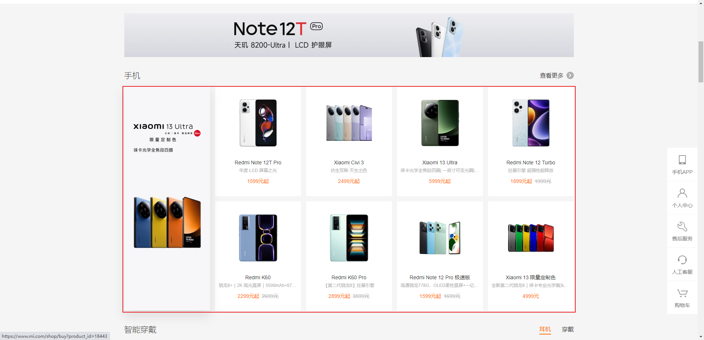

# 第一章：HTML 结构分析（⭐）

## 1.1 HTML 结构的组成

* 一个完整的 HTML 结构包含如下的几个部分：
  * ① `文档声明`。
  * ② `html 元素`：
    * head 元素。
    * body 元素。


* 示例：

```html
<!DOCTYPE html>
<html lang="en">
<head>
  <meta charset="UTF-8">
  <meta content="IE=edge" http-equiv="X-UA-Compatible">
  <meta content="width=device-width, initial-scale=1.0" name="viewport">
  <title>Title</title>
</head>
<body>
  <h1>HTML的结构</h1>
</body>
</html>
```

## 1.2 文档声明

* HTML 最上方的一段文本我们称之为`文档类型声明`，用于`声明文档类型`。

```html
<!DOCTYPE html>
```

* 文档声明的作用：
  * ① 告诉浏览器当前页面是 `HTML5 页面`。
  * ② 让浏览器用 `HTML5 的标准去解析识别` 内容。
  * ③ 必须`放在 HTML 文档的最前面，不能省略`，省略可能会出现兼容性问题。

* HTML 5 的文档声明要比 HTML 4.01 或 XHTML 1.0 简洁很多（不要记）。

```html
<!DOCTYPE HTML PUBLIC "-//W3C//DTD HTML 4.01//EN" "http://www.w3.org/TR/html4/strict.dtd">
```

```html
<!DOCTYPE html PUBLIC "-//W3C//DTD XHTML 1.0 Strict//EN" "http://www.w3.org/TR/xhtml1/DTD/xhtml1-strict.dtd">
<html xmlns="http://www.w3.org/1999/xhtml" xml:lang="en">
```

## 1.3 html 元素

* `<html>`元素是一个 HTML 文档的`根`元素（顶级元素），所以它也被称为`根元素`；换言之，其它的元素必须是 `html` 元素的后代。

```html
<html lang="en">
<head>
  <meta charset="UTF-8">
  <meta content="IE=edge" http-equiv="X-UA-Compatible">
  <meta content="width=device-width, initial-scale=1.0" name="viewport">
  <title>Title</title>
</head>
<body>
    ...
</body>
</html>
```

* W3C 标准建议为 html 元素增加一个 `lang` 属性，作用如下：
  * ① 帮助`语音合成工具`确定要使用的发音。
  * ② 帮助`翻译工具`确定要翻译的翻译规则。

* 常用的规则：
  * `lang="en"`，表示这个 HTML 文档的语言是英文。
  * `lang="zh-CN"`，表示这个 HTML 文档的语言是中文。

## 1.4 head 元素

* `<head>`元素规定了 HTML 文档相关的`配置信息`（`元数据`），包括`文档的标题`、`引用的文档样式`和`脚本`等。

> ps：我们可以理解 `<head>`元素配置的信息就是对`整个页面的配置`。

* 常见的设置如下：

```html
<!DOCTYPE html>
<html lang="en">
<head>
  <!-- meta 网页的元数据 -->
  <!-- 网页的编码 -->
  <meta charset="UTF-8">
  <!-- 兼容 edge -->
  <meta content="IE=edge" http-equiv="X-UA-Compatible">
  <!-- 视口 -->
  <meta content="width=device-width, initial-scale=1.0" name="viewport">
  <!-- 网页的标题 -->
  <title>Title</title>
</head>
<body>
    ...
</body>
</html>
```

## 1.5 body 元素

* `<body>`元素里面的内容就是`我们在浏览器窗口中看到的内容`，也就是`网页的具体结构和内容`；换言之，我们之后学习的`大部分 HTML 元素都需要在 body 元素中编写`。

```html
<!DOCTYPE html>
<html lang="en">
<head>
  <meta charset="UTF-8">
  <meta content="IE=edge" http-equiv="X-UA-Compatible">
  <meta content="width=device-width, initial-scale=1.0" name="viewport">
  <title>Title</title>
</head>
<body>
  <input type="text">
  <ul>
    <li>苹果</li>
    <li>香蕉</li>
    <li>梨</li>
  </ul>
</body>
</html>
```

## 1.6 HTML 元素

* HTML 元素本来有很多，但是常用的就那么几个；所以，我们只需要记住[常用](https://developer.mozilla.org/zh-CN/docs/Web/HTML/Element)的即可。
* 常用的元素：
  * p 元素、h 系列元素。
  * img 元素、a 元素、iframe 元素。
  * div 元素、span 元素。
  * ……
* 后面会学习的元素：
  * ul 元素、ol 元素、li 元素。
  * dl 元素、dt 元素、dd 元素。
  * button 元素、input 元素。
  * table 元素、thead 元素、tbody 元素、th 元素、tr 元素、td 元素。
  * ……
* HTML5 新增元素（后续学习）。


# 第二章：h1~h6 、p 元素（⭐）

## 2.1 h1 ~ h6 系列元素

* 在一个页面中通常会有一些`比较重要的文字`作为标题，这个时候我们就可以使用`h`系列元素。
* `h1 ~ h6` 标题（Heading）元素呈现了六个不同级别标题。
  * Heading 是头部的意思，通常会用来做标题。
  * `h1` 的级别最高，`h6` 的级别最低。

> PS：h 系列元素通常和 SEO 优化有关。


* 示例：

```html
<!DOCTYPE html>
<html lang="en">
<head>
  <meta charset="UTF-8">
  <meta content="IE=edge" http-equiv="X-UA-Compatible">
  <meta content="width=device-width, initial-scale=1.0" name="viewport">
  <title>Title</title>
</head>
<body>
  <h1>一级标题</h1>
  <h2>二级标题</h2>
  <h3>三级标题</h3>
  <h4>四级标题</h4>
  <h5>五级标题</h5>
  <h6>六级标题</h6>
</body>
</html>
```

## 2.2 p 元素

* 如果我们想表示一个`段落`，就可以使用`p`元素。
* `<p>`元素表示的时文本中的一个段落。
  * `p元素`是 paragraph 单词的缩写，是`段落、分段`的意思。
  * `p元素`表示的多个段落之间有一定的间距。


* 示例：

```html
<!DOCTYPE html>
<html lang="en">
<head>
  <meta charset="UTF-8">
  <meta content="IE=edge" http-equiv="X-UA-Compatible">
  <meta content="width=device-width, initial-scale=1.0" name="viewport">
  <title>Title</title>
</head>
<body>

  <p>
    这是第一个段落。这是第一个段落。
    这是第一个段落。这是第一个段落。
  </p>
  <p>
    这是第二个段落。这是第二个段落。
    这是第二个段落。这是第二个段落。
  </p>

</body>
</html>
```


# 第三章：img、a、iframe 元素（⭐）

## 3.1 img 元素

* 如果我们想让浏览器`显示一张图片`，就需要使用 `img` 元素。
* ``元素可以`将一张图片嵌入 HTML 文档`：
  * img 是 image 的缩写，是图片或图像的意思。
  * 实际上，`img` 是一个`可替换元素`（replaced element）

* img 元素的常用属性：

| 属性 | 说明                                                         |
| ---- | ------------------------------------------------------------ |
| src  | 【必须】嵌入图片的文件路径，可以是相对路径，也可以是绝对路径。 |
| alt  | 【非必须】当图片加载不成功（错误的地址或者图片资源不存在）的时候，会显示这段文本。 |

> PS：`` 是一个可替换元素。它的 display 属性的默认值是 inline，但是它的默认分辨率是由被嵌入的图片的原始宽高来确定的，使得它就像 inline-block 一样。我们可以为 `` 设置 border/border-radius、padding/margin、width、height 等 CSS 属性。


* 示例：

```html
<!DOCTYPE html>
<html lang="en">
<head>
  <meta charset="UTF-8">
  <meta content="IE=edge" http-equiv="X-UA-Compatible">
  <meta content="width=device-width, initial-scale=1.0" name="viewport">
  <title>Title</title>
</head>
<body>
  <!--
    src 可以是相对路径，也可以是绝对路径。
    其中，相对路径是以当前的 html 作为参照物的，而绝对路径是以盘符（Win 系统）作为参照物的。
   -->
  
</body>
</html>
```

## 3.2 a 元素

* 在网页中，我们经常需要`跳转到另一个超链接`，就需要使用 `a` 元素。
* `<a>` 元素用于定义`超链接`，用于`打开新的 URL` 。
* a 元素的常用属性：

| 属性   | 说明                                                         |
| ------ | ------------------------------------------------------------ |
| href   | 【必须】指定要打开的 URL 地址；也可以是一个本地地址。        |
| target | 【非必须】`_self` 是默认值，在当前窗口打开 URL；`_blank` 表示在一个新的窗口打开 URL。 |


* 示例：

```html
<!DOCTYPE html>
<html lang="en">
<head>
  <meta charset="UTF-8">
  <meta content="IE=edge" http-equiv="X-UA-Compatible">
  <meta content="width=device-width, initial-scale=1.0" name="viewport">
  <title>Title</title>
</head>
<body>
  <!--
    如果不写，target 属性，默认就是 _self ，即在本窗口中打开该超链接。
  -->
  <a href="https://www.baidu.com">百度一下</a>
  <!--
    target="_blank" 在一个新窗口打开
    理解：就是新打开一个空白的窗口，然后在这个空白的窗口打开该链接；即在一个新窗口中打开超链接。
   -->
  <a href="https://www.baidu.com" target="_blank">百度一下</a>
</body>
</html>
```

## 3.3 a 元素 -- 锚点链接

* 锚点链接可以实现跳转到`网页中的具体位置`。
* 步骤：
  * ① 在要跳转到的元素上`定义一个 id 属性`。
  * ② 定义 `a 元素`，并且在 a 元素的 `href 属性中指向对应的 id`。


* 示例：

```html
<!DOCTYPE html>
<html lang="en">
<head>
  <meta charset="UTF-8">
  <meta content="IE=edge" http-equiv="X-UA-Compatible">
  <meta content="width=device-width, initial-scale=1.0" name="viewport">
  <title>Title</title>
  <style>
      div {
          height: 500px;
      }
  </style>
</head>
<body>
  <h2>
    <a href="#one">大事记</a>
  </h2>
  <h2>
    <a href="#two">早年经历</a>
  </h2>
  <h2>
    <a href="#three">演艺经历</a>
  </h2>
  <h2>
    <a href="#four">个人生活</a>
  </h2>
  <h2>
    <a href="#five">主要作品</a>
  </h2>

  <div id="one">one one one one one one one one one one</div>
  <div id="two">two two two two two two two two two two</div>
  <div id="three">three three three three three three three three three three</div>
  <div id="four">four four four four four four four four four four</div>
  <div id="five">five five five five five five five five five five</div>
</body>
</html>
```

## 3.4 a 元素 -- 图片链接

* 在很多网站中，我们可以发现`图片`也是可以点击了；换言之，`img 元素可以和 a 元素`一起使用，实现`图片链接`的功能。



* 实现思路： a 元素中不存放文字，而是存放一个 img 元素。


* 示例：

```html
<!DOCTYPE html>
<html lang="en">
<head>
  <meta charset="UTF-8">
  <meta content="IE=edge" http-equiv="X-UA-Compatible">
  <meta content="width=device-width, initial-scale=1.0" name="viewport">
  <title>Title</title>
</head>
<body>
  <a href="https://www.mi.com/shop/buy/detail?product_id=18542">
    
  </a>
</body>
</html>
```

## 3.5 iframe 元素（了解）

* 利用 iframe 元素可以实现：在一个 HTML 文档中嵌入其他的 HTML 文档。

> PS：iframe 目前的场景是用于微前端；但是，这种方案还是有很多争议的。


* 示例：

```html
<!DOCTYPE html>
<html lang="en">
<head>
  <meta charset="UTF-8">
  <meta content="IE=edge" http-equiv="X-UA-Compatible">
  <meta content="width=device-width, initial-scale=1.0" name="viewport">
  <title>Title</title>
</head>
<body>
  <!--
    在响应头中设置 X-Frame-Options = "SAMEORIGIN | DENY" 可以用来屏设置能否被 iframe 嵌入
   -->
  <iframe height="600" referrerpolicy="no-referrer" src="https://www.taobao.com" width="800"></iframe>
</body>
</html>
```


# 第四章：div、span 元素（⭐）

## 4.1 div 和 span 出现的历史

* ① 早期的时候，浏览器的出现就是为了代替报纸来更快的传播资讯信息，并且使用 HTML 作为载体来传播信息。
* ② 这个时候，只有 HTML 基本元素，如：h 系列元素、p 元素、img 元素等；但是，人们希望网页可以变得更加好看。所以，HTML 中又添加了 strong 、i 、del 等元素；并且，这些 HTML 元素都被浏览器内置了各种各样的样式。

> PS：该阶段只有 HTML。

* ③ 随着时间的推移，人们发现添加的 HTML 元素越来越多，不利于记忆，更严重的不利于网页的排版；所以，人们就想将 HTML 用来作为网页的结构，而其它的技术用来美化网页，如：CSS 等。

> PS：该阶段是 HTML + CSS 。

* ④ 在 HTML 和 CSS 阶段，人们实现了结构和样式的分离，人们又发现了 div/span + css 可以模拟很多 HTML 元素，比如：h1 元素是文字变大以及加粗，那么我可以用 div/span + css 也可以实现；进而，导致了整个网页全是 div/span + css 来构建，因为 div 和 span 是没有语义的（当然，也没有内置样式）。
* ⑤ 但是，一个网页全是 div/span + css 实现的，不利于 SEO ，所以目前推荐的是元素语义化，即用正确的元素做正确的事情。

> PS：一个网页中可以没有 div 和 span ；也可以全部都是 div 和 span 。

* ⑥ 随着时间的推移，人们还希望网页有交互效果，就出现了 JavaScript 技术。

> PS：该阶段是 HTML + CSS + JavaScript 。

## 4.2 div 和 span 的区别

* div 元素和 span 元素都是`纯粹的`容器，我们可以将它们理解为`盒子`，它们都可以用来`包裹内容`。
* div 元素：多个 div 元素包裹的内容会在`不同的行`显示；即，默认情况下，每个 div 元素独占一行显示。
  * div 元素一般作为其他元素的父容器，用来包裹其他元素。
  * div 元素可以将网页分隔为多个独立的部分。
* span 元素：多个 span 元素包裹的内容会在`同一行`显示。
  * span 元素，默认情况下，和普通的文本没有什么区别。
  * span 元素主要用于区分特殊文本和普通文本的，如：显示一些关键字，给某些文字设置单独的样式。

## 4.3 div 和 span 的演示

* 示例：

```html
<!DOCTYPE html>
<html lang="en">
<head>
  <meta charset="UTF-8">
  <meta content="IE=edge" http-equiv="X-UA-Compatible">
  <meta content="width=device-width, initial-scale=1.0" name="viewport">
  <title>Title</title>
</head>
<body>
  <div>我是div元素</div>
  <div>我是div元素</div>
  <span>我是span元素</span>
  <span>我是span元素</span>
</body>
</html>
```


# 第五章：不常用元素

## 5.1 strong 元素

* strong 元素通常用来表示内容加粗，起强调作用。

> PS：开发中偶尔会使用一下；但是，加速会使用 CSS 来完成。


* 示例：

```html
<!DOCTYPE html>
<html lang="en">
<head>
  <meta charset="UTF-8">
  <meta content="IE=edge" http-equiv="X-UA-Compatible">
  <meta content="width=device-width, initial-scale=1.0" name="viewport">
  <title>Title</title>
</head>
<body>
  <p>
    <strong>好好学习</strong>，天天向上
  </p>
</body>
</html>
```

## 5.2 i 元素

* i 元素通常用来将内容倾斜。

> PS：
>
> * 开发中偶尔会使用它做字体图标，因为 i 像 icon 的缩写。
> * 开发中通常会使用 CSS 来将文字倾斜。


* 示例：

```html
<!DOCTYPE html>
<html lang="en">
<head>
  <meta charset="UTF-8">
  <meta content="IE=edge" http-equiv="X-UA-Compatible">
  <meta content="width=device-width, initial-scale=1.0" name="viewport">
  <title>Title</title>
</head>
<body>
  <p>
    <i>好好学习</i>，天天向上
  </p>
</body>
</html>
```

## 5.3 code 元素

* code 元素通常用于显示代码。


* 示例：

```html
<!DOCTYPE html>
<html lang="en">
<head>
  <meta charset="UTF-8">
  <meta content="IE=edge" http-equiv="X-UA-Compatible">
  <meta content="width=device-width, initial-scale=1.0" name="viewport">
  <title>Title</title>
</head>
<body>
  <p>Regular text. <code>This is code.</code> Regular text.</p>
</body>
</html>
```

## 5.4 br 元素

* br 元素通常用来进行换行显示。

> PS：开发中几乎不会使用。


* 示例：

```html
<!DOCTYPE html>
<html lang="en">
<head>
  <meta charset="UTF-8">
  <meta content="IE=edge" http-equiv="X-UA-Compatible">
  <meta content="width=device-width, initial-scale=1.0" name="viewport">
  <title>Title</title>
</head>
<body>
  好好学习 <br>
  天天向上
</body>
</html>
```


# 第六章：HTML 全局属性（⭐）

## 6.1 概述

* 我们会发现`某些属性只能设置在特定的元素`中，如：img 元素的 src 属性，a 元素的 href 属性。
* 但是，`也有一些属性是所有 HTML 元素都可以设置和拥有的`，这样的属性我们称之为[全局属性](https://developer.mozilla.org/zh-CN/docs/Web/HTML/Global_attributes)。


* 常见的全局属性如下：
* `id`：定义唯一的标识符（ID），该标识符在整个文档中必须是唯一的。其目的是在链接（使用片段标识符），脚本或样式（使用 CSS）时标识元素。
* `class`：一个以空格分隔的元素的类名（classes ）列表，它允许 CSS 和 Javascript 通过类选择器或者DOM方法来选 择和访问特定的元素；
* `style`：给元素添加内联样式。
* `title`：包含表示与其所属元素相关信息的文本。 这些信息通常可以作为提示呈现给用户，但不是必须的。

## 6.2 应用实例

* 示例：

```html
<!DOCTYPE html>
<html lang="en">
<head>
  <meta charset="UTF-8">
  <meta content="IE=edge" http-equiv="X-UA-Compatible">
  <meta content="width=device-width, initial-scale=1.0" name="viewport">
  <title>Title</title>
  <style>
      .box {
          width: 200px;
          height: 200px;
          background-color: pink;
      }

      #abc {
          width: 100px;
          height: 100px;
          background-color: red;
      }
  </style>
</head>
<body>
  <div class="box"></div>
  <h1 id="abc"></h1>
  <a href="https://www.baidu.com" title="百度一下">百度一下，你就知道</a>
</body>
</html>
```

