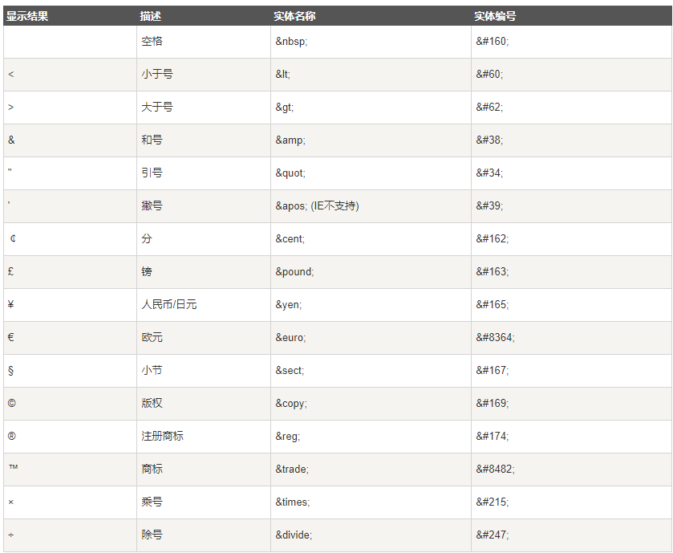
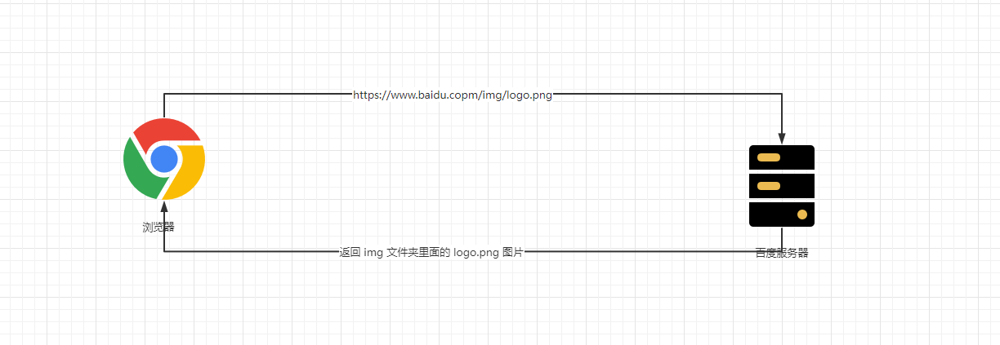
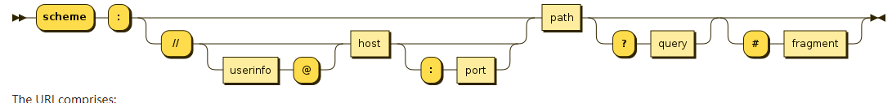
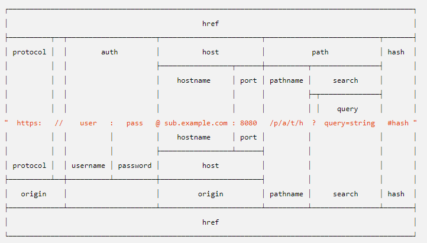
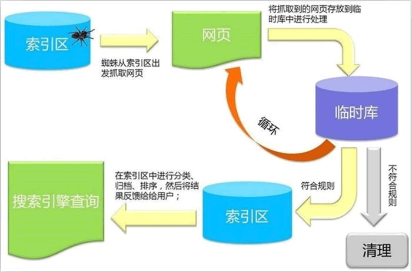
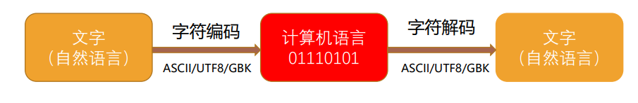

# 第一章：字符实体

## 1.1 概述

* 在 HTML 中，某些字符是预留的。在 HTML 中不能使用小于号（<）和大于号（>），这是因为浏览器会误认为它们是标签。
* 如果希望正确地显示预留字符，我们必须在 HTML 源代码中使用字符实体（character entities）。
* HTML 实体是一段以连字号（&）开头、以分号（;）结尾的文本（字符串）：
  * 实体常常用于显示保留字符（这些字符会被解析为 HTML 代码）和`不可见的字符`（如：不换行空格）；
  * 我们也可以用实体来代替其他难以用标准键盘键入的字符。

## 1.2 常见的字符实体

* 常见的字符实体：




# 第二章：URL 地址

* URL 是统一资源定位符（Uniform Resource Locator）。
* 通俗的讲，URL 就是一个给定的独特资源在 WEB 上的地址。
  * 理论上讲，每个有效的 URL 地址都指向一个唯一的资源。
  * 这个资源可以是一个 HTML 页面，一个 CSS 文件，一张图片等。



* URL 的标准格式：

```
[协议类型]://[服务器地址]:[端口号]/[文件路径][文件名]?[查询]#[片段ID]
```



* URL 的示例：




# 第三章：元素语义化

* 元素语义化：用正确的元素做正确的事情。
* 理论上说：所有的 HTML 元素，我们都能实现相同的事情。

```html
<!DOCTYPE html>
<html lang="en">
<head>
  <meta charset="UTF-8">
  <meta content="IE=edge" http-equiv="X-UA-Compatible">
  <meta content="width=device-width, initial-scale=1.0" name="viewport">
  <title>Title</title>
  <style>
      .title {
          display: block;
          font-size: 1.5em;
          margin-block-start: 0.83em;
          margin-block-end: 0.83em;
          margin-inline-start: 0;
          margin-inline-end: 0;
          font-weight: bold;
      }
  </style>
</head>
<body>
  <h2>我是h2标题</h2>
  <div class="title">实现的标题div</div>
  <span class="title">实现的标题span</span>
</body>
</html>
```

* 元素语义化的好处：
  * ① 方便代码维护。
  * ② 减少开发者之间的沟通成本。
  * ③ 能让语音很撑工具正确的识别网页元素的用途，以便作出正确的反应。
  * ④ 有利于 SEO 。
  * ⑤ ……


# 第四章：SEO 优化

* 搜索引擎优化（英语：search engine optimization，缩写为SEO）是通过了解搜索引擎的运作规则来调整网站，以及提高网站 在有关搜索引擎内排名的方式。0
* 搜索引擎的工作流程：




# 第五章：字符编码

* 计算机是用来干什么的？
  * 计算机一开始发明出来时是用来`解决数字计算`问题的，后来人们发现，计算机还可以做更多的事，例如：`文本处理`。
  * 但是，其实计算机是挺笨的，它只 `“认识”` 010110111000…这样由 `0` 和 `1` 两个数字组成的`二进制`数字。
  * 这是因为计算机的底层硬件实现就是用电路的开和闭两种状态来表示 `0` 和 `1` 两个数字的。
  * 因此，计算机只可以直接存储和处理二进制数字。
* 为了在计算机上也能`表示、存储和处理像文字、符号等等之类的字符`，就必须将这些`字符转换成二进制数字`。 当然，肯定不是我们想怎么转换就怎么转换，否则就会造成同一段二进制数字在不同计算机上显示出来的字符不一样的情况， 因此必须得定一个统一的、标准的转换规则，这就是`字符编码`的由来。


