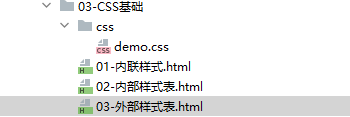
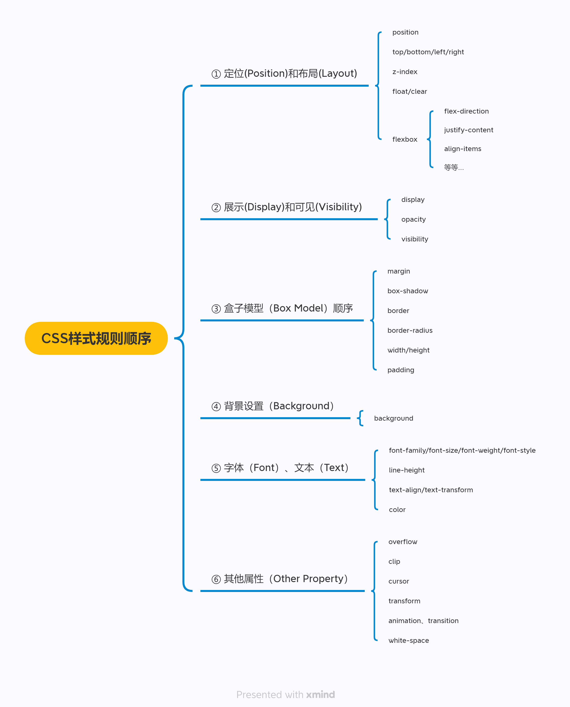
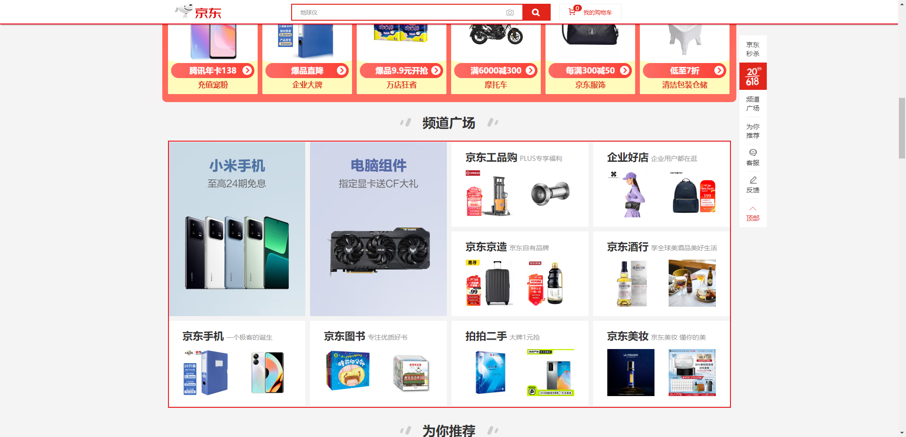
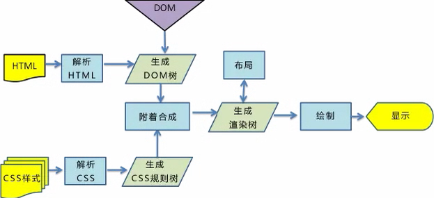

# 第一章：认识 CSS

## 1.1 概述

* CSS，中文翻译为层叠样式表（Cascading Style Sheet，简称：CSS，也称为串样式列表、级联样式表、串接样式表、阶层式样式表） 是为网页添加`样式的代码`。


* CSS 是一种语言吗？
* MDN 解释：CSS 也不是真正的编程语言，甚至不是标记语言。它是一门样式表语言；
* 维基百科解释：是一种计算机语言，但是不算是一种编程语言；

## 1.2 CSS 的历史

* 早期的网页都是通过 HTML 来编写的，但是我们希望 HTML 页面可以更加丰富。
* 这个时候就增加了很多`具备特殊样式的元素`，比如：i、strong、del 等等；
* 后来也有不同的浏览器`实现各自的样式语言`，但是没有统一的规划；
* 1994 年，哈肯·维姆·莱和伯特·波斯 `合作设计CSS`，在 1996 年的时候发布了 `CSS1`；
* 直到 1997 年初，W3C 组织才专门`成立了 CSS 的工作组`，1998 年 5 月发布了 `CSS2`；
* 在 2006 年 ~ 2009 年，非常流行 `DIV+CSS`布局的方式来替代所有的 HTML 标签；
* 从 CSS3 开始，所有的 CSS 分成了`不同的模块（modules）`，每一个 modules 都有于 CSS2 中额外增加的功能，以及向后兼容。
* 直到 2011 年 6 月 7 日，`CSS 3 Color Module` 终于发布为 W3C Recommendation。

> PS：CSS 的出现是为了美化 HTML 的，并且让结构（HTML）与样式（CSS）分离；
>
> * 美化方式一：为 HTML 添加各种各样的样式，比如：颜色、字体、大小、下划线等。
> * 美化方式二：对 HTML 进行布局，按照某种结构显示（CSS 的布局方式：浮动、Flex、Grid 等）。


# 第二章：编写 CSS 样式（⭐）

## 2.1 概述

* 既然 CSS 这么重要，那么它的语法规则是什么？


* 声明一个 CSS 的规则，如：`color:red ;` 有如下的两点：
  * 属性名（property name）：要添加的 CSS 规则的名称。
  * 属性值（property value）：要添加的 CSS 规则的值。


* 【问】但是，有这么一个问题，我们需要在 CSS 编写到什么位置？
* 【答】其实，CSS 提供了 3 种方式，让我们将 CSS 应用到元素上。

## 2.2 CSS 样式应用到元素的方式

### 2.2.1 概述

* CSS 提供了 3 种方式，让我们将 CSS 样式应用到元素上：

  * ① 内联样式（inline style）。

  * ② 内部样式表（internal style sheet）。

  * ③ 外部样式表（external style sheet）。

> PS：每一种方式都很重要，开发中不同场景都会使用到。

### 2.2.2 内联样式

* 内联样式（inline style，也有人称为行内样式），即内联样式表存在于 `HTML 元素的 style 属性` 中。

> PS：CSS 样式之间使用分号`;`隔开，建议每条 CSS 样式后面都添加上分号 `;`。


* 示例：

```html
<!DOCTYPE html>
<html lang="en">
<head>
  <meta charset="UTF-8">
  <meta content="IE=edge" http-equiv="X-UA-Compatible">
  <meta content="width=device-width, initial-scale=1.0" name="viewport">
  <title>Title</title>
</head>
<body>
  <!-- 内联样式 -->
  <p style="color: red;font-size: 20px;">好好学习，天天向上</p>
</body>
</html>
```

### 2.2.3 内部样式表

* 内部样式表（internal style  sheet），即将 CSS 放到 HTML 文件中的 `head 元素中的 style` 元素中。


* 示例：

```html
<!DOCTYPE html>
<html lang="en">
<head>
  <meta charset="UTF-8">
  <meta content="IE=edge" http-equiv="X-UA-Compatible">
  <meta content="width=device-width, initial-scale=1.0" name="viewport">
  <title>Title</title>
  <style>
    /* 内部样式表 */
    .box {
      width: 200px;
      height: 200px;
      background-color: pink;
      text-align: center;
      line-height: 200px;
    }
  </style>
</head>
<body>
  <div class="box">我是div元素</div>
</body>
</html>
```

### 2.2.4 外部样式表

* 外部样式表（external style sheet），是将 CSS 单独编写到一个名为 `xxx.css` 的文件中，然后通过 `link` 元素引入进来。


* 示例：



* demo.css

```css
.box {
    width: 200px;
    height: 200px;
    background-color: pink;
    text-align: center;
    line-height: 200px;
}
```

* index.html

```html
<!DOCTYPE html>
<html lang="en">
<head>
  <meta charset="UTF-8">
  <meta content="IE=edge" http-equiv="X-UA-Compatible">
  <meta content="width=device-width, initial-scale=1.0" name="viewport">
  <title>Title</title>
  <link href="./css/demo.css" rel="stylesheet">
</head>
<body>
  <div class="box">我是div元素</div>
</body>
</html>
```


# 第三章：CSS 注释

* CSS 代码中也可以添加注释，以便后期进行维护。
* CSS 的注释是： `/* 注释内容 */`。

> PS：快捷键是 `Ctrl + /` 。


* 示例：

```html
<!DOCTYPE html>
<html lang="en">
<head>
  <meta charset="UTF-8">
  <meta content="IE=edge" http-equiv="X-UA-Compatible">
  <meta content="width=device-width, initial-scale=1.0" name="viewport">
  <title>Title</title>
  <style>
    /* CSS 的注释内容：div 增加的注释 */
    .box {
      width: 200px;
      height: 200px;
      background-color: pink;
    }
  </style>
</head>
<body>
  <div class="box">我是div元素</div>
</body>
</html>
```


# 第四章：常见的 CSS 属性（⭐）

## 4.1 必须掌握的 CSS 属性

* 在实际开发中，90% 的时间都在写如下的 CSS 属性：



> PS：不需要强记这些 CSS 属性，这只是大纲而已，我们需要在了解 CSS 很多特性的情况下，才能真正的理解每个属性的真正含义。

## 4.2 CSS 属性的官方文档

* [CSS 官方文档](https://www.w3.org/TR/?tag=css)。
* [CSS 推荐文档](https://developer.mozilla.org/zh-CN/docs/Web/CSS/Reference#%E5%85%B3%E9%94%AE%E5%AD%97%E7%B4%A2%E5%BC%95)。

## 4.3 目前需要掌握的 CSS 属性

### 4.3.1 概述

* 要想深刻的理解所有常用的 CSS 属性，最好先学会以下的几个最基础最常用的 CSS 属性：
  * font-size：文字大小。
  * color：前景色（文字颜色）。
  * background-color：背景颜色。
  * width：宽度。
  * height：高度。


* 示例：

```html
<!DOCTYPE html>
<html lang="en">
<head>
  <meta charset="UTF-8">
  <meta content="IE=edge" http-equiv="X-UA-Compatible">
  <meta content="width=device-width, initial-scale=1.0" name="viewport">
  <title>Title</title>
  <style>
    .title {
      /* 默认情况下，Chrome 浏览器设置文字的默认大小是 16px */
      font-size: 20px;
    }
  </style>
</head>
<body>
  <div class="title">Hello World</div>
</body>
</html>
```


* 示例：

```html
<!DOCTYPE html>
<html lang="en">
<head>
  <meta charset="UTF-8">
  <meta content="IE=edge" http-equiv="X-UA-Compatible">
  <meta content="width=device-width, initial-scale=1.0" name="viewport">
  <title>Title</title>
  <style>
    .title {
      font-size: 20px;
      /* 前景色（文字颜色） */
      color: red;
    }
  </style>
</head>
<body>
  <div class="title">Hello World</div>
</body>
</html>
```


* 示例：

```html
<!DOCTYPE html>
<html lang="en">
<head>
  <meta charset="UTF-8">
  <meta content="IE=edge" http-equiv="X-UA-Compatible">
  <meta content="width=device-width, initial-scale=1.0" name="viewport">
  <title>Title</title>
  <style>
    .title {
      font-size: 20px;
      color: red;
      /* 背景颜色 */
      background-color: pink;
    }
  </style>
</head>
<body>
  <div class="title">Hello World</div>
</body>
</html>
```


* 示例：

```html
<!DOCTYPE html>
<html lang="en">
<head>
  <meta charset="UTF-8">
  <meta content="IE=edge" http-equiv="X-UA-Compatible">
  <meta content="width=device-width, initial-scale=1.0" name="viewport">
  <title>Title</title>
  <style>
    .title {
      font-size: 20px;
      color: red;
      /* 宽度 */
      width: 200px;
      /* 高度 */
      height: 200px;
      background-color: pink;

    }
  </style>
</head>
<body>
  <div class="title">Hello World</div>
</body>
</html>
```

### 4.3.2 back-ground

* background-color 属性决定了背景颜色。




* 示例：

```html
<!DOCTYPE html>
<html lang="en">
<head>
  <meta charset="UTF-8">
  <meta content="IE=edge" http-equiv="X-UA-Compatible">
  <meta content="width=device-width, initial-scale=1.0" name="viewport">
  <title>Title</title>
  <style>
    .title {
      font-size: 20px;
      color: red;
      /* 背景颜色 */
      background-color: pink;
    }
  </style>
</head>
<body>
  <div class="title">Hello World</div>
</body>
</html>
```

### 4.3.3 color

* color 属性用来设置文本内容的`前景色`，包括：`文字`、`装饰线`、`边框`、`外轮廓`等。


* 示例：

```html
<!DOCTYPE html>
<html lang="en">
<head>
  <meta charset="UTF-8">
  <meta content="IE=edge" http-equiv="X-UA-Compatible">
  <meta content="width=device-width, initial-scale=1.0" name="viewport">
  <title>Title</title>
  <style>
    .title {
      font-size: 20px;
      /* 前景色（文字颜色） */
      color: red;
      /* 设置装饰线 */
      text-decoration: underline;
    }
  </style>
</head>
<body>
  <div class="title">Hello World</div>
</body>
</html>
```


# 第五章：link 元素（⭐）

* link 元素是`外部资源链接`元素，规范了`文档和外部资源`的关系；link 元素通常是在 head 元素中。
* link 最常用于链接样式表（CSS）；但是，link 元素也可以用于创建`站点图标（favicon）`。
* link 元素的常用属性：

| 属性 | 描述                                                         |
| ---- | ------------------------------------------------------------ |
| href | 指定被链接资源的 URL 地址。                                  |
| rel  | [链接类型](https://developer.mozilla.org/zh-CN/docs/Web/HTML/Attributes/rel)，常用的有：icon 和 stylesheet 。 |


* 示例：

```html
<!DOCTYPE html>
<html lang="en">
<head>
  <meta charset="UTF-8">
  <meta content="IE=edge" http-equiv="X-UA-Compatible">
  <meta content="width=device-width, initial-scale=1.0" name="viewport">
  <title>Title</title>
  <!-- 创建站点图标 -->
  <link href="./images/favicon.ico" rel="shortcut icon" type="image/x-icon">
</head>
<body>

</body>
</html>
```


# 第六章：CSS 表示颜色（⭐）

## 6.1 概述

* 在 CSS 中，对于颜色，有如下的几种表示方法：
  * [颜色关键字](https://developer.mozilla.org/zh-CN/docs/Web/CSS/color_value#%E8%AF%AD%E6%B3%95)，如：red、pink 等。
  * RGB 颜色：
    * RGB 是一种色彩空间，通过 R（red，红色）、G（green，绿色）、B（blue，蓝色）三原色来组成了不同的颜色； 也就是通过调整这三个颜色不同的比例，可以组合成其他的颜色；
    * RGB 各个原色的取值范围是 0 ~ 255；


* 示例：

```html
<!DOCTYPE html>
<html lang="en">
<head>
  <meta charset="UTF-8">
  <meta content="IE=edge" http-equiv="X-UA-Compatible">
  <meta content="width=device-width, initial-scale=1.0" name="viewport">
  <title>Title</title>
  <style>
    .box {
      width: 200px;
      height: 200px;
      /* CSS 可以通过颜色关键字来设置颜色 */
      background-color: pink;
    }
  </style>
</head>
<body>
  <div class="box"></div>
</body>
</html>
```


* 示例：

```html
<!DOCTYPE html>
<html lang="en">
<head>
  <meta charset="UTF-8">
  <meta content="IE=edge" http-equiv="X-UA-Compatible">
  <meta content="width=device-width, initial-scale=1.0" name="viewport">
  <title>Title</title>
  <style>
    .box {
      width: 200px;
      height: 200px;
      /* CSS 可以通过 RGB 来设置颜色，RGB 的范围是 0 -255 ；其中，R 表示红色，G 表示绿色，B 表示蓝色。 */
      background-color: rgb(255, 192, 203);
    }
  </style>
</head>
<body>
  <div class="box"></div>
</body>
</html>
```

## 6.2 RGB 颜色的表示方法

* RGB 颜色可以通过以 `#十六进制字符` 和函数（rgb、rgba）来表示。
* 方式一：十六进制符号，`#RRGGBB[AA]`
  * R（红）、G（绿）、B （蓝）和 A （alpha）是十六进制字符（0–9、A–F）；A 是可选的，如：`\#ff0000` 等价于 `#ff0000ff；`
* 方式二：十六进制符号，`#RGB[A]`
  * R（红）、G（绿）、B （蓝）和 A （alpha）是十六进制字符（0–9、A–F）；
  * 三位数符号（`#RGB`）是六位数形式（`#RRGGBB`）的减缩版，如：`#f09` 和 `#ff0099` 表示的是同一颜色。
  * 四位数符号（`#RGBA`）是八位数形式（`#RRGGBBAA`）的减缩版，如：`#0f38`和`#00ff3388`表示的是相同的颜色。
* 方式三：函数，： `rgb[a](R, G, B[, A])`
  * R（红）、G（绿）、B （蓝）可以是（数字），或者（百分比），255 相当于 100% 。
  * A（alpha）可以是 0 到 1 之间的数字，或者百分比，数字 1 相当于 100%（完全不透明）。

> PS：实际开发中，一般 UI 会将颜色标注在原型图中。


* 示例：

```html
<!DOCTYPE html>
<html lang="en">
<head>
  <meta charset="UTF-8">
  <meta content="IE=edge" http-equiv="X-UA-Compatible">
  <meta content="width=device-width, initial-scale=1.0" name="viewport">
  <title>Title</title>
  <style>
    .box {
      width: 200px;
      height: 200px;
      /* CSS 设置背景颜色 */
      background-color: #ffc0cb;
    }
  </style>
</head>
<body>
  <div class="box"></div>
</body>
</html>
```


# 第七章：浏览器渲染流程

* 浏览器渲染流程：
  * ① 解析 HTML 生成 DOM 树。
  * ② 解析 CSS 生成 CSSOM 规则树。
  * ③ 将 DOM 树与 CSSOM 规则树合并在一起生成渲染树（Render Tree）。
  * ④ 遍历渲染树开始布局，计算每个节点的位置大小信息。
  * ⑤ 将渲染树每个节点绘制到屏幕。



