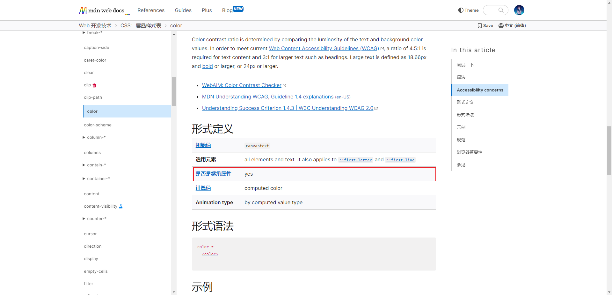
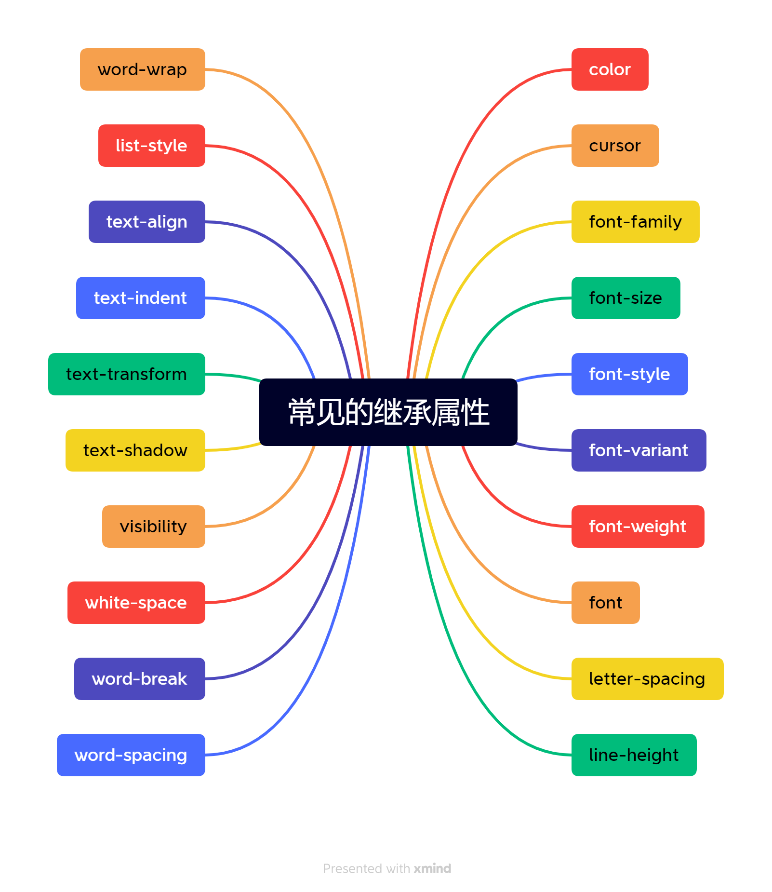
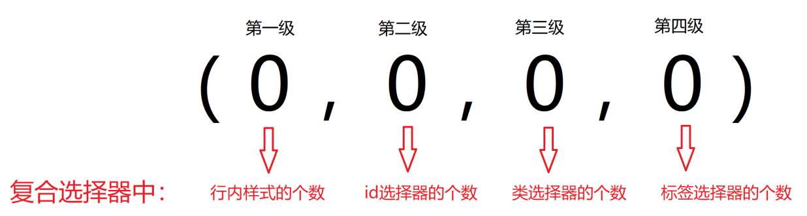
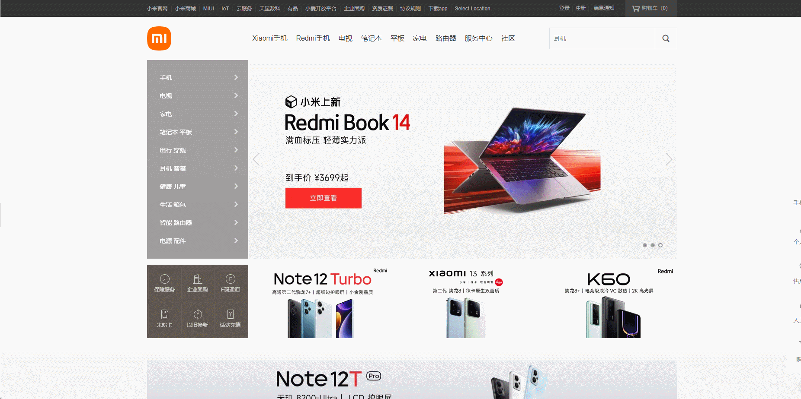

# 第一章：CSS 属性的继承（⭐）

## 1.1 概述

* CSS 的某些属性具有继承性，如果一个`属性具备继承性`，那么`在该元素上设置之后`，其`后代元素都可以继承这个属性`。

> PS：如果后代元素自己设置了该属性，则优先使用后代元素自己的属性（不管继承过来的属性权重有多高）。

* 那么如何知道一个属性是否具有继承性？
  * 常见的 `font-size/font-family/font-weight/line-height/color/text-align`（文字、文本相关的属性） 都具有继承性;
  * 不要刻意去记住，用多了，自然就记住了。
* 当然，最好去查 MDN 的文档，文档中会标注每个属性是否有继承性的：



> PS：继承过来的是计算值，而不是设置值。

* 继承的好处：可以在一定程度上减少代码。
* 应用场景： 
  * ① 可以直接给 ul 设置 `list-style:none;` 属性，从而去除列表默认的小圆点样式。
  * ② 直接给 body 标签设置统一的 `font-size` ，从而统一不同浏览器默认文字大小。

## 1.2 常见的继承属性有哪些？

* 常见的继承属性如下：



## 1.3 应用示例

* 示例：

```html
<!DOCTYPE html>
<html lang="en">
<head>
  <meta charset="UTF-8">
  <meta content="IE=edge" http-equiv="X-UA-Compatible">
  <meta content="width=device-width, initial-scale=1.0" name="viewport">
  <title>Title</title>
  <style>
    .box {
      color: red;
    }
  </style>
</head>
<body>
  <div class="box">
    <h1>我是h1元素</h1>
    <p>我是p元素</p>
    <span>我是span元素</span>
  </div>
</body>
</html>
```

## 1.4 继承性失效的情况

* 如果元素有浏览器默认的样式，此时继承性依然存在，但是优先显示浏览器默认的样式。

> PS：
>
> * ① a 标签的 color 会继承失败（其实 color 属性继承了，但是被浏览器默认设置的样式给覆盖了）。 
> * ② h 系列标签的 font-size 会继承失败（其实 font-size 属性继承了，但是被浏览器默认设置的样式给覆盖了）。 


* 示例：

```html
<!DOCTYPE html>
<html lang="en">
<head>
  <meta charset="UTF-8">
  <meta content="IE=edge" http-equiv="X-UA-Compatible">
  <meta content="width=device-width, initial-scale=1.0" name="viewport">
  <title>Title</title>
  <style>
    .box {
      /*
        a 元素的 color 会继承失败
      */
      color: red;
      /*
        h 系列元素的 font-size 会继承失败
      */
      font-size: 20px;
    }
  </style>
</head>
<body>
  <div class="box">
    <h1>我是h1元素</h1>
    <a href="#">百度一下，你就知道</a>
  </div>

</body>
</html>
```


# 第二章：CSS 属性的层叠（⭐）

## 2.1 概述

* 对于同一个元素而言，`相同的一个属性`我们可以通过不同的选择器对其进行多次设置，那么属性`就会被一层层的覆盖上去`；但是，最终`只有一个会生效`。

> PS：当做个样式属性覆盖到同一个元素上，哪一个会生效？
>
> * ① 选择器的权重，权重大的生效。
> * ② 先后顺序，选择器的权重相同的时候，后面设置的生效。

## 2.2 应用示例

* 示例：

```html
<!DOCTYPE html>
<html lang="en">

<head>
  <meta charset="UTF-8">
  <meta content="IE=edge" http-equiv="X-UA-Compatible">
  <meta content="width=device-width, initial-scale=1.0" name="viewport">
  <title>Document</title>
  <style>
    div {
      color: red;

      color: green;
    }

    .box {
      font-size: 30px;
      color: blue;
    }
  </style>
</head>

<body>
  <div class="box">文字</div>
</body>

</html>
```


# 第三章：CSS 属性的优先级

## 3.1 概述

* 不同的选择器具有不同的优先级，优先级高的选择器样式会覆盖优先级低的选择器样式。
* 优先级公式：继承 < 通配符选择器 < 标签选择器 < 类选择器 < id 选择器 < 行内样式 < `!important` 。

> PS：
>
> * ① `!important` 写在属性值的后面，分号的前面。
> * ② `!important` 不能提升继承的优先级，只要是继承，优先级最低。
> * ③ 实际开发中不建议使用 `!important` 。


* 示例：

```html
<!DOCTYPE html>
<html lang="en">

<head>
  <meta charset="UTF-8">
  <meta content="IE=edge" http-equiv="X-UA-Compatible">
  <meta content="width=device-width, initial-scale=1.0" name="viewport">
  <title>Document</title>
  <style>
    body {
      color: red;
    }

    * {
      color: aqua;
    }

    div {
      color: green !important;
    }

    .box {
      color: blue;
    }

    #box {
      color: brown;
    }
  </style>
</head>

<body>
  <!-- 意义：不同的选择器具有不同的优先级，优先级高的选择器样式会覆盖优先级低的选择器样式。 -->
  <div class="box" id="box" style="color: chartreuse;">测试优先级</div>
</body>

</html>
```

## 3.2 权重叠加计算

* 场景：如果是复合选择器，此时需要通过权重叠加计算方法，判断最终哪个选择器优先级最高。
* 权重叠加计算公式（每一级之间不存在进位）：



* 比较规则： 
  * ① 先比较第一级数字，如果比较出来了，之后的统统不看。
  * ② 如果第一级数字系统，此时再去比较第二级数字，如果比较出来了，之后的统统不看。
  * ③ ……
  * ④ 如果最终所有数字都相同，表示优先级相同，则比较层叠性（谁写在下面，谁说了算！）。

> PS：
>
> * `!important` 如果不是继承，则权重最高，天下第一。
> * 实际开发中选择元素需要精准，尽量避免多个选择器同时选中一个元素的情况，不要自己难为自己。


* 示例：

```html
<!DOCTYPE html>
<html lang="en">

<head>
  <meta charset="UTF-8">
  <meta content="IE=edge" http-equiv="X-UA-Compatible">
  <meta content="width=device-width, initial-scale=1.0" name="viewport">
  <title>Document</title>
  <style>
    /* (行内，id,类，标签) */

    /* (0,1,0,1) */
    div #one {
      color: orange;
    }

    /* (0,0,2,0) */
    .father .son {
      color: skyblue;
    }

    /* (0,0,1,1) */
    .father p {
      color: purple;
    }

    /* (0,0,0,2) */
    div p {
      color: pink;
    }
  </style>
</head>

<body>
  <div class="father">
    <p class="son" id="one">我是一个 p 标签</p>
  </div>
</body>

</html>
```


# 第四章：元素显示模式（⭐）

## 4.1 概述

* 在前面，我们提供 `div` 是`块级元素`会`独占一行`，而 `span` 是`行内级元素`会`在同一行显示`；那么，什么是`块级元素`，什么又是`行内级元素`？

* 其实，HTML 元素太多了，如：h 元素、p 元素、div 元素、span 元素、img 元素、 a 元素等；那么，这些元素到底是怎么在页面上显示的。

* 我们也知道，HTML 其实就是某种意义上讲，就是为了快速的传播资讯的，相对于报纸而言；HTML 从报纸的排版等吸收了很多思想：

  * 像 `h 系列元素，即标题`，在报纸上的排版就是独占一行，并且加粗显示的；所以，HTML 中也是这样的。

  * 像 `p 元素，即段落`，也应该是独占一行的，其它的内容不应该和段落放在一起。

  * 而类似于 `a` 、`img`、`span` 的元素，通常是`对内容的某个细节的特殊描述，没有必要独占一行`。

* 所以，为了区别哪些元素需要独占一行，哪些元素不需要独占一行，HTML 就元素划分了两类：
  * ① `块级元素`（block-level elements）：独占父元素的一行。
  * ② `行内级元素`（inline-level elements）：多个行内级元素可以在父元素的同一行中显示。

* 当然，HTML 元素实质上是没有任何区别的；div 之所以是块级元素，只不多是浏览器给其默认设置了 `display:block;` 而已，我们也可以通过 CSS 来改变其特性（显示模式）。

## 4.2 display 属性

* CSS 中的 display 属性，可以改变元素的显示模式，常见的取值如下：

| 属性值       | 描述                                                         | 使用频率 |
| ------------ | ------------------------------------------------------------ | -------- |
| block        | 将元素转换为块级元素                                         | 较多     |
| inline       | 将元素转换为行内级元素                                       | 较少     |
| inline-block | 将元素转换为行内块元素（让元素同时具备行内级、块级元素的特征） | 较多     |
| none         | 隐藏元素                                                     | 较多     |

* 当然，display 属性还有其他的值，后面再学习。

## 4.3 块级元素

* 块级元素具有如下的特点：
  * ① 在页面中`独占一行`，不会和任何元素共用一行，是从上到下排列的。
  * ② 默认宽度：`撑满父元素`。
  * ③ 默认高度：由`内容`撑开。
  * ④ `可以`通过 `CSS` 设置宽高，但是依然独占一行。

* 常见的块级元素：
  * 主体结构标签：`html`、`body`。
  * 排版标签：`h 系列标签`、`hr`、`p`、`pre`、`div`。
  * 列表标签：`ul`、`ol`、`li`、`dl`、`dt`、`dd` 。
  * 表格相关标签：`table`、`thead`、`tbody`、`tfoot`、`tr`、`caption`。
  * 表单相关标签：`form` 、`option`。


* 示例：

```html
<!DOCTYPE html>
<html lang="en">
<head>
  <meta charset="UTF-8">
  <meta content="IE=edge" http-equiv="X-UA-Compatible">
  <meta content="width=device-width, initial-scale=1.0" name="viewport">
  <title>Title</title>
  <style>

    div {
      /*
        独占父元素的一行。
        宽度默认是父元素的宽度，高度默认由内容撑开。
      */
      background-color: pink;
    }

    .box {
      /*
        可以设置宽度和高度。
      */
      width: 200px;
      height: 200px;
      background-color: red;
    }

  </style>
</head>
<body>
  <div>我也是div元素</div>
  <div class="box">我是div元素</div>
</body>
</html>
```

## 4.4 行内级元素

* 行内级元素具有如下的特点：
  * ① 在页面中`不独占一行`，一行中不能容纳下的行内级元素，会在下一行继续从左到右排列（和其它的行内级元素在同一行显示）。
  * ② 默认宽度：由`内容`撑开。
  * ③ 默认高度：由`内容`撑开。
  * ④ `不可以`通过 `CSS` 设置宽度和高度（设置了不起效）。

* 常见的行内级元素：
  * 文本标签：`br`、`em`、`strong`、`sup`、`sub`、`del`、`ins`。
  * 排版标签：`span`。
  * 超链接标签：`a` 。
  * 表单相关标签：`label`。


* 示例：

```html
<!DOCTYPE html>
<html lang="en">
<head>
  <meta charset="UTF-8">
  <meta content="IE=edge" http-equiv="X-UA-Compatible">
  <meta content="width=device-width, initial-scale=1.0" name="viewport">
  <title>Title</title>
  <style>
    .box {
      width: 200px;
      height: 200px;
      background-color: pink;
    }

    .box span {
      background-color: skyblue;
    }
  </style>
</head>
<body>
  <div class="box">
    <span>abc</span>
    <span>123</span>
  </div>
</body>
</html>
```

## 4.5 行内块元素

* 行内级元素具有如下的特点：
  * ① 在页面中`不独占一行`，一行中不能容纳下的行内级元素或行内块元素，会在下一行继续从左到右排列（和其它的行内级元素或行内块元素在同一行显示）。
  * ② 默认宽度：由`内容`撑开。
  * ③ 默认高度：由`内容`撑开。
  * ④ `可以`通过 `CSS` 设置宽度和高度。
* 常见的行内块元素：
  * 图片：`img` 。
  * 单元格：`td`、`th`。
  * 表单相关标签：`input`、`textarea`、`select`、`button`。
  * 框架标签：`iframe`。


> PS：
>
> * 可以这么理解行内块元素，对外来说，它是一个行内级元素；但是，对内来说，它是一个块级元素。


* 示例：

```html
<!DOCTYPE html>
<html lang="en">
<head>
    <meta charset="UTF-8">
    <meta http-equiv="X-UA-Compatible" content="IE=edge">
    <meta name="viewport" content="width=device-width, initial-scale=1.0">
    <title>Document</title>
    <style>
        /* 行内块元素：一行可以显示多个，可以设置宽高 */
        input {
            width: 200px;
            height: 20px;
        }
    </style>
</head>
<body>
    <input type="text">
    <input type="text">
</body>
</html>
```


# 第五章：元素的隐藏（⭐）

## 5.1 概述

* 元素的隐藏方法：
  * ① 设置 display 为 none ：元素不显示，也不占据位置；换言之，`不占据任何空间`，和不存在一样。
  * ② 设置 visibility 为 hidden ：虽然元素不可见，但是依然会`占据元素应该占据的空间`；默认值是 visible ，即可见的。
  * ③ 设置 rgba 中的 a 为 0 ：设置 rgba 中的透明度，`不会影响到子元素`。
  * ④ 设置 opacity 的透明度为 0 ：设置整个元素的透明度，`会影响到所有的子元素`。
* 我们可以查看`小米商城`是怎么做的？



> PS：实际开发中，display 的方式用的最多，但是 display 如果设置为 none 之后，不会占据任何空间，会影响布局（下面的元素会冲上去），此时就可以和绝对定位配合使用。

## 5.2 应用示例

* 示例：

```html
<!DOCTYPE html>
<html lang="en">
<head>
  <meta charset="UTF-8">
  <meta content="IE=edge" http-equiv="X-UA-Compatible">
  <meta content="width=device-width, initial-scale=1.0" name="viewport">
  <title>Title</title>
  <style>
    .box {
      width: 200px;
      height: 200px;
      background-color: pink;
    }

    .box:hover {
      display: none;
    }
  </style>
</head>
<body>
  <div class="box">
    <span>我是div元素中的span元素</span>
  </div>
  <div>
    <span>我也是div元素中的span元素</span>
  </div>
</body>
</html>
```


* 示例：

```html
<!DOCTYPE html>
<html lang="en">
<head>
  <meta charset="UTF-8">
  <meta content="IE=edge" http-equiv="X-UA-Compatible">
  <meta content="width=device-width, initial-scale=1.0" name="viewport">
  <title>Title</title>
  <style>
    .box {
      width: 200px;
      height: 200px;
      background-color: pink;
    }

    .box:hover {
      visibility: hidden;
    }
  </style>
</head>
<body>
  <div class="box">
    <span>我是div元素中的span元素</span>
  </div>
  <div>
    <span>我也是div元素中的span元素</span>
  </div>
</body>
</html>
```


* 示例：

```html
<!DOCTYPE html>
<html lang="en">
<head>
  <meta charset="UTF-8">
  <meta content="IE=edge" http-equiv="X-UA-Compatible">
  <meta content="width=device-width, initial-scale=1.0" name="viewport">
  <title>Title</title>
  <style>
    .box {
      width: 200px;
      height: 200px;
      background-color: pink;
    }

    .box:hover {
      color: rgba(0, 0, 0, 0);
      background-color: rgba(0, 0, 0, 0);
    }
  </style>
</head>
<body>
  <div class="box">
    <span>我是div元素中的span元素</span>
  </div>
  <div>
    <span>我也是div元素中的span元素</span>
  </div>
</body>
</html>
```


* 示例：

```html
<!DOCTYPE html>
<html lang="en">
<head>
  <meta charset="UTF-8">
  <meta content="IE=edge" http-equiv="X-UA-Compatible">
  <meta content="width=device-width, initial-scale=1.0" name="viewport">
  <title>Title</title>
  <style>
    .box {
      width: 200px;
      height: 200px;
      background-color: pink;
    }

    .box:hover {
      opacity: 0;
    }
  </style>
</head>
<body>
  <div class="box">
    <span>我是div元素中的span元素</span>
  </div>
  <div>
    <span>我也是div元素中的span元素</span>
  </div>
</body>
</html>
```


# 第六章：overflow 属性

## 6.1 概述

* overflow 用于控制内容的溢出行为。
* 常见的取值如下：

| 取值    | 描述                                         |
| ------- | -------------------------------------------- |
| visible | 溢出的内容照样可见。                         |
| hidden  | 溢出的内容直接裁剪。                         |
| scroll  | 溢出的内容被裁剪，但可以通过滚动机制查看。   |
| auto    | 自动根据内容是否溢出来决定是否提供滚动机制。 |

## 6.2 应用示例

* 示例：

```html
<!DOCTYPE html>
<html lang="en">
<head>
  <meta charset="UTF-8">
  <meta content="IE=edge" http-equiv="X-UA-Compatible">
  <meta content="width=device-width, initial-scale=1.0" name="viewport">
  <title>Title</title>
  <style>
    .box {
      width: 200px;
      height: 200px;
      background-color: pink;

      /*
        overflow 用于控制内容的溢出行为。
        | 取值    | 描述                                         |
        | ------- | -------------------------------------------- |
        | visible | 溢出的内容照样可见。                         |
        | hidden  | 溢出的内容直接裁剪。                         |
        | scroll  | 溢出的内容被裁剪，但可以通过滚动机制查看。   |
        | auto    | 自动根据内容是否溢出来决定是否提供滚动机制。 |
      */
      overflow: auto;
    }
  </style>
</head>
<body>
  <div class="box">
    Java 是由 Sun Microsystems 公司于 1995 年 5 月推出的高级程序设计语言。
    Java 可运行于多个平台，如 Windows, Mac OS 及其他多种 UNIX 版本的系统。
    本教程通过简单的实例将让大家更好的了解 Java 编程语言。
    移动操作系统 Android 大部分的代码采用 Java 编程语言编程。
  </div>
</body>
</html>
```


# 第七章：HTML 元素嵌套的注意事项（⭐）

* ① 块级元素一般作为大容器，可以嵌套：文本、块级元素、行内元素、行内块元素……，但是 `p 元素不能嵌套 div 、p、h 等块级元素` 。
* ② a 元素内部可以嵌套任意元素，但是 `a 元素不能嵌套 a 元素` 。
* ③ 行内级元素，通常只包含行内级元素。


# 第八章：布局技巧

## 8.1 概述

* ① 行内元素、行内块元素，可以被父元素当做文本处理。
  * 可以像处理文本对齐一样，去处理：行内、行内块在父元素中的对齐。
* ② 如何让子元素，在父元素中`水平居中`：
  * 如果子元素是`块级元素`，给子元素加上 `margin:0 auto;`。
  * 如果子元素是`行内元素`或`行内块元素`，给父元素加上 `text-align:center;` 。

* ③ 如何让子元素，在父元素中`垂直居中`：
  * 如果子元素是`块级元素`，给子元素加 `margin-top`，值为 `(父元素的content - 子元素盒子的高度) /2`，并且给父元素设置 `overflow:hidden`。
  * 如果子元素是`行内元素`或`行内块元素`：
    * 给父元素的 `line-height = height`，每个子元素都加上：`vertical-align: middle;`
    * 如果想要绝对垂直居中，父元素的 font-size 设置为 0 ，子元素再根据实际字体大小设置 font-size 。

## 8.2 应用示例

* 示例：

```html
<!DOCTYPE html>
<html lang="en">
<head>
  <meta charset="UTF-8">
  <meta content="IE=edge" http-equiv="X-UA-Compatible">
  <meta content="width=device-width, initial-scale=1.0" name="viewport">
  <title>Title</title>
  <style>
    * {
      margin: 0;
      padding: 0;
      box-sizing: border-box;
    }

    .outer {
      width: 400px;
      height: 400px;
      background-color: gray;
      margin: 50px auto;
      overflow: hidden;
    }

    .inner {
      width: 200px;
      height: 100px;
      background-color: orange;
      margin: 150px auto 0;
      text-align: center;
      line-height: 100px;
    }
  </style>
</head>
<body>
  <div class="outer">
    <div class="inner">inner</div>
  </div>
</body>
</html>
```


* 示例：

```html
<!DOCTYPE html>
<html lang="en">
<head>
  <meta charset="UTF-8">
  <meta content="IE=edge" http-equiv="X-UA-Compatible">
  <meta content="width=device-width, initial-scale=1.0" name="viewport">
  <title>Title</title>
  <style>
    * {
      margin: 0;
      padding: 0;
      box-sizing: border-box;
    }

    .outer {
      width: 400px;
      height: 400px;
      background-color: gray;
      margin: 50px auto;
      text-align: center;
      line-height: 400px;
    }

    .inner {
      background-color: orange;
    }
  </style>
</head>
<body>
  <div class="outer">
    <span class="inner">出来玩啊</span>
  </div>
</body>
</html>
```


* 示例：

```html
<!DOCTYPE html>
<html lang="en">
<head>
  <meta charset="UTF-8">
  <meta content="IE=edge" http-equiv="X-UA-Compatible">
  <meta content="width=device-width, initial-scale=1.0" name="viewport">
  <title>Title</title>
  <style>
    * {
      margin: 0;
      padding: 0;
      box-sizing: border-box;
    }

    .outer {
      width: 300px;
      height: 100px;
      background-color: gray;
      text-align: center;
      line-height: 100px;
      font-size: 0;
      border-radius: 20px;
    }

    .outer .inner {
      font-size: 20px;
      vertical-align: middle;
      background-color: orange;
    }

    .outer img {
      width: 80px;
      vertical-align: middle;
      border-radius: 50%;
      transition: all 0.2s;
    }

    .outer img:hover {
      transform: rotate(180deg);
    }
  </style>
</head>
<body>
  <div class="outer">
    <span class="inner">出来玩啊</span>
    
  </div>
</body>
</html>
```

