# 第一章：初识盒子模型

## 1.1 概述

* 在生活中，我们经常会遇到各种各样的盒子：

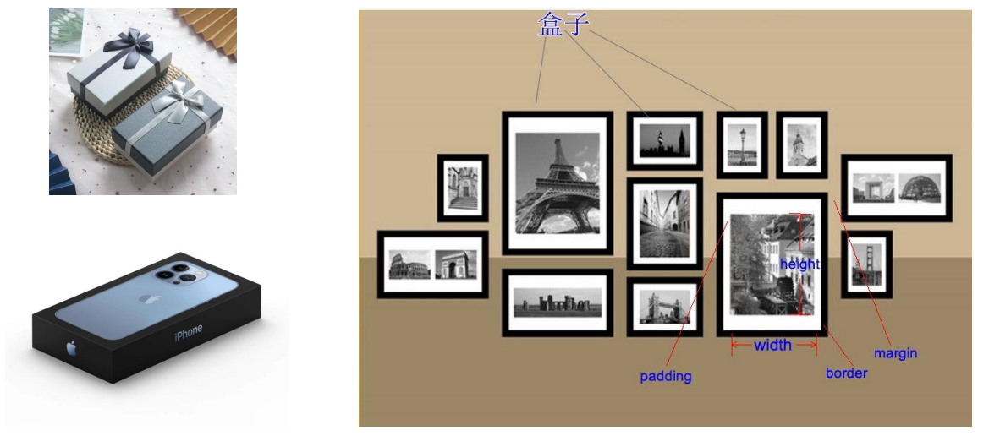

## 1.2 HTML 中的盒子

* 其实，我们可以将 HTML 中的每个元素都看成是一个盒子：

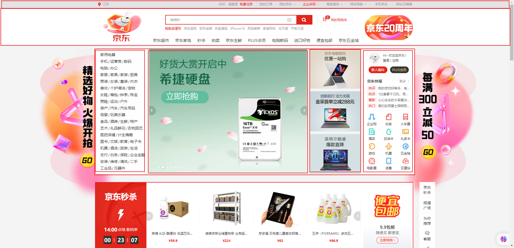

## 1.3 盒子模型

* CSS 中规定每个盒子分别由：内容区域（content）、内边距区域（padding）、边框区域（border）、外边距区域（margin）构成，这就是 `盒子模型` 。

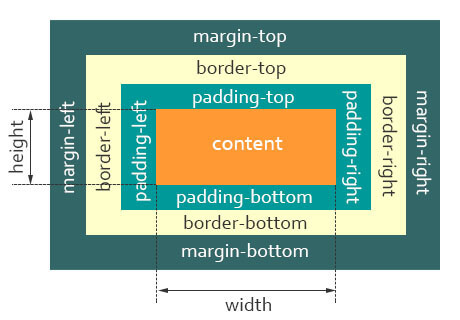


* 示例：

```html
<!DOCTYPE html>
<html lang="en">
<head>
  <meta charset="UTF-8">
  <meta content="IE=edge" http-equiv="X-UA-Compatible">
  <meta content="width=device-width, initial-scale=1.0" name="viewport">
  <title>Title</title>
  <style>
    * {
      margin: 0;
      padding: 0;
    }

    .box {
      width: 200px;
      height: 200px;
      background-color: pink;
    }
  </style>
</head>
<body>
  <div class="box">我是div元素</div>
</body>
</html>
```


# 第二章：内容区域的宽度和高度（⭐）

## 2.1 概述

* 我们可以通过设置 `width` 和 `height` 属性来设置内容区域的`宽度`和`高度`。

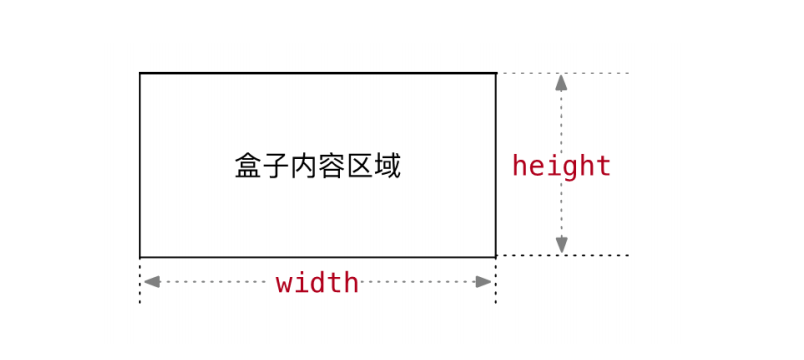

* width 和 height 的常见取值：
  * ① 数字 + px 。
  * ② 百分比，相对于包含块的百分比。
  * ③ auto 。

> PS：
>
> * `width` 和 `height` 的`默认值`是 `auto` ，并且这两个属性`不能被继承`。
> * 对于 `行内非替换元素` 而言，设置`宽度`和`高度`是`无效`的。


* 示例：

```html
<!DOCTYPE html>
<html lang="en">
<head>
  <meta charset="UTF-8">
  <meta content="IE=edge" http-equiv="X-UA-Compatible">
  <meta content="width=device-width, initial-scale=1.0" name="viewport">
  <title>Title</title>
  <style>
    * {
      margin: 0;
      padding: 0;
    }

    .box {
      /* width: 200px; */
      /*
        auto 浏览器将会为指定的元素计算并选择一个宽度。
        块级元素：独占一行（父元素）
      */
      width: auto;
      height: 200px;
      background-color: pink;
    }

    .title {
      /* 行内级元素：包裹内容 */
      width: auto;
    }
  </style>
</head>
<body>
  <div class="box">我是div元素</div>
  <span class="title">我是span元素</span>
</body>
</html>
```

## 2.2 其它

* 有的时候，我们可以还设置如下的属性：
  * `min-width`：`最小宽度`，无论内容多少，宽度都大于或等于 `min-width` 。
  * `max-width`：`最大宽度`，无论内容多少，宽度都小于或等于 `max-width` 。

> PS：
>
> * 在做`移动端适配`的时候，就可以设置`最大宽度`和`最小宽度`了。
> * 像 `min-height` 、`max-height` 和 `min-width` 、`max-width`类似，只不多是最小高度和最大高度；但是，不常用。


* 示例：

```html
<!DOCTYPE html>
<html lang="en">
<head>
  <meta charset="UTF-8">
  <meta content="IE=edge" http-equiv="X-UA-Compatible">
  <meta content="width=device-width, initial-scale=1.0" name="viewport">
  <title>Title</title>
  <style>
    * {
      margin: 0;
      padding: 0;
    }

    .box {
      height: 2000px;
      /* 最大宽度 */
      max-width: 750px;
      /* 最小宽度 */
      min-width: 600px;

      margin: 0 auto;

      background-color: pink;
    }

  </style>
</head>
<body>
  <div class="box">我是div元素</div>
</body>
</html>
```


# 第三章：边框（⭐）

## 3.1 边框（border）-- 单个属性（了解）

* 作用：设置边框粗细、边框样式、边框颜色效果。 
* 属性：

| 属性名       | 作用     | 属性值                                 |
| ------------ | -------- | -------------------------------------- |
| border-width | 边框粗细 | 数字 + px                              |
| border-style | 边框样式 | 实线 solid 、虚线 dashed 、点线 dotted |
| border-color | 边框颜色 | 颜色取值                               |


* 示例：

```html
<!DOCTYPE html>
<html lang="en">

<head>
    <meta charset="UTF-8">
    <meta http-equiv="X-UA-Compatible" content="IE=edge">
    <meta name="viewport" content="width=device-width, initial-scale=1.0">
    <title>Document</title>
    <style>
        .box {
            width: 200px;
            height: 200px;
            background-color: pink;
            /* 边框（border）- 单个属性 */
            border-width: 10px;
            border-style: solid;
            border-color: red;
        }
    </style>
</head>

<body>
    <div class="box"></div>
</body>

</html>
```

## 3.2 边框（border）-- 连写形式

* 属性名：border 。

- 属性值：单个取值的连写，取值之间以空格隔开，如：`border : 10px solid red;`。


* 示例：

```html
<!DOCTYPE html>
<html lang="en">

<head>
    <meta charset="UTF-8">
    <meta http-equiv="X-UA-Compatible" content="IE=edge">
    <meta name="viewport" content="width=device-width, initial-scale=1.0">
    <title>Document</title>
    <style>
        .box {
            width: 200px;
            height: 200px;
            background-color: pink;
            border: 10px solid red;
        }
    </style>
</head>

<body>
    <div class="box"></div>
</body>

</html>
```

## 3.3 边框（border）-- 单方向设置

* 场景：只给盒子的某个方向单独设置边框。 

-  属性名：`border-方位名词`。 

-  属性值：连写的形式。 


* 示例：

```html
<!DOCTYPE html>
<html lang="en">

<head>
    <meta charset="UTF-8">
    <meta http-equiv="X-UA-Compatible" content="IE=edge">
    <meta name="viewport" content="width=device-width, initial-scale=1.0">
    <title>Document</title>
    <style>
        .box{
            width: 200px;
            height: 200px;
            background-color: pink;
            /* 边框（border）- 单方向设置 */    
            border-right: 10px solid red;
        }
    </style>
</head>

<body>
    <div class="box"></div>
</body>

</html>
```

## 3.4 盒子实际大小初级计算公式

* 需求：盒子尺寸 400*400 ，背景绿色，边框 10px 实线 黑色，如何完成？

> PS：
>
> * ① 设置 width 和 height 是内容区域的宽度和高度。
> * ② 设置 border 会撑大盒子。

* 盒子实际大小初级计算公式：
  * 盒子的宽度 = 左边框 + 内容宽度 + 右边框。
  * 盒子的高度 = 上边框 + 内容高度 + 下边框。

* 解决：当盒子被 border 撑大后，计算多余大小，手动在内容区域中减去（手动内减）。

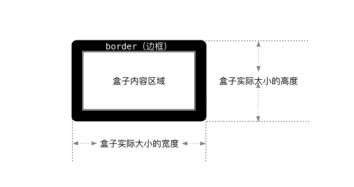


* 示例：

```html
<!DOCTYPE html>
<html lang="en">

<head>
    <meta charset="UTF-8">
    <meta http-equiv="X-UA-Compatible" content="IE=edge">
    <meta name="viewport" content="width=device-width, initial-scale=1.0">
    <title>Document</title>
    <style>
        .box {
            width: 380px;
            height: 380px;
            background-color: green;
            border: 10px solid #000;
        }
    </style>
</head>

<body>
    <div class="box"></div>
</body>

</html>
```


# 第四章：内边距（⭐）

## 4.1 内边距（padding）-- 取值

* `padding` 属性用于设置盒子的内边距，通常用于设置`边框和内容之间的间距`。
* `padding` 属性包括四个方向，所以有如下的取值：
  *  `padding-top`：上内边距。
  * `padding-right`：右内边距。
  *  `padding-bottom`：下内边距。
  * `padding-left`：左内边距。
* `padding` 属性是一个缩写属性，即 `padding-top`、`padding-right`、`padding-bottom`、`padding-left` 的简写属性。
* `padding` 缩写属性是`从零（12）点钟方向开始`，沿着`顺时针`转动的，也就是`上右下左`。

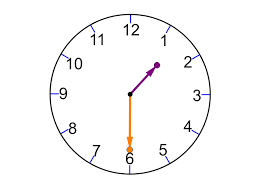

* padding 属性的常见取值：

| 取值   | 示例                           | 含义                                                         |
| ------ | ------------------------------ | ------------------------------------------------------------ |
| 一个值 | `padding:10px;`                | `上右下左` 都设置为 10px                                     |
| 两个值 | `padding:10px 20px;`           | `上下` 设置为 10px，`左右` 设置为 20px                       |
| 三个值 | `padding:10px 20px 30px;`      | `上` 设置为10px，`左右` 设置为 20px，`下` 设置为 30px        |
| 四个值 | `padding:10px 20px 30px 40px;` | `上` 设置为10px，`左右`设置为20px，`下`设置为30px，`左`设置为 40px |

> PS： `从上开始赋值，然后顺时针赋值，如果没有设置赋值的，看对面的！！`。


* 示例：

```html
  <!DOCTYPE html>
<html lang="en">

<head>
    <meta charset="UTF-8">
    <meta http-equiv="X-UA-Compatible" content="IE=edge">
    <meta name="viewport" content="width=device-width, initial-scale=1.0">
    <title>Document</title>
    <style>
        .box {
            width: 200px;
            height: 200px;
            background-color: pink;
            /* 添加了 4个方向的内边距 */
            padding: 50px;
            /* padding 属性可以当做复合属性使用，也可以单独设置某个方向的内边距 */

            /* 四个值：上 右 下 左 */
            /* padding: 10px 20px 30px 40px; */

            /* 三个值：上 左右 下 */
            /* padding: 10px 20px 30px; */

            /* 三个值：上下 左右 */
            /* padding: 10px 20px; */
        }
    </style>
</head>

<body>
    <div class="box">文字</div>
</body>

</html>
```

## 4.2 内边距（padding）-- 单方向设置

* 也可以只给盒子的某个方向单独设置内边距。


* 示例：

```html
<!DOCTYPE html>
<html lang="en">

<head>
    <meta charset="UTF-8">
    <meta http-equiv="X-UA-Compatible" content="IE=edge">
    <meta name="viewport" content="width=device-width, initial-scale=1.0">
    <title>Document</title>
    <style>
        .box {
            width: 200px;
            height: 200px;
            background-color: pink;
            padding-left: 20px;
        }
    </style>
</head>

<body>
    <div class="box">文字</div>
</body>

</html>
```

## 4.3 盒子实际大小终极计算公式

* 需求：盒子尺寸 300*300，背景粉色，边框 10px 实线黑色，上下左右 20px 的内边距，如何完成？

> PS：
>
> * ① 设置 width 和 height 是内容的宽高！
> * ② 设置 border 会撑大盒子。
> * ③ 设置 padding 会撑大盒子。

* 盒子实际大小终极计算公式： 
  * 盒子宽度 = 左边框 + 左 padding + 内容宽度 + 右 padding + 右边框。
  * 盒子高度 = 上边框 + 上 padding + 内容宽度 + 下 padding + 下边框。

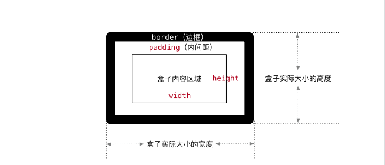


* 示例：

```html
<!DOCTYPE html>
<html lang="en">

<head>
    <meta charset="UTF-8">
    <meta http-equiv="X-UA-Compatible" content="IE=edge">
    <meta name="viewport" content="width=device-width, initial-scale=1.0">
    <title>Document</title>
    <style>
        .box {
            width: 240px;
            height: 240px;
            background-color: pink;
            border: 10px solid #000;
            padding: 20px;
        }
    </style>
</head>

<body>
    <div class="box"></div>
</body>

</html>
```

## 4.4 CSS3 盒子模型（自动内减，推荐）

* 需求：盒子尺寸 300*300，背景粉色，边框 10px 实线黑色，上下左右 20px 的内边距，如何完成？

> PS：给盒子设置 border 或 padding 时，盒子会被撑大，如果不想盒子被撑大？

* 解决方法 ① ：手动内减 
  * 操作：自己计算多余大小，手动在内容中减去。
  * 缺点：项目中计算量太大，很麻烦。


- 解决方法 ② ：自动内减 
  - 操作：给盒子设置属性 `box-sizing : border-box ;` 即可。
  - 优点：浏览器会自动计算多余大小，自动在内容中减去。


* 示例：

```html
<!DOCTYPE html>
<html lang="en">

<head>
    <meta charset="UTF-8">
    <meta http-equiv="X-UA-Compatible" content="IE=edge">
    <meta name="viewport" content="width=device-width, initial-scale=1.0">
    <title>Document</title>
    <style>
        body {
            /* 内减模式 */
            box-sizing: border-box;
        }

        div {
            width: 300px;
            height: 300px;
            background-color: pink;
            border: 10px solid #000;
            padding: 20px;
        }
    </style>
</head>

<body>
    <div class="box"></div>
</body>

</html>
```

## 4.5 圆角（border-radius）

* `border-radius` 用于设置盒子的圆角。

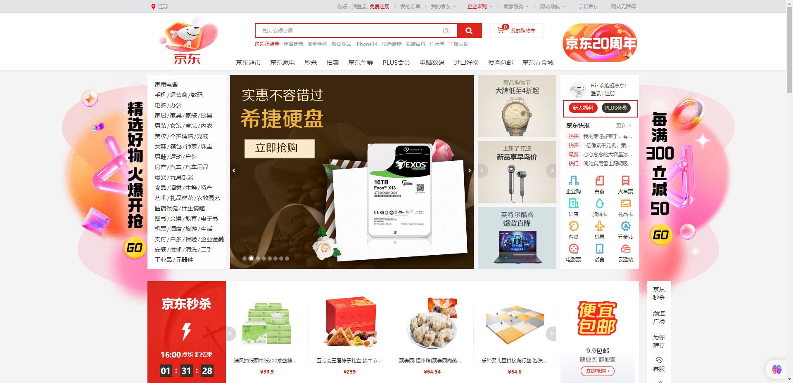

* 常见取值：
  * `数值`：通常用来设置小的圆角，如：6px。
  * `百分比`：通常用来设置一定的弧度或圆形。

* 其实，border-radius 是一个缩写属性：
  * 将这四个属性 border-top-left-radius、border-top-right-radius、border-bottom-right-radius，和 border-bottom-left-radius 简写为一个属性。
  * 实际开发中，很少一个个圆角设置。


* 示例：

```html
<!DOCTYPE html>
<html lang="en">
<head>
  <meta charset="UTF-8">
  <meta content="IE=edge" http-equiv="X-UA-Compatible">
  <meta content="width=device-width, initial-scale=1.0" name="viewport">
  <title>Title</title>
  <style>
    .box {
      width: 100px;
      height: 100px;
      background-color: pink;
      border: 5px solid red;
      border-radius: 50%;
    }
  </style>
</head>
<body>
  <div class="box"></div>
</body>
</html>
```


# 第五章：外边距（⭐）

## 5.1 外边距（margin）-- 取值

- 作用：设置边框以外，`盒子和盒子之间` 的距离。

- 属性名：margin 。

- 常见取值：

| 取值   | 示例                          | 含义                                                         |
| ------ | ----------------------------- | ------------------------------------------------------------ |
| 一个值 | `margin:10px;`                | `上右下左` 都设置为 10px                                     |
| 两个值 | `margin:10px 20px;`           | `上下` 设置为 10px，`左右` 设置为 20px                       |
| 三个值 | `margin:10px 20px 30px;`      | `上` 设置为10px，`左右` 设置为 20px，`下` 设置为 30px        |
| 四个值 | `margin:10px 20px 30px 40px;` | `上` 设置为10px，`左右`设置为20px，`下`设置为30px，`左`设置为 40px |

> PS：`从上开始赋值，然后顺时针赋值，如果没有设置赋值的，看对面的！！`。 


* 示例：

```html
<!DOCTYPE html>
<html lang="en">

<head>
    <meta charset="UTF-8">
    <meta http-equiv="X-UA-Compatible" content="IE=edge">
    <meta name="viewport" content="width=device-width, initial-scale=1.0">
    <title>Document</title>
    <style>
        .box {
            width: 100px;
            height: 100px;
            background-color: pink;

            margin: 50px;
        }
    </style>
</head>

<body>
    <div class="box"></div>
</body>

</html>
```

## 5.2 外边距（margin）-- 单方向设置

* 场景：只给盒子的某个方向单独设置外边距 

-  属性名：margin - 方位名词。 

-  属性值：数字 + px 。 


* 示例：

```html
<!DOCTYPE html>
<html lang="en">

<head>
    <meta charset="UTF-8">
    <meta http-equiv="X-UA-Compatible" content="IE=edge">
    <meta name="viewport" content="width=device-width, initial-scale=1.0">
    <title>Document</title>
    <style>
        .box {
            width: 100px;
            height: 100px;
            background-color: pink;

            margin-left: 50px;
        }
    </style>
</head>

<body>
    <div class="box"></div>
</body>

</html>
```

## 5.3 清除默认内外边距

* 场景：浏览器会默认给部分标签设置默认的 margin 和 padding ，但一般在项目开始前需要先清除这些标签默认的 margin 和 padding ，后续自己设置。 
  * 如：body 标签默认有 `margin：8px;` 。
  * 如：p 标签默认有上下的 margin 。
  * ……


* 淘宝的解决方案：

```css
blockquote, body, button, dd, dl, dt, fieldset, form, h1, h2, h3, h4, h5, h6, hr, input, legend, li, ol, p, pre, td, textarea, th, ul {
    margin: 0;
    padding: 0;
}
```

* 京东的解决方案：

```css
* {
    margin: 0;
    padding: 0;
}
```

## 5.4 外边距折叠问题 -- 合并现象

- 场景：`垂直布局` 的 `块级元素`，上下的 `margin` 会合并。 

-  结果：最终两者距离为 margin 的最大值。 

-  解决方法：只给其中一个盒子设置 margin 即可。 


* 示例：

```html
<!DOCTYPE html>
<html lang="en">

<head>
  <meta charset="UTF-8">
  <meta http-equiv="X-UA-Compatible" content="IE=edge">
  <meta name="viewport" content="width=device-width, initial-scale=1.0">
  <title>Document</title>
  <style>
    div {
      width: 200px;
      height: 200px;
    }

    .box1 {
      background-color: pink;
      margin-bottom: 50px;
    }

    .box2 {
      background-color: red;

      /* 这个大点，生效。 */
      margin-top: 80px;
    }
  </style>
</head>

<body>
  <div class="box1">div1</div>
  <div class="box2">div2</div>
</body>

</html>
```

## 5.5 外边距折叠问题 -- 塌陷问题

- 场景：`互相嵌套` 的 `块级元素`，子元素的 `margin-top` 会作用在父元素上。 

-  结果：导致父元素一起向下移动。 

-  解决方法： 

- - ① 给父元素的设置 border-top 或者 padding-top （分隔父子元素的 margin-top）。

- - ② 给父元素设置 `overflow:hidden;` 。

- - ③ 转换成行内块元素。

- - ④ 设置浮动。


* 示例：

```html
<!DOCTYPE html>
<html lang="en">

<head>
  <meta charset="UTF-8">
  <meta http-equiv="X-UA-Compatible" content="IE=edge">
  <meta name="viewport" content="width=device-width, initial-scale=1.0">
  <title>Document</title>
  <style>
    * {
      box-sizing: border-box;
    }

    .box1 {
      width: 300px;
      height: 300px;
      background-color: pink;
      /* 解决方法 */
      overflow: hidden;
    }

    .box2 {
      width: 100px;
      height: 100px;
      background-color: skyblue;
      /* `互相嵌套` 的 `块级元素`，子元素的 `margin-top` 会作用在父元素上，导致父元素一起向下移动。 */
      margin-top: 50px;
    }
  </style>
</head>

<body>
  <div class="box1">
    <div class="box2">div2</div>
  </div>
</body>

</html>
```


# 第六章：块级盒子水平居中问题分析（⭐）

## 6.1 概述

* 父级盒子的宽度 = 块级盒子内容区的width + padding-left + padding-right + border-left-width + border-right-width + margin-left + margin-right 。

> PS：这些属性的值可以是具体的像素值、百分比值或者其他单位，因此在计算盒子的宽度和高度时需要将它们转换为相同的单位。
>

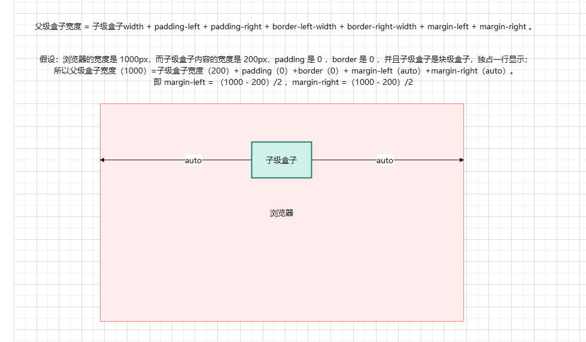

## 6.2 应用示例

* 示例：

```html
<!DOCTYPE html>
<html lang="en">
<head>
  <meta charset="UTF-8">
  <meta content="IE=edge" http-equiv="X-UA-Compatible">
  <meta content="width=device-width, initial-scale=1.0" name="viewport">
  <title>Title</title>
  <style>
    .box {
      width: 200px;
      height: 200px;
      background-color: pink;
      /*
        水平居中

        块级元素盒子的宽度和高度计算公式取决于盒子的盒模型属性，包括盒子的内边距、边框和外边距。一般来说，盒子的宽度和高度可以通过以下公式计算：
        盒子宽度 = width + padding-left + padding-right + border-left-width + border-right-width + margin-left + margin-right
        盒子高度 = height + padding-top + padding-bottom + border-top-width + border-bottom-width + margin-top + margin-bottom
        其中，width 和 height 分别表示盒子的宽度和高度，padding-left 和 padding-right 表示盒子的左右内边距，padding-top 和 padding-bottom 表示盒子的上下内边距，border-left-width 和 border-right-width 表示盒子的左右边框宽度，border-top-width 和 border-bottom-width 表示盒子的上下边框宽度，margin-left 和 margin-right 表示盒子的左右外边距，margin-top 和 margin-bottom 表示盒子的上下外边距。
        需要注意的是，这些属性的值可以是具体的像素值、百分比值或者其他单位，因此在计算盒子的宽度和高度时需要将它们转换为相同的单位。
      */
      margin: 0 auto;
    }
  </style>
</head>
<body>
  <div class="box"></div>
</body>
</html>
```


# 第七章：行内非替换元素的特殊性

## 7.1 概述

* 行内非替换元素（如：span 等），width 和 height 压根不生效。
* 行内非替换元素（如：span 等），水平方向的 margin 和 padding 布局有效；但是，垂直方向的 margin 和 padding 布局无效。

## 7.2 应用示例

* 示例：

```html
<!DOCTYPE html>
<html lang="en">

<head>
    <meta charset="UTF-8">
    <meta http-equiv="X-UA-Compatible" content="IE=edge">
    <meta name="viewport" content="width=device-width, initial-scale=1.0">
    <title>Document</title>
    <style>
        span {
            /* margin: 100px; */
            /* padding: 100px; */
            /* 可以通过 行高 来改变行内元素的垂直位置 */
            line-height: 100px;
        }
    </style>
</head>

<body>
    <!-- 行内元素，内外边距 margin 和 padding -->
    <!-- 如果想要通过 margin 或 padding 改变行内元素的垂直位置，无效生效 -->
    <!-- 行内元素的 margin-top 和 margin-bottom 不生效 -->
    <!-- 行内元素的 padding-top 和 padding-bottom 不生效 -->
    <span>span1</span>
    <span>span2</span>
</body>

</html>
```


# 第八章：外轮廓（了解）

## 8.1 概述

* `outline` 表示元素的`外轮廓`，`outline` 不占用空间，并且显示在 `border` 的`外面`。
* `outline` 相关属性有：
  * `outline-width`: 外轮廓的宽度。
  * `outline-style`：取值跟 border 的样式一样，如：solid、dotted 等。
  * `outline-color`：外轮廓的颜色。
  * `outline`：`outline-width`、`outline-style`、`outline-color` 的简写属性，跟 border 用法类似。

> PS：在实际开发中，我们一般不会设置 outline 的样式，而是去除 a 、input 元素的 focus 轮廓效果。

## 8.2 应用示例

* 示例：

```html
<!DOCTYPE html>
<html lang="en">
<head>
  <meta charset="UTF-8">
  <meta content="IE=edge" http-equiv="X-UA-Compatible">
  <meta content="width=device-width, initial-scale=1.0" name="viewport">
  <title>Title</title>
  <style>
    a, input {
      outline: none;
    }
  </style>
</head>
<body>
  <a href="#">百度一下</a>
  <input type="text">
</body>
</html>
```


# 第九章：CSS 设置背景（⭐）

## 9.1 概述

* 在实际开发中，为了让网页更加美观，我们经常会设置各种各样的背景：

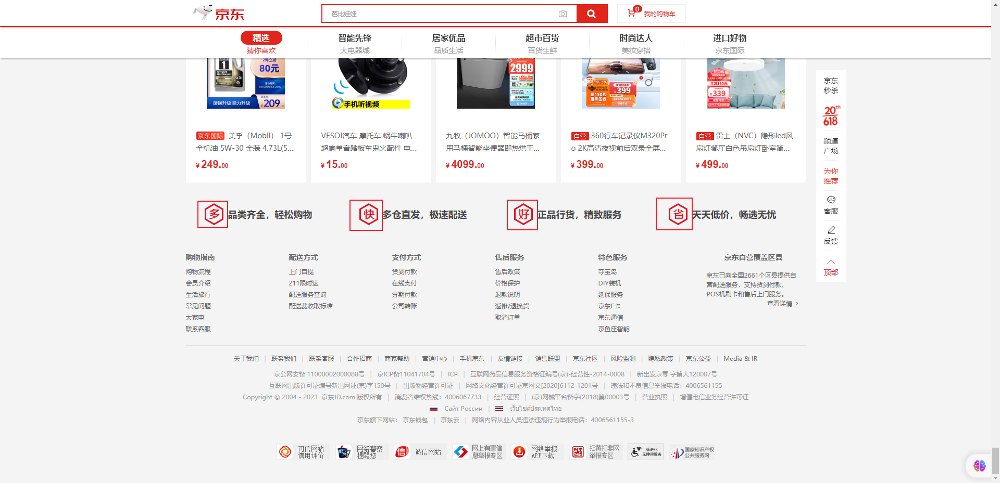

## 9.2 背景颜色

* 属性名：`background-color` 。

- 属性值：颜色取值（关键字、rgb 表示法、rgba 表示法、十六进制……）。

> PS：
>
> * 背景颜色默认值是透明，rgba(0,0,0,0) 、transparent。
> * 背景颜色不会影响盒子大小，并且还能看清盒子的大小和位置，一般在布局的时候会习惯的给盒子设置背景颜色。


* 示例：

```html
<!DOCTYPE html>
<html lang="en">

<head>
  <meta charset="UTF-8">
  <meta content="IE=edge" http-equiv="X-UA-Compatible">
  <meta content="width=device-width, initial-scale=1.0" name="viewport">
  <title>Document</title>
  <style>
    div.box {
      width: 400px;
      height: 400px;
      /* background-color: pink; */
      /* background-color: #ccc; */
      /* 红绿蓝三原色，a 是透明度，0~1 */
      background-color: rgba(0, 0, 0, .5);
    }
  </style>
</head>

<body>
  <div class="box">div</div>
</body>

</html>
```

## 9.3 背景图片

* 属性名：`background-image` 。

- 属性值：`background-image: url('图片的路径');`。

> PS：
>
> * ① 背景图片中的 url 可以省略引号。
>
> - ② 背景图片默认是在水平和垂直方向平铺的。
>
> - ③ 背景图片仅仅是给盒子起到装饰效果，类似于背景颜色，是不能撑开盒子的。
> - ④ 如果设置了背景图片之后；但是，元素没有具体的宽度和高度，背景图片是不会显示出来的。
> - ⑤ 背景图片是盖在（不是覆盖）background-color 上面的。
> - ⑥ 如果设置了多张背景图片，那么设置的第一张背景图片将显示在最上面，其它的背景图片将按照顺序层叠在下面。


* 示例：

```html
<!DOCTYPE html>
<html lang="en">
<head>
  <meta charset="UTF-8">
  <meta content="IE=edge" http-equiv="X-UA-Compatible">
  <meta content="width=device-width, initial-scale=1.0" name="viewport">
  <title>Title</title>
  <style>
    .box {
      width: 500px;
      height: 500px;
      /* 设置背景颜色 */
      background-color: pink;
      /* 设置背景图片 */
      background-image: url(./images/1.jpg);
    }
  </style>
</head>
<body>
  <div class="box"></div>
</body>
</html>
```

## 9.4 背景平铺

- 属性名：`background-repeat` 。

- 属性值：

| 取值      | 效果                           |
| --------- | ------------------------------ |
| repeat    | （默认值）水平和垂直方向都平铺 |
| no-repeat | 不平铺                         |
| repeat-x  | 沿着水平方向（x轴）平铺        |
| repeat-y  | 沿着垂直方向（y轴）平铺        |

* 补充：

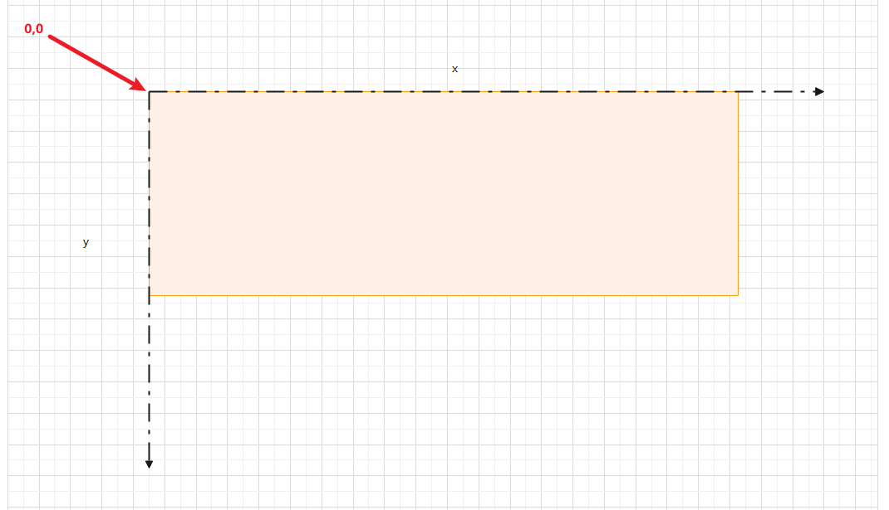


* 示例：

```html
<!DOCTYPE html>
<html lang="en">

<head>
  <meta charset="UTF-8">
  <meta content="IE=edge" http-equiv="X-UA-Compatible">
  <meta content="width=device-width, initial-scale=1.0" name="viewport">
  <title>Document</title>
  <style>
    .box {
      width: 400px;
      height: 400px;
      background-color: pink;
      background-image: url(./image/1.jpg);
      /* 背景不平铺 */
      background-repeat: no-repeat;
    }
  </style>
</head>

<body>
  <div class="box">文字</div>
</body>

</html>
```

## 9.5 背景图片尺寸

* 属性名：`background-size` 。

- 属性值：

| 取值           | 效果                                                         |
| -------------- | ------------------------------------------------------------ |
| auto           | 默认值, 以背景图本身大小显示。                               |
| cover          | 缩放背景图，以完全覆盖铺满元素,可能背景图片部分看不见（常用）。 |
| contain        | 缩放背景图，宽度或者高度铺满元素，但是图片保持宽高比。       |
| `<percentage>` | 百分比，相对于背景区（background positioning area）          |
| length         | 具体的大小，如：100px                                        |


* 示例：

```html
<!DOCTYPE html>
<html lang="en">
<head>
  <meta charset="UTF-8">
  <meta content="IE=edge" http-equiv="X-UA-Compatible">
  <meta content="width=device-width, initial-scale=1.0" name="viewport">
  <title>Title</title>
  <style>
    .box {
      width: 500px;
      height: 500px;
      /* 设置背景颜色 */
      background-color: pink;
      /* 设置背景图片 */
      background-image: url(./images/1.jpg);
      /* 设置背景不平铺 */
      background-repeat: no-repeat;
      /* 背景尺寸大小 */
      background-size: cover;
    }
  </style>
</head>
<body>
  <div class="box"></div>
</body>
</html>
```

## 9.6 背景位置

* 属性名：`background-position` 。

- 属性值：`background-position：水平方向位置 垂直方向位置` 。

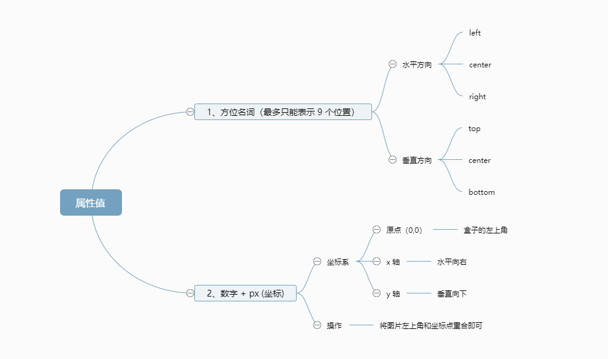

> PS：
>
> * 方位名字取值和坐标取值可以混合使用，第一个取值表示水平，第二个取值表示垂直。
> * 如果只设置了一个方向，另一个方向默认就是 `center` 。


* 示例：

```html
<!DOCTYPE html>
<html lang="en">

<head>
  <meta charset="UTF-8">
  <meta content="IE=edge" http-equiv="X-UA-Compatible">
  <meta content="width=device-width, initial-scale=1.0" name="viewport">
  <title>Document</title>
  <style>
    .box {
      width: 400px;
      height: 400px;
      background-color: pink;
      background-image: url(./images/1.jpg);
      background-repeat: no-repeat;
      /* background-position: 水平方向 垂直方向; */
      background-position: center center;
    }
  </style>
</head>

<body>
  <div class="box">文字</div>
</body>

</html>
```

## 9.7 背景（简写属性）

* background 是一系列背景相关属性的简写属性。
* 语法：

```css
background: color image repeat position/size;
```

> PS：
>
> * 属性的顺序是任意的，并且 `background-size` 是可以省略的，如果不省略，`/background-size` 必须在 `background-position` 的后面。
> * 一般，我们都会单独设置 `background-size` 。


* 示例：

```html
<!DOCTYPE html>
<html lang="en">

<head>
  <meta charset="UTF-8">
  <meta content="IE=edge" http-equiv="X-UA-Compatible">
  <meta content="width=device-width, initial-scale=1.0" name="viewport">
  <title>Document</title>
  <style>
    .box {
      width: 400px;
      height: 400px;
      background: pink url(./images/1.jpg) no-repeat center;
    }
  </style>
</head>

<body>
  <div class="box">文字</div>
</body>

</html>
```

## 9.8 图片 VS 背景图片

* 背景图片（background-image）和图片（img）都能够实现显示图片的需求；那么，在开发中该如何选择？

|                              | img                | background-image |
| ---------------------------- | ------------------ | ---------------- |
| 性质                         | HTML 元素          | CSS 样式         |
| 图片是否占用空间             | √                  | ×                |
| 浏览器右键是否能直接查看地址 | √                  | ×                |
| 是否支持 CSS 精灵图          | ×                  | √                |
| 是否更可能被搜索引擎收录     | √（结合 alt 属性） | ×                |

* 总结：
  * img，作为网页内容的重要组成部分，如：广告图片、LOGO图片、文章配图、产品图片。
  * background-image，可有可无。有，能让网页更加美观。无，也不影响用户获取完整的网页内容信息。
