# 第一章：软件开发和程序员

## 1.1 生活中的软件有哪些？

* 生活中的软件有很多，如：`微信`、`抖音`、`王者荣耀`、`网易云音乐`、`淘宝`、`京东`、`Office` 等。

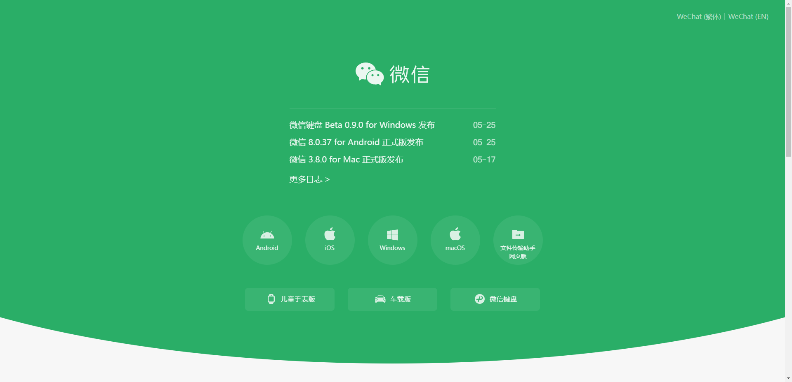


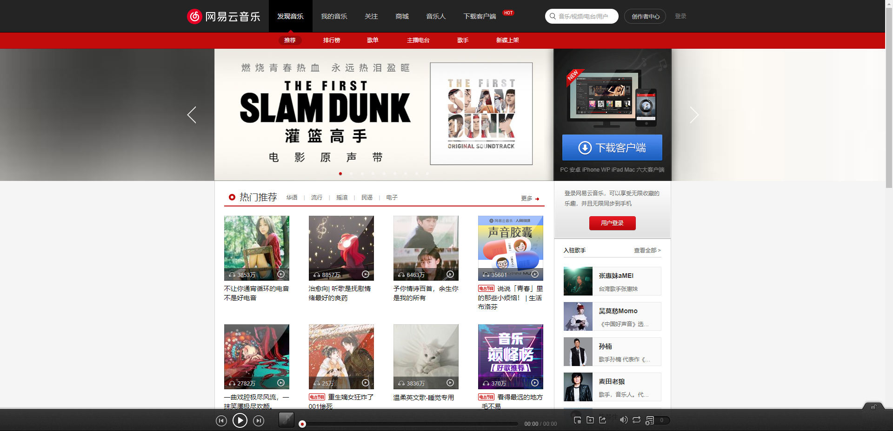

## 1.2 软件的专业定义

* 软件的专业定义：一系列按照特定顺序组织的`计算机数据`和`指令`，是电脑的`非有型部分`。
* 软件开发就是告诉`计算机一系列的指令`，而这些指令也称为`程序`。
* 使用各种`编程语言（如：Java、C 等）`开发软件的人就称之为`软件开发工程师`，也称之为`程序员`。

## 1.3 软件开发和应用程序开发有什么区别？

* 软件开发包括了应用程序开发，包括操作系统开发、编程语言开发、算法开发以及应用程序开发等。

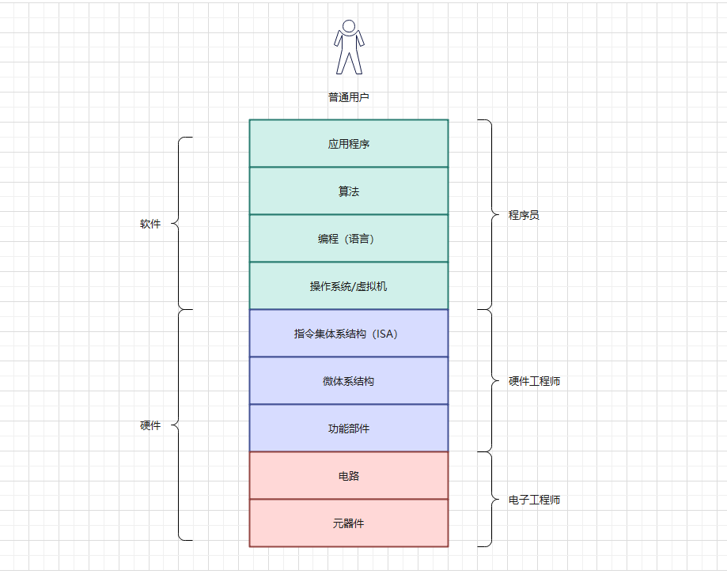

## 1.4 程序员（开发工程师）

* 开发系统中各个环节的不同部分都属于`软件开发`，这些开发者我们称之为`软件开发工程师（程序员）`。

> [!NOTE]
>
> 在实际生活中，程序员也会自嗨，称自己为码农、码畜、码神、IT 民工、开发者等等。


* 按照`职能`的部分也可以划分为如下的两类：
  * `后端（back-end）开发`：一般用来写业务逻辑的，我们统称为`后端开发工程师`。
  * `前端（front-end）开发`：一般用来写页面（界面）的，我们统称为`前端开发工程师`。

> [!NOTE]
>
> 其实，实际中可能划分的更加细致。
>
> * 后端开发工程师可以划分为：Java 开发工程师、大数据开发工程师、人工智能开发工程师等。
> * 前端开发工程师可以划分为：前端开发工程师、Android 和 iOS 开发工程师。

* 前端开发工程师可以负责 WEB（网站、后台管理系统、手机 H5）、小程序端，也可以做：移动端（Uniapp、React Native）、桌面端（Eletron）、服务器开发（Node.js）。


# 第二章：网站和网页（⭐）

## 2.1 网页和网站

* 网页的专业术语叫做 `Web Page`；通过浏览器`查看到的页面`，是网络中的`一页`；网页的内容非常丰富，包括`文字`、`超链接`、`图片`、`音乐`、`视频`等。

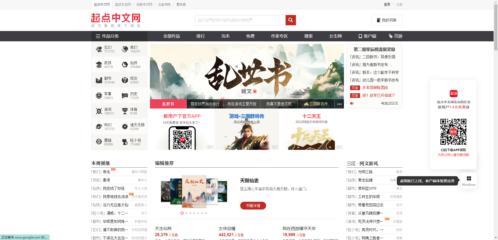

* 网站通常由`多个网页组成`，即一个网站是由 N 个网页组成（N >= 1）。

## 2.2 网页的显示过程（用户的角度）

* 网页的显示过程：
  * ① 用户在浏览器`输入一个网址`。
  * ② 浏览器会找到对应的`服务器地址`，请求`静态资源`。
  * ③ 服务器`返回静态资源给浏览器`。
  * ④ 浏览器`对静态资源进行解析和展示`。
* 流程如下所示：

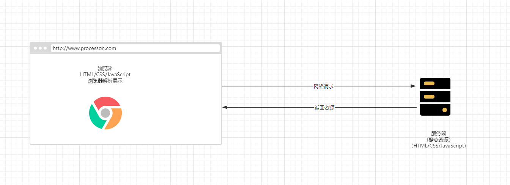

## 2.3 网页的显示过程（前端工程师的角度）

* 网页的显示过程：
  * ① `开发项目`（HTML、CSS、JavaScript、Vue、React 等）。
  * ② `打包、部署项目`到服务器。
* 流程如下所示：

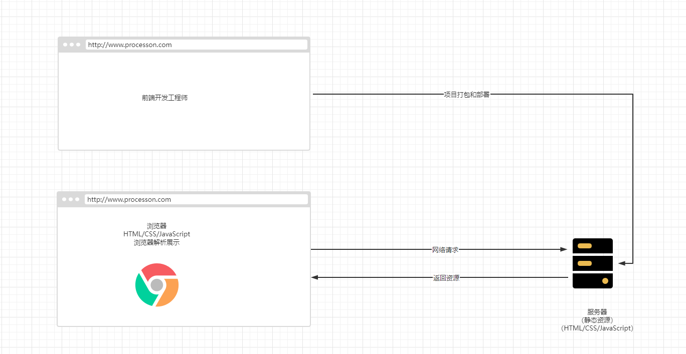

## 2.4 服务器到底是什么？

* 我们`日常生活`中接触到的基本上属于`客户端`、`前端`的内容，如：`浏览器`、`QQ`、`微信`、`小程序`等。
* 其实，我们知道自己的手机中是不可能缓存那么多的数据，而这些数据大部分是存放在`服务器`中的。
* 服务器的本质就是`一台类似个人 PC 一样的主机`，只不过服务器要求：① 24h 不宕机（稳定运行）② 没有显示器 ③ 通常装的是 Linux 系统，如：AlmaLinux 等。

* 目前，很多中小型互联网公司的服务器都是使用云服务器，如：微软云、亚马逊云、阿里云等。

## 2.5 网页的组成

* 网页是由什么开发出来的？
  * 阶段一：HTML 元素。
  * 阶段二：HTML 元素 + CSS 样式。
  * 阶段三：HTML 元素 + CSS 样式 + JavaScript 语言。

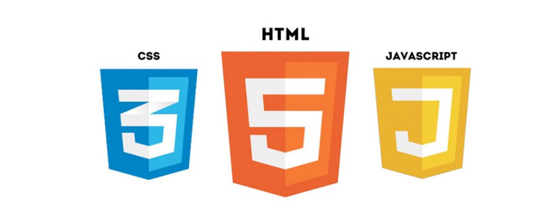

* HTML 是用来做网页的`内容结构`，CSS 是用来做网页的`视觉体验`，而 JavaScript 是用来做网页的`交互处理`。

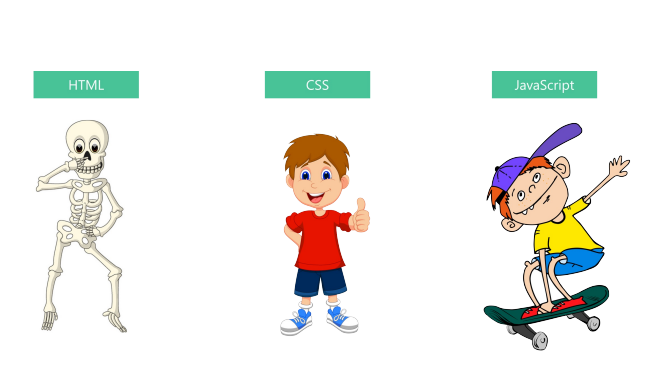


# 第三章：浏览器和浏览器内核（⭐）

## 3.1 浏览器的作用

* 我们已经明确的知道了`网页的组成部分：HTML、CSS、JavaScript` 。
* 但是，这些看起来`枯燥的代码`，是如何渲染成`多彩的网页`的？其实，是通过`浏览器`来进行渲染的。

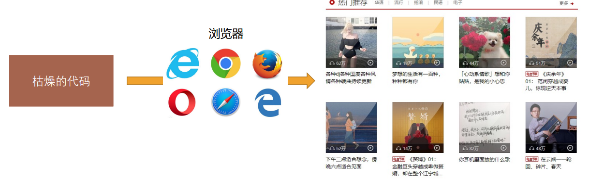

* 而浏览器最核心的部分其实就是`浏览器的内核`了。

## 3.2 浏览器的渲染引擎

* 浏览器最核心的部分是渲染引擎（Rendering Engine），一般也称为`浏览器内核`，负责`解析网页语法`，并`渲染（显示）网页`。
* 常见的浏览器非常多：

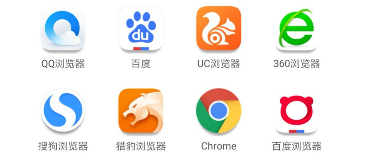

* 但是，对于开发者来说，`Chrome` 浏览器是必须选择。

## 3.3 不同的浏览器内核

* 常见的浏览器内核有：

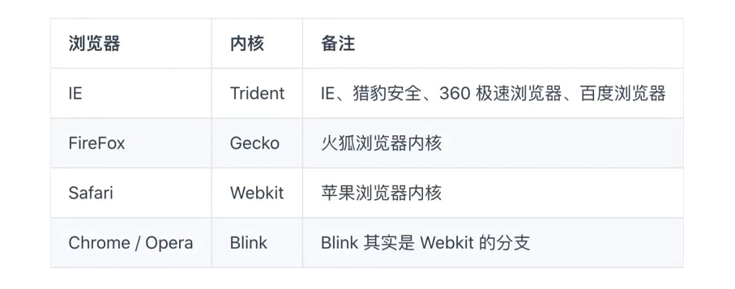

* 不同的浏览器内核有不同的解析、渲染规则，所以同一网页在不同内核的浏览器中的渲染效果也可能不同。

> [!NOTE]
>
> * ① 现在前端已经很少去兼容其它浏览器了，通常而言，只需要兼容 Chrome 即可。
> * ② 在后期，可以通过 [PostCSS](https://postcss.org/) 等来帮助我们生成兼容的代码。


# 第四章：HTML 结构 -- 元素剖析（⭐）

## 4.1 第一个网页

* HTML（Hyper Text Markup Language）：超文本标记语言。 
* HTML 是专门用于网页开发的语言，主要通过 HTML 标签对网页中的文本、图片、音频和视频等内容进行描述。 


* 示例：

```html
<!DOCTYPE html>
<html lang="en">
<head>
  <meta charset="UTF-8">
  <meta content="IE=edge" http-equiv="X-UA-Compatible">
  <meta content="width=device-width, initial-scale=1.0" name="viewport">
  <title>Title</title>
</head>
<body>
  我的第一个网页
</body>
</html>
```

## 4.2 认识 HTML

* HTML（HyperText Markup Language，超文本标记语言）是一种用于创建`网页`的标准`标记语言`；换言之，HTML 元素是构建网站的基石。

> [!NOTE]
>
> 什么是标记语言？答案如下所示：
>
> * ① 由无数个`标记（标签，tag）`组成。
> * ② 是对`某些内容进行特殊的标记`，以便`其他的解释器识别处理`；如：使用`<h2></h2>`标记的文本会被识别为`标题`并进行`加粗`、`文字放大`显示。
> * ③ 由`标签和内容`组成的被称为`元素（element）`。

> [!NOTE]
>
> 什么是超文本？答案如下所示：
>
> * ① HTML 表示不仅仅可以插入`普通的文本`，还可以插入`图片`、`音频`、`视频`等内容。
> * ② HTML 还可以插入`超链接`，从一个网页跳转到另一个网页。

## 4.3 HTML 文件的特点 -- 扩展名（后缀名）

* HTML 文件的扩展名是 `.htm` 或 `.html`；不过，现在统一使用 `.html`。

> [!NOTE]
>
> 之所以有 `.htm`，是因为历史遗留问题，Win95 或 Win98 系统的文件扩展名不支持超过 3 个字符，所以只能使用 `.htm`。

## 4.4 HTML 文件的特点 -- 结构

* 网页类似于一篇文章： 

  * 每一页文章内容是有固定的结构的，如：开头、正文、落款……
  * 网页中也存在固定的结构，如：整体、头部、标题、主体。

* 网页中的固定结构是要通过特定的 HTML 标签进行描述的。

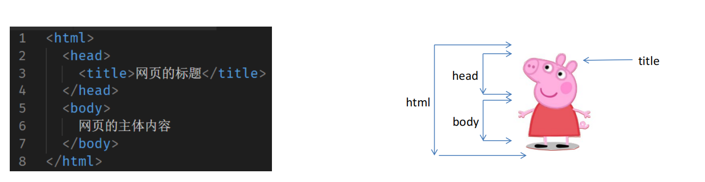

## 4.5 开发工具

* 虽然，`记事本`软件也可以开发网页？但是，有如下的缺点：
  * ① 创建和管理文件不方便 。
  * ② 没有颜色标识，没有智能提示，无法调试程序。


* 在实际开发中，还需要`专业`的`前端开发工具`，如下所示：
  * `WebStorm`、`Visual Studio Code`、`Sublime Text` 、IntelliJ IDEA 、Notepad++。
  * 智能提示、高亮识别、语法检测、集成环境、开发效率高。

> [!NOTE]
>
> 目前，前端一般使用 `Visual Studio Code`，主要是因为开源免费，并且插件丰富。

## 4.6 HTML 元素（重点）

### 4.6.1 认识元素

* 我们知道 HTML 本质上是由一系列的`元素（Element）`构成的。

>[!NOTE]
>
>`元素`是网页的一部分，一个元素可以`包含一个数据项`，`或是一块文本`，`或是一张照片`，`亦或是什么也不包含`。

* HTML 元素非常多，可以通过查看 [MDN](https://developer.mozilla.org/zh-CN/docs/Web/HTML/Element) 来熟悉。

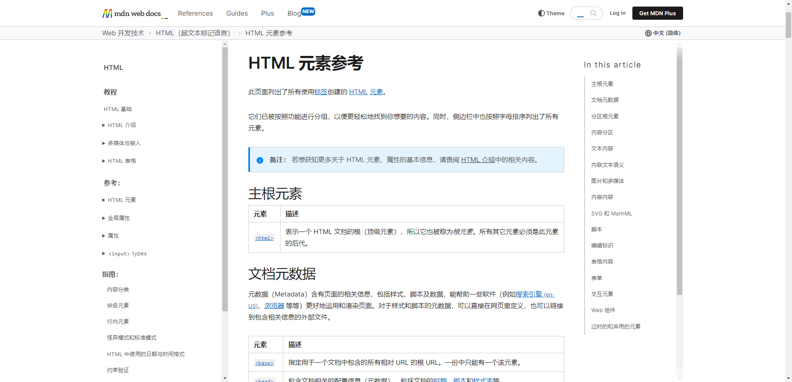


> [!NOTE]
>
> 我们会发现 HTML 元素非常之多，怎么记住？其实，不用太刻意去记忆，毕竟实际开发中，使用到的就那么几个，用多了，也就记住了。

### 4.6.2 元素的组成

* 剖析一个 HTML 元素的组成：

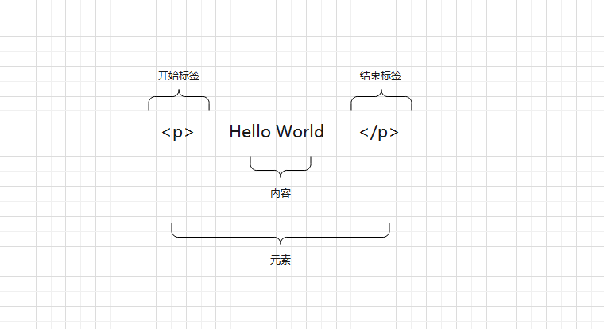

* 这个标签的主要部分有：
  * `开始标签（Opening tag）`：包含元素的名称（本例中是 p），被左、右尖括号所包围，表示元素从这里开始或者从这里起作用。
  * `结束标签（Closing tag）`：和开始标签类似，只是在元素名的签名添加了一个`/(斜杠)`，表示元素从这里结束。
  * `内容（Content）`：元素的内容（本例中是 Hello World）。
  * `元素（Element）`：开始标签、结束标签和内容相结合，就是一个完整的元素。

> [!NOTE]
>
> * ① 并不是所有的元素都有开始标签、结束标签以及内容；有些元素只有开始标签，如：`<meta>`、`<br>`、`<hr>`、`` 等，也有人称这些元素为单标签元素。
> * ② HTML 元素是不区分大小写的，但是`推荐`使用`小写`。

### 4.6.3 元素的属性

* 元素也可以拥有属性（Attribute）：

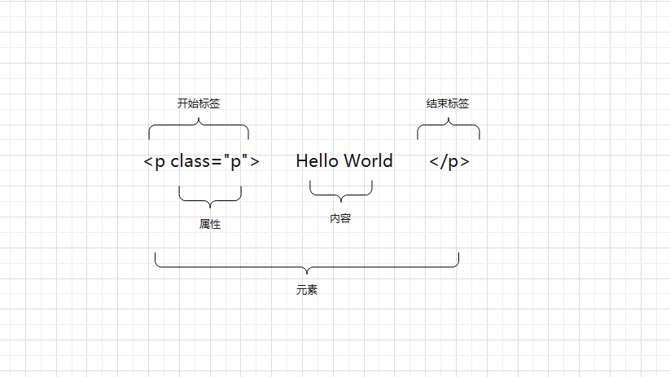

* 属性包含元素的额外信息，这些信息并不会出现在实际的内容中。
* 一个元素必须包含如下的内容：
  * `一个空格`，在属性和元素名称之间（如果有多个属性，那么就和前一个属性之间有一个空格）。
  * `属性名称`，后面跟着要给 `=`（等于） 号。
  * `属性值`，由一对`引号 "" 或 ''`引起来。

> [!NOTE]
>
> 一个元素中可以有一个属性，也可以没有属性，也可以包含多个属性。


* 示例：

```html
<!DOCTYPE html>
<html lang="en">
<head>
  <meta charset="UTF-8">
  <meta content="IE=edge" http-equiv="X-UA-Compatible">
  <meta content="width=device-width, initial-scale=1.0" name="viewport">
  <title>Title</title>
</head>
<body>
  <a href="https://www.baidu.com">百度一下</a>
</body>
</html>
```

### 4.6.4 元素属性的分类

* 有些属性是公共的，每一个元素都可以设置，如：`class` 、`id` 、`title` 属性。
* 有些属性是元素特有的，不是每一个元素都可以设置的，如：`meta` 元素的 `charset` 属性，`img` 元素的 `alt` 属性 。

> [!NOTE]
>
> 不用刻意去记忆，后面使用到了，自然就会知道了。

### 4.6.5 元素的嵌套关系

* 某些元素的内容除了可以是文本之外，还可以是其它的元素，这样就形成了`元素的嵌套`。


* 示例：

```html
<!DOCTYPE html>
<html lang="en">
<head>
  <meta charset="UTF-8">
  <meta content="IE=edge" http-equiv="X-UA-Compatible">
  <meta content="width=device-width, initial-scale=1.0" name="viewport">
  <title>Title</title>
</head>
<body>
  <div>
    爱好
    <ul>
      <li><a href="#">吃饭</a></li>
      <li><a href="#">睡觉</a></li>
      <li><a href="#">打豆豆</a></li>
    </ul>
  </div>
</body>
</html>
```

## 4.7 注释

* 什么是注释？
  * 简单来说，注释就是一段代码的说明。
  * 注释是给开发者看的，浏览器并不会将注释显示给用户看。
* 注释的意义：
  * 帮助我们自己理清代码的思路，方便以后进行查阅。
  * 与别人合作开发时，添加注释，可以减少沟通成本。
  * 开发自己的框架时，加入适当的注释，方便别人使用和学习。
  * 可以临时注释掉一段代码，方便调试。

> [!NOTE]
>
> 注释的快捷键是 `Ctrl + /` 。


* 示例：

```html
<!DOCTYPE html>
<html lang="en">
<head>
  <meta charset="UTF-8">
  <meta content="IE=edge" http-equiv="X-UA-Compatible">
  <meta content="width=device-width, initial-scale=1.0" name="viewport">
  <title>Title</title>
</head>
<body>
  <!-- 这是注释，实际并不会执行，仅仅用来说明代码的含义，方便协同开发。 -->
  <h2>呵呵哒</h2>
</body>
</html>
```
