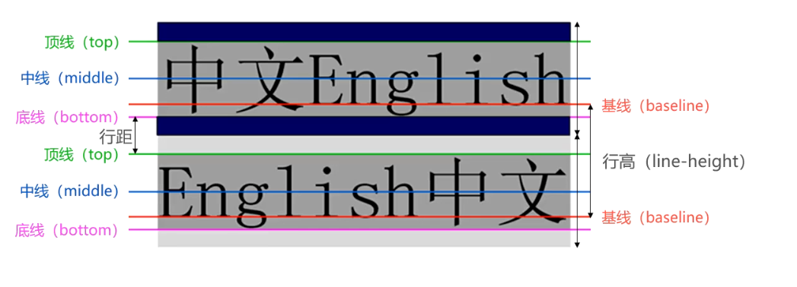
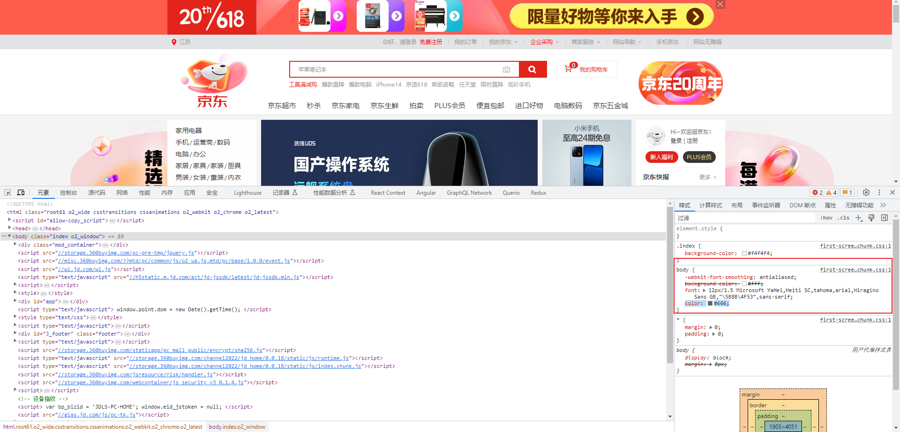

# 第一章：文本属性（⭐）

## 1.1 text-decoration

* text-decoration 用于设置文字的装饰线。其中，decoration  是装饰、装饰品的意思。
* text-decoration 的常用取值：

| 属性值       | 描述                   |
| ------------ | ---------------------- |
| none         | 没有任何装饰线（常用） |
| underline    | 下划线                 |
| overline     | 上划线                 |
| line-through | 删除线                 |

> PS：实际开发中，经常通过 `a {text-decoration :none;}` 将 a 元素的默认下划线去掉。


* 示例：

```html
<!DOCTYPE html>
<html lang="en">
<head>
  <meta charset="UTF-8">
  <meta content="IE=edge" http-equiv="X-UA-Compatible">
  <meta content="width=device-width, initial-scale=1.0" name="viewport">
  <title>Title</title>
  <style>
    a {
      /* 去掉 a 元素的下划线 */
      text-decoration: none;
    }

    .one {
      /* 下划线 */
      text-decoration: underline;
    }

    .two {
      /* 上划线 */
      text-decoration: overline;
    }

    .three {
      /* 删除线 */
      text-decoration: line-through;
    }
  </style>
</head>
<body>
  <p class="one">我是p元素</p>
  <p class="two">我是p元素</p>
  <p class="three">我是p元素</p>
  <p>我是p元素</p>

  <a href="https://www.baidu.com">百度一下</a>
</body>
</html>
```

## 1.2 text-indent（了解）

* text-indent 一般用于设置首行文本缩进。
* 取值： 
  * 数字 + px 。
  * 数字 + em （推荐，1em = 当前标签的 font-size 的大小）。

> PS：目前，该属性已经很少使用了。


* 示例：

```html
<!DOCTYPE html>
<html lang="en">
<head>
  <meta charset="UTF-8">
  <meta content="IE=edge" http-equiv="X-UA-Compatible">
  <meta content="width=device-width, initial-scale=1.0" name="viewport">
  <title>Title</title>
  <style>
    p {
      /* 首行缩进 2 个字符 */
      text-indent: 2em;

      width: 500px;
      height: 200px;
      background-color: pink;
    }
  </style>
</head>
<body>
  <p>
    黑洞（英文：Black
    Hole）是现代广义相对论中，存在于宇宙空间中的一种天体。黑洞的引力极其强大，使得视界内的逃逸速度大于光速。故而，“黑洞是时空曲率大到光都无法从其事件视界逃脱的天体”。
    黑洞（英文：Black
    Hole）是现代广义相对论中，存在于宇宙空间中的一种天体。黑洞的引力极其强大，使得视界内的逃逸速度大于光速。故而，“黑洞是时空曲率大到光都无法从其事件视界逃脱的天体”。
  </p>
</body>
</html>
```

## 1.3 text-align

* MDN 的解释：`text-align` CSS 属性定义行内内容（如：文字）如何相对它的块父元素对齐。`text-align` 并不控制块元素自己的对齐，只控制它的行内内容的对齐。
* text-align 的常用取值：

| 属性值 | 描述     |
| ------ | -------- |
| left   | 左对齐   |
| center | 居中对齐 |
| right  | 右对齐   |

> PS：`text-align: center;` 能让行内级元素（行内元素和行内块元素，如：文本、img 、a 等）水平居中。


* 示例：

```html
<!DOCTYPE html>
<html lang="en">
<head>
  <meta charset="UTF-8">
  <meta content="IE=edge" http-equiv="X-UA-Compatible">
  <meta content="width=device-width, initial-scale=1.0" name="viewport">
  <title>Title</title>
  <style>
    .box {
      width: 200px;
      height: 200px;
      background-color: pink;

      /* 文本水平居中 */
      text-align: center;
    }
  </style>
</head>
<body>
  <div class="box">我是div元素</div>
</body>
</html>
```


* 示例：

```html
<!DOCTYPE html>
<html lang="en">
<head>
  <meta charset="UTF-8">
  <meta content="IE=edge" http-equiv="X-UA-Compatible">
  <meta content="width=device-width, initial-scale=1.0" name="viewport">
  <title>Title</title>
  <style>
    .box {
      width: 500px;
      height: 300px;
      background-color: pink;

      /* 图片水平居中 */
      text-align: center;
    }

    img {
      width: 225px;
    }
  </style>
</head>
<body>
  <div class="box">
    
  </div>
</body>
</html>
```


* 示例：

```html
<!DOCTYPE html>
<html lang="en">
<head>
  <meta charset="UTF-8">
  <meta content="IE=edge" http-equiv="X-UA-Compatible">
  <meta content="width=device-width, initial-scale=1.0" name="viewport">
  <title>Title</title>
  <style>
    .box {
      width: 500px;
      height: 300px;
      background-color: pink;
      /* a 元素水平居中 */
      text-align: center;
    }

    .inner {
      width: 200px;
      height: 200px;
      background-color: red;
    }
  </style>
</head>
<body>
  <div class="box">
    <a class="inner" href="#">百度一下</a>
  </div>
</body>
</html>
```


* 示例：

```html
<!DOCTYPE html>
<html lang="en">
<head>
  <meta charset="UTF-8">
  <meta content="IE=edge" http-equiv="X-UA-Compatible">
  <meta content="width=device-width, initial-scale=1.0" name="viewport">
  <title>Title</title>
  <style>
    .box {
      width: 500px;
      height: 300px;
      background-color: pink;

      /* 块级元素不生效！！！ */
      text-align: center;
    }

    .inner {
      width: 200px;
      height: 200px;
      background-color: red;
    }
  </style>
</head>
<body>
  <div class="box">
    <div class="inner"></div>
  </div>
</body>
</html>
```


* 示例：

```html
<!DOCTYPE html>
<html lang="en">
<head>
  <meta charset="UTF-8">
  <meta content="IE=edge" http-equiv="X-UA-Compatible">
  <meta content="width=device-width, initial-scale=1.0" name="viewport">
  <title>Title</title>
  <style>
    .box {
      width: 500px;
      height: 300px;
      background-color: pink;

      /* 块级元素不生效；但是，行内块元素是生效的！！！ */
      text-align: center;
    }

    .inner {
      /* 设置 div 为行内块元素 */
      display: inline-block;

      width: 200px;
      height: 200px;
      background-color: red;
    }
  </style>
</head>
<body>
  <div class="box">
    <div class="inner"></div>
  </div>
</body>
</html>
```


# 第二章：字体属性（⭐）

## 2.1 font-size 

* font-size 决定文字的大小。
* 常用的设置：
  * `具体数值 + 单位`，如：100 px，也可以使用 em ，1 em 代表 100% ，2 em 代表 200% 。
  * `百分比`：基于父元素的 font-size 计算，如：50% 就表示等于父元素 font-size 的一半。


* 示例：

```html
<!DOCTYPE html>
<html lang="en">
<head>
  <meta charset="UTF-8">
  <meta content="IE=edge" http-equiv="X-UA-Compatible">
  <meta content="width=device-width, initial-scale=1.0" name="viewport">
  <title>Title</title>
  <style>
    .box {
      /* 设置字体大小，在 Chrome 浏览器，默认是 16px */
      font-size: 20px;
    }
  </style>
</head>
<body>
  <div class="box">我是div元素</div>
</body>
</html>
```


* 示例：

```html
<!DOCTYPE html>
<html lang="en">
<head>
  <meta charset="UTF-8">
  <meta content="IE=edge" http-equiv="X-UA-Compatible">
  <meta content="width=device-width, initial-scale=1.0" name="viewport">
  <title>Title</title>
  <style>
    .box {
      /*
        设置字体大小：
          1em = 16px ，
          2em = 2 * 16px = 32px
      */
      font-size: 2em;
    }
  </style>
</head>
<body>
  <div class="box">我是div元素</div>
</body>
</html>
```


* 示例：

```html
<!DOCTYPE html>
<html lang="en">
<head>
  <meta charset="UTF-8">
  <meta content="IE=edge" http-equiv="X-UA-Compatible">
  <meta content="width=device-width, initial-scale=1.0" name="viewport">
  <title>Title</title>
  <style>
    .home {
      font-size: 20px;
    }

    .box {
      /*
        .box 盒子会继承 .home 盒子的 font-size ，即 20px ；所以，.box 盒子的 font-size 就是 20px;
        而 2em = 2 * font-size = 2 * 20px = 40px 。
      */
      font-size: 2em;
    }
  </style>
</head>
<body>
  <div class="home">
    <div class="box">我是div元素</div>
  </div>
</body>
</html>
```


* 示例：

```html
<!DOCTYPE html>
<html lang="en">
<head>
  <meta charset="UTF-8">
  <meta content="IE=edge" http-equiv="X-UA-Compatible">
  <meta content="width=device-width, initial-scale=1.0" name="viewport">
  <title>Title</title>
  <style>
    .box {
      /* 基于父元素的 font-size 计算，如：50% 就表示等于父元素 font-size 的一半 */
      font-size: 50%;
    }
  </style>
</head>
<body>
  <div class="box">我是div元素</div>
</body>
</html>
```

## 2.2 font-family

* font-family 用于设置`文字的字体名称`：
  * 可以设置 `1 个或者多个` 字体名称，浏览器会选择列表中的第一个该计算机上有安装的字体。
  * 也可以通过 `@font-face 指定可以直接下载的字体`。

> PS：通常而言，一个网站只需要设置一次即可，因为该属性可以继承。


* 示例：

```html
<!DOCTYPE html>
<html lang="en">
<head>
  <meta charset="UTF-8">
  <meta content="IE=edge" http-equiv="X-UA-Compatible">
  <meta content="width=device-width, initial-scale=1.0" name="viewport">
  <title>Title</title>
  <style>
    body {
      font-family: Arial, Helvetica, sans-serif;
    }
  </style>
</head>
<body>
  <div class="box">我是div元素</div>
</body>
</html>
```

## 2.3 font-weight

* font-weight 用于设置`文字的粗细`。
* 常见的取值：
  * `normal` 等于 `400` 。
  * `bold` 等于 `700` 。

> PS：
>
> * 虽然 font-weight 可以设置 100 、200 、300 、400 、500、 600 、700 、800 和 900 ；但是，很多浏览器只实现了 400 和 700 ！
> * strong 、b、h1 ~ h6 元素的 font-weight 默认就是 bold 。


* 示例：

```html
<!DOCTYPE html>
<html lang="en">
<head>
  <meta charset="UTF-8">
  <meta content="IE=edge" http-equiv="X-UA-Compatible">
  <meta content="width=device-width, initial-scale=1.0" name="viewport">
  <title>Title</title>
  <style>
    .normal {
      /* 正常粗细，相当于 400 */
      font-weight: normal;
    }

    .bold {
      /* 文字加粗，相当于 700 */
      font-weight: bold;
    }
  </style>
</head>
<body>
  <div class="normal">我是div元素</div>
  <div class="bold">我是div元素</div>
</body>
</html>
```

## 2.4 font-style（了解）

* font-style 用于设置文字的`常规`和`斜体`显示。
* font-style 的常见取值：
  * `normal`：常规显示。
  * `italic`（斜体）：用字体的斜体显示（通常会有专门的字体）。
  * `oblique`（倾斜）：文本倾斜显示（仅仅是让文字倾斜）。

> PS：
>
> * 现在，大部分网站很少让文字倾斜显示了。
> * em、i、cite、address、var 等元素的 font-style 默认就是 italic。


* 示例：

```html
<!DOCTYPE html>
<html lang="en">
<head>
  <meta charset="UTF-8">
  <meta content="IE=edge" http-equiv="X-UA-Compatible">
  <meta content="width=device-width, initial-scale=1.0" name="viewport">
  <title>Title</title>
  <style>
    .box1 {
      /* 文字常规显示 */
      font-style: normal;
    }

    .box2 {
      /* 文字斜体显示，通常需要专门的字体 */
      font-style: italic;
    }

    .box3 {
      /* 文字倾斜显示，仅仅是让文字倾斜 */
      font-style: oblique;
    }
  </style>
</head>
<body>
  <div class="box1">我是div元素</div>
  <div class="box2">我是div元素</div>
  <div class="box3">我是div元素</div>
</body>
</html>
```

## 2.5 line-height

* 行高的严格定义是：两行文字基线（baseline）之间的间距。
* 基线（baseline）：和小写字符 x 最底部对齐的线。



* 其实，也可以类比于小时候我们练习的英语本：


* 作用：控制一行的上下行间距。 

* 取值： 

  * `数字 + px` 。
  * `倍数`（当前标签 font-size 的倍数）。

* 应用： 
  * ① 让 `单行文本` 垂直居中可以设置 `line-height: 文字父元素高度` 。
  * ② 网页精准布局的时候，会设置 `line-height:1` 取消上下间距。


* 示例：

```html
<!DOCTYPE html>
<html lang="en">

<head>
  <meta charset="UTF-8">
  <meta content="IE=edge" http-equiv="X-UA-Compatible">
  <meta content="width=device-width, initial-scale=1.0" name="viewport">
  <title>Document</title>
  <style>
    p {
      /* 行高 */
      line-height: 50px;
    }
  </style>
</head>

<body>
  <p>
    黑洞的中间的奇点蕴含着无限的物质，就连光也无法逃逸。黑洞产生的引力能把周围的一切物质：时空、星球、光等等所有一切都吸进质量无穷大的奇点之中。
  </p>
  <p>
    我相信，人类对于黑洞、白洞都存在浓厚的兴趣，太神奇了，能将所有的物质都浓缩到一个奇点上面，这个技术如果能掌握，一定能让科技进步一大截！
  </p>
</body>

</html>
```


* 示例：

```html
<!DOCTYPE html>
<html lang="en">

<head>
  <meta charset="UTF-8">
  <meta content="IE=edge" http-equiv="X-UA-Compatible">
  <meta content="width=device-width, initial-scale=1.0" name="viewport">
  <title>Document</title>
  <style>
    .box {
      width: 200px;
      height: 200px;
      background-color: pink;
      /* 水平居中 */
      text-align: center;
      /* 文字垂直居中 */
      line-height: 200px;
    }
  </style>
</head>

<body>
  <div class="box">我是div元素</div>
</body>

</html>
```

## 2.6 font 缩写属性

* font 属性可以用来作为 font-style，font-variant，font-weight，font-size，line-height 和 font-family 属性的简写：

```css
font: font-style font-variant font-weight font-size/line-height font-family;
```

* 规则：
  * ① font-style、font-variant 、font-weight 可以随意调换顺序，并且可以省略。
  * ② `/line-height` 可以省略，如果不省略，必须在 font-size 后面。
  * ③ font-size 和 font-family 不可以调换顺序，并且不可以省略。
* 查看 `京东` 是如何设置的：



> PS：不要记，大致了解一下，就可以了；用的时候，看像 `京东`、`小米`之类的网站怎么设置的；并且，通常一个网站仅需要设置一次。


* 示例：

```html
<!DOCTYPE html>
<html lang="en">
<head>
  <meta charset="UTF-8">
  <meta content="IE=edge" http-equiv="X-UA-Compatible">
  <meta content="width=device-width, initial-scale=1.0" name="viewport">
  <title>Title</title>
  <style>
    body {
      /* font 复合属性 */
      font: 12px/1.5 Microsoft YaHei, Heiti SC, tahoma, arial, Hiragino Sans GB, "\5B8B\4F53", sans-serif;
      /* 文字颜色 */
      color: #666;
    }
  </style>
</head>
<body>
  <div class="box">我是div元素</div>
</body>
</html>
```

## 2.7 样式的层叠问题

* 【问】给同一个元素设置了相同的样式，此时浏览器会如何渲染呢？
* 【答】如果给同一个标签设置了相同的样式，此时样式会层叠（覆盖），写在最下面的会生效。

> PS：CSS（层叠样式表）中的层叠就是叠加的意思，即样式可以一层一层的层叠覆盖。


* 示例：

```html
<!DOCTYPE html>
<html lang="en">
<head>
  <meta charset="UTF-8">
  <meta content="IE=edge" http-equiv="X-UA-Compatible">
  <meta content="width=device-width, initial-scale=1.0" name="viewport">
  <title>Title</title>
  <style>
    p {
      /* 层叠性：后面的会覆盖前面的 */
      color: blue;
      color: red;
    }
  </style>
</head>
<body>
  <p>我是一个p标签</p>
</body>
</html>
```


# 第三章：基础选择器（⭐）

## 3.1 概述

* 选择器主要用于选中页面中对应的元素，方便后续设置样式。

## 3.2 通配符选择器

* 语法：

```css
* { 
    ...
}
```

* 作用：找到页面中所有的元素，设置样式。

> PS：实际开发中，一般用于清除浏览器默认设置的内外边距；并且，一个网站也仅仅只需要设置一次。


* 示例：

```html
<!DOCTYPE html>
<html lang="en">
<head>
  <meta charset="UTF-8">
  <meta content="IE=edge" http-equiv="X-UA-Compatible">
  <meta content="width=device-width, initial-scale=1.0" name="viewport">
  <title>Title</title>
  <style>
    * {
      /* 清除浏览器默认设置的内外边距 */
      margin: 0;
      padding: 0;
    }
  </style>
</head>
<body>
  <h2>我是标题</h2>
</body>
</html>
```

## 3.3 元素选择器

* 语法：

```css
元素 {
    ...
}
```

*  作用：通过元素名，找到页面中所有的这类元素，并设置样式。

> PS：
>
> * 元素选择器选择的是一类元素，而不是单独的某一个。
> * 元素选择器无论嵌套关系有多深，都能找到对应的元素。


* 示例：

```html
<!DOCTYPE html>
<html lang="en">
<head>
  <meta charset="UTF-8">
  <meta content="IE=edge" http-equiv="X-UA-Compatible">
  <meta content="width=device-width, initial-scale=1.0" name="viewport">
  <title>Title</title>
  <style>
    /* 元素选择器 */
    p {
      color: red;
    }
  </style>
</head>
<body>
  <div class="box">
    <p>我是p元素</p>
    <ul>
      <li>
        <p>我是p元素</p>
      </li>
    </ul>
  </div>
  <p>我是p元素</p>
</body>
</html>
```

## 3.4 类选择器

* 语法：

```css
.类名{
    ...
}
```

* 作用：通过类名，找到页面中所有带这个类名的元素，并设置样式。

> PS：
>
> * ① 所有元素上都有 class 属性，class 属性的属性值称为 类名（类似于名字）。
> * ② 类名可以由数字、字母、下划线、中划线组成，但是不能以数字或中划线开头。
> * ③ 一个元素可以同时有多个类名，类名之间以空格隔开。
> * ④ 类名可以重复，一个类选择器可以同时选中多个元素。


* 示例：

```html
<!DOCTYPE html>
<html lang="en">
<head>
  <meta charset="UTF-8">
  <meta content="IE=edge" http-equiv="X-UA-Compatible">
  <meta content="width=device-width, initial-scale=1.0" name="viewport">
  <title>Title</title>
  <style>
    /* 类选择器 */
    .box {
      width: 200px;
      height: 200px;
      background-color: pink;
    }
  </style>
</head>
<body>
  <div class="box">我是div元素</div>
</body>
</html>
```

## 3.5 id 选择器

* 语法：

```css
#id属性值 {
    ...
}
```

* 作用：通过 id 属性值，找到页面中所有带这个 id 属性值的元素，并设置样式。

> PS：
>
> * ① 所有元素上都有 id 属性。
> * ② id 属性值类似于身份证号码，在一个页面中是唯一的，不可重复的。
> * ③ 一个元素上只能有一个 id 属性值。
> * ④ 一个 id 选择器只能选中一个元素。


* 示例：

```html
<!DOCTYPE html>
<html lang="en">
<head>
  <meta charset="UTF-8">
  <meta content="IE=edge" http-equiv="X-UA-Compatible">
  <meta content="width=device-width, initial-scale=1.0" name="viewport">
  <title>Title</title>
  <style>
    /* id 选择器 */
    #two {
      color: red;
      font-size: 12px;
    }
  </style>
</head>
<body>
  <p>11111</p>
  <p id="two">22222</p>
  <p>33333</p>
</body>
</html>
```


# 第四章：层级选择器（⭐）

## 4.1 后代选择器

* 语法：

```css
选择器1 选择器2 {
    ...
}
```

* 作用：根据 HTML 元素的嵌套关系，选择父元素 `后代中` 满足条件的元素。

> PS：
>
> * ① 后代包括：儿子、孙子、重孙子……
> * ② 后代选择器中，选择器和选择器之间通过 `空格` 隔开。


* 示例：

```html
<!DOCTYPE html>
<html lang="en">

<head>
  <meta charset="UTF-8">
  <meta content="IE=edge" http-equiv="X-UA-Compatible">
  <meta content="width=device-width, initial-scale=1.0" name="viewport">
  <title>Document</title>
  <style>
    /* 后代选择器 */
    div p {
      color: red;
    }
  </style>
</head>

<body>
  <!-- 后代包括：儿子、孙子、重孙子…… -->
  <p>这是一个p标签</p>
  <div>
    <p>这是div中的p标签</p>
    <div>
      <p>这也是div中的p标签</p>
    </div>
  </div>
</body>

</html>
```

## 4.2 直接子代选择器

* 语法：

```css
选择器1 > 选择器2 { 
	...
}
```

* 作用：根据 HTML 元素的嵌套关系，选择父元素 `子代中` 满足条件的元素。

> PS：
>
> * ① 子代只包括：儿子。
> * ② 子代选择器中，选择器和选择器之间使用 `>` 隔开。


* 示例：

```html 
<!DOCTYPE html>
<html lang="en">
<head>
  <meta charset="UTF-8">
  <meta content="IE=edge" http-equiv="X-UA-Compatible">
  <meta content="width=device-width, initial-scale=1.0" name="viewport">
  <title>Document</title>
  <style>
    /* 子代选择器 */
    div > a {
      color: red;
    }
  </style>
</head>
<body>
  <a href="#">我是a标签</a>
  <div>
    父级
    <a href="#">我是div中的a标签</a>
    <p>
      <a href="#">我是div中的p中的a标签</a>
    </p>
  </div>
</body>
</html>
```

## 4.3 相邻兄弟选择器（了解）

* 语法：

```css
选择器1 + 选择器2 {
    ...
}
```


* 示例：

```html
<!DOCTYPE html>
<html lang="en">
<head>
  <meta charset="UTF-8">
  <meta content="IE=edge" http-equiv="X-UA-Compatible">
  <meta content="width=device-width, initial-scale=1.0" name="viewport">
  <title>Title</title>
  <style>
    /* 相邻兄弟选择器 */
    .one + div {
      color: red;
    }
  </style>
</head>
<body>
  <div class="one">哈哈</div>
  <div>呵呵</div>
  <div>嘻嘻</div>
  <div>哼哼</div>
</body>
</html>
```

## 4.4 普遍兄弟选择器（了解）

* 语法：

```css
选择器1 ~ 选择器2 {
    ...
}
```


* 示例：

```html
<!DOCTYPE html>
<html lang="en">
<head>
  <meta charset="UTF-8">
  <meta content="IE=edge" http-equiv="X-UA-Compatible">
  <meta content="width=device-width, initial-scale=1.0" name="viewport">
  <title>Title</title>
  <style>
    /* 普遍兄弟选择器 */
    .one ~ div {
      color: red;
    }
  </style>
</head>
<body>
  <div class="one">哈哈</div>
  <div>呵呵</div>
  <div>嘻嘻</div>
  <div>哼哼</div>
</body>
</html>
```

## 4.5 并集选择器

* 语法：

```css
选择器1 , 选择器2 { ... }
```

* 作用：找到 `选择器1` 和 `选择器2` 选中的元素，并设置样式。

> PS：
>
> * ① 在实际开发中，通常使用并集选择器`给多个元素设置相同的样式`。
> * ② 并集选择器中的每组选择器之间使用 `,` 分隔。
> * ③  并集选择器中的每组选择器可以是基础选择器或者复合选择器。
> * ④ 并集选择器中的每组选择器通常一行写一个，提高代码的可读性。


* 示例：

```html
<!DOCTYPE html>
<html lang="en">
<head>
  <meta charset="UTF-8">
  <meta content="IE=edge" http-equiv="X-UA-Compatible">
  <meta content="width=device-width, initial-scale=1.0" name="viewport">
  <title>Title</title>
  <style>
    /* 并集选择器 */
    .one, .two, h2 {
      color: red;
    }
  </style>
</head>
<body>
  <div class="one">哈哈</div>
  <p class="two">呵呵</p>
  <h2>嘻嘻</h2>
  <a href="#">百度一下</a>
</body>
</html>
```

## 4.6 交集选择器

* 语法：

```css
选择器1选择器2{ 
	...
}
```

* 作用：找到同时符合 `选择器1` 和 `选择器2` 的元素，并设置样式。

> PS：
>
> * ① 在实际开发中，交集选择器通常是为了`精准的选择某一个元素`。
> * ② 交集选择器中的选择器之间是紧挨着的，没有任何东西分隔。
> * ③ 交集选择器如果有元素选择器，元素选择器必须写在最前面。


* 示例：

```html
<!DOCTYPE html>
<html lang="en">
<head>
  <meta charset="UTF-8">
  <meta content="IE=edge" http-equiv="X-UA-Compatible">
  <meta content="width=device-width, initial-scale=1.0" name="viewport">
  <title>Title</title>
  <style>
    /* 交集选择器 */
    div.one {
      color: red;
    }
  </style>
</head>
<body>
  <div class="one">哈哈</div>
  <p class="two">呵呵</p>
  <h2>嘻嘻</h2>
  <a href="#">百度一下</a>
</body>
</html>
```


# 第五章：属性选择器

## 5.1 概述

* 根据属性，找到页面中所有的这类元素，并设置样式。

## 5.2 [attribute]

* 语法：

```css
[attribute] {
    ...
}
```

* 作用：找到页面中所有包含给定属性的元素，并设置样式。


* 示例：

```html
<!DOCTYPE html>
<html lang="en">
<head>
  <meta charset="UTF-8">
  <meta content="IE=edge" http-equiv="X-UA-Compatible">
  <meta content="width=device-width, initial-scale=1.0" name="viewport">
  <title>Title</title>
  <style>
    /* 属性选择器 */
    [title] {
      width: 200px;
      height: 200px;
      background-color: pink;
    }
  </style>
</head>
<body>
  <div title="box">我是div元素</div>
  <div>我是div元素</div>
</body>
</html>
```

## 5.3 [attribute=value]

* 语法：

```css
[attribute=value] {
    ...
}
```

* 作用：找到页面中所有包含给定属性是某个特定值的元素，并设置样式。


* 示例：

```html
<!DOCTYPE html>
<html lang="en">
<head>
  <meta charset="UTF-8">
  <meta content="IE=edge" http-equiv="X-UA-Compatible">
  <meta content="width=device-width, initial-scale=1.0" name="viewport">
  <title>Title</title>
  <style>
    /* 属性选择器 */
    [title=box] {
      width: 200px;
      height: 200px;
      background-color: pink;
    }
  </style>
</head>
<body>
  <div title="box">我是div元素</div>
  <div title="abc">我是div元素</div>
  <p>我是p元素</p>
</body>
</html>
```

## 5.4 [attribute*=value]

* 语法：

```css
[attribute*=value] {
    ...
}
```

* 作用：找到页面中所有包含给定属性包含某些值的元素，并设置样式。


* 示例：

```html
<!DOCTYPE html>
<html lang="en">
<head>
  <meta charset="UTF-8">
  <meta content="IE=edge" http-equiv="X-UA-Compatible">
  <meta content="width=device-width, initial-scale=1.0" name="viewport">
  <title>Title</title>
  <style>
    /* 属性选择器 */
    [title*=man] {
      width: 200px;
      height: 200px;
      background-color: pink;
    }
  </style>
</head>
<body>
  <div title="man-news">我是div元素</div>
  <div title="milkman">我是div元素</div>
  <div title="letterman2">我是div元素</div>
  <p>我是p元素</p>
</body>
</html>
```

## 5.5 [attribute^=value]

* 语法：

```css
[attribute^=value] {
    ...
}
```

* 作用：找到页面中所有包含给定属性以某些值开始的元素，并设置样式。


* 示例：

```html
<!DOCTYPE html>
<html lang="en">
<head>
  <meta charset="UTF-8">
  <meta content="IE=edge" http-equiv="X-UA-Compatible">
  <meta content="width=device-width, initial-scale=1.0" name="viewport">
  <title>Title</title>
  <style>
    /* 属性选择器 */
    [title^=m] {
      width: 200px;
      height: 200px;
      background-color: pink;
    }
  </style>
</head>
<body>
  <div title="man-news">我是div元素</div>
  <div title="milkman">我是div元素</div>
  <div title="letterman2">我是div元素</div>
  <p>我是p元素</p>
</body>
</html>
```

## 5.6 [attribute$=value]

* 语法：

```css
[attribute$=value] {
    
}
```

* 作用：找到页面中所有包含给定属性以某些值结尾的元素，并设置样式。


* 示例：

```html
<!DOCTYPE html>
<html lang="en">
<head>
  <meta charset="UTF-8">
  <meta content="IE=edge" http-equiv="X-UA-Compatible">
  <meta content="width=device-width, initial-scale=1.0" name="viewport">
  <title>Title</title>
  <style>
    /* 属性选择器 */
    [title$=n] {
      width: 200px;
      height: 200px;
      background-color: pink;
    }
  </style>
</head>
<body>
  <div title="man-news">我是div元素</div>
  <div title="milkman">我是div元素</div>
  <div title="letterman2">我是div元素</div>
  <p>我是p元素</p>
</body>
</html>
```

## 5.7 [attribute~=value]

* 语法：

```css
[attribute~=value] {
    ...
}
```

* 作用：找到页面中所有包含给定属性包含某些值，如果有其他值必须以空格隔开的元素，并设置样式。


* 示例：

```html
<!DOCTYPE html>
<html lang="en">
<head>
  <meta charset="UTF-8">
  <meta content="IE=edge" http-equiv="X-UA-Compatible">
  <meta content="width=device-width, initial-scale=1.0" name="viewport">
  <title>Title</title>
  <style>
    /* 属性选择器 */
    [title~=man] {
      width: 200px;
      height: 200px;
      background-color: pink;
    }
  </style>
</head>
<body>
  <div title="man-news">我是div元素</div>
  <div title="milkman man">我是div元素</div>
  <div title="letterman2">我是div元素</div>
  <p>我是p元素</p>
</body>
</html>
```


# 第六章：伪类（⭐）

## 6.1 概述

* 伪类是选择器的一种，它用于选择`处于特定状态`的元素。

## 6.2 常见的伪类

* 动态伪类： `:link`、`:visited`、`:hover`、`:active`、`:focus` 。
* 目标伪类：`:target` 。
* 语言伪类：`:lang`。
* 元素状态伪类： `:enabled`、`:disabled`、`:checked`。
* 结构伪类：
  * `:nth-child()`、`:nth-last-child()`、`:nth-of-type()`、`:nth-lastof-type()`。
  * `:first-child`、`:last-child`、`:first-of-type`、`:last-of-type`。
  * `:root`、`:only-child`、`:only-of-type`、`:empty`。
* 否定伪类：`:not()` 。

> PS：不要强记，等后面学习到的时候，自然就记住了。

## 6.3 `:hover` 伪类

* 语法：

```css
选择器:hover { 
	...
}
```

* 作用：选中鼠标 `悬停` 在元素上的 `状态` ，设置样式。


* 示例：

```html
<!DOCTYPE html>
<html lang="en">

<head>
    <meta charset="UTF-8">
    <meta http-equiv="X-UA-Compatible" content="IE=edge">
    <meta name="viewport" content="width=device-width, initial-scale=1.0">
    <title>Document</title>
    <style>
        /* 文字悬停的时候，文字颜色是红色。 */
        a:hover {
            color: red;
        }
    </style>
</head>

<body>
    <!-- 任何标签都可以添加伪类 -->
    <a href="#">这是一个超链接</a>
</body>

</html>
```

## 6.4 结构伪类

### 6.4.1 概述

* 语法：

```css
:nth-child(an+b) {
    ...
}
```

* 其中，a 和 b 是整数，而 n 的取值是自然数（0、1、2、3……），并且 an + b 的取值必须 `>=` 1 。
* 作用：结构伪类 `:nth-child`会找到当前元素的所有兄弟元素，然后按照位置先后顺序从 1 开始排序，根据`小括号(an+b)`内的结尾匹配；如果匹配成功，则选中该元素；否则匹配失败。

* 实际开发中的应用场景：

| 场景    | 公式       |
| ------- | ---------- |
| 偶数    | 2n 或 even |
| 奇数    | 2n+1       |
| 前 5 个 | -n + 5     |
| 后 5 个 | n + 5      |

> PS：
>
> * `:first-child` 等价于`:nth-child(1)`。
> * `:last-child` 表示匹配当前元素的所有兄弟元素中的最后一个兄弟元素。
> * `:nth-last-child` 和 `:nth-child` 相反，是按照从后往前的顺序排序，再进行匹配。

### 6.4.2 应用示例

* 示例：

```html
<!DOCTYPE html>
<html lang="en">
<head>
  <meta charset="UTF-8">
  <meta content="IE=edge" http-equiv="X-UA-Compatible">
  <meta content="width=device-width, initial-scale=1.0" name="viewport">
  <title>Title</title>
  <style>
    /* 选中第一个元素 */
    li:first-child {
      background-color: red;
    }

    /* 选中最后一个元素 */
    li:last-child {
      background-color: pink;
    }

    /* 选中第三个元素 */
    li:nth-child(3) {
      background-color: green;
    }

    /* 选中倒数第2个元素 */
    li:nth-last-child(2) {
      background-color: yellow;
    }
  </style>
</head>
<body>
  <ul>
    <li>这是第1个li</li>
    <li>这是第2个li</li>
    <li>这是第3个li</li>
    <li>这是第4个li</li>
    <li>这是第5个li</li>
    <li>这是第6个li</li>
    <li>这是第7个li</li>
    <li>这是第8个li</li>
  </ul>
</body>
</html>
```

### 6.4.3 `:nth-of-type`

* 结构伪类 `:nth-of-type` 和 `:nth-child` 的不同点在于是基于`相同类型（标签名称）`的兄弟元素中的位置来匹配元素的。 


* 示例：

```html
<!DOCTYPE html>
<html lang="en">
<head>
  <meta charset="UTF-8">
  <meta content="IE=edge" http-equiv="X-UA-Compatible">
  <meta content="width=device-width, initial-scale=1.0" name="viewport">
  <title>Title</title>
  <style>
    /*
      之所以失效的原因就在于：先找到所有的兄弟元素，然后会发现第 4 个元素不是 li 。
    */
    li:nth-child(4) {
      background-color: green;
    }

    /*
      基于`相同类型（标签名称）`的兄弟元素中的位置来匹配元素的。
      将所有相同标签名称的 li 都找出来，然后再选择第 4 个 li 元素。
    */
    li:nth-of-type(4) {
      background-color: pink;
    }

  </style>
</head>
<body>
  <ul>
    <li>这是第1个li</li>
    <li>这是第2个li</li>
    <li>这是第3个li</li>
    <!--  了解即可，实际开发中，不会这么干的，一般都是通过 JS 生成 li 的。  -->
    <div>呵呵哒</div>
    <li>这是第4个li</li>
    <li>这是第5个li</li>
    <li>这是第6个li</li>
    <li>这是第7个li</li>
    <li>这是第8个li</li>
  </ul>
</body>
</html>
```

## 6.5 `:root` 和 `:empty`（了解）

* `:root` 伪类表示根元素，即 html 元素。
* `:empty` 伪类表示完全空白的元素。


* 示例：

```html
<!DOCTYPE html>
<html lang="en">
<head>
  <meta charset="UTF-8">
  <meta content="IE=edge" http-equiv="X-UA-Compatible">
  <meta content="width=device-width, initial-scale=1.0" name="viewport">
  <title>Title</title>
  <style>
    :root {
      border: 1px solid red;
    }

    :empty {
      width: 200px;
      height: 200px;
      background-color: pink;
    }
  </style>
</head>
<body>
  <div class="box"></div>
</body>
</html>
```

## 6.6 否定伪类（了解）

* 语法：

```css
:not(x) {
    ...
}
```

* x 可以是任意选择器。
* 作用：用于选择除 x 选择器匹配的元素，并设置样式。


* 示例：

```html
<!DOCTYPE html>
<html lang="en">
<head>
  <meta charset="UTF-8">
  <meta content="IE=edge" http-equiv="X-UA-Compatible">
  <meta content="width=device-width, initial-scale=1.0" name="viewport">
  <title>Title</title>
  <style>
    li:not(li:first-child) {
      background-color: pink;
    }
  </style>
</head>
<body>
  <ul>
    <li>这是第1个li</li>
    <li>这是第2个li</li>
    <li>这是第3个li</li>
    <li>这是第4个li</li>
    <li>这是第5个li</li>
    <li>这是第6个li</li>
    <li>这是第7个li</li>
    <li>这是第8个li</li>
  </ul>
</body>
</html>
```


# 第七章：伪元素（⭐）

## 7.1 概述

* 伪元素：一般页面中的非主体内容可以使用伪元素。
* 元素和伪元素的区别：
  * 元素：HTML 页面中的元素。
  * 伪元素：由 CSS 模拟出的标签效果。
* 常用的伪元素：

| 伪元素   | 作用                                 |
| -------- | ------------------------------------ |
| ::before | 在父元素内容的最前面添加一个伪元素。 |
| ::after  | 在父元素内容的最后面添加一个伪元素。 |

> PS：
>
> * ① 必须设置 content 属性才能生效。
> * ② 伪元素默认是行内元素。
> * ③ 为了区分伪类和伪元素，建议伪元素使用 2 个冒号，如：`::before` 。

## 7.2 应用示例

* 示例：

```html
<!DOCTYPE html>
<html lang="en">
<head>
  <meta charset="UTF-8">
  <meta content="IE=edge" http-equiv="X-UA-Compatible">
  <meta content="width=device-width, initial-scale=1.0" name="viewport">
  <title>Title</title>
  <style>
    .box {
      width: 200px;
      height: 200px;
      background-color: pink;
    }

    /* 伪元素默认是行内元素 */
    .box::before {
      /* content 必须添加，否则伪元素不生效 */
      content: '老鼠';
      background-color: sandybrown;
    }

    /* 伪元素默认是行内元素 */
    .box::after {
      /* content 必须添加，否则伪元素不生效 */
      content: '大米';
      background-color: skyblue;
    }
  </style>
</head>
<body>
  <div class="box">爱</div>
</body>
</html>
```

