# 第一章：列表元素

## 1.1 概述

* 在实际开发中，很多数据都是以列表的形式存在的，如：

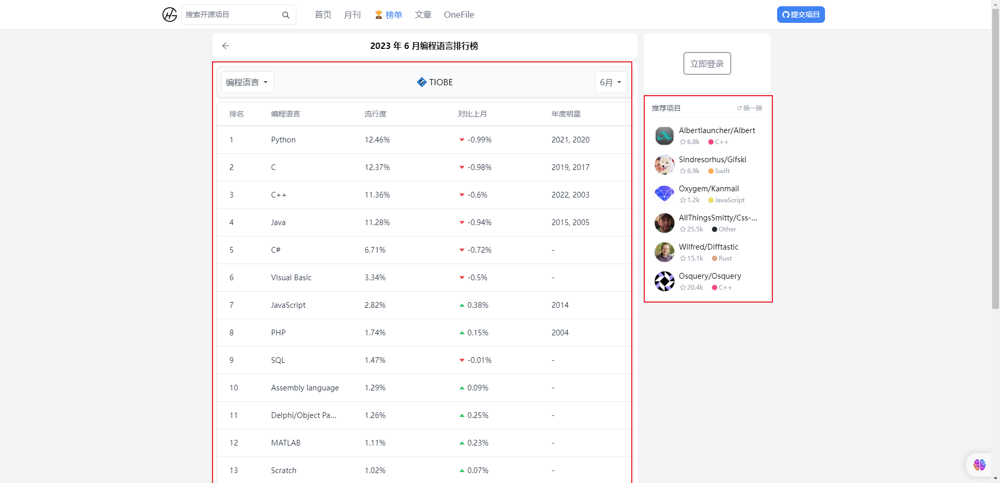

## 1.2 列表的实现方式

* 实际上，现在很多网站的列表功能采用了不同的方案来实现：
  * 方案 ① ：使用 `div` 元素来实现，如：汽车之家、知乎等。
  * 方案 ② ：使用 `列表元素`，这是元素语义化的表现。

* 现在，很多的网站对于列表元素没有很强烈的偏好，更加不拘一格，我们`只需要按照自己的风格来布局`即可，原因如下：
  * ① 列表元素有`默认`的 CSS 样式，使用的时候`不是非常方便`；当然，我们也可以通过`重置样式`来解决，但是我们更喜欢自由的 div 。
  * ② 列表元素往往有很多`限制`，ul 或 ol 只能存在 li ，然后在 li 中存放其他的元素。
  * ③ ……

* HTML 提供了 3 组常用的用来展示列表的元素：
  * 有序列表：`ol`、`li`。
  * 无序列表：`ul`、`li`。
  * 定义列表：`dl`、`dt`、`dd`。

> PS：列表元素在实际开发中并不是必须的，看个人爱好。

## 1.3 有序列表

* 语法：

```html
  <ol>
    <li></li>
    <li></li>
    <li></li>
  </ol>
```

* 元素说明：
  * `ol`（ordered list），表示有序列表，直接子元素只能是 `li`。
  * `li`（list item），列表中的`每一项`。

> PS：实际开发中，我们更喜欢用 ul 和 li，因为 ol 生成的数字，我们不太好用 CSS 或 JavaScript 来控制。


* 示例：

```html
<!DOCTYPE html>
<html lang="en">
<head>
  <meta charset="UTF-8">
  <meta content="IE=edge" http-equiv="X-UA-Compatible">
  <meta content="width=device-width, initial-scale=1.0" name="viewport">
  <title>Title</title>
</head>
<body>
  <h2>最喜欢的电影</h2>
  <ol>
    <li>星际穿越</li>
    <li>盗梦空间</li>
    <li>大话西游</li>
  </ol>
</body>
</html>
```

## 1.4 无序列表

* 语法：

```html
  <ul>
    <li></li>
    <li></li>
    <li></li>
  </ul>
```

* 元素说明：
  * `ul`（unordered list），表示无序，直接子元素只能是 `li`。
  * `li`（list item），列表中的`每一项`。
* 应用场景：

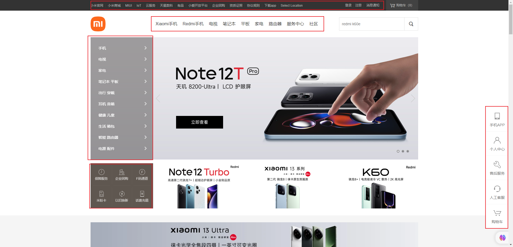


* 示例：

```html
<!DOCTYPE html>
<html lang="en">
<head>
  <meta charset="UTF-8">
  <meta content="IE=edge" http-equiv="X-UA-Compatible">
  <meta content="width=device-width, initial-scale=1.0" name="viewport">
  <title>Title</title>
</head>
<body>
  <h2>前端开发技能：</h2>
  <ul>
    <li>HTML</li>
    <li>CSS</li>
    <li>JavaScript</li>
    <li>...</li>
  </ul>
</body>
</html>
```

## 1.5 定义列表

* 语法：

```html
<dl>
    <dt></dt>
    <dd></dd>
    <dd></dd>
    <dd></dd>
</dl>
```

* 元素说明：
  * `dl`（definition list）：定义列表，直接子元素只能是 dt 和 dd。
  * `dt`（definition term）：term 是项的意思，`列表中的每一项的项目名`。
  * `dd`（definition description）：`列表中每一项的具体描述`，是对 dt 的描述、解释和补充；通常，一个 dt 后面紧跟一个或多个 dd 。
* 应用场景：

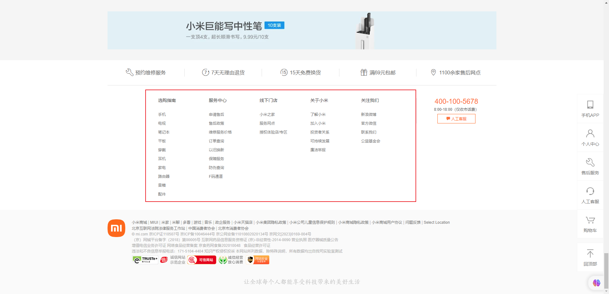


* 示例：

```html
<!DOCTYPE html>
<html lang="en">
<head>
  <meta charset="UTF-8">
  <meta content="IE=edge" http-equiv="X-UA-Compatible">
  <meta content="width=device-width, initial-scale=1.0" name="viewport">
  <title>Title</title>
</head>
<body>
  <h2>前端开发</h2>
  <dl>
    <dt>阶段一</dt>
    <dd>HTML</dd>
    <dd>CSS</dd>
    <dd>JavaScript</dd>
  </dl>
  <dl>
    <dt>阶段二</dt>
    <dd>Vue</dd>
    <dd>React</dd>
    <dd>Angular</dd>
  </dl>
</body>
</html>
```

## 1.6 重置列表元素的样式

* 在实际开发中，我们通常会重置列表元素的样式，以便我们能方便的布局，其样式内容如下：

```css
ul, li, dl, dt, dd {
  list-style: none;
}
```


* 示例：

```html
<!DOCTYPE html>
<html lang="en">
<head>
  <meta charset="UTF-8">
  <meta content="IE=edge" http-equiv="X-UA-Compatible">
  <meta content="width=device-width, initial-scale=1.0" name="viewport">
  <title>Title</title>
  <style>
    * {
      margin: 0;
      padding: 0;
    }

    /* 重置列表元素的样式 */
    ul, li, dl, dt, dd {
      list-style: none;
    }
  </style>
</head>
<body>
  <h2>前端开发</h2>
  <dl>
    <dt>阶段一</dt>
    <dd>HTML</dd>
    <dd>CSS</dd>
    <dd>JavaScript</dd>
  </dl>
  <dl>
    <dt>阶段二</dt>
    <dd>Vue</dd>
    <dd>React</dd>
    <dd>Angular</dd>
  </dl>
</body>
</html>
```


# 第二章：表格元素

## 2.1 概述

* 在网页中，对于某些内容的展示使用`表格元素`更为合适和方便。

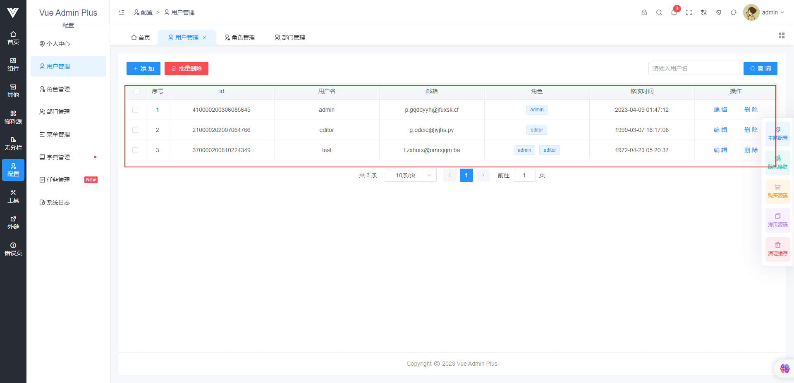

## 2.2 表格元素的使用

* 语法：

```html
<table>
    <tr>
      <th>1</th>
      <th>2</th>
    </tr>
    <tr>
      <td></td>
      <td></td>
    </tr>
</table>
```

* 元素说明：
  * `table`：表示表格。
  * `tr`（table row）：表格中的行。
  * `th`（table head）：行中的标题。
  * `td`（table data）：行中的单元格。

> PS：表格中有很多属性来设置表格的样式，但是现在已经不推荐了。


* 示例：

```html
<!DOCTYPE html>
<html lang="en">
<head>
  <meta charset="UTF-8">
  <meta content="IE=edge" http-equiv="X-UA-Compatible">
  <meta content="width=device-width, initial-scale=1.0" name="viewport">
  <title>Title</title>
  <style>
    table {
      /* 合并表格中单元格的边框 */
      border-collapse: collapse;
    }

    table tr th, td {
      text-align: center;
      padding: 8px 16px;
      border: 1px solid #000;
    }
  </style>
</head>
<body>
  <table>
    <tr>
      <th>排名</th>
      <th>股票名称</th>
      <th>股票代码</th>
      <th>股票价格</th>
      <th>股票涨跌</th>
    </tr>
    <tr>
      <td>1</td>
      <td>宏华数科</td>
      <td>688789</td>
      <td>100.25</td>
      <td>13.49%</td>
    </tr>
    <tr>
      <td>2</td>
      <td>金盘科技</td>
      <td>688676</td>
      <td>33.67</td>
      <td>11.16%</td>
    </tr>
    <tr>
      <td>3</td>
      <td>禾迈股份</td>
      <td>688032</td>
      <td>394.00</td>
      <td>10.94%</td>
    </tr>
    <tr>
      <td>4</td>
      <td>圣龙股份</td>
      <td>603178</td>
      <td>13.555</td>
      <td>9.98%</td>
    </tr>
    <tr>
      <td>5</td>
      <td>金晶科技</td>
      <td>600586</td>
      <td>8.49</td>
      <td>9.97%</td>
    </tr>
  </table>
</body>
</html>
```

## 2.3 合并单元格

* 在有些特殊的情况下，每个单元格占据的大小可能并不是固定的；即一个单元格可能`跨多行或者多列`来使用：

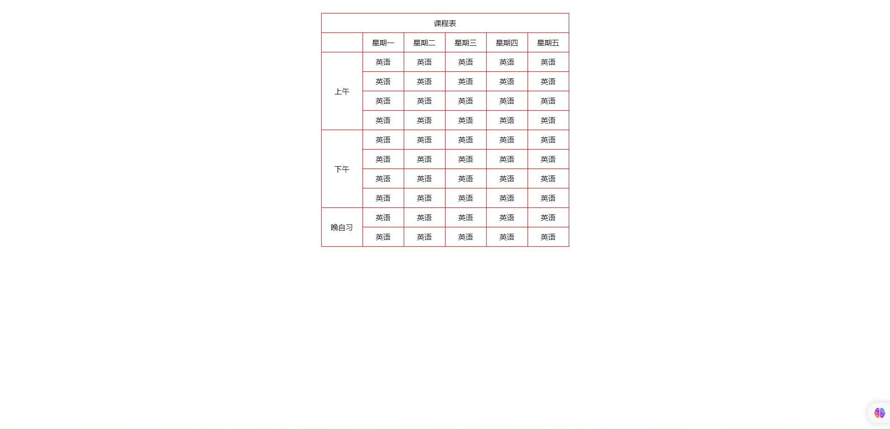

* 此时，我们就需要使用`单元格合并`来完成这样的需求。

* 合并单元格分为两种情况：
  * ① 跨列合并，使用 `colspan` 属性，即在最左边的单元格上写上 colspan 属性，并且省略合并的 td 。
  * ② 跨行合并，使用 `rowspan` 属性， 即在最上面的单元格上写上 rowspan 属性，并且省略后面 tr 中的 td 。


* 示例：

```html
<!DOCTYPE html>
<html lang="en">
<head>
  <meta charset="UTF-8">
  <meta content="IE=edge" http-equiv="X-UA-Compatible">
  <meta content="width=device-width, initial-scale=1.0" name="viewport">
  <title>Title</title>
  <style>
    * {
      margin: 0;
      padding: 0;
    }

    table {
      margin: 30px auto;
      border-collapse: collapse;

      text-align: center;
    }

    td {
      border: 1px solid red;
      padding: 10px 20px;
    }
  </style>
</head>
<body>
  <table>
    <tr>
      <td colspan="6">课程表</td>
    </tr>
    <tr>
      <td></td>
      <td>星期一</td>
      <td>星期二</td>
      <td>星期三</td>
      <td>星期四</td>
      <td>星期五</td>
    </tr>
    <tr>
      <td rowspan="4">上午</td>
      <td>英语</td>
      <td>英语</td>
      <td>英语</td>
      <td>英语</td>
      <td>英语</td>
    </tr>
    <tr>
      <td>英语</td>
      <td>英语</td>
      <td>英语</td>
      <td>英语</td>
      <td>英语</td>
    </tr>
    <tr>
      <td>英语</td>
      <td>英语</td>
      <td>英语</td>
      <td>英语</td>
      <td>英语</td>
    </tr>
    <tr>
      <td>英语</td>
      <td>英语</td>
      <td>英语</td>
      <td>英语</td>
      <td>英语</td>
    </tr>
    <tr>
      <td rowspan="4">下午</td>
      <td>英语</td>
      <td>英语</td>
      <td>英语</td>
      <td>英语</td>
      <td>英语</td>
    </tr>
    <tr>
      <td>英语</td>
      <td>英语</td>
      <td>英语</td>
      <td>英语</td>
      <td>英语</td>
    </tr>
    <tr>
      <td>英语</td>
      <td>英语</td>
      <td>英语</td>
      <td>英语</td>
      <td>英语</td>
    </tr>
    <tr>
      <td>英语</td>
      <td>英语</td>
      <td>英语</td>
      <td>英语</td>
      <td>英语</td>
    </tr>
    <tr>
      <td rowspan="2">晚自习</td>
      <td>英语</td>
      <td>英语</td>
      <td>英语</td>
      <td>英语</td>
      <td>英语</td>
    </tr>
    <tr>
      <td>英语</td>
      <td>英语</td>
      <td>英语</td>
      <td>英语</td>
      <td>英语</td>
    </tr>
  </table>
</body>
</html>
```


# 第三章：表单元素（⭐）

## 3.1 概述

* 很多网站中都使用到表单元素，并且表单元素通常是网站和用户交互的重要方式之一，如：登录页、注册页等等。

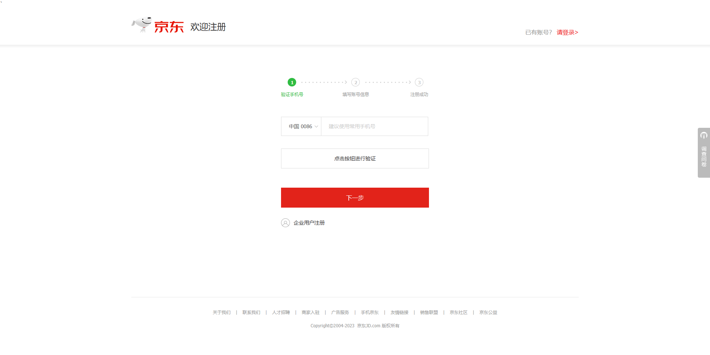

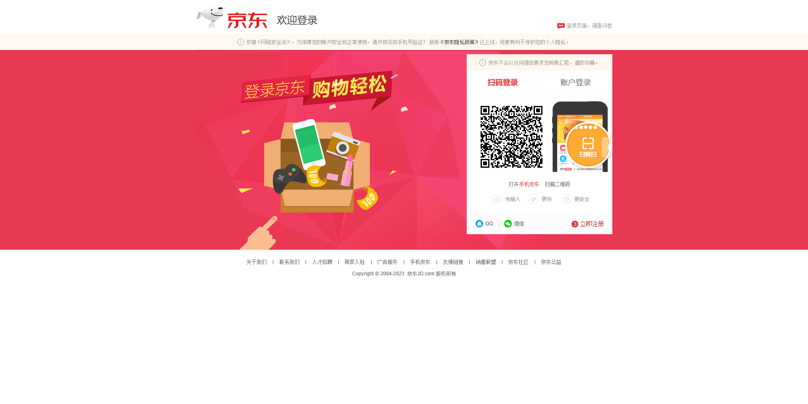

## 3.2 常见的表单元素

* `form`：表单，通常情况下，其它的表单相关元素都是它的后代元素。
* `input`：单行文本输入框、单选框、复选框、按钮等元素。
* `textarea`：多行文本框。
* `select` 和 `option`：下拉选择框。
* `button`：按钮。
* `label`：表单元素的标题。

## 3.3 input 元素

### 3.3.1 概述

* 表单中使用最多的就是 input 元素，input 元素根据 type 属性值的不同，会展示不同的效果。
* input 元素中 type 的常见属性值：

| type 属性值 | 描述                                             |
| ----------- | ------------------------------------------------ |
| text        | 文本框，用于输入单行文本，默认值                 |
| password    | 密码框，用于输入密码                             |
| radio       | 单选框，用于多选一                               |
| checkbox    | 多选框，用于多选多                               |
| file        | 文件上传                                         |
| submit      | 提交按钮，用于表单提交                           |
| reset       | 重置按钮，用于将表单元素重置到初始值             |
| button      | 普通按钮，默认没有特殊效果，可以配置 JS 一起使用 |

* input  元素中常见的属性（除了 type 属性之外的属性）：

| input 元素常见的属性 | 描述                                                         |
| -------------------- | ------------------------------------------------------------ |
| readonly             | 只读                                                         |
| disabled             | 禁用                                                         |
| checked              | 默认被选中，只有当 type 为 radio 或 checkbox 时可用          |
| autofocus            | 当页面加载时，自动聚焦                                       |
| name                 | 名称，在提交数据给服务器时，可用于区分数据类型               |
| value                | 取值，在提交数据给服务器的时候，服务器真正拿到的值，和 name 配合使用 |


* 示例：

```html
<!DOCTYPE html>
<html lang="en">
<head>
  <meta charset="UTF-8">
  <meta content="IE=edge" http-equiv="X-UA-Compatible">
  <meta content="width=device-width, initial-scale=1.0" name="viewport">
  <title>input 元素的基本使用</title>
</head>
<body>
  <!-- 写什么就显示什么 -->
  文本框：<input id="" name="" type="text"> <br>
  <!-- 书写的内容都会变成点点显示 -->
  密码框：<input id="" name="" type="password"> <br>
  单选框：<input id="" name="sex" type="radio"> 男
  <input id="" name="sex" type="radio"> 女 <br>
  多选框：<input id="" name="interest" type="checkbox"> 睡觉
  <input id="" name="interest" type="checkbox"> 吃饭
  <input id="" name="interest" type="checkbox"> 打豆豆 <br>
  上传：<input id="" name="" type="file"> <br>
</body>
</html>
```

### 3.3.2 布尔属性

* input 元素常见的布尔属性有 `disabled`、`checked`、`readonly`、`multiple`、`autofocus`、`selected` 。
* `布尔属性可以没有属性，写上属性名就代表使用这个属性`；如果要给布尔属性设置属性值，属性值就是属性名本身（开发中通常不这么做）。


* 示例：

```html
<!DOCTYPE html>
<html lang="en">
<head>
  <meta charset="UTF-8">
  <meta content="IE=edge" http-equiv="X-UA-Compatible">
  <meta content="width=device-width, initial-scale=1.0" name="viewport">
  <title>input 元素的基本使用</title>
</head>
<body>
  <input disabled readonly type="text" value="1">
  <!-- 等价于 -->
  <input disabled="disabled" readonly="readonly" type="text" value="1">
</body>
</html>
```

### 3.3.3 input 元素和 label 的关系

* label 元素一般和 input 元素配合使用，用来表示 input 的标题。

> PS：label 可以和某个 input 元素绑定，点击 label 就可以激活对应的 input 变为选中状态。

* 使用方式 ① ： 
  * 使用 label 标签将内容（如：文本）包裹起来。
  * 在标签标签上添加 id 属性。
  * 在 label 标签的 for 属性中设置对应的 id 属性值。


- 使用方式 ② ： 
  - 直接使用 label 标签将内容（如：文本）和表单标签一起包裹起来。
  - 需要将 label 标签的 for 属性删除。


* 示例：

```html
<!DOCTYPE html>
<html lang="en">
<head>
  <meta charset="UTF-8">
  <meta content="IE=edge" http-equiv="X-UA-Compatible">
  <meta content="width=device-width, initial-scale=1.0" name="viewport">
  <title>input 元素的基本使用</title>
</head>
<body>
  <div>
    <label for="username">用户名：
      <input id="username" name="username" type="text" value="">
    </label>
  </div>
  <div>
    <label for="password">密码：
      <input id="password" name="password" type="password" value="">
    </label>
  </div>
</body>
</html>
```

### 3.3.4 文本框

- 场景：在网页中显示 `输入单行文本` 的表单控件。

- type 属性值：text 。

- 常用属性：

| 属性名      | 说明                           |
| ----------- | ------------------------------ |
| placeholder | 占位符，提示用户输入内容的文本 |


* 示例：

```html
<!DOCTYPE html>
<html lang="en">
<head>
    <meta charset="UTF-8">
    <meta http-equiv="X-UA-Compatible" content="IE=edge">
    <meta name="viewport" content="width=device-width, initial-scale=1.0">
    <title>表单占位符</title>
</head>
<body>
    <input type="text" name="" id="" placeholder="请输入用户名"> <br>
</body>
</html>
```

### 3.3.5 密码框

- 场景：在网页中显示 `输入密码` 的表单控件。

- type 属性值：password 。

- 常用属性（同文本框）：

| 属性名      | 说明                           |
| ----------- | ------------------------------ |
| placeholder | 占位符，提示用户输入内容的文本 |


* 示例：

```html
<!DOCTYPE html>
<html lang="en">
<head>
    <meta charset="UTF-8">
    <meta http-equiv="X-UA-Compatible" content="IE=edge">
    <meta name="viewport" content="width=device-width, initial-scale=1.0">
    <title>表单占位符</title>
</head>
<body>
    <input type="password" name="" id="" placeholder="请输入密码">
</body>
</html>
```

### 3.3.6 单选框

* 场景：在网页中显示 `多选一的单选` 表单控件。

- type 属性值：radio 。

- 常用属性：

| 属性名  | 说明                                                         |
| ------- | ------------------------------------------------------------ |
| name    | 分组，有相同 name 属性值的单选框为一组，一组中同时只能有一个被选中 |
| checked | 默认选中                                                     |

> PS：
>
> * name 属性对于单选框有分组功能。
> * 有相同 name 属性值的单选框为一组，一组中只能同时有一个被选中。


* 示例：

```html
<!DOCTYPE html>
<html lang="en">
<head>
    <meta charset="UTF-8">
    <meta http-equiv="X-UA-Compatible" content="IE=edge">
    <meta name="viewport" content="width=device-width, initial-scale=1.0">
    <title>单选框</title>
</head>
<body>
    性别：<input type="radio" name="gender" id="" value="男"> 男
         <input type="radio" name="gender" id="" value="女" checked> 女 
</body>
</html>
```

### 3.3.7 多选框

* 场景：在网页中显示 `多选多的多选` 表单控件。

- type 属性值：checkbox。

| 属性名  | 说明     |
| ------- | -------- |
| checked | 默认选中 |


* 示例：

```html
<!DOCTYPE html>
<html lang="en">
<head>
    <meta charset="UTF-8">
    <meta http-equiv="X-UA-Compatible" content="IE=edge">
    <meta name="viewport" content="width=device-width, initial-scale=1.0">
    <title>多选框</title>
</head>
<body>
    兴趣：<input type="checkbox" name="hobby" id="" value="吃饭"> 吃饭
         <input type="checkbox" name="hobby" id="" value="睡觉" checked> 睡觉
         <input type="checkbox" name="hobby" id="" value="学习"> 学习
</body>
</html>
```

### 3.3.8 文件上传

- 场景：在网页中显示 `文件选择` 的表单控件。

- type 属性值：file 。

| 属性名   | 说明       |
| -------- | ---------- |
| multiple | 多文件选择 |


* 示例：

```html
<!DOCTYPE html>
<html lang="en">
<head>
    <meta charset="UTF-8">
    <meta http-equiv="X-UA-Compatible" content="IE=edge">
    <meta name="viewport" content="width=device-width, initial-scale=1.0">
    <title>文件选择</title>
</head>
<body>
    <!-- multiple 表示一次可以上传多个 -->
    上传：<input type="file" name="file" id="" multiple>
</body>
</html>
```

### 3.3.9 按钮

- 场景：在网页中 `显示不同功能的按钮` 的表单控件。 

-  type 属性值： 

| 标签名 | type 属性值 | 说明                                       |
| ------ | ----------- | ------------------------------------------ |
| input  | submit      | 提交按钮，点击之后提交数据到后端服务器     |
| input  | reset       | 重置按钮，点击之后恢复表单默认值           |
| input  | button      | 普通按钮，默认无功能，需要配置 js 实现功能 |

> PS：
>
> * 如果需要实现以上按钮功能，需要配合 form 元素使用。
>
> - form 使用方法：使用 form 标签将表单标签包裹起来即可。


* 示例：

```html
<!DOCTYPE html>
<html lang="en">
<head>
    <meta charset="UTF-8">
    <meta http-equiv="X-UA-Compatible" content="IE=edge">
    <meta name="viewport" content="width=device-width, initial-scale=1.0">
    <title>input-按钮</title>
</head>
<body>
    <form action="#" method="POST">
        用户名：<input type="text" name="username" id="" placeholder="请输入用户名"> <br>
        密码：<input type="password" name="password" id="" placeholder="请输入密码"> <br>
        <!-- 按钮 -->
        <input type="submit" value="提交">
        <input type="reset" value="重置">
        <input type="button" value="普通按钮">
    </form>
</body>
</html>
```

## 3.4 button 按钮元素

* 场景：在网页中显示用户点击的按钮。

- 标签名：button 。

- type 属性值：

| 标签名 | type 属性值 | 说明                                         |
| ------ | ----------- | -------------------------------------------- |
| button | submit      | 提交按钮，点击之后提交数据到后端服务器。     |
| button | reset       | 重置按钮，点击之后恢复表单默认值。           |
| button | button      | 普通按钮，默认无功能，需要配置 js 实现功能。 |

> PS：
>
> * button 元素可以和 form 元素配合使用，但是也可以单独使用（配合 JS 实现功能）。
>
> * button 元素是双标签，更便于包裹其他内容，如：文字、图片等。


* 示例：

```html
<!DOCTYPE html>
<html lang="en">
<head>
    <meta charset="UTF-8">
    <meta http-equiv="X-UA-Compatible" content="IE=edge">
    <meta name="viewport" content="width=device-width, initial-scale=1.0">
    <title>button</title>
</head>
<body>
    <button type="submit">提交</button>
    <button type="reset">重置</button>
    <button type="button">普通按钮</button>
</body>
</html>
```

## 3.5 下拉表单

* 场景：在网页中提供多个选择项的下拉菜单表单控件。 

-  标签组成： 
   -  select 元素：下拉菜单的整体。
   -  option 元素：下拉菜单的每一项。

-  常见属性：selected，表示下拉菜单的默认选中项。


* 示例：

```html
<!DOCTYPE html>
<html lang="en">
<head>
    <meta charset="UTF-8">
    <meta http-equiv="X-UA-Compatible" content="IE=edge">
    <meta name="viewport" content="width=device-width, initial-scale=1.0">
    <title>下拉菜单</title>
</head>
<body>
    所属城市：<select name="city" id="">
               <option value="北京">北京</option>
               <option value="天津">天津</option>
               <option value="南京" selected>南京</option>
               <option value="广州">广州</option>
            </select>
</body>
</html>
```

## 3.6 textarea 文本域元素

* 场景：在网页中提供可输入多行文本的表单控件。

- 标签名：textarea。
- 常见属性： 
  - rows：规定了文本域内可见行数。
  - cols：规定了文本域内可见宽度。


> PS：通常使用 CSS 来设置样式效果。

* 常见的文本域的样式：

```css
textarea {
    /* 禁止缩放 */
    resize: none;
}
```

```css
textarea {
    /* 水平缩放 */
    resize: horizontal;
}
```

```css
textarea {
    /* 垂直缩放 */
    resize: vertical;
}
```

```css
textarea {
    /* 水平和垂直缩放 */
    resize: both;
}
```


* 示例：

```html
<!DOCTYPE html>
<html lang="en">
<head>
    <meta charset="UTF-8">
    <meta http-equiv="X-UA-Compatible" content="IE=edge">
    <meta name="viewport" content="width=device-width, initial-scale=1.0">
    <title>文本域</title>
</head>
<body>
    留言：<textarea rows="3" cols="60"></textarea>
</body>
</html>
```

## 3.7 form 元素

* form 通常作为表单元素的父元素，并且可以对整个表单进行重置或提交。

> PS：form 元素的作用已经大大降低了，因为我们可以使用 Ajax 来异步提交表单数据，并且 form 元素是同步的方式来提交数据。

* form 元素的常见属性：

| 属性   | 描述                                                      |
| ------ | --------------------------------------------------------- |
| action | 用于提交表单数据的请求 URL                                |
| method | 请求方法（GET 或 POST），默认是 GET ，但是通常设置为 POST |
| target | 在什么地方打开 URL （和 a 元素的 target 类似）            |


* 示例：

```html
<!DOCTYPE html>
<html lang="en">
<head>
  <meta charset="UTF-8">
  <meta content="IE=edge" http-equiv="X-UA-Compatible">
  <meta content="width=device-width, initial-scale=1.0" name="viewport">
  <title>Title</title>
</head>
<body>
  <form action="#" method="post">
    <div>
      <label for="username">用户名
        <input id="username" name="username" type="text" value="">
      </label>
    </div>
    <div>
      <label for="password">密码
        <input id="password" name="password" type="password" value="">
      </label>
    </div>
    <div>
      <button type="submit">提交</button>
      <button type="reset">重置</button>
    </div>
  </form>
</body>
</html>
```

## 3.8 input 元素中的 name 属性和 value 属性

* name 属性：当前控件的含义，提交之后可以告诉后端发送过去的数据是什么含义。
* value 属性：用户输入的内容，提交之后会发送给后端服务器。

> PS：后端接收到数据的格式是：name 的属性值 = value 的属性值。

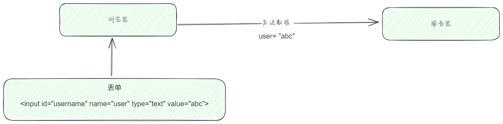


# 第四章：WEB 中的图标

## 4.1 边框的形状

### 4.1.1 概述

* border 主要是用来给盒子增加边框的；但是，在开发中，我们也经常利用边框的特性来实现一些形状，如：

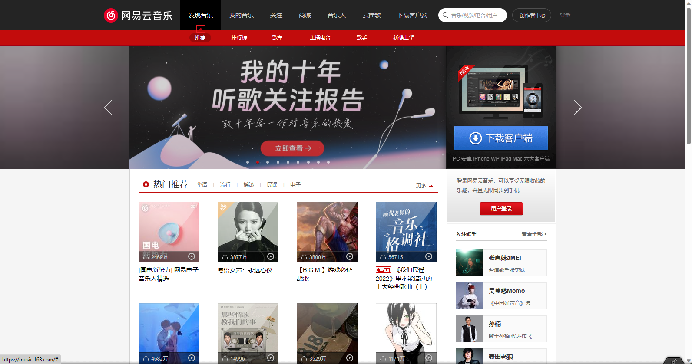

> PS：
>
> * border 可以实现这些功能；但是，感觉是一种滥用；所以，了解即可。
> * 我们可以[利用 border 和 CSS 的特性](https://css-tricks.com/the-shapes-of-css/#top-of-site)来做出很多图形，了解即可。

### 4.1.2 应用示例

* 示例：

```html
<!DOCTYPE html>
<html lang="en">
<head>
  <meta charset="UTF-8">
  <meta content="IE=edge" http-equiv="X-UA-Compatible">
  <meta content="width=device-width, initial-scale=1.0" name="viewport">
  <title>Title</title>
  <style>
    * {
      margin: 0;
      padding: 0;
      box-sizing: border-box;
    }

    .box {
      width: 100px;
      height: 100px;

      border: 50px solid transparent;
      border-top-color: red;
      border-right-color: green;
      border-bottom-color: blue;
      border-left-color: pink;
    }
  </style>
</head>
<body>
  <div class="box"></div>
</body>
</html>
```


* 示例：

```html
<!DOCTYPE html>
<html lang="en">
<head>
  <meta charset="UTF-8">
  <meta content="IE=edge" http-equiv="X-UA-Compatible">
  <meta content="width=device-width, initial-scale=1.0" name="viewport">
  <title>Title</title>
  <style>
    * {
      margin: 0;
      padding: 0;
      box-sizing: border-box;
    }

    .box {
      width: 100px;
      height: 100px;

      border: 50px solid transparent;
      border-top-color: #000;

      transition: all 0.3s;
    }

    .box:hover {
      transform-origin: center 25%;
      transform: rotate(180deg);
    }
  </style>
</head>
<body>
  <div class="box"></div>
</body>
</html>
```

## 4.2 WEB 网络字体（⭐）

### 4.2.1 概述

* 在网页中，我们可以通过 font-family 来设置字体；但是，操作系统提供的字体是有限的，并且这些字体不能进行定制化的需求；所以，就产生了 WEB 网络字体。

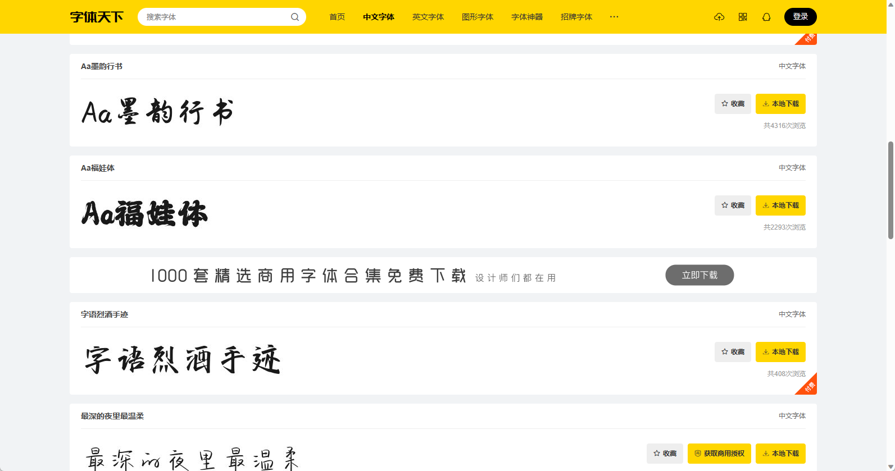

* 上面的这些字体，是操作系统中的字体不太可能实现的；当然，你可以手动下载安装到操作系统中；但是，你总不能要求用户浏览您的网站的时候，让他去手动下载这些 WEB 网络字体，也不太现实，咋办？
* 此时，我们就希望用户在访问我们的网页的时候，让浏览器动态的下载指定的 WEB 网络字体，然后让浏览器通过下载好的 WEB 网络字体来渲染网页，其流程如下所示：

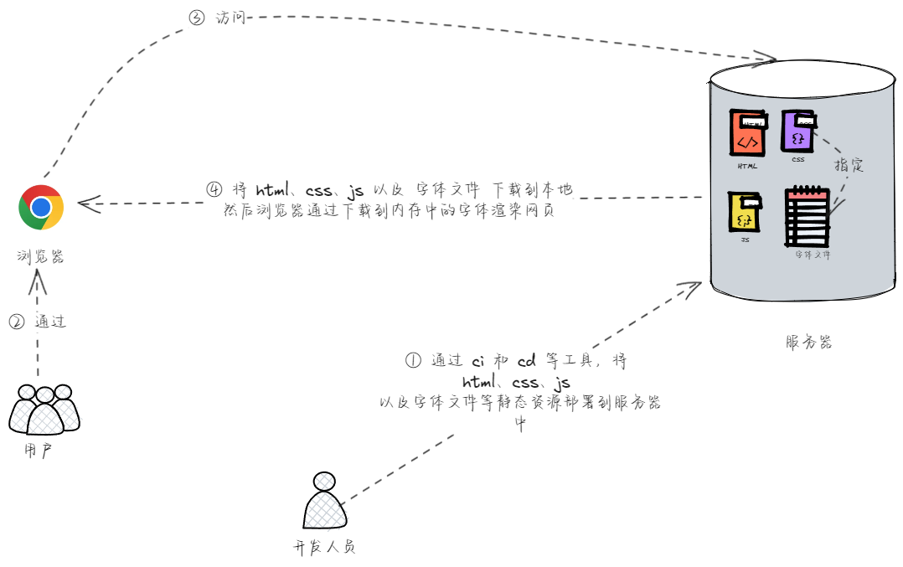

* 具体的步骤：
  * ① 将字体放到对应的目录中。
  * ② 在 CSS 中，通过 @font-face 来引入字体，并设置 font-family 的名称。
  * ③ 使用自定义的 font-family 。

> PS：`@font-face` 用于加载一个自定义的字体。

### 4.2.2 应用示例

* 示例：

```html
<!DOCTYPE html>
<html lang="en">
<head>
  <meta charset="UTF-8">
  <meta content="IE=edge" http-equiv="X-UA-Compatible">
  <meta content="width=device-width, initial-scale=1.0" name="viewport">
  <title>Title</title>
  <style>
    @font-face {
      font-family: "情书字体";
      src: url('./fonts/方正手迹.ttf');
    }

    .box {
      font-family: '情书字体';
    }
  </style>
</head>
<body>
  <div class="box">我是div元素</div>
</body>
</html>
```

### 4.2.3 高兼容性写法

* 示例：

```css
@font-face {
	font-family: "字体的名称";
    src: url('webfont.eot'); /* IE9 */
    src: url('webfont.eot?#iefix') format('embedded-opentype'), /* IE6-IE8 */
    url('webfont.woff2') format('woff2'),
    url('webfont.woff') format('woff'), /* chrome、firefox */
    url('webfont.ttf') format('truetype'), /* chrome、firefox、opera、Safari,
    Android*/
    url('webfont.svg#webfont') format('svg'); /* iOS 4.1- */
}
```

## 4.3 字体图标（⭐）

* 字体可以被设计成各种各样的形状，那么能不能将字体直接设计成图标？当然可以，这就是字体图标。

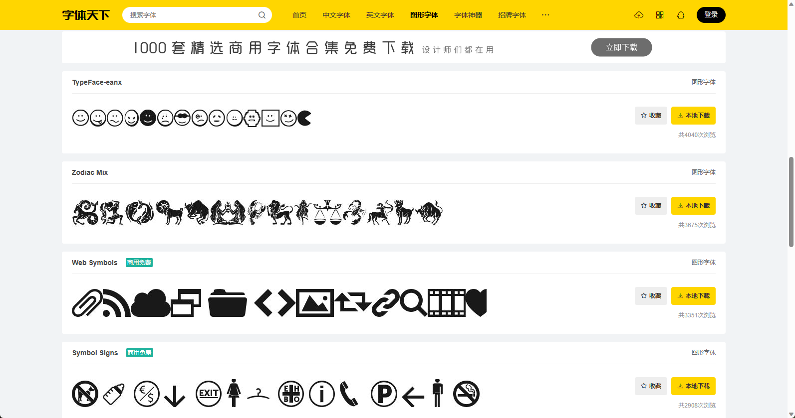

* 使用字体图标的好处：
  * ① 相比图片更加清晰。
  * ② 灵活性高，更方便改变大小、颜色、风格等。
  * ③ 兼容性好， `IE` 也能支持。

> PS：
>
> * 字体图标的具体使用方式，每个平台不尽相同，最好参考平台使用指南，实际开发中我们经常使用的是[阿里图标库](https://www.iconfont.cn/)。
> * 有的时候，我们模仿网站的时候，也会使用阿里图标库。

* 步骤：
  * ① 登录[阿里图标库](https://www.iconfont.cn/)。
  * ② 选择喜欢的字体图标，然后将其下载下来，并拷贝（有示例代码）到项目中。

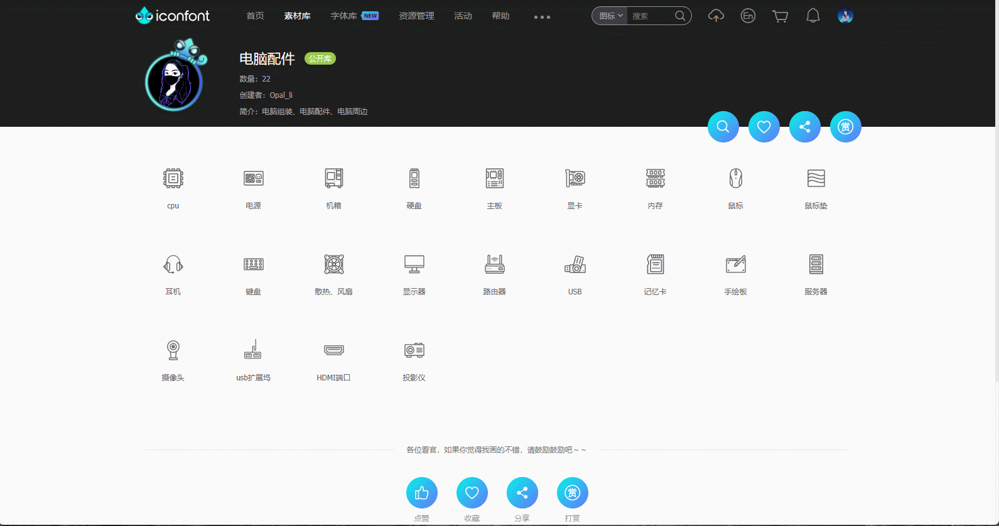

## 4.4 精灵图（⭐）

### 4.4.1 概述

* `CSS Sprite`（精灵图或雪碧图），是一种 CSS 图像合成技术，将各种小图片合并到一张图片上，然后利用 CSS 背景定位来显示对应的图片部分。
* 使用精灵图的好处：
  * ① 减少网页的 http 请求数量，加快网页响应速度，减轻服务器压力。
  * ② 减小图片总大小。
  * ③ 解决了图片命名的困扰，只需要针对一张集合的图片命名。

> PS：通常情况下，精灵图是由设计人员通过 PS 软件制作出来的。

* 使用精灵图的原理就是通过`只显示图片的很小的一部分`来展示图标。

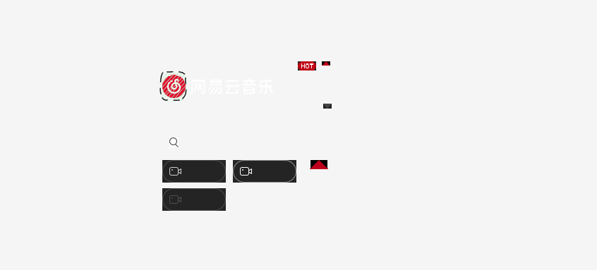

* 使用精灵图的步骤：
  * ① 设置对应元素的宽度和高度。
  * ② 设置精灵图作为背景图片。
  * ③ 通过调整背景图片的位置来展示。
* 如何获取精灵图的位置？可以通过该[网站](http://www.spritecow.com/)来获取。

### 4.4.2 应用示例

* 示例：

```html
<!DOCTYPE html>
<html lang="en">
<head>
  <meta charset="UTF-8">
  <meta content="IE=edge" http-equiv="X-UA-Compatible">
  <meta content="width=device-width, initial-scale=1.0" name="viewport">
  <title>Title</title>
  <style>
    .sprite {
      background: url('./assets/topbar.png') no-repeat 0 -19px;
      width: 33px;
      height: 33px;
    }
  </style>
</head>
<body>
  <div class="box sprite"></div>
</body>
</html>
```

## 4.3 cursor

* cursor 可以设置鼠标指针（光标）在元素上面时的显示样式。
* cursor 的常见取值：
  * auto：浏览器根据上下文决定指针的显示样式，如：根据文本和非文本切换指针样式。
  * default：由操作系统决定，一般就是一个小箭头。
  * `pointer`：一只小手，鼠标指针挪动到链接上面默认就是这个样式（常用）。
  * text：一条竖线，鼠标指针挪动到文本输入框上面默认就是这个样式。
  * none：没有任何指针显示在元素上面。


* 示例：

```html
<!DOCTYPE html>
<html lang="en">
<head>
  <meta charset="UTF-8">
  <meta content="IE=edge" http-equiv="X-UA-Compatible">
  <meta content="width=device-width, initial-scale=1.0" name="viewport">
  <title>Title</title>
  <style>
    .box {
      width: 200px;
      height: 200px;
      background-color: pink;

      cursor: pointer;
    }
  </style>
</head>
<body>
  <div class="box">我是div元素</div>
</body>
</html>
```

