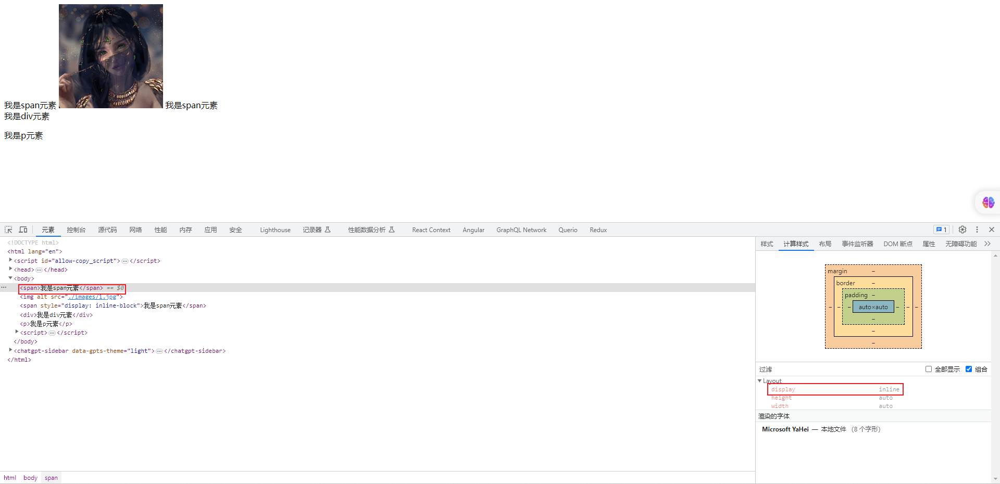
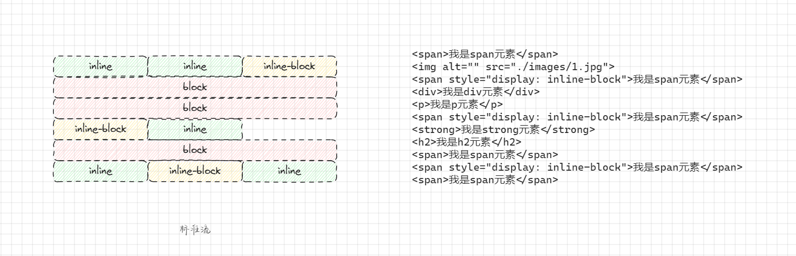
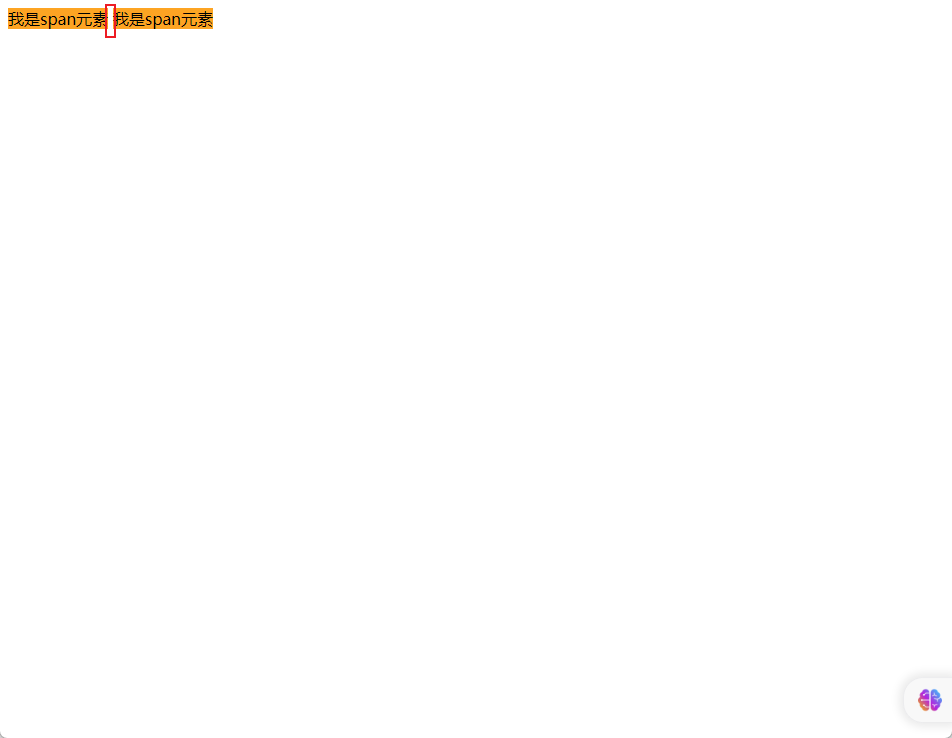
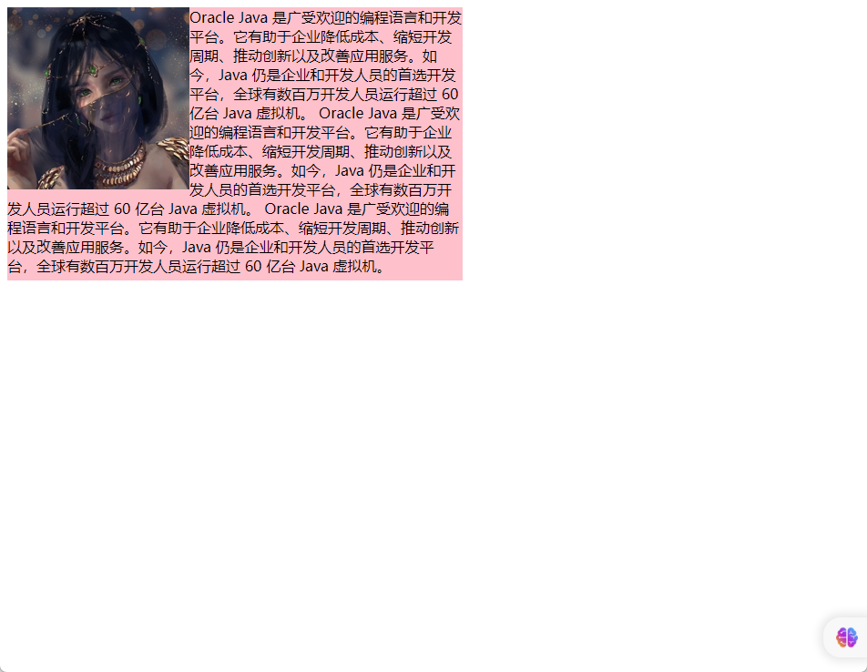
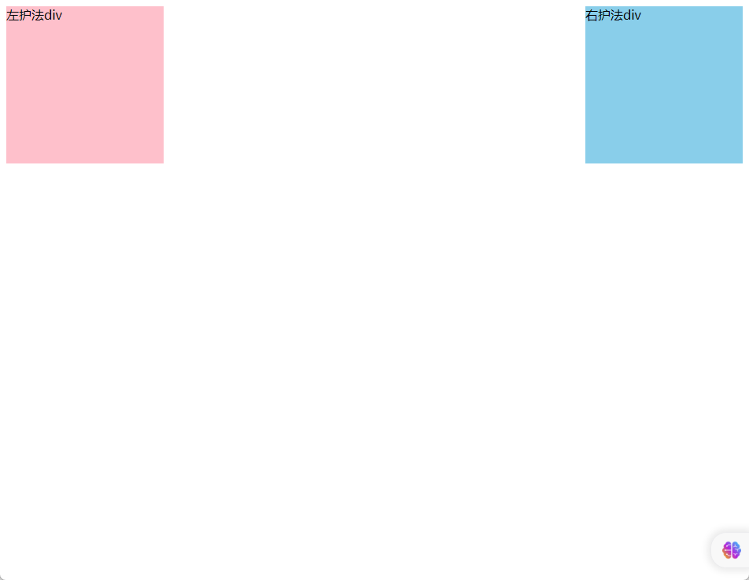
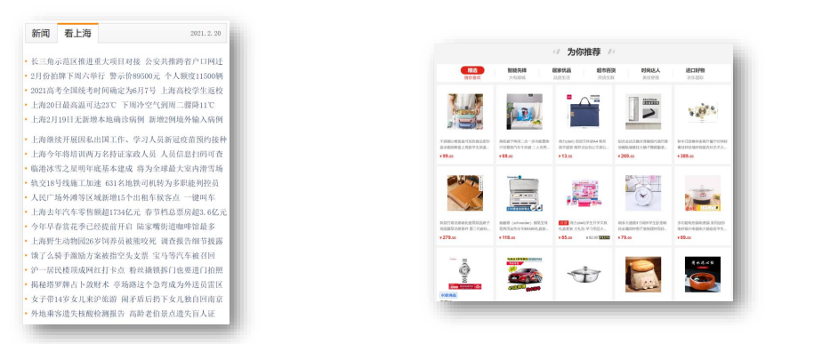

# 第一章：标准流

## 1.1 概述

* 标准流：又称 `文档流（正常流、常规流）` ，是浏览器在渲染显示网页内容时默认采用的一套排版规则，规定了应该以何种方式排列元素。
* 常见的标准流排版规则：
  * 块级元素：从上到下，垂直布局，独占一行。
  * 行内元素或行内块元素：从左到右，水平布局，空间不够自动折行。

## 1.2 常见元素的显示模式

* 块级元素（block）：
  * 主体结构元素：`html`、`body`。
  * 排版元素：`h1` ~ `h6` 、`hr`、`p` 、`pre`、`div` 。
  * 列表元素：`ul` 、`li`、`ol`、`dl`、`dt`、`dd` 。
  * 表格相关元素：`table`、`tbody`、`thead`、`tfoot`、`tr`、`catption`。
  * 表单相关元素：`form` 、`option`。
* 行内元素（inline）：
  * 文本元素：`br`、`em`、`strong`、`sup`、`sub`、`del`、`ins`、`span`。
  * 超链接元素：`a` 。
  * 表单相关元素：`label` 。
* 行内块元素（inline-block）：
  * 图片元素：`img`。
  * 表格相关元素：`td` 、`th`。
  * 表单相关元素：`input`、`textarea`、`select`、`button`。
  * 框架元素：`iframe`。


* 【技巧】其实，我们是可以在 Chrome 的调试工具中查看元素的默认显示模式的。




## 1.3 应用示例

* 需求：描述标准流




* 示例：

```html
<!DOCTYPE html>
<html lang="en">
<head>
  <meta charset="UTF-8">
  <meta content="IE=edge" http-equiv="X-UA-Compatible">
  <meta content="width=device-width, initial-scale=1.0" name="viewport">
  <title>Title</title>
</head>
<body>
  <span>我是span元素</span>
  
  <span style="display: inline-block">我是span元素</span>
  <div>我是div元素</div>
  <p>我是p元素</p>
  <span style="display: inline-block">我是span元素</span>
  <strong>我是strong元素</strong>
  <h2>我是h2元素</h2>
  <span>我是span元素</span>
  <span style="display: inline-block">我是span元素</span>
  <span>我是span元素</span>
</body>
</html>
```


# 第二章：浮动

## 2.1 元素之间的空白问题

* 其实，我们完全可以通过行内元素或行内快元素来进行布局；但是，`行内元素或行内块元素之间的换行会被浏览器解析为一个空白字符`。

```html
<!DOCTYPE html>
<html lang="en">
<head>
  <meta charset="UTF-8">
  <meta content="IE=edge" http-equiv="X-UA-Compatible">
  <meta content="width=device-width, initial-scale=1.0" name="viewport">
  <title>Title</title>
  <style>
    .box {

    }

    .box span {
      background-color: orange;
    }
  </style>
</head>
<body>
  <div class="box">
    <span>我是span元素</span>
    <span>我是span元素</span>
  </div>
</body>
</html>
```



* 解决方案 ① ：去掉空格或换行（不推荐）。

```html
<!DOCTYPE html>
<html lang="en">
<head>
  <meta charset="UTF-8">
  <meta content="IE=edge" http-equiv="X-UA-Compatible">
  <meta content="width=device-width, initial-scale=1.0" name="viewport">
  <title>Title</title>
  <style>
    .box {

    }

    .box span {
      background-color: orange;
    }
  </style>
</head>
<body>
  <div class="box">
    <!-- 去掉空格或换行，代码看起来非常凌乱~，不推荐 -->
    <span>我是span元素</span><span>我是span元素</span>
  </div>
</body>
</html>
```

* 解决方案 ② ：给父元素设置 `font-size: 0 ;`，再给子元素单独设置大小（不推荐）。

```html
<!DOCTYPE html>
<html lang="en">
<head>
  <meta charset="UTF-8">
  <meta content="IE=edge" http-equiv="X-UA-Compatible">
  <meta content="width=device-width, initial-scale=1.0" name="viewport">
  <title>Title</title>
  <style>
    .box {
      /* 给父元素的 font-size 设置为 0  */
      font-size: 0;
    }

    .box span {
      /* 给子元素单独设置 font-size */
      font-size: 16px;
      background-color: orange;
    }
  </style>
</head>
<body>
  <div class="box">
    <span>我是span元素</span>
    <span>我是span元素</span>
  </div>
</body>
</html>
```

* 解决方案 ③ ：通过给子元素设置浮动，浮动到一个方向（浮动也会有问题，早期的解决方案）。

```html
<!DOCTYPE html>
<html lang="en">
<head>
  <meta charset="UTF-8">
  <meta content="IE=edge" http-equiv="X-UA-Compatible">
  <meta content="width=device-width, initial-scale=1.0" name="viewport">
  <title>Title</title>
  <style>
    .box {

      font-size: 0;
    }

    .box span {
      /* 给子元素设置浮动，并且浮动到一个方向 */
      float: left;
      background-color: orange;
    }
  </style>
</head>
<body>
  <div class="box">
    <span>我是span元素</span>
    <span>我是span元素</span>
  </div>
</body>
</html>
```

* 解决方案 ④ ：Flex 布局（目前还没学习，后面会学习~）。

```html
<!DOCTYPE html>
<html lang="en">
<head>
  <meta charset="UTF-8">
  <meta content="IE=edge" http-equiv="X-UA-Compatible">
  <meta content="width=device-width, initial-scale=1.0" name="viewport">
  <title>Title</title>
  <style>
    .box {
      display: flex;
    }

    .box span {
      background-color: orange;
    }
  </style>
</head>
<body>
  <div class="box">
    <span>我是span元素</span>
    <span>我是span元素</span>
  </div>
</body>
</html>
```

## 2.2 浮动的作用

* 早期的作用：图文环绕。

```html
<!DOCTYPE html>
<html lang="en">
<head>
  <meta charset="UTF-8">
  <meta content="IE=edge" http-equiv="X-UA-Compatible">
  <meta content="width=device-width, initial-scale=1.0" name="viewport">
  <title>Title</title>
  <style>
    .box {
      width: 500px;
      height: 300px;
      background-color: pink;
    }

    .box img {
      float: left;
    }
  </style>
</head>
<body>
  <div class="box">
    
    Oracle Java 是广受欢迎的编程语言和开发平台。它有助于企业降低成本、缩短开发周期、推动创新以及改善应用服务。如今，Java
    仍是企业和开发人员的首选开发平台，全球有数百万开发人员运行超过 60 亿台 Java 虚拟机。
    Oracle Java 是广受欢迎的编程语言和开发平台。它有助于企业降低成本、缩短开发周期、推动创新以及改善应用服务。如今，Java
    仍是企业和开发人员的首选开发平台，全球有数百万开发人员运行超过 60 亿台 Java 虚拟机。
    Oracle Java 是广受欢迎的编程语言和开发平台。它有助于企业降低成本、缩短开发周期、推动创新以及改善应用服务。如今，Java
    仍是企业和开发人员的首选开发平台，全球有数百万开发人员运行超过 60 亿台 Java 虚拟机。
  </div>
</body>
</html>
```



* 现在的作用：网页布局（让垂直布局的盒子变为水平布局，如：一个向左，一个向右）。

```html
<!DOCTYPE html>
<html lang="en">
<head>
  <meta charset="UTF-8">
  <meta content="IE=edge" http-equiv="X-UA-Compatible">
  <meta content="width=device-width, initial-scale=1.0" name="viewport">
  <title>Title</title>
  <style>

    .box div {
      width: 200px;
      height: 200px;
    }

    .box .left {
      float: left;
      background-color: pink;
    }

    .box .right {
      float: right;
      background-color: skyblue;
    }
  </style>
</head>
<body>
  <div class="box">
    <div class="left">左护法div</div>
    <div class="right">右护法div</div>
  </div>
</body>
</html>
```




## 2.3 浮动的语法

* `float`属性用于创建浮动框，将其移动到一边，直到左边缘或右边缘触及包含块或另一个浮动元素的边缘。

* 语法：

```css
选择器 { float：属性值; }
```

| 属性值 | 描述                 |
| ------ | -------------------- |
| none   | 元素不浮动（默认值） |
| left   | 元素向左浮动         |
| right  | 元素向右浮动         |


* 示例：

```html
<!DOCTYPE html>
<html lang="en">

<head>
  <meta charset="UTF-8">
  <meta content="IE=edge" http-equiv="X-UA-Compatible">
  <meta content="width=device-width, initial-scale=1.0" name="viewport">
  <title>Document</title>
  <style>
    div {
      width: 200px;
      height: 200px;
    }

    .box1 {
      float: left;
      background-color: pink;
    }

    .box2 {
      float: left;
      background-color: skyblue;
    }
  </style>
</head>

<body>
  <div class="box1"></div>
  <div class="box2"></div>
</body>

</html>
```

## 2.4 浮动的特点

* ① 浮动元素会脱离标准流（简称：脱标），在标准流中不占位置。
* ② 不管浮动前是什么元素，浮动后：默认宽与高都是被内容撑开（尽可能小），而且可以设置宽高。
* ③ 不会独占一行，可以与其他元素共用一行。
* ④ 不会 margin 合并，也不会 margin 塌陷，能够完美的设置四个方向的 margin 和 padding 。
* ⑤ 不会像行内块一样被当做文本处理（没有行内块的空白问题）。


* 示例：盒子 1 右浮动

```html
<!DOCTYPE html>
<html lang="en">

<head>
  <meta charset="UTF-8">
  <meta content="IE=edge" http-equiv="X-UA-Compatible">
  <meta content="width=device-width, initial-scale=1.0" name="viewport">
  <title>Document</title>
  <style>
    .outer {
      width: 500px;
      background-color: gray;
      border: 1px solid black;
    }

    .box {
      width: 200px;
      height: 200px;
      background-color: skyblue;
      border: 1px solid black;
      margin: 10px;
    }

    .box1 {
      float: right;
    }
  </style>
</head>

<body>
  <div class="outer">
    <div class="box box1">1</div>
    <div class="box box2">2</div>
    <div class="box box3">3</div>
  </div>
</body>

</html>
```


* 示例：盒子 1 左浮动

```html
<!DOCTYPE html>
<html lang="en">

<head>
  <meta charset="UTF-8">
  <meta content="IE=edge" http-equiv="X-UA-Compatible">
  <meta content="width=device-width, initial-scale=1.0" name="viewport">
  <title>Document</title>
  <style>
    .outer {
      width: 500px;
      background-color: gray;
      border: 1px solid black;
    }

    .box {
      width: 200px;
      height: 200px;
      background-color: skyblue;
      border: 1px solid black;
      margin: 10px;
    }

    .box1 {
      float: left;
    }
  </style>
</head>

<body>
  <div class="outer">
    <div class="box box1">1</div>
    <div class="box box2">2</div>
    <div class="box box3">3</div>
  </div>
</body>

</html>
```


* 示例：所有盒子都浮动

```html
<!DOCTYPE html>
<html lang="en">

<head>
  <meta charset="UTF-8">
  <meta content="IE=edge" http-equiv="X-UA-Compatible">
  <meta content="width=device-width, initial-scale=1.0" name="viewport">
  <title>Document</title>
  <style>
    .outer {
      width: 500px;
      background-color: gray;
      border: 1px solid black;
    }

    .box {
      /* 会产生高度塌陷问题 */
      float: left;

      width: 100px;
      height: 100px;
      background-color: skyblue;
      border: 1px solid black;
      margin: 10px;
    }

  </style>
</head>

<body>
  <div class="outer">
    <div class="box box1">1</div>
    <div class="box box2">2</div>
    <div class="box box3">3</div>
  </div>
</body>

</html>
```


* 示例：所有盒子浮动后，盒子 3 落下来

```html
<!DOCTYPE html>
<html lang="en">

<head>
  <meta charset="UTF-8">
  <meta content="IE=edge" http-equiv="X-UA-Compatible">
  <meta content="width=device-width, initial-scale=1.0" name="viewport">
  <title>Document</title>
  <style>
    .outer {
      width: 500px;
      background-color: gray;
      border: 1px solid black;
    }

    .box {
      /* 会产生高度塌陷问题 */
      float: left;

      width: 200px;
      height: 200px;
      background-color: skyblue;
      border: 1px solid black;
      margin: 10px;
    }

  </style>
</head>

<body>
  <div class="outer">
    <div class="box box1">1</div>
    <div class="box box2">2</div>
    <div class="box box3">3</div>
  </div>
</body>

</html>
```

## 2.5 浮动的案例

* 示例：

```html
<!DOCTYPE html>
<html lang="en">

<head>
  <meta charset="UTF-8">
  <meta content="IE=edge" http-equiv="X-UA-Compatible">
  <meta content="width=device-width, initial-scale=1.0" name="viewport">
  <title>Document</title>
  <style>
    .box .top {
      height: 40px;
      background-color: #333;
    }

    .box .header {
      width: 1226px;
      height: 100px;
      background-color: #ffc0cb;
      margin: 0 auto;
    }

    .box .content {
      width: 1226px;
      height: 460px;
      margin: 0 auto;
    }

    .box .content .left {
      float: left;
      width: 234px;
      height: 460px;
      background-color: #ffa500;
    }

    .box .content .right {
      float: right;
      width: 992px;
      height: 460px;
      background-color: #87ceeb;
    }

    /*
        CSS 书写顺序：
        ① 浮动 或 display
        ② 盒子模型相关属性：margin、border、padding 、宽度、高度、背景色
        ③ 文字样式
     */
  </style>
</head>

<body>
  <div class="box">
    <!-- 通栏的盒子：宽度和浏览器宽度一样大 -->
    <div class="top"></div>
    <div class="header">头部</div>
    <div class="content">
      <div class="left">left</div>
      <div class="right">right</div>
    </div>
  </div>
</body>

</html>
```


* 示例：

```html
<!DOCTYPE html>
<html lang="en">

<head>
  <meta charset="UTF-8">
  <meta content="IE=edge" http-equiv="X-UA-Compatible">
  <meta content="width=device-width, initial-scale=1.0" name="viewport">
  <title>Document</title>
  <style>
    * {
      margin: 0;
      padding: 0;
    }

    ul {
      list-style: none;
    }

    .box {
      margin: 50px auto;
      width: 1226px;
      height: 614px;
    }

    .left {
      float: left;
      margin-right: 14px;
      width: 234px;
      height: 614px;
      background-color: #800080;
    }

    .right {
      float: left;
      width: 978px;
      height: 614px;
    }

    .right li {
      float: left;
      margin-right: 14px;
      margin-bottom: 14px;
      width: 234px;
      height: 300px;
      background-color: #87ceeb
    }

    .right li:nth-child(4n) {
      margin-right: 0;
    }

  </style>
</head>

<body>
  <div class="box">
    <div class="left"></div>
    <div class="right">
      <ul>
        <li></li>
        <li></li>
        <li></li>
        <li></li>
        <li></li>
        <li></li>
        <li></li>
        <li></li>
      </ul>
    </div>
  </div>
</body>

</html>
```


* 示例：

```html
<!DOCTYPE html>
<html lang="en">

<head>
  <meta charset="UTF-8">
  <meta content="IE=edge" http-equiv="X-UA-Compatible">
  <meta content="width=device-width, initial-scale=1.0" name="viewport">
  <title>Document</title>
  <style>
    * {
      margin: 0;
      padding: 0;
    }

    a {
      text-decoration: none;
    }

    ul {
      list-style: none;
    }

    .nav {
      margin: 50px auto;
      width: 640px;
      height: 50px;
      background-color: #ffc0cb;
    }

    .nav li {
      float: left;
    }

    .nav a {
      display: block;
      width: 80px;
      height: 50px;
      text-align: center;
      line-height: 50px;
      font-weight: bold;
      font-size: 16px;
      color: #fff;
    }

    .nav a:hover {
      background-color: #008000;
    }
  </style>
</head>

<body>
  <div class="nav">
    <ul>
      <li><a href="#">新闻1</a></li>
      <li><a href="#">新闻2</a></li>
      <li><a href="#">新闻3</a></li>
      <li><a href="#">新闻4</a></li>
      <li><a href="#">新闻5</a></li>
      <li><a href="#">新闻6</a></li>
      <li><a href="#">新闻7</a></li>
      <li><a href="#">新闻8</a></li>
    </ul>
  </div>
</body>

</html>
```


# 第三章：清除浮动

## 3.1 元素浮动后的影响

* 对兄弟元素的影响：后面的兄弟元素，会占据浮动元素之前的位置，在浮动元素的下面；对前面的兄弟元素没有影响。
* 对父元素的影响：不能撑起父元素的高度，导致父元素的高度塌陷；但是父元素的宽度依然束缚浮动的元素。

## 3.2 清除浮动的介绍

* 含义：`清除浮动带来的影响`，换言之，如果子元素浮动了，此时子元素不能撑开标准流的块级父元素。
* 原因：子元素浮动后脱标，不占用标准流的位置。
* 目的：需要父元素有高度，从而不影响其他网页元素的布局。


* 示例：

```html
<!DOCTYPE html>
<html lang="en">

<head>
  <meta charset="UTF-8">
  <meta content="IE=edge" http-equiv="X-UA-Compatible">
  <meta content="width=device-width, initial-scale=1.0" name="viewport">
  <title>受浮动影响的情况</title>
  <style>
    .top {
      margin: 0 auto;
      width: 1000px;
      /* height: 300px; */
      background-color: pink;
    }

    .left {
      float: left;
      width: 200px;
      height: 300px;
      background-color: #ccc;
    }

    .right {
      float: right;
      width: 790px;
      height: 300px;
      background-color: skyblue;
    }

    .bottom {
      height: 100px;
      background-color: green;
    }
  </style>
</head>

<body>
  <!-- 父子级标签，子级浮动，父级没有高度，后面的标准流盒子会受影响，会显示到上面的位置。 -->
  <div class="top">
    <div class="left"></div>
    <div class="right"></div>
  </div>
  <div class="bottom"></div>
</body>

</html>
```

## 3.3 清除浮动的方法

### 3.3.1 直接设置父元素高度（不推荐）

* 优点：简单粗暴、方便。
* 缺点：有些布局中不能有固定元素高度，如：新闻列表、京东推荐模块。



### 3.3.2 额外标签法

* 操作：
  * 在父元素内容的最后添加一个块级元素。
  * 给添加的块级元素设置 `clear:both;`
* 缺点：会在页面中添加额外的标签，会让页面的 HTML 结构变得复杂。


* 示例：

```html
<!DOCTYPE html>
<html lang="en">

<head>
  <meta charset="UTF-8">
  <meta content="IE=edge" http-equiv="X-UA-Compatible">
  <meta content="width=device-width, initial-scale=1.0" name="viewport">
  <title>额外标签法</title>
  <style>
    .top {
      margin: 0 auto;
      width: 1000px;
      /* height: 300px; */
      background-color: pink;
    }

    .left {
      float: left;
      width: 200px;
      height: 300px;
      background-color: #ccc;
    }

    .right {
      float: right;
      width: 790px;
      height: 300px;
      background-color: skyblue;
    }

    /* 清除浮动 */
    .clearfix {
      clear: both;
    }

    .bottom {
      height: 100px;
      background-color: green;
    }
  </style>
</head>

<body>
  <div class="top">
    <div class="left"></div>
    <div class="right"></div>
    <!-- 额外标签法 -->
    <div class="clearfix"></div>
  </div>
  <div class="bottom"></div>
</body>

</html>
```

### 3.3.3 单伪元素清除法

* 操作：用伪元素替代额外标签。

```css
/* 清除浮动 */
.clearfix::after {
    content: '';
    display: block;
    clear: both;
    /*  补充代码，使得在网页中看不到伪元素 */
    height: 0;
    visibility: hidden;
}
```

* 优点：项目中使用，直接给标签加类即可清除浮动。


* 示例：

```html
<!DOCTYPE html>
<html lang="en">

<head>
  <meta charset="UTF-8">
  <meta http-equiv="X-UA-Compatible" content="IE=edge">
  <meta name="viewport" content="width=device-width, initial-scale=1.0">
  <title>单伪元素标签法</title>
  <style>
    .top {
      margin: 0 auto;
      width: 1000px;
      /* height: 300px; */
      background-color: pink;
    }

    .left {
      float: left;
      width: 200px;
      height: 300px;
      background-color: #ccc;
    }

    .right {
      float: right;
      width: 790px;
      height: 300px;
      background-color: skyblue;
    }

    /* 单伪元素标签法 */
    .clearfix::after {
      content: '';
      display: block;
      clear: both;
      /*  补充代码，使得在网页中看不到伪元素 */
      height: 0;
      visibility: hidden;
    }

    .bottom {
      height: 100px;
      background-color: green;
    }
  </style>
</head>

<body>
  <div class="top clearfix">
    <div class="left"></div>
    <div class="right"></div>
  </div>
  <div class="bottom"></div>
</body>

</html>
```

### 3.3.4 双伪元素清除法（推荐）

* 操作：

```css
.clearfix::before,
.clearfix::after {
  content: '';
  display: table;
}

.clearfix::after {
  clear: both;
}
```

* 优点：项目中使用，直接给标签加类即可清除浮动。


* 示例：

```html
<!DOCTYPE html>
<html lang="en">

<head>
    <meta charset="UTF-8">
    <meta http-equiv="X-UA-Compatible" content="IE=edge">
    <meta name="viewport" content="width=device-width, initial-scale=1.0">
    <title>双伪元素标签法</title>
    <style>
        .top {
            margin: 0 auto;
            width: 1000px;
            /* height: 300px; */
            background-color: pink;
        }

        .left {
            float: left;
            width: 200px;
            height: 300px;
            background-color: #ccc;
        }

        .right {
            float: right;
            width: 790px;
            height: 300px;
            background-color: skyblue;
        }

        /* .clearfix::before 作用：解决外边距塌陷问题 */
        .clearfix::before,
        .clearfix::after {
            content: '';
            display: table;
        }

        /* 真正清除浮动的标签 */
        .clearfix::after {
            clear: both;
        }

        .bottom {
            height: 100px;
            background-color: green;
        }
    </style>
</head>

<body>
    <div class="top clearfix">
        <div class="left"></div>
        <div class="right"></div>
    </div>
    <div class="bottom"></div>
</body>

</html>
```

### 3.3.5 给父元素设置 `overflow:hideen`

* 操作：给父元素设置 `overflow:hideen`。
* 优点：方便。


* 示例：

```html
<!DOCTYPE html>
<html lang="en">

<head>
  <meta charset="UTF-8">
  <meta http-equiv="X-UA-Compatible" content="IE=edge">
  <meta name="viewport" content="width=device-width, initial-scale=1.0">
  <title>给父元素设置 `overflow:hideen`</title>
  <style>
    .top {
      margin: 0 auto;
      width: 1000px;
      /* height: 300px; */
      background-color: pink;
    }

    .left {
      float: left;
      width: 200px;
      height: 300px;
      background-color: #ccc;
    }

    .right {
      float: right;
      width: 790px;
      height: 300px;
      background-color: skyblue;
    }

    /* 给父元素设置 `overflow:hideen` */
    .clearfix{
      overflow: hidden;
    }

    .bottom {
      height: 100px;
      background-color: green;
    }
  </style>
</head>

<body>
  <div class="top clearfix">
    <div class="left"></div>
    <div class="right"></div>
  </div>
  <div class="bottom"></div>
</body>

</html>
```

## 3.4 使用浮动布局的原则

* 设置浮动的时候，兄弟元素要么全都浮动，要么全都不浮动。

## 3.5 布局练习

* 示例：

```html
<!DOCTYPE html>
<html lang="en">
<head>
  <meta charset="UTF-8">
  <meta content="IE=edge" http-equiv="X-UA-Compatible">
  <meta content="width=device-width, initial-scale=1.0" name="viewport">
  <title>Title</title>
  <style>
    * {
      margin: 0;
      padding: 0;
      box-sizing: border-box;
    }

    .clearfix::before,
    .clearfix::after {
      content: '';
      display: table;
    }

    .clearfix::after {
      clear: both;
    }

    .wrapper {
      margin: 0 auto;
    }

    .top-bar {
      text-align: center;
      width: 960px;
      margin-top: 50px;
    }

    .top-bar .box {
      float: left;
      height: 80px;
      line-height: 80px;
      background-color: #ddd;
    }

    .top-bar .logo {
      width: 200px;
    }

    .top-bar .banner1 {
      width: 540px;
      margin: 0 10px;
    }

    .top-bar .banner2 {
      width: 200px;
    }

    .nav {
      width: 960px;
      height: 30px;
      background-color: #ddd;
      margin: 10px auto;
      text-align: center;
      line-height: 30px;
    }

    .main {
      width: 960px;
    }

    .main .left {
      float: left;
    }

    .main .left .top .item {
      float: left;
      width: 370px;
      height: 200px;
      border: 1px solid #000;
      margin-right: 10px;
      text-align: center;
      line-height: 200px;
    }

    .main .left .top .item:last-child {
      margin-right: 0;
    }

    .main .left .bottom {
      margin: 10px auto;
    }

    .main .left .bottom .item {
      float: left;
      width: 180px;
      height: 200px;
      border: 1px solid #000;
      margin-right: 10px;
      text-align: center;
      line-height: 200px;
    }

    .main .left .bottom .item:last-child {
      margin-right: 0;
    }

    .main .right {
      float: right;
    }

    .main .right .item {
      width: 200px;
      height: 130px;
      border: 1px solid #000;
      text-align: center;
      line-height: 130px;
    }

    .main .right .item:nth-child(2) {
      margin: 10px 0;
    }

    .footer {
      width: 960px;
      height: 60px;
      text-align: center;
      line-height: 60px;
      background-color: #ddd;
    }
  </style>
</head>
<body>
  <div class="top-bar clearfix wrapper">
    <div class="box logo">logo</div>
    <div class="box banner1">banner1</div>
    <div class="box banner2">banner2</div>
  </div>
  <div class="nav wrapper">菜单</div>
  <div class="main wrapper clearfix">
    <div class="left">
      <div class="top clearfix">
        <div class="item">栏目一</div>
        <div class="item">栏目二</div>
      </div>
      <div class="bottom clearfix">
        <div class="item">栏目三</div>
        <div class="item">栏目四</div>
        <div class="item">栏目五</div>
        <div class="item">栏目六</div>
      </div>
    </div>
    <div class="right">
      <div class="item">栏目七</div>
      <div class="item">栏目八</div>
      <div class="item">栏目九</div>
    </div>
  </div>
  <div class="footer wrapper">页脚</div>
</body>
</html>
```

