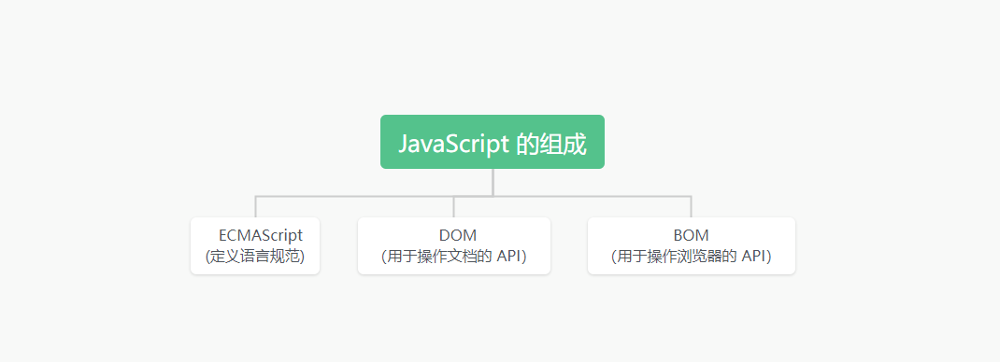

# 第一章：前端的三大核心

* 目前，前端最主要掌握的三个知识点就是 `HTML`、`CSS` 和 `JavaScript` 。

# 第二章：编程语言

## 2.1 计算机语言

* 在之前，我们已经学习了 HTML 和 CSS 的很多相关知识；其实，HTML 是一种 `标记语言`，CSS 是一种 `样式语言` 。
* HTML 和 CSS 本身都属于`计算机语言`，因为它们都可以和计算机进行沟通交流。
  * 在生活中，如果两个人想要沟通，必然需要借助语言（中文、英文、法语、德语等）作为媒介。
* 其实，计算机语言就是`我们（人）和计算机进行交流`而需要学习的语言。
* 网页的三大组成部分的另一个核心就是 `JavaScript`；所以，`JavaScript`  必须也是一种计算机语言。

## 2.2 编程语言

* 其实，对于像 JavaScript 这类的语言更准确的说法：一种`编程语言`。
* 我们先来搞清`计算机语言`和`编程语言`的关系和区别：
  * 计算机语言（computer language）是指用于人和计算机之间进行通讯的语言，是人和计算机之间传递信息的媒介。但是其概念要比通用的`编程语言`更为广泛。例如：HTML 是`标记语言`，也是`计算机语言`，却不是`编程语言`。
  * 编程语言（programming language），是用来定义`计算机程序的形式语言`。它是一种被`标准化`的交流技巧，用来`向计算机发出指令`，一种能够让`程序员`准确的定义`计算机所需要使用数据`的计算机语言，并精确的定义`在不同情况下所应当采取的行动`。

* 编程语言的特点：
  * ① `数据和数据结构`。
  * ② `指令和流程控制`。
  * ③ `引用机制和重用机制`。
  * ④ `设计哲学`。
  * ……

* 其实，计算机语言和编程语言都是用于人和计算机交流的工具，只是其设计的目标和特点略有不同，以满足计算机和程序员的不同需求而已！

## 2.3 常见的编程语言

* 常见的编程语言：

## 2.4 计算机语言的分类

* 计算机语言可以根据不同的特征和用途来进行分类，下面是一些常见的计算机语言分类：
* 编程范式分类：
  * 过程式语言：使用过程或函数来组织代码，如：C、Fortran 等。
  * 面向对象语言：基于类和对象的编程范式，如：Java、C++、Python 等。
  * 函数式语言：将计算视为数学函数的计算范式，如：Lisp、Haskell 等。
  * 逻辑式语言：使用逻辑规则来推导和描述问题的范式，如：Prolog 等。
* 抽象级别分类：
  * 机器语言：计算机能直接运行的语言，由 0 或 1 组成。
  * 低级语言：直接操作硬件和计算机体系结构的语言，如：汇编语言。
  * 高级语言：更接近人类自然语言的语言，如：Python、Java、C++ 等。
* 用途分类：
  * 通用编程语言：用于接近各种不同类型问题的语言，如：C、Python、Java 等。
  * 领域特定语言（DSL）：专门用于解决特定领域问题的语言，如：SQL（用于数据库查询）、HTML（用于网页标签）等。
* 编译方式分类：
  * 编译型语言：源代码在运行前被编译成机器代码，然后由计算机直接执行，如：C、C++。
  * 解释型语言：源代码逐行由解释器解释并执行，如：Python、JavaScript。
* 开发领域分类：
  * WEB 开发语言：用于开发 WEB 应用程序的语言，如：HTML、CSS、JavaScript、PHP、Ruby 等。
  * 数据库查询语言：用于访问和操作数据库的语言，如：SQL。
* 跨平台分类：
  * 跨平台语言：可以在不同操作系统上运行的语言，如：Java、Python。
  * 特定平台的语言：只能在特定操作系统或硬件上运行的语言，如：Swift 。

## 2.5 计算机语言的发展史

### 2.5.1 机器语言

* 概念：
  * 计算机的存储单元只有 `0` 和 `1` 两种状态，因此一串代码要让计算机“读懂”，这串代码只能由数字 `0` 和 `1` 组成。
  * 像这种由数字 `0` 和 `1` 按照一定的规律组成的代码就叫`机器码`，也叫`二进制编码`。
  * 一定长度的机器码组成了`机器指令`，`用这些机器指令所编写的程序`就称为`机器语言`。

* 优点：
  * 代码能够`被计算机直接识别`，`不需要经过编译解析`。
  * 直接对硬件产生作用，`程序的执行效率非常高`。
* 缺点：
  * 程序全是 `0` 和 `1` 的指令代码，`可读性差`，`容易出错`。
  * 不太容易编写（目前，很少有人这样开发）。

### 2.5.2 汇编语言

* 概念：
  * 为了解决机器语言的缺陷，`人们发明了另外一种语言---汇编语言`。
  * 这种语言使用`符号`来`代替冗长的、难以记忆的 0 和 1 的代码`。
  * 像 `mov/push` 这样的指令，经过`编译器`，编译成`机器代码`。

* 优点：
  * 可以`像机器语言`一样，`直接访问、控制计算机的各种硬件设备`。
  * `占用内存少、执行速度快`。
* 缺点：
  * ① `不同的机器有不同的汇编语言语法和编译器，代码可移植性差`；换言之，一种程序只能在一种机器上运行。
  * ② `符号非常多、难以记忆`；即使是完成简单的功能也需要大量的汇编语言代码，容易产生 BUG ，也难以调试。
* 应用场景：操作系统内核、驱动程序、单片机程序。

> 注意：其实，实际开发中，使用汇编开发的机会是很少了；并且，C 语言也可以直接访问和操作底层硬件。

### 2.5.3 高级语言

* 概念：
  * 高级语言，更加`接近自然语言`，更`符合人类的思维方式`。
  * 和人交流的方式类似；不过，绝大多数的编程语言都是国外发明的，因为比较`接近于英文的交流方式`。

* 优点：
  * `简单、易学、易于理解`，语法和结构很像普通的英文。
  * `远离对硬件的直接操作`，一般人经过系统学习之后都可以编程，`不太需要了解底层硬件知识`。
  * 程序的移植性好（针对 `跨平台` 语言来说）。
* 缺点：
  * 程序不能直接被计算机识别，需要经过编译器编译成二进制指令，才能被运行到计算机上。
  * 种类繁多：Java、C、C#、C++、JavaScript 等。

# 第三章：初识 JavaScript

## 3.1 概述

* 维基百科的定义：
  * JavaScript（通常缩写为 JS）是一门[基于原型](https://zh.wikipedia.org/wiki/基于原型编程)和[头等函数](https://zh.wikipedia.org/wiki/头等函数)的多范式[高级](https://zh.wikipedia.org/wiki/高级语言)[解释型](https://zh.wikipedia.org/wiki/直譯語言)[编程语言](https://zh.wikipedia.org/wiki/编程语言)[[9\]](https://zh.wikipedia.org/wiki/JavaScript#cite_note-:0-9)[[10\]](https://zh.wikipedia.org/wiki/JavaScript#cite_note-:1-10)，它支持[面向对象](https://zh.wikipedia.org/wiki/面向对象程序设计)程序设计、[指令式编程](https://zh.wikipedia.org/wiki/指令式编程语言)和[函数式编程](https://zh.wikipedia.org/wiki/函数式编程语言)。它提供方法来操控文本、[数组](https://zh.wikipedia.org/wiki/数组)、日期以及[正则表达式](https://zh.wikipedia.org/wiki/正则表达式)等。不支持[I/O](https://zh.wikipedia.org/wiki/I/O)，比如网络、存储和图形等，但这些都可以由它的宿主环境提供支持。它由[ECMA（欧洲电脑制造商协会）](https://zh.wikipedia.org/wiki/Ecma国际)通过[ECMAScript](https://zh.wikipedia.org/wiki/ECMAScript)实现语言的标准化[[9\]](https://zh.wikipedia.org/wiki/JavaScript#cite_note-:0-9)。目前，它被世界上的绝大多数网站所使用，也被世界主流[浏览器](https://zh.wikipedia.org/wiki/浏览器)（[Chrome](https://zh.wikipedia.org/wiki/Google_Chrome)、[IE](https://zh.wikipedia.org/wiki/Internet_Explorer)、[Firefox](https://zh.wikipedia.org/wiki/Firefox)、[Safari](https://zh.wikipedia.org/wiki/Safari)和[Opera](https://zh.wikipedia.org/wiki/Opera電腦瀏覽器)）所支持。
  * JavaScript 与[Java](https://zh.wikipedia.org/wiki/Java) 在名字和语法上都很相似，但这两门编程语言从设计之初就有很大不同。JavaScript 在语言设计上主要受到了[Self](https://zh.wikipedia.org/wiki/Self)（一种基于原型的编程语言）和 [Scheme](https://zh.wikipedia.org/wiki/Scheme)（一门函数式编程语言）的影响[[10\]](https://zh.wikipedia.org/wiki/JavaScript#cite_note-:1-10)，在语法结构上它和[C语言](https://zh.wikipedia.org/wiki/C语言)很相似（如 if 条件语句、switch 语句、while 循环和 do-while 循环等）[[11\]](https://zh.wikipedia.org/wiki/JavaScript#cite_note-11)。
  * 对于客户端来说，JavaScript 通常被实现为一门解释语言，但如今它已经可以被[即时编译](https://zh.wikipedia.org/wiki/即時編譯)（JIT）。随着 [HTML5](https://zh.wikipedia.org/wiki/HTML5) 和 [CSS3](https://zh.wikipedia.org/wiki/CSS3) 语言标准的推行，它还可以用于游戏、桌面和移动应用程序的开发，以及在服务器端网络环境运行（如 [Node.js](https://zh.wikipedia.org/wiki/Node.js)）。

* 从上面的定义中，我们可以看到很多的关键字：`解释型编程语言`、`原型`、`头等函数`、`多范式`、`面向对象程序设计`、`指令式编程`、`函数式编程`；这些关键字暂时不需要了解，后面会依次提及！
* 简而言之，JavaScript 是`一门高级编程语言`，是目前前端开发的`重要组成部分`。

## 3.2 JavaScript 的历史

* 1994 年，网景公司（Netscape）发布了 Navigator 浏览器的 0.9 版。
  * 这是历史上`第一个比较成熟的网络浏览器`，轰动一时。
  * 但是，这个版本的浏览器只能用来浏览，不具备和访问者互动的能力。

* 当时，网景公司想要选择一种语言来嵌入到浏览器中：
  * `采用现有的语言`，如：Perl、Python、TCL 、Scheme 等，允许它们直接嵌入网页。
  * 1995 年，网景公司招募了程序员 `Brendan Eich`，希望将 `Scheme` 语言作为网页脚本语言的可能性。

* 与此同时，1995 年的时候，Sun 公司将 Java 语言，正式向市场推出：
  * Java 推出之后立马在市场上引起了轰动，Java 当初有一个口号：“write once run anywhere”；
  * 网景公司动了心，决定与 Sun 公司结成联盟，希望将 Java 嵌入到网页中来运行；
  * Brendan Eich 本人非常热衷于 Scheme，但是管理层那个时候有点倾向于 Java，希望可以简化 Java 来适应网页脚本的需求；

* 于是，Brendan Eich 花了 10 天的时间设计了 JavaScript 。
  * 最初这门语言的名字是 Mocha（摩卡）；
  * 在 Navigator 2.0 beta 版本更名为 LiveScript；
  * 在 Navigator 2.0 beta 3 版本正式重命名为 `JavaScript`，当时是为了给这门语言搭上 Java 这个热词；
* 当然， 10 天设计出来语言足够说明 Brendan Eich 是天才，但是这门语言当时更像是一个多种语言的大杂烩：
  * 借鉴 `C` 语言的`基本语法`。
  * 借鉴 `Java` 语言的数据类型和`内存管理`。
  * 借鉴 `Scheme` 语言，将`函数`提升到 `"第一等公民"（first class）`的地位；
  * 借鉴 `Self` 语言，使用基于`原型（prototype）`的继承机制。

> 注意：
>
> * 其实，早期 Java 是可以直接运行在浏览器中的，是一种称为 applet 的技术；但是，现代的浏览器已经取消了对 applet 的支持。
> * 其实，Java 也是可以开发 WEB 应用程序的；只不过，需要使用 Kotlin-js 这个项目。并且，该项目的想法和 TypeScript 的思路一致，就是给 JavaScript 提供类型系统；毕竟，JavaScript 的类型是动态的，不利于大型 WEB 项目的开发和维护。

* 微软公司于 1995 年首次推出 Internet Explorer ，从而引发了与 Netscape 的浏览器大战。
  * 微软对 Netscape Navigator 解释器进行了逆向工程，创建了JScript，以与处于市场领导地位的网景产品同台竞争；
  * 这个时候对于开发者来说是一场噩耗，因为需要针对不同的浏览器进行不同的适配；
* 1996 年 11 月，网景正式向 ECMA（欧洲计算机制造商协会）提交语言标准。
  * 1997 年 6 月，ECMA 以 JavaScript 语言为基础制定了 ECMAScript 标准规范 ECMA-262 。
  * ECMA-262 是一份标准，定义了 ECMAScript 。
  * JavaScript 成为了 ECMAScript 最著名的实现之一。
  * 除此之外，ActionScript 和 JScript 也都是 ECMAScript 规范的实现语言；

* 所以，ECMAScript 是一种规范，而 JavaScript 是这种规范的一种实现。

> 注意：在现代 Web 开发中，JavaScript 成为了主要的客户端脚本语言。微软也逐渐放弃了对 JScript 的更新支持，转而支持更加标准化和现代化的 JavaScript 。

## 3.3 JavaScript 的组成

* ECMAScript  是 JavaScript 的标准，描述了该语言的语法和基本对象。
  * JavaScript 是 ECMAScript   的语言层面的实现。
  * JavaScript 因为需要对页面和浏览器进行各种操作；所以，还提供了 `DOM 操作`和 `BOM 操作`。
* 目前，我们会针对性的学习 ECMAScript，即语言层面的内容，特别是 ES5 之前的语法。

* ES 的版本历史：

## 3.4 JavaScript 由谁运行？

* 我们经常会说：不同的浏览器有不同的内核组成
  * Gecko：早期被 Netscape 和 Mozilla Firefox 浏览器使用； 
  * Trident：微软开发，被 IE4~IE11 浏览器使用，但是 Edge 浏览器已经转向 Blink； 
  * Webkit：苹果基于 KHTML 开发、开源的，用于 Safari，Google Chrome 之前也在使用； 
  * Blink：是 Webkit 的一个分支，Google 开发，目前应用于 Google Chrome、Edge、Opera 等；
  * ……
* 其实，我们经常说的浏览器内核指的是浏览器的排版引擎（渲染引擎）。
* 那么，JavaScript 是由 `JavaScript 引擎`来执行的。

## 3.5 JavaScript 引擎

* 为什么需要 JavaScript 引擎？
  * 前文说过，`高级编程语言`都是需要转换成`机器语言`来执行的。
  * 我们编写的 JavaScript 无论是`交给浏览器还是 Node 执行`，最终都是需要交给 `CPU` 来执行。
  * 但是，CPU 只识别自己的指令集（机器代码）。
  * 那么，我们就需要 `JavaScript 引擎`帮助我们将 `JavaScript 代码`翻译为 `CPU 指令`来执行。
* 比较常见的 JavaScript 引擎：
  * SpiderMonkey：第一款 JavaScript 引擎，由 Brendan Eich 开发（也就是 JavaScript 作者）；
  * Chakra：微软开发，用于 IT 浏览器；
  * JavaScriptCore：WebKit 中的 JavaScript 引擎，Apple 公司开发；
  * V8：Google 开发的强大 JavaScript 引擎，也帮助 Chrome 从众多浏览器中脱颖而出。
  * ……

## 3.6 浏览器内核和 JavaScript 引擎的关系

* 以 webkit 为例，webkit 实际上由以下两部分组成：
  * WebCore：负责 HTML 解析、布局、渲染等等相关的工作。
  * JavaScriptCore：解析、执行 JavaScript 代码。

* 其实，小程序也是这样的划分：在小程序中编写的 JavaScript 代码就是被 JavaScriptCore（JSCore） 执行的。

## 3.7 JavaScript 的应用

* JavaScript 的应用：

