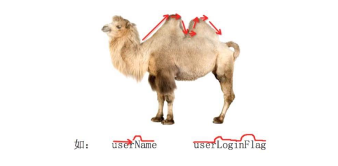
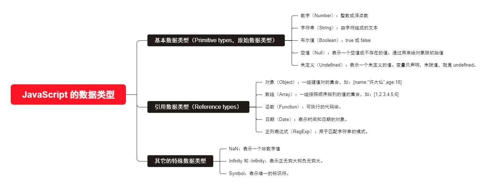
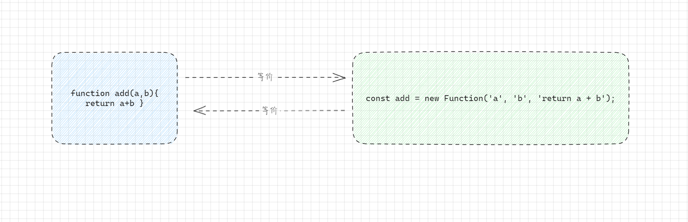
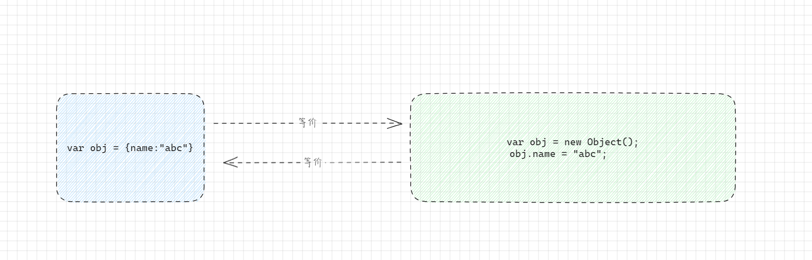

# 第一章：JavaScript 的基本语法

## 1.1 JavaScript 的书写位置（ ⭐）

### 1.1.1 概述

* 我们知道，CSS 有三种方式：
  * 内联样式表。
  * 内部样式表。
  * 外部样式表。
* 同理，JavaScript 也有三种方式：
  * 内联 JavaScript 。
  * 内部 JavaScript。
  * 外部 JavaScript。

### 1.1.2 内联 JavaScript

* 将 JavaScript 写在 HTML 元素的属性中，`原生开发不推荐`；但是，Vue 等框架会使用。


* 示例：

```html
<!DOCTYPE html>
<html lang="en">
<head>
  <meta charset="UTF-8">
  <meta content="IE=edge" http-equiv="X-UA-Compatible">
  <meta content="width=device-width, initial-scale=1.0" name="viewport">
  <title>Title</title>
</head>
<body>
  <!--
    内联JavaScript：将 JavaScript 代码写在 HTML 元素的属性中
  -->
  <a href="javascript:void(0)" onclick="alert('点击百度一下')">百度一下</a>
</body>
</html>
```

### 1.1.3 内部 JavaScript

* 直接在 HTML 文件中的 script 元素内编写 JavaScript 代码。


* 示例：

```html
<!DOCTYPE html>
<html lang="en">
<head>
  <meta charset="UTF-8">
  <meta content="IE=edge" http-equiv="X-UA-Compatible">
  <meta content="width=device-width, initial-scale=1.0" name="viewport">
  <title>Title</title>
</head>
<body>

  <a href="#">百度一下</a>

  <!--
    将 JavaScript 写在 script 元素中。
    因为 HTML 是逐行解析的，建议将 script 放到</body> 的上面，防止浏览器先解析 JavaScript ，而不继续渲染 HTML 元素，这是浏览器的原理导致的！
  -->
  <script>
    const aEl = document.querySelector("a")
    aEl.onclick = function () {
      alert("点击百度一下")
    }
  </script>
</body>
</html>
```

#### 1.1.4 外部 JavaScript

* 将 JavaScript 代码写在 `.js` 的文件中，在 HTML 文件中通过 script 元素的 `src` 属性引入。


* 示例：
* demo.js

```js
const aEl = document.querySelector("a")
aEl.onclick = function () {
  alert("点击百度一下")
}
```

* index.html

```html
<!DOCTYPE html>
<html lang="en">
<head>
  <meta charset="UTF-8">
  <meta content="IE=edge" http-equiv="X-UA-Compatible">
  <meta content="width=device-width, initial-scale=1.0" name="viewport">
  <title>Title</title>
</head>
<body>

  <a href="#">百度一下</a>

  <!--
    外部 JavaScript，通过 script 元素的 src 属性引入 js 文件
  -->
  <script src="./js/demo.js"></script>

</body>
</html>
```

## 1.2 noscript 元素

* 如果运行的浏览器不支持 JavaScript，那么我们如何给用户友好的提示？
  * 针对早期浏览器不支持 JavaScript 的问题，需要一个`页面优雅降级`的处理方案。
  * 于是，`<noscript>`元素出现，用于不支持 JavaScript 的浏览器提供替代内容。
* 浏览器将渲染包含在 `<noscript>` 的内容的场景：
  * ① 浏览器不支持 JavaScript 。
  * ② 用户手动在浏览器中设置禁止 JavaScript （一般也不会这么做）。


* 示例：

```html
<!DOCTYPE html>
<html lang="en">
<head>
  <meta charset="UTF-8">
  <meta content="IE=edge" http-equiv="X-UA-Compatible">
  <meta content="width=device-width, initial-scale=1.0" name="viewport">
  <title>Title</title>
</head>
<body>
  <noscript>
    <p>您的浏览器不支持或者关闭运行 JavaScript ，请更换浏览器~</p>
  </noscript>
</body>
</html>
```

## 1.3 JavaScript 编写的注意事项（ ⭐）

* ① script 元素`不要写成单标签`。

```html
<!DOCTYPE html>
<html lang="en">
<head>
  <meta charset="UTF-8">
  <meta content="IE=edge" http-equiv="X-UA-Compatible">
  <meta content="width=device-width, initial-scale=1.0" name="viewport">
  <title>Title</title>
</head>
<body>

  <a href="#">百度一下</a>

  <!-- 以下的写法是错误的 -->	
  <script src="./js/demo.js"/>

</body>
</html>
```

* ② 可以`省略 type 属性`：在早期的代码中，`script` 元素中会使用 `type="text/javascript"`；但是，现在可以省略 type 属性了，因为 JavaScript 是所有现代浏览器以及 HTML5 中的默认脚本语言了。
* ③ 加载顺序：
  * 作为 HTMl 文档内容的一部分，JavaScript 默认`遵循 HTML 文档的加载顺序`，即`自上而下的加载顺序`。
  * 推荐将 `<script>` 元素放置到 HTML 文件中的 `body` `子元素`的`最后一行`。
* ④ `JavaScript 严格区分大小写`：HTML 元素和 CSS 属性不区分大小写，但是 JavaScript 是严格区分大小写的。
* ⑤ `script` 元素还有 `defer` 和 `async` 属性，后续讲解。

## 1.4 JavaScript 的交互方式

* 弹窗查看：

```js
alert(xxx)
```

* 在浏览器控制台查看：

```js
console.log(xxx,xxx,...)
```

* 在浏览器页面查看：

```js
document.write(xxx);
```

* 在浏览器接收用户的输入：

```js
prompt("提示文字")
```

> 注意：
>
> * 开发中，最常用的就是 `console.log(xxx,xxx,...)`；因为和用户的交互方式主要通过表单元素。
> * 如果在开发中，过多使用 `alert()` ，会被浏览器进行警告，认为是对客户的干扰。


* 示例：

```html
<!DOCTYPE html>
<html lang="en">
<head>
  <meta charset="UTF-8">
  <meta content="IE=edge" http-equiv="X-UA-Compatible">
  <meta content="width=device-width, initial-scale=1.0" name="viewport">
  <title>Title</title>
</head>
<body>

  <script>
    var name = prompt("请输入姓名：")
    alert("姓名是：" + name)
    console.log("姓名是：" + name)
    document.write("姓名是：" + name)
  </script>

</body>
</html>
```

## 1.5 JavaScript 的表达式 VS 语句（ ⭐）

### 1.5.1 JavaScript 中的表达式

* JavaScript 中的`表达式（Expressions）`指的是一段代码，它可以计算并产生一个`值`。表达式可以变量、运算符、函数调用、常量等组合，它们被解析为一个单一的值。

* JavaScript 的大多数操作都是表达式。

* 常见的表达式如下：

  * 算术表达式：

  ```html
  <!DOCTYPE html>
  <html lang="en">
  <head>
    <meta charset="UTF-8">
    <meta content="IE=edge" http-equiv="X-UA-Compatible">
    <meta content="width=device-width, initial-scale=1.0" name="viewport">
    <title>Title</title>
  </head>
  <body>
    <script>
      let sum = 5 + 3; // 表达式 5 + 3 计算得到的值 8 ，然后将 8 赋值给变量 sum
    </script>
  </body>
  </html>
  ```

  * 变量引用：

  ```html
  <!DOCTYPE html>
  <html lang="en">
  <head>
    <meta charset="UTF-8">
    <meta content="IE=edge" http-equiv="X-UA-Compatible">
    <meta content="width=device-width, initial-scale=1.0" name="viewport">
    <title>Title</title>
  </head>
  <body>
    <script>
      let x = 10;
      let y = x; // 表达式 x 计算得到的值 10，将值 10 赋值给变量 y
    </script>
  </body>
  </html>
  ```

  * 函数调用：

  ```html
  <!DOCTYPE html>
  <html lang="en">
  <head>
    <meta charset="UTF-8">
    <meta content="IE=edge" http-equiv="X-UA-Compatible">
    <meta content="width=device-width, initial-scale=1.0" name="viewport">
    <title>Title</title>
  </head>
  <body>
    <script>
      function add(a, b) {
        return a + b;
      }
  
      let result = add(2, 3); // 表达式 add(2,3) 计算得到的值 5 ，将值 5 赋值给变量 result
    </script>
  </body>
  </html>
  ```

  * 三元表达式：

  ```html
  <!DOCTYPE html>
  <html lang="en">
  <head>
    <meta charset="UTF-8">
    <meta content="IE=edge" http-equiv="X-UA-Compatible">
    <meta content="width=device-width, initial-scale=1.0" name="viewport">
    <title>Title</title>
  </head>
  <body>
    <script>
      let age = 25;
      let isAdult = (age >= 18) ? "成年人" : "未成年人"; // 表达式 (age >= 18) 计算得到布尔值 true ，根据条件返回不同的值
    </script>
  </body>
  </html>
  ```

### 1.5.2 JavaScript 中的语句

  * JavaScript 中的`语句（Statements）`指的是一组 JavaScript 代码，用于执行一个或多个操作。语句可以是变量声明、条件控制、循环、函数定义等。

  * `与表达式不同，语句通常没有返回值`。

  * 常见的语句如下：

    * 变量声明语句：

    ```html
    <!DOCTYPE html>
    <html lang="en">
    <head>
      <meta charset="UTF-8">
      <meta content="IE=edge" http-equiv="X-UA-Compatible">
      <meta content="width=device-width, initial-scale=1.0" name="viewport">
      <title>Title</title>
    </head>
    <body>
      <script>
        let x; // 声明一个变量
      </script>
    </body>
    </html>
    ```

    * 条件语句：

    ```html
    <!DOCTYPE html>
    <html lang="en">
    <head>
      <meta charset="UTF-8">
      <meta content="IE=edge" http-equiv="X-UA-Compatible">
      <meta content="width=device-width, initial-scale=1.0" name="viewport">
      <title>Title</title>
    </head>
    <body>
      <script>
        let x = 10;
        if (x > 0) {
          console.log("x是正数");
        } else {
          console.log("x是非正数");
        }
      </script>
    </body>
    </html>
    ```

    * 循环语句：

    ```html
    <!DOCTYPE html>
    <html lang="en">
    <head>
      <meta charset="UTF-8">
      <meta content="IE=edge" http-equiv="X-UA-Compatible">
      <meta content="width=device-width, initial-scale=1.0" name="viewport">
      <title>Title</title>
    </head>
    <body>
      <script>
        for (let i = 0; i < 5; i++) {
          console.log(i);
        }
      </script>
    </body>
    </html>
    ```

    * 函数定义语句：

    ```html
    <!DOCTYPE html>
    <html lang="en">
    <head>
      <meta charset="UTF-8">
      <meta content="IE=edge" http-equiv="X-UA-Compatible">
      <meta content="width=device-width, initial-scale=1.0" name="viewport">
      <title>Title</title>
    </head>
    <body>
      <script>
        function greet(name) {
          console.log("Hello, " + name + "!");
        }
      </script>
    </body>
    </html>
    ```

  ### 1.5.3 总结

* 表达式产生一个值，而语句执行一个操作或者一系列操作。
* 表达式可以嵌套在语句中；但是，语句中不能嵌套在表达式中。
* JavaScript 中的大多数操作都是表达式，如：赋值、算术运算、函数调用等。
* 表达式语句是表达式后面加上分号，以便将其视为完成一项任务的语句。如：`x = 10;` 是一个表达式语句。
* JavaScript 的函数调用是表达式；但是，函数定义本身是一个语句。

  ## 1.6 JavaScript 的结束符

* 通常情况下，我们会在每条语句后面添加一个`分号;`，表示这个语句的结束。
  * 当存在换行符的情况下，JavaScript 会将`换行符`理解为隐式的分号。
  * 但是，对于`立即执行函数`是例外。

* 在实际开发中，可以在每条语句中添加`分号`，也可以不推荐；不过，目前而言，不添加`分号`非常流行。

## 1.7 JavaScript 中的注释

* 在 HTML 和 CSS 中我们都使用过注释；其实，JavaScript 中也可以添加注释。
* JavaScript 中的注释有三种：
  * 单行注释。
  * 多行注释。
  * 文档注释（JSDoc，需要开发环境提供支持）。


* 示例：

```html
<!DOCTYPE html>
<html lang="en">
<head>
  <meta charset="UTF-8">
  <meta content="IE=edge" http-equiv="X-UA-Compatible">
  <meta content="width=device-width, initial-scale=1.0" name="viewport">
  <title>Title</title>
</head>
<body>
  <script>
    let name = "许大仙" // 单行注释：声明一个 name 变量
  </script>
</body>
</html>
```


* 示例：

```html
<!DOCTYPE html>
<html lang="en">
<head>
  <meta charset="UTF-8">
  <meta content="IE=edge" http-equiv="X-UA-Compatible">
  <meta content="width=device-width, initial-scale=1.0" name="viewport">
  <title>Title</title>
</head>
<body>
  <script>
    /*
    * 定义一个人的详细信息
    */
    let name = "许大仙"
    let age = 18
  </script>
</body>
</html>
```


* 示例：

```html
<!DOCTYPE html>
<html lang="en">
<head>
  <meta charset="UTF-8">
  <meta content="IE=edge" http-equiv="X-UA-Compatible">
  <meta content="width=device-width, initial-scale=1.0" name="viewport">
  <title>Title</title>
</head>
<body>
  <script>
    /** 求和
     * @param {number} a 数值类型的变量
     * @param {number} b 数值类型的变量
     */
    function add(a, b) {
      return a + b;
    }

    var result = add(1, 2);
    console.log(result)
  </script>
</body>
</html>
```


# 第二章：JavaScript 中的变量

## 2.1 程序中变量的数据

* 在实际开发中，我们使用最多的不是固定的数据，而是会变化的数据：
  * ① 购物车商品的`数量`、`价格`等。
  * ② 一首歌`播放的时间`、`进度条`、`歌词的展示`等。
  * ③ 微信聊天中`消息条数`、`时间`、`语音的长度`、`头像`、`名称`等。
  * ④ 游戏中技能的`冷却时间`、`血量`、`蓝量`、`buff 时间`、`金币的数量`等。
  * ……


## 2.2 变化数据的记录 --- 变量（ ⭐）

* 如果我们希望记录一个之后可能会变化的数据，那么在 JavaScript 中我们可以定义为一个`变量`。
  * `变量`，就是用来`存放数据`的`容器`。
  * `数据`可以是一个用来计算的`数字`，一句话中的`关键词`或者`其他任意的数据`。
  * 变量的独特之处就在于`它存放的数据是可以改变`的。

* 我们可以将`变量`想象为一个`盒子`，盒子中`装着我们想要的数据`，我们需要给盒子一个`特别的名称`。


* 通过这个`特别的名称`，我们可以给盒子中添加数据，也可以将数据从盒子中移除。
* 这个`特别的名称`，就是`变量名`。


* 示例：

```html
<!DOCTYPE html>
<html lang="en">
<head>
  <meta charset="UTF-8">
  <meta content="IE=edge" http-equiv="X-UA-Compatible">
  <meta content="width=device-width, initial-scale=1.0" name="viewport">
  <title>Title</title>
</head>
<body>
  <script>
    var message = "Hello"
    console.log("①", message);
    message = "world"
    console.log("②", message);
  </script>
</body>
</html>
```

## 2.2 变量的使用步骤（ ⭐）

* 在 JavaScript 中如何使用变量，其步骤如下：
  * ① 声明变量：可以使用 `var` 关键字声明一个变量（后续还有 `let` 、`const` 关键字）。
  * ② 变量的赋值：使用 `=` 给变量赋值。

> 注意：
>
> * 尽量遵循`先声明`，`后使用`的原则。
> * 尽量`一次只声明一个变量`，不要一次声明多个变量。


* 示例：

```html
<!DOCTYPE html>
<html lang="en">
<head>
  <meta charset="UTF-8">
  <meta content="IE=edge" http-equiv="X-UA-Compatible">
  <meta content="width=device-width, initial-scale=1.0" name="viewport">
  <title>Title</title>
</head>
<body>
  <script>
    // 声明变量的同时，给变量赋值
    var name = "许大仙"
    console.log(name)
  </script>
</body>
</html>
```


* 示例：

```html
<!DOCTYPE html>
<html lang="en">
<head>
  <meta charset="UTF-8">
  <meta content="IE=edge" http-equiv="X-UA-Compatible">
  <meta content="width=device-width, initial-scale=1.0" name="viewport">
  <title>Title</title>
</head>
<body>
  <script>
    /*
     * 声明和赋值分开 
     */
    var name // 声明变量
    name = "许大仙" // 给变量赋值
    console.log(name)
  </script>
</body>
</html>
```


* 示例：

```html
<!DOCTYPE html>
<html lang="en">
<head>
  <meta charset="UTF-8">
  <meta content="IE=edge" http-equiv="X-UA-Compatible">
  <meta content="width=device-width, initial-scale=1.0" name="viewport">
  <title>Title</title>
</head>
<body>
  <script>
    /*
     * 同时声明多个变量，并分开赋值
     */
    var name, age, height
    name = "许大仙"
    age = 18
    height = 1.8
    console.log(name, age, height);
  </script>
</body>
</html>
```


* 示例：

```html
<!DOCTYPE html>
<html lang="en">
<head>
  <meta charset="UTF-8">
  <meta content="IE=edge" http-equiv="X-UA-Compatible">
  <meta content="width=device-width, initial-scale=1.0" name="viewport">
  <title>Title</title>
</head>
<body>
  <script>
    /*
     * 同时声明多个变量
     */
    var name = "许大仙", age = 18, height
    height = 1.8
    console.log(name, age, height);
  </script>
</body>
</html>
```

## 2.3 变量的命名规范（ ⭐）

* 变量的命名规则：必须遵守
  * ① 第一个字符必须是 `一个字母`、`下划线（ _ ）`或`一个美元符号（ $ ）`。
  * ② 其它的字符可以是 `字母`、`下划线`、`美元符号`或`数字`。
  * ③ 不能使用`关键字`和`保留字`，[文档地址](https://developer.mozilla.org/zh-CN/docs/web/javascript/reference/lexical_grammar#%E5%85%B3%E9%94%AE%E5%AD%97)。
  * ④ 变量`严格区分大小写`。
* 变量命名规范：建议遵守
  * 多个单词使用`驼峰`标识。
  * 变量做到`见名知意`。



## 2.4 变量的使用注意事项（ ⭐）

* ① 如果变量未声明就使用，会直接报错。

```html
<!DOCTYPE html>
<html lang="en">
<head>
  <meta charset="UTF-8">
  <meta content="IE=edge" http-equiv="X-UA-Compatible">
  <meta content="width=device-width, initial-scale=1.0" name="viewport">
  <title>Title</title>
</head>
<body>
  <script>
    console.log(age) // Uncaught ReferenceError: age is not defined
  </script>
</body>
</html>
```

* ② 如果变量声明了，但是没有赋值，默认值是 `undefined` 。

```html
<!DOCTYPE html>
<html lang="en">
<head>
  <meta charset="UTF-8">
  <meta content="IE=edge" http-equiv="X-UA-Compatible">
  <meta content="width=device-width, initial-scale=1.0" name="viewport">
  <title>Title</title>
</head>
<body>
  <script>
    var age;
    console.log(age) // undefined
  </script>
</body>
</html>
```

* ③ 如果没有使用 var 声明变量，语法上是没有错误的，但是不推荐（实际上，会添加到 window 对象上；但是，在严格模式下，是不允许添加到 window 对象的，会报错）。

```html
<!DOCTYPE html>
<html lang="en">
<head>
  <meta charset="UTF-8">
  <meta content="IE=edge" http-equiv="X-UA-Compatible">
  <meta content="width=device-width, initial-scale=1.0" name="viewport">
  <title>Title</title>
</head>
<body>
  <script>
    age = 18;
    console.log(age) // 18
  </script>
</body>
</html>
```


# 第三章：JavaScript 中的数据类型

## 3.1 字面量（ ⭐）

* 在 JavaScript 中，字面量是一种表示`固定值`的语法。字面量可以在代码中直接使用，并且不需要通过变量或函数来表示。
* 字面量可以表示各种数据类型，包括：字符串、数字、布尔值、数组、对象和正则表达式等。
* 以下是一些常见的 JavaScript 字面量的示例：
  * ① 字符串字面量：`'Hello World'`、`"JavaScript"`。
  * ② 数字字面量：`123`、`3.14`。
  * ③ 布尔字面量：`true`、`false`。
  * ④ 数组字面量：`[1, 2, 3]`、`['apple', 'banana', 'orange']`.
  * ⑤ 对象字面量：`{name: 'John', age: 25}`。
  * ⑥ 正则表达式字面量：`/pattern/`。
* 使用字面量可以方便地创建和表示各种类型的值，而不需要显式地使用构造函数或其他语法结构。

## 3.2 JavaScript 中的数据类型（ ⭐）

* 在 JavaScript 中的`值`是具有特定的类型的（其实，说的就是`字面量`），我们将`值`赋值给`一个变量`，这个`变量`就具备了`这个特定的类型`；但是，该变量前一刻是字符串，下一刻我们却可以将`数字`赋值给`变量`，允许这种操作的变量语言，如：JavaScript，就被称为`动态类型`的编程语言。
* JavaScript 中的数据类型如下：



> 注意：在 JavaScript 中函数也是一种对象，因此函数是属于引用数据类型。

## 3.3 typeof 操作符

* 因为 ECMAScript 的类型系统是 `松散的`，所以就需要一种手段（`typeof` 操作符）去`确定`任意`变量`的`数据类型`。
* 语法：

```js
typeof x
```

```js
typeof (x)
```

> 注意：
>
> * typeof 是操作符，不是函数；(x) 只是将 x 作为一个整体而已！
> * 其实，实际开发中，typeof 的作用已经大大降低了，因为我们会使用 TypeScript 等作为类型系统，这个能在编译期就决定类型。


* 示例：

```html
<!DOCTYPE html>
<html lang="en">
<head>
  <meta charset="UTF-8">
  <meta content="IE=edge" http-equiv="X-UA-Compatible">
  <meta content="width=device-width, initial-scale=1.0" name="viewport">
  <title>Title</title>
</head>
<body>
  <script>
    // 不要使用 name 作为变量名来测试，因为 window 对象中就有一个属性是 name

    var abc
    console.log(typeof abc) // undefined

    var flag = true
    console.log(typeof flag) // boolean

    var str = "abc"
    console.log(typeof str) // string

    var num = 123
    console.log(typeof num) // number

    var obj = null
    console.log(typeof obj) // object

    var obj2 = {}
    console.log(typeof obj2) // object

    function fn() {

    }

    console.log(typeof fn) // function
    
  </script>
</body>
</html>
```

## 3.4 证明 JavaScript 中的函数就是对象

* ① 通过 typeof 操作符：

```html
<!DOCTYPE html>
<html lang="en">
<head>
  <meta charset="UTF-8">
  <meta content="IE=edge" http-equiv="X-UA-Compatible">
  <meta content="width=device-width, initial-scale=1.0" name="viewport">
  <title>Title</title>
</head>
<body>
  <script>
    function fn() {

    }

    console.log(typeof fn) // function   
  </script>
</body>
</html>
```

> 通过 typeof 操作符，我们可以查看函数的类型，它会返回字符串 function ，表示该函数是一个函数对象；其实，很牵强，对吧。

* ② 通过 instanceof 操作符：

```html
<!DOCTYPE html>
<html lang="en">
<head>
  <meta charset="UTF-8">
  <meta content="IE=edge" http-equiv="X-UA-Compatible">
  <meta content="width=device-width, initial-scale=1.0" name="viewport">
  <title>Title</title>
</head>
<body>
  <script>
    function fn() {

    }

    console.log(fn instanceof Object) // true
  </script>
</body>
</html>
```

> 通过 instanceof 操作符，我们可以判断函数就是 Object 类型的实例；所以，在 JavaScript 中，函数就是对象，并且函数也是 Object 的实例。

* ③ 检查函数的属性和方法：

```html
<!DOCTYPE html>
<html lang="en">
<head>
  <meta charset="UTF-8">
  <meta content="IE=edge" http-equiv="X-UA-Compatible">
  <meta content="width=device-width, initial-scale=1.0" name="viewport">
  <title>Title</title>
</head>
<body>
  <script>
    function fn() {

    }

    console.log(fn.hasOwnProperty("name")); // 输出 true
    console.log(fn.hasOwnProperty("length")); // 输出 true
  </script>
</body>
</html>
```

> 函数作为对象，可以拥有自己的属性和方法。例如：所有函数都有一个 name 属性和 length 属性；但是，仅仅能证明函数可能是对象而已！

* ④ 使用 toString() 方法：

```html
<!DOCTYPE html>
<html lang="en">
<head>
  <meta charset="UTF-8">
  <meta content="IE=edge" http-equiv="X-UA-Compatible">
  <meta content="width=device-width, initial-scale=1.0" name="viewport">
  <title>Title</title>
</head>
<body>
  <script>
    function fn() {

    }

    console.log(fn.toString())
  </script>
</body>
</html>
```

> 调用函数的 toString() 方法，将返回函数的源代码字符串形式；但是，仅仅能证明函数可能是对象而已！

* 综上所述，在JavaScript中，函数是一种特殊的对象类型。它们拥有函数的行为和特性，并且可以像其他对象一样拥有自己的属性和方法。通过typeof、instanceof、hasOwnProperty 和 toString 等方法，我们可以证明函数是对象。
* 其实，function 定义的函数是一种字面量而已，是 Function 类型的实例（对象）。



## 3.5 数据类型详解（ ⭐）

### 3.5.1 Number 类型

* 在 JavaScript 中，Number 类型代表整数和浮点数。

```html
<!DOCTYPE html>
<html lang="en">
<head>
  <meta charset="UTF-8">
  <meta http-equiv="X-UA-Compatible" content="IE=edge">
  <meta name="viewport" content="width=device-width, initial-scale=1.0">
  <title>Title</title>
</head>
<body>
  <script>
    // Number 类型代表整数和浮点数
    var age = 18
    var height = 1.8
    console.log(name)
    console.log(age)
  </script>
</body>
</html>
```

* Number 类型可以进行很多操作，如：加法、减法、乘法、除法、取余（求模）等。

```html
<!DOCTYPE html>
<html lang="en">
<head>
  <meta charset="UTF-8">
  <meta content="IE=edge" http-equiv="X-UA-Compatible">
  <meta content="width=device-width, initial-scale=1.0" name="viewport">
  <title>Title</title>
</head>
<body>
  <script>
    var num1 = 12
    var num2 = 19

    console.log("加法", num1 + num2) // 加法 31
    console.log("减法", num1 - num2) // 减法 -7
    console.log("乘法", num1 * num2) // 乘法 228
    console.log("除法", num1 / num2) // 除法 0.631578947368421
    console.log("取余（求模）", num1 % num2) // 取余（求模） 12
  </script>
</body>
</html>
```

* 除了常规的数字，还包括`特殊数值`，也属于 Number 类型（了解）
  * `Infinity`：代表数学概念中的 无穷大 ∞，也可以表示-Infinity。例如：`1/0` 得到的就是无穷大；
  * `NaN`：`NaN` 代表一个计算错误，它是一个错误的操作所得到的结果；例如：字符串和一个数字相乘；

* JavaScript 中也可以表示进制，但是十进制最常用，其余进制（了解）。

```html
<!DOCTYPE html>
<html lang="en">
<head>
  <meta charset="UTF-8">
  <meta content="IE=edge" http-equiv="X-UA-Compatible">
  <meta content="width=device-width, initial-scale=1.0" name="viewport">
  <title>Title</title>
</head>
<body>
  <script>
    var num1 = 100
    console.log("十进制", num1)
    var num2 = 0x111 // 以 0x 开头
    console.log("十六进制", num2)
    var num3 = 0o111 // 以 0o 开头
    console.log("八进制", num3)
    var num4 = 0b111 // 以 0b 开头
    console.log("二进制", num4)
  </script>
</body>
</html>
```

* JavaScript 还可以表示数字的范围（了解）：
  * 最小正数值：Number.MIN_VALUE 。
  * 最大正数值：Number.MAX_VALUE 。

```html
<!DOCTYPE html>
<html lang="en">
<head>
  <meta charset="UTF-8">
  <meta content="IE=edge" http-equiv="X-UA-Compatible">
  <meta content="width=device-width, initial-scale=1.0" name="viewport">
  <title>Title</title>
</head>
<body>
  <script>
    var min = Number.MIN_VALUE
    console.log("最小正数值", min)
    var max = Number.MAX_VALUE
    console.log("最大正数值", max)
  </script>
</body>
</html>
```

* Number.isNaN 可以用来判断是否不是一个数字，即不是数字返回 true，是数字返回 false 。

```html
<!DOCTYPE html>
<html lang="en">
<head>
  <meta charset="UTF-8">
  <meta content="IE=edge" http-equiv="X-UA-Compatible">
  <meta content="width=device-width, initial-scale=1.0" name="viewport">
  <title>Title</title>
</head>
<body>
  <script>
    var num = 123
    var str = "abc"
    console.log(num * str)
    console.log(Number.isNaN(num * str)) // true
    console.log(Number.isNaN(5)) // false
  </script>
</body>
</html>
```

### 3.5.2 String 类型

* 在开发中，我们经常会有一些文本需要表示，这个时候我们就会使用到字符串 String ；例如：人的姓名（嬴政）。
* JavaScript 的字符串有三种表示形式：
  * 双引号：`"Hello"`
  * 单引号：`'Hello'`
  * 反引号：``Hello``（ES6 之后引入的，很香~）

```html
<!DOCTYPE html>
<html lang="en">
<head>
  <meta charset="UTF-8">
  <meta content="IE=edge" http-equiv="X-UA-Compatible">
  <meta content="width=device-width, initial-scale=1.0" name="viewport">
  <title>Title</title>
</head>
<body>
  <script>
    var str = "abc"
    console.log("双引号表示：", str) // 双引号表示： abc
    str = 'abc'
    console.log("单引号表示：", str) // 单引号表示： abc
    str = `Hello${str}`
    console.log("反引号表示：", str) // 反引号表示： Helloabc
  </script>
</body>
</html>
```

* 前后的引号类型必须一致（了解）：
  * 如果在字符串里面本身包含单引号，外层使用双引号。
  * 如果在字符串里面本身包含双引号，外层使用单引号。

```html
<!DOCTYPE html>
<html lang="en">
<head>
  <meta charset="UTF-8">
  <meta content="IE=edge" http-equiv="X-UA-Compatible">
  <meta content="width=device-width, initial-scale=1.0" name="viewport">
  <title>Title</title>
</head>
<body>
  <script>
    console.log("我是'你爷爷'，呵呵！")
  </script>
</body>
</html>
```

* 除了普通的可打印字符以外，一些有特殊功能的字符可以通过转义字符的形式放入到字符串中（了解）：

| 转义字符 | 描述   |
| -------- | ------ |
| `\'`     | 单引号 |
| `\"`     | 双引号 |
| `\\`     | 反斜杠 |
| `\n`     | 换行符 |
| `\r`     | 回车符 |
| `\t`     | 制表符 |
| `\b`     | 退格符 |

> 注意：JavaScript 中的转义字符和 HTML 中的字符实体类似，我们无需记忆，使用到的时候，查询一下即可。

* 字符串有很多细节和操作方法（后面讲解），这里只给几个基本的操作：

  * ① 字符串拼接，通过 `+` 运算符

  ```html
  <!DOCTYPE html>
  <html lang="en">
  <head>
    <meta charset="UTF-8">
    <meta content="IE=edge" http-equiv="X-UA-Compatible">
    <meta content="width=device-width, initial-scale=1.0" name="viewport">
    <title>Title</title>
  </head>
  <body>
    <script>
      var str = "abc"
      var str2 = "bcd"
      var newStr = str + str2
      console.log(newStr) // abcbcd
    </script>
  </body>
  </html>
  ```

  * ② 获取字符串的长度

  ```html
  <!DOCTYPE html>
  <html lang="en">
  <head>
    <meta charset="UTF-8">
    <meta content="IE=edge" http-equiv="X-UA-Compatible">
    <meta content="width=device-width, initial-scale=1.0" name="viewport">
    <title>Title</title>
  </head>
  <body>
    <script>
      var str = "abc"
      var str2 = "bcd"
      var newStr = str + str2
      console.log(newStr) // abcbcd
      console.log(newStr.length) // 6
    </script>
  </body>
  </html>
  ```

### 3.5.3 Boolean 类型

* Boolean（布尔）类型用于表示`真`或`假`：
  * 例如：`是否毕业`、`是否有身份证`、`是否购买车票`、`是否是成年人`。
  * 在开发中，我们会判断一个账号`是否登录`、`是否是管理员`、`是否具备某个权限`等。

> 了解：
>
> * 布尔（英语：Boolean）是计算机科学中的逻辑数据类型，以发明布尔代数的数学家`乔治·布尔`为名。
> * 布尔类型的出现是为了处理逻辑判断和条件控制。在计算机程序中，经常需要进行条件判断，例如在if语句中根据某个条件来执行不同的代码块，或者在循环中判断是否继续迭代。这样的逻辑判断需要一个简单的、明确的数据类型，于是布尔类型应运而生。
> * 在计算机内部，布尔类型通常用一个比特位（bit）来表示，即 0 表示 false，1 表示 true （针对 C 语言来说）。布尔类型的简单性和高效性使得它在计算机中的应用非常广泛。
> * 布尔类型的使用场景包括但不限于：
>   * 条件控制：在 if 语句、while 循环、三元表达式等中根据布尔值决定代码的执行路径。
>   * 逻辑运算：布尔类型可以用于逻辑运算符（如：`&&`、`||`、`!`）的操作数。
>   * 标志位：在标志位（flag）中用布尔值表示某种状态是否存在。
>   * 数据筛选：在数据处理中，根据某种条件筛选数据。
> * 总之，布尔类型的逻辑数据特性使得它成为计算机科学中重要的数据类型之一，用于处理逻辑判断和条件控制，帮助程序实现灵活的逻辑和决策。

* Boolean（布尔）类型仅仅包含一个值：要么是 `true` ，要么是 `false`。

```html
<!DOCTYPE html>
<html lang="en">
<head>
  <meta charset="UTF-8">
  <meta content="IE=edge" http-equiv="X-UA-Compatible">
  <meta content="width=device-width, initial-scale=1.0" name="viewport">
  <title>Title</title>
</head>
<body>
  <script>
    var isFlag = true
    if (isFlag) {
      console.log("天要下雨")
    } else {
      console.log("娘要嫁人")
    }
  </script>
</body>
</html>
```

### 3.5.4 Undefined 类型

* `Undefined` 类型只有一个值，就是 `undefined`。
* 如果我们声明了`一个变量`，但是没有对其进行初始化的时候，它默认就是 `undefined` 。

```html
<!DOCTYPE html>
<html lang="en">
<head>
  <meta charset="UTF-8">
  <meta content="IE=edge" http-equiv="X-UA-Compatible">
  <meta content="width=device-width, initial-scale=1.0" name="viewport">
  <title>Title</title>
</head>
<body>
  <script>
    var message
    console.log(message) // undefined
    console.log(message === undefined) // true

    var abc = undefined
    console.log(abc) // undefined
  </script>
</body>
</html>
```

> 注意：
>
> * ① 在定义声明的同时，最好给其进行初始化，而不是仅仅声明一个变量。
> * ② 不要显示的将一个变量赋值为 undefined ；如果变量刚开始什么都没有，我们可以初始化为 0、空字符串、null 等。

### 3.5.5 Object 类型

* Object 类型是一种特殊的类型，我们通常称为`引用类型`或`复杂类型`。
* 在 JavaScript 中，我们可以使用`花括号 {}` 的方式来表示一个对象。

```html
<!DOCTYPE html>
<html lang="en">
<head>
  <meta charset="UTF-8">
  <meta content="IE=edge" http-equiv="X-UA-Compatible">
  <meta content="width=device-width, initial-scale=1.0" name="viewport">
  <title>Title</title>
</head>
<body>
  <script>
    var obj = {name: "许大仙", age: 18, height: 1.8}
    console.log(obj)
  </script>
</body>
</html>
```

* 其实，和函数一样，也是一种字面量的方式。



### 3.5.6 Null 类型

* `Null` 类型只有一个值，就是 `null`  。
* 如果一个`对象为空`，我们通常会给一个对象进行`初始化`的时候，赋值为 `null`。

```html
<!DOCTYPE html>
<html lang="en">
<head>
  <meta charset="UTF-8">
  <meta content="IE=edge" http-equiv="X-UA-Compatible">
  <meta content="width=device-width, initial-scale=1.0" name="viewport">
  <title>Title</title>
</head>
<body>
  <script>
    console.log(typeof null) // object

    var obj = null
    obj = {name: "许大仙"}
    console.log(obj)
  </script>
</body>
</html>
```

* null 和 undefined 的关系：
  * 如果一个变量`声明`，但是`没有初始化`，那么它的默认值就是 `undefined`。
  * 当我们准备保存一个对象的时候，但是`这个对象不确定`，我们可以赋值为 `null` 。

> 注意：
>
> * ① 在前后端进行交互的时候，目前主流的方式是 JSON ，但是 JSON 中是不能有 undefined 的。
> * ② 很多语言是没有 undefined ，如：Java 等，当前端将 undefined 的值传递给后端的时候，后端没有对应的类型来解析，会直接报错。
> * ③ 如果声明一个变量为 null 的时候，在 JavaScript 中会隐式的转换为 true ；但是如果声明一个变量为 undefined 的时候，在 JavaScript 中会隐式的转换为 false 。
> * ④ 实际开发中，我们很少主动（或被动）将一个变量声明为 undefined 。

## 3.6 数据类型的转换（ ⭐）

### 3.6.1 概述

* 在开发中，我们可能会在不同的数据类型之间进行某些操作：
  * 将一个 `String` 类型的`数字`和一个 `Number` 类型的`数字`进行运算。
  * 将一个 `String` 类型的`文本`和一个 `Number` 类型的`数字`进行相加。
  * 将一个 `String` 类型的`内容（数字或文本等）`或 `Number` 类型的`数字`，当做一个 `Boolean` 类型来进行判断。
  * ……
* 换言之，在开发中，我们经常需要对数据类型进行转换：
  * 大多数情况下，`运算符和函数`会自动将它们的值转换为正确的类型，这是一种`隐式转换`（`自动类型转换`）。
  * 但是，我们也可以`显示`的对数据类型进行转换（`强制类型转换`）。
* 实际开发中，我们主要是对 `String`、`Number`、`Boolean` 类型进行数据类型转换。

### 3.6.2 String 类型的转换

* 有的时候，我们需要将其他数据类型（Number、Boolean）转换为字符串类型（String），这个时候就涉及到字符串的类型转换了。
* 方式 ① ：隐式转换
  * 如果`+`运算符两边有一个字符串，那么另一边也会自动转换为字符串类型进行`拼接`。
  * 某些函数的执行也会自动将参数转换为字符串类型，如：`console.log(xxx,xxx,……)` 函数。
* 方式 ② ：显示转换
  * 调用 `String()` 函数。
  * 调用 `toString()` 方法。


* 示例：

```html
<!DOCTYPE html>
<html lang="en">
<head>
  <meta charset="UTF-8">
  <meta content="IE=edge" http-equiv="X-UA-Compatible">
  <meta content="width=device-width, initial-scale=1.0" name="viewport">
  <title>Title</title>
</head>
<body>
  <script>
    var num = 42;
    var bool = true;

    var strNum = String(num);
    var strBool = String(bool);

    console.log(strNum); // "42"
    console.log(strBool); // "true"

  </script>
</body>
</html>
```


* 示例：

```html
<!DOCTYPE html>
<html lang="en">
<head>
  <meta charset="UTF-8">
  <meta content="IE=edge" http-equiv="X-UA-Compatible">
  <meta content="width=device-width, initial-scale=1.0" name="viewport">
  <title>Title</title>
</head>
<body>
  <script>
    var num = 42;
    var bool = true;

    var strNum = num.toString();
    var strBool = bool.toString();

    console.log(strNum); // "42"
    console.log(strBool); // "true"

  </script>
</body>
</html>
```

### 3.6.3 String() 函数 VS toString() 方法（了解）

* `String()`是一个全局函数，用于将任意的值转换为字符串类型。
* 它可以用于基本数据类型（比如数字、布尔值等）和对象（比如数组、对象等）。
* 如果传入的是一个对象，`String()`函数将调用该对象的`toString()`方法（如果有的话）来获取字符串表示。

```html
<!DOCTYPE html>
<html lang="en">
<head>
  <meta charset="UTF-8">
  <meta content="IE=edge" http-equiv="X-UA-Compatible">
  <meta content="width=device-width, initial-scale=1.0" name="viewport">
  <title>Title</title>
</head>
<body>
  <script>
    let num = 42;
    let bool = true;
    let arr = [1, 2, 3];
    let obj = {name: "John", age: 30};
    let obj2 = {
      name: "John", age: 30, toString: function () {
        return `name:${this.name}，age:${this.age}`
      }
    };

    let strNum = String(num);
    let strBool = String(bool);
    let strArr = String(arr);
    let strObj = String(obj);
    let strObj2 = String(obj2);

    console.log(strNum); // "42"
    console.log(strBool); // "true"
    console.log(strArr); // "1,2,3"
    console.log(strObj); // "[object Object]"
    console.log(strObj2); // "name:John，age:30"

  </script>
</body>
</html>
```

> 注意：对于大多数对象来说，`String()`函数会返回`"[object Object]"`，因为这是默认的对象字符串表示。如果想要自定义对象的字符串表示，需要在对象上定义`toString()`方法。

* `toString()`是 JavaScript 中所有对象的方法，在需要将对象转换为字符串时，可以调用该方法。该方法返回对象的字符串表示。每种对象类型可以根据自身的逻辑来定义`toString()`方法，以便返回合适的字符串表示。

```html
<!DOCTYPE html>
<html lang="en">
<head>
  <meta charset="UTF-8">
  <meta content="IE=edge" http-equiv="X-UA-Compatible">
  <meta content="width=device-width, initial-scale=1.0" name="viewport">
  <title>Title</title>
</head>
<body>
  <script>
    let num = 42;
    let arr = [1, 2, 3];
    let obj = { name: "John", age: 30 };

    let strNum = num.toString();
    let strArr = arr.toString();
    let strObj = obj.toString();

    console.log(strNum); // "42"
    console.log(strArr); // "1,2,3"
    console.log(strObj); // "[object Object]"

  </script>
</body>
</html>
```

> 注意：对于数字、布尔值等基本数据类型，使用`toString()`方法与使用`String()`函数效果是一样的。但对于大多数对象类型，`toString()`方法的行为可能会不同，因为它们可以自定义该方法的实现。

* 总结：
  * `String()`函数是一个全局函数，用于将值转换为字符串类型，如果是对象则会调用对象的`toString()`方法来获取字符串表示。
  * `toString()`方法是所有对象的方法，在需要将对象转换为字符串时可以调用该方法。不同的对象类型可以自定义`toString()`方法的实现，返回适合的字符串表示。

> 疑惑：为什么一个基本数据类型可以调用 toString() 方法？不应该是对象才能调用 toString() 方法吗？

### 3.6.4 自动装箱和拆箱（了解）

* 众所周知，在 Java 5 版本中，提供了自动装箱和拆箱的功能；其实，JavaScript 中也有自动装箱和拆箱的功能。
* 自动装箱（Auto Boxing）： 自动装箱指的是在需要使用对象的地方，JavaScript 会自动将基本数据类型转换为对应的包装对象。这样，我们就可以在基本数据类型上调用对象的方法。在自动装箱过程中，JavaScript 会创建临时的包装对象来包裹基本数据类型值。

```html
<!DOCTYPE html>
<html lang="en">
<head>
  <meta charset="UTF-8">
  <meta content="IE=edge" http-equiv="X-UA-Compatible">
  <meta content="width=device-width, initial-scale=1.0" name="viewport">
  <title>Title</title>
</head>
<body>

  <script>
    let num = 42 // 定义一个基本数据类型
    // 在基本数据类型上调用 toString() 方法的时候，会自动进行装箱（将基本数据类型转换为对应的包装对象）
    let strNum = num.toString() // 相当于 new Number(num).toString()
      
    console.log("num", num, typeof num)
    console.log("strNum", strNum, typeof strNum)
  </script>

</body>
</html>
```

* 自动拆箱（Auto Unboxing）： 自动拆箱指的是在需要基本数据类型的值的地方，JavaScript 会自动将包装对象转换为对应的基本数据类型。这样，我们就可以直接使用包装对象中的值，而不需要显式调用方法或属性来获取基本数据类型值。

```html
<!DOCTYPE html>
<html lang="en">
<head>
  <meta charset="UTF-8">
  <meta content="IE=edge" http-equiv="X-UA-Compatible">
  <meta content="width=device-width, initial-scale=1.0" name="viewport">
  <title>Title</title>
</head>
<body>

  <script>
    let numObj = new Number(42);

    // 在需要基本数据类型值的地方，会自动进行拆箱（将包装对象转换为对应的基本数据类型）
    let numValue = numObj + 10; // 相当于 numObj.valueOf() + 10

    console.log(typeof numObj); // "object"
    console.log(typeof numValue); // "number"
  </script>

</body>
</html>
```

* 自动装箱和拆箱的机制使得 JavaScript 中的基本数据类型和对象之间可以相互转换，使得代码编写更加灵活和便捷。但同时，由于装箱和拆箱过程涉及临时对象的创建和销毁，也需要在性能敏感的场景中注意避免不必要的装箱和拆箱操作。

### 3.6.5 Java 中的自动装箱和拆箱的规则（了解）

* 在 Java 中，自动装箱和拆箱是`编译器`的特性，用于方便地在基本数据类型和对应的包装类之间进行转换。以下是 Java 中自动装箱和拆箱的规则：
* 自动装箱（Autoboxing）：
  * 当需要将一个基本数据类型赋值给对应的包装类对象时，编译器会自动进行装箱操作。
  * 当需要将一个基本数据类型作为方法参数传递给接受包装类对象的方法时，编译器会自动进行装箱操作。
  * 当需要将一个基本数据类型作为方法返回值返回给接受包装类对象的方法时，编译器会自动进行装箱操作。
* 自动拆箱（Unboxing）：
  * 当需要将一个包装类对象赋值给对应的基本数据类型时，编译器会自动进行拆箱操作。
  * 当需要将一个包装类对象作为方法参数传递给接受基本数据类型的方法时，编译器会自动进行拆箱操作。
  * 当需要将一个包装类对象作为方法返回值返回给接受基本数据类型的方法时，编译器会自动进行拆箱操作。
* 需要注意的是，自动装箱和拆箱操作可能会导致一些性能上的开销，因为它们涉及到对象的创建和销毁。在性能敏感的场景中，可以考虑手动进行装箱和拆箱操作，以避免不必要的性能损耗。

### 3.6.6 Java 中的自动装箱 VS JavaScript 中的自动装箱（了解）

* Java 中的自动装箱是指将基本数据类型自动转换为对应的包装类对象。例如：将 int 类型自动转换为 Integer 类型。而JavaScript 中的自动装箱也是指将基本数据类型自动转换为对应的包装对象。例如：将 number 类型自动转换为 Number 对象。
* Java 中的自动装箱是通过编译器实现的，而 JavaScript 中的自动装箱是通过 JavaScript 解释器（引擎）实现的。
* Java 中的自动装箱和拆箱是通过`方法调用`来实现的，而 JavaScript 中的自动装箱和拆箱是通过`隐式转换`来实现的。
* 总的来说，Java 中的自动装箱和 JavaScript 中的自动装箱在实现方式上有一些差别，但本质上都是将基本数据类型转换为对应的包装对象。

### 3.6.7 Number 类型的转换

* 有的时候，我们需要将其他数据类型（String、Boolean）转换为数值类型（Number），这个时候就涉及到数值的类型转换了。
* 方式 ① ：隐式转换（了解）
  * 在 `算术运算` 中，通常会将其他类型转换成数字类型来计算，如：`"6" / "2"`；但是，在 TypeScript 中，是不允许的。
  * 如果在`算术运算`中，是 `+` 运算，并且`有一边是字符串`，那么还是按照字符串来拼接的。
* 方式 ②：显示转换
  * 调用 `Number()` 函数（推荐方式）。
  * 调用 `Number.parseInt()` 或 `Number.parseFloat()` 方法。
  * 使用 `+` 操作符。

> 注意：之所以推荐使用 Number 函数的原因就是其他方式可能会导致一些意外的结果或者难以维护的代码。


* 示例：

```html
<!DOCTYPE html>
<html lang="en">
<head>
  <meta charset="UTF-8">
  <meta content="IE=edge" http-equiv="X-UA-Compatible">
  <meta content="width=device-width, initial-scale=1.0" name="viewport">
  <title>Title</title>
</head>
<body>
  <script>
    console.log(Number("6")) // 6
    console.log(Number(null)) // 0
    console.log(Number("")) // 0
    console.log(Number(" ")) // 0
    console.log(Number("5")) // 5
    console.log(Number(true)) // 1
    console.log(Number(false)) // 0

    console.log(Number("abc")) // NaN
    console.log(Number(undefined)) // NaN
  </script>
</body>
</html>
```

### 3.6.8 Boolean 类型的转换

* 有的时候，我们需要将其他数据类型（String、Number、……）转换为布尔类型（Boolean），这个时候就涉及到布尔的类型转换了。
* 布尔类型的转换发生在`逻辑运算`中，但是也可以通过调用 `Boolean(xxx)` 来显示的进行转换。

> 注意：
>
> * 直观上的`空`值（`0`、`""`、`null`、`undefined`、`NaN`），将转变为 `false` 。
> * 字符串 `"0"` 总是 true ，`不会`转换为 `false`。


* 示例：

```html
<!DOCTYPE html>
<html lang="en">
<head>
  <meta charset="UTF-8">
  <meta content="IE=edge" http-equiv="X-UA-Compatible">
  <meta content="width=device-width, initial-scale=1.0" name="viewport">
  <title>Title</title>
</head>
<body>
  <script>
    console.log(Boolean(0)) // false
    console.log(Boolean("")) // false
    console.log(Boolean(undefined)) // false
    console.log(Boolean(null)) // false
    console.log(Boolean(NaN)) // false

    console.log(Boolean({})) // true
    console.log(Boolean("0")) // true
  </script>
</body>
</html>
```

