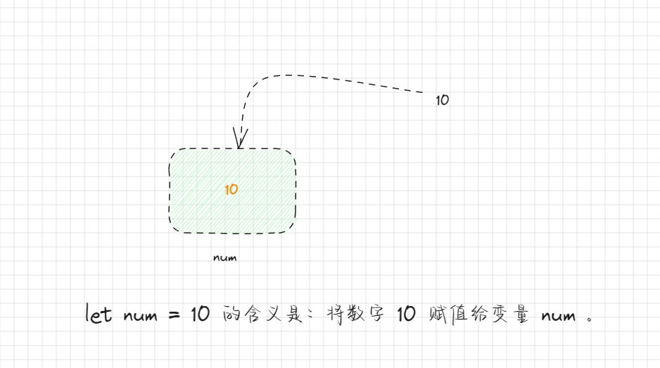
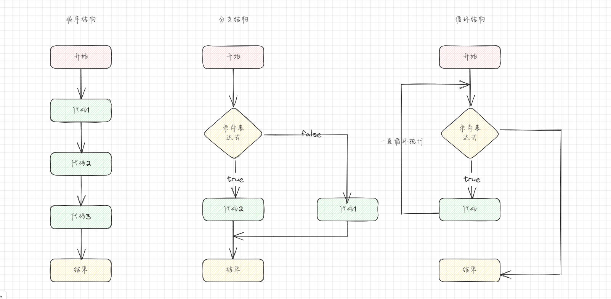
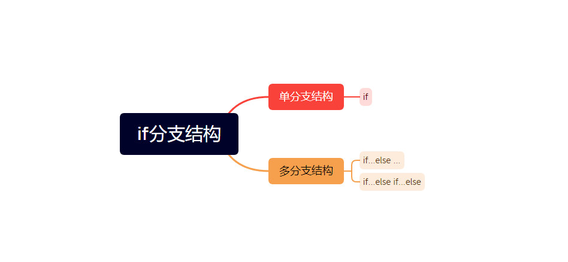
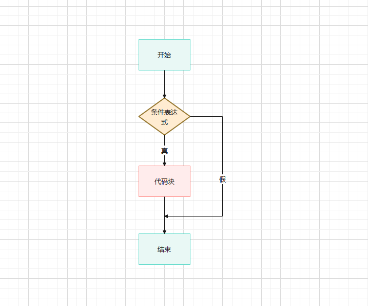
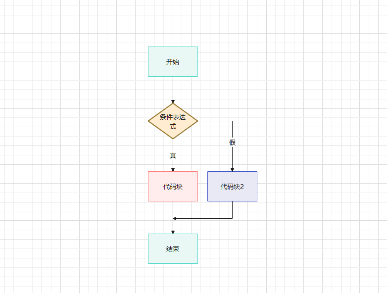
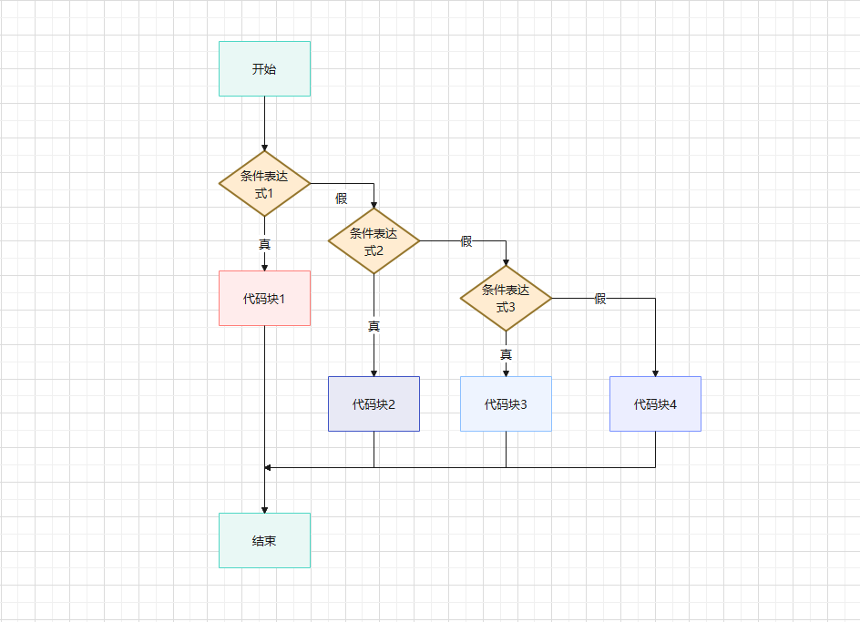
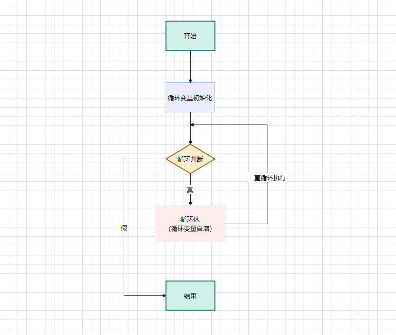
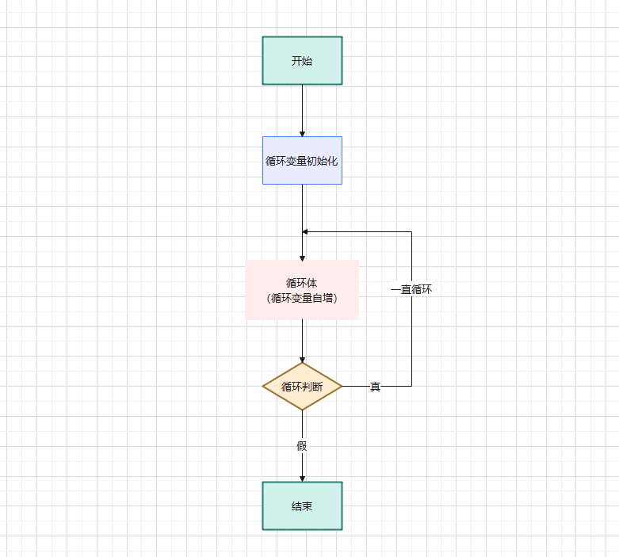
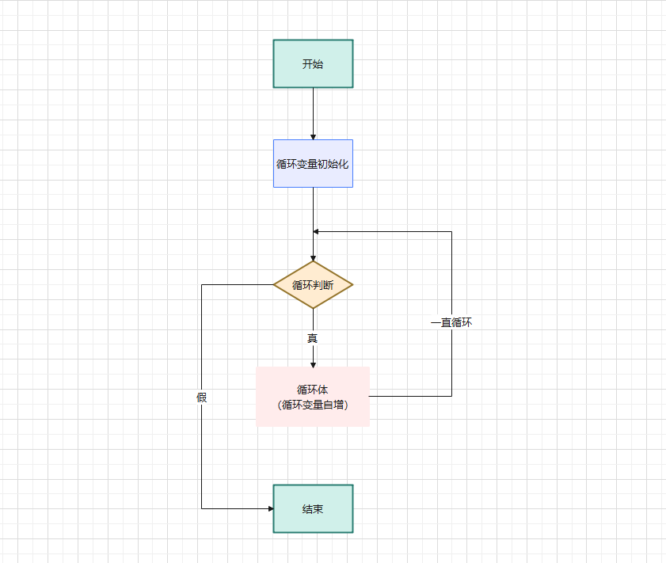

# 第一章：运算符（⭐）

## 1.1 概述

* 在小学的时候，我们就学习了各种运算符，例如：加号（`+`）、减号（`-`）、乘号（`*`）、除号（`-`）等。
* `绝大多数`的编程语言都有`各种各样`的运算符（操作符，operators）；`初次接触`这些运算符，我们会感觉`种类繁多`，难以记忆；但是，并不需要担心，因为`很多运算符`我们在以后的开发中，每天都会使用到；用的多了，也就记住了。

> 注意：绝大多数编写语言的运算符都是通用的，因为它们或多或少都吸收了 C 语言的一些思想。

* 计算机最基本的操作就是`进行计算`，不然怎么会命名计算机（别名：电脑，计算机是专业名称）呢？计算机在进行计算的时候，就需要使用各种运算符来进行计算：

```html
<!DOCTYPE html>
<html lang="en">
<head>
  <meta charset="UTF-8">
  <meta content="IE=edge" http-equiv="X-UA-Compatible">
  <meta content="width=device-width, initial-scale=1.0" name="viewport">
  <title>Title</title>
</head>
<body>
  <script>
    console.log(2 + 3) // + 就是一种运算符
    console.log(2 * 3) // * 也是一种运算符
  </script>
</body>
</html>
```

* JavaScript 按照使用场景的不同将运算符划分为很多种类型：
  * 算术运算符。
  * 赋值运算符。
  * 关系（比较）运算符。
  * 逻辑运算符。
  * ……

## 1.2 运算元

* `运算元`就是`运算符应用的对象`，例如：`5 * 2` ，就有两个运算元，即 `左运算元 5` 和 `右运算元 2`。
* 如果一个`运算符`对应的只有`一个运算元`，那么它就是`一元运算符`，例如：`-5` 中的 `-` 就是一元运算元，它的作用就是将数字进行取反操作。
* 如果一个`运算符`对应的有`两个运算元`，那么它就是`二元运算符`，例如：`2 + 5` 中的 `+` 就是二元运算元。

## 1.3 算术运算符

* 算术运算符是应用在`数学表达式`中的，它的使用方式和在数学中使用一样。
* 算术运算符是`对数据进行计算的符号`。

| 运算符 | 运算规则       | 范例          | 结果     |
| ------ | -------------- | ------------- | -------- |
| `+`    | 加法           | `2 + 3`       | `5`      |
| `+`    | 字符串拼接     | `'中' + '国'` | `'中国'` |
| `-`    | 加法           | `2 - 3`       | `-1`     |
| `-`    | 负号           | `-3`          | `-3`     |
| `*`    | 乘法           | `2 * 3`       | `6`      |
| `/`    | 除法           | `2 / 3`       | `6`      |
| `%`    | 取模（求余数） | `2 % 3`       | `2`      |
| `**`   | 幂（ES 7）     | `2 ** 3`      | `8`      |


* 示例：

```html
<!DOCTYPE html>
<html lang="en">
<head>
  <meta charset="UTF-8">
  <meta content="IE=edge" http-equiv="X-UA-Compatible">
  <meta content="width=device-width, initial-scale=1.0" name="viewport">
  <title>Title</title>
</head>
<body>
  <script>
    console.log(2 + 3) // 5
    console.log('中' + '国') // 中国
    console.log(2 - 3) // -1
    console.log(-3) // -3
    console.log(2 * 3) // 6
    console.log(2 / 3) // 0.6666666666666666
    console.log(2 % 3) // 2
    console.log(2 ** 3) // 8
  </script>
</body>
</html>
```

## 1.4 赋值运算符

### 1.4.1 概述

* `=` 是一种运算符，称之为`赋值运算符`。



* 链式赋值：从右到左进行计算，然后所有变量共享一个值。

```js
let a,b,c
a = b = c = 2 + 2
console.log(a , b, c)
```

> 注意：实际开发中，不推荐这种写法，代码的可读性比较差！


* 示例：

```html
<!DOCTYPE html>
<html lang="en">
<head>
  <meta charset="UTF-8">
  <meta content="IE=edge" http-equiv="X-UA-Compatible">
  <meta content="width=device-width, initial-scale=1.0" name="viewport">
  <title>Title</title>
</head>
<body>
  <script>
    var num = 10
    console.log(num)
  </script>
</body>
</html>
```

### 1.4.2 原地修改（Modify-in-Place）

* 有的时候，我们需要`对一个变量做运算`，然后`将新的结果保存到同一个变量中`，这个现象就称为`原地修改`。

```js
let num = 10
num = num + 20
num = num - 5
console.log(num)
```

* 当然，我们也可以使用 `+=` 和 `-=` 来对这种操作进行简写：

```js
let num = 10
num += 20
num -= 5
```

* 其实，绝大部分的编程语言的的算术运算符都有原地修改的简写符号，JavaScript 也不例外。

| 运算符 | 运算规则           | 范例            | 结果  |
| ------ | ------------------ | --------------- | ----- |
| `=`    | 赋值               | `a = 5`         | `5`   |
| `+=`   | 加后赋值           | `a =5; a += 2`  | `7`   |
| `-=`   | 减后赋值           | `a =5; a -= 2`  | `3`   |
| `*=`   | 乘后赋值           | `a =5; a *= 2`  | `10`  |
| `/=`   | 除后赋值           | `a =5; a /= 2`  | `2.5` |
| `%=`   | 取模（求余）后赋值 | `a =5; a %= 2`  | `1`   |
| `**=`  | 幂后赋值           | `a =5; a **= 2` | `25`  |


* 示例：

```html
<!DOCTYPE html>
<html lang="en">
<head>
  <meta charset="UTF-8">
  <meta content="IE=edge" http-equiv="X-UA-Compatible">
  <meta content="width=device-width, initial-scale=1.0" name="viewport">
  <title>Title</title>
</head>
<body>
  <script>
    var a = 5
    console.log('赋值：', a) // 赋值 5
    var b = 5
    b += 2
    console.log('加后赋值：', b) // 加后赋值： 7
    var c = 5
    c -= 2
    console.log('减后赋值：', c) // 减后赋值： 3
    var d = 5
    d *= 2
    console.log('乘后赋值 ：', d) // 乘后赋值 ： 10
    var e = 5
    e /= 2
    console.log('除后赋值 ：', e) // 除后赋值 ： 2.5
    var f = 5
    f %= 2
    console.log('取模 (余数)后赋值 ：', f) // 取模 (余数)后赋值 ： 1
    var g = 5
    g **= 2
    console.log('幂后赋值 ：', g) // 幂后赋值 ： 25

  </script>
</body>
</html>
```

### 1.4.3 自增和自减

* 有的时候，我们会将`一个变量`进行`原地修改`的时候，`每次只增加或减少 1` ；那么，也可以使用自增（`++`）或自减（`--`）操作符来进行简化。
* 语法：

```js
let num = 10 
num++ // 自增
num-- // 自减
```

> 注意：自增或自减只能用于变量，而不能用于数值！！


* 示例：

```html
<!DOCTYPE html>
<html lang="en">
<head>
  <meta charset="UTF-8">
  <meta content="IE=edge" http-equiv="X-UA-Compatible">
  <meta content="width=device-width, initial-scale=1.0" name="viewport">
  <title>Title</title>
</head>
<body>
  <script>
    var num = 10
    num++
    console.log('自增后的 num = ' + num) // 自增后的 num = 11
    num--
    console.log('自减后的 num = ' + num) // 自减后的 num = 10
  </script>
</body>
</html>
```

## 1.5 比较（关系）运算符

### 1.5.1 概述

* 我们知道，在数学中，我们会使用 `>`、`<` 等符号来比较两个数值的大小；在 JavaScript 中也是类似的，并且比较的结果都是 Boolean 类型（要么是 true ，要么是 false）。

| 运算符 | 运算规则 | 范例     | 结果    |
| ------ | -------- | -------- | ------- |
| `==`   | 相等     | `4 == 3` | `false` |
| `!=`   | 不等于   | `4 != 3` | `true`  |
| `>`    | 大于     | `4 > 3`  | `true`  |
| `<`    | 小于     | `4 < 3`  | `false` |
| `>=`   | 大于等于 | `4 >= 3` | `true`  |
| `<=`   | 小于等于 | `4 <= 3` | `false` |

 

* 示例：

```html
<!DOCTYPE html>
<html lang="en">
<head>
  <meta charset="UTF-8">
  <meta content="IE=edge" http-equiv="X-UA-Compatible">
  <meta content="width=device-width, initial-scale=1.0" name="viewport">
  <title>Title</title>
</head>
<body>
  <script>
    var num1 = 4
    var num2 = 3
    console.log(num1 == num2) // false
    console.log(num1 != num2) // true
    console.log(num1 > num2) // true
    console.log(num1 < num2) // false
    console.log(num1 >= num2) // true
    console.log(num1 <= num2) // false
  </script>
</body>
</html>
```

### 1.5.2 `==`  和 `===` 的区别

* 普通的 `==` 存在一个问题，即不能区分 `0` 、 `false` 、 `null` 、 `''`、`undefined` 和 `false` 这类运算，因为 `==` 在表`不同数据类型`的值的时候，会进行`隐式转换`，然后再`判断`。

```js
let num = 0
let str = ''
console.log(num == str) // true
```

* 如果我们要区分 `0` 、 `false` 、 `null` 、 `''`、`undefined` 和 `false` 这类运算，就需要使用 `===` 来判断了，因为 `===`在进行比较的时候不会做任何类型转换。

```js
let num = 0
let str = ''
console.log(num === str) // false
```

> 注意：
>
> * 在使用 TypeScript 作为类型系统的时候，压根不允许字符串和数值类型等使用 `==` 来比较，在编译期就消除一些常见的错误。
> * `==` 除了可以用来判断基本数据类型的值是否相等外，还可以判断对象（引用）是否是同一个对象（后面讲解）。

* 当然，`!=` 、 `!==` 和 `==`、`===` 的原理类似。 

## 1.6 逻辑运算符

### 1.6.1 概述

* JavaScript 中的逻辑运算符用于`在条件语句`中进行`逻辑判断`，根据`条件的真假`返回`布尔值`。
* 逻辑运算符可以用来解决`多重条件判断`。

| 运算符 | 运算规则                                     | 范例              | 结果    | 口诀           |
| ------ | -------------------------------------------- | ----------------- | ------- | -------------- |
| `&&`   | 与：符号两边都是 true ，结果才是 true 。     | `false && true`   | `false` | 一假则假       |
| `\|\|` | 或：符号两边有一个是 true ，结果就为 true 。 | `false \|\| true` | `true`  | 一真则真       |
| `!`    | 非：true 变为 false ，false 变为 true 。     | `!false`          | `true`  | 真变假，假变真 |


* 示例：

```html
<!DOCTYPE html>
<html lang="en">
<head>
  <meta charset="UTF-8">
  <meta content="IE=edge" http-equiv="X-UA-Compatible">
  <meta content="width=device-width, initial-scale=1.0" name="viewport">
  <title>Title</title>
</head>
<body>
  <script>
    /* 逻辑与 */
    console.log(true && true); // true
    console.log(true && false); // false
    /* 逻辑或 */
    console.log(true || false); // true
    console.log(false || false); // false
    /* 逻辑非 */
    console.log(!true); // false
  </script>
</body>
</html>
```


* 示例：

```html
<!DOCTYPE html>
<html lang="en">
<head>
  <meta charset="UTF-8">
  <meta content="IE=edge" http-equiv="X-UA-Compatible">
  <meta content="width=device-width, initial-scale=1.0" name="viewport">
  <title>Title</title>
</head>
<body>
  <script>
    var chinese = 88
    var math = 99

    /*
       逻辑与: &&, 并且
       条件1 && 条件2 && 条件3.....
       所有的条件都为true的时候, 最终结果才为true
    */
    // 如果语文 90 分以上，并且数学 90 分以上，就可以去游乐场
    if (chinese >= 90 && math >= 90) {
      console.log('可以去游乐场')
    } else {
      console.log('不能去游乐场')
    }
    /*
      2.逻辑或: ||, 或者
      条件1 || 条件2 || 条件3....
      只要有一个条件为true, 最终结果就为true
    */
    // 如果语文或数学有一门成绩 90 分以上，就可以打 1 小时游戏
    if (chinese >= 90 || math >= 90) {
      console.log('可以打 1 小时游戏')
    } else {
      console.log('不能打 1 小时游戏')
    }

    // 3.逻辑非: !, 取反
    var isLogin = false
    if (!isLogin) {
      console.log('跳转到登录页面')
      console.log('进行登录操作')
    }
    console.log("正常的访问页面")
  </script>
</body>
</html>
```

### 1.6.2 逻辑运算符中的短路

- 短路：只存在于 `&&` 或 `||` 中，当满足一定条件会让右边的代码不执行。

| 符号   | 短路条件            |
| ------ | ------------------- |
| `&&`   | 左边为 false 就短路 |
| `\|\|` | 左边为 true 就短路  |

-  原因：通过左边就能确定整个式子的结果，因此就没必要再判断右边了。


* 示例：

```html
<!DOCTYPE html>
<html lang="en">
<head>
    <meta charset="UTF-8">
    <meta content="IE=edge" http-equiv="X-UA-Compatible">
    <meta content="width=device-width, initial-scale=1.0" name="viewport">
    <title>Title</title>
</head>
<body>
    <script>
        /*
        * false、数字 0 、undefined、null、'' 都可以当做 false 来看
        */
        console.log(false && 20); // false
        console.log(5 < 3 && 20); // false
        console.log(undefined && 20); // undefined
        console.log(null && 20); // null
        console.log(0 && 20); // 0
        console.log(10 && 20); // 20
    </script>
</body>
</html>
```

### 1.6.3 逻辑与的本质（了解）

* 逻辑与的语法是：

```js
运算元1 && 运算元2 && 运算元3 
```

* 其实，逻辑与的本质是：
  * ① 拿到第一个运算元，将运算元转变为 Boolean 类型。
  * ② 对拿到的运算元的 Boolean 类型进行判断：
    * 如果为 false ，则将结果（原始值）返回。
    * 如果为 true，查找下一个继续来运算。
    * 依次类推。
  * ③ 如果查找了所有的都为 true ，则返回最后一个运算元（原始值）。


* 示例：

```html
<!DOCTYPE html>
<html lang="en">
<head>
  <meta charset="UTF-8">
  <meta content="IE=edge" http-equiv="X-UA-Compatible">
  <meta content="width=device-width, initial-scale=1.0" name="viewport">
  <title>Title</title>
</head>
<body>
  <script>
    /* 逻辑与（短路与） */
    var chineseScore = 80
    var mathScore = 99
    let result = (chineseScore > 90) && (mathScore > 90)
    console.log(result) // false
  </script>
</body>
</html>
```


* 示例：

```html
<!DOCTYPE html>
<html lang="en">
<head>
  <meta charset="UTF-8">
  <meta content="IE=edge" http-equiv="X-UA-Compatible">
  <meta content="width=device-width, initial-scale=1.0" name="viewport">
  <title>Title</title>
</head>
<body>
  <script>
    /* 调用对象的方法 */
    var obj = {
      name: '张三',
      age: 18,
      // friend: {
      //   name: '李四',
      //   age: 18,
      //   eating: function () {
      //     console.log(`${this.name}正在吃饭...`)
      //   }
      // }
    };

    // 调用函数，下面的代码可能没有 friend 属性，那么程序就会报错，容错性就比较差
    // obj.friend.eating()

    // 下面的代码，容错性好，即使没有 friend 属性，程序也不会报错
    obj && obj.friend && obj.friend.eating()

    // 但是，ECMAScript 2020 已经引入了 ?. 就是可选操作符，用来简化访问可能为 null 或 undefined 的属性或方法的过程，以避免出现 TypeError 错误。
    obj?.friend?.eating()

  </script>
</body>
</html>
```

### 1.6.4 逻辑或的本质（了解）

* 逻辑或的语法是：

```js
运算元1 || 运算元2 || 运算元3 
```

* 其实，逻辑或的本质是：
  * ① 拿到第一个运算元，将运算元转变为 Boolean 类型。
  * ② 对拿到的运算元的 Boolean 类型进行判断：
    * 如果为 true，则将结果（原始值）返回。
    * 如果为 false，查找下一个继续来运算。
    * 依次类推。
  * ③ 如果查找了所有的都为 false，则返回最后一个运算元（原始值）。


* 示例：

```html
<!DOCTYPE html>
<html lang="en">
<head>
  <meta charset="UTF-8">
  <meta content="IE=edge" http-equiv="X-UA-Compatible">
  <meta content="width=device-width, initial-scale=1.0" name="viewport">
  <title>Title</title>
</head>
<body>
  <script>
    /* 逻辑或（短路或） */
    var chineseScore = 99
    var mathScore = 99
    let result = (chineseScore > 90) || (mathScore > 90)
    console.log(result) // true
  </script>
</body>
</html>
```


* 示例：

```html
<!DOCTYPE html>
<html lang="en">
<head>
  <meta charset="UTF-8">
  <meta content="IE=edge" http-equiv="X-UA-Compatible">
  <meta content="width=device-width, initial-scale=1.0" name="viewport">
  <title>Title</title>
</head>
<body>
  <script>
    /* 获取第一个有值的结果 */
    var info = "abc"
    var obj = {name: "张三"}
    var message = info || obj || "我是默认值"
    console.log(message)
  </script>
</body>
</html>
```

## 1.7 三元运算符

* JavaScript 中的三元运算符是为了简化条件语句（if 语句，后面讲解）的写法而出现的。它可以在一行代码中根据条件的真假来返回不同的值。
* 语法：

```js
// 如果 condition 的结果是 true ，则返回 value1 ；否则，返回  value2
var result = condition ? value1 : value2 ;
```

> 注意：之所以，将其称为三元运算符，是因为该运算符需要三个操作数（运算元）。

* 应用常见：
  * ① 简化 if-else 语句：当只需要根据一个条件来返回两个不同的值的时候，可以使用三元操作符来代替 if-else 语句，这样可以使得代码更加简洁。
  * ② 动态赋值：可以根据条件的真或假来动态的给变量赋值。


* 示例：

```html
<!DOCTYPE html>
<html lang="en">
<head>
  <meta charset="UTF-8">
  <meta content="IE=edge" http-equiv="X-UA-Compatible">
  <meta content="width=device-width, initial-scale=1.0" name="viewport">
  <title>Title</title>
</head>
<body>
  <script>
    // 简化 if-else 语句
    var num = 10
    var result = (num > 5) ? "大于5" : "小于等于5"
    console.log(result) // 大于5
  </script>
</body>
</html>
```


* 示例：

```html
<!DOCTYPE html>
<html lang="en">
<head>
  <meta charset="UTF-8">
  <meta content="IE=edge" http-equiv="X-UA-Compatible">
  <meta content="width=device-width, initial-scale=1.0" name="viewport">
  <title>Title</title>
</head>
<body>
  <script>
    // 动态赋值
    var age = 18
    var isAudit = (age >= 18) ? true : false
    console.log(isAudit) // true
  </script>
</body>
</html>
```

## 1.8 运算符的优先级

* 下面是 JavaScript 中运算符的优先级表：

| 优先级 | 运算符                                                       | 描述                                                        |
| ------ | ------------------------------------------------------------ | ----------------------------------------------------------- |
| 1      | `()`                                                         | 括号                                                        |
| 2      | `.`                                                          | 成员访问                                                    |
| 3      | `[]`                                                         | 属性访问                                                    |
| 4      | `++`, `--`                                                   | 自增、自减                                                  |
| 5      | `!`, `+`, `-`, `~`, `typeof`, `void`, `delete`, `await`      | 逻辑非、一元加、一元减、按位非、typeof、void、delete、await |
| 6      | `*`, `/`, `%`                                                | 乘法、除法、取余                                            |
| 7      | `+`, `-`                                                     | 加法、减法                                                  |
| 8      | `<<`, `>>`, `>>>`                                            | 左移、右移、无符号右移                                      |
| 9      | `<`, `<=`, `>`, `>=`                                         | 小于、小于等于、大于、大于等于                              |
| 10     | `==`, `!=`, `===`, `!==`                                     | 等于、不等于、全等于、不全等于                              |
| 11     | `&`                                                          | 按位与                                                      |
| 12     | `^`                                                          | 按位异或                                                    |
| 13     | `                                                       \| ` | 按位或                                                      |
| 14     | `&&`                                                         | 逻辑与                                                      |
| 15     | `\|\|`                                                       | 逻辑或                                                      |
| 16     | `?:`                                                         | 条件（三元）                                                |
| 17     | `=`, `+=`, `-=`, `*=`, `/=`, `%=`                            | 赋值、加等、减等、乘等、除等、取余等                        |
| 18     | `,`                                                          | 逗号                                                        |

> 注意：
>
> * 这只是一份常见运算符的优先级表格，并不包含所有运算符。
> * 在实际使用中，可以根据需要使用括号`()`来明确运算符的优先级。


# 第二章：程序控制结构

## 2.1 概述

* 程序控制结构分为：顺序结构、分支结构和循环结构。
* 区别如下：
  * 顺序结构：按照代码的顺序依次执行，没有条件或循环。代码按照预定的顺序一步一步执行，直到结束。
  * 分支结构：根据条件的真假选择不同的执行路径。使用条件语句（如：if 语句）来决定执行哪个代码块，根据给定的条件选择不同的分支。
  * 循环结构：根据条件的真假重复执行某段代码。使用循环语句（如：for 循环、while 循环）来重复执行一段代码，直到给定的条件不再满足。
* 这些结构可以单独使用，也可以嵌套在一起使用，以实现复杂的程序逻辑。



## 2.2 代码块的理解

* `代码块`是多行执行代码的集合，通过一个`花括号{}`放到了一起。

> 注意：在开发中，一行代码很难完成某一个特定的功能的时候，我们就会将这些代码放到代码块中。

```js
{
    let name = "许大仙"
    let age = 18
    console.log(`我是名字是：${name}，我的年龄是：${age}`)
}
```

* 在 JavaScript 中，我们可以通过流程控制语句来决定如何执行一个代码块：
  * 通常会通过一些`关键字`来告诉 JavaScript 引擎`如何执行`相应的代码。
  * 如：分支语句、循环语句对应的`关键字`等。


# 第三章：分支结构（⭐）

## 3.1 什么是分支结构？

* 现实生活中有很多情况，需要我们根据`条件`来做一些决定：
  * ① 如果小明考了 100 分，就奖励一辆法拉第（车模型，判断分数是否等于 100 分）。
  * ② 网吧`禁止未成年人入内`（判断年龄是否大于等于 18 岁，是否带了身份证等）。
  * ③ 在登录各种系统的时候，我们需要输入相应的凭证信息（用户名、密码等）；如果`登录失败`，系统将拒绝服务。
* `程序是生活的一种抽象`；只不过，我们是用程序来描述而已！
  * 在实际开发中，我们经常需要根据`一定的条件`，来决定代码的`执行方向`。
  * 如果`条件满足`，才能做`某件事情`。
  * 如果`条件不满足`，就做`另外一件事情`。
* 分支结构就是让我们根据`条件`来`决定`代码`如何执行`。绝大多数的编程语言都支持分支结构，JavaScript 也不例外。
* JavaScript 中常见的分支结构是：
  * `if` 分支结构。
  * `switch` 分支结构。

## 3.2 if 分支结构

### 3.2.1 概述

* if 分支结构有三种：



### 3.2.2 单分支结构

* 语法：

```js
if(条件表达式) {
    ...
}
```

* 如果 `(...)` 中的条件表达式的计算结果为 true，就会执行对应的代码块。
* 其流程图如下：



> 注意：`if(...)`语句会计算表达式的结果，并将其转换为 Boolean 类型。转换规则和 Boolean 函数的规则一致。


* 示例：

```html
<!DOCTYPE html>
<html lang="en">
<head>
  <meta charset="UTF-8">
  <meta content="IE=edge" http-equiv="X-UA-Compatible">
  <meta content="width=device-width, initial-scale=1.0" name="viewport">
  <title>Title</title>
</head>
<body>
  <script>
    /* 如果小明考试超过 90 分，就去游乐场玩。 */
    var score = Number(prompt("请输入小明的考试分数："))
    if (score >= 90) {
      console.log("去游乐场玩~")
    }
  </script>
</body>
</html>
```


* 示例：

```html
<!DOCTYPE html>
<html lang="en">
<head>
  <meta charset="UTF-8">
  <meta content="IE=edge" http-equiv="X-UA-Compatible">
  <meta content="width=device-width, initial-scale=1.0" name="viewport">
  <title>Title</title>
</head>
<body>
  <script>
    /* 5元/斤的苹果，如果超过 5 斤，那么减少 8 元。 */
    var num = Number(prompt("请输入购买的重量（斤）："))
    var price = 5
    var total = price * num
    if (num >= 5) {
      total -= 8
    }
    console.log(`总价格是：${total}`)
  </script>
</body>
</html>
```

### 3.2.3 多分支语句

* 语法：

```js
if(条件表达式){
    // 条件成立，执行代码块
} else{
    // 条件不成立，执行代码块
}
```

* 其流程图如下：




* 示例：

```html
<!DOCTYPE html>
<html lang="en">
<head>
  <meta charset="UTF-8">
  <meta content="IE=edge" http-equiv="X-UA-Compatible">
  <meta content="width=device-width, initial-scale=1.0" name="viewport">
  <title>Title</title>
</head>
<body>
  <script>
    /*
      如果小明考试超过 90 分，就去游乐场玩。
      否则，就要去上补习班。
    */
    var score = Number(prompt("请输入小明的考试分数："))
    if (score >= 90) {
      console.log("去游乐场玩~")
    } else {
      console.log("去上补习班~")
    }
  </script>
</body>
</html>
```


* 示例：

```html
<!DOCTYPE html>
<html lang="en">
<head>
  <meta charset="UTF-8">
  <meta content="IE=edge" http-equiv="X-UA-Compatible">
  <meta content="width=device-width, initial-scale=1.0" name="viewport">
  <title>Title</title>
</head>
<body>
  <script>
    /*
      判断两个数字的大小
    */
    var num1 = Number(prompt("请输入第一个数字："))
    var num2 = Number(prompt("请输入第二个数字："))

    if (num1 >= num2) {
      console.log(num1 + "比较大")
    } else {
      console.log(num2 + "比较大")
    }

  </script>
</body>
</html>
```


* 示例：

```html
<!DOCTYPE html>
<html lang="en">
<head>
  <meta charset="UTF-8">
  <meta content="IE=edge" http-equiv="X-UA-Compatible">
  <meta content="width=device-width, initial-scale=1.0" name="viewport">
  <title>Title</title>
</head>
<body>
  <script>
    /*
      判断两个数字的大小
    */
    var num1 = Number(prompt("请输入第一个数字："))
    var num2 = Number(prompt("请输入第二个数字："))

    if ((num1 - num2) >= 0) {
      console.log(num1 + "比较大")
    } else {
      console.log(num2 + "比较大")
    }

  </script>
</body>
</html>
```

### 3.2.4 多分支语句

* 语法：

```js
if(条件表达式1){
    // 条件成立1，执行代码块
} else if(条件表达式2){
    // 条件2成立，执行代码块
} else if(条件表达式3){
    // 条件3成立，执行代码块
}else {
    // 条件都不成立，执行代码块
}
```

* 其流程图如下：




* 示例：

```html
<!DOCTYPE html>
<html lang="en">
<head>
  <meta charset="UTF-8">
  <meta content="IE=edge" http-equiv="X-UA-Compatible">
  <meta content="width=device-width, initial-scale=1.0" name="viewport">
  <title>Title</title>
</head>
<body>
  <script>
    /*
      分数评级
      分数 >= 90 ，优秀
      分数 >= 80 && 分数 < 90 ，良好
      分数 >= 60 && 分数 < 79 ，合格
      分数 < 60 ，差
    */
    var score = Number(prompt("请输入分数[0,100]："))
    var grade = 0
    if (score >= 90) {
      grade = "优秀"
    } else if (score >= 80) {
      grade = "良好"
    } else if (score >= 60) {
      grade = "合格"
    } else {
      grade = "差"
    }

    console.log(`本次考试的等级是：${grade}`)

  </script>
</body>
</html>
```

## 3.3 switch 语句

* switch 语句是通过判断`表达式的结果（或变量）`是否等于 `case 语句的常量`，来执行相应的分支结构的。
* 语法：

```js
switch (expression) {
  case value1:
    // 当 expression 等于 value1 时执行的代码块
    break;
  case value2:
    // 当 expression 等于 value2 时执行的代码块
    break;
  case value3:
    // 当 expression 等于 value3 时执行的代码块
    break;
  // 可以有更多的 case
  default:
    // 当 expression 不等于任何一个 case 值时执行的代码块
}
```

* 解释一下 switch 语句的各个部分：
  * `expression` 是需要进行比较的表达式或值。
  * `case value1:` 是一个 case 标签，表示当 `expression` 等于 `value1` 时执行对应的代码块。
  * `break;` 用于终止当前的 case，防止继续执行下一个 case 的代码块。如果没有使用 `break;`，则会继续执行下一个 case 的代码块，直到遇到 `break;` 或者 switch 语句结束。
  * `default:` 是一个可选的标签，表示当 `expression` 不等于任何一个 case 值时执行对应的代码块。如果没有匹配的 case，且没有 default，则 switch 语句不会执行任何代码。


* 示例：

```html
<!DOCTYPE html>
<html lang="en">
<head>
  <meta charset="UTF-8">
  <meta content="IE=edge" http-equiv="X-UA-Compatible">
  <meta content="width=device-width, initial-scale=1.0" name="viewport">
  <title>Title</title>
</head>
<body>
  <script>
    /*
      根据给定的数字返回对应的星期几名称
    */
    var dayNumber = Number(prompt("请输入数字[0,6]："))
    var dayName;
    switch (dayNumber) {
      case 0:
        dayName = "Sunday";
        break;
      case 1:
        dayName = "Monday";
        break;
      case 2:
        dayName = "Tuesday";
        break;
      case 3:
        dayName = "Wednesday";
        break;
      case 4:
        dayName = "Thursday";
        break;
      case 5:
        dayName = "Friday";
        break;
      case 6:
        dayName = "Saturday";
        break;
      default:
        dayName = "Invalid day";
    }

    console.log(dayName);

  </script>
</body>
</html>
```


# 第四章：循环结构（⭐）

## 4.1 概述

* 在实际开发中，我们经常需要做各种各样的`循环`操作：
  * ① 将一个`列表中的商品依次输出`进行展示。
  * ② 对一个`列表进行累加`计算。
  * ③ 运行`相同的代码`将数字从 1 到 10 `逐个`输出。
  * ……
* `循环`是指`重复`的执行同一段代码。

> 注意：如果对某一个列表执行循环操作，我们通常称之为`遍历（traversal）`或`迭代（iteration）`。

* JavaScript 支持三种循环方式：
  * ① while 循环
  * ② do...while 循环
  * ③ for 循环

> 注意：其实，在实际开发中，我们很少使用到 do...while 循环；for 循环的出场是最多的，其次是 while 循环。

## 4.2 while 循环

* 语法：

```js
while(循环条件) {
    // 循环体
}
```

* 循环的本质就是以`某个变量`为起始值，然后不断产生`变化量`，慢慢`靠近`终止条件的过程。
* 其流程图如下：



* 循环的三要素： 
  * 变量起始值。
  * 终止条件（没有终止条件，循环会一直执行，造成死循环）。
  * 变量的变化量（使用自增和自减）。


> 注意：如果条件一直成立（true），就会产生死循环；在实际开发中，一定要`避免死循环`的产生。


* 示例：

```html
<!DOCTYPE html>
<html lang="en">
<head>
  <meta charset="UTF-8">
  <meta content="IE=edge" http-equiv="X-UA-Compatible">
  <meta content="width=device-width, initial-scale=1.0" name="viewport">
  <title>Title</title>
</head>
<body>
  <script>
    /* 打印 10 次 Hello World */
    var i = 0
    while (i < 10) {
      console.log('Hello World')
      i++
    }
  </script>
</body>
</html>
```


* 示例：

```html
<!DOCTYPE html>
<html lang="en">
<head>
  <meta charset="UTF-8">
  <meta content="IE=edge" http-equiv="X-UA-Compatible">
  <meta content="width=device-width, initial-scale=1.0" name="viewport">
  <title>Title</title>
</head>
<body>
  <script>
    /* 打印 [0,100] 的数字 */
    var i = 0
    while (i <= 100) {
      console.log(i)
      i++
    }
  </script>
</body>
</html>
```


* 示例：

```html
<!DOCTYPE html>
<html lang="en">
<head>
  <meta charset="UTF-8">
  <meta content="IE=edge" http-equiv="X-UA-Compatible">
  <meta content="width=device-width, initial-scale=1.0" name="viewport">
  <title>Title</title>
</head>
<body>
  <script>
    /* 计算 [0,100] 的和 */
    var i = 0
    var total = 0
    while (i <= 100) {
      total += i
      i++
    }
    console.log(`[0,100]的和是：${total}`) // [0,100]的和是：5050
  </script>
</body>
</html>
```


* 示例：

```html
<!DOCTYPE html>
<html lang="en">
<head>
  <meta charset="UTF-8">
  <meta content="IE=edge" http-equiv="X-UA-Compatible">
  <meta content="width=device-width, initial-scale=1.0" name="viewport">
  <title>Title</title>
</head>
<body>
  <script>
    /* 计算 [0,100] 的奇数和 */
    var i = 0
    var total = 0
    while (i <= 100) {
      if (i % 2 !== 0) {
        total += i
      }
      i++
    }
    console.log(`[0,100]的奇数和是：${total}`) // [0,100]的奇数和是：2500
  </script>
</body>
</html>
```


* 示例：

```html
<!DOCTYPE html>
<html lang="en">
<head>
  <meta charset="UTF-8">
  <meta content="IE=edge" http-equiv="X-UA-Compatible">
  <meta content="width=device-width, initial-scale=1.0" name="viewport">
  <title>Title</title>
</head>
<body>
  <script>
    /* 计算 [0,100] 的偶数和 */
    var i = 0
    var total = 0
    while (i <= 100) {
      if (i % 2 == 0) {
        total += i
      }
      i++
    }
    console.log(`[0,100]的偶数和是：${total}`) // [0,100]的偶数和是：2550
  </script>
</body>
</html>
```

## 4.3 do...while 循环

* 语法：

```js
do {
    // 循环体
}while(循环条件);
```

* 其流程图如下：



* while 和 do...while 循环非常像，二者经常可以互相转换；do..while 的特点是不管条件是否成立，都会先执行一次循环体。

> 注意：在实际开发中，我们更倾向于使用 while 循环。


* 示例：

```html
<!DOCTYPE html>
<html lang="en">
<head>
  <meta charset="UTF-8">
  <meta content="IE=edge" http-equiv="X-UA-Compatible">
  <meta content="width=device-width, initial-scale=1.0" name="viewport">
  <title>Title</title>
</head>
<body>
  <script>
    /* 计算 [0,100] 的偶数和 */
    var i = 0
    var total = 0
    do {
      if (i % 2 == 0) {
        total += i
      }
      i++
    } while (i <= 100)
    console.log(`[0,100]的偶数和是：${total}`) // [0,100]的偶数和是：2550
  </script>
</body>
</html>
```

## 4.4 for 循环

* 语法：

```js
for(声明记录循环次数的变量;循环条件;变化值){
    // 循环体
}
```

* 其流程图如下：



> 注意：开发中如何选择 while 循环还是 for 循环？
>
> * 如果明确循环次数，推荐使用 for 循环。
> * 如果没有明确循环次数，推荐使用 while 循环。


* 示例：

```html
<!DOCTYPE html>
<html lang="en">
<head>
  <meta charset="UTF-8">
  <meta content="IE=edge" http-equiv="X-UA-Compatible">
  <meta content="width=device-width, initial-scale=1.0" name="viewport">
  <title>Title</title>
</head>
<body>
  <script>
    /* 打印 10 次 Hello World */
    for (var i = 0; i < 10; i++) {
      console.log(`第${i + 1}次：Hello World`);
    }
  </script>
</body>
</html>
```


* 示例：

```html
<!DOCTYPE html>
<html lang="en">
<head>
  <meta charset="UTF-8">
  <meta content="IE=edge" http-equiv="X-UA-Compatible">
  <meta content="width=device-width, initial-scale=1.0" name="viewport">
  <title>Title</title>
</head>
<body>
  <script>
    /* 打印 [0,100] 的数字 */
    for (var i = 0; i <= 100; i++) {
      console.log(i)
    }
  </script>
</body>
</html>
```


* 示例：

```html
<!DOCTYPE html>
<html lang="en">
<head>
  <meta charset="UTF-8">
  <meta content="IE=edge" http-equiv="X-UA-Compatible">
  <meta content="width=device-width, initial-scale=1.0" name="viewport">
  <title>Title</title>
</head>
<body>
  <script>
    /* 计算 [0,100] 的和 */
    var total = 0
    for (var i = 0; i <= 100; i++) {
      total += i
    }
    console.log(`[0,100]的和是：${total}`)
  </script>
</body>
</html>
```


* 示例：

```html
<!DOCTYPE html>
<html lang="en">
<head>
  <meta charset="UTF-8">
  <meta content="IE=edge" http-equiv="X-UA-Compatible">
  <meta content="width=device-width, initial-scale=1.0" name="viewport">
  <title>Title</title>
</head>
<body>
  <script>
    /* 计算 [0,100] 的奇数和 */
    var total = 0
    for (var i = 0; i <= 100; i++) {
      if (i % 2 !== 0) {
        total += i
      }
    }
    console.log(`[0,100]的奇数和是：${total}`) // [0,100]的奇数和是：2500
  </script>
</body>
</html>
```


* 示例：

```html
<!DOCTYPE html>
<html lang="en">
<head>
  <meta charset="UTF-8">
  <meta content="IE=edge" http-equiv="X-UA-Compatible">
  <meta content="width=device-width, initial-scale=1.0" name="viewport">
  <title>Title</title>
</head>
<body>
  <script>
    /* 计算 [0,100] 的偶数和 */
    var total = 0
    for (var i = 0; i <= 100; i++) {
      if (i % 2 === 0) {
        total += i
      }
    }
    console.log(`[0,100]的奇数和是：${total}`) // [0,100]的奇数和是：2550
  </script>
</body>
</html>
```

## 4.5 for 循环嵌套

* JavaScript 中的 for 循环的嵌套是指在一个 for 循环的循环体中包含另一个或多个 for 循环。通过这种嵌套的方式，我们可以实现更加复杂的循环控制，如：遍历多维数组或执行多重迭代操作。

> 注意：平常开发中，使用 for 循环嵌套的机会不是很多；常见于，一些算法中。


* 示例：

```html
<!DOCTYPE html>
<html lang="en">
<head>
  <meta charset="UTF-8">
  <meta content="IE=edge" http-equiv="X-UA-Compatible">
  <meta content="width=device-width, initial-scale=1.0" name="viewport">
  <title>Title</title>
</head>
<body>
  <script>
    /* 显示一个九九乘法表 */
    for (var i = 1; i <= 9; i++) {
      var row = '';
      for (var j = 1; j <= i; j++) {
        row += j + ' * ' + i + ' = ' + (i * j) + '\t';
      }
      console.log(row);
    }
  </script>
</body>
</html>
```


* 示例：

```html
<!DOCTYPE html>
<html lang="en">
<head>
  <meta charset="UTF-8">
  <meta content="IE=edge" http-equiv="X-UA-Compatible">
  <meta content="width=device-width, initial-scale=1.0" name="viewport">
  <title>Title</title>
</head>
<body>
  <script>
    /* 遍历二维数组 */
    var arr = [
      [1, 2, 3],
      [4, 5, 6],
      [7, 8, 9]
    ]

    for (var i = 0; i < arr.length; i++) {
      for (var j = 0; j < arr[i].length; j++) {
        console.log(arr[i][j])
      }
    }
  </script>
</body>
</html>
```

## 4.6 循环控制

* 循环控制：在执行循环的过程中，`遇到某种条件`的时候，我们可能想要`做一些事情`，如：`循环体没有执行完，但是却想跳出循环`；`本次循环体不再执行，执行下一次的循环体`。
* JavaScript 中提供了 `break` 和 `continue` 关键字来满足这两种情况：
  * break：跳出当前所在的循环，循环结束。
  * continue：跳过当次循环，接着执行下一次的循环体。


* 示例：

```html
<!DOCTYPE html>
<html lang="en">
<head>
  <meta charset="UTF-8">
  <meta content="IE=edge" http-equiv="X-UA-Compatible">
  <meta content="width=device-width, initial-scale=1.0" name="viewport">
  <title>Title</title>
</head>
<body>
  <script>
    /* 使用 for 循环打印数字，当数字为 3 的时候跳出循环 */

    for (var i = 0; i < 10; i++) {
      if (i === 3) {
        break;
      }
      console.log(i)
    }

  </script>
</body>
</html>
```


* 示例：

```html
<!DOCTYPE html>
<html lang="en">
<head>
  <meta charset="UTF-8">
  <meta content="IE=edge" http-equiv="X-UA-Compatible">
  <meta content="width=device-width, initial-scale=1.0" name="viewport">
  <title>Title</title>
</head>
<body>
  <script>
    /*
      使用 for 循环打印数字，当数字为 3 的时候跳出当次循环，执行下一次循环，即不打印 3
    */
    for (let i = 0; i < 10; i++) {
      if (i === 3) {
        continue;
      }
      console.log(i)
    }

  </script>
</body>
</html>
```


* 示例：

```html
<!DOCTYPE html>
<html lang="en">
<head>
  <meta charset="UTF-8">
  <meta content="IE=edge" http-equiv="X-UA-Compatible">
  <meta content="width=device-width, initial-scale=1.0" name="viewport">
  <title>Title</title>
</head>
<body>
  <script>
    /*
      猜数字游戏
       电脑随机生成一个0~100之间的数字；
       玩家有7次猜测的机会；
       玩家猜测一个数字, 输入到程序中；
       电脑根据输入的数字打印: 猜大了/猜小了/猜对了的情况；
       猜对了, 那么游戏结束，显示恭喜您；
       7次机会用完打印: 您的次数用完了, 您失败了；
    */
    function getRandomIntInclusive(min, max) {
      min = Math.ceil(min);
      max = Math.floor(max);
      return Math.floor(Math.random() * (max - min + 1)) + min; //含最大值，含最小值
    }

    // 随机数
    var random = getRandomIntInclusive(0, 100)
    // 统计猜测的次数
    var count = 7
    // 保存结果
    var result = ''
    while (true) {
      var guess = Number(prompt(`请输入猜测的数字（随机数是：${random}）：`))
      if (guess > random) {
        console.log('猜大了')
      } else if (guess < random) {
        console.log('猜小了')
      } else {
        result = '恭喜您，猜测成功😄'
        break
      }
      if (--count === 0) {
        result = '您的次数用完了, 您失败了😂'
        break
      }
    }

    console.log('猜测结果: ' + result)

  </script>
</body>
</html>
```

