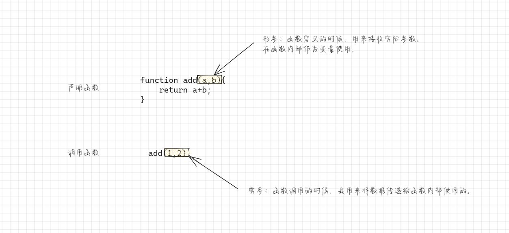
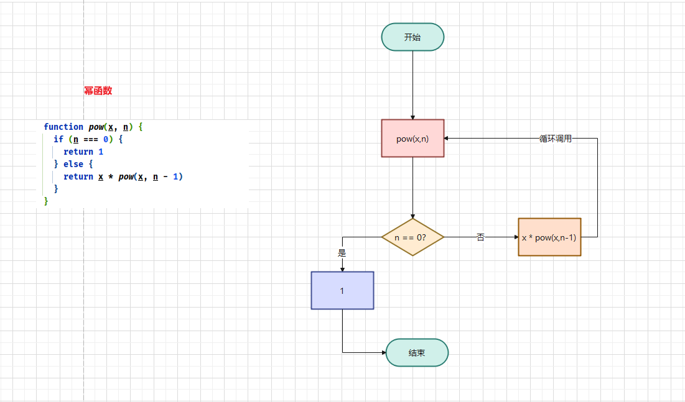
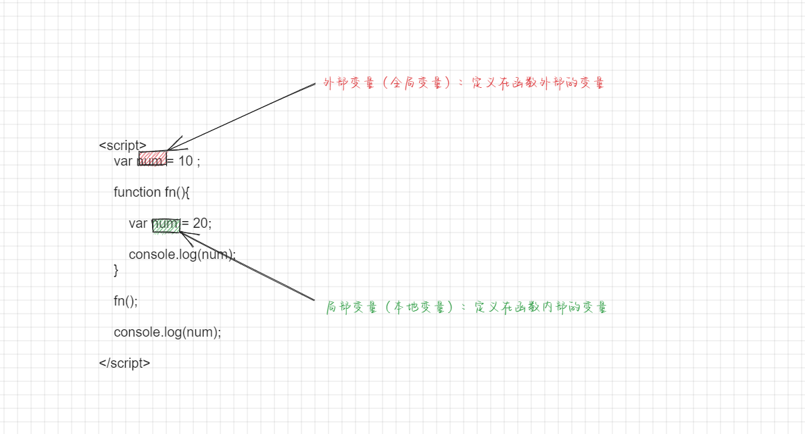
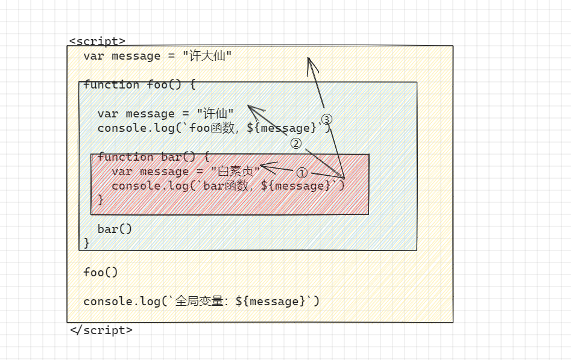
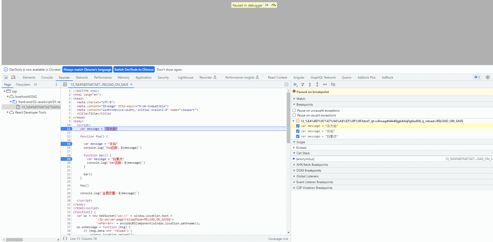
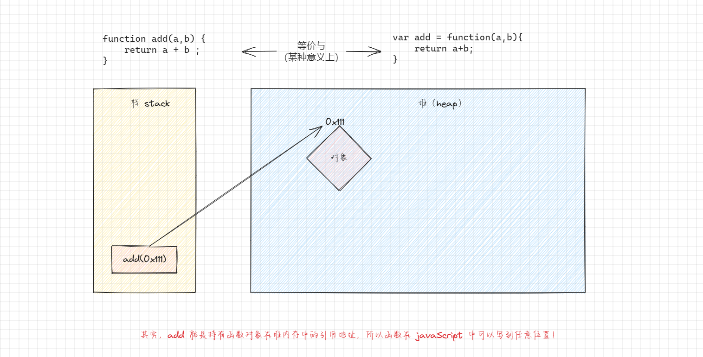

# 第一章：初识函数

## 1.1 程序中的 foo、bar 和 baz

* 在程序中，`foo`、`bar` 和 `baz` 是通常用作临时变量或占位符的名称。
* 它们没有具体的含义，只是用来表示某个变量或函数的名称。
* 这些名称通常在`示例代码`或`教学材料`中使用，以便更容易理解和阐述代码的逻辑。

> 注意：在实际的开发中，程序员通常会使用更具描述性的变量名称来提高代码的可读性。


* 示例：

```html
<!DOCTYPE html>
<html lang="en">
<head>
  <meta charset="UTF-8">
  <meta content="IE=edge" http-equiv="X-UA-Compatible">
  <meta content="width=device-width, initial-scale=1.0" name="viewport">
  <title>Title</title>
</head>
<body>
  <script>
    // 声明一个函数
    function foo() {

    }
    // 调用函数
    foo()

    let bar = "hello"
    console.log(bar)
  </script>
</body>
</html>
```

## 1.2 认识函数

* 在之前，我们已经接触过很多函数：
  * `alert()` 函数：浏览器弹出一个弹窗。
  * `prompt()` 函数：在浏览器弹窗中接收用户的输入。
  * `console.log()` 函数：在控制台打印内容。
  * `String`、`Number`、`Boolean` 函数。
  * ……

* 在高中，我们就学过了函数了，其定义是：`y = f(x)`，而 `f(x) = 2x + 3`，也可能是 `f(x) = 3x + 4` ；换言之，`f(x)` 就是对 `2x + 3` 或 `3x + 4` 的封装。

> 注意：
>
> * 在高中数学中，函数是一种数学关系，用来描述自变量和因变量之间的对应关系。函数可以用符号表示为 `y=f(x)`，其中`x` 表示自变量，`y` 表示因变量，`f` 表示函数名。
> * 函数的定义包括两个方面：定义域和对应关系。
>   * 定义域：函数的定义域是自变量 `x` 的取值范围，也就是函数的输入值的集合。定义域可以是实数集、整数集、有理数集等，具体取决于函数的性质和问题的要求。
>   * 对应关系：函数的对应关系指的是自变量和因变量之间的一一对应关系。对于每个自变量 *`x`* 的取值，函数`f(x)` 都有唯一确定的因变量 `y` 的取值与之对应。
>
> * 函数的定义还可以包括函数的解析式、图表、性质等方面的描述，用来更全面地描述函数的特征和性质。
> * 在高中数学中，学生通常会学习和掌握各种类型的函数，如线性函数、二次函数、指数函数、对数函数等，以及函数的性质、图表、变换等相关知识。
>

* 在 JavaScript 中，也是类似的，`函数就是对某段代码的封装`，这段代码可以帮助我们完成某一个功能（如：我们需要一个轮播图的效果，可以让别人将函数封装好，我们使用的时候直接调用函数传递参数即可）。

> 注意：
>
> * 默认情况下，JavaScript 引擎或浏览器会给我们`提供一些已经实现好的函数`。
> * 我们也可以`编写自己的函数`或者`使用第三方实现的函数`。


# 第二章：函数的声明和调用（⭐）

## 2.1 函数的使用步骤

* 函数的使用步骤：
  * ① `声明函数`：封装`独立`的功能。
  * ② `调用函数`：享受`封装`的结果。
* `声明函数`，在 JavaScript 中也可以称为`定义函数`：
  * 声明函数的过程是`对某些功能的封装过程`。
  * 在之后的开发中，`我们会根据自己的需求定义很多自己的函数`。
* `调用函数`，也可以称为`函数调用`：
  * `调用函数`是让已经存在的函数为我们所用。
  * 这些函数可以是`我们已经封装好`的某个功能函数，也可以使用`默认提供`或`第三方库提供`的某个功能函数。

> 注意：我们可以利用函数提高编写代码的效率以及代码的复用。

## 2.2 函数声明和调用

* 函数声明的语法：

```js
function 函数名(形参1,形参2,...){
    // 函数体
}
```

> 注意：
>
> * `函数名`的`命名规则`和`变量名`的`命名规则`一致。
> * 函数名`命名`的时候尽量做到`见名知意`。
> * 函数定义之后里面的代码`不会`立即执行，函数必须`调用`才会执行。

* 函数调用的语法：

```js
函数名(实参1,实参2,...)
```


* 示例：

```html
<!DOCTYPE html>
<html lang="en">
<head>
  <meta charset="UTF-8">
  <meta content="IE=edge" http-equiv="X-UA-Compatible">
  <meta content="width=device-width, initial-scale=1.0" name="viewport">
  <title>Title</title>
</head>
<body>
  <script>
    /**
     * 函数的声明
     */
    function personInfo() {
      var name = "许大仙"
      var age = 18
      console.log(`我是名字是：${name}，我的年龄是：${age}`)
    }

    // 函数的调用
    personInfo()
  </script>
</body>
</html>
```


* 示例：

```html
<!DOCTYPE html>
<html lang="en">
<head>
  <meta charset="UTF-8">
  <meta content="IE=edge" http-equiv="X-UA-Compatible">
  <meta content="width=device-width, initial-scale=1.0" name="viewport">
  <title>Title</title>
</head>
<body>
  <script>
    /**
     * 函数的声明
     */
    function add() {
      var num1 = 10
      var num2 = 20
      console.log(`result: ${num1 + num2}`)
    }

    // 函数的调用
    add()
  </script>
</body>
</html>
```

## 2.3 函数的参数

* 函数的`参数`，增加了函数的`通用性`，针对`相同的数据处理逻辑`，能够`适用更多的数据`：
  * 在函数`内部`，将`参数`当做`变量`来使用，并对需要的数据进行处理。
  * 函数调用的时候，按照函数定义的`参数顺序`，将希望在函数内部处理的数据，通过`参数`传递进来。

* 形参和实参：
  * `形参`：函数`定义`时，小括号中的参数，是用来`接收实际参数`的，在函数内部当做`变量`使用。
  * `实参`：函数`调用`时，小括号中的参数，是用来将数据传递给`函数内部`的。




* 示例：

```html
<!DOCTYPE html>
<html lang="en">
<head>
  <meta charset="UTF-8">
  <meta content="IE=edge" http-equiv="X-UA-Compatible">
  <meta content="width=device-width, initial-scale=1.0" name="viewport">
  <title>Title</title>
</head>
<body>
  <script>
    /**
     * @param {number} num1 形参，数值类型
     * @param {number} num2 形参，数值类型
     */
    function add(num1, num2) {
      return num1 + num2;
    }
  
    // 1 和 2 是实参
    add(1, 2)

  </script>
</body>
</html>
```

## 2.4 函数的返回值

* 之前，我们使用过 `prompt()` 函数，发现该函数不仅可以接收参数，也可以返回用户输入的内容：

```js
// 其中，"您的姓名是：" 是参数，而 name 是返回值
var name = prompt("您的姓名是：")
```

* 所以，函数不仅有参数，而且有返回值，并且函数是通过 `return` 关键字来返回结果，语法如下：

```js
function 函数名(函数1,函数2,...){
    return 值;
}
```

> 注意：
>
> * ① 一旦函数执行到 return 关键字之后，就会`终止`该函数的运行，并将对应的`值`返回。
> * ② 如果函数中`没有`使用 return 语句，那么该函数的`默认返回值`就是 `undefined` 。
> * ③ 如果函数使用了 return 语句，但是 return 语句中`没有`任何值，函数的返回值也是 `undefined` 。


* 示例：

```html
<!DOCTYPE html>
<html lang="en">
<head>
  <meta charset="UTF-8">
  <meta content="IE=edge" http-equiv="X-UA-Compatible">
  <meta content="width=device-width, initial-scale=1.0" name="viewport">
  <title>Title</title>
</head>
<body>
  <script>
    /**
     * @param {number} num1 形参，数值类型
     * @param {number} num2 形参，数值类型
     */
    function add(num1, num2) {
      return num1 + num2;
    }
  
    // 1 和 2 是实参
    var result = add(1, 2)
	console.log(`result: ${result}`)	
  </script>
</body>
</html>
```


* 示例：

```html
<!DOCTYPE html>
<html lang="en">
<head>
  <meta charset="UTF-8">
  <meta content="IE=edge" http-equiv="X-UA-Compatible">
  <meta content="width=device-width, initial-scale=1.0" name="viewport">
  <title>Title</title>
</head>
<body>
  <script>
    /* 定义一个函数，传入n（n为正整数），计算 1 ~ n 数字的和 */
    function sum(n) {
      var total = 0
      for (var i = 1; i <= n; i++) {
        total += i
      }
      return total
    }

    console.log(sum(100)) // 5050

  </script>
</body>
</html>
```

## 2.5 arguments 参数（了解）

* 实际上，在函数中有一个特别的对象 --- arguments 对象:
  * 默认情况下，`arguments` 对象是`所有（非箭头）函数`中都可以使用的`局部变量`。
  * arguments 对象中`保存着所有调用者传递的参数，从 0 位置开始，依次存放`。
  * arguments 变量的类型是 `Object 类型（array-like）`，`不是一个数组`；但是，和数组的用法很类似。

> 注意：
>
> * arguments 对象是 ES5 之前的写法，在 ES6 之后，推荐使用`剩余参数`来代替 arguments 对象了。
> * 为什么说 arguments 对象是 `array-like`，而不是数组？因为数组中有 forEach() 和 map() 等方法，arguments 对象中却没有。更精准的说法就是 `arguments instanceof Object` 是 `true`  而 `arguments instanceof Array` 是 `false`。


* 示例：

```html
<!DOCTYPE html>
<html lang="en">
<head>
  <meta charset="UTF-8">
  <meta content="IE=edge" http-equiv="X-UA-Compatible">
  <meta content="width=device-width, initial-scale=1.0" name="viewport">
  <title>Title</title>
</head>
<body>
  <script>
    function add() {
      var total = 0
      for (var i = 0; i < arguments.length; i++) {
        total += arguments[i]
      }
      return total
    }

    console.log(add(1, 2))
    console.log(add(1, 2, 3))
    console.log(add(1, 2, 3, 4))
  </script>
</body>
</html>
```


# 第三章：函数的递归调用（⭐）

## 3.1 函数中调用函数

* 在开发中，函数内部是可以调用另外一种函数的：

```html
<!DOCTYPE html>
<html lang="en">
<head>
  <meta charset="UTF-8">
  <meta content="IE=edge" http-equiv="X-UA-Compatible">
  <meta content="width=device-width, initial-scale=1.0" name="viewport">
  <title>Title</title>
</head>
<body>
  <script>
    function bar() {
      console.log('bar函数')
    }

    function foo() {
      console.log('foo函数')
      // 在函数中调用函数
      bar()
    }

    // 调用
    foo()
  </script>
</body>
</html>
```

* 那么，在 JavaScript 中函数是否可以自己调用自己？当然可以，但是`函数自己调用自己`必须有`结束条件`，否则会产生`无限调用`，造成`栈溢出`等问题。

```html
<!DOCTYPE html>
<html lang="en">
<head>
  <meta charset="UTF-8">
  <meta content="IE=edge" http-equiv="X-UA-Compatible">
  <meta content="width=device-width, initial-scale=1.0" name="viewport">
  <title>Title</title>
</head>
<body>
  <script>
    // 计算调用的次数
    var count = 0

    function foo() {
      // 终止条件（结束条件）
      if (count++ == 2) {
        return
      }
      console.log("foo 函数")
      // 在函数中调用函数
      foo()
    }

    // 调用
    foo()
  </script>
</body>
</html>
```

## 3.2 递归

* 其实，函数自己调用自己有一个专业名词就是递归（Recursion）。
* 递归是一种重要的编程思想：将一个复杂的任务，转换成可以重复执行的相同任务。

> 注意：
>
> * 在使用递归的时候，必须`确保`有递归`终止条件（结束条件）`，防止`无限递归`。
> * 递归的`性能`可能`不如`迭代（循环），因为每次递归调用都会创建新的函数执行上下文。因此，在使用递归的时候，需要谨慎的处理递归的深度，以避免`栈溢出`等问题。

* 幂函数递归的流程图：




* 示例：

```html
<!DOCTYPE html>
<html lang="en">
<head>
  <meta charset="UTF-8">
  <meta content="IE=edge" http-equiv="X-UA-Compatible">
  <meta content="width=device-width, initial-scale=1.0" name="viewport">
  <title>Title</title>
</head>
<body>
  <script>
    /* 使用 for 循环来实现幂函数 */
    function pow(x, n) {
      var result = 1;
      for (var i = 0; i < n; i++) {
        result *= x;
      }
      return result
    }

    let result = pow(2, 0)
    console.log(result) // 1
    result = pow(2, 1)
    console.log(result) // 2
    result = pow(2, 2)
    console.log(result) // 4
  </script>
</body>
</html>
```


* 示例：

```html
<!DOCTYPE html>
<html lang="en">
<head>
  <meta charset="UTF-8">
  <meta content="IE=edge" http-equiv="X-UA-Compatible">
  <meta content="width=device-width, initial-scale=1.0" name="viewport">
  <title>Title</title>
</head>
<body>
  <script>
    /*
      使用递归实现幂函数
        x^n = x * x ^(n-1)
    */
    function pow(x, n) {
      if (n == 0) {
        return 1
      } else {
        return x * pow(x, n - 1)
      }
    }

    let result = pow(2, 0)
    console.log(result) // 1
    result = pow(2, 1)
    console.log(result) // 2
    result = pow(2, 2)
    console.log(result) // 4
  </script>
</body>
</html>
```


* 示例：

```html
<!DOCTYPE html>
<html lang="en">
<head>
  <meta charset="UTF-8">
  <meta content="IE=edge" http-equiv="X-UA-Compatible">
  <meta content="width=device-width, initial-scale=1.0" name="viewport">
  <title>Title</title>
</head>
<body>
  <script>
    /*
      使用递归实现斐波那契数列
        1 1 2 3 5 8 ...
    */
    function fibonacci(n) {
      if (n == 1 || n == 2) {
        return 1
      }
      return fibonacci(n - 1) + fibonacci(n - 2)
    }

    console.log(fibonacci(1)) // 1
    console.log(fibonacci(2)) // 1
    console.log(fibonacci(3)) // 2
    console.log(fibonacci(4)) // 3
    console.log(fibonacci(5)) // 5
    console.log(fibonacci(6)) // 8
    console.log(fibonacci(7)) // 13
  </script>
</body>
</html>
```


# 第四章：全局变量和局部变量（⭐）

## 4.1 概述

* 在 ES5 及其之前 JavaScript 版本中是`没有块级作用域`的概念的；但是，函数可以定义自己的作用域：
  * `作用域（Scope）`表示`一些标识符的作用有效范围`。
  * `函数作用域`表示`在函数内部定义的变量`，`只能在函数内部可以被访问到`。

* 外部变量 VS 局部变量：
  * 定义在`函数内部`的变量，称之为`局部变量（Local Variables，本地变量）`。
  * 定义在`函数外部`的变量，称之为`外部变量（Outer Variables，全局变量）`。



* 那么，什么是全局变量？
  * 在`函数之外声明的变量`（script 标签中声明的变量），称之为`全局变量`。
  * 全局变量`在任何函数中都是可见`的。
  * 通过 `var 声明的全局变量会在 window 对象`上添加一个属性。
* 在函数中，访问变量的顺序是？
  * 就近原则：优先访问自己函数中的变量，如果没有找到，在外部中访问。

> 注意：
>
> * 关于块级作用域、作用域链、变量提升、AO、VO、GO 等概念后面讲解。
> * ES6（ECMAScript 2015）引入了 `let` 和 `const` 关键字，从而引入了`块级作用域`的概念，使得代码块内部可以形成独立的作用域。这在 ES5 及其之前是不支持的。


* 示例：

```html
<!DOCTYPE html>
<html lang="en">
<head>
  <meta charset="UTF-8">
  <meta content="IE=edge" http-equiv="X-UA-Compatible">
  <meta content="width=device-width, initial-scale=1.0" name="viewport">
  <title>Title</title>
</head>
<body>
  <script>
    /**
     * var 定义的变量是没有块级作用域
     * 所以，在 for 循环之外，我们也是可以访问变量 i 的，因为 i 是全局变量
     */
    for (var i = 0; i < 10; i++) {
      console.log(i);
    }
    console.log(i); // 输出 10

  </script>
</body>
</html>
```


* 示例：

```html
<!DOCTYPE html>
<html lang="en">
<head>
  <meta charset="UTF-8">
  <meta content="IE=edge" http-equiv="X-UA-Compatible">
  <meta content="width=device-width, initial-scale=1.0" name="viewport">
  <title>Title</title>
</head>
<body>
  <script>
    function bar() {
      console.log("bar 函数")
      var nickname = "许大仙"

      function foo() {
        console.log("hi 函数")
        // 可以访问到 nickname
        console.log(nickname)
      }

      foo()
    }

    bar()

  </script>
</body>
</html>
```

## 4.2 证明作用域的查找范围

* 其实，我们可以通过浏览器的 debug 功能来确定变量的作用域（其实，是通过`作用域链`来查找的），以下面的代码为例：

```html
<!DOCTYPE html>
<html lang="en">
<head>
  <meta charset="UTF-8">
  <meta content="IE=edge" http-equiv="X-UA-Compatible">
  <meta content="width=device-width, initial-scale=1.0" name="viewport">
  <title>Title</title>
</head>
<body>
  <script>
    var message = "许大仙"

    function foo() {

      var message = "许仙"
      console.log(`foo函数，${message}`)

      function bar() {
        var message = "白素贞"
        console.log(`bar函数，${message}`)
      }

      bar()
    }

    foo()

    console.log(`全局变量：${message}`)

  </script>
</body>
</html>
```

* 那么，变量的作用域是这样：



* 通过浏览器的 debug 功能来确定变量的作用域：




# 第五章：函数表达式（⭐）

## 5.1 概述

* 回顾之前的 JavaScript 数据类型，如：

```js
// 字符串
let name = "许大仙"
```

```js
// 数值
let num = 3.14
let age = 18
```

```js
// 布尔
let isFlag = true
```

```js
// 对象
let obj = {name:"许大仙",age:18}
```

```js
// 数组
let arr = [1,2,3]
```

* 其实，在 JavaScript 中，函数也有另外一种写法，即函数表达式，如：

```js
let foo = function(){
    console.log("我是foo函数")
}
```

* 并且，之前的写法是`函数的声明`，如：

```js
function foo() {
    console.log("我是foo函数")
}
```

* 两种写法都是用来定义函数的；并且，无论函数是怎么创建的，其实`函数都是一个值`（对象，引用类型）。

> 注意：
>
> * 在 JavaScript 中，函数是头等公民。
> * 函数的声明和函数表达式在 JavaScript 引擎中的`创建时机`是不一样的；其实，函数表达式是`没有函数提升`的功能的，而函数的声明是`有函数提升`的功能的。

## 5.2 函数声明 VS 函数表达式

* ① 语法不同：
  * `函数声明`：在主代码流中声明为`单独的语句`的函数。
  * `函数表达式`：在`一个表达式中`或`另一个语法结构`中创建的函数。
* ② JavaScript 创建函数的时机是不同的：
  * `函数表达式`是在`代码执行到达时被创建`，并且`仅从哪个时刻开始起作用`。
  * `函数声明`在`定义之前`，是`可以被调用`的。
    * 这是`内部算法`的原因。
    * JavaScript 在`解析脚本`的时候，首先会`寻找全局函数声明`，并`创建这些函数`。

```html
<!DOCTYPE html>
<html lang="en">
<head>
  <meta charset="UTF-8">
  <meta content="IE=edge" http-equiv="X-UA-Compatible">
  <meta content="width=device-width, initial-scale=1.0" name="viewport">
  <title>Title</title>
</head>
<body>
  <script>

    foo() // 可以执行函数；其实，就是 JavaScript 引擎做了特殊处理，将函数进行提升

    function foo() {
      console.log('我是foo函数')
    }

    bar() // 报错，Uncaught TypeError: bar is not a function
    var bar = function () {
      console.log('我是bar函数')
    }

  </script>
</body>
</html>
```


* 【问】在开发中如何选择？
* 【答】当我们需要`声明一个函数`的时候，首先考虑`函数声明`的写法，因为它能够为组织代码提供`更多的灵活性`，并且我们可以在`声明函数之前调用这些函数`。


# 第六章：函数是头等公民（⭐）

## 6.1 概述

* `头等函数`（first-class function，第一级函数）是指`在程序设计语言`中，`函数被当做头等公民`。其实，头等函数就意味着`函数`可以写到`任意位置`，可以作为`别的函数的参数`，`别的函数的返回值`，`赋值给某个变量`或者`存储在数据结构`（数组、Set、Map 等）中。

* 通常，我们将`函数`作为`头等公民`的`编程方式（范式）`，称为`函数式编程`。JavaScript 就是`符合函数式编程的语言`，这也是 JavaScript 的一大`优点`。

* 函数在 JavaScript 作为头等公民的表现：

  * ① 函数可以被赋值给变量（函数表达式）。

  ```js
  var foo = function () {
    console.log('foo函数被执行');
  }
  
  foo()
  ```

  * ② 可以让函数在变量之间来回传递：

  ```js
  var foo = function () {
    console.log('foo函数被执行');
  }
  
  var bar = foo
  bar()
  ```

  

  * ③ 函数可以作为另外一个函数的参数：

  ```js
  var foo = function () {
    console.log('foo函数被执行');
  }
  
  function baz(fn) {
    fn()
  }
  
  baz(foo)
  ```

  * ④ 函数作为另外一种函数的返回值：

  ```js
  var foo = function () {
    console.log('foo函数被执行');
  }
  
  function qux() {
    // 作为另外一种函数的返回值
    return foo
  }
  
  var foo2 = qux()
  foo2()
  ```

  * ⑤ 将函数存储在另外一种数据结构中：

  ```js
  var foo = function(){
      console.log('foo函数被执行');
  }
  var bar = function(){
      console.log('foo函数被执行');
  }
  
  var arr = [foo,bar]
  arr[0]()
  arr[1]()
  ```

* 那么，我们该怎么记忆？又该怎么理解？其实，在 JavaScript 中`函数`是一种特殊的`对象`，其简单的内存分析图如下：




* 示例：

```html
<!DOCTYPE html>
<html lang="en">
<head>
  <meta charset="UTF-8">
  <meta content="IE=edge" http-equiv="X-UA-Compatible">
  <meta content="width=device-width, initial-scale=1.0" name="viewport">
  <title>Title</title>
</head>
<body>
  <script>
    /* 函数作为头等公民 */

    // ① 函数表达式写法：函数可以被赋予变量
    var foo = function () {
      console.log('foo函数被执行');
    }

    foo()

    // ② 让函数在变量之间来回传递
    var bar = foo
    bar()

    // ③ 函数可以作为另外一个函数的参数
    function baz(fn) {
      fn()
    }

    baz(foo)

    // ④ 函数作为另外一种函数的返回值
    function qux() {
      return foo
    }

    var foo2 = qux()
    foo2()

    // ⑤ 将函数存储在另外一种数据结构中
    var arr = [foo, bar]
    arr[0]()
    arr[1]()
  </script>
</body>
</html>
```

## 6.2 高阶函数、回调函数和匿名函数

### 6.2.1 概述

* 高阶函数：高阶函数是指`接收一个或多个参数作为形参`或`返回一个函数`的函数。它可以将函数作为数据进行操作和传递，从而实现更灵活的编程。高阶函数可以用来实现`函数的组合`、`柯里化`、`延迟执行`等功能。

```js
// 高阶函数示例：高阶函数是指`接收一个或多个参数作为形参`或`返回一个函数`的函数
function foo(callback){
    console.log("执行高阶函数")
    callback()
}

function bar(){
    console.log("bar 函数被执行")
}

foo(bar)

// foo 函数之所以称为高阶函数，因为其满足 ① 接收一个或多个参数作为形参 ② 返回一个函数 中的任意一个条件
```

* 回调函数：回调函数是将`函数`作为`参数`传递给其他函数，并在`特定事件`或`条件发生`时被调用的函数。它常用于异步编程、事件处理等场景中。

```js
// 异步函数示例：接受一个回调函数作为参数
function asyncFunction(callback) {
  setTimeout(function() {
    console.log("执行异步操作");
    callback(); // 通过 callback 去执行 callbackFunction 函数的过程，就是函数的回调
  }, 1000);
}

// 回调函数
function callbackFunction() {
  console.log("执行回调函数");
}

asyncFunction(callbackFunction);

// asyncFunction是一个异步函数，它接受一个回调函数作为参数callback，并在异步操作完成后调用了这个回调函数
```

* 匿名函数：匿名函数是指`没有名称的函数`，它可以通过赋值给变量、作为参数传递给其他函数或直接调用等方式使用。匿名函数通常用于简单的功能实现，不需要单独定义函数名。

```js
// 匿名函数示例：作为参数传递给高阶函数
function higherOrderFunction(callback) {
  console.log("执行高阶函数");
  callback();
}

higherOrderFunction(function() {
  console.log("执行匿名函数");
});

// 匿名函数 function() { console.log("执行匿名函数"); } 被作为参数传递给了higherOrderFunction函数。
```

### 6.2.2 应用场景

* 早期，我们通常会使用`高阶函数`和`匿名函数`来封装 Ajax（异步） 请求库。


* 示例：

```html
<!DOCTYPE html>
<html lang="en">
<head>
  <meta charset="UTF-8">
  <meta content="IE=edge" http-equiv="X-UA-Compatible">
  <meta content="width=device-width, initial-scale=1.0" name="viewport">
  <title>Title</title>
</head>
<body>
  <script>
    /**
     * Ajax 请求库，通过封装成一个 js 文件，让其他人引用
     * @param type 请求类型：GET 或 POST 等
     * @param url 请求 URL 地址
     * @param data 请求的数据，以 JSON 格式
     * @param callback 回调
     */
    function ajax(type, url, data, callback) {
      // ① 判断 type 的类型，是 GET 或 POST 等
      console.log(`判断请求 ${type} 的类型`)
      // ② 根据 url 和 data 发送请求，可能会很长
      console.log(`根据 url 和 data 发送请求，使用 setTimeout 模拟延迟`)
      // 模拟延迟
      setTimeout(function () {
        // 从服务器获取的数据
        var result = ["Java", "JavaScript", "C"]
        // ③ 调用回调函数，并将数据通过回调函数传递
        callback(result)
      }, 3000)
    }

    // 调用 Ajax 请求
    ajax("GET", "https://www.baidu.com", null, function (result) {
      console.log(result)
    })
  </script>
</body>
</html>
```


# 第七章：立即执行函数（了解）

## 7.1 概述

* 立即执行函数（Immediately-Invoked Function Expression，IIFE 立即调用函数表达式）表示`一个函数定义完之后会被立即执行`。
* 语法：

```js
(function(){
    ...
})()
```

* 应用场景：
  * ① 防止全局变量被污染。
  * ② 会创建一个独立的执行上下文环境，避免外界访问或者修改内部的变量。

> 注意：
>
> * 立即执行函数在现在已经使用的不多了，因为 ES6 之后都已经解决了，如：模块化就是为了`代码复用`和`依赖管理`的问题（在没有模块化的情况下，开发者需要手动管理各个 JavaScript 文件之间的依赖关系，这导致代码复杂、难以维护和重用。而模块化的出现使得开发者能够将代码分割成独立的模块，每个模块只关注自己的功能，可以在不同的项目中重用。模块化还提供了依赖管理的机制，可以明确地声明和管理模块之间的依赖关系，提高了代码的可维护性和可扩展性），并且 let、const 等关键字的引入也是为了解决早期没有`块级作用域`的问题。
> * 如果看过 JQuery 的源码（早期的源码，目前的版本笔者没有研究了~），就会发现 JQuery 的源码就使用了立即执行函数，就是为了防止外界对内部变量的修改。
> * 其实，ES6 的模块化、let、const 等会通过 babel 转换为立即执行函数，主要是为了兼容性。

## 7.2 应用示例

* 示例：

```html
<!DOCTYPE html>
<html lang="en">
<head>
  <meta charset="UTF-8">
  <meta content="IE=edge" http-equiv="X-UA-Compatible">
  <meta content="width=device-width, initial-scale=1.0" name="viewport">
  <title>Title</title>
</head>

<body>

  <button>1</button>
  <button>2</button>
  <button>3</button>

  <script>
    // 早期的解决方案
    var btns = document.querySelectorAll('button');
    for (var i = 0; i < btns.length; i++) {
      ;(function (m) {
        btns[m].addEventListener('click', function () {
          console.log(`第${m}个按钮被点击了`);
        })
      })(i)
    }

    // 相当于
    /*
    ;(function (m) {
      btns[m].addEventListener('click', function () {
        console.log(`第${m}个按钮被点击了`);
      })
    })(0)
    ;(function (m) {
      btns[m].addEventListener('click', function () {
        console.log(`第${m}个按钮被点击了`);
      })
    })(1)
    ;(function (m) {
      btns[m].addEventListener('click', function () {
        console.log(`第${m}个按钮被点击了`);
      })
    })(2)
     */

  </script>
</body>
</html>
```


* 示例：

```html
<!DOCTYPE html>
<html lang="en">
<head>
  <meta charset="UTF-8">
  <meta content="IE=edge" http-equiv="X-UA-Compatible">
  <meta content="width=device-width, initial-scale=1.0" name="viewport">
  <title>Title</title>
</head>

<body>

  <button>1</button>
  <button>2</button>
  <button>3</button>

  <script>
    // 现在的解决方案
    let btns = document.querySelectorAll('button');
    for (let i = 0; i < btns.length; i++) {
      btns[i].addEventListener('click', function () {
        console.log(`第${i}个按钮被点击了`);
      })
    }
  </script>
</body>
</html>
```

