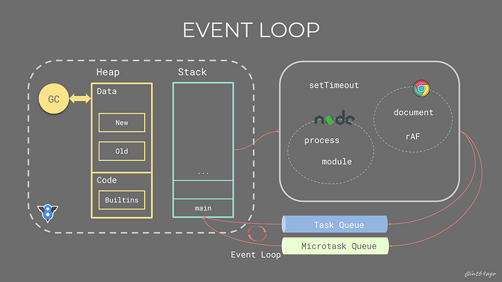
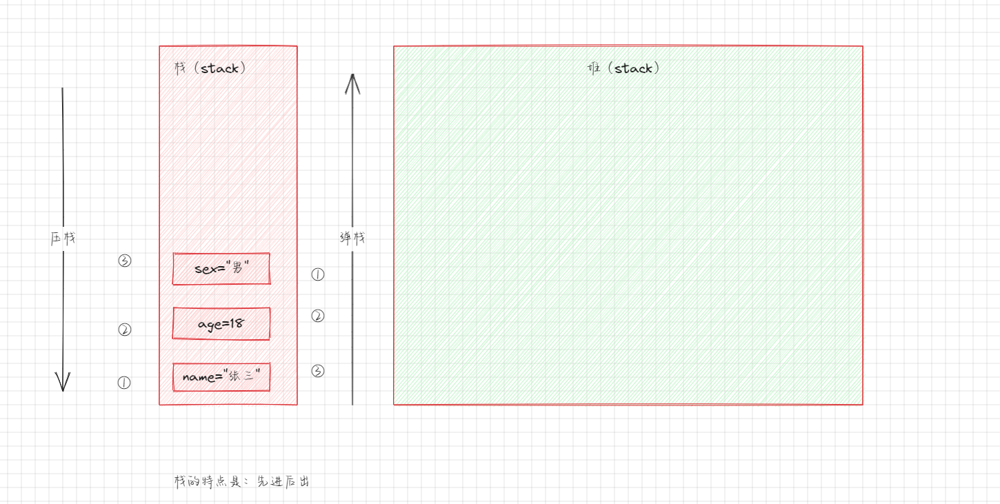
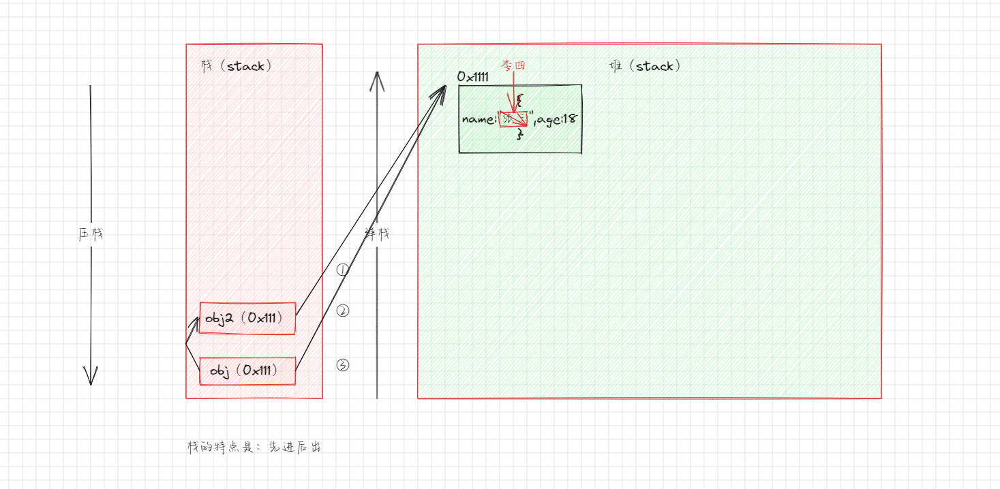
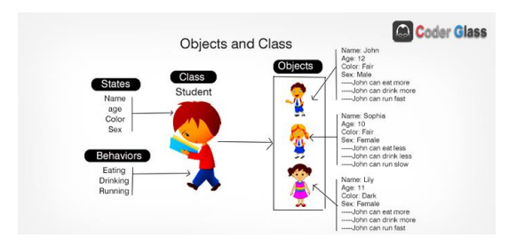
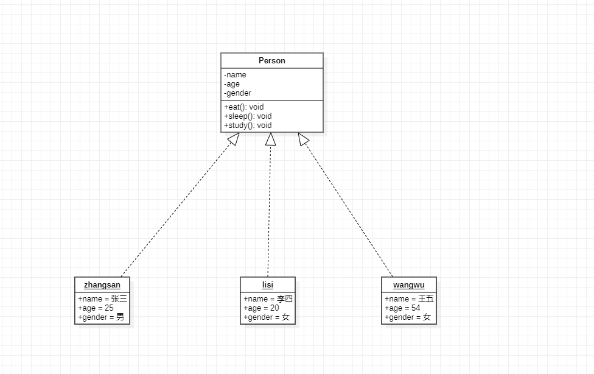

# 第一章：对象类型的使用（⭐）

## 1.1 认识对象类型

* 在学习数据类型的时候，我们提到了一种特殊的类型：`对象类型`（引用数据类型的一种）。


> 注意：
>
> * 对象类型涉及到 JavaScript 的各个方面，所以`掌握对象类型非常重要`。
> * 对象类型是一种`存储键值对（key-value）`的`引用数据类型`。

* 为什么需要对象类型？
  * 基本数据类型虽然可以存储一些简单的值；但是，现实世界中的事物抽象成程序，往往比较复杂。
  * 如：一个人，有自己的`属性（特性）`（如：姓名、年龄、身高）和自己的`方法（行为，动作）`（如：跑步、学习、睡觉）。
  * 如：一辆车，有自己的`属性（特性）`（如：颜色、重量、速度）和自己的`方法（行为，动作）`（如：行驶）

* 此时，我们就需要一种`新`的`数据类型`来将这些`属性（特性）`和`方法（行为）`组织到一起，这种数据类型就是`对象类型`。
  * 对象类型使用 `{...}` 来表示，里面包含的都是 `key-value（键值对）`。
  * `key-value（键值对）`对应的就是`属性和方法`（在对象中`函数`被称为`方法`）。
  * 其中，`key 是字符串`（ES6 之后也可以是 `Symbol` 类型，后续讲解）。
  * 其中，`value 可以是任意类型`，包括：基本数据类型和引用数据类型（函数类型、对象类型、数组类型等。）

```js
// 描述一个人，定义对象
var person = {
  name: "许大仙", // 属性
  age: 18, // 属性
  eating: function () { // 行为（方法）
    console.log("正在吃饭^_^")
  }
}

// 使用（调用）对象中的属性和行为
console.log(person.name)
console.log(person.age)
person.eating()
```

```js
// 描述一辆车，定义对象
var car = {
  color: "红色", // 属性
  driver: function () { // 行为（方法）
    console.log("正在驾驶")
  }
}

// 使用（调用）对象中的属性和行为
console.log(car.color)
car.driver()
```

## 1.2 对象的创建和使用

* 对象的创建方式有很多，包括三种：
  * ① `对象字面量`的形式：通过 `{}` 。
  * ② `new Object + 动态添加属性和方法`。
  * ③ `new 类(name,age,...)`。

> 注意：
>
> * 通常而言，我们在开发中主要使用`对象字面量`的方式（目前，主要掌握）；但是，其它的方式也会使用到。
> * 在`对象字面量`的方式中，`属性`之间使用 `,` 隔开。

* 对象的使用包括：
  * ① `访问`对象的属性（方法）。
  * ② `修改`对象的属性（方法）。
  * ③ `添加`对象的属性（方法）。
  * ④ `删除`对象的属性（方法）。

> 注意：通常而言，`不建议在代码中删除对象的属性和方法`，并且在 JavaScript 中的`严格模式`下也是禁止的。


* 示例：

```html
<!DOCTYPE html>
<html lang="en">
<head>
  <meta charset="UTF-8">
  <meta content="IE=edge" http-equiv="X-UA-Compatible">
  <meta content="width=device-width, initial-scale=1.0" name="viewport">
  <title>Title</title>
</head>
<body>
  <script>
    // 通过字面量的形式创建对象
    var person = {
      name: "许大仙",
      age: 18
    }
    // 访问对象的属性
    console.log(`name: ${person.name}`) // name: 许大仙
    console.log(`age: ${person.age}`) // age: 18
    // 修改对象的属性
    person.name = "许仙"
    person.age = 20
    console.log(`name: ${person.name}`) // name: 许仙
    console.log(`age: ${person.age}`) // age: 20
    // 添加对象的属性
    person.sex = "男"
    person.address = "杭州"
    console.log(`name: ${person.name}`) // name: 许仙
    console.log(`age: ${person.age}`) // age: 20
    console.log(`sex: ${person.sex}`) // sex: 男
    console.log(`address: ${person.address}`) // address: 杭州
    // 删除对象的属性
    delete person.address
    console.log(`name: ${person.name}`) // name: 许仙
    console.log(`age: ${person.age}`) // age: 20
    console.log(`sex: ${person.sex}`) // sex: 男
    console.log(`address: ${person.address}`) // address: undefined
  </script>
</body>
</html>
```

## 1.3 对象中的引号("") 和方括号([])的使用

* 在 JavaScript 中我们使用 `.` 来访问变量的属性，其实是有要求的：
  * ① 对象中的 key `不能包含空格`。
  * ② 对象中的 key `不能以数字开头`。
  * ③ 对象中的 key `不能包含特殊字符（允许使用 $ 和 _）`。
* 此时，我们就可以使用  `引号("")` 和 `方括号([])`了。


* 示例：

```html
<!DOCTYPE html>
<html lang="en">
<head>
  <meta charset="UTF-8">
  <meta content="IE=edge" http-equiv="X-UA-Compatible">
  <meta content="width=device-width, initial-scale=1.0" name="viewport">
  <title>Title</title>
</head>
<body>
  <script>
    /*
      使用引号("")定义 key：
      在这种情况下，key 必须是一个字符串，并且可以使用任何有效的字符串作为 key，包括特殊字符和空格。
    */
    var obj = {
      name: "许大仙",
      "age": 18,
      "good friend": "白素贞",
    }

    console.log(obj.name)
    console.log(obj["age"])
    console.log(obj["good friend"])
  </script>
</body>
</html>
```


* 示例：

```html
<!DOCTYPE html>
<html lang="en">
<head>
  <meta charset="UTF-8">
  <meta content="IE=edge" http-equiv="X-UA-Compatible">
  <meta content="width=device-width, initial-scale=1.0" name="viewport">
  <title>Title</title>
</head>
<body>
  <script>
    /*
     使用方括号([])定义 key：
     在这种情况下，key 可以是一个变量或表达式的结果。方括号内的内容将被计算并作为 key 使用。
     如果 key 是一个变量，它的值将被用作 key。如果 key 是一个表达式，它将被求值并用作 key。
    */
    var message = "Hello World"
    var obj = {
      name: "许大仙",
      "age": 18,
      "good friend": "白素贞",
      [message]: "你好，世界"
    }

    console.log(obj.name)
    console.log(obj["age"])
    console.log(obj["good friend"])
    console.log(obj[message])
  </script>
</body>
</html>
```


* 示例：

```html
<!DOCTYPE html>
<html lang="en">
<head>
  <meta charset="UTF-8">
  <meta content="IE=edge" http-equiv="X-UA-Compatible">
  <meta content="width=device-width, initial-scale=1.0" name="viewport">
  <title>Title</title>
</head>
<body>
  <script>
    /*
    无论是使用引号("")还是方括号([])定义 key，都可以通过点号(.)或方括号([])来访问对象的属性
    */
    var message = "Hello World"
    var obj = {
      name: "许大仙",
      "age": 18,
      "good friend": "白素贞",
      [message]: "你好，世界"
    }

    console.log(obj.name)
    console.log(obj["age"])
    console.log(obj.age)
    console.log(obj["good friend"])
    console.log(obj[message])
  </script>
</body>
</html>
```

## 1.4 对象的遍历

* 对象的遍历（迭代）：表示获取对象中的所有属性和方法。
* 方法：返回一个给定对象的自身可枚举`key`组成的数组

```js
Object.keys(obj:{}): string[]
```

* 方法：返回一个给定对象的自身可枚举`value`组成的数组

```js
Object.values<T>(o: { [s: string]: T } | ArrayLike<T>): T[];
```


* 示例：普通 for 循环遍历对象

```html
<!DOCTYPE html>
<html lang="en">
<head>
  <meta charset="UTF-8">
  <meta content="IE=edge" http-equiv="X-UA-Compatible">
  <meta content="width=device-width, initial-scale=1.0" name="viewport">
  <title>Title</title>
</head>
<body>
  <script>
    var obj = {
      name: "许大仙",
      age: 18,
      sex: "男",
      running: function () {
        console.log(this.name + "正在跑");
      }
    }
    // 普通 for 循环遍历对象的属性和方法
    var keysArr = Object.keys(obj)
    for (var i = 0; i < keysArr.length; i++) {
      var key = keysArr[i]
      var value = obj[key]
      console.log(`key：${key} ，${value}`)
    }

  </script>
</body>
</html>
```


* 示例：for...in 遍历对象

```html
<!DOCTYPE html>
<html lang="en">
<head>
  <meta charset="UTF-8">
  <meta content="IE=edge" http-equiv="X-UA-Compatible">
  <meta content="width=device-width, initial-scale=1.0" name="viewport">
  <title>Title</title>
</head>
<body>
  <script>
    var obj = {
      name: "许大仙",
      age: 18,
      sex: "男",
      running: function () {
        console.log(this.name + "正在跑");
      }
    }

    // for...in 遍历对象
    for (var key in obj) {
      var value = obj[key]
      console.log(`key：${key} ，${value}`)
    }

  </script>
</body>
</html>
```


# 第二章：值类型和引用类型（⭐）

## 2.1 概述

* 我们知道，程序需要加载到内存中才会执行。其实，我们可以将内存划分为`两个`区域（其实，不止两个）：	
  * `栈内存`：`基本数据类型`占据的空间是在`栈内存`中分配的。
  * `堆内存`：`引用数据类型`占据的空间是在`堆内存`中进行分配的。



> 注意：图中还有其他的知识，目前我们只需要学习`栈`和`堆`即可。

## 2.2 值类型和引用类型

* 基本数据类型的保存方式：在`变量`中保存的是`值本身`。所以，`基本数据类型`也被称为`值`类型。

```js
var name = "张三"
var age = 18
var sex = "男"
```

* 其内存图如下：



* 而，引用数据类型（包括对象类型）在`变量`中保存的是对象的`引用`。

```js
var obj = {
    name: "张三",
    age: 18
}

var obj2 = obj
obj2.name = "李四"
```

* 其内存图如下：




* 示例：

```html
<!DOCTYPE html>
<html lang="en">
<head>
  <meta charset="UTF-8">
  <meta content="IE=edge" http-equiv="X-UA-Compatible">
  <meta content="width=device-width, initial-scale=1.0" name="viewport">
  <title>Title</title>
</head>
<body>
  <script>
    var num1 = 123
    var num2 = 123
	
    // 因为 num1 和 num2 都是值类型，而值类型是可以直接比较大小的
    console.log(num1 === num2) // true

  </script>
</body>
</html>
```


* 示例：

```html
<!DOCTYPE html>
<html lang="en">
<head>
  <meta charset="UTF-8">
  <meta content="IE=edge" http-equiv="X-UA-Compatible">
  <meta content="width=device-width, initial-scale=1.0" name="viewport">
  <title>Title</title>
</head>
<body>
  <script>
    // 现象二
    var obj1 = {}
    var obj2 = {}
	
    // 因为 obj1 和 obj2 都是对象，而且是两个不同的对象，所以比较的结果当然是 false
    console.log(obj1 === obj2) // false
  </script>
</body>
</html>
```


* 示例：

```html
<!DOCTYPE html>
<html lang="en">
<head>
  <meta charset="UTF-8">
  <meta content="IE=edge" http-equiv="X-UA-Compatible">
  <meta content="width=device-width, initial-scale=1.0" name="viewport">
  <title>Title</title>
</head>
<body>
  <script>
    // 现象三
    var info = {
      name: '张三',
      age: 18,
      friend: {
        name: '李四',
        age: 19
      }
    }
	
    // 因为 friend 其实和 info.friend 指向的同一块堆中的内存地址，所以修改 friend.name 的时候，也会修改 info.friend.name 的值
    var friend = info.friend
    friend.name = '王五'
	
    console.log(info.friend.name) // 王五
  </script>
</body>
</html>
```


* 示例：

```html
<!DOCTYPE html>
<html lang="en">
<head>
  <meta charset="UTF-8">
  <meta content="IE=edge" http-equiv="X-UA-Compatible">
  <meta content="width=device-width, initial-scale=1.0" name="viewport">
  <title>Title</title>
</head>
<body>
  <script>
    // 现象四
    function foo(a) {
      // 这边是重点，因为 a 指向了一个新的对象  
      a = {
        name: 'obj'
      }
    }

    var info = {
      name: '张三',
      age: 18,
      friend: {
        name: '李四',
        age: 19
      }
    }

    foo(info)
    console.log(info.name) // 张三
  </script>
</body>
</html>
```


# 第三章：函数的 this 指向（⭐）

## 3.1 概述

* 在常见的编程语言中，几乎都会有 this 关键字，但是 JavaScript 中的 this 和其它常见的面向对象编程语言中的 this 不同：
  * 常见的面向对象编程语言中，如：Java 等，`this 通常只会出现在类的方法`中。
  * 而 JavaScript 不一样，JavaScript 中的 this 可以`直接`出现在对象的`方法`中；所以，在 JavaScript 中的 `this` 和`它出现的位置`以及`它代表的含义`有关。

* 目前而言，有`两个` this 的判断方法：
  * ① 在 `全局环境` 中，this 指向 `window`。
  * ② 在`对象调用`中，this 指向`调用的对象`；但是，不一定。

> 其实，this 的用法太灵活了，不仅仅指上面的用法，后续讲解。

## 3.2 应用示例

* 示例：

```html
<!DOCTYPE html>
<html lang="en">
<head>
  <meta charset="UTF-8">
  <meta content="IE=edge" http-equiv="X-UA-Compatible">
  <meta content="width=device-width, initial-scale=1.0" name="viewport">
  <title>Title</title>
</head>
<body>
  <script>
    function foo() {
      console.log(this) // window
    }

    foo()
  </script>
</body>
</html>
```


* 示例：

```html
<!DOCTYPE html>
<html lang="en">
<head>
  <meta charset="UTF-8">
  <meta content="IE=edge" http-equiv="X-UA-Compatible">
  <meta content="width=device-width, initial-scale=1.0" name="viewport">
  <title>Title</title>
</head>
<body>
  <script>
    var obj = {
      name: "张三",
      bar: function () {
        console.log(this) //obj
      }
    }

    obj.bar()
  </script>
</body>
</html>
```


* 示例：

```html
<!DOCTYPE html>
<html lang="en">
<head>
  <meta charset="UTF-8">
  <meta content="IE=edge" http-equiv="X-UA-Compatible">
  <meta content="width=device-width, initial-scale=1.0" name="viewport">
  <title>Title</title>
</head>
<body>

  <button>1</button>
  <button>2</button>
  <button>3</button>

  <script>
    // this 的应用场景
    var btnEls = document.querySelectorAll('button')
    for (var i = 0; i < btnEls.length; i++) {
      var btn = btnEls[i]
      btn.onclick = function () {
        console.log(`第${this.textContent}个按钮被点击了`)
      }
    }
  </script>
</body>
</html>
```


* 示例：

```html
<!DOCTYPE html>
<html lang="en">
<head>
  <meta charset="UTF-8">
  <meta content="IE=edge" http-equiv="X-UA-Compatible">
  <meta content="width=device-width, initial-scale=1.0" name="viewport">
  <title>Title</title>
</head>
<body>

  <script>
    // this 的应用场景
    var obj = {
      name: '许大仙',
      running: function () {
        console.log(this.name + '正在跑')
      },
      sleep: function () {
        console.log(this.name + '睡觉了')
      }
    }

    obj.running()
    obj.sleep()
  </script>
</body>
</html>
```


# 第四章：类和对象（⭐）

## 4.1 概述

* 在实际开发中，我们可能会遇到这样的问题：`需要创建一系列相似的对象`，如：
  * ① 游戏中创建一系列的`英雄`（英雄都有名字、技能、属性等，并且也有打怪等行为）。
  * ② 学生管理系统中需要创建一系列的`学生`（学生都有姓名、年龄、身高、体重等，并且也有学习等行为）。
* 一种简单的方法来帮助我们创建一系列的对象（通过字面量的方式挨个写，即硬编码），如下：

```html
<!DOCTYPE html>
<html lang="en">
<head>
  <meta charset="UTF-8">
  <meta content="IE=edge" http-equiv="X-UA-Compatible">
  <meta content="width=device-width, initial-scale=1.0" name="viewport">
  <title>Title</title>
</head>
<body>
  <script>
    var p1 = {
      name: '张三',
      age: 18,
      eating: function () {
        console.log(`${this.name}在吃饭~`)
      }
    }
    var p2 = {
      name: '李四',
      age: 19,
      eating: function () {
        console.log(`${this.name}在吃饭~`)
      }
    }
    var p3 = {
      name: '王五',
      age: 20,
      eating: function () {
        console.log(`${this.name}在吃饭~`)
      }
    }
  </script>
</body>
</html>
```

> 缺点：这种方式貌似可以实现我们的需求，但是未免也太麻烦了吧！难道我创建 10000 万个学生，需要这么写 10000 万遍`😂`，这也太费程序员了吧。

* 如果我使用 for 循环来实现这个需求？

```html
<!DOCTYPE html>
<html lang="en">
<head>
  <meta charset="UTF-8">
  <meta content="IE=edge" http-equiv="X-UA-Compatible">
  <meta content="width=device-width, initial-scale=1.0" name="viewport">
  <title>Title</title>
</head>
<body>
  <script>
    // 使用 for 循环来创建一系列对象
    for (let i = 0; i < 3; i++) {
      var stu = {
        name: '张三',
        age: 18,
        eating: function () {
          console.log(`${this.name}在吃饭~`)
        }
      }
    }

  </script>
</body>
</html>
```

> 缺点：这种方式貌似可以实现我们的需求，但是我需要的是学生的属性（姓名、年龄）等可能不一样。

* 如果使用函数（工厂函数）来实现这个需求？

```html
<!DOCTYPE html>
<html lang="en">
<head>
  <meta charset="UTF-8">
  <meta content="IE=edge" http-equiv="X-UA-Compatible">
  <meta content="width=device-width, initial-scale=1.0" name="viewport">
  <title>Title</title>
</head>
<body>
  <script>

    /** 通过工厂函数来创建对象
     * @param {string} name 姓名
     * @param {number} age 年龄
     */
    function createStudent(name, age) {
      var stu = {}
      stu.name = name
      stu.age = age
      stu.eating = function () {
        console.log(this.name + "正在吃饭...")
      }
      return stu
    }

    var stu1 = createStudent("张三", 23)
    console.log(stu1)
    var stu2 = createStudent("李四", 20)
    console.log(stu2)
    var stu3 = createStudent("王五", 19)
    console.log(stu3)
  </script>
</body>
</html>
```

> * 优点：实现了需求。
> * 缺点：返回的都是 Object 类型的对象，而不是 Student 类型的对象。

## 4.2 构造函数和类

### 4.2.1 概述

* 什么是构造函数？
  * `构造函数`也称为`构造器（constructor）`，通常是我们`在创建对象的时候会调用的函数`。
  * 在其它的面向对象编程语言中（如：Java），`构造函数是存在于类中的一个方法，称之为构造方法`。
  * 但是，在 JavaScript 中，`构造函数还扮演了其它面向对象编程语言中类的角色`（ES5）。

* 换言之，在 JavaScript 中，`构造函数就是类的扮演者`。
  * 在 `ES5` 之前，我们可以`通过 function 来声明一个构造函数（类）`，然后`通过 new 关键字来对其进行调用`。
  * 在 `ES6` 之后，我们可以像其他编程语言一样，`通过 class 来声明一个类`，然后`通过 new 关键字来对其进行调用`。

### 4.2.2 类和对象的关系

* 什么是类（构造函数）？
  * 现实生活中往往根据`一份描述（一个模板）`来创建一个`实体对象`，如：根据`图纸（模板）`造`汽车、手机（对象）`等。
  * 在编程语言中，也必须先有`一份描述`，在这份描述中说明将来创建出来的对象`有哪些属性（成员变量）和行为（成员方法）`。
* 在现实生活中，我们会这样描述一些事物：
  * `水果`是一`类`事物的`统称`，而`苹果`、`橘子`、`葡萄`等都是`水果`，是具体的`对象`。 
  * `人`是一`类`事物的`统称`，而`孙权`、`刘备`、`诸葛亮`等都是`人`，是具体的`对象`。



* 通常，我们会使用 `UML` 来描述`类和对象`、`类和类`等之间的关系：



### 4.2.3 JavaScript 中的类（ES5）

* 如果一个`普通的函数`被 `new`  操作符`调用`了，那么该函数就可以称为`构造函数（类）`。
* 如果一个函数被 `new` 操作符调用，那么它会执行如下的步骤：
  * ① 在内存中创建一个新的对象（空对象）。
  * ② 这个对象内部的 `[[prototype]]` 属性会被赋值为该构造函数的 `prototype` 属性（后面讲解）。
  * ③ 构造函数内部的 this，会指向创建出来的新对象。
  * ④ 执行函数体内部的代码。
  * ⑤ 如果构造函数没有返回非空对象，则返回创建出来的对象。

> 注意：
>
> * 实际开发中，为了区分构造函数和普通函数，通常构造函数的名称（类名）使用大驼峰，如：`StudentInfo` 等。
>
> * 构造函数还有其他的特性，后面讲解
>
>   * 如：原型、原型链、实现继承的方案。
>
>   * 如：ES6 中的类、继承的实现。


* 示例：

```html
<!DOCTYPE html>
<html lang="en">
<head>
  <meta charset="UTF-8">
  <meta content="IE=edge" http-equiv="X-UA-Compatible">
  <meta content="width=device-width, initial-scale=1.0" name="viewport">
  <title>Title</title>
</head>
<body>
  <script>

    /** 通过构造函数来创建对象
     * 函数中的 this 一般指向某个对象，当我们通过 new 关键字调用之后，（JS 将帮助我们创建新的空对象，将属性和方法设置到新的对象上，然后返回该对象）。
     * @param {string} name 姓名
     * @param {number} age 年龄
     */
    function Student(name, age) {
      this.name = name
      this.age = age
      this.eating = function () {
        console.log(this.name + "正在吃饭...")
      }
    }

    var stu1 = new Student("张三", 23)
    console.log(stu1)
    var stu2 = new Student("李四", 20)
    console.log(stu2)
    var stu3 = new Student("王五", 19)
    console.log(stu3)
  </script>
</body>
</html>
```

### 4.2.4 构造函数的其它知识

* 平时，我们创建普通的对象，通常使用字面量的形式：

```js
const obj = {
    name: "许大仙",
    age: 18,
    running: function(){
        console.log(`${this.name}在跑~`)
    }
}
```

* 其实，字面量的方式是一种简写方式，相当于以下的代码：

```js
const obj = new Object()
obj.name = "许大仙"
obj.age = 18
obj.running = function(){
    console.log(`${this.name}在跑~`)
}
```

* 当然，现在我们也有通过构造函数（类）来创建对象的方式：

```js
function Student(name,age){
    this.name = name
    this.age = age
    this.running = function(){
        console.log(`${this.name}在跑~`)
    }
}
const stu = new Student("许大仙",18)
```

## 4.3 全局对象 window

* window 对象是 JavaScript 的全局对象（浏览器中），它表示浏览器的窗口或框架。window 对象是 BOM（浏览器对象模型）的一部分，提供了访问和操作浏览器窗口的属性和方法。
* window 对象有如下的作用：
  * ① 提供全局作用域：所有在`全局作用域`中声明的`变量`和`函数`都是 window 对象的`属性`和`方法`，可以在任何地方访问和使用它们。
  * ② 控制浏览器窗口：window 对象提供了一系列方法，如 open()、close()、resizeTo() 等，用于控制和操作浏览器窗口的大小、位置、状态等（已经很少使用了）。
  * ③ 操作浏览器历史记录：window 对象的 history 对象可以用来访问和操作浏览器的历史记录，比如：前进、后退、跳转到指定页面等。
  * ④ 提供定时器功能：window 对象的 setTimeout() 和 setInterval() 方法可以用来设置定时器，执行一段代码或函数的延时或重复执行。
  * ⑤ 处理用户输入和交互：window 对象提供了一些事件，如：click、keydown、resize 等，可以用来处理用户的输入和交互操作。
  * ⑥ 加载和操作文档：window 对象的 document 对象表示当前窗口中加载的文档，可以用来获取和修改文档的内容、结构和样式。
  * ⑦ 进行页面间通信：window 对象提供了一些方法，如 postMessage()，可以在不同的窗口或框架之间进行通信和数据传递（已经很少使用了）。
  * ⑧ ~~使用 var 定义的变量将添加到 window 对象上~~（在严格模式下，不成立；并且后期我们也不会使用 var 定义变量）。
* 总之，window 对象是 JavaScript 中的全局对象，提供了访问和操作浏览器窗口的方法和属性，可以用于控制浏览器窗口、操作历史记录、处理用户输入和交互、加载和操作文档等。


* 示例：

```html
<!DOCTYPE html>
<html lang="en">
<head>
  <meta charset="UTF-8">
  <meta content="IE=edge" http-equiv="X-UA-Compatible">
  <meta content="width=device-width, initial-scale=1.0" name="viewport">
  <title>Title</title>
</head>
<body>
  <script>
      // 查找变量的时候，最终都会找到 window 身上
      console.log(window)
  </script>
</body>
</html>
```


* 示例：

```html
<!DOCTYPE html>
<html lang="en">
<head>
  <meta charset="UTF-8">
  <meta content="IE=edge" http-equiv="X-UA-Compatible">
  <meta content="width=device-width, initial-scale=1.0" name="viewport">
  <title>Title</title>
</head>
<body>
  <script>
    // 将一些浏览器全局提供给我们的变量、函数、对象等放到 window 身上

    // 下面两种写法是等价的
    console.log("abc")
    window.console.log("abc")

    // 下面两种写法是等价的
    alert("abc")
    window.alert("abc")

    console.log(Object === window.Object) // true
  </script>
</body>
</html>
```

## 4.4 函数也是对象

* 回顾以下，JavaScript 的数据类型：


> 从上图中，我们可以看到函数是引用数据类型，本质上是一种特殊的对象。

* 在 JavaScript 中，我们可以通过 `instanceof` 判断一个对象是否是父类的引用。

```html
<!DOCTYPE html>
<html lang="en">
<head>
  <meta charset="UTF-8">
  <meta content="IE=edge" http-equiv="X-UA-Compatible">
  <meta content="width=device-width, initial-scale=1.0" name="viewport">
  <title>Title</title>
</head>
<body>
  <script>
    var obj = {
      name: '许大仙',
      age: 18
    }

    console.log(obj instanceof Object) // true
  </script>
</body>
</html>
```

* 其实，我们也可以通过 instanceof 来判断函数是否是一个 Object 的实例（Object 是所有类的顶级父类）：

```html
<!DOCTYPE html>
<html lang="en">
<head>
  <meta charset="UTF-8">
  <meta content="IE=edge" http-equiv="X-UA-Compatible">
  <meta content="width=device-width, initial-scale=1.0" name="viewport">
  <title>Title</title>
</head>
<body>
  <script>
    // 函数声明
    function foo() {
      console.log('foo被执行了')
    }

    // 函数表达式
    var bar = function () {
      console.log('bar被执行了')
    }

    console.log(typeof foo) // function
    console.log(typeof bar) // function
    console.log(foo instanceof Object) // true
    console.log(bar instanceof Object) // true
  </script>
</body>
</html>
```

> 这样，就可以解释在 JavaScript 中函数为什么是头等公民了，函数为什么可以写到任意位置了，本质上就是`引用地址`的`来回传递`而已。

* 其实，函数的声明以及函数的表达式都是函数字面量的形式，在 JavaScript 中提供了 Function 的构造函数，使用如下：

```html
<!DOCTYPE html>
<html lang="en">
<head>
  <meta charset="UTF-8">
  <meta content="IE=edge" http-equiv="X-UA-Compatible">
  <meta content="width=device-width, initial-scale=1.0" name="viewport">
  <title>Title</title>
</head>
<body>
  <script>
    /*
      以下的三种方式都是定义函数的方式，某种意义上都是等价的。
      在开发中，我们使用的函数声明和函数表达式的方式都是 new Function 的简写方式而已
     */
    function add1(a, b) {
      return a + b
    }

    var add2 = function (a, b) {
      return a + b
    }

    var add3 = new Function('a', 'b', 'return a + b')
  </script>
</body>
</html>
```

* 我们知道，对象是可以添加属性和方法的：

```html
<!DOCTYPE html>
<html lang="en">
<head>
  <meta charset="UTF-8">
  <meta content="IE=edge" http-equiv="X-UA-Compatible">
  <meta content="width=device-width, initial-scale=1.0" name="viewport">
  <title>Title</title>
</head>
<body>
  <script>
    var obj = {}
    // 添加属性
    obj.name = "许大仙"
    obj.age = 18
    // 添加方法
    obj.running = function () {
      console.log(`${this.name}正在跑步~`)
    }

    console.log(obj.name)
    console.log(obj.age)
    obj.running()
  </script>
</body>
</html>
```

* 既然，函数也是对象，那么函数也是可以添加`属性`和`方法`的，我们一般称为`静态属性（类属性）`和`静态方法（类方法）`：

```html
<!DOCTYPE html>
<html lang="en">
<head>
  <meta charset="UTF-8">
  <meta content="IE=edge" http-equiv="X-UA-Compatible">
  <meta content="width=device-width, initial-scale=1.0" name="viewport">
  <title>Title</title>
</head>
<body>
  <script>
    function Student(name, age) {
      this.name = name
      this.age = age
      this.eating = function () {
        console.log(`${this.name}正在吃饭~`)
      }
    }

    // 函数是对象，也是可以添加属性和方法；并且，在面向对象编程中，通过函数名添加的属性和方法，称之为静态属性和静态方法
    Student.country = "中国"
    Student.study = function () {
      console.log("学生学习")
    }

    // 调用静态属性和静态方法
    console.log(Student.country)
    Student.study()

    // 实例化对象
    var stu = new Student("许大仙", 18)
    // 对象调用属性和方法
    console.log(stu.name)
    console.log(stu.age)
    stu.eating()

  </script>
</body>
</html>
```

