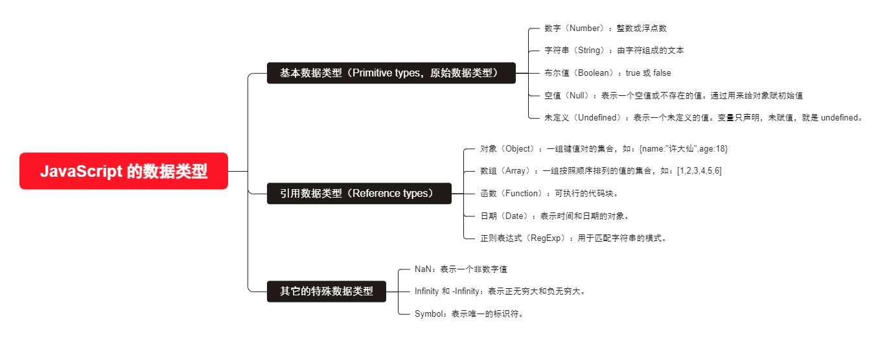

# 第一章：自动装箱和拆箱（⭐）

## 1.1 概述

* 回顾一下 JavaScript 中的数据类型：



* 我们知道，像`数字（Number）`、`字符串（String）`等是属于基本数据类型的；按照理论来说，是没有办法`获取属性`和`调用方法`的。
* 但是，我们在开发中，却会经常这么操作：

```html
<!DOCTYPE html>
<html lang="en">
<head>
  <meta charset="UTF-8">
  <meta content="IE=edge" http-equiv="X-UA-Compatible">
  <meta content="width=device-width, initial-scale=1.0" name="viewport">
  <title>Title</title>
</head>
<body>
  <script>
    var message = "许大仙 是个好人"
    var num = 3.1415926

    // 基本数据类型却可以调用对象的属性和方法？
    
    console.log(message.length) // 8
    console.log(num.toString()) // 3.1415926

    console.log(message.split(" ")) // ['许大仙', '是个好人']
    console.log(num.toFixed(2)); // 3.14
  </script>
</body>
</html>
```

* 那么，会什么会产生这样的奇怪现象？
  * 因为 JavaScript 为了可以让`基本数据类型`的`变量`可以`获取属性`和`调用方法`，自动将其转换为对应的包装类型（包装类型就是引用数据类型，自动装箱）。
  * 在 JavaScript 中，常见的包装类型有：`String`、`Number`、`Boolean`、`Symbol`、`BigInt` 。

> 注意：其实，Java 中也有`自动装箱`和`自动拆箱`的概念。

## 1.2 自动装箱（Auto Boxing）

* 自动装箱指的是在需要使用对象的地方，JavaScript 会自动将基本数据类型转换为对应的包装对象。这样，我们就可以在基本数据类型上调用对象的方法。在自动装箱过程中，JavaScript 会创建临时的包装对象来包裹基本数据类型值。


* 示例：

```html
<!DOCTYPE html>
<html lang="en">
<head>
  <meta charset="UTF-8">
  <meta content="IE=edge" http-equiv="X-UA-Compatible">
  <meta content="width=device-width, initial-scale=1.0" name="viewport">
  <title>Title</title>
</head>
<body>

  <script>
    let num = 42 // 定义一个基本数据类型
    // 在基本数据类型上调用 toString() 方法的时候，会自动进行装箱（将基本数据类型转换为对应的包装对象）
    let strNum = num.toString() // 相当于 new Number(num).toString()
      
    console.log("num", num, typeof num)
    console.log("strNum", strNum, typeof strNum)
  </script>

</body>
</html>
```

## 1.3 自动拆箱（Auto Unboxing）

* 自动拆箱指的是在需要基本数据类型的值的地方，JavaScript 会自动将包装对象转换为对应的基本数据类型。这样，我们就可以直接使用包装对象中的值，而不需要显式调用方法或属性来获取基本数据类型值。


* 示例：

```html
<!DOCTYPE html>
<html lang="en">
<head>
  <meta charset="UTF-8">
  <meta content="IE=edge" http-equiv="X-UA-Compatible">
  <meta content="width=device-width, initial-scale=1.0" name="viewport">
  <title>Title</title>
</head>
<body>

  <script>
    let numObj = new Number(42);

    // 在需要基本数据类型值的地方，会自动进行拆箱（将包装对象转换为对应的基本数据类型）
    let numValue = numObj + 10; // 相当于 numObj.valueOf() + 10

    console.log(typeof numObj); // "object"
    console.log(typeof numValue); // "number"
  </script>

</body>
</html>
```

## 1.4 总结

* 自动装箱和拆箱的机制使得 JavaScript 中的基本数据类型和对象之间可以相互转换，使得代码编写更加灵活和便捷。
* 但是，由于装箱和拆箱过程涉及临时对象的创建和销毁，也需要在性能敏感的场景中注意避免不必要的装箱和拆箱操作。


# 第二章：数字类型 Number

## 2.1 概述

* Number 的类属性（静态属性）：
  * `Number.MAX_SAFE_INTEGER`：JavaScript 中最大的安全整数 `(2^53 - 1)`。
  * `Number.MIN_SAFE_INTEGER`：JavaScript 中最小的安全整数 `-(2^53 - 1)`。
  * `Number.MAX_VALUE`：可以在 JavaScript 中表示的最大数字 `1.79E+308`。
  * `Number.MIN_VALUE`：可以在 JavaScript 中表示的最小数字 `5.00E-324`。

* Number 实例的方法：
  * `toString(base)`：将数字转换为字符串，并且按照 base（2-36，默认为 10） 进制进行转换。
  * `toFixed(digits)`（⭐）：格式化一个数字，保留 digits 个小数。

## 2.2 应用示例

* 示例：

```html
<!DOCTYPE html>
<html lang="en">
<head>
  <meta charset="UTF-8">
  <meta content="IE=edge" http-equiv="X-UA-Compatible">
  <meta content="width=device-width, initial-scale=1.0" name="viewport">
  <title>Title</title>
</head>
<body>
  <script>
    var max = Number.MAX_VALUE
    console.log(max) // 1.79E+308
    var min = Number.MIN_VALUE
    console.log(min) // 5.00E-324
    var maxSafe = Number.MAX_SAFE_INTEGER
    console.log(maxSafe) // 2^53 − 1
    var minSafe = Number.MIN_SAFE_INTEGER
    console.log(minSafe) // −(2^53 − 1)
  </script>
</body>
</html>
```


* 示例：

```html
<!DOCTYPE html>
<html lang="en">
<head>
  <meta charset="UTF-8">
  <meta content="IE=edge" http-equiv="X-UA-Compatible">
  <meta content="width=device-width, initial-scale=1.0" name="viewport">
  <title>Title</title>
</head>
<body>
  <script>
    var num = 2
    console.log(num) // 2
    console.log(num.toString(2)) // 10
    var PI = Math.PI
    console.log(PI) // 3.141592653589793
    console.log(PI.toFixed(2)) // 3.14
  </script>
</body>
</html>
```


# 第三章：数学对象 Math

## 3.1 概述

* 在 JavaScript 中，Math 是一个`内置对象`（不是一个构造函数），它有一些`数学常数属性`和`数学函数方法`。
* Math 对象的常见属性：
  * `Math.PI`：圆周率，约等于 3.141592653589793 。
* Math 对象的常见方法：
  * `Math.floor(num)`：向下取整。
  * `Math.ceil(num)`：向上取整。
  * `Math.round(num)`：四舍五入。
  * `Math.random()`：生成 `[0,1)` 的随机数。
  * `Math.pow(x,n)`：返回 x 的 n 次幂。
  * `Math.max(x1,x2,...)`（⭐）：求一组数的最大值。
  * `Math.min(x1,x2,...)`（⭐）：求一组数的最小值。
  * ……
* 获取任意两个数字的随机整数（不包括最大值，包含最小值）的公式：

```js
function getRandomInt(min, max) {
  min = Math.ceil(min);
  max = Math.floor(max);
  return Math.floor(Math.random() * (max - min)) + min; // 不含最大值，含最小值
}
```

* 获取任意两个数字的随机整数（包括最大值，包含最小值）的公式：

```js
function getRandomIntInclusive(min, max) {
  min = Math.ceil(min);
  max = Math.floor(max);
  return Math.floor(Math.random() * (max - min + 1)) + min; // 含最大值，含最小值
}
```

## 3.2 应用示例

* 示例：

```html
<!DOCTYPE html>
<html lang="en">
<head>
  <meta charset="UTF-8">
  <meta content="IE=edge" http-equiv="X-UA-Compatible">
  <meta content="width=device-width, initial-scale=1.0" name="viewport">
  <title>Title</title>
</head>
<body>
  <script>
    console.log(Math.PI) // 3.141592653589793

    var num1 = 3.1
    console.log(num1) // 3.1
    console.log(`向上取整：${Math.ceil(num1)}`) // 向上取整：4
    console.log(`向下取整：${Math.floor(num1)}`) // 向下取整：3
    console.log(`四舍五入：${Math.round(num1)}`) // 3

    var num2 = 3.6
    console.log(num2) // 3.6
    console.log(`向上取整：${Math.ceil(num2)}`) // 向上取整：4
    console.log(`向下取整：${Math.floor(num2)}`) // 向下取整：3
    console.log(`四舍五入：${Math.round(num2)}`) // 四舍五入：4

    console.log(`随机数：${Math.random()}`) // 随机数：0.8108807157490048

    console.log(`指数：${Math.pow(2, 1)}`) // 指数：2

  </script>
</body>
</html>
```


* 示例：

```html
<!DOCTYPE html>
<html lang="en">
<head>
  <meta charset="UTF-8">
  <meta content="IE=edge" http-equiv="X-UA-Compatible">
  <meta content="width=device-width, initial-scale=1.0" name="viewport">
  <title>Title</title>
</head>
<body>
  <script>
    console.log(`最大值：${Math.max(1, 2, 3)}`) // 最大值：3
    console.log(`最小值：${Math.min(1, 2, 3)}`) // 最小值：1
  </script>
</body>
</html>
```


# 第四章：字符串类型 String

## 4.1 概述

* 在开发中，我们经常需要对字符串进行各种各样的操作，String 类为我们提供改了对应的`属性`和`方法`。

> 注意：
>
> * 在实际开发中，一般都是后端将数据处理好，然后前端将数据渲染到页面上；所以，对于 String 类来说，了解即可。
> * String 是一个类（构造函数），所以我们需要使用对象调用对应的`属性`和`方法`。

## 4.2 String 的常见属性

* 获取字符串的长度：

```js
str.length
```


* 示例：

```html
<!DOCTYPE html>
<html lang="en">
<head>
  <meta charset="UTF-8">
  <meta content="IE=edge" http-equiv="X-UA-Compatible">
  <meta content="width=device-width, initial-scale=1.0" name="viewport">
  <title>Title</title>
</head>
<body>
  <script>
    var str = ""
    console.log(str.length) // 0
    var str2 = " "
    console.log(str2.length) // 1
    var str3 = "My name is xudaxian"
    console.log(str3.length) // 19
  </script>
</body>
</html>
```

## 4.3 访问字符串中的字符

* 通过索引查找字符串中的字符：

```js
// n 是索引的下标，从 0 开始，如果没有找到将返回 undefined
str[n]
```

* 通过 charAt(n) 方法查找字符串中的字符：

```js
// n 是索引的下标，从 0 开始，如果没有找到将返回空字符串""
str.charAt(n)
```


* 示例：

```html
<!DOCTYPE html>
<html lang="en">
<head>
  <meta charset="UTF-8">
  <meta content="IE=edge" http-equiv="X-UA-Compatible">
  <meta content="width=device-width, initial-scale=1.0" name="viewport">
  <title>Title</title>
</head>
<body>
  <script>
    var str3 = "My name is xudaxian"
    console.log(str3[0]) // M
    console.log(str3[-1]) // undefined
    console.log(str3.charAt(0)) // M
    console.log(str3.charAt(-1)) // ""
  </script>
</body>
</html>
```


* 示例：

```html
<!DOCTYPE html>
<html lang="en">
<head>
  <meta charset="UTF-8">
  <meta content="IE=edge" http-equiv="X-UA-Compatible">
  <meta content="width=device-width, initial-scale=1.0" name="viewport">
  <title>Title</title>
</head>
<body>
  <script>
    var str3 = "My name is xudaxian"
    // 使用普通的 for 循环遍历
    for (let i = 0; i < str3.length; i++) {
      console.log(str3.charAt(i))
    }
  </script>
</body>
</html>
```


* 示例：

```html
<!DOCTYPE html>
<html lang="en">
<head>
  <meta charset="UTF-8">
  <meta content="IE=edge" http-equiv="X-UA-Compatible">
  <meta content="width=device-width, initial-scale=1.0" name="viewport">
  <title>Title</title>
</head>
<body>
  <script>
    var str3 = "My name is xudaxian"
    // 使用 for ... of 遍历
    for (let c of str3) {
      console.log(c)
    }
  </script>
</body>
</html>
```

## 4.4 修改字符串

* 首先，明确一点，字符串一旦定义之后，就不能修改。

```js
var str3 = "My name is xudaxian"
str3[0] = 'H'
console.log(str3) // My name is xudaxian
```

> 注意：我们通常意义上的修改字符串，都是生成一个新的字符串，而原来的字符串是不变的。

* 将字符串值转为小写形式，并返回：

```js
str.toLowerCase()
```

* 将字符串值转为大写形式，并返回：

```js
str.toUpperCase()
```


* 示例：

```html
<!DOCTYPE html>
<html lang="en">
<head>
  <meta charset="UTF-8">
  <meta content="IE=edge" http-equiv="X-UA-Compatible">
  <meta content="width=device-width, initial-scale=1.0" name="viewport">
  <title>Title</title>
</head>
<body>
  <script>
    var str = "Hello World"
    console.log(str) // Hello World
    console.log(str.toLowerCase()) // hello world
    console.log(str.toUpperCase()) // HELLO WORLD
  </script>
</body>
</html>
```

## 4.5 查找子串

* 查找字符串位置：

```js
// searchValue 是要搜索的字符串
// position 从什么索引开始，默认是 0 
// 查找的字符串 searchValue 的第一次出现的索引，如果没有找到，则返回 -1
str.indexOf(searchValue, position)
```

* 是否包含字符串（推荐使用，ES6）：

```js
// searchValue 是要搜索的字符串
// position 从什么索引开始，默认是 0
// 如果在给定的字符串中找到了要搜索的字符串（包括 searchValue 为空字符串的情况），则返回 true，否则返回 false。
str.includes(searchValue, position)
```

* 判断以 `xxx` 开头：

```js
// 如果在字符串的开头找到了给定的字符则返回 true；否则返回 false
str.startsWith("xxx"[, position])
```

* 判断以 `xxx` 结尾：

```js
// 如果被检索字符串的末尾出现了指定的字符串，则返回 true；否则返回 false。
str.endsWith("xxx"[, position])
```


* 示例：

```html
<!DOCTYPE html>
<html lang="en">
<head>
  <meta charset="UTF-8">
  <meta content="IE=edge" http-equiv="X-UA-Compatible">
  <meta content="width=device-width, initial-scale=1.0" name="viewport">
  <title>Title</title>
</head>
<body>
  <script>
    var str = "Hello World"
    var s = "W"
    console.log(str.indexOf(s)) // 6
    console.log(str.includes(s)) // true
  </script>
</body>
</html>
```


* 示例：

```html
<!DOCTYPE html>
<html lang="en">
<head>
  <meta charset="UTF-8">
  <meta content="IE=edge" http-equiv="X-UA-Compatible">
  <meta content="width=device-width, initial-scale=1.0" name="viewport">
  <title>Title</title>
</head>
<body>
  <script>
    var str = "Hello World"
    console.log(str.startsWith("Hel")) // true
    console.log(str.startsWith("lo")) // false
  </script>
</body>
</html>
```


* 示例：

```html
<!DOCTYPE html>
<html lang="en">
<head>
  <meta charset="UTF-8">
  <meta content="IE=edge" http-equiv="X-UA-Compatible">
  <meta content="width=device-width, initial-scale=1.0" name="viewport">
  <title>Title</title>
</head>
<body>
  <script>
    var str = "Hello World"
    console.log(str.endsWith("Wor")) // false
    console.log(str.endsWith("World")) // true
  </script>
</body>
</html>
```

## 4.6 替换字符串

* 查找指定的字符串，并使用新的字符串进行替换：

```js
str.replace(regexp|substr, newSubStr|function)
```


* 示例：

```html
<!DOCTYPE html>
<html lang="en">
<head>
  <meta charset="UTF-8">
  <meta content="IE=edge" http-equiv="X-UA-Compatible">
  <meta content="width=device-width, initial-scale=1.0" name="viewport">
  <title>Title</title>
</head>
<body>
  <script>
    var str = "Hello World"
    console.log(str.replace("e", "E")) // HEllo World
  </script>
</body>
</html>
```

## 4.7 截取子串

* 从指定的字符串中根据指定的索引位置截取子串：

```js
// beginIndex 开始索引，从 0 开始
// endIndex 结束索引，可以为负值，表示从右边开始
str.slice(beginIndex[, endIndex])
```


* 示例：

```html
<!DOCTYPE html>
<html lang="en">
<head>
  <meta charset="UTF-8">
  <meta content="IE=edge" http-equiv="X-UA-Compatible">
  <meta content="width=device-width, initial-scale=1.0" name="viewport">
  <title>Title</title>
</head>
<body>
  <script>
    var str = "Hello World"
    console.log(str.slice(0)) // Hello World
    console.log(str.slice(2)) // llo World
    console.log(str.slice(2, 7)) // llo W
    console.log(str.slice(2, -1)) // llo Worl
  </script>
</body>
</html>
```

## 4.8 拼接字符串

* 拼接字符串：

```js
concat(str1, str2, /* …, */ strN)
```


* 示例：

```html
<!DOCTYPE html>
<html lang="en">
<head>
  <meta charset="UTF-8">
  <meta content="IE=edge" http-equiv="X-UA-Compatible">
  <meta content="width=device-width, initial-scale=1.0" name="viewport">
  <title>Title</title>
</head>
<body>
  <script>
    var str = "Hello "
    var str2 = "World"
    var str3 = " Java"

    console.log(str.concat(str2, str3)) // Hello World Java
  </script>
</body>
</html>
```

## 4.9 删除首尾空格（⭐）

* 将首尾空格删除：

```js
str.trim()
```


* 示例：

```html
<!DOCTYPE html>
<html lang="en">
<head>
  <meta charset="UTF-8">
  <meta content="IE=edge" http-equiv="X-UA-Compatible">
  <meta content="width=device-width, initial-scale=1.0" name="viewport">
  <title>Title</title>
</head>
<body>
  <script>
    var str = "      Hello World Java     "
    console.log(str.trim()) // Hello World Java
  </script>
</body>
</html>
```

## 4.10 字符串分割

* 根据指定的字符或正则表达式将字符串分割成数组：

```js
split(separator/regex, limit)
```


* 示例：

```html
<!DOCTYPE html>
<html lang="en">
<head>
  <meta charset="UTF-8">
  <meta content="IE=edge" http-equiv="X-UA-Compatible">
  <meta content="width=device-width, initial-scale=1.0" name="viewport">
  <title>Title</title>
</head>
<body>
  <script>
    var str = "Hello World Java"
    console.log(str.split(" ")) // ['Hello', 'World', 'Java']
  </script>
</body>
</html>
```


# 第五章：时间日期类型 Date

## 5.1 概述

* 时间标准的发展历史是人类为了统一和精确地衡量时间而进行的持续努力。以下是时间标准的主要发展历史：
  * 天文观测和日晷：古代人们最早通过观测`天体运动`来判断时间。日晷是一种利用太阳的影子来测量时间的简单仪器，被广泛使用于古代文明。
  * 机械钟的出现：中世纪，机械钟的发明使得人们可以更准确地测量时间。钟表使用摆锤的摆动或者齿轮的旋转等机械运动来计时，提供了更精确的时间参考。
  * 格林尼治标准时间（`GMT`）：随着铁路的发展，全球需要有统一的时间标准。1884年，在英国伦敦的格林尼治皇家天文台的格林尼治时间被确定为世界的参考时间，称为格林尼治标准时间（GMT）。
  * 标准时间区：由于地球的广度，各个地区的太阳时间会有差异。为解决这个问题，国际经度会议于 1884 年确定了 `24` 个时区，每个时区跨 15 度经度，各自有自己的标准时间，如：`中国`就是`东八区`。
  * 原子钟和国际原子时（TAI）：20 世纪中叶，原子钟的发明使得时间测量更加精确。1955 年，国际原子时（TAI）作为全球的时间标准被引入，它是通过多个原子钟的平均值来测量时间。
  * 协调世界时（`UTC`）：尽管原子钟提供了高精度的时间测量，地球自转的速度会因为多种因素而产生微小变化。1972 年，为了解决这个问题，引入了协调世界时（UTC）。UTC 通过在国际原子时（TAI）上增加或减少闰秒来与地球自转保持同步。
  * GPS 时间：全球定位系统（GPS）采用原子钟来提供位置和时间信息。GPS 时间是基于原子钟计时的，与协调世界时（UTC）之间有微小的差异，因为 GPS 系统中不使用闰秒。

> 注意：目前而言，`GMT` 依然在使用，主要表示的是`某个时区中的时间`，而 `UTC` 是`标准时间`。

* 其实，各种编程语言都提供了时间的 API，JavaScript 也不例外。JavaScript 提供了 Date 类（构造函数）来表示时间。

> 注意：在实际开发中，我们可能需要处理时区、时期以及时间戳转换等复杂的日期和时间操作。为了处理这些情况，我们可能需要借助第三方库，如：dayjs 等；并且通常而言，时间和日期的处理都是后端来完成的。

## 5.1 创建 Date 对象

* Date 的构造函数如下：

```js
new Date();
```

```js
new Date(value);
```

```js
new Date(dateString);
```

```js
new Date(year, monthIndex [, day [, hours [, minutes [, seconds [, milliseconds]]]]]);
```


* 示例：

```html
<!DOCTYPE html>
<html lang="en">
<head>
  <meta charset="UTF-8">
  <meta content="IE=edge" http-equiv="X-UA-Compatible">
  <meta content="width=device-width, initial-scale=1.0" name="viewport">
  <title>Title</title>
</head>
<body>
  <script>
    var date = new Date()
    console.log(`当前时间：${date}`) // 当前时间：Wed Jul 26 2023 07:58:02 GMT+0800 (中国标准时间)
    date = new Date(1000);
    console.log(`自 1970 年 1 月 1 日 00:00:00 UTC（the Unix epoch）以来的毫秒数：${date}`) // 自 1970 年 1 月 1 日 00:00:00 UTC（the Unix epoch）以来的毫秒数：Thu Jan 01 1970 08:00:01 GMT+0800 (中国标准时间)
    date = new Date("2023-01-01")
    console.log(`指定的日期和时间：${date}`) // 指定的日期和时间：Sun Jan 01 2023 08:00:00 GMT+0800 (中国标准时间)
    date = new Date(2023, 1, 1, 0, 0, 0)
    console.log(`指定的日期和时间：${date}`) // 指定的日期和时间：Wed Feb 01 2023 00:00:00 GMT+0800 (中国标准时间)
  </script>
</body>
</html>
```

## 5.2 Date 获取信息的方法

* 获取年份：

```js
date.getFullYear()
```

* 获取月份（0 ~ 11）：

```js
date.getMonth()
```

* 获取当前月的具体日期（1 ~ 31）：

```js
date.getDate()
```

* 获取小时：

```js
date.getHour()
```

* 获取分钟：

```js
date.getMinutes()
```

* 获取秒：

```js
date.getSeconds()
```

* 获取毫秒：

```js
date.getMilliseconds()
```


* 示例：

```html
<!DOCTYPE html>
<html lang="en">
<head>
  <meta charset="UTF-8">
  <meta content="IE=edge" http-equiv="X-UA-Compatible">
  <meta content="width=device-width, initial-scale=1.0" name="viewport">
  <title>Title</title>
</head>
<body>
  <script>
    var date = new Date();
    var year = date.getFullYear();
    var month = date.getMonth() + 1; // 月份从0开始，所以需要加1
    var day = date.getDate();
    var hour = date.getHours();
    var minute = date.getMinutes();
    var second = date.getSeconds();
    var millisecond = date.getMilliseconds();

    console.log(`${year}-${month}-${day} ${hour}:${minute}:${second}.${millisecond}`); // 2023-7-26 8:3:5.240
  </script>
</body>
</html>
```

## 5.3 Date 获取 Unix 时间戳

* Unix 时间戳：它是一个整数值，表示自 1970 年 1 月 1 日 00:00:00 UTC 以来的毫秒数。
* 在 JavaScript 中，我们有很多种方法可以获取这个时间戳：

```js
new Date().getTime()
```

```js
new Date().valueOf()
```

```js
+new Date()
```

```js
// 推荐
Date.now() 
```


* 示例：

```js
<!DOCTYPE html>
<html lang="en">
<head>
  <meta charset="UTF-8">
  <meta content="IE=edge" http-equiv="X-UA-Compatible">
  <meta content="width=device-width, initial-scale=1.0" name="viewport">
  <title>Title</title>
</head>
<body>
  <script>
    var startTime = Date.now()
    for (let i = 0; i < 10000; i++) {
      console.log(i)
    }
    var endTime = Date.now()
    console.log(`耗时（毫秒）：${endTime - startTime}`) // 耗时（毫秒）：40
  </script>
</body>
</html>
```

## 5.4 将字符串解析为对应的 Unix 时间戳

* 将字符串解析为 Date 对象：

```js
// str 需要符合 YYYY-MM-DDTHH:mm:ss.sssZ
Date.parse(str)
```


* 示例：

```html
<!DOCTYPE html>
<html lang="en">
<head>
  <meta charset="UTF-8">
  <meta content="IE=edge" http-equiv="X-UA-Compatible">
  <meta content="width=device-width, initial-scale=1.0" name="viewport">
  <title>Title</title>
</head>
<body>
  <script>
    var date = Date.parse("2023-08-08T08:08:08.666z")
    console.log(date) // 1691482088666
  </script>
</body>
</html>
```

