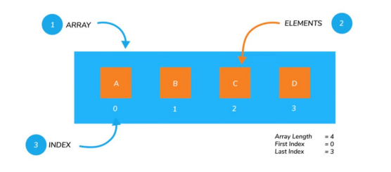
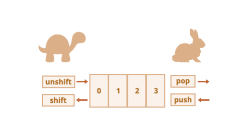
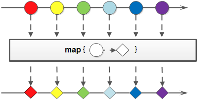
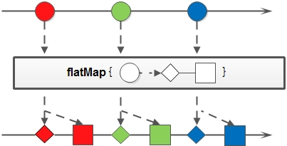
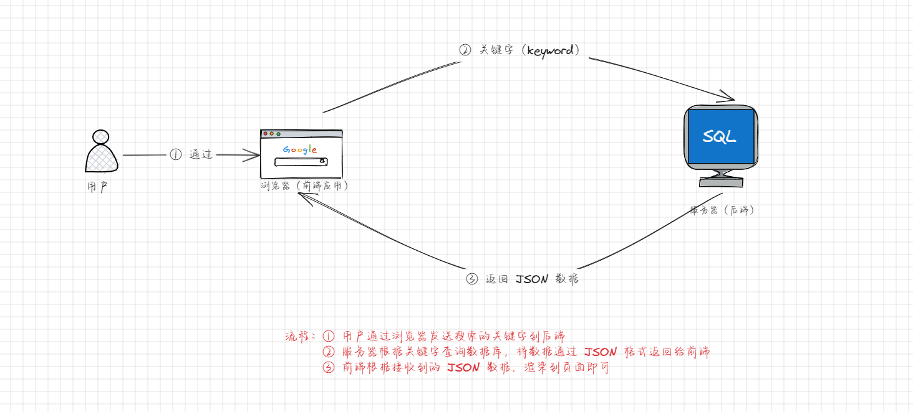

# 第一章：认识数组（Array）

## 1.1 概述

* 数组在实际开发中，使用频率非常之高，如下所示：


* 回顾一下数据类型：


* 我们应该知道，`数组`就是`引用数据类型`；换言之，就是一种`特殊的对象类型`。
* 那么，数组到底是什么？其实， 数组（Array）是一种可以 `按照顺序` 保存数据的`数据类型`。



> 数组中的一些术语：
>
> * 元素：数组中保存的每个数据称为数组的元素。
>
> - 下标：数组中数据的编号。
>
> - 长度：数组中数据的个数，通过数组的 `length` 属性获取。

## 1.2 数组的创建方式（⭐）

* 数组的创建方式（字面量）：

```js
var arr = []
```

* 数组的创建方式（对象）：

```js
var arr = new Array()
```

> 注意：
>
> *  数组是按照顺序保存的，每个数据都有自己唯一的编号。 
>
> -  数组中的编号是从 `0` 开始的，依次类推。 
>
> -  数组中的编号也叫 `索引` 或 `下标` 。 
>
> -  在 JavaScript 中，数组可以存储任意类型的数据；但是，通常保存同种类型的数据。 
> - JavaScript 中的数组和一些编程语言（如：Java ）中的数组不一样，JavaScript 中的数组可以动态扩容。
> - 在实际开发中，我们一般使用`字面量`的形式来创建数组。


* 示例：

```html
<!DOCTYPE html>
<html lang="en">
<head>
  <meta charset="UTF-8">
  <meta content="IE=edge" http-equiv="X-UA-Compatible">
  <meta content="width=device-width, initial-scale=1.0" name="viewport">
  <title>Title</title>
</head>
<body>
  <script>
    var arr = [1, 2, 3, 4, 5]
    console.log(arr) // [1, 2, 3, 4, 5]

    arr = [
      {name: "张三", age: 18},
      {name: "李四", age: 20},
      {name: "王五", age: 52}
    ]

    console.log(arr) // [{…}, {…}, {…}]
  </script>
</body>
</html>
```


* 示例：

```html
<!DOCTYPE html>
<html lang="en">
<head>
  <meta charset="UTF-8">
  <meta content="IE=edge" http-equiv="X-UA-Compatible">
  <meta content="width=device-width, initial-scale=1.0" name="viewport">
  <title>Title</title>
</head>
<body>
  <script>
    var arr = new Array()
    console.log(arr)
    arr = new Array(1, 2, 3, 4)
    console.log(arr)
  </script>
</body>
</html>
```

## 1.3 取值语法（⭐）

* 语法：

```js
数组名[下标]
```


* 示例：

```html
<!DOCTYPE html>
<html lang="en">
<head>
  <meta charset="UTF-8">
  <meta content="IE=edge" http-equiv="X-UA-Compatible">
  <meta content="width=device-width, initial-scale=1.0" name="viewport">
  <title></title>
</head>
<body>
  <script>
    /* 数组的声明语法 */
    var arr = ['张三', '李四', '王五', '赵六'];
    /* 数组的取值语法 */
    console.log(arr[0]) // 张三
    console.log(arr[1]) // 李四
    console.log(arr[2]) // 王五
    console.log(arr[3]) // 赵六
    /* 访问数组最后一个元素 */
    console.log(arr[arr.length - 1]) // 赵六
  </script>
</body>
</html>
```


# 第二章：数组的基本操作（⭐）

## 2.1 概述

* 数组的基本操作无非就是对数组中的元素进行增删改查。

## 2.2 应用示例

* 示例：

```html
<!DOCTYPE html>
<html lang="en">
<head>
  <meta charset="UTF-8">
  <meta content="IE=edge" http-equiv="X-UA-Compatible">
  <meta content="width=device-width, initial-scale=1.0" name="viewport">
  <title></title>
</head>
<body>
  <script>
    /* 数组的声明语法 */
    var arr = ['张三', '李四', '王五', '赵六'];
    /* 访问数组中的元素 */
    console.log(arr[0]) // 张三
    // 修改数组中的元素
    arr[0] = "田七"
    console.log(arr[0]) // 田七
    // 新增数组中的元素（了解）
    arr[arr.length] = "呵呵哒"
    console.log(arr) // ['田七', '李四', '王五', '赵六', '呵呵哒']
    // 删除数组中的元素 （了解）
    delete arr[0]
    console.log(arr) // [empty, '李四', '王五', '赵六', '呵呵哒']
  </script>
</body>
</html>
```


# 第三章：数组中元素的添加和删除（⭐）

## 3.1 概述

* 在数组的尾部添加元素：

```js
// 将一个或多个元素添加到数组的末尾，并返回该数组的新长度
arr.push(元素1,...,元素n)
```

* 在数组的尾部删除元素：

```js
// 从数据中删除最后一个元素，并返回该元素的值
arr.pop()
```

* 在数组的头部添加元素：

```js
// 将一个或多个元素添加到数组的开头，整个数组元素向后移动，并返回该数组的长度
arr.unshift(元素1,...,元素n)
```

* 在数组的头部删除元素：

```js
// 从数组中删除第一个元素,整个数组元素向前移动，并返回该元素的值
arr.shift()
```

* 这些方法之间的区别：



> 通常而言，push/pop 方法运行的速度快，而 shift/unshift 方法运行的速度慢点。

## 3.2 应用示例

* 示例：

```html
<!DOCTYPE html>
<html lang="en">
<head>
  <meta charset="UTF-8">
  <meta content="IE=edge" http-equiv="X-UA-Compatible">
  <meta content="width=device-width, initial-scale=1.0" name="viewport">
  <title></title>
</head>
<body>
  <script>
    /* 在数组中的末尾添加元素 */
    var arr = [1, 2, 3]
    console.log(arr) // [1, 2, 3]
    arr.push(4)
    console.log(arr) // [1, 2, 3, 4]
    arr.push(5, 6, 7)
    console.log(arr) // [1, 2, 3, 4, 5, 6, 7]
  </script>
</body>
</html>
```


* 示例：

```html
<!DOCTYPE html>
<html lang="en">
<head>
  <meta charset="UTF-8">
  <meta content="IE=edge" http-equiv="X-UA-Compatible">
  <meta content="width=device-width, initial-scale=1.0" name="viewport">
  <title></title>
</head>
<body>
  <script>
    /* 在数组的末尾删除元素 */
    var arr = [1, 2, 3, 4, 5, 6]
    console.log(arr) // [1, 2, 3, 4, 5, 6]
    console.log(arr.pop()) // 6
    console.log(arr) // [1, 2, 3, 4, 5]
    console.log(arr.pop()) // 5
    console.log(arr) // [1, 2, 3, 4]
  </script>
</body>
</html>
```


* 示例：

```html
<!DOCTYPE html>
<html lang="en">
<head>
  <meta charset="UTF-8">
  <meta content="IE=edge" http-equiv="X-UA-Compatible">
  <meta content="width=device-width, initial-scale=1.0" name="viewport">
  <title></title>
</head>
<body>
  <script>
    /* 在数组的头部添加元素 */
    var arr = [1, 2, 3, 4, 5, 6]
    console.log(arr) // [1, 2, 3, 4, 5, 6]
    arr.unshift(9, 10)
    console.log(arr) // [9, 10, 1, 2, 3, 4, 5, 6]
  </script>
</body>
</html>
```


* 示例：

```html
<!DOCTYPE html>
<html lang="en">
<head>
  <meta charset="UTF-8">
  <meta content="IE=edge" http-equiv="X-UA-Compatible">
  <meta content="width=device-width, initial-scale=1.0" name="viewport">
  <title></title>
</head>
<body>
  <script>
    /* 在数组的头部删除元素 */
    var arr = [1, 2, 3, 4, 5, 6]
    console.log(arr) // [1, 2, 3, 4, 5, 6]
    arr.shift()
    console.log(arr) // [2, 3, 4, 5, 6]
  </script>
</body>
</html>
```

## 3.3 splice 方法

* 在 JavaScript 中，splice 方法非常强大，可以对数组进行添加、删除和替换元素。
* 语法：

```js
splice(start, deleteCount, item1[,item2,item3,...])
```

* 参数说明：
  * `start` 表示从 start 索引位置开始，处理元素。
  * `deleteCount` 表示要删除元素的个数，如果为 0 或负数表示不删除。
  * `item1,item2,...` 表示在添加元素的时候要添加的元素。

> 在开发中，强烈推荐使用此方法，太强大了！！！


* 示例：

```html
<!DOCTYPE html>
<html lang="en">
<head>
  <meta charset="UTF-8">
  <meta content="IE=edge" http-equiv="X-UA-Compatible">
  <meta content="width=device-width, initial-scale=1.0" name="viewport">
  <title></title>
</head>
<body>
  <script>
    var arr = ["张三", "李四", "王五"]

    console.log(arr) // ['张三', '李四', '王五']
    arr.splice(1, 1) // 删除元素
    console.log(arr) // ['张三', '王五']
  </script>
</body>
</html>
```


* 示例：

```html
<!DOCTYPE html>
<html lang="en">
<head>
  <meta charset="UTF-8">
  <meta content="IE=edge" http-equiv="X-UA-Compatible">
  <meta content="width=device-width, initial-scale=1.0" name="viewport">
  <title></title>
</head>
<body>
  <script>
    var arr = ["张三", "李四", "王五"]

    console.log(arr) // ['张三', '李四', '王五']

    arr.splice(1, 0, "田七", "赵六") // 添加元素

    console.log(arr) // ['张三', '田七', '赵六', '李四', '王五']
  </script>
</body>
</html>
```


* 示例：

```html
<!DOCTYPE html>
<html lang="en">
<head>
  <meta charset="UTF-8">
  <meta content="IE=edge" http-equiv="X-UA-Compatible">
  <meta content="width=device-width, initial-scale=1.0" name="viewport">
  <title></title>
</head>
<body>
  <script>
    var arr = ["张三", "李四", "王五"]

    console.log(arr) // ['张三', '李四', '王五']

    arr.splice(1, 1, "田七", "赵六") // 替换元素，即先将索引为 1 位置上的元素向后删除 1 个元素，然后再添加 2 个元素

    console.log(arr) // ['张三', '田七', '赵六', '王五']
  </script>
</body>
</html>
```


# 第四章：数组的常规操作（⭐）

## 4.1 概述

* 在实际开发中，一般需要对数组进行遍历、求和、求最值操作。

## 4.2 数组的遍历

* 普通 for 循环：

```js
for(var i = 0 ;i < arr.length; i++) {
    console.log(arr[i])
}
```

* for ... in 循环：获取数组的索引

```js
for(var index in arr){
    console.log(arr[index])
}
```

* for ... of 循环：获取数组元素

```js
for(var item of arr){
    console.log(item)
}
```


* 示例：

```html
<!DOCTYPE html>
<html lang="en">
<head>
  <meta charset="UTF-8">
  <meta content="IE=edge" http-equiv="X-UA-Compatible">
  <meta content="width=device-width, initial-scale=1.0" name="viewport">
  <title>Title</title>
</head>
<body>
  <script>
    var arr = ["张三", "李四", "王五", "赵六"]

    // 普通 for 循环遍历数组
    for (var i = 0; i < arr.length; i++) {
      var item = arr[i]
      console.log(item)
    }

    console.log("---------------------------")

    // for ...in 循环遍历数组
    for (var index in arr) {
      console.log(arr[index])
    }

    console.log("---------------------------")

    // for ...of 循环遍历数组
    for (var item of arr) {
      console.log(item)
    }
  </script>
</body>
</html>
```

## 4.3 数组求和

* 需求：求数组 `[2, 6, 1, 7, 4]` 里面所有元素的 `和` 以及 `平均值` 。


* 示例：

```html
<!DOCTYPE html>
<html lang="en">
<head>
  <meta charset="UTF-8">
  <meta content="IE=edge" http-equiv="X-UA-Compatible">
  <meta content="width=device-width, initial-scale=1.0" name="viewport">
  <title>Title</title>
</head>
<body>
  <script>
    var arr = [2, 6, 1, 7, 4]

    var sum = 0
    for (var item of arr) {
      sum += item
    }

    console.log(`数组中元素的和是：${sum}，数组中元素的平均值是：${sum / arr.length}`) // 数组中元素的和是：20，数组中元素的平均值是：4
  </script>
</body>
</html>
```

## 4.4 数组求最值（最大值和最小值）

* 需求：求数组 `[2, 6, 1, 77, 52, 25, 7]` 中的最大值和最小值。


* 示例：

```html
<!DOCTYPE html>
<html lang="en">
<head>
  <meta charset="UTF-8">
  <meta content="IE=edge" http-equiv="X-UA-Compatible">
  <meta content="width=device-width, initial-scale=1.0" name="viewport">
  <title>Title</title>
</head>
<body>
  <script>
    var arr = [2, 6, 1, 7, 4]
    // 假设最大值和最小值刚开始都是数组中的第一个元素
    var max = arr[0]
    var min = arr[0]
    // 循环遍历数组中的元素，和 max 和 min 逐一比较
    for (var item of arr) {
      if (item >= max) {
        max = item
      }
      if (item <= min) {
        min = item
      }
    }
    console.log(`数组中元素的最大值是：${max}`) // 数组中元素的最大值是：7
    console.log(`数组中元素的最小值是：${min}`) // 数组中元素的最小值是：1
  </script>
</body>
</html>
```


# 第五章：数组中的常用方法（⭐）

## 5.1 概述

* 在实际开发中，数组是我们使用最多的数据结构，并且 JavaScript 也提供了一系列好用的方法来帮助我们来简化操作数组。

## 5.2 数组切片 -- slice

* slice 方法：用于从数组中提取指定范围的元素，并返回`一个新的数组`（类似于字符串的 slice 方法）

```js
arr.slice(start?: number, end?: number): T[];
```


* 示例：

```html
<!DOCTYPE html>
<html lang="en">
<head>
  <meta charset="UTF-8">
  <meta content="IE=edge" http-equiv="X-UA-Compatible">
  <meta content="width=device-width, initial-scale=1.0" name="viewport">
  <title>Title</title>
</head>
<body>
  <script>
    /* slice 对数组中的元素进行截取之后，返回一个新的数组 */
    var arr = [1, 2, 3, 4, 5, 6]
    console.log(arr) // [1, 2, 3, 4, 5, 6]
    var newArr = arr.slice(1, 2)
    console.log(arr) // [1, 2, 3, 4, 5, 6]
    console.log(newArr) // [2]
  </script>
</body>
</html>
```

## 5.3 数组合并 --- concat

* concat 方法：用于将多个数组合并为`一个新的数组`。它接受任意数量的参数，每个参数可以是数组或值。

```js
arr.concat(...items: ConcatArray<T>[]): T[];
```


* 示例：

```html
<!DOCTYPE html>
<html lang="en">
<head>
  <meta charset="UTF-8">
  <meta content="IE=edge" http-equiv="X-UA-Compatible">
  <meta content="width=device-width, initial-scale=1.0" name="viewport">
  <title>Title</title>
</head>
<body>
  <script>
    /* concat 将多个数组中的元素提取出来组成一个新的数组，并返回 */
    var arr = [1, 2, 3]
    var arr2 = [4, 5, 6]
    var arr3 = [7, 8, 9]

    var arr4 = arr.concat(arr2, arr3)
    console.log(arr4) // [1, 2, 3, 4, 5, 6, 7, 8, 9]
  </script>
</body>
</html>
```

## 5.4 数组连接 --- join

* join 方法：用于将数组中的所有元素连接成一个字符串。

```js
arr.join(separator?: string): string;
```

> 注意：join 方法接受一个可选的分隔符作为参数，用于在每个元素之间添加分隔符，默认为逗号


* 示例：

```html
<!DOCTYPE html>
<html lang="en">
<head>
  <meta charset="UTF-8">
  <meta content="IE=edge" http-equiv="X-UA-Compatible">
  <meta content="width=device-width, initial-scale=1.0" name="viewport">
  <title>Title</title>
</head>
<body>
  <script>
    var arr = [1, 2, 3, 4, 5]
    console.log(arr.join("|")) // 1|2|3|4|5
    console.log(arr.join(",")) // 1,2,3,4,5
  </script>
</body>
</html>
```

## 5.5 数组查找元素 -- indexOf 方法（了解）

* indexOf 方法：用于查找数组中某个元素的索引。如果找到该元素，则返回其第一次出现的索引；如果没有找到，则返回 -1

```js
arr.indexOf(searchElement: T, fromIndex?: number): number;
```

> 注意：该方法只能用于判断数组中的元素是基本类型的数据，不能用于判断是引用类型的数据。


* 示例：

```html
<!DOCTYPE html>
<html lang="en">
<head>
  <meta charset="UTF-8">
  <meta content="IE=edge" http-equiv="X-UA-Compatible">
  <meta content="width=device-width, initial-scale=1.0" name="viewport">
  <title>Title</title>
</head>
<body>
  <script>
    /* indexOf 只能针对数组中的元素是基本类型数据，有局限~ */
    var arr = [1, 2, 3, 4, 5]
    console.log(arr.indexOf(2)) // 1
    console.log(arr.indexOf(-1)) // -1
  </script>
</body>
</html>
```

## 5.6 数组查找元素 -- includes 方法（了解）

* includes 方法：用于检查数组中是否包含某个元素。如果包含，则返回 true；如果不包含，则返回 false

```js
arr.includes(searchElement: T, fromIndex?: number): boolean;
```

> 注意：该方法只能用于判断数组中的元素是基本类型的数据，不能用于判断是引用类型的数据。


* 示例：

```html
<!DOCTYPE html>
<html lang="en">
<head>
  <meta charset="UTF-8">
  <meta content="IE=edge" http-equiv="X-UA-Compatible">
  <meta content="width=device-width, initial-scale=1.0" name="viewport">
  <title>Title</title>
</head>
<body>
  <script>
    /* includes 只能针对数组中的元素是基本类型数据，有局限~ */
    var arr = [1, 2, 3, 4, 5]
    console.log(arr.includes(2)) // true
    console.log(arr.includes(-1)) // false
  </script>
</body>
</html>
```

## 5.7 数组查找元素 --- find 方法

* find 方法：查找数组中满足条件的第一个元素。它接受一个回调函数作为参数，该函数会被应用于数组的每个元素，直到找到满足条件的元素。如果依然没有找到，则返回 undefined

```js
arr.find<S extends T>(predicate: (value: T, index: number, obj: T[]) => value is S, thisArg?: any): S | undefined;
```

> 注意：find 方法其实是高阶函数。


* 示例：

```html
<!DOCTYPE html>
<html lang="en">
<head>
  <meta charset="UTF-8">
  <meta content="IE=edge" http-equiv="X-UA-Compatible">
  <meta content="width=device-width, initial-scale=1.0" name="viewport">
  <title>Title</title>
</head>
<body>
  <script>
    var arr = [
      {id: 100, name: "张三", age: 18},
      {id: 200, name: "李四", age: 19},
      {id: 300, name: "王五", age: 20},
      {id: 400, name: "赵六", age: 21},
      {id: 500, name: "田七", age: 22},
    ]
    // 高阶函数 find() 方法返回数组中满足提供的测试函数的第一个元素的值
    var result = arr.find(function (item, index, arr) {
      return item.id === 100
    })

    console.log(result) // {id: 100, name: '张三', age: 18}

    result = arr.find(function (item, index, arr) {
      return item.id === 600
    })

    console.log(result) // undefined
    
  </script>
</body>
</html>
```

## 5.8 数组查找元素 --- findIndex 方法

* findIndex 方法：用于查找数组中满足条件的第一个元素的索引。它接受一个回调函数作为参数，该函数会被应用于数组的每个元素，直到找到满足条件的元素，如果依然没有找到，返回 -1

```js
arr.findIndex(predicate: (value: T, index: number, obj: T[]) => unknown, thisArg?: any): number;
```

> 注意：findIndex 方法其实是高阶函数。


* 示例：

```html
<!DOCTYPE html>
<html lang="en">
<head>
  <meta charset="UTF-8">
  <meta content="IE=edge" http-equiv="X-UA-Compatible">
  <meta content="width=device-width, initial-scale=1.0" name="viewport">
  <title>Title</title>
</head>
<body>
  <script>
    var arr = [
      {id: 100, name: "张三", age: 18},
      {id: 200, name: "李四", age: 19},
      {id: 300, name: "王五", age: 20},
      {id: 400, name: "赵六", age: 21},
      {id: 500, name: "田七", age: 22},
    ]
    // 高阶函数 findIndex() 方法返回数组中满足提供的测试函数的第一个元素的索引。若没有找到对应元素则返回 -1
    var result = arr.findIndex(function (item, index, arr) {
      return item.id === 100
    })

    console.log(result) // 0

    result = arr.findIndex(function (item, index, arr) {
      return item.id === 600
    })

    console.log(result) // -1

  </script>
</body>
</html>
```

## 5.9 数组查找元素 --- every 方法

* every 方法：用于检查数组中的所有元素是否都满足某个条件。如果所有元素都满足条件，则返回 true；否则返回 false

```js
every(predicate: (value: T, index: number, array: T[]) => unknown, thisArg?: any): boolean;
```

> 注意：every 方法其实是高阶函数。


* 示例：

```html
<!DOCTYPE html>
<html lang="en">
<head>
  <meta charset="UTF-8">
  <meta content="IE=edge" http-equiv="X-UA-Compatible">
  <meta content="width=device-width, initial-scale=1.0" name="viewport">
  <title>Title</title>
</head>
<body>
  <script>
    var arr = [
      {id: 100, name: "张三", age: 18},
      {id: 200, name: "李四", age: 19},
      {id: 300, name: "王五", age: 20},
      {id: 400, name: "赵六", age: 21},
      {id: 500, name: "田七", age: 22},
    ]

    var result = arr.every(function (item) {
      return item.id >= 100
    })

    console.log(result) // true

  </script>
</body>
</html>
```

## 5.10 数组排序方法 --- sort 方法

* sort 方法：用于对数组中的元素进行排序，并返回对相同数组的引用

```js
arr.sort(compareFn?: (a: T, b: T) => number): this;
```

* 其中，compareFn 表示定义排序顺序的函数，并且返回值应该是一个数字，其正负性表示两个元素的相对顺序。

> 注意：sort 方法其实是高阶函数，并且 sort 方法会对原数组进行改变。


* 示例：

```html
<!DOCTYPE html>
<html lang="en">
<head>
  <meta charset="UTF-8">
  <meta content="IE=edge" http-equiv="X-UA-Compatible">
  <meta content="width=device-width, initial-scale=1.0" name="viewport">
  <title>Title</title>
</head>
<body>
  <script>
    var arr = [
      {id: 200, name: "张三", age: 18},
      {id: 100, name: "李四", age: 19},
      {id: 500, name: "王五", age: 20},
      {id: 400, name: "赵六", age: 21},
      {id: 300, name: "田七", age: 22},
    ]

    // 根据 id ，对数组中的元素进行升序
    var result = arr.sort(function (item1, item2) {
      return item1.id - item2.id
    })

    console.log(arr)
    console.log(result)

  </script>
</body>
</html>
```

## 5.11 数组反转方法 --- reverse 方法

* reverse 方法：将数组中的元素进行反转，并返回同一数组的引用

```js
arr.reverse(): T[];
```

> 注意：reverse 方法会对原数组进行改变。


* 示例：

```html
<!DOCTYPE html>
<html lang="en">
<head>
  <meta charset="UTF-8">
  <meta content="IE=edge" http-equiv="X-UA-Compatible">
  <meta content="width=device-width, initial-scale=1.0" name="viewport">
  <title>Title</title>
</head>
<body>
  <script>
    var arr = [
      {id: 200, name: "张三", age: 18},
      {id: 100, name: "李四", age: 19},
      {id: 500, name: "王五", age: 20},
      {id: 400, name: "赵六", age: 21},
      {id: 300, name: "田七", age: 22},
    ]

    var reverse = arr.reverse()

    console.log(arr)
    console.log(reverse)

  </script>
</body>
</html>
```

## 5.12 遍历数组元素 --- forEach

* forEach 方法：用于遍历数组中的每个元素，并对其执行指定的操作。它接受一个回调函数作为参数，该函数会被应用于数组的每个元素

```js
arr.forEach(callbackfn: (value: T, index: number, array: T[]) => void, thisArg?: any): void;
```

> 注意：forEach 方法其实是高阶函数。


* 示例：

```html
<!DOCTYPE html>
<html lang="en">
<head>
  <meta charset="UTF-8">
  <meta content="IE=edge" http-equiv="X-UA-Compatible">
  <meta content="width=device-width, initial-scale=1.0" name="viewport">
  <title>Title</title>
</head>
<body>
  <script>
    var arr = [
      {id: 200, name: "张三", age: 18},
      {id: 100, name: "李四", age: 19},
      {id: 500, name: "王五", age: 20},
      {id: 400, name: "赵六", age: 21},
      {id: 300, name: "田七", age: 22},
    ]

    // 遍历数组中的元素
    arr.forEach(function (item) {
      console.log(item)
    })

  </script>
</body>
</html>
```

## 5.13 数组元素转换 --- map

* map 方法：用于对数组中的每个元素进行操作，并返回一个新的数组。它接受一个回调函数作为参数，该函数会被应用于数组的每个元素，并将返回的值添加到新的数组中。

```js
arr.map<U>(callbackfn: (value: T, index: number, array: T[]) => U, thisArg?: any): U[];
```

* map 方法的示意图：



> 注意：map 方法其实是高阶函数。


* 示例：

```html
<!DOCTYPE html>
<html lang="en">
<head>
  <meta charset="UTF-8">
  <meta content="IE=edge" http-equiv="X-UA-Compatible">
  <meta content="width=device-width, initial-scale=1.0" name="viewport">
  <title>Title</title>
</head>
<body>
  <script>
    var arr = [1, 2, 3, 4, 5, 6]

    var result = arr.map(function (item) {
      return item * 2
    })

    console.log(result) // [2, 4, 6, 8, 10, 12]

  </script>
</body>
</html>
```


* 示例：

```html
<!DOCTYPE html>
<html lang="en">
<head>
  <meta charset="UTF-8">
  <meta content="IE=edge" http-equiv="X-UA-Compatible">
  <meta content="width=device-width, initial-scale=1.0" name="viewport">
  <title>Title</title>
</head>
<body>
  <script>
    var arr = [
      {id: 200, name: "张三", age: 18},
      {id: 100, name: "李四", age: 19},
      {id: 500, name: "王五", age: 20},
      {id: 400, name: "赵六", age: 21},
      {id: 300, name: "田七", age: 22},
    ]

    var idArr = arr.map(function (item) {
      return item.id
    })

    console.log(idArr) // [200, 100, 500, 400, 300]

  </script>
</body>
</html>
```

## 5.14 数组元素转换 --- flatMap

* flatMap 方法：flatMap 方法是 map 方法的一个变体，它首先对数组中的每个元素执行映射操作，然后将结果扁平化为一个新的数组。它接受一个回调函数作为参数，该函数会被应用于数组的每个元素，并将返回的值添加到新的数组中。

```js
arr.flatMap<U, This = undefined> (
        callback: (this: This, value: T, index: number, array: T[]) => U | ReadonlyArray<U>,
        thisArg?: This
    ): U[]
```

* flatMap 的示意图：



> 注意：flatMap 方法其实是高阶函数。


* 示例：

```html
<!DOCTYPE html>
<html lang="en">
<head>
  <meta charset="UTF-8">
  <meta content="IE=edge" http-equiv="X-UA-Compatible">
  <meta content="width=device-width, initial-scale=1.0" name="viewport">
  <title>Title</title>
</head>
<body>
  <script>
    var words = ["Hello", "World"]

    var map = words.map(w => w.split(""));
    console.log(map) // [['H', 'e', 'l', 'l', 'o'],['W', 'o', 'r', 'l', 'd']]

    var flatMap = words.flatMap(w => w.split(""));
    console.log(flatMap) // ['H', 'e', 'l', 'l', 'o', 'W', 'o', 'r', 'l', 'd']

  </script>
</body>
</html>
```

## 5.15 数组元素计算  --- reduce

* reduce 方法：用于对数组中的元素进行累积计算，并返回一个结果。它接受一个回调函数作为参数，该函数会被应用于数组的每个元素，并将累积的结果传递给下一次调用

```js
arr.reduce(callbackfn: (previousValue: T, currentValue: T, currentIndex: number, array: T[]) => T): T;
```

```js
arr.reduce(callbackfn: (previousValue: T, currentValue: T, currentIndex: number, array: T[]) => T, initialValue: T): T;
```

> 注意：reduce 方法其实是高阶函数。


* 示例：

```html
<!DOCTYPE html>
<html lang="en">
<head>
  <meta charset="UTF-8">
  <meta content="IE=edge" http-equiv="X-UA-Compatible">
  <meta content="width=device-width, initial-scale=1.0" name="viewport">
  <title>Title</title>
</head>
<body>
  <script>
    var arr = [1, 2, 3, 4, 5, 6]

    var sum = arr.reduce(function (preValue, curValue) {
      return preValue + curValue
    })

    console.log(sum) // 21

    sum = arr.reduce(function (preValue, curValue) {
      return preValue + curValue
    }, 0)

    console.log(sum) // 21

  </script>
</body>
</html>
```

## 5.16 数组元素过滤 --- filter

* filter 方法：用于筛选数组中满足条件的元素，并返回一个新的数组，该数组包含满足条件的元素

```js
arr.filter(predicate: (value: T, index: number, array: T[]) => unknown, thisArg?: any): T[];
```

> 注意：filter 方法其实是高阶函数，并且 filter 方法不会改变原数组。


* 示例：

```html
<!DOCTYPE html>
<html lang="en">
<head>
  <meta charset="UTF-8">
  <meta content="IE=edge" http-equiv="X-UA-Compatible">
  <meta content="width=device-width, initial-scale=1.0" name="viewport">
  <title>Title</title>
</head>
<body>
  <script>
    var arr = [
      {id: 200, name: "张三", age: 18},
      {id: 100, name: "李四", age: 19},
      {id: 500, name: "王五", age: 20},
      {id: 400, name: "赵六", age: 21},
      {id: 300, name: "田七", age: 22},
    ]

    // 找出年龄 >=20 的人的信息
    var result = arr.filter(function (item) {
      return item.age >= 20
    })

    console.log(result)

  </script>
</body>
</html>
```

## 5.17 模拟后端过滤数据

* 在开发中，很常见的一种场景：根据关键字到对象数组中搜索指定的数据，如：


* 其实，这种在实际开发中，特别是前后端开发中，非常简单：只需要前端将`关键字`发送到后端即可。



* 但是，有的时候，我们就想在本地模拟这种场景，而不需要借助服务器也实现这样的效果。


* 示例：

```html
<!DOCTYPE html>
<html lang="en">
<head>
  <meta charset="UTF-8">
  <meta content="IE=edge" http-equiv="X-UA-Compatible">
  <meta content="width=device-width, initial-scale=1.0" name="viewport">
  <title>Title</title>
</head>
<body>
  <script>
    var arr = [
      {id: 100, name: "张三", age: 18, keywords: ["aa", "bb"]},
      {id: 200, name: "李四", age: 19, keywords: ["aa"]},
      {id: 300, name: "王五", age: 20, keywords: ["bb", "dd"]},
      {id: 400, name: "赵六", age: 21, keywords: ["aa", "bb", "cc"]},
      {id: 500, name: "田七", age: 22, keywords: ["dd", "cc"]},
    ]

    // 过滤出 arr 中 keywords 含有 [cc,dd] 的数据
    let filterKeywords = ["cc", "dd"]
    
    // 过滤 arr 中的元素，判断每个元素的 keywords 中是否包含 filterKeywords 中的每个元素
    var filterArr = arr.filter(function (item) {
      const {keywords} = item
      return filterKeywords.every(value => keywords.includes(value))
    })

    console.log(filterArr)

  </script>
</body>
</html>
```

## 5.18 手动模拟 --- forEach 方法

* 示例：版本①

```html
<!DOCTYPE html>
<html lang="en">
<head>
  <meta charset="UTF-8">
  <meta content="IE=edge" http-equiv="X-UA-Compatible">
  <meta content="width=device-width, initial-scale=1.0" name="viewport">
  <title>Title</title>
</head>
<body>
  <script>
    var arr = ["张三", "李四", "王五"]

    // 版本①
    function XForEach(fn) {
      for (let i = 0; i < arr.length; i++) {
        fn(arr[i], i, arr)
      }
    }

    XForEach(function (item, index, arr) {
      console.log(item, index, arr)
    })

    console.log('--------------------------')

    arr.forEach(function (item, index, arr) {
      console.log(item, index, arr)
    })

  </script>
</body>
</html>
```


* 示例：版本②

```html
<!DOCTYPE html>
<html lang="en">
<head>
  <meta charset="UTF-8">
  <meta content="IE=edge" http-equiv="X-UA-Compatible">
  <meta content="width=device-width, initial-scale=1.0" name="viewport">
  <title>Title</title>
</head>
<body>
  <script>
    var arr = ["张三", "李四", "王五"]

    // 版本② ：通过参数将 arr 传递到 XForEach 函数中
    function XForEach(fn, arr) {
      for (let i = 0; i < arr.length; i++) {
        fn(arr[i], i, arr)
      }
    }

    XForEach(function (item, index, arr) {
      console.log(item, index, arr)
    }, arr)

    console.log('--------------------------')

    arr.forEach(function (item, index, arr) {
      console.log(item, index, arr)
    })

  </script>
</body>
</html>
```


* 示例：版本③

```html
<!DOCTYPE html>
<html lang="en">
<head>
  <meta charset="UTF-8">
  <meta content="IE=edge" http-equiv="X-UA-Compatible">
  <meta content="width=device-width, initial-scale=1.0" name="viewport">
  <title>Title</title>
</head>
<body>
  <script>
    var arr = ["张三", "李四", "王五"]

    // 版本③ ：通过在 arr 数组中添加 XForEach 函数，并在 XForEach 中通过 this 关键字

    arr.XForEach = function (fn) {
      for (let i = 0; i < this.length; i++) {
        fn(this[i], i, this)
      }
    }

    arr.XForEach(function (item, index, arr) {
      console.log(item, index, arr)
    })

    console.log('--------------------------')

    arr.forEach(function (item, index, arr) {
      console.log(item, index, arr)
    })

  </script>
</body>
</html>
```


* 示例：版本④

```html
<!DOCTYPE html>
<html lang="en">
<head>
  <meta charset="UTF-8">
  <meta content="IE=edge" http-equiv="X-UA-Compatible">
  <meta content="width=device-width, initial-scale=1.0" name="viewport">
  <title>Title</title>
</head>
<body>
  <script>
    var arr = ["张三", "李四", "王五"]

    // 版本④ ：通过在 Array.prototype 中添加 XForEach 函数，并在 XForEach 中通过 this 关键字

    Array.prototype.XForEach = function (fn) {
      for (let i = 0; i < this.length; i++) {
        fn(this[i], i, this)
      }
    }

    arr.XForEach(function (item, index, arr) {
      console.log(item, index, arr)
    })

    console.log('--------------------------')

    arr.forEach(function (item, index, arr) {
      console.log(item, index, arr)
    })

  </script>
</body>
</html>
```

