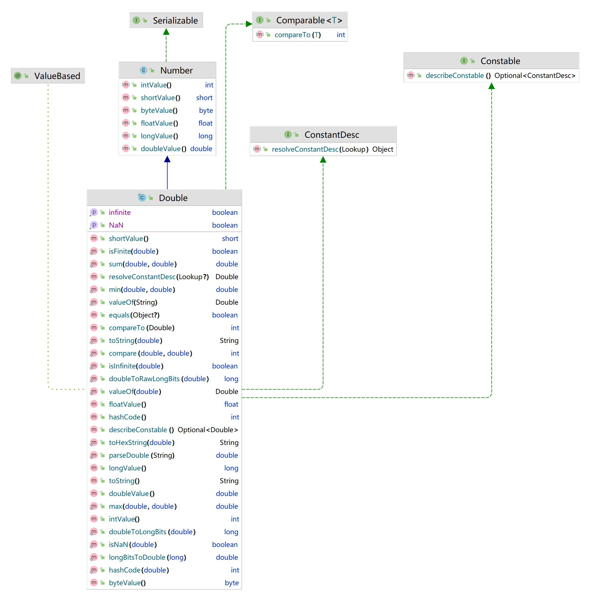
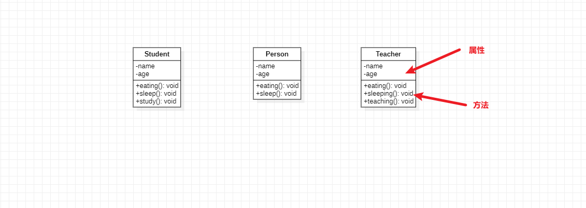
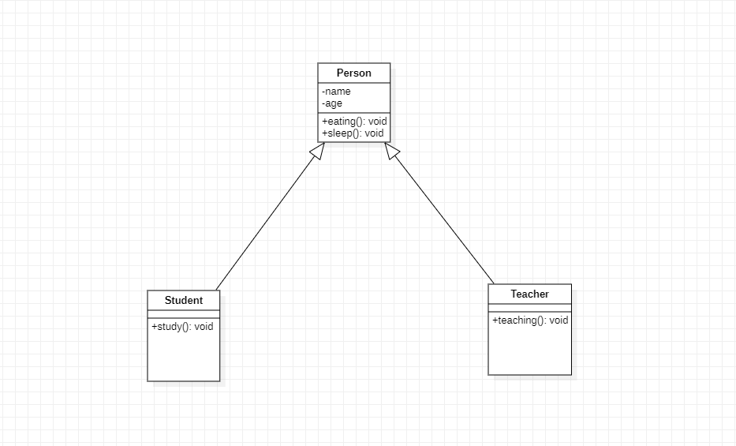
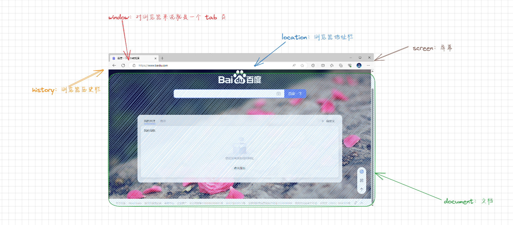
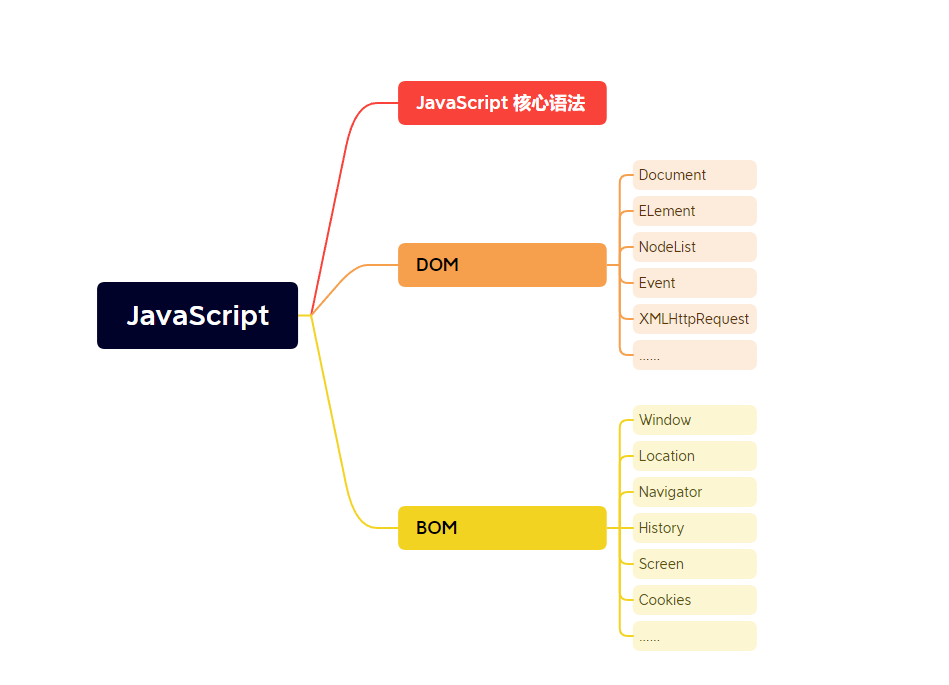
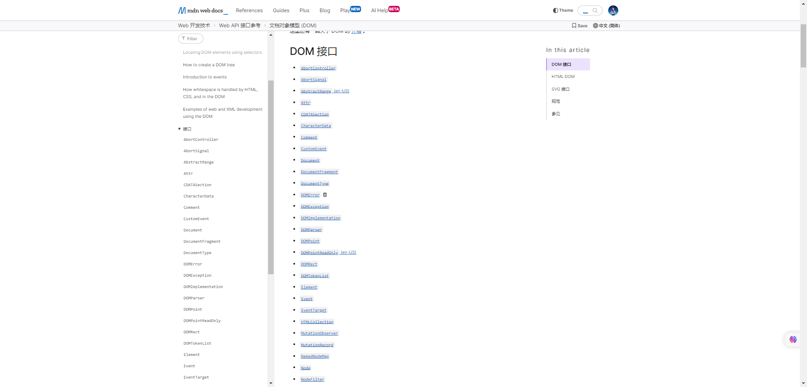
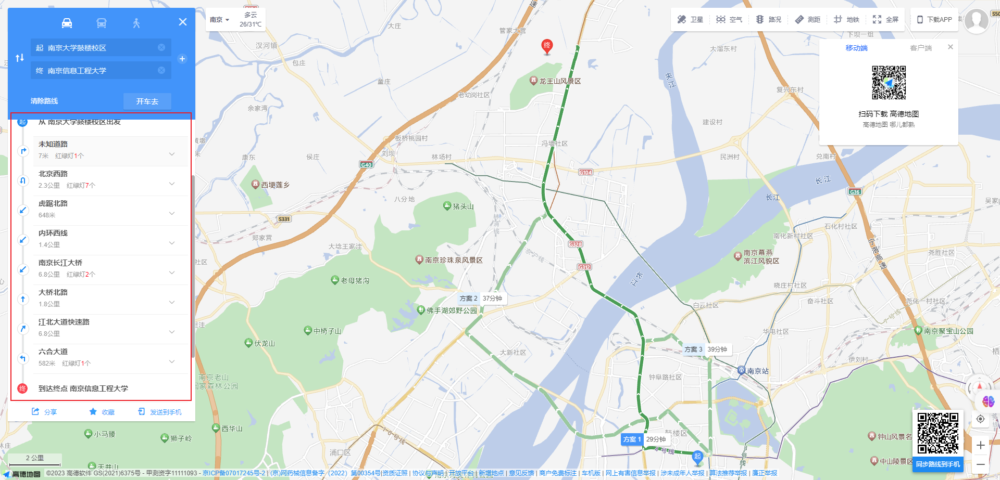
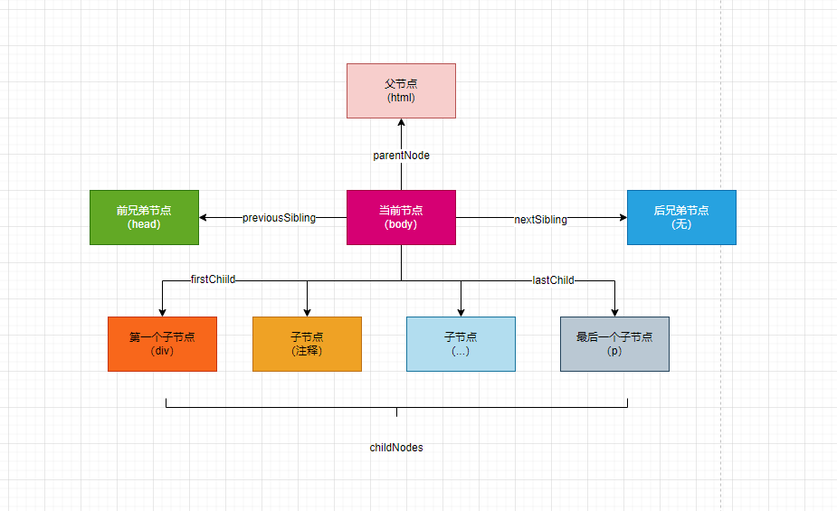
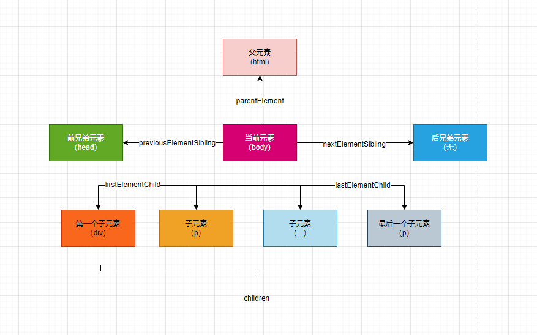

# 第一章：扫清概念（⭐）

## 1.1 类之间的继承

* 前面，我们已经学习过了类（在 ES5 中就是构造函数），其实面向对象的编程思想中，有三个特性就是：`封装`、`继承`和`多态`。
* 在面向对象的编程语言中，类就是封装思想的体现，这点在 Java 中毫不陌生；当然，JavaScript 是支持多范式编程的，JavaScript 某种意义上也是面向对象编程语言，所以在支持封装思想了，即类（构造函数）。

* 在面向对象的编程语言中，继承也是一大特性，Java 和 JavaScript 也不例外，先看看 Java 中`继承`的体现。



* 😂，看不懂！！！，其实 ES6 中提供了类、继承的概念，我们来使用 ES6 的语法来解释为什么有继承的特性。
* 在 ES6 中是这样定义一个类的：

```html
<!DOCTYPE html>
<html lang="en">
<head>
  <meta charset="UTF-8">
  <meta content="IE=edge" http-equiv="X-UA-Compatible">
  <meta content="width=device-width, initial-scale=1.0" name="viewport">
  <title>Title</title>
</head>
<body>
  <script>
    // 使用 ES6 来定义一个类
    class Person {
      // 构造函数
      constructor(name, age) {
        this.name = name
        this.age = age
      }

      // 方法
      eating() {
        console.log(`${this.name}正在吃饭....`)
      }

      // 方法
      sleep() {
        console.log(`${this.name}正在睡觉....`)
      }
    }

    // 创建对象并调用方法
    const p1 = new Person("张三", 18)
    p1.eating()
    p1.sleep()
    const p2 = new Person("李四", 20)
    p2.eating()
    p2.sleep()
  </script>
</body>
</html>
```

* 那么，如果我需要定义一个学生类和老师类，怎么办？

```html
<!DOCTYPE html>
<html lang="en">
<head>
  <meta charset="UTF-8">
  <meta content="IE=edge" http-equiv="X-UA-Compatible">
  <meta content="width=device-width, initial-scale=1.0" name="viewport">
  <title>Title</title>
</head>
<body>
  <script>
    // 使用 ES6 来定义一个类
    class Person {
      // 构造函数
      constructor(name, age) {
        this.name = name
        this.age = age
      }

      // 方法
      eating() {
        console.log(`${this.name}正在吃饭....`)
      }

      // 方法
      sleep() {
        console.log(`${this.name}正在睡觉....`)
      }
    }

    // 定义一个学生类
    class Student {
      // 构造函数
      constructor(name, age) {
        this.name = name
        this.age = age
      }

      // 方法
      eating() {
        console.log(`${this.name}正在吃饭....`)
      }

      // 方法
      sleep() {
        console.log(`${this.name}正在睡觉....`)
      }

      // 学习
      study() {
        console.log(`${this.name}正在学习....`)
      }
    }

    // 定义一个老师类
    class Teacher {
      // 构造函数
      constructor(name, age) {
        this.name = name
        this.age = age
      }

      // 方法
      eating() {
        console.log(`${this.name}正在吃饭....`)
      }

      // 方法
      sleep() {
        console.log(`${this.name}正在睡觉....`)
      }

      // 学习
      teach() {
        console.log(`${this.name}正在教学....`)
      }
    }
  </script>
</body>
</html>
```

* 我们可以通过 `UML` 来梳理一下：



> 注意：我们会有如下的发现 Person、Student、Teacher 类中有重复的属性和方法。

* 在生活中，我们有继承的概念：
  * 财产继承：指在一个人去世后，其财产和财富按照法律或遗嘱的规定传承给其合法继承人的过程。财产继承可以包括房产、土地、金钱、股票、企业等。
  * 地位继承：指一个人在家庭或社会中的地位、声望、职位等的传承。例如，在一些家族企业中，家族成员可以继承家族企业的管理权和地位。
  * 传统继承：指社会或文化中的传统习俗、价值观念、技艺等的传承。例如，某些手工艺技能、乐器演奏、舞蹈等传统技艺可以通过师徒传承的方式传承下来。
  * 知识继承：指知识、学问、学术理论等的传承。在学术界或教育领域中，老师将自己的知识和经验传授给学生，使学生能够继承并发展这些知识。
  * 价值观继承：指家庭或社会中的价值观念、道德准则等的传承。家庭和社会的价值观念往往会通过父母、长辈的言传身教传承给下一代。
  * ……
* 其实，在程序中也是类似的，我们来使用`继承`改造一下上面的代码：

```html
<!DOCTYPE html>
<html lang="en">
<head>
  <meta charset="UTF-8">
  <meta content="IE=edge" http-equiv="X-UA-Compatible">
  <meta content="width=device-width, initial-scale=1.0" name="viewport">
  <title>Title</title>
</head>
<body>
  <script>
    // 使用 ES6 来定义一个类
    class Person {
      // 构造函数
      constructor(name, age) {
        this.name = name
        this.age = age
      }

      // 方法
      eating() {
        console.log(`${this.name}正在吃饭....`)
      }

      // 方法
      sleep() {
        console.log(`${this.name}正在睡觉....`)
      }
    }

    // 定义一个学生类
    class Student extends Person {
      constructor(name, age) {
        super(name, age)
      }

      // 学习
      study() {
        console.log(`${this.name}正在学习....`)
      }
    }

    // 定义一个老师类
    class Teacher extends Person {
      constructor(name, age) {
        super(name, age)
      }

      // 学习
      teach() {
        console.log(`${this.name}正在教学....`)
      }
    }

    const stu = new Student("张三", 18)
    stu.eating()
    stu.sleep()
    stu.study()

    const tea = new Teacher("李四", 20)
    tea.eating()
    tea.sleep()
    tea.teach()

  </script>
</body>
</html>
```

* 我们可以通过 `UML` 来梳理一下：



* 其实，在 JavaScript 中的继承就是通过`调用父对象的构造函数`来实现`继承`。`子对象可以通过调用父对象的构造函数来继承父对象的属性和方法`。
* 并且，`继承`具有如下的作用：
  * ① 代码复用：通过继承，子类可以继承父类的属性和方法，避免了重复编写相同的代码。子类可以直接使用父类的方法和属性，从而减少了代码的冗余。
  * ② 扩展功能：子类可以在继承父类的基础上进行扩展，添加新的属性和方法。子类可以重写父类的方法，实现自己的逻辑，从而实现对父类的功能进行增强或修改。
  * ③ ~~多态性：通过继承，可以实现多态性。多态性是指同一个方法可以根据不同的对象调用出不同的行为。子类对象可以当作父类对象使用，从而提高了代码的灵活性和可扩展性~~（JavaScript 中不明显）。
  * ④ 继承层次结构：通过继承，可以构建一个继承层次结构。在一个继承层次结构中，可以定义一个通用的父类，然后通过继承创建多个子类，每个子类可以有自己的特定属性和方法。这样可以更好地组织和管理代码。
  * ⑤ 方法重写：子类可以重写父类的方法，实现自己的逻辑。通过方法重写，可以实现对父类方法的修改或增强，从而满足子类的特定需求。

* 继承是面向对象编程中的核心概念之一，它提供了`代码复用`、`功能扩展`、`多态性`等重要特性，使得代码更加灵活、可维护和可扩展。通过`合理使用继承`，可以`提高代码`的`复用性`和`可读性`，减少代码的冗余，提高开发效率。

## 1.2 什么是 API？

* API（Application Programming Interface）是应用程序接口的缩写，它是一组定义了软件组件或系统之间交互的规则和约定。API可以用于不同的场景，包括：
  * Web API：Web API 是一种通过HTTP协议提供服务的 API，它可以用于不同的 Web 应用程序之间进行数据交互。Web API 通常以 REST（Representational State Transfer）风格为基础，使用 HTTP 方法（如：GET、POST、PUT、DELETE）来进行数据的读取、创建、更新和删除操作。
  * `应用程序接口`：应用程序接口是一种用于不同软件组件之间进行通信的接口。它定义了组件之间的输入和输出参数、方法和数据格式等。应用程序接口可以是函数库、类库、框架或操作系统提供的接口。
  * 第三方 API：第三方 API 是由第三方开发者或组织提供的接口，用于让其他开发者可以访问和使用其服务或功能。例如，社交媒体平台提供的 API 可以让开发者访问用户数据和发布内容，地图服务提供的 API 可以让开发者在自己的应用中使用地图功能。
* 不同场景下的 API 有一些区别，主要体现在以下几个方面：
  * 接口协议：不同场景下的 API 可能使用不同的协议进行通信，如：HTTP、SOAP、RPC 等。
  * 数据格式：不同场景下的 API 可能使用不同的数据格式进行数据交换，如：JSON、XML、Protobuf 等。
  * 访问权限：不同场景下的API可能有不同的访问权限控制机制，如：使用API密钥、身份验证、访问令牌等。
  * 功能和服务：不同场景下的 API 提供的功能和服务也不同，如：Web API 提供的是 Web 服务，第三方 API 提供的是特定的功能或服务。
* 总之，API 是一种规范和约定，用于不同软件组件或系统之间进行交互。不同场景下的 API 有不同的特点和用途，但它们都提供了一种便捷的方式来访问和使用其他软件组件或服务的功能。

## 1.3 JavaScript 中的 WEB API 是什么？

* 在浏览器中，Web API 是一组由浏览器提供的接口，用于与 Web 页面进行交互和操作。这些 API 允许开发者通过 JavaScript 代码来访问和操作浏览器的各种功能和特性，从而实现丰富的 Web 应用程序。
* 浏览器中的 Web API 包括但不限于以下几个方面：
  * DOM API：Document Object Model（文档对象模型）API 允许开发者通过JavaScript访问和操作HTML 和 XML 文档的结构、内容和样式。通过 DOM API，开发者可以动态地修改页面的内容、样式和结构。
  * AJAX API：Asynchronous JavaScript and XML（异步JavaScript和XML）API允许开发者通过JavaScript 与服务器进行异步通信，实现动态加载数据和更新页面的功能。通过 AJAX API，开发者可以发送 HTTP 请求并处理响应，实现无刷新更新页面的效果。
  * Geolocation API：Geolocation（地理定位）API 允许开发者通过JavaScript 获取用户的地理位置信息。通过 Geolocation API，开发者可以获取用户的经纬度坐标，从而实现基于位置的服务和功能。
  * Canvas API：Canvas（画布）API 允许开发者通过 JavaScript 在页面上绘制图形、图像和动画。通过 Canvas API，开发者可以使用 JavaScript 绘制 2D 和 3D 图形，实现丰富的可视化效果。
  * Web Storage API：Web Storage（Web存储）API 允许开发者使用 JavaScript 在浏览器端存储和获取数据。通过 Web Storage API，开发者可以使用 localStorage 和 sessionStorage 来存储和获取数据，实现本地数据的持久化和共享。

* 此外，还有许多其他的 Web API，如：Web Workers API、Web Audio API、WebRTC API 等，它们提供了更多的功能和特性，用于实现更复杂和交互性强的 Web 应用程序。
* 总之，浏览器中的 Web API 是一组由浏览器提供的接口，用于与 Web 页面进行交互和操作。通过这些 API，开发者可以访问和操作浏览器的各种功能和特性，实现丰富的 Web 应用程序。

## 1.4 为什么要学习 DOM 和 BOM ？

* ① 我们通过学习 WEB API 可以操作浏览器，来实现和 WEB 页面的交互；并且 WEB API 包括了 DOM 和 BOM。
* ② BOM 其实就是对浏览器的各个功能的抽象，如下所示：



* ③ BOM 中的 DOM 是我们操作最多了，所以 JavaScript 将 DOM 也单独提取出来了。

## 1.5 JavaScript 的组成是什么？

* JavaScript 由以下三部分组成：
  * JavaScript 核心语法。
  * DOM。
  * BOM。



## 1.6 WEB API 是接口，那么在开发中需要 new ？

* JavaScript 是一种面向对象的编程语言，但它没有像 Java 或 C# 那样的显式接口概念。在 JavaScript 中，我们通常使用对象字面量、类或构造函数来定义和实现对象的行为。
* 关于 WEB API，它是浏览器提供的一组接口（或称为功能），用于操作网页的各个方面，包括 DOM 操作、网络请求、存储、定时器等。WEB API 是浏览器为 JavaScript 提供的一种扩展，它使得 JavaScript 可以与浏览器环境进行交互，并实现与用户界面的交互、数据的获取和处理等功能。

> 注意：到目前为止，因为 JavaScript 中没有明确的接口的概念，所以通常我们会将构造函数和接口作为等价概念。

* 但是，我们会在开发中，看到这样的代码：

```html
<!DOCTYPE html>
<html lang="en">
<head>
  <meta charset="UTF-8">
  <meta content="IE=edge" http-equiv="X-UA-Compatible">
  <meta content="width=device-width, initial-scale=1.0" name="viewport">
  <title>Title</title>
  <style>
    .active {
      background-color: orange;
    }
  </style>
</head>
<body>

  <div class="box">
    <button class="active">1</button>
    <button>2</button>
    <button>3</button>
    <button>4</button>
    <button>5</button>
  </div>

  <script>
    let box = document.querySelector(".box")
    box.addEventListener('click', function (e) {
      if (e.target.nodeName !== 'BUTTON') {
        return
      }
      let active = document.querySelector(".active")
      active.classList.remove("active")
      e.target.classList.add("active")
    })
  </script>
</body>
</html>
```

* 😕为什么使用 document 对象，而不是使用 `new Docuemnt()`?
* 关于 `Document`，它是一个构造函数，用于创建 `document` 对象的实例。在浏览器环境中，`document` 对象是一个全局对象，表示当前打开的网页文档。我们可以使用 `document` 对象来访问和操作网页的 DOM 结构，例如：查找元素、修改元素属性、添加事件监听器等。

```js
const doc = new Document();

const div = doc.createElement("div");
div.textContent = "Hello, world!";
doc.body.appendChild(div);
```

* 但是，实际开发中，我们通常不需要显式地使用 `Document` 构造函数来创建 `document` 对象。浏览器会自动为我们创建一个全局的 `document` 对象，我们可以直接使用它来操作网页的 DOM，并且这个 `document` 对象其实是 `window` 对象的属性。

## 1.7 深入理解 DOM

* 浏览器会根据我们`编写的 HTML 、CSS 进行渲染`，同时它也需要考虑我们可能会`通过 JavaScript 来对其进行操作`，于是浏览器将我们`编写在 HTML 中的每一个元素（Element）都抽象成了一个个对象`；所有的这些对象都是可以`通过 JavaScript 来对其进行访问`，这个`抽象的过程`就是`文档对象模型`（DOM）。

```html
<!DOCTYPE html>
<html lang="en">
<head>
  <meta charset="UTF-8">
  <meta content="IE=edge" http-equiv="X-UA-Compatible">
  <meta content="width=device-width, initial-scale=1.0" name="viewport">
  <title>Title</title>
</head>
<body>
  <script>
    /* 整个 HTML 文档都会被浏览器加载到内存中，并且被抽象成一个 document 对象 */
    console.log(document.documentElement) // 就是 HTML 元素
    console.log(document.head) // 就是 head 元素
    console.log(document.body) // 就是 body 元素
  </script>
</body>
</html>
```

* 并且这些 `DOM 对象`会在内存中形成一个`树结构`，我们也称之为 `DOM 树`，如下所示：


## 1.8 类继承在 WEB API 接口上的应用（针对 DOM）

* 前文提到，浏览器会将我们编写在 HTML 页面中的每个元素都抽象成一个对象，并且这些对象非常之多，为了提高代码的复用性，浏览器在架构设计的时候就将这些对象的共同部分抽取成对应的类（WEB API 接口（构造函数）），那么这些类（WEB API 接口（构造函数））之间的关系是什么?



* 其 `UML` 图如下：


* 所以，如果 EventTarget 类有属性和方法，那么对应的 Document 、Element 类也会继承这些属性和方法；那么，对应的对象就可以调用这些属性和方法了。

## 1.9 类之间的关系和对象之间的关系没有一点联系

* Java 中完全面向对象的语言，本次将采用 Java 来描述类之间的关系以及对象之间的关系。
* `类`和`类`之间的`关系`是`继承`关系（Inheritance）：一个类可以继承自另一个类，继承关系体现了类之间的一种`"is-a"`关系，即子类是父类的一种特殊类型。子类可以继承父类的属性和方法，并且可以添加自己的属性和方法。继承关系使用关键字 `extends` 表示。

```java
class Animal {
    protected String name;

    public Animal(String name) {
        this.name = name;
    }

    public void eat() {
        System.out.println(name + " is eating.");
    }
}

class Dog extends Animal {
    public Dog(String name) {
        super(name);
    }

    public void bark() {
        System.out.println(name + " is barking.");
    }
}

public class Main {
    public static void main(String[] args) {
        Dog dog = new Dog("Tom");
        dog.eat();  // Output: Tom is eating.
        dog.bark(); // Output: Tom is barking.
    }
}
```

* `类`和`接口`之间的`关系`是`实现`关系（Implementation）：一个类可以实现一个或多个接口，实现关系体现了类与接口之间的一种`"has-a"`关系，即类具有接口所定义的行为。一个类实现了接口后，必须实现接口中定义的所有方法。实现关系使用关键字`implements`表示。

```java
interface Flyable {
    void fly();
}

class Bird implements Flyable {
    public void fly() {
        System.out.println("Bird is flying.");
    }
}

public class Main {
    public static void main(String[] args) {
        Bird bird = new Bird();
        bird.fly(); // Output: Bird is flying.
    }
}
```

* `对象`和`对象`之间的`关系`可以是`关联关系`（Association）：表示两个类之间的关联关系，一个类对象可以与另一个类对象发生关联，但彼此之间没有强依赖关系。关联关系可以是单向或双向的。

```java
class Person {
    private String name;

    public Person(String name) {
        this.name = name;
    }

    public String getName() {
        return name;
    }
}

class Car {
    private String brand;
    private Person owner;

    public Car(String brand, Person owner) {
        this.brand = brand;
        this.owner = owner;
    }

    public String getBrand() {
        return brand;
    }

    public Person getOwner() {
        return owner;
    }
}

public class Main {
    public static void main(String[] args) {
        Person person = new Person("John");
        Car car = new Car("Toyota", person);
        System.out.println(car.getOwner().getName() + " owns a " + car.getBrand() + " car.");
    }
}
```

* `对象`和`对象`之间的`关系`可以是依赖关系（Dependency）：表示一个类对象使用另一个类对象作为方法参数、局部变量或返回值，但彼此之间没有直接关联。依赖关系是一种临时性的关系。

```java
class Message {
    private String content;

    public Message(String content) {
        this.content = content;
    }

    public void send() {
        System.out.println("Sending message: " + content);
    }
}

class Messenger {
    public void sendMessage(Message message) {
        message.send();
    }
}

public class Main {
    public static void main(String[] args) {
        Message message = new Message("Hello");
        Messenger messenger = new Messenger();
        messenger.sendMessage(message);
    }
}
```

* `对象`和`对象`之间的`关系`可以是聚合关系（Aggregation）：表示整体对象包含部分对象，但部分对象可以独立存在。聚合关系是一种弱关系，整体对象和部分对象之间的生命周期可以不一致。

```java
class Department {
    private String name;

    public Department(String name) {
        this.name = name;
    }

    public String getName() {
        return name;
    }
}

class Employee {
    private String name;
    private Department department;

    public Employee(String name, Department department) {
        this.name = name;
        this.department = department;
    }

    public String getName() {
        return name;
    }

    public Department getDepartment() {
        return department;
    }
}

public class Main {
    public static void main(String[] args) {
        Department department = new Department("HR");
        Employee employee = new Employee("John", department);
        System.out.println(employee.getName() + " works in the " + employee.getDepartment().getName() + " department.");
    }
}
```

* `对象`和`对象`之间的`关系`可以是组合关系（Composition）：表示整体对象包含部分对象，但部分对象不能独立存在，它们的生命周期是一致的。当整体对象被销毁时，部分对象也会被销毁。

```java
class Engine {
    public void start() {
        System.out.println("Engine starts.");
    }
}

class Car {
    private Engine engine;

    public Car() {
        engine = new Engine();
    }

    public void startCar() {
        engine.start();
        System.out.println("Car starts.");
    }
}

public class Main {
    public static void main(String[] args) {
        Car car = new Car();
        car.startCar();
    }
}
```


# 第二章：导航（了解）

## 2.1 生活中的导航

* 在现实生活中，如果我们要去某个地方，但是具体的路线不清楚，那么我们就是使用`地图软件`来进行`导航`。



* 在 DOM 操作中，也是如此，我们可以通过`一个节点（或元素）`根据`导航`去找到`另外一个节点（或元素）`。

## 2.2 document 对象（⭐）

* document 对象是浏览器提供的全局对象，其对应的类型是 Document（节点，类，构造函数，WEB API 接口都可以）。
  * 对 DOM 的所有操作都是从 `document` 对象开始的。
  * `document` 对象是 `DOM 的入口点`，我们可以从 document 对象`开始`去访问任何`节点`和`元素`。

> 注意：节点和元素的区别
>
> * 节点是包含元素的，主要有元素、注释、属性、文本等。
> * 元素，其实就是 HTML 中的标签。

* 对于最顶层的 html、head 和 body 等元素，我们可以直接在 document 对象中获取。


* 示例：

```html
<!DOCTYPE html>
<html lang="en">
<head>
  <meta charset="UTF-8">
  <meta content="IE=edge" http-equiv="X-UA-Compatible">
  <meta content="width=device-width, initial-scale=1.0" name="viewport">
  <title>Title</title>
</head>
<body>
  <h1>我是head元素</h1>
  <a href="#">我是超链接</a>

  <script>
    var htmlEl = document.documentElement
    console.log(`html: ${htmlEl}`) // html 元素
    var headEl = document.head
    console.log(`head: ${headEl}`) // head 元素
    var bodyEl = document.body
    console.log(`body:${bodyEl}`) // body 元素
    var doctype = document.doctype
    console.log(`doctype:${doctype}`) // doctype
  </script>
</body>
</html>
```

## 2.3 节点（Node）之间的导航

* 如果我们`获取到一个节点（Node，通常是 body 元素）`之后，就可以根据这个节点去获取任意的其它节点，这个过程我们称之为 `节点之间的导航`。
* 节点之间的关系：
  * 父节点：`parentNode` 
  * 前兄弟节点：`previousSibling`
  * 后兄弟节点：`nextSibling`
  * 子节点：`childNodes`
  * 第一个子节点：`firstChild`
  * 最后一个子节点：`lastChild`

* 其对应的关系图例如下：




* 示例：

```html
<!DOCTYPE html>
<html lang="en">
<head>
  <meta charset="UTF-8">
  <meta content="IE=edge" http-equiv="X-UA-Compatible">
  <meta content="width=device-width, initial-scale=1.0" name="viewport">
  <title>Title</title>
</head>
<body>
  <div class="box">
    <!-- 我是注释 -->
    <h1 class="title">我是h1元素</h1>
    <div>我是div元素</div>
    <div class="desc">我是一个描述文字</div>
    我是文本
  </div>

  <script>
    /* 太麻烦了~ */
    // 获取 body 节点
    var bodyEl = document.body
    console.log(`body`, bodyEl)
    // 获取换行
    var emptyNode = bodyEl.childNodes[0]
    console.log(`emptyNode`, emptyNode)
    // 获取 box 元素
    var boxEl = bodyEl.childNodes[1]
    console.log(`boxEl`, boxEl)
    // 获取注释
    var commentEl = boxEl.childNodes[2]
    console.log(`commentEl`, commentEl)
    // 获取 h1 元素
    var h1l = boxEl.childNodes[3]
    console.log(`h1l`, h1l)
    // 获取 div 元素
    var divEl = boxEl.childNodes[5]
    console.log(`divEl`, divEl)
    // 获取 div 元素
    var divDescEl = boxEl.childNodes[7]
    console.log(`divDescEl`, divDescEl)
    // 获取文本
    var textEl = boxEl.childNodes[8]
    console.log(`textEl`, textEl)
  </script>

</body>
</html>
```

## 2.4 元素（Element）之间的导航

* 如果我们获取到`一个元素（Element）`后，可以根据`这个元素`去获取其他的元素，我们称之为`元素之间的导航`。
* 元素之间存在如下的关系：
  * 父元素：`parentElement`
  * 前兄弟节点：`previousElementSibling`
  * 后兄弟节点：`nextElementSibling`
  * 子节点：`children`
  *  第一个子节点：`firstElementChild`
  * 最后一个子节点：`lastElementChild`

* 其对应的关系图例如下：




* 示例：

```html
<!DOCTYPE html>
<html lang="en">
<head>
  <meta charset="UTF-8">
  <meta content="IE=edge" http-equiv="X-UA-Compatible">
  <meta content="width=device-width, initial-scale=1.0" name="viewport">
  <title>Title</title>
</head>
<body>
  <div class="box">
    <!-- 我是注释 -->
    <h1 class="title">我是h1元素</h1>
    <div>我是div元素</div>
    <div class="desc">我是一个描述文字</div>
    我是文本
  </div>

  <script>
    /* 太麻烦了~ */
    var bodyEl = document.body
    console.log('body', bodyEl) // body 元素
    var boxEl = bodyEl.firstElementChild
    console.log('boxEl', boxEl) // box 元素
    var h1El = boxEl.firstElementChild
    console.log('h1El', h1El) // h1 元素
    var divEl = boxEl.children[1]
    console.log('divEl', divEl) // div 元素
    var divDescEl = boxEl.lastElementChild
    console.log('divDescEl', divDescEl) // div.desc 元素
  </script>
</body>
</html>
```


# 第三章：获取任意元素（⭐）

## 3.1 概述

* 当元素（或节点）彼此相邻的时候，使用`导航`非常有用；但是，在实际开发中，我们希望`获取任意的一个元素，该如何操作？`
* DOM 也为我们提供了获取元素的方法：

| 方法名                 | 搜索方式     | 可以在元素上调用？ | 实时的？ |
| ---------------------- | ------------ | ------------------ | -------- |
| querySelector          | CSS-selector | ✔                  | ✘        |
| querySelectorAll       | CSS-selector | ✔                  | ✘        |
| getElementById         | id           | ✘                  | ✘        |
| getElementsByName      | name         | ✘                  | ✔        |
| getElementsByTagName   | tag or `*`   | ✔                  | ✔        |
| getElementsByClassName | class        | ✔                  | ✔        |

> 注意：在开发中，最常用的就是 querySelector 和 querySelectorAll ，因为可以和 CSS 的选择器结合使用。

## 3.2 应用示例

* 示例：

```html
<!DOCTYPE html>
<html lang="en">
<head>
  <meta charset="UTF-8">
  <meta content="IE=edge" http-equiv="X-UA-Compatible">
  <meta content="width=device-width, initial-scale=1.0" name="viewport">
  <title>Title</title>
</head>
<body>
  <div class="box">
    <!-- 我是注释 -->
    <h1 class="title">我是h1元素</h1>
    <div>我是div元素</div>
    <div class="desc">我是一个描述文字</div>
    我是文本
  </div>

  <script>
    var box = document.querySelector(".box")
    console.log('box', box)

    var title = box.querySelector(".title")
    console.log('title', title)

    var div = box.querySelector('div')
    console.log('div', div)

    var desc = box.querySelector(".desc");
    console.log('desc', desc)

  </script>
</body>
</html>
```


# 第四章：Node 节点常见的属性

## 4.1 概述

* 不同的节点类型（文本、注释、元素等）可能有不同的属性，这里`研究节点的共有属性`。

## 4.2 nodeType 属性

* 每种`节点类型`（文本、注释、元素等）都由一个 nodeType 属性来`标识`节点的`类型`，其值是一个`数值`。
* 常见的节点类型有如下：

| 常量                    | 值   | 描述                                                         |
| ----------------------- | ---- | ------------------------------------------------------------ |
| Node.ELEMENT_NODE       | 1    | 一个元素节点，例如：`<p>`                                    |
| Node.TEXT_NODE          | 3    | Element 或者 Attr 中实际的 `文字`                            |
| Node.COMMENT_NODE       | 8    | 一个 Comment 节点                                            |
| Node.DOCUMENT_NODE      | 9    | 一个 Document 节点                                           |
| Node.DOCUMENT_TYPE_NODE | 10   | 描述文档类型的 DocumentType 节点。例如:`<!DOCTYPE html>`  就是用于 HTML5 的。 |


* 示例：

```html
<!DOCTYPE html>
<html lang="en">
<head>
  <meta charset="UTF-8">
  <meta content="IE=edge" http-equiv="X-UA-Compatible">
  <meta content="width=device-width, initial-scale=1.0" name="viewport">
  <title>Title</title>
</head>
<body>
  <!-- 我是注释 -->
  我是文本
  <div class="box">
    我是div元素
  </div>

  <script>
    var commentNode = document.body.childNodes[1]
    console.log(commentNode, commentNode.nodeType, commentNode.nodeType === Node.COMMENT_NODE)
    var textNode = document.body.childNodes[2]
    console.log(textNode, textNode.nodeType, textNode.nodeType === Node.TEXT_NODE)
    var boxEl = document.body.childNodes[3]
    console.log(boxEl, boxEl.nodeType, boxEl.nodeType === Node.ELEMENT_NODE)
  </script>
</body>
</html>
```

## 4.3 nodeName 和 tagName 属性

* `nodeName` 属性是获取 Node 节点的名称，而 `tagName` 是获取元素的标签名称。


* 示例：

```html
<!DOCTYPE html>
<html lang="en">
<head>
  <meta charset="UTF-8">
  <meta content="IE=edge" http-equiv="X-UA-Compatible">
  <meta content="width=device-width, initial-scale=1.0" name="viewport">
  <title>Title</title>
</head>
<body>
  <!-- 我是注释 -->
  我是文本
  <div class="box">
    我是div元素
  </div>

  <script>
    var commentNode = document.body.childNodes[1]
    var textNode = document.body.childNodes[2]
    var boxEl = document.body.childNodes[3]

    console.log(commentNode.nodeName)
    console.log(textNode.nodeName)
    console.log(boxEl.nodeName, boxEl.tagName)

  </script>
</body>
</html>
```

## 4.4 innerHTML 和 textContent 属性（⭐）

* innerHTML 属性有如下的作用：
  * ① 获取元素中的 HTML 并转换为字符串的格式。
  * ② 设置元素中的内容（可以包含 HTML 标签，浏览器会识别 HTML 的标签，并渲染到页面上）。
* textContent 属性有如下的作用：
  * ① 获取元素中的文本内容。
  * ② 设置元素中的文本内容（如果包含 HTML 标签，浏览器是当做文本，渲染到页面上的）。


* 示例：

```html
<!DOCTYPE html>
<html lang="en">
<head>
  <meta charset="UTF-8">
  <meta content="IE=edge" http-equiv="X-UA-Compatible">
  <meta content="width=device-width, initial-scale=1.0" name="viewport">
  <title>Title</title>
</head>
<body>

  <div class="box">
    <p>我是p元素</p>
  </div>

  <script>
    var boxEl = document.querySelector(".box")
    // innerHTML 可以识别 HTML 中的标签和文本等，而 textContent 只能识别文本
    console.log(boxEl.innerHTML, boxEl.textContent)

    // innerHTML 设置元素中的内容的时候，会识别 HTML 的标签，并渲染到页面上
    boxEl.innerHTML = "<h1>我是h1元素</h1>"

    // textContent 设置元素中的内容的时候，不会识别 HTML 的标签，并将标签等当做文本，渲染到页面上
    boxEl.textContent = "<h2>我是h2元素</h2>"

  </script>
</body>
</html>
```

## 4.5 hidden 属性（⭐）

* hidden 属性也是一个全局属性，用于将元素隐藏。

> 其实，原理很简单，如果有 hidden 属性，那么浏览器就给该元素设置 `display: none;` 的 CSS  样式。

* 回顾之前学过的全局属性：

  * `id`：定义唯一的标识符（ID），该标识符在整个文档中必须是唯一的。其目的是在链接（使用片段标识符），脚本或样式（使用 CSS）时标识元素。

  * `class`：一个以空格分隔的元素的类名（classes ）列表，它允许 CSS 和 Javascript 通过类选择器或者 DOM 方法来选 择和访问特定的元素；

  * `style`：给元素添加内联样式。

  * `title`：包含表示与其所属元素相关信息的文本。 这些信息通常可以作为提示呈现给用户，但不是必须的。
  * `value`：input 元素、select 和 textarea 等元素具有 value 全局属性。
  * `href`: a 元素具有 href 全局属性。


* 示例：

```html
<!DOCTYPE html>
<html lang="en">
<head>
  <meta charset="UTF-8">
  <meta content="IE=edge" http-equiv="X-UA-Compatible">
  <meta content="width=device-width, initial-scale=1.0" name="viewport">
  <title>Title</title>
  <style>
    .box {
      width: 200px;
      height: 200px;
      background-color: pink;
    }
  </style>
</head>
<body>

  <div class="box"></div>
  <button class="btn">显示/隐藏</button>

  <script>
    var btnEl = document.querySelector(".btn")
    var boxEl = document.querySelector(".box")
    // 点击事件
    btnEl.onclick = function () {
      boxEl.hidden = !boxEl.hidden
    }
  </script>
</body>
</html>
```

