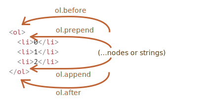

# 第一章：元素的属性（特性，Attribute，⭐）

## 1.1 概述

* 我们知道，一个元素除了有`开始标签`、`结束标签`、`文本内容`之外，还有很多`属性`（Attributes）。


* 其实，在 HTML 中我们也可以自定义属性（Attributes），如下：

```html
<!DOCTYPE html>
<html lang="en">
<head>
  <meta charset="UTF-8">
  <meta content="IE=edge" http-equiv="X-UA-Compatible">
  <meta content="width=device-width, initial-scale=1.0" name="viewport">
  <title>Title</title>
</head>
<body>
  <!-- 
    id、title、class 是全局属性
    而 name 和 age 是自定义属性
   -->
  <div age="18" class="box" id="abc" name="张三" title="box"></div>
  <a href="#">百度一下</a>

  <script>
    
  </script>
</body>
</html>
```

* 那么，我们可以将 HTML 标签的属性划分为如下两类：
  * 标准属性（Attribute）：HTML 标准制定的属性（Attribute），就称为标准属性，也称为全局属性，如：id、class、style 、title 等。
  * 自定义属性（Attribute）：不是 HTML 标准制定的属性（Attribute），就称为自定义属性，如上文代码中的 name 、age 等。

> 注意：
>
> * HTML 元素的`属性名`是`不区分大小写`的。
>
> * HTML 元素的`属性值`都是`字符串`！

* 浏览器在解析 HTML 元素的时候，会将`对应的属性（Attribute）`创建出来放到`对应的元素对象`上。
  * 如：id、class 就是全局的 attribute，会有对应的 id、class 属性；
  * 如：href 属性是针对 a 元素的，type、value 属性是针对 input 元素的；

## 1.2 元素属性（特性，Attribute）的操作

* 我们可以通过如下的属性和方法来操作元素的属性（特性，Attribute）：

```js
// 返回 attr 对象的集合，具有 name 和 value 属性
element.attributes
```

```js
// 判断该元素中是否包含指定名称的属性
element.hasAttribute(name)
```

```js
// 获取元素中指定名称的属性值
element.getAttribute(attributeName)
```

```js
// 根据给定的名称修改元素中的属性值
element.setAttribute(name, value)
```

```js
// 删除元素中指定名称的属性
element.removeAttribute(attrName)
```


* 示例：

```html
<!DOCTYPE html>
<html lang="en">
<head>
  <meta charset="UTF-8">
  <meta content="IE=edge" http-equiv="X-UA-Compatible">
  <meta content="width=device-width, initial-scale=1.0" name="viewport">
  <title>Title</title>
</head>
<body>
  <!--
    id、title、class 是全局属性
    而 name 和 age 是自定义属性
   -->
  <div age="18" class="box" id="abc" name="张三" title="box"></div>
  <a href="#">百度一下</a>

  <script>
    var boxEl = document.querySelector(".box")
    // 获取元素中的 attr 对象的集合
    for (let attribute of boxEl.attributes) {
      console.log(`属性名：${attribute.name}，属性值：${attribute.value}`)
    }

    // 判断该元素中是否包含指定名称的属性(Attribute)
    console.log(boxEl.hasAttribute("name")) // true

    // 获取元素中指定名称的属性值
    var nameAttributeValue = boxEl.getAttribute("name");
    console.log(nameAttributeValue) // 张三

    // 根据给定的名称修改元素中的属性值
    boxEl.setAttribute("name", "李四")
    nameAttributeValue = boxEl.getAttribute("name");
    console.log(nameAttributeValue) // 李四

    // 删除元素中指定名称的属性
    boxEl.removeAttribute("name")
    console.log(boxEl.hasAttribute("name")) // false

  </script>
</body>
</html>
```


# 第二章：元素的属性（Property，⭐）

## 2.1 概述

* 元素中的属性称为 Attribute ，而对象中的属性称为 Property；

```html
<!DOCTYPE html>
<html lang="en">
<head>
  <meta charset="UTF-8">
  <meta content="IE=edge" http-equiv="X-UA-Compatible">
  <meta content="width=device-width, initial-scale=1.0" name="viewport">
  <title>Title</title>
</head>
<body>
  <!--
      HTML 元素中的属性就是 Attribute
   -->
  <div age="18" class="box" id="abc" name="张三" title="box"></div>

  <script>
    // 对象中的属性是 Property
    var obj = {
      // name 和 age 是 Property
      name: "张三",
      age: 118
    }

  </script>
</body>
</html>
```

## 2.2 元素的属性（Property）的操作

* 可以通过直接访问`对象的属性（Property）`来`读取`和`修改` DOM 元素的`属性（Property）`，并且`标准元素属性（特性，Attribute）`就是`对象的属性（Property）`。

> 注意：除非特别情况，否则绝大多数，设置和获取属性的时候，推荐使用 Property ，因为它的值默认情况下是有类型的（主要针对于 checked 、selected 、hidden 等）。


* 示例：

```html
<!DOCTYPE html>
<html lang="en">
<head>
  <meta charset="UTF-8">
  <meta content="IE=edge" http-equiv="X-UA-Compatible">
  <meta content="width=device-width, initial-scale=1.0" name="viewport">
  <title>Title</title>
</head>
<body>
  <!--
      HTML 元素中的属性就是 Attribute
   -->
  <div age="18" class="box" id="abc" name="张三" title="box"></div>

  <input checked type="checkbox">

  <script>
    var boxEl = document.querySelector(".box")

    console.log(`title：${boxEl.title}`) // title：box

    var checkboxEl = document.querySelector("[type=checkbox]")
    console.log(`checked：${checkboxEl.checked}`) // checked：true
  </script>
</body>
</html>
```

## 2.3 元素的属性（特性，Attribute) VS 元素的属性（Property）

* 在 JavaScript 中，Attribute 和 Property是两个不同的概念。
* Attribute（属性）是 HTML 元素上定义的特性，它们以字符串的形式存在于 HTML 标签中。可以通过`getAttribute()` 和 `setAttribute()` 方法来`读取`和`修改` HTML 元素的属性。

```html
// id、type 和 value 都是元素的 Attribute 
<input id="myInput" type="text" value="Hello" >
```

* Property（属性）是 DOM 对象上的特性，它们以对象属性的形式存在于 DOM 对象中。可以通过`直接访问对象的属性`来`读取`和`修改`DOM元素的属性。

```js
// value 是 DOM 对象的 Property
const input = document.getElementById('myInput');
console.log(input.value); // 输出 "Hello"
input.value = "World";
console.log(input.value); // 输出 "World"
```

* 总结：
  * Attribute 是定义在 HTML 标签中的，而 Property 是定义在 DOM 对象上的。并且绝大多数情况下，标准的 Attribute 就是 Property 。
  * Attribute 的值始终是字符串，而 Property 的值可以是任意的 JavaScript 类型。
  * Attribute 可以通过getAttribute() 和 setAttribute() 方法来读取和修改，而 Property 可以通过直接访问对象的属性来读取和修改。
  * Attribute 是 HTML 规范中定义的，而 Property 是 JavaScript 语言中的概念。


# 第三章：HTML5 中的 `data-*` 自定义属性（⭐）

## 3.1 概述

* 推荐使用元素的属性（Property），即标准的元素的属性（Attribute），那么非标准的元素的属性（Attribute）能否也可以先使用元素的属性（Property）的方式来读取和修改呢？
* 当然可以，这就是 HTML5 的 `data-*` 自定义属性。

## 3.2 应用示例

* 示例：

```html
<!DOCTYPE html>
<html lang="en">
<head>
  <meta charset="UTF-8">
  <meta content="IE=edge" http-equiv="X-UA-Compatible">
  <meta content="width=device-width, initial-scale=1.0" name="viewport">
  <title>Title</title>
</head>
<body>

  <!--
    对于非标准的 HTML 属性（Attribute），可以使用 HTML5 的 data-* 来自定义属性
  -->
  <div class="box" data-age="18" data-name="张三" id="abc" title="box"></div>

  <script>
    var boxEl = document.querySelector(".box")
    console.log(`name`, boxEl.dataset.name)
    console.log(`age`, boxEl.dataset.age)
  </script>
</body>
</html>
```


# 第四章：JavaScript 动态修改样式（⭐）

## 4.1 概述

* 有的时候，我们需要通过 JavaScript 来动态修改元素的样式，有两种方案：
  * ① 先在 css 中编写对应的样式，通过 JavaScript `给 HTML 元素动态的添加 class` 。
  * ② 通过 JavaScript 动态的`修改 HTML 元素的 style 属性`。

* 开发中如何选择？
  * 在绝大多数情况下，如果可以动态修改 class 就能完成某个功能的话，更推荐`动态的添加 class`（处于性能的考虑，涉及到浏览器的回流和重绘等知识，后面讲解）。
  * 对于某些情况下，需要精准的修改某个 CSS 属性的值，那么就可以`修改 style 的属性`。

## 4.2 元素的 style 属性

* 如果需要单独修改某一个 CSS 属性，那么就可以通过 style 来操作，并且对于`多个词（multi-word）`属性，那么就使用使用`驼峰式（小驼峰）`。

```js
box.style.color = 'white'
box.style.backgroundColor = 'pink'
box.style.width = '200px'
box.style.height = '200px'
```

* 如果我们通过 `style` 将某种 CSS 的值设置为`空字符串`，那么会`使用 CSS 的默认样式`。

```js
box.style.display = ""
```


* 示例：

```html
<!DOCTYPE html>
<html lang="en">
<head>
  <meta charset="UTF-8">
  <meta content="IE=edge" http-equiv="X-UA-Compatible">
  <meta content="width=device-width, initial-scale=1.0" name="viewport">
  <title>Title</title>
  <style>
    div {
      transition: all 0.5s;
    }

    .box {
      width: 100px;
      height: 100px;
      background-color: orange;
    }

  </style>
</head>
<body>

  <div class="box">我是div元素</div>
  <button class="btn">按钮</button>

  <script>
    var btn = document.querySelector(".btn")
    var box = document.querySelector(".box")

    btn.onclick = function () {
      // 直接修改 style ，为什么这样使用，因为 style 是全局属性，所以 JavaScript 可以通过 Property 的形式来直接访问和修改
      box.style.color = 'white'
      box.style.backgroundColor = 'pink'
      box.style.width = '200px'
      box.style.height = '200px'

    }
  </script>

</body>
</html>
```


* 示例：

```html
<!DOCTYPE html>
<html lang="en">
<head>
  <meta charset="UTF-8">
  <meta content="IE=edge" http-equiv="X-UA-Compatible">
  <meta content="width=device-width, initial-scale=1.0" name="viewport">
  <title>Title</title>
  <style>
    div {
      transition: all 0.5s;
    }

  </style>
</head>
<body>

  <div class="box" style="display: none;width: 200px;height: 200px;background-color:pink;">我是div元素</div>
  <button class="btn">按钮</button>

  <script>
    var btn = document.querySelector(".btn")
    var box = document.querySelector(".box")

    btn.onclick = function () {
      // 如果我们通过 style 将某个 CSS 的属性值设置为 "" ，那么就会使用 CSS 的默认值；对于 div 来说，不就是 block 吗？
      box.style.display = ""
      console.log(box.style.display)
    }
  </script>

</body>
</html>
```

## 4.3 元素的 style 属性的特殊用法（了解）

* 如果是内联样式，是可以通过 `style.xxx` 的方式来读取和修改的；但是，对于内部样式表（style 标签中的 CSS 样式）和外部样式表（单独的 CSS  文件，通过 link 引入进来的 CSS 样式），`style.xxx` 的方式就无能为力了。
* 此时，我们可以通过 `getComputedStyle` 的全局函数来实现，并且只能读取，不能修改。


* 示例：

```html
<!DOCTYPE html>
<html lang="en">
<head>
  <meta charset="UTF-8">
  <meta content="IE=edge" http-equiv="X-UA-Compatible">
  <meta content="width=device-width, initial-scale=1.0" name="viewport">
  <title>Title</title>
  <style>
    div {
      transition: all 0.5s;
    }

    .box {
      display: none;
      width: 200px;
      height: 200px;
      background-color: pink;
    }
  </style>
</head>
<body>

  <div class="box">我是div元素</div>
  <button class="btn">按钮</button>

  <script>
    var btn = document.querySelector(".btn")
    var box = document.querySelector(".box")

    btn.onclick = function () {
      // 如果我们通过 style 将某个 CSS 的属性值设置为 "" ，那么就会使用 CSS 的默认值；对于 div 来说，不就是 block 吗？
      console.log(getComputedStyle(box).display);
    }
  </script>

</body>
</html>
```

## 4.4 元素的 className 和 classList

* 元素的 `class Attribute`，对应的 `Property` 并非叫 `class`，而是 `className`：
  * 这是因为 JavaScript 早期是不允许使用 class 这种关键字来作为对象的属性，所以 DOM 规范使用了 className （JSX 也是类似的做法）；
  * 虽然现在 JavaScript 已经没有这样的限制，但是并不推荐，并且依然在使用 `className` 这个名称。
* 我们可以使用 className 进行赋值，它会替换整个类中的字符串：

```js
box.className = 'active'
```

* 但是，如果我们需要添加和移除某个 class ，就需要使用 classList 属性了，有如下的方法：

```js
// 添加一个类
element.classList.add (class)
```

```js
// 移除类
element.classList.remove (class)
```

```js
// 如果类不存在就添加类，存在就移除它
element.classList.toggle (class)
```

```js
// 检查给定类，返回 true/false
element.classList.contains(class)
```

* 并且 element.classList 是可迭代对象，可以使用 for...of 来进行遍历。


* 示例：

```html
<!DOCTYPE html>
<html lang="en">
<head>
  <meta charset="UTF-8">
  <meta content="IE=edge" http-equiv="X-UA-Compatible">
  <meta content="width=device-width, initial-scale=1.0" name="viewport">
  <title>Title</title>
  <style>
    div {
      transition: all 0.5s;
    }

    .box {
      width: 100px;
      height: 100px;
      background-color: orange;
    }

    .active {
      width: 200px;
      height: 200px;
      background-color: pink;
      color: white;
    }
  </style>
</head>
<body>

  <div class="box">我是div元素</div>
  <button class="btn">按钮</button>

  <script>
    var btn = document.querySelector(".btn")
    var box = document.querySelector(".box")

    btn.onclick = function () {
      box.className = 'active'
    }
  </script>

</body>
</html>
```


* 示例：

```html
<!DOCTYPE html>
<html lang="en">
<head>
  <meta charset="UTF-8">
  <meta content="IE=edge" http-equiv="X-UA-Compatible">
  <meta content="width=device-width, initial-scale=1.0" name="viewport">
  <title>Title</title>
  <style>
    div {
      transition: all 0.5s;
    }

    .box {
      width: 100px;
      height: 100px;
      background-color: orange;
    }

    .active {
      width: 200px;
      height: 200px;
    }
  </style>
</head>
<body>

  <div class="box">我是div元素</div>
  <button class="btn">按钮</button>

  <script>
    var btn = document.querySelector(".btn")
    var box = document.querySelector(".box")

    btn.onclick = function () {
      box.classList.toggle('active')
    }
  </script>

</body>
</html>
```


# 第五章：手动操作 DOM

## 5.1 概述

* 其实，之前我们使用过 `innerHTML` 来将字符串中的内容渲染到页面上，如：

```html
<!DOCTYPE html>
<html lang="en">
<head>
  <meta charset="UTF-8">
  <meta content="IE=edge" http-equiv="X-UA-Compatible">
  <meta content="width=device-width, initial-scale=1.0" name="viewport">
  <title>Title</title>
  <style>
    .box {
      width: 100px;
      height: 100px;
      background-color: orange;
    }

    .active {
      background-color: pink;
    }
  </style>
</head>
<body>

  <div class="box"></div>

  <script>
    var boxEl = document.querySelector(".box")

    boxEl.innerHTML = `<h2 class="title">我是标题</h2>`

    setTimeout(() => {
      var h2El = document.querySelector(".title")
      h2El.classList.add("active")
    }, 2000)
  </script>

</body>
</html>
```

* 当然，实际开发中，我们更`推荐`使用 `原生的 DOM API` 来操作 DOM 元素等内容，如：

```html
<!DOCTYPE html>
<html lang="en">
<head>
  <meta charset="UTF-8">
  <meta content="IE=edge" http-equiv="X-UA-Compatible">
  <meta content="width=device-width, initial-scale=1.0" name="viewport">
  <title>Title</title>
  <style>
    .box {
      width: 200px;
      height: 200px;
      background-color: orange;
    }

    .active {
      background-color: pink;
    }
  </style>
</head>
<body>

  <div class="box">
    <p>我是p元素</p>
  </div>

  <script>
    /* 推荐使用 DOM 操作的 API 来插入元素 */
    var boxEl = document.querySelector(".box")

    // 创建一个 DOM 元素
    var h2El = document.createElement("h2")
    h2El.classList.add("title", "active")
    h2El.textContent = "我是h2元素"

    // 将元素插入到 boxEl 中的最后一个位置
    boxEl.append(h2El)

  </script>

</body>
</html>
```

* 原因如下：
  * ① 安全性问题：使用 innerHTML 插入的内容会被浏览器解析为 HTML 代码，并执行其中的脚本。如果插入的内容来自用户输入或不受信任的来源，可能会导致 XSS 攻击等安全问题。
  * ② 性能问题：使用 innerHTML 会导致浏览器重新解析整个 HTML 结构，重新构建 DOM 树，这个过程比较耗时。而使用原生的 DOM API，如 createElement、append 等，可以更精确地控制插入位置和方式，减少不必要的 DOM 重构，提高性能。
  * ③ 代码可维护性问题：使用 innerHTML 插入大段的 HTML 代码会使代码结构变得混乱，难以维护。而使用原生的 DOM API，可以更好地组织代码，提高可读性和可维护性。
  * ④ 丢失事件处理程序：使用 innerHTML 插入元素时，如果已经为某些元素绑定了事件处理程序，那么这些事件处理程序会丢失，需要重新绑定。而使用原生的 DOM API ，可以避免这个问题。

* 总结：虽然 innerHTML 在某些情况下使用起来更方便，但在大多数情况下，为了安全性、性能和代码可维护性考虑，推荐使用原生的 DOM API 来操作 DOM 元素等内容。

> 注意：现在的 WEB 前端开发中（React、Angular、Vue 等），其实已经不会这么开发的，是声明式编程；而手动操作 DOM 的方式（命令式编程）会引起很多问题（性能等）；但是，现在的 WEB 框架的底层还是需要使用 DOM 操作的 API 来操作 DOM 元素等内容。

## 5.2 创建元素

* 通常我们想要向页面中插入一个元素，会有如下的步骤：
  * ① 创建一个元素（内存中）。
  * ② 将元素（内存中）插入到 DOM 的某一个位置。
* 创建元素：

```js
var element = document.createElement("tag名称")
```


* 示例：

```html
<!DOCTYPE html>
<html lang="en">
<head>
  <meta charset="UTF-8">
  <meta content="IE=edge" http-equiv="X-UA-Compatible">
  <meta content="width=device-width, initial-scale=1.0" name="viewport">
  <title>Title</title>
  <style>
    .box {
      width: 200px;
      height: 200px;
      background-color: orange;
    }

    .active {
      background-color: pink;
    }
  </style>
</head>
<body>

  <div class="box">
    <p>我是p元素</p>
  </div>

  <script>
    /* 推荐使用原生 DOM API 来插入元素 */
    var boxEl = document.querySelector(".box")

    // 创建一个 DOM 元素，在内存中
    var h2El = document.createElement("h2")
    h2El.classList.add("title", "active")
    h2El.textContent = "我是h2元素"

    // 将内存中的元素插入到 boxEl 中的最后一个位置
    boxEl.append(h2El)

  </script>

</body>
</html>
```

## 5.3 插入元素

* 插入元素的方式有很多，如下：

```js
// 在 node 末尾插入节点或字符串，后代元素
node.append(...nodes: (Node | string)[]): void;
```

```js
// 在 node 开头插入节点或字符串，后代元素
node.prepend(...nodes: (Node | string)[]): void;
```

```js
// 在 node 后面插入节点或字符串，兄弟元素
node.after(...nodes: (Node | string)[]): void;
```

```js
// 在 node 前面插入节点或字符串，兄弟元素
node.before(...nodes: (Node | string)[]): void;
```

```js
// 将 node 替换为给定的节点或字符串
node.replaceWith(...nodes: (Node | string)[]): void;
```

* 其图例如下：




* 示例：

```html
<!DOCTYPE html>
<html lang="en">
<head>
  <meta charset="UTF-8">
  <meta content="IE=edge" http-equiv="X-UA-Compatible">
  <meta content="width=device-width, initial-scale=1.0" name="viewport">
  <title>Title</title>
  <style>
    .box {
      width: 200px;
      height: 200px;
      background-color: orange;
    }

    .active {
      background-color: pink;
    }
  </style>
</head>
<body>

  <div class="box">
    <p>我是p元素</p>
  </div>

  <script>
    /* 推荐使用原生 DOM API 来插入元素 */
    var boxEl = document.querySelector(".box")

    // 创建一个 DOM 元素，在内存中
    var h2El = document.createElement("h2")
    h2El.classList.add("title", "active")
    h2El.textContent = "我是h2元素"

    // 将内存中的元素插入到 boxEl 中的最后一个位置
    boxEl.append(h2El)

  </script>

</body>
</html>
```


* 示例：

```html
<!DOCTYPE html>
<html lang="en">
<head>
  <meta charset="UTF-8">
  <meta content="IE=edge" http-equiv="X-UA-Compatible">
  <meta content="width=device-width, initial-scale=1.0" name="viewport">
  <title>Title</title>
  <style>
    .box {
      width: 200px;
      height: 200px;
      background-color: orange;
    }

    .active {
      background-color: pink;
    }
  </style>
</head>
<body>

  <div class="box">
    <p>我是p元素</p>
  </div>

  <script>
    /* 推荐使用原生 DOM API 来插入元素 */
    var boxEl = document.querySelector(".box")

    // 创建一个 DOM 元素，在内存中
    var h2El = document.createElement("h2")
    h2El.classList.add("title", "active")
    h2El.textContent = "我是h2元素"

    // 将内存中的元素插入到 boxEl 中的最前面一个位置
    boxEl.prepend(h2El)

  </script>

</body>
</html>
```


* 示例：

```html
<!DOCTYPE html>
<html lang="en">
<head>
  <meta charset="UTF-8">
  <meta content="IE=edge" http-equiv="X-UA-Compatible">
  <meta content="width=device-width, initial-scale=1.0" name="viewport">
  <title>Title</title>
  <style>
    .box {
      width: 200px;
      height: 200px;
      background-color: orange;
    }

    .active {
      background-color: pink;
    }
  </style>
</head>
<body>

  <div class="box">
    <p>我是p元素</p>
  </div>

  <script>
    /* 推荐使用原生 DOM API 来插入元素 */
    var boxEl = document.querySelector(".box")

    // 创建一个 DOM 元素，在内存中
    var h2El = document.createElement("h2")
    h2El.classList.add("title", "active")
    h2El.textContent = "我是h2元素"

    // 将内存中的元素放到 boxEl 中的前面一个位置
    boxEl.before(h2El)

  </script>

</body>
</html>
```


* 示例：

```html
<!DOCTYPE html>
<html lang="en">
<head>
  <meta charset="UTF-8">
  <meta content="IE=edge" http-equiv="X-UA-Compatible">
  <meta content="width=device-width, initial-scale=1.0" name="viewport">
  <title>Title</title>
  <style>
    .box {
      width: 200px;
      height: 200px;
      background-color: orange;
    }

    .active {
      background-color: pink;
    }
  </style>
</head>
<body>

  <div class="box">
    <p>我是p元素</p>
  </div>

  <script>
    /* 推荐使用原生 DOM API 来插入元素 */
    var boxEl = document.querySelector(".box")

    // 创建一个 DOM 元素，在内存中
    var h2El = document.createElement("h2")
    h2El.classList.add("title", "active")
    h2El.textContent = "我是h2元素"

    // 将内存中的元素放到 boxEl 中的后面一个位置
    boxEl.after(h2El)

  </script>

</body>
</html>
```


* 示例：

```html
<!DOCTYPE html>
<html lang="en">
<head>
  <meta charset="UTF-8">
  <meta content="IE=edge" http-equiv="X-UA-Compatible">
  <meta content="width=device-width, initial-scale=1.0" name="viewport">
  <title>Title</title>
  <style>
    .box {
      width: 200px;
      height: 200px;
      background-color: orange;
    }

    .active {
      background-color: pink;
    }
  </style>
</head>
<body>

  <div class="box">
    <p>我是p元素</p>
  </div>

  <script>
    /* 推荐使用原生 DOM API 来插入元素 */
    var boxEl = document.querySelector(".box")

    // 创建一个 DOM 元素，在内存中
    var h2El = document.createElement("h2")
    h2El.classList.add("title", "active")
    h2El.textContent = "我是h2元素"

    // 替换元素
    boxEl.replaceWith(h2El)

  </script>

</body>
</html>
```

## 5.4 移除元素

* 移除元素可以调用元素自身的 remove 方法：

```js
node.remove()
```

> 注意：该方法和 hidden 属性不一样；会将 DOM 节点从 DOM 树中删除。


* 示例：

```html
<!DOCTYPE html>
<html lang="en">
<head>
  <meta charset="UTF-8">
  <meta content="IE=edge" http-equiv="X-UA-Compatible">
  <meta content="width=device-width, initial-scale=1.0" name="viewport">
  <title>Title</title>
  <style>
    .box {
      width: 200px;
      height: 200px;
      background-color: pink;
    }
  </style>
</head>
<body>

  <div class="box"></div>
  <button class="btn">按钮</button>

  <script>
    // 获取 box 元素
    var boxEl = document.querySelector(".box")
    // 获取按钮元素
    var btnEl = document.querySelector(".btn")
    // 添加点击事件
    btnEl.onclick = function () {
      boxEl.remove()
    }
  </script>

</body>
</html>
```

## 5.5 复制元素

* 复制元素可以通过 cloneNode 方法实现：

```js
node.cloneNode(boolean)
```

* 参数说明：如果参数为 true ，则表示深度复制（会一起复制对应的子元素），默认值是 false 。


* 示例：

```html
<!DOCTYPE html>
<html lang="en">
<head>
  <meta charset="UTF-8">
  <meta content="IE=edge" http-equiv="X-UA-Compatible">
  <meta content="width=device-width, initial-scale=1.0" name="viewport">
  <title>Title</title>
  <style>
    .box {
      width: 200px;
      height: 200px;
      background-color: pink;
    }
  </style>
</head>
<body>

  <div class="box">
    <p>我是p元素</p>
  </div>
  <button class="btn">按钮</button>

  <script>
    // 获取 box 元素
    var boxEl = document.querySelector(".box")
    // 获取按钮元素
    var btnEl = document.querySelector(".btn")
    // 获取 body 元素
    var bodyEl = document.body
    // 添加点击事件
    btnEl.onclick = function () {
      // 复制元素
      var cloneEl = boxEl.cloneNode()
      // 插入到页面上
      bodyEl.append(cloneEl)
    }
  </script>

</body>
</html>
```


* 示例：

```html
<!DOCTYPE html>
<html lang="en">
<head>
  <meta charset="UTF-8">
  <meta content="IE=edge" http-equiv="X-UA-Compatible">
  <meta content="width=device-width, initial-scale=1.0" name="viewport">
  <title>Title</title>
  <style>
    .box {
      width: 200px;
      height: 200px;
      background-color: pink;
    }
  </style>
</head>
<body>

  <div class="box">
    <p>我是p元素</p>
  </div>
  <button class="btn">按钮</button>

  <script>
    // 获取 box 元素
    var boxEl = document.querySelector(".box")
    // 获取按钮元素
    var btnEl = document.querySelector(".btn")
    // 获取 body 元素
    var bodyEl = document.body
    // 添加点击事件
    btnEl.onclick = function () {
      // 复制元素（深度复制）
      var cloneEl = boxEl.cloneNode(true)
      // 插入到页面上
      bodyEl.append(cloneEl)
    }
  </script>

</body>
</html>
```


# 第六章：元素的大小和滚动

## 6.1 理清概念

* 在 DOM 中，`client` 表示`元素`的`可见区域`，即`元素`的`内部内容部分`。换言之，`clientWidth` 表示`元素内部区域`的`宽度`，`不`包括`元素`的`边框`和`滚动条`（会受到 box-sizing 的影响）。
* 在 DOM 中，`offset`（在英文中的翻译就是`偏移量`） 表示`元素`在文档中的`位置`和`尺寸`，它包括元素的`内容`、`内边距`、`边框`以及`滚动条`（如果有）。换言之，`offsetWidth` 可以用来获取`元素`在文档中的`总宽度`，包括了`所有可见的部分`（会受到 box-sizing 的影响）。

## 6.2 概述

* 有的时候，我们需要通过 JavaScript 来获取元素的大小和滚动等信息，此时就需要 clientWidth 、clientHeight 等属性了，如下所示：


* 元素的可见区域：
  * `clientWidth`：contentWith + padding（不包含滚动条）。
  * `clientHeight`：contentHeight + padding。
  * ~~`clientTop`：border-top 的宽度~~（开发中，很少使用）。
  * ~~`clientLeft`：border-left 的宽度~~（开发中，很少使用）。
* 元素在文档中的位置和尺寸，包括所有可见部分：
  * `offsetWidth`：元素完整的宽度。
  * `offsetHeight`：元素完整的高度。
  * `offsetLeft`：距离父元素的 x 。
  * `offsetTop`：距离父元素的 y 。
* 滚动条部分：
  * `scrollTop`：滚动部分的高度。
  * `scrollHeight`：整个可滚动的区域高度。

## 6.3 应用示例

* 示例：

```html
<!DOCTYPE html>
<html lang="en">
<head>
  <meta charset="UTF-8">
  <meta content="IE=edge" http-equiv="X-UA-Compatible">
  <meta content="width=device-width, initial-scale=1.0" name="viewport">
  <title>Title</title>
  <style>
    body {
      height: 2000px;
    }

    .box {
      width: 200px;
      height: 200px;
      padding: 20px;
      border: 20px solid red;
      background-color: pink;
      overflow: auto;
    }
  </style>
</head>
<body>

  <div class="box">
    Java 是一种通用的、高级的编程语言，它在许多方面都有一些优点和特点：
    1. 跨平台性： Java 是一种跨平台的语言，一次编写多处运行。Java 程序可以在任何支持 Java 虚拟机 (JVM) 的平台上运行，如
    Windows、macOS、Linux 等，而不需要修改代码。
    2. 面向对象： Java 是一种面向对象的编程语言，这意味着它支持面向对象的设计原则，如封装、继承和多态，使得代码更加结构化、可维护和可扩展。
    3. 安全性： Java 对安全性有很高的重视，它提供了安全管理机制和运行时环境，可以防止潜在的安全漏洞，使得 Java
    应用程序在网络环境中更为安全。
    4. 大型社区和库： Java 拥有庞大的开发者社区和丰富的第三方库和框架，这些资源使得 Java 开发更加高效，并且可以快速解决常见的问题。
    5. 多用途： Java 可以用于构建各种类型的应用程序，包括桌面应用程序、Web 应用程序、移动应用程序、企业级应用程序等。
    然而，Java 也有一些缺点：
    1. 冗长的语法： Java 的语法相对较为冗长，编写代码时可能需要更多的代码行数，这可能使得一些任务变得相对繁琐。
    2. 较慢的执行速度： 相对于一些编译型语言，Java 的执行速度可能较慢。虽然 Java 程序的性能在不断提升，但在某些高性能要求的场景中可能不是最佳选择。
    3. 内存消耗： Java 应用程序的内存消耗较大，尤其是在启动时，因为需要加载 JVM 和运行时库。
    4. 学习曲线： 对于完全没有编程经验的初学者来说，Java 可能有一定的学习曲线，特别是对于理解面向对象的概念和一些高级特性。
    总的来说，Java
    是一门功能强大且广泛使用的编程语言，在许多应用领域都表现优异。但是否适合你的项目取决于你的需求、团队的技能水平以及项目的特点。对于特定的情况，也可以考虑其他编程语言的优势和特点。最终，选择一门编程语言时应该根据实际情况来决定。
  </div>

  <script>
    var boxEl = document.querySelector(".box")

    console.log(`box的width：${getComputedStyle(boxEl).width}`)
    console.log(`box的height：${getComputedStyle(boxEl).height}`)

    console.log(`clientWidth：${boxEl.clientWidth}`) // 223
    console.log(`clientHeight：${boxEl.clientHeight}`) // 240
    console.log(`clientTop：${boxEl.clientTop}`) // 20
    console.log(`clientLeft：${boxEl.clientLeft}`) // 20


    console.log(`offsetWidth：${boxEl.offsetWidth}`) // 280
    console.log(`offsetHeight：${boxEl.offsetHeight}`) // 280
    console.log(`offsetLeft：${boxEl.offsetLeft}`) // 8
    console.log(`offsetTop：${boxEl.offsetTop}`) // 8


    console.log(`scrollTop：${boxEl.scrollTop}`) // 0
    console.log(`scrollHeight：${boxEl.scrollHeight}`) // 1447

  </script>

</body>
</html>
```


# 第七章：window 的大小和滚动

## 7.1 概述

* window 的 width 和 height ：
  * innerWidth、innerHeight：获取 window 窗口的宽度和高度（包含滚动条）。
  * outerWidth、outerHeight：获取 window 窗口的整个宽度和高度（包括调试工具、工具栏）。
  * documentElement.clientHeight、documentElement.clientWidth：获取 html 的宽度和高度（不包含滚动条）
* window 的滚动位置：
  * scrollX：X 轴滚动的位置（别名pageXOffset）
  *  scrollY：Y 轴滚动的位置（别名pageYOffset）
* window 的滚动方法：
  * `scrollBy(x,y)` ：将页面滚动至相对于当前位置的 (x, y) 位置；
  * `scrollTo(pageX,pageY)` ：将页面滚动至绝对坐标；

## 7.2 应用示例

* 示例：

```html
<!DOCTYPE html>
<html lang="en">
<head>
  <meta charset="UTF-8">
  <meta content="IE=edge" http-equiv="X-UA-Compatible">
  <meta content="width=device-width, initial-scale=1.0" name="viewport">
  <title>Title</title>
  <style>
    * {
      margin: 0;
      padding: 0;
      box-sizing: border-box;
      background-color: #f5f5f5;
    }

    a {
      text-decoration: none;
    }

    .back-to-top {
      position: fixed;
      display: none;
      right: 20px;
      bottom: 20px;
      width: 50px;
      height: 50px;
      background-color: #fff;
      color: #000;
      cursor: pointer;
      font-size: 10px;
      border-radius: 5px;
      text-align: center;
      line-height: 80px;
      transition: all 1s;
    }

    .back-to-top::before {
      position: absolute;
      transform: translateX(-50%);
      left: 50%;
      content: '';
      display: block;
      width: 0;
      height: 0;
      border-left: 5px solid transparent;
      border-right: 5px solid transparent;
      border-bottom: 10px solid red;
    }

  </style>
</head>
<body>

  <br> <br> <br> <br> <br> <br> <br> <br> <br> <br> <br> <br> <br> <br> <br>
  <br> <br> <br> <br> <br> <br> <br> <br> <br> <br> <br> <br> <br> <br> <br>
  <br> <br> <br> <br> <br> <br> <br> <br> <br> <br> <br> <br> <br> <br> <br>
  <br> <br> <br> <br> <br> <br> <br> <br> <br> <br> <br> <br> <br> <br> <br>
  <br> <br> <br> <br> <br> <br> <br> <br> <br> <br> <br> <br> <br> <br> <br>
  <br> <br> <br> <br> <br> <br> <br> <br> <br> <br> <br> <br> <br> <br> <br>
  <br> <br> <br> <br> <br> <br> <br> <br> <br> <br> <br> <br> <br> <br> <br>
  <br> <br> <br> <br> <br> <br> <br> <br> <br> <br> <br> <br> <br> <br> <br>
  <br> <br> <br> <br> <br> <br> <br> <br> <br> <br> <br> <br> <br> <br> <br>
  <br> <br> <br> <br> <br> <br> <br> <br> <br> <br> <br> <br> <br> <br> <br>
  <br> <br> <br> <br> <br> <br> <br> <br> <br> <br> <br> <br> <br> <br> <br>
  <br> <br> <br> <br> <br> <br> <br> <br> <br> <br> <br> <br> <br> <br> <br>
  <br> <br> <br> <br> <br> <br> <br> <br> <br> <br> <br> <br> <br> <br> <br>
  <br> <br> <br> <br> <br> <br> <br> <br> <br> <br> <br> <br> <br> <br> <br>
  <br> <br> <br> <br> <br> <br> <br> <br> <br> <br> <br> <br> <br> <br> <br>
  <br> <br> <br> <br> <br> <br> <br> <br> <br> <br> <br> <br> <br> <br> <br>
  <br> <br> <br> <br> <br> <br> <br> <br> <br> <br> <br> <br> <br> <br> <br>
  <br> <br> <br> <br> <br> <br> <br> <br> <br> <br> <br> <br> <br> <br> <br>
  <br> <br> <br> <br> <br> <br> <br> <br> <br> <br> <br> <br> <br> <br> <br>

  <a class="back-to-top" href="#" title="回到顶部">回到顶部</a>

  <script>
    var backToTopEl = document.querySelector(".back-to-top")

    window.addEventListener('scroll', () => {
      var scrollY = window.scrollY
      if (scrollY >= 500) {
        backToTopEl.style.display = 'block'
      } else {
        backToTopEl.style.display = 'none'
      }
    })

    backToTopEl.addEventListener('click', () => {
      window.scrollTo(0, 0)
    })

  </script>

</body>
</html>
```

