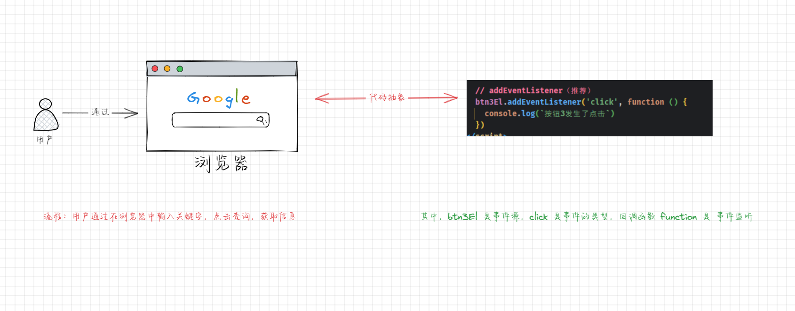
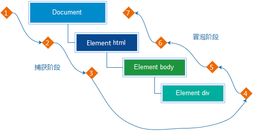
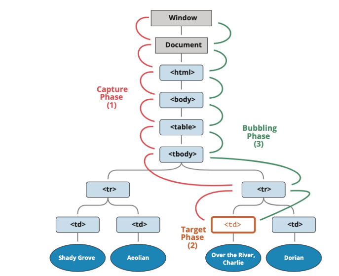

# 第一章：认识事件处理

## 1.1 认识事件处理

* 在 WEB 页面中经常需要`和用户进行交互`，而在交互的过程中我们可能需要`捕获这个交互的过程`，如：用户`点击`了某个按钮，用户在输入框中`输入`了某个文本，用户的鼠标`经过`了某个位置。
* 此时，浏览器就需要搭建一条 `JavaScript 代码`和`事件`之间的桥梁。当某个`事件`发生的时候，让 JavaScript 可以`响应`（执行某个函数），所以我们就需要针对`事件`编写`处理程序`（在 JavaScript 中就是回调函数）。

## 1.2 事件监听相关概念

### 1.2.1 什么是事件（类型）？

* 事件（类型）是在编程时系统内发生的 `动作` 或者发生的 `事情` ，如：用户在网页上 `单击` 了一个按钮。

### 1.2.2 什么是事件监听？

* 事件监听就是让程序`监听`是否有事件产生，一旦有事件触发，就立即`调用一个函数`做出响应，也称为 `注册事件` 。

> 注意：其实，调用的函数就是事件处理了。

### 1.2.3 什么是事件源（Event Source）？

* 事件源（Event Source）就是产生事件的对象或组件，如：用户在网页上 单击了一个`按钮`。

### 1.2.4 什么是事件处理（Event Handling）？

* 事件处理（Event Handling）就是对事件进行相应的处理操作，如：用户在网页上单击了一个按钮，系统调用了`指定的函数`，并进行了响应。

## 1.3 事件监听的三要素（⭐）

* 事件监听的三要素：
  * ① 事件源（Event Source）：事件源是指触发事件的元素或对象。它是产生事件的来源，当特定的行为或交互发生时，事件源会触发相应的事件。在前端开发中，事件源可以是页面中的DOM元素，如：按钮、文本框等。
  * ② 事件类型（Event Type）：事件类型指的是特定的事件，如点击事件、鼠标移入事件、键盘按键事件等。当事件源触发了某种类型的事件时，相应的事件处理程序会被执行。不同的事件类型对应着不同的用户行为或操作。
  * ③ 事件处理程序（Event Handler）：事件处理程序是在事件发生后要执行的代码块或函数。它定义了当特定事件发生时，应该采取的操作或响应。在前端开发中，开发人员可以为特定的事件源和事件类型绑定相应的事件处理程序，以实现用户交互的功能和逻辑。

* 其图示如下：



> 注意：`事件监听`是一种机制，用于在特定的事件发生时，`触发相应的事件处理程序`。通过事件监听，我们可以监测特定的用户行为，例如：点击按钮、鼠标移入、键盘按键等，然后在事件发生时执行相应的处理逻辑。


* 示例：

```
// 按钮 ==> 事件源
// 点击 ==> 事件（类型）
// 页面弹出提示框，==> 事件处理
用户点击了按钮，页面弹出提示框
```


* 示例：

```
// 某个元素 ==> 事件源
// 滑过 ==> 事件（类型）
// 元素的颜色变为红色 ==> 事件处理
用户鼠标滑过某个元素，元素的颜色变为红色
```

## 1.4 事件监听的方式（⭐）

* 事件监听有三种方式：
  * ① 直接在 HTML 中编写 JavaScript 代码（很少使用）。
  * ② 通过元素的 on 属性来监听事件。
  * ③ 通过 EventTarget 的 addEventListener 来监听事件（推荐）。


* 示例：

```html
<!DOCTYPE html>
<html lang="en">
<head>
  <meta charset="UTF-8">
  <meta content="IE=edge" http-equiv="X-UA-Compatible">
  <meta content="width=device-width, initial-scale=1.0" name="viewport">
  <title>Title</title>
</head>
<body>
  <!-- 直接在 HTML 中编写 JavaScript 代码（了解） -->
  <button onclick="console.log(`按钮1发生了点击`)">按钮1</button>
  <button class="btn2">按钮2</button>
  <button class="btn3">按钮3</button>

  <script>
    // 获取元素
    var btn2El = document.querySelector(".btn2")
    var btn3El = document.querySelector(".btn3")

    // onclick 属性
    btn2El.onclick = function () {
      console.log(`按钮2发生了点击`)
    }

    // addEventListener（推荐）
    btn3El.addEventListener('click', function () {
      console.log(`按钮3发生了点击`)
    })
  </script>

</body>
</html>
```


# 第二章：事件冒泡和事件捕获（⭐）

## 2.1 认识事件流

* 在 HTML 中，元素的嵌套太常见了，当我们点击一个子元素的时候，那么它的父元素会不会也触发点击事件，这就是事件流的一种。


* 事件流是指描述事件在DOM结构中传播和触发的过程。在浏览器中，事件流分为三个阶段：捕获阶段、目标阶段和冒泡阶段。


* 示例：

```html
<!DOCTYPE html>
<html lang="en">
<head>
  <meta charset="UTF-8">
  <meta content="IE=edge" http-equiv="X-UA-Compatible">
  <meta content="width=device-width, initial-scale=1.0" name="viewport">
  <title>Title</title>
  <style>
    .box {
      display: flex;
      justify-content: center;
      align-items: center;
      width: 200px;
      height: 200px;
      background-color: red;
    }

    .box .inner {
      width: 100px;
      height: 100px;
      background-color: orange;
    }
  </style>
</head>
<body>

  <div class="box">
    <div class="inner"></div>
  </div>

  <script>
    // 获取元素
    var boxEl = document.querySelector(".box")
    var innerEl = document.querySelector(".inner")
    var bodyEl = document.body
    // // 添加事件，默认情况下是事件冒泡
    boxEl.addEventListener("click", function () {
      console.log("box被点击了")
    })
    innerEl.addEventListener("click", function () {
      console.log("inner被点击了")
    })
    bodyEl.addEventListener("click", function () {
      console.log("body被点击了")
    })
  </script>
</body>
</html>
```

## 2.2 事件捕获和事件冒泡

* `事件捕获`和`事件冒泡`是事件在 DOM 结构中传播的两种不同方式。
  * 事件捕获（Event Capturing）：事件从文档根节点开始向目标元素传播的过程。在捕获阶段，事件会经过 DOM 树的上层节点，直到达到目标元素的父级节点。事件捕获阶段是一种从外向内的传播方式。
  * 事件冒泡（Event Bubbling）：事件从目标元素开始向文档根节点传播的过程。在冒泡阶段，事件会经过目标元素的父级节点，直到达到文档根节点。事件冒泡阶段是一种从内向外的传播方式。
* `事件捕获`和`事件冒泡`是事件流的两个阶段，它们的传播顺序是先捕获后冒泡。在事件传播过程中，可以通过事件处理函数对事件进行捕获、处理和阻止传播。



* 为什么出现两种不同的事件流方式？
  * 这是因为在早期浏览器开发的时候，不管是 `IE` 还是 `Netscape` 都发现了这个问题。
  * 但是，他们采用了`完全相反`的`事件流`来`对事件进行了传递`。
  * `IE` 采用了`事件冒泡`的方式，`Netscape` 采用了`事件捕获`的方式。


* 示例：

```html
<!DOCTYPE html>
<html lang="en">
<head>
  <meta charset="UTF-8">
  <meta content="IE=edge" http-equiv="X-UA-Compatible">
  <meta content="width=device-width, initial-scale=1.0" name="viewport">
  <title>Title</title>
  <style>
    .box {
      display: flex;
      justify-content: center;
      align-items: center;
      width: 200px;
      height: 200px;
      background-color: red;
    }

    .box .inner {
      width: 100px;
      height: 100px;
      background-color: orange;
    }
  </style>
</head>
<body>

  <div class="box">
    <div class="inner"></div>
  </div>

  <script>
    // 获取元素
    var boxEl = document.querySelector(".box")
    var innerEl = document.querySelector(".inner")
    var bodyEl = document.body
    // // 添加事件，默认情况下是事件冒泡
    boxEl.addEventListener("click", function () {
      console.log("box被点击了")
    })
    innerEl.addEventListener("click", function () {
      console.log("inner被点击了")
    })
    bodyEl.addEventListener("click", function () {
      console.log("body被点击了")
    })
    // 添加事件，可以设置为事件捕获
    boxEl.addEventListener("click", function () {
      console.log("box被点击了")
    }, true)
    innerEl.addEventListener("click", function () {
      console.log("inner被点击了")
    }, true)
    bodyEl.addEventListener("click", function () {
      console.log("body被点击了")
    }, true)
  </script>
</body>
</html>
```

## 2.3 事件捕获和事件冒泡的过程

* 在浏览器中，事件流分为三个阶段：捕获阶段、目标阶段和冒泡阶段。

  * ① 捕获阶段（Capture Phase）：事件从文档根节点开始向目标元素传播的过程。在捕获阶段，事件会经过DOM树的上层节点，直到达到目标元素的父级节点。
  * ② 目标阶段（Target Phase）：事件到达目标元素后触发的阶段。在目标阶段，事件会在目标元素上进行处理。
  * ③ 冒泡阶段（Bubble Phase）：事件从目标元素开始向文档根节点传播的过程。在冒泡阶段，事件会经过目标元素的父级节点，直到达到文档根节点。

* 事件流的传播顺序是先捕获后冒泡。即事件先经过捕获阶段，然后在目标阶段触发，最后在冒泡阶段向上冒泡。在事件流的过程中，可以通过事件处理函数对事件进行捕获、处理和阻止传播。



> 注意：在开发中，我们通常只需使用`事件冒泡`即可，`很少使用事件捕获`。


# 第三章：事件对象 event（⭐）

## 3.1 概述

* 当一个事件发生的时候，就会有和这个事件有关的许多信息。
  * 如：这个事件的`类型`是什么，点击的`元素`是`哪个`，点击的`位置`又是`什么`。
  * 诸如此类的信息都会被封装到 `Event` 对象中，并且该对象是`由浏览器创建`的，也可以称为 event 对象。
  * 然后，通过`事件处理程序（回调函数）`中的`参数`传递给`我们`，以便我们对需要的数据进行处理。
* 如何获取这个 event 对象？
  * `event` 对象会在`传入的事件处理（event handler）函数回调`时，被`系统`传入；
  * 我们可以在`回调函数`中拿到这个 `event` 对象。

```js
boxEl.addEventListener('click',function(event){
     // event 就是事件对象                  
})
```

## 3.2 event 的常见属性和方法

* 常见属性：
  * `target`：当前事件发生的元素。
  * `currentTarget`：当前处理事件的元素。
* 常见方法：
  * `preventDefault()`：取消事件的默认行为。
  * `stopPropagation()` ：阻止事件的进一步传递（冒泡或者捕获都可以阻止）。


* 示例：

```html
<!DOCTYPE html>
<html lang="en">
<head>
  <meta charset="UTF-8">
  <meta content="IE=edge" http-equiv="X-UA-Compatible">
  <meta content="width=device-width, initial-scale=1.0" name="viewport">
  <title>Title</title>
  <style>
    .box {
      width: 200px;
      height: 200px;
      background-color: pink;
    }
  </style>
</head>
<body>

  <div class="box">
    <button class="btn">按钮</button>
  </div>

  <script>
    // 获取元素
    var boxEl = document.querySelector(".box")
    var btnEl = document.querySelector(".btn")
    // 添加事件
    boxEl.addEventListener("click", function (event) {
      console.log("box发生了点击~~~", event)
      console.log('target：', event.target)
      console.log('currentTarget：', event.currentTarget)
    })
    btnEl.addEventListener("click", function () {
      console.log("按钮发生了点击---")
    })
  </script>
</body>
</html>
```


* 示例：

```html
<!DOCTYPE html>
<html lang="en">
<head>
  <meta charset="UTF-8">
  <meta content="IE=edge" http-equiv="X-UA-Compatible">
  <meta content="width=device-width, initial-scale=1.0" name="viewport">
  <title>Title</title>
  <style>

  </style>
</head>
<body>

  <a href="http://baidu.com">百度一下，你就知道</a>

  <script>
    // 获取元素
    var aEl = document.querySelector("a")

    // 添加事件
    aEl.addEventListener("click", function (event) {
      // 阻止 a 元素跳转，阻止事件的默认行为
      event.preventDefault()
    })

  </script>
</body>
</html>
```


* 示例：

```html
<!DOCTYPE html>
<html lang="en">
<head>
  <meta charset="UTF-8">
  <meta content="IE=edge" http-equiv="X-UA-Compatible">
  <meta content="width=device-width, initial-scale=1.0" name="viewport">
  <title>Title</title>
  <style>
    .box {
      width: 200px;
      height: 200px;
      background-color: pink;
    }
  </style>
</head>
<body>

  <div class="box">
    <button class="btn">按钮</button>
  </div>

  <script>
    // 获取元素
    var boxEl = document.querySelector(".box")
    var btnEl = document.querySelector(".btn")
    var bodyEl = document.body
    // 添加事件
    btnEl.addEventListener("click", function () {
      console.log("btn发生了点击")
    })
    boxEl.addEventListener("click", function (event) {
      // 阻止事件的进一步传递（传播）
      event.stopPropagation()
    })
    bodyEl.addEventListener("click", function () {
      console.log("body发生了点击")
    })
  </script>
</body>
</html>
```


# 第四章：EventTarget 的使用（⭐）

## 4.1 概述

* 回顾一下，DOM 的类（构造函数）继承图：


* 那么，我们应该知道，EventTarget 类上有的属性和方法，子类也会继承；并且，其实 Window 也是继承自 EventTarget 的。
* `EventTarget` 是一个 `DOM 接口`，主要用于`添加`、`删除`、`派发 Event` 事件。

## 4.2 EventTarget 的常用方法

* 注册某个事件类型以及事件处理函数：

```js
element.addEventListener(type: string, listener: EventListenerOrEventListenerObject, options?: boolean | AddEventListenerOptions): void;
```

* 移除某个事件类型以及事件处理函数：

```js
element.removeEventListener(type: string, listener: EventListenerOrEventListenerObject, options?: boolean | EventListenerOptions): void;
```

* 派发某个事件类型到 EventTarget 上：

```js
element.dispatchEvent(event: Event): boolean;
```

> 注意：dispatchEvent 可以用来实现事件总线的功能；但是，在开发中，我们还是喜欢自己手动实现。


* 示例：

```html
<!DOCTYPE html>
<html lang="en">
<head>
  <meta charset="UTF-8">
  <meta content="IE=edge" http-equiv="X-UA-Compatible">
  <meta content="width=device-width, initial-scale=1.0" name="viewport">
  <title>Title</title>
</head>
<body>

  <button class="btn">按钮</button>

  <script>
    var btnEl = document.querySelector(".btn")

    function foo() {
      console.log('按钮被点击了')
    }

    // 添加点击事件
    btnEl.addEventListener('click', foo)

    // 移除点击事件
    setTimeout(function () {
      btnEl.removeEventListener('click', foo)
    }, 5000)

  </script>
</body>
</html>
```


* 示例：

```html
<!DOCTYPE html>
<html lang="en">
<head>
  <meta charset="UTF-8">
  <meta content="IE=edge" http-equiv="X-UA-Compatible">
  <meta content="width=device-width, initial-scale=1.0" name="viewport">
  <title>Title</title>
</head>
<body>

  <script>
    // EventTarget 可以实现事件总线
    window.addEventListener('code', function (event) {
      console.log(`监听到派发的事件，接收的数据是：${event.detail}`)
    })

    setTimeout(() => {
      window.dispatchEvent(new CustomEvent("code", {detail: 'abc'}))
    }, 5000)

  </script>
</body>
</html>
```


# 第五章：事件委托模式（⭐）

## 5.1 概述

* 事件委托是一种将事件处理程序绑定到父元素上，而不是直接绑定到子元素上的技术。
* 其实，事件委托，就是利用事件冒泡机制，在父元素上捕获子元素触发的事件，从而减少事件处理程序的数量，提高性能和代码的简洁性。
* 事件委托的应用场景：
  * ① 动态元素：当页面上有大量的子元素需要绑定事件处理程序时，使用事件委托可以避免为每个子元素都绑定事件处理程序。特别是对于动态添加的元素，事件委托可以确保新添加的元素也能够触发相应的事件处理程序。
  * ② 列表或表格：当页面上有列表或表格等结构时，使用事件委托可以通过绑定一个事件处理程序到父元素上，来处理子元素的点击、选择等事件，而不需要为每个子元素都绑定事件处理程序。
  * ③ 提高性能：通过将事件处理程序绑定到父元素上，可以减少事件处理程序的数量，从而提高性能和减少内存占用。

## 5.2 应用示例

* 需求：一个 ul 中存放多个 li ，点击某一个 li 会变成红色。


* 示例：

```html
<!DOCTYPE html>
<html lang="en">
<head>
  <meta charset="UTF-8">
  <meta content="IE=edge" http-equiv="X-UA-Compatible">
  <meta content="width=device-width, initial-scale=1.0" name="viewport">
  <title>Title</title>
  <style>
    * {
      margin: 0;
      padding: 0;
      box-sizing: border-box;
    }

    .box {
      width: 50px;
      margin: 50px auto;
    }

    .active {
      color: red;
      font-size: 20px;
      background-color: pink;
    }
  </style>
</head>
<body>

  <ul class="box">
    <li>1</li>
    <li>2</li>
    <li>3</li>
    <li>4</li>
    <li>5</li>
  </ul>

  <script>
    var liEls = document.querySelectorAll("li")

    // 每个 li 都监听自己的点击，并且都有自己的处理函数，性能不是很好
    for (var liEl of liEls) {
      liEl.addEventListener('click', function () {
        this.classList.add("active")
      })
    }

  </script>

</body>
</html>
```


* 示例：

```html
<!DOCTYPE html>
<html lang="en">
<head>
  <meta charset="UTF-8">
  <meta content="IE=edge" http-equiv="X-UA-Compatible">
  <meta content="width=device-width, initial-scale=1.0" name="viewport">
  <title>Title</title>
  <style>
    * {
      margin: 0;
      padding: 0;
      box-sizing: border-box;
    }

    .box {
      width: 50px;
      margin: 50px auto;
    }

    .active {
      color: red;
      font-size: 20px;
      background-color: red;
    }
  </style>
</head>
<body>

  <ul class="box">
    <li>1</li>
    <li>2</li>
    <li>3</li>
    <li>4</li>
    <li>5</li>
  </ul>

  <script>
    var boxEl = document.querySelector(".box")
    // 使用事件委托来优化代码
    boxEl.addEventListener('click', function (event) {
      event.target.classList.add("active")
    })

  </script>

</body>
</html>
```

## 5.3 应用示例

* 需求：一个 ul 中存放多个 li ，点击某一个 li 会变成红色，其余的 li 移除颜色。


* 示例：

```html
<!DOCTYPE html>
<html lang="en">
<head>
  <meta charset="UTF-8">
  <meta content="IE=edge" http-equiv="X-UA-Compatible">
  <meta content="width=device-width, initial-scale=1.0" name="viewport">
  <title>Title</title>
  <style>
    * {
      margin: 0;
      padding: 0;
      box-sizing: border-box;
    }

    .box {
      width: 50px;
      margin: 50px auto;
    }

    .active {
      color: red;
      font-size: 20px;
      background-color: red;
    }
  </style>
</head>
<body>

  <ul class="box">
    <li>1</li>
    <li>2</li>
    <li>3</li>
    <li>4</li>
    <li>5</li>
  </ul>

  <script>
    var boxEl = document.querySelector(".box")
    // 需求：点击某个 li，其它的 li 移除 active
    boxEl.addEventListener('click', function (event) {
      // 查询含有 active 类的 li
      var activeEl = boxEl.querySelector(".active")
      // 如果存在这种类型的 li 就移除 active
      if (activeEl) {
        activeEl.classList.remove("active")
      }
      // 在目标 li 上添加 active
      event.target.classList.add("active")
    })

  </script>

</body>
</html>
```


* 示例：

```html
<!DOCTYPE html>
<html lang="en">
<head>
  <meta charset="UTF-8">
  <meta content="IE=edge" http-equiv="X-UA-Compatible">
  <meta content="width=device-width, initial-scale=1.0" name="viewport">
  <title>Title</title>
  <style>
    * {
      margin: 0;
      padding: 0;
      box-sizing: border-box;
    }

    .box {
      width: 50px;
      margin: 50px auto;
    }

    .active {
      color: red;
      font-size: 20px;
      background-color: pink;
    }
  </style>
</head>
<body>

  <ul class="box">
    <li>1</li>
    <li>2</li>
    <li>3</li>
    <li>4</li>
    <li>5</li>
  </ul>

  <script>
    var boxEl = document.querySelector(".box")
    // 需求：点击某个 li，其它的 li 移除 active
    var activeEl = null // 使用变量记录含有 active 的 li
    boxEl.addEventListener('click', function (event) {
      // 判断是否存在某个 li 含有 active
      if (activeEl) {
        activeEl.classList.remove("active")
      }
      // 在目标 li 上添加 active
      event.target.classList.add("active")
      // 缓存 li
      activeEl = event.target
    })

  </script>

</body>
</html>
```

## 5.4 事件委托标记

* 某些事件委托可能需要对具体的子组件进行区分；此时，我们可以使用 `data-*` 对其进行标记。


* 示例：

```html
<!DOCTYPE html>
<html lang="en">
<head>
  <meta charset="UTF-8">
  <meta content="IE=edge" http-equiv="X-UA-Compatible">
  <meta content="width=device-width, initial-scale=1.0" name="viewport">
  <title>Title</title>
  <style>
    * {
      margin: 0;
      padding: 0;
      box-sizing: border-box;
    }

  </style>
</head>
<body>

  <!--
    某些事件委托可能需要对具体的子组件进行区分，这个时候我们可以使用 data-* 对其进行标记
  -->
  <div class="box">
    <button data-action="new">新增</button>
    <button data-action="search">搜索</button>
    <button data-action="delete">删除</button>
  </div>

  <script>
    let boxEl = document.querySelector(".box")

    boxEl.addEventListener('click', function (event) {
      const {dataset: {action}, textContent} = event.target
      switch (action) {
        case "new":
          console.log(textContent)
          break
        case "search":
          console.log(textContent)
          break
        case "delete":
          console.log(textContent)
          break
      }
    })

  </script>

</body>
</html>
```


# 第六章：常见事件类型（⭐）

## 6.1 概述

* 鼠标事件：
  * `click`：鼠标点击事件。
  * `mouseover` 、`mouseout`：鼠标移入或移出事件。
  * `mousedown`、`mouseup`：鼠标按下或释放鼠标事件。
  * `mousemove`：鼠标移动事件。

* 键盘事件：
  * `keydown`：键盘按下事件，当用户按下键盘上的任意键时触发，包括功能键、字母键、数字键等。
  * `keyup`：键盘释放事件，当用户释放键盘上的按键时触发。
  * ~~`keypress`：键盘输入事件，当用户按下并释放一个字符键时触发，不包括功能键和非字符键~~（不常用）。
* 表单事件：
  * `focus`：获得焦点事件，当元素获得焦点时触发，可以是输入框、按钮等元素。
  * `blur`：失去焦点事件，当元素失去焦点时触发。
  * `compositionstart`：开始输入中文事件，当用户开始输入中文时触发。
  * `compositionend`：结束输入中文事件，当用户结束输入中文时触发。
  * `input`：输入事件，用户输入信息触发。
  * `submit`：提交事件，当用户提交表单时触发。
  * `change`：内容改变事件，在表单元素的内容改变时触发。
  * `reset`：重置事件，当用户重置表单时触发。
* 文档事件：
  * `DOMContentLoaded`：当初始的 HTML 文档被完全加载和解析完成时触发。此时，页面的 DOM 结构已经构建完成，但是可能还有一些外部资源（如图片、样式表、脚本等）仍在加载中。通常情况下，DOMContentLoaded 事件会在 Load 事件之前触发。
  * `Load`：当整个页面及其所有外部资源（如图片、样式表、脚本等）都加载完成时触发。此时，页面的所有内容都已经加载完毕，可以进行交互和操作。Load 事件通常在 DOMContentLoaded 事件之后触发。

> 注意：`DOMContentLoaded` 和 `Load` 的区别，后续讲解。

## 6.2 应用示例

* 示例：

```html
<!DOCTYPE html>
<html lang="en">

<head>
  <meta charset="UTF-8">
  <meta content="IE=edge" http-equiv="X-UA-Compatible">
  <meta content="width=device-width, initial-scale=1.0" name="viewport">
  <title>Document</title>
  <style>
    * {
      margin: 0;
      padding: 0;
      box-sizing: border-box;
    }

    ul {

      list-style: none;
    }

    .mi {
      position: relative;
      width: 223px;
      margin: 100px auto;
    }

    .mi input {
      width: 223px;
      height: 48px;
      padding: 0 10px;
      font-size: 14px;
      line-height: 48px;
      border: 1px solid #e0e0e0;
      outline: none;
    }

    .mi .search {
      border: 1px solid #ff6700;
    }

    .result-list {
      position: absolute;
      left: 0;
      top: 48px;
      width: 223px;
      border: 1px solid #ff6700;
      border-top: 0;
      background: #fff;
    }

    .result-list a {
      display: block;
      padding: 6px 15px;
      font-size: 12px;
      color: #424242;
      text-decoration: none;
    }

    .result-list a:hover {
      background-color: #eee;
    }
  </style>
</head>

<body>

  <div class="mi">
    <input placeholder="小米笔记本" type="search">
    <ul class="result-list" hidden>
      <li><a href="#">全部商品</a></li>
      <li><a href="#">小米11</a></li>
      <li><a href="#">小米10S</a></li>
      <li><a href="#">小米笔记本</a></li>
      <li><a href="#">小米手机</a></li>
      <li><a href="#">黑鲨4</a></li>
      <li><a href="#">空调</a></li>
    </ul>
  </div>

  <script>
    /* 当表单得到焦点显示下拉菜单，失去焦点隐藏下拉菜单 */
    let search = document.querySelector('input')
    // 注册获取焦点事件
    search.addEventListener('focus', function () {
      // 搜索框变色
      this.classList.add('search')
      // 下拉菜单显示
      let resultList = document.querySelector('.result-list')
      resultList.hidden = false
    })
    // 注册失去焦点事件
    search.addEventListener('blur', function () {
      // 搜索框移除颜色
      this.classList.remove('search')
      // 下拉菜单隐藏
      let resultList = document.querySelector('.result-list')
      resultList.hidden = true
    })
  </script>

</body>

</html>
```


* 示例：

```html
<!DOCTYPE html>
<html lang="en">

<head>
  <meta charset="UTF-8">
  <meta content="IE=edge" http-equiv="X-UA-Compatible">
  <meta content="width=device-width, initial-scale=1.0" name="viewport">
  <title>Document</title>
  <style>
    * {
      margin: 0;
      padding: 0;
    }

    table {
      border-collapse: collapse;
      border-spacing: 0;
      border: 1px solid #c0c0c0;
      width: 500px;
      margin: 100px auto;
      text-align: center;
    }

    th {
      background-color: #09c;
      font: bold 16px "微软雅黑";
      color: #fff;
      height: 24px;
    }

    td {
      border: 1px solid #d0d0d0;
      color: #404060;
      padding: 10px;
    }

    .allCheck {
      width: 80px;
    }
  </style>
</head>

<body>
  <table>
    <tr>
      <th class="allCheck">
        <input id="checkAll" name="" type="checkbox"> <span class="all">全选</span>
      </th>
      <th>商品</th>
      <th>商家</th>
      <th>价格</th>
    </tr>
    <tr>
      <td>
        <input class="ck" name="check" type="checkbox">
      </td>
      <td>小米手机</td>
      <td>小米</td>
      <td>￥1999</td>
    </tr>
    <tr>
      <td>
        <input class="ck" name="check" type="checkbox">
      </td>
      <td>小米净水器</td>
      <td>小米</td>
      <td>￥4999</td>
    </tr>
    <tr>
      <td>
        <input class="ck" name="check" type="checkbox">
      </td>
      <td>小米电视</td>
      <td>小米</td>
      <td>￥5999</td>
    </tr>
  </table>

  <script>
    // 获取元素
    let checkAll = document.querySelector('#checkAll');
    let cks = document.querySelectorAll('.ck');
    let all = document.querySelector('.all');
    // 点全选按钮添加点击事件
    checkAll.addEventListener('click', function () {
      // 将全选按钮的点击状态赋值给下面每个按钮
      cks.forEach(ck => {
        ck.checked = this.checked;
      });
      // 如果全选按钮处于选中状态，就可以将文字改为取消
      if (this.checked) {
        all.innerHTML = '取消';
      } else {
        all.innerHTML = '全选';
      }
    });
    // 其余按钮添加点击事件，一旦有一个没有选中，全选取消
    for (let i = 0; i < cks.length; i++) {
      let ck = cks[i];
      // 给每个按钮添加点击事件
      ck.addEventListener('click', function () {
        // 只要点击任何一个小按钮，都需要遍历所有的小按钮
        for (let j = 0; j < cks.length; j++) {
          let c = cks[j];
          if (!c.checked) {// 如果有按钮没有被选中，则退出循环
            checkAll.checked = false;
            all.innerHTML = '全选';
            return;
          }
        }
        // 循环结束后，将全选状态设置为 true
        checkAll.checked = true;
        all.innerHTML = '取消';
      });
    }

  </script>

</body>
</html>;
```


* 示例：

```html
<!DOCTYPE html>
<html lang="en">

<head>
  <meta charset="UTF-8">
  <meta content="IE=edge" http-equiv="X-UA-Compatible">
  <meta content="width=device-width, initial-scale=1.0" name="viewport">
  <title>Document</title>
  <style>
    * {
      margin: 0;
      padding: 0;
    }

    .box {
      width: 200px;
      height: 200px;
      background-color: pink;
    }

  </style>
</head>

<body>

  <div class="box"></div>

  <script>
    // 获取元素
    var boxEl = document.querySelector(".box")
    // 注册事件监听
    boxEl.addEventListener("mousedown", function () {
      console.log("鼠标按下去")
    })
    boxEl.addEventListener("mouseup", function () {
      console.log("鼠标弹起")
    })
    boxEl.addEventListener("mousemove", function () {
      console.log("鼠标移动")
    })
  </script>

</body>

</html>;
```

## 6.3 mouseenter 和 mouseover 的区别

* 首先，mouseenter 和 mouseleave 是`不支持冒泡`的，而 mouseover 和 mouseout 是`支持冒泡`的。
* 从英文的角度讲：
  * `enter` 是一个动词，意思是`进入`或`加入`某个地方或状态。它可以表示进入房间、城市、组织等。
  * `over` 也是一个动词，意思是越过或通过某个物体或地方。它可以表示跨过一条河、越过一座山等。
* 总之，`enter` 强调进入或加入某个地方或状态，而 `over` 强调越过或通过某个物体或地方。


* 示例：

```html
<!DOCTYPE html>
<html lang="en">

<head>
  <meta charset="UTF-8">
  <meta content="IE=edge" http-equiv="X-UA-Compatible">
  <meta content="width=device-width, initial-scale=1.0" name="viewport">
  <title>Document</title>
  <style>
    * {
      margin: 0;
      padding: 0;
    }

    .box {
      width: 200px;
      height: 200px;
      background-color: pink;
    }

    .box .inner {
      width: 100px;
      height: 100px;
      background-color: orange;
    }

  </style>
</head>

<body>

  <div class="box">
    <div class="inner"></div>
  </div>

  <script>
    // 获取元素
    var boxEl = document.querySelector(".box")
    var innerEl = document.querySelector(".inner")
    // 注册事件监听
    boxEl.addEventListener("mouseover", function () {
      console.log("box被鼠标滑过了")
    })
    innerEl.addEventListener("mouseover", function () {
      console.log("inner被鼠标滑过了")
    })
  </script>

</body>

</html>;
```


# 第六章：定时器（⭐）

## 6.1 概述

* 有时我们并不想立即执行一个函数，而是`等待特定一段时间之后再执行`，我们称之为`计划调用（scheduling a call）`。
* 目前有两种方式可以实现：
  * `setTimeout()` ：允许我们将函数`推迟到一段时间间隔`之后再执行。
  * `setInterval()` ：允许我们`重复运行一个函数`，从`一段时间间隔之后开始运行`，之后以该时间间隔`连续重复运行该函数`。
* 并且，通常情况下提供了对应的取消方法：
  * `clearTimeout()`：取消 setTimeout 的定时器。
  * `clearInterval()`：取消 setInterval 的定时器。

> 注意：所有浏览器以及 Node.js 都支持这两个方法。

## 6.2 setTimeout 的使用

* 语法：

```js
// 设置定时器
let timerId = setTimeout(func, delay, param1, param2, ...)
```

* 参数说明：
  * func ：要执行的匿名函数或函数引用。
  * delay：延时时间，以毫秒为单位，默认为 0 。
  * param1, param2, ...：可选参数，传递给函数的参数。

> 注意：setInterval 的用法和 setTimeout  类似。


* 示例：

```html
<!DOCTYPE html>
<html lang="en">
<head>
  <meta charset="UTF-8">
  <meta content="IE=edge" http-equiv="X-UA-Compatible">
  <meta content="width=device-width, initial-scale=1.0" name="viewport">
  <title>Title</title>
</head>
<body>

  <button class="btn">按钮</button>

  <script>
    // 获取元素
    var btnEl = document.querySelector(".btn")
    // 添加事件监听
    btnEl.addEventListener('click', function () {

      // 添加定时器
      setTimeout(function () {
        console.log("定时器执行了~~")
      }, 2000)

    })
  </script>
</body>
</html>
```

## 6.3 clearTimeout

* 语法：

```js
// 取消定时器
clearTimeout(timerId)
```

> 注意：clearInterval 的用法和 clearTimeout 类似。


* 示例：

```html
<!DOCTYPE html>
<html lang="en">
<head>
  <meta charset="UTF-8">
  <meta content="IE=edge" http-equiv="X-UA-Compatible">
  <meta content="width=device-width, initial-scale=1.0" name="viewport">
  <title>Title</title>
</head>
<body>

  <button class="btn-start">启动定时器</button>
  <button class="btn-end">停止定时器</button>

  <script>
    // 获取元素
    var btnStartEl = document.querySelector(".btn-start")
    var btnEndEl = document.querySelector(".btn-end")
    // 添加事件监听
    var timeId
    btnStartEl.addEventListener('click', function () {
      // 添加定时器
      timeId = setTimeout(function () {
        console.log("定时器执行了~~")
      }, 2000)

    })
    btnEndEl.addEventListener('click', function () {
      // 取消定时器
      clearTimeout(timeId)
    })
  </script>
</body>
</html>
```

