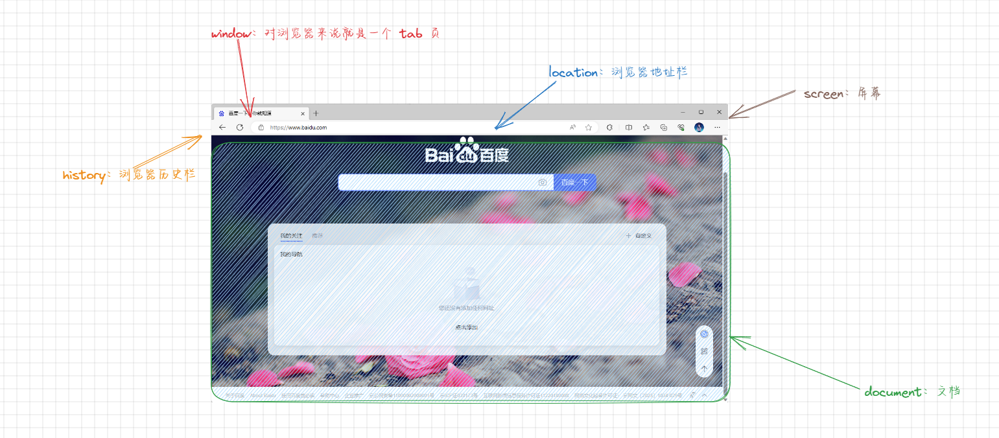
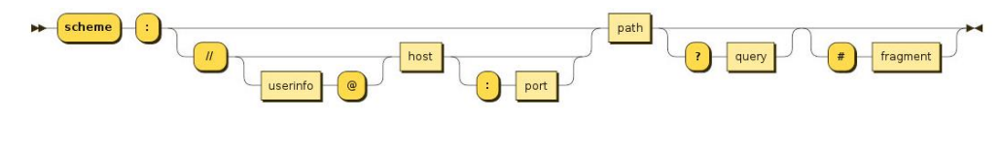
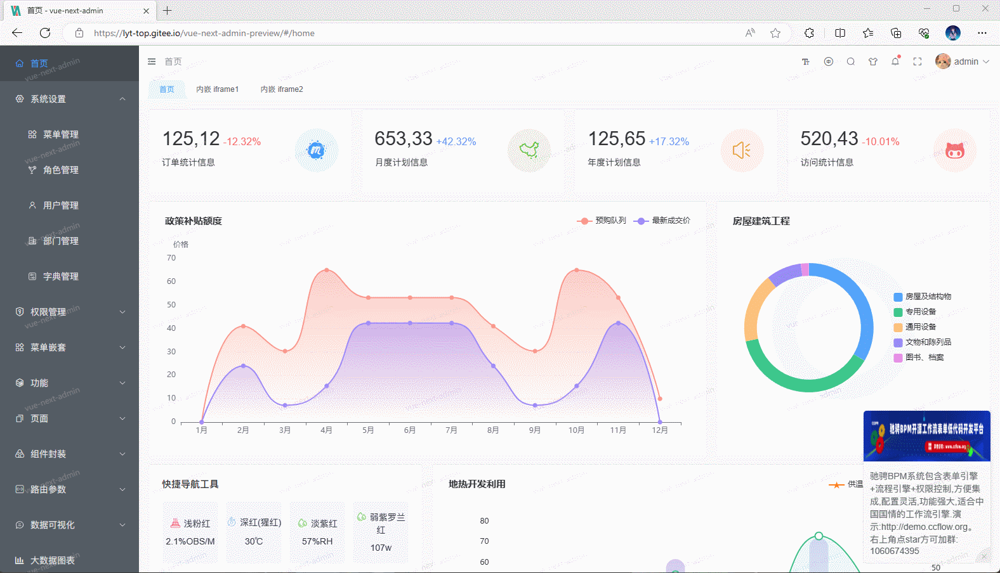
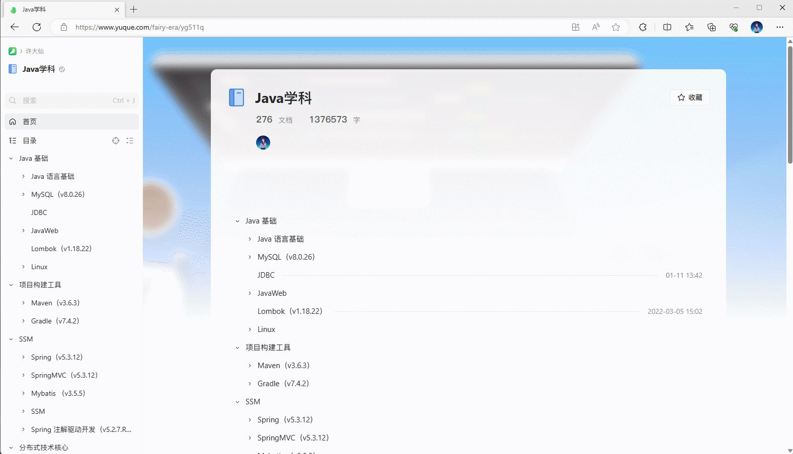
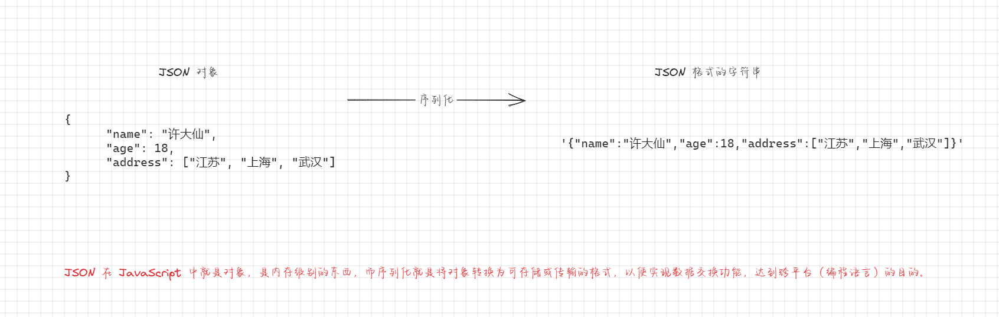
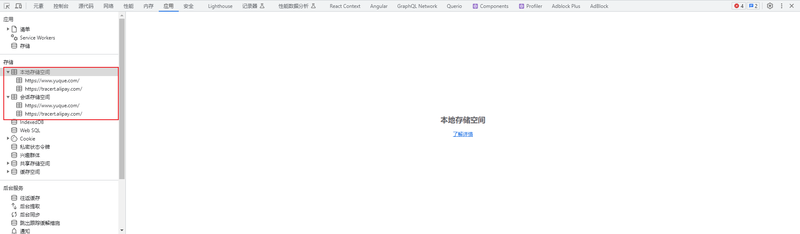

# 第一章：认识 BOM

* BOM（Browser Object Model）：浏览器对象模型，其实就是浏览器将各个功能对进行抽象，并通过 JavaScript 中的对象提供给开发者进行使用。



* BOM 主要包括如下的对象模型：
  *  window：包括全局属性、方法，控制浏览器窗口相关的属性、方法；
  * location：浏览器连接到的对象的位置（URL）；
  * history：操作浏览器的历史；
  * navigator：用户代理（浏览器）的状态和标识（很少用到）；
  * screen：屏幕窗口信息（很少用到）；


# 第二章：window 对象（⭐）

## 2.1 概述

* window 对象在浏览器中可以从两个视角来看待：

  * 视角一：全局对象，我们知道 ECMAScript 其实是有一个全局对象的，这个全局对象在Node中是global；在浏览器中就是 window 对象。

  * 视角二：浏览器窗口对象，作为浏览器窗口时，提供了对浏览器操作的相关的 API 。

* 当然，这两个视角存在大量重叠的地方，通常也不需要刻意去区分它们：
  * 事实上对于浏览器和 Node 中全局对象名称不一样的情况，目前已经指定了对应的标准，称之为`globalThis`，并且大多数现代浏览器都支持它；
  * 放在 `window` 对象上的所有`属性`都可以`被访问`；
  * ~~使用 `var` 定义的变量会被`添加`到 `window` 对象中（后面我们将使用 let 或 const 定义变量）~~；
  * `window` 默认给我们提供了全局的函数和类：`setTimeout`、`Math`、`Date`、`Object` 等。

## 2.2 window 对象的使用

* 事实上 window 对象上肩负的重担是非常大的：
  * ① 包含大量的属性，localStorage、console、location、history、screenX、scrollX 等。
  * ② 包含大量的方法，alert、close、scrollTo、open 等。
  * ③ 包含大量的事件，focus、blur、load、hashchange等。
  * ④ 包含从 EventTarget 继承过来的方法，addEventListener、removeEventListener、dispatchEvent方法。


* 示例：

```html
<!DOCTYPE html>
<html lang="en">
<head>
  <meta charset="UTF-8">
  <meta content="IE=edge" http-equiv="X-UA-Compatible">
  <meta content="width=device-width, initial-scale=1.0" name="viewport">
  <title>Title</title>
</head>
<body>

  <a href="https://www.baidu.com">百度一下</a>
  <a href="https://www.baidu.com" target="_blank">百度一下</a>
  <!--  通过 button 来模拟 a 元素  -->
  <button class="btn1">百度一下</button>
  <button class="btn2">百度一下</button>

  <script>
    console.log(globalThis === window)

    var btn1 = document.querySelector(".btn1")
    var btn2 = document.querySelector(".btn2")

    btn1.addEventListener('click', function () {
      window.open("https://www.baidu.com", "_self")
    })

    btn2.addEventListener('click', function () {
      window.open("https://www.baidu.com", "_blank")
    })
  </script>
</body>
</html>
```


# 第三章：location 对象

## 3.1 概述

* location 对象用于表示 window 上当前链接到的 URL 信息。
* 其实，location 对象就是是 URL 的一个抽象实现。



* location 对象的常见属性：
  * `href`：当前 window 对应的超链接 URL 。
  * `protocol`：当前的协议。
  * `host`：主机地址。
  * `hostname`：主机地址(不带端口)。
  * `port`: 端口。
  * `pathname`: 路径。
  * `search`：查询字符串。
  * `hash`：哈希值。
  * ~~username：URL 中的 username（很多浏览器已经禁用）。~~
  * ~~password：URL中的password（很多浏览器已经禁用）~~。

* location 对象的常见方法：
  * `assign()` ：赋值一个新的 URL ，并且跳转到该 URL 中；
  * `replace()`：打开一个新的 URL，并且跳转到该 URL 中（不同的是不会在浏览记录中留下之前的记录）；
  * `reload()`：重新加载页面，可以传入一个 Boolean 类型；


* 示例：

```html
<!DOCTYPE html>
<html lang="en">
<head>
  <meta charset="UTF-8">
  <meta content="IE=edge" http-equiv="X-UA-Compatible">
  <meta content="width=device-width, initial-scale=1.0" name="viewport">
  <title>Title</title>
</head>
<body>
  <script>
    console.log(`location.href：${location.href}`)
    console.log(`location.protocol：${location.protocol}`)
    console.log(`location.host：${location.host}`)
    console.log(`location.hostname：${location.hostname}`)
    console.log(`location.port：${location.port}`)
    console.log(`location.pathname：${location.pathname}`)
    console.log(`location.search：${location.search}`)
    console.log(`location.hash：${location.hash}`)
  </script>
</body>
</html>
```


* 示例：

```html
<!DOCTYPE html>
<html lang="en">
<head>
  <meta charset="UTF-8">
  <meta content="IE=edge" http-equiv="X-UA-Compatible">
  <meta content="width=device-width, initial-scale=1.0" name="viewport">
  <title>Title</title>
</head>
<body>

  <button class="baidu">跳转到百度</button>
  <button class="bing">跳转到必应</button>
  <button class="reload">重新加载页面</button>

  <script>
    // 获取元素
    var baiduBtn = document.querySelector(".baidu")
    var bingBtn = document.querySelector(".bing")
    var reloadBtn = document.querySelector(".reload")
    // 添加事件监听
    baiduBtn.addEventListener('click', function () {
      // 赋值一个新的URL，并且跳转到该URL中
      location.assign("https://www.baidu.com")
    })
    bingBtn.addEventListener('click', function () {
      // 打开一个新的URL，并且跳转到该URL中（不同的是不会在浏览记录中留下之前的记录）；
      location.replace("https://cn.bing.com/")
    })
    reloadBtn.addEventListener('click', function () {
      // 重新加载页面，可以传入一个 Boolean 类型；相当于按了 F5 快捷键
      location.reload()
    })
  </script>
</body>
</html>
```

## 3.2 URLSearchParams

* URLSearchParams 定义了一些实用的方法来处理 URL 的查询字符串:
  * 可以将一个字符串转化成 URLSearchParams 类型；
  * 也可以将一个 URLSearchParams 类型转成字符串；
* URLSearchParams 的常用方法：
  *  `get()`：获取搜索参数的值；
  * `set()`：设置一个搜索参数和值；
  * `append()`：设置一个搜索参数和值；
  * `has()`：判断是否有某个搜索参数；；


* 示例：

```html
<!DOCTYPE html>
<html lang="en">
<head>
  <meta charset="UTF-8">
  <meta content="IE=edge" http-equiv="X-UA-Compatible">
  <meta content="width=device-width, initial-scale=1.0" name="viewport">
  <title>Title</title>
</head>
<body>
  <script>
    // 将指定格式的字符串转换为 URLSearchParams 对象
    var urlSearchParams = new URLSearchParams("?name=许大仙&age=18")
    console.log(typeof urlSearchParams) // object

    // 将 URLSearchParams 对象转换为字符串
    // 中文会使用 encodeURIComponent 和 decodeURIComponent 进行编码和解码
    console.log(urlSearchParams.toString()) // name=%E8%AE%B8%E5%A4%A7%E4%BB%99&age=18
  </script>
</body>
</html>
```


* 示例：

```html
<!DOCTYPE html>
<html lang="en">
<head>
  <meta charset="UTF-8">
  <meta content="IE=edge" http-equiv="X-UA-Compatible">
  <meta content="width=device-width, initial-scale=1.0" name="viewport">
  <title>Title</title>
</head>
<body>
  <script>
    var urlSearchParams = new URLSearchParams("?name=许大仙&age=18")
    // 获取搜索参数的值
    console.log(`获取搜索参数的值：${urlSearchParams.get("name")}`) // 许大仙
    // 设置一个搜索参数和值
    urlSearchParams.set("name", "许仙")
    console.log(`获取搜索参数的值：${urlSearchParams.get("name")}`) // 仙
    // 追加一个搜索参数和值
    urlSearchParams.append("gender", "男")
    console.log(`获取搜索参数的值：${urlSearchParams.get("gender")}`) // 男
    // 判断是否有某个搜索参数
    console.log(`判断是否有某个搜索参数：${urlSearchParams.has("gender")}`) // rue
  </script>
</body>
</html>
```


# 第四章：history 对象（⭐）

## 4.1 概述

* history 对象允许我们访问浏览器曾经的会话历史记录。
* history 对象的常见属性：
  * `length`：会话中的记录条数。
  * `state`：当前保留的状态值。
* history 对象的常见方法：
  * `back()`：返回上一页，等价于 `history.go(-1)`。
  * `forward()`：前进下一页，等价于 `history.go(1)`。
  *  `go()`：加载历史中的某一页。
  * `pushState()`：打开一个指定的地址。
  * `replaceState()`：打开一个新的地址，并且使用 replace 。

> 注意：history 和 hash 是目前 Vue、React 等前端框架实现路由的底层原理。

## 4.2 应用示例

* 示例：

```html
<!DOCTYPE html>
<html lang="en">
<head>
  <meta charset="UTF-8">
  <meta content="IE=edge" http-equiv="X-UA-Compatible">
  <meta content="width=device-width, initial-scale=1.0" name="viewport">
  <title>Title</title>
</head>
<body>

  <button class="forward">前进</button>
  <button class="back">后退</button>

  <script>
    // 获取元素
    var forwardBtn = document.querySelector(".forward")
    var backBtn = document.querySelector(".back")
    // 添加事件监听
    forwardBtn.addEventListener('click', function () {
      // 前进下一页
      history.forward()
    })
    backBtn.addEventListener('click', function () {
      // 返回上一页
      history.back()
    })
  </script>

</body>
</html>
```

## 4.3 单页应用（SPA） VS 多页应用（MPA）

* 单页应用和多页应用是两种常见的Web应用程序设计模式，它们有着不同的特点和适用场景。
  * 单页应用（SPA）是指在用户与应用程序交互时，只加载并渲染一个 HTML 页面，页面中的内容通过 JavaScript 动态地更新，无需重新加载整个页面。SPA 通常使用前端框架（如：React、Angular、Vue 等）来实现，可以提供更快速、流畅的用户体验，因为只有部分内容发生变化时才需要与服务器通信。SPA 适用于那些需要频繁更新内容、交互性较高的应用，如：社交媒体平台、单页面产品展示或应用。
  * 多页应用（MPA）是指每次用户与应用程序进行交互时，都会请求服务器加载一个新的 HTML 页面。MPA 的优点在于对 SEO（搜索引擎优化）更友好，因为每个页面都有自己的 URL，搜索引擎可以更好地索引和收录这些页面。MPA 适用于那些需要 SEO 优化、内容独立的页面较多的网站，如：电子商务网站或新闻网站。

* 总结一下单页应用和多页应用的区别：
  * 页面加载方式：SPA 只在用户首次访问时加载一次页面，之后的内容更新通过JavaScript 动态加载；而 MPA 每次用户与应用交互时，都会加载一个新的页面。
  * 用户体验：SPA 提供更快速、流畅的用户体验，因为页面内容的变化不需要重新加载整个页面；MPA 在页面切换时可能会有较短的加载延迟，影响用户体验。
  * SEO 友好性：MPA 对搜索引擎更友好，每个页面都有独立的 URL，更容易被搜索引擎索引和收录；SPA 在一些情况下可能需要特殊处理才能更好地支持 SEO。

> 注意：选择单页应用还是多页应用取决于具体项目的需求和业务特点。如果项目需要频繁更新内容、注重用户体验和交互性，可以考虑使用单页应用。如果项目对 SEO 要求较高，内容较为独立，可以选择多页应用。

## 4.4 路由的实现原理

### 4.4.1 概述

* 路由是前端开发中的关键概念，它用于根据不同的 URL 地址在单页Web应用中动态地渲染不同的内容，实现页面的跳转和交互。
* 前端路由主要分为两种实现方式：
  * hash 模式。
  *  history 模式。

* 其实，hash 模式通过增加和改变哈希值，从而让页面感知到路由变化，换句话说就是改变 URL 后面以`#`分隔的字符串。



> 注意：前端路由的核心就是页面切换（URL 地址改变），不刷新。

* 其实，history 模式是通过浏览器提供的 history API 来实现的。



### 4.4.2 手动实现 hash 模式

* 其实，实现 hash 模式很简单，主要有如下的两个步骤：
  * ① hash 的改变：通过 `location` 的 `hash` 属性来改变，如： `windows.location.hash = '/index'`。
  * ② 监听 hash 的改变：通过 `hashchange` 事件来监听是否发生变化。


* 示例：

```html
<!DOCTYPE html>
<html lang="en">
<head>
  <meta charset="UTF-8">
  <meta content="IE=edge" http-equiv="X-UA-Compatible">
  <meta content="width=device-width, initial-scale=1.0" name="viewport">
  <title>Title</title>
</head>
<body>
  <div id="app"></div>

  <button class="home">跳转到home页面</button>
  <button class="about">跳转到about页面</button>
  <button class="contact">跳转到contact页面</button>

  <script>
    // 定义路由表
    const routes = {
      '#/home': '主页',
      '#/about': '关于',
      '#/contact': '联系我'
    }

    // 监听 hash 的变化
    window.addEventListener('hashchange', function () {
      const hash = window.location.hash
      console.log(`hash：${hash}`)
      const app = document.querySelector("#app")

      // 根据哈希值找到对应的页面内容或逻辑
      if (routes[hash]) {
        app.innerHTML = routes[hash];
      } else {
        app.innerHTML = '页面走丢了~';
      }
    })

    // 获取元素
    let homeEl = document.querySelector(".home")
    let aboutEl = document.querySelector(".about")
    let contactEl = document.querySelector(".contact")

    // 注册事件监听
    homeEl.addEventListener('click', function () {
      window.location.hash = "/home"
    })
    aboutEl.addEventListener('click', function () {
      window.location.hash = "/about"
    })
    contactEl.addEventListener('click', function () {
      window.location.hash = "/contact"
    })

  </script>
</body>
</html>
```

### 4.4.3 手动实现 history 模式

* 其实，实现 history 模式很简单，主要有如下的两个步骤：
  * ① history 的改变：通过 history 对象的 `pushState` 或 `replaceState` 即可。
  * ② 监听 history 的改变：通过 `popstate` 事件来监听是否发生变化。

> 注意：
>
> * `forward`、`back` 和 `go` 方法的调用`会`触发 `popstate` 事件，而 `pushState` 和 `replaceState` 却`不会`触发 `popstate` 事件。
> * 需通过自定义事件和全局事件总线来触发事件，进而每当浏览历史发生改变时，`popstate` 事件都会被触发。
> * 测试的时候，需要服务器的支持，可以借助 vscode 的 Live Server 插件；当然，webstorm 自带了。


* 示例：

```html
<!DOCTYPE html>
<html lang="en">
<head>
  <meta charset="UTF-8">
  <meta content="IE=edge" http-equiv="X-UA-Compatible">
  <meta content="width=device-width, initial-scale=1.0" name="viewport">
  <title>Title</title>
</head>
<body>
  <div id="app"></div>

  <button class="home">跳转到home页面</button>
  <button class="about">跳转到about页面</button>
  <button class="contact">跳转到contact页面</button>

  <script>
    // 定义路由表
    const routes = {
      '/home': '主页',
      '/about': '关于',
      '/contact': '联系我'
    }

    // 监听 hash 的变化
    window.addEventListener('popstate', function () {
      const path = window.location.pathname
      console.log(`path：${path}`)
      const app = document.querySelector("#app")

      // 根据哈希值找到对应的页面内容或逻辑
      if (routes[path]) {
        app.innerHTML = routes[path];
      } else {
        app.innerHTML = '页面走丢了~';
      }
    })

    // 获取元素
    let homeEl = document.querySelector(".home")
    let aboutEl = document.querySelector(".about")
    let contactEl = document.querySelector(".contact")

    // 注册事件监听
    homeEl.addEventListener('click', function () {
      window.history.pushState({}, '', "/home")
      window.dispatchEvent(new PopStateEvent('popstate'))
    })
    aboutEl.addEventListener('click', function () {
      window.history.pushState({}, '', "/about")
      window.dispatchEvent(new PopStateEvent('popstate'))
    })
    contactEl.addEventListener('click', function () {
      window.history.pushState({}, '', "/contact")
      window.dispatchEvent(new PopStateEvent('popstate'))
    })

  </script>
</body>
</html>
```


# 第五章：navigator 对象和 screen 对象（了解）

## 5.1 概述

* navigator 对象表示用户代理的状态和标识等信息，常用属性和方法如下：
  * `navigator.userAgent`：返回浏览器的用户代理字符串，用于识别浏览器的类型和版本。
  * `navigator.language`：返回当前浏览器的首选语言。
  * `navigator.cookieEnabled`：返回一个布尔值，表示浏览器是否启用了 cookie。
  * `navigator.onLine`：返回一个布尔值，表示浏览器是否处于联网状态。
  * `navigator.geolocation`：返回一个 Geolocation 对象，用于获取用户的地理位置信息。
  * `navigator.sendBeacon(url, data)`：向指定的 URL 发送一个异步的 POST 请求，通常用于在页面卸载前发送统计数据或日志。
  * `navigator.vibrate(pattern)`：触发设备的振动效果，可以传入一个振动模式的数组。
  * `navigator.mediaDevices.getUserMedia(constraints)`：请求用户授权访问设备的媒体资源，例如摄像头和麦克风。
* screen 对象主要记录的是浏览器窗口外面的客户端显示器的信息，常用属性和方法如下：
  * `screen.width`：返回屏幕的宽度（以像素为单位）。
  * `screen.height`：返回屏幕的高度（以像素为单位）。
  * `screen.availWidth`：返回屏幕的可用宽度（减去任务栏等系统元素的宽度）。
  * `screen.availHeight`：返回屏幕的可用高度（减去任务栏等系统元素的高度）。
  * `screen.colorDepth`：返回屏幕的颜色深度（每个像素所使用的位数）。
  * `screen.pixelDepth`：返回屏幕的像素深度（每个像素所使用的位数）。
  * `screen.orientation`：返回一个 ScreenOrientation 对象，表示屏幕的方向。

> 注意：
>
> * 不同浏览器可能会提供不同的属性和方法，并且某些属性和方法可能需要用户的授权或满足特定条件才能使用。
> * 因此，在使用这些属性和方法时，最好先进行兼容性检查和错误处理。

## 5.2 应用示例（⭐）

* 在日常开发中，这两个对象最为常用的场景就是检测用户的设备，如果是移动设备，就跳转到移动站。


* 示例：

```html
<!DOCTYPE html>
<html lang="en">
<head>
  <meta charset="UTF-8">
  <meta content="IE=edge" http-equiv="X-UA-Compatible">
  <meta content="width=device-width, initial-scale=1.0" name="viewport">
  <title>Title</title>
</head>
<body>
  <script>
    // 如果是移动设备或屏幕宽度小于等于 699 像素，则跳转到移动站点
    if (/Android|webOS|iPhone|iPad|iPod|BlackBerry|IEMobile|Opera Mini/i.test(navigator.userAgent) || screen.width <= 699) {
      window.location = "https://m.jd.com/";
    }
  </script>
</body>
</html>
```


# 第六章：JSON（⭐）

## 6.1 概述

* 在实际开发中，JSON 是一种非常重要的`数据格式`，它并`不是编程语言`，而是一种可以在服务器和客户端之间传输的数据格式。
* JSON（英文全称是 JavaScript Object Notation，中文翻译为 `JavaScript 对象符号`）：
  * JSON 是由 `Douglas Crockford` 构想和设计的一种`轻量级资料交换格式`，是 JavaScript 的一个子集。
  * `虽然 JSON 被提出来的时候是主要应用 JavaScript 中`，但是目前已经`独立于编程语言`，`可以在各个编程语言中`使用。
  * 很多编程语言都实现了`将 JSON 转换成对应模型的方法`，如：Java 中的 Jackson 等。

* 其它的数据传输格式：
  * XML（eXtensible Markup Language）：一种标记语言，用于描述数据的结构和内容。它具有自我描述性和可扩展性，适用于跨平台和跨语言的数据交换。
  * CSV（Comma-Separated Values）：一种纯文本格式，用逗号分隔不同字段的值。它通常用于表示表格数据，易于阅读和编辑。
  * YAML（YAML Ain't Markup Language）：一种轻量级的数据序列化格式，可读性较好。它支持复杂的数据结构，包括：列表、字典和嵌套对象。
  * Protocol Buffers：一种由 Google 开发的二进制数据交换格式，主要用于高效的数据序列化和通信。它具有较小的数据体积和较快的解析速度，适用于性能要求较高的场景。
  * Avro（Apache Avro）：一种基于 JSON 的数据序列化系统，支持动态模式演化。它具有紧凑的二进制格式和快速的序列化/反序列化速度，适用于大数据处理。
  * BSON（Binary JSON）：一种二进制表示的 JSON 格式，用于在 MongoDB 中存储和传输数据。它支持更多的数据类型和更高效的编码方式。

> 注意：目前 JavaScript 也支持 Protocol Buffers 。

* JSON 的应用场景：
  * ① 网络数据传输，通常用于前后端交互。
  * ② 项目的配置文件。
  * ③ 非关系型数据库（NoSQL）将 JSON作为存储格式。

## 6.2 JSON 的基本语法

* JSON 支持三种类型的值：
  * 简单值：数字（Number）、字符串（String，不支持单引号）、布尔类型（Boolean）、null 类型。
  * 对象值：由 key、value 组成，key 是字符串类型，并且必须添加双引号，值可以是简单值、对象值、数组值。
  * 数组值：数组的值可以是简单值、对象值、数组值。

> 注意：JSON 不包含 undefined ，是因为 undefined 是 JavaScript 特有的，而其它的编程语言并不支持。为了保持 JSON 的通用性和互操作性，JSON 规范选择不支持 undefined 。


* 示例：

```html
<!DOCTYPE html>
<html lang="en">
<head>
  <meta charset="UTF-8">
  <meta content="IE=edge" http-equiv="X-UA-Compatible">
  <meta content="width=device-width, initial-scale=1.0" name="viewport">
  <title>Title</title>
</head>
<body>
  <script>
    var json = {
      "name": "许大仙",
      "age": 18,
      "address": ["江苏", "上海", "武汉"]
    }

    console.log(json)
  </script>
</body>
</html>
```


* 示例：

```html
<!DOCTYPE html>
<html lang="en">
<head>
  <meta charset="UTF-8">
  <meta content="IE=edge" http-equiv="X-UA-Compatible">
  <meta content="width=device-width, initial-scale=1.0" name="viewport">
  <title>Title</title>
</head>
<body>
  <script>
    var json = [
      {"name": "Runoob", "url": "www.runoob.com"},
      {"name": "Google", "url": "www.google.com"},
      {"name": "Taobao", "url": "www.taobao.com"}
    ]

    console.log(json)
  </script>
</body>
</html>
```

## 6.2 序列化 VS 反序列化

### 6.2.1 概述

* `序列化`和`反序列化`是两个常用的数据处理操作，它们在不同的场景下有不同的含义和用途，`很多编程语言`都有`序列化`和`反系列化`的概念，JavaScript 也不例外。

### 6.2.2 序列化

* 序列化是将对象或数据结构转换为可以存储或传输的格式的过程。
* 在序列化过程中，对象的状态会被编码为一个字符串、字节流或其他形式的数据。
* 序列化通常用于将对象保存到文件、数据库或网络传输中，以便在需要时可以重新加载或传输对象的状态。
* 序列化可以将对象的状态转换为一种通用的格式，使得可以在不同的平台或编程语言之间进行数据交换。



* 在 JavaScript 中，可以通过 `stringify` 方法将 `JSON 对象`转变为 `JSON 格式的字符串`。

```js
JSON.stringify(value: any, replacer?: (this: any, key: string, value: any) => any, space?: string | number): string;
```


* 示例：

```html
<!DOCTYPE html>
<html lang="en">
<head>
  <meta charset="UTF-8">
  <meta content="IE=edge" http-equiv="X-UA-Compatible">
  <meta content="width=device-width, initial-scale=1.0" name="viewport">
  <title>Title</title>
</head>
<body>
  <script>
    var json = {
      "name": "许大仙",
      "age": 18,
      "address": ["江苏", "上海", "武汉"]
    }

    var str = JSON.stringify(json)
    console.log(str) // "{"name":"许大仙","age":18,"address":["江苏","上海","武汉"]}"
  </script>
</body>
</html>
```

### 6.2.3 反序列化

* 反序列化是将序列化后的数据重新转换为原始对象或数据结构的过程。
* 在反序列化过程中，序列化后的数据会被解码，以恢复对象的状态。
* 反序列化通常用于从文件、数据库或网络中读取序列化的数据，并将其转换为可操作的对象或数据结构。
* 反序列化可以将序列化的数据还原为原始的对象，使得可以继续使用对象的属性值。


* 在 JavaScript 中，可以通过 `parse` 方法将 `JSON 格式的字符串`转变为  `JSON 对象`。

```json
JSON.parse(text: string, reviver?: (this: any, key: string, value: any) => any): any;
```


* 示例：

```html
<!DOCTYPE html>
<html lang="en">
<head>
  <meta charset="UTF-8">
  <meta content="IE=edge" http-equiv="X-UA-Compatible">
  <meta content="width=device-width, initial-scale=1.0" name="viewport">
  <title>Title</title>
</head>
<body>
  <script>
    var str = `{"name":"许大仙","age":18,"address":["江苏","上海","武汉"]}`

    var json = JSON.parse(str)
    console.log(`name: ${json.name}, age: ${json.age}`)
    console.log(`address: ${json.address}`)
  </script>
</body>
</html>
```

### 6.2.4 总结

* 序列化是将对象转换为可存储或传输的格式，而反序列化是将序列化后的数据重新转换为原始对象。
* 序列化和反序列化通常用于数据持久化、数据传输和跨平台数据交换等场景，可以方便地保存和恢复对象的状态。


# 第七章：客户端存储数据的机制（⭐）

## 7.1 概述

* localStorage 和 sessionStorage 都是 HTML5 提供的 Web 存储 API，用于在浏览器中存储数据。它们之间的区别如下：
  * 数据的生命周期：
    * localStorage 中存储的数据没有过期时间，除非手动清除或者用户清除浏览器缓存，否则数据将一直存在。
    * sessionStorage 中存储的数据在当前会话结束后会被自动清除，即当用户关闭浏览器窗口或标签页时，存储的数据会被删除。
  * 数据的作用域：
    * localStorage 中存储的数据在`同一个域名下`的`所有页面`中共享，即使是不同的窗口或标签页。
    * sessionStorage 中存储的数据只在`同一个窗口`或`标签页`中共享，不同的窗口或标签页之间无法共享数据。

* 应用场景：
  * localStorage 适用于需要长期保存的数据，例如：用户的个人设置、主题选择等。由于数据不会过期，可以在用户下次访问网站时继续使用。
  * sessionStorage 适用于临时保存的数据，例如：表单数据的临时存储、页面间的数据传递等。由于数据在会话结束后会被自动清除，可以保证数据的安全性和隐私性。

## 7.2 Storage 对象的常见属性和方法

* 常见的属性：
  * 获取存储在 Storage 对象中的数据项数量（只读属性）：
  
  ```js
  readonly length: number
  ```

* 常见的方法：
  * 返回存储中的第 n 个 key 名称：
  
  ```js
  storage.key(index: number): string | null;
  ```
  
  * 将 key 和 value 存储到 Storage  对象中，如果 key 已经存在，将会覆盖 value ：
  
  ```js
  storage.setItem(key: string, value: string): void;
  ```
  
  * 根据 key 从 Storage  对象中获取 value ，如果 value 不存在，将返回 null ：
  
  ```js
  storage.getItem(key: string): string | null;
  ```
  
  * 在 Storage  对象根据指定的 key 删除数据项：
  
  ```js
  storage.removeItem(key: string): void;
  ```
  
  * 清空 Storage  对象所有的数据项：
  
  ```js
  storage.clear(): void;
  ```

> 注意：存储的时候，value 需要是 string 类型；所以，如果是 JSON 对象或 Object 类型，必须手动转换为字符串。

* 在浏览器中如何查看：




* 示例：

```html
<!DOCTYPE html>
<html lang="en">
<head>
  <meta charset="UTF-8">
  <meta content="IE=edge" http-equiv="X-UA-Compatible">
  <meta content="width=device-width, initial-scale=1.0" name="viewport">
  <title>Title</title>
</head>
<body>
  <script>
    // 存储
    localStorage.setItem("name", "张三")
    localStorage.setItem("age", "18")
    localStorage.setItem("address", "江苏南京")
    // 获取
    console.log(localStorage.getItem("name")) // 张三
    console.log(localStorage.getItem("age")) // 18
    console.log(localStorage.getItem("address")) // 江苏南京
    console.log(localStorage.getItem("school")) // null
    // 获取存储在 Storage 对象中的数据项数量
    console.log(localStorage.length) // 3
    // 根据指定的 key 删除数据项
    localStorage.removeItem("name")
    console.log(localStorage.length) // 2
    // 清空
    localStorage.clear()
    console.log(localStorage.length) // 0
  </script>
</body>
</html>
```

