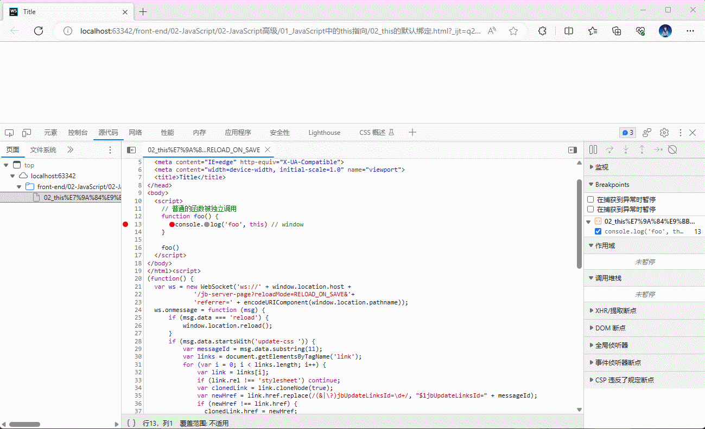
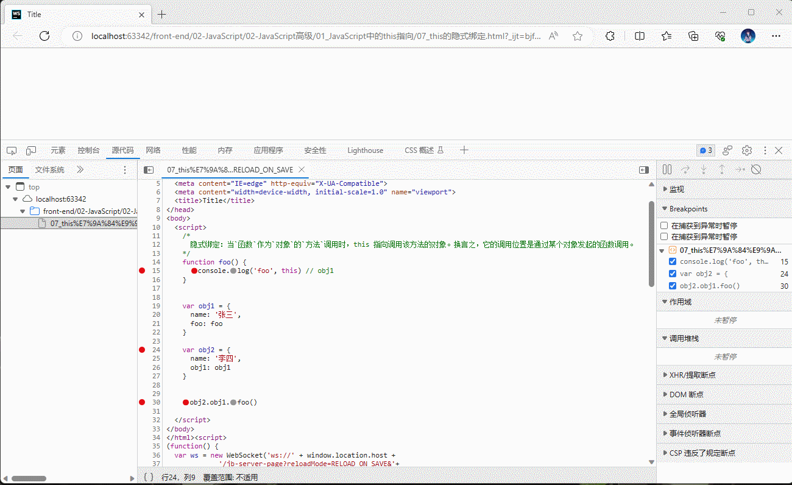
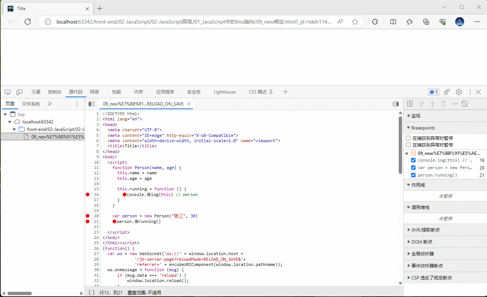
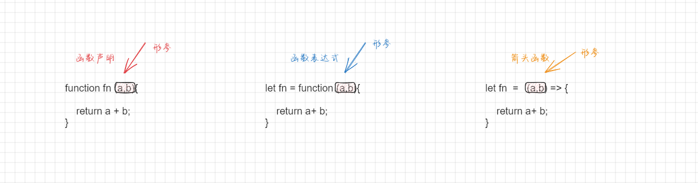

# 第一章： this 到底指向什么？

## 1.1 概述

* 我们可以先定义一个函数，然后采用三种不同的方式来对其进行调用：

```html
<!DOCTYPE html>
<html lang="en">
<head>
  <meta charset="UTF-8">
  <meta content="IE=edge" http-equiv="X-UA-Compatible">
  <meta content="width=device-width, initial-scale=1.0" name="viewport">
  <title>Title</title>
</head>
<body>
  <script>
    // 定义函数
    function foo() {
      console.log('foo', this);
    }

    // ① 默认调用
    foo() // window

    // ② 通过对象调用，即将 foo 放入到对象中，然后通过对象进行调用
    var obj = {
      name: "张三",
      age: 30,
      foo: foo
    }

    obj.foo() // obj 对象

    // ③ 通过 call 或 apply 带哦用
    foo.call("abc") // String{'abc'}

  </script>
</body>
</html>
```

* 我们会发现产生了不同的结果；换言之，调用方式的不同，可能产生的结果也不能。
* 其实，`函数`在`被调用`的时候，`JavaScript` 会给 `this 绑定一个值`。
  * this 的绑定和定义的位置、编写的位置没有关系。
  * this 的`绑定`和`调用的方式`以及`调用的位置`有关系。
  * this 是在`运行的时候`被绑定的。

## 1.2 this 绑定的规则的分类

* 那么，this 到底有什么样的绑定规则？
  * ① 默认绑定。
  * ② 隐式绑定。
  * ③ 显式绑定。
  * ④ new 绑定。


# 第二章：this 绑定的规则（⭐）

## 2.1 默认绑定（独立函数调用）

* 在 JavaScript 中，默认绑定是指当函数被调用的时候，如果`没有明确的指定调用函数的上下文对象`，那么函数中的 this 将绑定到（指向）全局对象（在浏览器中通常是指 window 对象）上。

> 注意：在严格模式下，默认绑定规则将失效，此时的 this 将绑定到（指向） undefined 。

* 在实际开发中，可以通过 Chrome 的 devtools 来查看 this 的绑定：




* 示例：

```html
<!DOCTYPE html>
<html lang="en">
<head>
  <meta charset="UTF-8">
  <meta content="IE=edge" http-equiv="X-UA-Compatible">
  <meta content="width=device-width, initial-scale=1.0" name="viewport">
  <title>Title</title>
</head>
<body>
  <script>
    // 普通的函数被独立调用
    function foo() {
      console.log('foo', this) // window
    }

    foo()
  </script>
</body>
</html>
```


* 示例：

```html
<!DOCTYPE html>
<html lang="en">
<head>
  <meta charset="UTF-8">
  <meta content="IE=edge" http-equiv="X-UA-Compatible">
  <meta content="width=device-width, initial-scale=1.0" name="viewport">
  <title>Title</title>
</head>
<body>
  <script>
    "use strict"

    function foo() {
      console.log('foo', this) // undefined
    }

    foo() 

  </script>
</body>
</html>
```


* 示例：

```html
<!DOCTYPE html>
<html lang="en">
<head>
  <meta charset="UTF-8">
  <meta content="IE=edge" http-equiv="X-UA-Compatible">
  <meta content="width=device-width, initial-scale=1.0" name="viewport">
  <title>Title</title>
</head>
<body>
  <script>
    // 普通的函数被独立调用
    function foo() {
      console.log('foo', this) // window
      bar()
    }

    function bar() {
      console.log('bar', this) // window
      baz()
    }

    function baz() {
      console.log('baz', this) // window
    }

    foo()

  </script>
</body>
</html>
```


* 示例：

```html
<!DOCTYPE html>
<html lang="en">
<head>
  <meta charset="UTF-8">
  <meta content="IE=edge" http-equiv="X-UA-Compatible">
  <meta content="width=device-width, initial-scale=1.0" name="viewport">
  <title>Title</title>
</head>
<body>
  <script>
    // 函数定义在对象中，但是独立调用的
    var obj = {
      name: "张三",
      age: 18,
      bar: function () {
        console.log('bar', this); // window
      }
    }

    var baz = obj.bar
    baz()
    
  </script>
</body>
</html>
```

## 2.2 隐式绑定

* 当`函数`作为`对象`的`方法`调用时，this 指向调用该方法的对象。换言之，它的调用位置是通过某个对象发起的函数调用。
* 在实际开发中，可以通过 Chrome 的 devtools 来查看 this 的绑定：




* 示例：

```html
<!DOCTYPE html>
<html lang="en">
<head>
  <meta charset="UTF-8">
  <meta content="IE=edge" http-equiv="X-UA-Compatible">
  <meta content="width=device-width, initial-scale=1.0" name="viewport">
  <title>Title</title>
</head>
<body>
  <script>
    /* 
      隐式绑定：当`函数`作为`对象`的`方法`调用时，this 指向调用该方法的对象。换言之，它的调用位置是通过某个对象发起的函数调用。 
    */
    function foo() {
      console.log('foo', this) // obj
    }

    var obj = {
      name: '张三',
      foo: foo
    }

    obj.foo()

  </script>
</body>
</html>
```


* 示例：

```html
<!DOCTYPE html>
<html lang="en">
<head>
  <meta charset="UTF-8">
  <meta content="IE=edge" http-equiv="X-UA-Compatible">
  <meta content="width=device-width, initial-scale=1.0" name="viewport">
  <title>Title</title>
</head>
<body>
  <script>
    /*
      隐式绑定：当`函数`作为`对象`的`方法`调用时，this 指向调用该方法的对象。换言之，它的调用位置是通过某个对象发起的函数调用。
    */
    function foo() {
      console.log('foo', this) // obj1
    }


    var obj1 = {
      name: '张三',
      foo: foo
    }

    var obj2 = {
      name: '李四',
      obj1: obj1
    }


    obj2.obj1.foo()

  </script>
</body>
</html>
```

## 2.3 new 绑定

* JavaScript 中的函数可以当做是一个类的构造函数来使用的；换言之，就是使用了 new 关键字。
* 使用 new 关键字来调用函数，会执行如下的流程：
  * ① 创建一个新的空对象。
  * ② 将这个新对象的原型指向构造函数的原型对象，从而建立对象与构造函数之间的原型链关系。
  * ③ 将构造函数的执行上下文设置为这个新对象，并将其作为构造函数中的 this。
  * ④ 执行构造函数的代码块，初始化对象的属性和方法。
  * ⑤ 如果构造函数没有显式返回一个对象，则返回这个新对象。

* 在实际开发中，可以通过 Chrome 的 devtools 来查看 this 的绑定：




* 示例：

```html
<!DOCTYPE html>
<html lang="en">
<head>
  <meta charset="UTF-8">
  <meta content="IE=edge" http-equiv="X-UA-Compatible">
  <meta content="width=device-width, initial-scale=1.0" name="viewport">
  <title>Title</title>
</head>
<body>
  <script>
    function Person(name, age) {
      this.name = name
      this.age = age

      this.running = function () {
        console.log(this) // person
      }
    }

    var person = new Person("张三", 30)
    person.running()

  </script>
</body>
</html>
```

## 2.4 显式绑定

### 2.4.1 概述

* 隐式绑定有一个前提条件就是：
  * `必须在调用的对象内部有一个函数的引用（属性）`。
  * 如果没有这样的引用，在进行调用的时候，会报找不到该函数的错误。
  * 正是通过这个引用，间接的将 this 绑定到该对象上。

```html
<!DOCTYPE html>
<html lang="en">
<head>
  <meta charset="UTF-8">
  <meta content="IE=edge" http-equiv="X-UA-Compatible">
  <meta content="width=device-width, initial-scale=1.0" name="viewport">
  <title>Title</title>
</head>
<body>
  <script>
    var obj = {
      name: "许大仙"
    }

    function foo() {
      console.log('foo', this)
    }

    // 执行函数，并且让函数中的 this 指向 obj 对象
    obj.foo = foo
    obj.foo()
  </script>
</body>
</html>
```

* 但是，我们有的时候，却`不希望在对象内部包含这个函数的引用`，同时`却希望在这个对象上进行强制调用`，怎么做？
* 其实，JavaScript 提供了 `call`、`apply` 和 `bind` 方法来帮助我们实现这样的功能，并且因为我们`明确了绑定 this 指向的对象`，所以被称为`显示绑定`。

### 2.4.2 call 方法

* 方法：

```js
fun.call(thisArg, arg1, arg2, ...)
```

* call 方法`调用`一个对象。简单理解为调用函数的方式，但是它可以改变函数的 this 指向。 
* 参数： 
  * thisArg：在 fun 函数运行的时候执行的 this  值。
  * arg1 , arg2：传递的其他参数。

* 返回值：返回值就是函数的返回值，因为它就是调用函数。 


> 注意：fun 也可以是匿名函数。


* 示例：

```html
<!DOCTYPE html>
<html lang="en">
<head>
  <meta charset="UTF-8">
  <meta content="IE=edge" http-equiv="X-UA-Compatible">
  <meta content="width=device-width, initial-scale=1.0" name="viewport">
  <title>Title</title>
</head>
<body>
  <script>
    function foo(name, age) {
      console.log('foo', this, name, age)
    }

    // 原始调用
    foo("张三", 30)

    // call 调用
    // 第一个参数：绑定 this
    // 第二个参数：实际参数列表，以,隔开
    foo.call("abc", "李四", 10)
  </script>
</body>
</html>
```


* 示例：

```html
<!DOCTYPE html>
<html lang="en">
<head>
  <meta charset="UTF-8">
  <meta content="IE=edge" http-equiv="X-UA-Compatible">
  <meta content="width=device-width, initial-scale=1.0" name="viewport">
  <title>Title</title>
</head>
<body>
  <script>
    function foo(a, b) {
      console.log('foo', this, a, b)
      return a + b
    }

    // 原始调用
    var result = foo(10, 20)
    console.log(result) // 30 

    // call 调用
    // 第一个参数：绑定 this
    // 第二个参数：实际参数列表，以,隔开
    result = foo.call("abc", 50, 10)
    console.log(result) // 60


  </script>
</body>
</html>
```

### 2.4.3 apply 方法

* 方法：

```js
fun.apply(thisArg,[argsArray])
```

* apply 方法调用一个函数，简单理解为调用函数的方式，并且可以改变函数内部的 this 指向。 
* 参数： 
  * thisArg：在 fun 函数运行时指定的 this 值。
  * argsArray：传递的值，必须包含在数组中。


- 返回值：返回值就是函数的返回值，因为它就是调用函数。 

> 注意：fun 也可以是匿名函数。


* 示例：

```html
<!DOCTYPE html>
<html lang="en">
<head>
  <meta charset="UTF-8">
  <meta content="IE=edge" http-equiv="X-UA-Compatible">
  <meta content="width=device-width, initial-scale=1.0" name="viewport">
  <title>Title</title>
</head>
<body>
  <script>
    function foo(name, age) {
      console.log('foo', this, name, age)
    }

    // 原始调用
    foo("张三", 30)

    // apply
    // 第一个参数：绑定 this
    // 第二个参数：传入的参数，以数组的形式
    foo.apply("abc", ["王五", 50])
  </script>
</body>
</html>
```


* 示例：

```html
<!DOCTYPE html>
<html lang="en">
<head>
  <meta charset="UTF-8">
  <meta content="IE=edge" http-equiv="X-UA-Compatible">
  <meta content="width=device-width, initial-scale=1.0" name="viewport">
  <title>Title</title>
</head>
<body>
  <script>

    var arr = [1, 2, 3]

    // apply 的主要应用，如：可以利用 apply 借助于数学内置对象对数组求最值
    var max = Math.max.apply(Math, arr)
    console.log(`max: ${max}`)

    var min = Math.min.apply(Math, arr)
    console.log(`min: ${min}`)

  </script>
</body>
</html>
```

### 2.4.4 bind 方法

* 方法：

```js
fun.bind(thisArg,arg1,arg2)
```

- bind 方法不会调用函数，但是能改变函数内部的 this 指向。 
- 参数： 
  - thisArg：在 fun 函数运行的时候执行的 this  值。
  - arg1 , arg2：传递的其他参数。

- 返回由指定的 this 值和初始化参数改造的`原函数的拷贝`。 

> 注意：fun 也可以是匿名函数。


* 示例：

```html
<!DOCTYPE html>
<html lang="en">
<head>
  <meta charset="UTF-8">
  <meta content="IE=edge" http-equiv="X-UA-Compatible">
  <meta content="width=device-width, initial-scale=1.0" name="viewport">
  <title>Title</title>
</head>
<body>
  <script>
    function foo() {
      console.log('foo', this);
    }

    var obj = {name: "张三"}

    // 需求：调用 foo 的时候，希望将其绑定到 obj 对象上
	
    // bind 方法不会调用函数，但是能改变函数内部的 this 指向。返回原函数的拷贝
    var bind = foo.bind(obj)

    bind()
    bind()
    bind()
    bind()
    bind()

  </script>
</body>
</html>
```


* 示例：

```html
<!DOCTYPE html>
<html lang="en">
<head>
  <meta charset="UTF-8">
  <meta content="IE=edge" http-equiv="X-UA-Compatible">
  <meta content="width=device-width, initial-scale=1.0" name="viewport">
  <title>Title</title>
</head>
<body>

  <button>按钮</button>

  <script>
    /*
    * 需求：按钮点击之后，60 秒之后才能再次点击
    */
    var btn = document.querySelector("button")

    btn.addEventListener('click', function () {
      // 倒计时的时间
      let count = 60
      // 禁用按钮
      this.disabled = true
      // 更新按钮文本
      this.textContent = `还剩${count}秒`
      // 倒计时
      let timerId = setInterval(function () {
        // 更新倒计时的时间
        count--
        // 更新按钮文本
        this.textContent = `还剩${count}秒`
        // 如果倒计时已经过去，取消禁用按钮并停止倒计时
        if (count <= 0) {
          clearInterval(timerId)
          this.textContent = '按钮'
          this.disabled = false
        }
      }.bind(this), 1000)
    })

  </script>

</body>
</html>
```

## 2.5 内置函数的绑定思考？

* 在实际开发过程中，我们可能会`调用一些 JavaScript 的内置函数`，或者`第三方库中提供的函`数；并且，这些内置函数会`要求`我们`传入另一个函数`，但是`我们自己不会显示的调用这些函数`，而是由 `JavaScript 内部`或`第三方库`帮助我们执行，那么此时函数中的 this 是什么？

```html
<!DOCTYPE html>
<html lang="en">
<head>
  <meta charset="UTF-8">
  <meta content="IE=edge" http-equiv="X-UA-Compatible">
  <meta content="width=device-width, initial-scale=1.0" name="viewport">
  <title>Title</title>
</head>
<body>

  <button class="btn">按钮</button>

  <script>

    // 定时器中的函数
    setTimeout(function () {
      console.log('setTimeout', this)
    }, 1000)

    // 按钮的点击事件
    var btn = document.querySelector(".btn")
    btn.addEventListener('click', function () {
      console.log('click', this)
    })

    // foreach
    var arr = [1, 2, 3]
    arr.forEach(function (item) {
      console.log("forEach", item, this)
    })

  </script>
</body>
</html>
```

* 有如下的方案来进行判断：
  * ① 查阅官方文档或第三方库的文档，了解函数的行为和 this 的处理方式。
  * ② 查看函数被调用的方式，是否是作为其他函数的回调函数，是否是通过 apply、call、bind 等方法进行调用。
  * ③ 通过浏览器的 devtools 工具来进行调试。
  * ④ ……

> 注意：其实，在现代的前端开发中（Vue、React 等），this 的作用已经大大降低了，这些前端框架已经通过引入新的编程范式来减少对 this 的使用了。

## 2.6 this 绑定规则的优先级

* ① 默认规则的优先级最低。
* ② 显示绑定优先级高于隐式绑定。
* ③ new 绑定优先级高于隐式绑定。
* ④ new 绑定优先级高于 bind。

> 注意：实际开发中，遇到不确定的，通过浏览器的 devtools 调试。


* 示例：

```html
<!DOCTYPE html>
<html lang="en">
<head>
  <meta charset="UTF-8">
  <meta content="IE=edge" http-equiv="X-UA-Compatible">
  <meta content="width=device-width, initial-scale=1.0" name="viewport">
  <title>Title</title>
</head>
<body>
  <script>
    function foo() {
      console.log('foo', this) // String{'abc'}
    }

    var obj = {
      name: '张三',
      foo: foo
    }

    obj.foo.apply("abc") 
  </script>
</body>
</html>
```

## 2.7 特殊情况（了解）

### 2.7.1 忽略显示绑定

* 如果在显式绑定中，传入了一个 null 或者 undefined ，那么显式绑定将被忽略，使用默认规则。


* 示例：

```html
<!DOCTYPE html>
<html lang="en">
<head>
  <meta charset="UTF-8">
  <meta content="IE=edge" http-equiv="X-UA-Compatible">
  <meta content="width=device-width, initial-scale=1.0" name="viewport">
  <title>Title</title>
</head>
<body>
  <script>
    function foo() {
      console.log('foo', this)
    }

    var obj = {name: '张三'}

    foo.call(obj) // obj 对象
    foo.call(null) // window 对象
    foo.call(undefined) // window 对象

    var bar = foo.bind(null)
    bar() // window 对象

  </script>
</body>
</html>
```

### 2.7.2 间接函数引用

* 创建一个函数的 `间接引用`，这种情况使用默认绑定规则。
* 赋值`(obj2.foo = obj1.foo)`的结果是 foo 函数，foo 函数被直接调用，那么是默认绑定。


* 示例：

```html
<!DOCTYPE html>
<html lang="en">
<head>
  <meta charset="UTF-8">
  <meta content="IE=edge" http-equiv="X-UA-Compatible">
  <meta content="width=device-width, initial-scale=1.0" name="viewport">
  <title>Title</title>
</head>
<body>
  <script>
    function foo() {
      console.log('foo', this)
    }

    var obj1 = {
      name: "张三",
      foo: foo
    }

    var obj2 = {
          name: "李四"
        }

    ;(obj2.foo = obj1.foo)() // window


  </script>
</body>
</html>
```


# 第三章：箭头函数（arrow function，⭐）

## 3.1 概述

* `箭头函数`是 `ES6` 之后新增加的一种编写函数的方法，并且它比`函数表达式`更加简洁。
* 箭头函数有如下的特点：
  * ① 箭头函数不会绑定 `this` 、`arguments` 属性。
  * ② 箭头函数`不能作为构造函数`来使用（不能和 new 一起使用，会抛出错误）。

> 注意：
>
> * ① 箭头函数还有个别名就是 Lambda 表达式。
> * ② arguments 就是糟粕，忘记吧！可以使用 rest（剩余）参数来代替。
> * ③ 箭头函数是用来简化函数的写法的，和函数声明不同，不会有函数提升。
> * ④ ES6 之后推荐使用 class 来编写类，所以这就是箭头函数不能作为构造函数的原因。

* 函数声明的语法是：

```js
function fn (parameter1, parameter2, ..., parameterN) {
    // 函数体
}
```

* 函数表达式的语法是：

```js
var fn = (parameter1, parameter2, ..., parameterN) {
    // 函数体
}
```

* 箭头函数的语法是：

```js
var fn = (parameter1, parameter2, ..., parameterN) => expression
```

* 写法之间的对比：




* 示例：

```html
<!DOCTYPE html>
<html lang="en">
<head>
  <meta charset="UTF-8">
  <meta content="IE=edge" http-equiv="X-UA-Compatible">
  <meta content="width=device-width, initial-scale=1.0" name="viewport">
  <title>Title</title>
</head>
<body>
  <script>
    // 函数声明
    function add(a, b) {
      return a + b
    }

    // 调用函数
    console.log(add(1, 2)) // 3

    // 函数表达式
    var add2 = function (a, b) {
      return a + b;
    }
    // 调用函数
    console.log(add2(1, 2)) // 3

    // 箭头函数
    var add3 = (a, b) => {
      return a + b
    }

    // 调用函数
    console.log(add3(1, 2)) // 3
  </script>
</body>
</html>
```

## 3.2 箭头函数的简写规则

* ① 如果只有一个参数，那么 `()` 可以省略：

```js
arr.forEach(item => {
    console.log(item)
})
```

* ② 如果函数执行体中只有一行代码，那么 `{}`  可以省略：

```js
arr.forEach(item => console.log(item))
```

```js
arr.filter(item => item % 2 === 0)
```

* ③ 如果函数执行体中只返回一个对象，那么需要给对象加上 `()`：

```js
var foo = () => {
    return {name: 'zs'}
}
```

```js
var bar = () => ({name: 'lisi'})
```

> 注意：第 ③ 条规则很特殊，在别的语言中可能不存在，如：Java 等。


* 示例：

```html
<!DOCTYPE html>
<html lang="en">
<head>
  <meta charset="UTF-8">
  <meta content="IE=edge" http-equiv="X-UA-Compatible">
  <meta content="width=device-width, initial-scale=1.0" name="viewport">
  <title>Title</title>
</head>
<body>
  <script>
    var arr = [1, 2, 3]

    arr.forEach((item, index, arr) => {
      console.log(item, index, arr)
    })
  </script>
</body>
</html>
```


* 示例：

```html
<!DOCTYPE html>
<html lang="en">
<head>
  <meta charset="UTF-8">
  <meta content="IE=edge" http-equiv="X-UA-Compatible">
  <meta content="width=device-width, initial-scale=1.0" name="viewport">
  <title>Title</title>
</head>
<body>
  <script>
    var arr = [1, 2, 3]

    arr.forEach(item => {
      console.log(item)
    })
  </script>
</body>
</html>
```


* 示例：

```html
<!DOCTYPE html>
<html lang="en">
<head>
  <meta charset="UTF-8">
  <meta content="IE=edge" http-equiv="X-UA-Compatible">
  <meta content="width=device-width, initial-scale=1.0" name="viewport">
  <title>Title</title>
</head>
<body>
  <script>
    var arr = [1, 2, 3, 4, 5]

    var result = arr.filter(item => item > 2)
        .map(item => item * 2)
        .reduce((a, b) => a + b)
    console.log(result) // 24
  </script>
</body>
</html>
```


* 示例：

```html
<!DOCTYPE html>
<html lang="en">
<head>
  <meta charset="UTF-8">
  <meta content="IE=edge" http-equiv="X-UA-Compatible">
  <meta content="width=device-width, initial-scale=1.0" name="viewport">
  <title>Title</title>
</head>
<body>
  <script>
    var foo = () => ({name: '张三'})

    for (let key in foo()) {
      console.log(key, foo()[key])
    }
  </script>
</body>
</html>
```


* 示例：

```html
<!DOCTYPE html>
<html lang="en">
<head>
  <meta charset="UTF-8">
  <meta content="IE=edge" http-equiv="X-UA-Compatible">
  <meta content="width=device-width, initial-scale=1.0" name="viewport">
  <title>Title</title>
</head>
<body>

  <button>按钮</button>

  <script>
    /*
    * 需求：按钮点击之后，60 秒之后才能再次点击
    */
    var btn = document.querySelector("button")

    btn.addEventListener('click', function () {
      // 倒计时的时间
      let count = 60
      // 禁用按钮
      this.disabled = true
      // 更新按钮文本
      this.textContent = `还剩${count}秒`
      // 倒计时 # 使用箭头函数来改写，此时就不需要 bind 等来显式调用了
      let timerId = setInterval(() => {
        // 更新倒计时的时间
        count--
        // 更新按钮文本
        this.textContent = `还剩${count}秒`
        // 如果倒计时已经过去，取消禁用按钮并停止倒计时
        if (count <= 0) {
          clearInterval(timerId)
          this.textContent = '按钮'
          this.disabled = false
        }
      }, 1000)
    })

  </script>

</body>
</html>
```

## 3.3 箭头函数中的 this 使用说明

* 根据 ECMAScript 规范，箭头函数是没有自己的 this 绑定的，它会和普通的变量一样捕获外部的 this 值。这是箭头函数的一个重要特性，它和普通函数的 this  行为有所不同。
* `普通函数`的 this 值在`运行`的时候会根据`调用方式`和`上下文`进行`动态绑定`，但是`箭头函数`的 `this` 值在`定义`的时候就被`确定`了，并且`不会被重新绑定`。箭头函数会捕获所在上下文的 this 值，并在函数体内部使用该值，无论在哪里调用箭头函数，它的 this 值都不会改变。
* 箭头函数的这种特性可以避免在回调函数或嵌套函数中丢失 this 值的问题，同时也简化了代码的编写和阅读。

> 总结：箭头函数中是没有 this 绑定的，默认就是按照变量的查找规则进行查找的。

## 3.4 证明箭头函数中没有 this 绑定

* ① 当使用箭头函数作为对象方法的时候，会发现 this 指向的时全局对象 window ，而不是对象本身。

```html
<!DOCTYPE html>
<html lang="en">
<head>
  <meta charset="UTF-8">
  <meta content="IE=edge" http-equiv="X-UA-Compatible">
  <meta content="width=device-width, initial-scale=1.0" name="viewport">
  <title>Title</title>
</head>
<body>
  <script>

    /**
     * 普通函数
     */
    function foo() {
      console.log('foo', this)
    }


    // 定义对象
    var obj = {
      name: '张三',
      foo: foo
    }

    // 普通函数根据调用方式和上下文的不同，this 值可能也不同
    obj.foo() // obj

    var bar = obj.foo
    bar() // window

    // 箭头函数中没有 this 绑定，并且无论在哪里调用箭头函数，它的 this 值都不会改变
    var obj2 = {
      name: '李四',
      foo: () => { // 箭头函数
        console.log('foo', this)
      }
    }

    obj2.foo() // window
    var bar2 = obj2.foo
    bar2() // window

  </script>
</body>
</html>
```

* ② 在箭头函数中尝试访问 arguments 对象，会抛出 ReferenceError 错误，因为箭头函数中没有自己的 arguments 对象，它会捕获外部作用域的 arguments 对象，如果外部作用域中也没有 arguments 对象，则会抛出错误。

```html
<!DOCTYPE html>
<html lang="en">
<head>
  <meta charset="UTF-8">
  <meta content="IE=edge" http-equiv="X-UA-Compatible">
  <meta content="width=device-width, initial-scale=1.0" name="viewport">
  <title>Title</title>
</head>
<body>
  <script>

    /**
     * 普通函数
     */
    function foo() {
      console.log('foo', arguments)
      console.log('foo', this)
    }


    foo() // 普通函数中是有 arguments 对象的


    /**
     * 箭头函数
     */
    var bar = () => {
      console.log('bar', arguments)
      console.log('bar', this)
    }

    bar() // arguments is not defined


  </script>
</body>
</html>
```

* ③ 通过 call、apply、bind 等方法尝试将箭头函数中的 this 改变，会发现由于箭头函数没有自己的 this 绑定，this 依然指向 window 对象。

```html
<!DOCTYPE html>
<html lang="en">
<head>
  <meta charset="UTF-8">
  <meta content="IE=edge" http-equiv="X-UA-Compatible">
  <meta content="width=device-width, initial-scale=1.0" name="viewport">
  <title>Title</title>
</head>
<body>
  <script>
    // 箭头函数中没有 this , 默认是按照变量的查找规则进行查找
    var bar = () => {
      console.log('bar', this);
    }

    bar() // window

    bar.apply("abc") // window


    // this 的查找规则
    var obj = {
      name: "张三",
      foo: function () {
        console.log(this);
      }
    }

    obj.foo() // obj

    var baz = obj.foo
    baz() // window

  </script>
</body>
</html>
```

## 3.5 箭头函数的应用场景

* ① 避免 this 绑定问题：由于箭头函数中没有 this 绑定，会捕获所在上下文的 this 值，并在函数体内部使用该值，无论在哪里调用箭头函数，它的 this 值都不会改变，这样可以避免在回调函数中出现 this 绑定的问题。

```html
<!DOCTYPE html>
<html lang="en">
<head>
  <meta charset="UTF-8">
  <meta content="IE=edge" http-equiv="X-UA-Compatible">
  <meta content="width=device-width, initial-scale=1.0" name="viewport">
  <title>Title</title>
</head>
<body>
  <script>
    /* 避免 this 绑定问题 */
    class Counter {
      constructor() {
        this.count = 0
      }

      increment() {
        setInterval(() => {
          this.count++ // 这里的 this 是 Counter 的实例对象，因为 setInterval 如果使用普通函数，默认就是 window
          console.log(this.count)
        }, 1000)
      }

    }

    const counter = new Counter()
    counter.increment()
    console.log(counter.count)

  </script>
</body>
</html>
```

* ② 简化回调函数：使用箭头函数可以减少冗余的语法

```html
<!DOCTYPE html>
<html lang="en">
<head>
  <meta charset="UTF-8">
  <meta content="IE=edge" http-equiv="X-UA-Compatible">
  <meta content="width=device-width, initial-scale=1.0" name="viewport">
  <title>Title</title>
</head>
<body>
  <script>
    /* 简化回调函数 */
    var arr = [1, 2, 3, 4, 5, 6, 7, 8, 9, 10, 11, 12, 13, 14, 15]

    var result = arr
        .filter(item => item >= 2)
        .map(item => Math.pow(item, 2))
        .reduce((a, b) => a + b)

    console.log(result)

  </script>
</body>
</html>
```

* ③ 可以和 `setTimeout`  以及 `setInterval` 配合使用：在使用 `setTimeout` 或 `setInterval` 设置定时器时，箭头函数可以很方便地捕获当前作用域的状态

```html
<!DOCTYPE html>
<html lang="en">
<head>
  <meta charset="UTF-8">
  <meta content="IE=edge" http-equiv="X-UA-Compatible">
  <meta content="width=device-width, initial-scale=1.0" name="viewport">
  <title>Title</title>
</head>
<body>
  <button class="start">开始按钮</button>
  <button class="stop">结束按钮</button>
  <script>
    /* 可以和 `setTimeout`  以及 `setInterval` 配合使用 */
    class Timer {
      constructor() {
        this.counter = 0
      }

      start() {
        this.timer = setInterval(() => {
          this.counter++
          console.log(this.counter)
        }, 1000)
      }

      stop() {
        clearInterval(this.timer)
      }
    }

    // 获取元素
    let start = document.querySelector(".start")
    let stop = document.querySelector(".stop")

    // 注册事件监听
    const timer = new Timer()
    start.addEventListener("click", () => {
      timer.start()
    })

    stop.addEventListener("click", () => {
      timer.stop()
    })


  </script>
</body>
</html>
```

* ……


