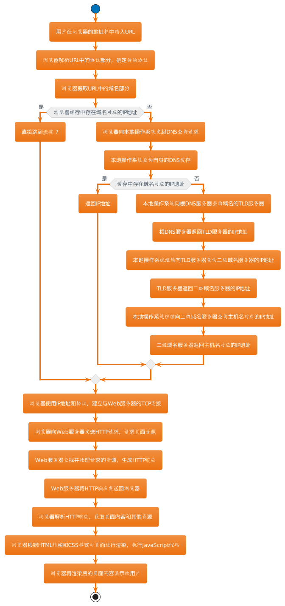
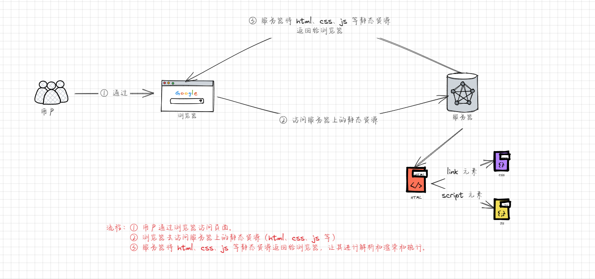
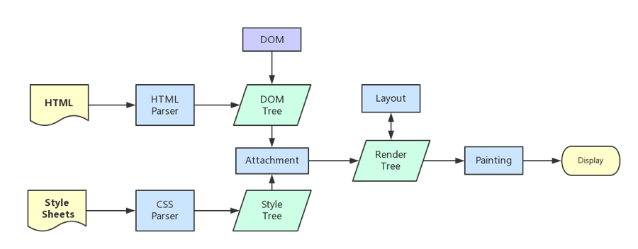
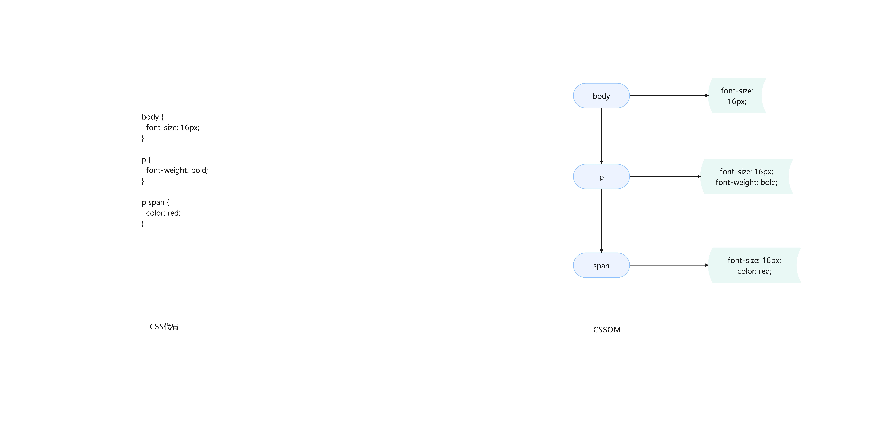
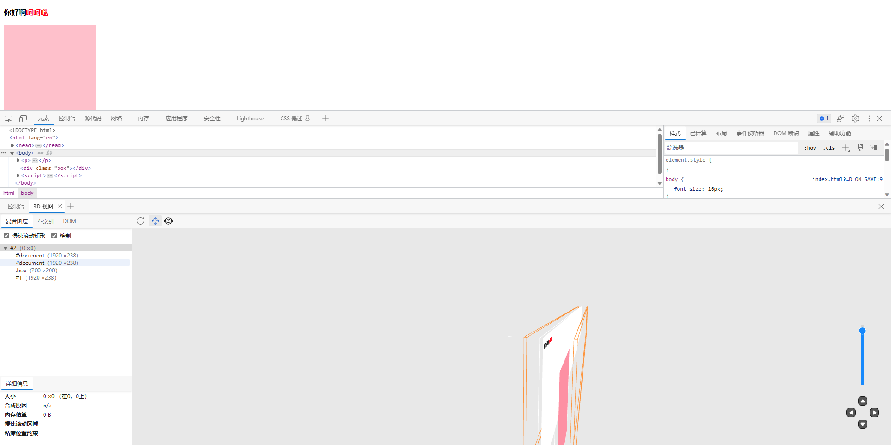
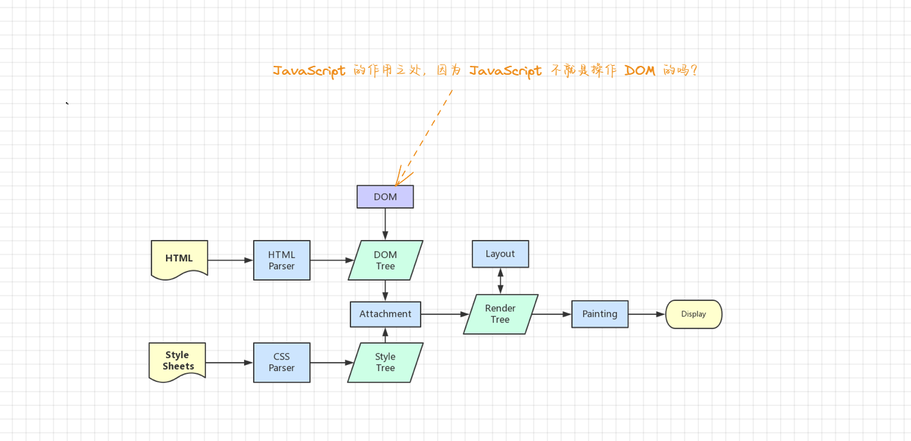
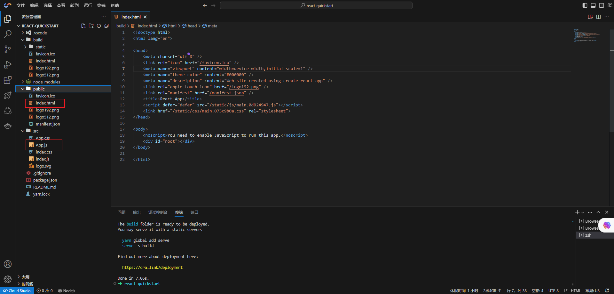
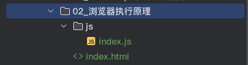

# 第一章：网页的解析过程

## 1.1 概述

* 网页的解析过程（一个网页 URL 从输入到浏览器页面显示，经历过怎么样的解析过程）：
  * ① 用户输入网址：用户在浏览器的地址栏中输入 URL（例如：https://www.example.com）。
  * ② 协议解析：浏览器解析 URL 中的协议部分，确定要使用的传输协议。
  * ③ 域名解析：浏览器提取 URL 中的域名部分。如果浏览器缓存中存在域名对应的 IP 地址，则直接跳到步骤 7；否则，执行以下步骤。
  * ④ 发起 DNS 查询：浏览器向本地操作系统发起 DNS 查询请求，以查找域名对应的 IP 地址。
  * ⑤ 本地 DNS 解析：本地操作系统查询自身的 DNS 缓存，如果缓存中存在域名对应的 IP 地址，则返回 IP 地址；否则，执行以下步骤。
  * ⑥ 递归 DNS 解析：本地操作系统将发起递归的DNS解析请求，向根 DNS 服务器查询域名的顶级域名服务器（TLD 服务器）。
  * ⑦ TLD 服务器查询：根 DNS 服务器返回 TLD 服务器的 IP 地址，本地操作系统继续向 TLD 服务器查询二级域名服务器的 IP 地址。
  * ⑧ 二级域名服务器查询：TLD 服务器返回二级域名服务器的 IP 地址，本地操作系统继续向二级域名服务器查询主机名对应的 IP 地址。
  * ⑨ IP 地址返回：二级域名服务器返回主机名对应的 IP 地址，本地操作系统将 IP 地址返回给浏览器。
  * ⑩ 建立连接：浏览器使用获取到的 IP 地址和协议，建立与 Web 服务器的 TCP 连接。
  * ⑪ 发送 HTTP 请求：浏览器向 Web 服务器发送 HTTP 请求，请求页面资源。
  * ⑫ 服务器处理：Web 服务器接收到请求，查找并处理请求的资源，然后生成 HTTP 响应。
  * ⑬ 响应返回：Web 服务器将生成的 HTTP 响应发送回浏览器。
  * ⑭ 响应解析：浏览器解析 HTTP 响应，获取页面内容以及其他资源。
  * ⑮ 页面渲染：浏览器根据 HTML 结构和 CSS 样式对页面进行渲染，同时执行 JavaScript 代码。
  * ⑯ 显示页面：浏览器将渲染后的页面内容显示给用户。

* 其流程图如下所示：



## 1.2 简化网页解析过程（前端相关内容，⭐）

* 这里，对流程进行简化，只摘取`前端`相关部分，如下：



> 注意：
>
> * 浏览器并不会将 html、css 和 js 等静态资源一起下载，而是先下载 html 文件，对 html 文件进行解析并构建 DOM 树。
> * 在构建 DOM 树的时候，如果遇到外部样式表（link 元素），浏览器才会开始下载 css 文件，但是并不会阻塞浏览器的解析，而是会继续构建 DOM 树；这样做的原因就是为了提高页面的渲染速度和用户体验。
> * 同理，遇到外部 js 文件（script 元素），浏览器会开始下载 js 文件，但是和 css 不一样的是，会阻塞浏览器的解析，直到 js 文件下载完之后，并立即执行 js 中的代码；所以，建议将 script 元素写在 body 元素中的最后一行。


# 第二章：浏览器渲染流程（⭐）

## 2.1 常见的浏览器内核

* 常见的浏览器内核：
  * Trident （ 三叉戟）：~~IE 浏览器~~。
  * Gecko（ 壁虎） ：Mozilla Firefox。
  * Presto（急板乐曲）-> Blink （眨眼）：Opera 。
  * Webkit ：Safari 。
  * Webkit -> Blink ：Google Chrome，Edge 。

* 我们经常说的`浏览器内核`指的是`浏览器的排版引擎`，也可以称为`排版引擎`（`浏览器引擎`、`页面渲染引擎`或`样版引擎`）。

## 2.2 浏览器渲染页面的流程

### 2.2.1 概述

*  浏览器渲染页面的详细过程：
  * ① 构建文档对象模型（DOM）：浏览器下载 HTML 文件并解析它，创建一个 DOM 树，表示文档的结构。DOM 树是由一系列的元素节点（如标签）和文本节点组成的。
  * ② 构建 CSS 对象模型（CSSOM）：浏览器下载外部 CSS 文件并解析它，创建一个 CSSOM 树，表示文档的样式信息。CSSOM 树包括了 CSS 规则、选择器和样式属性。
  * ③ 合并 DOM 和 CSSOM，创建渲染树：将 DOM 树和 CSSOM 树合并，生成渲染树（Render Tree）。渲染树只包含需要显示的元素及其样式，用于准备页面的实际渲染。
  * ④ 布局（Layout）：渲染树中的每个元素都被分配一个在屏幕上的精确位置和大小。这个过程被称为布局或重排（reflow）。浏览器计算元素的几何属性，如：位置、大小等。
  * ⑤ 绘制（Painting）：根据布局信息，浏览器开始绘制页面的每个元素。这个过程包括：填充颜色、绘制边框、渲染文本等。
  * ⑥ 栅格化（Rasterization）：将绘制的图形转换成位图，以便在屏幕上显示。这包括将矢量图形转换为像素。
  * ⑦ 合成（Composition）：将多个图层（例如：页面内容、滚动条、浮动元素等）合成为最终的屏幕图像。这个过程包括透明度处理和层叠顺序。
  * ⑧ 显示（Display）：最终的图像被发送到屏幕上显示给用户。

* 其图示如下：



### 2.2.2 解析一：HTML  的解析过程

* 默认情况下，服务器会将 index.html 文件返回给浏览器；所以，解析 HTML 文件是所有步骤的开始。
* 浏览器在解析 HTML 的时候，会在内存中构建 DOM Tree（DOM 树）。


### 2.2.3 解析二：CSS 的解析过程

* 在解析 HTML 的过程中，如果遇到 link 元素，那么浏览器开启新的线程去下载对应的 CSS 文件（下载 CSS 文件的时候不会阻塞 DOM 的解析）。
* 当浏览器下载完 CSS 文件后，就会对 CSS 文件进行解析，`解析出对应的规则树`，我们称之为 `CSSOM（CSS Object Model，CSS 对象模型）`。




### 2.2.4 解析四：构建渲染树（Render Tree）

* 当有了 DOM Tree 和 CSSOM  Tree 之后，就可以将两个结合（Attachment，附着）来构建 Render Tree （渲染树）了。


> 注意：
>
> * ① link 元素不会阻塞 DOM Tree 的构建过程，但是会阻塞 Render Tree 的构建过程。因为 Render Tree 在构建的时候，需要对应的 CSSOM Tree。
> * ② Render Tree 和 DOM  Tree 并不是一一对应的关系，因为对于 display 为 none 的元素，压根不会出现在 Render Tree 上。

### 2.2.5 解析四：布局（Layout）

* 在渲染树（Render Tree）上运行`布局（Layout）`以计算每个节点的几何体。
* 渲染树会表示显示哪些节点以及其他样式，但是`不表示每个节点的尺寸、位置`等信息；
* 布局是确定呈现树中`所有节点的宽度、高度和位置`信息。

### 2.2.6 解析五：绘制（Painting）

* 根据布局信息，浏览器开始绘制页面的每个元素。这个过程包括：填充颜色、绘制边框、渲染文本等。


# 第三章：回流和重绘解析（⭐）

## 3.1 回流（reflow，重排）

* 第一次确定节点的大小和位置，称之为布局（layout）；之后对节点的大小和位置修改引起重新计算，称之为回流。

> 注意：回流是一种计算密集型操作，可能会导致性能问题，因此在前端开发中需要注意如何减少回流的频率。

* 什么情况下，会引起回流？
  * ① 添加或删除可见的 DOM 元素：会影响其他元素的布局。
  * ② 改变元素的几何属性：改变元素的尺寸（宽度、高度）、位置（top、left）、边距（margin）、边框（border）、填充（padding）、字体大小（font-size）等。
  * ③ 改变窗口 resize（尺寸） ：当浏览器窗口大小发生变化时，页面中的元素可能需要重新布局。
  * ④ 激活CSS伪类：如 `:hover`、`:active` 等，改变元素的样式可能影响其几何属性。
  * ⑤ 修改元素的内容：当文本内容发生变化时，可能会导致父元素尺寸的变化。
  * ⑥ 调用 getComputedStyle 方法获取尺寸、位置信息。

* 为了避免不必要的回流，可以采取以下的措施：
  * ① 使用 CSS 动画：CSS 动画使用 GPU 来执行，性能通常较好，避免了频繁的回流。可以使用`transform`和`opacity`等属性来实现动画效果。
  * ② 修改样式时尽量一次性修改：避免多次修改单个元素的样式，最好将多个样式的修改集中到一起，这样可以减少回流的次数。
  * ③ 尽量避免强制同步布局属性：一些属性（``offsetWidth`、`offsetHeight`、`getComputedStyle`等）会强制浏览器进行同步布局操作，尽量避免在频繁执行的代码中过多地使用这些属性。
  * ④ 使用文档片段：当需要添加多个 DOM 元素时，可以使用文档片段（DocumentFragment）来进行操作，最后一次性添加到 DOM 树中，减少回流次数。
  * ⑤ `使用虚拟 DOM ：在一些 JavaScript 框架（如：React、Vue）中，使用虚拟 DOM 可以优化 DOM 更新的过程，减少回流。`
  * ⑥ 使用`requestAnimationFrame`：在进行动画等操作时，使用`requestAnimationFrame`来执行更新，浏览器会在下一次重绘时进行回流和重绘，从而减少性能损耗。

> 总结：减少回流次数是优化前端性能的重要手段之一，开发者可以通过合理的操作和技术选择来减少回流的影响。

## 3.2 重绘（repaint）

* 第一次渲染内容称之为绘制（paint），之后重新渲染称之为重绘。
* 什么情况下，会引起重绘？
  * ① 修改元素的样式属性：当修改元素的样式属性（改背景色、文字颜色、边框颜色、样式）时，浏览器可能会触发重绘，因为样式的改变会影响元素的外观。
  * ② 页面滚动：页面滚动时，浏览器需要重新绘制可见区域的内容。
  * ③ 添加、删除伪类：激活或取消激活元素的伪类（如：`:hover`、`:active`）会导致重绘。
  * ④ 修改背景图片或渐变：改变元素的背景图片、颜色渐变等会引起重绘。

> 注意：
>
> * 重绘本身的成本通常比回流要小，通常而言，一般会考虑避免不重要的回流。
> * 回流一定会引起重绘，回流是一件很消耗性能的事情，所以在开发中要尽量避免发生回流。


# 第四章：合成和性能优化

* 合成（Composition）：将多个图层（例如：页面内容、滚动条、浮动元素等）合成为最终的屏幕图像。这个过程包括透明度处理和层叠顺序。
* 合成是浏览器的一种优化手段。
* 默认情况下，标准流中的内容都会被绘制在同一个图层（Layer）中；但是，一些特殊的属性，会创建一个新的合成层（Compositing Layer），并且新的图层可以利用 GPU 来加速绘制，因为`每个合成层都是单独渲染`的。
* 下面是常见的可以形成新的合成层的属性：
  * `3D transforms`
  * `video`、`canvas`、`iframe`
  * `opacity 动画转换时`
  * `position: fixed`
  * `will-change`：一个实验性的属性，提前告诉浏览器元素可能发生哪些变化
  * `animation 或 transition 设置了opacity、transform`

> 注意：分层确实可以提高性能，但是它以内存管理为代价，因此不应作为 web 性能优化策略的一部分过度使用。


* 证明：合成的存在

```html
<!DOCTYPE html>
<html lang="en">
<head>
  <meta charset="UTF-8">
  <meta content="IE=edge" http-equiv="X-UA-Compatible">
  <meta content="width=device-width, initial-scale=1.0" name="viewport">
  <title>Title</title>
  <style>
    body {
      font-size: 16px;
    }

    p {
      font-weight: bold;
    }

    p span {
      color: red;
    }

    .box {
      width: 200px;
      height: 200px;
      background-color: pink;
      position: fixed;
    }
  </style>
</head>
<body>
  <p>你好啊<span>呵呵哒</span></p>

  <div class="box"></div>
</body>
</html>
```




# 第五章：defer 和 sync 属性（⭐）

## 5.1 概述

* 回顾一下，浏览器的渲染过程：



* 那么，HTML 文件中的 script 元素和 JavaScript 的关系是什么？
  * 其实，浏览器在解析 HTML 的过程中，`遇到 script 元素是不会继续构建 DOM 树的`。
  * 它会`停止继续构建`，然后`下载 JavaScript 代码`，并`执行 JavaScript 代码`。
  * 只有`等到 JavaScript 代码执行结束后`，才会`继续解析 HTML` ，`构建 DOM 树`。
* 为什么要这么做？
  * 因为 `JavaScript 其实就是用来操作 DOM 以及修改 DOM 的`。
  * 如果我们`等到 DOM 树构建完毕并且渲染的时候`，`再去执行 JavaScript 代码`，`会造成严重的回流和重绘`，`影响页面的性能`。
  * 所以，`当在 解析 HTML 的时候`，`如果遇到 script 元素时`，`优先下载和执行 JavaScript 代码`，`再继续构建 DOM 树`。


* 但是，在现代开发模式（React、Vue 等）中，如下所示（React 项目）：



* 我们可以发现整个项目中就`一个 index.html 的文件`，`其余的都是 css 或 js 文件`，那么`浏览器需要处理的时间更长（因为 js 比 html 要多）`，如下所示：

```html
<!doctype html>
<html lang="en">

<head>
    <meta charset="utf-8" />
    <link rel="icon" href="/favicon.ico" />
    <meta name="viewport" content="width=device-width,initial-scale=1" />
    <meta name="theme-color" content="#000000" />
    <meta name="description" content="Web site created using create-react-app" />
    <link rel="apple-touch-icon" href="/logo192.png" />
    <link rel="manifest" href="/manifest.json" />
    <title>React App</title>
    <!-- 遇到 script 元素会阻塞页面的解析 -->
    <script src="/static/js/main.0d924947.js"></script>
    <link href="/static/css/main.073c9b0a.css" rel="stylesheet">
</head>

<body>
    <noscript>You need to enable JavaScript to run this app.</noscript>
    <div id="root"></div>
</body>

</html>
```

* `会造成页面的解析阻塞`，`在 JavaScrpit 文件下载并执行完成之前`，`用户在界面上什么也看不到`；那么，现在的开发模式，又是怎么解决这个问题的？

```html
<!doctype html>
<html lang="en">

<head>
    <meta charset="utf-8" />
    <link rel="icon" href="/favicon.ico" />
    <meta name="viewport" content="width=device-width,initial-scale=1" />
    <meta name="theme-color" content="#000000" />
    <meta name="description" content="Web site created using create-react-app" />
    <link rel="apple-touch-icon" href="/logo192.png" />
    <link rel="manifest" href="/manifest.json" />
    <title>React App</title>
    <!-- script 元素提供了两个属性 defer 和 async -->
    <script defer src="/static/js/main.0d924947.js"></script>
    <link href="/static/css/main.073c9b0a.css" rel="stylesheet">
</head>

<body>
    <noscript>You need to enable JavaScript to run this app.</noscript>
    <div id="root"></div>
</body>

</html>
```

* 如果，我们将 React 项目打包之后，就会形成上面的代码，会发现 `script` 元素上出现了 `defer` 属性；这也是，现在开发模式为了解决这个问题的思路之一（其实，`script` 元素还有 `async` 属性）。

> 注意：这只是现代开发框架解决性能的方式之一，像 React 等还通过异步渲染、调度算法、虚拟列表、懒加载、代码分割等来进一步提高页面的性能和用户体验。

* 那么，`script` 元素的 `defer` 属性和 `async` 属性到底有什么作用？

## 5.2 defer 属性

* `defer` 属性可以`告诉浏览器不要等待 JavaScript 脚本下载`，`而是继续解析 HTML，构建 DOM  Tree`。
  * `JavaScript 脚本是由浏览器开启一个新的线程来进行下载的，所以不会阻塞 DOM Tree 的构建过程`。
  * `如果 JavaScript 脚本提前下载好了，它会等到 DOM Tree 构建完成，在 DOMContentLoaded 事件之前先执行 defer 中的代码`。
* 所以，`DOMContentLoaded` 总是会等待 `defer` 中的代码`先执行完毕`；并且，`多个带有 defer 的脚本是可以保证正确的顺序执行的`。
* `从某种角度而言，defer 可以提高页面的性能，推荐放到 head 元素中`。

> 注意：
>
> * 在实际开发中，我们都是结构、样式和行为分离的；换言之，就是 html、css 和 js 文件独立的；不会，一股脑的都写到 html 中的。
> * defer 仅适用于外部的脚本，对于 script 中的内容默认是忽略的。


* 示例：
* 项目结构：



* index.html

```html
<!DOCTYPE html>
<html lang="en">
<head>
  <meta charset="UTF-8">
  <meta content="IE=edge" http-equiv="X-UA-Compatible">
  <meta content="width=device-width, initial-scale=1.0" name="viewport">
  <title>Title</title>
  <style>
    body {
      font-size: 16px;
    }

    p {
      font-weight: bold;
    }

    p span {
      color: red;
    }

    .box {
      width: 200px;
      height: 200px;
      background-color: pink;
      position: fixed;
    }
  </style>
  <!-- 从某种角度来说，defer可以提高页面的性能，并且推荐放到head元素中  -->
  <script defer src="./js/index.js"></script>
</head>
<body>
  <p>你好啊<span>呵呵哒</span></p>

  <div class="box"></div>

  <script>
    window.addEventListener('DOMContentLoaded', function () {
      console.log(abc)
    })
  </script>
</body>
</html>
```

* js/index.js

```js
var abc = "123"
```

## 5.3 async 属性

* async 属性与 defer 有些类似，它也`能够让脚本不阻塞页面`。
* async 是让一个脚本完全独立的:
  *  浏览器`不会因 async 脚本而阻塞（与 defer 类似）`。
  * `async 脚本不能保证顺序，它是独立下载、独立运行，不会等待其他脚本`。
  * `async 不会能保证在 DOMContentLoaded 之前或者之后执行`。

## 5.3 应用场景

* defer 和 async 是用于控制 JavaScript 脚本加载和执行的两个属性，常用于 script 元素中。
  * defer 属性用于指定脚本的延迟加载，即脚本会在 HTML 解析完毕后再执行。defer 脚本会按照它们在 HTML 中出现的顺序依次加载，但是在整个文档解析完成之后才会执行。defer 适用于那些不需要立即执行的脚本，例如：统计代码、初始化脚本等。使用 defer 属性可以避免脚本阻塞 HTML 解析，提高页面加载性能。
  * async 属性用于指定脚本的异步加载和执行，即脚本的加载和执行不会阻塞 HTML 解析。async 脚本会在加载完成后立即执行，不考虑其在 HTML 中的顺序。async 适用于那些不依赖于其他脚本的独立脚本，例如：一些独立的功能模块、第三方库等。使用 async 属性可以加快页面加载速度，但是需要注意脚本之间的依赖关系。
* 应用场景：
  * 当脚本不需要立即执行，且依赖于其他脚本时，可以使用 defer 属性。
  * 当脚本独立，不依赖于其他脚本时，可以使用 async 属性。
  * 当需要控制脚本的加载顺序，并且不希望脚本阻塞 HTML 解析时，可以使用 defer 属性。

> 注意：defer 和 async 属性只对外部脚本（通过 src 属性引入的脚本）有效，内联脚本（直接在 script 元素中编写的脚本）会忽略这两个属性。
