# 第一章：深入 V8 引擎原理

## 1.1 回顾浏览器的内核

* 浏览器内核是由两部分组成的，以 webkit 为例：
  * WebCore：负责 HTML 解析、布局、渲染等等相关的工作。
  * JavaScriptCore：解析、执行 JavaScript 代码。


* 其中，V8 引擎是 JavaScript 引擎的一种实现。

## 1.2 V8 引擎的执行原理

### 1.2.1 概述

* 官方对 V8 引擎的定义：
  * V8 是用 C ++ 编写的 Google 开源高性能 `JavaScript` 和 `WebAssembly` 引擎，它用于 `Chrome` 和 `Node.js` 等。
  * 它实现了 `ECMAScript` 和 `WebAssembly`，并在 Windows 7 或更高版本，macOS 10.12+ 和使用 x64，IA-32，ARM 或MIPS 处理 器的 Linux系统上运行。
  * V8 可以独立运行，也可以嵌入到任何 C ++ 应用程序中。

> 注意：
>
> * V8 是跨平台的；所以，和 Java 类似，JavaScript 也是跨平台的。
> * Java 借助 JVM 实现跨平台，而 JavaScript 借助 V8 引擎实现跨平台。

* V8 引擎的执行流程：
  * ① 解析：V8 首先会将输入的 JavaScript 代码进行词法分析和语法分析，生成抽象语法树（AST）。
  * ② 编译：V8 会将 AST 转换为字节码，然后通过解释器将字节码转换为机器码。这个过程被称为即时编译（Just-in-Time Compilation，JIT）。
  * ③ 优化：V8 会根据代码的执行情况进行动态优化。它会收集代码的执行数据，进行分析和优化，以提升代码的执行效率。V8 使用了许多优化技术，如内联缓存、嵌套内联、去虚拟化等。
  * ④ 执行：最后，V8 执行优化后的机器码，将 JavaScript 代码转化为计算机可以理解和执行的指令。执行过程中，V8 会利用即时编译器和解释器进行动态切换，以提供更高的性能和更低的内存占用。

* 其流程图如下：

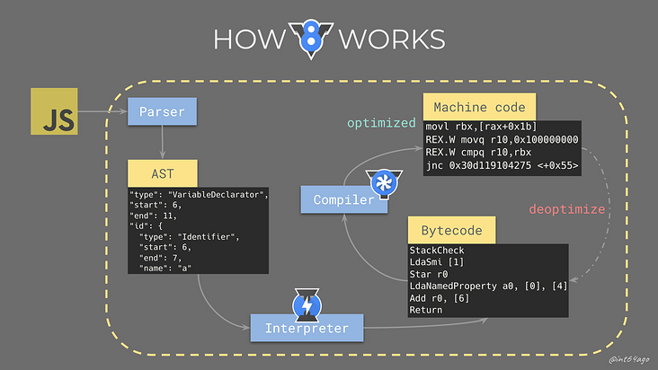

* 总而言之，V8 引擎通过解析、编译、优化和执行的过程，将 JavaScript 代码转化为机器码并执行。其关键在于即时编译和动态优化的技术，以及对 JavaScript 语言特性的深入理解和优化。这些特性使得 V8 成为一款高效且性能出色的 JavaScript 引擎。

### 1.2.2 名词解释 --- 解析

* 解析流程：
  * V8 需要做的第一件事是下载源代码，这可以通过网络、缓存或 service workers 来完成。
  * 一旦接收到代码，以编译器可以理解的方式来改变它。这个过程被称为解析（parsing），由两部分组成：扫描器（scanner）和解析器（parser）本身。
  * 扫描器（scanner）接收 JS 文件并将其转换为已知的标记列表。
  * 解析器（parser）识别它并创建一个 抽象语法树（AST）：源代码的树状表示。树上的每个节点都表示代码中出现的一个结构。

* 其流程如下：

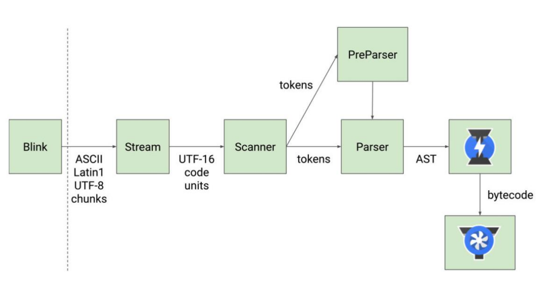

### 1.2.3 名词解释 --- 编译

* 一般来说，为了使你的代码能够执行，编程语言需要被转化为机器代码。对于如何以及何时发生这种转换，有几种方法：
  * ① 超前编译：在编译阶段，代码在程序执行之前就被转化为机器代码了。很多编译型语言采用这种方法，如：C、C++ 等。
  * ② 即时编译：每一行代码都将在运行时执行，这种方法通常被动态类型语言采用，因为在执行之前不能确定确切的类型，如：JavaScript 、Python 等。
* 提前编译可以一起评估所有代码，它可以提供更好的优化并最终生成更高性能的代码。但是，解释型语言（动态类型语言）更容易实现，但它通常比提前编译慢。
* 为了更快、更有效地为动态语言转换代码，创建了一种称为即时（JIT）编译的新方法，它最好地结合了解析和编译。
* 在使用解释（interpretation）作为基础方法的同时，V8 可以检测到比其他函数更频繁使用的函数，并使用以前执行的类型信息对其进行编译。
* 然而，类型有可能会发生变化。我们需要对已编译的代码进行去优化，转而返回到解释（之后，我们可以在得到新的类型反馈后重新编译函数）。

```js
function add(num1,num2){
    return num1 + num2;
}

add(1,2); 
add(1,2);
add(1,2);
add(1,2); // 如果一直传入的数字类型，就可以编译为机器码，这样速度更快

add("a","b"); // 但是，这边的语义发生了变化，是字符串的拼接，而不是数值的相加，如果直接采用机器码，就会出错，所以还需要转换为字节码
```

### 1.2.4 名词解释 --- Interpreter（解释器）

* V8 使用一个叫做 `Ignition` 的解释器，会将 AST 转换成 ByteCode（字节码）。
* 同时会收集 TurboFan 优化所需要的信息（比如函数参数的类型信息，有了类型才能进行真实的运算）。
* 如果函数只调用一次，Ignition 会解释执行 ByteCode ；

### 1.2.5 名词解释 --- 执行

* 如果一个函数被多次调用，那么就会被标记为`热点函数`，那么就会经过 `TurboFan` 转换成`优化的机器码`，提高代码的执行性能。
* 但是，`机器码实际上也会被还原为 ByteCode`，这是因为如果后续执行函数的过程中，`类型发生了变化`（比如 sum 函数原来执 行的是 number 类型，后来执行变成了 string 类型），`之前优化的机器码并不能正确的处理运算`，`就会逆向的转换成字节码`。

> 注意：其实，TypeScript 的出现就是为了解决这种问题的；TypeScript 提供了类型系统，它的出现，让 JavaScript 由动态语言变为了静态语言，并且使得 JavaScript 的性能得到提高，因为某种程度上讲，不需要逆向转换为字节码。

## 1.3 即时编译的好处（⭐）

* 即时（JIT）编译是指在`程序运行时`将`源代码`转换为`机器代码`的一种编译技术。在 JavaScript 中，即时编译器将 JavaScript 代码转换为可执行的机器代码，以提高代码的执行速度。
* `传统的 JavaScript 解释器将逐行解释JavaScript代码`，这种解释执行的方式速度较慢。而即时编译器在程序运行之前会先对代码进行分析，然后将热点代码（被频繁执行的代码）进行编译成机器码，以提高执行速度。
* 即时编译器通常会使用一些优化技术，如：内联缓存、类型推断和代码内联等，以进一步提高代码的执行效率。这些优化技术可以根据代码的特征和执行情况来动态地生成更高效的机器码。
* 通过使用即时编译器，JavaScript 代码的执行速度可以大大提高，使得J avaScript 能够处理更复杂的任务和更大的数据量。许多现代的 JavaScript 引擎，如：V8 引擎和 SpiderMonkey 引擎，都使用了即时编译技术来提高 JavaScript 代码的执行效率。

## 1.4 即时编译的过程（⭐）

* 实际上，即时（JIT）编译器在 JavaScript 引擎执行代码时，将代码动态地编译为机器码。这个过程是在运行时进行的。
* 当 JavaScript 引擎执行代码时，它会逐行解析代码，并将其转换为抽象语法树（AST）。然后，即时编译器会根据 AST 生成中间表示形式（IR），并对 IR 进行优化。这些优化包括消除冗余代码、内联函数调用、类型推断等。
* 接下来，即时编译器会将优化后的 IR 转换为机器码，以便在运行时执行。这个过程是动态的，即时编译器会根据代码的执行情况和特征来决定是否进行编译，并生成更高效的机器码。
* 因此，即时编译器的编译和运行是同时进行的。编译器会根据代码的执行情况和特征来动态地生成更高效的机器码，以提高 JavaScript 代码的执行速度。

> 注意：从微观的角度而言，即时编译器还是先需要进行编译，然后再执行；只不过，和静态语言（如：C 等）不同的是，静态语言是需要手动的先编译，再执行。而即时编译器的编译和执行时一起的，全自动的，从而在宏观角度上看上去是直接执行的。


# 第二章：JavaScript 的执行上下文（⭐）

## 2.1 概述

* 如果我们有下面的代码，那么 JavaScript 是如何被执行的？

```html
<!DOCTYPE html>
<html lang="en">
<head>
  <meta charset="UTF-8">
  <meta content="IE=edge" http-equiv="X-UA-Compatible">
  <meta content="width=device-width, initial-scale=1.0" name="viewport">
  <title>Title</title>
</head>
<body>
  <script>
    var message = "Global Message"

    function foo() {
      var message = "Local Message"
      console.log('foo', message)
    }

    var num1 = 10
    var num2 = 20
    var result = num1 + num2
    console.log(result)

    foo()

  </script>
</body>
</html>
```

## 2.2 初始化全局对象（Global Object）

* JavaScript 引擎`在执行代码之前`，会在`堆内存`中`创建`一个`全局对象`（Global Object，GO）：
  * 该对象`所有的作用域（scope）`都可以访问。
  * 该对象中包含 `Date`、`Array`、`String`、`Number`、`setTimeout`、`setInterval` 等对象和方法。
  * 还有一个 `window` 属性指向自己。

> 注意：
>
> * 全局对象，在 ES 规范中已经有了一个统一的名称，就是 globalThis。
> * 在浏览器中，globalThis 还有一个别名是 window，在 Node.js 中有一个别名是 global；之所以这么做的原因是为了兼容之前的 ES 版本。

* 其图示如下：

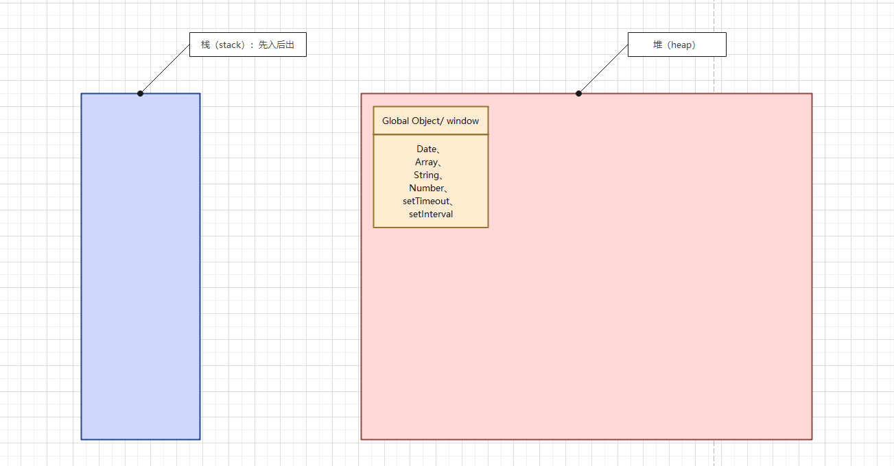

* 证明（初始化全局对象）：使用浏览器的 devtools 来调试

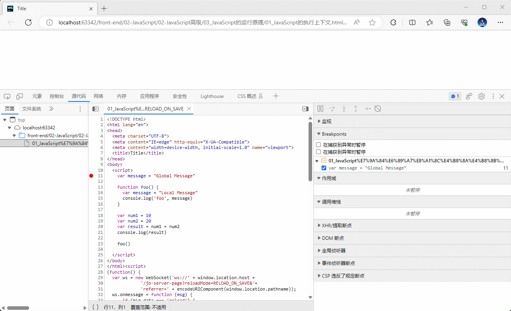

## 2.3 数据结构中的栈

* 在数据结构中的`栈`的特点是：`先入后出`。


## 2.4 执行上下文（Execution Context）

### 2.4.1 概述

* JavaScript 引擎内部有一个`执行上下文栈（Execution Context Stack，简称 ECS）`，它用于执行`代码的调用（堆）栈`。

* `全局代码块`的执行会构建一个 `全局执行上下文（Global Execution Context，简称 GEC）`，并且 `全局执行上下文（Global Execution Context，简称 GEC）` 会`放入`到 `执行上下文栈（Execution Context Stack，简称 ECS）` 中执行。

> 注意：
>
> * 在浏览器环境中，全局代码块通常是指在 `<script>` 标签中直接编写的代码。
> * 在 Node.js 环境中，全局代码块可以是在文件的最外层编写的代码。
> * 无论是在浏览器还是在 Node.js 环境中，全局代码块都是在全局作用域中执行的。
> * 在 ES5 中，只有全局作用域和函数作用域，所以函数的执行也会形成自己的执行上下文。

* 全局执行上下文（Global Execution Context，简称 GEC）在放入到 EC 中会包含两部分内容：

  * ① 在代码执行前，即在 `解析` 节点，会将`全局定义的变量`、`函数`等放到`全局对象（Global Object，GO）`中，但是并`没有赋值`，这个过程也称为`变量`或`函数`的`作用域提升`。

  * ② 在代码执行时，对`变量`进行`赋值`，或者`执行其它的函数`。

### 2.4.2 VO 对象（Variable Object）

* 每一个`执行上下文`会关联一个 `VO（Variable Object，变量对象）`，`变量`和`函数声明`会被添加到这个 `VO` 对象中。并且，当`全局代码被执行`的时候，`VO` 就是 `GO` 对象。
* 那么，全局代码块执行前的流程，如下所示：

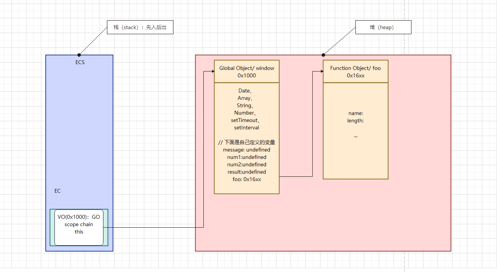

* 这也就能证明下面的代码，之所以全局变量都是 undefined ，而不是直接报错；因为，在堆内存中，全局变量已经在 GO 中定义了，并且默认值就是 undefined 。

```html
<!DOCTYPE html>
<html lang="en">
<head>
  <meta charset="UTF-8">
  <meta content="IE=edge" http-equiv="X-UA-Compatible">
  <meta content="width=device-width, initial-scale=1.0" name="viewport">
  <title>Title</title>
</head>
<body>
  <script>
    console.log(message, num1, num2) // undefined undefined undefined
    
    var message = "Global Message"

    function foo() {
      var message = "Local Message"
      console.log('foo', message)
    }

    var num1 = 10
    var num2 = 20
    var result = num1 + num2
    console.log(result)

    foo()

  </script>
</body>
</html>
```

* 那么，全局代码块执行后的流程，如下所示：

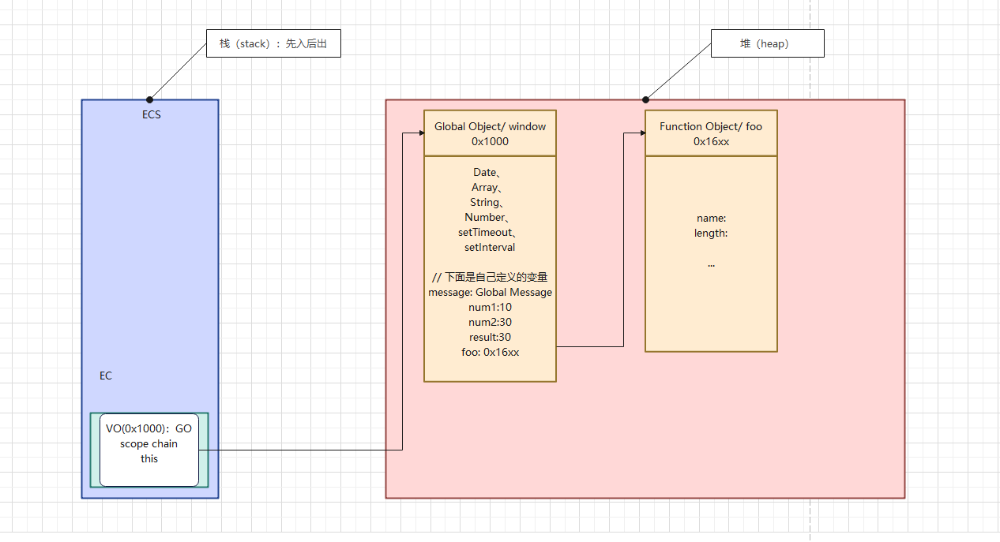

* 证明（执行上下文）：使用浏览器的 devtools 来调试

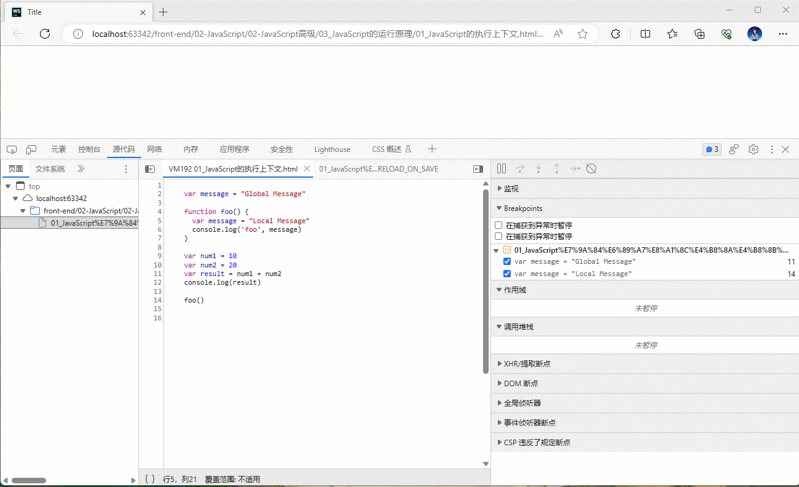

## 2.5 函数的执行

* 在执行的过程中`执行到一个函数的时候`，就会根据`函数体`创建`一个函数执行上下文（Functional Execution Context，简称 FEC）`，并压入到 `执行上下文栈（Execution Context Stack，简称 ECS）`中。
* 因为`每个执行上下文`都会关联一个 `VO`，那么函数执行上下文关联的 VO 是什么？
  * 当`进入一个函数执行上下文`的时候，会`创建一个 AO 对象（Activation Object）`。
  * 这个 AO 对象会`使用 arguments 作为初始化`，并且`初始值是传入的参数`。
  * 这个 AO 对象会`作为执行上下文的 VO 来存放变量的初始化`。
* 并且`函数执行上下文（Functional Execution Context，简称 FEC）`的 `scope chain` 会指向`函数的作用域链（scope chain）`。

> 注意：
>
> * 每次函数执行的时候，都会创建一个 VO ；并且，函数执行完毕之后，将会将 FEC 从 ECS 中弹出。
> * 函数的作用域链（scope chain）是一个列表，并且是编译期行为。

* 那么，函数的执行前的流程，如下所示：

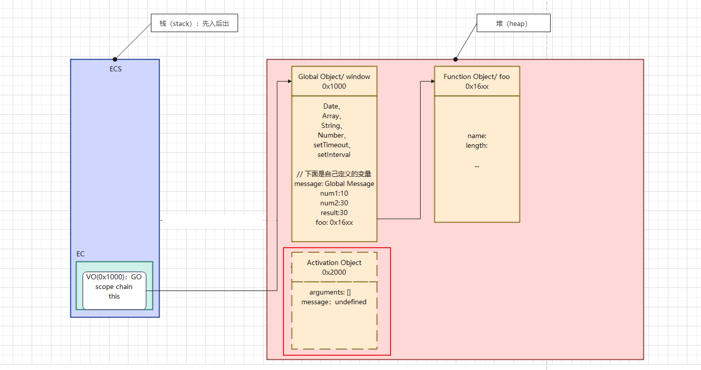

* 那么，函数的执行时的流程，如下所示：

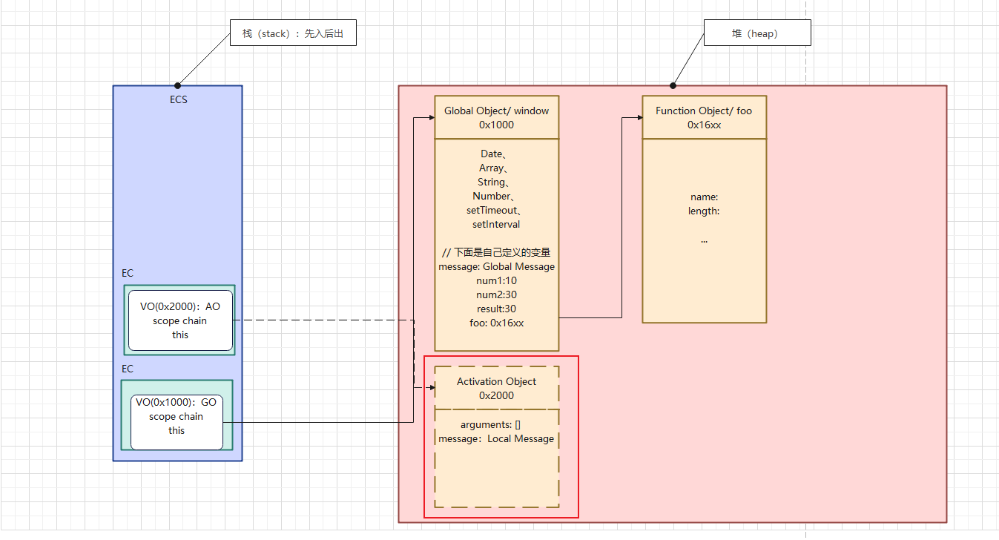

## 2.6 注意事项

* 全局变量（var 定义的，function 之外的变量）会在 ECS 执行上下文栈（Execution Context Stack，简称 ECS）执行；但是，根据 ECMA 的规范，全局变量还需要再 Global Object（GO，window）中保留一份，以属性（window.key = value）的形式。

> 注意：`下面的很多图示`，都没有画出在全局变量在 ECS 中执行的过程；但是，我们要记住这一点。

* 除了`全局变量`会引起`提升`外，`函数声明`也会进行`提升`。


# 第三章：作用域和作用域链（Scope Chain，⭐）

## 3.1 概述

* `作用域`指的是`变量`和`函数`的`可访问范围`。在 ES 5 中，JavaScript 的作用域分为`全局作用域`和`局部作用域`。
* `全局作用域`是指`在整个 JavaScript 程序中`都可以访问的`变量`和`函数`；换言之，在全局作用域中声明的变量和函数在任何地方都可以访问。

```js
<!DOCTYPE html>
<html lang="en">
<head>
  <meta charset="UTF-8">
  <meta content="IE=edge" http-equiv="X-UA-Compatible">
  <meta content="width=device-width, initial-scale=1.0" name="viewport">
  <title>Title</title>
</head>
<body>
  <script>
    /* 全局作用域是指在整个 JavaScript 程序中都可访问的变量和函数。在全局作用域中声明的变量和函数可以在任何地方被访问。 */
    var globalVariable = 10

    function globalFunction() {
      console.log('这个定义在全局作用域的函数')
    }

    console.log(globalVariable) // 10
    globalFunction() // 这个定义在全局作用域的函数

  </script>
</body>
</html>
```

* `局部作用域`是指`在函数内部`声明的`变量`和`函数`，它们`只能在函数内部访问`。

```html
<!DOCTYPE html>
<html lang="en">
<head>
  <meta charset="UTF-8">
  <meta content="IE=edge" http-equiv="X-UA-Compatible">
  <meta content="width=device-width, initial-scale=1.0" name="viewport">
  <title>Title</title>
</head>
<body>
  <script>
    /* 局部作用域是指在函数内部声明的变量和函数，它们只能在函数内部访问。 */
    function localScope() {
      var localVariable = 20;
      console.log(localVariable) // 输出 20
    }

    localScope()
    console.log(localVariable) // 报错，无法访问局部变量 localVariable is not defined

  </script>
</body>
</html>
```

* `作用域链`是指`在嵌套函数中访问变量时的一种机制`。当在内部函数中访问变量时，JavaScript 会先在当前函数的作用域中查找，如果找不到，则继续在外部函数的作用域中查找，直到找到该变量或者到达全局作用域。

```html
<!DOCTYPE html>
<html lang="en">
<head>
  <meta charset="UTF-8">
  <meta content="IE=edge" http-equiv="X-UA-Compatible">
  <meta content="width=device-width, initial-scale=1.0" name="viewport">
  <title>Title</title>
</head>
<body>
  <script>
    /*
    `作用域链`是指`在嵌套函数中访问变量时的一种机制`。
    当在内部函数中访问变量时，JavaScript 会先在当前函数的作用域中查找；
    如果找不到，则继续在外部函数的作用域中查找，直到找到该变量或者到达全局作用域。
    */
    var message = "Global Message"

    function foo() {
      var message = "foo message"

      function bar() {
        console.log(message)  // foo message
      }

      return bar
    }

    var bar = foo()
    bar()

  </script>
</body>
</html>
```

## 3.2 作用域的原理

* JavaScript 中的作用域原理是基于`词法作用域`的。词法作用域是指变量的可访问性是由代码在编译阶段决定的，而不是在运行时决定的。
* 在 JavaScript 中，每当定义一个函数时，就会创建一个新的作用域。作用域是由花括号 `{}` 界定的代码块，在其中声明的变量和函数只能在该作用域内部访问。
* 当在函数内部访问变量时，JavaScript 引擎会按照以下顺序查找变量：
  * ① 首先，在当前作用域中查找该变量。如果找到了，则使用该变量。
  * ② 如果在当前作用域中没有找到该变量，则继续在父级作用域中查找。这种嵌套的关系形成了作用域链。
  * ③ 如果在任何作用域中都找不到该变量，则会抛出一个引用错误。
* 由于作用域是在编译阶段确定的，因此 JavaScript 引擎在执行代码之前会对变量进行预处理。这个过程称为`变量提升`（hoisting）。变量提升会将变量的声明提升到作用域的顶部，但变量的赋值操作仍然保留在原来的位置。

```js
function example() {
  console.log(x); // 输出 undefined
  var x = 10;
  console.log(x); // 输出 10
}

example();
```

* 在上述示例中，变量 `x` 在函数内部进行了声明和赋值操作。在第一个 `console.log()` 语句中，由于变量提升的原因，`x` 被声明了，但尚未赋值，因此输出结果为 `undefined`。在第二个 `console.log()` 语句中，`x` 的赋值操作已经完成，因此输出结果为 `10`。

> 总结：JavaScript 的作用域原理是通过`词法作用域`和`作用域链`来确定变量的可访问性。作用域链是由函数的嵌套关系形成的，变量的查找是按照作用域链的顺序进行的。变量提升使得变量的声明在作用域的顶部进行，但赋值操作仍然保留在原来的位置。

## 3.3 作用域链的原理

* JavaScript 中的作用域链是一种机制，用于在内部函数中访问外部函数的变量。作用域链是通过函数的嵌套关系来实现的。

* 当一个函数被调用时，JavaScript 引擎会创建一个新的作用域，并将该作用域链接到当前函数的作用域链上。作用域链是一个由多个作用域组成的链表结构，每个作用域都有一个指向父级作用域的引用。

* 在执行函数内部的代码时，如果需要访问一个变量，JavaScript 引擎会按照以下顺序在作用域链上查找该变量：

  * ① 首先，在当前作用域中查找该变量。如果找到了，则使用该变量。
  * ② 如果在当前作用域中没有找到该变量，则继续在父级作用域中查找，直到找到该变量或者到达全局作用域。
  * ③ 如果在任何作用域中都找不到该变量，则会抛出一个引用错误。

* 这种机制保证了内部函数可以访问外部函数中的变量。当内部函数访问变量时，JavaScript 引擎会按照作用域链的顺序逐级向上查找，直到找到该变量或者到达全局作用域。

```js
function outerFunction() {
  var outerVariable = 30;

  function innerFunction() {
    console.log(outerVariable); // 输出 30
  }

  innerFunction();
}

outerFunction();
```

* 在上述示例中，内部函数 `innerFunction` 可以访问外部函数 `outerFunction` 中声明的变量 `outerVariable`。这是因为在执行内部函数时，JavaScript 引擎会先在内部函数的作用域中查找该变量，如果找不到，则继续在外部函数的作用域中查找，直到找到该变量或者到达全局作用域。
* 可以通过 Chrome 的 devtools 来调试：

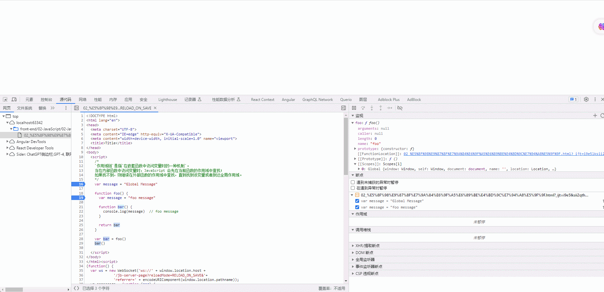

> 总结：JavaScript 中的作用域链是通过函数的嵌套关系来实现的。作用域链是一个由多个作用域组成的链表结构，每个作用域都有一个指向父级作用域的引用。当访问变量时，JavaScript 引擎会按照作用域链的顺序逐级向上查找该变量。这种机制保证了内部函数可以访问外部函数中的变量。

## 3.4 全局变量的查找演示

* 示例：

```html
<!DOCTYPE html>
<html lang="en">
<head>
  <meta charset="UTF-8">
  <meta content="IE=edge" http-equiv="X-UA-Compatible">
  <meta content="width=device-width, initial-scale=1.0" name="viewport">
  <title>Title</title>
</head>
<body>
  <script>
    
    console.log(message)
    var message = "Global Message"
    console.log(message)
  </script>
</body>
</html>
```

* 编译期的图示：

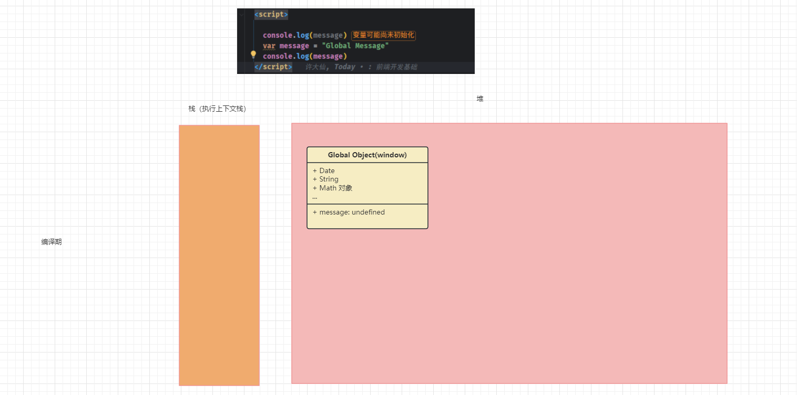

* 通过浏览器的 devtools 进行调试：

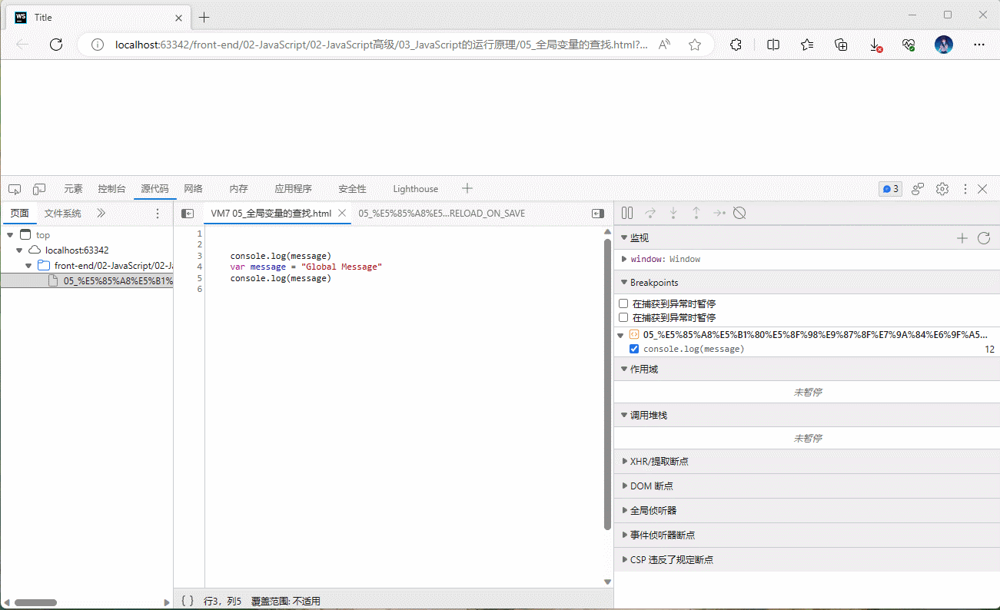

* 运行时的图示：

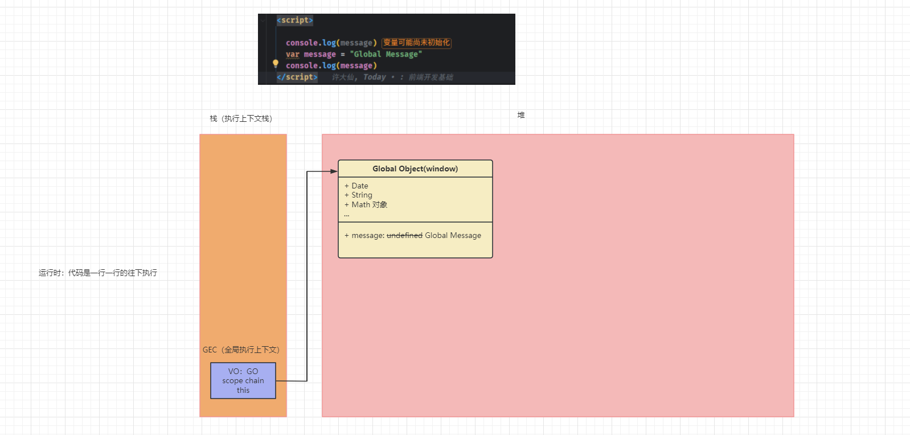

* 通过浏览器的 devtools 进行调试：

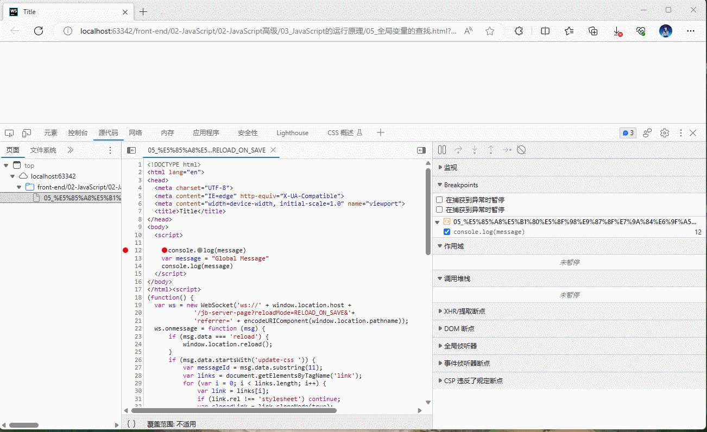

## 3.5 全局变量的查找演示

* 示例：

```html
<!DOCTYPE html>
<html lang="en">
<head>
  <meta charset="UTF-8">
  <meta content="IE=edge" http-equiv="X-UA-Compatible">
  <meta content="width=device-width, initial-scale=1.0" name="viewport">
  <title>Title</title>
</head>
<body>
  <script>

    var message = "Global Message"

    function foo() {
      var message = "Foo Message"
      console.log(message)
    }

    console.log(message)

  </script>
</body>
</html>
```

* 编译期的图示：

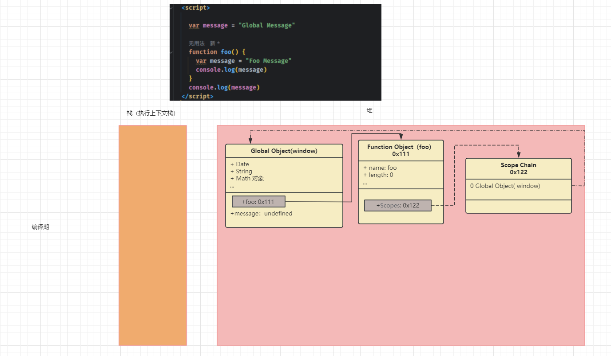

* 通过浏览器的 devtools 进行调试：


* 运行时的图示：

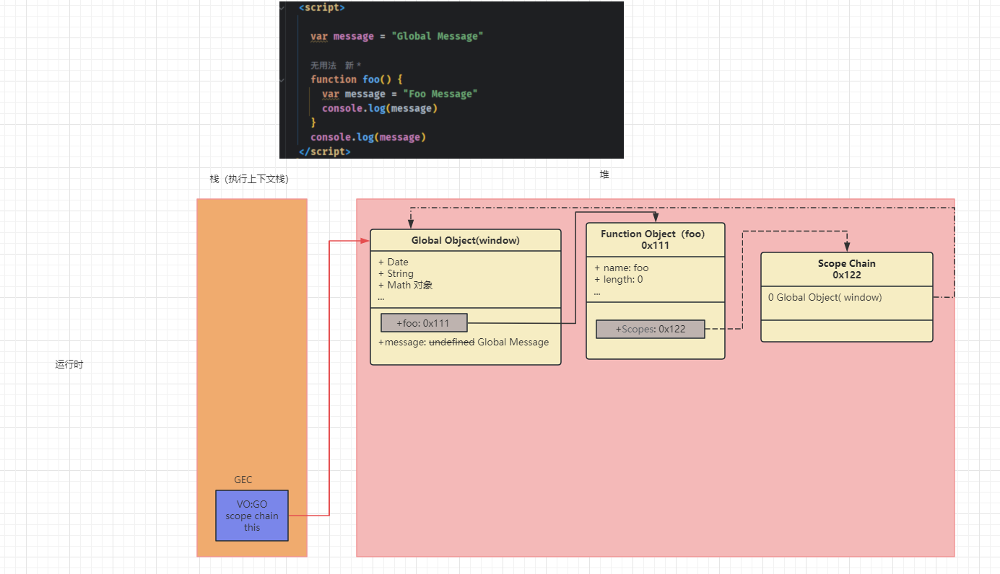

* 通过浏览器的 devtools 进行调试：

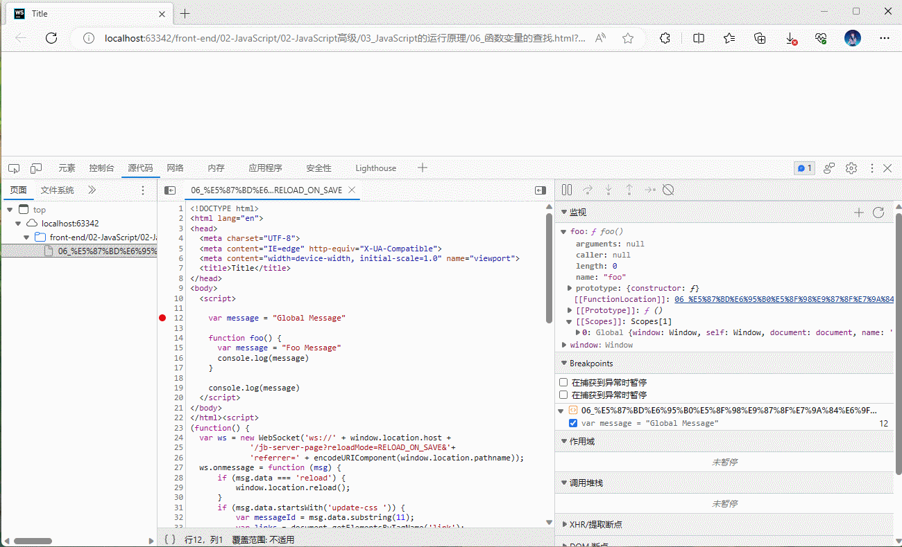

## 3.6 函数变量的查找演示

* 示例：

```html
<!DOCTYPE html>
<html lang="en">
<head>
  <meta charset="UTF-8">
  <meta content="IE=edge" http-equiv="X-UA-Compatible">
  <meta content="width=device-width, initial-scale=1.0" name="viewport">
  <title>Title</title>
</head>
<body>
  <script>
    var message = "Global Message"

    function foo() {
      var message = "Foo Message"
      console.log(message)
    }
    
    foo()
    console.log(message)
  </script>
</body>
</html>
```

* 编译期的图示：

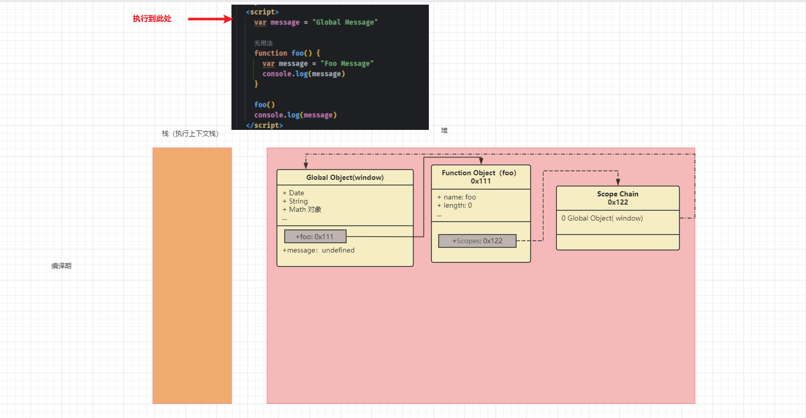

* 运行期的图示：

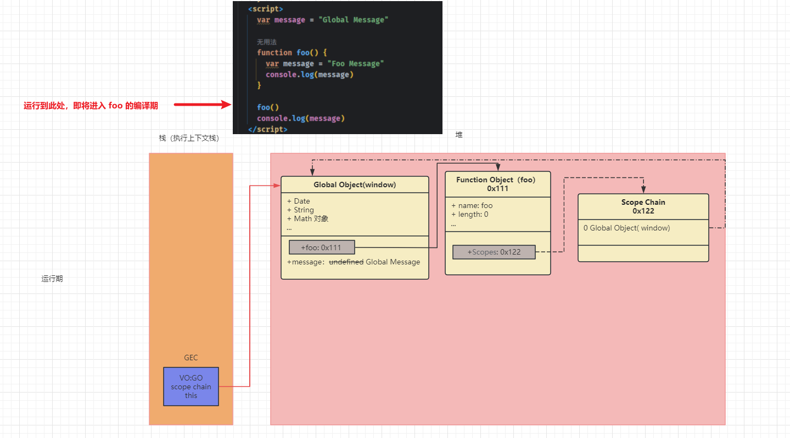

* 编译期的图示：

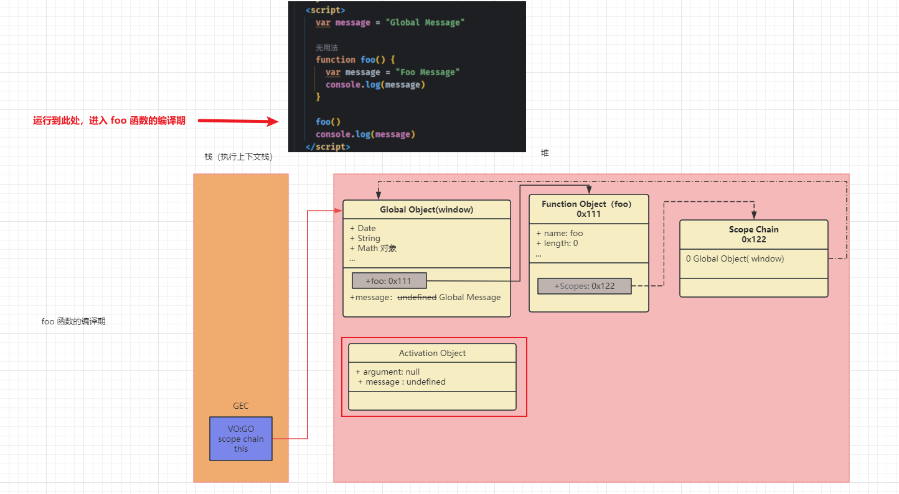

* 运行期的图示：

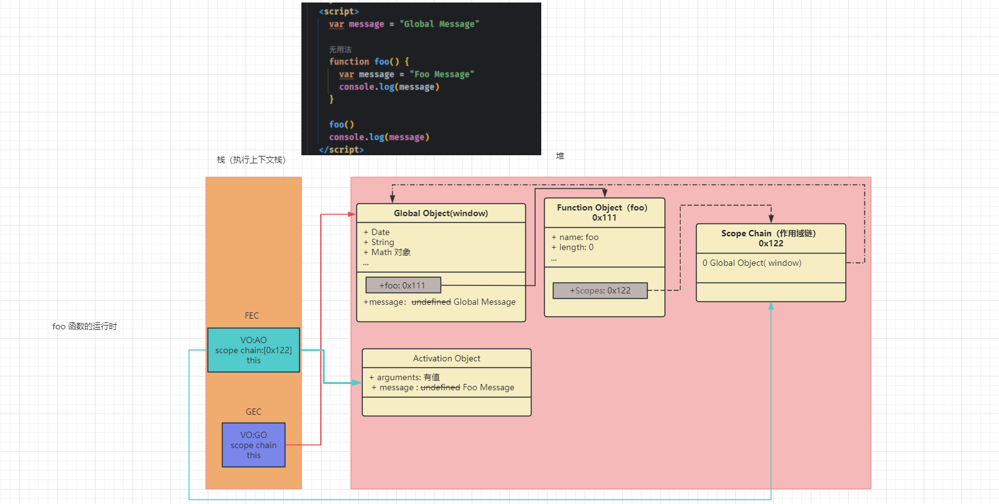

> 注意：
>
> * 作用域链是编译期行为，和 this 不同，this 属于运行期行为；所以，函数的作用域链和其定义的位置有关，而和其怎么调用是没有关系的。
> * 上面的案例，其实已经演示了作用域链了；当然，我们也可以通过浏览器的 devtools 调试来查看。

* 通过浏览器的 devtools 调试查看函数的作用域链（编译期行为）：

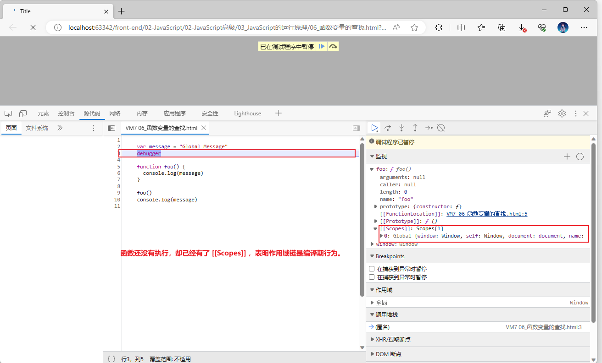

* 证明：作用域链变量的查找

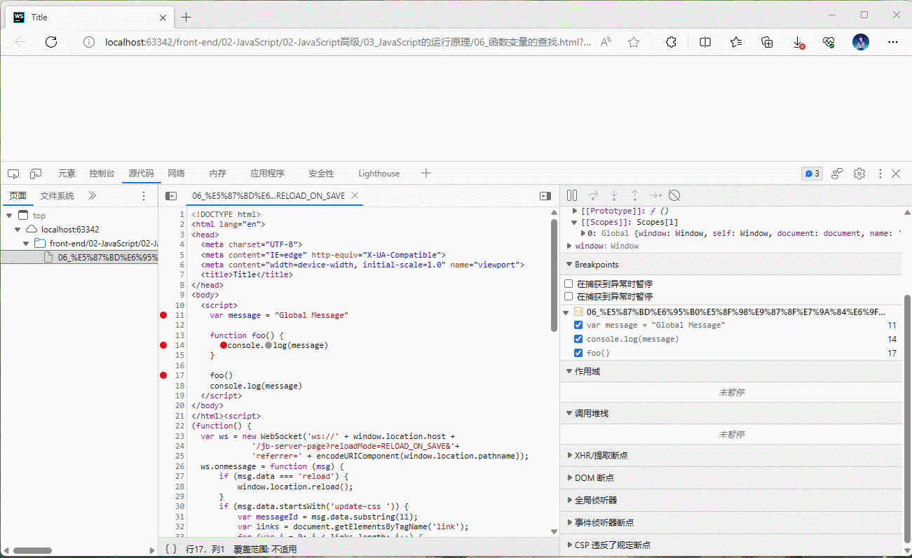

## 3.7 多层函数变量的查找演示

* 示例：

```html
<!DOCTYPE html>
<html lang="en">
<head>
  <meta charset="UTF-8">
  <meta content="IE=edge" http-equiv="X-UA-Compatible">
  <meta content="width=device-width, initial-scale=1.0" name="viewport">
  <title>Title</title>
</head>
<body>
  <script>
    var message = "Global Message"

    function foo() {
      var message = "foo message"

      function bar() {
        console.log(message)  // foo message
      }

      return bar
    }

    var bar = foo()
    bar()
  </script>
</body>
</html>
```

* 编译期的图示：

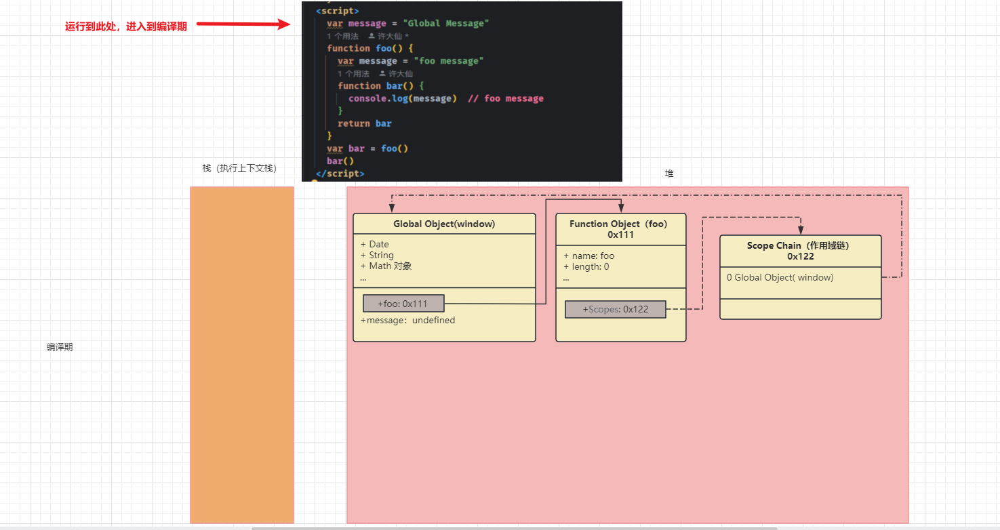

* 运行期的图示：

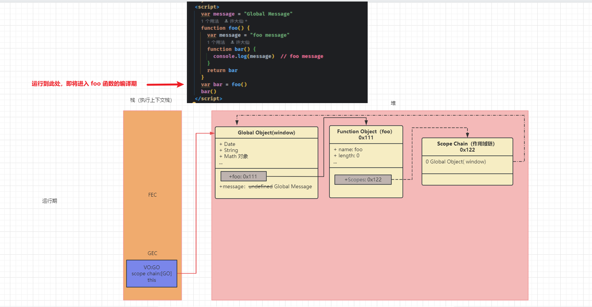

* 编译期的图示：


* 运行期的图示：

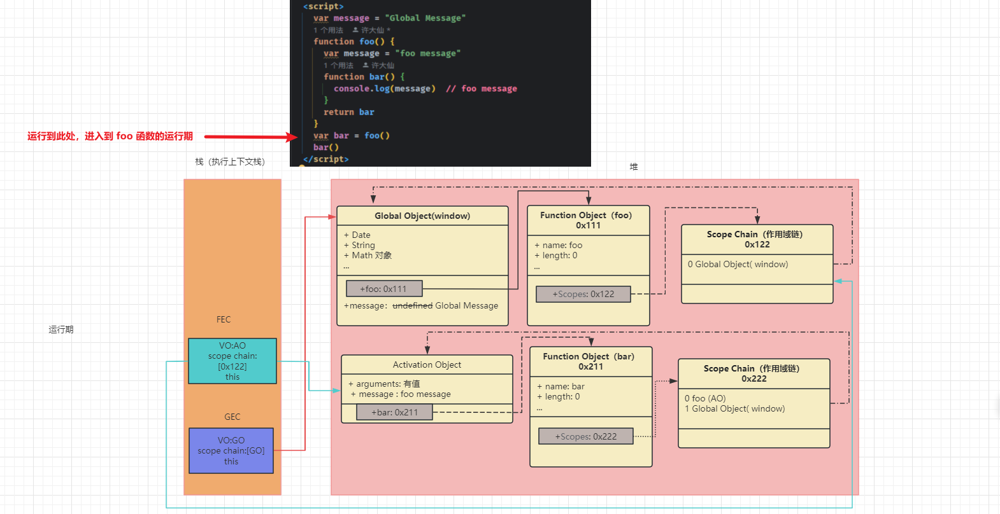

* 编译期的图示：

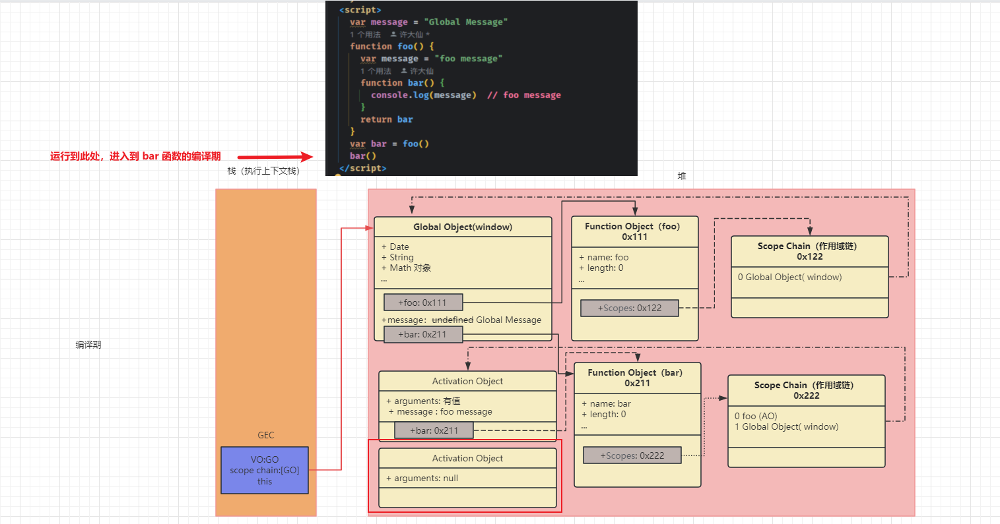

* 运行期的图示：

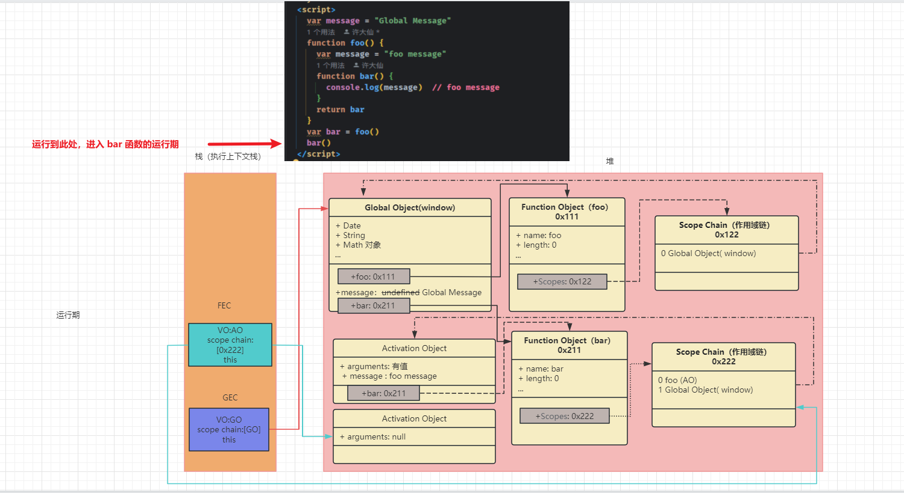
