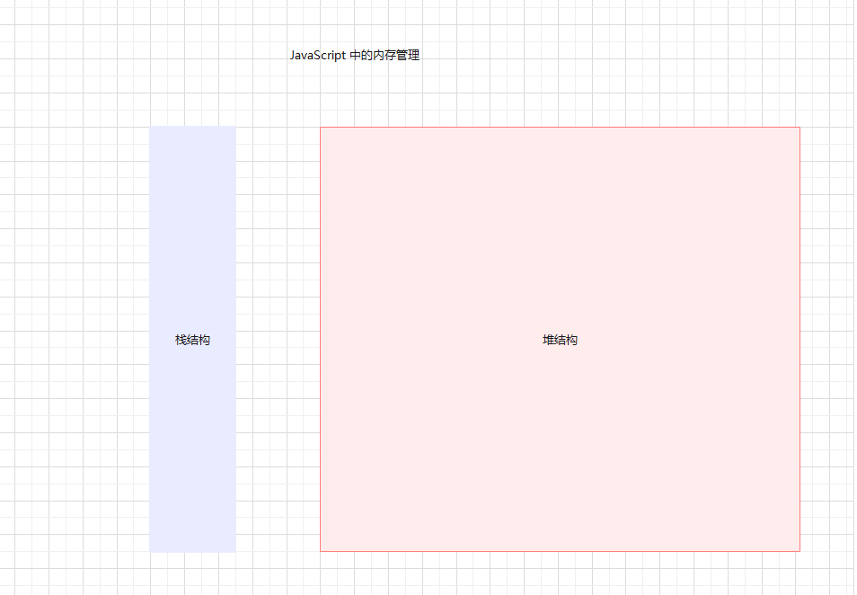
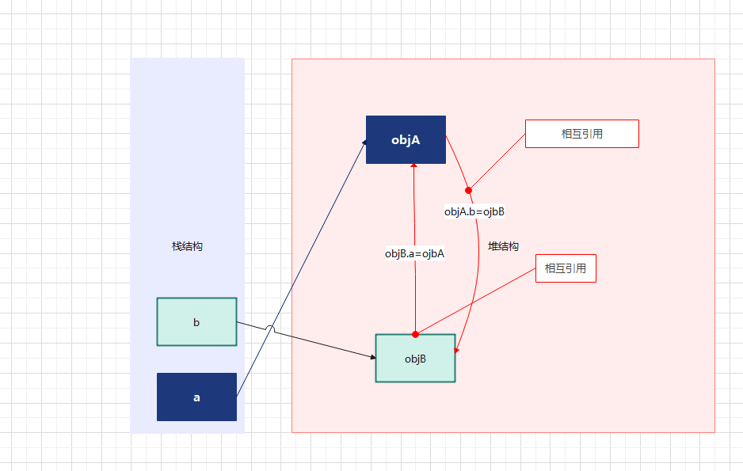
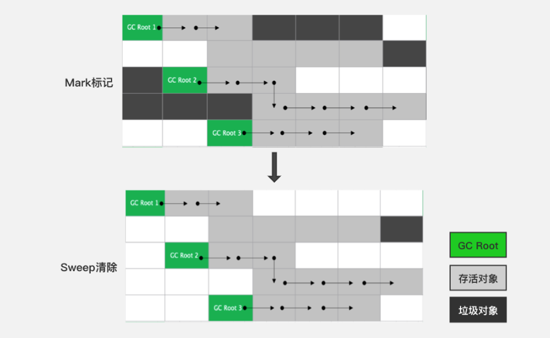
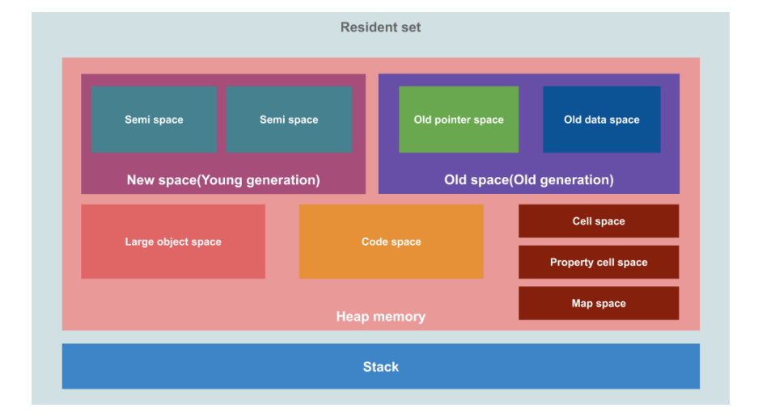

# 第一章：JavaScript 的内存管理（了解）

## 1.1 认识内存管理

* 不管什么样的编程语言，`在代码的执行过程中都需要给它分配内存`；不同的是，`有些编程语言`需要我们`手动`管理内存，而`有些编程语言`会`自动`帮助我们管理内存。
* 不管以什么样的方式来管理内存，`内存管理的生命周期`如下：
  * ① 分配程序员所申请的内存。
  * ② 使用分配的内存。
  * ③ 不需要使用的时候，将这块内存释放掉。

> 注意：内存在计算机中扮演着重要的角色，它提供了临时存储和快速访问数据的功能，对于计算机的运行效率和性能起着至关重要的作用。它的作用主要有以下几个方面：
>
> * ① 存储数据：内存可以临时存储计算机正在运行的程序和数据。当计算机执行程序时，需要将程序和数据加载到内存中，以便CPU能够快速访问和处理。内存的读写速度比硬盘和其他外部存储设备快得多，因此可以提高计算机的运行效率。
> * ② 运行程序：内存是计算机运行程序的主要场所。当用户打开一个应用程序或者操作系统启动时，相关的程序代码和数据会被加载到内存中，并由CPU进行处理。内存的容量和速度会影响计算机的性能和运行速度。
> * ③ 缓存数据：内存还可以用作数据缓存。计算机在访问外部存储设备（如硬盘）时，会将一部分数据缓存到内存中，以便快速访问。这样可以减少对外部存储设备的读写次数，提高数据访问的速度。
> * ④ 交换数据：内存还可以用于数据的交换和传输。不同的程序之间可以通过内存来传递数据，以实现数据共享和通信。例如，操作系统可以使用内存来传递数据给应用程序，应用程序可以使用内存来传递数据给外部设备。

* 不同的编程语言对于上面`内存管理` 的`第一步`和`第三步`有所不同：
  * `手动管理内存`：像 C、C++ 等语言，就需要程序员去手动申请和释放内存。
  * `自动管理内存`：像 Java 等语言，会有 GC（垃圾收集器）帮助我们管理内存。

* 同理，对于 JavaScript 来说，也是自动帮助开发者管理内存的；换言之，JavaScript 引擎也有自己的 GC 。

## 1.2 JavaScript 的内存管理

* JavaScript 会在定义数据的时候为我们分配好内存。
  * 对于`基本数据类型`的数据，是直接在`栈`空间中分配的；
  * 对于`引用数据类型`的数据，是在`堆`空间中开辟一块空间，并且将这块空间的指针返回给变量引用。
* 其`内存简图`如下：



## 1.3 JavaScript 的垃圾回收

* 因为内存的`总量`是`有限`的，当内存中的东西`不再需要的`时候，我们就需要对其进行`释放`，以便腾出更多的内存空间做其他的事情。
* 在`手动管理内存`中的语言中，我们需要通过一些方式来释放不需要的内存，如：free 函数。
  * 这种管理内存的方式`非常低效`，`影响`了我们编程的`效率`。
  * 并且，这种管理内存的方式对开发者的`要求也很高`，`一不小心`就会产生`内存泄漏`。

* `现代`的编程语言都有自己的`垃圾回收机制`。
  * 垃圾回收（是Garbage Collection），简称 GC 。
  * 对于`哪些不再使用的对象`，我们就认为是`垃圾`，就应该`被回收`，以便释放出更多的内存空间。
  * 很多编程语言都有 GC，如：Java 的 JVM，JavaScript 的 JavaScript 引擎。
* 那么，`GC 是怎么知道哪些对象不需要再使用的`？`内存泄漏`和`内存溢出`又到底是什么？

## 1.4 内存泄漏（Memory Leak） VS 内存溢出（Memory Overflow）

### 1.4.1 生活中的汽车油箱漏油

* 想象如果我们有一辆汽车，它需要汽油来运行。


* 汽车油箱存放着汽油，而漏油是指油箱中的汽油不断流失，而且你无法控制它。这会导致一些问题：
  * ① 浪费资源：漏油会导致汽车在没有产生任何价值的情况下消耗更多的汽油（相当于内存泄漏中内存资源的浪费）。
  * ② 效能下降：随着时间的推移，你的汽车将会耗尽燃料，最终无法正常运行（相当于内存泄漏会耗尽系统的可用内存，导致程序崩溃或性能下降）。
  * ③ 稳定性问题：如果在远程地区的路上，突然油箱漏油，可能会导致车辆无法继续前进，使我们陷入困境（相当于内存泄漏会导致程序无法继续执行，影响系统的稳定性）。

### 1.4.2 计算机中的内存泄漏（Memory Leak）

* 内存泄漏（Memory Leak）是指在程序运行过程中，由于某些原因`导致分配的内存（堆内存中对象等）`无法被正常释放，从而导致系统中的`可用内存`逐渐减少，最终可能`耗尽所有可用内存`，导致程序崩溃或系统变得非常缓慢。
* 内存泄漏（Memory Leak）可能会影响系统的稳定性，因为操作系统需要管理内存资源，当可用内存不足时，操作系统`可能`会中止程序以保护整个系统。

### 1.4.3 如何理解计算机中的内存泄漏（Memory Leak）？

* 【问】内存从某种意义上讲，应该是可再生的资源，怎么会有内存泄漏问题？为什么会命名内存泄漏？和汽车漏油有联系？
* 【答】其实，内存可再生的逻辑就是：将内存中`不再使用的对象（垃圾）`，通过手动回收或 GC 回收来达到内存可再生的目的。但是，如果`不再使用的对象（垃圾）`，随着时间的推移越来越多，不就像汽车漏油一样，可以使用到的内存越来越少，最终导致程序崩溃或系统变得非常缓慢。

### 1.4.4 计算机中的内存溢出（Memory Overflow）

* 内存溢出（Memory Overflow）是指程序`试图分配`超过`其可用内存范围`的内存空间。这可能会导致程序覆盖其他数据、代码或系统区域的内存，从而引发严重的错误，如：崩溃、数据损坏或安全漏洞。

### 1.4.5 如何理解计算机中的内存溢出（Memory Overflow）？

* 内存溢出（Memory Overflow）最为常见的就是`栈溢出`，当我们调用函数的时候，一层一层的往下调用，如：递归函数，递归函数的层数过多，既有可能会引起`栈溢出`，并且`栈空间`总是有限的。

* 栈结构的`特点`是`先入后出`，就和小时候，学习的`乌鸦喝水`类似，当乌鸦不同的向瓶子中扔石头，最终水就会溢出来。


### 1.4.6 总结

* 内存泄漏导致了未释放内存的浪费和系统资源的逐渐耗尽，而内存溢出则涉及对程序访问超出分配的内存范围，可能导致崩溃、数据损坏和安全问题。
* 在编程中，及时检测和解决内存泄漏和内存溢出问题是保证程序稳定性和性能的重要步骤。

## 1.5 垃圾回收算法

### 1.5.1 引用计数（Reference counting）

* JavaScript 中最简单的垃圾回收算法是`引用计数`。
  * 当一个对象有一个引用指向它时，那么这个对象的引用就 +1 。
  * 当一个对象的引用为 0 时，这个对象就可以被回收。
* 然而，这种算法`无法解决循环引用`的问题，即两个或多个对象相互引用，但没有被其他对象引用。
* 因此，现代的 JavaScript 引擎往往采用其他更高级的垃圾回收算法。



### 1.5.2 标记清除（mark-Sweep）

* `标记清除`的核心思路是`可达性（Reachability）`，也称为`可达性算法`。
* 这个算法是设置一个`根对象（root object，其实就是 window 对象）`，垃圾回收器会定期从这个根开始，找所有从根开始有引用到的对象，对于哪些 没有引用到的对象，就认为是不可用的对象。
* 这种算法`可以解决循环引用`的问题，即两个或多个对象相互引用，但没有被其他对象引用。



### 1.5.3 其它的 GC 算法

* `标记整理（Mark-Compact）` 和 `标记－清除`相似；不同的是，回收期间同时会将保留的存储对象搬运汇集到连续的内存空间，从而整合空闲空间，避免内存碎片化。
* 分代收集算法（Generational Collection）， 这个算法基于一个观察：大部分对象在内存中存在的时间很短，而只有少数对象存活更久。因此，分代收集将对象分成几代，通常是新生代和老生代。新生代包含短命的对象，老生代包含存活时间较长的对象。这样可以采用不同的收集策略，更频繁地收集新生代，较少地收集老生代，从而提高效率。
* 并行收集和并发收集： 一些 GC 算法可以并行或并发地执行，以减少 GC 对应用程序的影响。并行收集指同时使用多个线程进行垃圾收集，而并发收集则是在应用程序运行的同时执行垃圾收集。
* 增量标记算法（Incremental Marking）：为了减少 GC 对应用程序的停顿时间，一些现代的 JavaScript 引擎采用增量标记算法。它将标记阶段分成多个小步骤，每次执行一小步，然后让应用程序继续执行，从而减少单次垃圾收集的影响。
* ……

### 1.5.4 V8 引擎的详细内存图

* 事实上，V8 引擎为了提供内存的管理效率，对内存进行非常详细的划分：




# 第二章：JavaScript 中的闭包（⭐）

## 2.1 JavaScript 受到哪些编程语言的影响?

* JavaScript 借鉴了以下编程语言：
  * `Java`：JavaScript 的语法和面向对象的特性受到了 Java 的影响，如：JavaScript 中的类和对象的概念与 Java 相似。
  * `C`：JavaScript 的基本语法和控制结构与 C 语言相似，如：JavaScript 中的循环和条件语句的写法与 C 相似。
  * `Perl`：JavaScript 借鉴了 Perl 的正则表达式的语法和功能。JavaScript 中的正则表达式与 Perl 的正则表达式非常相似。
  * `Scheme`：JavaScript 借鉴了 Scheme 的函数式编程特性。JavaScript 中的函数可以作为一等公民，可以作为参数传递、赋值给变量等。
  * `Self`：JavaScript 借鉴了 Self 的原型继承的概念。JavaScript 中的对象可以通过原型链来继承属性和方法。
  * `Lua`：JavaScript 借鉴了 Lua 的轻量级和灵活性。JavaScript 的语言设计也强调了简洁和灵活。
* 总而言之，这些编程语言的特性和思想对 JavaScript 的发展和演变产生了深远的影响。

## 2.2 闭包的定义

* 在维基百科中对闭包的定义是：
  * 闭包（英语：Closure），又称词法闭包（Lexical Closure）或函数闭包（function closures）。
  * 是在支持 `头等函数` 的编程语言中，实现词法绑定的一种技术。
  * 闭包在实现上是一个`结构体（C语言等的语法）`，它存储了`一个函数`和`一个关联的环境`（相当于一个符号查找表）。
  * 闭包跟函数最大的区别在于，当捕捉闭包的时候，它的 `自由变量` 会在捕捉时被确定，这样即使脱离了捕捉时的上下文，它也能照常运行。

> 注意：
>
> * 闭包的概念出现于 60 年代，最早实现闭包的程序是 `Scheme`。
> *  JavaScript 借鉴了 Scheme 的函数式编程特性，从而使得 JavaScript 可以实现函数式编程。

* MDN 对 JavaScript 中闭包的解释：
  * 一个函数和对其周围状态（lexical environment，`词法环境`）的引用捆绑在一起（或者说函数被引用包围），这样的组合就是`闭包（closure）`。
  * 也就是说，闭包让我们可以在一个内层函数中访问到其外层函数的作用域。
  * 在 JavaScript 中，每当创建一个函数，闭包就会在函数创建的同时被创建出来。

> 注意：
>
> * 一个普通的函数 function ，如果它可以`访问外层作用域的自由变量`，那么这`个函数`和`周围环境`就是一个`闭包`。
> * 从广义的角度来说：JavaScript 中的函数都是闭包。
> * 从狭义的角度来说：JavaScript 中一个函数，如果访问了外层作用域的变量，那么它是一个闭包。

## 2.3 闭包的访问过程

* 示例：

```html
<!DOCTYPE html>
<html lang="en">
<head>
  <meta charset="UTF-8">
  <meta content="IE=edge" http-equiv="X-UA-Compatible">
  <meta content="width=device-width, initial-scale=1.0" name="viewport">
  <title>Title</title>
</head>
<body>
  <script>

    function createAddr(count) {
      function addr(num) {
        return count + num
      }

      return addr
    }

    var addr5 = createAddr(5)
    console.log(addr5(1)) // 6
    console.log(addr5(2)) // 7

  </script>
</body>
</html>
```

* 编译期：


* 运行时：


* 编译期：


* 运行时：


* 编译期：


* 运行时：


## 2.4 为什么闭包会产生内存泄漏

* 以上面的案例为例，当所有的代码都执行完毕，并且后续也不再使用 `createAddr()` 函数，如下所示：


* 根据 GC 的可达性算法，全局作用域下的 `addr5` 变量对 `0x201` 的函数对象有引用，并且 `0x201` 函数对象的作用域又引用了 AO 对象（0x200），最终造成这部分内存无法释放。
* 总而言之，所谓的闭包会造成内存泄漏，就是引用链中的所有对象无法释放。

> 注意：解决方案就是如果确定不再使用，就将 addr5 = null 即可。

