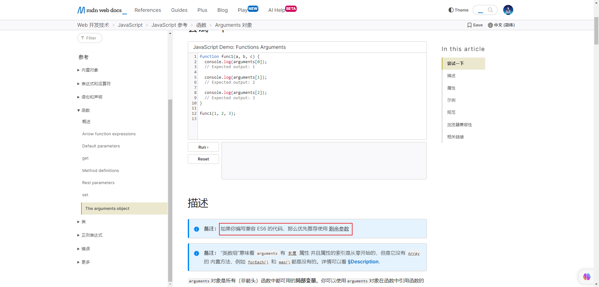
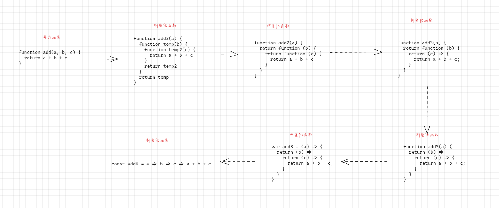

# 第一章：函数属性和 arguments

## 1.1 概述

* 回顾一下，JavaScript 中的数据类型：


* 从上图中，我们可以看出`函数`是一种`引用数据类型`；换言之，`函数`就是一种特殊的`对象`。

## 1.2 证明函数就是对象

* 示例：

```html
<!DOCTYPE html>
<html lang="en">
<head>
  <meta charset="UTF-8">
  <meta content="IE=edge" http-equiv="X-UA-Compatible">
  <meta content="width=device-width, initial-scale=1.0" name="viewport">
  <title>Title</title>
</head>
<body>
  <script>
    // 定义一个函数
    function foo() {
      console.log('foo函数')
    }

    console.log(foo instanceof Object) // true
  </script>
</body>
</html>
```

## 1.3 函数对象的属性

### 1.3.1 概述

* 如果是一个普通的对象，那么其必然有对应的属性和方法，如下：

```html
<!DOCTYPE html>
<html lang="en">
<head>
  <meta charset="UTF-8">
  <meta content="IE=edge" http-equiv="X-UA-Compatible">
  <meta content="width=device-width, initial-scale=1.0" name="viewport">
  <title>Title</title>
</head>
<body>
  <script>
    // 定义普通对象
    var obj = {
      name: "张三",
      eating: function () {
        console.log(`${this.name}正在吃饭...`)
      }
    }

    // 普通对象调用属性
    console.log(obj.name)
    // 普通对象调用方法
    obj.eating()

    // 普通对象增加属性和方法
    obj.age = 20
    obj.study = function () {
      console.log(`${this.name}正在学习...`)
    }

    // 普通对象调用属性和方法
    console.log(obj.age)
    obj.study()

  </script>
</body>
</html>
```

* 那么，函数是对象，那么一定也有自己的属性和方法；其实，以前我们也使用过，如下：

```html
<!DOCTYPE html>
<html lang="en">
<head>
  <meta charset="UTF-8">
  <meta content="IE=edge" http-equiv="X-UA-Compatible">
  <meta content="width=device-width, initial-scale=1.0" name="viewport">
  <title>Title</title>
</head>
<body>
  <script>
    // 定义普通函数
    function add(a, b) {
      return a + b
    }

    // 函数的普通调用
    var result = add(1, 2)
    console.log(result) // 3

    // 通过 call、apply 或 bind 调用
    result = add.call(window, 1, 2)
    console.log(result) // 3
  </script>
</body>
</html>
```

### 1.3.2 常用的属性

* name 属性：函数的名称。
* length 属性：函数参数的个数。

> 注意：如果一个函数中的`形参`中有`剩余参数`或`默认参数`的，length 不会计算在内的。


* 示例：

```html
<!DOCTYPE html>
<html lang="en">
<head>
  <meta charset="UTF-8">
  <meta content="IE=edge" http-equiv="X-UA-Compatible">
  <meta content="width=device-width, initial-scale=1.0" name="viewport">
  <title>Title</title>
</head>
<body>
  <script>
    // 定义普通函数
    function foo(a, b) {
      return a + b
    }

    // 函数的常用属性
    console.log(`函数的名称: ${foo.name}`) // 函数的名称: foo
    console.log(`函数的形参个数: ${foo.length}`) // 函数的形参个数: 2

    // 定义形参有剩余参数的函数
    function bar(a, b, ...nums) {
      return a + b + nums.reduce((x, y) => x + y)
    }

    console.log(`函数的名称: ${bar.name}`) // 函数的名称: bar
    console.log(`函数的形参个数: ${bar.length}`) // 函数的形参个数: 2


    // 定义形参有默认值的函数
    function baz(a = 1, b = 2) {
      return a + b
    }

    console.log(`函数的名称: ${baz.name}`) // 函数的名称: baz
    console.log(`函数的形参个数: ${baz.length}`) // 函数的形参个数: 0
  </script>
</body>
</html>
```

## 1.4 arguments 

### 1.4.1 概述

* 在实际开发中，我们可能并不清楚调用者到底传入了多少个实际参数；此时，，就可以在函数内部使用 arguments 对象来接收。
* `arguments` 是一个用于`传递给函数实参`的`类数组（array-like）`对象。


* 证明：arguments 对象不是一个数组对象

```html
<!DOCTYPE html>
<html lang="en">
<head>
  <meta charset="UTF-8">
  <meta content="IE=edge" http-equiv="X-UA-Compatible">
  <meta content="width=device-width, initial-scale=1.0" name="viewport">
  <title>Title</title>
</head>
<body>
  <script>
    function foo(a, b, c) {
      console.log(Array.isArray(arguments)) // false
    }

    foo()
  </script>
</body>
</html>
```

### 1.4.2 类数组（array-like）对象

* 类数组（array-like）对象的存在是为了提供一种`类似数组`的数据结构，使得操作和处理这些对象更加方便和灵活。虽然它们不是真正的数组，但可以使用类似数组的方法来操作它们，从而简化了代码的编写和处理。
* 类数组对象的应用场景：
  * ① DOM 元素集合：`querySelectorAll` 方法返回的结果是一个类数组对象，可以使用类似数组的方法来操作它。
  * ② 函数的参数对象：`arguments`对象是一个类数组对象，它包含了函数调用时传递的所有参数。
  * ③ 字符串：字符串可以被视为一个类数组对象，可以使用类似数组的方法来操作它。
  * ④ 自定义的类数组对象：你也可以创建自定义的类数组对象，并使用类似数组的方法来操作它。


* 示例：DOM 元素集合

```html
<!DOCTYPE html>
<html lang="en">
<head>
  <meta charset="UTF-8">
  <meta content="IE=edge" http-equiv="X-UA-Compatible">
  <meta content="width=device-width, initial-scale=1.0" name="viewport">
  <title>Title</title>
</head>
<body>

  <button>1</button>
  <button>2</button>
  <button>3</button>

  <script>
    const btnEls = document.querySelectorAll("button");
    for (let i = 0; i < btnEls.length; i++) {
      let btn = btnEls[i]
      btn.addEventListener("click", function () {
        console.log(this.innerHTML);
      })
    }
  </script>
</body>
</html>
```


* 示例：DOM 元素集合

```html
<!DOCTYPE html>
<html lang="en">
<head>
  <meta charset="UTF-8">
  <meta content="IE=edge" http-equiv="X-UA-Compatible">
  <meta content="width=device-width, initial-scale=1.0" name="viewport">
  <title>Title</title>
</head>
<body>

  <button>1</button>
  <button>2</button>
  <button>3</button>

  <script>
    const btnEls = document.querySelectorAll("button");
    for (const btn of btnEls) {
      btn.addEventListener("click", function () {
        console.log(this.innerHTML);
      })
    }
  </script>
</body>
</html>
```


* 示例：函数的参数对象

```html
<!DOCTYPE html>
<html lang="en">
<head>
  <meta charset="UTF-8">
  <meta content="IE=edge" http-equiv="X-UA-Compatible">
  <meta content="width=device-width, initial-scale=1.0" name="viewport">
  <title>Title</title>
</head>
<body>


  <script>
    function sum() {
      let total = 0
      for (const element of arguments) {
        total += element
      }
      return total
    }

    console.log(sum(1, 2, 3, 4)) // 10


  </script>
</body>
</html>
```


* 示例：字符串

```html
<!DOCTYPE html>
<html lang="en">
<head>
  <meta charset="UTF-8">
  <meta content="IE=edge" http-equiv="X-UA-Compatible">
  <meta content="width=device-width, initial-scale=1.0" name="viewport">
  <title>Title</title>
</head>
<body>


  <script>
    const str = 'Hello';
    const strArray = Array.from(str);
    console.log(strArray); // 输出 ['H', 'e', 'l', 'l', 'o']
  </script>
</body>
</html>
```


* 示例：自定义的类数组对象

```html
<!DOCTYPE html>
<html lang="en">
<head>
  <meta charset="UTF-8">
  <meta content="IE=edge" http-equiv="X-UA-Compatible">
  <meta content="width=device-width, initial-scale=1.0" name="viewport">
  <title>Title</title>
</head>
<body>

  <script>
    const obj = {
      length: 3,
      0: 'apple',
      1: 'banana',
      2: 'orange'
    }
    console.log(Array.from(obj)) // ['apple', 'banana', 'orange']
  </script>
</body>
</html>
```

### 1.4.3 arguments 转 Array

* ES6 中提供了两种方法来实现 arguments  转为 Array ：
  * ① `Array.from(arguments)` 。
  * ② `[...arguments]` 。


* 示例：

```html
<!DOCTYPE html>
<html lang="en">
<head>
  <meta charset="UTF-8">
  <meta content="IE=edge" http-equiv="X-UA-Compatible">
  <meta content="width=device-width, initial-scale=1.0" name="viewport">
  <title>Title</title>
</head>
<body>
  <script>
    function sum() {
      return Array.from(arguments).reduce((a, b) => a + b);
    }

    console.log(sum(1, 2)) // 3
    
  </script>
</body>
</html>
```


* 示例：

```html
<!DOCTYPE html>
<html lang="en">
<head>
  <meta charset="UTF-8">
  <meta content="IE=edge" http-equiv="X-UA-Compatible">
  <meta content="width=device-width, initial-scale=1.0" name="viewport">
  <title>Title</title>
</head>
<body>
  <script>
    function sum() {
      return [...arguments].reduce((a, b) => a + b);
    }

    console.log(sum(1, 2)) // 3

  </script>
</body>
</html>
```

### 1.4.4 箭头函数中不绑定 arguments

* 箭头函数是不绑定 arguments 的，箭头函数中使用 arguments 会去上层作用域查找。


* 示例：

```html
<!DOCTYPE html>
<html lang="en">
<head>
  <meta charset="UTF-8">
  <meta content="IE=edge" http-equiv="X-UA-Compatible">
  <meta content="width=device-width, initial-scale=1.0" name="viewport">
  <title>Title</title>
</head>
<body>
  <script>
    const sum = () => {
      console.log(arguments)
    }

    sum(1, 2, 3) // Uncaught ReferenceError: arguments is not defined
  </script>
</body>
</html>
```

## 1.5 剩余（rest ）参数（⭐）

* 语法：

```js
// 如果函数的最后一个命名参数以...为前缀，则它将成为一个由剩余参数组成的真数组，其中从0（包括）到theArgs.length（排除）的元素由传递给函数的实际参数提供。
function(a, b, ...theArgs) {
  // ...
}
```

* 剩余（rest ）参数 VS `arguments` ：

  * ① 剩余参数只包含那些没有对应形参的实参，而 `arguments` 对象包含了传给函数的所有实参。
  * ② `arguments`对象不是一个真正的数组，而剩余参数是真正的 `Array`实例，也就是说我们能够在它上面直接使用所有的数组方法，如：map、filter、sort 等。

* `MDN` 已经`不推荐`使用 `arguments` 对象了：



> 注意：
>
> * 如果有多个参数，剩余参数必须在最后。
> * 有的编程语言中，将`剩余参数`称为`可变参数`，如：Java，他们的使用方式类似，但是原理可能并不相同。


* 示例：

```html
<!DOCTYPE html>
<html lang="en">
<head>
  <meta charset="UTF-8">
  <meta content="IE=edge" http-equiv="X-UA-Compatible">
  <meta content="width=device-width, initial-scale=1.0" name="viewport">
  <title>Title</title>
</head>
<body>
  <script>
    // 定义一个含有剩余参数的函数
    function sum(a, b, ...args) {
      return a + b + args.reduce((a, b) => a + b);
    }

    // 调用函数
    console.log(sum(1, 2, 3, 4, 5)) // 15
  </script>
</body>
</html>
```


# 第二章：纯函数（⭐）

## 2.1 概述

* 纯函数（Pure Function）是函数式编程中的一个重要概念，它具有如下的两个主要特点：
  * ① `相同的输入总是产生相同的输出`：纯函数的输出完全由其输入决定，不会受到外部状态的影响。这意味着给定相同的输入，纯函数总是返回相同的输出，这种可预测性对于编程的可维护性和测试性非常重要。
  * ② `没有副作用`：纯函数不会对外部环境造成影响，不会改变全局变量、修改传入的参数或执行与函数计算无关的操作。这种特性使得纯函数在并发和并行编程中更容易使用，因为它们不会引入竞争条件和不确定性。
* 纯函数的应用场景非常广泛：
  * ① `测试和调试`： 纯函数易于测试，因为它们的输出只依赖于输入，不会受到外部环境的影响。这使得编写单元测试变得简单，可以通过提供不同的输入来覆盖不同的测试用例。
  * ② `函数组合和管道`： 纯函数可以无缝地组合在一起，形成函数管道。这使得编程变得更加模块化和可组合，可以通过连接不同的纯函数来构建复杂的操作。
  * ③ `缓存和优化`：因为纯函数对于相同的输入总是返回相同的输出，你可以使用缓存机制来避免重复计算，提高性能。这在涉及昂贵计算的情况下特别有用。
  * ④ `函数式编程`：纯函数是函数式编程范式的核心，函数式编程强调通过组合纯函数来处理数据，而不是通过修改状态。
  * ⑤ `并发和并行`：由于纯函数没有副作用，它们在并发和并行编程中更容易管理。在多线程或多进程环境中，纯函数不会引入竞争条件，从而减少了错误的可能性。
  

> 注意：React 要求所有的组件（无论是函数组件还是 class 组件）都必须像纯函数一样保护它们的 Props 不被修改。

* 思考：什么是副作用？

## 2.2 副作用

* 在生活中，药物除了治疗目标症状外，对人体其他部分可能会产生不良反应（副作用）：
  * ① 镇痛药（如：阿司匹林、布洛芬），可能引起胃部不适、消化问题、胃溃疡等。
  * ② 抗生素（如：青霉素、头孢菌素），可能导致过敏反应、肠道菌群失衡、耳鸣等。
  * ③ 抗抑郁药（如：SSRI 类药物），可能引起嗜睡、性功能障碍、失眠等。
  * ④ 利尿药（如：袢利尿药），可能导致电解质紊乱、脱水、低血压等。
  * ⑤ 镇静催眠药（如：苯二氮䓬类药物），可能引起依赖性、记忆力下降、肌肉松弛等。
  * ⑥ 抗高血压药（如：ACE 抑制剂、钙通道阻滞剂），可能导致低血压、头晕、咳嗽等。
  * ⑦ 抗过敏药（如：抗组胺药），可能引起嗜睡、口干、视力模糊等。

* 因为药物通常都是通过`有机化学`技术来合成的，我们都知道，有机化学反应受到很多因素影响会产生副产物，如：反应条件、反应物的性质、催化剂的选择等。
* 在计算机科学中，也引入了`副作用`的概念，表示在`执行一个函数`时，除了`返回函数值`之外，还`对调用函数产生了附加的影响` ，如：对变量的修改、对数据结构的更改、对文件系统的操作、对网络的请求等。
* 副作用会改变程序的状态，可能导致不可预测的行为，并增加代码的复杂性和难以调试；换言之，`副作用`往往是`产生 bug` 的  `“温床”` 。

## 2.3 数组中的纯函数

* 数组中的 `slice` 方法就是纯函数，因为它不会对原数组产生任何操作，而是返回一个新的数组。
* 数组中的 `splice`方法不是纯函数，因为它对原数组进行修改，并返回一个新的数组。


* 示例：

```html
<!DOCTYPE html>
<html lang="en">
<head>
  <meta charset="UTF-8">
  <meta content="IE=edge" http-equiv="X-UA-Compatible">
  <meta content="width=device-width, initial-scale=1.0" name="viewport">
  <title>Title</title>
</head>
<body>
  <script>
    /*
    * slice 是一个纯函数，无论你怎么调用，都不会对原函数产生任何影响
    */
    
    var arr = [1, 2, 3]

    var newArr = arr.slice(1, 2)
    console.log(`arr：${arr}`) // arr：1,2,3
    console.log(`newArr：${newArr}`) // newArr：2


    console.log("======== 等价于 ========")

    var newArr2 = [].slice.call(arr, 1, 2)
    console.log(`arr：${arr}`) // arr：1,2,3
    console.log(`newArr2：${newArr2}`) // newArr2：2

  </script>
</body>
</html>
```


* 示例：

```html
<!DOCTYPE html>
<html lang="en">
<head>
  <meta charset="UTF-8">
  <meta content="IE=edge" http-equiv="X-UA-Compatible">
  <meta content="width=device-width, initial-scale=1.0" name="viewport">
  <title>Title</title>
</head>
<body>
  <script>
    /*
    * splice 不是一个纯函数，因为它会修改原函数。
    */

    var arr = [1, 2, 3]

    var newArr = arr.splice(1, 2)
    console.log(`arr：${arr}`) // arr：1
    console.log(`newArr：${newArr}`) // newArr：2,3


    console.log("======== 等价于 ========")

    var newArr2 = [].splice.call(arr, 1, 2)
    console.log(`arr：${arr}`) // arr：1
    console.log(`newArr2：${newArr2}`) //newArr2：

  </script>
</body>
</html>
```

## 2.4 应用示例

* 需求：自己定义一个纯函数和非纯函数。


* 示例：纯函数

```html
<!DOCTYPE html>
<html lang="en">
<head>
  <meta charset="UTF-8">
  <meta content="IE=edge" http-equiv="X-UA-Compatible">
  <meta content="width=device-width, initial-scale=1.0" name="viewport">
  <title>Title</title>
</head>
<body>
  <script>
    // 纯函数示例：计算两个数字的和
    function add(a, b) {
      return a + b;
    }

    // 调用纯函数，输出只取决于输入，没有副作用
    console.log(add(3, 5)); // 输出: 8
    console.log(add(3, 5)); // 输出: 8，相同的输入总是得到相同的输出
  </script>
</body>
</html>
```


* 示例： 非纯函数

```html
<!DOCTYPE html>
<html lang="en">
<head>
  <meta charset="UTF-8">
  <meta content="IE=edge" http-equiv="X-UA-Compatible">
  <meta content="width=device-width, initial-scale=1.0" name="viewport">
  <title>Title</title>
</head>
<body>
  <script>
    // 非纯函数示例：修改外部状态
    let total = 0;

    function addToTotal(number) {
      total += number;
    }

    addToTotal(5);
    console.log(total); // 输出: 5，外部状态已被修改
    addToTotal(5);
    console.log(total); // 输出: 10，外部状态再次被修改
  </script>
</body>
</html>
```

## 2.5 总结

* 判断一个函数是否是纯函数，只需要满足两个条件：
  * ① `相同的输入总是产生相同的输出`。
  * ② `没有副作用，不会影响外部状态`。


# 第三章：柯里化函数（⭐）

## 3.1 概述

* `柯里化`是`函数式编程`中的重要概念，是一种关于函数的高阶技术，它不仅被用于 JavaScript ，还被用于其他的编程语言。
* 维基百科对柯里化的定义：
  * 在计算机科学中，柯里化（英语：Currying），又译为卡瑞化或加里化。
  * 是把`接收多个参数的函数`，变成`接收一个单一参数（最初函数的第一个参数）的函数`，并且`返回接受余下的参数`，而且`返回结果的新函数`的技术。
  * 柯里化声称 `“如果你固定某些参数，你将得到接受余下参数的一个函数”`。
* 其实，柯里化就是只`传递给函数一部分参数来调用它`，让`它返回一个函数去处理剩余的参数`。
* 柯里化是`一种函数的转换`，将一个函数从可调用的 `f(a, b, c)` 转换为可调用的 `f(a)(b)(c)`。
* 柯里化不会调用函数。它只是对函数进行转换。

## 3.2 应用示例

* 需求：手写一个柯里化函数。


* 示例：

```html
<!DOCTYPE html>
<html lang="en">
<head>
  <meta charset="UTF-8">
  <meta content="IE=edge" http-equiv="X-UA-Compatible">
  <meta content="width=device-width, initial-scale=1.0" name="viewport">
  <title>Title</title>
</head>
<body>
  <script>
    // 普通函数
    function add(a, b, c) {
      return a + b + c
    }

    // 调用普通函数
    console.log(add(1, 2, 3)) // 6

    // 柯里化函数
    function add2(a) {
      return function (b) {
        return function (c) {
          return a + b + c
        }
      }
    }

    // 调用柯里化函数
    console.log(add2(1)(2)(3)) // 6

    // 柯里化函数的箭头函数的表达形式
    const add4 = a => b => c => a + b + c
    console.log(add4(1)(2)(3)) // 6

  </script>
</body>
</html>
```

## 3.3 柯里化函数的写法演示

* 示例：

```html
<!DOCTYPE html>
<html lang="en">
<head>
  <meta charset="UTF-8">
  <meta content="IE=edge" http-equiv="X-UA-Compatible">
  <meta content="width=device-width, initial-scale=1.0" name="viewport">
  <title>Title</title>
</head>
<body>
  <script>
    // 普通函数
    function add(a, b, c) {
      return a + b + c
    }

    // 调用普通函数
    console.log(add(1, 2, 3)) // 6

    // 柯里化函数
    function add2(a) {
      return function (b) {
        return function (c) {
          return a + b + c
        }
      }
    }

    // 调用柯里化函数
    console.log(add2(1)(2)(3)) // 6

    // 柯里化函数的箭头函数的表达形式
    const add4 = a => b => c => a + b + c
    console.log(add4(1)(2)(3)) // 6

  </script>
</body>
</html>
```

* 图示：



## 3.4 柯里化函数的应用场景

* 柯里化函数的应用场景：
  * ① 参数复用：柯里化允许我们固定部分函数参数，然后重复使用这些部分参数的函数。这在创建一系列具有共同配置的函数时非常有用。
  * ② 延迟计算：通过柯里化，我们可以部分地应用函数的参数，直到提供足够的参数来执行实际计算。这在需要等待特定条件满足时执行计算时很有用。
  * ③ 函数组合：柯里化函数可以与其他函数进行组合，以创建更复杂的功能。通过部分应用函数，您可以在组合函数时更精确地控制参数的传递。
  * ④ 函数参数配置：在编写库或框架时，柯里化可以帮助您配置函数的一些默认参数，使其在不同上下文中更具适用性。
  * ⑤ 数据转换和过滤：柯里化可以用于将一个数据处理过程分解为多个步骤，每个步骤接受一个参数并返回一个新的处理函数。这样可以使数据转换和过滤更具可组合性。
  * ⑥ 事件处理： 在前端开发中，柯里化可以用于创建具有特定事件处理逻辑的函数，使其更容易与事件监听器一起使用。
  * ⑦ 部分应用：柯里化可以将函数应用于部分参数，然后返回一个新函数，该函数接受剩余的参数。这在需要多次调用类似函数时很有用。
  * ⑧ 提高可读性：柯里化可以使函数调用更具可读性和语义，因为每个部分参数都可以具有有意义的名称。
  * ⑨ 递归：在编写递归函数时，柯里化可以帮助我们将递归调用的一部分参数固定，以简化递归逻辑。
  * ⑩ 缓存和记忆化：柯里化可以与缓存技术结合使用，以创建记忆化函数，从而在相同参数的情况下避免重复计算。


* 示例：应用场景①

```html
<!DOCTYPE html>
<html lang="en">
<head>
  <meta charset="UTF-8">
  <meta content="IE=edge" http-equiv="X-UA-Compatible">
  <meta content="width=device-width, initial-scale=1.0" name="viewport">
  <title>Title</title>
</head>
<body>
  <script>
    // 参数复用
    // 需求：定义一个计算税后价格的函数

    // 普通函数实现
    function calculateTax(price, taxRate) {
      return price * (1 + taxRate);
    }

    console.log("普通函数实现：" + calculateTax(100, 0.08));

    // 柯里化函数实现
    function curryCalculateTax(taxRate) {
      return function (price) {
        return price * (1 + taxRate)
      }
    }

    var curryCalculate = curryCalculateTax(0.08)
    console.log("柯里化函数实现：" + curryCalculate(100));
  </script>
</body>
</html>
```


* 示例：应用场景⑦

```html
<!DOCTYPE html>
<html lang="en">
<head>
  <meta charset="UTF-8">
  <meta content="IE=edge" http-equiv="X-UA-Compatible">
  <meta content="width=device-width, initial-scale=1.0" name="viewport">
  <title>Title</title>
</head>
<body>
  <script>
    // 部分应用
    // 需求：一个用于创建 HTML 元素的函数

    // 普通函数实现
    function createElement(tag, className, text) {
      const element = document.createElement(tag);
      element.className = className;
      element.textContent = text;
      return element;
    }

    console.log("普通函数实现：" + createElement('div', 'box', "呵呵哒"));

    // 柯里化函数实现
    function curryCreateElement(tag, className) {
      return function (text) {
        const element = document.createElement(tag);
        element.className = className;
        element.textContent = text;
        return element;
      }
    }

    var createDivWithClass = curryCreateElement('div', 'box')
    console.log("柯里化函数实现：" + createDivWithClass('呵呵哒'));
  </script>
</body>
</html>
```

## 3.5 自动柯里化函数

* 在实际开发中，我们不太可能去手动实现，一般我们都是借助一些第三方库，如：`Lodash` 等；但是，如何手动封装一个能否实现自动柯里化的函数（自动将某个函数转变为柯里化函数）？


* 示例：

```html
<!DOCTYPE html>
<html lang="en">
<head>
  <meta charset="UTF-8">
  <meta content="IE=edge" http-equiv="X-UA-Compatible">
  <meta content="width=device-width, initial-scale=1.0" name="viewport">
  <title>Title</title>
</head>
<body>
  <script>
    function foo(x, y, z) {
      console.log(x, y, z)
    }

    function sum(x, y) {
      return x + y
    }

    function logInfo(date, type, message) {
      console.log(`时间：${date}，类型：${type}，内容：${message}`)
    }

    // 自动转化：自动将某个函数转变为柯里化函数
    function currying(fn) {
      function curryFn(...args) {
        // 如果传递的参数比 fn 要求的形参的个数要多
        if (args.length >= fn.length) {
          // 直接执行 fn 函数
          return fn.apply(this, args)
        } else {  // 继续返回一个新的函数，继续接收参数
          return function (...newArgs) {
            return curryFn.apply(this, args.concat(newArgs))
          }
        }
      }
      return curryFn
    }

    var fooCurry = currying(foo)
    fooCurry(10)(20)(30)
  </script>
</body>
</html>
```


# 第四章：组合函数（⭐）

## 4.1 概述

* 组合（Compose）函数是一种将多个函数按照一定的规则组合起来形成一个新函数的方法。
* 在函数式编程中，组合函数是一种重要的技术，它可以帮助我们将小的、可复用的函数组合成更复杂的功能。

## 4.2 应用示例

* 示例：手写组合函数

```html
<!DOCTYPE html>
<html lang="en">
<head>
  <meta charset="UTF-8">
  <meta content="IE=edge" http-equiv="X-UA-Compatible">
  <meta content="width=device-width, initial-scale=1.0" name="viewport">
  <title>Title</title>
</head>
<body>
  <script>
    let num = 2

    // 先对数字*2
    function double(num) {
      return num * 2
    }

    // 再对数字进行平方
    function square(num) {
      return num ** 2
    }

    console.log(square(double(num)))
    console.log(square(double(22)))
    console.log(square(double(99)))

    // 将上面的两个函数组合在一起，生成一个新的函数
    function composeFn(num) {
      return square(double(num))
    }

    console.log(composeFn(num))

  </script>
</body>
</html>
```


* 示例：通用性的组合函数

```html
<!DOCTYPE html>
<html lang="en">
<head>
  <meta charset="UTF-8">
  <meta content="IE=edge" http-equiv="X-UA-Compatible">
  <meta content="width=device-width, initial-scale=1.0" name="viewport">
  <title>Title</title>
</head>
<body>
  <script>
    let num = 2

    // 先对数字*2
    function double(num) {
      return num * 2
    }

    // 再对数字进行平方
    function square(num) {
      return num ** 2
    }


    // 通用性的组合函数
    function pipeline(...fns) {
      // 边界判断
      fns.forEach((item, index) => {
        if (typeof item !== 'function') {
          throw new Error(`位置 ${index} 必须是函数`)
        }
      })
      return function (args) {
        return fns.reduce((prev, curr) => {
          return curr(prev)
        }, args)
      }
    }

    const pipe = pipeline(double, square)
    console.log(pipe(num))
  </script>
</body>
</html>
```


# 第五章：严格模式的使用（⭐）

## 5.1 概述

* JavaScript 历史的局限性：
  * 长久以来，JavaScript 不断向前发展且并未带来任何兼容性问题。
  * 新的特性被加入，旧的功能也没有改变，这么做`有利于兼容旧代码`。
  * 但缺点是 JavaScript 创造者的`任何错误或不完善的决定也将永远被保留在 JavaScript 语言中`。
* 在 ECMAScript5 标准中，JavaScript 提出了`严格模式`的概念（Strict Mode）：
  * 严格模式很好理解，是一种`具有限制性的 JavaScript 模式`，从而使代码隐式的脱离了 `”懒散（sloppy）模式“`。
  * `支持严格模式的浏览器`在检测到代码中有严格模式时，会`以更加严格的方式对代码进行检测和执行`。
* 严格模式对正常的 JavaScript 语义进行了一些限制：
  * 严格模式通过 `抛出错误` 来消除一些原有的 `静默（silent）`错误。
  * 严格模式让 `JS 引擎在执行代码时可以进行更多的优化`（不需要对一些特殊的语法进行处理）。
  * 严格模式 `禁用了在ECMAScript未来版本中可能会定义的一些语法`。

## 5.2 如何开启严格模式

* 严格模式目前有两种方式：
  * ① 在 `js 文件`中开启严格模式。
  * ② 在`某个函数`中开启严格模式。
* 严格模式通过在文件或函数的开头使用 `use strict` 来开启：

```js
"use strict"

var name = "abc"
console.log(name)
```

```js
function add(){
    "use strict"
    var name = "abc"
    console.log(name)
}
```

> 注意：
>
> * 在使用 ES 高版本中的 class 和 module 等，会自动开启严格模式。
> * 在使用 webpack 等打包工具的时候，也会自动开启严格模式。

## 5.3 严格模式的限制

* 严格模式的限制：
  * ① 禁止使用未声明的变量：在严格模式下，必须显式声明变量（使用`var`、`let`或`const`关键字）后才能使用，否则会报错。
  * ② 禁止删除变量、函数或函数参数：在严格模式下，使用`delete`操作符删除变量、函数或函数参数会导致错误。
  * ③ 禁止对只读属性赋值：严格模式禁止对只读属性（如：内置对象的方法）进行赋值操作。
  * ④ 禁止使用八进制字面量：在严格模式下，不能使用以 0 开头的八进制字面量。
  * ⑤ 禁止使用保留字作为变量名： 严格模式禁止使用保留字（如`implements`、`interface`、`package`等）作为变量名。
  * ⑥ 禁止删除未声明的变量：在严格模式下，使用`delete`操作符删除未声明的变量会导致错误。
  * ⑦ 禁止 this 指向全局对象：在严格模式下，函数内部的`this`值不会默认指向全局对象，而是`undefined`。
  * ⑧ 禁止重复参数名：在严格模式下，函数参数名不能重复。
  * ⑨ 禁止在函数内使用`eval`和`arguments`作为变量名： 在严格模式下，不能使用`eval`和`arguments`作为变量名。
  * ……

> 注意：
>
> * 严格模式有助于发现一些隐含的错误，并提高代码的可靠性和性能。
> * 然而，一些老旧的代码可能需要修改才能在严格模式下运行，因为它会禁用一些非标准的行为。
> * 在新项目中，启用严格模式是一个良好的实践。


* 示例：

```html
<!DOCTYPE html>
<html lang="en">
<head>
  <meta charset="UTF-8">
  <meta content="IE=edge" http-equiv="X-UA-Compatible">
  <meta content="width=device-width, initial-scale=1.0" name="viewport">
  <title>Title</title>
</head>
<body>
  <script>
    "use strict";

    function exampleFunction() {
      x = 10; // 在严格模式下，这会导致错误，因为 x 未声明
      return x;
    }

    console.log(exampleFunction());
  </script>
</body>
</html>
```


# 第六章：Object.defineProperty

## 6.1 概述

* 在之前，我们都是直接在`对象内部定义属性`，或者`直接将属性添加到对象上`的；
  * 其实，我们也可以对`对象中的某个属性做出一些限制`，如：不允许删除、不允许通过 for ...in 遍历，不能被修改等。
* 那么，如果我们想要对`一个对象的某个属性`进行比较`精准的控制`，就可以使用`属性描述符`（Object.defineProperty）。

## 6.2 Object.defineProperty

* 方法：直接在一个对象上定义一个新属性，或者修改一个对象的现有属性，并返回此对象

```js
Object.defineProperty(obj,prop,descriptor)
```

* 参数描述：
  * obj：要定义属性的对象。
  * prop：要定义或修改的属性的名称或 Symbol。
  * descriptor：要定义或修改的`属性的描述符`。
* 返回值：传入函数的对象，其指定的属性已被添加或修改。

## 6.3 属性描述符（descriptor）的分类

* 属性描述符（descriptor）有两种：
  * ① 数据属性（Data Properties）描述符（Descriptor）。
  * ② 存取属性（Accessor访问器 Properties）描述符（Descriptor）。
* 数据属性描述符 VS 存取属性描述符：

|                | configurable | enumerable | writable | value | set  | get  |
| -------------- | ------------ | ---------- | -------- | ----- | ---- | ---- |
| 数据属性描述符 | √            | √          | √        | √     | ×    | ×    |
| 存取属性描述符 | √            | √          | ×        | ×     | √    | √    |

* 数据属性描述符的特性：
  * configurable：表示属性是否可配置（通过 delete 删除属性）
    * 如果为 `true`，则属性的特性可以被修改，属性可以被删除，同时 `Object.defineProperty` 也可以再次调用修改该属性的特性。
    * 如果为 `false`，则属性的特性不能再被修改，也不能被删除（默认值）。
  * enumerable：表示属性是否可枚举（通过 for...in 遍历）
    * 如果为 `true`，则属性会在对象的迭代中被包含，例如 `for...in` 循环中。
    * 如果为 `false`，则属性会被跳过。默认为 `false`。
  * writable：表示是否可以修改属性的值
    * 如果为 `true`，则属性的值可以被修改；如果为 `false`，则属性值不能被修改。默认为 `false`。
  * value：属性的 value 值
    * 读取属性时会返回该值，修改属性时，会对其进行修改，默认是 undefined 。

* 存取属性描述符：
  * configurable：表示属性是否可配置（通过 delete 删除属性）
    * 如果为 `true`，则属性的特性可以被修改，属性可以被删除，同时 `Object.defineProperty` 也可以再次调用修改该属性的特性。
    * 如果为 `false`，则属性的特性不能再被修改，也不能被删除（默认值）。
  * enumerable：表示属性是否可枚举（通过 for...in 遍历）
    * 如果为 `true`，则属性会在对象的迭代中被包含，例如 `for...in` 循环中。
    * 如果为 `false`，则属性会被跳过。默认为 `false`。
  * set：设置属性的时候会指定的函数。
  * get：获取属性的时候会指定的函数。

* 获取对象的属性描述符：

```js
// 获取某个对象中指定属性的属性描述符
Object.getOwnPropertyDescriptor(obj,prop)
```

```js
// 获取某个对象中所有属性的属性描述符
Object.getOwnPropertyDescriptors(obj)
```

> 注意：
>
> * 一个对象其实有默认的属性描述符，可以通过 `Object.getOwnPropertyDescriptor(obj,prop)` 或 `Object.getOwnPropertyDescriptors(obj)` 来查看属性描述符的默认值。
> * 只不过，我们可以通过 `Object.defineProperty()` 或 `Object.defineProperties()` 来修改属性描述符的默认值而已。


* 示例：

```html
<!DOCTYPE html>
<html lang="en">
<head>
  <meta charset="UTF-8">
  <meta content="IE=edge" http-equiv="X-UA-Compatible">
  <meta content="width=device-width, initial-scale=1.0" name="viewport">
  <title>Title</title>
</head>
<body>
  <script>
    /* 数据属性描述符 */
    var obj = {
      name: "许大仙",
      age: 18
    }

    var nameOwnPropertyDescriptor = Object.getOwnPropertyDescriptor(obj, "name");
    console.log(`查看 name 属性对象的数据属性描述符：${nameOwnPropertyDescriptor}`)

    // 对对象中属性进行精准的限制
    Object.defineProperty(obj, "name", {
      // 告诉 JS 引擎，obj 对象的 name 属性不能被删除
      configurable: false,
      // 告诉 JS 引擎，obj 对象的 name 属性不能通过 for...in 遍历
      enumerable: false,
      // 告诉 JS 引擎，obj 对象的 name 属性不能被修改
      writable: false,
      // 告诉 JS 引擎，返回的值
      value: `${obj.name}，是吗`
    })

    console.log(obj)
  </script>
</body>
</html>
```


* 示例：

```html
<!DOCTYPE html>
<html lang="en">
<head>
  <meta charset="UTF-8">
  <meta content="IE=edge" http-equiv="X-UA-Compatible">
  <meta content="width=device-width, initial-scale=1.0" name="viewport">
  <title>Title</title>
</head>
<body>
  <script>
    /* 存取属性描述符 */
    var obj = {
      name: "许大仙",
      age: 18
    }

    // 对对象中属性进行精准的限制
    var _name = ""
    Object.defineProperty(obj, "name", {
      // 告诉 JS 引擎，obj 对象的 name 属性不能被删除
      configurable: false,
      // 告诉 JS 引擎，obj 对象的 name 属性不能通过 for...in 遍历
      enumerable: false,
      // 设置属性时会执行的函数
      set: function (value) {
        _name = value
        console.log(`set方法被调用了，设置的值是：${value}`)
      },
      // 获取属性时会执行的函数
      get: function () {
        console.log(`get方法被调用了`)
        return _name
      }
    })

    obj.name = "哈哈"
    obj.name = "呵呵"

    console.log(obj.name)
  </script>
</body>
</html>
```

## 6.4 Object.defineProperties

* 方法：直接在一个对象上定义新的属性或修改现有属性，并返回该对象。

```js
Object.defineProperties(obj, props)
```


* 示例：

```html
<!DOCTYPE html>
<html lang="en">
<head>
  <meta charset="UTF-8">
  <meta content="IE=edge" http-equiv="X-UA-Compatible">
  <meta content="width=device-width, initial-scale=1.0" name="viewport">
  <title>Title</title>
</head>
<body>
  <script>
    var obj = {
      name: "许大仙",
      age: 18
    }
    // 直接在一个对象上定义多个新的属性或修改现有属性，并且返回该对象
    Object.defineProperties(obj, {
      name: {
        configurable: false,
        enumerable: false,
        writable: false,
        value: `${obj.name}，是吗`
      },
      age: {
        configurable: false,
        enumerable: false,
        writable: false,
        value: `多大`
      }
    })

    console.log(obj)
  </script>
</body>
</html>
```

