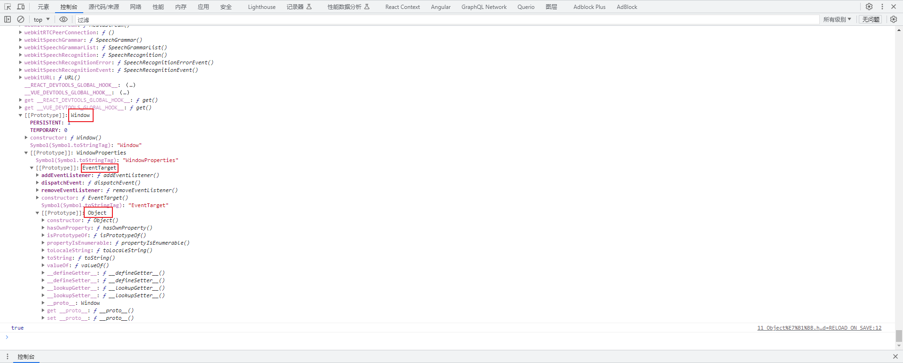

# 第一章：对象和函数的原型（⭐）

## 1.1 回顾一下 JavaScript 借鉴了哪些编程语言

- JavaScript 借鉴了以下编程语言： 
  - `Java`：JavaScript 的语法和面向对象的特性受到了 Java 的影响，如：JavaScript 中的类和对象的概念与 Java 相似。
  - `C`：JavaScript 的基本语法和控制结构与 C 语言相似，如：JavaScript 中的循环和条件语句的写法与 C 相似。
  - `Perl`：JavaScript 借鉴了 Perl 的正则表达式的语法和功能。JavaScript 中的正则表达式与 Perl 的正则表达式非常相似。
  - `Scheme`：JavaScript 借鉴了 Scheme 的函数式编程特性。JavaScript 中的函数可以作为一等公民，可以作为参数传递、赋值给变量等。
  - `Self`：JavaScript 借鉴了 Self 的原型继承的概念。JavaScript 中的对象可以通过`原型链`来继承属性和方法。
  - `Lua`：JavaScript 借鉴了 Lua 的轻量级和灵活性。JavaScript 的语言设计也强调了简洁和灵活。

- 总而言之，这些编程语言的特性和思想对 JavaScript 的发展和演变产生了深远的影响。

## 1.2 回顾 JavaScript 中数组的使用

* 先回顾一下，在 JavaScript 中数组方法的时候：

```html
<!DOCTYPE html>
<html lang="en">
<head>
  <meta charset="UTF-8">
  <meta content="IE=edge" http-equiv="X-UA-Compatible">
  <meta content="width=device-width, initial-scale=1.0" name="viewport">
  <title>Title</title>
</head>
<body>
  <script>
    var arr = [1, 2, 3, 4, 5]

    var newArr = arr.map(x => x * 2)
        .filter(x => x % 2 === 0);
    console.log(newArr)
  </script>
</body>
</html>
```

* 思考🤔：数组中的 map 、filter 等方法到底在哪里？其实，我们可以在浏览器中的 devtools 中找到 map、filter 等方法的位置：


* 此时，又有疑惑🤔，浏览器的 devtools 中显示的 `[[Prototype]]` 到底是什么？为什么要将数组的方法放到这个里面？

## 1.3 认识对象的原型

### 1.3.1 概述

* JavaScript 中的`每个对象`都由一个特殊的`内置属性 [[Prototype]]`，这个特殊的`内置属性 [[Prototype]]`可以`指向另外一个对象（也称为原型对象）`。
* 为什么要有这个原型对象？
  * 当我们通过`引用对象`的`属性 key` 来`获取`指定的 `value` 的时候，会`触发 [[GET]]` 的操作。
  * 这个操作`首先会检查该对象中是否有对应的属性`。
    * 如果`有`，则`使用它`。
    * 如果`没有`，那么就会访问`对象[[Prototype]]内置属性`指向的`原型对象`上的`属性`。

* 这也就解释了，为什么 `1.2` 中的 `arr` 数组对象可以访问 `map`、`filter` 等数组方法了。  
* 其实，通过字面量直接创建一个对象，也会有这样的属性。

```html
<!DOCTYPE html>
<html lang="en">
<head>
  <meta charset="UTF-8">
  <meta content="IE=edge" http-equiv="X-UA-Compatible">
  <meta content="width=device-width, initial-scale=1.0" name="viewport">
  <title>Title</title>
</head>
<body>
  <script>
    var obj = {
      name: "张三",
      age: 18
    }

    console.log(obj)
  </script>
</body>
</html>
```

* 在浏览器中的 devtools  中来验证是否有 `内置属性 [[Prototype]]`：


* 需要注意的是，`数组字面量`的写法其实是 `new Array()` 的简写形式：

```html
<!DOCTYPE html>
<html lang="en">
<head>
  <meta charset="UTF-8">
  <meta content="IE=edge" http-equiv="X-UA-Compatible">
  <meta content="width=device-width, initial-scale=1.0" name="viewport">
  <title>Title</title>
</head>
<body>
  <script>
    // 数组字面量
    var arr = [1, 2, 3]
    console.log(`arr：${arr}`)

    // 等价于
    var arr2 = new Array()
    arr2.push(1, 2, 3)
    console.log(`arr2：${arr2}`)
  </script>
</body>
</html>
```

* 需要注意的是，`对象字面量`的写法其实是 `new Object()` 的简写形式：

```html
<!DOCTYPE html>
<html lang="en">
<head>
  <meta charset="UTF-8">
  <meta content="IE=edge" http-equiv="X-UA-Compatible">
  <meta content="width=device-width, initial-scale=1.0" name="viewport">
  <title>Title</title>
</head>
<body>
  <script>
    // 对象字面量
    var obj = {
      name: "许大仙",
      age: 18
    }
    console.log(`obj：${obj}`)

    // 等价于
    var obj2 = new Object()
    obj2.name = "许大仙"
    obj2.age = 18
    console.log(`obj2：${obj2}`)
  </script>
</body>
</html>
```

### 1.3.2 访问对象的内置属性( [[Prototype]，原型对象)

* 访问对象的内置属性( [[Prototype]，原型对象)有两种方式：
  * ① 通过对象的 `__proto__` 属性进行访问（这是早期浏览器自己添加的，存在一定的兼容性问题）。
  * ② 通过 `Object.getPrototypeOf(obj)` 方法获取。


* 示例：

```html
<!DOCTYPE html>
<html lang="en">
<head>
  <meta charset="UTF-8">
  <meta content="IE=edge" http-equiv="X-UA-Compatible">
  <meta content="width=device-width, initial-scale=1.0" name="viewport">
  <title>Title</title>
</head>
<body>
  <script>
    var obj = {
      name: "张三",
      age: 18
    }

    console.log(obj)
    console.log(`获取对象的原型对象：${obj.__proto__}`)
    console.log(`获取对象的原型对象：${Object.getPrototypeOf(obj)}`)
    console.log(obj.__proto__ === Object.getPrototypeOf(obj))
  </script>
</body>
</html>
```

### 1.3.3 内存图

* 示例：

```html
<!DOCTYPE html>
<html lang="en">
<head>
  <meta charset="UTF-8">
  <meta content="IE=edge" http-equiv="X-UA-Compatible">
  <meta content="width=device-width, initial-scale=1.0" name="viewport">
  <title>Title</title>
</head>
<body>
  <script>
    var obj = {
      name: "张三",
      age: 18
    }
  </script>
</body>
</html>
```

* 内存图：


## 1.4 认识函数的原型

### 1.4.1 概述

* 我们都知道，函数也是一种特殊的对象，又因为在 JavaScript 中，`每个对象`都由一个特殊的`内置属性 [[Prototype]]`，那么`函数`也有一个特殊的`内置属性 [[Prototype]]`，称为`隐式原型`。

```html
<!DOCTYPE html>
<html lang="en">
<head>
  <meta charset="UTF-8">
  <meta content="IE=edge" http-equiv="X-UA-Compatible">
  <meta content="width=device-width, initial-scale=1.0" name="viewport">
  <title>Title</title>
</head>
<body>
  <script>
    function foo() {
      console.log('foo函数')
    }

    console.dir(foo)

    // 将函数看做是一个对象的时候，具备 __proto__ 属性，也称为隐式原型
    // 作用：查找 key 对应的 value 时，会找到原型身上
    console.dir(foo.__proto__)
  </script>
</body>
</html>
```

* 但是，我们通过浏览器的 devtools 来查看的时候，会见到如下的现象：


* 那么，函数的 `prototype` 属性又是什么？ 其实，是用来构造对象的时候，给`对象`设置`隐式原型`。

```html
<!DOCTYPE html>
<html lang="en">
<head>
  <meta charset="UTF-8">
  <meta content="IE=edge" http-equiv="X-UA-Compatible">
  <meta content="width=device-width, initial-scale=1.0" name="viewport">
  <title>Title</title>
</head>
<body>
  <script>
    function foo() {
      console.log('foo函数')
    }

    console.dir(foo)

    // 将函数看做是一个对象的时候，具备 __proto__ 属性，也称为隐式原型
    // 作用：查找 key 对应的 value 时，会找到原型身上
    console.dir(foo.__proto__)
    // 将函数看成是一个函数的时候，具备 prototype 属性，也称为显示原型
    // 用来构造对象的时候，给对象设置隐式原型的
    console.log(foo.prototype)
  </script>
</body>
</html>
```

### 1.4.2 总结

* 如果将`函数`当做是`对象`的时候：
  * `函数`是具有 `__proto__` 属性（[[Prototype]]），可以访问和修改`函数对象`的`原型对象`，称为`隐式原型`。
  * 作用：通过`函数对象`的`属性 key` 来`获取`指定的 `value` 的时候，会一层一层的寻找，直到找到原型对象身上。
* 如果将`函数`当做是`函数（构造函数）`的时候：
  * 函数是具备 `prototype` 属性，称为`显式原型`。
  * 作用：主要用于定义`函数`的`原型对象`，可以将`属性`和`方法`添加到`原型对象`上，从而实现`属性`和`方法`的共享。


# 第二章：new、constructor（⭐）

## 2.1 new 关键字

### 2.1.1 概述

* 前面其实我们已经学过了 [new](https://www.yuque.com/fairy-era/xurq2q/cf0urwgx25s54idh#7a3b989b) 关键字了，并且知道了 new 实例化对象的时候的步骤：

  * ① 在内存中创建一个新的对象（空对象）。
  * ② 这个对象内部的 `[[prototype]]` 属性会被赋值为该构造函数的 `prototype` 属性。
  * ③ 构造函数内部的 this，会指向创建出来的新对象。
  * ④ 执行函数体内部的代码。
  * ⑤ 如果构造函数没有返回非空对象，则返回创建出来的对象。

* 那么，我们来证明 ② 是否成立：

```html
<!DOCTYPE html>
<html lang="en">
<head>
  <meta charset="UTF-8">
  <meta content="IE=edge" http-equiv="X-UA-Compatible">
  <meta content="width=device-width, initial-scale=1.0" name="viewport">
  <title>Title</title>
</head>
<body>
  <script>

    function Person(name, age) {
      this.name = name
      this.age = age
    }

    var p1 = new Person("张三", 18)
    console.log(p1.__proto__ == Person.prototype) // true
    var p2 = new Person("李四", 20)
    console.log(p2.__proto__ == Person.prototype) // true

  </script>
</body>
</html>
```

> 注意：
>
> * 在 JavaScript 中，构造函数和类是等价的；换言之，构造函数就是类，而类就是构造函数。
>
> * 通过 `new 构造函数()` 创建出来的所有对象的 `[[Prototype]]` 都会指向 `构造函数的.prototype`，即`原型对象`。 

### 2.1.2 内存图

* 示例：

```html
<!DOCTYPE html>
<html lang="en">
<head>
  <meta charset="UTF-8">
  <meta content="IE=edge" http-equiv="X-UA-Compatible">
  <meta content="width=device-width, initial-scale=1.0" name="viewport">
  <title>Title</title>
</head>
<body>
  <script>

    function Person(name, age) {
      this.name = name
      this.age = age
    }

    var p1 = new Person("张三", 18)
    console.log(p1.__proto__ == Person.prototype) // true

  </script>
</body>
</html>
```

* 内存图：


### 2.1.3 梳理一下

* ① 证明：函数是对象

```html
<!DOCTYPE html>
<html lang="en">
<head>
  <meta charset="UTF-8">
  <meta content="IE=edge" http-equiv="X-UA-Compatible">
  <meta content="width=device-width, initial-scale=1.0" name="viewport">
  <title>Title</title>
</head>
<body>
  <script>
    function Foo() {
      console.log("Foo 函数");
    }

    console.log(Foo instanceof Object) // true
  </script>
</body>
</html>
```

* ② 对象有 `[[__proto__]]` 属性，可以通过`对象`的 `__proto__`属性访问`原型对象`；同理，`函数`也是一种`对象`，函数也有  `[[__proto__]]` 属性，也可以通过`函数`的  `__proto__`属性访问`原型对象`，称为隐式原型。

```html
<!DOCTYPE html>
<html lang="en">
<head>
  <meta charset="UTF-8">
  <meta content="IE=edge" http-equiv="X-UA-Compatible">
  <meta content="width=device-width, initial-scale=1.0" name="viewport">
  <title>Title</title>
</head>
<body>
  <script>
    function Foo() {
      console.log("Foo 函数");
    }

    console.dir(Foo)
    console.dir(Foo.__proto__) // 访问原型对象
  </script>
</body>
</html>
```

* ③ `普通对象`默认是没有 `toString()` 方法的，那么它去 `[[Prototype]]` 属性指向的`原型对象`去寻找（其实，就是浏览器隐式的通过 `__proto__` 访问），所以是隐式原型。

```html
<!DOCTYPE html>
<html lang="en">
<head>
  <meta charset="UTF-8">
  <meta content="IE=edge" http-equiv="X-UA-Compatible">
  <meta content="width=device-width, initial-scale=1.0" name="viewport">
  <title>Title</title>
</head>
<body>
  <script>
    var obj = {
      name: "张三",
      age: 18
    }

    console.log(obj);
    console.log(obj.toString()) // 没有在 obj 中显式的定义，却可以调用（隐式原型）。
    console.log(obj.__proto__.toString()) 
    console.log(obj.toString === obj.__proto__.toString) // true

  </script>
</body>
</html>
```

* ④ `函数`是一种特殊的`对象`，如果我们没有`在函数`中定义 `toString()` 方法，那么它也应该去 `[[Prototype]]` 属性指向的`原型对象`去寻找（其实，就是浏览器隐式的通过 `__proto__` 访问），所以是隐式原型。

```html
<!DOCTYPE html>
<html lang="en">
<head>
  <meta charset="UTF-8">
  <meta content="IE=edge" http-equiv="X-UA-Compatible">
  <meta content="width=device-width, initial-scale=1.0" name="viewport">
  <title>Title</title>
</head>
<body>
  <script>
    function Foo() {
      console.log("我是 Foo 函数")
    }

    console.dir(Foo);
    console.log(Foo.toString()) // 没有在 Foo 中显式的定义，却可以调用（隐式原型）。
    console.log(Foo.__proto__.toString())
    console.log(Foo.toString === Foo.__proto__.toString) // true

  </script>
</body>
</html>
```

* ⑤ 但是，`函数`和`普通的对象`不同的是，在 JavaScript 中，`函数`是可以作为`构造函数（类）`的，用来`创建对象`；并且，这个对象内部的 `[[prototype]]` 属性会被赋值为该构造函数的 `prototype` 属性。

```html
<!DOCTYPE html>
<html lang="en">
<head>
  <meta charset="UTF-8">
  <meta content="IE=edge" http-equiv="X-UA-Compatible">
  <meta content="width=device-width, initial-scale=1.0" name="viewport">
  <title>Title</title>
</head>
<body>
  <script>

    function Person(name, age) {
      this.name = name
      this.age = age
    }

    var p1 = new Person("张三", 18)
    console.log(p1.__proto__ == Person.prototype) // true

  </script>
</body>
</html>
```

* ⑥ 那么，我们可以在`构造函数`的 `prototype` 属性`指向`的`原型对象`中`添加属性`和`方法`，这样通过构造函数 `new` 出来的`对象`就自动拥有我们`添加`的`属性`和`方法`了。

```html
<!DOCTYPE html>
<html lang="en">
<head>
  <meta charset="UTF-8">
  <meta content="IE=edge" http-equiv="X-UA-Compatible">
  <meta content="width=device-width, initial-scale=1.0" name="viewport">
  <title>Title</title>
</head>
<body>
  <script>

    function Person(name, age) {
      this.name = name
      this.age = age

      this.running = function () {
        console.log(this.name + " is running")
      }
    }

    Person.prototype.sleeping = function () {
      console.log(this.name + " is sleeping")
    }

    var p1 = new Person("John", 30)
    p1.running()
    p1.sleeping()


    var p2 = new Person("Jane", 20)
    p2.running()
    p2.sleeping()

  </script>
</body>
</html>
```

* ⑦ 这也就能解释，JavaScript 中数组为什么可以这么使用？

```html
<!DOCTYPE html>
<html lang="en">
<head>
  <meta charset="UTF-8">
  <meta content="IE=edge" http-equiv="X-UA-Compatible">
  <meta content="width=device-width, initial-scale=1.0" name="viewport">
  <title>Title</title>
</head>
<body>
  <script>
    var arr = [1, 2, 3, 4, 5]

    var newArr = arr.map(x => x * 2)
        .filter(x => x % 2 === 0);
    console.log(newArr)
  </script>
</body>
</html>
```

> 总结：是因为数组字面量是 Array 构造函数（类）的实例化对象，所以 JavaScript 引擎将数组的各个方法通过 prototype 属性添加到原型对象上，那么数组对象就自动拥有了这些方法了。

* ⑧ 我们也可以解释，为什么 MDN 文档是这么写：


### 2.1.4 将方法放到原型对象上

* 如果我们不将方法放到原型对象上，那么就会造成内存浪费，如下所示：

```html
<!DOCTYPE html>
<html lang="en">
<head>
  <meta charset="UTF-8">
  <meta content="IE=edge" http-equiv="X-UA-Compatible">
  <meta content="width=device-width, initial-scale=1.0" name="viewport">
  <title>Title</title>
</head>
<body>
  <script>
    function Student(name, age) {
      this.name = name
      this.age = age

      this.running = function () {
        console.log(`${this.name}正在跑 ....`)
      }
    }

    var stu1 = new Student("张三", 20)
    stu1.running()


    var stu2 = new Student("李四", 30)
    stu2.running()

	console.dir(stu1)
    console.dir(stu2)  

  </script>
</body>
</html>
```

* 内存图如下：


* 为了节省内存，我们可以将方法放到原型对象上，这样各个对象就可以共用这个原型对象上的方法了：

```html
<!DOCTYPE html>
<html lang="en">
<head>
  <meta charset="UTF-8">
  <meta content="IE=edge" http-equiv="X-UA-Compatible">
  <meta content="width=device-width, initial-scale=1.0" name="viewport">
  <title>Title</title>
</head>
<body>
  <script>
    function Student(name, age) {
      this.name = name
      this.age = age
    }

    Student.prototype.running = function () {
      console.log(`${this.name}正在跑 ....`)
    }

    var stu1 = new Student("张三", 20)
    stu1.running()

    var stu2 = new Student("李四", 30)
    stu2.running()

    console.dir(stu1)
    console.dir(stu2)

  </script>
</body>
</html>
```

* 内存图如下：


### 2.1.5 问题探究

* 查看如下代码，观察是否会引起其他对象中属性的变化？

```html
<!DOCTYPE html>
<html lang="en">
<head>
  <meta charset="UTF-8">
  <meta content="IE=edge" http-equiv="X-UA-Compatible">
  <meta content="width=device-width, initial-scale=1.0" name="viewport">
  <title>Title</title>
</head>
<body>
  <script>
    function Student(name, age) {
      this.name = name
      this.age = age
    }

    Student.prototype.running = function () {
      console.log(`${this.name}正在跑 ....`)
    }

    Student.prototype.address = "中国"

    var stu1 = new Student("张三", 20)
    stu1.address = "北京"
    console.log(stu1.address)
    stu1.running()


    var stu2 = new Student("李四", 30)
    console.log(stu2.address) // 中国
    stu2.running()

    console.dir(stu1)
    console.dir(stu2)

  </script>
</body>
</html>
```

* 其实，是不会的，内存图如下：


## 2.2 constructor

### 2.2.1 概述

* 其实，原型对象上都有一个属性 `constructor`，来指定当前的函数对象。

```html
<!DOCTYPE html>
<html lang="en">
<head>
  <meta charset="UTF-8">
  <meta content="IE=edge" http-equiv="X-UA-Compatible">
  <meta content="width=device-width, initial-scale=1.0" name="viewport">
  <title>Title</title>
</head>
<body>
  <script>
    function Person() {
      console.log('Person函数')
    }

    var p = new Person()

    console.log(Person.prototype.constructor === Person) // true
    console.log(p.__proto__.constructor == Person) // true
  </script>
</body>
</html>
```

* 内存图如下：


### 2.2.2 重写原型对象（了解）

* 如果我们需要在原型对象中添加很多的属性和方法时，会觉得很麻烦：

```html
<!DOCTYPE html>
<html lang="en">
<head>
  <meta charset="UTF-8">
  <meta content="IE=edge" http-equiv="X-UA-Compatible">
  <meta content="width=device-width, initial-scale=1.0" name="viewport">
  <title>Title</title>
</head>
<body>
  <script>

    function Person() {

    }
  
    // 太麻烦了
    Person.prototype.name = "许大仙"
    Person.prototype.age = 18
    Person.prototype.sex = "男"
    Person.prototype.eating = function () {
      console.log("吃饭")
    }
    Person.prototype.sleeping = function () {
      console.log("睡觉")
    }

  </script>
</body>
</html>
```

* 此时，我们会考虑重写整个原型对象：

```html
<!DOCTYPE html>
<html lang="en">
<head>
  <meta charset="UTF-8">
  <meta content="IE=edge" http-equiv="X-UA-Compatible">
  <meta content="width=device-width, initial-scale=1.0" name="viewport">
  <title>Title</title>
</head>
<body>
  <script>

    function Person() {

    }

    // 太麻烦了
    /*    Person.prototype.name = "许大仙"
        Person.prototype.age = 18
        Person.prototype.sex = "男"
        Person.prototype.eating = function () {
          console.log("吃饭")
        }
        Person.prototype.sleeping = function () {
          console.log("睡觉")
        }*/

    // 重写原型对象
    Person.prototype = {
      name: "许大仙",
      age: 18,
      sex: "男",
      eating: function () {
        console.log("吃饭")
      },
      sleeping: function () {
        console.log("睡觉")
      }
    }

  </script>
</body>
</html>
```

* 但是，默认情况下的原型对象有个 constructor 属性指向构造函数；那么，我们在重写原型对象的时候，也可以添加一个 constructor 属性指向构造函数：

```html
<!DOCTYPE html>
<html lang="en">
<head>
  <meta charset="UTF-8">
  <meta content="IE=edge" http-equiv="X-UA-Compatible">
  <meta content="width=device-width, initial-scale=1.0" name="viewport">
  <title>Title</title>
</head>
<body>
  <script>

    function Person() {

    }

    // 太麻烦了
    /*    Person.prototype.name = "许大仙"
        Person.prototype.age = 18
        Person.prototype.sex = "男"
        Person.prototype.eating = function () {
          console.log("吃饭")
        }
        Person.prototype.sleeping = function () {
          console.log("睡觉")
        }*/

    // 重写原型对象
    Person.prototype = {
      constructor: Person,
      name: "许大仙",
      age: 18,
      sex: "男",
      eating: function () {
        console.log("吃饭")
      },
      sleeping: function () {
        console.log("睡觉")
      }
    }

  </script>
</body>
</html>
```

* 但是，通常这个 `constructor` 属性是不可枚举的，如果希望解决这个问题，就需要使用 `Object.defindProperty` 函数了:

```html
<!DOCTYPE html>
<html lang="en">
<head>
  <meta charset="UTF-8">
  <meta content="IE=edge" http-equiv="X-UA-Compatible">
  <meta content="width=device-width, initial-scale=1.0" name="viewport">
  <title>Title</title>
</head>
<body>
  <script>

    function Person() {

    }

    // 重写原型对象
    Person.prototype = {
      name: "许大仙",
      age: 18,
      sex: "男",
      eating: function () {
        console.log("吃饭")
      },
      sleeping: function () {
        console.log("睡觉")
      }
    }

    Object.defineProperty(Person.prototype, "constructor", {
      enumerable: false,
      value: Person
    })

    console.dir(Person)

  </script>
</body>
</html>
```


# 第三章：原型链的查找顺序（⭐）

## 3.1 面向对象的三大特性（了解）

* 面向对象编程（Object-Oriented Programming，OOP）有三大主要特性，它们分别是：封装（Encapsulation）、继承（Inheritance）和多态（Polymorphism）：
  * 封装（Encapsulation）：封装是指将数据（属性）和操作（方法）封装在一个单元内部，以隐藏对象的内部细节，仅对外暴露必要的接口。通过封装，对象的内部状态可以被控制和保护，不容易被外部误用或非法访问。这有助于提高代码的可维护性、可重用性和安全性。
  * 继承（Inheritance）：继承是指一个类可以基于另一个类定义，从而共享其属性和方法。在继承关系中，一个类被称为子类（或派生类），另一个类被称为父类（或基类）。子类可以继承父类的属性和方法，并且可以在此基础上添加新的属性和方法，或者重写父类的方法。继承有助于实现代码的重用和层次化的设计。
  * 多态（Polymorphism）：多态是指同一个方法名可以在不同的类中有不同的实现。它允许使用同样的方法名来调用不同类的对象，根据实际对象的类型来决定调用哪个类的方法。多态提供了更灵活的编程方式，使得代码能够适应不同类型的对象，从而促进了可扩展性和可维护性。
* 这三大特性共同构成了面向对象编程的基础，使得程序设计可以更加模块化、可维护和可扩展。通过封装、继承和多态，开发人员能够更有效地组织代码，降低耦合度，提高代码的可重用性和可读性。

> 注意：
>
> * 将属性和方法封装到构造函数（类）中，就是封装的过程。
> * 但是，JavaScript 中如何实现继承（ES5），就需要了解 JavaScript 的原型链机制了。

## 3.2 原型链

### 3.2.1 概述

* 原型链的定义（过程）：
  * 一个实例（对象）在访问某个属性或方法，JavaScript 首先会检查该实例对象本身是否有该属性或方法；
  * 如果存在，直接返回该属性或方法。
  * 如果没有，它会通过实例（对象）的 `__proto__` 属性（隐式原型）向上查找（到构造函数的 prototype 属性所指向的原型对象中查找），依次形成原型链，直到找到对应的属性或方法；如果一直到达原型链的顶端（Object.prototype）还没有找到，就会返回 undefined。
* 示例：

```html
<!DOCTYPE html>
<html lang="en">
<head>
  <meta charset="UTF-8">
  <meta content="IE=edge" http-equiv="X-UA-Compatible">
  <meta content="width=device-width, initial-scale=1.0" name="viewport">
  <title>Title</title>
</head>
<body>
  <script>
    var obj = {
      name: "张三",
      age: 18
    }

    obj.__proto__ = {}

    obj.__proto__.__proto__ = {}

    obj.__proto__.__proto__.__proto__ = {
      address: "北京"
    }

    console.log(obj.address) // 北京

  </script>
</body>
</html>
```

> 注意：示例中的代码重写了原型对象。

* 内存图：


### 3.2.2 应用示例

* 需求：通过自定义构造函数的方式来演示原型链。


* 示例：

```html
<!DOCTYPE html>
<html lang="en">
<head>
  <meta charset="UTF-8">
  <meta content="IE=edge" http-equiv="X-UA-Compatible">
  <meta content="width=device-width, initial-scale=1.0" name="viewport">
  <title>Title</title>
</head>
<body>
  <script>
    function Person(name, age) {
      this.name = name;
      this.age = age;
    }

    Person.prototype.sing = function () {
      console.log(`${this.name}我会唱歌`);
    }

    var p = new Person('张三', 18);
    console.log(Person.prototype);
    console.log(Person.prototype.__proto__ == Object.prototype); // true
  </script>
</body>
</html>
```

* 内存图：


## 3.3 Object 类（构造函数）

* Object 类是所有类的顶级父类，该类中定义的属性和方法会被所有类继承。
* 我们知道，在浏览器中，有一个全局对象 window ，其实是 Window 的实例对象，如下所示：

```html
<!DOCTYPE html>
<html lang="en">
<head>
  <meta charset="UTF-8">
  <meta content="IE=edge" http-equiv="X-UA-Compatible">
  <meta content="width=device-width, initial-scale=1.0" name="viewport">
  <title>Title</title>
</head>
<body>
  <script>
    console.dir(window)
    console.log(window instanceof Object) // true
  </script>
</body>
</html>
```

* 通过浏览器的 devtools 来查看：


* 那么，这么设计有什么用？其实，window 对象就是通过 `__proto__` 属性所形成的原型链，逐层向上寻找，会一直找到 `Object` 类的 `prototype` 属性所指向的 `原型对象`，并且 DOM 也是这么设计的。



* 再回顾一下[类继承](https://www.yuque.com/fairy-era/xurq2q/bfhd7vxgka6bggzp#d4f6d3d6)在 WEB API 接口上的应用：


* 其 UML 图如下：


# 第四章：原型链实现继承（⭐）

## 4.1 概述

* 步骤：
  * ① 在`父类`中的 `prototype` 所指向的原型对象中添加方法；
  * ② 创建一个父类的`实例对象`，并将这个对象`赋值`给子类的 prototype 所指向的原型对象。


* 示例：

```html
<!DOCTYPE html>
<html lang="en">
<head>
  <meta charset="UTF-8">
  <meta content="IE=edge" http-equiv="X-UA-Compatible">
  <meta content="width=device-width, initial-scale=1.0" name="viewport">
  <title>Title</title>
</head>
<body>
  <script>

    function Person(name, age) {
      this.name = name
      this.age = age
    }

    Person.prototype.running = function () {
      console.log(this.name + " is running")
    }

    function Student(name, age, score) {
      this.name = name
      this.age = age
      this.score = score
    }

    // ① 创建一个父类的实例对象
    // ② 将这个实例对象赋值该子类的 prototype 属性所指向的原型对象
    Student.prototype = new Person()

    var stu = new Student("张三", 18, 50)
    stu.running()

  </script>
</body>
</html>
```

* 内存图：


## 4.2 原型链实现继承的弊端

* 弊端：属性都是在子类实例（对象）上，没有很好的实现继承（复用）。

```html
<!DOCTYPE html>
<html lang="en">
<head>
  <meta charset="UTF-8">
  <meta content="IE=edge" http-equiv="X-UA-Compatible">
  <meta content="width=device-width, initial-scale=1.0" name="viewport">
  <title>Title</title>
</head>
<body>
  <script>

    function Person(name, age) {
      this.name = name
      this.age = age
    }

    Person.prototype.running = function () {
      console.log(this.name + " is running")
    }

    function Student(name, age, score) {
      // 这边的代码是重复的 -----  
      this.name = name
      this.age = age
      // 这边的代码是重复的 -----  
      this.score = score
    }

    Student.prototype = new Person()

    var stu = new Student("张三", 18, 50)
    console.log(stu)
    stu.running()

    var stu2 = new Student("李四", 18, 50)
    console.log(stu2)
    stu2.running()

  </script>
</body>
</html>
```


# 第五章：借用构造函数继承（⭐）

## 5.1 概述

* 为了解决原型链实现继承的弊端，社区经过长期的实践，开发出了一种新的技术：借用构造函数继承（constructor stealing）。
* 这种技术做法很简单：在子类的构造函数内部调用父类的构造函数（通过 apply 、call 或 bind 等方法来实现）。

## 5.2 应用示例

* 示例：

```html
<!DOCTYPE html>
<html lang="en">
<head>
  <meta charset="UTF-8">
  <meta content="IE=edge" http-equiv="X-UA-Compatible">
  <meta content="width=device-width, initial-scale=1.0" name="viewport">
  <title>Title</title>
</head>
<body>
  <script>

    function Person(name, age) {
      this.name = name
      this.age = age
    }

    Person.prototype.running = function () {
      console.log(this.name + " is running")
    }

    function Student(name, age, score) {
      // 借用构造函数继承
      Person.call(this, name, age)
      this.score = score
    }
    
    // 原型链实现继承
    // ① 创建一个父类的实例对象
    // ② 将这个实例对象赋值该子类的 prototype 属性所指向的原型对象
    Student.prototype = new Person()

    var stu = new Student("张三", 18, 50)
    console.log(stu)
    stu.running()

    var stu2 = new Student("李四", 18, 50)
    console.log(stu2)
    stu2.running()

  </script>
</body>
</html>
```

## 5.3 组合继承的弊端

* 为了实现继承，我们通过`原型链`和`借用构造函数`的组合方式来实现，这就是组合继承。
* 组合继承的弊端一：无论在什么情况下，都会调用`两次`父类构造函数。

```html
<!DOCTYPE html>
<html lang="en">
<head>
  <meta charset="UTF-8">
  <meta content="IE=edge" http-equiv="X-UA-Compatible">
  <meta content="width=device-width, initial-scale=1.0" name="viewport">
  <title>Title</title>
</head>
<body>
  <script>

    function Person(name, age) {
      this.name = name
      this.age = age
    }

    Person.prototype.running = function () {
      console.log(this.name + " is running")
    }

    function Student(name, age, score) {
      // 第二次
      Person.call(this, name, age)
      this.score = score
    }

    // 第一次
    Student.prototype = new Person()

    var stu = new Student("张三", 18, 50)
    console.log(stu)
    stu.running()

    var stu2 = new Student("李四", 18, 50)
    console.log(stu2)
    stu2.running()

  </script>
</body>
</html>
```

* 组合继承的弊端二：所有的子类实例对象都会有`两份`父类属性（一份在实例对象自己身上，另一份在子类对应的原型对象中；不过，无需担心访问出现问题）。


# 第六章：寄生组合实现继承（⭐）

## 6.1 概述

* `寄生组合实现继承`的思路是结合`原型类继承`和`工厂模式`的一种方式。
* `寄生组合实现继承`就是`创建一个封装继承过程的函数，在该函数内部以某种方式来增强对象，最后将该对象返回`。

## 6.2 应用示例

* 示例：

```html
<!DOCTYPE html>
<html lang="en">
<head>
  <meta charset="UTF-8">
  <meta content="IE=edge" http-equiv="X-UA-Compatible">
  <meta content="width=device-width, initial-scale=1.0" name="viewport">
  <title>Title</title>
</head>
<body>
  <script>
    function inherit(SubType, SuperType) {
      SubType.prototype = Object.create(SuperType.prototype)
      Object.defineProperty(SubType, "constructor", {
        enumerable: false,
        value: SubType
      })
    }
  </script>
  <script>
    function Person(name, age) {
      this.name = name
      this.age = age
    }

    Person.prototype.running = function () {
      console.log(this.name + " is running")
    }

    function Student(name, age, score) {
      Person.call(this, name, age)
      this.score = score
    }

    // 将父类的所有方法继承过来
    inherit(Student, Person)

    var stu = new Student("张三", 18, 20)
    stu.running()

  </script>
</body>
</html>
```

## 6.3 寄生组合实现继承解决了什么问题

* 组合继承的弊端一：无论在什么情况下，都会调用`两次`父类构造函数；但是，寄生组合实现继承解决了这个问题，简化代码如下：

```html
<!DOCTYPE html>
<html lang="en">
<head>
  <meta charset="UTF-8">
  <meta content="IE=edge" http-equiv="X-UA-Compatible">
  <meta content="width=device-width, initial-scale=1.0" name="viewport">
  <title>Title</title>
</head>
<body>
  <script>
    function Person() {

    }

    function Student() {

    }

    var obj = {}
    // obj.__proto__ = Person.prototype // 存在兼容性问题
    Object.setPrototypeOf(obj, Person.prototype)
    Student.prototype = obj

  </script>
</body>
</html>
```

* 内存图如下：


* 组合继承的弊端二：所有的子类实例对象都会有`两份`父类属性（一份在实例对象自己身上，另一份在子类对应的原型对象中；不过，无需担心访问出现问题）；但是，寄生组合实现继承解决了这个问题（因为 `Student.prototype = obj` 中的 obj 是一个没有任何属性的对象，而组合继承中的 `Student.prototype = new Person()`的 `new Person()`  是有属性的对象）。


# 第七章：对象的方法补充

## 7.1 概述

* 方法：判断某个属性是否属于对象本身（不是在原型上的属性）

```js
obj.hasOwnProperty(prop)
```

* 方法：用于检测构造函数的 `prototype` 属性是否出现在某个实例对象的原型链上；其实，就是判断某个对象是否是构造函数（类）的实例

```js
obj instanceof constructor
```

## 7.2 应用示例

* 示例：

```html
<!DOCTYPE html>
<html lang="en">
<head>
  <meta charset="UTF-8">
  <meta content="IE=edge" http-equiv="X-UA-Compatible">
  <meta content="width=device-width, initial-scale=1.0" name="viewport">
  <title>Title</title>
</head>
<body>
  <script>
    var obj = {
      name: "许大仙",
      age: 18
    }

    Object.setPrototypeOf(obj,
        {
          gender: "男",
          address: "北京"
        }
    )

    /* 判断某个属性是否属于对象本身（不是在原型上的属性） */
    console.log(obj.hasOwnProperty("name")) // true
    console.log(obj.hasOwnProperty("age")) // true
    console.log(obj.hasOwnProperty("gender")) // true
    console.log(obj.hasOwnProperty("address")) // true
  </script>
</body>
</html>
```


* 示例：

```html
<!DOCTYPE html>
<html lang="en">
<head>
  <meta charset="UTF-8">
  <meta content="IE=edge" http-equiv="X-UA-Compatible">
  <meta content="width=device-width, initial-scale=1.0" name="viewport">
  <title>Title</title>
</head>
<body>
  <script>
    function inherit(SubType, SuperType) {
      SubType.prototype = Object.create(SuperType.prototype)
      Object.defineProperty(SubType, "constructor", {
        enumerable: false,
        value: SubType
      })
    }
  </script>
  <script>
    function Person(name, age) {
      this.name = name
      this.age = age
    }

    Person.prototype.running = function () {
      console.log(this.name + 'is running')
    }

    function Student(name, age, score) {
      Person.call(this, name, age)
      this.score = score
    }

    // 将父类的所有方法继承过来
    inherit(Student, Person)

    var stu = new Student("张三", 18, 50)
    console.log(stu instanceof Student) // true
    console.log(stu instanceof Person) // true
    console.log(stu instanceof Object) // true

  </script>
</body>
</html>
```


# 第八章：原型继承关系总结（⭐）

## 8.1 概述

* 原型继承关系图：


## 8.2 内存图分析

* 示例：

```html
<!DOCTYPE html>
<html lang="en">
<head>
  <meta charset="UTF-8">
  <meta content="IE=edge" http-equiv="X-UA-Compatible">
  <meta content="width=device-width, initial-scale=1.0" name="viewport">
  <title>Title</title>
</head>
<body>
  <script>
    function Person(name, age) {
      this.name = name
      this.age = age
    }

    Person.prototype.running = function () {
      console.log(`${this.name} is running`)
    }

    var p = new Person("张三", 18)
    console.log(p)
  </script>
</body>
</html>
```

* 分析 ①： 因为 Person 是构造函数，所以一定会有 `prototype` 属性，即显式原型，内存图如下：


* 那么，`Person.prototype` 属性所指向的原型对象到底是什么？其实，就是 Object 的实例对象（`new Object()`），我们可以来证明：

```html
<!DOCTYPE html>
<html lang="en">
<head>
  <meta charset="UTF-8">
  <meta content="IE=edge" http-equiv="X-UA-Compatible">
  <meta content="width=device-width, initial-scale=1.0" name="viewport">
  <title>Title</title>
</head>
<body>
  <script>
    function Person(name, age) {
      this.name = name
      this.age = age
    }

    Person.prototype.running = function () {
      console.log(`${this.name} is running`)
    }

    var p = new Person("张三", 18)
    console.log(p)

    console.log(Person.prototype instanceof Object) // true
  </script>
</body>
</html>
```

* 那么内存图如下：


* 分析 ②：既然有了 Object 的实例对象，一定会存在 `Object` 构造函数，同时也会存在 `Object.prototype` 属性所指向的原型对象，内存图如下：


* 分析 ③ ：Person 构造函数的`显式原型`对象是 Object 的实例对象，那么 Person 构造函数的`显式原型`对象一定存在 `[[Prototype]]` 属性（隐式原型）指向 Person 构造函数的`显式原型`对象，内存图如下：


* 证明：

```html
<!DOCTYPE html>
<html lang="en">
<head>
  <meta charset="UTF-8">
  <meta content="IE=edge" http-equiv="X-UA-Compatible">
  <meta content="width=device-width, initial-scale=1.0" name="viewport">
  <title>Title</title>
</head>
<body>
  <script>
    function Person(name, age) {
      this.name = name
      this.age = age
    }

    Person.prototype.running = function () {
      console.log(`${this.name} is running`)
    }

    var p = new Person("张三", 18)
    console.log(p)

    console.log(Person.prototype.__proto__ === Object.prototype) // true
  </script>
</body>
</html>
```

* 分析 ④ ：为什么函数和普通对象不同？函数为什么既有显式原型和隐式原型？
  * 显式原型很好理解，当我们将方法放到显示原型对象上，那么函数（构造函数）的对象就可以通过隐式原型（原型链）去访问。
  * 其实，之所以有隐式原型，是因为普通的函数声明其实是 Function 的实例对象。
* 证明：普通的函数声明其实是 Function 的实例对象

```html
<!DOCTYPE html>
<html lang="en">
<head>
  <meta charset="UTF-8">
  <meta content="IE=edge" http-equiv="X-UA-Compatible">
  <meta content="width=device-width, initial-scale=1.0" name="viewport">
  <title>Title</title>
</head>
<body>
  <script>

    function Person() {

    }

    console.log(Person instanceof Function) // true
  </script>
</body>
</html>
```

* 那么，既然存在 Function 构造函数，那么一定存在 Function.prototype 所指向的原型对象，并且该原型对象其实也是 Object 类的实例对象（new  Object），证明如下：

```html
<!DOCTYPE html>
<html lang="en">
<head>
  <meta charset="UTF-8">
  <meta content="IE=edge" http-equiv="X-UA-Compatible">
  <meta content="width=device-width, initial-scale=1.0" name="viewport">
  <title>Title</title>
</head>
<body>
  <script>
    console.log(Function.prototype instanceof Object) // true
    console.log(Function.prototype.__proto__ === Object.prototype) // true
  </script>
</body>
</html>
```

* 对应的内存图如下：


* 分析 ⑤ ：Function 构造函数也是对象，所以必然也有 `[[Prototype]]` 属性（隐式原型），并且和普通构造函数一样指向的是 `Function.prototype` 属性所指向的`显式原型`对象，证明如下：

```html
<!DOCTYPE html>
<html lang="en">
<head>
  <meta charset="UTF-8">
  <meta content="IE=edge" http-equiv="X-UA-Compatible">
  <meta content="width=device-width, initial-scale=1.0" name="viewport">
  <title>Title</title>
</head>
<body>
  <script>
    console.log(Function.__proto__ == Function.prototype)  // true
  </script>
</body>
</html>
```

* 其内存图如下：


* 分析 ⑥ ：Object 类的`显式原型对象`的`隐式原型`是 null ，证明如下：

```html
<!DOCTYPE html>
<html lang="en">
<head>
  <meta charset="UTF-8">
  <meta content="IE=edge" http-equiv="X-UA-Compatible">
  <meta content="width=device-width, initial-scale=1.0" name="viewport">
  <title>Title</title>
</head>
<body>
  <script>
    console.log(Object.prototype.__proto__ === null) // true
  </script>
</body>
</html>
```

* 内存图如下：


* 分析 ⑦ ：最后实例化了 Person 构造函数，内存图如下：


> 注意：图中有点小错误，Person 对象的 `__proto__` 属性的地址应该是 `0x101` 。

## 8.3 小技巧

* ① 实际开发中，我们很少使用对象的 `__proto__` 属性（隐式原型，都是通过 `new 构造函数()` 的方式来隐式的使用对象的 `__proto__` 属性），除非用来进行判断、理解以及封装框架。
* ② 在实际开发中，我们对于类和对象之间的关系，不太会使用 ES5 这种方式来实现（你不觉得太复杂了吗？一般都是使用 ES6 中的 class 来简化书写）。

* ③ 总而言之，如果涉及到类和对象的关系就使用 ES6 提供的 class 语法糖，否则就使用普通函数的方式。
