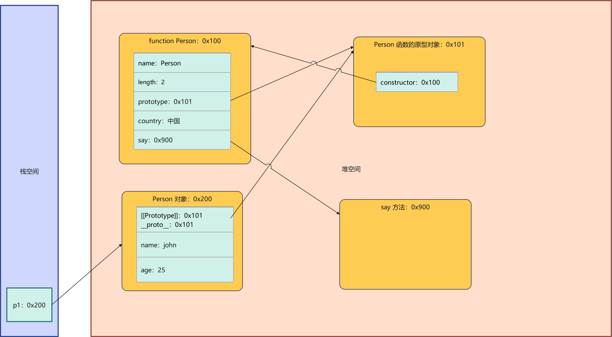

# 第一章：构造函数中的类属性和类方法（⭐）

* 在不加任何限制的情况下，普通对象是可以任意添加属性和方法的：

```html
<!DOCTYPE html>
<html lang="en">
<head>
  <meta charset="UTF-8">
  <meta content="IE=edge" http-equiv="X-UA-Compatible">
  <meta content="width=device-width, initial-scale=1.0" name="viewport">
  <title>Title</title>
</head>
<body>
  <script>
    var obj = {
      name: "许大仙",
      age: 18
    }

    // 添加属性
    obj.gender = "男"
    // 添加方法
    obj.running = function () {
      console.log(this.name + "正在跑")
    }

    console.log(obj)
    obj.running()
  </script>
</body>
</html>
```

* 因为函数也是一种特殊的对象（`new Function()`），所以函数本身也可以添加属性和方法，称为类属性（静态属性）或类方法（静态方法）；并且类属性（静态属性）或类方法（静态方法）只能由类调用。

```html
<!DOCTYPE html>
<html lang="en">
<head>
  <meta charset="UTF-8">
  <meta content="IE=edge" http-equiv="X-UA-Compatible">
  <meta content="width=device-width, initial-scale=1.0" name="viewport">
  <title>Title</title>
</head>
<body>
  <script>
    function Person(name, age) {
      this.name = name
      this.age = age
    }

    // 添加到 Person 对象本身的方法就是构造函数的类方法（静态方法）
    Person.say = function () {
      console.log('人类会唱歌')
    }

    // 添加到 Person 对象本身的属性就是构造函数的类属性（静态属性）
    Person.country = "中国"

    // 添加到 Person 原型上的方法就称为实例方法。
    Person.prototype.eating = function () {
      console.log('人类吃饭')
    }

    var p1 = new Person('John', 25)
    Person.say()
    console.log(Person.country)

  </script>
</body>
</html>
```

* 内存简图：




# 第二章：ES6 中的类（⭐）

## 2.1 概述

* 先看一下，隔壁 Java 是怎么定义类（JavaBean）的：

```java
import java.io.Serializable;

public class Person implements Serializable {
    private String name;
    private int age;

    public Person() {
        // 无参构造函数
    }

    public String getName() {
        return name;
    }

    public void setName(String name) {
        this.name = name;
    }

    public int getAge() {
        return age;
    }

    public void setAge(int age) {
        this.age = age;
    }
    
    static String country = "中国";

}
```

* 那么，ES6 也提供了 class 关键字来定义类，并且其本质就是构造函数、原型链的语法糖而已：

```html
<!DOCTYPE html>
<html lang="en">
<head>
  <meta charset="UTF-8">
  <meta content="IE=edge" http-equiv="X-UA-Compatible">
  <meta content="width=device-width, initial-scale=1.0" name="viewport">
  <title>Title</title>
</head>
<body>
  <script>
    class Person {
      // 静态属性
      static country = "中国"

      // 类中的构造函数
      constructor(name, age) {
        this.name = name;
        this.age = age;
      }

      // 静态方法（类方法）
      static say() {
        console.log("人说话")
      }

      // 实例方法
      running() {
        console.log(this.name + " is running");
      }
    }

    var p1 = new Person("张三", 18)
    p1.running()

    Person.say()
    console.log(Person.country)

  </script>
</body>
</html>
```

## 2.2 类的构造函数

* 如果我们希望在创建对象的时候给类传递一些参数，那么每个类都可以有自己的构造函数，并且名称是固定的就是 `constructor`；当我们通过 `new 类名(...)`，就会调用这个类的构造函数 `constructor`。

```html
<!DOCTYPE html>
<html lang="en">
<head>
  <meta charset="UTF-8">
  <meta content="IE=edge" http-equiv="X-UA-Compatible">
  <meta content="width=device-width, initial-scale=1.0" name="viewport">
  <title>Title</title>
</head>
<body>
  <script>
    class Person {
      
      // 类中的构造函数
      constructor(name, age) {
        this.name = name;
        this.age = age;
      }

      // 实例方法
      running() {
        console.log(this.name + " is running");
      }
    }

    var p1 = new Person("张三", 18)
  </script>
</body>
</html>
```

* `new class类名(...)` 的步骤如下：
  * ① 在内存中创建一个新的对象（空对象）。
  * ② 这个对象内部的 `[[Prototype]]` 属性会被赋值为该类的 `prototype` 属性。
  * ③ 构造函数内部的 this ，会指向创建出来的新对象。
  * ④ 执行构造函数的内部代码（函数体代码）。
  * ⑤ 如果构造函数没有返回非空对象，则返回创建出来的新对象。

> 注意：JavaScript 中目前的版本是没有构造函数重载的概念。

* 证明：

```html
<!DOCTYPE html>
<html lang="en">
<head>
  <meta charset="UTF-8">
  <meta content="IE=edge" http-equiv="X-UA-Compatible">
  <meta content="width=device-width, initial-scale=1.0" name="viewport">
  <title>Title</title>
</head>
<body>
  <script>
    class Person {
      // 类中的构造函数
      constructor(name, age) {
        this.name = name;
        this.age = age;
      }

      // 实例方法
      running() {
        console.log(this.name + " is running");
      }
    }

    var p1 = new Person("张三", 18)
    p1.running()

    console.log(p1.__proto__ == Person.prototype) // true
  </script>
</body>
</html>
```

## 2.3 JavaScript 对象中的访问器（了解）

* 在 JavaScript 中，访问器（accessors）是一种特殊的对象属性，它允许我们定义读取或写入属性时要执行的代码。
* 访问器由 get 和 set 关键字定义，分别用于获取和设置属性的值。
* 访问器不存储实际的属性值，而是在访问属性时动态计算返回值或执行一些操作。

> 注意：实际开发中，很少使用 JavaScript 对象中的访问器，而是通过 `Object.defineProperty()` 方法中的`存取属性描述符`。


* 示例：

```html
<!DOCTYPE html>
<html lang="en">
<head>
  <meta charset="UTF-8">
  <meta content="IE=edge" http-equiv="X-UA-Compatible">
  <meta content="width=device-width, initial-scale=1.0" name="viewport">
  <title>Title</title>
</head>
<body>
  <script>
    var obj = {
      firstName: "",
      lastName: "",
      // 也称为 setter
      set fullName(value) {
        const name = value.split("-")
        this.firstName = name[0]
        this.lastName = name[1]
      },
      // 也称为 getter
      get fullName() {
        return `${this.firstName}${this.lastName}`
      }
    }

    obj.fullName = "许-大仙"
    console.log(obj.firstName) // 许
    console.log(obj.lastName) // 大仙
    console.log(obj.fullName) // 许大仙
  </script>
</body>
</html>
```

## 2.4 类的访问器方法（了解）

* 其实，在 ES6 中也提供了类的访问器。


* 示例：

```html
<!DOCTYPE html>
<html lang="en">
<head>
  <meta charset="UTF-8">
  <meta content="IE=edge" http-equiv="X-UA-Compatible">
  <meta content="width=device-width, initial-scale=1.0" name="viewport">
  <title>Title</title>
</head>
<body>
  <script>

    class Person {
      constructor(name, age) {
        this._name = name;
        this.age = age;
      }

      get name() {
        return this._name
      }

      set name(name) {
        this._name = name
      }

    }

    let p1 = new Person("John", 25);
    p1.name = "许大仙"
    console.log(p1.name); // 许大仙
  </script>
</body>
</html>
```


* 示例：

```html
<!DOCTYPE html>
<html lang="en">
<head>
  <meta charset="UTF-8">
  <meta content="IE=edge" http-equiv="X-UA-Compatible">
  <meta content="width=device-width, initial-scale=1.0" name="viewport">
  <title>Title</title>
</head>
<body>
  <script>

    class Rectangle {
      constructor(x, y, width, height) {
        this.x = x;
        this.y = y;
        this.width = width;
        this.height = height;
      }

      get position() {
        return {
          x: this.x,
          y: this.y
        }
      }

      get size() {
        return {
          width: this.width,
          height: this.height
        }
      }
    }

    let rectangle = new Rectangle(10, 20, 30, 40)
    console.log(rectangle.position)
    console.log(rectangle.size)
  </script>
</body>
</html>
```

## 2.5 类的实例方法

* 我们在类中，可以通过`构造器`来将属性定义到 `this` 中，即每个对象中。
* 其实，对于实例方法，我们希望放在原型中，被多个实例共享，ES6 中的类也是支持的。


* 示例：

```html
<!DOCTYPE html>
<html lang="en">
<head>
  <meta charset="UTF-8">
  <meta content="IE=edge" http-equiv="X-UA-Compatible">
  <meta content="width=device-width, initial-scale=1.0" name="viewport">
  <title>Title</title>
</head>
<body>
  <script>
    class Person {
      
      // 类中的构造函数
      constructor(name, age) {
        this.name = name;
        this.age = age;
      }

      // 实例方法
      running() {
        console.log(this.name + " is running");
      }
    }

    var p1 = new Person("张三", 18)
  </script>
</body>
</html>
```

## 2.6 类的静态属性和静态方法

* 我们可以在类中通过 `static` 关键字定义类的静态属性（类属性）和静态方法（类方法）。


* 示例：

```html
<!DOCTYPE html>
<html lang="en">
<head>
  <meta charset="UTF-8">
  <meta content="IE=edge" http-equiv="X-UA-Compatible">
  <meta content="width=device-width, initial-scale=1.0" name="viewport">
  <title>Title</title>
</head>
<body>
  <script>
    class Person {
      // 静态属性
      static country = "中国"

      // 类中的构造函数
      constructor(name, age) {
        this.name = name;
        this.age = age;
      }

      // 静态方法（类方法）
      static say() {
        console.log("人说话")
      }

      // 实例方法
      running() {
        console.log(this.name + " is running");
      }
    }

    var p1 = new Person("张三", 18)
    p1.running()
    
    Person.say()
    console.log(Person.country)

  </script>
</body>
</html>
```

## 2.7 类的继承

* 在 ES6 中，直接使用 extends 关键字，即可帮助我们实现继承。


* 示例：

```html
<!DOCTYPE html>
<html lang="en">
<head>
  <meta charset="UTF-8">
  <meta content="IE=edge" http-equiv="X-UA-Compatible">
  <meta content="width=device-width, initial-scale=1.0" name="viewport">
  <title>Title</title>
</head>
<body>
  <script>
    class Person {
      constructor(name, age) {
        this.name = name;
        this.age = age;
      }

      running() {
        console.log(this.name + " is running");
      }
    }

    // 通过 extends 来实现继承
    class Student extends Person {

    }

    var stu = new Student("张三", 18)
    stu.running()

    var stu2 = new Student("李四", 18)
    stu2.running()

  </script>
</body>
</html>
```

## 2.8 super 关键字

* ES6 还提供了 `super` 关键字用于`派生类（子类）`中`引用`其`父类`的`属性`和`方法`。
* 它提供了一种机制，让`子类`能够在`扩展父类`的同时`使用父类的成员`。

> 注意：
>
> * `super` 关键字只能在派生类的构造函数和方法中使用。在箭头函数中，它无法访问父类的作用域。
> * 如果父类中的方法使用了 `this` 关键字，那么在子类中通过 `super` 调用这些方法时，父类方法中的 `this` 将指向子类的实例。


* 示例：调用父类的构造函数

```html
<!DOCTYPE html>
<html lang="en">
<head>
  <meta charset="UTF-8">
  <meta content="IE=edge" http-equiv="X-UA-Compatible">
  <meta content="width=device-width, initial-scale=1.0" name="viewport">
  <title>Title</title>
</head>
<body>
  <script>
    class Parent {
      constructor(name) {
        this.name = name;
      }

      sayHello() {
        console.log(`Hello, ${this.name}!`);
      }
    }

    class Child extends Parent {
      constructor(name, age) {
        super(name); // 调用父类构造函数
        this.age = age;
      }

      introduce() {
        console.log(`I'm ${this.name} and I'm ${this.age} years old.`);
      }
    }

    const child = new Child('Alice', 10);
    child.sayHello(); // 调用从父类继承的方法
    child.introduce(); // 调用子类自己的方法

  </script>
</body>
</html>
```


* 示例：调用父类的方法

```html
<!DOCTYPE html>
<html lang="en">
<head>
  <meta charset="UTF-8">
  <meta content="IE=edge" http-equiv="X-UA-Compatible">
  <meta content="width=device-width, initial-scale=1.0" name="viewport">
  <title>Title</title>
</head>
<body>
  <script>
    class Parent {
      sayHello() {
        console.log("Hello from parent!");
      }
    }

    class Child extends Parent {
      sayHello() {
        super.sayHello(); // 调用父类方法
        console.log("Hello from child!");
      }
    }

    const child = new Child();
    child.sayHello();

  </script>
</body>
</html>
```


# 第三章：补充知识（⭐）

## 3.1 对象字面量的增强

* ES6 中对`对象字面量`进行了增强，称之为 Enhanced object literals（增强对象字面量）。
* 对象字面量主要包括如下几个部分：
  * 属性的简写。
  * 方法的简写。
  * 计算属性名的简写。


* 示例：对象字面量增强 --- 属性的简写

```html
<!DOCTYPE html>
<html lang="en">
<head>
  <meta charset="UTF-8">
  <meta content="IE=edge" http-equiv="X-UA-Compatible">
  <meta content="width=device-width, initial-scale=1.0" name="viewport">
  <title>Title</title>
</head>
<body>
  <script>
    /* 属性的传统写法 */
    var name = "张三"

    var obj = {
      name: name,
      age: 18
    }

    /* 属性的增强写法 */
    var obj2 = {
      name, // 相当于 name: name
      age: 18
    }

    console.log(obj)
    console.log(obj2)
  </script>
</body>
</html>
```


* 示例：对象字面量增强 --- 方法的简写

```html
<!DOCTYPE html>
<html lang="en">
<head>
  <meta charset="UTF-8">
  <meta content="IE=edge" http-equiv="X-UA-Compatible">
  <meta content="width=device-width, initial-scale=1.0" name="viewport">
  <title>Title</title>
</head>
<body>
  <script>
    /* 方法的传统写法 */
    var obj = {
      name: "张三",
      saying: function () {
        console.log(this.name + "正在唱歌....")
      }
    }

    /* 方法的增强写法 */
    var obj2 = {
      name: "张三",
      saying() { // 相当于方法的传统写法，不是对箭头函数的简写，因为箭头函数是没有 this 的
        console.log(this.name + "正在唱歌....")
      }
    }

    obj.saying()
    obj2.saying()

  </script>
</body>
</html>
```


* 示例：对象字面量增强 --- 计算属性名的简写

```html
<!DOCTYPE html>
<html lang="en">
<head>
  <meta charset="UTF-8">
  <meta content="IE=edge" http-equiv="X-UA-Compatible">
  <meta content="width=device-width, initial-scale=1.0" name="viewport">
  <title>Title</title>
</head>
<body>
  <script>
    // 计算属性名的简写
    var key = "address"
    obj = {
      [key]: "上海"
    }

    console.log(obj[key])

  </script>
</body>
</html>
```

## 3.2 ES6 中的解构赋值

### 3.2.1 概述

* ES6 中新增了从`数组`或`对象`中`方便获取数据`的方法，称为解构。
* 解构赋值是一种特殊的语法，它使得我们可以很容易的将`数组`或`对象` `“拆包”` 到一系列的变量中。

### 3.2.2 传统方式的痛苦

* 示例：

```html
<!DOCTYPE html>
<html lang="en">
<head>
  <meta charset="UTF-8">
  <meta content="IE=edge" http-equiv="X-UA-Compatible">
  <meta content="width=device-width, initial-scale=1.0" name="viewport">
  <title>Title</title>
</head>
<body>
  <script>
    /* 传统方式将数组中的元素取出，赋值给其他变量 */
    var arr = [1, 2, 3, 4]

    var a = arr[0]
    var b = arr[1]
    var c = arr[2]
    var d = arr[3]

    console.log(a, b, c, d) // 1 2 3 4

    /* 传统方式通过 . 将对象的属性取出，赋值给其他变量 */
    var obj = {name: "张三", age: 18}
    var name = obj.name
    var age = obj.age
    console.log(name, age) // 张三 18

  </script>
</body>
</html>
```

### 3.2.3 数组解构

* 语法：

```js
var [a,b] = {1,2,3,4,...}
```


* 示例：数组解构的基本使用

```html
<!DOCTYPE html>
<html lang="en">
<head>
  <meta charset="UTF-8">
  <meta content="IE=edge" http-equiv="X-UA-Compatible">
  <meta content="width=device-width, initial-scale=1.0" name="viewport">
  <title>Title</title>
</head>
<body>
  <script>
    // 数组解构的使用
    var [a, b, c] = [1, 2, 3]
    console.log(a, b, c)
  </script>
</body>
</html>
```


* 示例：数组解构形成新的小数组（了解）

```html
<!DOCTYPE html>
<html lang="en">
<head>
  <meta charset="UTF-8">
  <meta content="IE=edge" http-equiv="X-UA-Compatible">
  <meta content="width=device-width, initial-scale=1.0" name="viewport">
  <title>Title</title>
</head>
<body>
  <script>
    // 数组解构形成新的小数组
    var [a, ...rest] = [1, 3, 4, 5, 65]
    console.log(a, rest) // 1 [3, 4, 5, 65]
  </script>
</body>
</html>
```


* 示例：数组解构中的顺序解构（了解）

```html
<!DOCTYPE html>
<html lang="en">
<head>
  <meta charset="UTF-8">
  <meta content="IE=edge" http-equiv="X-UA-Compatible">
  <meta content="width=device-width, initial-scale=1.0" name="viewport">
  <title>Title</title>
</head>
<body>
  <script>
    // 数组解构中的顺序解构：严格的顺序
    var [a, , c] = [1, 2, 4]
    console.log(a, c)
  </script>
</body>
</html>
```


* 示例：数组解构中的默认值（了解）

```html
<!DOCTYPE html>
<html lang="en">
<head>
  <meta charset="UTF-8">
  <meta content="IE=edge" http-equiv="X-UA-Compatible">
  <meta content="width=device-width, initial-scale=1.0" name="viewport">
  <title>Title</title>
</head>
<body>
  <script>
    var [a, b = 10, c = 10] = [1, undefined, 3]
    console.log(a, b, c)
  </script>
</body>
</html>
```

### 3.2.4 对象解构

* 语法：

```js
var {a,b} = {a:1,b:2,...}
```


* 示例：对象解构的基本使用

```html
<!DOCTYPE html>
<html lang="en">
<head>
  <meta charset="UTF-8">
  <meta content="IE=edge" http-equiv="X-UA-Compatible">
  <meta content="width=device-width, initial-scale=1.0" name="viewport">
  <title>Title</title>
</head>
<body>
  <script>
    // 对象解构的基本使用，根据 key 来解构
    var {name,age} = {name: "张三", age: 18, gender: "男"}
    console.log(age, name)
  </script>
</body>
</html>
```


* 示例：对象解构中没有顺序问题

```html
<!DOCTYPE html>
<html lang="en">
<head>
  <meta charset="UTF-8">
  <meta content="IE=edge" http-equiv="X-UA-Compatible">
  <meta content="width=device-width, initial-scale=1.0" name="viewport">
  <title>Title</title>
</head>
<body>
  <script>
    // 顺序问题：对象的解构是没有顺序的，根据 key 来解构的
    var {age, name} = {name: "张三", age: 18, gender: "男"}
    console.log(age, name)
  </script>
</body>
</html>
```


* 示例：对象解构中的重命名

```html
<!DOCTYPE html>
<html lang="en">
<head>
  <meta charset="UTF-8">
  <meta content="IE=edge" http-equiv="X-UA-Compatible">
  <meta content="width=device-width, initial-scale=1.0" name="viewport">
  <title>Title</title>
</head>
<body>
  <script>
    // 使用 :xx 来进行重命名
    var {age, name, gender: X} = {name: "张三", age: 18, gender: "男"}
    console.log(age, name, X)
  </script>
</body>
</html>
```


* 示例：对象解构中的默认值

```html
<!DOCTYPE html>
<html lang="en">
<head>
  <meta charset="UTF-8">
  <meta content="IE=edge" http-equiv="X-UA-Compatible">
  <meta content="width=device-width, initial-scale=1.0" name="viewport">
  <title>Title</title>
</head>
<body>
  <script>
    // 默认值
    var { 
        age, 
        name, 
        gender: X, 
        address = "北京" // 默认值
    } = {
      name: "张三",
      age: 18,
      gender: "男"
    }
    console.log(age, name, X, address)
  </script>
</body>
</html>
```


* 示例：对象解构中的嵌套解构

```html
<!DOCTYPE html>
<html lang="en">
<head>
  <meta charset="UTF-8">
  <meta content="IE=edge" http-equiv="X-UA-Compatible">
  <meta content="width=device-width, initial-scale=1.0" name="viewport">
  <title>Title</title>
</head>
<body>
  <script>
    const user = {
      username: 'example',
      email: 'example@example.com',
      details: {
        age: 30,
        country: 'USA'
      }
    };

    const {username, details: {age, country}} = user;
    console.log(username); // 输出: 'example'
    console.log(age);      // 输出: 30
    console.log(country);  // 输出: 'USA'
  </script>
</body>
</html>
```


* 示例：对象解构应用于函数形参中

```html
<!DOCTYPE html>
<html lang="en">
<head>
  <meta charset="UTF-8">
  <meta content="IE=edge" http-equiv="X-UA-Compatible">
  <meta content="width=device-width, initial-scale=1.0" name="viewport">
  <title>Title</title>
</head>
<body>
  <script>
    function foo({a, b}) {
      console.log(a, b);
    }

    foo({a: 1, b: 2});
  </script>
</body>
</html>
```

