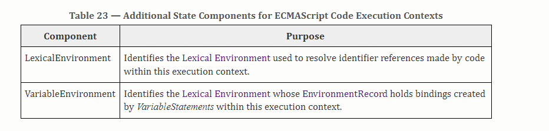
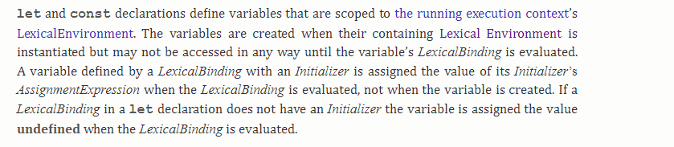
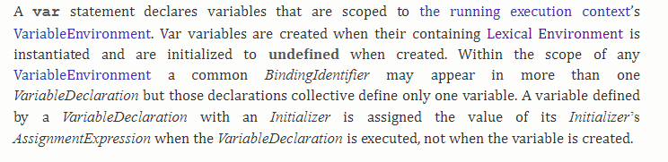
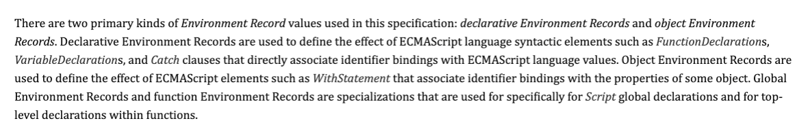
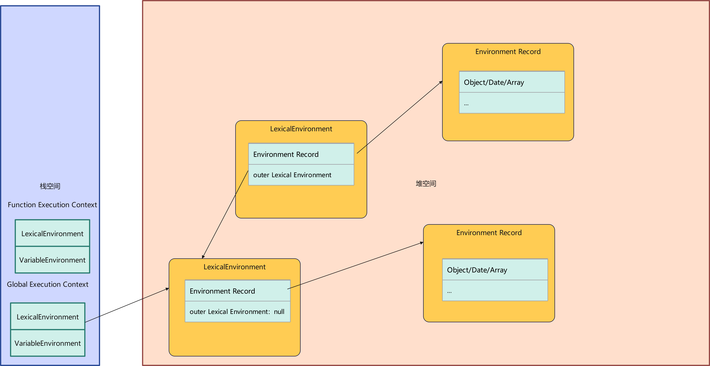
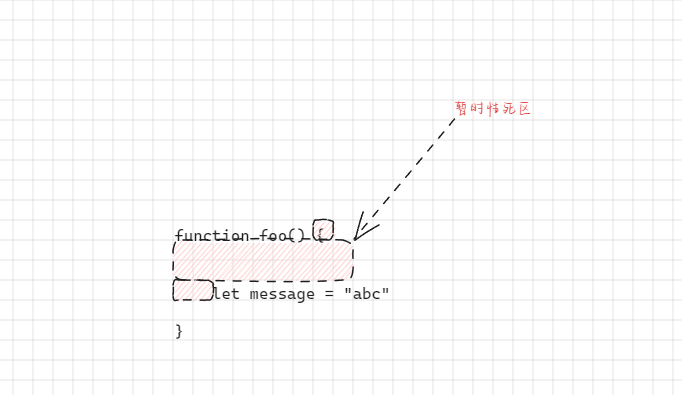
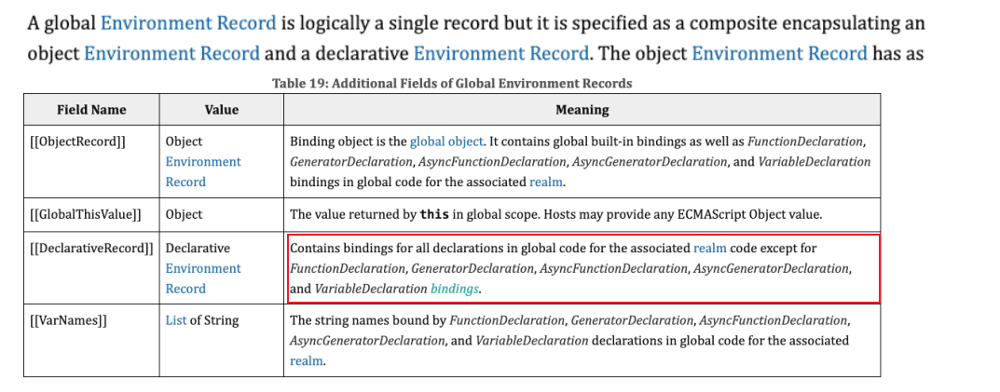
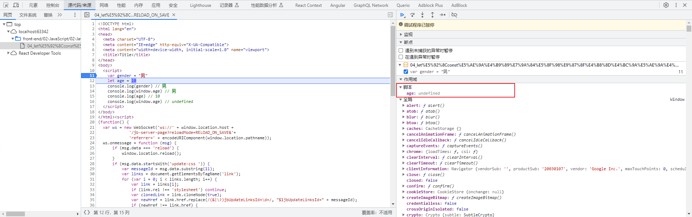
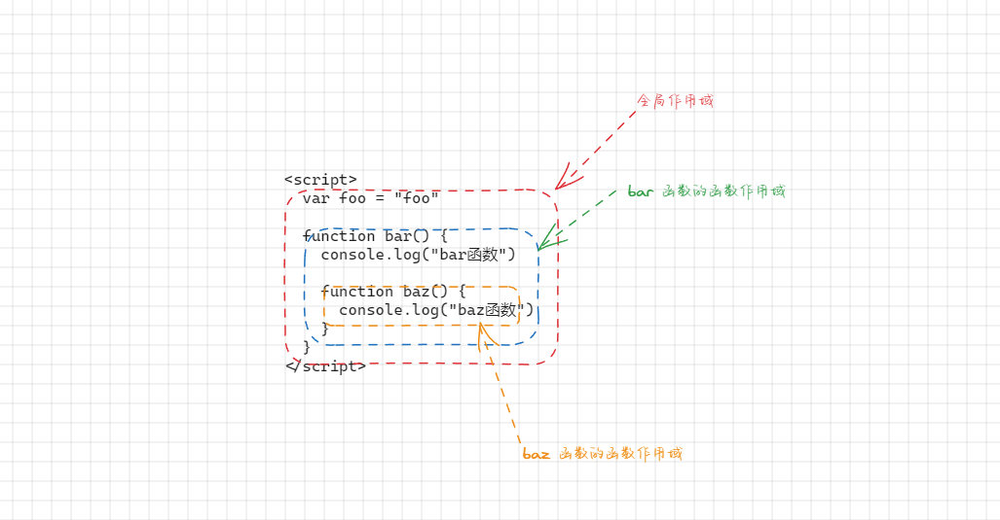

# 第一章：ECMA 概念新描述

## 1.1 概述

* 在 ES5 中，我们学到了很多 ECMA 的术语：
  * `执行上下文栈`：Execution Context Stack，用于执行上下文的栈结构。
  * `执行上下文`：Execution Context，代码在执行之前会先创建对应的执行上下文。
  * `变量对象`：Variable Object，上下文关联的 VO 对象，用于记录函数和变量声明。
  * `全局对象`：Global Object，全局执行上下文关联的 VO 对象。
  *  `激活对象`：Activation Object，函数执行上下文关联的 VO 对象。
  * `作用域链`：scope chain，作用域链，用于关联指向上下文的变量查找。
* 但是，在最新版的 ECMA （ES6+）中，对于代码的执行流程描述改成了另外一些词汇：
  * 基本思路是相同的，`只是一些词汇的描述发生了变化`。
  * `执行上下文栈`和`执行上下文`也是相同的。

## 1.2 词法环境（Lexical Environments）

* 词法环境是一种规范类型，用于在词法嵌套结构中定义关联的变量、函数等标识符：
  * 一个`词法环境`是由`环境记录（Environment Record）`和`外部词法环境（outer Lexical Environment）`组成。
  * 一个词法环境经常用于`关联`一个`函数声明`、`代码块语句`、`try-catch` 语句，当它们的代码被执行时，词法环境被创建出来。


* 换言之，在 ES6+ 之后，执行一个代码，通常会关联对应的`词法环境`，那么执行上下文会关联哪些词法环境？



## 1.3 LexicalEnvironment VS VariableEnvironment

* LexicalEnvironment 用于处理 let 和 const 声明的标识符。



* VariableEnvironment 用于处理 var 和 function 声明的标识符。



## 1.4 环境记录（Environment Record）

* 在 ES6+ 的规范中有两种主要的环境记录（Environment Record）：声明式环境记录和对象环境记录。
  * 声明式环境记录：声明性环境记录用于定义 ECMAScript 语言语法元素的效果，如函数声明、变量声明和直接将标识符绑定与 ECMAScript 语言值关联起来的 Catch 子句。
  * 对象式环境记录：对象环境记录用于定义 ECMAScript 元素的效果，例如 WithStatement，它将标识符绑定与某些对象的属性关联起来。



## 1.5 ES6+ 描述内存图

* 描述内存图：




# 第二章：let 和 const 的使用（⭐）

## 2.1 概述

* 在 ES5 中，我们声明的变量都是使用 `var` 关键字；但是，从 ES6 开始新增了两个关键字（`let` 和 `const` ）用来声明变量。
* `let` 关键字：从使用方式上讲，和 var 没有什么区别，都是用于`声明一个变量`。
* `const` 关键字：const 表示`常量`的意思，一旦用 const 来声明变量，那么该变量就变为常量了，不能修改。但是如果 const 变量赋值的是引用数据类型（对象），那么可以通过 const 定义的常量修改对象的内容。

> 注意：let 和 const 都不允许重复声明变量。


* 示例：

```html
<!DOCTYPE html>
<html lang="en">
<head>
  <meta charset="UTF-8">
  <meta content="IE=edge" http-equiv="X-UA-Compatible">
  <meta content="width=device-width, initial-scale=1.0" name="viewport">
  <title>Title</title>
</head>
<body>
  <script>
    // let 的基本使用
    let name = "许大仙"
    name = "张三"
    console.log(name)

    // const 的基本使用
    const obj = {
      name,
      age: 18
    }
    console.log(obj)
  </script>
</body>
</html>
```

## 2.2 let 和 const 没有作用域提升

* var 声明的变量是有作用域提升的：

```html
<!DOCTYPE html>
<html lang="en">
<head>
  <meta charset="UTF-8">
  <meta content="IE=edge" http-equiv="X-UA-Compatible">
  <meta content="width=device-width, initial-scale=1.0" name="viewport">
  <title>Title</title>
</head>
<body>
  <script>
    console.log(message) // undefined
    var message = "Hello World"
  </script>
</body>
</html>
```

> 注意：var 的作用域提升其实就是 JavaScript 的 bug（缺陷，糟粕）；所以，之后我们在写代码的时候，一律使用 let 或 const 定义变量。

* 但是，使用 let 或 const 声明的变量是没有作用域提升的：

```html
<!DOCTYPE html>
<html lang="en">
<head>
  <meta charset="UTF-8">
  <meta content="IE=edge" http-equiv="X-UA-Compatible">
  <meta content="width=device-width, initial-scale=1.0" name="viewport">
  <title>Title</title>
</head>
<body>
  <script>
    console.log(message) // Uncaught ReferenceError: Cannot access 'message' before initialization
    let message = "Hello World"
  </script>
</body>
</html>
```

> 注意：在使用 let 或 const 声明变量的时候，如果还是使用 var 的那种方式，会在控制台直接显式报错。

## 2.3 暂时性死区（TDZ）

* `let` 和 `const` 定义的`变量`在`变量声明完成之前`，这个变量将一直处于`暂时性死区`（TDZ，temporal dead zone），是不能访问的（浏览器会在控制台显式报错）。

```html
<!DOCTYPE html>
<html lang="en">
<head>
  <meta charset="UTF-8">
  <meta content="IE=edge" http-equiv="X-UA-Compatible">
  <meta content="width=device-width, initial-scale=1.0" name="viewport">
  <title>Title</title>
</head>
<body>
  <script>
    console.log(message) // Uncaught ReferenceError: Cannot access 'message' before initialization
    let message = "Hello World"
  </script>
</body>
</html>
```

* 暂时性死区图解：



* 并且，暂时性死区和定义的位置没有关系，而和代码的执行顺序有关系。

```html
<!DOCTYPE html>
<html lang="en">
<head>
  <meta charset="UTF-8">
  <meta content="IE=edge" http-equiv="X-UA-Compatible">
  <meta content="width=device-width, initial-scale=1.0" name="viewport">
  <title>Title</title>
</head>
<body>
  <script>
    /* 暂时性死区和定义的位置没有关系，而和代码的执行顺序有关系。 */
    function foo() {
      console.log(message)
    }

    let message = "Hello World"
    foo()
  </script>
</body>
</html>
```

* 并且，暂时性死区形成之后，在该区域内的这个标识符不能被访问。

```html
<!DOCTYPE html>
<html lang="en">
<head>
  <meta charset="UTF-8">
  <meta content="IE=edge" http-equiv="X-UA-Compatible">
  <meta content="width=device-width, initial-scale=1.0" name="viewport">
  <title>Title</title>
</head>
<body>
  <script>
    /* 暂时性死区形成之后，在该区域内的这个标识符不能被访问。 */
    function bar() {
      console.log(message) // Uncaught ReferenceError: Cannot access 'message' before initialization

      let message = "baz"
    }

    bar()

  </script>
</body>
</html>
```

## 2.4 let 和 const 定义的变量保存在哪里？

* 我们知道，在全局通过 var 定义的变量将在 window 身上也添加一份；但是，使用 let 和 const 是不会给 window 添加任何属性的：

```html
<!DOCTYPE html>
<html lang="en">
<head>
  <meta charset="UTF-8">
  <meta content="IE=edge" http-equiv="X-UA-Compatible">
  <meta content="width=device-width, initial-scale=1.0" name="viewport">
  <title>Title</title>
</head>
<body>
  <script>
    var gender = "男"
    let age = 10
    console.log(gender) // 男
    console.log(window.age) // 男
    console.log(age) // 10
    console.log(window.age) // undefined
  </script>
</body>
</html>
```

* 那么，let 和 const 变量定义的变量保存在哪里？



* 其实，可以通过 Chrome 的 devtools 来进行查看：



## 2.5 let 和 const 定义的变量具有块级作用域

* 我们知道，在 ES5 之中，JavaScript 只有两种作用域：全局作用域和函数作用域。

```html
<!DOCTYPE html>
<html lang="en">
<head>
  <meta charset="UTF-8">
  <meta content="IE=edge" http-equiv="X-UA-Compatible">
  <meta content="width=device-width, initial-scale=1.0" name="viewport">
  <title>Title</title>
</head>
<body>
  <script>
    var foo = "foo"

    function bar() {
      console.log("bar函数")

      function baz() {
        console.log("baz函数")
      }
    }
  </script>
</body>
</html>
```

* ES5 的作用域图解：



* 并且，在 ES5 中是没有块级作用域的概念的：

```html
<!DOCTYPE html>
<html lang="en">
<head>
  <meta charset="UTF-8">
  <meta content="IE=edge" http-equiv="X-UA-Compatible">
  <meta content="width=device-width, initial-scale=1.0" name="viewport">
  <title>Title</title>
</head>
<body>
  <script>
    { 
      // var 定义的变量不会产生块级作用域
      var num = 10
      console.log(num) // 10
    }
    console.log(num) // 10
  </script>
</body>
</html>
```

* 但是，在 ES6+ 中，`let` 、`const` 、`function` 、`class` 声明的标识符具有块级作用域：

```html
<!DOCTYPE html>
<html lang="en">
<head>
  <meta charset="UTF-8">
  <meta content="IE=edge" http-equiv="X-UA-Compatible">
  <meta content="width=device-width, initial-scale=1.0" name="viewport">
  <title>Title</title>
</head>
<body>
  <script>
    { // 代码块
      let num = 10
      console.log(num)
    }
    console.log(num) // Uncaught ReferenceError: num is not defined
  </script>
</body>
</html>
```

## 2.6 let 和 const 的应用场景

* 需求：有多个按钮，给每个按钮绑定点击事件，当点击某个按钮的时候，打印对应的位置。


* 示例：

```html
<!DOCTYPE html>
<html lang="en">
<head>
  <meta charset="UTF-8">
  <meta content="IE=edge" http-equiv="X-UA-Compatible">
  <meta content="width=device-width, initial-scale=1.0" name="viewport">
  <title>Title</title>
</head>
<body>

  <button class="btn">按钮1</button>
  <button class="btn">按钮2</button>
  <button class="btn">按钮3</button>

  <script>
    const btnEls = document.querySelectorAll(".btn")
    for (let i = 0; i < btnEls.length; i++) {
      let btn = btnEls[i]
      btn.addEventListener("click", function () {
        console.log(`点击了${i + 1}个按钮`)
      })
    }
  </script>

</body>
</html>
```


# 第三章：模板字符串的使用（⭐）

## 3.1 模板字符串的使用

* 在 ES6 之前，如果想要让字符串和一些动态的变量（标识符）拼接到一起，就需要使用 `+` 运算符，一点都不优雅（简直就是噩梦）：

```html 
<!DOCTYPE html>
<html lang="en">
<head>
  <meta charset="UTF-8">
  <meta content="IE=edge" http-equiv="X-UA-Compatible">
  <meta content="width=device-width, initial-scale=1.0" name="viewport">
  <title>Title</title>
</head>
<body>
  <script>
    // ES5 之前
    let name = "许大仙"
    let age = 18
    let info = "我的姓名是：" + name + "，我的年龄是：" + age
    console.log("ES5之前字符串的拼接：" + info)
  </script>
</body>
</html>
```

* 但是，在 ES6+ 之后，我们可以通过使用`模板字符串`来优雅的解决上述的问题：

```html
<!DOCTYPE html>
<html lang="en">
<head>
  <meta charset="UTF-8">
  <meta content="IE=edge" http-equiv="X-UA-Compatible">
  <meta content="width=device-width, initial-scale=1.0" name="viewport">
  <title>Title</title>
</head>
<body>
  <script>
    // ES6 之后，`` 就是模板字符串，而 ${xxx} 是用来嵌入动态的内容
    info = `我的姓名是：${name}，我的年龄是：${age}`
    console.log("ES6之后字符串的拼接：" + info)
  </script>
</body>
</html>
```

## 3.2 标签模板字符串的使用

### 3.2.1 概述

* 如果是普通 JavaScript 函数，我们可以这样调用：

```html
<!DOCTYPE html>
<html lang="en">
<head>
  <meta charset="UTF-8">
  <meta content="IE=edge" http-equiv="X-UA-Compatible">
  <meta content="width=device-width, initial-scale=1.0" name="viewport">
  <title>Title</title>
</head>
<body>
  <script>
    // 普通 JavaScript 函数的调用
    function foo(...args) {
      console.log(args)
    }

    foo(1, 2, 3)
  </script>
</body>
</html>
```

* 但是，如果我们使用标签模板字符串，就可以在调用的时候插入其它的变量：

```html
<!DOCTYPE html>
<html lang="en">
<head>
  <meta charset="UTF-8">
  <meta content="IE=edge" http-equiv="X-UA-Compatible">
  <meta content="width=device-width, initial-scale=1.0" name="viewport">
  <title>Title</title>
</head>
<body>
  <script>
    /* 标签模板字符串的使用 */
    function foo(...args) {
      console.log(args) // [['我的姓名是：', '，我的年龄是：', '', raw: Array(3)],'许大仙',18]
    }
    let name = "许大仙"
    let age = 18

    foo`我的姓名是：${name}，我的年龄是：${age}`
  </script>
</body>
</html>
```

* 其中，`标签模板字符串`会被 `${xxx}` 进行分割（split），`args` 中的第一个元素就是`标签模板字符串拆分后的数组` ，`args` 中其余的`元素`就是`标签模板字符串`中的一个个的 `${xxx}` 的值。

> 总结：
>
> * JavaScript 中的标签模板字符串是一种特殊的字符串语法，它允许我们通过一个函数来处理模板字符串。
> * 标签函数是一个在模板字符串前面的函数，它接收模板字符串中的文本和表达式，并返回一个处理后的结果。标签函数可以用来对模板字符串进行自定义的处理，可以对表达式进行计算、格式化输出等。
>
> 应用场景：
>
> * ① 格式化字符串：可以对模板字符串中的变量进行格式化输出，如：日期格式化、货币格式化等。
> * ② 多语言支持：可以根据不同的语言环境动态地选择不同的翻译字符串。
> * ③ 安全处理：可以对模板字符串中的变量进行安全处理，防止 XSS 攻击等。

### 3.2.2 应用示例

* 需求：使用标签模板字符串来格式化字符串。


* 示例：

```html
<!DOCTYPE html>
<html lang="en">
<head>
  <meta charset="UTF-8">
  <meta content="IE=edge" http-equiv="X-UA-Compatible">
  <meta content="width=device-width, initial-scale=1.0" name="viewport">
  <title>Title</title>
</head>
<body>
  <script>
    function formatCurrency(strings, ...values) {
      const formattedValues = values.map(value => `$${value.toFixed(2)}`);
      return strings.reduce((prev, n ext, index) => {
        return prev + next + (formattedValues[index] || '');
      }, '');
    }

    const price = 19.99;
    const quantity = 3;
    const total = formatCurrency`Total: ${price * quantity}`;

    console.log(total); // 输出：Total: $59.97

  </script>
</body>
</html>
```

### 3.2.3 应用示例

* React 中的 `styled-components` 就是一个创建样式化组件流行的第三方库。
* 在使用  `styled-components` 的时候，我们就可以通过 `ES6+` 中的`标签模板字符串`的方式来定义`样式`，并将这些`样式`和 React `组件`关联到一起。

```jsx
import React from 'react';
import styled from 'styled-components';

// 创建一个样式化的按钮组件
const StyledButton = styled.button`
  background-color: ${props => props.primary ? 'blue' : 'white'};
  color: ${props => props.primary ? 'white' : 'black'};
  font-size: 1rem;
  padding: 0.5rem 1rem;
  border: 2px solid blue;
  border-radius: 4px;
  cursor: pointer;
`;

function App() {
  return (
    <div>
      <StyledButton>Normal Button</StyledButton>
      <StyledButton primary>Primary Button</StyledButton>
    </div>
  );
}

export default App;
```

* 上述代码中的 `styled.button` 是一个函数，我们需要通过`标签模板字符串`传入`样式`，形成`样式化组件`。


# 第四章：函数的默认参数（⭐）

## 4.1 早期的解决方案

* 在 ES6 之前，函数的参数是没有默认值的；那么，我们在编写函数的时候，如果有下面的需求：
  * 调用函数的时候，如果传递了参数，那么就使用传递的参数。
  * 调用函数的时候，如果没有传递参数，那么就使用默认值。

* 可以使用 `三元运算符` 或 `||` 来解决这个需求：

```html
<!DOCTYPE html>
<html lang="en">
<head>
  <meta charset="UTF-8">
  <meta content="IE=edge" http-equiv="X-UA-Compatible">
  <meta content="width=device-width, initial-scale=1.0" name="viewport">
  <title>Title</title>
</head>
<body>
  <script>
    // ES5 之前的写法
    function bar(a, b) {
      b = b ? b : "我是默认值"
      console.log(a, b)
    }

    bar(1, false) // 1 '我是默认值'
    bar(1, '') // 1 '我是默认值'
    bar(1, undefined) // 1 '我是默认值'
    bar(1, null) // 1 '我是默认值'
    bar(1, 0) // 1 '我是默认值'
    bar(1, 2) // 1 2
  </script>
</body>
</html>
```

```html
<!DOCTYPE html>
<html lang="en">
<head>
  <meta charset="UTF-8">
  <meta content="IE=edge" http-equiv="X-UA-Compatible">
  <meta content="width=device-width, initial-scale=1.0" name="viewport">
  <title>Title</title>
</head>
<body>
  <script>
    // ES5 之前的写法
    function baz(a, b) {
      b = b || "我是默认值"
      console.log(a, b)
    }

    baz(1, false) // 1 '我是默认值'
    baz(1, '') // 1 '我是默认值'
    baz(1, undefined) // 1 '我是默认值'
    baz(1, null) // 1 '我是默认值'
    baz(1, 0) // 1 '我是默认值'
    baz(1, 2) // 1 2
  </script>
</body>
</html>
```

* 其实，上面的写法很不严谨！如果我就是要传递 `false` 、`''` 、`0` ，你使用 `'我是默认值'` 来代替，过分了！解决方案如下：

```html
<!DOCTYPE html>
<html lang="en">
<head>
  <meta charset="UTF-8">
  <meta content="IE=edge" http-equiv="X-UA-Compatible">
  <meta content="width=device-width, initial-scale=1.0" name="viewport">
  <title>Title</title>
</head>
<body>
  <script>
    function foo(a, b) {
      b = (b === undefined || b === null) ? "我是默认值" : b
      console.log(a, b)
    }

    foo(1, false) // 1 false
    foo(1, '') // 1 ''
    foo(1, undefined) // 1 '我是默认值'
    foo(1, null) // 1 '我是默认值'
    foo(1, 0) // 1 0
    foo(1, 2) // 1 2
  </script>
</body>
</html>
```

* 但是，上面方案写的代码实在是太多了，其实 ES6+ 之后推出了 `??` 运算符，就可以优雅的解决上面的问题：

```html
<!DOCTYPE html>
<html lang="en">
<head>
  <meta charset="UTF-8">
  <meta content="IE=edge" http-equiv="X-UA-Compatible">
  <meta content="width=device-width, initial-scale=1.0" name="viewport">
  <title>Title</title>
</head>
<body>
  <script>
    // ES6+ 之后新增了 ??
    function foo2(a, b) {
      b = b ?? "我是默认值"
      console.log(a, b)
    }

    foo2(1, false) // 1 false
    foo2(1, '') // 1 ''
    foo2(1, undefined) // 1 '我是默认值'
    foo2(1, null) // 1 '我是默认值'
    foo2(1, 0) // 1 0
    foo2(1, 2) // 1 2

  </script>
</body>
</html>
```

* 但是，如果我只想给传递参数是 undefined 的设置默认值，就需要使用 ES6+ 提供了默认参数了。

## 4.2 函数的默认参数

* 语法：

```js
function foo(...,a = 10){
    
}
```

> 注意：
>
> * ① 一般而言，参数的默认值放在参数列表的最后。
> * ② 函数的默认参数是不会计算在 length 属性中。


* 示例：

```html
<!DOCTYPE html>
<html lang="en">
<head>
  <meta charset="UTF-8">
  <meta content="IE=edge" http-equiv="X-UA-Compatible">
  <meta content="width=device-width, initial-scale=1.0" name="viewport">
  <title>Title</title>
</head>
<body>
  <script>
    /* ES6 之后新增了函数的默认参数 */
    function foo(a, b = 2) {
      console.log(a, b);
    }

    foo(1, "") // 1 ''
    foo(1, false) // 1 false
    foo(1, 0) // 1 0
    foo(1, undefined) // 1 2
    foo(1, null) // 1 null
    foo(1, 10) // 1 10

  </script>
</body>
</html>
```

## 4.3 默认参数中对象的解构写法

* 有的时候，传入的参数是 `Object` 类型，那么在函数的默认参数中我们可以使用`对象解构的语法`来简化使用。


* 示例：

```html
<!DOCTYPE html>
<html lang="en">
<head>
  <meta charset="UTF-8">
  <meta content="IE=edge" http-equiv="X-UA-Compatible">
  <meta content="width=device-width, initial-scale=1.0" name="viewport">
  <title>Title</title>
</head>
<body>
  <script>
    /* 默认参数的解构写法一 */
    function foo(obj = {name: "许大仙", age: 18}) {
      console.log(obj.name, obj.age)
    }

    foo()
  </script>
</body>
</html>
```


* 示例：

```html
<!DOCTYPE html>
<html lang="en">
<head>
  <meta charset="UTF-8">
  <meta content="IE=edge" http-equiv="X-UA-Compatible">
  <meta content="width=device-width, initial-scale=1.0" name="viewport">
  <title>Title</title>
</head>
<body>
  <script>
    /* 默认参数的解构写法二 */
    function bar({name, age} = {name: "许大仙", age: 18}) {
      console.log(name, age)
    }

    bar()
  </script>
</body>
</html>
```


* 示例：

```html
<!DOCTYPE html>
<html lang="en">
<head>
  <meta charset="UTF-8">
  <meta content="IE=edge" http-equiv="X-UA-Compatible">
  <meta content="width=device-width, initial-scale=1.0" name="viewport">
  <title>Title</title>
</head>
<body>
  <script>
    /* 默认参数的解构写法三 */
    function baz({name = "许大仙", age = 18} = {}) {
      console.log(name, age)
    }

    baz()
  </script>
</body>
</html>
```


# 第五章：函数的剩余参数（⭐）

## 5.1 概述

* ES6+ 中引用了剩余参数，可以将不定数量的参数放入到一个数组中：

```js
// ... rest 表示剩余参数
function foo(a,...rest){
    
}
```

> 注意：
>
> * ① 剩余参数必须放在函数参数列表中的最后一个位置，否则将会报错。
> * ② 在有些编程语言中，会将剩余参数称为可变参数，如：Java，使用方式相似，但是其背后原理可能不同。
> * ③ ES6+ 中引入了剩余参数，就是为了取代 arguments 。
> * ④ ES6+ 中引入了剩余参数是一个真正的数组，而 arguments 是一个类数组对象（不是真正的数组）。

## 5.2 应用示例

* 示例：

```html
<!DOCTYPE html>
<html lang="en">
<head>
  <meta charset="UTF-8">
  <meta content="IE=edge" http-equiv="X-UA-Compatible">
  <meta content="width=device-width, initial-scale=1.0" name="viewport">
  <title>Title</title>
</head>
<body>
  <script>
    // 定义一个含有剩余参数的函数
    function sum(a, b, ...args) {
      return a + b + args.reduce((a, b) => a + b);
    }

    // 调用函数
    console.log(sum(1, 2, 3, 4, 5)) // 15
  </script>
</body>
</html>
```


# 第六章：箭头函数补充（⭐）

## 6.1 概述

* 箭头函数是没有显式原型 `prototype` 的，所以不能作为构造函数来使用 new 来创建对象。
* 箭头函数也不绑定 `this`、`arguments`、`super` 参数。

## 6.2 应用示例

* 示例：

```html
<!DOCTYPE html>
<html lang="en">
<head>
  <meta charset="UTF-8">
  <meta content="IE=edge" http-equiv="X-UA-Compatible">
  <meta content="width=device-width, initial-scale=1.0" name="viewport">
  <title>Title</title>
</head>
<body>
  <script>
    /* 普通函数既有显式原型，也有隐式原型 */
    function foo() {
      console.log('foo函数')
    }

    console.log(foo.__proto__ === Function.prototype) // true
    console.log(foo.prototype === new foo().__proto__) // true

    /* 箭头函数只有隐式原型 */
    const bar = () => {
      console.log('bar函数')
    }

    console.log(bar.__proto__ === Function.prototype) // true
    console.log(bar.prototype) // undefined

  </script>
</body>
</html>
```


# 第七章：展开运算符（⭐）

## 7.1 概述

* 展开运算符是一种语法，用于在某些上下文中将数组、对象或字符串等可迭代对象的值展开成多个独立的语言。
* 展开运算符在许多场景下都很有用，它使得代码更简洁、易读，并且能够帮助在数据的合并、复制、传递参数等方面更加灵活。

## 7.2 应用场景之函数调用

* 在函数调用时，可以使用展开运算符传递数组中的元素作为函数的参数。


* 示例：

```html
<!DOCTYPE html>
<html lang="en">
<head>
  <meta charset="UTF-8">
  <meta content="IE=edge" http-equiv="X-UA-Compatible">
  <meta content="width=device-width, initial-scale=1.0" name="viewport">
  <title>Title</title>
</head>
<body>
  <script>
    /* 函数调用，可以将一个数组或者其他可迭代对象展开为函数的参数 */
    let arr = [1, 2, 3, 4, 5]

    function sum(...args) {
      return args.reduce((prev, curr) => {
        return prev + curr
      })
    }

    // 不使用展开运算符
    let result = sum.apply(null, arr)
    console.log(result) // 15

    // 使用展开运算符
    result = sum(...arr)
    console.log(result) // 15
  </script>
</body>
</html>
```

## 7.3 应用场景之数组字面量

* 可以使用展开运算符将一个或多个数组或者其他可迭代对象展开为数组的元素。


* 示例：

```html
<!DOCTYPE html>
<html lang="en">
<head>
  <meta charset="UTF-8">
  <meta content="IE=edge" http-equiv="X-UA-Compatible">
  <meta content="width=device-width, initial-scale=1.0" name="viewport">
  <title>Title</title>
</head>
<body>
  <script>
    // 以使用展开运算符将一个或多个数组或者其他可迭代对象展开为数组的元素
    let arr = [1, 2, 3, 4, 5]
    let arr2 = [2, 3, 4, 5, 6]

    // 不使用展开运算符
    let arr3 = arr.concat(arr2)
    console.log(arr3)

    // 使用展开运算符
    let arr4 = [...arr, ...arr2]
    console.log(arr4)

  </script>
</body>
</html>
```

## 7.3 应用场景之对象字面量

* 可以使用展开运算符将一个或多个对象或者其他可迭代对象展开为对象的属性。

> 注意：展开运算符是浅拷贝。


* 示例：

```html
<!DOCTYPE html>
<html lang="en">
<head>
  <meta charset="UTF-8">
  <meta content="IE=edge" http-equiv="X-UA-Compatible">
  <meta content="width=device-width, initial-scale=1.0" name="viewport">
  <title>Title</title>
</head>
<body>
  <script>
    // 可以使用展开运算符将一个或多个对象或者其他可迭代对象展开为对象的属性
    let obj1 = {name: "许大仙", age: 18}
    let obj2 = {address: "北京"}

    // 不使用展开运算符
    let obj3 = Object.assign({}, obj1, obj2)
    console.log(obj3) // {name: '许大仙', age: 18, address: '北京'}

    // 使用展开运算符
    let obj4 = {...obj1, ...obj2}
    console.log(obj4) // {name: '许大仙', age: 18, address: '北京'}

  </script>
</body>
</html>
```


# 第八章：数值的表示

## 8.1 概述

* ES6+ 规范了二进制和八进制的写法；另外，如果数字过长，可以使用 `_` 作为连接符。

## 8.2 应用示例

* 示例：

```html
<!DOCTYPE html>
<html lang="en">
<head>
  <meta charset="UTF-8">
  <meta content="IE=edge" http-equiv="X-UA-Compatible">
  <meta content="width=device-width, initial-scale=1.0" name="viewport">
  <title>Title</title>
</head>
<body>
  <script>
    let num1 = 100
    console.log(num1)

    // 二进制
    let num2 = 0b100
    console.log(num2)

    // 八进制
    let num3 = 0o100
    console.log(num3)

    // 十六进制
    let num4 = 0x100
    console.log(num4)
  </script>
</body>
</html>
```


* 示例：

```html
<!DOCTYPE html>
<html lang="en">
<head>
  <meta charset="UTF-8">
  <meta content="IE=edge" http-equiv="X-UA-Compatible">
  <meta content="width=device-width, initial-scale=1.0" name="viewport">
  <title>Title</title>
</head>
<body>
  <script>
    let num = 100_000_000
    console.log(num)
  </script>
</body>
</html>
```


# 第九章：Symbol（⭐）

## 9.1 概述

* Symbol 是 ES6 中新增的一个基本数据类型，翻译为符号。

* 在 ES6 之前，对象的属性名通常为字符串，那么就很容易造成`属性名冲突`的问题；假设，原来有一个对象，我们希望`向其中添加一个新的属性和值`，但是我们`不能确定它原来内部是否存在相同名称的属性`，这就`很容易造成冲突`，`从而覆盖掉它原来内部的属性值`。

```html
<!DOCTYPE html>
<html lang="en">
<head>
  <meta charset="UTF-8">
  <meta content="IE=edge" http-equiv="X-UA-Compatible">
  <meta content="width=device-width, initial-scale=1.0" name="viewport">
  <title>Title</title>
</head>
<body>
  <script>
    const obj = {
      name: "许大仙"
    }
    obj.name = "李四"
    console.log(obj) // {name: '李四'}
    // ES6 中引入 Symbol 来生成一个独一无二的值
    // const s1 = Symbol()
    // const s2 = Symbol()
    // const obj = {
    //   [s1]: "张三",
    //   [s2]: 18
    // }
    // console.log(s1 === s2) // false
    // console.log(obj)
  </script>
</body>
</html>
```

* Symobl 的出现就是为了解决这个问题，`Symbol 是用来生成一个独一无二的值`。
  * Symbol 中的`值`是通过 `Symbol 函数`来生成的，`生成的值可以作为属性名`。
  * 在 ES6 中，对象的属性名可以是`字符串`，也可以是 `Symbol` 值。

> 注意：Symobl 函数每次执行创建出来的值都是独一无二的。

```html
<!DOCTYPE html>
<html lang="en">
<head>
  <meta charset="UTF-8">
  <meta content="IE=edge" http-equiv="X-UA-Compatible">
  <meta content="width=device-width, initial-scale=1.0" name="viewport">
  <title>Title</title>
</head>
<body>
  <script>
    // ES6 中引入 Symbol 来生成一个独一无二的值
    const s1 = Symbol()
    const s2 = Symbol()
    const obj = {
      [s1]: "张三",
      [s2]: 18
    }
    console.log(s1 === s2) // false
    console.log(obj) // {Symbol(): '张三', Symbol(): 18}
  </script>
</body>
</html>
```

> 注意：在 ES10 之后，也可以在创建 Symbol 值的时候传入一个描述 description 。

```html
<!DOCTYPE html>
<html lang="en">
<head>
  <meta charset="UTF-8">
  <meta content="IE=edge" http-equiv="X-UA-Compatible">
  <meta content="width=device-width, initial-scale=1.0" name="viewport">
  <title>Title</title>
</head>
<body>
  <script>
    // ES6 中引入 Symbol 来生成一个独一无二的值
    const s1 = Symbol("name")
    const s2 = Symbol("age")
    const obj = {
      [s1]: "张三",
      [s2]: 18
    }
    console.log(s1 === s2) // false
    console.log(obj) // {Symbol(name): '张三', Symbol(age): 18}
  </script>
</body>
</html>
```

## 9.2 Symbol 作为属性名

* 示例：直接作为属性名

```html
<!DOCTYPE html>
<html lang="en">
<head>
  <meta charset="UTF-8">
  <meta content="IE=edge" http-equiv="X-UA-Compatible">
  <meta content="width=device-width, initial-scale=1.0" name="viewport">
  <title>Title</title>
</head>
<body>
  <script>
    const s1 = Symbol("name")
    const s2 = Symbol("age")

    // 直接加入到对象中
    const obj = {
      [s1]: "许大仙",
      [s2]: 18
    }

    console.log(obj) // {Symbol(name): '许大仙', Symbol(age): 18}

  </script>
</body>
</html>
```


* 示例：通过 `对象[symbol]` 作为属性名

```html
<!DOCTYPE html>
<html lang="en">
<head>
  <meta charset="UTF-8">
  <meta content="IE=edge" http-equiv="X-UA-Compatible">
  <meta content="width=device-width, initial-scale=1.0" name="viewport">
  <title>Title</title>
</head>
<body>
  <script>
    const s1 = Symbol("name")
    const s2 = Symbol("age")

    const obj = {}
    obj[s1] = "许大仙"
    obj[s2] = 18

    console.log(obj) // {Symbol(name): '许大仙', Symbol(age): 18}

  </script>
</body>
</html>
```


* 示例：通过 `Object.defineProperty` 作为属性名

```html
<!DOCTYPE html>
<html lang="en">
<head>
  <meta charset="UTF-8">
  <meta content="IE=edge" http-equiv="X-UA-Compatible">
  <meta content="width=device-width, initial-scale=1.0" name="viewport">
  <title>Title</title>
</head>
<body>
  <script>
    const s1 = Symbol("name")
    const s2 = Symbol("age")

    const obj = {}

    Object.defineProperty(obj, s1, {
      value: "许大仙"
    })
    Object.defineProperty(obj, s2, {
      value: 18
    })

    console.log(obj) // {Symbol(name): '许大仙', Symbol(age): 18}

  </script>
</body>
</html>
```

## 9.3 获取 Symbol 对应的 key 

* 通常，我们会使用 `Object.keys()` 方法获取指定对象的所有 key ：

```html
<!DOCTYPE html>
<html lang="en">
<head>
  <meta charset="UTF-8">
  <meta content="IE=edge" http-equiv="X-UA-Compatible">
  <meta content="width=device-width, initial-scale=1.0" name="viewport">
  <title>Title</title>
</head>
<body>
  <script>
    const addressSymbol = Symbol("address")
    const obj = {
      name: "张三",
      age: 18,
      [addressSymbol]: "北京"
    }

    console.log(Object.keys(obj)) // ['name', 'age']

  </script>
</body>
</html>
```

* 但是， `Object.keys()` 方法是获取不到 Symbol 对应的 key 的，需要使用 `Object.getOwnPropertySymbols()` 方法来获取 Symbol 对应的 key :

```html
<!DOCTYPE html>
<html lang="en">
<head>
  <meta charset="UTF-8">
  <meta content="IE=edge" http-equiv="X-UA-Compatible">
  <meta content="width=device-width, initial-scale=1.0" name="viewport">
  <title>Title</title>
</head>
<body>
  <script>
    const addressSymbol = Symbol("address")
    const obj = {
      name: "张三",
      age: 18,
      [addressSymbol]: "北京"
    }

    console.log(Object.keys(obj)) // ['name', 'age']
    console.log(Object.getOwnPropertySymbols(obj)) // [Symbol(address)]

  </script>
</body>
</html>
```

## 9.4 创建相同的 Symbol

* 有的时候，我们想根据指定的 key 创建相同的 Symbol ，就需要使用如下的方法了：

```js
const s = Symbol.for(key: string)
```

* 我们也可以根据下面的方法获取对应的 key ：

```js
const key =  Symbol.keyFor(s)
```


* 示例：

```html
<!DOCTYPE html>
<html lang="en">
<head>
  <meta charset="UTF-8">
  <meta content="IE=edge" http-equiv="X-UA-Compatible">
  <meta content="width=device-width, initial-scale=1.0" name="viewport">
  <title>Title</title>
</head>
<body>
  <script>
    const s1 = Symbol.for("abc")
    const s2 = Symbol.for("abc")

    console.log(s1 === s2) // true

    const key = Symbol.keyFor(s1);
    console.log(key) // abc

    console.log(s1 === Symbol.for(key)) // true

  </script>
</body>
</html>
```


# 第十章：Set 和 Map 集合（⭐）

## 10.1 概述

* 在 Java 语言中，集合框架（Set、Map 等）提供了一种方便、高效和灵活的方式来处理和操作数据，使得程序的开发和维护更加简单和高效。


* 同理，在 JavaScript 中，也提供了 Set 和 Map 集合（特殊的数据类型），用于存储和操作复杂的数据结构。

> 思考🤔：什么是数据结构？有什么用？

## 10.2 数据结构（了解）

* 计算机科学中的`数据结构`是指用于`组织`和`存储数据`的`方法`。数据结构可以分为以下几种常见类型：
  * ① 数组（Array）：一组连续的内存空间，用于存储相同类型的数据。数组具有随机访问的特性，可以通过索引快速访问元素。
  * ② 链表（Linked List）：一组通过指针相连的节点，每个节点包含数据和指向下一个节点的指针。链表可以分为单向链表、双向链表和循环链表等。
  * ③ 栈（Stack）：一种后进先出（LIFO）的数据结构，只能在一端进行插入和删除操作。栈常用于实现函数调用、表达式求值等场景。
  * ④ 队列（Queue）：一种先进先出（FIFO）的数据结构，可以在一端插入元素，在另一端删除元素。队列常用于实现任务调度、消息传递等场景。
  * ⑤ 树（Tree）：一种非线性的数据结构，由节点和边组成。树的常见类型包括二叉树、二叉搜索树、AVL树、红黑树等，用于实现搜索、排序、存储等操作。
  * ⑥ 图（Graph）：一种由节点和边组成的非线性数据结构，用于表示多对多的关系。图常用于网络、社交网络、路由算法等领域。
  * ⑦ 堆（Heap）：一种特殊的树形数据结构，每个节点的值都大于等于（或小于等于）其子节点的值。堆常用于实现优先队列、排序算法等。
  * ⑧ 散列表（Hash Table）：根据键（Key）直接访问值（Value）的数据结构，通过散列函数将键映射到存储位置。散列表常用于实现字典、缓存等。
  * ⑨ 图表（Hash Map）：一种键值对的集合，通过键快速查找对应的值。图表常用于实现缓存、索引等。
  * ……
* 这些数据结构在计算机科学中广泛应用，不同的数据结构适用于不同的场景和操作，`选择合适的数据结构可以提高算法的效率和性能`。

## 10.3 Set 集合

### 10.3.1 概述

* Set 集合是用于存储唯一值的集合，可以用来去重或判断某个值是否存在。


* 示例：

```html
<!DOCTYPE html>
<html lang="en">
<head>
  <meta charset="UTF-8">
  <meta content="IE=edge" http-equiv="X-UA-Compatible">
  <meta content="width=device-width, initial-scale=1.0" name="viewport">
  <title>Title</title>
</head>
<body>
  <script>
    // 创建 Set 集合对象
    const set = new Set()
    // 向集合中添加元素
    set.add(1)
    set.add(2)
    set.add(1)
    set.add({name: "张三"})
    // 打印集合中的元素
    console.log(set) // Set(3){1, 2, {…}}
  </script>
</body>
</html>
```

### 10.3.2 常用的属性和方法

* 常用的属性 `size` ： 返回 Set 集合中元素的个数。
* 常用的方法：
  * 添加元素：`set.add(value)`。
  * 删除元素：`set.delete(value)`。
  * 判断集合中是否包含某个元素：`set.has(value)`。
  * 清空集合：`set.clear()`。
  * 遍历集合：`set.forEach(callback)`。

> 注意：Set 集合是支持 for ... of 遍历的。


* 示例：

```html
<!DOCTYPE html>
<html lang="en">
<head>
  <meta charset="UTF-8">
  <meta content="IE=edge" http-equiv="X-UA-Compatible">
  <meta content="width=device-width, initial-scale=1.0" name="viewport">
  <title>Title</title>
</head>
<body>
  <script>
    // 创建 Set 集合对象
    const set = new Set()
    // 向集合中添加元素
    set.add(1)
    set.add(2)
    set.add(1)
    set.add({name: "张三"})
    // 查看集合中元素的个数
    console.log(`查看集合中元素的个数：${set.size}`) // 查看集合中元素的个数：3
    // 删除元素
    set.delete(2)
    console.log(`查看集合中元素的个数：${set.size}`) // 查看集合中元素的个数：2
    // 判断集合中是否包含指定的元素
    console.log(`判断集合中是否包含指定的元素：${set.has(1)}`) // 判断集合中是否包含指定的元素：true
    // 遍历集合
    set.forEach(item => {
      console.log(item)
    })
    // 清空集合
    set.clear()
    // 查看集合中元素的个数
    console.log(`查看集合中元素的个数：${set.size}`) // 查看集合中元素的个数：0
  </script>
</body>
</html>
```


* 示例：

```html
<!DOCTYPE html>
<html lang="en">
<head>
  <meta charset="UTF-8">
  <meta content="IE=edge" http-equiv="X-UA-Compatible">
  <meta content="width=device-width, initial-scale=1.0" name="viewport">
  <title>Title</title>
</head>
<body>
  <script>
    // 创建 Set 集合对象
    const set = new Set()
    // 向集合中添加元素
    set.add(1)
    set.add(2)
    set.add(1)
    set.add({name: "张三"})
    // Set 集合支持 for...of 遍历
    for (let setElement of set) {
      console.log(setElement)
    }
  </script>
</body>
</html>
```

### 10.3.3 应用场景

* 示例：存储到 Set 集合中的元素不会重复

```html
<!DOCTYPE html>
<html lang="en">
<head>
  <meta charset="UTF-8">
  <meta content="IE=edge" http-equiv="X-UA-Compatible">
  <meta content="width=device-width, initial-scale=1.0" name="viewport">
  <title>Title</title>
</head>
<body>
  <script>
    /* 存储到 Set 集合中的元素不会重复 */
    const set = new Set()
    // 添加元素
    set.add(1)
    set.add(2)
    set.add(1)
    // 查看 Set 集合中的元素
    console.log(set) // Set(2){1, 2}
  </script>
</body>
</html>
```


* 示例：数组元素去重

```html
<!DOCTYPE html>
<html lang="en">
<head>
  <meta charset="UTF-8">
  <meta content="IE=edge" http-equiv="X-UA-Compatible">
  <meta content="width=device-width, initial-scale=1.0" name="viewport">
  <title>Title</title>
</head>
<body>
  <script>
    /* 数组元素去重 */
    const arr = [1, 2, 3, 4, 5, 4, 3, 2, 12, 123]
    const newArr = [...new Set(arr)]
    console.log(newArr) // [1, 2, 3, 4, 5, 12, 123]
  </script>
</body>
</html>
```

## 10.4 Map 集合

### 10.4.1 概述

* Map 集合是用于存储`键值对`的集合，可以根据键快速查找对应的值。
* 在 JavaScript 中 Map 集合广泛应用于数据处理、去重、缓存等场景。


* 示例：

```html
<!DOCTYPE html>
<html lang="en">
<head>
  <meta charset="UTF-8">
  <meta content="IE=edge" http-equiv="X-UA-Compatible">
  <meta content="width=device-width, initial-scale=1.0" name="viewport">
  <title>Title</title>
</head>
<body>
  <script>
    // 创建一个 Map 集合
    const map = new Map()
    // 向 Map 集合中添加数据
    map.set('name', '张三')
    map.set('age', 18)
    map.set('sex', '男')
    map.set('city', '北京')
    // 根据指定的 key 获取 value
    console.log(map.get('name')) // 张三
  </script>
</body>
</html>
```

### 10.4.2 常用的属性和方法

* 常用的属性 `size` ：返回 Map 集合中元素的个数。
* 常用的方法：
  * 添加元素：`set(key, value)`。
  * 根据指定的 `key` 获取 `value` ：`map.get(key)`。
  * 判断是否包含指定的 `key` ：`map.has(key)`。
  * 根据指定的 `key` 从集合中删除元素：`map.delete(key)`。
  * 清空集合中的元素：`map.clear()`。
  * 遍历集合：`map.forEach(callback)`。

> 注意：Map 集合是支持 for ... of 遍历的。


* 示例：

```html
<!DOCTYPE html>
<html lang="en">
<head>
  <meta charset="UTF-8">
  <meta content="IE=edge" http-equiv="X-UA-Compatible">
  <meta content="width=device-width, initial-scale=1.0" name="viewport">
  <title>Title</title>
</head>
<body>
  <script>
    // 创建一个 Map 集合
    const map = new Map()
    // 向 Map 集合中添加数据
    map.set('name', '张三')
    map.set('age', 18)
    map.set('sex', '男')
    map.set('city', '北京')
    // 根据指定的 key 获取 value
    console.log(map.get('name')) // 张三
    // 判断集合中是否包含指定的 key
    console.log(map.has('name')) // true
    // 根据指定的 key 从集合中删除元素
    map.delete('name')
    console.log(map.has('name')) // false
    // 遍历 map 集合
    map.forEach((key, value) => {
      console.log(key, value)
    })
    // 清空 map 集合
    map.clear()
    // 打印 map 集合
    console.log(map)
  </script>
</body>
</html>
```


* 示例：

```html
<!DOCTYPE html>
<html lang="en">
<head>
  <meta charset="UTF-8">
  <meta content="IE=edge" http-equiv="X-UA-Compatible">
  <meta content="width=device-width, initial-scale=1.0" name="viewport">
  <title>Title</title>
</head>
<body>
  <script>
    // 创建一个 Map 集合
    const map = new Map([
      ['name', '张三'],
      ['age', 18]
    ])
    // 遍历 Map 集合
    for (let [key, value] of map) {
      console.log(key, value)
    }
  </script>
</body>
</html>
```

