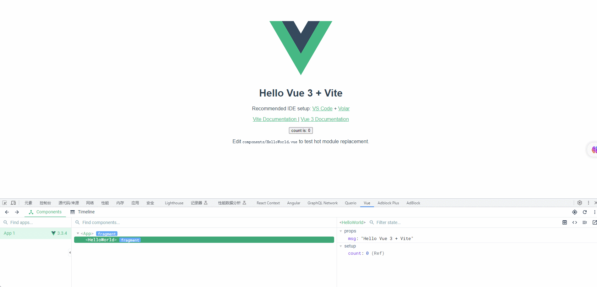
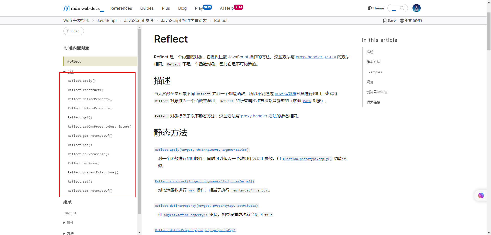

# 第一章：Proxy 类（⭐）

## 1.1 概述

* 目前，在前端开发中，响应式开发是一种流行的开发方式，旨在使`前端应用`能够根据`数据`的变化`自动更新`界面。它使开发者能够以`声明式`的方式`描述`应用的`状态`和`界面`，而不必关心手动操作 DOM 来更新界面。




* 其实，响应式最为`核心`的就是`如何监听对象属性的所有操作`？我们可以通过 `Object.defineProperty` 来对对象的属性操作进行监听：

```html
<!DOCTYPE html>
<html lang="en">
<head>
  <meta charset="UTF-8">
  <meta content="IE=edge" http-equiv="X-UA-Compatible">
  <meta content="width=device-width, initial-scale=1.0" name="viewport">
  <title>Title</title>
</head>
<body>
  <script>
    const obj = {
      name: "张三",
      age: 18,
      height: 1.8
    }

    // 需求：监听对象属性的所有操作
    let _name = obj.name
    Object.defineProperty(obj, "name", {
      set(newValue) {
        console.log(`监听到了给 name 属性设置值`)
        _name = newValue
      },
      get() {
        console.log(`监听到了获取 name 属性的值`)
        return _name
      }
    })

    obj.name = "李四"
    console.log(obj.name)
    obj.age = 20
    console.log(obj.age)
  </script>
</body>
</html>
```

* 但是，`Object.defineProperty` 只能`针对一个属性`，如果`需要监视对象中的所有属性`，就需要使用`数组的遍历`了：

```html
<!DOCTYPE html>
<html lang="en">
<head>
  <meta charset="UTF-8">
  <meta content="IE=edge" http-equiv="X-UA-Compatible">
  <meta content="width=device-width, initial-scale=1.0" name="viewport">
  <title>Title</title>
</head>
<body>
  <script>
    const obj = {
      name: "张三",
      age: 18,
      height: 1.8
    }

    // 需求：监听对象所有属性的所有操作
    Object.keys(obj).forEach((key) => {
      let value = obj[key]
      Object.defineProperty(obj, key, {
        set(newValue) {
          console.log(`监听到了给 ${key} 属性设置值`)
          value = newValue
        },
        get() {
          console.log(`监听到了获取 ${key} 属性的值`)
          return value
        }
      })
    })

    obj.name = "李四"
    console.log(obj.name)
    obj.age = 20
    console.log(obj.age)
    obj.height = 1.7
    console.log(obj.height)
  </script>
</body>
</html>
```

* 其实，上述的方式是有缺点的：
  * ① `Object.defineProperty`的设计初衷是为了提供一种更灵活和精细的方式来`定义`对象的属性，因为在 ES5 之前，我们只能使用`对象字面量`或`Object.prototype`上的方法来定义对象的属性，这些方法的功能有限，并且无法控制属性的特性。
  * ② 如果我们想监听更加丰富的操作，如：新增属性、删除属性等，那么  `Object.defineProperty` 就无能为力了。
* 此时，`Proxy` 类就出现了（根据圣经创世记的描述，神在创造世界的过程中说：`“要有光”`，然后就有了光）。

## 1.2 静态代理

### 1.2.1 概述

* 上面提到了 `Proxy` 类，`Proxy` 在英文中的翻译就是`代理`。
* 生活中的例子：
  * 假设我们想要买一套房子，但我们没有时间和精力去找房子、与房主协商价格、办理房屋过户手续等。这时，我们可以聘请一个`房产中介`作为`代理`来帮助我们完成这些任务。
  * `房产中介`作为`代理`，会与房主协商、寻找适合的房子，并将符合我们要求的房子推荐给我们。他们会帮助我们与房主协商价格，并在我们同意购买后，协助我们办理房屋过户手续。

* 在上面的例子中，`房产中介`就是充当了`静态代理`的角色。他们帮助我们处理与房子相关的事务，代替我们与房主进行沟通和协商。房产中介可以在访问前后进行一些额外的操作，例如：筛选房源、协助谈判、提供法律咨询等。
* 静态代理和房产中介之间的相似之处在于，它们都是通过引入一个代理对象来控制访问原始对象（目标对象）。代理对象可以在访问前后进行一些额外的操作，以提供更好的服务和控制。在房产中介的例子中，代理对象就是房产中介公司，原始对象就是房主和买房者。

### 1.2.2 手动实现静态代理

* 示例：

```html
<!DOCTYPE html>
<html lang="en">
<head>
  <meta charset="UTF-8">
  <meta content="IE=edge" http-equiv="X-UA-Compatible">
  <meta content="width=device-width, initial-scale=1.0" name="viewport">
  <title>Title</title>
</head>
<body>
  <script>
    // 定义一个代理类
    class Proxy {
      constructor(target) {
        this.target = target
      }

      eating() {
        console.log("代理对象的请求方法前")
        this.target.eating()
        console.log("代理对象的请求方法后")
      }
    }

    // 定义一个目标类
    class Person {
      constructor(name) {
        this.name = name
      }

      eating() {
        console.log(`${this.name}正在吃饭...`)
      }
    }

    // 创建一个人
    let person = new Person("张三")
    // 创建一个代理对象
    let proxy = new Proxy(person)
    // 通过代理对象调用方法
    proxy.eating()

  </script>
</body>
</html>
```

## 1.3 Proxy 类

### 1.3.1 概述

* 在 ES6 中，新增了一个 `Proxy` 类（换言之，不需要我们手动去实现代理类）；主要用于监听一个`目标对象`的`所有相关`操作（新增属性、删除属性、修改属性、访问属性等）。
* 语法：

```js
const p = new Proxy(target, handler)
```

* 参数说明：
  * `target`：要使用 `Proxy` 包装的目标对象（可以是任何类型的对象，包括原生数组，函数，甚至另一个代理）。
  * `handler`：一个通常以`函数作为属性`的`对象`，各属性中的函数分别定义了在执行各种操作时代理 `p` 的行为。

> 注意：之后的操作都需要对代理对象（p）进行操作，而不是对目标对象（target）进行操作，否则代理对象将失去作用。


* 示例：

```html
<!DOCTYPE html>
<html lang="en">
<head>
  <meta charset="UTF-8">
  <meta content="IE=edge" http-equiv="X-UA-Compatible">
  <meta content="width=device-width, initial-scale=1.0" name="viewport">
  <title>Title</title>
</head>
<body>
  <script>
    // 原始对象（目标对象）
    const obj = {
      name: "张三",
      age: 18,
      height: 1.8
    }

    // 创建一个代理对象
    const proxy = new Proxy(obj, {
      set(target, key, newValue) {
        console.log('set捕获器')
        target[key] = newValue
      },
      get(target, key) {
        console.log('get捕获器')
        return target[key]
      }
    })

    // 对代理对象做各种操作
    proxy.name = "李四"
    console.log(proxy.name)
    proxy.age = 20
    console.log(proxy.age)
    proxy.height = 1.7
    console.log(proxy.height)

  </script>
</body>
</html>
```

### 1.3.2 Proxy 类的 set 和 get 捕获器

* 如果我们需要监听某些属性对应的具体操作，就需要在 `handler` 对象中添加对应的捕获器（Trap），如：`set` 和 `get` 函数等。

```js
set?(target: T, p: string | symbol, newValue: any, receiver: any): boolean;
```

```js
get?(target: T, p: string | symbol, receiver: any): any;
```

* 参数说明：
  * `target`：目标对象。
  * `p`：`property` 的缩写，将要设置的属性或获取的属性（在对象中属性通常使用 `key` 来表示） 。
  * `newValue`：设置时的新属性值。
  * `receiver`：调用的代理对象。

* 当然，还有 `has` 和 `deleteProperty` 捕获器：其中，`has` 是用来捕获 `in` 操作的，而 `deleteProperty` 是用来捕获 `delete` 操作的。

```js
has?(target: T, p: string | symbol): boolean;
```

```js
deleteProperty?(target: T, p: string | symbol): boolean;
```


* 示例：

```html
<!DOCTYPE html>
<html lang="en">
<head>
  <meta charset="UTF-8">
  <meta content="IE=edge" http-equiv="X-UA-Compatible">
  <meta content="width=device-width, initial-scale=1.0" name="viewport">
  <title>Title</title>
</head>
<body>
  <script>
    // 原始对象（目标对象）
    const obj = {
      name: "张三",
      age: 18,
      height: 1.8
    }

    // 创建一个代理对象
    const proxy = new Proxy(obj, {
      set(target, key, newValue) {
        console.log('set捕获器')
        target[key] = newValue
      },
      get(target, key) {
        console.log('get捕获器')
        return target[key]
      },
      has(target, key) {
        console.log('has捕获器')
        return key in target
      },
      deleteProperty(target, key) {
        console.log('deleteProperty捕获器')
        delete target[key]
      }
    })

    // 对代理对象做各种操作：新增属性、访问属性、删除属性、修改属性
    proxy.address = "北京" // 新增属性
    proxy.name = "李四" // 修改属性
    delete proxy.name // 删除属性
    console.log(proxy.age) // 访问属性
    console.log('height' in proxy) // in 操作

  </script>
</body>
</html>
```

### 1.3.3 Proxy 的其它捕获器

* Proxy 类的 `handler` 对象其实有很多捕获器，如下所示：

```js
interface ProxyHandler<T extends object> {
    /**
     * 函数调用操作的捕捉器
     */
    apply?(target: T, thisArg: any, argArray: any[]): any;

    /**
     * new 操作符的捕捉器
     */
    construct?(target: T, argArray: any[], newTarget: Function): object;

    /**
     * Object.defineProperty 方法的捕捉器
     */
    defineProperty?(target: T, property: string | symbol, attributes: PropertyDescriptor): boolean;

    /**
     * delete 操作符的捕捉器
     */
    deleteProperty?(target: T, p: string | symbol): boolean;

    /**
     * 属性读取操作的捕捉器
     */
    get?(target: T, p: string | symbol, receiver: any): any;

    /**
     * Object.getOwnPropertyDescriptor 方法的捕捉器
     */
    getOwnPropertyDescriptor?(target: T, p: string | symbol): PropertyDescriptor | undefined;

    /**
     * Object.getPrototypeOf 方法的捕捉器
     */
    getPrototypeOf?(target: T): object | null;

    /**
     * in 操作符的捕捉器
     */
    has?(target: T, p: string | symbol): boolean;

    /**
     * Object.isExtensible 方法的捕捉器(判断是否可以新增属性)
     */
    isExtensible?(target: T): boolean;

    /**
     * Object.getOwnPropertyNames 方法和 Object.getOwnPropertySymbols 方法的捕捉器
     */
    ownKeys?(target: T): ArrayLike<string | symbol>;

    /**
     * Object.preventExtensions 方法的捕捉器
     */
    preventExtensions?(target: T): boolean;

    /**
     * 属性设置操作的捕捉器
     */
    set?(target: T, p: string | symbol, newValue: any, receiver: any): boolean;

    /**
     * Object.setPrototypeOf 方法的捕捉器
     */
    setPrototypeOf?(target: T, v: object | null): boolean;
}
```


* 示例：

```html
<!DOCTYPE html>
<html lang="en">
<head>
  <meta charset="UTF-8">
  <meta content="IE=edge" http-equiv="X-UA-Compatible">
  <meta content="width=device-width, initial-scale=1.0" name="viewport">
  <title>Title</title>
</head>
<body>
  <script>
    // 原始对象（目标对象）
    function foo() {
      console.log('foo函数被调用了', this, arguments)
    }

    // 创建一个代理对象
    const proxy = new Proxy(foo, {
      apply(target, thisArg, argArray) {
        console.log('apply函数被调用了')
        return target.apply(thisArg, argArray)
      },
      construct(target, argArray, newTarget) {
        console.log('construct函数被调用了')
        return new target(...argArray)
      }
    })

    // 对代理对象做各种操作
    proxy.apply({}, ["a"])
    const f = new proxy()

  </script>
</body>
</html>
```


# 第二章：Reflect（⭐）

## 2.1 概述

* `Reflect` 对象是 ES6 新增的一个 API ，是一个对象，类似于 Math 对象，中文翻译是`反射`。
* `Reflect` 对象提供了很多操作 JavaScript 对象的方法：



## 2.2 为什么会出现 Reflect 对象？

* 在早期的 JavaScript 中，对象操作的方法分散在不同的地方，例如： Object 对象的方法、Function 对象的方法、以及一些全局函数等。这导致了代码的可读性和可维护性的问题。
* Reflect 对象的引入解决了这个问题，它提供了一组与对象操作相关的方法，并将这些方法统一放在一个对象中。这样一来，我们就可以通过 Reflect 对象来访问和操作对象，而不需要记住和使用多个不同的方法。
* Reflect 对象的设计目标之一是提供一种默认行为，这意味着它的方法会尽可能地模拟对象操作的默认行为。例如，Reflect.get 方法会返回一个属性的值，如果属性不存在，则返回 undefined。这样可以确保代码的行为与直接访问对象属性时的行为保持一致。
* 另外，Reflect 对象的方法都是函数式的，它们接收一个目标对象和一些参数，并返回一个结果。这种设计使得 Reflect 方法更加灵活和可组合，我们可以将它们与其他函数结合使用，实现更复杂的功能。

> 总结：Reflect 对象的出现是为了提供一种统一的、更灵活的方式来访问和操作对象，解决了早期 JavaScript 中对象操作分散和不一致的问题，提高了代码的可读性和可维护性。

## 2.3 Reflect 对象的使用

* 示例：对象属性和读取和设置

```html
<!DOCTYPE html>
<html lang="en">
<head>
  <meta charset="UTF-8">
  <meta content="IE=edge" http-equiv="X-UA-Compatible">
  <meta content="width=device-width, initial-scale=1.0" name="viewport">
  <title>Title</title>
</head>
<body>
  <script>
    /* 对象属性的读取和设置 */
    const obj = {
      name: "张三",
      age: 18,
      sex: "男"
    }

    // 使用 Reflect 对象获取属性
    const age = Reflect.get(obj, "age")
    console.log(age) // 18
    // 使用 Reflect 对象设置属性
    Reflect.set(obj, "age", 20)
    console.log(obj.age) // 20
  </script>
</body>
</html>
```


* 示例：判断属性是否存在

```html
<!DOCTYPE html>
<html lang="en">
<head>
  <meta charset="UTF-8">
  <meta content="IE=edge" http-equiv="X-UA-Compatible">
  <meta content="width=device-width, initial-scale=1.0" name="viewport">
  <title>Title</title>
</head>
<body>
  <script>
    /* 判断属性是否存在 */
    const obj = {
      name: "张三",
      age: 18,
      sex: "男"
    }

    // 使用 Reflect 对象判断属性是否存在
    const hasAge = Reflect.has(obj, 'age')
    console.log(hasAge) // true
    const hasAddress = Reflect.has(obj, 'address')
    console.log(hasAddress) // false
  </script>
</body>
</html>
```


* 示例：创建对象

```html
<!DOCTYPE html>
<html lang="en">
<head>
  <meta charset="UTF-8">
  <meta content="IE=edge" http-equiv="X-UA-Compatible">
  <meta content="width=device-width, initial-scale=1.0" name="viewport">
  <title>Title</title>
</head>
<body>
  <script>
    /* 使用 Reflect 创建对象实例 */
    const newObj = Reflect.construct(Object, []);
    console.log(newObj); // {}

    // 使用 Reflect 创建带参数的对象实例
    class Person {
      constructor(name, age) {
        this.name = name;
        this.age = age;
      }
    }

    const person = Reflect.construct(
        Person,
        ['Bob', 30]
    );
    console.log(person); //  { name: 'Bob', age: 30 }
  </script>
</body>
</html>
```


* 示例：函数调用

```html
<!DOCTYPE html>
<html lang="en">
<head>
  <meta charset="UTF-8">
  <meta content="IE=edge" http-equiv="X-UA-Compatible">
  <meta content="width=device-width, initial-scale=1.0" name="viewport">
  <title>Title</title>
</head>
<body>
  <script>
    /* 函数调用 */
    function foo(...args) {
      console.log(args)
    }

    Reflect.apply(foo, null, [1, 2, 3])
  </script>
</body>
</html>
```

## 2.4 Proxy 和 Reflect 共同完成代理

* 之前，我们使用 Proxy 来完成代理的代码如下：

```html
<!DOCTYPE html>
<html lang="en">
<head>
  <meta charset="UTF-8">
  <meta content="IE=edge" http-equiv="X-UA-Compatible">
  <meta content="width=device-width, initial-scale=1.0" name="viewport">
  <title>Title</title>
</head>
<body>
  <script>
    // 原始对象（目标对象）
    const obj = {
      name: "张三",
      age: 18,
      height: 1.8
    }

    // 创建一个代理对象
    const proxy = new Proxy(obj, {
      set(target, key, newValue) {
        console.log('set捕获器')
        target[key] = newValue
      },
      get(target, key) {
        console.log('get捕获器')
        return target[key]
      },
      has(target, key) {
        console.log('has捕获器')
        return key in target
      },
      deleteProperty(target, key) {
        console.log('deleteProperty捕获器')
        delete target[key]
      }
    })

    // 对代理对象做各种操作：新增属性、访问属性、删除属性、修改属性
    proxy.address = "北京" // 新增属性
    proxy.name = "李四" // 修改属性
    delete proxy.name // 删除属性
    console.log(proxy.age) // 访问属性
    console.log('height' in proxy) // in 操作

  </script>
</body>
</html>
```

* 我们会在 handler 函数中的 set 或 get 等捕获器中直接操作目标对象，不够优雅；此时，就可以借助 Reflect 对象来实现：

```html
<!DOCTYPE html>
<html lang="en">
<head>
  <meta charset="UTF-8">
  <meta content="IE=edge" http-equiv="X-UA-Compatible">
  <meta content="width=device-width, initial-scale=1.0" name="viewport">
  <title>Title</title>
</head>
<body>
  <script>
    /* Proxy 和 Reflect 共同完成代理 */
    const obj = {
      name: "张三",
      age: 18
    }

    const proxy = new Proxy(obj, {
      set(target, p, newValue, receiver) {
        // 优点：① 不需要直接操作目标对象 ② Reflect.set 返回一个 boolean 值，用来判断本次操作是否成功
        const isSuccess = Reflect.set(target, p, newValue, receiver)
        if (!isSuccess) {
          throw new Error(`设置 ${key} 失败`)
        }
      },
      get(target, p, receiver) {
        return Reflect.get(target, p, receiver)
      }
    })

    proxy.name = "李四"
    console.log(proxy.name)

  </script>
</body>
</html>
```

