# 第一章：准备

## 1.1 回调函数

### 1.1.1 概述

* 如果将函数 A 作为参数传递给函数 B 时，我们就称函数 A 为 `回调函数` 。换言之，如果一个函数定义了，我们没有调用，但是最终却执行了，那么这个函数就可以称为回调函数。 

-  回调函数常用于 JavaScript 中的事件、定时器、数组等。 


* 示例：

```js
<!DOCTYPE html>
<html lang="en">
<head>
    <meta charset="UTF-8">
    <meta content="IE=edge" http-equiv="X-UA-Compatible">
    <meta content="width=device-width, initial-scale=1.0" name="viewport">
    <title>Title</title>
</head>
<body>

    <button id="btn">点我</button>

    <script>
        // 如果将函数 A 作为参数传递给函数 B 时，我们就称函数 A 为 `回调函数` 。换言之，如果一个函数定义了，我们没有调用，但是最终却执行了，那么这个函数就可以称为回调函数。
        let btn = document.querySelector('#btn');
        btn.addEventListener('click', function () {
            // 回调函数
            console.log('大胆，谁让你点我的~');
        });
    </script>
</body>
</html>
```


* 示例：

```html
<!DOCTYPE html>
<html lang="en">
<head>
    <meta charset="UTF-8">
    <meta content="IE=edge" http-equiv="X-UA-Compatible">
    <meta content="width=device-width, initial-scale=1.0" name="viewport">
    <title>Title</title>
</head>
<body>

    <button id="btn">点我</button>

    <script>
        // 如果将函数 A 作为参数传递给函数 B 时，我们就称函数 A 为 `回调函数` 。换言之，如果一个函数定义了，我们没有调用，但是最终却执行了，那么这个函数就可以称为回调函数。
        let btn = document.querySelector('#btn');
        // 这边很多人会有疑惑，为什么直接写 fn ，而不是 fn() ？
        // 如果写 fn() ，那么就会立即执行函数，其次，addEventListener 函数的定义就像下面的伪代码：
        // function addEventListener(event,callback){
        //          callback();
        // }
        btn.addEventListener('click', fn);

        function fn() {
            // 回调函数
            console.log('大胆，谁让你点我的~');
        }
    </script>
</body>
</html>
```

### 1.1.2 同步的回调函数

* 同步的回调函数，会立即在主线程上执行，不会放入到回调队列中。 

- 例子：数组遍历相关的回调函数、Promise 的 executor 函数。 


* 示例：

```html
<!DOCTYPE html>
<html lang="en">
<head>
    <meta charset="UTF-8">
    <meta content="IE=edge" http-equiv="X-UA-Compatible">
    <meta content="width=device-width, initial-scale=1.0" name="viewport">
    <title>Title</title>
</head>
<body>
    <script>
        let arr = [1, 3, 5, 7, 9];
        arr.forEach(value => {
            // 同步回调函数
            console.log(value);
        });

        console.log('主线程的代码');
    </script>
</body>
</html>
```

### 1.1.3 异步的回调函数

- 异步的回调函数，不会立即执行，会放入回调队列中再执行。 

- 例子：定时器回调、ajax 回调、Promise 成功或失败的回调。 


* 示例：

```html
<!DOCTYPE html>
<html lang="en">
<head>
    <meta charset="UTF-8">
    <meta content="IE=edge" http-equiv="X-UA-Compatible">
    <meta content="width=device-width, initial-scale=1.0" name="viewport">
    <title>Title</title>
</head>
<body>
    <script>
        setTimeout(() => {
            // 异步回调函数
            console.log('定时器执行了');
        }, 0);

        console.log('主线程的代码');
    </script>
</body>
</html>
```

## 1.2 使用 APIPost 的 Mock 生成接口

* ① 打开 Apipost 7+ 的版本：

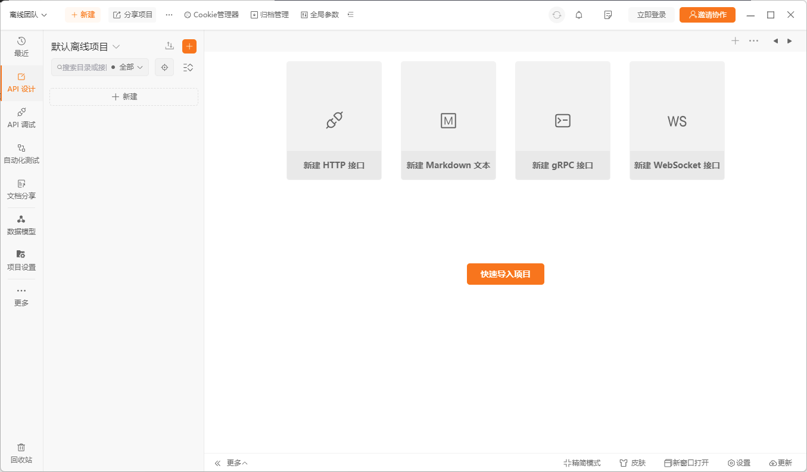

> 注意：
>
> * ①  Apipost 7+ 是国产的测试网络接口的工具，和 Postman 差不多。
> * ② 关闭 VPN ，防止因为网络原因而造成 Mock 接口测试失败。

* ② 新建几个测试接口，尽量是 GET 接口。

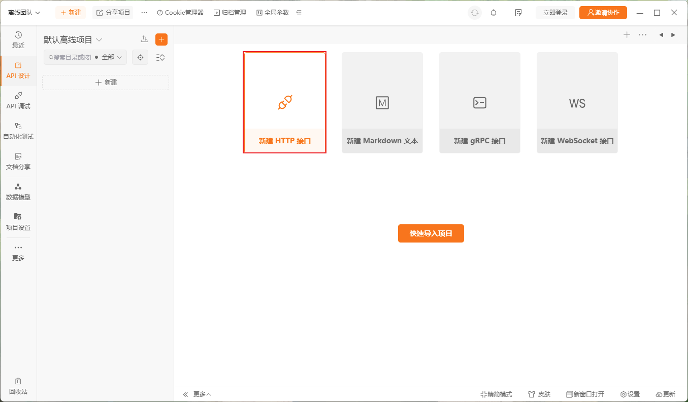

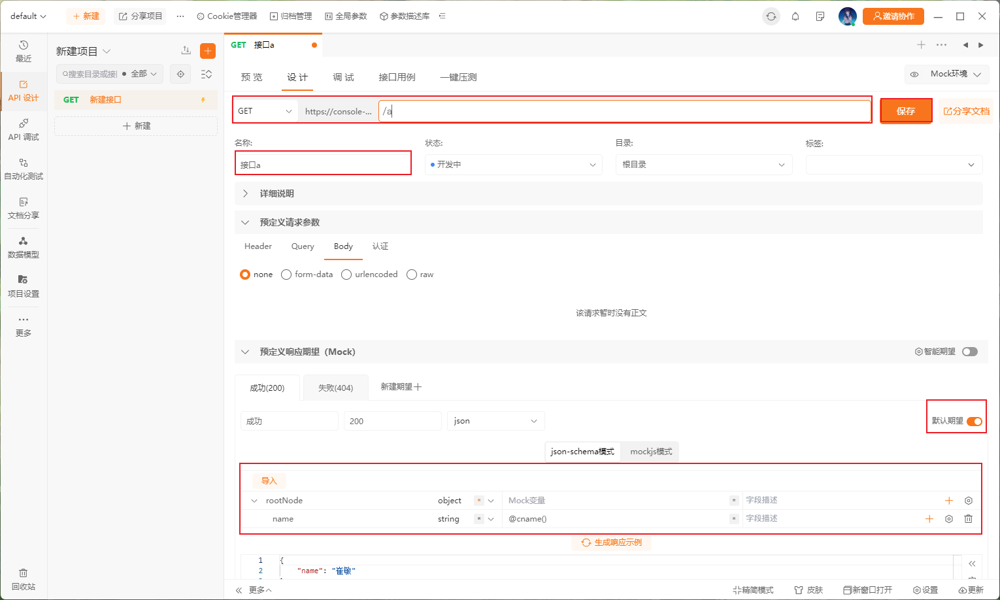

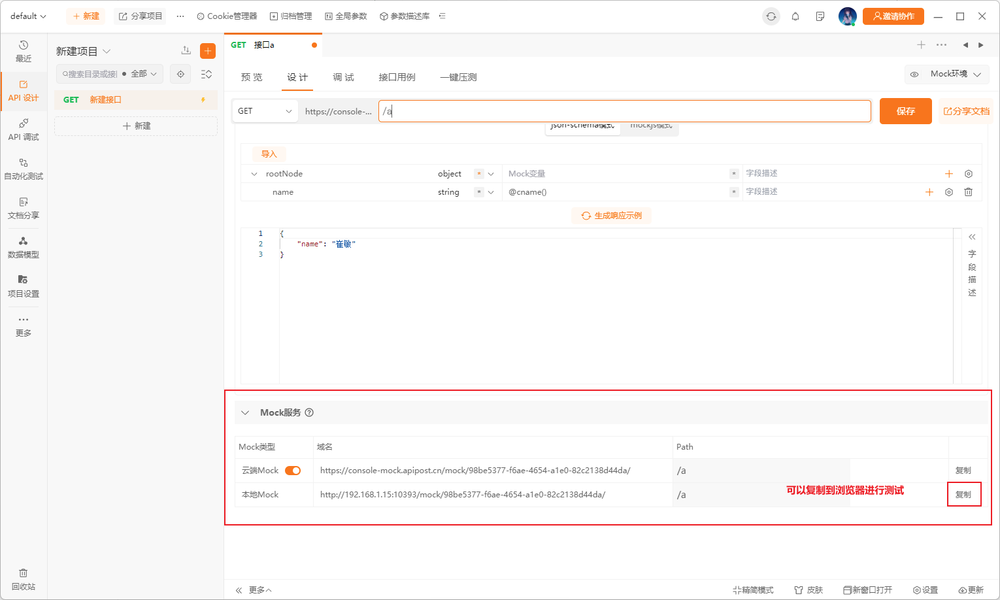

* ③ 按照上述步骤，多建几个 GET 接口：

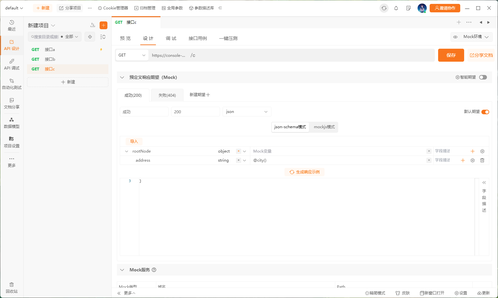


# 第二章：异步代码的问题

## 2.1 概述

* 在早期，我们通常会使用高阶函数和回调函数来封装 Ajax （异步）请求库，如下：

```html
<!DOCTYPE html>
<html lang="en">
<head>
  <meta charset="UTF-8">
  <meta content="IE=edge" http-equiv="X-UA-Compatible">
  <meta content="width=device-width, initial-scale=1.0" name="viewport">
  <title>Title</title>
</head>
<body>
  <script>
    /**
     * Ajax 请求库，通过封装成一个 js 文件，让其他人引用
     * @param type 请求类型：GET 或 POST 等
     * @param url 请求 URL 地址
     * @param data 请求的数据，以 JSON 格式
     * @param callback 回调
     */
    function ajax(type, url, data, callback) {
      // ① 判断 type 的类型，是 GET 或 POST 等
      console.log(`判断请求 ${type} 的类型`)
      // ② 根据 url 和 data 发送请求，可能会很长
      console.log(`根据 url 和 data 发送请求，使用 setTimeout 模拟延迟`)
      // 模拟延迟
      setTimeout(function () {
        // 从服务器获取的数据
        var result = ["Java", "JavaScript", "C"]
        // ③ 调用回调函数，并将数据通过回调函数传递
        callback(result)
      }, 3000)
    }

    // 调用 Ajax 请求
    ajax("GET", "https://www.baidu.com", null, function (result) {
      console.log(result)
    })
  </script>
</body>
</html>
```

* 其实，社区也有类似的解决方法 -- JQuery（其内部就是通过上述的原理封装了 Ajax 的请求库）。

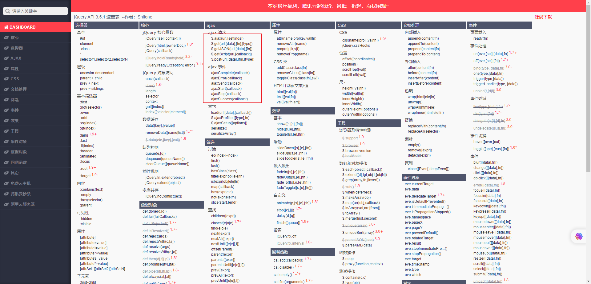

## 2.2 使用 JQuery 来发送网络请求

* 需求：通过 JQuery 提供的 Ajax 请求库来分别调用 APIPost 生成的 Mock 接口，要求当 a 接口成功之后，再依次调用 b 和 c 接口。

> 注意：每个人 Mock 生成的接口地址是不一样的。


* 示例：

```html
<!DOCTYPE html>
<html lang="en">
<head>
  <meta charset="UTF-8">
  <meta content="IE=edge" http-equiv="X-UA-Compatible">
  <meta content="width=device-width, initial-scale=1.0" name="viewport">
  <title>Title</title>
</head>
<body>

  <button class="btn">按钮</button>

  <script src="https://cdn.bootcdn.net/ajax/libs/jquery/3.6.4/jquery.js"></script>
  <script>
    let btn = document.querySelector(".btn")


    let aUrl = "http://192.168.1.15:10393/mock/98be5377-f6ae-4654-a1e0-82c2138d44da/a"
    let bUrl = "http://192.168.1.15:10393/mock/98be5377-f6ae-4654-a1e0-82c2138d44da/b"
    let cUrl = "http://192.168.1.15:10393/mock/98be5377-f6ae-4654-a1e0-82c2138d44da/c"

    btn.addEventListener('click', function () {
      // 调用 a 接口
      $.ajax({
        url: aUrl,
        success: function (data) {
          console.log(`a 接口返回的数据：${data}`)

          $.ajax({
            url: bUrl,
            success: function (data) {
              console.log(`b 接口返回的数据：${data}`)

              $.ajax({
                url: cUrl,
                success: function (data) {
                  console.log(`c 接口返回的数据：${data}`)
                },
                error: function (err) {
                  console.log("c 接口请求错误")
                }
              })

            },
            error: function (err) {
              console.log("b 接口请求错误")
            }
          })

        },
        error: function (err) {
          console.log("a 接口请求错误")
        }
      })
    })

  </script>
</body>
</html>
```

## 2.3 回调地狱

* 回调地狱是指在 JavaScript 中使用回调函数进行异步操作时，由于多个异步操作的嵌套使用导致代码变得混乱、难以理解和维护的情况。

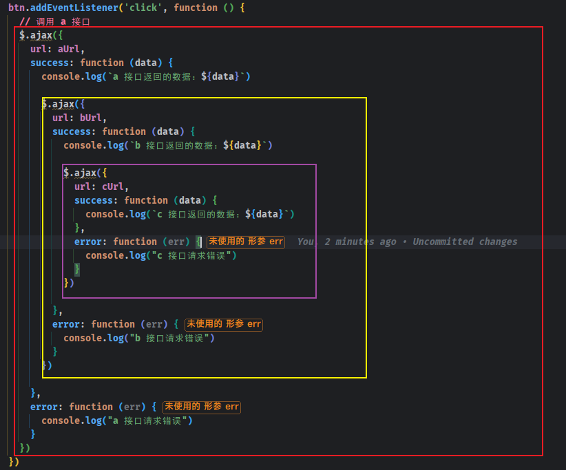

* 那么，如何解决回调地狱问题？其实最为关键的就是将`异步操作的嵌套方法`改为`同步的链式调用`，这也是 `Promise` 之所以出现的原因。


# 第三章：Promise（⭐）

## 3.1 概述

* `Promise` 是一个`类`（构造函数），英文翻译`承诺`、`许诺`。`Promise` 是 ES6+ 中引入的，用于解决`回调地狱`和`异步操作`的方案。
* `Promise` 通过提供一种`结构化`的方式来处理这些问题。它可以被看作是一个承诺，代表着一个异步操作的最终结果（可以是成功的值或失败的原因）。


* 示例：

```html
<!DOCTYPE html>
<html lang="en">
<head>
  <meta charset="UTF-8">
  <meta content="IE=edge" http-equiv="X-UA-Compatible">
  <meta content="width=device-width, initial-scale=1.0" name="viewport">
  <title>Title</title>
</head>
<body>
  <script>
    // 创建 Promise 对象
    const promise = new Promise((resolve, reject) => {
      setTimeout(() => {
        resolve(1);
      }, 1000);
    })
    
    promise.then(res => { // then 方法用来处理成功的回调
      console.log(res);
    }).catch(err => { // catch 方法用来处理失败的回调
      console.log(err) 
    })

  </script>
</body>
</html>
```

## 3.2 Promise 的基本使用

### 3.2.1 构造函数和实例方法

* Promise 的构造函数：

```js
new Promise(executor)
```

* Promise 的实例方法：

```js
Promise.prototype.then()
```

* Promise 的实例方法：

```js
Promise.prototype.catch()
```


* 示例：

```html
<!DOCTYPE html>
<html lang="en">
<head>
  <meta charset="UTF-8">
  <meta content="IE=edge" http-equiv="X-UA-Compatible">
  <meta content="width=device-width, initial-scale=1.0" name="viewport">
  <title>Title</title>
</head>
<body>
  <script>
    // 创建 Promise 对象
    const promise = new Promise((resolve, reject) => {
      setTimeout(() => {
        resolve(1);
      }, 1000);
    })

    promise.then(res => { // then 方法用来处理成功的回调
      console.log(res);
    }).catch(err => { // catch 方法用来处理失败的回调
      console.log(err)
    })

  </script>
</body>
</html>
```

### 3.2.2 executor 函数

* 图示：

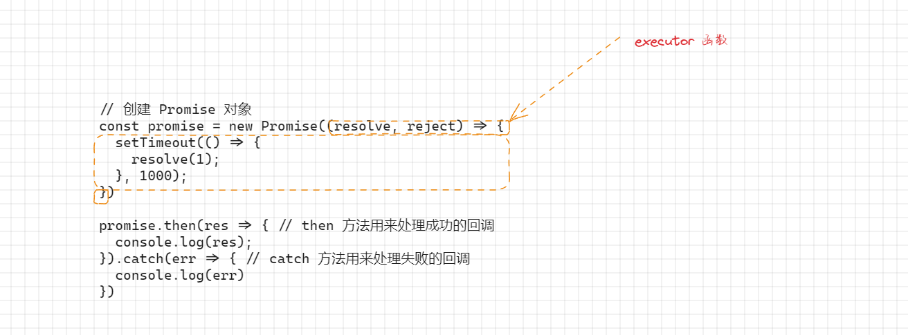

* `executor` 函数是在创建 Promise 对象的时候需要传入的回调函数，`该回调函数会立即被执行`，并且传入了`两个`参数。

```html
<!DOCTYPE html>
<html lang="en">
<head>
  <meta charset="UTF-8">
  <meta content="IE=edge" http-equiv="X-UA-Compatible">
  <meta content="width=device-width, initial-scale=1.0" name="viewport">
  <title>Title</title>
</head>
<body>
  <script>
    // 创建 Promise 对象 ,
    const promise = new Promise((resolve, reject) => { // executor 函数
    })


  </script>
</body>
</html>
```

* 如何证明 `executor` 函数会立即执行：

```html
<!DOCTYPE html>
<html lang="en">
<head>
  <meta charset="UTF-8">
  <meta content="IE=edge" http-equiv="X-UA-Compatible">
  <meta content="width=device-width, initial-scale=1.0" name="viewport">
  <title>Title</title>
</head>
<body>
  <script>
    // 创建 Promise 对象
    const promise = new Promise((resolve, reject) => {
      console.log("1111")
      console.log("2222")
      console.log("3333")

      setTimeout(() => {
        resolve(3);
      }, 3000);
    })

    console.log("主线程")

    promise.then(res => { // then 方法用来处理成功的回调
      console.log(res);
    }).catch(err => { // catch 方法用来处理失败的回调
      console.log(err)
    })

  </script>
</body>
</html>
```

* 通过浏览器的 devtools 来证明：

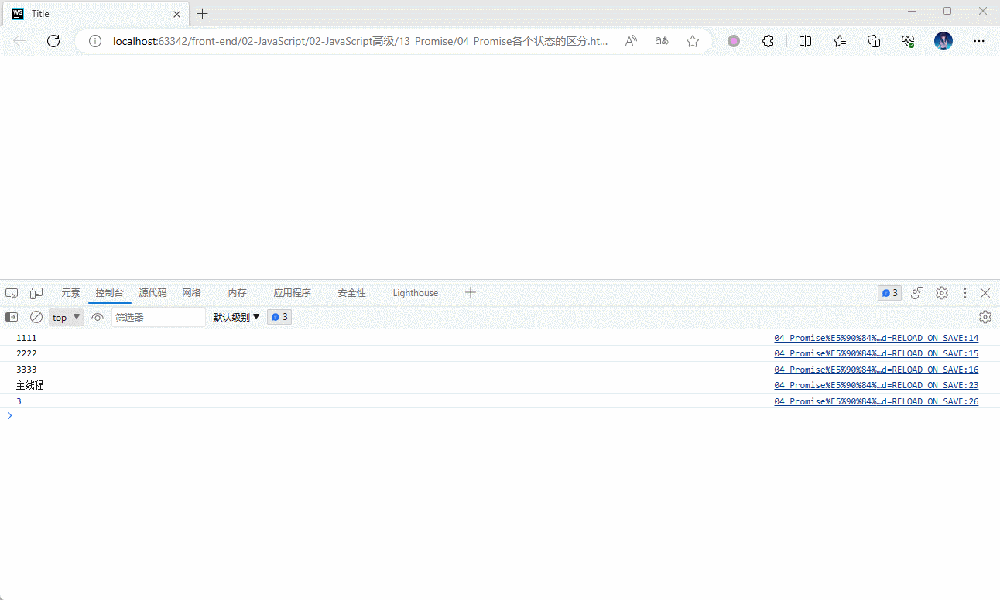

### 3.2.3 基本的编码流程

* 基本的编码流程：

  * 创建 Promise 的实例对象（pending状态），传入 executor 函数。
  * 在 executor 中启动异步任务（定时器、Ajax 请求）。
  * 根据异步任务的结果，做不同的结果： 
    * 如果异步任务成功了，就调用 resolve(res) ，将 Promise 实例的状态变为成功（fulfilled），同时指定成功的 res。
    * 如果异步任务失败了，就调用 reject(error)，将 Promise 实例的状态变为失败（rejected），同时指定失败的 error。


  * 通过 then 方法为 Promise 实例指定成功、失败的回调函数，来获取成功的 res 和失败的 error。


* 示例：

```html
<!DOCTYPE html>
<html lang="en">
<head>
  <meta charset="UTF-8">
  <meta content="IE=edge" http-equiv="X-UA-Compatible">
  <meta content="width=device-width, initial-scale=1.0" name="viewport">
  <title>Title</title>
</head>
<body>
  <script>
    function execCode(counter) {
      return new Promise((resolve, reject) => {
        // 异步任务
        setTimeout(() => {
          if (counter < 0) {
            // 失败的回调
            reject(`${counter} 不合法`)
          } else {
            let total = 0
            for (let i = 0; i <= counter; i++) {
              total += i
            }
            // 成功的回调
            resolve(total)
          }
        }, 3000)
      })
    }

    const promise1 = execCode(100)
    promise1.then((res) => {
      console.log(`成功的结果：${res}`)
    }).catch((err) => {
      console.log(`失败的结果：${err}`)
    })

    const promise2 = execCode(-100)
    promise2.then((res) => {
      console.log(`成功的结果：${res}`)
    }).catch((err) => {
      console.log(`失败的结果：${err}`)
    })


  </script>
</body>
</html>
```

### 3.2.4 Promise 的状态

* 一个 Promise 对象有且仅有以下三种状态：
  * 待定（pending）：初始状态，既没有被兑现，也没有被拒绝；换言之，当执行 executor 中的代码时，处于该状态。
  * 已兑现（fulfilled）：意味着操作成功完成；换言之，执行了 resolve 时，处于该状态，Promise 已经被兑现。
  * 已拒绝（rejected）：意味着操作失败；换言之，执行了 reject 时，处于该状态，Promise 已经被拒绝。


> 注意：
>
> * Promise 实例的状态一旦被确定下来，就不会再被更改，也不能再执行某一个回调函数（resolve 或 reject ）来再次改变状态；换言之，Promise 实例的状态将被锁死，即使在 executor 函数中，再去调用 resolve 或 reject 回调函数，也不会有任何响应（无法改变 Promise 实例的状态）。
> * 如果一个 Promise 已经被兑现或拒绝，即不再处于待定状态，那么则称之为`已敲定（settled）`。
> * 一个 Promise 实例指定了多个成功/失败的回调函数，都会被调用。


* 示例：

```html
<!DOCTYPE html>
<html lang="en">
<head>
  <meta charset="UTF-8">
  <meta content="IE=edge" http-equiv="X-UA-Compatible">
  <meta content="width=device-width, initial-scale=1.0" name="viewport">
  <title>Promise的基本使用</title>
</head>
<body>
  <script>
    /*
    * 1. 重要语法
    *   ① new Promise(executor)构造函数
    *   ② Promise.prototype.then 方法
    * 2. 基本编码流程
    *   ① 创建 Promise 的实例对象（pending状态），传入 executor 函数。
    *   ② 在 executor 中启动异步任务（定时器、Ajax 请求）。
    *   ③ 根据异步任务的结果，做不同的结果：
    *      1）如果异步任务成功了，就调用 resolve(value) ，将 Promise 实例的状态变为成功（fulfilled），同时指定成功的 value 。
    *      2）如果异步任务失败了，就调用 reject(reason)，将 Promise 实例的状态变为失败（rejected），同时指定失败的 reason 。
    *   ④ 通过 then 方法为 Promise 实例指定成功、失败的回调函数，来获取成功的 value 和失败的 reason 。
    *      注意：then 方法里面指定的成功和失败的回调函数，都是异步的回调函数。
    * 3. 关于状态的注意点
    *   ① 三个状态：
    *       pending：未确定的 --- 初始化状态
    *       fulfilled：成功的 --- 调用 resolve() 后的状态
    *       rejected：失败的 --- 调用 reject() 后的状态
    *   ② 两种状态改变：
    *       pending --> fulfilled
    *       pending --> rejected
    *   ③ 状态只能修改一次！！
    *   ④ 一个 Promise 实例指定了多个成功/失败的回调函数，都会调用。
    */
    // 创建一个 Promise 实例对象
    const promise = new Promise((resolve, reject) => {
      // 启动异步任务
      setTimeout(() => {
        let flag = true;
        let data = '用户数据';
        if (flag) {
          // 异步任务成功，就调用 resolve(value)
          resolve(data);
        } else {
          // 异步任务失败，就调用 reject(reason)
          reject(data);
        }
      }, 1000);
    });

    promise.then(value => {
      // 成功的回调--异步
      console.log('成功的回调1', value);
    }, reason => {
      // 失败的回调--异步
      console.error('失败的回调1', reason);
    });

    promise.then(value => {
      // 成功的回调--异步
      console.log('成功的回调2', value);
    }, reason => {
      // 失败的回调--异步
      console.error('失败的回调2', reason);
    });

  </script>
</body>
</html>
```

## 3.3 resolve 不同值的区别（了解）

* 情况一：如果 `resolve` 中传入的是一个`普通值（字符串、数组、数值）`或`对象`以及 `null` 和 `undefined`，则这个值会作为 `then` 回调的`参数`。

> 注意：一般而言，null 和 undefined ，在实际开发中，是需要规避的。

* 情况二：如果 `resolve` 中传入的是另外一个 `Promise 对象`，那么这个`新 Promise 对象`会决定`原 Promise 对象`的状态。
* 情况三：如果 `resolve` 中传入的是一个`对象`，并且这个对象有实现 `then` 方法，那么会执行该 `then` 方法，并且根据 `then` 方法的结果来决定 `Promise` 的状态，此对象称为 `thenable` 对象。


* 示例：情况一

```html
<!DOCTYPE html>
<html lang="en">
<head>
  <meta charset="UTF-8">
  <meta content="IE=edge" http-equiv="X-UA-Compatible">
  <meta content="width=device-width, initial-scale=1.0" name="viewport">
  <title>Title</title>
</head>
<body>
  <script>
    const promise = new Promise((resolve, reject) => {
      resolve(1)
    })

    promise.then(res => {
      console.log(res) // 1
    }).catch(err => {
      console.log(err)
    })

  </script>
</body>
</html>
```


* 示例：情况二

```html
<!DOCTYPE html>
<html lang="en">
<head>
  <meta charset="UTF-8">
  <meta content="IE=edge" http-equiv="X-UA-Compatible">
  <meta content="width=device-width, initial-scale=1.0" name="viewport">
  <title>Title</title>
</head>
<body>
  <script>
    const promise = new Promise((resolve, reject) => {
      resolve(new Promise((resolve, reject) => {
        resolve(1)
      }))
    })

    promise.then(res => {
      console.log('then', res) // then 1
    }).catch(err => {
      console.log('catch', err) 
    })

  </script>
</body>
</html>
```


* 示例：情况二

```html
<!DOCTYPE html>
<html lang="en">
<head>
  <meta charset="UTF-8">
  <meta content="IE=edge" http-equiv="X-UA-Compatible">
  <meta content="width=device-width, initial-scale=1.0" name="viewport">
  <title>Title</title>
</head>
<body>
  <script>
    const promise = new Promise((resolve, reject) => {
      resolve(new Promise((resolve, reject) => {
        reject(1)
      }))
    })

    promise.then(res => {
      console.log('then', res)
    }).catch(err => {
      console.log('catch', err) // catch 1
    })

  </script>
</body>
</html>
```


* 示例：情况三

```html
<!DOCTYPE html>
<html lang="en">
<head>
  <meta charset="UTF-8">
  <meta content="IE=edge" http-equiv="X-UA-Compatible">
  <meta content="width=device-width, initial-scale=1.0" name="viewport">
  <title>Title</title>
</head>
<body>
  <script>
    const promise = new Promise((resolve, reject) => {
      resolve({
        name: "张三",
        then(resolve, reject) {
          resolve(1)
        }
      })
    })

    promise.then(res => {
      console.log('then', res) // then 1
    }).catch(err => {
      console.log('catch', err)
    })

  </script>
</body>
</html>
```


* 示例：情况三

```html
<!DOCTYPE html>
<html lang="en">
<head>
  <meta charset="UTF-8">
  <meta content="IE=edge" http-equiv="X-UA-Compatible">
  <meta content="width=device-width, initial-scale=1.0" name="viewport">
  <title>Title</title>
</head>
<body>
  <script>
    const promise = new Promise((resolve, reject) => {
      resolve({
        name: "张三",
        then(resolve, reject) {
          reject(1)
        }
      })
    })

    promise.then(res => {
      console.log('then', res) 
    }).catch(err => {
      console.log('catch', err) // catch 1
    })

  </script>
</body>
</html>
```

## 3.4 Promise 实例的 then 方法（了解）

### 3.4.1 Promise 实例的 then 方法参数

* Promise 实例的 then 方法参数语法：

```js
then(onFulfilled)
```

```js
then(onFulfilled, onRejected)
```

* `Promise`实例的 `then()`方法最多接受两个参数：用于 `Promise` 对象`兑现`和`拒绝`情况的回调函数。
* 它立即返回一个等效的 `Promise`对象，允许你链接到其他 Promise 方法，从而实现 `链式调用`。


* 示例：

```html
<!DOCTYPE html>
<html lang="en">
<head>
  <meta charset="UTF-8">
  <meta content="IE=edge" http-equiv="X-UA-Compatible">
  <meta content="width=device-width, initial-scale=1.0" name="viewport">
  <title>Title</title>
</head>
<body>
  <script>
    const promise = new Promise((resolve, reject) => {
      reject(1)
    })

    promise.then(res => {
      console.log('then成功的回调', res)
    }, err => {
      console.log('then失败的回调', err)
    })
  </script>
</body>
</html>
```

### 3.4.2 Promise 实例的 then 方法多次调用

* 如果在同一 Promise 对象上两次调用 `then()` 方法（而不是链式调用），则该 Promise 对象将具有两对处理方法。
* 附加到同一 Promise 对象的所有处理方法总是按照它们添加的顺序调用。
* 此外，每次调用 `then()` 方法返回的两个 Promise 对象开始了独立的链，不会等待彼此的`敲定（settled）`。


* 示例：

```html
<!DOCTYPE html>
<html lang="en">
<head>
  <meta charset="UTF-8">
  <meta content="IE=edge" http-equiv="X-UA-Compatible">
  <meta content="width=device-width, initial-scale=1.0" name="viewport">
  <title>Title</title>
</head>
<body>
  <script>
    const promise = new Promise((resolve, reject) => {
      resolve(1)
    })


    promise.then(res => {
      console.log('then成功的回调', res) // then成功的回调 1
    }, err => {
      console.log('then失败的回调', err)
    })

    promise.then(res => {
      console.log('then成功的回调', res) // then成功的回调 1
    }, err => {
      console.log('then失败的回调', err) 
    })
  </script>
</body>
</html>
```

### 3.4.3 Promise 实例的 then 方法的返回值

* 先看一下 then 方法的 TS 定义：

```ts
then<TResult1 = T, TResult2 = never>(onfulfilled?: ((value: T) => TResult1 | PromiseLike<TResult1>) | undefined | null, onrejected?: ((reason: any) => TResult2 | PromiseLike<TResult2>) | undefined | null): Promise<TResult1 | TResult2>;
```

* 那么，我们知道，Promise 实例的 then 方法是有返回值的，返回的是一个新的 Promise 对象：

```html
<!DOCTYPE html>
<html lang="en">
<head>
  <meta charset="UTF-8">
  <meta http-equiv="X-UA-Compatible" content="IE=edge">
  <meta name="viewport" content="width=device-width, initial-scale=1.0">
  <title>Title</title>
</head>
<body>
  <script>
    const promise = new Promise((resolve, reject) => {
      setTimeout(() => {
        resolve('success');
      }, 1000);
    })

    const promise2 = promise.then(res => {
      console.log('promise对象的第一个then方法', res)
    })

    const promise3 = promise.then(res => {
      console.log('promise对象的第二个then方法', res)
    })

    console.log(promise === promise2) // false
    console.log(promise2 === promise3) // false

  </script>
</body>
</html>
```

* 又因为 then 方法返回的是一个 Promise 对象实例，所以我们才可以进行链式调用：

```html
<!DOCTYPE html>
<html lang="en">
<head>
  <meta charset="UTF-8">
  <meta http-equiv="X-UA-Compatible" content="IE=edge">
  <meta name="viewport" content="width=device-width, initial-scale=1.0">
  <title>Title</title>
</head>
<body>
  <script>
    const promise = new Promise((resolve, reject) => {
      setTimeout(() => {
        resolve('success');
      }, 1000);
    })

    promise.then(res => {
      console.log('第一个then方法', res)
    }).then(res => {
      console.log('第二个then方法', res)
    }).then(res => {
      console.log('第三个then方法', res)
    }).then(res => {
      console.log('第四个then方法', res)
    }).catch(err => {
      console.log("catch", err)
    })

  </script>
</body>
</html>
```

* 既然，then 方法也返回一个新的 Promise 对象实例（其实，内部就是 `new Promise(()=>{})`），那么我们也知道 Promise 是有三种状态的，那么 then 方法返回的新 Promise 对象实例的状态到底是什么？

  * 当 then 方法中的`回调函数本身`在执行的时候，这个新的 Promise 对象实例的状态是 `pending` 状态。

  * 当 then 方法中的回调函数返回一个`值`的时候：

    * 情况一：返回一个普通值，那么它处于 `fulfilled` 状态，并且将结果作为 `resolve` 的参数。
    * 情况二：返回一个 Promise 。
    * 情况三：返回一个 thenable 值。

  * 当 then 方法`抛出`一个异常的时候，这个新的 Promise 对象实例的状态是 `reject` 状态。

* 怎么理解？

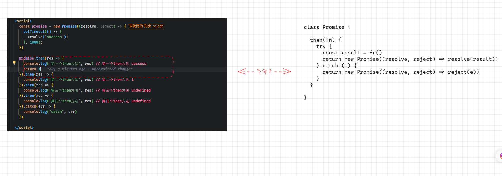

* 验证：

```html
<!DOCTYPE html>
<html lang="en">
<head>
  <meta charset="UTF-8">
  <meta content="IE=edge" http-equiv="X-UA-Compatible">
  <meta content="width=device-width, initial-scale=1.0" name="viewport">
  <title>Title</title>
</head>
<body>
  <script>
    const promise = new Promise((resolve, reject) => {
      setTimeout(() => {
        resolve('success');
      }, 1000);
    })

    promise.then(res => {
      console.log('第一个then方法', res) // 第一个then方法 success
    }).then(res => {
      console.log('第二个then方法', res) // 第二个then方法 undefined
    }).then(res => {
      console.log('第三个then方法', res) // 第三个then方法 undefined
    }).then(res => {
      console.log('第四个then方法', res) // 第四个then方法 undefined
    }).catch(err => {
      console.log("catch", err)
    })

  </script>
</body>
</html>
```

```html
<!DOCTYPE html>
<html lang="en">
<head>
  <meta charset="UTF-8">
  <meta content="IE=edge" http-equiv="X-UA-Compatible">
  <meta content="width=device-width, initial-scale=1.0" name="viewport">
  <title>Title</title>
</head>
<body>
  <script>
    const promise = new Promise((resolve, reject) => {
      setTimeout(() => {
        resolve('success');
      }, 1000);
    })

    promise.then(res => {
      console.log('第一个then方法', res) // 第一个then方法 success
      return 1
    }).then(res => {
      console.log('第二个then方法', res) // 第二个then方法 1
    }).then(res => {
      console.log('第三个then方法', res) // 第三个then方法 undefined
    }).then(res => {
      console.log('第四个then方法', res) // 第四个then方法 undefined
    }).catch(err => {
      console.log("catch", err)
    })

  </script>
</body>
</html>
```

```html
<!DOCTYPE html>
<html lang="en">
<head>
  <meta charset="UTF-8">
  <meta content="IE=edge" http-equiv="X-UA-Compatible">
  <meta content="width=device-width, initial-scale=1.0" name="viewport">
  <title>Title</title>
</head>
<body>
  <script>
    const promise = new Promise((resolve, reject) => {
      setTimeout(() => {
        resolve('success');
      }, 1000);
    })

    promise.then(res => {
      console.log('第一个then方法', res) // 第一个then方法 success
      return {
        name: "tom",
        age: 18
      }
    }).then(res => {
      console.log('第二个then方法', res) // 第二个then方法 {name: 'tom', age: 18}
    }).then(res => {
      console.log('第三个then方法', res) // 第三个then方法 undefined
    }).then(res => {
      console.log('第四个then方法', res) // 第四个then方法 undefined
    }).catch(err => {
      console.log("catch", err)
    })

  </script>
</body>
</html>
```

```html
<!DOCTYPE html>
<html lang="en">
<head>
  <meta charset="UTF-8">
  <meta content="IE=edge" http-equiv="X-UA-Compatible">
  <meta content="width=device-width, initial-scale=1.0" name="viewport">
  <title>Title</title>
</head>
<body>
  <script>
    const promise = new Promise((resolve, reject) => {
      setTimeout(() => {
        resolve('success');
      }, 1000);
    })

    promise.then(res => {
      console.log('第一个then方法', res) // 第一个then方法 success
      return new Promise((resolve, reject) => {
        resolve(1)
      })
    }).then(res => {
      console.log('第二个then方法', res) // 第二个then方法 1
    }).then(res => {
      console.log('第三个then方法', res) // 第三个then方法 undefined
    }).then(res => {
      console.log('第四个then方法', res) // 第四个then方法 undefined
    }).catch(err => {
      console.log("catch", err)
    })

  </script>
</body>
</html>
```

```html
<!DOCTYPE html>
<html lang="en">
<head>
  <meta charset="UTF-8">
  <meta content="IE=edge" http-equiv="X-UA-Compatible">
  <meta content="width=device-width, initial-scale=1.0" name="viewport">
  <title>Title</title>
</head>
<body>
  <script>
    const promise = new Promise((resolve, reject) => {
      setTimeout(() => {
        resolve('success');
      }, 1000);
    })

    promise.then(res => {
      console.log('第一个then方法', res) // 第一个then方法 success
      return new Promise((resolve, reject) => {
        reject(1)
      })
    }).then(res => {
      console.log('第二个then方法', res)
    }).then(res => {
      console.log('第三个then方法', res)
    }).then(res => {
      console.log('第四个then方法', res)
    }).catch(err => {
      console.log("catch", err) // catch 1
    })

  </script>
</body>
</html>
```

```html
<!DOCTYPE html>
<html lang="en">
<head>
  <meta charset="UTF-8">
  <meta content="IE=edge" http-equiv="X-UA-Compatible">
  <meta content="width=device-width, initial-scale=1.0" name="viewport">
  <title>Title</title>
</head>
<body>
  <script>
    const promise = new Promise((resolve, reject) => {
      setTimeout(() => {
        resolve('success');
      }, 1000);
    })

    promise.then(res => {
      console.log('第一个then方法', res) // 第一个then方法 success
      throw new Error("1")
    }).then(res => {
      console.log('第二个then方法', res)
    }).then(res => {
      console.log('第三个then方法', res)
    }).then(res => {
      console.log('第四个then方法', res)
    }).catch(err => {
      console.log("catch", err.message) // catch 1
    })

  </script>
</body>
</html>
```

## 3.5 Promise 实例的 catch 方法（了解）

### 3.5.1 Promise 实例的 catch 方法多次调用

* `Promise`实例的`catch()`方法用于注册一个在 Promise 对象被拒绝时调用的函数。
* 它会立即返回一个等效的 `Promise`对象，这可以允许你`链式调用`其他 Promise 对象的方法。
* 此方法是 `Promise.prototype.then(undefined, onRejected)`的一种简写形式。
* `catch()` 方法内部会调用当前 Promise 对象的 `then()` 方法，并将 `undefined` 和 `onRejected` 作为参数传递给 `then()`。


* 示例：

```html
<!DOCTYPE html>
<html lang="en">
<head>
  <meta charset="UTF-8">
  <meta content="IE=edge" http-equiv="X-UA-Compatible">
  <meta content="width=device-width, initial-scale=1.0" name="viewport">
  <title>Title</title>
</head>
<body>
  <script>
    const promise = new Promise((resolve, reject) => {
      reject(1)
    })

    promise.catch(err => console.log(err)) // 1

    promise.then(res => {
      console.log('then成功的回调', res)
    }, err => {
      console.log('then失败的回调', err) // then失败的回调 1
    })
  </script>
</body>
</html>
```

### 3.5.2 Promise 实例的 catch 方法的返回值

* 先看一下 catch 方法的 TS 定义：

```ts
catch<TResult = never>(onrejected?: ((reason: any) => TResult | PromiseLike<TResult>) | undefined | null): Promise<T | TResult>;
```

* 那么，我们知道，Promise 实例的 catch 方法也是有返回值的，返回的是一个新的 Promise 对象；所以，我们也可以在 catch 后面继续调用 then 方法或 catch 方法。

```html
<!DOCTYPE html>
<html lang="en">
<head>
  <meta charset="UTF-8">
  <meta content="IE=edge" http-equiv="X-UA-Compatible">
  <meta content="width=device-width, initial-scale=1.0" name="viewport">
  <title>Title</title>
</head>
<body>
  <script>
    const promise = new Promise((resolve, reject) => {
      setTimeout(() => {
        reject('success');
      }, 1000);
    })

    promise.catch(err => {
      console.log('第一个then方法', err) // 第一个then方法 success
    }).then(res => {
      console.log('第二个then方法', res) // 第二个then方法 undefined
    }).then(res => {
      console.log('第三个then方法', res) // 第三个then方法 undefined
    }).then(res => {
      console.log('第四个then方法', res) // 第四个then方法 undefined
    }).catch(err => {
      console.log("catch", err) 
    })

  </script>
</body>
</html>
```

## 3.6 Promise 实例的 finally 方法

* 在 ES9 ，Promise 实例上增加了一个新的 finally 方法，表示无论 Promise 实例对象是 `fulfilled` 还是 `rejected` 状态，都会执行的代码。
* Promise 实例上的 finally 方法，通常用来执行清理的操作。

```html
<!DOCTYPE html>
<html lang="en">
<head>
  <meta charset="UTF-8">
  <meta content="IE=edge" http-equiv="X-UA-Compatible">
  <meta content="width=device-width, initial-scale=1.0" name="viewport">
  <title>Title</title>
</head>
<body>
  <script>
    const promise = new Promise((resolve, reject) => {
      setTimeout(() => {
        resolve('success');
      }, 1000);
    })

    promise.then(res => {
      console.log(res)
    }).catch(err => {
      console.log(err)
    }).finally(() => {
      console.log('finally')
    })

  </script>
</body>
</html>
```

## 3.7 Promise 类方法

### 3.7.1 概述

* 前文提到的 then、catch 和 finally 方法，是 Promise 实例上的方法；但是，Promise 类上还有很多类方法（静态方法）。

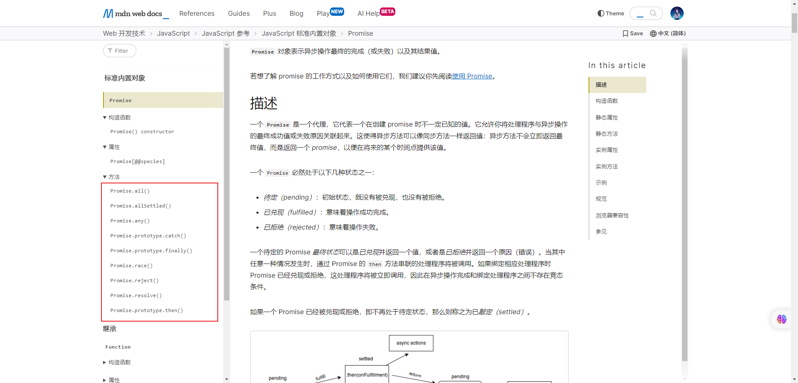

### 3.7.2 Promise.resolve 方法

* 方法：用于快速返回一个状态为 fulfilled 或 rejected 的 Promise 实例

```ts
resolve<T>(value: T | PromiseLike<T>): Promise<Awaited<T>>;
```

* 参数的情况：
  * 情况一：参数是一个普通的值或对象。
  * 情况二：参数本身是一个 Promise 对象。
  * 情况三：参数是一个 thenable 。

* 相当于：

```js
new Promise((resolve) => resolve(value))
```


* 示例：

```html
<!DOCTYPE html>
<html lang="en">
<head>
  <meta charset="UTF-8">
  <meta content="IE=edge" http-equiv="X-UA-Compatible">
  <meta content="width=device-width, initial-scale=1.0" name="viewport">
  <title>Title</title>
</head>
<body>
  <script>
    const promise = Promise.resolve(1)

    promise.then(res => {
      console.log('then', res) // then 1
    }).catch(err => {
      console.log('catch', err)
    }).finally(() => {
      console.log('finally') // finally
    })

  </script>
</body>
</html>
```


* 示例：

```html
<!DOCTYPE html>
<html lang="en">
<head>
  <meta charset="UTF-8">
  <meta content="IE=edge" http-equiv="X-UA-Compatible">
  <meta content="width=device-width, initial-scale=1.0" name="viewport">
  <title>Title</title>
</head>
<body>
  <script>
    const promise = Promise.resolve(new Promise((resolve, reject) => resolve(1)))

    promise.then(res => {
      console.log('then', res) // then 1
    }).catch(err => {
      console.log('catch', err)
    }).finally(() => {
      console.log('finally') // finally
    })

  </script>
</body>
</html>
```


* 示例：

```html
<!DOCTYPE html>
<html lang="en">
<head>
  <meta charset="UTF-8">
  <meta content="IE=edge" http-equiv="X-UA-Compatible">
  <meta content="width=device-width, initial-scale=1.0" name="viewport">
  <title>Title</title>
</head>
<body>
  <script>
    const promise = Promise.resolve(new Promise((resolve, reject) => reject(1)))

    promise.then(res => {
      console.log('then', res) 
    }).catch(err => {
      console.log('catch', err) // catch 1
    }).finally(() => {
      console.log('finally') // finally
    })

  </script>
</body>
</html>
```


* 示例：

```html
<!DOCTYPE html>
<html lang="en">
<head>
  <meta charset="UTF-8">
  <meta content="IE=edge" http-equiv="X-UA-Compatible">
  <meta content="width=device-width, initial-scale=1.0" name="viewport">
  <title>Title</title>
</head>
<body>
  <script>
    const promise = Promise.resolve({name: "张三", age: 18})

    promise.then(res => {
      console.log('then', res) // then {name: '张三', age: 18}
    }).catch(err => {
      console.log('catch', err) 
    }).finally(() => {
      console.log('finally') // finally
    })

  </script>
</body>
</html>
```

### 3.7.3 Promise.reject 方法

* 方法：用于快速返回一个状态必为 rejected 的 Promise 实例

```ts
Promise.reject<T = never>(reason?: any): Promise<T>;
```

* 相当于：

```js
new Promise((resolve,reject) => reject(value))
```


* 示例：

```html
<!DOCTYPE html>
<html lang="en">
<head>
  <meta charset="UTF-8">
  <meta content="IE=edge" http-equiv="X-UA-Compatible">
  <meta content="width=device-width, initial-scale=1.0" name="viewport">
  <title>Title</title>
</head>
<body>
  <script>
    const promise = Promise.reject({name: "张三", age: 18})

    promise.then(res => {
      console.log('then', res)
    }).catch(err => {
      console.log('catch', err) // catch {name: '张三', age: 18}
    }).finally(() => {
      console.log('finally') // finally
    })

  </script>
</body>
</html>
```

### 3.7.4 Promise.all 方法

* 方法：将 `多个 Promise 实例对象`  包裹在一起形成一个 `新的 Promise 实例对象`

```ts
Promise.all<T extends readonly unknown[] | []>(values: T): Promise<{ -readonly [P in keyof T]: Awaited<T[P]> }>;
```

* 如果多个 Promise 实例的状态都变为 fulfilled 的时候，那么新的 Promise 实例对象的状态就变为 fulfilled ，并且将多个 Promise 实例的返回值组成一个数组作为参数。
* 如果多个 Promise 实例的状态中有一个状态变为 rejected ，那么新的 Promise 实例对象的状态就变为 rejected ，并且会将第一个状态为 rejected  的 Promise 实例的返回值作为参数。


* 示例：

```html
<!DOCTYPE html>
<html lang="en">
<head>
  <meta charset="UTF-8">
  <meta content="IE=edge" http-equiv="X-UA-Compatible">
  <meta content="width=device-width, initial-scale=1.0" name="viewport">
  <title>Title</title>
</head>
<body>
  <script>
    const p1 = Promise.resolve(1)
    const p2 = Promise.resolve(2)
    const p3 = Promise.resolve(3)

    const p = Promise.all([p1, p2, p3])
    p.then(res => {
      console.log('then', res) // then [1, 2, 3]
    }).catch(err => {
      console.log('catch', err)
    }).finally(() => {
      console.log('finally') // finally
    })

  </script>
</body>
</html>
```


* 示例：

```html
<!DOCTYPE html>
<html lang="en">
<head>
  <meta charset="UTF-8">
  <meta content="IE=edge" http-equiv="X-UA-Compatible">
  <meta content="width=device-width, initial-scale=1.0" name="viewport">
  <title>Title</title>
</head>
<body>
  <script>
    const p1 = Promise.resolve(1)
    const p2 = Promise.resolve(2)
    const p3 = Promise.reject(3)

    const p = Promise.all([p1, p2, p3])
    p.then(res => {
      console.log('then', res) 
    }).catch(err => {
      console.log('catch', err) // catch 3
    }).finally(() => {
      console.log('finally') // finally
    })

  </script>
</body>
</html>
```

### 3.7.5 Promise.race 方法

* 方法： 返回一个新的 Promise 实例，以第一个 promise 的敲定而敲定

```ts
Promise.race<T>(values: Iterable<T | PromiseLike<T>>): Promise<Awaited<T>>;
```

* race 的中文翻译是`竞争`，表示多个 Promise 实例对象相互竞争，谁先有结果，就使用谁的结果。


* 示例：

```html
<!DOCTYPE html>
<html lang="en">
<head>
  <meta charset="UTF-8">
  <meta content="IE=edge" http-equiv="X-UA-Compatible">
  <meta content="width=device-width, initial-scale=1.0" name="viewport">
  <title>Title</title>
</head>
<body>
  <script>
    const p1 = new Promise((resolve) => {
      setTimeout(() => {
        resolve(1);
      }, 2000);
    })
    const p2 = new Promise((resolve) => {
      setTimeout(() => {
        resolve(2);
      }, 1000);
    })
    const p3 = new Promise((resolve) => {
      setTimeout(() => {
        resolve(3);
      }, 3000);
    })

    const p = Promise.race([p1, p2, p3])
    p.then(res => {
      console.log('then', res) // then 2
    }).catch(err => {
      console.log('catch', err)
    }).finally(() => {
      console.log('finally') // finally
    })

  </script>
</body>
</html>
```

### 3.7.6 Promise.allSettled 方法

* 方法：将 `多个 Promise 实例对象`  包裹在一起形成一个 `新的 Promise 实例对象`，`新的 Promise 实例对象`在`所有输入的 Promise 实例对象`都已经被 settled（即已经完成或被拒绝）时才会被 resolved。

```ts
Promise.allSettled<T extends readonly unknown[] | []>(values: T): Promise<{ -readonly [P in keyof T]: PromiseSettledResult<Awaited<T[P]>> }>;
```

* `Promise.all()` 方法有一个缺陷：当其中一个 Promise 变为 rejected 状态的时候，新的 Promise 实例对象就会立即变为 rejected 状态；但是，对于哪些 fulfilled 或依旧处于 pending 状态的 Promise ，我们是获取不到结果的。

* `Promise.allSettled()` 返回的 Promise 解析为一个包含所有输入 Promise 结果的数组，每个结果都是一个对象，包含了 Promise 的状态（fulfilled 或 rejected）以及对应的值或原因。这使得我们可以检查每个 Promise 的最终状态和结果，而不需要担心中间某个 Promise 的失败影响整体。

> 注意：`Promise.allSettled()` 的结果一定是 `fulfilled` 。


* 示例：

```html
<!DOCTYPE html>
<html lang="en">
<head>
  <meta charset="UTF-8">
  <meta content="IE=edge" http-equiv="X-UA-Compatible">
  <meta content="width=device-width, initial-scale=1.0" name="viewport">
  <title>Title</title>
</head>
<body>
  <script>
    const p1 = Promise.resolve(1)
    const p2 = Promise.resolve(2)
    const p3 = Promise.reject(1)

    /* Promise.allSettled 的结果一定是 then ，不会执行 catch */
    const p = Promise.allSettled([p1, p2, p3])
    p.then(result => {
      result.forEach(res => {
        const {status, value, reason} = res
        console.log('then', status, value, reason)
      })
    }).catch(err => {
      console.log('catch', err)
    }).finally(() => {
      console.log('finally') // finally
    })

  </script>
</body>
</html>
```

### 3.7.7 Promise.any 方法

* 方法：当输入的任何一个 Promise 兑现时，这个返回的 Promise 将会兑现，并返回第一个兑现的值

```ts
Promise.any<T extends readonly unknown[] | []>(values: T): Promise<Awaited<T[number]>>;
```

* `Promise.race` 方法只要有一个 Promise 有结果（不管是 fulfilled 还是 rejected）就返回，而 `Promise.any` 会等待任何一个 Promise 兑现，并返回第一个兑现的值；如果所有输入的 Promise 都被拒绝，将报 `AggregateError` 的异常。


* 示例：

```html
<!DOCTYPE html>
<html lang="en">
<head>
  <meta charset="UTF-8">
  <meta content="IE=edge" http-equiv="X-UA-Compatible">
  <meta content="width=device-width, initial-scale=1.0" name="viewport">
  <title>Title</title>
</head>
<body>
  <script>
    const p1 = new Promise((resolve) => {
      setTimeout(() => {
        resolve(1);
      }, 2000);
    })
    const p2 = new Promise((resolve) => {
      setTimeout(() => {
        resolve(2);
      }, 1000);
    })
    const p3 = new Promise((resolve) => {
      setTimeout(() => {
        resolve(3);
      }, 3000);
    })

    const p = Promise.any([p1, p2, p3])
    p.then(res => {
      console.log('then', res) // then 2
    }).catch(err => {
      console.log('catch', err)
    }).finally(() => {
      console.log('finally') // finally
    })

  </script>
</body>
</html>
```

