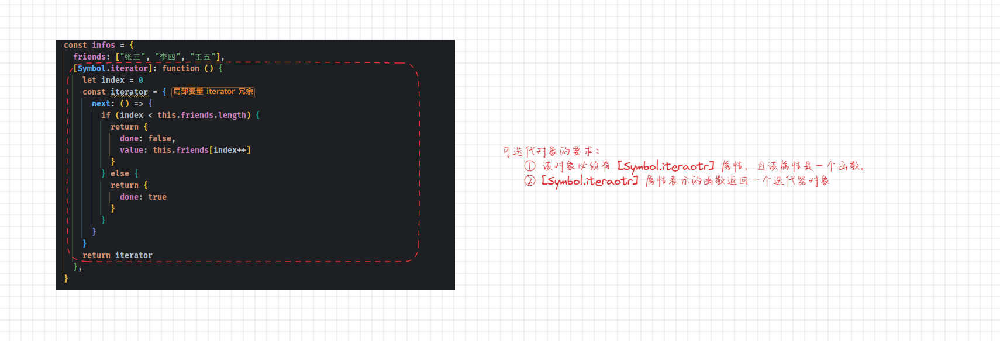
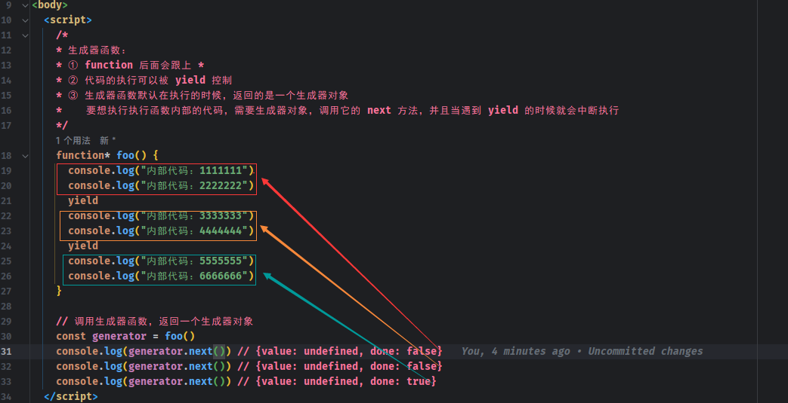
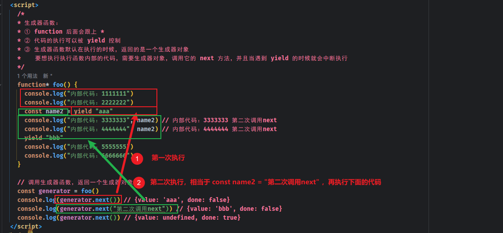

# 第一章：迭代器（⭐）

## 1.1 概述

* 迭代器（Iterator）是使用户在`容器对象（如：数组、链表）`上`遍历对象`，使用该接口`用户无需关心对象的内部实现细节`。
  * 其行为很像数据库技术中的 `光标`（游标，cursor），迭代器最早出现在 `1974` 年设计的 `CLU` 编程语言中。
  * 在各种语言实现迭代器的方式皆不尽同，有些面向对象语言像[Java](https://zh.wikipedia.org/wiki/Java)、[C#](https://zh.wikipedia.org/wiki/C_Sharp)、[Ruby](https://zh.wikipedia.org/wiki/Ruby)、[Python](https://zh.wikipedia.org/wiki/Python)、[Delphi](https://zh.wikipedia.org/wiki/Delphi) 都已将迭代器的特性内置语言当中，完美的跟语言集成，我们称之隐式迭代器。
* 以 Java 为例：

```java
package com.github;

import java.util.Arrays;
import java.util.Iterator;
import java.util.List;

public class JavaTest {
    public static void main(String[] args) {
        List<Integer> list = Arrays.asList(1, 2, 3);
        Iterator<Integer> iterator = list.iterator();
        while (iterator.hasNext()) {
            Integer element = iterator.next();
            System.out.println(element);
        }
    }
}
```

* 其实，`迭代器`就是帮助我们对某个数据结构进行遍历的`对象`。其实，上面示例中的 `iterator` 就是一个`迭代器对象`。当然，在 Java 中为了简化使用迭代器，推出了 for-each 语法来简化编写：

```java
package com.mybatisflex.test.basic.crud;

import java.util.Arrays;
import java.util.List;

public class JavaTest {
    public static void main(String[] args) {
        List<Integer> list = Arrays.asList(1, 2, 3);
        // 使用 for-each 语法来简化迭代器的使用
        for (Integer element : list) {
            System.out.println(element);
        }
    }
}

```

> 注意：在 Java 中，迭代器通常应用于集合框架中。

* 同理，在 JavaScript 中，也是有迭代器的，如：我们使用 `for...of` 语法来对遍历数组元素

```js
const array = [1, 2, 3];

// 使用 for...of 循环遍历数组
for (const element of array) {
  console.log(element);
}
```

* 如果转换为迭代器语法，就如同下面的代码：

```js
const array = [1, 2, 3];

// 创建迭代器对象
const arrayIterator = array[Symbol.iterator]();

// 使用迭代器遍历数组
let iteratorResult = arrayIterator.next();
while (!iteratorResult.done) {
  const element = iteratorResult.value;
  console.log(element);
  iteratorResult = arrayIterator.next();
}
```

* 在 JavaScript 中，迭代器就是一个具体的对象，这个对象需要符合迭代器协议：
  * 迭代器协议定义了`产生一系列值（无论是有限的，还是无限的）的标准方式`。
  * 在 JavaScript 中，这个标准就是需要有一个特定的 `next` 方法。
* 那么，这个 next 方法的标准是什么？
  * 一个`无参数`或`一个参数`的函数，返回一个有 `done` 和 `value` 属性的对象。
  * done 是 boolean 类型（`done` 的中文翻译是 `完成`）：
    * 如果迭代器`可以`产生序列中的下一个值，则为 `false` （这等价于没有指定 `done` 这个属性）。
    * 如果迭代器已经将序列迭代`完毕`，则为 `true` （这种情况下，`value` 是可选的，如果它依然存在，即为迭代结束之后的默认返回值）。
  * value 可以是任何 JavaScript 值，如果 done 为 true 的时候，可以省略。

* 那么，我们在 JavaScript 中，就可以给数组定义迭代器对象了：

```html
<!DOCTYPE html>
<html lang="en">
<head>
  <meta charset="UTF-8">
  <meta content="IE=edge" http-equiv="X-UA-Compatible">
  <meta content="width=device-width, initial-scale=1.0" name="viewport">
  <title>Title</title>
</head>
<body>
  <script>
    const arr = [1, 2, 3]
    // 给数组创建一个迭代器
    let index = 0
    const arrIterator = {
      next: function () {
        if (index < arr.length) {
          return {
            done: false,
            value: arr[index++]
          }
        } else {
          return {
            done: true,
            value: undefined
          }
        }
      }
    }

    // 使用迭代器遍历
    let next = arrIterator.next()
    console.log(next.done, next.value)
    next = arrIterator.next()
    console.log(next.done, next.value)
    next = arrIterator.next()
    console.log(next.done, next.value)
    next = arrIterator.next()
    console.log(next.done, next.value)
  </script>
</body>
</html>
```

* 在使用迭代器遍历数组元素的时候，使用 while 循环来简化：

```html
<!DOCTYPE html>
<html lang="en">
<head>
  <meta charset="UTF-8">
  <meta content="IE=edge" http-equiv="X-UA-Compatible">
  <meta content="width=device-width, initial-scale=1.0" name="viewport">
  <title>Title</title>
</head>
<body>
  <script>
    const arr = [1, 2, 3]
    // 给数组创建一个迭代器
    let index = 0
    const arrIterator = {
      next: function () {
        if (index < arr.length) {
          return {
            done: false,
            value: arr[index++]
          }
        } else {
          return {
            done: true,
            value: undefined
          }
        }
      }
    }

    // 使用迭代器遍历
    let next = arrIterator.next()
    while (!next.done) {
      console.log(next.value)
      next = arrIterator.next()
    }
  </script>
</body>
</html>
```

* 但是，while 循环还是不够简洁，可以使用 for 循环来简化遍历：

```html
<!DOCTYPE html>
<html lang="en">
<head>
  <meta charset="UTF-8">
  <meta content="IE=edge" http-equiv="X-UA-Compatible">
  <meta content="width=device-width, initial-scale=1.0" name="viewport">
  <title>Title</title>
</head>
<body>
  <script>
    const arr = [1, 2, 3]
    // 给数组创建一个迭代器
    let index = 0
    const arrIterator = {
      next: function () {
        if (index < arr.length) {
          return {
            done: false,
            value: arr[index++]
          }
        } else {
          return {
            done: true,
            value: undefined
          }
        }
      }
    }

    // 使用迭代器遍历
    for (let next = arrIterator.next(); !next.done; next = arrIterator.next()) {
      console.log(next.value)
    }
  </script>
</body>
</html>
```

* 上面的迭代器只能针对某个函数，如果想要更加通用，就需要封装一个函数了：

```html
<!DOCTYPE html>
<html lang="en">
<head>
  <meta charset="UTF-8">
  <meta content="IE=edge" http-equiv="X-UA-Compatible">
  <meta content="width=device-width, initial-scale=1.0" name="viewport">
  <title>Title</title>
</head>
<body>
  <script>
    const arr = [1, 2, 3]
    const names = ["张三", "李四", "王五", "赵六"]

    function createIterator(arr) {
      // 记录当前遍历的位置
      let index = 0
      return {
        next: function () {
          if (index < arr.length) {
            return {
              done: false,
              value: arr[index++]
            }
          } else {
            return {
              done: true
            }
          }
        }
      }
    }

    // 使用迭代器遍历
    let arrIterator = createIterator(arr)
    for (let next = arrIterator.next(); !next.done; next = arrIterator.next()) {
      console.log(next.value)
    }

    console.log('-----------------------------')

    arrIterator = createIterator(names)
    for (let next = arrIterator.next(); !next.done; next = arrIterator.next()) {
      console.log(next.value)
    }

  </script>
</body>
</html>
```

* 那么，如果将该函数放到 Array 的显示原型对象上，就可以实现任意数组直接调用，就可以返回迭代器对象了：

```html
<!DOCTYPE html>
<html lang="en">
<head>
  <meta charset="UTF-8">
  <meta content="IE=edge" http-equiv="X-UA-Compatible">
  <meta content="width=device-width, initial-scale=1.0" name="viewport">
  <title>Title</title>
</head>
<body>
  <script>
    const arr = [1, 2, 3]
    const names = ["张三", "李四", "王五", "赵六"]

    function createIterator(arr) {
      // 记录当前遍历的位置
      let index = 0
      return {
        next: function () {
          if (index < arr.length) {
            return {
              done: false,
              value: arr[index++]
            }
          } else {
            return {
              done: true
            }
          }
        }
      }
    }

    // 将生成迭代器对象的函数放到 Array 的显示原型对象上
    Array.prototype.customIterator = function () {
      return createIterator(this)
    }

    // 使用迭代器遍历
    let arrIterator = arr.customIterator()
    for (let next = arrIterator.next(); !next.done; next = arrIterator.next()) {
      console.log(next.value)
    }

    console.log('-----------------------------')

    arrIterator = names.customIterator()
    for (let next = arrIterator.next(); !next.done; next = arrIterator.next()) {
      console.log(next.value)
    }

  </script>
</body>
</html>
```

* 如果我们直接在 Array 的显示原型中，添加生成迭代器对象函数的逻辑，咋办？

```html
<!DOCTYPE html>
<html lang="en">
<head>
  <meta charset="UTF-8">
  <meta content="IE=edge" http-equiv="X-UA-Compatible">
  <meta content="width=device-width, initial-scale=1.0" name="viewport">
  <title>Title</title>
</head>
<body>
  <script>
    const arr = [1, 2, 3]
    const names = ["张三", "李四", "王五", "赵六"]

    // 将生成迭代器对象的函数放到 Array 的显示原型对象上
    Array.prototype.customIterator = function () {
      let index = 0;
      return {
        next: () => {
          if (index < this.length) {
            return {
              done: false,
              value: this[index++]
            }
          } else {
            return {
              done: true
            }
          }
        }
      }
    }

    // 使用迭代器遍历
    let arrIterator = arr.customIterator()
    for (let next = arrIterator.next(); !next.done; next = arrIterator.next()) {
      console.log(next.value)
    }

    console.log('-----------------------------')

    arrIterator = names.customIterator()
    for (let next = arrIterator.next(); !next.done; next = arrIterator.next()) {
      console.log(next.value)
    }

  </script>
</body>
</html>
```

## 1.2 可迭代对象

### 1.2.1 概述

* 在上面遍历数组元素的时候，我们需要`自己创建一个记录当前遍历的位置 index 变量`，再`创建一个迭代器对象`：

```html
<!DOCTYPE html>
<html lang="en">
<head>
  <meta charset="UTF-8">
  <meta content="IE=edge" http-equiv="X-UA-Compatible">
  <meta content="width=device-width, initial-scale=1.0" name="viewport">
  <title>Title</title>
</head>
<body>
  <script>
    const arr = [1, 2, 3]
    const names = ["张三", "李四", "王五", "赵六"]

    function createIterator(arr) {
      // 记录当前遍历的位置
      let index = 0
      return {
        next: function () {
          if (index < arr.length) {
            return {
              done: false,
              value: arr[index++]
            }
          } else {
            return {
              done: true
            }
          }
        }
      }
    }

    // 使用迭代器遍历
    let arrIterator = createIterator(arr)
    for (let next = arrIterator.next(); !next.done; next = arrIterator.next()) {
      console.log(next.value)
    }

    console.log('-----------------------------')

    arrIterator = createIterator(names)
    for (let next = arrIterator.next(); !next.done; next = arrIterator.next()) {
      console.log(next.value)
    }

  </script>
</body>
</html>
```

* 那么，我们是否可以对上面的代码进一步封装？使得`迭代器对象`能够遍历`对象`中的`数组属性`：

```html
<!DOCTYPE html>
<html lang="en">
<head>
  <meta charset="UTF-8">
  <meta content="IE=edge" http-equiv="X-UA-Compatible">
  <meta content="width=device-width, initial-scale=1.0" name="viewport">
  <title>Title</title>
</head>
<body>
  <script>
    /* 对象 */
    const infos = {
      friends: ["张三", "李四", "王五"]
    }

    // 给 infos 创建一个迭代器，用于迭代 infos 中的 friends 数组
    let index = 0
    const arrIterator = {
      next: function () {
        if (index < infos.friends.length) {
          return {
            done: false,
            value: infos.friends[index++]
          }
        } else {
          return {
            done: true
          }
        }
      }
    }

    // 通过迭代器迭代 infos 中的 friends 数组
    for (let next = arrIterator.next(); !next.done; next = arrIterator.next()) {
      console.log(next.value)
    }

  </script>
</body>
</html>
```

* 但是，这样还是不够的，因为`迭代器对象`和`普通对象`是分离的，能够将这两个组成起来，使其成为`可迭代对象`？

  * 当一个对象实现了`iterable protocol` 协议时，它就是一个`可迭代对象`。

  * 这个对象的要求是必须实现 `@@iterator` 方法，一个`可迭代对象`必须包含一个特殊的属性，即 `Symbol.iterator`，这个属性的值是一个`函数`，这个函数被调用时应返回一个`迭代器（Iterator）对象`。

```html
<!DOCTYPE html>
<html lang="en">
<head>
  <meta charset="UTF-8">
  <meta content="IE=edge" http-equiv="X-UA-Compatible">
  <meta content="width=device-width, initial-scale=1.0" name="viewport">
  <title>Title</title>
</head>
<body>
  <script>
    /* 可迭代对象 */
    /*
    * 必须实现特定的函数： [Symbol.iterator]
    * 函数需要返回一个迭代器
    */
    const infos = {
      friends: ["张三", "李四", "王五"],
      [Symbol.iterator]: function () {
        let index = 0
        const iterator = {
          next: () => {
            if (index < this.friends.length) {
              return {
                done: false,
                value: this.friends[index++]
              }
            } else {
              return {
                done: true
              }
            }
          }
        }
        return iterator
      },
    }

    // 使用迭代器对象遍历
    const iterator = infos[Symbol.iterator]()
    for (let next = iterator.next(); !next.done; next = iterator.next()) {
      console.log(next.value)
    }

    console.log('---------------------')

    // 可迭代对象可以使用 for...of 操作
    for (const friend of infos) {
      console.log(friend)
    }

  </script>
</body>
</html>
```

* 图解：可迭代对象



* 其实，数组就是一个可迭代对象：

```html
<!DOCTYPE html>
<html lang="en">
<head>
  <meta charset="UTF-8">
  <meta content="IE=edge" http-equiv="X-UA-Compatible">
  <meta content="width=device-width, initial-scale=1.0" name="viewport">
  <title>Title</title>
</head>
<body>
  <script>
    const arr = [1, 23, 34, 4, 5, 6, 7, 10]

    // 数组之所以能够使用 for...of 语法，就是因为其是一个可迭代对象
    for (let element of arr) {
      console.log(element)
    }

    console.log('---------------------')

    // 通过迭代器来遍历数组中的元素
    const iterator = arr[Symbol.iterator]()
    for (let next = iterator.next(); !next.done; next = iterator.next()) {
      console.log(next.value)
    }
  </script>
</body>
</html>
```

* 上面例子中只能`遍历`可迭代对象中的 `friends` 数组属性，实在是太局限了；实际开发中，我们更希望`遍历`可迭代对象中的 key-value ，咋办？

```html
<!DOCTYPE html>
<html lang="en">
<head>
  <meta charset="UTF-8">
  <meta content="IE=edge" http-equiv="X-UA-Compatible">
  <meta content="width=device-width, initial-scale=1.0" name="viewport">
  <title>Title</title>
</head>
<body>
  <script>
    /* 可迭代对象 */
    /*
    * 必须实现特定的函数： [Symbol.iterator]
    * 函数需要返回一个迭代器
    */
    const infos = {
      name: '许大仙',
      age: 18,
      height: 1.8,
      [Symbol.iterator]: function () {
        const entries = Object.entries(this)
        let index = 0
        const iterator = {
          next: function () {
            if (index < entries.length) {
              return {
                done: false,
                value: entries[index++]
              }
            } else {
              return {
                done: true
              }
            }
          }
        }
        return iterator
      },
    }

    // 使用迭代器对象遍历
    const iterator = infos[Symbol.iterator]()
    for (let next = iterator.next(); !next.done; next = iterator.next()) {
      console.log(next.value)
    }

    console.log('---------------------')

    // 可迭代对象可以使用 for...of 操作
    for (const [key, value] of infos) {
      console.log(key, value)
    }

  </script>
</body>
</html>
```

### 1.2.2 原生可迭代对象

* 实际开发中，我们会使用 String、Array、Map、Set、NodeList 等，其实这些都是可迭代对象。

```html
<!DOCTYPE html>
<html lang="en">
<head>
  <meta charset="UTF-8">
  <meta content="IE=edge" http-equiv="X-UA-Compatible">
  <meta content="width=device-width, initial-scale=1.0" name="viewport">
  <title>Title</title>
</head>
<body>

  <button>我是按钮</button>

  <script>
    function isIterable(obj) {
      // 检查 null 和 undefined
      if (obj == null) {
        return false;
      }
      // 检查 Symbol.iterator 属性是否是一个函数
      return typeof obj[Symbol.iterator] === 'function';
    }

    const arr = [1, 2, 3]
    console.log(`数组是可迭代对象：${isIterable(arr)}`) // 数组是可迭代对象：true

    let str = "123"
    console.log(`字符串是可迭代对象：${isIterable(str)}`) // 字符串是可迭代对象：true

    const map = new Map()
    console.log(`map对象是可迭代对象：${isIterable(map)}`) // map对象是可迭代对象：true

    const set = new Set()
    console.log(`set对象是可迭代对象：${isIterable(set)}`) // set对象是可迭代对象：true

    const btnEls = document.querySelectorAll('button')
    console.log(`NodeList对象是可迭代对象：${isIterable(btnEls)}`) // NodeList对象是可迭代对象：true

    const obj = {
      name: "许大仙"
    }

    console.log(`普通对象是可迭代对象：${isIterable(obj)}`) // 普通对象是可迭代对象：false

  </script>
</body>
</html>
```

### 1.2.3 可迭代对象的应用场景

* ① 特殊的 JavaScript 语法：`for ...of 语法`、`展开运算符`、`yield*`、`解构赋值`。
* ② 创建一些对象：`new Map([Iterable])`、`new Set([Iterable])`。
* ③ 一些方法的调用：`Promise.all([Iterable])`、`Promise.race([Iterable])`、`Array.from([Iterable])`。


* 示例：

```html
<!DOCTYPE html>
<html lang="en">
<head>
  <meta charset="UTF-8">
  <meta content="IE=edge" http-equiv="X-UA-Compatible">
  <meta content="width=device-width, initial-scale=1.0" name="viewport">
  <title>Title</title>
</head>
<body>
  <script>
    function foo(...args) {
      console.log(args)
    }

    const arr = [1, 2, 3]
    // 数组的展开运算符
    foo(...arr)
  </script>
</body>
</html>
```


* 示例：

```html
<!DOCTYPE html>
<html lang="en">
<head>
  <meta charset="UTF-8">
  <meta content="IE=edge" http-equiv="X-UA-Compatible">
  <meta content="width=device-width, initial-scale=1.0" name="viewport">
  <title>Title</title>
</head>
<body>
  <script>
    function foo(...args) {
      console.log(args)
    }

    const infos = {
      name: '许大仙',
      age: 18,
      height: 1.8,
      [Symbol.iterator]: function () {
        const entries = Object.entries(this)
        let index = 0
        const iterator = {
          next: function () {
            if (index < entries.length) {
              return {
                done: false,
                value: entries[index++]
              }
            } else {
              return {
                done: true
              }
            }
          }
        }
        return iterator
      },
    }
    // 可迭代对象的展开运算符
    foo(...infos)
  </script>
</body>
</html>
```

### 1.2.4 自定义类的可迭代

* 我们知道，Map、Set、Array 等类创建出来的对象是可迭代对象；那么，我们希望`自己创建的类生成的对象默认也是可迭代对象`，就需要`在设计类的时候添加上 @@iterator 方法了`。


* 示例：

```html
<!DOCTYPE html>
<html lang="en">
<head>
  <meta charset="UTF-8">
  <meta content="IE=edge" http-equiv="X-UA-Compatible">
  <meta content="width=device-width, initial-scale=1.0" name="viewport">
  <title>Title</title>
</head>
<body>
  <script>
    /**
     * 判断一个对象是否是可迭代对象
     * @param {Person} obj
     */
    function isIterable(obj) {
      // 检查 null 和 undefined
      if (obj == null) {
        return false;
      }
      // 检查 Symbol.iterator 属性是否是一个函数
      return typeof obj[Symbol.iterator] === 'function';
    }
  </script>
  <script>
    class Person {
      constructor(name, age, height, friends) {
        this.name = name
        this.age = age
        this.height = height
        this.friends = friends
      }

      [Symbol.iterator]() {
        let index = 0
        return {
          next: () => {
            if (index < this.friends.length) {
              return {
                done: false,
                value: this.friends[index++]
              }
            } else {
              return {
                done: true
              }
            }
          }
        }
      }
    }

    console.log(isIterable(new Person("张三", 18, 1.8, [{name: "张三"}, {name: "李四"}])))

    const person = new Person("张三", 18, 1.8, [{name: "张三"}, {name: "李四"}])
    for (let p of person) {
      console.log(p)
    }
  </script>
</body>
</html>
```

## 1.3 迭代器的中断（了解）

* 某些时候，在使用 `for...of` 遍历的过程中，如果遇到了 break、return、throw 中断了循环操作，如果想要监听中断的话，就可以添加 return 方法了。

```html
<!DOCTYPE html>
<html lang="en">
<head>
  <meta charset="UTF-8">
  <meta content="IE=edge" http-equiv="X-UA-Compatible">
  <meta content="width=device-width, initial-scale=1.0" name="viewport">
  <title>Title</title>
</head>
<body>
  <script>
    class Person {
      constructor(name, age, height, friends) {
        this.name = name
        this.age = age
        this.height = height
        this.friends = friends
      }

      [Symbol.iterator]() {
        let index = 0
        return {
          next: () => {
            if (index < this.friends.length) {
              return {
                done: false,
                value: this.friends[index++]
              }
            } else {
              return {
                done: true
              }
            }
          },
          return: () => {
            console.log("迭代器提前终止了")
            return {
              done: true
            }
          }
        }
      }
    }

    const person = new Person("张三", 18, 1.8, [{name: "张三"}, {name: "李四"}])
    for (let item of person) {
      let {name} = item
      if (name === "李四") {
        break
      }
      console.log(item)
    }
  </script>
</body>
</html>
```


# 第二章：生成器（⭐）

## 2.1 概述

* `生成器`是 ES6 中新增的一种`函数控制、使用`的方案，它可以让我们`更加灵活的控制函数什么时候继续执行、暂停执行`等；而之前我们编写的很多函数的`终止条件`通常是`返回值`或者`发生了异常`。
* `生成器函数`是一种特殊的函数，但是和`普通函数`有一些区别：
  * ① 生成器函数需要在 `function` 后面加上 `*` 。
  * ② 生成器函数可以通过 `yield` 关键字来控制函数的执行流程。
  * ③ 生成器函数的`返回值`是一个`生成器`（Generator）。

> 注意：
>
> * ① 之所以出现生成器函数的原因：虽然自定义的迭代器非常好用，但是由于需要显示的维护其内部状态，需要谨慎的创建和调试；而生成器函数提供了一个强大的选择，即允许我们定义一个包含有迭代算法的函数，并且其内部可以自动维护自己的状态。
> * ② 生成器本质上是一种特殊的迭代器。


* 示例：

```html
<!DOCTYPE html>
<html lang="en">
<head>
  <meta charset="UTF-8">
  <meta content="IE=edge" http-equiv="X-UA-Compatible">
  <meta content="width=device-width, initial-scale=1.0" name="viewport">
  <title>Title</title>
</head>
<body>
  <script>
    /*
    * 生成器函数：
    * ① function 后面会跟上 *
    * ② 代码的执行可以被 yield 控制
    * ③ 生成器函数默认在执行的时候，返回的是一个生成器对象
    */
    function* foo() {
      console.log("内部代码：1111111")
      console.log("内部代码：2222222")
      yield
      console.log("内部代码：3333333")
      console.log("内部代码：4444444")
      yield
      console.log("内部代码：5555555")
      console.log("内部代码：6666666")
    }

    // 调用生成器函数，返回一个生成器对象
    const generator = foo()
  </script>
</body>
</html>
```

## 2.2 生成器函数的执行

* 要想执行`生成器函数`中的代码，就需要使用`生成器函数`返回的`生成器对象`，调用 `next()` 方法，并且当遇到 `yield` 的时候就会中断执行。


* 示例：

```html
<!DOCTYPE html>
<html lang="en">
<head>
  <meta charset="UTF-8">
  <meta content="IE=edge" http-equiv="X-UA-Compatible">
  <meta content="width=device-width, initial-scale=1.0" name="viewport">
  <title>Title</title>
</head>
<body>
  <script>
    /*
    * 生成器函数：
    * ① function 后面会跟上 *
    * ② 代码的执行可以被 yield 控制
    * ③ 生成器函数默认在执行的时候，返回的是一个生成器对象
    *    要想执行执行函数内部的代码，需要生成器对象，调用它的 next 方法，并且当遇到 yield 的时候就会中断执行
    */
    function* foo() {
      console.log("内部代码：1111111")
      console.log("内部代码：2222222")
      yield
      console.log("内部代码：3333333")
      console.log("内部代码：4444444")
      yield
      console.log("内部代码：5555555")
      console.log("内部代码：6666666")
    }

    // 调用生成器函数，返回一个生成器对象
    const generator = foo()
    generator.next()
    generator.next()
    generator.next()
    generator.next()
  </script>
</body>
</html>
```

## 2.3 生成器函数对象 next 方法的返回值

* 如果在生成器函数中的 yield 没有返回结果，那么生成器函数对象 next 方法的返回值就返回 `{value: undefined, done: xxxx}`：

```html
<!DOCTYPE html>
<html lang="en">
<head>
  <meta charset="UTF-8">
  <meta content="IE=edge" http-equiv="X-UA-Compatible">
  <meta content="width=device-width, initial-scale=1.0" name="viewport">
  <title>Title</title>
</head>
<body>
  <script>
    /*
    * 生成器函数：
    * ① function 后面会跟上 *
    * ② 代码的执行可以被 yield 控制
    * ③ 生成器函数默认在执行的时候，返回的是一个生成器对象
    *    要想执行执行函数内部的代码，需要生成器对象，调用它的 next 方法，并且当遇到 yield 的时候就会中断执行
    */
    function* foo() {
      console.log("内部代码：1111111")
      console.log("内部代码：2222222")
      yield
      console.log("内部代码：3333333")
      console.log("内部代码：4444444")
      yield
      console.log("内部代码：5555555")
      console.log("内部代码：6666666")
    }

    // 调用生成器函数，返回一个生成器对象
    const generator = foo()
    console.log(generator.next()) // {value: undefined, done: false}
    console.log(generator.next()) // {value: undefined, done: false}
    console.log(generator.next()) // {value: undefined, done: true}
  </script>
</body>
</html>
```

* 图解执行流程：



* 如果我们不想在使用生成器调用 `next()` 方法返回的是`{value: undefined, done: xxxx}`，就可以通过 yield 来返回结果：

```html
<!DOCTYPE html>
<html lang="en">
<head>
  <meta charset="UTF-8">
  <meta content="IE=edge" http-equiv="X-UA-Compatible">
  <meta content="width=device-width, initial-scale=1.0" name="viewport">
  <title>Title</title>
</head>
<body>
  <script>
    /*
    * 生成器函数：
    * ① function 后面会跟上 *
    * ② 代码的执行可以被 yield 控制
    * ③ 生成器函数默认在执行的时候，返回的是一个生成器对象
    *    要想执行执行函数内部的代码，需要生成器对象，调用它的 next 方法，并且当遇到 yield 的时候就会中断执行
    */
    function* foo() {
      console.log("内部代码：1111111")
      console.log("内部代码：2222222")
      yield "aaa"
      console.log("内部代码：3333333")
      console.log("内部代码：4444444")
      yield "bbb"
      console.log("内部代码：5555555")
      console.log("内部代码：6666666")
    }

    // 调用生成器函数，返回一个生成器对象
    const generator = foo()
    console.log(generator.next()) // {value: 'aaa', done: false}
    console.log(generator.next()) // {value: 'bbb', done: false}
    console.log(generator.next()) // {value: undefined, done: true}
  </script>
</body>
</html>
```

## 2.4 生成器函数对象 next 方法的参数

* 有的时候，我们在使用`生成器对象`调用 `next` 方法的时候，希望给其`传递参数`，那么`这个参数`将会作为`上一个 yield 语句`的`返回值`。

```html
<!DOCTYPE html>
<html lang="en">
<head>
  <meta charset="UTF-8">
  <meta content="IE=edge" http-equiv="X-UA-Compatible">
  <meta content="width=device-width, initial-scale=1.0" name="viewport">
  <title>Title</title>
</head>
<body>
  <script>
    /*
    * 生成器函数：
    * ① function 后面会跟上 *
    * ② 代码的执行可以被 yield 控制
    * ③ 生成器函数默认在执行的时候，返回的是一个生成器对象
    *    要想执行执行函数内部的代码，需要生成器对象，调用它的 next 方法，并且当遇到 yield 的时候就会中断执行
    */
    function* foo() {
      console.log("内部代码：1111111")
      console.log("内部代码：2222222")
      const name2 = yield "aaa"
      console.log("内部代码：3333333", name2) // 内部代码：3333333 第二次调用next
      console.log("内部代码：4444444", name2) // 内部代码：4444444 第二次调用next
      yield "bbb"
      console.log("内部代码：5555555")
      console.log("内部代码：6666666")
    }

    // 调用生成器函数，返回一个生成器对象
    const generator = foo()
    console.log(generator.next()) // {value: 'aaa', done: false}
    console.log(generator.next("第二次调用next")) // {value: '第二次调用next', done: false}
    console.log(generator.next()) // {value: undefined, done: true}
  </script>
</body>
</html>
```

* 其实，很好理解遇到 yield 会暂停代码，直到继续调用 `next()` 方法为止。



* 那么，在第一次调用 `next()` 方法的时候，是没有上一个 yield 的；所以，通常而言，是直接在调用生成器函数的时候传递参数的：

```html
<!DOCTYPE html>
<html lang="en">
<head>
  <meta charset="UTF-8">
  <meta content="IE=edge" http-equiv="X-UA-Compatible">
  <meta content="width=device-width, initial-scale=1.0" name="viewport">
  <title>Title</title>
</head>
<body>
  <script>
    /*
    * 生成器函数：
    * ① function 后面会跟上 *
    * ② 代码的执行可以被 yield 控制
    * ③ 生成器函数默认在执行的时候，返回的是一个生成器对象
    *    要想执行执行函数内部的代码，需要生成器对象，调用它的 next 方法，并且当遇到 yield 的时候就会中断执行
    */
    function* foo(name1) {
      console.log("内部代码：1111111", name1) // 内部代码：1111111 next1
      console.log("内部代码：2222222", name1) // 内部代码：2222222 next1
      const name2 = yield "aaa"
      console.log("内部代码：3333333", name2) // 内部代码：3333333 第二次调用next
      console.log("内部代码：4444444", name2) // 内部代码：4444444 第二次调用next
      yield "bbb"
      console.log("内部代码：5555555")
      console.log("内部代码：6666666")
    }

    // 调用生成器函数，返回一个生成器对象
    const generator = foo("next1")
    console.log(generator.next()) // {value: 'aaa', done: false}
    console.log(generator.next("第二次调用next")) // {value: '第二次调用next', done: false}
    console.log(generator.next()) // {value: undefined, done: true}
  </script>
</body>
</html>
```

## 2.5 生成器函数提前结束（了解）

* 通过调用`生成器函数对象`的 `return()` 方法，就可以将`生成器函数提前结束`。


* 示例：

```html
<!DOCTYPE html>
<html lang="en">
<head>
  <meta charset="UTF-8">
  <meta content="IE=edge" http-equiv="X-UA-Compatible">
  <meta content="width=device-width, initial-scale=1.0" name="viewport">
  <title>Title</title>
</head>
<body>
  <script>
    /*
    * 生成器函数：
    * ① function 后面会跟上 *
    * ② 代码的执行可以被 yield 控制
    * ③ 生成器函数默认在执行的时候，返回的是一个生成器对象
    *    要想执行执行函数内部的代码，需要生成器对象，调用它的 next 方法，并且当遇到 yield 的时候就会中断执行
    */
    function* foo() {
      console.log("内部代码：1111111") // 内部代码：1111111
      console.log("内部代码：2222222") // 内部代码：2222222
      const name2 = yield "aaa"
      console.log("内部代码：3333333", name2)
      console.log("内部代码：4444444", name2)
      yield "bbb"
      console.log("内部代码：5555555")
      console.log("内部代码：6666666")
    }

    // 调用生成器函数，返回一个生成器对象
    const generator = foo()
    console.log(generator.next()) // {value: 'aaa', done: false}
    console.log(generator.return("第二次调用next")) // {value: '第二次调用next', done: true}
    console.log(generator.next()) // {value: undefined, done: true}
  </script>
</body>
</html>
```

## 2.6 生成器函数对象抛出异常（了解）

* 除了通过调用生成器函数对象的 return 方法之外，我们还可以给`生成器函数`内部`抛出异常`。


* 示例：

```html
<!DOCTYPE html>
<html lang="en">
<head>
  <meta charset="UTF-8">
  <meta content="IE=edge" http-equiv="X-UA-Compatible">
  <meta content="width=device-width, initial-scale=1.0" name="viewport">
  <title>Title</title>
</head>
<body>
  <script>
    /*
    * 生成器函数：
    * ① function 后面会跟上 *
    * ② 代码的执行可以被 yield 控制
    * ③ 生成器函数默认在执行的时候，返回的是一个生成器对象
    *    要想执行执行函数内部的代码，需要生成器对象，调用它的 next 方法，并且当遇到 yield 的时候就会中断执行
    */
    function* foo() {
      console.log("内部代码：1111111") // 内部代码：1111111
      console.log("内部代码：2222222") // 内部代码：2222222
      try {
        const name2 = yield "aaa"
        console.log("内部代码：3333333", name2)
        console.log("内部代码：4444444", name2)
      } catch (e) {
        console.log("内部捕获异常", e)
      }
      yield "bbb"
      console.log("内部代码：5555555")
      console.log("内部代码：6666666")
    }

    // 调用生成器函数，返回一个生成器对象
    const generator = foo()
    console.log(generator.next()) // {value: 'aaa', done: false}
    console.log(generator.throw(new Error("next2"))) // {value: '第二次调用next', done: true}
    console.log(generator.next()) // {value: undefined, done: true}
  </script>
</body>
</html>
```

## 2.7 生成器代替迭代器

* 之前，我们使用迭代器来遍历数组，代码如下：

```html
<!DOCTYPE html>
<html lang="en">
<head>
  <meta charset="UTF-8">
  <meta content="IE=edge" http-equiv="X-UA-Compatible">
  <meta content="width=device-width, initial-scale=1.0" name="viewport">
  <title>Title</title>
</head>
<body>
  <script>
    const arr = [1, 2, 3]
    const names = ["张三", "李四", "王五", "赵六"]

    function createIterator(arr) {
      // 记录当前遍历的位置
      let index = 0
      return {
        next: function () {
          if (index < arr.length) {
            return {
              done: false,
              value: arr[index++]
            }
          } else {
            return {
              done: true
            }
          }
        }
      }
    }

    // 使用迭代器遍历
    let arrIterator = createIterator(arr)
    for (let next = arrIterator.next(); !next.done; next = arrIterator.next()) {
      console.log(next.value)
    }

    console.log('-----------------------------')

    arrIterator = createIterator(names)
    for (let next = arrIterator.next(); !next.done; next = arrIterator.next()) {
      console.log(next.value)
    }

  </script>
</body>
</html>
```

* 那么，能否使用生成器来简化代码？

```html
<!DOCTYPE html>
<html lang="en">
<head>
  <meta charset="UTF-8">
  <meta content="IE=edge" http-equiv="X-UA-Compatible">
  <meta content="width=device-width, initial-scale=1.0" name="viewport">
  <title>Title</title>
</head>
<body>
  <script>
    const arr = [1, 2, 3]
    const names = ["张三", "李四", "王五", "赵六"]

    // 使用生成器来简化代码
    function* createIterator(arr) {
      for (let i = 0; i < arr.length; i++) {
        yield arr[i]
      }
    }

    // 使用迭代器遍历
    let arrIterator = createIterator(arr)
    for (let next = arrIterator.next(); !next.done; next = arrIterator.next()) {
      console.log(next.value)
    }

    console.log('-----------------------------')

    arrIterator = createIterator(names)
    for (let next = arrIterator.next(); !next.done; next = arrIterator.next()) {
      console.log(next.value)
    }

  </script>
</body>
</html>
```

* 其实，我们还可以使用 `yield*` 来`生成一个可迭代对象`，是一种语法糖，`每次都会迭代这个可迭代对象`，`每次会迭代其中的一个值`：

```html 
<!DOCTYPE html>
<html lang="en">
<head>
  <meta charset="UTF-8">
  <meta content="IE=edge" http-equiv="X-UA-Compatible">
  <meta content="width=device-width, initial-scale=1.0" name="viewport">
  <title>Title</title>
</head>
<body>
  <script>
    const arr = [1, 2, 3]
    const names = ["张三", "李四", "王五", "赵六"]

    function* createIterator(arr) {
      yield* arr
    }

    // 使用迭代器遍历
    let arrIterator = createIterator(arr)
    for (let next = arrIterator.next(); !next.done; next = arrIterator.next()) {
      console.log(next.value)
    }

    console.log('-----------------------------')

    arrIterator = createIterator(names)
    for (let next = arrIterator.next(); !next.done; next = arrIterator.next()) {
      console.log(next.value)
    }

  </script>
</body>
</html>
```

## 2.8 自定义类的可迭代

* 之前，我们使用迭代器的写法是这样的：

```html
<!DOCTYPE html>
<html lang="en">
<head>
  <meta charset="UTF-8">
  <meta content="IE=edge" http-equiv="X-UA-Compatible">
  <meta content="width=device-width, initial-scale=1.0" name="viewport">
  <title>Title</title>
</head>
<body>
  <script>
    /**
     * 判断一个对象是否是可迭代对象
     * @param {Person} obj
     */
    function isIterable(obj) {
      // 检查 null 和 undefined
      if (obj == null) {
        return false;
      }
      // 检查 Symbol.iterator 属性是否是一个函数
      return typeof obj[Symbol.iterator] === 'function';
    }
  </script>
  <script>
    class Person {
      constructor(name, age, height, friends) {
        this.name = name
        this.age = age
        this.height = height
        this.friends = friends
      }

      [Symbol.iterator]() {
        let index = 0
        return {
          next: () => {
            if (index < this.friends.length) {
              return {
                done: false,
                value: this.friends[index++]
              }
            } else {
              return {
                done: true
              }
            }
          }
        }
      }
    }

    console.log(isIterable(new Person("张三", 18, 1.8, [{name: "张三"}, {name: "李四"}])))

    const person = new Person("张三", 18, 1.8, [{name: "张三"}, {name: "李四"}])
    for (let p of person) {
      console.log(p)
    }
  </script>
</body>
</html>
```

* 现在，我们可以通过 `yield*` 语法糖来简化：

```html
<!DOCTYPE html>
<html lang="en">
<head>
  <meta charset="UTF-8">
  <meta content="IE=edge" http-equiv="X-UA-Compatible">
  <meta content="width=device-width, initial-scale=1.0" name="viewport">
  <title>Title</title>
</head>
<body>
  <script>
    /**
     * 判断一个对象是否是可迭代对象
     * @param {Person} obj
     */
    function isIterable(obj) {
      // 检查 null 和 undefined
      if (obj == null) {
        return false;
      }
      // 检查 Symbol.iterator 属性是否是一个函数
      return typeof obj[Symbol.iterator] === 'function';
    }
  </script>
  <script>
    class Person {
      constructor(name, age, height, friends) {
        this.name = name
        this.age = age
        this.height = height
        this.friends = friends
      }

      // 使用 yield* 来简化
      * [Symbol.iterator]() {
        yield* this.friends
      }
    }

    console.log(isIterable(new Person("张三", 18, 1.8, [{name: "张三"}, {name: "李四"}])))

    const person = new Person("张三", 18, 1.8, [{name: "张三"}, {name: "李四"}])
    for (let p of person) {
      console.log(p)
    }
  </script>
</body>
</html>
```


