# 第一章：JavaScript 类型的缺失

## 1.1 JavaScript 的缺点

* JavaScript 是一门优秀的编程语言，它具有以下优点：

  - **简单易学**：JavaScript 的语法简单易懂，即使是初学者也可以快速上手。这使得 JavaScript 成为一种非常受欢迎的编程语言，特别是在 Web 开发领域。
  - **跨平台**：JavaScript 可以运行在各种平台上，包括：Windows、macOS、Linux、iOS 和 Android。这使得 JavaScript 非常适合开发跨平台应用程序。
  - **功能强大**：JavaScript 具有非常强大的功能，包括：对象、函数、数组、正则表达式等。这使得 JavaScript 可以用来开发各种各样的应用程序，包括：Web 应用程序、移动应用程序、游戏等。
  - **社区活跃**：JavaScript 拥有一个非常活跃的社区，该社区不断开发新的工具和库来支持 JavaScript 的开发。这使得 JavaScript 始终保持着活力，并能够满足开发者的各种需求。

* 然而，JavaScript 也有一些缺点，包括：

    - **`类型弱`**：JavaScript 是一种弱类型语言，这意味着它不会对变量或表达式的类型进行检查。这使得 JavaScript 非常灵活，但也容易出错。

    - **容易混淆**：JavaScript 的语法非常灵活，这使得它很容易编写出混淆的代码。这可能会给其他开发人员阅读和维护代码带来困难。

    - **性能问题**：JavaScript 是一种解释型语言，这意味着它需要在运行时解释执行。这可能会导致性能问题，特别是对于大型应用程序。

## 1.2 类型缺失带来的问题（⭐）

* 我们知道，在实际开发中，大家都有一个共识：`错误出现的越早越好`，即：
  * 能在`编写代码`的时候发现错误，就不要在`代码编译`的时候发现错误（通过 IDE 可以很好的帮助我们在编写代码的时候发现错误）。
  * 能在`代码编译`的时候发现错误，就不要在`代码运行`期间发现错误（类型检测可以很好的帮助我们完成这一点）。
  * 能在`开发阶段`发现错误，就不要在`测试阶段`发现错误。
  * 能在`测试阶段`发现错误，就不要在`上线后`发现错误。

* 但是，JavaScript 是`不能`在编译期间发生错误的，即：

```js {19}
/**
 * 获取指定参数的长度
 * @param {*} args 
 * @returns 
 */
function getLength(args) {
  return args.length
}

// 调用函数
let length = getLength('hello world')
console.log('长度', length)

// 调用函数
length = getLength(["abc", "cba", "nba"])
console.log('长度', length)

// 调用函数
length = getLength() // 默认情况下，IDE 并不能帮助我们发现错误
console.log('长度', length)
```

* 我们只能在`运行期间`才可以发现错误，即：

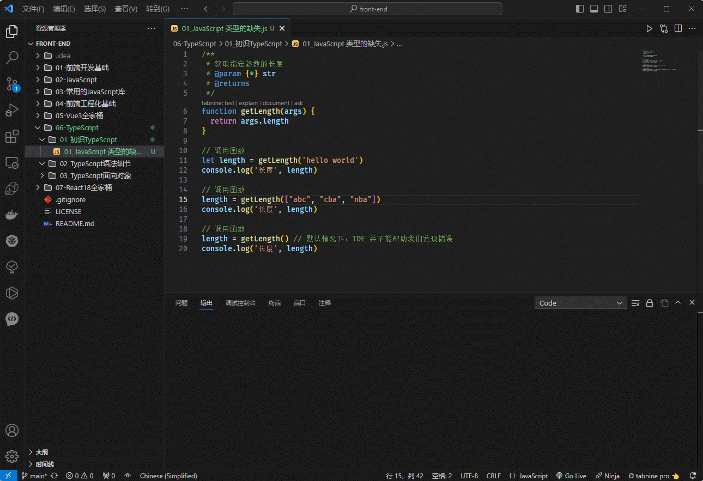

> 注意⚠️：
>
> * ① 本人是在 `VSCode` 中安装了 `Code Runner` 插件，才可以通过`右键`直接运行 JavaScript 。
> * ② 如果没有安装，请使用 `node xxx.js` 命令执行 JavaScript。

* 当然，如果是 TypeScript ，就能做到这一点，甚至可以做到`编写代码`的时候就能发现错误，即：

```ts {19}
/**
 * 获取指定参数的长度
 * @param {*} args 
 * @returns 
 */
function getLength(args: string | any[]) {
  return args.length
}

// 调用函数
let length = getLength('hello world')
console.log('长度', length)

// 调用函数
length = getLength(["abc", "cba", "nba"])
console.log('长度', length)

// 调用函数
length = getLength() // TypeScript 可以帮助我们发现错误
console.log('长度', length)


export { }
```

* 通过 VSCode ，我们就可以发现 TypeScript 可以帮助我们提前找出问题：

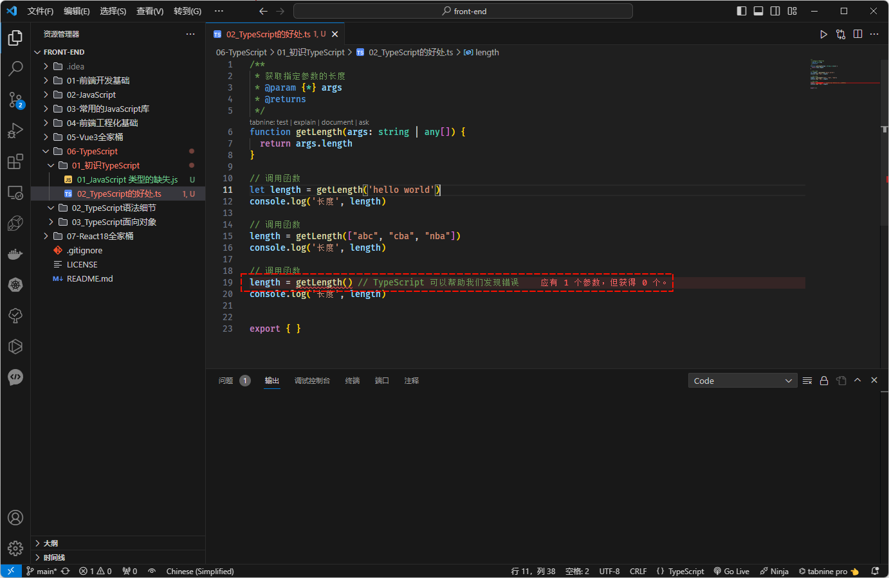

> 注意⚠️：本人是安装了 `Error Lens` 插件，才会出现如上的效果。

## 1.3 类型思维的缺失

* JavaScript 类型思维的缺失是指 JavaScript 开发人员在编写代码时，往往不考虑或不重视代码中的类型。这可能会导致代码难以理解、难以维护，甚至导致运行时错误。

* JavaScript 类型思维的缺失主要有以下几个原因：

  - **JavaScript 是一种弱类型语言**：JavaScript 不会对变量或表达式的类型进行检查，也不会强制执行类型转换。这使得 JavaScript 非常灵活，但也容易出错。
  - **JavaScript 的动态类型系统**：JavaScript 是一种动态类型语言，这意味着变量的类型可以在运行时改变。这使得 JavaScript 非常灵活，但也容易导致类型错误。
  - **JavaScript 开发人员的习惯**：许多 JavaScript 开发人员习惯于编写不考虑类型或不重视类型的代码。这可能是因为 JavaScript 最初设计为一种脚本语言，而不是一种编译语言。脚本语言通常不需要严格的类型检查，因为它们通常用于编写小型程序或脚本，这些程序或脚本不需要严格的类型检查。

* JavaScript 类型思维的缺失可能会导致以下问题：

    - **代码难以理解和维护**：当代码中没有明确的类型信息时，其他开发人员很难理解和维护代码。这可能会导致代码维护成本增加，并降低代码质量。

    - **类型错误**：JavaScript 是一种弱类型语言，这意味着它不会对变量或表达式的类型进行检查。这可能会导致类型错误，例如将字符串与数字相加。类型错误可能会导致运行时错误，甚至导致应用程序崩溃。

    - **安全问题**：JavaScript 类型思维的缺失可能会导致安全问题。例如：如果开发人员没有正确地对用户输入进行类型检查，那么攻击者可能会利用类型错误来注入恶意代码。

> 温馨提示ℹ️：很多人经常说 `JavaScript 不适合开发大型项目`，其原因是：当项目庞大起来，这种宽松的类型约束会带来非常多的安全隐患，并且开发人员之间也没有良好的类型契约。

## 1.4 JavaScript 添加类型约束的方案

* 为了弥补 JavaScript 类型约束上的缺陷，很多公司都推出了自己的解决方案：
  * 2014 年，Facebook 公司推出了 `Flow` 来对 JavaScript 进行类型检查。
  * 同年，Microsoft 公司也推出了 `TypeScript` 来对 JavaScript 进行类型检查。

* 当然，目前来说，`TypeScript 已经完全胜出`，如：
  * Vue 3.x 已经完全转向了 TypeScript 。
  * React 也可以很好的和 TypeScript 结合。
  * Angular 很早就使用 TypeScript 进行项目重构，并使用 TypeScript 进行开发。

> 温馨提示ℹ️：`TypeScript` 已经是 JavaScript 类型检查上`事实的标准`。


# 第二章：初识 TypeScript

## 2.1 概述

* TypeScript 官方对自己的定义，如下所示：

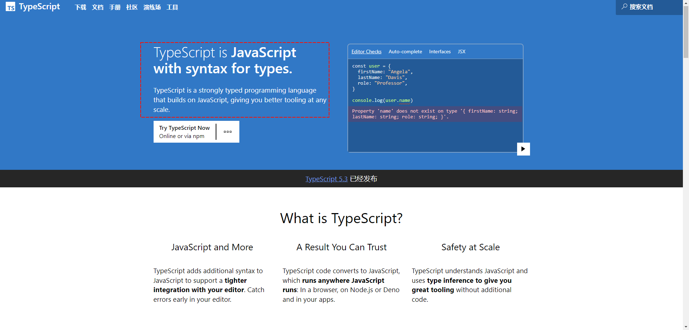

> 温馨提示ℹ️：翻译为中文就是
>
> * `TypeScript 是带有类型语法的 JavaScript。`
> * `TypeScript 是一种基于 JavaScript 构建的强类型编程语言，可在任何规模下为您提供更好的工具`。

* 如何理解？
  * `TypeScript 就是 JavaScript 的超集（始于 JavaScript ，最终归于 JavaScript）`。
  * `JavaScript 拥有的所有特性，TypeScript 全部支持`，并且 TypeScript `紧跟` ECMAScript 的标准，所以 ES6、ES7……等新语言的标准，TypeScript 也是支持的。
  * `TypeScript 在实现新特性的同时，总是保持和 ECMAScript  标准的同步甚至是领先。`
  * `TypeScript 在语言层面上，不仅仅增加了类型约束，而且还包括了一些语法的扩展，如：枚举，元组等。`
  * 当然，`最终 TypeScript 还会被编译为 JavaScript`，所以我们并不需要担心它的兼容性问题，并且在编译的时候也可以不借助 Babel 等工具。

## 2.2 TypeScript 的特点

* ① TypeScript 向 JavaScript 添加了额外的语法，以支持与编辑器更紧密的集成，并尽早在编辑器中发现错误。
* ② TypeScript 代码转换为 JavaScript，可在 JavaScript 运行的任何位置运行：在浏览器中、在 Node.js 或 Deno 上以及在您的应用程序中。
* ③ TypeScript 理解 JavaScript 并使用类型推断为我们提供出色的工具，而无需额外的代码。

## 2.3 安装 TypeScript（⭐）

### 2.3.1 概述

* 学过 Java 的都知道，要运行 Java 应用程序，需要经历如下的步骤：


* 同理，要运行 TypeScript ，也需要经历类似的步骤：

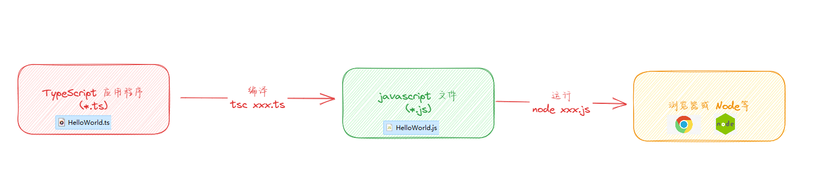

### 2.3.2 安装

* 查询 Volta ：

```shell
winget search volta
```

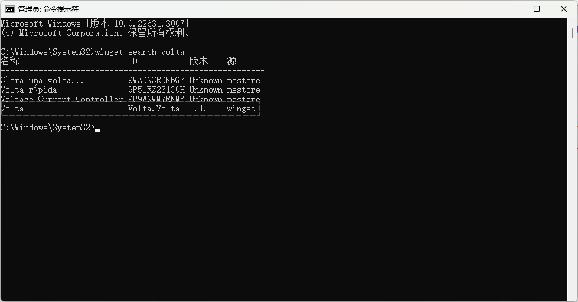

> 注意⚠️：
>
> * ① 本人是在 Volta 的基础上进行 TypeScript 安装的。
> * ② Volta 可以帮助我们管理 node、npm、typescript 等工具，还能帮助我们切换 node 的版本。
> * ③ 在 win 操作系统上，需要使用`超级管理员`的权限来运行 winget 命令。

* 安装 volta ：

```shell
winget install --id Volta.Volta
```


* 安装 node 、npm 、typescript ：

```shell
volta install node npm typescript
```


* 查询是否安装成功：

```shell
volta list
```

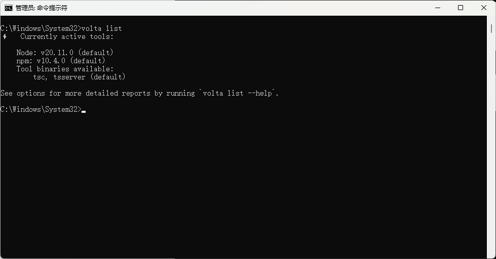

* 查看 TypeScript 的版本：

```shell
tsc -v
```

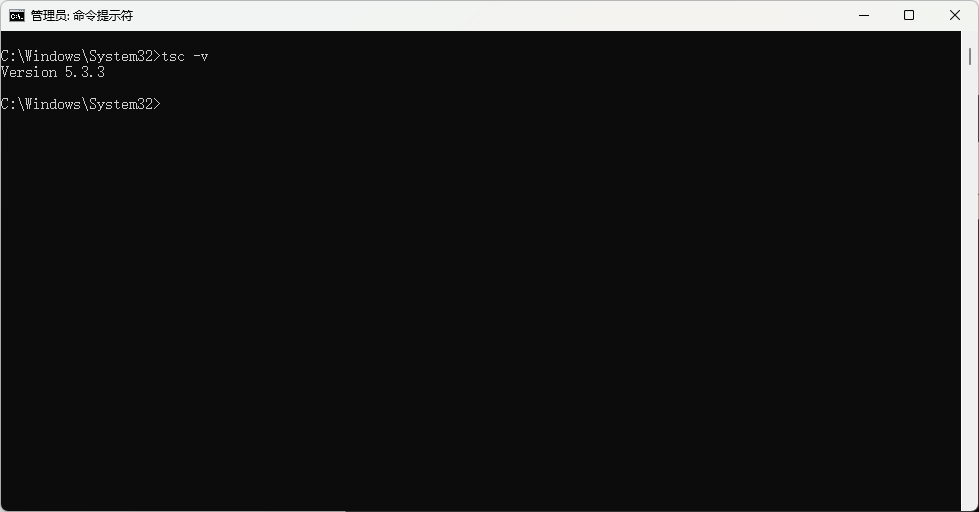

### 2.3.3 TypeScript 的使用

* 使用步骤：
  * ① 通过 `tsc` 将 TypeScript 代码编译为 JavaScript 代码。
  * ② 通过`浏览器`或 `node` 运行 JavaScript 代码。


* 示例：

```ts
const name:string = "HelloWorld"

console.log(name)

export {}
```

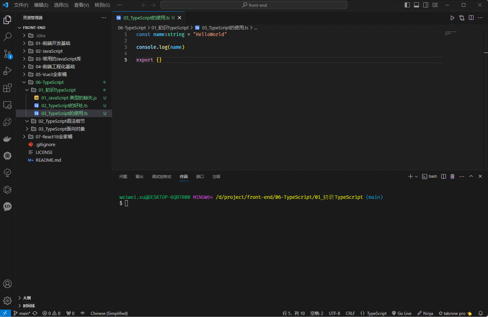

### 2.3.4 简化 TypeScript 使用步骤

* 上述的步骤，实现是太麻烦了，其实是可以直接一步运行 TypeScript 的，方案如下：
  * ① 通过 webpack 等脚手架，配置本地的 TypeScript 编译环境。
  * ② 通过 `ts-node` 库，为 TypeScript 的运行提供环境。
  * ③ 通过 `Code Runner` 插件，直接`右键`运行（也需要安装 `ts-node`）。
* 安装 ts-node ：

```shell
volta install ts-node tslib @types/node
```


* 示例：

```ts
const name:string = "HelloWorld"

console.log(name)

export {}
```

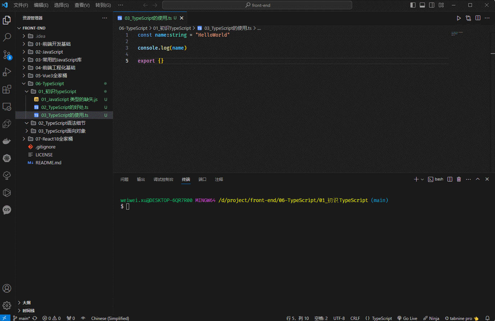


* 示例：

```ts
const name:string = "HelloWorld"

console.log(name)

export {}
```

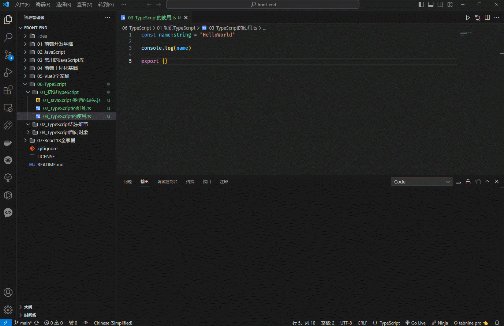


# 第三章：TypeScript 数据类型（⭐）

## 3.1 概述

* 回顾 JavaScript 内置的数据类型，如下所示：


> 注意⚠️：
>
> * ① 上图中的数据类型的划分是按照是否是`引用类型`的标准来划分的。
> * ② 我们知道`数组`、`函数`、`日期`等都属于`对象`类型；所以，也可以将 JavaScript 中的类型划分为：`Number`、`String`、`BigInt`、`Boolean`、`Symbol`、`Null`、`Undefined` 和 `Object` ，也有人称这些是 JavaScript 的`内置类型`。

* 对于 JavaScript 的内置类型，TypeScript 也提供了对应的`类型注解`：
  * `number`
  * `string`
  * `bigint`
  * `boolean`
  * `symbol`
  * `null`
  * `undefined`
  * `object`

* 当然，还有其它的`类型注解`，如：
  * `unknown`：顶部类型。
  * `never`：底部类型。
  * `object literal` ，如：`{ property: Type }`
  * `void`：没有记录返回值的函数。
  * `T[]`：可变数组，也写成 `Array<T>`。
  * `[T, T]`：元组，长度固定但可变。
  * `(t: T) => U`：functions 函数。

* 那么，`类型注解`（Type Annotation）是什么？

  * TypeScript 中的`类型注解`是一种在代码中添加`类型信息`的`注释`。类型注解可以帮助开发人员理解代码中的类型，并可以帮助 TypeScript 编译器检测类型错误。
  * 语法：

  ```ts
  // 其中，type 就是类型注解
  let/const variable: type 
  ```

* 其对应的图示如下：

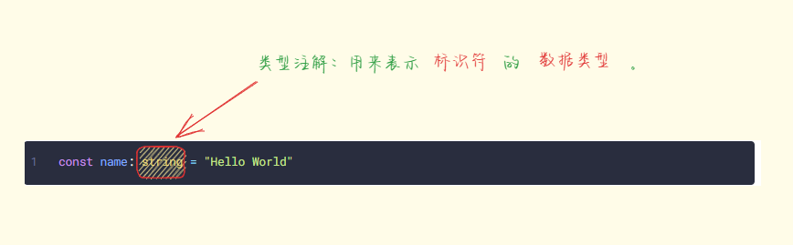

## 3.2 变量的声明

* 语法：

```ts
let/const 标识符: 数据类型 = 值
```

* 只要声明了`数据类型`，TypeScript 就会自动检测，并且声明的类型也可以称为`类型注解`。


* 示例：

```ts {2-4}
// 定义标识符
let name: string = "HelloWorld"
const age: number = 18
const height: number = 1.78

// 给标识符赋值
name = "呵呵哒"

console.log(name, age, height)

export { }
```

## 3.3 变量的类型推断（推导，Infer）

* `类型推断`是 TypeScript 的一项重要特性，它允许编译器根据`变量`的`赋值`或`上下文`来`推断`其类型。这使得 TypeScript 代码更加简洁和易读，并且可以帮助防止类型错误。

* 类型推断通常用于下面的场景：

  * ① 声明变量并初始化：

  ```ts
  let age = 18
  ```

  * ② 决定函数的返回值：

  ```ts
  function add(num1: number,num2: number ) {
      return num1 + num2;
  }
  ```
  
  * ③ 匿名函数的参数：
  
  ```ts {3}
  const nums: number[] = [1, 2, 3, 4]
  
  nums.forEach(item => { // 匿名函数的参数无需设置类型注解
    console.log(item)
  })
  
  export {}
  ```

> 注意⚠️：
>
> * ① 官方文档提到：在大多数情况下，类型注解并不是必需的。只要有可能，TypeScript 都会尝试自动推断代码中的类型。例如：变量的类型是根据其初始值设定项的类型推断的。
> * ② 类型推断并不是万能的。在某些情况下，编译器可能无法推断出变量的类型。此时，我们就需要显式地指定变量的类型。
> * ③ `let` 进行`类型推断`的时候，推断出来的类型是`通用类型`，如：number、string 等；而 `const` 进行`类型推断`的时候，推断出来的是`字面量类型`，主要用于`元组类型`。


* 示例：

```ts
let name = "abc"
let age = 20
let height = 1.88

name = "bca"

console.log(name, age, height)

export { }
```

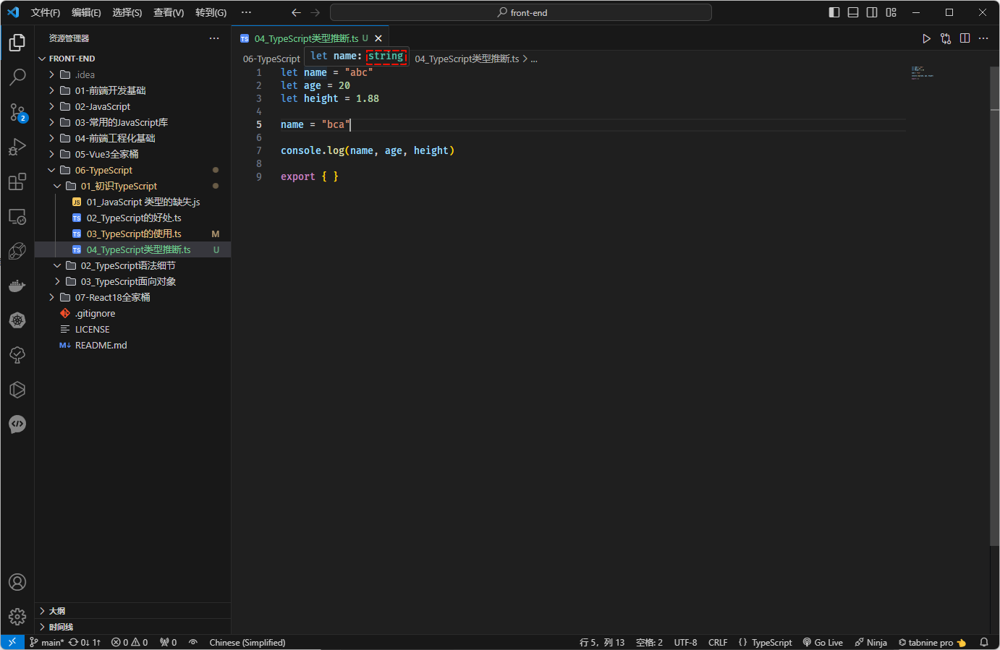


* 示例：

```ts
const age = 18

console.log(age)

export {}
```

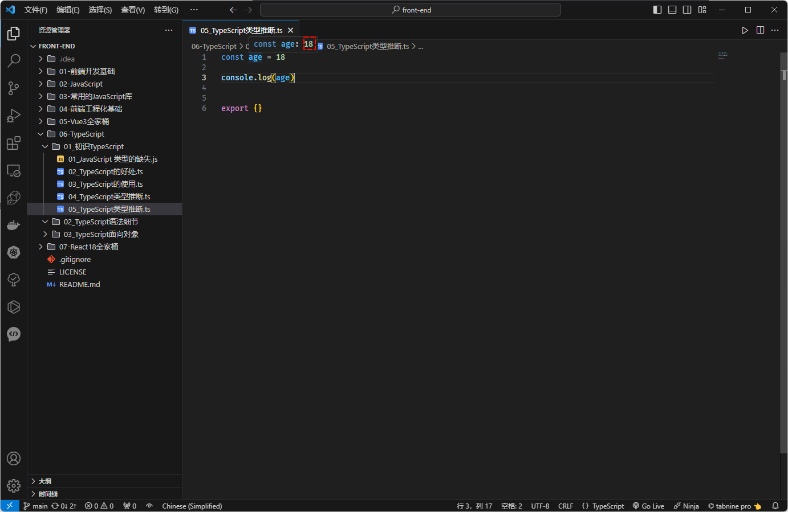

## 3.4 内置类型

* 前面提到，对于 JavaScript 的`内置类型`，TypeScript 也提供了对应的`类型注解`：
  * `number`
  * `string`
  * `bigint`
  * `boolean`
  * `symbol`
  * `null`
  * `undefined`
  * `object`

> 注意⚠️：
>
> * ① 日常开发的时候，number、string、boolean 用的最多！！！
> * ② 如果一个对象声明是 `object` 类型，那么既不能读取属性，也不能设置属性，因为声明了 object 类型就类似于将其标注为 `{}` ；换言之，`object` 类型注解在实际开发中不常用。
> * ③ 如果一个对象想要读取属性或设置属性，就需要这么设置：`const obj: {name:string,age: number} = {name:"abc",age: 18}` ；当然，也可以让 TS 自动推断，即：`const obj = {name:"abc",age: 18}`。


* 示例：

```ts {2,4,6}
// number 类型
let a: number = 10
// string 类型
let b: string = "hello"
// boolean 类型
let c: boolean = true
// null 类型
let d: null = null
// undefined 类型
let e: undefined = undefined
// symbol 类型
let f: symbol = Symbol()
// object 类型
let g: object = { "name": "abc", "age": 20, "height": 1.88 }


console.log(a, b, c, d, e, f, g)

export { }
```

## 3.5 数组类型

* 对于数组类型，TypeScript 提供了两种写法：

```ts
const nums: number[] = [1,2,3]
```

```ts
const nums: Array<number> = [1,2,3]
```

> 注意⚠️：
>
> * ① 如果想要数组中包含任何类型的数据，就使用 `any[]` 或`联合类型`。
> * ② `Array<number>`是泛型的写法，后面讲解！！！
> * ③ 在实际开发中，数组中一般包含相同类型的数据，像一些编程语言，如：Java 等，就是禁止数组中包含不同数据类型的数据。


* 示例：

```ts {2,7}
// 定义数组方式①
const arr: number[] = [1, 2, 3]
arr.push(...[4, 5, 6])
console.log(arr)

// 定义数组方式②
const arr2: Array<number> = [1, 2, 3]
arr2.push(...[4, 5, 6])
console.log(arr2)

export { }
```

## 3.6 函数类型

### 3.6.1 概述

* 函数在 JavaScript 传递数据的主要方式，函数中最重要的就是参数和返回值了。
* TypeScript 允许我们`指定`函数的`参数类型`和`返回值类型`。

### 3.6.2 函数参数类型

* TypeScript 允许我们在声明函数的时候，在`每个参数`的`后面`为其`添加`类型注解，以声明函数接收的参数类型；并且，函数的参数`类型注解`在参数名称之后，如：

```ts
function foo(name: string) {
    ...
}
```

> 注意⚠️：
> 
> * ① 如果`没有`明确的给`函数的参数`设置类型注解，默认是 `any` 类型。
> * ② 实际开发中，我们一般都会给函数的参数设置类型注解。


* 示例：

```ts {7}
/**
 * 求和
 * @param num1 {number} 数值类型
 * @param num2 {number} 数值类型
 * @returns 
 */
function sum(num1: number, num2: number) {
  return num1 + num2
}

let result = sum(1, 2)
console.log(result)

export { }
```

### 3.6.3 函数返回值类型

* 通常而言，我们并不需要给函数的`返回值`设置`类型注解`，因为 TypeScript 可以根据函数的 return 语句来自动推断出函数的返回值类型。
* 但是，某些情况下，我们可能会显示的指定函数返回值的类型，用于文档目的或处于个人偏好等，如：

```ts
function foo(name: string) : string{
    ...
    return "abc"
}
```

> 注意⚠️：
> 
> * ① 如果一个函数没有 return 语句或者 `return ;`，那么 TS 将会将函数的返回值推断为 void 。
> * ② 如果某些函数返回的是 Promise 类型，就可以将函数的返回值类型设置为 `Promise<?>`，也可以让 TS 自动推断 。


* 示例：

```ts {7}
/**
 * 求和 
 * @param num1 {number} 数值类型
 * @param num2 {number} 数值类型
 * @returns {number} 数值类型
 */
function sum(num1: number, num2: number): number {
  return num1 + num2
}

let result = sum(1, 2)
console.log(result)

export { }
```


* 示例：

```ts {1}
async function foo(): Promise<number> {
  const promise = new Promise<number>((resolve, reject) => {
    setTimeout(() => {
      resolve(1)
    }, 1000)
  })
  return promise
}

foo().then(res => console.log(res))

export { }
```

### 3.6.4 匿名函数

* 匿名函数和声明函数（function 关键字定义的函数）不同，当一个函数出现在 TypeScript 可以确定如何调用它的位置的时候，该函数的参数会被自动赋予类型。
* 换言之，在匿名函数中，我们并`不需要`给匿名函数的`参数`设置`类型注解`。


* 示例：

```ts {3}
const nums: number[] = [1, 2, 3, 4]

nums.forEach(item => { // 匿名函数的参数无需设置类型注解
  console.log(item)
})

export {}
```

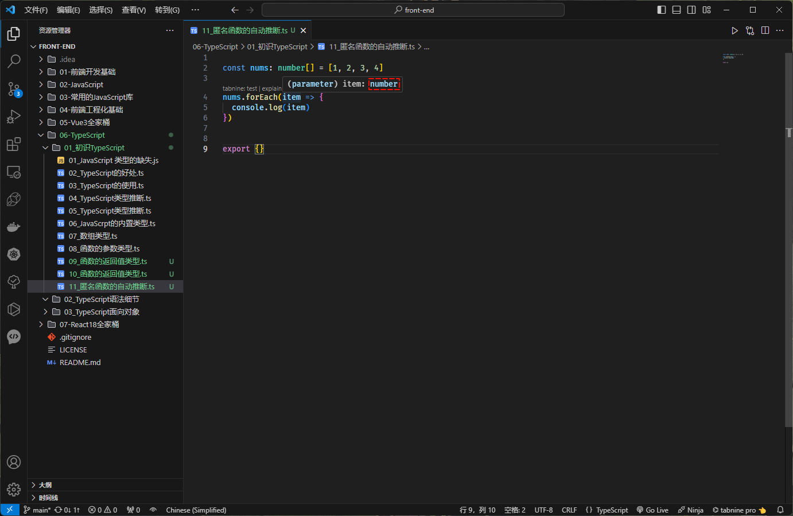

## 3.7 对象类型

* 在实际开发中，我们最常见的类型可能就是对象类型了，要定义对象类型，我们只需要列出其属性及其类型即可，如：

```ts
const obj: { name: string,age: number} = { name: '', age: 18 }
```

> 注意⚠️：
>
> * ① 在对象类型中，我们可以使用 `,` 或 `;` 来分隔，并且最后一个分隔符是可选的。
> * ② 在对象类型中，如果某个属性是可选的，只需要在属性名称后面添加 `?` 即可。
> * ③ 在对象类型中，我们可以对属性和值进行换行，这样就可以省略 `,` 或 `;`分隔符。


* 示例：

```ts {1-5}
const obj: { // 对象类型
  name: string
  age: number
  height?: number
}
  = { name: '许大仙', age: 18 }

console.log(obj.name, obj.age, obj.height) // 许大仙 18 undefined

export { }
```


* 示例：

```ts
function printCoord(pt: { x: number; y: number }) {
  console.log("The coordinate's x value is " + pt.x);
  console.log("The coordinate's y value is " + pt.y);
}
printCoord({ x: 3, y: 7 })

export { }
```


* 示例：

```ts {6-8,10}
function printName(obj: { firstName: string, lastName?: string }) {
  console.log(obj.firstName, obj.lastName)

  // undefined.xxx() 方法会直接报错，可以只用 if 语句判断或 ?

  if (obj.lastName) {
    console.log(obj.lastName?.toUpperCase())
  }

  console.log(obj.lastName?.toUpperCase())
}

printName({ firstName: 'a', lastName: 'bb' })
printName({ firstName: 'a' })  

export {}
```

## 3.8 any 类型

* 在某些情况下，我们`无法确定一个变量的类型`，并且`它可能会发生变化`，此时我们就可以使用 `any` 类型。
* any 类型的出现，让 TS 回到了 JS：
  * `我们可以对 any 类型的变量进行任意的操作，如：获取不存在的属性或方法的`。
  * `我们也可以给一个 any 类型的变量赋值任何的值，如：数字、布尔等`。

> 注意⚠️：
>
> * ① 某些情况，在 TS 中处理类型的时候，过于繁琐，我们就可以使用 any 类型。
> * ② 在使用一些第三方库的时候，缺失类型注解，我们也可以使用 any 类型；甚至，Vue 源码中，也会使用 any 类型来进行某些类型的适配。


* 示例：

```ts {1}
let n: any = "abc"

n = 1 
n = true
n = {}

console.log(n)

export {}
```


* 示例：

```ts {1}
const arr: any[] = [1, null, true, {}]

console.log(arr.length)

export {}
```

## 3.9 unknown 类型

* 类型 `unknown` 表示任何值。这与类型 `any` 类似，但更安全，因为对 `unknown` 值执行任何操作都是不合法的。
* `unknown` 类型可以被赋值为任何具体类型的值，但是不能被用于任何操作，`除非我们明确地对其进行类型检查或类型断言`。
* `unknown` 类型通常用于以下场景：
  - ① 当我们不知道一个变量的类型时，或者当我们想让一个变量能够存储任何类型的值时。
  - ② 当我们从一个不安全的源（例如，用户输入）获取数据时，或者当我们处理来自第三方库或 API 的数据时。
  - ③ 当我们想在运行时检查一个变量的类型并根据其类型执行不同的操作时。
* 通常而言，`unknown` 类型用来描述函数的`参数类型`，即：

```ts
function bar(args: unknown) {
  if (typeof args === "string") { // 类型缩小
    console.log(args.length)
  } else if (typeof args === "number") {
    console.log(args.toFixed(2))
  } else if (typeof args === "boolean") {
    console.log(args)
  }
}
```

* 当然，我们也可以用来描述函数的返回值（未知类型），即：

```ts
function safeParse(s: string): unknown {
  return JSON.parse(s);
}

const obj = safeParse("{name: \"John\", age: 30}");
```


* 示例：

```ts {8,11-17}
// `unknown` 类型可以被赋值为任何具体类型的值，但是不能被用于任何操作，除非我们明确地对其进行类型检查或类型断言。
let foo: unknown = "bar"

foo = 1

foo = true

console.log(foo.length)

// 除非我们明确地对其进行类型检查或类型断言。
if (typeof foo === "string") { // 类型缩小
  console.log(foo.length)
} else if (typeof foo === "number") {
  console.log(foo.toFixed(2))
} else if (typeof foo === "boolean") {
  console.log(foo)
} 

export { }
```

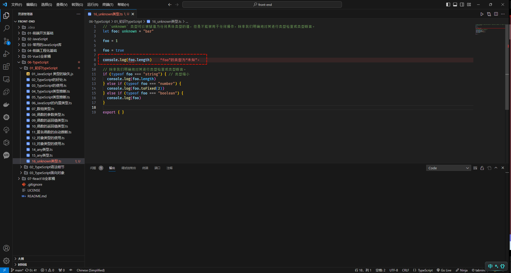

## 3.10 void 类型

* `void` 表示不返回值的函数的返回值。
* 每当函数没有任何语句，或者不从这些返回 `return` 语句中返回任何显式值时，TS 将推断为 `void` 类型。


* 示例：

```ts
function sum(num1: number, num2: number) {
  console.log(num1 + num2)
}

sum(1, 2)

export { }
```

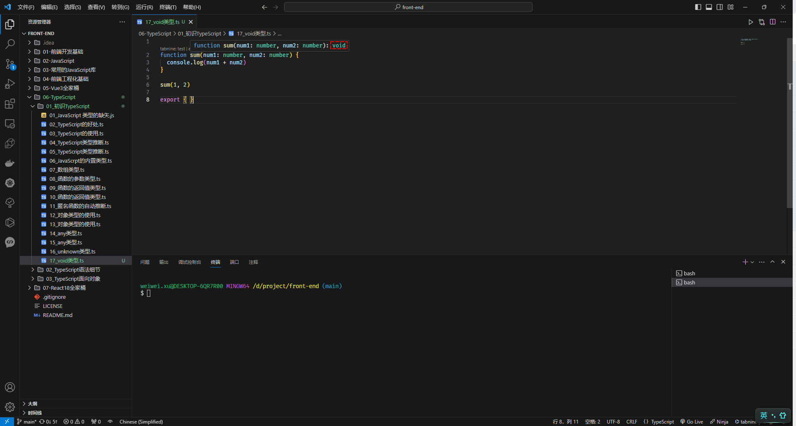


* 示例：

```ts {3}
function sum(num1: number, num2: number) {
  if (num2 == 0) {
    return
  }
  console.log(num1 + num2)
}

sum(1, 2)

export { }
```

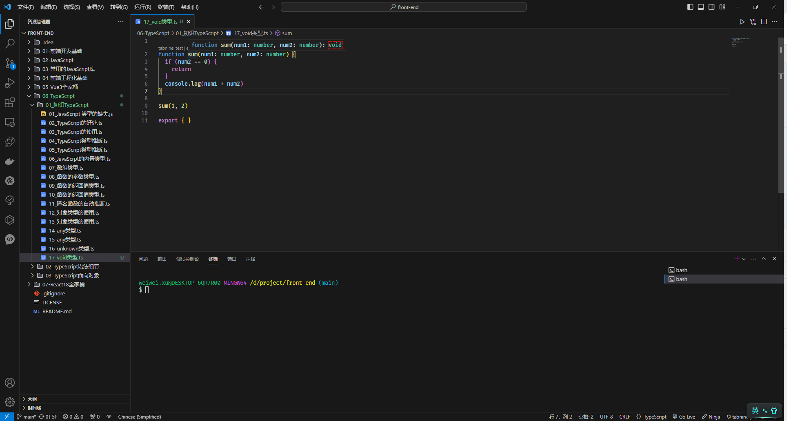
