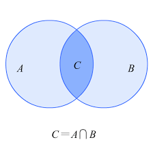
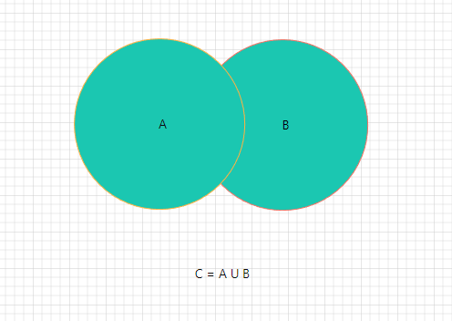

# 第一章：联合类型和交叉类型

## 1.1 扫清概念

* `交集`是指两个集合中都包含的元素组成的集合。例如：`集合 A = {1, 2, 3, 4, 5}` 和`集合 B = {3, 4, 5, 6, 7}` 的`交集`是 `C = {3, 4, 5}`。



> 注意⚠️：在编程中，通常使用`逻辑与`（`&`）来表示`交集`的关系。

* `并集`是指两个集合中包含的所有元素组成的集合。例如：`集合 A = {1, 2, 3, 4, 5}` 和集合 `B = {3, 4, 5, 6, 7}` 的`并集`是 `D = {1, 2, 3, 4, 5, 6, 7}`。



> 注意⚠️：在编程中，通常使用`逻辑或`（`|`）来表示`并集`的关系。

## 1.2 联合类型

### 1.2.1 概述

* TS 的类型系统`允许`我们`使用`各种`运算符`从`现有类型`中`构建新类型`。
* `联合类型`（Union Tpye）是由`两个`或`多个其他类型`组成的`类型`，表示`可以是其中任何一种类型的值`。我们将这些类型中的`每一种`都称为`联合成员`（union’s members）。

### 1.2.2 定义联合类型

* 定义联合类型很简单，只需要使用 `|` 来组合类型即可。


* 示例：

```ts {1}
let x: string | number; // 定义联合类型

x = "123"

x = "abc"

export { }
```


* 示例：

```ts {1}
function print(x: string | number) { // 定义联合类型
  
}

print(123);
print("abc")

export { }
```

### 1.2.3 使用联合类型

* `提供和联合类型匹配的值很简单，只需要保证是符合联合类型中任意类型的值即可`。
* 但是，如果有一个联合类型的值，我们该怎么去使用它？通常，我们会使用`类型缩小`来让 TS 根据代码结构，推断出值更加具体的类型。

> 注意⚠️：在 TS 中`类型缩小`有很多种，后面将会一一讲解。


* 示例：

```ts {2-6}
function print(x: string | number) { // 定义联合类型
  if (typeof x === "string") { // 类型缩小
    console.log("x", x.toUpperCase())
  } else if (typeof x === "number") { // 类型缩小
    console.log("x", x * 2)
  }
}

print(123);
print("abc")

export { }
```


* 示例：

```ts {2-6}
function print(x: string | number[]) { // 定义联合类型
  if (Array.isArray(x)) { // 类型缩小
    console.log("x", x.map(item => item * 2))
  } else {
    console.log("x", x)
  }
}

print([1, 2]);
print("abc")

export { }
```

## 1.3 交叉类型

### 1.3.1 前提

* 请先将`<<第二章：type 和 interface>>` 看完，再返回这里，继续看交叉类型。


# 第二章：type 和 interface

## 2.1 type（类型别名）

* 之前，我们一直在`类型注解`中使用`对象类型`或`联合类型`；但是，如果我们要在很多地方使用，就需要编写很多次，显得非常重复。
* 此时，就可以使用 `type`（类型别名）来简化编写。


* 示例：

```ts {1-5}
type ObjType = { // 类型别名，用来简化对象类型
  name: string
  age: number
  height?: number
}

const obj: ObjType = {
  name: "abc",
  age: 123
}

console.log(obj.name, obj.age, obj?.height)

export { }
```


* 示例：

```ts {1-5}
type PointType = { // 类型别名，用来简化对象类型
  x: number
  y: number
  z?: number
}

function print(point: PointType) {
  console.log(point.x, point.y, point?.z)
}

print({ x: 1, y: 2 })

export { }
```


* 示例：

```ts {1}
type IDType = number | string // 类型别名，用来简化联合类型

function print(id: IDType) {
  if (typeof id === "number") {
    console.log(id.toFixed(2))
  } else if (typeof id === "string") {
    console.log(id.toUpperCase())
  }
}

print(123)
print("abc")

export { }
```

## 2.2 interface（接口）

* 对于`对象类型`，我们也可以使用 `interface` 接口来声明。


* 示例：

```ts {1-5}
interface PointType { // 接口，用来简化对象类型
  x: number
  y: number
  z?: number
}

function print(point: PointType) {
  console.log(point.x, point.y, point?.z)
}

print({ x: 1, y: 2 })

export { }
```


* 示例：

```ts
interface ObjType { // 接口，用来简化对象类型
  name: string
  age: number
  height?: number
}

const obj: ObjType = {
  name: "abc",
  age: 123
}

console.log(obj.name, obj.age, obj?.height)

export { }
```

## 2.3 type VS interface

* ① `type` 类型别名可以用来简化`对象类型`和`联合类型`；但是，`interface` 接口只能用来简化`对象类型`。
* ② `type` 类别别名是通过`交叉类型`来`扩展类型`的；而 `interface` 接口是通过 `extends` 关键字来`扩展类型`的，即：

```ts {5}
type Animal = {
  name: string
}

type Bear = Animal & {
  honey: boolean
}

const bear: Bear = {
  name: "许大仙",
  honey: true
}

console.log(bear.name, bear.honey)

export {}
```

```ts {5}
interface Animal  {
  name: string
}

interface Bear extends Animal{
  honey: boolean
}

const bear: Bear = {
  name: "许大仙",
  honey: true
}

console.log(bear.name, bear.honey)

export {}
```

* ③ `type` 类型别名在`定义之后`，`无法更改`（无法被重新打开来添加属性）；而 interface 接口是可以的，即：

```ts {5}
type Animal  = {
  title: string
}

type Animal  = { // 报错，标识符 Animal 重复定义
  age: number
}
```

```ts {5}
interface Animal {
  title: string
}

interface Animal   { // 没有报错
  age: number
}
```


# 第三章：类型断言和非空断言


# 第四章：字面量类型和类型缩小


# 第五章：函数的类型和函数签名


# 第六章：函数的重载和 this 类型