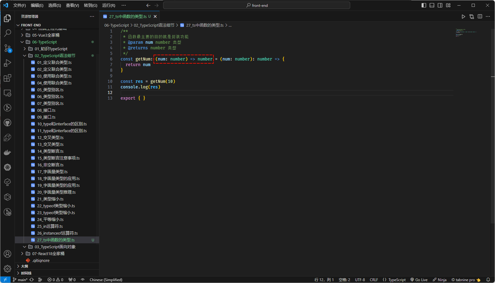

# 第一章：联合类型和交叉类型

## 1.1 扫清概念

* `交集`是指两个集合中都包含的元素组成的集合。例如：`集合 A = {1, 2, 3, 4, 5}` 和`集合 B = {3, 4, 5, 6, 7}` 的`交集`是 `C = {3, 4, 5}`。


> 注意⚠️：在编程中，通常使用`逻辑与`（`&`）来表示`交集`的关系。

* `并集`是指两个集合中包含的所有元素组成的集合。例如：`集合 A = {1, 2, 3, 4, 5}` 和集合 `B = {3, 4, 5, 6, 7}` 的`并集`是 `D = {1, 2, 3, 4, 5, 6, 7}`。


> 注意⚠️：在编程中，通常使用`逻辑或`（`|`）来表示`并集`的关系。

## 1.2 联合类型

### 1.2.1 概述

* TS 的类型系统`允许`我们`使用`各种`运算符`从`现有类型`中`构建新类型`。
* `联合类型`（Union Tpye）是由`两个`或`多个其他类型`组成的`类型`，表示`可以是其中任何一种类型的值`。我们将这些类型中的`每一种`都称为`联合成员`（union’s members）。

### 1.2.2 定义联合类型

* 定义联合类型很简单，只需要使用 `|` 来组合类型即可。


* 示例：

```ts {1}
let x: string | number; // 定义联合类型

x = "123"

x = "abc"

export { }
```


* 示例：

```ts {1}
function print(x: string | number) { // 定义联合类型
  
}

print(123);
print("abc")

export { }
```

### 1.2.3 使用联合类型

* `提供和联合类型匹配的值很简单，只需要保证是符合联合类型中任意类型的值即可`。
* 但是，如果有一个联合类型的值，我们该怎么去使用它？通常，我们会使用`类型缩小`来让 TS 根据代码结构，推断出值更加具体的类型。

> 注意⚠️：在 TS 中`类型缩小`有很多种，后面将会一一讲解。


* 示例：

```ts {2-6}
function print(x: string | number) { // 定义联合类型
  if (typeof x === "string") { // 类型缩小
    console.log("x", x.toUpperCase())
  } else if (typeof x === "number") { // 类型缩小
    console.log("x", x * 2)
  }
}

print(123);
print("abc")

export { }
```


* 示例：

```ts {2-6}
function print(x: string | number[]) { // 定义联合类型
  if (Array.isArray(x)) { // 类型缩小
    console.log("x", x.map(item => item * 2))
  } else {
    console.log("x", x)
  }
}

print([1, 2]);
print("abc")

export { }
```

## 1.3 交叉类型

### 1.3.1 前提

* 请先将`<<第二章：type 和 interface>>` 看完，再返回这里，继续看交叉类型。

### 1.3.2 交叉类型

* `交叉类型`：表示两种（或多种类型）同时满足，并且交叉类型使用 `&` 符号。

>  注意⚠️：
>
> * ① `type MyType = number & string` 就是错误的，因为不可能有值既满足 number 类型又满足 string 类型。
> * ② 在实际开发中，交叉类型通常用来进行 `type` 类型别名的`扩展类型`，也可以对`对象类型`进行`扩展使用`。


* 示例：

```ts {5}
type Animal = {
  name: string
}

type Bear = Animal & { // 交叉类型，用于对 type 类型进行扩展类型
  honey: boolean
}

const bear: Bear = {
  name: "许大仙",
  honey: true
}

console.log(bear.name, bear.honey)

export {}
```


* 示例：

```ts {9}
interface IPerson {
  name: string
}

interface IRun {
  running: () => void
}

const obj: IPerson & IRun = { // 交叉类型，对`对象类型`进行`扩展使用`
  name: "许大仙",
  running: () => {
    console.log("跑步....")
  }
}

console.log(obj.name)
obj.running()

export {}
```


# 第二章：type 和 interface

## 2.1 type（类型别名）

* 之前，我们一直在`类型注解`中使用`对象类型`或`联合类型`；但是，如果我们要在很多地方使用，就需要编写很多次，显得非常重复。
* 此时，就可以使用 `type`（类型别名）来简化编写。


* 示例：

```ts {1-5}
type ObjType = { // 类型别名，用来简化对象类型
  name: string
  age: number
  height?: number
}

const obj: ObjType = {
  name: "abc",
  age: 123
}

console.log(obj.name, obj.age, obj?.height)

export { }
```


* 示例：

```ts {1-5}
type PointType = { // 类型别名，用来简化对象类型
  x: number
  y: number
  z?: number
}

function print(point: PointType) {
  console.log(point.x, point.y, point?.z)
}

print({ x: 1, y: 2 })

export { }
```


* 示例：

```ts {1}
type IDType = number | string // 类型别名，用来简化联合类型

function print(id: IDType) {
  if (typeof id === "number") {
    console.log(id.toFixed(2))
  } else if (typeof id === "string") {
    console.log(id.toUpperCase())
  }
}

print(123)
print("abc")

export { }
```

## 2.2 interface（接口）

* 对于`对象类型`，我们也可以使用 `interface` 接口来声明。


* 示例：

```ts {1-5}
interface PointType { // 接口，用来简化对象类型
  x: number
  y: number
  z?: number
}

function print(point: PointType) {
  console.log(point.x, point.y, point?.z)
}

print({ x: 1, y: 2 })

export { }
```


* 示例：

```ts
interface ObjType { // 接口，用来简化对象类型
  name: string
  age: number
  height?: number
}

const obj: ObjType = {
  name: "abc",
  age: 123
}

console.log(obj.name, obj.age, obj?.height)

export { }
```

## 2.3 type VS interface

* ① `type` 类型别名可以用来简化`对象类型`和`联合类型`；但是，`interface` 接口只能用来简化`对象类型`。
* ② `type` 类别别名是通过`交叉类型`来`扩展类型`的；而 `interface` 接口是通过 `extends` 关键字来`扩展类型`的，即：

```ts {5}
type Animal = {
  name: string
}

type Bear = Animal & {
  honey: boolean
}

const bear: Bear = {
  name: "许大仙",
  honey: true
}

console.log(bear.name, bear.honey)

export {}
```

```ts {5}
interface Animal  {
  name: string
}

interface Bear extends Animal{
  honey: boolean
}

const bear: Bear = {
  name: "许大仙",
  honey: true
}

console.log(bear.name, bear.honey)

export {}
```

* ③ `type` 类型别名`不允许两个相同名称的别名同时存在`；而 interface 接口是可以的，即：

```ts {5}
type Animal  = {
  title: string
}

type Animal  = { // 报错，标识符 Animal 重复定义
  age: number
}
```

```ts {5}
interface Animal {
  title: string
}

interface Animal   { // 没有报错
  age: number
}
```

> 温馨提示ℹ️：在实际开发中，如何选择？
>
> * ① 如果定义`非对象类型`，通常`推荐`使用 `type` 类型别名。
> * ② 如果定义`对象类型`，通常`推荐`使用 `interface` 接口。


# 第三章：类型断言和非空断言

## 3.1 类型断言（as）

* 回顾一下，[类继承在 WEB API 接口上的应用（针对 DOM）](https://aexiar.github.io/web-design/notes/02_javascript_basic/08_xdx/#_1-8-%E7%B1%BB%E7%BB%A7%E6%89%BF%E5%9C%A8-web-api-%E6%8E%A5%E5%8F%A3%E4%B8%8A%E7%9A%84%E5%BA%94%E7%94%A8-%E9%92%88%E5%AF%B9-dom)，如下图所示：


* 我们知道，如果我们使用 `document.getElementById("")` 来获取元素，TS 只知道是某种 `HTMLElement`，并不知道具体的类型，可能是 `HTMLCanvasElement`、`HTMLLinkElement`、`HTMLImageElement` 等，即：

```ts {1}
const ele = document.getElementById("div")

export {}
```


* 但是，我们明确的知道，我们获取的就是 div 元素；此时，就可以使用`类型断言(as)` 来告知 TS 更准确的类型，以便做出更精确的提示，即：

```ts {1}
const ele = document.getElementById("div") as HTMLDivElement

export {}
```


* `注意`⚠️：TypeScript  只允许转换为`更具体`或者`更不具体的类型版本`的类型断言，此规则是为了防止不可能的强制转换（慎用！！！）。

```ts {3}
const num: number = 12 
  
const age = num as string // 报错

export { }
```


* 根据提示，我们可以先 `as` 为 `known` 或 `any` ，再 `as` 为`其它`类型，即：

```ts {3}
const num:number = 12 
  
const age = num as any as string // 不会报错

export { }
```


## 3.2 非空断言（!）

* 非空断言（!）用于在`不进行任何显式检查`的情况下，针对 `undefined` 类型或 `null` 类型`不进行警告`。

```ts {20}
interface IPerson {
  name: string,
  age: number,
  friend?: {
    name: string
  }
}

const person: IPerson = {
  name: "张三",
  age: 18
}

// 访问属性的时候，我们可以使用可选链 ?.

console.log(person?.friend?.name)


// 但是，如果设置属性，可选链就没用了
person.friend?.name = "李四" // 报错


export { }
```


* 解决方案一：通过`类型缩小`来解决，即：

```ts {19}
interface IPerson {
  name: string,
  age: number,
  friend?: {
    name: string
  }
}

const person: IPerson = {
  name: "张三",
  age: 18
}

// 访问属性的时候，我们可以使用可选链 ?.

console.log(person?.friend?.name)

// 解决方案一：通过类型缩小
if (person.friend) { // 通过类型缩小来设置属性，不会报错
  person.friend.name = "李四"
}


export { }
```


* 解决方案二：通过非空断言，即：

```ts {19}
interface IPerson {
  name: string,
  age: number,
  friend?: {
    name: string
  }
}

const person: IPerson = {
  name: "张三",
  age: 18
}

// 访问属性的时候，我们可以使用可选链 ?.

console.log(person?.friend?.name)

// 解决方案二：通过非空断言
person!.friend!.name = "李四" // 通过非空断言来设置属性，不会报错，只是压制警告而已！！！

export { }
```


> `注意`⚠️：在实际开发中，并`不推荐`使用非空断言（!）来`压制`警告，因为可能会造成代码运行错误，慎用！！！


# 第四章：字面量类型和类型缩小

## 4.1 字面量类型（文本类型）

### 4.1.1 回顾字面量

* 在 JavaScript 中，字面量是一种表示`固定值`的语法。字面量可以在代码中直接使用，并且不需要通过变量或函数来表示。
* 字面量可以表示各种数据类型，包括：字符串、数字、布尔值、数组、对象和正则表达式等。
* 以下是一些常见的 JavaScript 字面量的示例：
  - ① 字符串字面量：`'Hello World'`、`"JavaScript"`。
  - ② 数字字面量：`123`、`3.14`。
  - ③ 布尔字面量：`true`、`false`。
  - ④ 数组字面量：`[1, 2, 3]`、`['apple', 'banana', 'orange']`.
  - ⑤ 对象字面量：`{name: 'John', age: 25}`。
  - ⑥ 正则表达式字面量：`/pattern/`。
* 使用字面量可以方便地创建和表示各种类型的值，而不需要显式地使用构造函数或其他语法结构。

### 4.1.2 字面量类型

* 在 TS 中，对于`字符串字面量`、`数字字面量`以及`布尔字面量`可以作为类型注解（TS 会自动推断），如：

```ts {2-4}
// 字面量类型的基本使用
const a = "abc"
const b = 1
const c = true

export { }
```


* 当然，你也可以使用 let 定义变量的时候，设置字面量类型，即：

```ts
// 字面量类型的基本使用
const a = "abc"
const b = 1
const c = true

// 字面量类型的基本使用
let d: "abc" = "abc"
let e: 1 = 1
let g: true = true

export { }
```


* 就其本身而言，普通的`字面量类型`用处不是很大，但是一旦和`联合类型`结合，就可以模拟出`枚举`的作用，即：

```ts
// 字面量类型配合联合类型可以模拟出枚举的作用
type Direction = 'left' | 'right' | 'up' | 'down'

function move(direction: Direction) {
  switch (direction) {
    case 'left':
      console.log('left')
      break
    case 'right':
      console.log('right')
      break
    case 'up':
      console.log('up')
      break
    case 'down':
      console.log('down')
      break
  }
}

move('left') // 参数只能是 'left' | 'right' | 'up' | 'down' 中的一个

export { }
```


* 当然，字面量类型也可以和其它类型结合使用，即：

```ts {9}
interface Options {
  width: number;
}
function configure(x: Options | "auto") {
  // ...
}
configure({ width: 100 });
configure("auto");
configure("automatic"); // 报错

export {}
```


### 4.1.3 字面量类型推理（推断）

* 当我们使用对象初始化变量的时候，TS 假设该对象的属性稍后可能会变化，如：

```ts {7}
const obj = {
  name: '许大仙',
  age: 18
}

if (true) { 
  obj.age = 19 
}

export { }
```


> `注意`⚠️：TS 不会假设 age 赋值为 `19` 是错误的，因为 TS 推断出 obj 的类型是 `{name:string , age: number}`，所以 age 赋值为什么数值都是可以的。

* 这个规则同样适用于字面量类型，如：

```ts {10}
function request(url: string, method: 'GET' | 'POST' | 'PUT' | 'DELETE' | 'PATCH' | 'HEAD') {
  // ...
}

const req = {
  url: 'http://localhost:3000/api/v1/users/1',
  method: 'GET'
}

request(req.url, req.method) // 报错

export { }
```


> `注意`⚠️：之所以报错的原因就在于 TS 将 req 对象推断为 `{url: string,method:string}`类型，而 method 要求是 `'GET' | 'POST' | 'PUT' | 'DELETE' | 'PATCH' | 'HEAD'` 这些字面量类型，因为你可能会将 method 设置为 `'A'`，就不是`'GET' | 'POST' | 'PUT' | 'DELETE' | 'PATCH' | 'HEAD'` 这些字面量类型中的一种了。

* 解决方案一：使用 as 类型断言，即：

```ts {10}
function request(url: string, method: 'GET' | 'POST' | 'PUT' | 'DELETE' | 'PATCH' | 'HEAD') {
  // ...
}

const req = {
  url: 'http://localhost:3000/api/v1/users/1',
  method: 'GET'
}

request(req.url, req.method as 'GET') // 使用 as 类型断言，解决报错问题。

export { }
```


* 解决方式二：使用 `as const` 将对象转换为字面量类型，即：

```ts {8}
function request(url: string, method: 'GET' | 'POST' | 'PUT' | 'DELETE' | 'PATCH' | 'HEAD') {
  // ...
}

const req = {
  url: 'http://localhost:3000/api/v1/users/1',
  method: 'GET'
} as const // 使用 `as const` 将对象转换为字面量类型，解决报错问题

request(req.url, req.method ) 

export { }
```


## 4.2 类型缩小（Type Narrowing ）

### 4.2.1 概述

* 对于下面的函数，即：

```ts
/**
 * 
 * @param padding 如果 padding 是 number 类型，则将 padding 作为 input 要预留的空格数；
 *                如果 padding 是 string 类型，则将 padding 前面加上 input 
 * @param input 
 */
function padLeft(padding: number | string, input: string): string {
  throw new Error("Not implemented yet!");
}

export {}
```

* 如果我们这么实现，即：

```ts {8}
/**
 * 
 * @param padding 如果 padding 是 number 类型，则将 padding 作为 input 要预留的空格数；
 *                如果 padding 是 string 类型，则将 padding 前面加上 input 
 * @param input 
 */
function padLeft(padding: number | string, input: string): string {
  return "".repeat(padding) + input; // 报错
}

export {}
```


> `注意`⚠️：之所以报错的原因很简单，repeat() 函数只接受 number ，而 padding 参数可能是 number 或 string  类型，当然会报错！！！

* 在 JS 中，我们为了代码的健壮性以及正确性，通常会使用 typeof 来判断函数参数的类型，在 TS 中也不例外，如：

```ts {8}
/**
 * 
 * @param padding 如果 padding 是 number 类型，则将 padding 作为 input 要预留的空格数；
 *                如果 padding 是 string 类型，则将 padding 前面加上 input 
 * @param input 
 */
function padLeft(padding: number | string, input: string): string {
  if (typeof padding === 'number') { // 使用 typeof 类型缩小，将类型由 number | string 变为 number
    return " ".repeat(padding) + input;
  }
  return padding + input;
}

export {}
```


### 4.2.2 typeof 类型防护（Type Guards）

* JavaScript 中支持 typeof 运算符，它可以提供运行时值的类型；当然，TS 中也支持，并返回一组特定的字符串：
  * `"string"`
  * `"number"`
  * `"bigint"`
  * `"boolean"`
  * `"symbol"`
  * `"undefined"`
  * `"object"`
  * `"function"`

> `注意`⚠️：
>
> * `typeof xxx` 不返回字符串 null ；`typeof null` 返回的是 `"object"`，这绝对是 JS 语言的 Bug；TS 为了兼容 JS，也保留下来了。
> * 换言之，对于 null 的处理，需要单独判断，后面讲解！！！


* 示例：

```ts {4}
type IDType = string | number

function printID(id: IDType) {
  if (typeof id === 'string') {
    console.log(id.length, id.toUpperCase())
  } else {
    console.log(id, id.toFixed(2))
  }
}

printID(123)
printID('123')

export { }
```


* 示例：

```ts {3}
function printAll(strs: string | string[] | null) {
  if (typeof strs === "object") {
    for (const s of strs) { // 报错，因为 typeof null 也是 'object'
      console.log(s);
    }
  } else if (typeof strs === "string") {
    console.log(strs);
  } else {
    // do nothing
  }
}

export { }
```


### 4.2.3 平等缩小（Equality Narrowing）

* 在 TS 中，我们可以使用`if` 语句、`switch` 语句和相等检查（如：`===` `!==`, `==`, and `!=`）来缩小类型范围。


* 示例：

```ts {5}
// 字面量类型配合联合类型可以模拟出枚举的作用
type Direction = 'left' | 'right' | 'up' | 'down'

function move(direction: Direction) {
  switch (direction) {
    case 'left':
      console.log('left')
      break
    case 'right':
      console.log('right')
      break
    case 'up':
      console.log('up')
      break
    case 'down':
      console.log('down')
      break
  }
}

move('left') // 参数只能是 'left' | 'right' | 'up' | 'down' 中的一个

export {}
```


* 示例：

```ts
function printAll(strs: string | string[] | null) {
    if (Array.isArray(strs)) {
      for (const s of strs) {
                       
        console.log(s);
      }
    } else if (typeof strs === "string") {
      console.log(strs);
                   
    }
}

printAll(null);

export {}
```

### 4.2.4 in 操作符

* JavaScript 有一个运算符 `in` ，如果指定的`属性`在指定的`对象`或其`原型链`中，则 `in` 运算符返回 `true`；
* 当然，TS 也支持 `in` 运算符。


* 示例：

```ts {11,13}
type ISwim = {
  swim: () => void
}

type IRun = {
  run: () => void
}


function move(animal: ISwim | IRun) {
  if ('swim' in animal) {
    animal.swim()
  } else if ('run' in animal) {
    animal.run()
  }
}


const fish = {
  swim: () => console.log('fish swim')
}


const dog = {
  run: () => console.log('Dog run')
}


move(fish)
move(dog)


export { }
```

### 4.2.5 instanceof 运算符

* JavaScript 有一个运算符 `instanceof ` ，用来判断某个对象是否是某个类的实例。
* 当然，TS 也支持 `instanceof` 运算符。


* 示例：

```ts {2}
function print(x: Date | string) {
  if (x instanceof Date) {
    console.log(x.toLocaleString())
  } else {
    console.log(x.toUpperCase())
  }
}

print(new Date())
print('x')

export { }
```


# 第五章：函数的类型和函数签名

## 5.1 函数的类型

### 5.1.1 函数类型表达式（Function Type Expressions）

* 在 JavaScript 中，[函数是头等公民](https://aexiar.github.io/web-design/notes/02_javascript_basic/04_xdx/#%E7%AC%AC%E5%85%AD%E7%AB%A0-%E5%87%BD%E6%95%B0%E6%98%AF%E5%A4%B4%E7%AD%89%E5%85%AC%E6%B0%91-%E2%AD%90)；换言之，函数可以写到任意位置。
* 对于函数而言，我们经常使用 `function` 关键字来声明函数，并在函数体内部封装功能实现，即：

```ts {6}
/**
 * 函数最主要的目的就是封装功能
 * @param num number 类型
 * @returns number 类型
 */
function getNum(num: number): number {
  return num
}

const res = getNum(10)
console.log(res)

export { }
```


* 但是，函数还有`函数表达式`以及`箭头函数`的写法，即：

```ts {6}
/**
 * 函数最主要的目的就是封装功能
 * @param num number 类型
 * @returns number 类型
 */
const getNum = (num: number): number => {
  return num
}

const res = getNum(10)
console.log(res)

export { }
```


> `注意`⚠️：
>
> * ① 在 JS 中，函数也是对象，即函数也是有类型的；根据 TS 的提示，我们知道，上述示例中，`getNum` 的类型是 `(num: number) => number`，这就是函数的类型，官方文档称为`函数类型表达式`。
> * ② 函数类型表达式的语法：`(参数列表) => 返回值`，如果返回值没有，就使用 void ，如：`(a: string,b: number) => void`，类似于`箭头函数`的语法。
> * ③ 函数类型表示式中的 `参数` 必须写，如果没有写，就是 any ，即：`(string,number) => void` 表示的就是 `(string: any,number: any)=> void`。

* 此时，我们也可以`手动标注`函数的`类型注解`（函数类型表达式），即

```ts {6}
/**
 * 函数最主要的目的就是封装功能
 * @param num number 类型
 * @returns number 类型
 */
const getNum: (num: number) => number = (num: number): number => {
  return num
}

const res = getNum(10)
console.log(res)

export { }
```



* 但是，不觉得这样看起来很不直观吗？可以使用 `type` 类型注解来简化，即：

```ts {1,7}
type getNumType = (num: number) => number
/**
 * 函数最主要的目的就是封装功能
 * @param num number 类型
 * @returns number 类型
 */
const getNum: getNumType = (num: number): number => {
  return num
}

const res = getNum(10)
console.log(res)

export { }
```


* 在函数表达式的写法中，如果`标注了`函数的`类型注解`（函数类型表达式），函数的参数类型和返回值类型可以省略，由 TS 自动推断，即：

```ts {5}
type getNumType = (num: number) => number
/**
 * 函数最主要的目的就是封装功能
 */
const getNum: getNumType = (num) => {
  return num 
}

const res = getNum(10)
console.log(res)

export { }
```


### 5.1.2 函数类型表达式的应用

* 需求：通过`回调函数`实现计算器功能。


* 示例：

```js {2}
function calc(num1, num2, callbackFn) {
  return callbackFn(num1, num2);
}

const num1 = 1
const num2 = 2

let result = calc(num1, num2, (x, y) => x + y)
console.log('加法', result);

result = calc(num1, num2, (x, y) => x - y)
console.log('减法', result);

result = calc(num1, num2, (x, y) => x * y)
console.log('乘法', result);

result = calc(num1, num2, (x, y) => x / y)
console.log('除法', result);
```


* 示例：

```ts {1}
function calc(num1: number, num2: number, callbackFn: (num1: number, num2: number) => number) {
  return callbackFn(num1, num2);
}

const num1 = 1
const num2 = 2

let result = calc(num1, num2, (x, y) => x + y)
console.log('加法', result);

result = calc(num1, num2, (x, y) => x - y)
console.log('减法', result);

result = calc(num1, num2, (x, y) => x * y)
console.log('乘法', result);

result = calc(num1, num2, (x, y) => x / y)
console.log('除法', result);

export { }
```


* 示例：

```ts {1,3}
type CallbackFnType = (num1: number, num2: number) => number

function calc(num1: number, num2: number, callbackFn: CallbackFnType) {
  return callbackFn(num1, num2);
}

const num1 = 1
const num2 = 2

let result = calc(num1, num2, (x, y) => x + y)
console.log('加法', result);

result = calc(num1, num2, (x, y) => x - y)
console.log('减法', result);

result = calc(num1, num2, (x, y) => x * y)
console.log('乘法', result);

result = calc(num1, num2, (x, y) => x / y)
console.log('除法', result);

export { }
```

## 5.2 函数签名

### 5.2.1 调用签名（Call Signatures）

* 在 JS 中，[函数即对象](https://aexiar.github.io/web-design/notes/02_javascript_basic/05_xdx/#_4-4-%E5%87%BD%E6%95%B0%E4%B9%9F%E6%98%AF%E5%AF%B9%E8%B1%A1)，所以函数也可以添加`属性`和`方法`，即：

```js
function person(){
    
}
person.country = "中国"
person.study = function () {
    console.log("学生学习")
}

console.log(person.country)
person.study()
```

* 当然，在 ES5 中，我们也会使用`函数`作为`构造函数`来模拟类，即：

```js
function Student(name, age) {
    this.name = name
    this.age = age
    this.eating = function () {
        console.log(`${this.name}正在吃饭~`)
    }
}

// 函数是对象，也是可以添加属性和方法；并且，在面向对象编程中，通过函数名添加的属性和方法，称之为静态属性和静态方法
Student.country = "中国"
Student.study = function () {
    console.log("学生学习")
}

// 调用静态属性和静态方法
console.log(Student.country)
Student.study()

// 实例化对象
var stu = new Student("许大仙", 18)
// 对象调用属性和方法
console.log(stu.name)
console.log(stu.age)
stu.eating()
```

* 在 TS 中，函数除了可以`调用`（功能）以外还具有`属性`；此时，函数表达式语法就不行了，函数表达式语法只能体现函数的功能，不能体现函数的属性。
* 如果我们要体现函数的属性，就需要使用`对象类型`来描述函数，即：

```ts {2-6,8,13-14}
// 调用签名
type IBar = { // 对象类型
  description: string // 属性描述，不要使用 name 来测试，因为对象函数而言 name 是 readonly 属性
  age?: number // 属性描述
  (num1: number, num2: number): number // 自身功能描述，即函数本身的功能，用来封装功能~
}

const bar: IBar = (num1, num2) => {
  return num1 + num2
}

// 设置属性
bar.description = "许大仙"
bar.age = 18

// 获取属性
console.log(bar.description)
console.log(bar?.age)

// 调用函数(函数本身的功能不就是封装功能吗)
const result = bar(1, 2)
console.log(result)

export { }
```

> `注意`⚠️：
>
> * ① `调用签名`与`函数类型表达式`相比，语法略有不同：在参数列表和返回类型之间使用，而不是 `=>` 在 `:` 。
> * ② 很好理解，毕竟是用`对象类型`来描述调用签名。
> * ③ `调用签名`语法和`函数类型表达式`语法最大的区别就在于：`调用签名可以用来描述带属性的函数`。

* 当然，`调用签名`中也可以添加`方法`的，即：

```ts {2-7,9,16}
// 调用签名
type IBar = { // 对象类型
  description: string // 属性描述
  age?: number // 属性描述
  eat: (food: string) => void // 属性描述
  (num1: number, num2: number): number // 自身功能描述，即函数本身的功能，用来封装功能~
}

const bar: IBar = (num1, num2) => {
  return num1 + num2
}

// 设置属性
bar.description = "许大仙"
bar.age = 18
bar.eat = (food: string) => {
  console.log(`吃${food}`)
}

// 获取属性
console.log(bar.description)
console.log(bar?.age)
bar.eat("苹果")

// 调用函数(函数本身的功能不就是封装功能吗)
const result = bar(1, 2)
console.log(result)

export { }
```

> 温馨提示ℹ️：实际开发中，如何使用？
>
> * ① 如果`只是描述函数类型本身`（体现函数的封装功能），即函数可以被调用，就使用`函数类型表达式`。
> * ② 如果在描述`函数`作为`对象`被调用，并且还有`其它属性`或`其它方法`的时候，就使用`调用签名`。

### 5.2.2 构造签名（Construct Signatures）

* 前面，我们也解释下，在 `ES5` 中，`函数`还可以作为`构造函数`（用于模拟`类`）来创建`对象`；
* 但是，在 TS 中，如果需要创建对象，必须通过 `class` 关键字，也可以使用`构造签名`来描述 `constructor` 构造器`接受`的`参数类型`和`返回的类型（类）`。

> 注意⚠️：
>
> * ① 在 TS 中，构造签名本身并不能用于创建对象实例，而是用来描述`constructor`构造器应该`接受`的`参数类型`和`返回的类型（类）`。
> * ② 换言之，在 TS 中，`构造签名`通常配合`工厂函数`来`创建对象`。


* 示例：

```ts {6-8}
interface Point {
  x: number;
  y: number;
}

type PointConstructor = {
  new (x: number, y: number): Point // 构造签名
}

class Point2D implements Point {
  constructor(public x: number, public y: number) {}
}

function createPoint(ctor: PointConstructor, x: number, y: number): Point { // 工厂函数
  return new ctor(x, y);
}

let point: Point = createPoint(Point2D, 3, 4);
console.log(point); 

export { }
```

###  5.2.3 可选参数（Optional Parameters）

* 在 JavaScript 中的`函数`通常采用`可变数量`的`参数`，如：

```js {2-3}
function bar(n: number) {
  console.log(n.toFixed()) // toFixed() 没有参数，即 0 个参数
  console.log(n.toFixed(2)) // toFixed(2) 2 个参数
}

bar(2)

export {}
```

* 在 TS 中也是类似的，我们可以使用 `?` 将参数标记为可选，即：

```ts {1}
function bar(n?: number) { // 可选参数
  console.log(n && n.toFixed()) 
  console.log(n && n.toFixed(2)) 
}

bar(2)

export {}
```

> 注意⚠️：在 TS 中的`可选参数`必须在`必选参数`之后的`位置`；否则，将会编译报错！！！

* 其实，上述示例虽然将 `n` 指定为 `number` 类型，其实是 `number | undefined` 联合类型，即如果不传递参数就会取值为 `undefined`，即：


> 注意⚠️：既然上述示例中的可选参数 `n` 的类型是 `number | undefined`联合类型，那么在使用的时候，就需要使用`类型缩小`，否则将会编译报错！！！

### 5.2.4 默认参数（Default Parameters）

* 在 JavaScript 中，`函数的默认参数`允许在`没有值`或 `undefined` 被传入的时候`使用默认形参`，即：

```js {1}
function multiply(a, b = 1) {
  return a * b;
}

console.log(multiply(5, 2));
// Expected output: 10

console.log(multiply(5));
// Expected output: 5
```

* 同理，在 TS 也是支持默认参数的，即：

```ts {1}
function multiply(a: number, b = 1) { // 默认参数没有必要编写类型注解，因为可以根据默认参数的值自动推断
  return a * b;
}

console.log(multiply(5, 2));
// Expected output: 10

console.log(multiply(5));
// Expected output: 5

export { }
```

### 5.2.5 回调函数中的可选参数（Optional Parameters in Callbacks）

* 在 JavaScript 中，我们经常会使用高阶函数（回调函数），如：

```js
const nums = [1, 2, 3, 4, 5, 6, 7, 8, 9, 10]

nums.forEach((item) => {
  console.log(item)
})

nums.forEach((item, index) => {
  console.log(item, index)
})

nums.forEach((item, index, arr) => {
  console.log(item, index, arr)
})
```

* 了解了可选参数和函数类型表达式之后，我们可能会这么编写，即：

```ts {3}
const nums = [1, 2, 3, 4, 5, 6, 7, 8, 9, 10]

nums.forEach((item: number, index: number, arr?: number[]) => {
  console.log(item, index, arr)
})

export { }
```

* 其实，是没有必要的，因为如果强制加上类型，反而引发 TS 发出实际上不可能的错误，即：

```ts {3,4}
const nums = [1, 2, 3, 4, 5, 6, 7, 8, 9, 10]

nums.forEach((item: number, index: number, arr?: number[]) => {
  console.log(item, index, arr[0])
})

export { }
```


* 所以，在 TS 中的`回调函数`中的`形参`没有必要加上`类型注解`(包括可选参数)，因为 TS 会自动推断形参的类型，即：

```ts {3,4}
const nums = [1, 2, 3, 4, 5, 6, 7, 8, 9, 10]

nums.forEach((item, index, arr) => {
  console.log(item, index, arr[0])
})

export { }
```


### 5.2.6 剩余参数（Rest Parameters ）

* 在 JavaScript 中，`剩余参数`语法允许我们将一个`不定量的参数`表示为`一个数组`，即：

```js {1}
function sum(...theArgs) {
  let total = 0;
  for (const arg of theArgs) {
    total += arg;
  }
  return total;
}

console.log(sum(1, 2, 3));
// Expected output: 6

console.log(sum(1, 2, 3, 4));
// Expected output: 10
```

* 当然，在 TS 中也支持剩余参数，即：

```ts {1}
function sum(...theArgs: number[]) {
  let total = 0;
  for (const arg of theArgs) {
    total += arg;
  }
  return total;
}

console.log(sum(1, 2, 3));
// Expected output: 6

console.log(sum(1, 2, 3, 4));
// Expected output: 10

export {}
```


# 第六章：函数的重载和 this 类型

## 6.1 函数的重载（Function Overloads）

* 需求：要求编写一个函数，希望可以对`参数类型`是`字符串`或`数字类型`进行相加。

> 注意⚠️：参数的类型要么都是字符串，要么都是数字类型。

* 我们可能会想到联合类型，即：

```ts {1}
function add(a: number | string, b: number | string) {
  if (typeof a === 'string' && typeof b === 'string') {
    return a + b
  }
  if (typeof a === 'number' && typeof b === 'number') {
    return a + b
  }
}

export { }
```

* 即使我们使用了`类型缩小`来处理，但是还是有问题的，因为返回值的类型可能为 `undefined` ，即：


* 此时，就可以使用函数重载来解决，如何编写？
  * ① 可以先编写`不同的重载签名`来表示函数可以`以不同的方式进行调用`。
  * ② 再编写`实现签名`，其实就是`编写一个通用的函数实现`。

> 注意⚠️：实现签名必须和重载签名兼容。

* 所以，对应的功能实现如下：

```ts
function add(a: number, b: number): number // 重载签名 
function add(a: string, b: string): string // 重载签名 

function add(a: any, b: any): any { // 实现签名
  return a + b
}

let result1 = add(1, 2)
console.log(result1)

let result2 = add('1', '2')
console.log(result2)


export { }
```


## 6.2 this 类型

