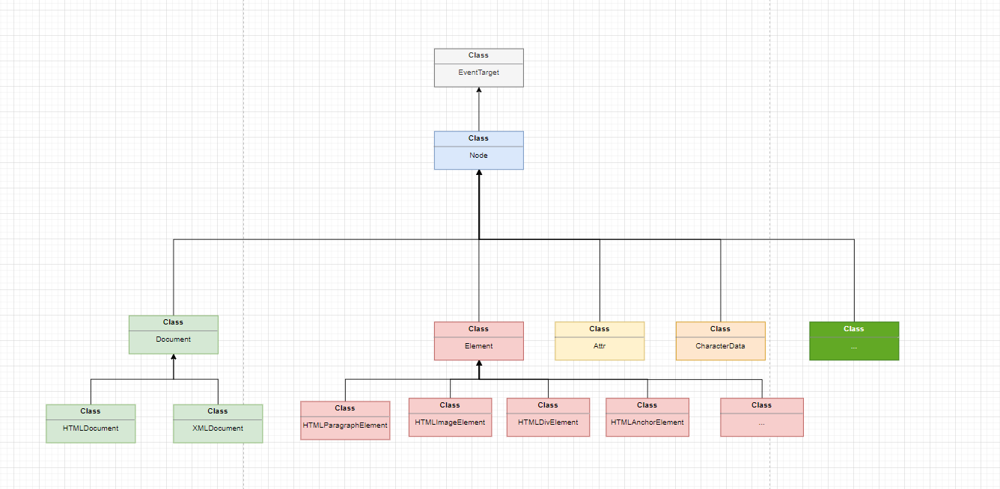
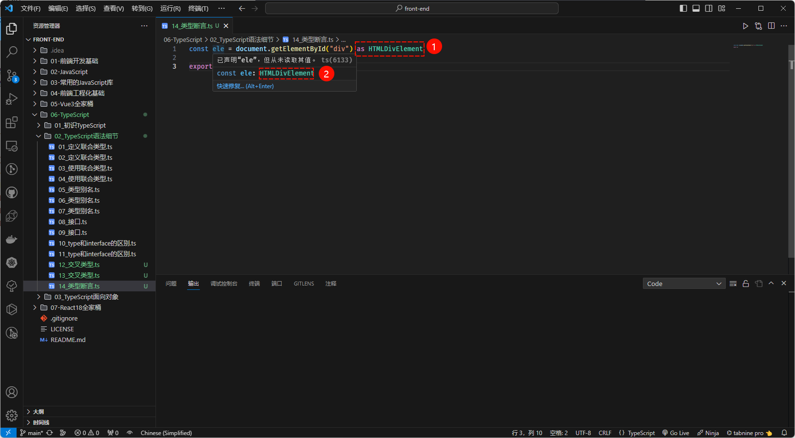

# 第一章：联合类型和交叉类型

## 1.1 扫清概念

* `交集`是指两个集合中都包含的元素组成的集合。例如：`集合 A = {1, 2, 3, 4, 5}` 和`集合 B = {3, 4, 5, 6, 7}` 的`交集`是 `C = {3, 4, 5}`。


> 注意⚠️：在编程中，通常使用`逻辑与`（`&`）来表示`交集`的关系。

* `并集`是指两个集合中包含的所有元素组成的集合。例如：`集合 A = {1, 2, 3, 4, 5}` 和集合 `B = {3, 4, 5, 6, 7}` 的`并集`是 `D = {1, 2, 3, 4, 5, 6, 7}`。


> 注意⚠️：在编程中，通常使用`逻辑或`（`|`）来表示`并集`的关系。

## 1.2 联合类型

### 1.2.1 概述

* TS 的类型系统`允许`我们`使用`各种`运算符`从`现有类型`中`构建新类型`。
* `联合类型`（Union Tpye）是由`两个`或`多个其他类型`组成的`类型`，表示`可以是其中任何一种类型的值`。我们将这些类型中的`每一种`都称为`联合成员`（union’s members）。

### 1.2.2 定义联合类型

* 定义联合类型很简单，只需要使用 `|` 来组合类型即可。


* 示例：

```ts {1}
let x: string | number; // 定义联合类型

x = "123"

x = "abc"

export { }
```


* 示例：

```ts {1}
function print(x: string | number) { // 定义联合类型
  
}

print(123);
print("abc")

export { }
```

### 1.2.3 使用联合类型

* `提供和联合类型匹配的值很简单，只需要保证是符合联合类型中任意类型的值即可`。
* 但是，如果有一个联合类型的值，我们该怎么去使用它？通常，我们会使用`类型缩小`来让 TS 根据代码结构，推断出值更加具体的类型。

> 注意⚠️：在 TS 中`类型缩小`有很多种，后面将会一一讲解。


* 示例：

```ts {2-6}
function print(x: string | number) { // 定义联合类型
  if (typeof x === "string") { // 类型缩小
    console.log("x", x.toUpperCase())
  } else if (typeof x === "number") { // 类型缩小
    console.log("x", x * 2)
  }
}

print(123);
print("abc")

export { }
```


* 示例：

```ts {2-6}
function print(x: string | number[]) { // 定义联合类型
  if (Array.isArray(x)) { // 类型缩小
    console.log("x", x.map(item => item * 2))
  } else {
    console.log("x", x)
  }
}

print([1, 2]);
print("abc")

export { }
```

## 1.3 交叉类型

### 1.3.1 前提

* 请先将`<<第二章：type 和 interface>>` 看完，再返回这里，继续看交叉类型。

### 1.3.2 交叉类型

* `交叉类型`：表示两种（或多种类型）同时满足，并且交叉类型使用 `&` 符号。

>  注意⚠️：
>
> * ① `type MyType = number & string` 就是错误的，因为不可能有值既满足 number 类型又满足 string 类型。
> * ② 在实际开发中，交叉类型通常用来进行 `type` 类型别名的`扩展类型`，也可以对`对象类型`进行`扩展使用`。


* 示例：

```ts {5}
type Animal = {
  name: string
}

type Bear = Animal & { // 交叉类型，用于对 type 类型进行扩展类型
  honey: boolean
}

const bear: Bear = {
  name: "许大仙",
  honey: true
}

console.log(bear.name, bear.honey)

export {}
```


* 示例：

```ts {9}
interface IPerson {
  name: string
}

interface IRun {
  running: () => void
}

const obj: IPerson & IRun = { // 交叉类型，对`对象类型`进行`扩展使用`
  name: "许大仙",
  running: () => {
    console.log("跑步....")
  }
}

console.log(obj.name)
obj.running()

export {}
```


# 第二章：type 和 interface

## 2.1 type（类型别名）

* 之前，我们一直在`类型注解`中使用`对象类型`或`联合类型`；但是，如果我们要在很多地方使用，就需要编写很多次，显得非常重复。
* 此时，就可以使用 `type`（类型别名）来简化编写。


* 示例：

```ts {1-5}
type ObjType = { // 类型别名，用来简化对象类型
  name: string
  age: number
  height?: number
}

const obj: ObjType = {
  name: "abc",
  age: 123
}

console.log(obj.name, obj.age, obj?.height)

export { }
```


* 示例：

```ts {1-5}
type PointType = { // 类型别名，用来简化对象类型
  x: number
  y: number
  z?: number
}

function print(point: PointType) {
  console.log(point.x, point.y, point?.z)
}

print({ x: 1, y: 2 })

export { }
```


* 示例：

```ts {1}
type IDType = number | string // 类型别名，用来简化联合类型

function print(id: IDType) {
  if (typeof id === "number") {
    console.log(id.toFixed(2))
  } else if (typeof id === "string") {
    console.log(id.toUpperCase())
  }
}

print(123)
print("abc")

export { }
```

## 2.2 interface（接口）

* 对于`对象类型`，我们也可以使用 `interface` 接口来声明。


* 示例：

```ts {1-5}
interface PointType { // 接口，用来简化对象类型
  x: number
  y: number
  z?: number
}

function print(point: PointType) {
  console.log(point.x, point.y, point?.z)
}

print({ x: 1, y: 2 })

export { }
```


* 示例：

```ts
interface ObjType { // 接口，用来简化对象类型
  name: string
  age: number
  height?: number
}

const obj: ObjType = {
  name: "abc",
  age: 123
}

console.log(obj.name, obj.age, obj?.height)

export { }
```

## 2.3 type VS interface

* ① `type` 类型别名可以用来简化`对象类型`和`联合类型`；但是，`interface` 接口只能用来简化`对象类型`。
* ② `type` 类别别名是通过`交叉类型`来`扩展类型`的；而 `interface` 接口是通过 `extends` 关键字来`扩展类型`的，即：

```ts {5}
type Animal = {
  name: string
}

type Bear = Animal & {
  honey: boolean
}

const bear: Bear = {
  name: "许大仙",
  honey: true
}

console.log(bear.name, bear.honey)

export {}
```

```ts {5}
interface Animal  {
  name: string
}

interface Bear extends Animal{
  honey: boolean
}

const bear: Bear = {
  name: "许大仙",
  honey: true
}

console.log(bear.name, bear.honey)

export {}
```

* ③ `type` 类型别名`不允许两个相同名称的别名同时存在`；而 interface 接口是可以的，即：

```ts {5}
type Animal  = {
  title: string
}

type Animal  = { // 报错，标识符 Animal 重复定义
  age: number
}
```

```ts {5}
interface Animal {
  title: string
}

interface Animal   { // 没有报错
  age: number
}
```

> 温馨提示ℹ️：在实际开发中，如何选择？
>
> * ① 如果定义`非对象类型`，通常`推荐`使用 `type` 类型别名。
> * ② 如果定义`对象类型`，通常`推荐`使用 `interface` 接口。


# 第三章：类型断言和非空断言

## 3.1 类型断言（as）

* 回顾一下，[类继承在 WEB API 接口上的应用（针对 DOM）](https://aexiar.github.io/web-design/notes/02_javascript_basic/08_xdx/#_1-8-%E7%B1%BB%E7%BB%A7%E6%89%BF%E5%9C%A8-web-api-%E6%8E%A5%E5%8F%A3%E4%B8%8A%E7%9A%84%E5%BA%94%E7%94%A8-%E9%92%88%E5%AF%B9-dom)，如下图所示：



* 我们知道，如果我们使用 `document.getElementById("")` 来获取元素，TS 只知道是某种 `HTMLElement`，并不知道具体的类型，可能是 `HTMLCanvasElement`、`HTMLLinkElement`、`HTMLImageElement` 等，即：

```ts {1}
const ele = document.getElementById("div")

export {}
```


* 但是，我们明确的知道，我们获取的就是 div 元素；此时，就可以使用`类型断言(as)` 来告知 TS 更准确的类型，以便做出更精确的提示，即：

```ts {1}
const ele = document.getElementById("div") as HTMLDivElement

export {}
```



* `注意`⚠️：TypeScript  只允许转换为`更具体`或者`更不具体的类型版本`的类型断言，此规则是为了防止不可能的强制转换（慎用！！！）。

```ts {3}
const num:number = 12 
  
const age = num as string // 报错

export { }
```


* 根据提示，我们可以先 `as` 为 `known` 或 `any` ，再 `as` 为`其它`类型，即：

```ts {3}
const num:number = 12 
  
const age = num as any as string // 不会报错

export { }
```


## 3.2 非空断言（!）

* 非空断言（!）用于在`不进行任何显式检查`的情况下，针对 `undefined` 类型或 `null` 类型`不进行警告`。

```ts {20}
interface IPerson {
  name: string,
  age: number,
  friend?: {
    name: string
  }
}

const person: IPerson = {
  name: "张三",
  age: 18
}

// 访问属性的时候，我们可以使用可选链 ?.

console.log(person?.friend?.name)


// 但是，如果设置属性，可选链就没用了
person.friend?.name = "李四" // 报错


export { }
```


* 解决方案一：通过`类型缩小`来解决，即：

```ts {19}
interface IPerson {
  name: string,
  age: number,
  friend?: {
    name: string
  }
}

const person: IPerson = {
  name: "张三",
  age: 18
}

// 访问属性的时候，我们可以使用可选链 ?.

console.log(person?.friend?.name)

// 解决方案一：通过类型缩小
if (person.friend) { // 通过类型缩小来设置属性，不会报错
  person.friend.name = "李四"
}


export { }
```


* 解决方案二：通过非空断言，即：

```ts {19}
interface IPerson {
  name: string,
  age: number,
  friend?: {
    name: string
  }
}

const person: IPerson = {
  name: "张三",
  age: 18
}

// 访问属性的时候，我们可以使用可选链 ?.

console.log(person?.friend?.name)

// 解决方案二：通过非空断言
person!.friend!.name = "李四" // 通过非空断言来设置属性，不会报错，只是压制警告而已！！！

export { }
```


> `注意`⚠️：在实际开发中，并`不推荐`使用非空断言（!）来`压制`警告，因为可能会造成代码运行错误，慎用！！！


# 第四章：字面量类型和类型缩小

## 4.1 字面量类型

### 4.1.1 回顾字面量

* 在 JavaScript 中，字面量是一种表示`固定值`的语法。字面量可以在代码中直接使用，并且不需要通过变量或函数来表示。
* 字面量可以表示各种数据类型，包括：字符串、数字、布尔值、数组、对象和正则表达式等。
* 以下是一些常见的 JavaScript 字面量的示例：
  - ① 字符串字面量：`'Hello World'`、`"JavaScript"`。
  - ② 数字字面量：`123`、`3.14`。
  - ③ 布尔字面量：`true`、`false`。
  - ④ 数组字面量：`[1, 2, 3]`、`['apple', 'banana', 'orange']`.
  - ⑤ 对象字面量：`{name: 'John', age: 25}`。
  - ⑥ 正则表达式字面量：`/pattern/`。
* 使用字面量可以方便地创建和表示各种类型的值，而不需要显式地使用构造函数或其他语法结构。

### 4.1.2 字面量类型

* 在 TS 中，对于`字符串字面量`、`数字字面量`以及`布尔字面量`可以作为类型注解（TS 会自动推断），如：

```ts {2-4}
// 字面量类型的基本使用
const a = "abc"
const b = 1
const c = true

export { }
```


* 当然，你也可以使用 let 定义变量的时候，设置字面量类型，即：

```ts
// 字面量类型的基本使用
const a = "abc"
const b = 1
const c = true

// 字面量类型的基本使用
let d: "abc" = "abc"
let e: 1 = 1
let g:true = true

export { }
```


* 普通的`字面量类型`没有任何价值，但是一旦和`联合类型`结合，就可以模拟出`枚举`的作用，即：

```ts
```


## 4.2 类型缩小


# 第五章：函数的类型和函数签名

## 5.1 函数的类型


## 5.2 函数签名


# 第六章：函数的重载和 this 类型

## 6.1 函数的重载


## 6.2 this 类型

