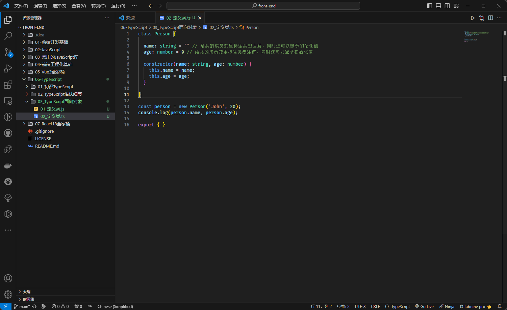
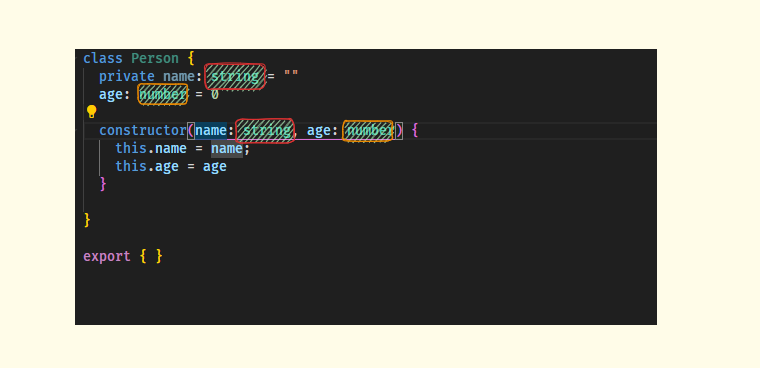

# 第一章：TS 中类的使用

## 1.1 概述

* 在早期的 JavaScript （ES5）开发中，我们需要通过`函数（构造函数）`和`原型链`来实现`类`以及`继承`；但是，从 ES6 开始之后，JavaScript 已经引入了 `class` 关键字和 `extends` 关键字，可以很方便的定义和使用类，以及类之间的关系 -- 继承。
* TypeScript 作为 JavaScript 的超集，也是支持 `class` 和 `extends` 关键字的，并且还可以对类的`属性`和`方法`等进行静态类型检测。

> 温馨提示ℹ️：
>
> * 目前，前端社区中流行的开发方式是`函数式编程`，面向对象编程已经不再流行了，如：Vue 3.x 中 Composition API 和 React 中 Hook 。
> * 但是，后面的发展，谁又能知道呢？或许，以后面向对象编程又再一次流行😝。

* 但是，在封装某些业务代码的时候，也许更推荐面向对象编程，毕竟`类`具有更强大的`封装性`。

## 1.2 类的定义

* 在 JS 中，我们可以这么定义一个类：

```js
class Person {

  constructor(name, age) { // 在 JS 中的构造器的名字必须是 constructor ，并且没有构造器重载的概念
    this.name = name;
    this.age = age;
  }

}

const person = new Person('John', 20);
console.log(person.name, person.age);
```

* 但是，如果我们在 TS 中，也这么定义，将会报错：

```ts {4,5}
class Person {

  constructor(name, age) {
    this.name = name; // 报错
    this.age = age; // 报错
  }

}

const person = new Person('John', 20);
console.log(person.name, person.age); // 报错

export {}
```


* 在 JS 中，类中是可以声明公有字段（公开字段）和私有字段，也称为成员变量或成员属性，即：

```js {3-4}
class Person {

  name = "" // 成员变量，公有字段
  #age // 成员变量，私有字段，只能在类的内部访问，即：读取和赋值

  constructor(name, age) {
    this.name = name;
    this.#age = age;
  }

  setAge(age) {
    this.#age = age;
  }

  getAge() {
    return this.#age;
  }

}

const person = new Person('John', 20);
console.log(person.name, person.getAge());
```

* 那么，在 TS 中，就可以给类的`成员变量`标注`类型注解`，即：

```ts {3-4,6}
class Person {
  
  name: string = "" // 给类的成员变量标注类型注解，同时还可以赋予初始化值
  age: number = 0  // 给类的成员变量标注类型注解，同时还可以赋予初始化值

  constructor(name: string, age: number) {
    this.name = name;
    this.age = age;
  }

}

const person = new Person('John', 20);
console.log(person.name, person.age);

export { }
```



* 当然，类中也是可以有自己的方法的，如：

```ts {11-13}
class Person {

  name: string = "" // 给类的成员变量标注类型注解，同时还可以赋予初始化值
  age: number = 0 // 给类的成员变量标注类型注解，同时还可以赋予初始化值

  constructor(name: string, age: number) {
    this.name = name;
    this.age = age;
  }

  eating() {
    console.log(this.name + " is eating");
  }

}

const person = new Person('John', 20);
console.log(person.name, person.age);
person.eating()

export { }
```


## 1.3 类的继承

* 面向对象的三大特性之一就是继承，并且继承是多态的前提；
* 通常而言，我们使用 `extends` 来实现继承，子类使用 `super` 关键字来访问父类的构造器、属性或方法等。

> `注意`⚠️：
>
> * ① 由于 JavaScript 中的类是一个简单的查找对象，不存在 `super field` 的概念；换言之，我们不可以在子类中，通过 `super.字段` 访问父类中的字段，只能通过 `this.字段` 访问父类中的字段（和 Java 不同）。
> * ② 子类可以重写父类的方法，TS 中也是支持的。


* 示例：

```ts {20,23-26}
class Person {
  name: string
  age: number

  constructor(name: string, age: number) {
    this.name = name;
    this.age = age;
  }

  eating() {
    console.log(this.name + " is eating");
  }

  running() {
    console.log(this.name + " is running");
  }
}


class Student extends Person {
  score: number = 0

  constructor(name: string, age: number, score: number) {
    super(name, age)
    this.score = score
  }

  study() {
    console.log(this.name + " is studying");
  }
}

const student = new Student('John', 20, 90)
console.log(student.name, student.age, student.score)
student.eating()
student.running()
student.study()

export { }
```

## 1.4 类的成员访问修饰符

* 在 TS 中，类的成员属性和成员方法都支持三种访问修饰符：
  * public：在任何地方可见、公有的属性或方法，默认。
  * private：仅在同一类中可见、私有的属性或方法。
  * protected：仅在类自身及子类中可见、受保护的属性或方法。

> `注意`⚠️：
>
> * ① JS 中是没有 `public`、`private` 和 `protected` 修饰符的，是 TS 独有的。
> * ② JS 中对于私有属性，通常使用 `_xx` 或 `#xx` 来表示，其中：`#xx` 是规范，而 `_xx` 是早期大家的约定，TS 也是支持的。


* 示例：

```ts {3}
class Person {
  name: string
  public age: number // public 可写可不写，默认的访问修饰符，

  constructor(name: string, age: number) {
    this.name = name;
    this.age = age;
  }

  eating() {
    console.log(this.name + " is eating");
  }

  running() {
    console.log(this.name + " is running");
  }
}


class Student extends Person {
  score: number = 0

  constructor(name: string, age: number, score: number) {
    super(name, age)
    this.score = score
  }

  study() {
    console.log(this.name + " is studying");
  }
}

const student = new Student('John', 20, 90)
console.log(student.name, student.age, student.score)
student.eating()
student.running()
student.study()

export { }
```


* 示例：

```ts {3,33}
class Person {
  name: string
  private age: number // private 在同一类中可见、私有的属性或方法
  constructor(name: string, age: number) {
    this.name = name;
    this.age = age;
  }

  eating() {
    console.log(this.name + " is eating");
  }

  running() {
    console.log(this.name + " is running");
  }
}


class Student extends Person {
  score: number = 0

  constructor(name: string, age: number, score: number) {
    super(name, age)
    this.score = score
  }

  study() {
    console.log(this.name + " is studying");
  }
}

const student = new Student('John', 20, 90)
console.log(student.name, student.age, student.score) // 报错
student.eating()
student.running()
student.study()

export { }
```


* 示例：

```ts {3,33}
class Person {
  name: string
  protected age: number // protected 在类自身及子类中可见、受保护的属性或方法
  constructor(name: string, age: number) {
    this.name = name;
    this.age = age;
  }

  eating() {
    console.log(this.name + " is eating");
  }

  running() {
    console.log(this.name + " is running");
  }
}


class Student extends Person {
  score: number = 0

  constructor(name: string, age: number, score: number) {
    super(name, age)
    this.score = score
  }

  study() {
    console.log(this.name + " is studying");
  }
}

const student = new Student('John', 20, 90)
console.log(student.name, student.age, student.score) // 报错
student.eating()
student.running()
student.study()

export { }
```

## 1.5 readonly 属性

* 如果一个字段被 readonly 修饰，即希望不被外界任意修饰，只希望在确定值后直接使用。

> `注意`⚠️：被 readonly 修饰的值，可以在构造器中对其赋值，其余地方都不行，包括类的其他方法等（类似于 Java 中的 final 关键字）。


* 示例：

```ts {2,6,11,15}
class Greeter {
  readonly name: string = "world"
 
  constructor(otherName?: string) {
    if (otherName !== undefined) {
      this.name = otherName;
    }
  }
 
  err() {
    this.name = "not ok" // 报错
  }
}
const g = new Greeter();
g.name = "also not ok" // 报错

export {}
```

## 1.6 私有属性的 setter 和 getter

* 在早期，class 类中没有出现 `#` 表示私有属性的时候，我们通常会约定使用 `_` 来修饰私有属性，并使用 getter 和 setter 来对私有属性提供访问，即：

```js {2,8,12,20}
class Person {
  _name = ""

  constructor(name) {
    this._name = name;
  }

  set name(name) {
    this._name = name
  }

  get name() {
    return this._name;
  }
}

const person = new Person('John')
console.log(person.name);
person.name = "Tom"
console.log(person.name, person._name);
```

> `注意`⚠️：上述只是使用 `_` 来修饰属性，表示私有属性，只是约定而已！！

* 随着，ES 版本的升级，规范中规定了对于 class 中的类，如果是私有属性，就需要使用 `#` 来修饰；当然，也可以提供对应的 setter 和 getter ，即：

```js {2,8,12,20}
class Person {
  #name = ""

  constructor(name) {
    this.#name = name;
  }

  set name(name) {
    this.#name = name
  }

  get name() {
    return this.#name;
  }
}

const person = new Person('John')
console.log(person.name);
person.name = "Tom"
console.log(person.name, person.#name); // 报错，不可以在外部访问私有属性
```

* 同理，TS 中也支持 setter 和 getter ，并使用早期我们约定的 `_` 来表示私有属性，即：

```ts {2,8,12,20}
class Person {
  _name: string = ""

  constructor(name: string) {
    this._name = name;
  }

  set name(name) {
    this._name = name
  }

  get name() {
    return this._name;
  }
}

const person = new Person("John");
console.log(person.name);
person._name = "Tom"
console.log(person.name, person._name)

export { }
```

* 当然，也可以在类中使用 `#` 来表示私有属性，即：

```ts {2,8,12,20}
class Person {
  #name: string = ""

  constructor(name: string) {
    this.#name = name;
  }

  set name(name) {
    this.#name = name
  }

  get name() {
    return this.#name;
  }
}

const person = new Person("John");
console.log(person.name);
person.name = "Tom"
console.log(person.name, person.#name) // 报错，不可以在外部访问私有属性

export { }
```

* 当然，我们也可以借助 TS 的关键字 private 来修饰私有属性，并提供对应的 setter 和 getter ，即：

```ts {2,8,12,20}
class Person {
  private _name: string = ""

  constructor(name: string) {
    this._name = name;
  }

  set name(name) {
    this._name = name
  }

  get name() {
    return this._name;
  }
}

const person = new Person("John");
console.log(person.name);
person.name = "Tom"
console.log(person.name, person._name) // 报错，不可以在外部访问私有属性

export { }
```

> `注意`⚠️：没有额外的逻辑（在 setter 或 getter 中处理逻辑问题）来支撑的情况下，不要写私有属性，直接将字段公开即可；

## 1.7 参数属性

* 之前，我们定义类是这样的，即：

```ts
class Person {
  private name: string = ""
  age: number = 0

  constructor(name: string, age: number) {
    this.name = name;
    this.age = age
  }
}

export { }
```

* 难道，不觉得`很多地方`在标注`类型注解`的时候，重复了吗？



* TS 提供了一种特殊的语法，用于将`构造函数参数`转换为具有`相同名称`和`值`的`类属性`，这些属性称为`参数属性`，即通过在`构造函数参数前面添加访问修饰符`，如： `public` 、 `private` 、 `protected` 或 `readonly` 中的一种，那么生成的字段将获取这些修饰符，即：

```ts {2,17}
class Person {
  constructor(private _name: string, public age: number) {
    this._name = _name;
    this.age = age
  }

  set name(name) {
    this._name = name
  }

  get name() {
    return this._name;
  }
}

const person = new Person("John", 18);
console.log(person.name, person.age); 

export { }
```


# 第二章：TS 中的抽象类


# 第三章：TS 中的对象类型


# 第四章：TS 中的接口补充


# 第五章：特殊：严格字面量检测


# 第六章：TS 中的枚举类型


