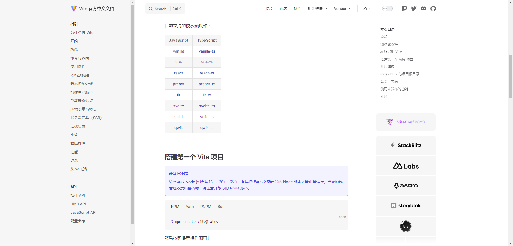
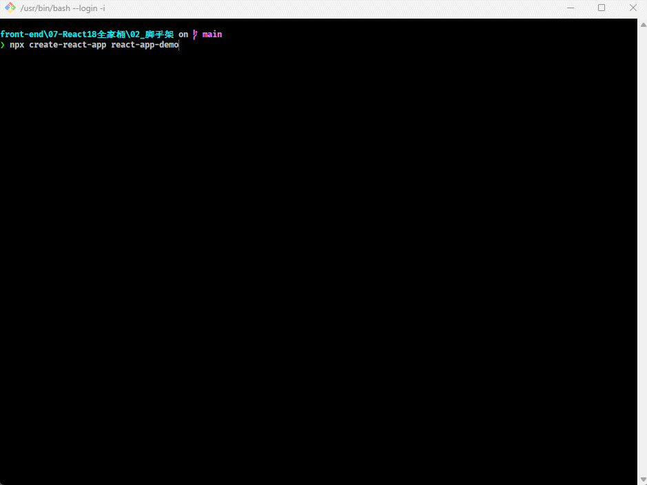
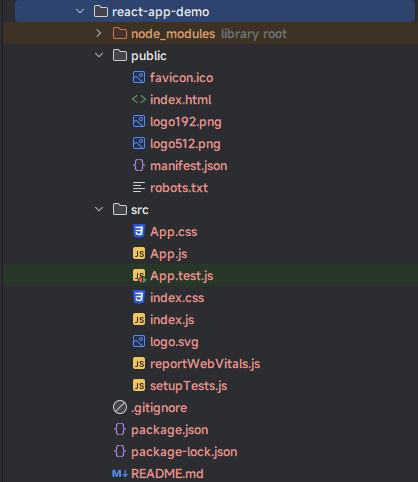
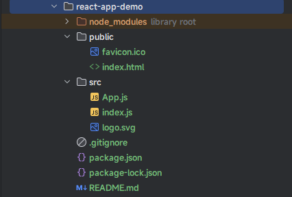
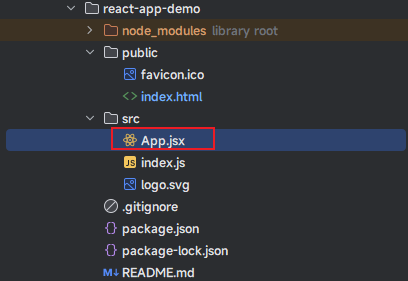
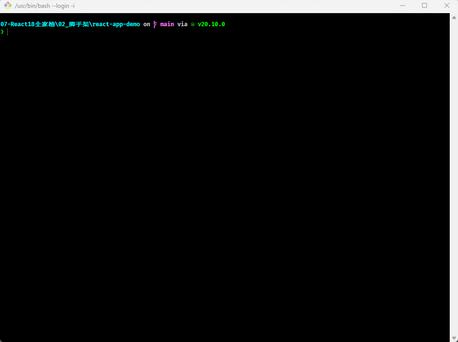
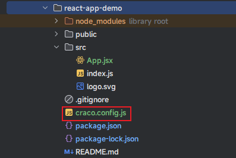
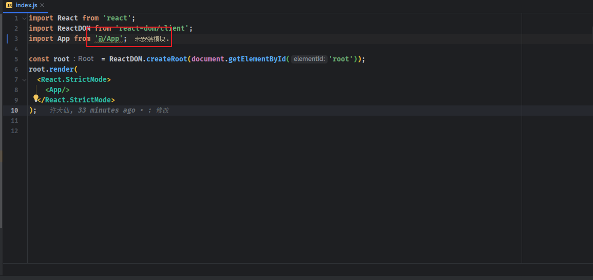
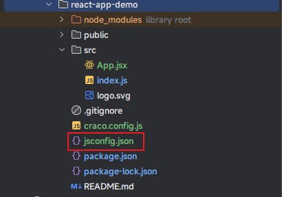
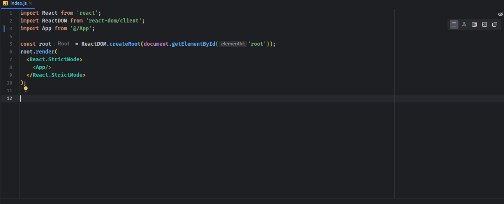

> 前提条件： Node >= 14.0.0 和 npm >= 5.6 。

# 第一章：为什么要有脚手架？

## 1.1 前端工程的复杂性

* 如果，我们仅仅是开发几个 demo 程序，那么就不需要考虑如下的一些复杂的问题。
  * ① 目录结构如何合理划分？
  * ② 如何管理文件之间的相互依赖？
  * ③ 如何管理第三方模块的依赖？
  * ④ 项目发布前如何压缩、打包项目？
  * ⑤ ……

* 但是，现在的前端项目已经越来越复杂了：
  * ① 我们不再是在 HTML 文件中引入 css 文件或者引入 js 文件那么简单了。
  * ② 如果使用的是 Less  或 Sass 等预处理器，我们需要将它们转换为普通的 css 才能被浏览器解析。
  * ③ JavaScript 的代码也不再是编写在几个文件中，而是通过模块化的方式，被组成在成千上百的文件中，我们需要通过模块化的来管理它们之间的相互依赖。
  * ④ 项目需要依赖很多的第三方库，如何更好的管理它们的版本，都是很常见的问题。
  * ⑤ ……
  
* 那么，我们看看隔壁 Java 是怎么发展的：
  * 早期，Java 也是通过命令行打包成 jar 包，然后引入到项目中。
  * 随着时间的推移，出来了 Ant ，可以通过 xml 文件来管理项目，虽然使用灵活，速度快；但是，Ant 没有强加任何编码约定的项目目录结构，开发人员需要编写繁琐的 XML 文件构建指令，对开发人员是一个挑战。
  * 之后，Maven 出来了，Maven 最大的优点就是：遵循一套约定大于配置的项目目录结构，使用统一的 GAV 坐标进行依赖管理，侧重于包管理 。 但是 Maven 的缺点也有：项目构建过程僵化，配置文件编写不够灵活，不方便自定义组件，构建速度慢。
  * 之后，Gradle 出来了， Gradle 的优点：集 Ant 脚本的灵活性 + Maven 约定大于配置的项目目录优势，支持多种远程仓库和插件，侧重于大型项目的构建。 Gradle 的缺点：学习成本高，资料少，脚本灵活，版本兼容差等。

> 从 Java 的项目构建工具的发展历史来看，我们会发现 Java 社区主要做了如下几件事情：
>
> * ① 项目的目录结构统一了，方便协调开发。
> * ② 可以通过项目构建工具，很好的管理项目的依赖（第三方包）。
> * ③ 可以进行项目构建生命周期的管理，如：清理、编译、测试、打包、安装、部署等。
> * ④ ……

* 其实，前端为了解决这些问题，也需要我们去学习一些工具，如：webpack、babel 等，需要配置它们的转换规则、打包规则等，实在是太繁琐了。为了解决这一系列的问题，`脚手架`应运而生！！！

## 1.2 脚手架是什么？

* `脚手架`来源于`建筑学`，指的是是一种临时性的`建筑工具`，架设在正在组建或重建的`楼房`或`建筑物`，亦用于`轮船`等大型的移动式物品，供施工人员在`墙壁`等高处施工。


* `编程`中的`脚手架`，其实就是一种`工具`，可以帮助我们`快速`生成`项目`的`工程化结构`。
  * 每个项目虽然要实现的功能不同，但是它们的`基本工程化结构`都是类似的。
  * 既然相似，那么就没有必要每次都`从零开始搭建`，完全可以`利用一些工具`，`帮助我们生成基本的项目工程化模板`。
  * 不同的项目，在这个`模板的基础`上进行`项目开发`或者`进行一个配置的简单修改`即可。
  * 这样可以间接的`保证项目的基本结构的一致性`，`方便后期的维护`。

> 总结：脚手架可以让项目从搭建、开发、部署的整个流程，变得快速和便捷。

## 1.3 前端脚手架

* 目前流行的三大框架都有自己的脚手架：
  * Vue 的脚手架：~~@vue/cli~~、Vite 。
  * Angular 的脚手架：@angular/cli、Vite 。
  * React 的脚手架：create-react-app、Vite。

> 从目前来看，Vite 大有取代 Webpack 的趋势；当然，Vite 也称自己为**下一代的前端工具链**。

* Vite 本身也提供了很多框架的模板：



* 上文提到的`脚手架`（其实，就是 Vite 官方文档中提到的`模板`）的作用都是帮助我们生成一个通用的目录结构，并且已经将我们所需的工程环境配置好。

>  注意：使用这些脚手架需要我们电脑上配置有 Node.js 环境。


# 第二章：创建 React 项目

## 2.1 npm 和 npx

### 2.1.1 npm

* npm 本身并不运行任何软件包。如果我们想使用 npm 运行一个包，我们必须在 `package.json` 文件中指定这个包。
* 当可执行文件通过 npm 包安装时，npm 会创建链接指向它们。
  * 本地安装的链接是在 `./node_modules/.bin/` 目录下创建的。
  * 全局安装会在全局 `bin/` 目录下创建链接（例如：Linux 上的 `/usr/local/bin` 或 Windows 上的 `%AppData%/npm`）。
* 要用 npm 执行一个包，你必须输入本地路径，如：

```shell
./node_modules/.bin/your-package
```

* 或者，我们可以通过在脚本部分的 `package.json` 文件中添加一个本地安装的软件包来运行它，如：

```json
{
  "name": "your-application",
  "version": "1.0.0",
  "scripts": {
    "your-package": "your-package"
  }
}
```

* 之后，我们就可以用 `npm run` 来运行这个脚本：

```shell
npm run your-package
```

### 2.1.2 npx

* npx 是 npm 5.2.0 版本之后，捆绑在 npm 中；其目的是使安装和管理托管在 npm 注册表中的依赖关系变得容易。
* 我们可以很轻松的执行一个本地的软件包，如：

```shell
npx your-package
```

* npx 将检查 `<command>` 或 `<package>` 是否存在于 `$PATH` 或本地项目的二进制文件中，如果存在，npx 将执行它。
* 所以，npx 的一个优势就是能够执行以前没有安装的软件包，如：

```shell
npx cowsay wow	
```

* 因为我们有的时候只是想使用一些 CLI 工具，但我们不想为了测试它们而在全局安装它们。
* 这意味着我们可以节省一些磁盘空间，只在需要时才运行它们。这也意味着我们的全局变量将受到更少的污染。

## 2.2 创建 React 项目

* 命令：

```shell
npx create-react-app 项目名 [--template template-name]
```

> 注意：
>
> * 项目名必须是英文的，且不能大写。
> * `--template template-name` 是可选参数，`template-name` 默认提供两个 `cra-template` 和  `cra-template-typescript` 。如果不写，则是 `cra-template`。也可以通过 [这里](https://www.npmjs.com/search?q=cra-template-*) 搜索其他的社区模板。


* 示例：

```shell
npx create-react-app react-app-demo
```



## 2.3 目录结构分析

* 默认生成的目录结构，如下所示：



* 删除不必要的文件，目录就如下所示：



> 注意：源码在[这里](/assets/notes/07_React18/02_xdx/react-app-demo.zip)。

* 解释下其中的含义：

```shell
.
|-- public
|   |-- favicon.ico # 网站顶部的 ico 图标
|   `-- index.html # 应用的 Index.html 入口文件
`-- src        # 源代码目录 
    |-- App.js # App 组件的代码
    |-- index.js # 整个应用程序的入口
    `-- logo.svg # logo 图标
|-- package-lock.json
|-- package.json # 整个应用程序的描述：包括应用名称、版本、依赖等
|-- README.md   
```

* index.js 的默认生成代码，如下所示：

```js
import React from 'react'; 
import ReactDOM from 'react-dom/client'; 
import App from './App'; // APP 组件

// 创建 React 的根元素
const root = ReactDOM.createRoot(document.getElementById('root'));
// 渲染 App 组件
root.render(
  <React.StrictMode>
    <App/>
  </React.StrictMode>
);
```

* App.js 默认生成的代码，如下所示：

```js
import logo from './logo.svg';

function App() {
  return (
    <div className="App">
      <header className="App-header">
        
        <p>
          Edit <code>src/App.js</code> and save to reload.
        </p>
        <a
          className="App-link"
          href="https://reactjs.org"
          target="_blank"
          rel="noopener noreferrer"
        >
          Learn React
        </a>
      </header>
    </div>
  );
}

export default App;
```

> 注意：React 支持`类式组件`和`函数式组件`；目前，官方`推荐`函数式组件。但是，我们还是`以`类式组件为例。

* index.html 生成的代码，如下所示：

```html
<!DOCTYPE html>
<html lang="en">
  <head>
    <meta charset="utf-8" />
    <link rel="icon" href="%PUBLIC_URL%/favicon.ico" />
    <meta name="viewport" content="width=device-width, initial-scale=1" />
    <meta name="theme-color" content="#000000" />
    <meta
      name="description"
      content="Web site created using create-react-app"
    />
    <title>React App</title>
  </head>
  <body>
    <noscript>You need to enable JavaScript to run this app.</noscript>
    <div id="root"></div>
  </body>
</html>
```

## 2.4 开始编写代码

* 需求：在脚手架项目中显示 `"Hello React"` 的功能。

> 注意：我们需要在 src 目录下，将 App.js 删除，并新建 App.jsx 文件，以便获取更好的 IDE 支持。

* 项目结构：



* 示例：

```jsx
import React from 'react'
class App extends React.Component{
  
  state = {
    message: 'Hello React'
  }
  
  render() {
    return (<div>{this.state.message}</div>)
  }
}

export default App
```

## 2.5 优化项目

* 对于 index.js 中的代码：

```js
import React from 'react';
import ReactDOM from 'react-dom/client';
import App from './App';

const root = ReactDOM.createRoot(document.getElementById('root'));
root.render(
  <React.StrictMode>
    <App/>
  </React.StrictMode>
);
```

* 使用的是相对路径；如果项目层级过多，将很难去定位问题；在项目中，我们一般使用 `@` 别名去代替 `src` 目录；此时，就需要使用  `craco` 项目了。
* 在 create-react-app 生成的项目中安装 `craco`：

```shell
npm install -D @craco/craco
```



* 在项目根目录中创建 `craco.config.js`，内容如下：

```js
const path = require('path');

module.exports = {
  reactScriptsVersion: 'react-scripts',
  webpack: {
    alias: {
      '@': path.resolve(__dirname, 'src'),
      '@assets': path.resolve(__dirname,'src/assets'),
      '@components': path.resolve(__dirname,'src/components'),
      '@constants': path.resolve(__dirname,'src/constants'),
      '@containers': path.resolve(__dirname,'src/containers'),
      '@hooks': path.resolve(__dirname,'src/hooks'),
      '@mocks': path.resolve(__dirname,'src/mocks'),
      '@routes': path.resolve(__dirname,'src/routes'),
      '@services': path.resolve(__dirname,'src/services'),
      '@styles': path.resolve(__dirname,'src/styles'),
      '@types': path.resolve(__dirname,'src/types'),
      '@utils': path.resolve(__dirname,'src/utils'),
      '@contexts': path.resolve(__dirname,'src/contexts'),
    },
    configure(webpackConfig) {
      // 配置扩展扩展名
      webpackConfig.resolve.extensions = [...webpackConfig.resolve.extensions, ...['.scss', '.css']];
      return webpackConfig;
    },
  },
  devServer: {
      // 本地服务的端口号
      port: 3001,
      // 本地服务的响应头设置
      headers: {
        // 允许跨域
        'Access-Control-Allow-Origin': '*',
      },
    },  
}
```



* 修改项目的 `package.json` 文件，将 `scripts` 中的配置修改掉：

```json
{
  "name": "react-app-demo",
  "version": "0.1.0",
  "private": true,
  "dependencies": {
    "@testing-library/jest-dom": "^6.1.5",
    "@testing-library/react": "^14.1.2",
    "@testing-library/user-event": "^14.5.1",
    "react": "^18.2.0",
    "react-dom": "^18.2.0",
    "react-scripts": "5.0.1",
    "web-vitals": "^3.5.0"
  },
  "scripts": {
    "start": "craco start", // 原来是 react-scripts start ；复制我的配置，需要删除注释
    "build": "craco  build", // 原来是 react-scripts build；复制我的配置，需要删除注释
    "test": "craco  test", // 原来是 react-scripts test；复制我的配置，需要删除注释
    "eject": "craco  eject" // 原来是 react-scripts eject；复制我的配置，需要删除注释
  },
  "eslintConfig": {
    "extends": [
      "react-app",
      "react-app/jest"
    ]
  },
  "browserslist": {
    "production": [
      ">0.2%",
      "not dead",
      "not op_mini all"
    ],
    "development": [
      "last 1 chrome version",
      "last 1 firefox version",
      "last 1 safari version"
    ]
  },
  "devDependencies": {
    "@craco/craco": "^7.1.0"
  }
}
```

* 仅仅这样，虽然项目跑起来没问题；但是，IDE 会显示警告，如下所示：



* 是因为，IDE 不能识别到 `@` 别名；此时，只需要在项目的根目录中，增加 `jsconfig.json` 文件即可。



* `jsconfig.json` 的内容如下：

```json
{
  "compilerOptions": {
    "target": "es5",
    "jsx": "react",
    "module": "esnext",
    "baseUrl": "./",
    "moduleResolution": "node",
    "paths": {
      "@/*": [
        "src/*"
      ]
    },
    "lib": [
      "esnext",
      "dom",
      "dom.iterable",
      "scripthost"
    ]
  }
}
```

* 此时，我们会发现 IDE 就可以识别到 `@` 别名了：

