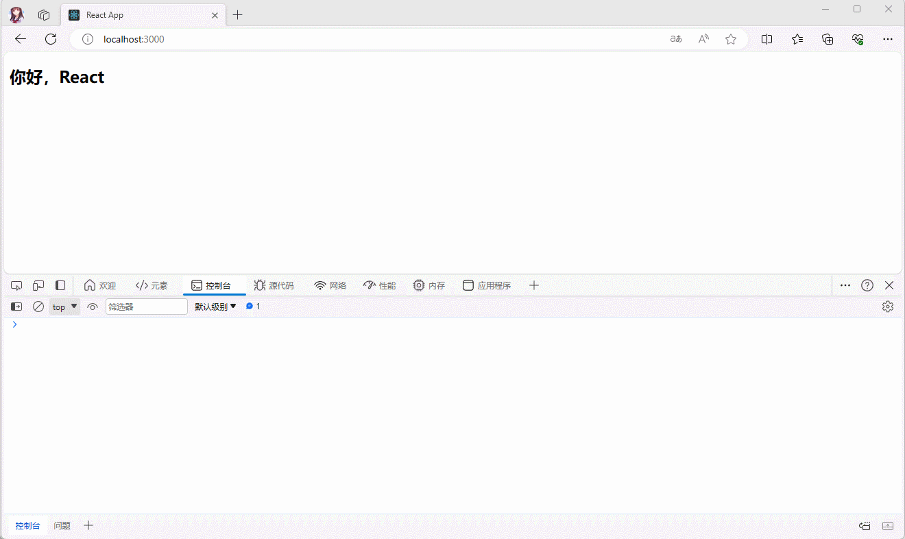
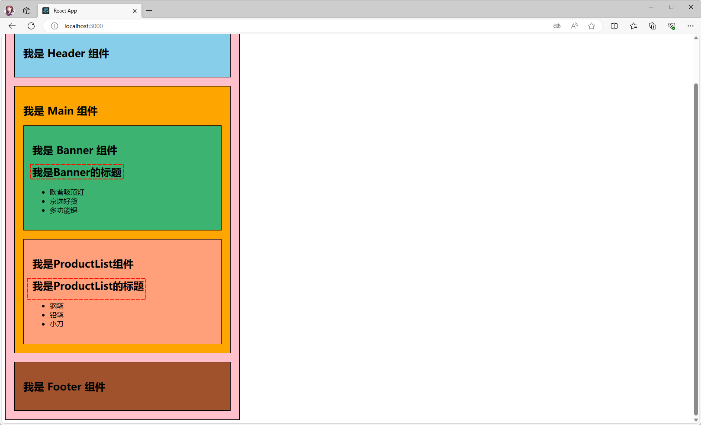

> 前提：`本文`是`上一篇文章`为`基础`，所有的代码都是在`之前代码`的基础上搭建而来。

# 第一章：React 组件化开发

## 1.1 什么是组件化开发？

* 组件化是一种`分而治之`的思想：
  * 如果我们`将一个页面的所有处理逻辑全部放在一起`，`处理起来就会变得非常复杂和繁琐`，并且不利于后期的管理和维护。
  * 相反，如果我们`将一个页面拆分成一个个小的功能块`，`每个功能块完成属于自己独立的功能`，然后再组装起来；之后，整个页面的管理和维护将变得非常容易了。


* 那么，我们在实际开发中，就可以通过`组件化`的思想来开发整个应用程序。
  * 我们可以将一个完整的页面拆分为很多个组件。
  * 每个组件都用于实现页面的一个功能模块。
  * 每一个组件也可以进一步拆分，拆成更多的组件。
  * 组件本身可以在多个地方进行复用。


## 1.2 React 中的组件化

* 组件化是 React 的核心思想：
  * 组件允许我们将 UI 拆分为独立可复用的代码片段，并对每个片段进行独立构思。
  * 任何应用都可以被抽象成一颗组件树。


* `React` 中的组件相对于 `Vue` 中的组件来说更加`灵活`和`多样`，按照`不同的方式`可以将组件分为很多`种类`：
  * 根据`组件`的`定义`方式，可以分为：`函数组件`（Functional Component）和`类组件`（Class Component）。
  * 根据`组件`的`内部`是否有`状态需要维护`，可以分为：`无状态组件`（Stateless Component）和`有状态组件`（Stateful Component）。
  * 根据`组件`的`职责`不同，可以分为：`展示型组件`（Presentational Component）和`容器型组件`（Container Component）。
* 这些概念之间有很多重叠，但是他们最主要的是关注`数据逻辑`和 `UI 展示`的`分离`：
  * `函数组件`、`无状态组件`、`展示型组件`主要关注的是 `UI 的展示`。
  * `类组件`、`有状态组件`、`容器型组件`主要关注的是 `数据逻辑`。

* 其实，React 组件还有其他的概念，如：`异步组件`、`高阶组件`等，后续再讲解。

## 1.3 类组件

* 类组件的`定义`有如下的`要求`：
  * ① 组件的`名称`是以`大写字母`开头（大驼峰的原则，无论类组件还是函数组件）。
  * ② 类组件需要继承自 `React.Component`。
  * ③ 类组件必须实现 `render` 函数。 

* `React` 推荐我们使用 `ES6` 的 `class` 来定义`类`组件，其中：
  * `constructor()` 构造方法是可选的，我们通常会在 `constructor()` 中初始化一些数据。
  * `this.state` 中维护的就是组件内部的数据。
  * `render()` 方法是类组件中`唯一必须实现的方法`。

```jsx {5,7,12}
import React from 'react'

class App extends React.Component{
  
  constructor(){
      super()
  	  this.state = {
          message: '你好，React'
      }	
  }
  
  render() {
    return (
      <div>
        <h2>{this.state.message}</h2>
      </div>
    )
  }
}

export default App
```

* 当 `render()` 方法被调用的时候，它会检查 `this.props` 和 `this.state` 中的变化并返回以下的任意一种类型：
* ① React 元素：通常是通过 JSX 创建的。如：`<div></div>` 会被 React 渲染为 DOM 节点，而 `<HelloWorld />` 会被 React 渲染为自定义的组件。并且，`<div></div>` 和 `<HelloWorld />`都是 React 元素。

```jsx {11}
import React from 'react'

class App extends React.Component{
  
  state = {
    message: 'Hello React'
  }
  
  render() {
    // React 元素：通过 JSX 编写的代码就会被编译成 React.createElement ，所以返回的就是一个 React 元素。
    return <h2>{this.state.message}</h2>
  }
}

export default App
```

* ② 数组或 fragments，这样可以返回多个元素。

```jsx {11}
import React from 'react'

class App extends React.Component{
  
  state = {
    message: 'Hello React'
  }
  
  render() {
    // ② 返回数组或 fragments：这样可以返回多个元素。
    return ["abc","cba", <h1>我是h1元素</h1>, <h2>我是h2元素</h2>]
  }
}

export default App
```

* ③ Portals：可以渲染子节点到不同的 DOM 子树中（后续讲解）。
* ④ 字符串或数值类型：它们在 DOM 中会被渲染为文本节点。

```jsx {15}
import React from 'react'

class App extends React.Component{
  
  state = {
    message: 'Hello React'
  }
  
  render() {
    // ① 返回 React 元素：通过 JSX 编写的代码就会被编译成 React.createElement ，所以返回的就是一个 React 元素。
    // return <h2>{this.state.message}</h2>
    // ② 返回数组或 fragments：这样可以返回多个元素。
    // return ["abc","cba", <h1>我是h1元素</h1>, <h2>我是h2元素</h2>]
    // ④ 字符串或数值类型：它们在 DOM 中会被渲染为文本节点。
    return "abc"
  }
}

export default App
```

* ⑤ 布尔类型或 null ：什么都不渲染。

> 注意：如果一个函数没有 `return ;` 语句或只写了 `return ;`语句，那么返回的就是 undefined ，在 React 中也是什么都不渲染。

## 1.4 函数组件

* 在 React 中，`函数组件`是`使用 function 定义的函数`，并且这个函数会`返回`和`类组件`中 `render` 函数`一样的内容`。
* 函数组件有自己的特点（在没有 hooks 的前提下）：
  * ① 没有生命周期，也会被更新并挂载（其实，是因为没有生命周期函数）。
  * ② this 关键字不能指向组件实例（其实，是因为没有组件实例）。
  * ③ 没有内部状态（state）。
  * ④ ……


* 示例：

```jsx
function App2() {
  return (
    <div>你好啊，React</div>
  )
}

export default App2
```


# 第二章：React 组件生命周期

## 2.1 扫清概念

* 我们知道，在 ES6+ 中，是支持类的：

```js
class Person {
    
}
```

* 所以，在 ES6+ 中，我们可以使用 new 关键字来创建对象的：

```js
class person = new Person()
class person2 = new Person()
```

> 注意：每一次 new 的时候，默认情况下，都会生成一个新的对象（实例）。

* 在 TypeScript 中，为了给类添加约束，我们可以使用接口来进行约束。

```ts
interface IPerson {
    name: string;
    age: number;
    
    eat?(): void; // 可选
}

class Person implements IPerson {
    name: string;
    age: number;

    constructor(name: string, age: number) {
        this.name = name;
        this.age = age;
    }
}
```

* 但是这样太麻烦了，为了给类添加类型，我们还需要多`想`一个`接口名`，并且需要写 `implements` 关键字；在 TypeScript 中，允许定义同名的接口和类。这种情况下，类会自动实现接口，即类的属性和方法会与接口定义的属性和方法保持一致。我们可以将接口视为类的规范或契约，用于约束类的结构。

```ts
interface Person {
    name: string;
    age: number;
    
    eat?(): void; // 可选
}

// 省略了 implements IPerson
class Person  {
    name: string;
    age: number;

    constructor(name: string, age: number) {
        this.name = name;
        this.age = age;
    }
}
```

> 注意：在原生 JavaScript 中，目前是没有接口的概念；在编译的过程中，会将接口擦除掉；换言之，接口视为类的规范或契约，用于约束类的结构。

* 再看 Vue 官方对生命周期的定义：
  * 每个 Vue 组件`实例`在创建时都需要经历一系列的`初始化步骤`，比如设置好数据侦听，编译模板，挂载实例到 DOM，以及`在数据改变时更新 DOM`。
  * 在此过程中，它也`会运行`被`称为生命周期钩子`的`函数`，让`开发者`有机会在`特定阶段`的`运行`自己的代码。

* 并且，Vue 官方也给了 Vue 组件的生命周期图例：


* 其实，Vue 中的应用程序（组件）主要经历如下的四个主要事件（8 个主要的钩子函数）：
  * ① 创建 — 在组件创建时执行。
  * ② 挂载 — DOM 被挂载时执行。
  * ③ 更新 — 当响应数据被修改时执行。
  * ④ 销毁 — 在元素被销毁之前立即运行。

> 总结：
>
> * Vue 中的组件的生命周期，就是 Vue 组件从创建、挂载、更新到销毁的一系列的过程，是个抽象的概念。
> * 在生命周期的每个阶段（创建、挂载、更新、销毁等）提供了不同的钩子函数，并在程序运行的时候，在适当的时机调用这些函数。

* 同理，React `组件`也有自己的`生命周期`，并且如果我们了解 React 组件的生命周期，也可以让 React 有机会在`特定阶段`的`运行`我们自己的代码。
* React 组件的生命周期主要分为三个阶段：
  * 挂载阶段（Mount）：组件第一次在 DOM 树中被渲染的过程。
  * 更新过程（Update）：组件状态发生变化，重新更新渲染的过程。
  * 卸载过程（Unmount），组件从 DOM 树中被移除的过程。
* 下面是 React 组件的`常用`的生命周期图例：


* 下面是 React 组件的`不常用`的生命周期图例（包含常用的生命周期）：


* 其实，我们通过 TS 代码也是可以查看到的：

```ts {4,6,8,9}
// 生命周期的接口
interface ComponentLifecycle<P, S, SS = any> extends NewLifecycle<P, S, SS>, DeprecatedLifecycle<P, S> {
   // 组件已经挂载到DOM上时，就会回调
   componentDidMount?(): void;
   // 组件已经发生了更新时，就会回调；
   shouldComponentUpdate?(nextProps: Readonly<P>, nextState: Readonly<S>, nextContext: any): boolean;
   // 组件即将被移除时，就会回调；
   componentWillUnmount?(): void;
   componentDidCatch?(error: Error, errorInfo: ErrorInfo): void;
}

// 和类名相同的接口
interface Component<P = {}, S = {}, SS = any> extends ComponentLifecycle<P, S, SS> {}

class Component<P, S> { 
	// 其余略
}
```

* 本文在上面也提到：在 TypeScript 中，允许定义同名的接口和类。这种情况下，类会自动实现接口，即类的属性和方法会与接口定义的属性和方法保持一致。我们可以将接口视为类的规范或契约，用于约束类的结构。

> 注意：在谈及 React 生命周期的时候，我们主要讨论的是`类`的生命周期，因为函数式组件是没有生命周期的（后面我们可以通过 hooks 来模拟一些生命周期）。

## 2.2 补充概念

* 很多时候，我们在讨论组件的时候，会谈及`组件`和`组件实例`的概念；甚至，你可能会听到别人谈及：`定义组件`、`使用组件`的概念，如下所示：

```jsx {2-4,25-26}
// Demo 组件
class Demo extends React.Component {
    render() {}
}
// App 组件
class App extends React.Component {
      // 组件数据
      state = {
        message: '你好，React',
        isShow: true
      }

      changeShow() {
        const {isShow} = this.state
        this.setState({
          isShow: !isShow
        })
      }

      render() {
        const {message} = this.state

        const result = (
            <div>
              <Demo/> {/* 使用组件 */}
              <Demo/> {/* 使用组件 */}
              <button onClick={() => this.changeShow()}>切换</button>
              <h2>{message}</h2>
            </div>
        )
        return result

      }
 }
```

* 我们可以通过 babel 将其转换一下：


* 我们知道，本质上原生的 `html` 标签和 `<Demo />`，都会在底层转换为 `React.createElement` 对象，其定义如下：

```js
createElement(type, props, ...children)
```

* 会根据第一个参数 `type` 判断到底`是字符串`还是一个 `React 组件`；需要说明的是，我们通常所说的`使用组件`，其实是 React 在内部帮助我们创建了 `组件的实例对象`；换言之，我们在 JSX 中，每一次写 `<Demo />`就是 React 在内部帮我们创建了 `Demo` 的组件实例。


## 2.3 演示 React 组件的生命周期

### 2.3.1 挂载阶段

* 需求：演示 React 组件挂载阶段的生命周期。




* 示例：

```jsx {5,13,23}
import React from 'react'

class App extends React.Component {
  
  constructor(props) {
    console.log('constructor')
    super(props)
    this.state = {
      message: "你好，React"
    }
  }
  
  render() {
    console.log('render')
    const {message} = this.state
    return (
      <div>
        <h2>{message}</h2>
      </div>
    )
  }
  
  componentDidMount() {
    console.log('componentDidMount')
  }
}

export default App
```

### 2.3.2 更新阶段

* 需求：演示 React 组件更新阶段的生命周期。


* 示例：

```jsx {20,38}
import React from 'react'

class App extends React.Component {
  
  constructor(props) {
    console.log('constructor')
    super(props)
    this.state = {
      message: "你好，React"
    }
  }
  
  change() {
    this.setState({
      message: '你好，React18'
    })
  }
  
  
  render() {
    console.log('render')
    const {message} = this.state
    return (
      <div>
        <h2>{message}</h2>
        <button onClick={() => {
          this.change()
        }}>切换
        </button>
      </div>
    )
  }
  
  componentDidMount() {
    console.log('componentDidMount')
  }
  
  componentDidUpdate(prevProps, prevState, snapshot) {
    console.log('componentDidUpdate')
  }
  
}

export default App
```

### 2.3.2 销毁阶段

* 需求：演示 React 组件销毁阶段的生命周期。


* 项目结构：


* 示例：
* 其中，HelloWorld.jsx

```jsx {18}
import React from "react"

class HelloWorld extends React.Component {
  render() {
    console.log('HelloWorld render')
    return (
      <div style={{
        background: 'pink',
        width: '300px',
        padding: '50px',
        marginTop: '20px'
      }}>
        Hello World
      </div>
    )
  }
  
  componentWillUnmount() {
    console.log('HelloWorld componentWillUnmount')
  }
}

export default HelloWorld
```

* 其中，App.jsx

```jsx
import React from 'react'
import HelloWorld from "@/components/HelloWorld";


class App extends React.Component {
  
  constructor(props) {
    console.log('constructor')
    super(props)
    this.state = {
      message: "你好，React",
      isShow: true
    }
  }
  
  
  hide(){
    this.setState({
      isShow: false
    })
  }
  
  render() {
    console.log('render')
    const {message, isShow} = this.state
    return (
      <div>
        <h2>{message}</h2>
        <button onClick={() => {this.hide()}}>隐藏 HelloWorld 组件</button>
        {isShow && <HelloWorld/>}
      </div>
    )
  }
  
  componentDidMount() {
    console.log('componentDidMount')
  }
  
  componentDidUpdate(prevProps, prevState, snapshot) {
    console.log('componentDidUpdate')
  }
  
}

export default App
```

## 2.4 React 组件的生命周期的案例

* 需求：封装一个计时器的组件，可以通过按钮来显示和隐藏。


> 注意：在组件销毁的时候，必须将定时器关闭；否则，随着时间的推移，用户电脑的 CPU 会越来越高。

* 项目结构：


* 示例：
* 其中，Clock.jsx

```jsx {7-9,16,20-26,28-30}
import React from "react"

class Clock extends React.Component {
  
  constructor(props) {
    super(props)
    this.state = {
      date: new Date()
    }
  }
  
  render() {
    const {date} = this.state
    console.log(`Clock ${date.toLocaleString()}`)
    return (
      <div>{date.toLocaleString()}</div>
    )
  }
  
  componentDidMount() { // 创建定时器
    this.timer = setInterval(() => {
      this.setState({
        date: new Date()
      })
    }, 1000)
  }
  
  componentWillUnmount() { // 清除定时器
    clearInterval(this.timer)
  }
  
}

export default Clock
```

* 其中，App.jsx

```jsx
import React from 'react'
import Clock from "@/components/Clock"


class App extends React.Component {
  constructor(props) {
    super(props)
    this.state = {
      isShow: true
    }
  }
  
  change() {
    this.setState({
      isShow: !this.state.isShow
    })
  }
  
  render() {
    const {isShow} = this.state
    return (
      <div>
        <button onClick={() => this.change()}>切换</button>
        {isShow && <Clock/>}
      </div>
    )
  }
}

export default App
```

## 2.5 不常用的生命周期

* `shouldComponentUpdate(nextProps, nextState)`：根据方法的返回值，判断 React 组件的输出是否受当前 state 或 props 更改的影响。 
  * 默认行为是 state 每次发生变化组件都会重新渲染。大部分情况下，我们应该遵循默认行为。
  * 当 props 或 state 发生变化时，`shouldComponentUpdate()` 会在渲染执行之前被调用。返回值默认为 true。首次渲染或使用 `forceUpdate()` 时不会调用该方法。
  * 此方法仅作为 `性能优化的方式` 而存在。不要企图依靠此方法来“阻止”渲染，因为这可能会产生 bug。你应该考虑使用内置的 `PureComponent` 组件，而`不是手动编写 shouldComponentUpdate()`。`PureComponent``会对 props 和 state 进行浅层比较，并`减少了跳过必要更新的可能性`。

> 总之：
>
> * 当我们在使用 this.setState() 更改 state 中的数据的时候；如果 shouldComponentUpdate 的返回值是 true ，就会再次执行 render 函数，去渲染页面；如果 shouldComponentUpdate 的返回值是 false，就不会再执行 render 函数，也就不会再去渲染页面了。
> * 官方也说了，不建议我们去手动编写 `shouldComponentUpdate()`，而是希望我们使用内置的 `PureComponent` 组件。


* 示例：略。

##  2.6 生命周期函数的实际常见场景

### 2.6.1 constructor 构造函数

* `constructor()` 构造函数通常只做两件事情：
  * ① 通过 this.state 赋值对象来初始化内部的 state 。
  * ② 为事件绑定 this 。

> 注意：如果不初始化 state 或不进行方法绑定，则不需要为 React 组件实现构造函数。

### 2.6.2 componentDidMount

* `componentDidMount()` 生命周期方法会在组件挂载后（插入到 DOM 树中）立即调用。
* `componentDidMount()` 的通常应用场景：
  * ① 依赖于DOM 的操作都可以在这里进行。
  * ② 发送网络请求。
  * ③ 使用消息事件总线，在此进行订阅；需要注意的是，需要在 `componentWillUnmount()` 取消订阅。

### 2.6.3 componentDidUpdate

* `componentDidUpdate()` 生命周期方法会被立即调用，首次渲染并不会执行此方法。
* `componentDidUpdate(`) 的通常应用场景：
  * ① 当组件更新后，可以在此处对 DOM 进行操作。
  * ② 如果对更新前后的 props 进行了比较，也可以选择在此处进行网络请求，如：当 props 未发生变化时，则不会执行网络请求 。

> 注意：实际开发中，`componentDidUpdate()` 生命周期方法用的并不是很多。

### 2.6.4 componentWillUnmount

* `componentWillUnmount()` 生命周期方法会在组件卸载及销毁之前直接调用。
* `componentWillUnmount(`) 的通常应用场景：在此方法中执行必要的`清理`操作，如：清除定时器，取消网络请求，取消在 `componentDidMount()` 中创建的订阅。


# 第三章：React 组件之间的通信

## 3.1 组件的嵌套

* 来看看 Vue 官方对组件的定义：
  * ① 组件允许我们将 UI 划分为独立的、可重用的部分，并且可以对每个部分进行单独的思考。在实际应用中，组件常常被组织成层层嵌套的树状结构：
  * ② 这和我们嵌套 HTML 元素的方式类似，Vue 实现了自己的组件模型，使我们可以在每个组件内封装自定义内容与逻辑。Vue 同样也能很好地配合原生 Web Component。如果你想知道 Vue 组件与原生 Web Components 之间的关系，可以[阅读此章节](https://cn.vuejs.org/guide/extras/web-components.html)。


* 通过 Vue 官方对组件的定义，我们可以得出如下的结论：
  * 如果将一个应用程序中的所有逻辑都放在一个组件中，那么这个组件将会变得非常臃肿和难以维护；
  * 组件化的核心思想就是将应用程序拆分为一个个小的组件，然后组合在一起（分而治之）。

* 当然，我们从上面的图中，也可以看到组件和组件之间，既可以是`父子`关系，也可以是`兄弟`关系；换言之，组件和组件之间是可以`嵌套`的。

* 所以，我们就可以根据上面的`组件嵌套`逻辑，形成如下的关系：


> 注意：
>
> * ① App 组件是 Header 组件、Main 组件、Footer 组件的父组件。
> * ② Main 组件是 Banner 组件和 ProductList 组件的父组件。

* 根据上述的图例，在项目中创建各个组件：


* 项目结构：


* 示例：
* 其中，App.jsx

```jsx {20-22}
import React from 'react'
import Header from "@/components/Header"
import Main from "@/components/Main"
import Footer from "@/components/Footer"

class App extends React.Component {
  
  constructor(props) {
    super(props);
    this.state = {
      message: "我是 App 组件"
    }
  }
  
  render() {
    const {message} = this.state
    return (
      <div style={{backgroundColor: 'pink', width: "500px", padding: '20px', border: "1px solid black"}}>
        <h2>{message}</h2>
        <Header/>
        <Main/>
        <Footer/>
      </div>
    )
  }
}

export default App
```

* 其中，Header.jsx

```jsx
import React from 'react'

class Header extends React.Component {
  
  constructor(props) {
    super(props);
    this.state = {
      message: "我是 Header 组件"
    }
  }
  
  render() {
    const {message} = this.state
    return (
      <div style={{backgroundColor: 'skyblue', padding: '20px', border: "1px solid black"}}>
        <h2>{message}</h2>
      </div>
    )
  }
}

export default Header
```

* 其中，Main.jsx

```jsx
import React from 'react'
import Banner from "@/components/Banner"
import ProductList from "@/components/ProductList"

class Main extends React.Component {
  
  constructor(props) {
    super(props);
    this.state = {
      message: "我是 Main 组件"
    }
  }
  
  render() {
    const {message} = this.state
    return (
      <div style={{backgroundColor: 'orange', padding: '20px',marginTop: '20px',marginBottom: '20px', border: "1px solid black"}}>
        <h2>{message}</h2>
        <Banner/>
        <ProductList/>
      </div>
    )
  }
}

export default Main
```

* 其中，Footer.jsx

```jsx
import React from 'react'

class Footer extends React.Component {
  
  constructor(props) {
    super(props);
    this.state = {
      message: "我是 Footer 组件"
    }
  }
  
  render() {
    const {message} = this.state
    return (
      <div style={{backgroundColor: 'sienna', padding: '20px', border: "1px solid black"}}>
        <h2>{message}</h2>
      </div>
    )
  }
}

export default Footer
```

* 其中，Banner.jsx

```jsx
import React from 'react'

class Banner extends React.Component {
  
  constructor(props) {
    super(props);
    this.state = {
      message: "我是 Banner 组件"
    }
  }
  
  render() {
    const {message} = this.state
    return (
      <div style={{backgroundColor: 'mediumseagreen',  padding: '20px',marginBottom: '20px', border: "1px solid black"}}>
        <h2>{message}</h2>
      </div>
    )
  }
}

export default Banner
```

* 其中，ProductList.jsx

```jsx
import React from 'react'

class ProductList extends React.Component {
  
  constructor(props) {
    super(props);
    this.state = {
      message: "我是 ProductList 组件"
    }
  }
  
  render() {
    const {message} = this.state
    return (
      <div style={{backgroundColor: 'lightsalmon',  padding: '20px', border: "1px solid black"}}>
        <h2>{message}</h2>
      </div>
    )
  }
}

export default ProductList
```

## 3.2 组件间通信

### 3.2.1 概述

* 在实际开发过程中，我们经常会遇到组件之间需要互相通信：
  * 如：App 组件可能使用了多个 Header 组件，每个地方展示的 Header 的内容不同，那么我们就需要使用 Header 组件的地方，给  Header 组件传递一些数据，让其进行展示。
  * 如：Main 组件中一次性的通过请求获取到了 Banner 数据和 ProductList 数据，那么就需要传递给 Banner 组件和 ProductList 组件，让其进行展示。
  * 如：子组件中发生了事件，需要由父组件来完成某些操作，那么就需要子组件向父组件传递事件。
* 总而言之，在 React 项目中，组件之间的通信非常重要；并且，组件之间传递数据的方向有两种：父传子，子传父。

### 3.2.2 父传子

* 父组件在暂时子组件的时候，可能需要传递一些数据给子组件，需要如下的两个步骤：
  * ① 父组件通过 `属性=值` 的形式来传递给子组件数据。
  * ② 子组件通过 `props` 参数获取父组件传递过来的数据。

* `注意`：在 JavaScript 中，如果一个父类有构造函数，子类可以选择不写构造函数。当子类没有显式定义构造函数时，它会继承父类的构造函数。

```js {8}
class Person {
  constructor(name) {
    this.name = name;
  }
}

class Student extends Person {
  // 子类没有显式定义构造函数
}

const student = new Student("Alice");
console.log(student.name); // 输出: Alice
```

> 注意：
>
> * 从前端的角度来讲，这个很好理解，毕竟 Person 就是用来代替 ES5 中的 function 构造函数的。
> * 但是，Java 等开发者会感到很困惑；那是，因为 JavaScript 中是没有`构造函数重载`的概念。

* 之前，我们写的组件是这么写的：

```jsx
import React from 'react'

class Banner extends React.Component {
  
  constructor() {
    super();
    this.state = {
      message: "我是 Banner 组件"
    }
  }
  
  render() {
    const {message} = this.state
    return (
      <div style={{backgroundColor: 'mediumseagreen',  padding: '20px',marginBottom: '20px', border: "1px solid black"}}>
        <h2>{message}</h2>
      </div>
    )
  }
}

export default Banner
```

* 那么，我们看下 React 的源码：

```tsx
    class Component<P, S> {

        static contextType?: Context<any> | undefined;


        context: unknown;
		// 父类中只有一个构造器
        constructor(props: Readonly<P> | P);

        setState<K extends keyof S>(
            state: ((prevState: Readonly<S>, props: Readonly<P>) => Pick<S, K> | S | null) | (Pick<S, K> | S | null),
            callback?: () => void,
        ): void;

        forceUpdate(callback?: () => void): void;
        render(): ReactNode;

        readonly props: Readonly<P>;
        state: Readonly<S>;
        
        refs: {
            [key: string]: ReactInstance;
        };
    }
```

* 那么，最正规的写法就应该是下面的这种：

```jsx
import React from 'react'

class ProductList extends React.Component {
  
  constructor(props) {
    super(props);
    this.state = {
      message: "我是 ProductList 组件"
    }
  }
  
  render() {
    const {message} = this.state
    return (
      <div style={{backgroundColor: 'lightsalmon',  padding: '20px', border: "1px solid black"}}>
        <h2>{message}</h2>
      </div>
    )
  }
}

export default ProductList
```

* 又因为在 JavaScript 中，如果一个父类有构造函数，子类可以选择不写构造函数。当子类没有显式定义构造函数时，它会继承父类的构造函数，所以简化写法应该是这样的：

```jsx 
import React from 'react'

class ProductList extends React.Component {
  
  state = {
      message: "我是 ProductList 组件"
  }
  
  render() {
    const {message} = this.state
    return (
      <div style={{backgroundColor: 'lightsalmon',  padding: '20px', border: "1px solid black"}}>
        <h2>{message}</h2>
      </div>
    )
  }
}

export default ProductList
```

* 此时，我们就可以改造下自己各个组件的代码了：

```jsx {8-10}
import React from 'react'
import Header from "@/components/Header"
import Main from "@/components/Main"
import Footer from "@/components/Footer"

class App extends React.Component {
  
  state = {
    message: "我是 App 组件"
  }
  
  render() {
    const {message} = this.state
    return (
      <div style={{backgroundColor: 'pink', width: "500px", padding: '20px', border: "1px solid black"}}>
        <h2>{message}</h2>
        <Header/>
        <Main/>
        <Footer/>
      </div>
    )
  }
}

export default App
```

> 注意：只给出了一个 App 组件的改造示例，其余的都类似：略。

* 此时，又有疑惑？根据 JavaScript 的规则，我们将 `constructor` 省略了，也没有地方在组件去接收 `props` 参数了，咋办？
* 可以在 `render` 函数中，打印下 `this` 看看：

```jsx {13}
import React from 'react'
import Header from "@/components/Header"
import Main from "@/components/Main"
import Footer from "@/components/Footer"

class App extends React.Component {
  
  state = {
    message: "我是 App 组件"
  }
  
  render() {
    console.log('App', this) // 注意此处
    const {message} = this.state
    return (
      <div style={{backgroundColor: 'pink', width: "500px", padding: '20px', border: "1px solid black"}}>
        <h2>{message}</h2>
        <Header/>
        <Main/>
        <Footer/>
      </div>
    )
  }
}

export default App
```

* 在浏览器中，显示如下：


> 注意：我们可以在 this 实例身上获取 props 参数，props 参数值的类型是 object 。

* 需求：在 Main 组件中将 Banner 数据和 ProductList 数据，传递给 Banner 组件和 ProductList 组件。


* 示例：
* 其中，Main.jsx

```jsx {25,27}
import React from 'react'
import Banner from "@/components/Banner"
import ProductList from "@/components/ProductList"

class Main extends React.Component {
  
  state = {
    message: "我是 Main 组件",
    bannerList: ["欧普吸顶灯", "京选好货", "多功能锅"],
    productList: ["钢笔", "铅笔", "小刀"]
  }
  
  render() {
    const {message, bannerList, productList} = this.state
    return (
      <div style={{
        backgroundColor: 'orange',
        padding: '20px',
        marginTop: '20px',
        marginBottom: '20px',
        border: "1px solid black"
      }}>
        <h2>{message}</h2>
        {/* 通过 属性=值 的方式传递数据给子组件 */}
        <Banner bannerList={bannerList}/>
        {/* 通过 属性=值 的方式传递数据给子组件 */}
        <ProductList productList={productList}/>
      </div>
    )
  }
}

export default Main
```

* 其中，Banner.jsx

```js {13}
import React from 'react'

class Banner extends React.Component {
  
  state = {
    message: "我是 Banner 组件"
  }
  
  render() {
    console.log('Banner', this)
    const {message} = this.state
    /* 子组件中通过 this.props 获取 */
    const {bannerList} = this.props
    return (
      <div
        style={{backgroundColor: 'mediumseagreen', padding: '20px', marginBottom: '20px', border: "1px solid black"}}>
        <h2>{message}</h2>
        <ul>
          {
            bannerList.map(item => <li key={item}>{item}</li>)
          }
        </ul>
      </div>
    )
  }
}

export default Banner
```

* 其中，ProductList.jsx

```jsx {16}
import React from 'react'

class ProductList extends React.Component {
  
  constructor(props) {
    super(props);
    this.state = {
      message: "我是 ProductList 组件"
    }
  }
  
  render() {
    console.log('ProductList', this)
    const {message} = this.state
    /* 子组件中通过 this.props 获取 */
    const {productList} = this.props
    return (
      <div style={{backgroundColor: 'lightsalmon', padding: '20px', border: "1px solid black"}}>
        <h2>{message}</h2>
        <ul>
          {
            productList.map(item => <li key={item}>{item}</li>)
          }
        </ul>
      </div>
    )
  }
}

export default ProductList
```

* 我们可以通过`浏览器`的`控制台`来验证，是否子组件的 `this` 中的 `props` 属性中保存了父组件传递过来的数据：


* 我们也说了，React 支持`类组件`和`函数式组件`；那么，在函数式组件中怎么写？函数式组件可没有 this 的，其实就是在函数式组件的方式中声明即可，改造下 `ProductList.jsx` ，如下所示：

```jsx {9}
import {useState} from "react";

function ProductList(props) {
  
  // 提前使用下 hooks ，可以忽略；暂时不重要
  const [message] = useState("我是ProductList组件")
  
  /* 函数式组件中通过 props 参数获取 */
  const {productList} = props
  
  console.log('ProductList', this)
  
  return (
    <div style={{backgroundColor: 'lightsalmon', padding: '20px', border: "1px solid black"}}>
      <h2>{message}</h2>
      <ul>
        {
          productList.map(item => <li key={item}>{item}</li>)
        }
      </ul>
    </div>
  )
}


export default ProductList
```

* 我们可以通过`浏览器`的`控制台`来验证，函数式组件`可`没有 `this` 的，或者 `this` 就是 `undefined` ：


> 注意：在 React 中，函数式组件和类式组件的行为是不同的，因此它们对于 `this` 的处理也不同。
>
> * ① 在函数式组件中，`this` 是 `undefined`。这是因为函数式组件是纯函数，它没有实例化过程，也没有自己的实例。因此，在函数式组件中，没有 `this` 关键字可用。
> * ② 相比之下，类式组件是通过类来定义的，它会被实例化为组件的对象。在类式组件中，`this` 指向当前组件的实例，可以用于访问组件的属性和方法。

* 总结：
  * 在函数式组件中，可以使用 `props` 参数来获取传递给组件的属性值，而不需要使用 `this.props`。
  * 类式组件中，可以通过 `this.props` 来访问传递给组件的属性值。

### 3.2.3 使用 PropTypes 进行类型检查（可选）

* 有的时候，我们需要对 props 进行类型检查，如果在没有 TypeScript 等类型系统的情况下，React 也内置了类型检查的功能。
* 为了解耦，React 在 v15.5 之后，将类型检查移入到了 `prop-types` 包；所以，我们在项目中，需要手动导入：

```shell
npm i prop-types
```


> 注意：处于性能方面的考虑，propTypes 仅仅在开发模式中进行检查。

* 如果要在组件上的 props 上进行类型检查，我们只需要配置 `propTypes` 属性即可。
* 对于函数式组件而言，直接在函数身上添加 `propTypes` 属性即可：

```jsx {3,29-32}
import {useState} from "react"
// 引入 PropTypes
import PropTypes from "prop-types"

function ProductList(props) {
  
  // 提前使用下 hooks ，可以忽略；暂时不重要
  const [message] = useState("我是ProductList组件")
  
  /* 函数式组件中通过 props 参数获取 */
  const {productList} = props
  
  console.log('ProductList', this)
  
  return (
    <div style={{backgroundColor: 'lightsalmon', padding: '20px', border: "1px solid black"}}>
      <h2>{message}</h2>
      <ul>
        {
          productList.map(item => <li key={item}>{item}</li>)
        }
      </ul>
    </div>
  )
}

// 对 props 进行类型显示
// 格式：函数名.propTypes = {}
ProductList.propTypes = {
  // props 的属性名: 内置类型
  productList: PropTypes.array
}


export default ProductList
```

* 我们也知道，ES6 中的类本质上就是为了取代 ES5 中函数作为构造函数的；换言之，本质上 ES6 中的类就是构造函数；构造函数是可以在身上添加属性和方法的；所以，`类式组件`和`函数式组件`的`用法相同`：

```jsx {3,31-34}
import React from 'react'
// 引入 PropTypes
import PropTypes from "prop-types"
class Banner extends React.Component {
  
  state = {
    message: "我是 Banner 组件"
  }
  
  render() {
    console.log('Banner', this)
    const {message} = this.state
    /* 子组件中通过 this.props 获取 */
    const {bannerList} = this.props
    return (
      <div
        style={{backgroundColor: 'mediumseagreen', padding: '20px', marginBottom: '20px', border: "1px solid black"}}>
        <h2>{message}</h2>
        <ul>
          {
            bannerList.map(item => <li key={item}>{item}</li>)
          }
        </ul>
      </div>
    )
  }
}

// 对 props 进行类型显示
// 格式：函数名.propTypes = {}
Banner.propTypes = {
  // props 的属性名: 内置类型
  bannerList: PropTypes.array
}

export default Banner
```

* 有的时候，为了程序的严谨，在父组件没有传递 props 的时候，我们希望组件内部可以提供默认的 props 值，只需要配置 `defaultProps` 属性即可，`类式组件`和`函数式组件`的`用法相同`：

```jsx {3,32-35,38-40}
import React from 'react'
// 引入 PropTypes
import PropTypes from "prop-types"
class Banner extends React.Component {
  
  state = {
    message: "我是 Banner 组件"
  }
  
  render() {
    console.log('Banner', this)
    const {message} = this.state
    /* 子组件中通过 this.props 获取 */
    const {bannerList,title} = this.props
    return (
      <div
        style={{backgroundColor: 'mediumseagreen', padding: '20px', marginBottom: '20px', border: "1px solid black"}}>
        <h2>{message}</h2>
        <h2>{title}</h2>
        <ul>
          {
            bannerList.map(item => <li key={item}>{item}</li>)
          }
        </ul>
      </div>
    )
  }
}

// 对 props 进行类型显示
// 格式：函数名.propTypes = {}
Banner.propTypes = {
  // props 的属性名: 内置类型
  bannerList: PropTypes.array
}

// 默认 Props 值
Banner.defaultProps = {
  title: "我是Banner的标题"
}

export default Banner
```

```jsx {3,30-33,36-38}
import {useState} from "react"
// 引入 PropTypes
import PropTypes from "prop-types"

function ProductList(props) {
  
  // 提前使用下 hooks ，可以忽略；暂时不重要
  const [message] = useState("我是ProductList组件")
  
  /* 函数式组件中通过 props 参数获取 */
  const {productList,title} = props
  
  console.log('ProductList', this)
  
  return (
    <div style={{backgroundColor: 'lightsalmon', padding: '20px', border: "1px solid black"}}>
      <h2>{message}</h2>
      <h2>{title}</h2>
      <ul>
        {
          productList.map((item,index) => <li key={index}>{item}</li>)
        }
      </ul>
    </div>
  )
}

// 对 props 进行类型显示
// 格式：函数名.propTypes = {}
ProductList.propTypes = {
  // props 的属性名: 内置类型
  productList: PropTypes.array
}

// 默认 Props 值
ProductList.defaultProps = {
  title: "我是ProductList的标题"
}


export default ProductList
```

* 在浏览器中，显示如下：



* 仅仅到这里，好像结束了；但是，不觉得下面的类组件，没有很好的体验类的封装性？

```jsx {3,33-36,39-41}
import React from 'react'
// 引入 PropTypes
import PropTypes from "prop-types"

class Banner extends React.Component {
  
  state = {
    message: "我是 Banner 组件"
  }
  
  render() {
    console.log('Banner', this)
    const {message} = this.state
    /* 子组件中通过 this.props 获取 */
    const {bannerList, title} = this.props
    return (
      <div
        style={{backgroundColor: 'mediumseagreen', padding: '20px', marginBottom: '20px', border: "1px solid black"}}>
        <h2>{message}</h2>
        <h2>{title}</h2>
        <ul>
          {
            bannerList.map((item, index) => <li key={index}>{item}</li>)
          }
        </ul>
      </div>
    )
  }
}

// 对 props 进行类型显示
// 格式：函数名.propTypes = {}
Banner.propTypes = {
  // props 的属性名: 内置类型
  bannerList: PropTypes.array
}

// 默认 Props 值
Banner.defaultProps = {
  title: "我是Banner的标题"
}

export default Banner
```

* 根据面向对象的设计原则，一切都要以类为模板，为啥需要在类身上添加一些其他东西；换一种说法，这些的写法，在 Java、C++ 等语言上不支持。
* 从 ES2022 开始，ES 中的类也支持`静态属性（static）`；那么，我们就可以利用`静态属性`来优化代码：

```jsx {3,7-9,11-13}
import React from 'react'
// 引入 PropTypes
import PropTypes from "prop-types"

class Banner extends React.Component {
  
  static defaultProps = { // 默认 Props 值
    title: "我是Banner的标题"
  }
  
  static propTypes = { // 对 props 进行类型显示
    bannerList: PropTypes.array
  }
  
  state = {
    message: "我是 Banner 组件"
  }
  
  render() {
    console.log('Banner', this)
    const {message} = this.state
    /* 子组件中通过 this.props 获取 */
    const {bannerList, title} = this.props
    return (
      <div
        style={{backgroundColor: 'mediumseagreen', padding: '20px', marginBottom: '20px', border: "1px solid black"}}>
        <h2>{message}</h2>
        <h2>{title}</h2>
        <ul>
          {
            bannerList.map((item, index) => <li key={index}>{item}</li>)
          }
        </ul>
      </div>
    )
  }
}

export default Banner
```

* 当然，PropTypes 提供了不同的验证器，如下所示：

```jsx
import PropTypes from 'prop-types';

HelloWorld.propTypes = {
  // 你可以将属性声明为 JS 原生类型，默认情况下
  // 这些属性都是可选的。
  optionalArray: PropTypes.array,
  optionalBool: PropTypes.bool,
  optionalFunc: PropTypes.func,
  optionalNumber: PropTypes.number,
  optionalObject: PropTypes.object,
  optionalString: PropTypes.string,
  optionalSymbol: PropTypes.symbol,

  // 任何可被渲染的元素（包括数字、字符串、元素或数组）
  // (或 Fragment) 也包含这些类型。
  optionalNode: PropTypes.node,

  // 一个 React 元素。
  optionalElement: PropTypes.element,

  // 一个 React 元素类型（即，MyComponent）。
  optionalElementType: PropTypes.elementType,

  // 你也可以声明 prop 为类的实例，这里使用
  // JS 的 instanceof 操作符。
  optionalMessage: PropTypes.instanceOf(Message),

  // 你可以让你的 prop 只能是特定的值，指定它为
  // 枚举类型。
  optionalEnum: PropTypes.oneOf(['News', 'Photos']),

  // 一个对象可以是几种类型中的任意一个类型
  optionalUnion: PropTypes.oneOfType([
    PropTypes.string,
    PropTypes.number,
    PropTypes.instanceOf(Message)
  ]),

  // 可以指定一个数组由某一类型的元素组成
  optionalArrayOf: PropTypes.arrayOf(PropTypes.number),

  // 可以指定一个对象由某一类型的值组成
  optionalObjectOf: PropTypes.objectOf(PropTypes.number),

  // 可以指定一个对象由特定的类型值组成
  optionalObjectWithShape: PropTypes.shape({
    color: PropTypes.string,
    fontSize: PropTypes.number
  }),

  // An object with warnings on extra properties
  optionalObjectWithStrictShape: PropTypes.exact({
    name: PropTypes.string,
    quantity: PropTypes.number
  }),

  // 你可以在任何 PropTypes 属性后面加上 `isRequired` ，确保
  // 这个 prop 没有被提供时，会打印警告信息。
  requiredFunc: PropTypes.func.isRequired,

  // 任意类型的必需数据
  requiredAny: PropTypes.any.isRequired,

  // 你可以指定一个自定义验证器。它在验证失败时应返回一个 Error 对象。
  // 请不要使用 `console.warn` 或抛出异常，因为这在 `oneOfType` 中不会起作用。
  customProp: function(props, propName, componentName) {
    if (!/matchme/.test(props[propName])) {
      return new Error(
        'Invalid prop `' + propName + '` supplied to' +
        ' `' + componentName + '`. Validation failed.'
      );
    }
  },

  // 你也可以提供一个自定义的 `arrayOf` 或 `objectOf` 验证器。
  // 它应该在验证失败时返回一个 Error 对象。
  // 验证器将验证数组或对象中的每个值。验证器的前两个参数
  // 第一个是数组或对象本身
  // 第二个是他们当前的键。
  customArrayProp: PropTypes.arrayOf(function(propValue, key, componentName, location, propFullName) {
    if (!/matchme/.test(propValue[key])) {
      return new Error(
        'Invalid prop `' + propFullName + '` supplied to' +
        ' `' + componentName + '`. Validation failed.'
      );
    }
  })
};
```

### 3.2.4 子传父

* 某些情况下，我们需要子组件向父组件中传入数据：
  * 在 Vue 中是通过自定义事件来完成的。
  * 但是，React 不一样，React 中依然是通过 props 来传递消息的；并且，React 让父组件给子组件传递一个回调函数，子组件调用这个回调函数即可。
* 需求：完成计数器的功能。


* 项目结构：


> 注意：在 App 组件中显示计数，在 Count 组件中实现点击按钮增加计数功能。

* ① 搭建基本结构，其中 App 组件和 Counter 组件的代码如下：

```jsx
import React from 'react'
import Counter from "@/components/Counter"

class App extends React.Component {
  
  state = {
    message: "我是 App 组件",
    count: 100
  }
  
  render() {
    const {message, count} = this.state
    return (
      <div style={{backgroundColor: 'pink', width: "500px", padding: '5px', border: "1px solid black"}}>
        <h2>{message}</h2>
        <h2>{`当前计数为：${count}`}</h2>
        <Counter/>
      </div>
    )
  }
}

export default App
```

```jsx
import React from 'react'


class Counter extends React.Component {
  
  state = {
    message: "我是 Counter 组件"
  }
  
  render() {
    const {message} = this.state
    return (
      <div
        style={{backgroundColor: 'sandybrown', padding: '5px', marginBottom: '20px', border: "1px solid black"}}>
        <h2>{message}</h2>
        <button>+1</button>
        <button>+5</button>
        <button>+10</button>
      </div>
    )
  }
}

export default Counter
```

* ② 在 React 中，props 非常灵活：
* 既可以传递普通数据，如：字符串、数值等：

```jsx {18}
import React from 'react'
import Counter from "@/components/Counter"

class App extends React.Component {
  
  state = {
    message: "我是 App 组件",
    count: 100
  }
  
  render() {
    const {message, count} = this.state
    return (
      <div style={{backgroundColor: 'pink', width: "500px", padding: '5px', border: "1px solid black"}}>
        <h2>{message}</h2>
        <h2>{`当前计数为：${count}`}</h2>
        {/* 通过 props 向子组件中传递普通值，如：字符串、数值和布尔类型等 */}
        <Counter name="张三" age={18} gener={true}/>
      </div>
    )
  }
}

export default App
```

```jsx {12}
import React from 'react'


class Counter extends React.Component {
  
  state = {
    message: "我是 Counter 组件"
  }
  
  render() {
    const {message} = this.state
    console.log('Counter',this.props)
    return (
      <div
        style={{backgroundColor: 'sandybrown', padding: '5px', marginBottom: '20px', border: "1px solid black"}}>
        <h2>{message}</h2>
        <button>+1</button>
        <button>+5</button>
        <button>+10</button>
      </div>
    )
  }
}

export default Counter
```

* 通过`浏览器`的`控制台`，如下所示：


* 也可以传递函数：

```jsx {18}
import React from 'react'
import Counter from "@/components/Counter"

class App extends React.Component {
  
  state = {
    message: "我是 App 组件",
    count: 100
  }
  
  render() {
    const {message, count} = this.state
    return (
      <div style={{backgroundColor: 'pink', width: "500px", padding: '5px', border: "1px solid black"}}>
        <h2>{message}</h2>
        <h2>{`当前计数为：${count}`}</h2>
        {/* 通过 props 向子组件中传递函数*/}
        <Counter eating={() => {console.log('App,eating')}}/>
      </div>
    )
  }
}

export default App
```

```jsx {12}
import React from 'react'


class Counter extends React.Component {
  
  state = {
    message: "我是 Counter 组件"
  }
  
  render() {
    const {message} = this.state
    console.log('Counter',this)
    return (
      <div
        style={{backgroundColor: 'sandybrown', padding: '5px', marginBottom: '20px', border: "1px solid black"}}>
        <h2>{message}</h2>
        <button>+1</button>
        <button>+5</button>
        <button>+10</button>
      </div>
    )
  }
}

export default Counter
```

* 通过`浏览器`的`控制台`，如下所示：


* 可能，会有人疑惑？为什么可以这么传递？请看我的解释：


* ③ 父组件传递的 props 的 eating 不够见名知意，我们修改下：

```jsx {18}
import React from 'react'
import Counter from "@/components/Counter"

class App extends React.Component {
  
  state = {
    message: "我是 App 组件",
    count: 100
  }
  
  render() {
    const {message, count} = this.state
    return (
      <div style={{backgroundColor: 'pink', width: "500px", padding: '5px', border: "1px solid black"}}>
        <h2>{message}</h2>
        <h2>{`当前计数为：${count}`}</h2>
        {/* 通过 props 向子组件中传递函数*/}
        <Counter addClick={() => {console.log('App,eating')}}/>
      </div>
    )
  }
}

export default App
```

* 此时，我们就可以在子组件中，给按钮绑定事件：

```jsx {16}
import React from 'react'


class Counter extends React.Component {
  
  state = {
    message: "我是 Counter 组件"
  }
  
  addCount(num) {
    console.log('Counter addCount', num, this)
  }
  
  render() {
    const {message} = this.state
    console.log('Counter', this)
    return (
      <div
        style={{backgroundColor: 'sandybrown', padding: '5px', marginBottom: '20px', border: "1px solid black"}}>
        <h2>{message}</h2>
        {/* 给按钮绑定了点击事件 */}
        <button onClick={() => this.addCount(1)}>+1</button>
        <button onClick={() => this.addCount(5)}>+5</button>
        <button onClick={() => this.addCount(10)}>+10</button>
      </div>
    )
  }
}

export default Counter
```

* 通过`浏览器`的`控制台`，如下所示：


* ④ 我们知道，父组件是将回调函数通过 props 传递给子元素，子组件就可以通过回调函数来传递数值了：

```jsx {12-13}
import React from 'react'


class Counter extends React.Component {
  
  state = {
    message: "我是 Counter 组件"
  }
  
  addCount(num) {
    console.log('Counter addCount', num, this)
    const {addClick} = this.props
    addClick(num)
  }
  
  render() {
    const {message} = this.state
    console.log('Counter', this)
    return (
      <div
        style={{backgroundColor: 'sandybrown', padding: '5px', marginBottom: '20px', border: "1px solid black"}}>
        <h2>{message}</h2>
        {/* 给按钮绑定了点击事件 */}
        <button onClick={() => this.addCount(1)}>+1</button>
        <button onClick={() => this.addCount(5)}>+5</button>
        <button onClick={() => this.addCount(10)}>+10</button>
      </div>
    )
  }
}

export default Counter
```

* 类似于：


* ④ 父组件，就可以修改代码，来获取子组件传递过来的数据了：

```jsx {18-20}
import React from 'react'
import Counter from "@/components/Counter"

class App extends React.Component {
  
  state = {
    message: "我是 App 组件",
    count: 100
  }
  
  render() {
    const {message, count} = this.state
    return (
      <div style={{backgroundColor: 'pink', width: "500px", padding: '5px', border: "1px solid black"}}>
        <h2>{message}</h2>
        <h2>{`当前计数为：${count}`}</h2>
        {/* 通过 props 向子组件中传递函数*/}
        <Counter addClick={(num) => {
          console.log(`App组件,${num}`)
        }}/>
      </div>
    )
  }
}

export default App
```

* 通过`浏览器`的`控制台`，如下所示：


* ⑤ 修改父组件，让其在子组件传递数据的时候，修改 state 中的数据：

```jsx {11-15,24}
import React from 'react'
import Counter from "@/components/Counter"

class App extends React.Component {
  
  state = {
    message: "我是 App 组件",
    count: 100
  }
  
  increment(num) {
    this.setState({
      count: this.state.count + num
    })
  }
  
  render() {
    const {message, count} = this.state
    return (
      <div style={{backgroundColor: 'pink', width: "500px", padding: '5px', border: "1px solid black"}}>
        <h2>{message}</h2>
        <h2>{`当前计数为：${count}`}</h2>
        {/* 通过 props 向子组件中传递函数*/}
        <Counter addClick={(num) => this.increment(num)}/>
      </div>
    )
  }
}

export default App
```

* 通过`浏览器`的`控制台`，如下所示：


## 3.3 案例

* 需求：实现 tabs 栏的切换。


* 要求：
  * ① 数据在父组件中，通过 props 传递到子组件中，由子组件渲染数据。
  * ② 当点击 tab 的时候，在父组件中，显示对应的标题。
* 项目结构：


* 示例：
* 其中，App.jsx

```jsx {6-9,11-15,21,22}
import React from 'react'
import Tabs from "@/components/Tabs";

class App extends React.Component {
  
  state = {
    titles: ['流行', '新款', '精选'],
    tabIndex: 0
  }
  
  activeTabIndex(index){
    this.setState({
      tabIndex: index
    })
  }
  
  render() {
    const {titles, tabIndex} = this.state
    return (
      <div style={{padding: '20px'}}>
        <Tabs titles={titles} tabClick={(index) => this.activeTabIndex(index)}/>
        <h2>{titles[tabIndex]}</h2>
      </div>
    )
  }
}

export default App
```

* 其中，Tabs.jsx

```jsx {6-8,10-17,26-27}
import React from 'react'
import '@/components/Tabs.css'

class Tabs extends React.Component {
  
  state = {
    currentIndex: 0
  }
  
  itemClick(index){
    this.setState({
      currentIndex: index
    })
    
    const {tabClick} = this.props
    tabClick(index)
  }
  
  render() {
    const {titles} = this.props
    const {currentIndex} = this.state
    return (
      <div>
        <ul className="tabs">
          {
            titles.map((item, index) => <li key={index} className={currentIndex === index ? 'active' : ''} onClick={() => this.itemClick(index)}>
              <span className="text">{item}</span>
            </li>)
          }
        </ul>
      </div>
    )
  }
}

export default Tabs
```

* 其中，Tabs.css

```css
* {
    margin: 0;
    padding: 0;
}

ul, li {
    list-style: none;
}

.tabs {
    display: flex;
    align-content: center;
    height: 40px;
    line-height: 40px;
    text-align: center;
}

.tabs li {
    flex: 1;
}

.active {
    color: red;
}

.active .text {
    padding: 3px;
    border-bottom: 3px solid red;
}
```


# 第四章：React 组件的插槽用法

## 4.1 概述

* 在之前的章节中，我们已经了解到组件能够接收任意类型的 JavaScript 值作为 props，但组件要如何接收模板内容呢？在某些场景中，我们可能想要为`子组件`传递一些`模板片段`，让`子组件`在它们的组件中`渲染`这些片段。

* 在移动端，最常见的就是 `导航栏`（NavBar）了：


* 我们应该让使用者决定某一块区域到底放什么内容；这种需求，在 Vue 中是通过 `<slot></slot>`固定的做法来完成的；那么，在 React 中如何实现？
* 在 React 中实现插槽的情况非常灵活，有两种方案：
  * ① 组件通过 `props.children` 来获取组件的开始标签和结束标签之间的全部内容。
  * ② 通过 `props` 传递 React 元素。

> 注意：其实，在 React 中是没有插槽的概念的；但是，在 React 中，我们可以模拟出插槽的效果；毕竟，React 太灵活了。

## 4.2 props.children 实现插槽

### 4.2.1 概述

* 每个组件都可以获取到 `props.children`。它包含`组件`的`开始标签`和`结束标签`之间的`内容`。例如：

```jsx
<Welcome>Hello world!</Welcome>
```

* 在 `Welcome` 组件中获取 `props.children`，就可以得到字符串 `Hello world!`：

```jsx
class Welcome extends React.Component {
  render() {
    return <p>{this.props.children}</p>;
  }
}
```

### 4.2.2 手动实现 NavBar 

* 需求：在 App 组件中使用 NavBar 组件，并传入按钮和标题等元素。


* 项目结构：


* 基础功能搭建：
* 其中，App.jsx

```jsx
import React from 'react'
import Navbar from "@/components/NavBar";

class App extends React.Component {
  
  state = {
    message: '我是App组件'
  }
  
  render() {
    console.log('App', this, this.state.message)
    return (
      <div>
        <Navbar></Navbar>
      </div>
    )
  }
}

export default App
```

* 其中，NavBar.jsx

```jsx
import React from 'react'
import '@/components/NavBar.css'

class Navbar extends React.Component {
  
  state = {
    message: '我是 NavBar 组件'
  }
  
  render() {
    console.log('Navbar', this, this.state.message, this.props)
    return (
      <div className={"nav-bar"}>
        <div className="left">左边</div>
        <div className="center">中间</div>
        <div className="right">右边</div>
      </div>
    )
  }
}

export default Navbar
```

* 其中，Navbar.css

```css
* {
    margin: 0;
    padding: 0;
}

.nav-bar {
    display: flex;
    height: 40px;
    line-height: 40px;
    text-align: center;
}

.nav-bar .left,.right {
    width: 80px;
    background-color: #f00;
}

.nav-bar .center {
    flex: 1;
    background-color: orange;
}
```

* 此时的效果如下：


* 在 App.jsx 中，使用 NavBar 组件的时候传入内容：

```jsx {15-19}
import React from 'react'
import Navbar from "@/components/NavBar";

class App extends React.Component {
  
  state = {
    message: '我是App组件'
  }
  
  render() {
    console.log('App', this, this.state.message)
    return (
      <div>
        {/* 使用 NavBar 组件，插入内容 */}
        <Navbar>
          <button>按钮1</button>
          <h2>我是标题</h2>
          <button>按钮2</button>
        </Navbar>
      </div>
    )
  }
}

export default App
```

* 在 NavBar 组件中，通过 this.props 查看是否有 children 属性，并且 children 属性对应的类型是什么？

```jsx {11}
import React from 'react'
import '@/components/NavBar.css'

class Navbar extends React.Component {
  
  state = {
    message: '我是 NavBar 组件'
  }
  
  render() {
    console.log('Navbar', this, this.state.message, this.props)
    return (
      <div className={"nav-bar"}>
        <div className="left">左边</div>
        <div className="center">中间</div>
        <div className="right">右边</div>
      </div>
    )
  }
}

export default Navbar
```

* 通过`浏览器`的`控制台`，显示如下：


* 可以看到是数组类型，既然是数组类型，那么解构出来，插入到指定位置就可以了：

```jsx {13,16-18}
import React from 'react'
import '@/components/NavBar.css'

class Navbar extends React.Component {
  
  state = {
    message: '我是 NavBar 组件'
  }
  
  render() {
    console.log('Navbar', this, this.state.message, this.props)
    /* 解构 */
    const [button1, h2, button2] = this.props.children
    return (
      <div className={"nav-bar"}>
        <div className="left">{button1}</div>
        <div className="center">{h2}</div>
        <div className="right">{button2}</div>
      </div>
    )
  }
}

export default Navbar
```

* 此时的效果如下：


* 到这里似乎就结束了；但是，如果在 App 组件中就传递一个 React 元素，那么实际情况会咋样？

```jsx {16}
import React from 'react'
import Navbar from "@/components/NavBar";

class App extends React.Component {
  
  state = {
    message: '我是App组件'
  }
  
  render() {
    console.log('App', this, this.state.message)
    return (
      <div>
        {/* 使用 NavBar 组件，插入内容 */}
        <Navbar>
          <button>按钮1</button>
        </Navbar>
      </div>
    )
  }
}

export default App
```

* 通过`浏览器`的`控制台`，显示如下：


> 之所以报错的原因就在于 React 做了特殊的处理：
>
> * ① 如果 App 组件中渲染 `<Navbar></Navbar>` 组件的时候，只插入一个 React 元素，那么 this.props.children 值的类型是 Object，而我们之前是当做数组来解构的，当然会报错【类似于 Vue 中的默认插槽】。
> * ② 如果 App 组件中渲染 `<Navbar></Navbar>` 组件的时候，插入多个 React 元素，那么 this.props.children 值的类型是数组。

* 那么，只需要将其不当做数组来解构，就可以了：

```jsx {14}
import React from 'react'
import '@/components/NavBar.css'

class Navbar extends React.Component {
  
  state = {
    message: '我是 NavBar 组件'
  }
  
  render() {
    console.log('Navbar', this, this.state.message, this.props)
    return (
      <div className={"nav-bar"}>
        <div className="left">{this.props.children}</div>
        <div className="center">中间</div>
        <div className="right">右边</div>
      </div>
    )
  }
}

export default Navbar
```

* 此时的效果如下：


## 4.3 通过 `props` 传递 React 元素实现插槽

* 通过 props.children 实现插槽虽然可行，但是有下面的弊端：
  * ① props.children 可能是数组，也可能是对象，需要判断。
  * ② 如果 props.children 是数组，只能通过索引值来获取传入的 React 元素（解构就是 ES6+ 的语法糖而已），不够精准。
* 其实，也是可以通过 `props` 传递 React 元素实现插槽的。

> 简单推理：之前的案例中，我们知道 props 可以传递字符串、数组等，甚至可以传递函数，难道不可以传递 React 元素？


* 此时，我们可以在 App.jsx 中，使用 NavBar 组件的时候通过 props 传入 React 元素：

```jsx {15}
import React from 'react'
import Navbar from "@/components/NavBar";

class App extends React.Component {
  
  state = {
    message: '我是App组件'
  }
  
  render() {
    console.log('App', this, this.state.message)
    return (
      <div>
        {/* 使用 NavBar 组件，通过 props 传递 React 元素 */}
        <Navbar left={<button>按钮1</button>} center={<h2>我是标题</h2>} right={<button>按钮2</button>}></Navbar>
      </div>
    )
  }
}

export default App
```

* 我们就可以查看 NavBar 组件中的 props 了：

```jsx {11}
import React from 'react'
import '@/components/NavBar.css'

class Navbar extends React.Component {
  
  state = {
    message: '我是 NavBar 组件'
  }
  
  render() {
    console.log('Navbar', this, this.state.message, this.props)
    return (
      <div className={"nav-bar"}>
        <div className="left">左边</div>
        <div className="center">中间</div>
        <div className="right">右边</div>
      </div>
    )
  }
}

export default Navbar
```

* 通过`浏览器`的`控制台`，显示如下：


* 此时，就可以在 NavBar 组件中精确的获取每个组件了：

```jsx {12,15-17}
import React from 'react'
import '@/components/NavBar.css'

class Navbar extends React.Component {
  
  state = {
    message: '我是 NavBar 组件'
  }
  
  render() {
    console.log('Navbar', this, this.state.message, this.props)
    const {left, center, right} = this.props
    return (
      <div className={"nav-bar"}>
        <div className="left">{left}</div>
        <div className="center">{center}</div>
        <div className="right">{right}</div>
      </div>
    )
  }
}

export default Navbar
```

* 此时，效果如下：


> 注意：通过 `props` 传递 React 元素实现插槽，就类似于 Vue 中的具名插槽。

## 4.4 作用域插槽

### 4.4.1 概述

* 在之前的实现插槽的方案中，我们都是通过各种手段将内容传递给子组件，让其渲染；换言之，我们无法在父组件中访问子组件的状态。


* 但是，在某些场景下，插槽的内容可能同时需要使用父组件和子组件中的数据。换言之，我们需要一种方案，能够让子组件在渲染的时候将数据提供给父组件，这就是作用域插槽。


* 其实，React 中实现作用域操作和 React 中组件的子传父没有什么区别！！！

### 4.4.2 案例

* 需求：在 App 组件中渲染 NavBar 组件。


* 要求：
  * ① 数据保存在 App 组件内，通过 props 传递给 NavBar 组件，让其在内部渲染。
  * ② 到底显示什么元素，由 App 组件控制，可以是 `h2` 、`button` 或其它。

* 示例：

* 其中，App.jsx

```jsx {17}
import React from 'react'
import Navbar from "@/components/NavBar";

class App extends React.Component {
  
  state = {
    message: '我是App组件',
    titles: ['返回', '标题', '搜索']
  }
  
  render() {
    const {titles} = this.state
    console.log('App', this, this.state.message)
    return (
      <div>
        {/* 在 NavBar 组件通过 props 传递 React 元素 */}
        <Navbar titles={titles} itemType={(item) => <button>{item}</button>}></Navbar>
      </div>
    )
  }
}

export default App
```

* 其中，NavBar.jsx

```jsx {15-17}
import React from 'react'
import '@/components/NavBar.css'

class Navbar extends React.Component {
  
  state = {
    message: '我是 NavBar 组件'
  }
  
  render() {
    console.log('Navbar', this, this.state.message, this.props)
    const {titles,itemType} = this.props
    return (
      <div className={"nav-bar"}>
        <div className="left">{itemType(titles[0])}</div>
        <div className="center">{itemType(titles[1])}</div>
        <div className="right">{itemType(titles[2])}</div>
      </div>
    )
  }
}

export default Navbar
```

> 总结：
>
> * React 中实现作用域操作和 React 中组件的子传父没有什么区别，就是在父组件中传递一个回调函数给子组件，让子组件回调，顺便将值带回给父组件。
> * 上述的案例，也可以判断下，再返回不同的 React 元素，而不是都返回包含 button 的 React 元素。


