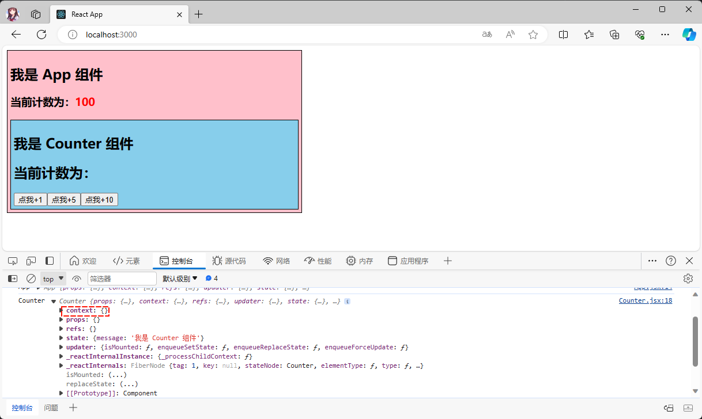

# 第一章：React 非父子的通信（了解）

## 1.1 名词解释

* `Context` 是英文中的一个词，指的是某个事物或事件发生的背景、`环境`或情境。
* 在编程中，`Context` 通常指的是`程序执行时`的`上下文环境`，包括`变量`、`函数调用栈`、`程序状态`等。

## 1.2 概述

* 在开发中，数据是通过 props 属性自上而下（由父及子）进行传递的，但此种用法对于某些类型的属性而言是极其繁琐的（例如：地区偏好，UI 主题），这些属性是应用程序中许多组件都需要的。
* 对于上述的问题，Vue 给出的解决方案是：`依赖注入`。


> 简单理解就是：
>
> * 在父组件中`提供`数据，在需要数据的任何子组件（不分层级）中，`注入`由父组件提供给整条链路的依赖。
> * 在编程模型中，我们将`提供`数据的组件，称为`生产者`；而`获取`数据的组件，称为`消费者`。

* 类似于 Vue 中，React 也提供了这样的编程方式，称为 Context ；React 中的 Context 提供了一种在组件之间共享值的方式，而不必显示的通过组件树逐层传递 props 。

## 1.3 React 非父子组件的通信 --- Context

### 1.3.1 概述

* 在 React 中，Context 是一个对象，由它来维护组件共享的数据。
* 方法：创建 Context 对象

```jsx
// defaultValue 是默认值，后续讲解
// ThemeContext 是 React.createContext 创建出来的对象，就是对象名称，见名知意即可
const ThemeContext = React.createContext(defaultValue);
```

* 方法：生产者提供数据

```js
<ThemeContext.Provider value={/*某个值*/}> </ThemeContext.Provider>
```

* 方法：消费者消费数据

```jsx
/* 不要感觉疑惑，这其实就是 React 中的默认插槽的写法；不理解，看我上一篇文章~  */
<ThemeContext.Consumer>
	{
        value => /* 基于 context 值进行渲染*/
    }
</ThemeContext.Consumer>
```

### 1.3.2 案例

* 需求：实现计数器中父组件中的 count 值传递给子组件。


* 项目结构：


* 基本功能搭建：
* 其中，App.jsx

```jsx
import React from 'react'
import Counter from "@/components/Counter"
class App extends React.Component {
  
  state = {
    message: '我是 App 组件',
    count: 100
  }
  
  render() {
    const {message, count} = this.state
    return (
      <div style={{backgroundColor: 'pink', width: "500px", padding: '5px', border: "1px solid black"}}>
        <h2>{message}</h2>
        <h3>当前计数为：<span style={{color: 'red'}}>{count}</span></h3>
        <Counter/>
      </div>
    )
  }
  
}

export default App
```

* 其中，Counter.jsx

```jsx
import React from 'react'

class Counter extends React.Component {
  
  state = {
    message: '我是 Counter 组件'
  }
  
  increment(num) {
  
  }
  
  render() {
    const {message} = this.state
    return (
      <div style={{backgroundColor: 'skyblue', padding: '5px', border: "1px solid black"}}>
        <h2>{message}</h2>
        <h2>当前计数为：</h2>
        <button onClick={() => this.increment(1)}>点我+1</button>
        <button onClick={() => this.increment(5)}>点我+5</button>
        <button onClick={() => this.increment(10)}>点我+10</button>
      </div>
    )
  }
}

export default Counter
```

* 示例：
* ① 全局创建唯一的 Context 对象：

```jsx {4}
import React from "react";

// 创建 Context 对象
const CounterContext = React.createContext()

// 导出
export default CounterContext
```


* ② 我们知道，App 组件是类式组件，并且 App 组件是生产者，那么就可以根据生产者的 API 提供数据：

```jsx {20-22}
import React from 'react'
import Counter from "@/components/Counter"
import CounterContext from "@/context/CounterContext";

class App extends React.Component {
  
  state = {
    message: '我是 App 组件',
    count: 100
  }
  
  render() {
    const {message, count} = this.state
    console.log('App', this)
    return (
      <div style={{backgroundColor: 'pink', width: "500px", padding: '5px', border: "1px solid black"}}>
        <h2>{message}</h2>
        <h3>当前计数为：<span style={{color: 'red'}}>{count}</span></h3>
        {/* 在 App 组件中，将 count 传递下去，因为 App 组件是生产者 */}
        <CounterContext.Provider value={count}>
          <Counter/>
        </CounterContext.Provider>
      </div>
    )
  }
  
}

export default App
```

* ③ 我们知道，Counter 组件是消费者；但是，Counter 组件是类式组件，可以通过 this 来访问：

```jsx {15}
import React from 'react'

class Counter extends React.Component {
  
  state = {
    message: '我是 Counter 组件'
  }
  
  increment(num) {
  
  }
  
  render() {
    const {message} = this.state
    console.log('Counter', this)
    return (
      <div style={{backgroundColor: 'skyblue', padding: '5px', border: "1px solid black"}}>
        <h2>{message}</h2>
        <h2>当前计数为：</h2>
        <button onClick={() => this.increment(1)}>点我+1</button>
        <button onClick={() => this.increment(5)}>点我+5</button>
        <button onClick={() => this.increment(10)}>点我+10</button>
      </div>
    )
  }
}

export default Counter
```

* 通过`浏览器`的`控制台`，显示如下：



* 在 Counter 组件身上有 context 属性；但是，没有值，怎么办？可以给类式组件的 `contextType 静态属性`赋值 Context 对象。

```jsx {7,24}
import React from 'react'
import CounterContext from "@/context/CounterContext";

class Counter extends React.Component {
  
  // 静态属性 contextType 赋值为 Context 对象
  static contextType = CounterContext
  
  state = {
    message: '我是 Counter 组件'
  }
  
  increment(num) {
  
  }
  
  render() {
    const {message} = this.state
    console.log('Counter', this)
    return (
      <div style={{backgroundColor: 'skyblue', padding: '5px', border: "1px solid black"}}>
        <h2>{message}</h2>
        {/* 通过 this.context 获取 */}
        <h2>当前计数为：{this.context}</h2>
        <button onClick={() => this.increment(1)}>点我+1</button>
        <button onClick={() => this.increment(5)}>点我+5</button>
        <button onClick={() => this.increment(10)}>点我+10</button>
      </div>
    )
  }
}

export default Counter
```

* 通过`浏览器`的`控制台`，显示如下：


* ④ 如果是函数式组件，this 是 undefined ；这是 React 的机制决定的，我们就可以使用 `Context.Consumer`了；当然，在类式组件中也可以使用。

```jsx {22-24}
import React from 'react'
import CounterContext from "@/context/CounterContext";

class Counter extends React.Component {
  
  
  state = {
    message: '我是 Counter 组件'
  }
  
  increment(num) {
  
  }
  
  render() {
    const {message} = this.state
    console.log('Counter', this)
    return (
      <div style={{backgroundColor: 'skyblue', padding: '5px', border: "1px solid black"}}>
        <h2>{message}</h2>
        {/* 通过 Context.Consumer 获取 */}
        <CounterContext.Consumer>
          {value => (<h2>当前计数为：{value} </h2>)}
        </CounterContext.Consumer>
        <button onClick={() => this.increment(1)}>点我+1</button>
        <button onClick={() => this.increment(5)}>点我+5</button>
        <button onClick={() => this.increment(10)}>点我+10</button>
      </div>
    )
  }
}

export default Counter
```

* 通过`浏览器`的`控制台`，显示如下：


### 1.3.3 默认值的场景

* 在一些系统中，是有默认主题的（此时，就需要用到默认值）；当然，我们也可以切换对应的主题。


* 并不是，所有消费者组件都会写在 `<CounterContext.Provider value={count}></CounterContext.Provider>` 中：

```jsx {23}
import React from 'react'
import Counter from "@/components/Counter"
import CounterContext from "@/context/CounterContext";

class App extends React.Component {
  
  state = {
    message: '我是 App 组件',
    count: 100
  }
  
  render() {
    const {message, count} = this.state
    console.log('App', this)
    return (
      <div style={{backgroundColor: 'pink', width: "500px", padding: '5px', border: "1px solid black"}}>
        <h2>{message}</h2>
        <h3>当前计数为：<span style={{color: 'red'}}>{count}</span></h3>
        {/* 在 App 组件中，将 count 传递下去，因为 App 组件是生产者 */}
        <CounterContext.Provider value={count}>
        </CounterContext.Provider>
        {/* 会使用默认值 */}
        <Counter/>
      </div>
    )
  }
  
}

export default App
```

* 此时，Counter 组件就会使用 `CounterContext` 对象的默认值；前提，是在初始化 `CounterContext` 对象的时候，设置了：

```js {4}
import React from "react";

// 创建 Context 对象，并设置默认值
const CounterContext = React.createContext(10)

// 导出
export default CounterContext
```

* 通过`浏览器`的`控制台`，显示如下：


### 1.3.4 总结

* 实际开发中，一般也不会这么使用；因为，一旦要共享的数据过多，就会形成组件的嵌套地狱。

```jsx
<ThemeConext.Provider value={theme}>
    <CounterContext.Provider value={count}>
      <Counter/>
    </CounterContext.Provider>
</ThemeConext.Provider>
```

## 1.4 事件总线

### 1.4.1 概述

* 可以借助`全局事件总线`来实现 React 非父子组件的通信，包括：祖孙组件之间的通信、兄弟组件之间的通信。

### 1.4.2 案例

* 需求：实现计数器功能。


* 项目结构：


* 安装全局事件总线库：

```shell
npm install mitt
```

* ① 初始化全局事件总线对象：

```jsx {2}
import mitt from 'mitt'
const emitter =  mitt()
export default emitter
```

* ② 在 App 组件中监听事件，并更新 state 中的数据：

```jsx {25-30,34}
import React from 'react'
import Counter from "@/components/Counter"
import emitter from '@/utils/mitts'

class App extends React.Component {
  
  state = {
    message: '我是 App 组件',
    count: 100
  }
  
  render() {
    const {message, count} = this.state
    return (
      <div style={{backgroundColor: 'pink', width: "500px", padding: '5px', border: "1px solid black"}}>
        <h2>{message}</h2>
        <h3>当前计数为：<span style={{color: 'red'}}>{count}</span></h3>
        <Counter/>
      </div>
    )
  }
  
  componentDidMount() {
    // 监听事件
    emitter.on('counter', (num) => {
      // 更新数据
      this.setState({
        count: this.state.count + num
      })
    })
  }
  
  componentWillUnmount() {
    emitter.all.clear()
  }
}

export default App
```

* ③ 在 Counter 组件中，发生事件和对应的数据：

```jsx {12}
import React from 'react'
import emitter from '@/utils/mitts'

class Counter extends React.Component {
  
  state = {
    message: '我是 Counter 组件'
  }
  
  increment(num) {
    // 发送数据
    emitter.emit('counter', num)
  }
  
  render() {
    const {message} = this.state
    return (
      <div style={{backgroundColor: 'skyblue', padding: '5px', border: "1px solid black"}}>
        <h2>{message}</h2>
        <button onClick={() => this.increment(1)}>点我+1</button>
        <button onClick={() => this.increment(5)}>点我+5</button>
        <button onClick={() => this.increment(10)}>点我+10</button>
      </div>
    )
  }
}

export default Counter
```

### 1.4.3 总结

* 实际开发中，一般也不会这么使用，因为不能统一的管理状态。


# 第二章：setState() 的使用详解

## 2.1 为什么需要使用 setState() ?

* 之所以，我们可以在类式组件中能调用 `setState()` 方法，是因为类式组件继承了 Component 类，而该类中有 `setState()` 方法：

```ts
class Component<P, S> {

    static contextType?: Context<any> | undefined;

    context: unknown;

    constructor(props: Readonly<P> | P);

    // 注意这里
    setState<K extends keyof S>(
        state: ((prevState: Readonly<S>, props: Readonly<P>) => Pick<S, K> | S | null) | (Pick<S, K> | S | null),
        callback?: () => void,
    ): void;

    forceUpdate(callback?: () => void): void;
    render(): ReactNode;

    readonly props: Readonly<P>;
    state: Readonly<S>;

    refs: {
        [key: string]: ReactInstance;
    };
}
```

* 在实际开发中，我们并不能直接通过修改 state 的值来让界面自动更新：
  * 原因在于：即使我们修改了 state 中的值，希望让 React 根据最新的 state 来重新渲染界面；是因为这样的方式，React 并不知道数据发生了变化。
  * React 并没有实现类似于 Vue2 中的 Object.defineProperty 或 Vue3 中的 Proxy 的方式来监听数据的变化。
  * 所以，我们必须通过 `setState()` 方法来告知 React 数据已经发生了变化。

## 2.2 setState() 方法的异步更新

### 2.2.1 扫清概念

* `同步`和`异步`是两种不同的编程模型：
  * 同步操作是指程序按照顺序执行，每个操作必须等待前一个操作完成后才能执行。在同步模型中，程序会阻塞等待操作完成，然后再继续执行下一个操作。
  * 异步操作是指程序不需要等待操作完成，可以继续执行后续的操作。在异步模型中，程序会提交一个操作，然后继续执行其他任务，当操作完成后会通过回调函数或者事件通知的方式来处理结果。
  
* 简而言之，同步操作是按照顺序执行，需要等待操作完成，而异步操作则是提交后继续执行，不需要等待操作完成。异步操作通常可以提高程序的性能和响应速度。

* 通俗的理解：`同步`就是`排队取餐`。


* 通俗的理解：`异步`就是`叫号取餐`。


### 2.2.2 证明

* 项目结构：


* 示例：

```jsx {10-12,13}
import React from 'react'

class App extends React.Component {
  
  state = {
    message: 'Hello React'
  }
  
  change() {
    this.setState({
      message: "Hello React18"
    })
    console.log(this.state.message)
  }
  
  render() {
    return (
      <div>
        <h2>{this.state.message}</h2>
        <button onClick={() => this.change()}>改变文本</button>
      </div>
    )
  }
}

export default App
```

* 通过`浏览器`的`控制台`，显示如下：


> 结论：从上述的结果就可以得知，`setState() 方法`是`异步`操作，我们并不能在执行完 `setState() 方法`之后立马拿到 state 的结果。

### 2.2.3 为什么要设计成异步？

* 原因如下：
  * ① 设计成异步，可以显著的提升性能：
    * 如果每次调用 setState() 方法都进行一次更新，那么就意味着 render() 方法会被频繁的调用，界面需要重新渲染，这样的效率太低了。
    * 最佳的方法是获取到多个更新之后，进行批量更新。
  * ② 如果同步更新了 state ，但是还没有执行 render() 方法，那么有可能 state 和 props 不能保持同步，会在开发中产生很多问题。

## 2.3 setState() 方法的使用写法

* setState 方法的定义如下：

```ts
setState<K extends keyof S>(
            state: ((prevState: Readonly<S>, props: Readonly<P>) => Pick<S, K> | S | null) | (Pick<S, K> | S | null),
            callback?: () => void,
        ): void;
```


* 示例：基本使用

```jsx {11-13}
import React from 'react'

class App extends React.Component {
  
  state = {
    message: 'Hello React'
  }
  
  change() {
    // 基本使用
    this.setState({
      message: "Hello React18"
    })
    console.log(this.state.message)
  }
  
  render() {
    return (
      <div>
        <h2>{this.state.message}</h2>
        <button onClick={() => this.change()}>改变文本</button>
      </div>
    )
  }
}

export default App
```


* 示例：传入一个回调函数

```ts {11-18}
import React from 'react'

class App extends React.Component {
  
  state = {
    message: 'Hello React'
  }
  
  change() {
    // 传入回调函数，会将之前的 state 和 props 传递进来
    this.setState((prevState, props) => {
      // 获取之前的 state 和 props 
      // 增加一些对新的 state 的处理
      console.log('change', prevState, props )
      return {
        message: "Hello React18"
      }
    })
    console.log(this.state.message)
  }
  
  render() {
    return (
      <div>
        <h2>{this.state.message}</h2>
        <button onClick={() => this.change()}>改变文本</button>
      </div>
    )
  }
}

export default App
```


* 示例：第二个参数，传入回调函数；可以获取异步回调的结果

```jsx {11-14}
import React from 'react'

class App extends React.Component {
  
  state = {
    message: 'Hello React'
  }
  
  change() {
    // 第二个参数传入回调函数
    this.setState({message: "Hello React18"}, () => {
      // 可以获取数据更新在之后的结果
      console.log('change', this.state.message) // change Hello React18
    })
    console.log(this.state.message) // Hello React
  }
  
  render() {
    return (
      <div>
        <h2>{this.state.message}</h2>
        <button onClick={() => this.change()}>改变文本</button>
      </div>
    )
  }
}

export default App
```

## 2.4 setState() 方法默认是异步的

* 在 React18 之后，默认所有的操作都被放入到了批处理中；换言之，是异步的。


* 如果希望可以同步获取，则需要执行特殊的 flushSync 操作（了解）。

```jsx {12-18}
import React from 'react'
import {flushSync} from "react-dom";

class App extends React.Component {
  
  state = {
    message: 'Hello React'
  }
  
  change() {
    
    flushSync(() => {
      // 第二个参数传入回调函数
      this.setState({message: "Hello React18"}, () => {
        // 可以获取数据更新在之后的结果
        console.log('change', this.state.message) // change Hello React18
      })
    })
 
    console.log(this.state.message) // Hello React18
  }
  
  render() {
    return (
      <div>
        <h2>{this.state.message}</h2>
        <button onClick={() => this.change()}>改变文本</button>
      </div>
    )
  }
}

export default App
```

