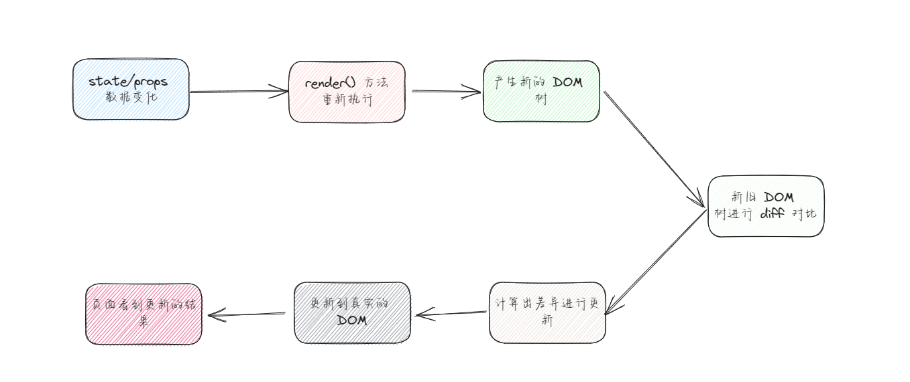

# 第一章：React 性能优化 SCU

## 1.1 React 的更新机制

### 1.1.1 概述

* 之前，我们已经学习过 React 的[渲染机制](https://aexiar.github.io/web-design/notes/07_React18/01_xdx/#_3-7-jsx-%E6%9C%AC%E8%B4%A8)：


* 那么，React 的更新流程，是怎么样的？



### 1.1.2 React 的 Diff 算法优化

* 我们知道，DOM 树就是一颗树，如下图所示：


* 传统的 DOM diff 算法的时间复杂度是 O(n^3) ，如下图所示：


* 如何计算的？如下所示：


* 不管怎么样，如果 React 采取这样的算法，那么 React 的更新性能将会变得非常的低下。
* 于是，React 就对这种算法进行了优化，将其优化成 O(n)，优化如下：
  * ① 同层节点之间相互比较，不会跨节点比较。
  * ② 不同类型的节点，产生不同的树结构。
  * ③ ……
* 所以，在开发中，我们可以通过 key 来指定节点，以便 React 在不同的渲染下能保持稳定。

### 1.1.3 key 的优化

* 我们在遍历数据的时候，需要指定 key 属性，要求如下：
  * ① key  需要是唯一的。
  * ② key 不能使用随机数。
  * ③ 是一个 index 作为 key ，对性能没有什么优化。

## 1.2 render 函数的调用

* 借用[组件嵌套](https://aexiar.github.io/web-design/notes/07_React18/03_xdx/#_3-1-%E7%BB%84%E4%BB%B6%E7%9A%84%E5%B5%8C%E5%A5%97)案例，如果我们在 App 组件中，增加计数器的功能，render 函数会调用几次？


* 示例：

```jsx {22}
import React from 'react'
import Header from "@/components/Header"
import Main from "@/components/Main"
import Footer from "@/components/Footer"

class App extends React.Component {
  
  constructor(props) {
    super(props);
    this.state = {
      message: "我是 App 组件",
      count: 1
    }
  }
  
  add(){
    this.setState({count: this.state.count + 1})
  }
  
  render() {
    const {message,count} = this.state
    console.log('App render')
    return (
      <div style={{backgroundColor: 'pink', width: "500px", padding: '5px', border: "1px solid black"}}>
        <h2>{message}</h2>
        <h2>当前计数为：{count}</h2>
        <button onClick={() => this.add()}>+1</button>
        <Header/>
        <Main/>
        <Footer/>
      </div>
    )
  }
}

export default App
```

```jsx {14}
import React from 'react'

class Header extends React.Component {
  
  constructor(props) {
    super(props);
    this.state = {
      message: "我是 Header 组件"
    }
  }
  
  render() {
    const {message} = this.state
    console.log('Header render')
    return (
      <div style={{backgroundColor: 'skyblue', padding: '5px', border: "1px solid black"}}>
        <h2>{message}</h2>
      </div>
    )
  }
}

export default Header
```

```jsx {16}
import React from 'react'
import Banner from "@/components/Banner"
import ProductList from "@/components/ProductList"

class Main extends React.Component {
  
  constructor(props) {
    super(props);
    this.state = {
      message: "我是 Main 组件"
    }
  }
  
  render() {
    const {message} = this.state
    console.log('Main render')
    return (
      <div style={{backgroundColor: 'orange', padding: '5px',marginTop: '20px',marginBottom: '20px', border: "1px solid black"}}>
        <h2>{message}</h2>
        <Banner/>
        <ProductList/>
      </div>
    )
  }
}

export default Main
```

```jsx {14}
import React from 'react'

class Footer extends React.Component {
  
  constructor(props) {
    super(props);
    this.state = {
      message: "我是 Footer 组件"
    }
  }
  
  render() {
    const {message} = this.state
    console.log('Footer render')
    return (
      <div style={{backgroundColor: 'sienna', padding: '5px', border: "1px solid black"}}>
        <h2>{message}</h2>
      </div>
    )
  }
}

export default Footer
```

```jsx {14}
import React from 'react'

class Banner extends React.Component {
  
  constructor(props) {
    super(props);
    this.state = {
      message: "我是 Banner 组件"
    }
  }
  
  render() {
    const {message} = this.state
    console.log('Banner render')
    return (
      <div style={{backgroundColor: 'mediumseagreen',  padding: '5px',marginBottom: '20px', border: "1px solid black"}}>
        <h2>{message}</h2>
      </div>
    )
  }
}

export default Banner
```

```jsx {14}
import React from 'react'

class ProductList extends React.Component {
  
  constructor(props) {
    super(props);
    this.state = {
      message: "我是 ProductList 组件"
    }
  }
  
  render() {
    const {message} = this.state
    console.log('ProductList render')
    return (
      <div style={{backgroundColor: 'lightsalmon',  padding: '5px', border: "1px solid black"}}>
        <h2>{message}</h2>
      </div>
    )
  }
}

export default ProductList
```


* 通过`浏览器`上的`点击`按钮，查看`控制台`显示效果：


* 我们会发现如下的问题：
  * 初次渲染，所有组件都调用 render() 方法，没什么毛病。
  * 但是，只有 App 组件中的 state 发生了变化，所有的后代组件也都重新执行了 render() 方法，这性能也太差了吧。

* 其实，我们想要的结果就是：如果后代组件的 state 或 props 没有变化，那么就不要重新调用 render() 方法，怎么办？通过 `shouldComponentUpdate` 生命周期方法即可。

## 1.3 shouldComponentUpdate 生命周期

* React 给我们提供了 shouldComponentUpdate() 生命周期（也有人称为 SCU），这个方法的定义如下：

```ts
shouldComponentUpdate?(nextProps: Readonly<P>, nextState: Readonly<S>, nextContext: any): boolean;
```

* 参数：
  * nextProps：表示修改之后，最新的 props 值。
  * nextState：表示修改之后，最新的 state 值。
* 返回值：
  * 如果为 true，就会调用 render 方法（默认值）。
  * 如果为 false，就不会调用 render 方法。

> 注意：在React中，默认情况下，当父组件的 `shouldComponentUpdate` 返回 `true` 时，即使子组件的状态（`state`）没有变化，子组件仍然会重新执行 `render` 方法。
>
> * 这是因为 React 默认情况下无法确定子组件的状态是否发生了变化。即使子组件的`state`没有直接变化，但是父组件的 `render` 方法可能会导致子组件的 `props` 发生变化，从而触发子组件的重新渲染。
> * 为了避免不必要的渲染，可以在子组件中使用 `shouldComponentUpdate` 方法来进行优化。在 `shouldComponentUpdate` 中，可以根据具体的业务逻辑判断是否需要重新渲染子组件。如果确定子组件的 `state` 没有变化，可以返回 `false` ，以避免不必要的渲染。

* React 的`生命周期`图例，如下：


* 那么，我们就可以使用 `shouldComponentUpdate` 生命周期方法来改造代码：

```jsx {23-30}
import React from 'react'

class Header extends React.Component {
  
  constructor(props) {
    super(props);
    this.state = {
      message: "我是 Header 组件"
    }
  }
  
  render() {
    const {message} = this.state
    console.log('Header render')
    return (
      <div style={{backgroundColor: 'skyblue', padding: '5px', border: "1px solid black"}}>
        <h2>{message}</h2>
      </div>
    )
  }
  
  // 生命周期方法
  shouldComponentUpdate(nextProps, nextState, nextContext) {
    // 如果 message 发生了变化，则返回 true，让其调用 render 函数，否则返回 false。
    if (this.state.message !== nextState.message) {
      return true
    }
    return false
  }
}

export default Header
```

```jsx {27-32}
import React from 'react'
import Banner from "@/components/Banner"
import ProductList from "@/components/ProductList"

class Main extends React.Component {
  
  constructor(props) {
    super(props);
    this.state = {
      message: "我是 Main 组件"
    }
  }
  
  render() {
    const {message} = this.state
    console.log('Main render')
    return (
      <div style={{backgroundColor: 'orange', padding: '5px',marginTop: '20px',marginBottom: '20px', border: "1px solid black"}}>
        <h2>{message}</h2>
        <Banner/>
        <ProductList/>
      </div>
    )
  }
  
  // 生命周期方法
  shouldComponentUpdate(nextProps, nextState, nextContext) {
    if (this.state.message !== nextState.message) {
      return true
    }
    return false
  }
}

export default Main
```

```jsx {23-29}
import React from 'react'

class Footer extends React.Component {
  
  constructor(props) {
    super(props);
    this.state = {
      message: "我是 Footer 组件"
    }
  }
  
  render() {
    const {message} = this.state
    console.log('Footer render')
    return (
      <div style={{backgroundColor: 'sienna', padding: '5px', border: "1px solid black"}}>
        <h2>{message}</h2>
      </div>
    )
  }
  
  // 生命周期方法
  shouldComponentUpdate(nextProps, nextState, nextContext) {
    // 如果 message 发生了变化，则返回 true，让其调用 render 函数，否则返回 false。
    if (this.state.message !== nextState.message) {
      return true
    }
    return false
  }
}

export default Footer
```

```jsx {23-28}
import React from 'react'

class Banner extends React.Component {
  
  constructor(props) {
    super(props);
    this.state = {
      message: "我是 Banner 组件"
    }
  }
  
  render() {
    const {message} = this.state
    console.log('Banner render')
    return (
      <div style={{backgroundColor: 'mediumseagreen',  padding: '5px',marginBottom: '20px', border: "1px solid black"}}>
        <h2>{message}</h2>
      </div>
    )
  }
  
  // 生命周期方法
  shouldComponentUpdate(nextProps, nextState, nextContext) {
    if (this.state.message !== nextState.message) {
      return true
    }
    return false
  }
}

export default Banner
```

```jsx {23-28}
import React from 'react'

class ProductList extends React.Component {
  
  constructor(props) {
    super(props);
    this.state = {
      message: "我是 ProductList 组件"
    }
  }
  
  render() {
    const {message} = this.state
    console.log('ProductList render')
    return (
      <div style={{backgroundColor: 'lightsalmon',  padding: '5px', border: "1px solid black"}}>
        <h2>{message}</h2>
      </div>
    )
  }
  
  // 生命周期方法
  shouldComponentUpdate(nextProps, nextState, nextContext) {
    if (this.state.message !== nextState.message) {
      return true
    }
    return false
  }
}

export default ProductList
```

* 通过`浏览器`上的`点击`按钮，查看`控制台`显示效果：


* 如果都这么开发的话，那重复的代码未免太多了吧。怎么办？其实，官方提供了一个 React.Component 类的实现类 PureComponent 类，可以大大降低我们开发的工作量。

## 1.4 PureComponent

* 查看 PureComponent 的 TS 定义：

```ts
class PureComponent<P = {}, S = {}, SS = any> extends Component<P, S, SS> {}
```

* 那么，我们只需要继承该类就可以了，这就是继承的好处。
* 其中，PureComponent 类中的  shouldComponentUpdate 方法的相关实现如下：

```js {12,48}
function checkShouldComponentUpdate(
  workInProgress: Fiber,
  ctor: any,
  oldProps: any,
  newProps: any,
  oldState: any,
  newState: any,
  nextContext: any,
) {
  const instance = workInProgress.stateNode;
  // 如果我们自己继承了 Component，并实现了 shouldComponentUpdate 就调用我们自己实现的 shouldComponentUpdate 
  if (typeof instance.shouldComponentUpdate === 'function') {
    let shouldUpdate = instance.shouldComponentUpdate(
      newProps,
      newState,
      nextContext,
    );
    if (__DEV__) {
      if (
        debugRenderPhaseSideEffectsForStrictMode &&
        workInProgress.mode & StrictLegacyMode
      ) {
        setIsStrictModeForDevtools(true);
        try {
          // Invoke the function an extra time to help detect side-effects.
          shouldUpdate = instance.shouldComponentUpdate(
            newProps,
            newState,
            nextContext,
          );
        } finally {
          setIsStrictModeForDevtools(false);
        }
      }
      if (shouldUpdate === undefined) {
        console.error(
          '%s.shouldComponentUpdate(): Returned undefined instead of a ' +
            'boolean value. Make sure to return true or false.',
          getComponentNameFromType(ctor) || 'Component',
        );
      }
    }

    return shouldUpdate;
  }
  
  // 如果我们继承了 PureComponent ，并且没有自己实现 shouldComponentUpdate 方法，就执行下面的逻辑
  if (ctor.prototype && ctor.prototype.isPureReactComponent) {
    return (
      // 比较就得 props 和 新的 props ，会进行浅层比较  
      // 浅层比较的结果，如果 true，那么就取反；意味着，只有不相等，才会去更新~  
      !shallowEqual(oldProps, newProps) || !shallowEqual(oldState, newState)
    );
  }

  return true;
}
```

* shallowEqual 方法的定义如下：

```js
// objA 和 objB 就类似于 oldProps, newProps 和 oldState, newState
function shallowEqual(objA: mixed, objB: mixed): boolean {
  // 判断两个对象是否是同一个对象，如果是，则返回 true
  if (is(objA, objB)) {
    return true;
  }

  if (
    typeof objA !== 'object' ||
    objA === null ||
    typeof objB !== 'object' ||
    objB === null
  ) {
    return false;
  }

  // 获取 props 和 state 对象中的 key
  const keysA = Object.keys(objA);
  const keysB = Object.keys(objB);

  // 假设 oldProps 中的 key 中的数量 和 newProps 中的数量不相等，就返回 false ，即 oldProps 和 newProps 不一致
  if (keysA.length !== keysB.length) {
    return false;
  }

  // 在 key 数量一致的情况下，比较第一层的 key 对应的 value 是否相等
  // Test for A's keys different from B.
  for (let i = 0; i < keysA.length; i++) {
    const currentKey = keysA[i];
    if (
      !hasOwnProperty.call(objB, currentKey) ||
      // $FlowFixMe[incompatible-use] lost refinement of `objB`
      !is(objA[currentKey], objB[currentKey])
    ) {
      return false;
    }
  }

  return true;
}
```

* 那么，我们就可以使用 PureComponent 类来改造我们的代码：

```jsx {6}
import React, {PureComponent} from 'react'
import Header from "@/components/Header"
import Main from "@/components/Main"
import Footer from "@/components/Footer"

class App extends PureComponent {
  
  constructor(props) {
    super(props);
    this.state = {
      message: "我是 App 组件",
      count: 1
    }
  }
  
  add() {
    const {count} = this.state
    this.setState({count: count + 1})
  }
  
  render() {
    const {message, count} = this.state
    console.log('App render')
    return (
      <div style={{backgroundColor: 'pink', width: "500px", padding: '5px', border: "1px solid black"}}>
        <h2>{message}</h2>
        <h2>当前计数为：{count}</h2>
        <button onClick={() => this.add()}>+1</button>
        <Header/>
        <Main/>
        <Footer/>
      </div>
    )
  }
}

export default App
```

```jsx {3}
import React, {PureComponent} from 'react'

class Header extends PureComponent {
  
  constructor(props) {
    super(props);
    this.state = {
      message: "我是 Header 组件"
    }
  }
  
  render() {
    const {message} = this.state
    console.log('Header render')
    return (
      <div style={{backgroundColor: 'skyblue', padding: '5px', border: "1px solid black"}}>
        <h2>{message}</h2>
      </div>
    )
  }
  
}

export default Header
```

```jsx {5}
import React, {PureComponent} from 'react'
import Banner from "@/components/Banner"
import ProductList from "@/components/ProductList"

class Main extends PureComponent {
  
  constructor(props) {
    super(props);
    this.state = {
      message: "我是 Main 组件"
    }
  }
  
  render() {
    const {message} = this.state
    console.log('Main render')
    return (
      <div style={{
        backgroundColor: 'orange',
        padding: '5px',
        marginTop: '20px',
        marginBottom: '20px',
        border: "1px solid black"
      }}>
        <h2>{message}</h2>
        <Banner/>
        <ProductList/>
      </div>
    )
  }
  
}

export default Main
```

```jsx {3}
import React, {PureComponent} from 'react'

class Footer extends PureComponent {
  
  constructor(props) {
    super(props);
    this.state = {
      message: "我是 Footer 组件"
    }
  }
  
  render() {
    const {message} = this.state
    console.log('Footer render')
    return (
      <div style={{backgroundColor: 'sienna', padding: '5px', border: "1px solid black"}}>
        <h2>{message}</h2>
      </div>
    )
  }
  
 
}

export default Footer
```

```jsx {3}
import React, {PureComponent} from 'react'

class Banner extends PureComponent {
  constructor(props) {
    super(props);
    this.state = {
      message: "我是 Banner 组件"
    }
  }
  
  render() {
    const {message} = this.state
    console.log('Banner render')
    return (
      <div style={{backgroundColor: 'mediumseagreen', padding: '5px', marginBottom: '20px', border: "1px solid black"}}>
        <h2>{message}</h2>
      </div>
    )
  }
  
}

export default Banner
```

``` jsx {3}
import React, {PureComponent} from 'react'

class ProductList extends PureComponent {
  
  constructor(props) {
    super(props);
    this.state = {
      message: "我是 ProductList 组件"
    }
  }
  
  render() {
    const {message} = this.state
    console.log('ProductList render')
    return (
      <div style={{backgroundColor: 'lightsalmon', padding: '5px', border: "1px solid black"}}>
        <h2>{message}</h2>
      </div>
    )
  }
  
}

export default ProductList
```

* 通过`浏览器`上的`点击`按钮，查看`控制台`显示效果：


> 注意：类式组件是可以继承 PureComponent 类的，函数式组件可不能继承 PureComponent 类的；此时，函数式组件就需要使用 `React.memo()` 高阶组件了。

* 改造其中一个子组件，是其变为函数式组件，并使用 `React.memo()`高阶组件包装使其进行浅层比较：

```jsx {4}
import React, {memo, useState} from 'react'


const Footer = memo(function Footer() {
  
  const [message] = useState('我是 Footer 组件')
  
  console.log('Footer render')
  
  return (
    <div style={{backgroundColor: 'sienna', padding: '5px', border: "1px solid black"}}>
      <h2>{message}</h2>
    </div>
  )
})


export default Footer
```

* 通过`浏览器`上的`点击`按钮，查看`控制台`显示效果：


## 1.5 不可变数据的力量

### 1.5.1 概述

* 我们知道，PureComponent 类使用的是 shallowEqual 方法来进行比较的，是浅层比较的，难道有什么问题？

* 之前，我们实现过[购物车](https://aexiar.github.io/web-design/notes/07_React18/01_xdx/#_3-10-%E8%B4%AD%E7%89%A9%E8%BD%A6%E6%A1%88%E4%BE%8B)的案例；但是，我们当时是在 `html` 中完成的；现在，我们将复制到工程中。
* 项目结构：


* 基本功能搭建：
* 其中，App.css

```css
table {
    border-collapse: collapse;
    text-align: center;
}

table th, td {
    border: 1px solid black;
    padding: 8px 16px;
}

table thead {
    background-color: #f5f5f5;
}

.active {
    background-color: pink;
}

```

* 其中，App.jsx

```jsx {51,68}
import React, {Component} from 'react'
import '@/App.css'

class App extends Component {
  
  state = {
    books: [
      {
        id: 1,
        name: '《算法导论》',
        date: '2006-9',
        price: 85.00,
        count: 1
      },
      {
        id: 2,
        name: '《UNIX编程艺术》',
        date: '2006-2',
        price: 59.00,
        count: 1
      },
      {
        id: 3,
        name: '《编程珠玑》',
        date: '2008-10',
        price: 39.00,
        count: 1
      },
      {
        id: 4,
        name: '《代码大全》',
        date: '2006-3',
        price: 128.00,
        count: 1
      },
      {
        id: 5,
        name: '《你不知道的JavaScript》',
        date: '2014-8',
        price: 88.00,
        count: 1
      },
    ]
  }
  
  // 改变购物车中书籍的数量，如果不传递 num ，就是新增；否则，传递 -1 就是减少
  changeCount(id, num = 1) {
    const {books} = this.state
    
    if (id) {
      const newBooks = books.map(book => {
        if (book.id === id) {
          book.count += num
        }
        return book
      })
      this.setState({
        books: newBooks
      })
    }
  }
  
  // 删除购物车中的书籍
  delete(id) {
    const {books} = this.state
    
    if (id) {
      const newBooks = books.filter(book => book.id !== id)
      this.setState({
        books: newBooks
      })
    }
  }
  
  // 当购物车中的书籍数据不为空的时候的渲染函数
  renderBookList() {
    const {books} = this.state
    const totalPrice = books.map(item => item.price * item.count).reduce((prev, next) => prev + next, 0)
    return (<div>
      <table>
        <thead>
          <tr>
            <th>序号</th>
            <th>书籍名称</th>
            <th>出版日期</th>
            <th>价格</th>
            <th>购买数量</th>
            <th>操作</th>
          </tr>
        </thead>
        <tbody>
          {
            books && books.map((book, index) => {
              return (
                <tr key={index}>
                  <td>{index}</td>
                  <td>{book.name}</td>
                  <td>{book.date}</td>
                  <td>{"¥" + book.price.toFixed(2)}</td>
                  <td>
                    <button disabled={book.count <= 1} onClick={() => this.changeCount(book.id, -1)}>-</button>
                    {book.count}
                    <button onClick={() => this.changeCount(book.id)}>+</button>
                  </td>
                  <td>
                    <button onClick={() => this.delete(book.id)}>移除</button>
                  </td>
                </tr>
              )
            })
          }
        </tbody>
        <tfoot>
          <tr>
            <td colSpan="6">总价格：{"¥" + totalPrice.toFixed(2)}</td>
          </tr>
        </tfoot>
      </table>
    </div>)
  }
  
  // 当购物车中的书籍数据为空的时候的渲染函数
  renderBookEmpty() {
    return (<div>暂无数据</div>)
  }
  
  render() {
    const {books} = this.state
    return books.length ? this.renderBookList() : this.renderBookEmpty()
  }
}

export default App
```

* 通过`浏览器`，查看`控制台`显示效果：


* 功能很正常，之前我们是继承 Component 类的；现在，改为 PureComponent 类：

```jsx {4,51,68}
import React, {PureComponent} from 'react'
import '@/App.css'

class App extends PureComponent {
  
  state = {
    books: [
      {
        id: 1,
        name: '《算法导论》',
        date: '2006-9',
        price: 85.00,
        count: 1
      },
      {
        id: 2,
        name: '《UNIX编程艺术》',
        date: '2006-2',
        price: 59.00,
        count: 1
      },
      {
        id: 3,
        name: '《编程珠玑》',
        date: '2008-10',
        price: 39.00,
        count: 1
      },
      {
        id: 4,
        name: '《代码大全》',
        date: '2006-3',
        price: 128.00,
        count: 1
      },
      {
        id: 5,
        name: '《你不知道的JavaScript》',
        date: '2014-8',
        price: 88.00,
        count: 1
      },
    ]
  }
  
  // 改变购物车中书籍的数量，如果不传递 num ，就是新增；否则，传递 -1 就是减少
  changeCount(id, num = 1) {
    const {books} = this.state
    
    if (id) {
      const newBooks = books.map(book => {
        if (book.id === id) {
          book.count += num
        }
        return book
      })
      this.setState({
        books: newBooks
      })
    }
  }
  
  // 删除购物车中的书籍
  delete(id) {
    const {books} = this.state
    
    if (id) {
      const newBooks = books.filter(book => book.id !== id)
      this.setState({
        books: newBooks
      })
    }
  }
  
  // 当购物车中的书籍数据不为空的时候的渲染函数
  renderBookList() {
    const {books} = this.state
    const totalPrice = books.map(item => item.price * item.count).reduce((prev, next) => prev + next, 0)
    return (<div>
      <table>
        <thead>
          <tr>
            <th>序号</th>
            <th>书籍名称</th>
            <th>出版日期</th>
            <th>价格</th>
            <th>购买数量</th>
            <th>操作</th>
          </tr>
        </thead>
        <tbody>
          {
            books && books.map((book, index) => {
              return (
                <tr key={index}>
                  <td>{index}</td>
                  <td>{book.name}</td>
                  <td>{book.date}</td>
                  <td>{"¥" + book.price.toFixed(2)}</td>
                  <td>
                    <button disabled={book.count <= 1} onClick={() => this.changeCount(book.id, -1)}>-</button>
                    {book.count}
                    <button onClick={() => this.changeCount(book.id)}>+</button>
                  </td>
                  <td>
                    <button onClick={() => this.delete(book.id)}>移除</button>
                  </td>
                </tr>
              )
            })
          }
        </tbody>
        <tfoot>
          <tr>
            <td colSpan="6">总价格：{"¥" + totalPrice.toFixed(2)}</td>
          </tr>
        </tfoot>
      </table>
    </div>)
  }
  
  // 当购物车中的书籍数据为空的时候的渲染函数
  renderBookEmpty() {
    return (<div>暂无数据</div>)
  }
  
  render() {
    const {books} = this.state
    return books.length ? this.renderBookList() : this.renderBookEmpty()
  }
}

export default App
```

* 通过`浏览器`，查看`控制台`显示效果：


* 其实，之前我们就已经下意识的规避了一个问题：我们在更新 `数组` 数据的时候，是创建一个新的 `数组` ，在调用 setState() 方法的：

```jsx {51,70}
import React, {PureComponent} from 'react'
import '@/App.css'

class App extends PureComponent {
  
  state = {
    books: [
      {
        id: 1,
        name: '《算法导论》',
        date: '2006-9',
        price: 85.00,
        count: 1
      },
      {
        id: 2,
        name: '《UNIX编程艺术》',
        date: '2006-2',
        price: 59.00,
        count: 1
      },
      {
        id: 3,
        name: '《编程珠玑》',
        date: '2008-10',
        price: 39.00,
        count: 1
      },
      {
        id: 4,
        name: '《代码大全》',
        date: '2006-3',
        price: 128.00,
        count: 1
      },
      {
        id: 5,
        name: '《你不知道的JavaScript》',
        date: '2014-8',
        price: 88.00,
        count: 1
      },
    ]
  }
  
  // 改变购物车中书籍的数量，如果不传递 num ，就是新增；否则，传递 -1 就是减少
  changeCount(id, num = 1) {
    const {books} = this.state
    
    if (id) {
      const newBooks = books.map(book => {
        if (book.id === id) {
          book.count += num
        }
        return book
      })
      
      console.log('changeCount', newBooks === books) // false
      this.setState({
        books: newBooks
      })
    }
  }
  
  // 删除购物车中的书籍
  delete(id) {
    const {books} = this.state
    
    if (id) {
      const newBooks = books.filter(book => book.id !== id)
      
      console.log('delete', newBooks === books) // false
      this.setState({
        books: newBooks
      })
    }
  }
  
  // 当购物车中的书籍数据不为空的时候的渲染函数
  renderBookList() {
    const {books} = this.state
    const totalPrice = books.map(item => item.price * item.count).reduce((prev, next) => prev + next, 0)
    return (<div>
      <table>
        <thead>
          <tr>
            <th>序号</th>
            <th>书籍名称</th>
            <th>出版日期</th>
            <th>价格</th>
            <th>购买数量</th>
            <th>操作</th>
          </tr>
        </thead>
        <tbody>
          {
            books && books.map((book, index) => {
              return (
                <tr key={index}>
                  <td>{index}</td>
                  <td>{book.name}</td>
                  <td>{book.date}</td>
                  <td>{"¥" + book.price.toFixed(2)}</td>
                  <td>
                    <button disabled={book.count <= 1} onClick={() => this.changeCount(book.id, -1)}>-</button>
                    {book.count}
                    <button onClick={() => this.changeCount(book.id)}>+</button>
                  </td>
                  <td>
                    <button onClick={() => this.delete(book.id)}>移除</button>
                  </td>
                </tr>
              )
            })
          }
        </tbody>
        <tfoot>
          <tr>
            <td colSpan="6">总价格：{"¥" + totalPrice.toFixed(2)}</td>
          </tr>
        </tfoot>
      </table>
    </div>)
  }
  
  // 当购物车中的书籍数据为空的时候的渲染函数
  renderBookEmpty() {
    return (<div>暂无数据</div>)
  }
  
  render() {
    const {books} = this.state
    return books.length ? this.renderBookList() : this.renderBookEmpty()
  }
}

export default App
```

* 如果不这么做，直接在原来数组上修改呢？

```jsx {79}
import React, {PureComponent} from 'react'
import '@/App.css'

class App extends PureComponent {
  
  state = {
    books: [
      {
        id: 1,
        name: '《算法导论》',
        date: '2006-9',
        price: 85.00,
        count: 1
      },
      {
        id: 2,
        name: '《UNIX编程艺术》',
        date: '2006-2',
        price: 59.00,
        count: 1
      },
      {
        id: 3,
        name: '《编程珠玑》',
        date: '2008-10',
        price: 39.00,
        count: 1
      },
      {
        id: 4,
        name: '《代码大全》',
        date: '2006-3',
        price: 128.00,
        count: 1
      },
      {
        id: 5,
        name: '《你不知道的JavaScript》',
        date: '2014-8',
        price: 88.00,
        count: 1
      },
    ]
  }
  
  // 改变购物车中书籍的数量，如果不传递 num ，就是新增；否则，传递 -1 就是减少
  changeCount(id, num = 1) {
    const {books} = this.state
    
    if (id) {
      const newBooks = books.map(book => {
        if (book.id === id) {
          book.count += num
        }
        return book
      })
      
      console.log('changeCount', newBooks === books) // false
      this.setState({
        books: newBooks
      })
    }
  }
  
  // 删除购物车中的书籍
  delete(id) {
    /*  const {books} = this.state
      
      if (id) {
        const newBooks = books.filter(book => book.id !== id)
        
        console.log('delete', newBooks === books) // false
        this.setState({
          books: newBooks
        })
      }*/
    
    if (id) {
      this.state.books.splice(this.state.books.findIndex(item => item.id === id), 1);
      console.log('delete', this.state.books)
      this.setState({ // 在原先的数组上修改
        books: this.state.books
      })
    }
  }
  
  // 当购物车中的书籍数据不为空的时候的渲染函数
  renderBookList() {
    const {books} = this.state
    const totalPrice = books.map(item => item.price * item.count).reduce((prev, next) => prev + next, 0)
    return (<div>
      <table>
        <thead>
          <tr>
            <th>序号</th>
            <th>书籍名称</th>
            <th>出版日期</th>
            <th>价格</th>
            <th>购买数量</th>
            <th>操作</th>
          </tr>
        </thead>
        <tbody>
          {
            books && books.map((book, index) => {
              return (
                <tr key={index}>
                  <td>{index}</td>
                  <td>{book.name}</td>
                  <td>{book.date}</td>
                  <td>{"¥" + book.price.toFixed(2)}</td>
                  <td>
                    <button disabled={book.count <= 1} onClick={() => this.changeCount(book.id, -1)}>-</button>
                    {book.count}
                    <button onClick={() => this.changeCount(book.id)}>+</button>
                  </td>
                  <td>
                    <button onClick={() => this.delete(book.id)}>移除</button>
                  </td>
                </tr>
              )
            })
          }
        </tbody>
        <tfoot>
          <tr>
            <td colSpan="6">总价格：{"¥" + totalPrice.toFixed(2)}</td>
          </tr>
        </tfoot>
      </table>
    </div>)
  }
  
  // 当购物车中的书籍数据为空的时候的渲染函数
  renderBookEmpty() {
    return (<div>暂无数据</div>)
  }
  
  render() {
    const {books} = this.state
    return books.length ? this.renderBookList() : this.renderBookEmpty()
  }
}

export default App
```

* 通过`浏览器`，查看`控制台`显示效果：


* 数据是删除了，但是界面却没有更新？出现 bug 了，那是因为 PureComponent 就是进行浅层比较；上述案例中的 state 中 books 属性所指向的数组是同一个，当然不会更新了。

> 注意：在实际开发中，React 建议我们不要在原有的 state 或 props 去更新数据，以避免 bug 的产生。

### 1.5.2 其他设置 state 或 props 的方式

* ES6 中的数组支持扩展运算符，在 Create React App 也支持该语法：

```jsx {3}
handleClick() {
  this.setState(state => ({
    books: [...state.books, {id: 1,name: 'xxx',price: 22.00}],
  }));
};
```

* 对于对象，ES 提供了 Object.assign 方法，在 Create React App 也支持该语法：

```jsx {3}
handleClick() {
  this.setState(state => ({
    book: Object.assign(state,{name: xxx})
  }));
};
```

* ES2018 也支持对象扩展属性，在 Create React App 也支持该语法：

```jsx {3}
handleClick() {
  this.setState(state => ({
    book: {...state,{name: xxx}}
  }));
};
```

> 注意：在处理深层嵌套对象的时候，可以使用 [immutability-helper](https://github.com/kolodny/immutability-helper) 库。


# 第二章：获取原生 DOM（refs）

## 2.1 概述

* 在 React 开发中，通常不需要，也不建议使用原生 DOM 对象；但是，在某些特殊的场景下，确实需要获取 DOM 进行某些操作，如：
  * ① 管理焦点，文本选择或媒体播放。
  * ② 触发强制动画。
  * ③ 集成第三方 DOM 库。
  * ④ ……

> 注意：React 建议我们尽量避免使用 refs 来做任何可以通过声明式实现来完成的事情。

## 2.2 如何使用 ref

### 2.2.1 概述

* React 通过 refs 来获取对应的原生 DOM 对象，有三种方式：

  * ~~第一种方式：传入字符串，使用的时候通过 `this.refs.字符串`获取对应的元素~~。

  * 第二种方式：传入对象
    * 通过 React.createRef() 方式创建 Ref 对象，并传入该 Ref 对象。
    * 使用的时候获取到刚才创建的 Ref 对象的 current 属性。

  * 第三种方式：传入一个函数
    * 该函数会在 DOM 被挂载的时候进行回调，并且会传入一个元素对象，我们可以自己保存。
    * 使用的时候，直接拿到之前保存的元素对象即可。

> 注意：
>
> * 第一种方式已经废弃。
> * 函数式组件是没有 this 的，就需要使用 `React.forwardRef()` 高阶组件或 `useRef()` 这样的 hooks ，后续讲解。

### 2.2.2 第一种方式（已废弃）

* 需求：获取 h2 元素的 DOM 对象。


* 项目结构：


* 示例：

```jsx {11,19}
import React from 'react'

class App extends React.Component {
  
  state = {
    message: 'Hello React'
  }
  
  getH2Dom() {
    /* 通过 this.refs.字符串 获取该 DOM 对象；注意，该方式已经过时！！！ */
    const h2 = this.refs.h2
    console.log('h2',h2)
  }
  
  render() {
    return (
      <div>
        {/* 通过 ref 传入一个字符串 */}
        <h2 ref="h2">{this.state.message}</h2>
        <button onClick={() => this.getH2Dom()}>获取 h2 元素</button>
      </div>
    )
  }
}

export default App
```

### 2.2.3 第二种方式

* 需求：获取 h2 元素的 DOM 对象。


* 项目结构：


* 示例：

```jsx {10,15,23}
import React from 'react'

class App extends React.Component {
  
  state = {
    message: 'Hello React'
  }
  
  // ① 通过 React.createRef() 方式创建 Ref 对象
  h2Ref = React.createRef()
  
  
  getH2Dom() {
    /* ③ 通过 Ref 对象 的 current 属性 */
    const h2 = this.h2Ref.current
    console.log('h2',h2)
  }
  
  render() {
    return (
      <div>
        {/* ② 通过 ref 传入一个Ref 对象 */}
        <h2 ref={this.h2Ref}>{this.state.message}</h2>
        <button onClick={() => this.getH2Dom()}>获取 h2 元素</button>
      </div>
    )
  }
}

export default App
```

### 2.2.4 第三种方式

* 需求：获取 h2 元素的 DOM 对象。


* 项目结构：


* 示例 ：

```jsx {9,21,14}
import React from 'react'

class App extends React.Component {
  
  state = {
    message: 'Hello React'
  }
  
  // ① 定义一个 Ref 变量
  h2Ref = null
  
  getH2Dom() {
    /* ③ 在 this 身上获取即可 */
    console.log('h2',this.h2Ref)
  }
  
  render() {
    return (
      <div>
        {/* ② 在 ref 中传入一个回调函数，该函数会在 DOM 被挂载的时候回调，并将当前元素作为参数，传入进来 */}
        <h2 ref={el => this.h2Ref = el}>{this.state.message}</h2>
        <button onClick={() => this.getH2Dom()}>获取 h2 元素</button>
      </div>
    )
  }
}

export default App
```

## 2.3 ref 访问组件

### 2.3.1 ref 访问类式组件

* React 中的类式组件是有组件实例的，所以可以通过 ref 来获取类式组件实例，进而调用该实例身上的属性或方法，如：state、props 、refs 等。


* 示例：

```jsx {9,43,40}
import React from 'react'

class HelloWorld extends React.PureComponent {
  
  state = {
    message: '我是 HelloWorld 组件'
  }
  
  hello() {
    this.setState((prevState) => {
      return {
        message: '大家好，' + prevState.message
      }
    })
  }
  
  render() {
    const {message} = this.state
    return (
      <div style={{backgroundColor: 'skyblue', padding: '5px'}}>
        <h2>{message}</h2>
      </div>
    )
  }
}

class App extends React.PureComponent {
  
  state = {
    message: '我是 App 组件'
  }
  
  helloWorldRef = React.createRef()
  
  render() {
    const {message} = this.state
    return (
      <div style={{backgroundColor: 'pink', padding: '5px', width: '500px'}}>
        <h2>{message}</h2>
        <button onClick={() => this.helloWorldRef.current.hello()}
                style={{marginBottom: '5px'}}>访问HelloWorld组件实例身上的hello()方法
        </button>
        <HelloWorld ref={this.helloWorldRef}/>
      </div>
    )
  }
}

export default App
```

### 2.3.2 ref 和函数式组件

* 我们知道，函数式组件是不能使用 ref 属性的，因为它们并没有实例。

```jsx {13}
function MyFunctionComponent() {
  return <input />;
}

class Parent extends React.Component {
  constructor(props) {
    super(props);
    this.textInput = React.createRef();
  }
  render() {
    // This will *not* work!
    return (
      <MyFunctionComponent ref={this.textInput} />
    );
  }
}
```

* 如果要在函数式组件中使用 ref ，就可以使用 forwardRef 高阶函数。

```jsx {3,9,20,27,31}
import React, {forwardRef} from 'react'

const HelloWorld = forwardRef(function HelloWorld(props, ref) {
  
  const [message] = React.useState('我是 HelloWorld 组件')
  
  return (
    <div style={{backgroundColor: 'skyblue', padding: '5px'}}>
      <h2 ref={ref}>{message}</h2>
    </div>
  )
})

class App extends React.PureComponent {
  
  state = {
    message: '我是 App 组件'
  }
  
  helloWorldRef = React.createRef()
  
  render() {
    const {message} = this.state
    return (
      <div style={{backgroundColor: 'pink', padding: '5px', width: '500px'}}>
        <h2>{message}</h2>
        <button onClick={() => console.log(this.helloWorldRef.current)}
                style={{marginBottom: '5px'}}>
          访问 HelloWorld 组件的 h2 元素
        </button>
        <HelloWorld ref={this.helloWorldRef}/>
      </div>
    )
  }
}

export default App
```

> 注意：上述的这种形式，React 官方称为 refs 转发，其流程如下：
>
> * ① 通过调用 `React.createRef` 创建了一个 `React ref`并将其赋值给 `ref` 变量（App 组件）。
> * ② 通过指定的 ref 为 JSX 属性，将其向下传递给 `<HelloWorld ref={this.helloWorldRef}/>`（App 组件）。
> * ③ React 传递 `ref` 给 `forwardRef` 内函数 `(props, ref) => ...`，作为其第二个参数（HelloWorld 组件）。
> * ④ 我们向下转发该 `ref` 参数到 `<h2 ref={ref}>{message}</h2>`，将其指定为 JSX 属性（HelloWorld 组件）。
> * ⑤ 当 ref 挂载完成，`ref.current` 将指向 `<h2 >` DOM 节点。


# 第三章：受控组件和非受控组件

## 3.1 概述

* React 中的`受控组件`和`非受控组件`是两种不同的组件状态管理方式。

  * `受控组件`是指组件的状态由 React 控制和管理。在受控组件中，组件的值和状态由 `state` 传递给组件，并且通过`事件处理函数`来更新组件的状态。例如，一个受控的 input 组件，其值由 state 传递给 value 属性，并通过 onChange 事件来更新值。

  * `非受控组件`是指组件的状态由组件自身管理。在非受控组件中，组件的值和状态不受 React 控制，而是由 DOM 元素本身来管理。例如，一个非受控的 input 组件，其值由用户输入直接更新到 DOM 元素中，通过 ref 来获取输入的值。

* 总结来说，`受控组件`通过 `state ` 和`事件处理函数`来管理组件的状态，而`非受控组件`则由 `DOM 元素自身`来`管理状态`。受控组件提供了更精确的控制和验证，而非受控组件则更加简单和直接。选择使用哪种方式取决于具体的需求和场景。

## 3.2 如何理解受控组件？

* 在 Vue 中，我们是通过 `v-model` 来实现表单的`收集`和`维护`的（Vue 通过 v-model 实现了双向绑定）：

```vue
<input v-model="searchText" />
```

* 对于，原生的 HTML 而言，是通过浏览器保存状态的；因为，我们可以通过事件对象 `event` 来获取：

```html {17}
<!DOCTYPE html>
<html lang="en">

<head>
  <meta charset="UTF-8">
  <meta name="viewport" content="width=device-width, initial-scale=1.0">
  <title>Document</title>
</head>

<body>

  <input type="text" id="username">

  <script>
    let inputEl = document.querySelector("#username")

    inputEl.addEventListener("input", function (e) {
      console.log('input', e.target.value)
    })

  </script>

</body>

</html>
```

* 在 React 中，如果将此类表单放到 JSX 中，和原生没有什么区别？

```jsx
import React from 'react'

class App extends React.PureComponent {
  
  state = {
    message: 'Hello React'
  }
  
  render() {
    return (
      <div>
        <input type="text" name={"username"}/>
      </div>
    )
  }
}

export default App
```

* 早期的前后端交互，不是通过 Ajax 来进行交互方式的，而是通过原生的 HTML 的 `form` 元素来进行交互的，即：


* 对应的原生 HTML 代码，如下所示：

```html {1}
<form action="#" method="post">
  <div>
    <label for="username">
      用户名：<input type="text" name="username"/>
    </label>
  </div>
  <div>
    <label for="password">
      密码：<input type="text" name="password"/>
    </label>
  </div>
  <input type="submit" value="登录"/>
</form>
```

* 同理，在 React 中，如果采取这样的逻辑，也是支持的；即这样的表单具有默认的 HTML 表单行为，在用户提交后，浏览器会跳转到新页面：

```jsx {12}
import React from 'react'

class App extends React.PureComponent {
  
  state = {
    message: 'Hello React'
  }
  
  render() {
    return (
      <div>
        <form action="#" method="post">
          <div>
            <label htmlFor="username">
              用户名：<input type="text" name="username"/>
            </label>
          </div>
          <div>
            <label htmlFor="password">
              密码：<input type="text" name="password"/>
            </label>
          </div>
          <input type="submit" value="登录"/>
        </form>
      </div>
    )
  }
}

export default App
```

* 但是，上述的方案有弊端，就是会产生页面的刷新；所以，现在的前后端数据的交互大多数采用 Ajax 来进行交互了，即开发者手动去收集表单的数据，然后通过 Ajax 和服务器交互。

> 注意：form 表单有 onSubmit 事件，我们可以通过 `event.preventDefault()` 的方式阻止表单自动提交。 


* 并且，在 React 开发中，我们会将数据维护在 state 中，并使用 JavaScript 函数来处理表单的提交，以及访问用户填写的表单数据；实现此类效果的标准方式就需要使用`受控组件`。

>  React 官方的定义：
>
> * 在 HTML 中，表单元素（如`<input>`、 `<textarea>` 和 `<select>`）通常自己维护 state，并根据用户输入进行更新。
> * 而在 React 中，可变状态（mutable state）通常`保存`在组件的 `state` 属性中，并且只能通过使用 `setState()`来更新。
> * React  可以把两者结合起来，使 React 的 state 成为`“唯一数据源`”。渲染表单的 React 组件还控制着用户输入过程中表单发生的操作。被 React 以这种方式控制取值的表单输入元素就叫做`“受控组件”`。
>
> 个人理解：
>
> * 对于像 input、textarea 和 select 等的表单元素，我们通常会将 value 属性设置为 state 中的值；一旦这样设置之后，React 就会强制你使用 onChange 事件来将用户输入的数据通过 setState() 维护到 state 中；
> * 一旦这样，页面中显示的值始终就是 `this.state.xxx`， 这将使得 React 的 state 成为唯一的数据源。

## 3.3 受控组件的使用

### 3.3.1 简单使用

* 需求：收集表单数据，维护到 state 中。


* 项目结构：


* 示例：

```jsx {5-8,12,18,25,36,41,46}
import React from 'react'

class App extends React.PureComponent {
  
  state = { // ① state 中维护表单数据
    username: '',
    password: ''
  }
  
  handleSubmit(event) {
    // 阻止表单自动提交
    event.preventDefault()
    const {username, password} = this.state
    console.log('handleSubmit', username, password)
  }
  
  // 处理用户名
  handleUsername(e) {
    const username = e.target.value
    console.log('handleUsername', username)
    this.setState({username})
  }
  
  // 处理密码
  handlePassword(e) {
    const password = e.target.value
    console.log('handlePassword', password)
    this.setState({password})
  }
  
  render() {
    const {username, password} = this.state
    return (
      <div>
        {/* ② onSubmit 中阻止表单自动提交，并在对应的事件处理函数中获取 state 中的数据，然后使用 Ajax 提交到服务器中 */}
        <form onSubmit={(e) => this.handleSubmit(e)}>
          <div>
            <label htmlFor="username">
              {/* ③ 通过 value 获取 state 中维护的数据，这样显示的值就始终是 this.state.username，这就使得 React 中的 state 成为唯一的数据源 */}
              {/* ③ 一旦用户输入数据，将自动执行 onChange 事件，这样我们就可以编写逻辑，将数据更新到 React 中的 state 中*/}
              用户名：<input type="text" id="username" name="username" value={username} onChange={(e) => this.handleUsername(e)}/>
            </label>
          </div>
          <div>
            <label htmlFor="password">
              密码：<input type="password" id="password" name="password" value={password} onChange={(e) => this.handlePassword(e)}/>
            </label>
          </div>
          <input type="submit" value="登录"/>
        </form>
      </div>
    )
  }
}

export default App
```

### 3.3.2 处理多个输入

* 如果每个 `input` 元素，我们都需要编写对应的`事件处理函数`，那么也太麻烦了；此时，我们就可以给每个 input  元素添加 `name` 属性，并让事件处理函数根据 `event.target.name` 的值选择要执行的操作。


* 示例：

```jsx {18-25,37,42}
import React from 'react'

class App extends React.PureComponent {
  
  state = { // ① state 中维护表单数据
    username: '',
    password: ''
  }
  
  handleSubmit(event) {
    // 阻止表单自动提交
    event.preventDefault()
    const {username, password} = this.state
    console.log('handleSubmit', username, password)
  }
  
  // 处理输入
  handleInput(e) {
    const name = e.target.name
    const value = e.target.value
    console.log('handleInput', name, value)
    this.setState({
      [name]: value
    })
  }
  
  render() {
    const {username, password} = this.state
    return (
      <div>
        {/* ② onSubmit 中阻止表单自动提交，并在对应的事件处理函数中获取 state 中的数据，然后使用 Ajax 提交到服务器中 */}
        <form onSubmit={(e) => this.handleSubmit(e)}>
          <div>
            <label htmlFor="username">
              {/* ③ 通过 value 获取 state 中维护的数据，这样显示的值就始终是 this.state.username，这就使得 React 中的 state 成为唯一的数据源 */}
              {/* ③ 一旦用户输入数据，将自动执行 onChange 事件，这样我们就可以编写逻辑，将数据更新到 React 中的 state 中*/}
              用户名：<input type="text" name="username" id="username" value={username} onChange={(e) => this.handleInput(e)}/>
            </label>
          </div>
          <div>
            <label htmlFor="password">
              密码：<input type="password" name="password" id="password" value={password} onChange={(e) => this.handleInput(e)}/>
            </label>
          </div>
          <input type="submit" value="登录"/>
        </form>
      </div>
    )
  }
}

export default App
```

### 3.3.3 单个 checkbox

* 对于单个 checkbox 元素，就不是使用 value 来获取 state 中维护的数据了，而是使用 `checked` ；并且，在事件处理函数中，也不是通过 event.target.value 获取值，而是通过 `event.target.checked` 获取用户选中的值。


* 示例：

```jsx {8,27-29,52-53}
import React from 'react'

class App extends React.PureComponent {
  
  state = {
    username: '',
    password: '',
    agree: true
  }
  
  handleSubmit(event) {
    event.preventDefault()
    const {username, password, agree} = this.state
    console.log('handleSubmit', username, password, agree)
  }
  
  // 处理常规输入
  handleInput(e) {
    const name = e.target.name
    this.setState({
      [name]: e.target.value
    })
  }
    
  /* 处理单选 checkbox */
  handleAgree(e) {
    this.setState({
      agree: e.target.checked
    })
  }
  
  render() {
    const {username, password, agree, hobbies} = this.state
    return (
      <div>
        <form onSubmit={(e) => this.handleSubmit(e)}>
          <div>
            <label htmlFor="username">
              用户名：<input type="text" name="username" id="username" value={username}
                            onChange={(e) => this.handleInput(e)}/>
            </label>
          </div>
          <div>
            <label htmlFor="password">
              密码：<input type="password" name="password" id="password" value={password}
                          onChange={(e) => this.handleInput(e)}/>
            </label>
          </div>
          {/* 单选 */}
          <div>
            <label htmlFor="agree">
              同意：<input type="checkbox" name="agree" id="agree" checked={agree}
                          onChange={(e) => this.handleAgree(e)}/>
            </label>
          </div>
          <input type="submit" value="登录"/>
        </form>
      </div>
    )
  }
}

export default App
```

### 3.3.4 多个 checkbox 

* Vue 中对于多个 checkbox 的处理，是使用`数组`来收集的。但是，在 React 中比较麻烦，需要使用`数组对象` 来处理。


* 示例：

```jsx {9-13,38-44,66-74}
import React from 'react'

class App extends React.PureComponent {
  
  state = {
    username: '',
    password: '',
    agree: true,
    hobbies: [
      {value: 'eat', text: '吃饭', isChecked: false},
      {value: 'sleep', text: '睡觉', isChecked: false},
      {value: 'play', text: '玩游戏', isChecked: true},
    ]
  }
  
  handleSubmit(event) {
    event.preventDefault()
    const {username, password, agree, hobbies} = this.state
    console.log('handleSubmit', username, password, agree, hobbies)
  }
  
  // 处理常规输入
  handleInput(e) {
    const name = e.target.name
    this.setState({
      [name]: e.target.value
    })
  }
  
  /* 处理单选 checkbox */
  handleAgree(e) {
    this.setState({
      agree: e.target.checked
    })
  }
  
  /* 处理多选 checkbox */
  handleHobbies(e, index) {
    const hobbies = [...this.state.hobbies]
    hobbies[index].isChecked = e.target.checked
    this.setState({
      hobbies
    })
  }
  
  render() {
    const {username, password, agree, hobbies} = this.state
    return (
      <div>
        <form onSubmit={(e) => this.handleSubmit(e)}>
          <div>
            <label htmlFor="username">
              用户名：<input type="text" name="username" id="username" value={username}
                            onChange={(e) => this.handleInput(e)}/>
            </label>
          </div>
          <div>
            <label htmlFor="password">
              密码：<input type="password" name="password" id="password" value={password}
                          onChange={(e) => this.handleInput(e)}/>
            </label>
          </div>
          {/* 兴趣 */}
          <div>
            兴趣：
            {
              hobbies.map((hobby, index) => (
                <label htmlFor={hobby.value} key={index}>
                  <input type="checkbox" name={hobby.value} id={hobby.value} checked={hobby.isChecked}
                         onChange={(e) => this.handleHobbies(e, index)}/>
                  <span>{hobby.text}</span>
                </label>
              ))
            }
          </div>
          {/* 单选 */}
          <div>
            <label htmlFor="agree">
              同意：<input type="checkbox" name="agree" id="agree" checked={agree}
                          onChange={(e) => this.handleAgree(e)}/>
            </label>
          </div>
          <input type="submit" value="登录"/>
        </form>
      </div>
    )
  }
}

export default App
```

### 3.3.5 select 单选

* select 单选和`普通的文本控件`的处理，没什么区别。


* 示例：

```jsx {14,47-51,87-92}
import React from 'react'

class App extends React.PureComponent {
  
  state = {
    username: '',
    password: '',
    agree: true,
    hobbies: [
      {value: 'eat', text: '吃饭', isChecked: false},
      {value: 'sleep', text: '睡觉', isChecked: false},
      {value: 'play', text: '玩游戏', isChecked: true},
    ],
    fruit: "lime"
  }
  
  handleSubmit(event) {
    event.preventDefault()
    const {username, password, agree, hobbies} = this.state
    console.log('handleSubmit', username, password, agree, hobbies)
  }
  
  // 处理常规输入
  handleInput(e) {
    const name = e.target.name
    this.setState({
      [name]: e.target.value
    })
  }
  
  /* 处理单选 checkbox */
  handleAgree(e) {
    this.setState({
      agree: e.target.checked
    })
  }
  
  /* 处理多选 checkbox */
  handleHobbies(e, index) {
    const hobbies = [...this.state.hobbies]
    hobbies[index].isChecked = e.target.checked
    this.setState({
      hobbies
    })
  }
  // select 单选
  handleFruit(e){
    this.setState({
      fruit: e.target.value
    })
  }
    
  render() {
    const {username, password, agree, hobbies,fruit,fruits} = this.state
    return (
      <div>
        <form onSubmit={(e) => this.handleSubmit(e)}>
          <div>
            <label htmlFor="username">
              用户名：<input type="text" name="username" id="username" value={username}
                            onChange={(e) => this.handleInput(e)}/>
            </label>
          </div>
          <div>
            <label htmlFor="password">
              密码：<input type="password" name="password" id="password" value={password}
                          onChange={(e) => this.handleInput(e)}/>
            </label>
          </div>
          {/* 兴趣 */}
          <div>
            兴趣：
            {
              hobbies.map((hobby, index) => (
                <label htmlFor={hobby.value} key={index}>
                  <input type="checkbox" name={hobby.value} id={hobby.value} checked={hobby.isChecked}
                         onChange={(e) => this.handleHobbies(e, index)}/>
                  <span>{hobby.text}</span>
                </label>
              ))
            }
          </div>
          {/* select 单选 */}
          <div>
            选择你喜欢的一个水果:
            <label>
              <select value={fruit} onChange={(e) => this.handleFruit(e)} name="fruit">
                <option value="grapefruit">葡萄柚</option>
                <option value="lime">酸橙</option>
                <option value="coconut">椰子</option>
                <option value="mango">芒果</option>
              </select>
            </label>
          </div>
          {/* 单选 */}
          <div>
            <label htmlFor="agree">
              同意：<input type="checkbox" name="agree" id="agree" checked={agree}
                          onChange={(e) => this.handleAgree(e)}/>
            </label>
          </div>
          <input type="submit" value="登录"/>
        </form>
      </div>
    )
  }
}

export default App
```

### 3.3.6 select 多选（了解）

* select 多选比较麻烦，在 state 中维护的数据的类型是`数组`；在事件处理函数中，处理选中的数据维护在 `e.target.selectedOptions` 这个可迭代对象中，需要`手动`转换为数组。


* 示例：

```jsx {15,55-59,107-112}
import React from 'react'

class App extends React.PureComponent {
  
  state = {
    username: '',
    password: '',
    agree: true,
    hobbies: [
      {value: 'eat', text: '吃饭', isChecked: false},
      {value: 'sleep', text: '睡觉', isChecked: false},
      {value: 'play', text: '玩游戏', isChecked: true},
    ],
    fruit: "lime",
    fruits: ["lime", "coconut"]
  }
  
  handleSubmit(event) {
    event.preventDefault()
    const {username, password, agree, hobbies} = this.state
    console.log('handleSubmit', username, password, agree, hobbies)
  }
  
  // 处理常规输入
  handleInput(e) {
    const name = e.target.name
    this.setState({
      [name]: e.target.value
    })
  }
  
  /* 处理单选 checkbox */
  handleAgree(e) {
    this.setState({
      agree: e.target.checked
    })
  }
  
  /* 处理多选 checkbox */
  handleHobbies(e, index) {
    const hobbies = [...this.state.hobbies]
    hobbies[index].isChecked = e.target.checked
    this.setState({
      hobbies
    })
  }
  
  handleFruit(e){
    this.setState({
      fruit: e.target.value
    })
  }
  
  // select 多选
  handleMultipleFruit(e){
    this.setState({
      fruits: Array.from(e.target.selectedOptions).map(o => o.value)
    })
  }
  
  render() {
    const {username, password, agree, hobbies,fruit,fruits} = this.state
    return (
      <div>
        <form onSubmit={(e) => this.handleSubmit(e)}>
          <div>
            <label htmlFor="username">
              用户名：<input type="text" name="username" id="username" value={username}
                            onChange={(e) => this.handleInput(e)}/>
            </label>
          </div>
          <div>
            <label htmlFor="password">
              密码：<input type="password" name="password" id="password" value={password}
                          onChange={(e) => this.handleInput(e)}/>
            </label>
          </div>
          {/* 兴趣 */}
          <div>
            兴趣：
            {
              hobbies.map((hobby, index) => (
                <label htmlFor={hobby.value} key={index}>
                  <input type="checkbox" name={hobby.value} id={hobby.value} checked={hobby.isChecked}
                         onChange={(e) => this.handleHobbies(e, index)}/>
                  <span>{hobby.text}</span>
                </label>
              ))
            }
          </div>
          {/* select 单选 */}
          <div>
            选择你喜欢的一个水果:
            <label>
              <select value={fruit} onChange={(e) => this.handleFruit(e)} name="fruit">
                <option value="grapefruit">葡萄柚</option>
                <option value="lime">酸橙</option>
                <option value="coconut">椰子</option>
                <option value="mango">芒果</option>
              </select>
            </label>
          </div>
          {/* select 多选 */}
          <div>
            选择你喜欢的几个水果:
            <label>
              <select value={fruits} onChange={(e) => this.handleMultipleFruit(e)} name="fruit" multiple>
                <option value="grapefruit">葡萄柚</option>
                <option value="lime">酸橙</option>
                <option value="coconut">椰子</option>
                <option value="mango">芒果</option>
              </select>
            </label>
          </div>
          {/* 单选 */}
          <div>
            <label htmlFor="agree">
              同意：<input type="checkbox" name="agree" id="agree" checked={agree}
                          onChange={(e) => this.handleAgree(e)}/>
            </label>
          </div>
          <input type="submit" value="登录"/>
        </form>
      </div>
    )
  }
}

export default App
```

## 3.4 非受控组件的使用

### 3.4.1 概述

* React 推荐在绝大多数情况下使用 `受控组件` 来处理表单数据；换言之，在`受控组件`中，表单的数据由 React 组件中的 state 来维护和管理。
* 但是，有的时候，使用受控组件非常麻烦，因为我们需要为数据变化的每种方式编写事件处理函数，并将数据维护在 React 中的 state 中；这个时候 `非受控组件` 可能是另一种选择，即我们需要使用 ref 来从 DOM 节点上获取表单数据。

> 注意：
>
> * ① 在非受控组件中，通常使用 `defaultValue`、`defaultChecked` 来设置默认值；
> * ② 不能使用 `value` 等来设置，如果使用 value 等来设置，就是受控组件了。

### 3.4.2 案例

* 示例：

```jsx {5-6,21-22}
import React from 'react'

class App extends React.PureComponent {
  
  usernameRef = null;
  passwordRef = null;
  
  handleSubmit(event) {
    event.preventDefault()
    const {usernameRef, passwordRef} = this
    console.log('handleSubmit', usernameRef.value, passwordRef.value)
  }
  
  render() {
    return (
      <div>
        <form onSubmit={(e) => this.handleSubmit(e)}>
          <div>
            {/* 非受控组件中，通过 ref 获取 DOM 节点上表单的数据 */}
            <label htmlFor="username">
              用户名：<input type="text" id="username" ref={el => this.usernameRef = el}
                           defaultValue={"admin"}/>
            </label>
          </div>
          <div>
            {/* 非受控组件中，通过 ref 获取 DOM 节点上表单的数据 */}
            <label htmlFor="password">
              密码：<input type="password" id="password" ref={el => this.passwordRef = el}
                          />
            </label>
          </div>
         
          <input type="submit" value="登录"/>
        </form>
      </div>
    )
  }
}

export default App
```

