# 第一章：React 中的过渡动画

## 1.1 概述

* 在开发中，我们有的时候，需要给一个组件的显示和隐藏添加某种过渡动画，以便增加用户的体验。
* Vue 中是内置了两个组件，可以帮助我们制作基于状态变化的`过渡`或`动画`，其中：
  * `<Transition>`会在一个元素或组件进入或离开 DOM 时应用动画。
  * `<TransitionGroup>`会在一个 `v-for`列表中的元素或组件被插入、移动或移除的时候应用动画。
* 但是，React 中并没有提供；我们可以使用 `react-transition-group` 这个第三方库，来实现类似 Vue 中`过渡动画`的效果。

```shell
# 安装
npm install react-transition-group
```

* 并且，由于 `react-transition-group` 相当小，因此在应用程序中包含库的开销可以忽略不计。

## 1.2 react-transition-group 的主要组件

* react-transition-group 主要包括四个组件：

  * Transition：
    * 该组件是一个和平台无关的组件。
    * 在前端开发中，我们一般结合 CSS 来完成样式，所以比较常用的是 `CSSTransition`。

  * `CSSTransition`：在前端开发中，通常使用 CSSTransition 来完成过渡动画效果。
  * `SwitchTransition`：两个组件显示和隐藏切换的时候，使用该组件。
  * `TransitionGroup`：将多个动画组件包裹在其中，通常用于列表中元素的动画。

## 1.3 CSSTransition

### 1.3.1 概述

* `CSSTransition` 是基于 `Transition` 组件构建的，其在执行过程中，有三个状态：appear、enter 和 exit 。
* 它的三种状态，需要定义对应的 CSS 样式：
  * 第一类：`开始状态`，对应的类是 `-apper`、`-enter`、`-exit` 。
  * 第二类：`执行动画`，对应的类是`-appear-active`、`-enter-active`、`-exit-active`。
  * 第三类：`执行结束`，对应的类是 `-appear-done`、`-enter-done`、`-exit-done`。

* `CSSTransition` 中常见的属性：
  * `in`：通过 `in` 属性触发进入或退出的状态；换言之，和 React 中的 state 对应。
    * 如果 in 为 `true` 时，则触发进入状态，会添加 `-enter`、`-enter-active` 的 class 开始执行动画，当动画执行结束后，会移除两个 class， 并且添加 `-enter-done` 的class；
    * 当 in 为 `false`时，则触发退出状态，会添加 `-exit`、`-exit-active` 的 class 开始执行动画，当动画执行结束后，会移除两个 class，并 且添加 `-enter-done` 的 class；
  * `unmountOnExit`：退出后卸载组件。
  * `classNames`：动画 class 的名称。
  * `timeout`：过渡动画的事件。
  * `appear`：是否在初次进入添加动画，需要和 `in` 同时为 true。
* `CSSTransition` 对应的钩子函数：主要为了检测动画的执行过程，来完成一些 JavaScript 的操作
  * `onEnter`：在进入动画之前被触发。
  * `onEntering`：在应用进入动画时被触发。
  * `onEntered`：在应用进入动画结束后被触发。

### 1.3.2 案例

* 需求：实现下面的效果。

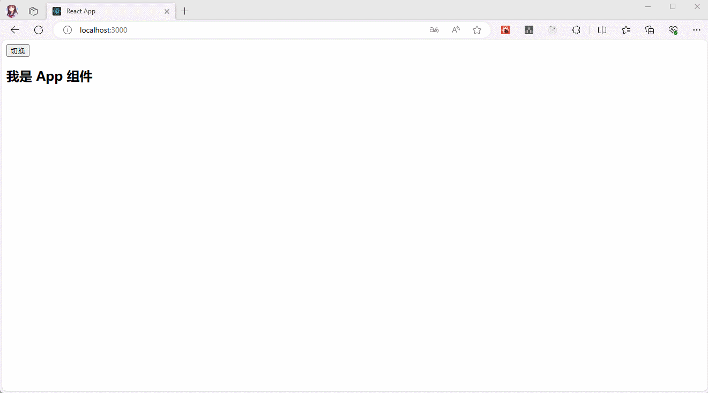


* 项目结构：

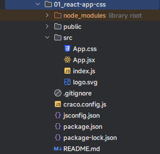


* 示例：
* 其中，App.jsx

```jsx {35-37}
import React from 'react'
import '@/App.css'
import {CSSTransition} from "react-transition-group"

class App extends React.PureComponent{
  
  state = {
    message: '我是 App 组件',
    isShow: true
  }
  
  h2Ref = React.createRef()
  
  change(){
    this.setState({
      isShow:!this.state.isShow
    })
  }
  
  render() {
    const {isShow} = this.state
    console.log(this.h2Ref.current)
    return (
      <div>
        <button onClick={() => this.change()}>切换</button>
        {/*
          `in`：通过 `in` 属性触发进入或退出的状态；换言之，和 React 中的 state 对应。
            如果 in 为 `true` 时，则触发进入状态，会添加 `-enter`、`-enter-active` 的 class 开始执行动画，当动画执行结束后，会移除两个 class， 并且添加 `-enter-done` 的class；
            当 in 为 `false`时，则触发退出状态，会添加 `-exit`、`-exit-active` 的 class 开始执行动画，当动画执行结束后，会移除两个 class，并 且添加 `-enter-done` 的 class；
          `unmountOnExit`：退出后卸载组件。
          `classNames`：动画 class 的名称。
          `timeout`：过渡动画的事件。
          `appear`：是否在初次进入添加动画，需要和 `in` 同时为 true。
        */}
        <CSSTransition in={isShow} nodeRef={this.h2Ref} classNames="h2" timeout={2000} unmountOnExit appear>
          <h2 ref={this.h2Ref}>{this.state.message}</h2>
        </CSSTransition>
      </div>
    )
  }
}

export default App
```

* 其中，App.css

```css
.h2-appear {
    transform: translateX(-150px);
}
.h2-appear-active {
    transform: translateX(0);
    transition: transform 2000ms ease;
}
.h2-enter {
    opacity: 0;
}
.h2-enter-active {
    opacity: 1;
    transition: opacity 2000ms ease;
}
.h2-exit {
    opacity: 1;
}
.h2-exit-active {
    opacity: 0;
    transition: opacity 2000ms ease;
}
```

## 1.4 SwitchTransition

### 1.4.1 概述

* SwitchTransition 可以完成两个组件之间切换的炫酷动画。
  * 我们有一个按钮需要在 on 和 off 之间切换，我们希望看到 on 先从左侧退出，off 再从右侧进入。
  * 这个动画在 Vue 中被称之为 Vue transition modes 。
  * react-transition-group 中使用 `SwitchTransition` 来实现该动画。
* `SwitchTransition` 中主要有一个属性：`mode`，有两个值
  *  in-out：表示新组件先进入，旧组件再移除；
  * `out-in`：表示就组件先移除，新组建再进入

> 注意：通常使用 `out-in` 模式，并且该模式也是默认模式。

* `SwitchTransition`组件的使用方式：
  * 在 `SwitchTransition`组件中包裹  `CSSTransition` 组件。
  * `SwitchTransition` 组件中的的 `CSSTransition`组件不再通过 in 属性来判断元素何种状态，而是通过 `key` 属性。

### 1.4.2 案例

* 需求：实现下面的效果。

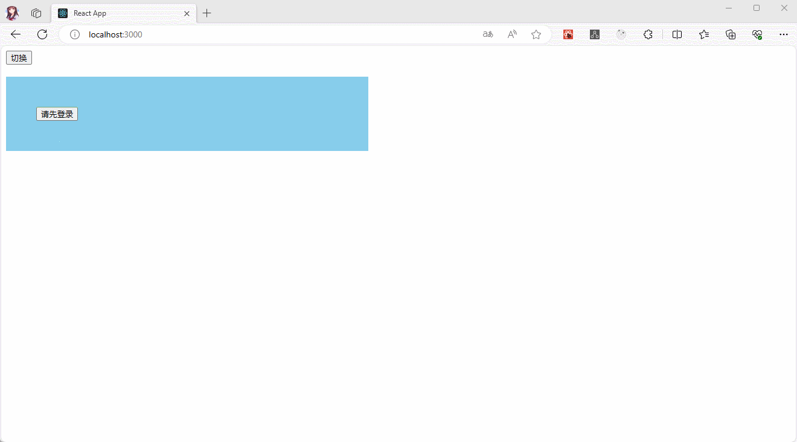

* 项目结构：

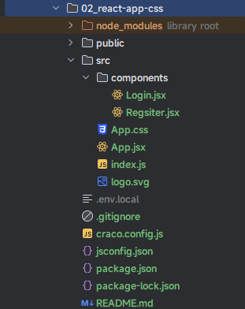

* 示例：
* 其中，App.jsx

```jsx {20-26}
import React, {createRef, PureComponent} from 'react'
import Register from "@/components/Regsiter"
import Login from "@/components/Login"
import {CSSTransition, SwitchTransition} from "react-transition-group"
import '@/App.css'

class App extends PureComponent {
  
  state = {
    isLogin: true
  }
  
  login2RegisterRef = createRef()
  
  render() {
    const {isLogin} = this.state
    return (
      <div>
        <button onClick={() => this.setState({isLogin: !isLogin})}>切换</button>
        <SwitchTransition mode="out-in">
          <CSSTransition key={isLogin} timeout={500} classNames={"fade"} nodeRef={this.login2RegisterRef}>
              <div style={{marginTop: '20px'}} ref={this.login2RegisterRef}>
                {isLogin ? <Login/> : <Register/>}
              </div>
          </CSSTransition>
        </SwitchTransition>
      </div>
    )
  }
}

export default App
```

* 其中，App.css

```css
.fade-enter{
    opacity: 0;
    transform: translateY(100px);
}
.fade-enter-active  {
    opacity: 1;
    transform: translateY(0);
}
.fade-exit  {
    opacity: 1;
    transform: translateY(0);
}
.fade-exit-active  {
    opacity: 0;
    transform: translateY(-100px);
}
.fade-enter-active ,
.fade-exit-active  {
    transition: all 500ms ease;
}
```

* 其中，Login.jsx

```jsx
function Login() {
  return (
    <div style={{background: 'skyblue', width: '500px',padding: '50px'}}>
      <button>请先登录</button>
    </div>
  )
}

export default Login
```

* 其中，Register.jsx

```jsx
function Register() {
  return (
    <div style={{background: 'pink',width:'500px',padding: '50px'}}>
      <button>请先注册</button>
    </div>
  )
}

export default Register
```

## 1.5 TransitionGroup

### 1.5.1 概述

* TransitionGroup 的用法和 SwitchTransition  差不多。

### 1.5.2 案例

* 需求：实现下面的效果。

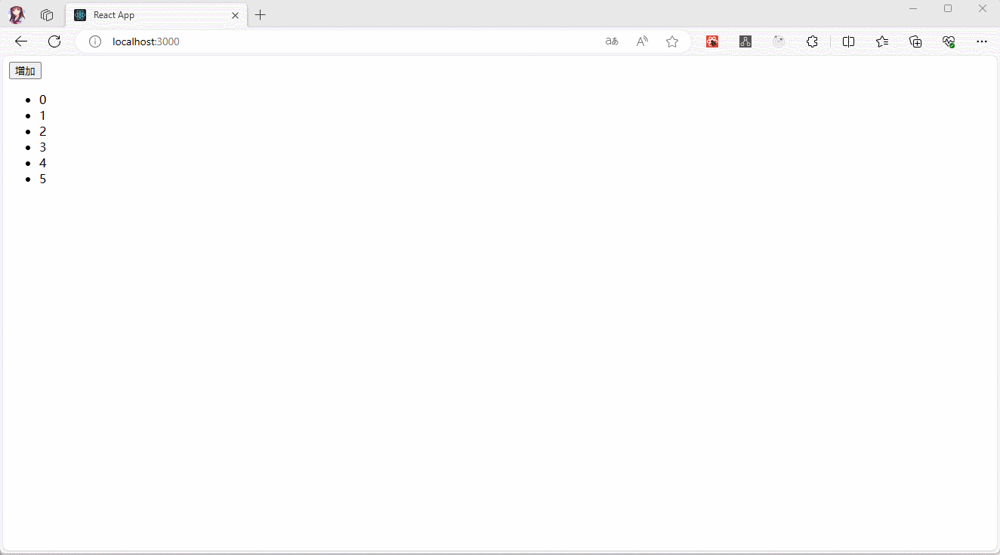

* 项目结构：

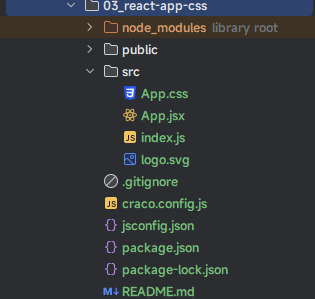

* 示例：
* 其中，App.jsx

```jsx {8-15,33-43}
import React, {createRef, PureComponent} from 'react'
import './App.css'
import {CSSTransition, TransitionGroup} from "react-transition-group"

class App extends PureComponent {
  
  state = {
    nums: [
      {id: 0, num: 0, nodeRef: createRef()},
      {id: 1, num: 1, nodeRef: createRef()},
      {id: 2, num: 2, nodeRef: createRef()},
      {id: 3, num: 3, nodeRef: createRef()},
      {id: 4, num: 4, nodeRef: createRef()},
      {id: 5, num: 5, nodeRef: createRef()},
    ]
  }
  
  add() {
    const nums = [...this.state.nums]
    nums.push({
      id: this.state.nums.length,
      num: this.state.nums.length,
      nodeRef: createRef()
    })
    this.setState({nums})
  }
  
  render() {
    const {nums} = this.state
    return (
      <div>
        <button onClick={() => this.add()}>增加</button>
        <TransitionGroup component="ul">
          {
            nums.map(({id,num,nodeRef}) => {
              return (
                <CSSTransition key={id} timeout={1000} classNames="item" nodeRef={nodeRef}>
                  <li key={id} ref={nodeRef}>{num}</li>
                </CSSTransition>
              )
            })
          }
        </TransitionGroup>
      
      </div>
    )
  }
}

export default App
```

* 其中，App.css

```css
.item-enter {
    opacity: 0;
    transform: translateX(100px);
}
.item-enter-active {
    opacity: 1;
    transform: translateX(0);
    transition: all 1s ease;
}
```


# 第二章：React 中 CSS 的方案

## 2.1 概述

* 目前，整个前端已经是`组件化开发`的时代了；但是，CSS 的设计就不是为组件化而生的；所以，我们需要在目前组件化的框架中寻找一种合适的 CSS 解决方案。
* 组件化中选择合适的 CSS 解决方案，需要符合以下的特征：
  * ① 可以编写局部 CSS：CSS 具备自己的局部作用域，不会随意污染其他组件内的元素。
  * ② 可以编写动态的 CSS：可以获取当前组件的一些状态，根据状态的变化生成不同的 CSS 样式。
  * ③ 支持所有的 CSS 特性：必须能支持伪类、动画、媒体查询等。
  * ④ 编写简单，最好符合 CSS 的风格。
  * ⑤ ……

## 2.2 React 中的 CSS

* 一直以来，CSS 都是 React 的痛点，一直被很多开发者吐槽、诟病。
* 因为，Vue 给出了解决方案：
  * Vue 通过在 `.vue` 文件中的 `style` 标签来编写 CSS 样式。
  * 可以通过 `scoped` 属性来决定样式，是否全局有效，还是局部有效。
  * 可以通过 `lang` 属性来设置我们熟悉的 CSS 预处理器，如：Less、Sass 等。
  * 可以通过内联样式的风格来根据最新状态设置和改变 CSS 。
  * ……

> 注意：Vue 给出的 CSS 解决方案虽然不是最完美，但是简洁、统一，非常方便协调开发。

* 但是，React 官方一直没有给出在 React 中统一的 CSS 风格；导致，在 React 中就 CSS 方案就有太多太多种。

## 2.3 解决方案

### 2.3.1 内联样式

#### 2.3.1.1 概述

* `内联样式`是官方内置的一种 CSS 解决方案：
  * `style` 属性接收一个采用小驼峰命名属性的 JavaScript 对象，而不是 CSS 字符串。
  * 可以在 `style` 属性中引用 `state` 中的状态来设置相关的样式。
* 内联样式的`优点`：
  * ① 内联样式，不会产生冲突。
  * ② 可以动态获取当前 state 中的状态。
* 内联样式的`缺点`：
  * ① 写法上都需要使用驼峰标识。
  * ② 大量的样式，会造成代码混乱。
  * ③ 某些样式无法编写，如：伪类、伪元素等。

#### 2.3.1.2 案例

* 需求：实现下面的效果。

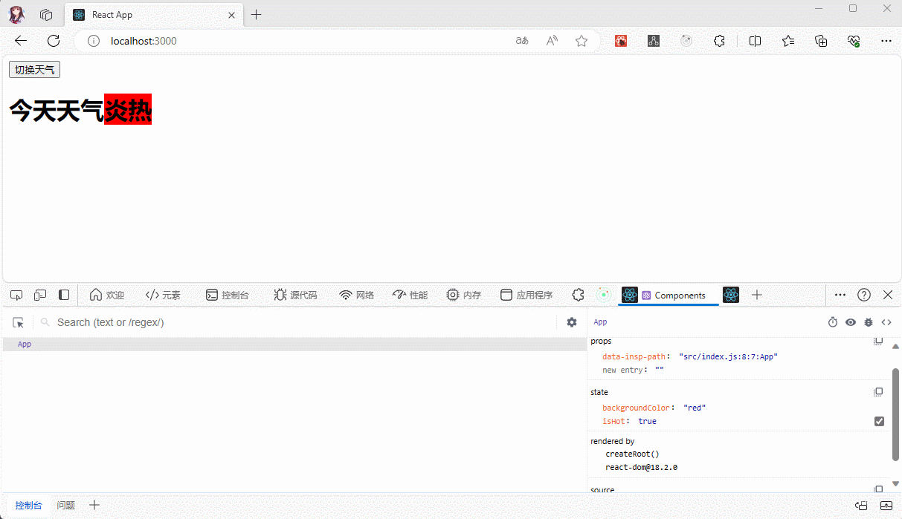

* 项目结构：

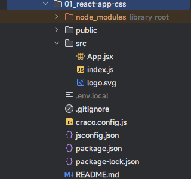

* 示例：

```jsx {6-7,18,24-25}
import React, {PureComponent} from 'react'

class App extends PureComponent {
  
  state = {
    isHot: true,
    backgroundColor: 'red'
  }
  
  change() {
    this.setState({
      isHot: !this.state.isHot,
      backgroundColor: this.state.isHot ? 'green' : 'red'
    })
  }
  
  render() {
    const {isHot, backgroundColor} = this.state
    return (
      <div>
        <button onClick={() => this.change()}>
          切换天气
        </button>
        <h1>今天天气{isHot ? <span style={{backgroundColor}}>炎热</span> :
          <span style={{backgroundColor}}>凉爽</span>}</h1>
      </div>
    )
  }
}

export default App
```

### 2.3.2 普通的 CSS

#### 2.3.2.1 概述

* 有的时候，我们会将 css 代码写到 CSS 文件中，然后再导入。

> 注意：React 中是通过 className 属性来实现。

* 这种的编写方法和在普通的网页开发中没什么区别：
  * 但是，在组件化开发中，我们希望组件是一个独立的模块，即样式只能在组件内部生效，不会相互影响。
  * 但是，普通的 CSS 都属于全局 CSS，样式之间会相互影响。
* 最大的`问题`就是：样式之间会互相影响。

#### 2.3.2.2 案例

* 示例：演示样式冲突

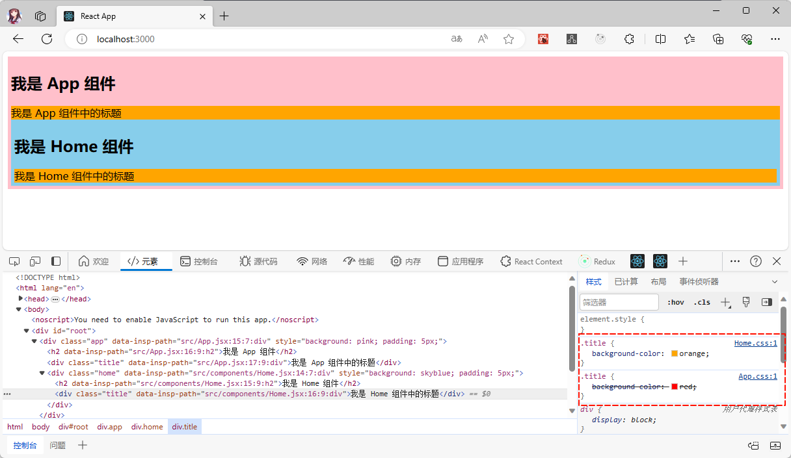

* 项目结构：

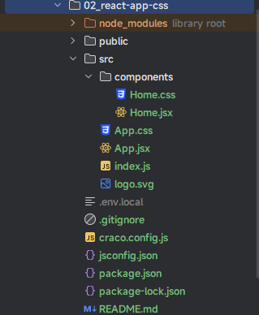

* 示例：
* 其中，App.jsx

```jsx {2,17-18}
import React, {PureComponent} from 'react'
import '@/App.css'
import Home from "@/components/Home"

class App extends PureComponent {
  
  state = {
    message: '我是 App 组件'
  }
  
  
  render() {
    const {message} = this.state
    return (
      <div className={"app"} style={{background: 'pink',padding:'5px'}}>
        <h2>{message}</h2>
        <div className="title">我是 App 组件中的标题</div>
        <Home/>
      </div>
    )
  }
}

export default App
```

* 其中，App.css

```css
.title {
    background-color: red;
}
```

* 其中，Home.jsx

```jsx {2,16}
import React, {PureComponent} from 'react'
import '@/components/Home.css'

class Home extends PureComponent {
  
  state = {
    message: '我是 Home 组件'
  }
  
  
  render() {
    const {message} = this.state
    return (
      <div className={"home"} style={{background: 'skyblue',padding:'5px'}}>
        <h2>{message}</h2>
        <div className={"title"}>我是 Home 组件中的标题</div>
      </div>
    )
  }
}

export default Home
```

* 其中，Home.css

```css
.title{
    background-color: orange;
}
```

### 2.3.3 CSS modules

#### 2.3.3.1 概述

* CSS modules 不是 React 的特有解决方案；我们知道，webpack 就默认支持 css 的 module，只需要在 webpack.config.js 中配置即可：

```js {8}
module.exports = {
  module: {
    rules: [
      {
        test: /\.css$/i,
        loader: "css-loader",
        options: {
          modules: true,
        },
      },
    ],
  },
};
```

* React 的脚手架 [Create React App](https://create-react-app.dev/) 就是基于 Webpack 而搭建的，所以也内置了 css modules 的配置，使用方式如下：
  * ① 将 `*.less`、`*.css` 或 `*.scss` 等文件修改为 `*.module.less` 、`*.module.css`、`*.module.scss` 等。
  * ② 在 `*.jsx` 文件中通过默认导入即可。

> 注意：React 脚手架中的 css modules ，将 `*.less`、`*.css` 或 `*.scss` 导出的是默认导出，所以在导入的时候需要使用默认导入。

* React 脚手架中的 css modules 确实解决了 css 模块化的问题，也是很多人喜欢在 React 中使用的一种解决方案。
* 但是，该方案也有自己的缺陷：
  * ① 如果将来使用 Vite 来搭建 React 项目，该方法能够优雅的迁移到 Vite 中，很难讲！！！
  * ② 如果类名中包含 `-`，如：`.home-title`，需要使用 `app["home-tilte"]` 来解决在 JavaScript 属性名不支持 `-` 的写法。
  * ③ 不方便动态的根据 `state` 来修改某些样式，依然需要使用`内联样式` 。
  * ④ 所有的 `className` 都需要使用 `{xxx.className}` 或 `{xxx["className"]}`的形式来编写。
  * ⑤ ……

#### 2.3.3.2 案例

* 示例：解决样式冲突

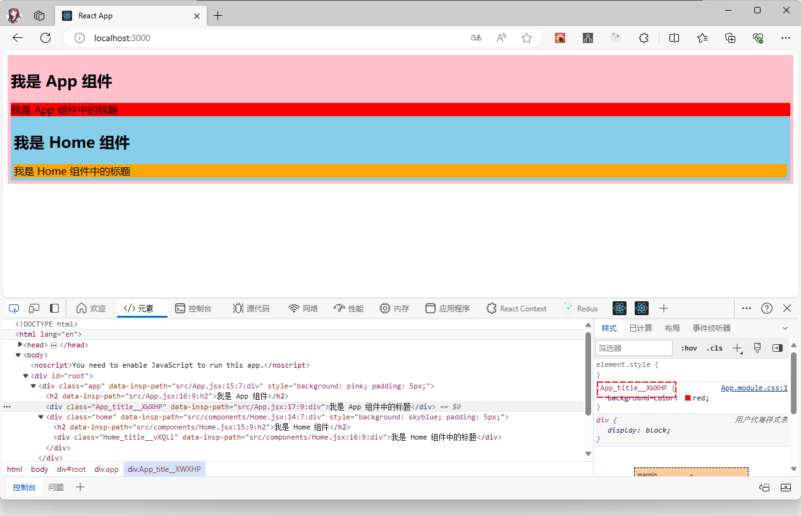

* 项目结构：

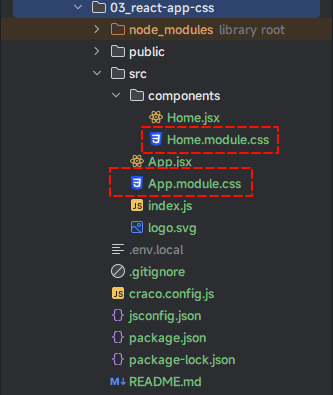

* 示例：
* 其中，App.jsx

```jsx {2-3,17-18}
import React, {PureComponent} from 'react'
import AppStyle from  '@/App.module.css'
import Home from "@/components/Home"

class App extends PureComponent {
  
  state = {
    message: '我是 App 组件'
  }
  
  
  render() {
    const {message} = this.state
    return (
      <div className={"app"} style={{background: 'pink',padding:'5px'}}>
        <h2>{message}</h2>
        <div className={AppStyle["title"]}>我是 App 组件中的标题</div>
        <Home/>
      </div>
    )
  }
}

export default App
```

* 其中，App.module.css

```css
.title {
    background-color: red;
}
```

* 其中，Home.jsx

```jsx {2,16}
import React, {PureComponent} from 'react'
import HomeStyle from '@/components/Home.module.css'

class Home extends PureComponent {
  
  state = {
    message: '我是 Home 组件'
  }
  
  
  render() {
    const {message} = this.state
    return (
      <div className={"home"} style={{background: 'skyblue',padding:'5px'}}>
        <h2>{message}</h2>
        <div className={HomeStyle.title}>我是 Home 组件中的标题</div>
      </div>
    )
  }
}

export default Home
```

* 其中，Home.module.css

```css
.title{
    background-color: orange;
}
```

## 2.4 CSS In JS

### 2.4.1 概述

* 在传统的前端开发中，我们通常会将 `结构（HTML）`、`表现（CSS）`、`行为（JavaScript）`进行分离。并且，Vue 也是这么做的。
* 但是，React 认为`逻辑本身和 UI 是无法分离`的，所以才有了 JSX 语法。并且，`样式也是 UI 的一部分`，所以也有`将 CSS 写入到 JavaScript 中的方式`，并且可以很方便的使用 JavaScript 的状态。

> 注意：React 也被人称为 `All In JS`，是因为 `HTML`、`CSS`、`JS` 都可以写到 `JavaScript` 中。

### 2.4.2 CSS In JS 方案的实现

* CSS In JS 的优点：
  * ① 这种方案可以`通过 JavaScript 为 CSS 赋予一些能力`，包括类似于 CSS 预处理器一样的`样式嵌套`、`函数定义`、`逻辑复用`、`动态修改状态`等等；
  * ② 虽然 CSS 预处理器也具备这些能力，但是`获取动态 state 依然不是很好处理`。

> 注意：也有人认为 CSS In JS 有缺点，不可否认；但是，在 React 中，CSS In JS 不失为一种解决方案。

* 目前，比较流行的 CSS In JS 的库有：
  * styled-components。
  * emotion。
  * ……
* 本次以 `styled-components` 为例，进行讲解，其安装命令如下：

```shell
npm install styled-components
```

### 2.4.3 补充概念

* ES6 推出了`模板字面量`和`模板字符串`；但是，很多时候，很多人还是喜欢将`模板字面量`和`模板字符串`混为一谈，这边做一个区分。
* MDN 对`模板字面量`的定义：`模板字面量`是用`反引号`分隔的字面量，允许`多行字符串`、带`嵌入表达式`的`字符串插值`和一种`带标签的模板`的特殊结构。

> 从上面的定义中，我们可以得出结论： `模板字面量` = `带嵌入表达式的字符串插值` + `带标签的模板的特殊结构`。

* 但是，MDN 也说了，很多场合下，`模板字面量`被有些人称为`模板字符串`，因为它们通常被用作`字符串插值`。因为，带`标签`的模板字面量可能不会产生字符串（其可以和自定义的`标签函数`一起使用，来对模板字面量中的不同部分执行任何操作）。
* 为了下文的讲解，我们可以将模板字面量划分为如下的两类：

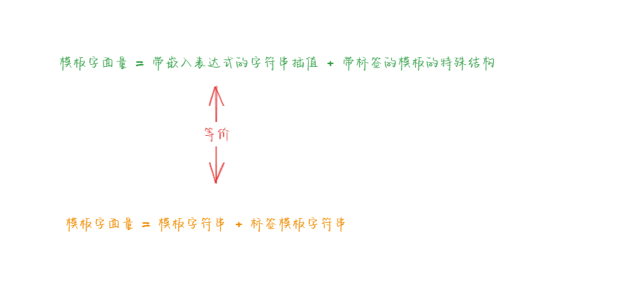

* 常见的`模板字符串`的使用方式：

```js
const name = "许大仙"
const age = 18
const str = `我的名字是 ${name}，我今年 ${age} 岁`
console.log(`我的信息是：${str}`)
```

* 常见的`函数`的使用方式：

```js
function foo(name,age){
    console.log(name,age)
}

foo("许大仙",18)
```

```js
function foo(...args){
    console.log(args)
}
foo("许大仙",18)
```

* 但是，我们也可以使用`标签模板字符串`来调用函数：

```js {7}
const name = "许大仙"
const age = 18
function foo(...args){
    console.log(args)
}

const str = foo`我的名字是 ${name}，我今年 ${age} 岁`
console.log(str)
```

> 注意：
>
> * 此时的 `foo` 函数也称为`标签`，而 `str` 的值就是`标签模板字符串`了。
> * `标签模板字符串`是`模板字面量`的一种高级使用方式，它允许我们使用`函数`解析`模板字面量`。标签函数的第一个参数包含一个字符串数组，其余的参数和`表达式`（如：`${name}`）相关。
> * 我们可以使用`标签函数`来对这些参数执行任何操作，并返回被操作过的字符串；当然，也可以不返回。
> * `styled-components` 库就使用了类似的原理，只不过其返回的是 React 中的`组件`而已。
> *  WebStorm 内置了 `styled-components` 插件；如果使用 VSCode ，需要手动安装 `vscode-styled-components` 插件。

## 2.5 解决方案 --- styled-components

### 2.5.0 前言

* 因为需要演示效果，所以需要安装生成随机颜色的库。

```shell
npm install randomcolor
```

### 2.5.1 概述

* `styled-components` 的本质是通过函数的调用，最终创建出一个组件：
  * 该组件会被自动添加一个不重复的 class 。
  * 然后由 `styled-components`给该 class 添加相关的样式。
* 当然，`styled-components` 也支持类似于 CSS 预处理器一样的样式嵌套：
  * ① 支持`直接子代选择器`或`后代选择器`，并且可以直接编写样式。
  * ② 可以通过 `&` 符号获取当前元素。
  * ③ 可以写`伪类选择器`或`伪元素`等。
  * ④ ……

### 2.5.2 快速入门

#### 2.5.2.1 概述

* 需求：实现下面的效果。

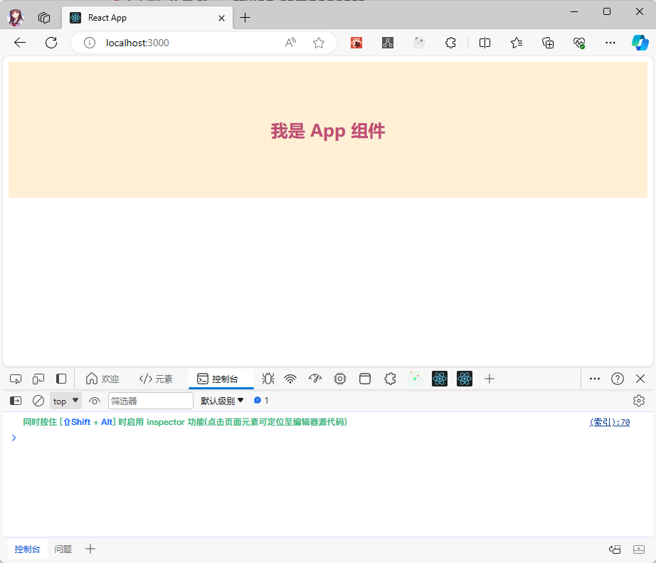

#### 2.5.2.2 原生 React 实现

* 项目结构：

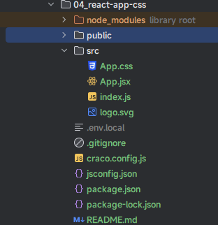

* 示例：
* 其中，App.jsx

```jsx {2,14,15}
import React, {PureComponent} from 'react'
import '@/App.css'

class App extends PureComponent {
  
  state = {
    message: '我是 App 组件',
    
  }
  
  render() {
    const {message} = this.state
    return (
      <div className="wrapper">
        <h1>{message}</h1>
      </div>
    )
  }
}

export default App
```

* 其中，App.css

```css
.wrapper {
    padding: 4em;
    background: papayawhip;
}

.wrapper h1 {
    font-size: 1.5em;
    text-align: center;
    color: #BF4F74;
}
```

#### 2.5.2.3 styled-components 实现

* 项目结构：

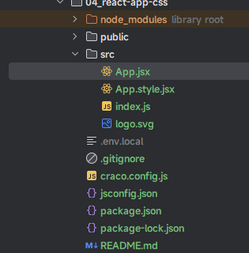

* 示例：
* 其中，App.jsx

```jsx {2,14-16}
import React, {PureComponent} from 'react'
import {AppWrapper, Title} from "@/App.style"

class App extends PureComponent {
  
  state = {
    message: '我是 App 组件',
    
  }
  
  render() {
    const {message} = this.state
    return (
      <AppWrapper>
        <Title>{message}</Title>
      </AppWrapper>
    )
  }
}

export default App
```

* 其中，App.style.jsx

```jsx
import styled from "styled-components";

export const AppWrapper = styled.div`
    padding: 4em;
    background: papayawhip;
`

export const Title = styled.h1`
    font-size: 1.5em;
    text-align: center;
    color: #BF4F74;
`
```

#### 2.5.2.4 解析 styled-components 实现

* App.style.jsx 的代码如下：

```jsx
import styled from "styled-components";

export const AppWrapper = styled.div`
    padding: 4em;
    background: papayawhip;
`

export const Title = styled.h1`
    font-size: 1.5em;
    text-align: center;
    color: #BF4F74;
`
```

* 我们可以知道，styled-components 提供了一个 `styled` 对象，并且该对象中包含了很多`函数`，如：div、h1 等函数。
* 之前，学习过标签模板字符串的用法，那么下面的代码也就不难理解：

```jsx
// 本质上就是调用标签模板字符串，并且该函数返回的是 React 组件
export const AppWrapper = styled.div`
    padding: 4em;
    background: papayawhip;
`
```

* 之后，我们就可以在 App.jsx 中导入组件了：

```jsx {2,14-16}
import React, {PureComponent} from 'react'
import {AppWrapper, Title} from "@/App.style"

class App extends PureComponent {
  
  state = {
    message: '我是 App 组件',
    
  }
  
  render() {
    const {message} = this.state
    return (
      <AppWrapper>
        <Title>{message}</Title>
      </AppWrapper>
    )
  }
}

export default App
```

* 通过`浏览器`的`控制台`，我们知道，该库会为每个组件生成一个唯一的 class 类名，这也是该库解决 React 样式组件化的本质：

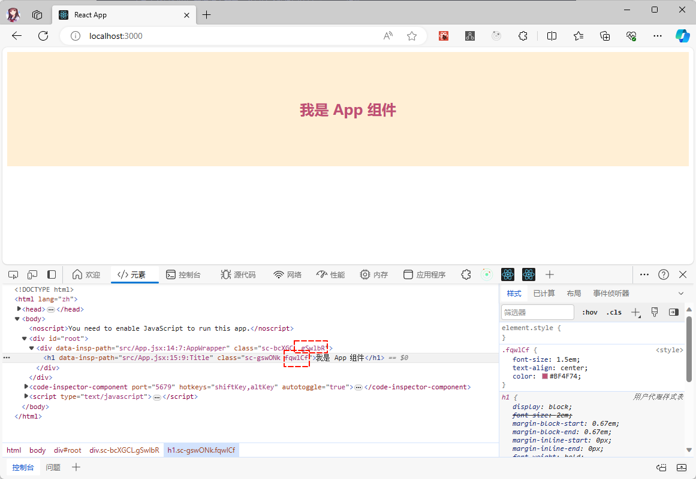

### 2.5.3 props 属性

#### 2.5.3.1  概述

* 有的时候，我们需要根据 React 中 state 的状态，来动态改变样式，该库的使用方式：
  * ① 在组件上，通过 props 传递 state 中的状态。
  * ② 在该库创建的组件中，通过 props 获取，并通过 `${xxx}` 传入一个插值函数，props 会作为该函数的参数。

#### 2.5.3.2 案例

* 需求：实现下面的效果。

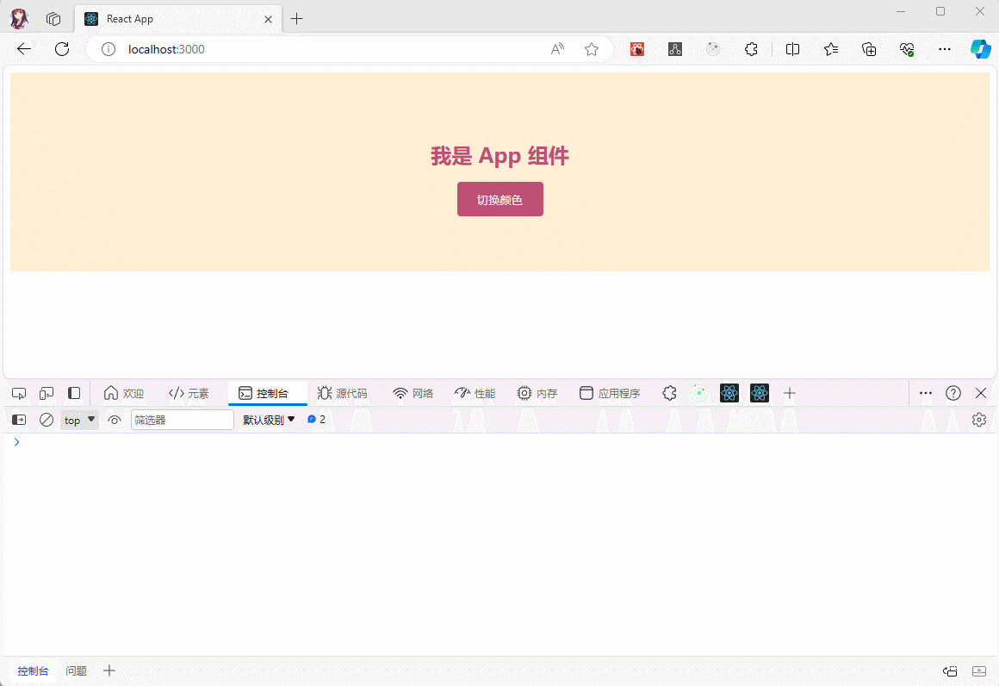

* 项目结构：

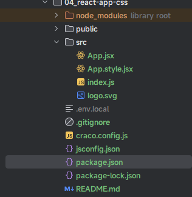

* 示例：
* 其中，App.jsx

```jsx {2-3,10,20,23}
import React, {PureComponent} from 'react'
import randomColor from 'randomcolor'
import {AppWrapper, Button, Title} from "@/App.style"


class App extends PureComponent {
  
  state = {
    message: '我是 App 组件',
    color: '#BF4F74'
  }
  
  change() {
    this.setState({
      color: randomColor()
    })
  }
  
  render() {
    const {message, color} = this.state
    return (
      <AppWrapper>
        <Title $color={color}>{message}</Title>
        <Button onClick={() => this.change()}>切换颜色</Button>
      </AppWrapper>
    )
  }
}

export default App
```

* 其中，App.style.jsx

```jsx {11}
import styled from "styled-components";

export const AppWrapper = styled.div`
    padding: 4em;
    background: papayawhip;
`

export const Title = styled.h1`
    font-size: 1.5em;
    text-align: center;
    color: ${props => props.$color};
`

export const Button = styled.button`
    display: block;
    margin: 0 auto;
    width: 100px;
    height: 40px;
    background: #BF4F74;
    color: #fff;
    border: 0;
    cursor: pointer;
    border-radius: 4px;
`
```

#### 2.5.3.3 案例

* 需求：实现下面的效果。

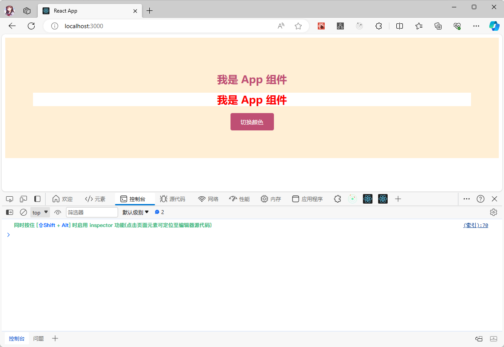

> 注意：如果没有传递 props ，就使用默认值。

* 项目结构：

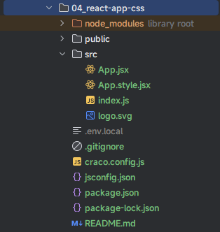

* 示例：
* 其中，App.jsx

```jsx {23-24}
import React, {PureComponent} from 'react'
import randomColor from 'randomcolor'
import {AppWrapper, Button, Title} from "@/App.style"


class App extends PureComponent {
  
  state = {
    message: '我是 App 组件',
    color: '#BF4F74'
  }
  
  change() {
    this.setState({
      color: randomColor()
    })
  }
  
  render() {
    const {message, color} = this.state
    return (
      <AppWrapper>
        <Title $color={color}>{message}</Title>
        <Title $background>{message}</Title>
        <Button onClick={() => this.change()}>切换颜色</Button>
      </AppWrapper>
    )
  }
}

export default App
```

* 其中，App.style.jsx

```jsx {11-12}
import styled from "styled-components";

export const AppWrapper = styled.div`
    padding: 4em;
    background: papayawhip;
`

export const Title = styled.h1`
    font-size: 1.5em;
    text-align: center;
    color: ${props => props.$color || 'red'};
    background: ${props => props.$background ? "white" : 'BF4F74'};
`

export const Button = styled.button`
    display: block;
    margin: 0 auto;
    width: 100px;
    height: 40px;
    background: #BF4F74;
    color: #fff;
    border: 0;
    cursor: pointer;
    border-radius: 4px;
`
```

### 2.5.4 样式继承

#### 2.5.4.1 概述

* 有的时候，我们已经定义好了一个组件，但是需要根据单个情况，进行修改。此时，就可以使用 `styled(xxx)` 构造函数了，其中 `xxx` 就是之前的组件。

#### 2.5.4.2 案例

* 需求：实现下面的效果。

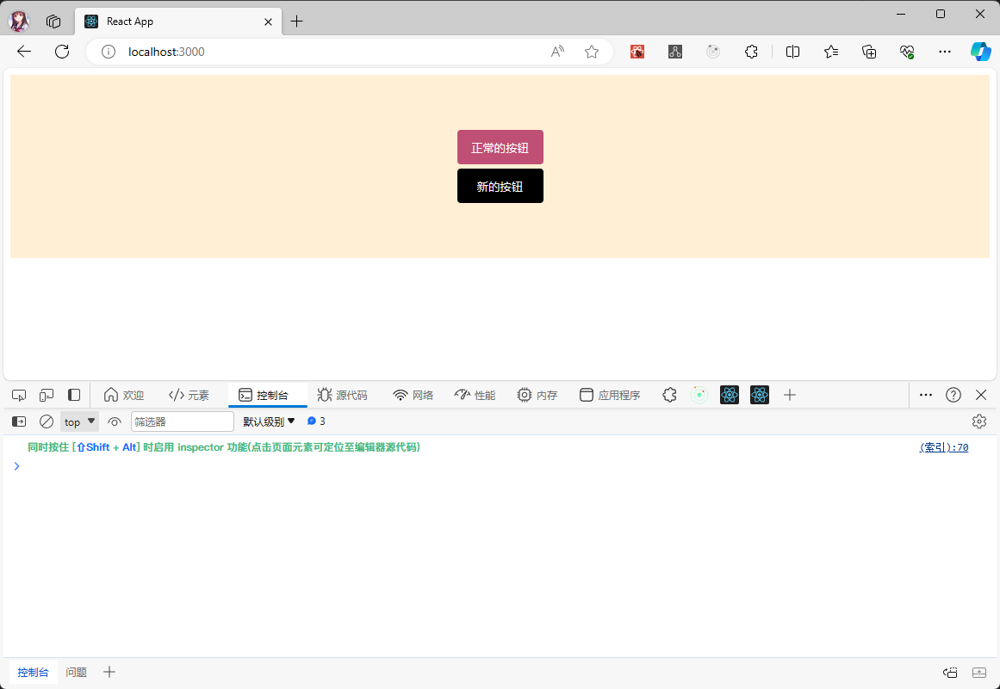

* 项目结构：

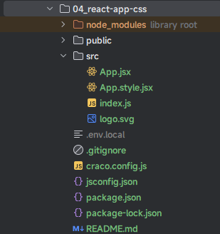

* 示例：
* 其中，App.jsx

```jsx {16-17}
import React, {PureComponent} from 'react'
import {AppWrapper, Button, NewButton} from "@/App.style"


class App extends PureComponent {
  
  state = {
    message: '我是 App 组件',
  }
  
  c
  
  render() {
    return (
      <AppWrapper>
        <Button>正常的按钮</Button>
        <NewButton>新的按钮</NewButton>
      </AppWrapper>
    )
  }
}

export default App
```

* 其中，App.style.jsx

```jsx {19}
import styled from "styled-components";

export const AppWrapper = styled.div`
    padding: 4em;
    background: papayawhip;
`
export const Button = styled.button`
    display: block;
    margin: 0 auto;
    width: 100px;
    height: 40px;
    background: #BF4F74;
    color: #fff;
    border: 0;
    cursor: pointer;
    border-radius: 4px;
`

export const NewButton = styled(Button)`
    margin-top: 5px;
    background: #000;
`
```

### 2.5.5 锚链接和按钮

#### 2.5.5.1 概述

* 有的时候，我们希望更改样式化组件呈现的标记或组件。如：在构建导航栏的时候，就混合了锚链接和按钮，此时就可以使用 `as` 这个 props 来动态定义接收样式的元素。

#### 2.5.5.2 案例

* 需求：实现如下的效果。

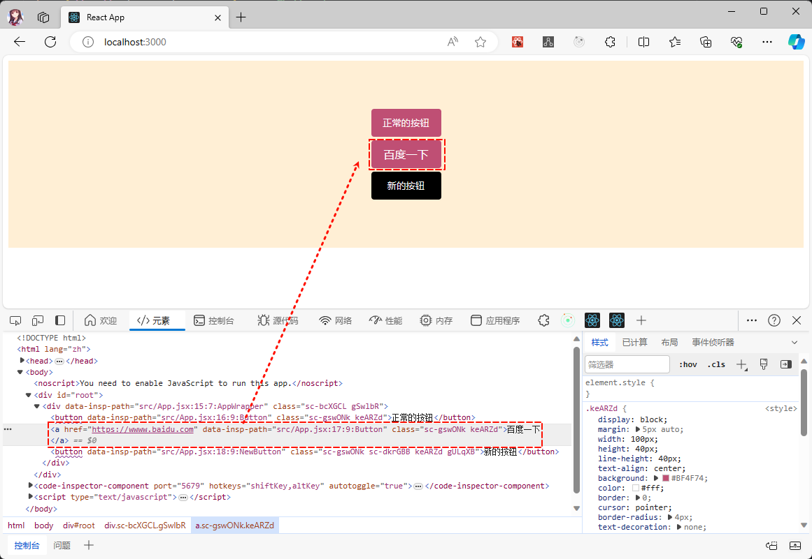

* 项目结构：

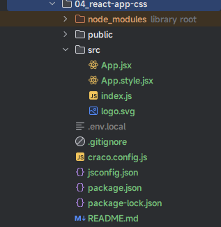

* 示例：
* 其中，App.jsx

```jsx {16-17}
import React, {PureComponent} from 'react'
import {AppWrapper, Button, NewButton} from "@/App.style"


class App extends PureComponent {
  
  state = {
    message: '我是 App 组件',
  }
  
  c
  
  render() {
    return (
      <AppWrapper>
        <Button>正常的按钮</Button>
        <Button as={"a"} href={"https://wwww.baidu.com"}>百度一下</Button>
        <NewButton>新的按钮</NewButton>
      </AppWrapper>
    )
  }
}

export default App
```

* 其中，App.style.jsx

```jsx {19}
import styled from "styled-components";

export const AppWrapper = styled.div`
    padding: 4em;
    background: papayawhip;
`
export const Button = styled.button`
    display: block;
    margin: 5px auto;
    width: 100px;
    height: 40px;
    line-height: 40px;
    text-align: center;
    background: #BF4F74;
    color: #fff;
    border: 0;
    cursor: pointer;
    border-radius: 4px;
    text-decoration: none;
`

export const NewButton = styled(Button)`
    background: #000;
`
```

### 2.5.6 伪类或伪元素

#### 2.5.6.1 概述

* 该库也支持伪类和伪元素。

#### 2.5.6.2 案例

* 需求：实现如下的效果。

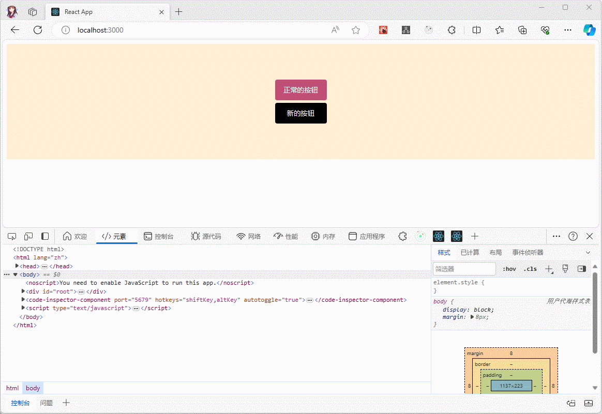

* 项目结构：

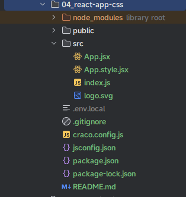

* 示例：
* 其中，App.jsx

```jsx {14}
import React, {PureComponent} from 'react'
import {AppWrapper, Button, NewButton} from "@/App.style"


class App extends PureComponent {
  
  state = {
    message: '我是 App 组件',
  }
  
  render() {
    return (
      <AppWrapper>
        <Button>正常的按钮</Button>
        <NewButton>新的按钮</NewButton>
      </AppWrapper>
    )
  }
}

export default App
```

* 其中，App.style.jsx

```jsx {21-23}
import styled from "styled-components";

export const AppWrapper = styled.div`
    padding: 4em;
    background: papayawhip;
`
export const Button = styled.button`
    display: block;
    margin: 5px auto;
    width: 100px;
    height: 40px;
    line-height: 40px;
    text-align: center;
    background: #BF4F74;
    color: #fff;
    border: 0;
    cursor: pointer;
    border-radius: 4px;
    text-decoration: none;

    &:hover {
        opacity: 0.8;
    }
`

export const NewButton = styled(Button)`
    background: #000;
`
```

### 2.5.7 attrs() 函数

#### 2.5.7.1 概述

* attrs() 是一个函数，用于给组件添加额外属性，如：HTML 属性、自定义属性或其它属性，并且该函数要求传入回调函数，且返回对象。

```jsx
const PasswordInput = styled.input.attrs(props => ({
  type: "password"
}))``
```

#### 2.5.7.2 案例

* 需求：实现如下的效果。

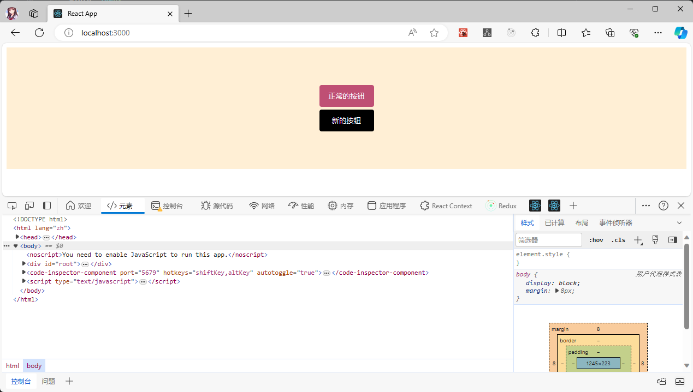

> 注意：如果没有传递 `background` ，就使用默认值。

* 项目结构：

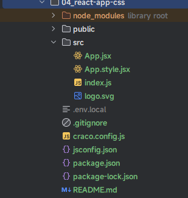

* 示例：
* 其中，App.jsx

```jsx {15}
import React, {PureComponent} from 'react'
import {AppWrapper, Button, NewButton} from "@/App.style"


class App extends PureComponent {
  
  state = {
    message: '我是 App 组件',
  }
  
  render() {
    return (
      <AppWrapper>
        <Button>正常的按钮</Button>
        <NewButton>新的按钮</NewButton>
      </AppWrapper>
    )
  }
}

export default App
```

* 其中，App.style.jsx

```jsx {26-30}
import styled from "styled-components";

export const AppWrapper = styled.div`
    padding: 4em;
    background: papayawhip;
`
export const Button = styled.button`
    display: block;
    margin: 5px auto;
    width: 100px;
    height: 40px;
    line-height: 40px;
    text-align: center;
    background: #BF4F74;
    color: #fff;
    border: 0;
    cursor: pointer;
    border-radius: 4px;
    text-decoration: none;

    &:hover {
        opacity: 0.8;
    }
`

export const NewButton = styled(Button).attrs(props => ({
  background: props.background || '#000'
}))`
    background: ${props => props.background};
`
```

### 2.5.8 主题

#### 2.5.8.1 概述

* 之前，我们通过 React 中的 Context 实现过主题；现在，`styled-components` 库已经内置支持了。

#### 2.5.8.2 案例

* 需求：实现如下的效果。

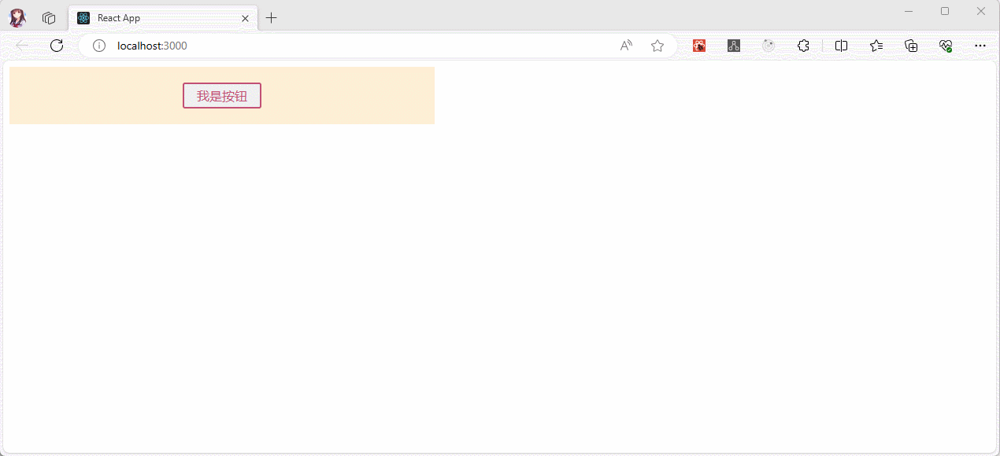

* 项目结构：

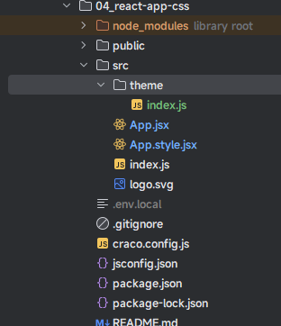

* 示例：
* 其中，App.jsx

```jsx {2-4,24-26}
import React, {PureComponent} from 'react'
import {AppWrapper, Button} from "@/App.style"
import {ThemeProvider} from "styled-components"
import {themes} from "@/theme"


class App extends PureComponent {
  
  state = {
    currentTheme: 'light'
  }
  
  changeTheme() {
    this.setState({
      currentTheme: this.state.currentTheme === 'light' ? 'dark' : 'light'
    })
  }
  
  render() {
    const {currentTheme} = this.state
    console.log(themes[currentTheme])
    return (
      <AppWrapper>
        <ThemeProvider theme={themes[currentTheme]}>
          <Button onClick={() => this.changeTheme()}>我是按钮</Button>
        </ThemeProvider>
      </AppWrapper>
    )
  }
}

export default App
```

* 其中，App.style.jsx

```jsx
import styled from "styled-components";

export const AppWrapper = styled.div.attrs(props => ({
  className: 'appWrapper'
}))`
    padding: 20px;
    width: 500px;
    background: papayawhip;
`

export const Button = styled.button`
    display: block;
    font-size: 1em;
    margin: 0 auto;
    padding: 0.25em 1em;
    border-radius: 3px;
    color: ${props => props.theme.color};
    border: 2px solid ${props => props.theme.color};
`
```

* 其中，theme/index.js

```js {3,6}
// 主题相关
export const themes = {
  light: {
    color: '#BF4F74',
  },
  dark: {
    color: '#60c18b',
  }
}
```

## 2.8 React 中添加 class

### 2.8.1 概述

* 在 Vue 中添加 class 是一件非常简单的事情，可以传入一个对象：

```vue
<div :class="{ active: isActive }"></div>
```

* 在 Vue 中添加 class 也可以传入数组：

```vue
<div :class="[activeClass, errorClass]"></div>
```

* 在 Vue 中添加 class 还可以对象和数组混合使用：

```vue
<div :class="[{ active: isActive }, errorClass]"></div>
```

* 但是，React 在 JSX 中给了我们足够多的灵活，我们可以通过逻辑来决定是否添加某些 class ：

```jsx
<div className={"title " + (isActive ? "active" : "") }></div>
```

```jsx
<div className={ ["title", (isActive ? "active" : "").join(" ")] }></div>
```

* 当然，和 Vue 相比，感觉很麻烦，我们可以使用第三方库 `classnames` 来实现类似 Vue 中的效果，其安装命令如下：

```shell
npm install classnames
```

* 官方给出的示例如下：

```js
classNames('foo', 'bar'); // => 'foo bar'
classNames('foo', { bar: true }); // => 'foo bar'
classNames({ 'foo-bar': true }); // => 'foo-bar'
classNames({ 'foo-bar': false }); // => ''
classNames({ foo: true }, { bar: true }); // => 'foo bar'
classNames({ foo: true, bar: true }); // => 'foo bar'

// lots of arguments of various types
classNames('foo', { bar: true, duck: false }, 'baz', { quux: true }); // => 'foo bar baz quux'

// other falsy values are just ignored
classNames(null, false, 'bar', undefined, 0, 1, { baz: null }, ''); // => 'bar 1'
```

```js
const arr = ['b', { c: true, d: false }];
classNames('a', arr); // => 'a b c'
```

### 2.8.2 案例

* 示例：

```jsx {2,12-20}
import React, {PureComponent} from 'react'
import classNames from "classnames";


class App extends PureComponent {
  
  state = {}
  
  render() {
    return (
      <div>
        <div className={classNames('foo', 'bar')}>'foo bar'</div>
        <div className={classNames('foo', {bar: true})}>'foo bar'</div>
        <div className={classNames({'foo-bar': true})}>'foo-bar'</div>
        <div className={classNames({'foo-bar': false})}>''</div>
        <div className={classNames({foo: true}, {bar: true})}>'foo bar'</div>
        <div className={classNames({foo: true, bar: true})}>'foo bar'</div>
        <div className={classNames('foo', {bar: true, duck: false}, 'baz', {qux: true})}>'foo bar baz qux'</div>
        <div className={classNames(null, false, 'bar', undefined, 0, 1, {baz: null}, '')}>'bar 1'</div>
        <div className={classNames('a', ['b', {c: true, d: false}])}>'a b c'</div>
      </div>
    )
  }
}

export default App
```

