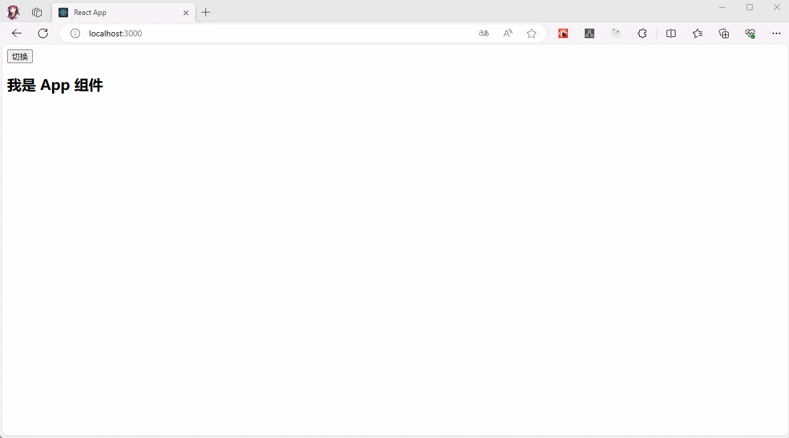
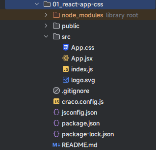
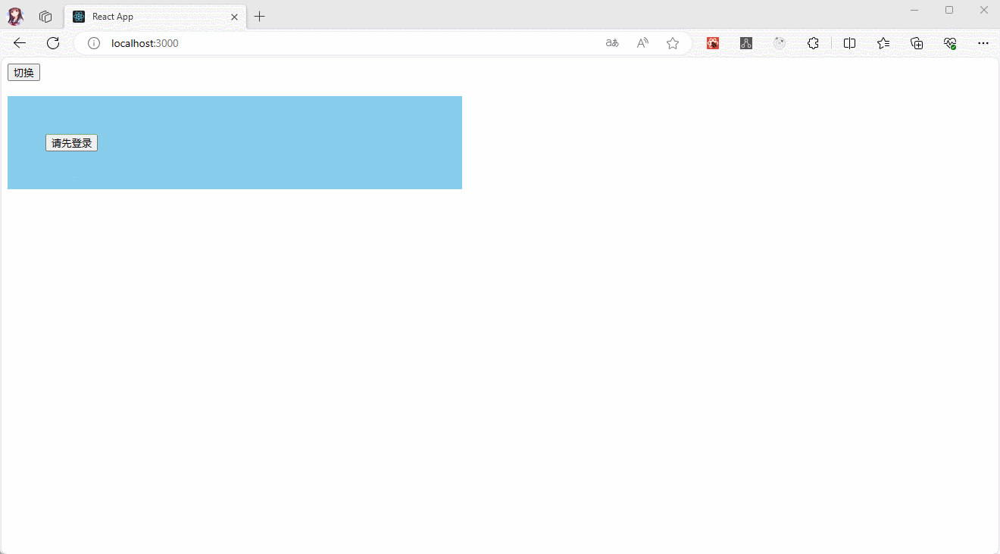
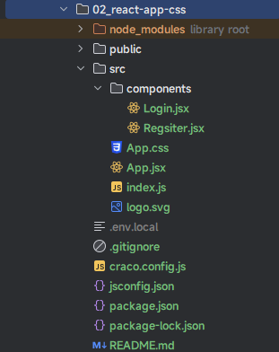
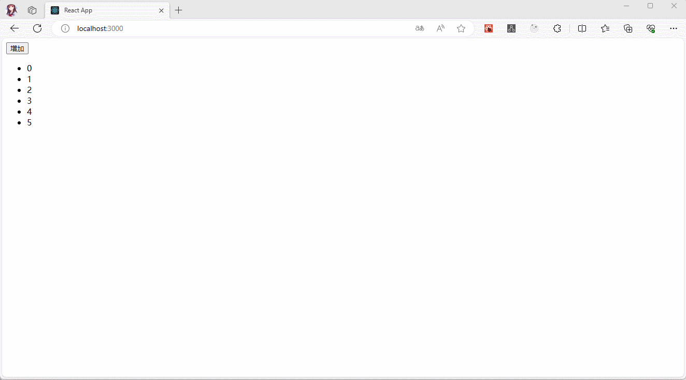
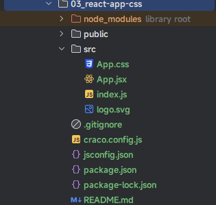

# 第一章：React 中的过渡动画

## 1.1 概述

* 在开发中，我们有的时候，需要给一个组件的显示和隐藏添加某种过渡动画，以便增加用户的体验。
* Vue 中是内置了两个组件，可以帮助我们制作基于状态变化的`过渡`或`动画`，其中：
  * `<Transition>`会在一个元素或组件进入或离开 DOM 时应用动画。
  * `<TransitionGroup>`会在一个 `v-for`列表中的元素或组件被插入、移动或移除的时候应用动画。
* 但是，React 中并没有提供；我们可以使用 `react-transitiongroup` 第三方库来实现类似 Vue 中实现过渡动画的效果。

```shell
# 安装
npm install react-transition-group
```

* 并且，由于 `react-transition-group` 相当小，因此在应用程序中包含库的开销可以忽略不计。

## 1.2 react-transition-group 的主要组件

* react-transition-group 主要包括四个组件：

  * Transition：
    * 该组件是一个和平台无关的组件。
    * 在前端开发中，我们一般结合 CSS 来完成样式，所以比较常用的是 `CSSTransition`。

  * `CSSTransition`：在前端开发中，通常使用 CSSTransition 来完成过渡动画效果。
  * `SwitchTransition`：两个组件显示和隐藏切换的时候，使用该组件。
  * `TransitionGroup`：将多个动画组件包裹在其中，通常用于列表中元素的动画。

## 1.3 CSSTransition

### 1.3.1 概述

* `CSSTransition` 是基于 `Transition` 组件构建的，其在执行过程中，有三个状态：appear、enter 和 exit 。
* 它的三种状态，需要定义对应的 CSS 样式：
  * 第一类：`开始状态`，对应的类是 `-apper`、`-enter`、`-exit` 。
  * 第二类：`执行动画`，对应的类是`-appear-active`、`-enter-active`、`-exit-active`。
  * 第三类：`执行结束`，对应的类是 `-appear-done`、`-enter-done`、`-exit-done`。

* `CSSTransition` 中常见的属性：
  * `in`：通过 `in` 属性触发进入或退出的状态；换言之，和 React 中的 state 对应。
    * 如果 in 为 `true` 时，则触发进入状态，会添加 `-enter`、`-enter-active` 的 class 开始执行动画，当动画执行结束后，会移除两个 class， 并且添加 `-enter-done` 的class；
    * 当 in 为 `false`时，则触发退出状态，会添加 `-exit`、`-exit-active` 的 class 开始执行动画，当动画执行结束后，会移除两个 class，并 且添加 `-enter-done` 的 class；
  * `unmountOnExit`：退出后卸载组件。
  * `classNames`：动画 class 的名称。
  * `timeout`：过渡动画的事件。
  * `appear`：是否在初次进入添加动画，需要和 `in` 同时为 true。
* `CSSTransition` 对应的钩子函数：主要为了检测动画的执行过程，来完成一些 JavaScript 的操作
  * `onEnter`：在进入动画之前被触发。
  * `onEntering`：在应用进入动画时被触发。
  * `onEntered`：在应用进入动画结束后被触发。

### 1.3.2 案例

* 需求：实现下面的效果。




* 项目结构：




* 示例：
* App.jsx

```jsx {35-37}
import React from 'react'
import '@/App.css'
import {CSSTransition} from "react-transition-group"

class App extends React.PureComponent{
  
  state = {
    message: '我是 App 组件',
    isShow: true
  }
  
  h2Ref = React.createRef()
  
  change(){
    this.setState({
      isShow:!this.state.isShow
    })
  }
  
  render() {
    const {isShow} = this.state
    console.log(this.h2Ref.current)
    return (
      <div>
        <button onClick={() => this.change()}>切换</button>
        {/*
          `in`：通过 `in` 属性触发进入或退出的状态；换言之，和 React 中的 state 对应。
            如果 in 为 `true` 时，则触发进入状态，会添加 `-enter`、`-enter-active` 的 class 开始执行动画，当动画执行结束后，会移除两个 class， 并且添加 `-enter-done` 的class；
            当 in 为 `false`时，则触发退出状态，会添加 `-exit`、`-exit-active` 的 class 开始执行动画，当动画执行结束后，会移除两个 class，并 且添加 `-enter-done` 的 class；
          `unmountOnExit`：退出后卸载组件。
          `classNames`：动画 class 的名称。
          `timeout`：过渡动画的事件。
          `appear`：是否在初次进入添加动画，需要和 `in` 同时为 true。
        */}
        <CSSTransition in={isShow} nodeRef={this.h2Ref} classNames="h2" timeout={2000} unmountOnExit appear>
          <h2 ref={this.h2Ref}>{this.state.message}</h2>
        </CSSTransition>
      </div>
    )
  }
}

export default App
```

* App.css

```css
.h2-appear {
    transform: translateX(-150px);
}
.h2-appear-active {
    transform: translateX(0);
    transition: transform 2000ms ease;
}
.h2-enter {
    opacity: 0;
}
.h2-enter-active {
    opacity: 1;
    transition: opacity 2000ms ease;
}
.h2-exit {
    opacity: 1;
}
.h2-exit-active {
    opacity: 0;
    transition: opacity 2000ms ease;
}
```

## 1.4 SwitchTransition

### 1.4.1 概述

* SwitchTransition 可以完成两个组件之间切换的炫酷动画。
  * 我们有一个按钮需要在 on 和 off 之间切换，我们希望看到 on 先从左侧退出，off 再从右侧进入。
  * 这个动画在 Vue 中被称之为 Vue transition modes 。
  * react-transition-group 中使用 `SwitchTransition` 来实现该动画。
* `SwitchTransition` 中主要有一个属性：`mode`，有两个值
  *  in-out：表示新组件先进入，旧组件再移除；
  * `out-in`：表示就组件先移除，新组建再进入

> 注意：通常使用 `out-in` 模式，并且该模式也是默认模式。

* `SwitchTransition`组件的使用方式：
  * 在 `SwitchTransition`组件中包裹  `CSSTransition` 组件。
  * `SwitchTransition` 组件中的的 `CSSTransition`组件不再通过 in 属性来判断元素何种状态，而是通过 `key` 属性。

### 1.4.2 案例

* 需求：实现下面的效果。



* 项目结构：



* 示例：
* App.jsx

```jsx {20-26}
import React, {createRef, PureComponent} from 'react'
import Register from "@/components/Regsiter"
import Login from "@/components/Login"
import {CSSTransition, SwitchTransition} from "react-transition-group"
import '@/App.css'

class App extends PureComponent {
  
  state = {
    isLogin: true
  }
  
  login2RegisterRef = createRef()
  
  render() {
    const {isLogin} = this.state
    return (
      <div>
        <button onClick={() => this.setState({isLogin: !isLogin})}>切换</button>
        <SwitchTransition mode="out-in">
          <CSSTransition key={isLogin} timeout={500} classNames={"fade"} nodeRef={this.login2RegisterRef}>
              <div style={{marginTop: '20px'}} ref={this.login2RegisterRef}>
                {isLogin ? <Login/> : <Register/>}
              </div>
          </CSSTransition>
        </SwitchTransition>
      </div>
    )
  }
}

export default App
```

* App.css

```css
.fade-enter{
    opacity: 0;
    transform: translateY(100px);
}
.fade-enter-active  {
    opacity: 1;
    transform: translateY(0);
}
.fade-exit  {
    opacity: 1;
    transform: translateY(0);
}
.fade-exit-active  {
    opacity: 0;
    transform: translateY(-100px);
}
.fade-enter-active ,
.fade-exit-active  {
    transition: all 500ms ease;
}
```

* Login.jsx

```jsx
function Login() {
  return (
    <div style={{background: 'skyblue', width: '500px',padding: '50px'}}>
      <button>请先登录</button>
    </div>
  )
}

export default Login
```

* Register.jsx

```jsx
function Register() {
  return (
    <div style={{background: 'pink',width:'500px',padding: '50px'}}>
      <button>请先注册</button>
    </div>
  )
}

export default Register
```

## 1.5 TransitionGroup

### 1.5.1 概述

* TransitionGroup 的用法和 SwitchTransition  差不多。

### 1.5.2 案例

* 需求：实现下面的效果。



* 项目结构：



* 示例：
* App.jsx

```jsx {8-15,33-43}
import React, {createRef, PureComponent} from 'react'
import './App.css'
import {CSSTransition, TransitionGroup} from "react-transition-group"

class App extends PureComponent {
  
  state = {
    nums: [
      {id: 0, num: 0, nodeRef: createRef()},
      {id: 1, num: 1, nodeRef: createRef()},
      {id: 2, num: 2, nodeRef: createRef()},
      {id: 3, num: 3, nodeRef: createRef()},
      {id: 4, num: 4, nodeRef: createRef()},
      {id: 5, num: 5, nodeRef: createRef()},
    ]
  }
  
  add() {
    const nums = [...this.state.nums]
    nums.push({
      id: this.state.nums.length,
      num: this.state.nums.length,
      nodeRef: createRef()
    })
    this.setState({nums})
  }
  
  render() {
    const {nums} = this.state
    return (
      <div>
        <button onClick={() => this.add()}>增加</button>
        <TransitionGroup component="ul">
          {
            nums.map(({id,num,nodeRef}) => {
              return (
                <CSSTransition key={id} timeout={1000} classNames="item" nodeRef={nodeRef}>
                  <li key={id} ref={nodeRef}>{num}</li>
                </CSSTransition>
              )
            })
          }
        </TransitionGroup>
      
      </div>
    )
  }
}

export default App
```

* App.css

```css
.item-enter {
    opacity: 0;
    transform: translateX(100px);
}
.item-enter-active {
    opacity: 1;
    transform: translateX(0);
    transition: all 1s ease;
}
```


# 第二章：


