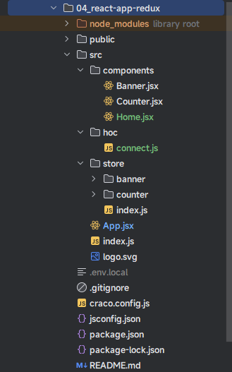

# 第一章：Redux Toolkit（⭐）

## 1.1 概述

* Redux Toolkit 包旨在成为编写 Redux 逻辑的标准方法。它最初是为了帮助解决有关 Redux 的`三个常见问题`而创建的：
  * ① 配置 Redux store 太复杂了。
  * ② 必须添加很多软件包才能让 Redux 做任何有用的事情。
  * ③ Redux 需要太多样板代码。

> 注意⚠️：
>
> * 很多人为了简化称呼，也将 Redux Toolkit 称为 `RTK`。
> * Redux Toolkit `仅`涵盖了 Redux 逻辑 —— 仍然需要使用 React-Redux 使得 React 组件与 Redux store 进行交互。

* 在此，有必要将使用了 `Redux Tookit` 工具包的项目和原生 `Reux` 的项目进行对比：


> 温馨提示：难道，没有觉得代码量少了很多吗？

* Redux Toolkit 还包括强大的数据获取和缓存功能，我们称之为`“RTK Query”`。它作为一组单独的入口点包含在包中。它是可选的，但可以消除自己手动编写数据获取逻辑的需要。
* Redux Toolkit 建立在官方建议的最佳实践中，`简化了大多数 Redux 任务`，`防止了常见错误`，`并使编写 Redux 应用程序更加容易`。
* Redux Toolkit 包含了有助于简化许多常见场景的工具，包括：`配置 Store`， `创建 reducer 并编写 immutable 更新逻辑`， 甚至还包含 `一次性创建整个 State 的 “Slice”`。

## 1.2 安装

* 安装：

```shell
npm install @reduxjs/toolkit react-redux
```

* 当然，官方也提供了利用 Redux Toolkit 和 Redux 与 React 组件的集成：

```shell
npx create-react-app my-app --template redux
```

```shell
npx create-react-app my-app --template redux-typescript
```

> 注意⚠️：`my-app` 是项目名，随便命名。

* Redux Toolkit 的核心 API，主要有如下的几个：
  * `configureStore()` ：包装 `createStore()` 以提供简化的配置选项和良好的默认值。它可以自动组合我们的 slice reducer，添加我们提供的任何 Redux 中间件，默认包含 `“redux-thunk”` ，并允许使用 Redux DevTools 扩展。
  * `createReducer()`：允许您向 case reducer 函数提供操作类型的查找表，而不是编写 switch 语句。此外，它会自动使用 immer 库，让您使用普通的可变代码编写更简单的不可变更新，例如 `'state.todos[3].completed = true'`。
  * `createAction()`：生成给定 action type 字符串的 action creator 函数。该函数本身已定义了 `toString()`，因此可以代替常量类型使用。
  * `createSlice()`：接收一组 reducer 函数的对象，一个 slice 切片名和初始状态 initial state，并自动生成具有相应 action creator 和 action type 的 slice reducer。
  * `combineSlices()`：将多个切片组合成一个缩减器，并允许在初始化后`“延迟加载”`切片。
  * `createAsyncThunk()`：接收一个 action type 字符串和一个返回值为 promise 的函数, 并生成一个 thunk 函数，这个 thunk 函数可以基于之前那个 promise ，dispatch 一组 type 为 `pending/fulfilled/rejected` 的 action。
  * `createEntityAdapter()`：生成一系列可复用的 reducer 和 selector，从而管理 store 中的规范化数据。
  * `createSelector`来源于 [Reselect](https://github.com/reduxjs/reselect) 库，重新 export 出来以方便使用。

* Redux Toolkit 更是提供一个新的 [**RTK Query 数据请求 API**](https://redux-toolkit.js.org/rtk-query/overview)。RTK Query 是为 Redux 打造数据请求和缓存的强有力的工具。 它设计出来就是为了 web 应用中加载数据的通用用例，免得手动去写数据请求和缓存的逻辑。

## 1.3 扫清概念

### 1.3.1 action 

* 我们知道，在 Redux 中，对于 action 的要求，就是普通的 JavaScript 对象，必须包含 type 属性，如：

```js
{ type: 'ADD_TODO', text: 'Go to swimming pool' }
{ type: 'TOGGLE_TODO', index: 1 }
{ type: 'SET_VISIBILITY_FILTER', filter: 'SHOW_ALL' }
```

* 甚至，你可能会看到以下的示意图：


> 注意⚠️：上面的示意图，完全没毛病，就是根据官方对于 action 的定义；可以将 action 写成 `{type: '',data: ''}`、`{type: '',text: ''}` 或 `{type: '',payload: ''}`。

* 但是，对于 `Redux Toolkit` 而言，action `必须`是包含 type 属性和 payload 属性的 JavaScript 对象，如：

```js
const addTodoAction = {
  type: 'todos/todoAdded',
  payload: 'Buy milk'
}
```

> 注意⚠️：
>
> * 在普通的 redux 项目中，type 只要是字符串就可以了；
> * 但是，在 `Redux Toolkit` 中，type 必须写成 `"域/事件名称"` 的格式，其中第一部分是这个 action 所属的`特征`或`类别`，第二部分是`发生的具体事情`（了解即可，因为 `Redux Toolkit` 会在底层帮助我们生成）。

### 1.3.2 action creator

* 在普通的 redux 项目中，我们一般会通过 action creator （函数）来帮助我们生成一个 action 对象；目的是，让我们不必每次都手动编写 action 。

```js
const INCREMENT = "counter/increment"

export const incrementAction = (payload) = {
    return {
    	type: INCREMENT,
        payload
	}
}
```

```js
// import 略

// 使用的时候
const action = incrementAction(10) // 相当于 {type: 'counter/increment'，payload: 10}
```

* 但是，在 `Redux Toolkit` 中，觉得这样的代码实现过于繁琐，其内部提供了 createAction 的 API 来帮助我们生成 action creator 函数，即：

```js
import {createAction} from "@reduxjs/toolkit"

const INCREMENT = "counter/increment"

const incrementAction = createAction(INCREMENT)
```

```js
// import 略

// 使用的时候
const action = incrementAction() // 相当于 {type: 'counter/increment'}
```

```js
// import 略

// 使用的时候
const action = incrementAction(10) // 相当于 {type: 'counter/increment'，payload: 10}
```

* 我们也看到了，默认的时候，生成的 action creator 只是接收单个参数，并且该参数是 action.payload ；但是，很多时候，我们需要自定义 payload 为其他类型的值，如：对象等；此时，就可以传入一个回调函数（也称为 prepare callback），用于构建自定义的 payload ，即：

```js
import { createAction, nanoid } from '@reduxjs/toolkit'

const INCREMENT = "counter/increment"

const incrementAction = createAction(INCREMENT, text => {
  return {
    payload: {
      text,
      id: nanoid(),
      createdAt: new Date().toISOString(),
    }
  }
})
```

```js
// import 略

// 使用的时候
const action = incrementAction(10) // 相当于 {type: 'counter/increment',payload:{text: 10,id: '4AJvwMSWEHCchcWYga3dj',createdAt: '2019-10-03T07:53:36.581Z'}}
```

> 注意⚠️：如果传入的是回调函数，那么必须返回一个带有 payload 字段的对象。

### 1.3.3 reducer

* 在 redux 项目中，reducer 是一个函数，接收当前的 state 和一个 action 对象，必要时决定如何更新状态，并返回新状态。函数签名是：`(state, action) => newState`，即：

```js
const initialState = { value: 0 }

const INCREMENT = "counter/increment"

function counterReducer(state = initialState, action) {
  // 检查 reducer 是否关心这个 action
  if (action.type === INCREMENT) {
    // 如果是，复制 `state`
    return {
      ...state,
      // 使用新值更新 state 副本
      value: action.payload + 1
    }
  }
  // 返回原来的 state 不变
  return state
}
```

* 但是，在 `Redux Toolkit` 中，提供了 createReducer() 来简化这样的操作，即：

```js
import { createAction, createReducer } from '@reduxjs/toolkit'

const INCREMENT = "counter/increment"
const DECREMENT = "counter/decrement"

const increment = createAction('counter/increment')
const decrement = createAction('counter/decrement')

const counterReducer = createReducer(0 ,builder => {
  builder.addCase(increment, (state, action) => state + action.payload)
  builder.addCase(decrement, (state, action) => state - action.payload)
})
```

### 1.3.4 store

* 之前，我们是通过 createStore() 函数来创建 store 对象的，即：

```js
import {applyMiddleware, createStore} from "redux"
import {thunk} from "redux-thunk"
import {composeWithDevToolsDevelopmentOnly} from '@redux-devtools/extension'
import combination from "@/store/reducers"

const composeEnhancers = composeWithDevToolsDevelopmentOnly({
    trace: true // 跟踪源码
});

// 创建 Store 对象
const store = createStore(combination, composeEnhancers(applyMiddleware(thunk)))

export default store
```

* 但是，在 `Redux Toolkit` 中，通过 `configureStore()` 来进行简化，即：

```js
import {configureStore} from "@reduxjs/toolkit"
import counterReducer from "./counter"
import bannerReducer from "./banner"

// 通过 configureStore 创建 store 对象
const store = configureStore({
  reducer: {
    counter: counterReducer,
    banner: bannerReducer
  },
  devTools: true // 开启 Redux DevTools ，默认为 true
})

export default store
```

### 1.3.5 dispatch

* 在 redux 中，我们一般通过 `store.dispath(action)` 来触发 redux 中 state 的更新，即：

```js
store.dispatch({ type: 'counter/increment' })
```

```js
console.log(store.getState()) // 通过订阅，或者 connect() 函数来获取
```

* 但是，我们通常会使用 action creator 来分发 action ，即：

```js
const increment = (payload) => {
  return {
    type: 'counter/increment',
    payload
  }
}

store.dispatch(increment())
```

```js
console.log(store.getState()) // 通过订阅，或者 connect() 函数来获取
```

* 在 `Redux Toolkit` 中，也是通过 action creator 来分发 action，即：

```js
import {createAction} from "@reduxjs/toolkit"

const INCREMENT = "counter/increment"

const increment = createAction(INCREMENT)
```

```js
store.dispatch(increment())
```

### 1.3.6 selector 函数

* selector 函数可以从 store 状态树中提取指定的片段。随着应用变得越来越大，随着应用变得越来越大，会遇到应用程序的不同部分需要读取相同的数据，selector 可以避免重复这样的读取逻辑：

```js
const selectCounterValue = state => state.value

const currentValue = selectCounterValue(store.getState())
console.log(currentValue)
```

* Selector 函数通常定义在 Redux 应用程序的两个地方：
  * ① 在 slice 文件中，与 reducer 逻辑一起。
  * ② 在组件文件中，在组件外部，或在 useSelector 中直接定义。

> 注意⚠️：通常而言，selector 函数是和函数式组件配合使用的；对于类式组件而言，通常使用 connect() 高阶函数。

## 1.4 重构代码

### 1.4.1 概述

* 使用 `Redux Toolkit` 重构之前的[案例](https://aexiar.github.io/web-design/notes/07_React18/08_xdx/#_4-5-redux-%E6%A8%A1%E5%9D%97%E7%9A%84%E6%8B%86%E5%88%86)，需要实现如下的效果。


* 其对应的项目结构如下：


### 1.4.2 创建 Redux Store 

* 示例：store/index.js

```js {5}
import {configureStore} from "@reduxjs/toolkit"

// 通过 configureStore 创建 store 对象
const store = configureStore({
  reducer: {},
  devTools: true // 开启 Redux DevTools ，默认为 true
})

export default store
```

* 需要`注意⚠️`的是，上述代码中的 reducer 配置选项，就相当于 redux 中提供的 combineReducers() 函数，即：

```js {6-9}
import bannerReducer from "@/store/banner"
import counterReducer from "@/store/counter"
import {combineReducers} from "redux";

// 合并 reducer
const combination = combineReducers({
  counter: counterReducer,
  banner: bannerReducer
})

export default combination
```

### 1.4.3 提供 Redux Store 到 React 项目中

* 示例：index.js

```js {4-5,9,13}
import React from 'react'
import ReactDOM from 'react-dom/client'
import App from '@/App'
import {Provider} from "react-redux"
import store from "@/store"

const root = ReactDOM.createRoot(document.getElementById('root'))
root.render(
  <Provider store={store}>
    <React.StrictMode>
      <App/>
    </React.StrictMode>
  </Provider>
)
```

### 1.4.4 创建 Redux 切片

* 示例：store/counter/index.js

```js {10}
import {createSlice} from "@reduxjs/toolkit"

const counterSlice = createSlice({
  name: 'counter', // 用户标记的 slice 的名称
  initialState: { // 初始化值
    count: 0
  },
  reducers: { // 相当于之前的 reducer 函数，即 reducer(state=initialState,action) {}；是对象类型，可以添加很多函数
    increment(state, action) { // 相当于之前的 case 语句
      state.count = state.count + action.payload
    },
    decrement: (state, action) => { // 相当于之前的 case 语句
      return {
        ...state,
        count: state.count - action.payload
      }
    }
  }
})

export const {increment, decrement} = counterSlice.actions // 导出 action
export default counterSlice.reducer // 导出 reducer
```

> 注意⚠️：
>
> * `createSlice()` 函数用来帮助我们生成 action 类型字符串、action creator 函数和 action 对象。
> * 上面之所以能使用 `state.count = state.count + action.payload`，是因为 Redux Toolkit 允许我们在 reducer 中编写“突变”逻辑。它实际上并没有改变状态，因为它使用了 Immer 库，检测对“草稿状态”的更改，并生成全新的基于这些更改的不可变状态。
> * name 属性：用来给 devtools 工具使用的，即用户标记的 slice 名称。
> * initialState 属性：中配置的就是初始化 state 的值。
> * reducers 属性：相当于之前的 reducer 函数，而其中的每个函数，都类似于之前的 case 语句；并且，action 的属性`必须`是 type 和 action 。

### 1.4.5 将切片添加到 store 中

* 示例：store/index.js

```js {2,7}
import {configureStore} from "@reduxjs/toolkit"
import counterReducer from "./counter"

// 通过 configureStore 创建 store 对象
const store = configureStore({
  reducer: {
    counter: counterReducer 
  },
  devTools: true // 开启 Redux DevTools ，默认为 true
})

export default store
```

### 1.4.6 在 React 组件中使用 Redux 的状态和操作

* 示例：components/Counter.jsx

```jsx {2-3,14,26-28,30-33}
import React, {PureComponent} from 'react'
import {connect} from "react-redux"
import {decrement, increment} from "@/store/counter"

class Counter extends PureComponent {
  
  state = {
    message: '我是 Counter 组件',
  }
  
  render() {
    const {message} = this.state
    console.log('Counter', this.props)
    const {count, add, sub} = this.props
    return (
      <div>
        <h2>{message}</h2>
        <h3>当前计数为：{count}</h3>
        <button onClick={() => add(1)}>点我+1</button>
        <button onClick={() => sub(1)}>点我-1</button>
      </div>
    )
  }
}

const mapStateToProps = (state) => ({
  count: state.counter.count
})

const mapDispatchToProps = (dispatch) => ({
  add: (num) => dispatch(increment(num)),
  sub: (num) => dispatch(decrement(num))
})

export default connect(mapStateToProps, mapDispatchToProps)(Counter)
```

### 1.4.7 其余的代码

* 示例：
* 其中，components/Banner.jsx

```jsx
import React, {PureComponent} from 'react'

class Banner extends PureComponent {
  
  state = {
    message: '我是 Banner 组件',
  }
  
  render() {
    const {message} = this.state
    return (
      <div>
        <h2>{message}</h2>
      </div>
    )
  }
}

export default Banner
```

* 其中，App.jsx

```jsx
import React, {PureComponent} from 'react'
import Counter from "@/components/Counter"
import Banner from "@/components/Banner"

class App extends PureComponent {
  
  state = {}
  
  render() {
    return (
      <div>
        <div style={{background: "pink", padding: '10px', width: '500px'}}>
          <Counter/>
        </div>
        <div style={{background: "skyblue", padding: '10px', width: '500px'}}>
          <Banner/>
        </div>
      </div>
    )
  }
}

export default App
```

## 1.5 重构代码

### 1.5.1 概述

*  我们知道，Redux 结合 `redux-thunk` ，是可以 dispath (action) 的时候，action 也可以是函数，以便实现异步功能；当然，`Redux Toolkit`也必须支持。
* 需求：实现下面的功能。


### 1.5.2 案例

* 示例：
* 其中，store/banner.js

```js {3-11}
import {createSlice} from "@reduxjs/toolkit"

export const addAsyncBanner = () => {
  return (dispatch, getState) => {
    // 执行异步逻辑操作
    console.log('addAsyncBannerAction', getState())
    setTimeout(() => {
      dispatch(addBanner(["banner1", "banner2", "banner3", "banner4"]))
    }, 2000)
  }
}

const bannerSlice = createSlice({
  name: 'banner',
  initialState: {
    banners: [],
  },
  reducers: { // 同步
    addBanner(state, action) {
      state.banners = action.payload
    }
  }
})


export const {addBanner} = bannerSlice.actions
export default bannerSlice.reducer
```

> 注意⚠️：
>
> * ① 和之前原生的 redux 逻辑一样，diapath(action) 中的 action 是一个函数，返回 action 可以是一个函数，并且该函数会被调用，并传递给这个函数一个 dispatch 函数和一个 getState 函数的参数，以便我们编写异步操作。
> * ② createSlice() 中默认没有提供对异步的任何支持，所以我们应该将它们作为单独的函数编写在同一个 slice 文件中，这样我们就可以访问该 slice 中普通的 action 了。

* 其中，components/Banner.jsx

```jsx
import React, {PureComponent} from 'react'
import {connect} from "react-redux";
import {addAsyncBanner} from "@/store/banner"

class Banner extends PureComponent {
  
  state = {
    message: '我是 Banner 组件',
  }
  
  render() {
    const {message} = this.state
    console.log('Banner', this.props)
    const {banners, addBanner} = this.props
    return (
      <div>
        <h2>{message}</h2>
        <button onClick={() => addBanner()}>异步获取数据</button>
        <h3>轮播图的数据：</h3>
        <ul>
          {
            banners && banners.map((item, index) => {
              return (<li key={index}>{item}</li>)
            })
          }
        </ul>
      </div>
    )
  }
}

const mapStateToProps = (state) => ({
  banners: state.banner.banners
})

const mapDispatchToProps = (dispatch) => ({
  addBanner: () => dispatch(addAsyncBanner()),
})
export default connect(mapStateToProps, mapDispatchToProps)(Banner)
```

## 1.6 疑惑？

* 其实，上述的演示仅仅是 Redux Toolkit 中的`冰山一角`而已，如：Ajax 的请求通常会使用 Promise （Pending、Fulfilled、Rejected）来进行开发，那么如何在 Redux 获取异步数据的时候，直接获取到请求的状态？

> 注意⚠️：对于 Redux Toolkit 的其它知识，将会在 React Hooks 之后，统一讲解！！！


# 第二章：Redux Toolkit 的数据不可变（了解）

* 在 React 开发中，我们总会强调数据的[不可变](https://aexiar.github.io/web-design/notes/07_React18/05_xdx/#_1-5-%E4%B8%8D%E5%8F%AF%E5%8F%98%E6%95%B0%E6%8D%AE%E7%9A%84%E5%8A%9B%E9%87%8F)：无论是类组件的中的 state ，还是 Redux 中管理的 state 。
* 之前，我们经常会使用浅拷贝来完成这些操作；但是，浅拷贝也会存在问题：
  * ① 过大的对象，在进行浅拷贝的时候会造成性能的浪费。
  * ② 浅拷贝后的对象，在深层改变的时候，依然会对之前的对象产生影响。

```js {17-20}
import * as ActionTypes from './constant'

// 初始化的 state
const initialState = {
  banners: []
}

/**
 * 定义 reducer 纯函数
 * @param state 当前的 state.js
 * @param action 本次需要更新的 action
 * @return store 中存储的 state.js
 */
const reducer = (state = initialState, action) => {
  switch (action.type) {
    case ActionTypes.ADD_BANNER:
      return {
        ...state,
        banners: action.payload
      }
    default: {
      return state
    }
  }
}

export default reducer
```

* 为了解决这些问题，Redux Toolkit 在底层使用了 [immerjs](https://github.com/immerjs/immer) 的库，来保证数据的不可变。

> 注意⚠️：
>
> * 我们只能在 Redux Toolkit 的 **`createSlice`** 和 **`createReducer`** 中编写 `“mutation”` 逻辑，因为它们在内部使用 Immer！
> * 如果我们在没有 Immer 的 reducer 中编写 mutation 逻辑，它将`改变状态`并`导致错误！`


# 第三章：自定义 connect 函数（了解）

## 3.1 概述

* 我们通过自定义 connect 函数来模拟 react-redux 中的 connect 函数。

## 3.2 案例

* 需求：新增一个 Home 组件，用来测试自定义的 connect 函数。


* 项目结构：



* 自定义 connect 函数：

```js {2}
import {PureComponent} from "react"
import store from "@/store"

/**
 * connect
 * @param mapStateToProps 函数
 * @param mapDispatchToProps 函数
 * @returns function(*): NewComponent
 */
export function connect(mapStateToProps, mapDispatchToProps) {
  // 高阶组件
  function fn(WrappedComponent) {
    class NewComponent extends PureComponent {
      
      componentDidMount() {
        store.subscribe(() => {
          this.forceUpdate()
        })
      }
      
      render() {
        const stateObj = mapStateToProps(store.getState())
        console.log('connect state', stateObj)
        const dispatchObj = mapDispatchToProps(store.dispatch);
        console.log('connect dispatchObj', dispatchObj)
        return (
          <WrappedComponent {...this.props} {...stateObj} {...dispatchObj}></WrappedComponent>
        )
      }
    }
    
    return NewComponent
    
  }
  
  return fn
}
```

* Home 组件如下所示：

```jsx {2}
import {PureComponent} from "react"
import {connect} from "@/hoc/connect"
import {decrement, increment} from "@/store/counter"

class Home extends PureComponent {
  
  state = {
    message: '我是 Home 组件',
  }
  
  render() {
    const {message} = this.state
    console.log('Home', this.props)
    const {count, add, sub} = this.props
    return (
      <div>
        <h2>{message}</h2>
        <h3>当前计数为：{count}</h3>
        <button onClick={() => add(1)}>点我+1</button>
        <button onClick={() => sub(1)}>点我-1</button>
      </div>
    )
  }
}

const mapStateToProps = (state) => ({
  count: state.counter.count
})

const mapDispatchToProps = (dispatch) => ({
  add: (num) => dispatch(increment(num)),
  sub: (num) => dispatch(decrement(num))
})

export default connect(mapStateToProps, mapDispatchToProps)(Home)
```

* 其内部原理，如下所示：


* 虽然，我们也实现了对应的效果；但是，每次数据更新的时候，都是强制刷新整个页面，不够优雅：

```js {17}
import {PureComponent} from "react"
import store from "@/store"

/**
 * connect
 * @param mapStateToProps 函数
 * @param mapDispatchToProps 函数
 * @returns function(*): NewComponent
 */
export function connect(mapStateToProps, mapDispatchToProps) {
  // 高阶组件
  function fn(WrappedComponent) {
    class NewComponent extends PureComponent {
      
      componentDidMount() {
        store.subscribe(() => {
          this.forceUpdate()
        })
      }
      
      render() {
        const stateObj = mapStateToProps(store.getState())
        console.log('connect state', stateObj)
        const dispatchObj = mapDispatchToProps(store.dispatch);
        console.log('connect dispatchObj', dispatchObj)
        return (
          <WrappedComponent {...this.props} {...stateObj} {...dispatchObj}></WrappedComponent>
        )
      }
    }
    
    return NewComponent
    
  }
  
  return fn
}
```

* 解决方案就是：将 connect 函数的高阶组件中将 `state` 设置为 `mapStateToProps(store.getState())`，即：

```js {15,19,28}
import {PureComponent} from "react"
import store from "@/store"

/**
 * connect
 * @param mapStateToProps 函数
 * @param mapDispatchToProps 函数
 * @returns function(*): NewComponent
 */
export function connect(mapStateToProps, mapDispatchToProps) {
  // 高阶组件
  function fn(WrappedComponent) {
    class NewComponent extends PureComponent {
      
      state = mapStateToProps(store.getState())
      
      componentDidMount() {
        this.unSubscribe = store.subscribe(() => {
          this.setState(mapStateToProps(store.getState()))
        })
      }
        
      componentWillUnmount() {
      	this.unSubscribe()
      }
      
      render() {
        const stateObj = this.state
        console.log('connect state', stateObj)
        const dispatchObj = mapDispatchToProps(store.dispatch);
        console.log('connect dispatchObj', dispatchObj)
        return (
          <WrappedComponent {...this.props} {...stateObj} {...dispatchObj}></WrappedComponent>
        )
      }
    }
    
    return NewComponent
    
  }
  
  return fn
}
```

## 3.3 分析缺点并进行解决

### 3.3.1 概述

* 在上面的自定义 connect 函数，会依赖导入的 store ，即：

```js {2}
import {PureComponent} from "react"
import store from "@/store"

/**
 * connect
 * @param mapStateToProps 函数
 * @param mapDispatchToProps 函数
 * @returns function(*): NewComponent
 */
export function connect(mapStateToProps, mapDispatchToProps) {
  // 高阶组件
  function fn(WrappedComponent) {
    class NewComponent extends PureComponent {
      
      state = mapStateToProps(store.getState())
      
      componentDidMount() {
        this.unSubscribe = store.subscribe(() => {
          this.setState(mapStateToProps(store.getState()))
        })
      }
        
      componentWillUnmount() {
      	this.unSubscribe()
      }
      
      render() {
        const stateObj = this.state
        console.log('connect state', stateObj)
        const dispatchObj = mapDispatchToProps(store.dispatch);
        console.log('connect dispatchObj', dispatchObj)
        return (
          <WrappedComponent {...this.props} {...stateObj} {...dispatchObj}></WrappedComponent>
        )
      }
    }
    
    return NewComponent
    
  }
  
  return fn
}
```

* 难道，我们通过 npm 打包上传到 npm [中央仓库](https://www.npmjs.com/) 之后，让用户 npm install 之后，手动修改源码；显然，不现实。最为正确的做法，就是应该提供一个 Provider ，并且该 Provider 就是通过 React 内部的 Context API 来实现的。

### 3.3.2 自定义 Provider 

* 项目结构：


* ① 实现 connect 函数以及 Provider ：
* 其中，hoc/createContext.js

```js
import {createContext} from 'react'

// 创建 StoreContext 对象
const StoreContext = createContext({})

// 导出
export {
  StoreContext
}
```

* 其中，hoc/connect.js

```js {2,15,17-20,23-25,35,37}
import {PureComponent} from "react"
import {StoreContext} from "./StoreContext"

/**
 * connect
 * @param mapStateToProps 函数
 * @param mapDispatchToProps 函数
 * @returns function(*): NewComponent
 */
export function connect(mapStateToProps, mapDispatchToProps) {
  // 高阶组件
  function fn(WrappedComponent) {
    class NewComponent extends PureComponent {
      
      static contextType = StoreContext
      
      constructor(props, context) {
        super(props, context);
        this.state = this.context.getState()
      }
      
      componentDidMount() {
        this.unSubscribe = this.context.subscribe(() => {
          this.setState(this.context.getState())
        })
      }
      
      componentWillUnmount() {
        this.unSubscribe()
      }
      
      render() {
        console.log('NewComponent', this)
        console.log('connect context', this.context)
        const stateObj = mapStateToProps(this.context.getState())
        console.log('connect state', stateObj)
        const dispatchObj = mapDispatchToProps(this.context.dispatch)
        console.log('connect dispatchObj', dispatchObj)
        return (
          <WrappedComponent {...this.props} {...stateObj} {...dispatchObj}></WrappedComponent>
        )
      }
    }
    
    return NewComponent
    
  }
  
  return fn
}
```

* ② 在 index.js 中应用自己封装的 Provider ：

```js {5,9,13}
import React from 'react'
import ReactDOM from 'react-dom/client'
import App from '@/App'
import store from "@/store"
import {StoreContext} from "@/hoc"

const root = ReactDOM.createRoot(document.getElementById('root'))
root.render(
  <StoreContext.Provider value={store}>
    <React.StrictMode>
      <App/>
    </React.StrictMode>
  </StoreContext.Provider>
)
```

* ③ 在各个组件中使用自己封装的 connect 函数：

```js {2}
import {PureComponent} from "react"
import {connect} from "@/hoc"
import {decrement, increment} from "@/store/counter"

class Home extends PureComponent {
  
  state = {
    message: '我是 Home 组件',
  }
  
  render() {
    const {message} = this.state
    console.log('Home', this.props)
    const {count, add, sub} = this.props
    return (
      <div>
        <h2>{message}</h2>
        <h3>当前计数为：{count}</h3>
        <button onClick={() => add(1)}>点我+1</button>
        <button onClick={() => sub(1)}>点我-1</button>
      </div>
    )
  }
}

const mapStateToProps = (state) => ({
  count: state.counter.count
})

const mapDispatchToProps = (dispatch) => ({
  add: (num) => dispatch(increment(num)),
  sub: (num) => dispatch(decrement(num))
})

export default connect(mapStateToProps, mapDispatchToProps)(Home)
```

```jsx {2}
import React, {PureComponent} from 'react'
import {connect} from "@/hoc"
import {decrement, increment} from "@/store/counter"

class Counter extends PureComponent {
  
  state = {
    message: '我是 Counter 组件',
  }
  
  render() {
    const {message} = this.state
    console.log('Counter', this.props)
    const {count, add, sub} = this.props
    return (
      <div>
        <h2>{message}</h2>
        <h3>当前计数为：{count}</h3>
        <button onClick={() => add(1)}>点我+1</button>
        <button onClick={() => sub(1)}>点我-1</button>
      </div>
    )
  }
}

const mapStateToProps = (state) => ({
  count: state.counter.count
})

const mapDispatchToProps = (dispatch) => ({
  add: (num) => dispatch(increment(num)),
  sub: (num) => dispatch(decrement(num))
})

export default connect(mapStateToProps, mapDispatchToProps)(Counter)
```

```jsx {2}
import React, {PureComponent} from 'react'
import {connect} from "@/hoc"
import {addAsyncBanner} from "@/store/banner"

class Banner extends PureComponent {
  
  state = {
    message: '我是 Banner 组件',
  }
  
  render() {
    const {message} = this.state
    console.log('Banner', this.props)
    const {banners, addBanner} = this.props
    return (
      <div>
        <h2>{message}</h2>
        <button onClick={() => addBanner()}>异步获取数据</button>
        <h3>轮播图的数据：</h3>
        <ul>
          {
            banners && banners.map((item, index) => {
              return (<li key={index}>{item}</li>)
            })
          }
        </ul>
      </div>
    )
  }
}

const mapStateToProps = (state) => ({
  banners: state.banner.banners
})

const mapDispatchToProps = (dispatch) => ({
  addBanner: () => dispatch(addAsyncBanner()),
})
export default connect(mapStateToProps, mapDispatchToProps)(Banner)
```


# 第四章：模拟 redux-thunk

## 4.1 概述

* 猴补丁（Monkey Patch）是一种在运行时修改或扩展现有代码的技术。它通常用于在不修改原始代码的情况下，动态地修改或增强现有的类、函数或对象的行为。

* 猴补丁的概念源自`动态语言`的特性，特别是在像 Python 和 `JavaScript` 这样的语言中，可以在运行时修改对象的属性和方法。通过猴补丁，开发者可以在不改变原始代码的情况下，对现有的类、函数或对象进行修改，添加新的功能或改变其行为。

* 猴补丁的应用场景包括但不限于：

  - 修复第三方库或框架的 bug，而无需等待官方发布修复版本。
  - 动态地修改现有的类或对象的行为，以满足特定需求。
  - 在测试环境中模拟或替换某些功能，以方便测试。

> 注意⚠️：
>
> * 猴补丁虽然可以灵活地修改现有代码，但也可能引入一些潜在的问题，如：不可预测的行为、代码可读性降低、与其他代码的兼容性问题等。
> * 因此，在使用猴补丁时，需要谨慎考虑其影响，并确保代码的可维护性和稳定性。

## 4.2 案例

* 借用 [此处](https://aexiar.github.io/web-design/notes/07_React18/08_xdx/#_4-5-redux-%E6%A8%A1%E5%9D%97%E7%9A%84%E6%8B%86%E5%88%86) 的案例，来实现 redux-thunk 的功能；其实很简单，就是在 store 中对 dispatch 进行拦截和增强：

```js {13-25}
import {applyMiddleware, createStore} from "redux"
import {thunk} from "redux-thunk"
import {composeWithDevToolsDevelopmentOnly} from '@redux-devtools/extension'
import combination from "@/store/reducers"

const composeEnhancers = composeWithDevToolsDevelopmentOnly({
  trace: true // 跟踪源码
});

// 创建 Store 对象
const store = createStore(combination, composeEnhancers(applyMiddleware(thunk)))

function thunkMiddleware(store) {
  const next = store.dispatch // 必须先提前存储起来
  
  function dispatchThunk(action) {
    if (typeof action === 'function') {
      action(store.dispatch, store.getState)
    } else {
      next(action)
    }
  }
  
  store.dispatch = dispatchThunk // 修改 dispatch 函数对应的内存地址，这就是 猴补丁（Monkey Patch）
}

thunkMiddleware(store)

export default store
```

* 其实，代码很简单，就是通过调用 `thunkMiddleware(store)` 函数，对 store 中的 dispatch 进行拦截；并判断 action 是函数还是对象，如果是函数，调用函数，并将 dispatch 和 getState 函数传递进去；如果是对象，直接调用即可。


# 第五章：状态组件库如何选择（⭐）

* Redux Toolkit 等并不是唯一的选择，目前也有很多其他的状态管理方案：
  * ① 喜欢 Redux 单向数据流的，可以用 [zustand](https://github.com/pmndrs/zustand) 。
  * ② 喜欢 React Hook 函数式思维的，可以用 [jotai](https://github.com/pmndrs/jotai) 。
  * ③ 喜欢 Vue3 Reactive 的，可以用 [valtio](https://github.com/pmndrs/valtio) 。

> 注意⚠️：在实际开发中，看团队和个人喜欢，选择对应的组件状态库即可；换言之，你熟悉那个就用那个。

