# 第一章：认识前端路由（⭐）

## 1.1 概述

* 在生活中，`路由器`是我们经常见到的`网络设备`。它是用来连接两个或多个分组交换网络或子网络的设备。
* 其主要有两个主要的功能：
  * ① 通过将`数据包`转发到其预定的`IP 地址`从而管理这些网络之间的流量。
  * ② 允许多个设备使用同一互联网连接。

* 路由器分为几种类型，但大多数路由器在 `LAN（局域网）`和 `WAN（广域网）`之间传递数据。
  * LAN 是一组限制在特定地理区域的连接设备。一个 LAN 通常只需要一个路由器。
  * WAN 是一个分布在广大地理区域的大型网络。例如：在全国各地多个地点运营的大型组织和公司将需要为每个地点建立单独的 LAN，然后与其他 LAN 连接，形成一个 WAN。由于 WAN 分布在一个大的区域内，它通常需要多个路由器和交换机。
* 其工作原理如下：


* 但是，在上图中，我们可以看到对于`路由器`而言，最重要的就是`路由表`了。
* 并且，`路由表`中对应的每个 `IP 地址`和`设备`的`映射`关系，就是`路由`了。

## 1.2 前端路由的发展

### 1.2.1 后端路由阶段

* 早期的网站开发，整个 HTML 页面都是由`服务器`来渲染的；换言之，服务器直接`生产渲染好对应的 HTML 页面`，返回给客户端进行展示。

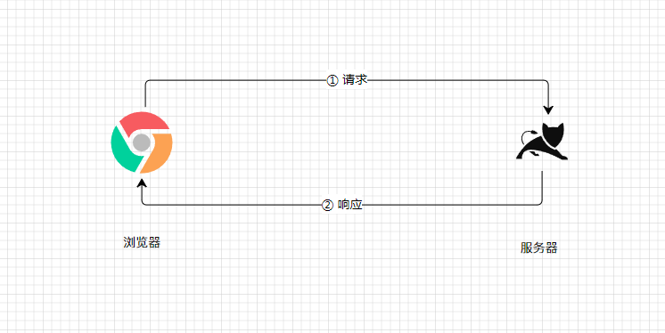

* 但是，像类似`京东`、`淘宝`这样大型的网站，必然有`很多`页面。以`京东`为例：

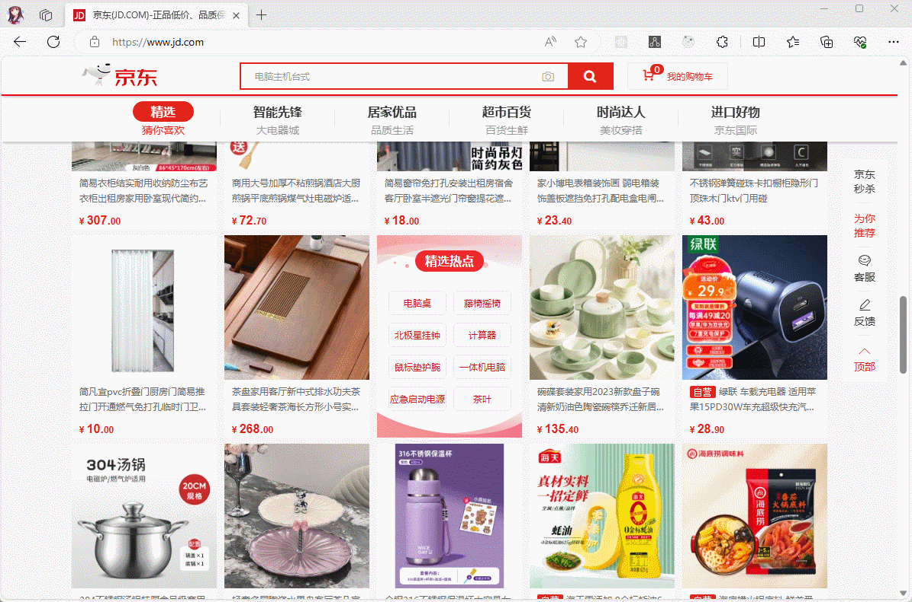

* 我们可以发现每个页面都有自己对应的 `URL`，服务器会通过`正则`之类的来`匹配`对应的 `URL` ，并转发给对应的 `Controller` 来处理，之后会进行各种`数据处理`，最终通过`各种技术`来生成 HTML ，返回给`前端`。

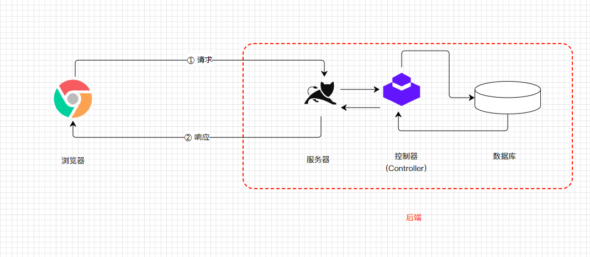

* 上面的这种操作就是`后端路由`，即：
  * 当我们页面中需要`请求不同的路径内容`时，交给服务器来进行处理，服务器`渲染好整个页面`,，并且`将页面返回给客户端`。
  * 这种情况下渲染好的页面，不需要`单独`加载任何的 `js` 和 `css`，可以直接交给浏览器展示，这样也`有利于SEO 的优化` 。

* 此处的`后端路由`，也经常被称为 `MPA`（Multi-page Application，多页面应用），有如下的`缺点`：
  * ① 在点击`路由`（URL）进行切换的时候，浏览器重新绘制整个页面，要不停的经历[浏览器渲染页面的流程](https://aexiar.github.io/web-design/notes/03_javascript_advanced/02_xdx/#_2-2-%E6%B5%8F%E8%A7%88%E5%99%A8%E6%B8%B2%E6%9F%93%E9%A1%B5%E9%9D%A2%E7%9A%84%E6%B5%81%E7%A8%8B)，会比较卡。
  * ② 在这种模式下，通常`前端开发人员`只提供`HTML、CSS、JS `之类的页面及其效果，还需要后端开发人员，通过 JSP、PHP 、ASP 等`模板技术`进行转换，最终通过`服务器`进行渲染。
  * ③ 很多前端开发人员对于 JSP 等模板技术不熟悉；而 HTML 代码和一些模板标签以及逻辑混合在一起，会使得项目的编写和维护很麻烦。

### 1.2.2 前后端分离阶段

* 随着 `Ajax` 的出现，开始出现了前后端分离的开发模式，在这种模式下：
  * 后端只提供 API 接口来返回数据。
  * 前端通过 Ajax 来获取数据，并通过 JavaScript 将数据渲染到页面上。
  * 并且，当 Android 和 iOS 出现后，后端也是提供同样的 API 。
* 其开发模式类似于：

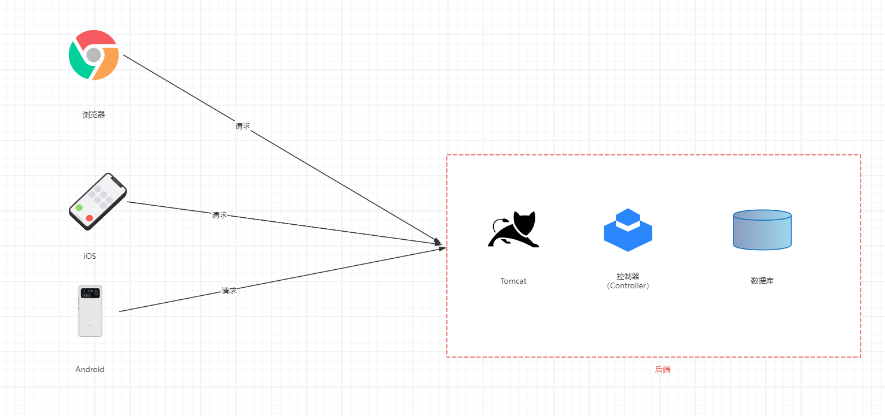

> 注意⚠️：在这种开发模式中，`路由`还是由后端维护；在开发和部署阶段，依然需要后端介入。

### 1.2.3 单页面应用（Multi-page Application，SPA）

* 随着 HTML5 的发展，HTML5 提供了 [history](https://aexiar.github.io/web-design/notes/02_javascript_basic/11_xdx/#_4-4-%E8%B7%AF%E7%94%B1%E7%9A%84%E5%AE%9E%E7%8E%B0%E5%8E%9F%E7%90%86) 接口，可以实现改变 URL 而不刷新页面。
* 当然，传送的 [hash](https://aexiar.github.io/web-design/notes/02_javascript_basic/11_xdx/#_4-4-%E8%B7%AF%E7%94%B1%E7%9A%84%E5%AE%9E%E7%8E%B0%E5%8E%9F%E7%90%86) 模式也通常能实现改变 URL 而不刷新页面。
* 所以，目前的开发模式就类似于：

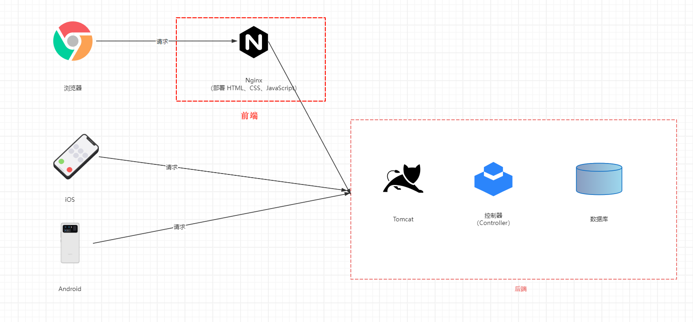

> 注意⚠️：
>
> * 在这种开发模式中，前端相关的工作，在开发和部署阶段已经不需要后端来介入了，专人做专人的事情。
> * SPA，即单页面应用，最主要的特点：就是在`前后端分离`的基础上增加了一层`前端路由`，即让前端来维护一套`路由规则`。也正是这种方式，提高了生产力。


# 第二章：React-Router 的基本使用（⭐）

## 2.1 概述

* 需要使用到 bootstrap ，安装一下：

```shell
npm install bootstrap@3
```

* 安装 React-Router ：

```shell
npm install react-router-dom
```

* React-Router 提供了 `BrowserRouter` 或 `HashRouter` 组件，用于对路径改变的监听，并且会将响应的路径传递给子组件，即：

```jsx {9,11}
import React from 'react'
import ReactDOM from 'react-dom/client'
import App from '@/App'
import {HashRouter} from "react-router-dom"

const root = ReactDOM.createRoot(document.getElementById('root'))
root.render(
  <React.StrictMode>
    <HashRouter>
      <App/>
    </HashRouter>
  </React.StrictMode>
)
```

> 注意⚠️：React-Router 已经全面支持 Hooks 了，不再推荐类式组件了。

## 2.2 组件介绍

### 2.2.1 Link 和 NavLink

* 通常，在 React-Router 中，进行超链接跳转的时候，都需要使用 `Link`  或 `NavLink`组件。
* 并且，`NavLink` 组件就是在 `Link` 组件的基础上，增加了一些样式而已。
* `Link` 或 `NavLink` 组件的使用方式：

```jsx
<Link to=".." replace state={{xxx}}>xxx</Link>
```

> 注意⚠️：
>
> * to 表示要跳转的地址。
> * replace 表示替换 history 中的历史堆栈信息。
> * state 是用于传递路由信息的（后文讲解）。

```jsx
<NavLink to="/messages"
  className={({ isActive, isPending，isTransitioning  }) => [
      isPending ? "pending" : "",
      isActive ? "active" : "",
      isTransitioning ? "transitioning" : "",
    ].join(" ")}
    replace 
    state={{xxx}}
    >
  xxx
</NavLink>;
```

> 注意⚠️：
>
> * to 表示要跳转的地址。
> * replace 表示替换 history 中的历史堆栈信息。
> * state 是用于传递路由信息的（后文讲解）。
> * className 可以传递一个函数，并通过 isActive、isPending 以及 isTransitioning 来表示活动、待定还是过渡效果。当然，如果不写，默认就是 active 。

### 2.2.2 Routes 和 Route

* `Routes`  和 `Route` 是用来进行路由映射配置的，并且 `Route` 中一定要配置在 `Routes` 组件中。
* `Route` 中常用的有 `path` 属性和 `element` 属性：
  * `path` 属性：用于设置匹配到的路径。
  * `element` 属性：设置匹配到的路径后，渲染的组件。
* `Routes` 和 `Route` 的使用方式：

```jsx
<Routes>
  <Route path={"/home"} element={<Home/>}></Route>
  <Route path={"/about"} element={<About/>}></Route>
</Routes>
```

> 注意⚠️：Route 中支持嵌套路由。

## 2.3 案例

* 需求：实现下面的功能。

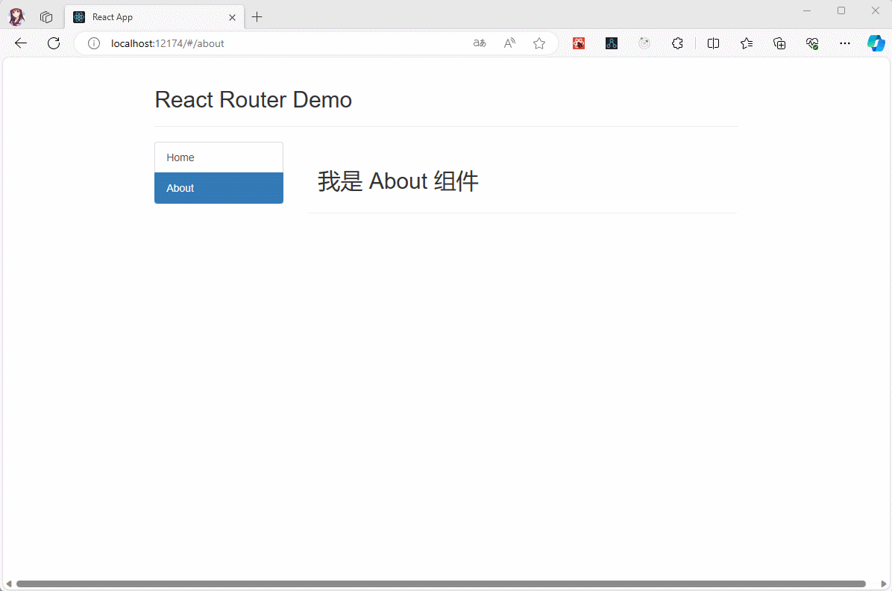

* 项目结构：

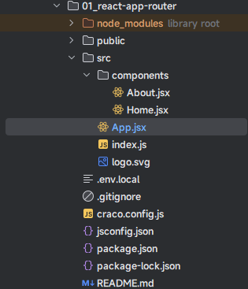

* 示例：
* 其中，index.js

```js {5,10,12}
import React from 'react'
import ReactDOM from 'react-dom/client'
import App from '@/App'
import 'bootstrap/dist/css/bootstrap.css'
import {HashRouter} from "react-router-dom"

const root = ReactDOM.createRoot(document.getElementById('root'))
root.render(
  <React.StrictMode>
    <HashRouter>
      <App/>
    </HashRouter>
  </React.StrictMode>
)
```

> 注意⚠️：
>
> * 可以使用 HashRouter 和 BrowserRouter 来监听路径的变化，并且这两个组件会将相应的变化传递给子组件。
> * 实际开发中，无所谓可以随意切换；本次使用 HashRouter 是为了方便演示。

* 其中，componenets/About.jsx

```jsx
import React, {PureComponent} from 'react'


class About extends PureComponent {
  
  state = {
    message: '我是 About 组件 '
  }
  
  render() {
    const {message} = this.state
    return (
      <div>
        <h2>{message}</h2>
      </div>
    )
  }
}

export default About
```

* 其中，componenets/Home.jsx

```jsx
import React, {PureComponent} from 'react'

class Home extends PureComponent {
  
  state = {
    message: '我是 Home 组件 '
  }
  
  render() {
    const {message} = this.state
    return (
      <div>
        <h2>{message}</h2>
      </div>
    )
  }
}

export default Home
```

* 其中，App.jsx

```jsx {3-4,27-28,37-40}
import React, {PureComponent} from 'react'
import {NavLink, Route, Routes} from "react-router-dom"
import Home from "@/components/Home"
import About from "@/components/About"

class App extends PureComponent {
  
  state = {}
  
  render() {
    return (
      <div>
        <div className="row">
          <div className="col-xs-offset-2 col-xs-8">
            <div className="page-header"><h2>React Router Demo</h2></div>
          </div>
        </div>
        <div className="row">
          <div className="col-xs-2 col-xs-offset-2">
            <div className="list-group">
              {/* 原生 HTML 中，靠 <a> 标签跳转不同的页面 */}
              {/*
                <a className="list-group-item" href="./about.html">About</a>
                <a className="list-group-item active" href="./home.html">Home</a>
              */}
              {/* 在 React 中，靠路由链接实现切换组件 --- 编写路由链接 */}
              <NavLink className="list-group-item" to="/home">Home</NavLink>
              <NavLink className="list-group-item" to="/about">About</NavLink>
            </div>
          </div>
          <div className="col-xs-6">
            <div className="panel">
              <div className="panel-body">
                {/*
                  注册路由的映射关系：path ==> Component
                */}
                <Routes>
                  <Route path={"/home"} element={<Home/>}></Route>
                  <Route path={"/about"} element={<About/>}></Route>
                </Routes>
              </div>
            </div>
          </div>
        </div>
      </div>
    )
  }
}

export default App
```


# 第三章：嵌套路由（⭐）

## 3.1 概述

* 在实际开发中，嵌套路由很常见。并且，我们也知道，`Route` 组件是支持嵌套路由的，即：

```jsx
<Routes>
  <Route path={"/home"} element={<Home/>}></Route>
  <Route path={"/about"} element={<About/>}>
    {/* 注意，此处不需要写父路由，也不能带 /  */}  
    <Route path={"news"} element={<News/>}></Route>
    <Route path={"message"} element={<Message/>}></Route>
  </Route>
</Routes>
```

* 在 Vue 中，我们通常会使用 `router-view` 组件来进行路由的占位；同理，在 React-Router 中，我们也可以使用 `Outlet` 组件进行占位，`Outlet` 的英文翻译就是`出口`的意思。
* `Outlet` 组件用于在父路由元素中作为子路由的占位元素。

```jsx
<Outlet />
```

## 3.2 案例

* 案例：实现下面的功能。

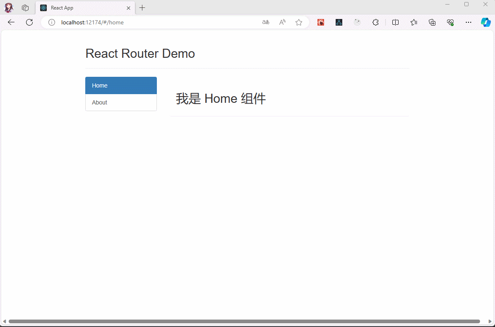

* 项目结构：

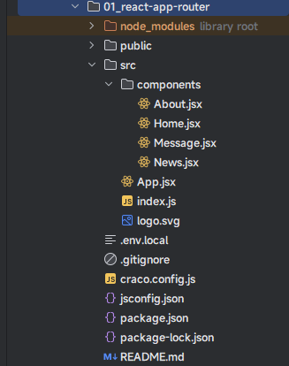

* 示例：
* 其中，index.js

```js
import React from 'react'
import ReactDOM from 'react-dom/client'
import App from '@/App'
import 'bootstrap/dist/css/bootstrap.css'
import {HashRouter} from "react-router-dom"

const root = ReactDOM.createRoot(document.getElementById('root'))
root.render(
  <React.StrictMode>
    <HashRouter>
      <App/>
    </HashRouter>
  </React.StrictMode>
)
```

* 其中，components/Home.jsx

```jsx
import React, {PureComponent} from 'react'

class Home extends PureComponent {
  
  state = {
    message: '我是 Home 组件 '
  }
  
  render() {
    const {message} = this.state
    return (
      <div>
        <h2>{message}</h2>
      </div>
    )
  }
}

export default Home
```

* 其中，components/Message.jsx

```jsx
import React, {PureComponent} from 'react'


class Message extends PureComponent {
  
  state = {
    message: '我是 Message 组件 '
  }
  
  render() {
    const {message} = this.state
    return (
      <div>
        <h2>{message}</h2>
      </div>
    )
  }
}

export default Message
```

* 其中，components/News.jsx

```jsx
import React, {PureComponent} from 'react'


class News extends PureComponent {
  
  state = {
    message: '我是 News 组件 '
  }
  
  render() {
    const {message} = this.state
    return (
      <div>
        <h2>{message}</h2>
      </div>
    )
  }
}

export default News
```

* 其中，components/About.jsx

```jsx
import React, {PureComponent} from 'react'
import {NavLink, Outlet} from "react-router-dom";


class About extends PureComponent {
  
  state = {
    message: '我是 About 组件 '
  }
  
  render() {
    const {message} = this.state
    return (
      <div>
        <h2>{message}</h2>
        <div>
          <ul className="nav nav-tabs">
            <li>
              <NavLink className="list-group-item" to="/about/news">News</NavLink>
            </li>
            <li>
              <NavLink className="list-group-item" to="/about/message">Message</NavLink>
            </li>
          </ul>
          <Outlet/>
        </div>
      </div>
    )
  }
}

export default About
```

* 其中，App.jsx

```jsx {3-6,29-30,39-45}
import React, {PureComponent} from 'react'
import {NavLink, Route, Routes} from "react-router-dom"
import Home from "@/components/Home"
import About from "@/components/About"
import News from "@/components/News"
import Message from "@/components/Message"

class App extends PureComponent {
  
  state = {}
  
  render() {
    return (
      <div>
        <div className="row">
          <div className="col-xs-offset-2 col-xs-8">
            <div className="page-header"><h2>React Router Demo</h2></div>
          </div>
        </div>
        <div className="row">
          <div className="col-xs-2 col-xs-offset-2">
            <div className="list-group">
              {/* 原生 HTML 中，靠 <a> 标签跳转不同的页面 */}
              {/*
                <a className="list-group-item" href="./about.html">About</a>
                <a className="list-group-item active" href="./home.html">Home</a>
              */}
              {/* 在 React 中，靠路由链接实现切换组件 --- 编写路由链接 */}
              <NavLink className="list-group-item" to="/home">Home</NavLink>
              <NavLink className="list-group-item" to="/about">About</NavLink>
            </div>
          </div>
          <div className="col-xs-6">
            <div className="panel">
              <div className="panel-body">
                {/*
                  注册路由的映射关系：path ==> Component
                */}
                <Routes>
                  <Route path={"/home"} element={<Home/>}></Route>
                  <Route path={"/about"} element={<About/>}>
                    {/* 注意此处不需要写父路由或 / */}
                    <Route path={"news"} element={<News/>}></Route>
                    <Route path={"message"} element={<Message/>}></Route>
                  </Route>
                </Routes>
              </div>
            </div>
          </div>
        </div>
      </div>
    )
  }
}

export default App
```

## 3.4 优化

* 上述的效果是这样的：

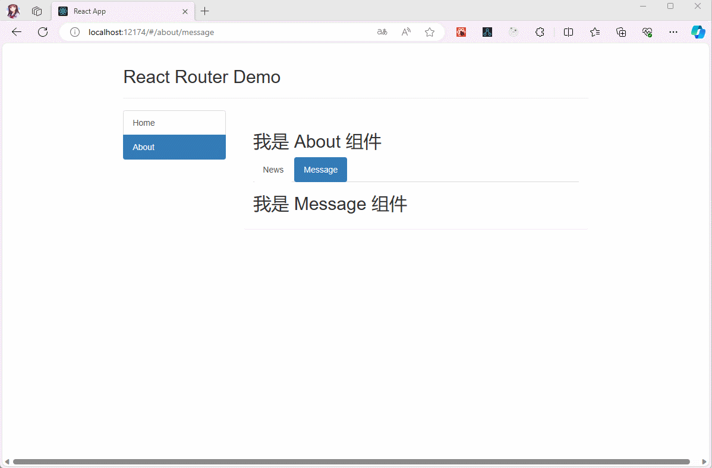

* 当子路由被激活的时候，父路由上的组件也显示激活效果；但是，有的时候，我们并不需要，就可以这么修改：

```jsx {30}
import React, {PureComponent} from 'react'
import {NavLink, Route, Routes} from "react-router-dom"
import Home from "@/components/Home"
import About from "@/components/About"
import News from "@/components/News"
import Message from "@/components/Message"

class App extends PureComponent {
  
  state = {}
  
  render() {
    return (
      <div>
        <div className="row">
          <div className="col-xs-offset-2 col-xs-8">
            <div className="page-header"><h2>React Router Demo</h2></div>
          </div>
        </div>
        <div className="row">
          <div className="col-xs-2 col-xs-offset-2">
            <div className="list-group">
              {/* 原生 HTML 中，靠 <a> 标签跳转不同的页面 */}
              {/*
                <a className="list-group-item" href="./about.html">About</a>
                <a className="list-group-item active" href="./home.html">Home</a>
              */}
              {/* 在 React 中，靠路由链接实现切换组件 --- 编写路由链接 */}
              <NavLink className="list-group-item" to="/home">Home</NavLink>
              <NavLink className="list-group-item" to="/about" end >About</NavLink>
            </div>
          </div>
          <div className="col-xs-6">
            <div className="panel">
              <div className="panel-body">
                {/*
                  注册路由的映射关系：path ==> Component
                */}
                <Routes>
                  <Route path={"/home"} element={<Home/>}></Route>
                  <Route path={"/about"} element={<About/>}>
                    {/* 注意此处不需要写父路由或 / */}
                    <Route path={"news"} element={<News/>}></Route>
                    <Route path={"message"} element={<Message/>}></Route>
                  </Route>
                </Routes>
              </div>
            </div>
          </div>
        </div>
      </div>
    )
  }
}

export default App
```

* 效果如下：


## 3.5 优化

* 有的时候，用户随意输入一个地址，我们希望提供一个 404 的页面给用户，而不是什么都不显示。

 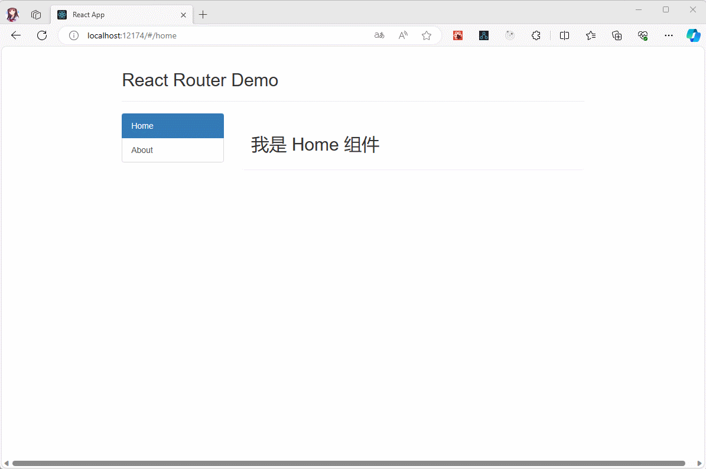


* 只要配置路径为 `*` ，并配置对应的 `NotFound` 组件，即：

```jsx
import React, {PureComponent} from 'react'

class NotFound extends PureComponent {
  
  state = {
    message: '页面走丢失了'
  }
  
  render() {
    const {message} = this.state
    return (
      <div>
        <h2>{message}</h2>
      </div>
    )
  }
}

export default NotFound
```

```jsx {7,47}
import React, {PureComponent} from 'react'
import {NavLink, Route, Routes} from "react-router-dom"
import Home from "@/components/Home"
import About from "@/components/About"
import News from "@/components/News"
import Message from "@/components/Message"
import NotFound from "@/components/NotFound"

class App extends PureComponent {
  
  state = {}
  
  render() {
    return (
      <div>
        <div className="row">
          <div className="col-xs-offset-2 col-xs-8">
            <div className="page-header"><h2>React Router Demo</h2></div>
          </div>
        </div>
        <div className="row">
          <div className="col-xs-2 col-xs-offset-2">
            <div className="list-group">
              {/* 原生 HTML 中，靠 <a> 标签跳转不同的页面 */}
              {/*
                <a className="list-group-item" href="./about.html">About</a>
                <a className="list-group-item active" href="./home.html">Home</a>
              */}
              {/* 在 React 中，靠路由链接实现切换组件 --- 编写路由链接 */}
              <NavLink className="list-group-item" to="/home">Home</NavLink>
              <NavLink className="list-group-item" to="/about" end>About</NavLink>
            </div>
          </div>
          <div className="col-xs-6">
            <div className="panel">
              <div className="panel-body">
                {/*
                  注册路由的映射关系：path ==> Component
                */}
                <Routes>
                  <Route path={"/home"} element={<Home/>}></Route>
                  <Route path={"/about"} element={<About/>}>
                    {/* 注意此处不需要写父路由或 / */}
                    <Route path={"news"} element={<News/>}></Route>
                    <Route path={"message"} element={<Message/>}></Route>
                  </Route>
                  <Route path={"*"} element={<NotFound/>}></Route>
                </Routes>
              </div>
            </div>
          </div>
        </div>
      </div>
    )
  }
}

export default App
```

* 对应的效果如下：


## 3.6 优化

* 对于下面的代码，即：

```jsx {40}
import React, {PureComponent} from 'react'
import {NavLink, Route, Routes} from "react-router-dom"
import Home from "@/components/Home"
import About from "@/components/About"
import News from "@/components/News"
import Message from "@/components/Message"
import NotFound from "@/components/NotFound"

class App extends PureComponent {
  
  state = {}
  
  render() {
    return (
      <div>
        <div className="row">
          <div className="col-xs-offset-2 col-xs-8">
            <div className="page-header"><h2>React Router Demo</h2></div>
          </div>
        </div>
        <div className="row">
          <div className="col-xs-2 col-xs-offset-2">
            <div className="list-group">
              {/* 原生 HTML 中，靠 <a> 标签跳转不同的页面 */}
              {/*
                <a className="list-group-item" href="./about.html">About</a>
                <a className="list-group-item active" href="./home.html">Home</a>
              */}
              {/* 在 React 中，靠路由链接实现切换组件 --- 编写路由链接 */}
              <NavLink className="list-group-item" to="/home">Home</NavLink>
              <NavLink className="list-group-item" to="/about" end>About</NavLink>
            </div>
          </div>
          <div className="col-xs-6">
            <div className="panel">
              <div className="panel-body">
                {/*
                  注册路由的映射关系：path ==> Component
                */}
                <Routes>
                  <Route path={"/home"} element={<Home/>}></Route>
                  <Route path={"/about"} element={<About/>}>
                    {/* 注意此处不需要写父路由或 / */}
                    <Route path={"news"} element={<News/>}></Route>
                    <Route path={"message"} element={<Message/>}></Route>
                  </Route>
                  <Route path={"*"} element={<NotFound/>}></Route>
                </Routes>
              </div>
            </div>
          </div>
        </div>
      </div>
    )
  }
}

export default App
```

* 直接配置在页面中，显示不是很好；我们可以通过 useRoutes 这个 Hook 来优化；但是，[Hook 只能用于函数式组件](https://aexiar.github.io/web-design/notes/07_React18/11_xdx/)：

```jsx {11-30,58}
import React, {memo} from 'react'
import {NavLink, useRoutes} from "react-router-dom"
import Home from "@/components/Home"
import About from "@/components/About"
import News from "@/components/News"
import Message from "@/components/Message"


function App() {
  
  let element = useRoutes([
    {
      path: "/home",
      element: <Home/>
    },
    {
      path: "/about",
      element: <About/>,
      children: [
        {
          path: "news",
          element: <News/>
        },
        {
          path: "message",
          element: <Message/>
        }
      ]
    }
  ])
  
  return (
    <div>
      <div className="row">
        <div className="col-xs-offset-2 col-xs-8">
          <div className="page-header"><h2>React Router Demo</h2></div>
        </div>
      </div>
      <div className="row">
        <div className="col-xs-2 col-xs-offset-2">
          <div className="list-group">
            {/* 原生 HTML 中，靠 <a> 标签跳转不同的页面 */}
            {/*
                <a className="list-group-item" href="./about.html">About</a>
                <a className="list-group-item active" href="./home.html">Home</a>
              */}
            {/* 在 React 中，靠路由链接实现切换组件 --- 编写路由链接 */}
            <NavLink className="list-group-item" to="/home">Home</NavLink>
            <NavLink className="list-group-item" to="/about" end>About</NavLink>
          </div>
        </div>
        <div className="col-xs-6">
          <div className="panel">
            <div className="panel-body">
              {/*
                  注册路由的映射关系：path ==> Component
                */}
              {element}
            </div>
          </div>
        </div>
      </div>
    </div>
  )
}

export default memo(App)
```

* 既然，useRoutes 这个 Hook 返回的是呈现路由树（表）的有效 React 元素，那么我们也可以抽取到一个文件中，即：

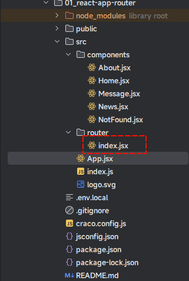

* 其中，router/index.jsx

```js
import Home from "@/components/Home";
import About from "@/components/About";
import News from "@/components/News";
import Message from "@/components/Message";
import React from "react";

const routes = [
  {
    path: "/home",
    element: <Home/>
  },
  {
    path: "/about",
    element: <About/>,
    children: [
      {
        path: "news",
        element: <News/>
      },
      {
        path: "message",
        element: <Message/>
      }
    ]
  }
]

export default routes
```

* 其中，App.jsx

```jsx {3,7,35}
import React, {memo} from 'react'
import {NavLink, useRoutes} from "react-router-dom"
import routes from "@/router"

function App() {
  
  const element = useRoutes(routes)
  
  return (
    <div>
      <div className="row">
        <div className="col-xs-offset-2 col-xs-8">
          <div className="page-header"><h2>React Router Demo</h2></div>
        </div>
      </div>
      <div className="row">
        <div className="col-xs-2 col-xs-offset-2">
          <div className="list-group">
            {/* 原生 HTML 中，靠 <a> 标签跳转不同的页面 */}
            {/*
                <a className="list-group-item" href="./about.html">About</a>
                <a className="list-group-item active" href="./home.html">Home</a>
              */}
            {/* 在 React 中，靠路由链接实现切换组件 --- 编写路由链接 */}
            <NavLink className="list-group-item" to="/home">Home</NavLink>
            <NavLink className="list-group-item" to="/about" end>About</NavLink>
          </div>
        </div>
        <div className="col-xs-6">
          <div className="panel">
            <div className="panel-body">
              {/*
                  注册路由的映射关系：path ==> Component
                */}
              {element}
            </div>
          </div>
        </div>
      </div>
    </div>
  )
}

export default memo(App)
```

## 3.7 优化

* 难道不觉得，上述的案例演示，还是不够优雅，即：


* React-Router 提供了 `createBrowserRouter`、`createHashRouter`、`RouterProvider` 等 API 来帮助我们优化，即：

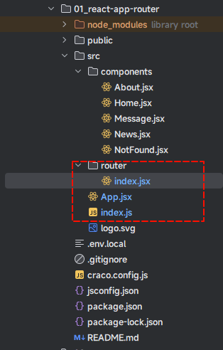

* 示例：
* 其中，router/index.jsx

```jsx {10}
import Home from "@/components/Home";
import About from "@/components/About";
import News from "@/components/News";
import Message from "@/components/Message";
import React from "react";
import {createHashRouter} from "react-router-dom";
import NotFound from "@/components/NotFound";
import App from "@/App";

const router = createHashRouter([
  {
    path: '/',
    element: <App/>,
    children: [
      {
        path: "home",
        element: <Home/>
      },
      {
        path: "about",
        element: <About/>,
        children: [
          {
            path: "news",
            element: <News/>
          },
          {
            path: "message",
            element: <Message/>
          }
        ]
      },
    ]
  },
  {
    path: "*",
    element: <NotFound/>
  },
])

export default router
```

* 其中，index.js

```jsx {4,6,11,13}
import React from 'react'
import ReactDOM from 'react-dom/client'
import App from '@/App'
import {RouterProvider} from "react-router-dom"
import 'bootstrap/dist/css/bootstrap.min.css'
import router from '@/router'

const root = ReactDOM.createRoot(document.getElementById('root'))
root.render(
  <React.StrictMode>
    <RouterProvider router={router}>
      <App/>
    </RouterProvider>
  </React.StrictMode>
)
```

* 其中，App.jsx

```jsx {32}
import React, {memo} from 'react'
import {NavLink, Outlet} from "react-router-dom"

function App() {
  
  return (
    <div>
      <div className="row">
        <div className="col-xs-offset-2 col-xs-8">
          <div className="page-header"><h2>React Router Demo</h2></div>
        </div>
      </div>
      <div className="row">
        <div className="col-xs-2 col-xs-offset-2">
          <div className="list-group">
            {/* 原生 HTML 中，靠 <a> 标签跳转不同的页面 */}
            {/*
                <a className="list-group-item" href="./about.html">About</a>
                <a className="list-group-item active" href="./home.html">Home</a>
              */}
            {/* 在 React 中，靠路由链接实现切换组件 --- 编写路由链接 */}
            <NavLink className="list-group-item" to="/home">Home</NavLink>
            <NavLink className="list-group-item" to="/about" end>About</NavLink>
          </div>
        </div>
        <div className="col-xs-6">
          <div className="panel">
            <div className="panel-body">
              {/*
                  占位
                */}
              <Outlet/>
            </div>
          </div>
        </div>
      </div>
    </div>
  )
}

export default memo(App)
```

## 3.8 优化

* 通常而言，App.jsx 中我们一般只放一个`占位`就可以了，相关的二级路由会放到一个名为 Layout 的组件中，即：

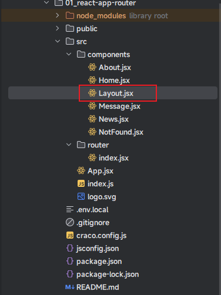

* 示例：
* 其中，App.jsx

```jsx {9}
import React, {memo} from 'react'
import {Outlet} from "react-router-dom";

function App() {
  
  return (
    <div>
      {/* 一级路由出口 */}
      <Outlet/>
    </div>
  )
}

export default memo(App)
```

* 其中，componenets/Layout.jsx

```jsx {29}
import React, {memo} from "react";
import {NavLink, Outlet} from "react-router-dom";

function Layout() {
  return (
    <div>
      <div className="row">
        <div className="col-xs-offset-2 col-xs-8">
          <div className="page-header"><h2>React Router Demo</h2></div>
        </div>
      </div>
      <div className="row">
        <div className="col-xs-2 col-xs-offset-2">
          <div className="list-group">
            {/* 原生 HTML 中，靠 <a> 标签跳转不同的页面 */}
            {/*
                <a className="list-group-item" href="./about.html">About</a>
                <a className="list-group-item active" href="./home.html">Home</a>
              */}
            {/* 在 React 中，靠路由链接实现切换组件 --- 编写路由链接 */}
            <NavLink className="list-group-item" to="/home">Home</NavLink>
            <NavLink className="list-group-item" to="/about" end>About</NavLink>
          </div>
        </div>
        <div className="col-xs-6">
          <div className="panel">
            <div className="panel-body">
              {/* 二级路由渲染出口 */}
              <Outlet/>
            </div>
          </div>
        </div>
      </div>
    </div>
  )
}

export default memo(Layout)
```

* 其中，router/index.jsx

```jsx
import Home from "@/components/Home";
import About from "@/components/About";
import News from "@/components/News";
import Message from "@/components/Message";
import React from "react";
import {createHashRouter} from "react-router-dom"
import NotFound from "@/components/NotFound"
import Layout from "@/components/Layout"

const router = createHashRouter([
  {
    path: '/',
    element: <Layout/>,
    children: [
      {
        path: "home",
        element: <Home/>
      },
      {
        path: "about",
        element: <About/>,
        children: [
          {
            path: "news",
            element: <News/>
          },
          {
            path: "message",
            element: <Message/>
          }
        ]
      },
    ]
  },
  {
    path: "*",
    element: <NotFound/>
  },
])

export default router
```

* 对应的效果，如下所示：


## 3.9 优化

* 有的时候，我们需要配置路由的重定向，就可以使用 `Navigate` 组件。

> 注意⚠️：该组件一出现，就会执行跳转到对应 to 的路径。

* 示例：

```jsx {13}
import Home from "@/components/Home";
import About from "@/components/About";
import News from "@/components/News";
import Message from "@/components/Message";
import React from "react";
import {createHashRouter, Navigate} from "react-router-dom"
import NotFound from "@/components/NotFound"
import Layout from "@/components/Layout"

const router = createHashRouter([
  {
    path: "/",
    element: <Navigate to={"/home"}/>
  },
  {
    path: '/',
    element: <Layout/>,
    children: [
      {
        path: "home",
        element: <Home/>
      },
      {
        path: "about",
        element: <About/>,
        children: [
          {
            path: "news",
            element: <News/>
          },
          {
            path: "message",
            element: <Message/>
          }
        ]
      },
    ]
  },
  {
    path: "*",
    element: <NotFound/>
  },
])

export default router
```

* 对应的效果，如下所示：

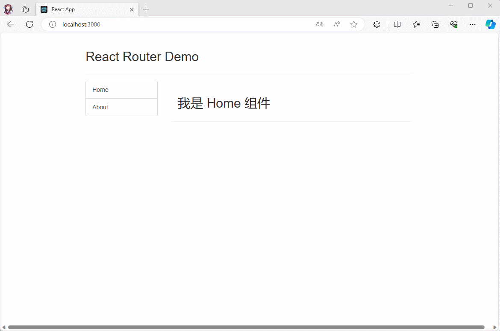

## 3.10 优化

* 为了下面的演示，需要将类式组件都转换为函数式组件。


* 示例：略。


# 第四章：路由传参（⭐）

## 4.1 概述

* 路由传参有如下的三种方式：
  * ① params 参数。
  * ② search 参数。
  * ③ state 参数。

## 4.2 params 参数

### 4.2.1 概述

* 路由链接（携带参数）：

```jsx
<NavLink to={`newsDetail/${item.id}/${item.title}/${item.content}`}>{item.title}</NavLink>
```

* 注册路由（声明接收）：

```jsx {33}
import Home from "@/components/Home";
import About from "@/components/About";
import News from "@/components/News";
import Message from "@/components/Message";
import React from "react";
import {createHashRouter, Navigate} from "react-router-dom"
import NotFound from "@/components/NotFound"
import Layout from "@/components/Layout"
import NewsDetail from "@/components/NewsDetail";

const router = createHashRouter([
  {
    path: "/",
    element: <Navigate to={"/home"}/>
  },
  {
    path: '/',
    element: <Layout/>,
    children: [
      {
        path: "home",
        element: <Home/>
      },
      {
        path: "about",
        element: <About/>,
        children: [
          {
            path: "news",
            element: <News/>,
            children: [
              {
                path: "newsDetail/:id/:title/:content",
                element: <NewsDetail/>
              }
            ]
          },
          {
            path: "message",
            element: <Message/>
          }
        ]
      },
    ]
  },
  {
    path: "*",
    element: <NotFound/>
  },
])

export default router
```

* 接收参数：

```jsx {6}
import React, {memo} from 'react'
import {useParams} from "react-router-dom";

function NewsDetail() {
  
  const {id, title, content} = useParams()
  
  return (
    <div>
    </div>
  )
}

export default memo(NewsDetail)
```

### 4.2.2 案例

* 需求：实现下面的功能。


* 项目结构：

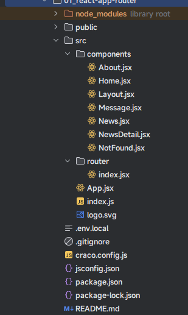

* 示例：
* 其中，components/News.jsx

```jsx {19,26}
import React, {memo, useState} from 'react'
import {NavLink, Outlet} from "react-router-dom";

function News() {
  const [message] = useState("我是 News 组件");
  const [news] = useState([
    {id: '001', title: '标题001', content: '内容001'},
    {id: '002', title: '标题002', content: '内容002'},
    {id: '003', title: '标题003', content: '内容003'},
    {id: '004', title: '标题004', content: '内容004'},
  ])
  return (
    <div>
      <h2>{message}</h2>
      {
        news.map(item => {
          return (
            <div key={item.id}>
              <NavLink to={`newsDetail/${item.id}/${item.title}/${item.content}`}>{item.title}</NavLink>
            </div>
          )
        })
      }
      <hr/>
      {/* 三级路由出口 */}
      <Outlet/>
    </div>
  )
}


export default memo(News)
```

* 其中，router/index.jsx

```jsx {33}
import Home from "@/components/Home";
import About from "@/components/About";
import News from "@/components/News";
import Message from "@/components/Message";
import React from "react";
import {createHashRouter, Navigate} from "react-router-dom"
import NotFound from "@/components/NotFound"
import Layout from "@/components/Layout"
import NewsDetail from "@/components/NewsDetail";

const router = createHashRouter([
  {
    path: "/",
    element: <Navigate to={"/home"}/>
  },
  {
    path: '/',
    element: <Layout/>,
    children: [
      {
        path: "home",
        element: <Home/>
      },
      {
        path: "about",
        element: <About/>,
        children: [
          {
            path: "news",
            element: <News/>,
            children: [
              {
                path: "newsDetail/:id/:title/:content",
                element: <NewsDetail/>
              }
            ]
          },
          {
            path: "message",
            element: <Message/>
          }
        ]
      },
    ]
  },
  {
    path: "*",
    element: <NotFound/>
  },
])

export default router
```

* 其中，components/NewsDetail.jsx

```jsx {6}
import React, {memo} from 'react'
import {useParams} from "react-router-dom";

function NewsDetail() {
  
  const {id, title, content} = useParams()
  
  return (
    <div>
      <h2>内容详情</h2>
      <div>
        <p>消息编号: {id}</p>
        <p>消息标题: {title}</p>
        <p>消息内容: {content}</p>
      </div>
    </div>
  )
}

export default memo(NewsDetail)
```

## 4.3 search 参数

### 4.3.1 概述

* 路由链接（携带参数）：

```jsx
<NavLink to={`messageDetail?id=${item.id}&title=${item.title}&content=${item.content}`}>{item.title}</NavLink>
```

* 注册路由（无需声明，正常注册即可）：

```jsx {44}
import Home from "@/components/Home";
import About from "@/components/About";
import News from "@/components/News";
import Message from "@/components/Message";
import React from "react";
import {createHashRouter, Navigate} from "react-router-dom"
import NotFound from "@/components/NotFound"
import Layout from "@/components/Layout"
import NewsDetail from "@/components/NewsDetail";
import MessageDetail from "@/components/MessageDetail";

const router = createHashRouter([
  {
    path: "/",
    element: <Navigate to={"/home"}/>
  },
  {
    path: '/',
    element: <Layout/>,
    children: [
      {
        path: "home",
        element: <Home/>
      },
      {
        path: "about",
        element: <About/>,
        children: [
          {
            path: "news",
            element: <News/>,
            children: [
              {
                path: "newsDetail/:id/:title/:content",
                element: <NewsDetail/>
              }
            ]
          },
          {
            path: "message",
            element: <Message/>,
            children: [
              {
                path: "messageDetail",
                element: <MessageDetail/>
              }
            ]
          }
        ]
      },
    ]
  },
  {
    path: "*",
    element: <NotFound/>
  },
])

export default router
```

* 接收参数：

```jsx
  const [searchParams] = useSearchParams()
  const {id, title, content} = Object.fromEntries(searchParams)
```

### 4.3.2 案例

* 需求：实现下面的功能。


* 项目结构：

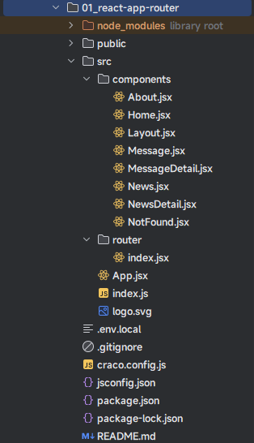

* 示例：
* 其中，components/Message.jsx

```jsx {19-22,29}
import React, {memo, useState} from 'react'
import {NavLink, Outlet} from "react-router-dom";


function Message() {
  const [message] = useState("我是 Message 组件");
  const [messages] = useState([
    {id: '001', title: '标题001', content: '内容001'},
    {id: '002', title: '标题002', content: '内容002'},
    {id: '003', title: '标题003', content: '内容003'},
  ])
  return (
    <div>
      <h2>{message}</h2>
      {
        messages.map(item => {
          return (
            <div key={item.id}>
              <NavLink
                to={`messageDetail?id=${item.id}&title=${item.title}&content=${item.content}`}>
                {item.title}
              </NavLink>
            </div>
          )
        })
      }
      <hr/>
      {/* 三级路由出口 */}
      <Outlet/>
    </div>
  )
}

export default memo(Message)
```

* 其中，router/index.jsx

```jsx {44}
import Home from "@/components/Home";
import About from "@/components/About";
import News from "@/components/News";
import Message from "@/components/Message";
import React from "react";
import {createHashRouter, Navigate} from "react-router-dom"
import NotFound from "@/components/NotFound"
import Layout from "@/components/Layout"
import NewsDetail from "@/components/NewsDetail";
import MessageDetail from "@/components/MessageDetail";

const router = createHashRouter([
  {
    path: "/",
    element: <Navigate to={"/home"}/>
  },
  {
    path: '/',
    element: <Layout/>,
    children: [
      {
        path: "home",
        element: <Home/>
      },
      {
        path: "about",
        element: <About/>,
        children: [
          {
            path: "news",
            element: <News/>,
            children: [
              {
                path: "newsDetail/:id/:title/:content",
                element: <NewsDetail/>
              }
            ]
          },
          {
            path: "message",
            element: <Message/>,
            children: [
              {
                path: "messageDetail",
                element: <MessageDetail/>
              }
            ]
          }
        ]
      },
    ]
  },
  {
    path: "*",
    element: <NotFound/>
  },
])

export default router
```

* 其中，components/MessageDetail.jsx

```jsx
import React, {memo} from 'react'
import {useSearchParams} from "react-router-dom"

function MessageDetail() {
  
  const [searchParams] = useSearchParams()
  const {id, title, content} = Object.fromEntries(searchParams)
  
  return (
    <div>
      <h2>消息内容详情</h2>
      <div>
        <p>消息编号: {id}</p>
        <p>消息标题: {title}</p>
        <p>消息内容: {content}</p>
      </div>
    </div>
  )
}

export default memo(MessageDetail)
```

## 4.4 state 参数

### 4.4.1 概述

* 路由链接（携带参数）：

```jsx {2-7}
<NavLink
    to="messageDetail"
    state={{
      id: item.id,
      title: item.title,
      content: item.content,
    }}
>
	{item.title}
</NavLink>
```

* 注册路由（无需声明，正常注册即可）：

```jsx {44}
import Home from "@/components/Home";
import About from "@/components/About";
import News from "@/components/News";
import Message from "@/components/Message";
import React from "react";
import {createHashRouter, Navigate} from "react-router-dom"
import NotFound from "@/components/NotFound"
import Layout from "@/components/Layout"
import NewsDetail from "@/components/NewsDetail";
import MessageDetail from "@/components/MessageDetail"

const router = createHashRouter([
  {
    path: "/",
    element: <Navigate to={"/home"}/>
  },
  {
    path: '/',
    element: <Layout/>,
    children: [
      {
        path: "home",
        element: <Home/>
      },
      {
        path: "about",
        element: <About/>,
        children: [
          {
            path: "news",
            element: <News/>,
            children: [
              {
                path: "newsDetail/:id/:title/:content",
                element: <NewsDetail/>
              }
            ]
          },
          {
            path: "message",
            element: <Message/>,
            children: [
              {
                path: "messageDetail",
                element: <MessageDetail/>
              }
            ]
          }
        ]
      },
    ]
  },
  {
    path: "*",
    element: <NotFound/>
  },
])

export default router
```

* 接收参数：

```jsx
const {state: {id, title, content}} = useLocation()
```

### 4.4.2 案例

* 需求：实现下面的功能。


* 项目结构：

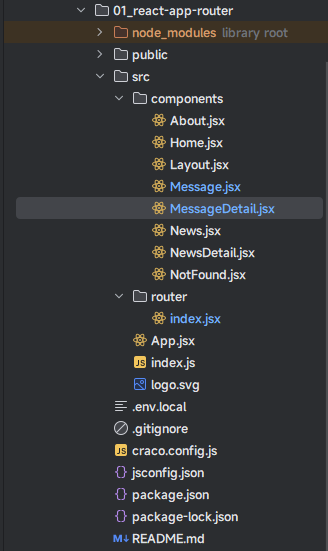

* 示例：
* 其中，components/Message.jsx

```jsx {19-28}
import React, {memo, useState} from 'react'
import {NavLink, Outlet} from "react-router-dom";


function Message() {
  const [message] = useState("我是 Message 组件");
  const [messages] = useState([
    {id: '001', title: '标题001', content: '内容001'},
    {id: '002', title: '标题002', content: '内容002'},
    {id: '003', title: '标题003', content: '内容003'},
  ])
  return (
    <div>
      <h2>{message}</h2>
      {
        messages.map(item => {
          return (
            <div key={item.id}>
              <NavLink
                to="messageDetail"
                state={{
                  id: item.id,
                  title: item.title,
                  content: item.content,
                }}
              >
                {item.title}
              </NavLink>
            </div>
          )
        })
      }
      <hr/>
      {/* 三级路由出口 */}
      <Outlet/>
    </div>
  )
}

export default memo(Message)
```

* 其中，router/index.jsx

```jsx {44}
import Home from "@/components/Home";
import About from "@/components/About";
import News from "@/components/News";
import Message from "@/components/Message";
import React from "react";
import {createHashRouter, Navigate} from "react-router-dom"
import NotFound from "@/components/NotFound"
import Layout from "@/components/Layout"
import NewsDetail from "@/components/NewsDetail";
import MessageDetail from "@/components/MessageDetail"

const router = createHashRouter([
  {
    path: "/",
    element: <Navigate to={"/home"}/>
  },
  {
    path: '/',
    element: <Layout/>,
    children: [
      {
        path: "home",
        element: <Home/>
      },
      {
        path: "about",
        element: <About/>,
        children: [
          {
            path: "news",
            element: <News/>,
            children: [
              {
                path: "newsDetail/:id/:title/:content",
                element: <NewsDetail/>
              }
            ]
          },
          {
            path: "message",
            element: <Message/>,
            children: [
              {
                path: "messageDetail",
                element: <MessageDetail/>
              }
            ]
          }
        ]
      },
    ]
  },
  {
    path: "*",
    element: <NotFound/>
  },
])

export default router
```

* 其中，components/MessageDetail.jsx

```jsx {6}
import React, {memo} from 'react'
import {useLocation} from "react-router-dom"

function MessageDetail() {
  
  const {state: {id, title, content}} = useLocation()
  
  return (
    <div>
      <h2>消息内容详情</h2>
      <div>
        <p>消息编号: {id}</p>
        <p>消息标题: {title}</p>
        <p>消息内容: {content}</p>
      </div>
    </div>
  )
}

export default memo(MessageDetail)
```


# 第五章：编程式路由导航（⭐）

## 5.1 概述

* 有的时候，我们需要在 JS 中来进行路由跳转，而不是借助 NavLink 或 Link 组件；此时，就需要借助 `useNavigate()` Hook 了。
* 跳转到指定的路径：

```jsx
const navigate = useNavigate()
navigate("/xxx")
```

* 跳转到指定的路径，并指定 push 操作：

```jsx
const navigate = useNavigate()
navigate("/xxx",{
   replace: false // 默认 
})
```

* 跳转到指定的路径，并指定 replace 操作：

```jsx
const navigate = useNavigate()
navigate("/xxx",{
   replace: true // 默认 
})
```

* 跳转到指定的路径，并携带 state 参数：

```jsx
const navigate = useNavigate()
navigate("/xxx",{
   state: {}
})
```

* 前进：

```jsx
const navigate = useNavigate()
navigate(1)
```

* 后退：

```jsx
const navigate = useNavigate()
navigate(-1)
```

## 5.2 案例

* 需求：实现下面的功能。

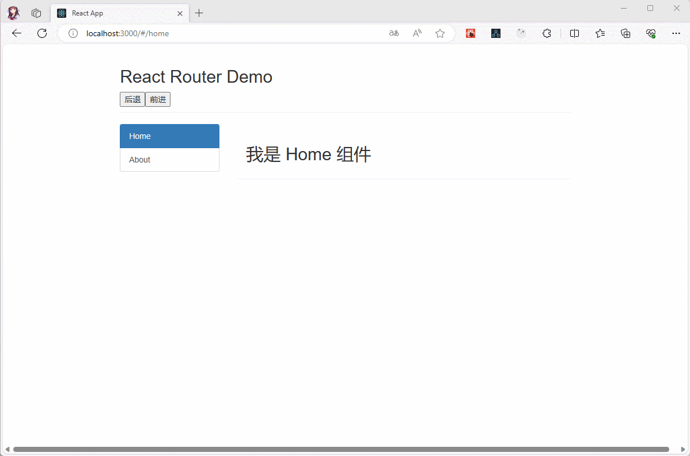

* 项目结构：

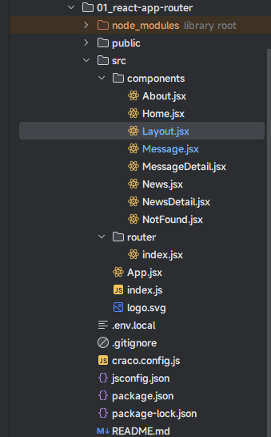

* 示例：
* 其中，App.jsx

```jsx {9}
import React, {memo} from 'react'
import {Outlet} from "react-router-dom";

function App() {
  
  return (
    <div>
      {/* 一级路由出口 */}
      <Outlet/>
    </div>
  )
}

export default memo(App)
```

* 其中，components/About.jsx

```jsx {12,15}
import React, {memo, useState} from 'react'
import {NavLink, Outlet} from "react-router-dom";

function About() {
  const [message] = useState("我是 About 组件");
  return (
    <div>
      <h2>{message}</h2>
      <div>
        <ul className={"nav nav-tabs"}>
          <li>
            <NavLink className="list-group-item" to="/about/news">News</NavLink>
          </li>
          <li>
            <NavLink className="list-group-item" to="/about/message">Message</NavLink>
          </li>
        </ul>
        <Outlet/>
      </div>
    </div>
  )
}

export default memo(About)
```

* 其中，components/Home.jsx

```jsx
import React, {memo, useState} from 'react'

function Home() {
  const [message] = useState("我是 Home 组件");
  return (
    <div>
      <h2>{message}</h2>
    </div>
  )
}

export default memo(Home)
```

* 其中，components/Layout.jsx

```jsx {6,9,13,23-24,45}
import React, {memo} from "react";
import {NavLink, Outlet, useNavigate} from "react-router-dom";

function Layout() {
  
  const navigate = useNavigate()
  
  const back = () => {
    navigate(-1)
  }
  
  const go = () => {
    navigate(1)
  }
  
  return (
    <div>
      
      <div className="row">
        <div className="col-xs-offset-2 col-xs-8">
          <div className="page-header">
            <h2>React Router Demo</h2>
            <button onClick={() => back()}>后退</button>
            <button onClick={() => go()}>前进</button>
          </div>
        </div>
      </div>
      <div className="row">
        <div className="col-xs-2 col-xs-offset-2">
          <div className="list-group">
            {/* 原生 HTML 中，靠 <a> 标签跳转不同的页面 */}
            {/*
                <a className="list-group-item" href="./about.html">About</a>
                <a className="list-group-item active" href="./home.html">Home</a>
              */}
            {/* 在 React 中，靠路由链接实现切换组件 --- 编写路由链接 */}
            <NavLink className="list-group-item" to="/home">Home</NavLink>
            <NavLink className="list-group-item" to="/about" end>About</NavLink>
          </div>
        </div>
        <div className="col-xs-6">
          <div className="panel">
            <div className="panel-body">
              {/* 二级路由渲染出口 */}
              <Outlet/>
            </div>
          </div>
        </div>
      </div>
    </div>
  )
}

export default memo(Layout)
```

* 其中，components/News.jsx

```jsx {19}
import React, {memo, useState} from 'react'
import {NavLink, Outlet} from "react-router-dom";

function News() {
  const [message] = useState("我是 News 组件");
  const [news] = useState([
    {id: '001', title: '标题001', content: '内容001'},
    {id: '002', title: '标题002', content: '内容002'},
    {id: '003', title: '标题003', content: '内容003'},
    {id: '004', title: '标题004', content: '内容004'},
  ])
  return (
    <div>
      <h2>{message}</h2>
      {
        news.map(item => {
          return (
            <div key={item.id}>
              <NavLink to={`newsDetail/${item.id}/${item.title}/${item.content}`}>{item.title}</NavLink>
            </div>
          )
        })
      }
      <hr/>
      {/* 三级路由出口 */}
      <Outlet/>
    </div>
  )
}


export default memo(News)
```

* 其中，components/NewsDetail.jsx

```jsx {6}
import React, {memo} from 'react'
import {useParams} from "react-router-dom"

function NewsDetail() {
  
  const {id, title, content} = useParams()
  
  return (
    <div>
      <h2>新闻内容详情</h2>
      <div>
        <p>新闻编号: {id}</p>
        <p>新闻标题: {title}</p>
        <p>新闻内容: {content}</p>
      </div>
    </div>
  )
}

export default memo(NewsDetail)
```

* 其中，components/Message.jsx

```jsx {13,16-19,29-38}
import React, {memo, useState} from 'react'
import {NavLink, Outlet, useNavigate} from "react-router-dom"


function Message() {
  const [message] = useState("我是 Message 组件")
  const [messages] = useState([
    {id: '001', title: '标题001', content: '内容001'},
    {id: '002', title: '标题002', content: '内容002'},
    {id: '003', title: '标题003', content: '内容003'},
  ])
  
  const navigate = useNavigate()
  
  const showDetail = ({id, title, content}) => {
    navigate("messageDetail", {
      state: {id, title, content},
      replace: false
    })
  }
  
  return (
    <div>
      <h2>{message}</h2>
      {
        messages.map(item => {
          return (
            <div key={item.id}>
              <NavLink
                to="messageDetail"
                state={{
                  id: item.id,
                  title: item.title,
                  content: item.content,
                }}
              >
                {item.title}
              </NavLink>
              <button onClick={() => showDetail(item)}>查看详情</button>
            </div>
          )
        })
      }
      <hr/>
      {/* 三级路由出口 */}
      <Outlet/>
    </div>
  )
}

export default memo(Message)
```

* 其中，components/MessageDetail.jsx

```jsx {6}
import React, {memo} from 'react'
import {useLocation} from "react-router-dom"

function MessageDetail() {
  
  const {state: {id, title, content}} = useLocation()
  
  return (
    <div>
      <h2>消息内容详情</h2>
      <div>
        <p>消息编号: {id}</p>
        <p>消息标题: {title}</p>
        <p>消息内容: {content}</p>
      </div>
    </div>
  )
}

export default memo(MessageDetail)
```

* 其中，components/NotFound.jsx

```jsx
import React, {memo, useState} from 'react'

function NotFound() {
  const [message] = useState("我是 NotFound 组件");
  return (
    <div>
      <h2>{message}</h2>
    </div>
  )
}

export default memo(NotFound)
```

* 其中，router/index.jsx

```jsx {34,44}
import Home from "@/components/Home";
import About from "@/components/About";
import News from "@/components/News";
import Message from "@/components/Message";
import React from "react";
import {createHashRouter, Navigate} from "react-router-dom"
import NotFound from "@/components/NotFound"
import Layout from "@/components/Layout"
import NewsDetail from "@/components/NewsDetail";
import MessageDetail from "@/components/MessageDetail"

const router = createHashRouter([
  {
    path: "/",
    element: <Navigate to={"/home"}/>
  },
  {
    path: '/',
    element: <Layout/>,
    children: [
      {
        path: "home",
        element: <Home/>
      },
      {
        path: "about",
        element: <About/>,
        children: [
          {
            path: "news",
            element: <News/>,
            children: [
              {
                path: "newsDetail/:id/:title/:content",
                element: <NewsDetail/>
              }
            ]
          },
          {
            path: "message",
            element: <Message/>,
            children: [
              {
                path: "messageDetail",
                element: <MessageDetail/>
              }
            ]
          }
        ]
      },
    ]
  },
  {
    path: "*",
    element: <NotFound/>
  },
])

export default router
```

* 其中，index.js

```js {6,11,13}
import React from 'react'
import ReactDOM from 'react-dom/client'
import App from '@/App'
import {RouterProvider} from "react-router-dom"
import 'bootstrap/dist/css/bootstrap.min.css'
import router from '@/router'

const root = ReactDOM.createRoot(document.getElementById('root'))
root.render(
  <React.StrictMode>
    <RouterProvider router={router}>
      <App/>
    </RouterProvider>
  </React.StrictMode>
)
```


