# 第一章：认识和体验 Hooks

## 1.1 为什么需要 Hook ？

* `Hook` 是 React  16.8 的新增特性，它可以让我们`在不编写 class 类式组件的情况下`，使用 `state` 以及`其他的 React 特性`，如：生命周期等。
* 在没有 Hook 情况下的函数式组件：

```jsx {7}
function HelloWorld(props) {
    let message = "Hello World"
    
    return (
    	<div>
        	<h2>我是 : {message}</h2>
            <button onClick={e => message = "你好啊，React"}>点我，修改文本</button>
        </div>
    )
}
```

> 注意：函数式组件存在如下的问题：
>
> * ① 组件不会被重新渲染，即修改 message 之后，组件并不知道自己需要重新渲染；而类式组件可以通过 `this.setState()` 通知组件让其调用 render() 方法，进行重新渲染页面。
> * ② 即使组件能重新渲染，但是函数会被重新执行，第二次执行的时候，还会将 message 设置为 `"Hello World"` 。
> * ③ 函数式组件中没有类式组件的生命周期方法。

* 在没有使用 React Hooks 的情况下，类式组件相对于函数式组件有以下几个优势：

  * ① 生命周期方法：类式组件可以使用生命周期方法，例如 `componentDidMount`、`componentDidUpdate` 和 `componentWillUnmount` 等，来处理组件的生命周期事件。这使得类式组件更适合处理复杂的生命周期逻辑和副作用。
  * ② 状态管理：类式组件可以使用类的实例属性来管理组件的状态。通过使用 `this.state` 和 `this.setState`，可以方便地更新和管理组件的状态。此外，类式组件还可以使用 Redux 或其他状态管理库来管理全局状态。
  * ③ 可以使用 Refs：类式组件可以使用 `ref` 属性来引用组件实例或 DOM 元素。这对于访问组件实例的方法和属性，或者直接操作 DOM 元素非常有用。
  * ④ 继承和组合：类式组件可以使用继承来扩展其他类组件的功能。这使得代码的重用和组合更加灵活。
  * ⑤ 更好的性能优化：类式组件在某些情况下可以更好地进行性能优化。例如，使用 `shouldComponentUpdate` 方法可以手动控制组件的更新，避免不必要的渲染。
  * ⑥ 适用于复杂的业务逻辑：对于包含复杂业务逻辑的组件，类式组件通常更适合。类式组件可以更好地组织和管理复杂的状态和方法。

> 注意：在 Hook 出现之前，类式组件是我们在开发 React 项目中的首选。

* 但是，随着 React Hooks 的引入，函数式组件也获得了许多优势，并且在许多情况下已经成为首选的组件类型。函数式组件的优势包括简洁性、可读性、更好的性能和更好的测试性。因此，在新的项目中，建议优先选择函数式组件和 Hooks 来开发。

## 1.2 类式组件存在的问题

* ① `复杂的组件变得难以理解`：
  * 最初可能在编写类式组件的时候，往往逻辑比较简单，并不会非常复杂；但是，`随着业务的增多`，类式组件会`变得越来越复杂`。
  * 我们会在类式组件中的 `componentDidMount` 中，编写大量的逻辑代码，如：`网络请求`等。
  * 对于类式组件而言，实际上`很难拆分`；因为其`逻辑往往混合在一起`，`强行拆分反而会造成过度设计`，`增加代码的复杂度`。
* ② `难以理解的 class` ：
  * 很多人`发现学习 ES6 的 class 是学习 React 的一个障碍`。
  * 在 class 中，我们`必须要搞清楚 this 的指向到底是谁`，所以需要花费很多精力去学习 this 。


* ③ `组件的复用状态很难`：

  * 之前的一些状态复用，我们通常会使用`高阶组件`，如：之前 react-redux 中的 `connect()` 函数，这些高阶组件设计的目的就是为了`状态的复用`。
  * 我们也使用过类似于 `Provider`、`Consumer` 来共享一些状态，但是多次使用 `Consumer` 的时候，会造成代码的`大量嵌套`，不够优雅。


## 1.3 Hook 的出现

* Hook 到底解决了什么问题？
  * ① Hook `可以让我们在不编写 class 组件的情况下`，`使用 state 以及其他的 React 特性`。
  * ② Hook `可以解决前面提到的问题`。
* Hook 的使用场景：
  * ① Hook 的出现`基本可以代替之前所有使用 class 组件的地方`。
  * ② 如果是旧的项目，并`不需要直接将所有的代码重构为 Hooks` ，因为`它完全向下兼容`，可以`渐进式`的来使用它。
  * ③ Hook `只能在函数式组件中使用`，`不能`在`类式组件`或`函数式组件`之外的地方使用。

## 1.4 体验 Hook

* 需求：实现下面的功能。

 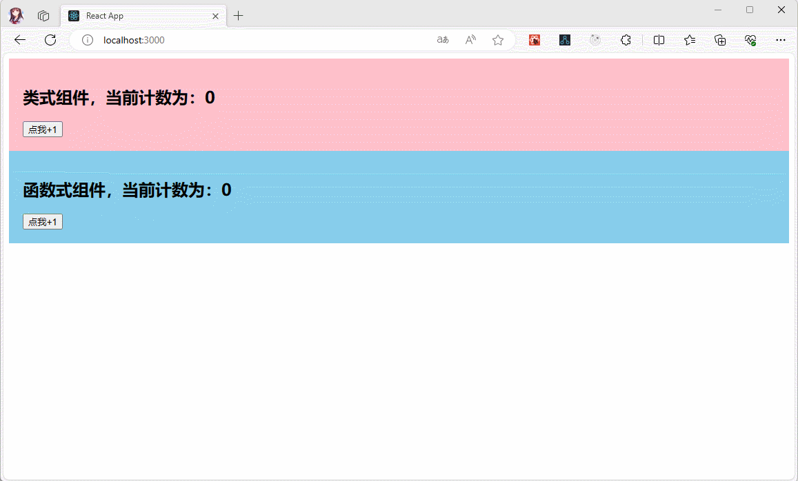

* 项目结构：

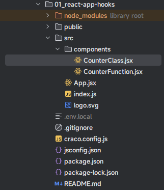


* 示例：
* 其中，CounterClass.jsx

```jsx
import {PureComponent} from "react"

class CounterClass extends PureComponent {
  
  state = {
    count: 0
  }
  
  add() {
    this.setState({
      count: this.state.count + 1
    })
  }
  
  render() {
    const {count} = this.state
    return (
      <div>
        <h2>类式组件，当前计数为：{count}</h2>
        <button onClick={() => this.add()}>点我+1</button>
      </div>
    )
  }
}

export default CounterClass
```

* 其中，CounterFunction.jsx

```jsx {1,5,9,10}
import {memo, useState} from "react"

function CounterFunction() {
  
  const [count, setCount] = useState(0)
  
  return (
    <div>
      <h2>函数式组件，当前计数为：{count}</h2>
      <button onClick={() => setCount(count + 1)}>点我+1</button>
    </div>
  )
}

export default memo(CounterFunction)
```

* 其中，App.jsx

```jsx
import React, {PureComponent} from 'react'
import CounterClass from "@/components/CounterClass"
import CounterFunction from "@/components/CounterFunction"

class App extends PureComponent {
  
  state = {}
  
  render() {
    return (
      <div>
        <div style={{background: 'pink', padding: "20px"}}>
          <CounterClass/>
        </div>
        <div style={{background: 'skyblue', padding: "20px"}}>
          <CounterFunction/>
        </div>
      </div>
    )
  }
}

export default App
```

* 类式组件和函数式组件的对比：

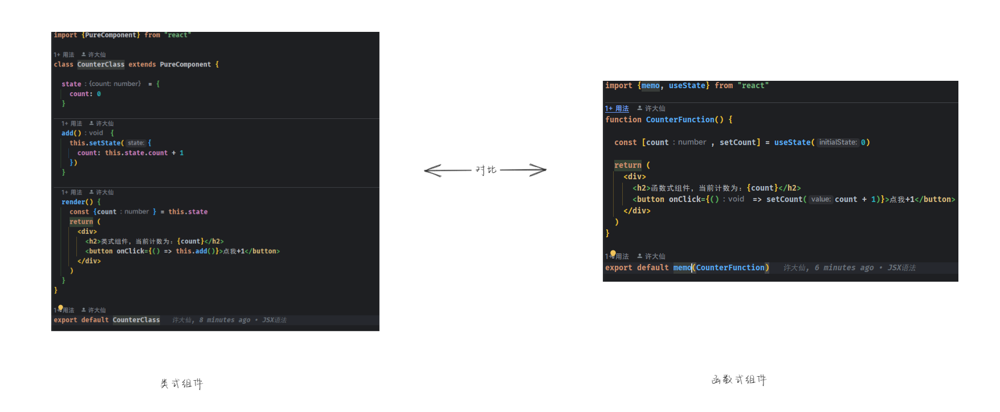

> 注意：
>
> * ① 难道没有发现，函数式组件结合 Hooks ，整个代码变得更为简洁?
> * ② 难道没有发现，函数式组件结合 Hooks ，我们再也没有考虑 this 相关的问题？

## 1.5 什么是 Hook ？

* Hook 是一些可以让我们，在函数式组件里`“钩入（hook into）”` React `State` 及`生命周期`等特性的`函数`。
* Hook 不依赖在 class 组件中使用 —— 这使得我们不使用 class 也能使用 React。
* React 内置了一些像 `useState` 这样的 Hook。我们也可以创建我们自己的 Hook 来复用不同组件之间的状态逻辑。

## 1.6 Hook 的规则

* Hook 本质就是 JavaScript 函数，但是在使用它时需要遵循两条规则，即：
* ① `只在最顶层使用 Hook`：
  * **不要在循环，条件或嵌套函数中调用 Hook，** 确保总是在我们的 React 函数的最顶层以及任何 return 之前调用他们。
  * 遵守这条规则，我们就能确保 Hook 在每一次渲染中都按照同样的顺序被调用。
  * 这让 React 能够在多次的 `useState` 和 `useEffect` 调用之间保持 hook 状态的正确。

```jsx {7}
import {memo, useState} from "react"

function CounterFunction() {
  
  const [count, setCount] = useState(0)
  if (true) {
    const [name, setName] = useState("许大仙") // 不可以，会报错
  }
  
  return (
    <div>
      <h2>函数式组件，当前计数为：{count}</h2>
      <button onClick={() => setCount(count + 1)}>点我+1</button>
    </div>
  )
}

export default memo(CounterFunction)
```

* ② `只在 React 函数中调用 Hook`：**不要在普通的 JavaScript 函数中调用 Hook。**
  * 我们可以 `在 React 的函数组件中调用 Hook`，
  * 我们可以`在自定义 Hook 中调用其他 Hook`。

> 注意：
>
> * 自定义 Hook 是一个函数，其名称以 “`use`” 开头，函数内部可以调用其他的 Hook。
> * 通常而言，`Hook` 指的是类似于 useState() 、useEffect() 之类的`函数`。
> * 通常而言，`Hooks`  指的是 useState() 、useEffect() 之类的`函数的统称`。


# 第二章：useState 和 useEffect

## 2.1 useState 

* State Hook 的 API 就是 `useState()` 函数：
  * 通过在函数式组件中调用`useState()` 函数，可以给当前组件中添加一些内部的 state ，React 会在重新渲染的时候保留这个 state 。
  * `useState()` 函数的唯一参数就是初始化 state，如：`useState(0)`。和 `this.setState()` 不同的是，不一定是对象，可以是任意类型，如：`true` 、`0` 、`'你好啊'` 等。并且这个初始化的 state 参数只有在第一次渲染的时候才会使用。
  * `useState()` 函数会返回一对值：`[当前状态，更新状态的函数]`，如果学过 TS 的同学，可以理解为`元组（Tuple）`。
    * 我们可以在事件处理函数（onClick 等）或其他一些合适的地方通过`更新状态的函数`来`更改`当前的`状态`。
    * `更新状态的函数`类似于类式组件中的 `this.setState()` ，但是它不会将新的 state 和旧的 state 进行合并。

> 注意：之所以叫 useState ，而不是 `createState` 的原因在于：
>
> * `create` 单词的语义不是很准确，因为 state 只会在组件首次渲染的时候被创建，在下次重新渲染的时候，`useState`  返回给我们的是当前的 state 。
> * 如果每次调用，都创建新的 state ，就和 React 内部保存的 state 语义冲突了。
> * 这就是 Hook 为什么总是以 use 开头的其中一个原因。

* 当然，我们也可以在一个组件中定义多个变量和复杂的变量，如：数组和对象等。

```jsx {3-5}
function ExampleWithManyStates() {
  // 声明多个 state 变量
  const [age, setAge] = useState(42);
  const [fruit, setFruit] = useState('banana');
  const [todos, setTodos] = useState([{ text: '学习 Hook' }]);
 
    return (
        <div>
        </div>
    )  
}   
```

## 2.2 useEffect

### 2.2.1 概述

* 之前，我们在 React 的类式组件中通过`生命周期`函数，进行`数据获取`、`订阅`或者`手动修改 DOM` 等，React 官方将`这些操作`统称为`副作用（Effect）`，简称`作用`。
* `useEffect` 就是一个 Effect Hook，给函数组件增加了操作`副作用`的能力。它跟 class 组件中的 `componentDidMount`、`componentDidUpdate` 和 `componentWillUnmount` 具有相同的用途，只不过被合并成了一个 API 。

### 2.2.2 案例

* 需求：页面的 title 总是显示 counter 的数字，分别使用类式组件和函数式组件实现。

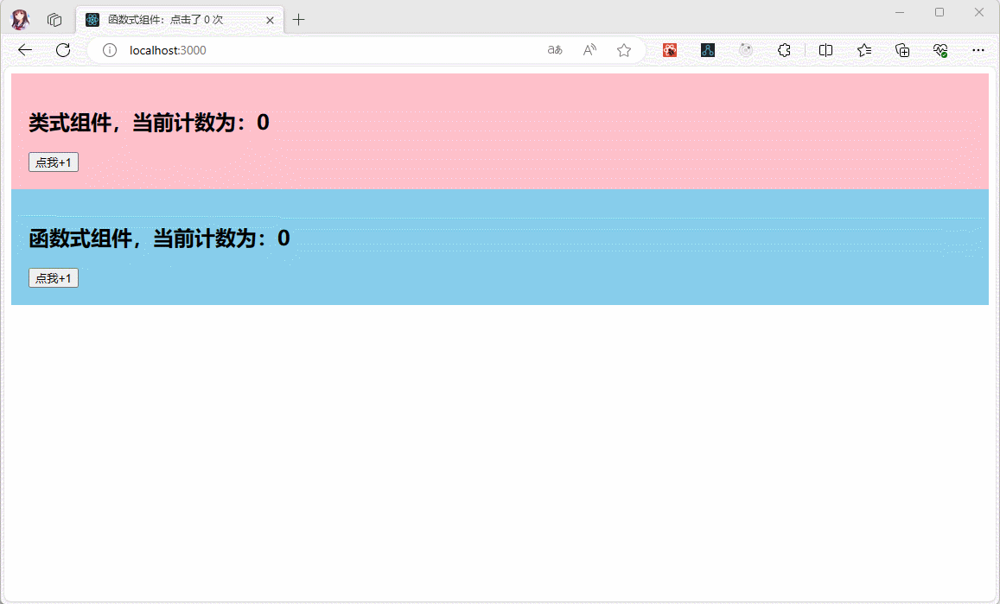

* 项目结构：

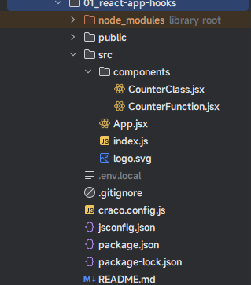

* 示例：
* 其中，CounterClass.jsx

```jsx {9-11,13-15}
import {PureComponent} from "react"

class CounterClass extends PureComponent {
  
  state = {
    count: 0
  }
  
  componentDidMount() {
    document.title = `类式组件，点击了 ${this.state.count} 次`
  }
  
  componentDidUpdate(prevProps, prevState, snapshot) {
    document.title = `类式组件，点击了 ${this.state.count} 次`
  }
  
  add() {
    this.setState({
      count: this.state.count + 1
    })
  }
  
  render() {
    const {count} = this.state
    return (
      <div>
        <h2>类式组件，当前计数为：{count}</h2>
        <button onClick={() => this.add()}>点我+1</button>
      </div>
    )
  }
}

export default CounterClass
```

* 其中，CounterFunction.jsx

```jsx {7-10}
import {memo, useEffect, useState} from "react"

function CounterFunction() {
  
  const [count, setCount] = useState(0)
  
  useEffect(() => {
    // 当前插入的回调函数会在组件被渲染完成后，自动执行
    document.title = `函数式组件：点击了 ${count} 次`
  })
  
  
  return (
    <div>
      <h2>函数式组件，当前计数为：{count}</h2>
      <button onClick={() => setCount(count + 1)}>点我+1</button>
    </div>
  )
}

export default memo(CounterFunction)
```

* 其中，App.jsx

```jsx
import React, {PureComponent} from 'react'
import CounterClass from "@/components/CounterClass"
import CounterFunction from "@/components/CounterFunction"

class App extends PureComponent {
  
  state = {}
  
  render() {
    return (
      <div>
        <div style={{background: 'pink', padding: "20px"}}>
          <CounterClass/>
        </div>
        <div style={{background: 'skyblue', padding: "20px"}}>
          <CounterFunction/>
        </div>
      </div>
    )
  }
}

export default App
```

### 2.2.3 useEffect 解析

* 通过 `useEffect` 这个 Hook，可以告诉 Reac`t 需要在渲染后执行的某些操作`。
* useEffect `要求我们传入一个回调函数`，在 React `执行完更新 DOM 操作之后`，就`会回调这个函数`。
* 默认情况下，无论是`首次渲染`，还是之后的`每次更新`操作，`都会执行这个回调函数`。

> 注意：
>
> * 默认情况下，我们可以将 `useEffect` 看成是 `componentDidMount`，`componentDidUpdate` 和 `componentWillUnmount` 这三个函数的组合。
> * 换言之，如果 state 更新了 8 次，那么 `useEffect` 会更新 1 + 8 + 1 = 10 次；调用太频繁了，此处暂时不处理，下面会给出优化方案。

### 2.2.4 清除 Effect

#### 2.2.4.1 概述

* 有的时候，我们只想在 React 更新 DOM 之后`运行一些额外的代码`，如：发送网络请求、手动更新 DOM、记录日志等；这些都是很常见的无需清除的 Effect 操作。因为我们在执行完这些操作会后，就可以忽略它们了，以`类式组件`和`函数式组件`为例，展示如何实现这些 Effect 的，即：

```jsx {9-11,13-15}
import {PureComponent} from "react"

class CounterClass extends PureComponent {
  
  state = {
    count: 0
  }
  
  componentDidMount() {
    document.title = `类式组件，点击了 ${this.state.count} 次`
  }
  
  componentDidUpdate(prevProps, prevState, snapshot) {
    document.title = `类式组件，点击了 ${this.state.count} 次`
  }
  
  add() {
    this.setState({
      count: this.state.count + 1
    })
  }
  
  render() {
    const {count} = this.state
    return (
      <div>
        <h2>类式组件，当前计数为：{count}</h2>
        <button onClick={() => this.add()}>点我+1</button>
      </div>
    )
  }
}

export default CounterClass
```

> 注意：
>
> * 在类式组件中，我们需要在两个生命周期函数中编写重复的代码。
> * 这是因为很多情况下，我们希望在组件加载和更新执行同样的操作。从概念上说，我们希望它们在每次渲染之后执行，但是 React 的类式组件并没有提供这样的方法，即使我们提取一个方法，我们还需要在两个生命周期函数中调用这个方法。

```jsx {7-10}
import {memo, useEffect, useState} from "react"

function CounterFunction() {
  
  const [count, setCount] = useState(0)
  
  useEffect(() => {
    // 当前插入的回调函数会在组件被渲染完成后，自动执行
    document.title = `函数式组件：点击了 ${count} 次`
  })
  
  
  return (
    <div>
      <h2>函数式组件，当前计数为：{count}</h2>
      <button onClick={() => setCount(count + 1)}>点我+1</button>
    </div>
  )
}

export default memo(CounterFunction)
```

> 注意：
>
> * 对于函数式组件而言，默认情况下，useEffect() 会在第一次渲染之后立即执行，之后每次更新的时候都会再次执行。这样，React 保证了每次运行 Effect 的同时，DOM 已经更新完毕了。
> * 我们可以发现 useEffect() 要求传递的是回调函数，这意味着每次渲染的时候，在 Effect 中都是获取的最新的 state ，不用担心 state 过期。

* 但是，有的时候，我们要需要`清除 Effect` ，如：`事件总线`或 Redux 中手动调用 `subscribe` 等。在这种情况下，清除Effect 工作非常重要，可以防止内存泄露！！！
* useEffect 函数的 TS 定义：

```ts
declare const UNDEFINED_VOID_ONLY: unique symbol;
type Destructor = () => void | { [UNDEFINED_VOID_ONLY]: never };
type EffectCallback = () => void | Destructor;
function useEffect(effect: EffectCallback, deps?: DependencyList): void;
```

#### 2.2.4.2 案例

* 需求：封装一个计时器的组件，可以通过按钮来显示和隐藏。

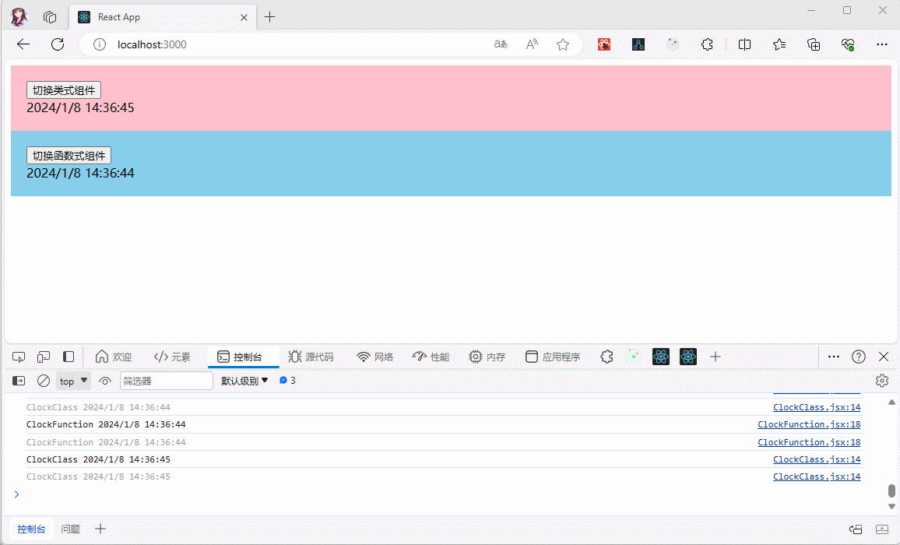

> 注意：在组件销毁的时候，必须将定时器关闭；否则，随着时间的推移，用户电脑的 CPU 会越来越高。

* 项目结构：

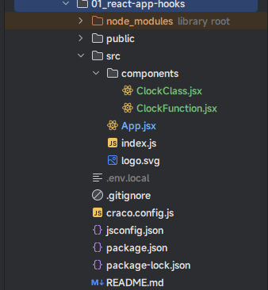

* 示例：
* 其中，ClockClass.jsx

```jsx {20-26,28-30}
import React from "react"

class ClockClass extends React.PureComponent {
  
  constructor(props) {
    super(props)
    this.state = {
      date: new Date()
    }
  }
  
  render() {
    const {date} = this.state
    console.log(`ClockClass ${date.toLocaleString()}`)
    return (
      <div>{date.toLocaleString()}</div>
    )
  }
  
  componentDidMount() { // 创建定时器
    this.timer = setInterval(() => {
      this.setState({
        date: new Date()
      })
    }, 1000)
  }
  
  componentWillUnmount() { // 清除定时器
    clearInterval(this.timer)
  }
  
}

export default ClockClass
```

> 注意：
>
> * 其实，从技术实现角度来讲，类式组件完全没问题；但是，使用生命周期函数强迫我们拆分这些逻辑代码，即使这些代码都作用于相同的副作用。
> * 换言之，React 认为这些副作用的代码完全可以写到一起。

* 其中，ClockFunction.jsx

```jsx {6-16}
import React, {memo, useEffect, useState} from "react";

function ClockFunction() {
  const [date, setDate] = useState(new Date())
  
  useEffect(() => {
    // 定时器
    const timer = setInterval(() => {
      setDate(new Date())
    }, 1000)
    
    return function cleanup() { // 回调函数：组件被重新渲染或组件卸载的时候执行，即执行在该操作之后如何清除 effect
      // 清除定时器
      clearInterval(timer)
    }
  })
  
  console.log(`ClockFunction ${date.toLocaleString()}`)
  return (
    <div>{date.toLocaleString()}</div>
  )
}

export default memo(ClockFunction)
```

> 注意：
>
> * React 的 useEffect 认为`添加定时器`或`删除定时器`的逻辑是做同样的副作用；换言之，这些代码之间内部`具有紧密性`，所以 useEffect  的设计是在同一个地方执行，即`如果 effect 返回一个函数，`React 将会在执行清除操作时候调用它。
> * React 会在组件重新渲染或组件携带的时候清除 Effect ；换言之，就是调用返回的回调函数。因为默认情况下，useEffect 会在每次渲染的时候都执行 Effect ，这样就可以对当前 Effect 之前的上一个 Effect 进行清除；但是，这样的性能依然还是很低，下文将会再次优化。
> * 我们并不一定需要为 Effect 中返回的函数命名，上述命名为 `cleanup` 仅仅为了表明是函数的目的，我们完全可以返回一个箭头函数或者起其它的名字。

* 其中，App.jsx

```jsx
import React, {PureComponent} from 'react'
import ClockClass from "@/components/ClockClass"
import ClockFunction from "@/components/ClockFunction"

class App extends PureComponent {
  
  state = {
    isClassShow: true,
    isFunctionShow: true,
  }
  
  changeClass() {
    this.setState({
      isClassShow: !this.state.isClassShow,
    })
  }
  
  changeFunction() {
    this.setState({
      isFunctionShow: !this.state.isFunctionShow,
    })
  }
  
  render() {
    const {isClassShow, isFunctionShow} = this.state
    return (
      <div>
        <div style={{background: 'pink', padding: "20px"}}>
          <button onClick={() => this.changeClass()}>切换类式组件</button>
          {isClassShow && <ClockClass/>}
        </div>
        <div style={{background: 'skyblue', padding: "20px"}}>
          <button onClick={() => this.changeFunction()}>切换函数式组件</button>
          {isFunctionShow && <ClockFunction/>}
        </div>
      </div>
    )
  }
}

export default App
```

### 2.2.5 使用多个 Effect 实现关注点分离

* 使用 Hook 的其中一个`目的`：就是要解决 class 中生命周期函数中，经常包含不相关的逻辑，但是却又把相关逻辑分离到了几个不同方法中的问题，即：

```jsx {23,29,34,39}
import React from "react"

class ClockClass extends React.PureComponent {
  
  constructor(props) {
    super(props)
    this.state = {
      date: new Date(),
      count: 0
    }
  }
  
  render() {
    const {date} = this.state
    console.log(`ClockClass ${date.toLocaleString()}`)
    return (
      <div>{date.toLocaleString()}</div>
    )
  }
  
  componentDidMount() {
    // 创建定时器
    this.timer = setInterval(() => {
      this.setState({
        date: new Date()
      })
    }, 1000)
    // 修改标题
    document.title = `当前计数 ${this.state?.count} `;
  }
  
  componentDidUpdate(prevProps, prevState, snapshot) {
    // 修改标题
    document.title = `当前计数 ${this.state?.count} `;
  }
  
  componentWillUnmount() {
    // 清除定时器
    clearInterval(this.timer)
  }
  
}

export default ClockClass
```

> 注意：
>
> * 我们不难发现，对于设置 document.title 而言，代码被分割到 componentDidMount 和 componentDidUpdate 中；
> * 而对于设置定时器而言，代码被分割到 componentDidMount 和 componentWillUnmount 中。

* 而 Hook 可以解决这个问题，我们可以像使用多个 state 的 Hook 一样，使用多个 Effect ，即就不相关逻辑分离到不同的 Effect 中：

```jsx {7-17,19-22}
import React, {memo, useEffect, useState} from "react";

function ClockFunction() {
  const [date, setDate] = useState(new Date())
  const [count, setCount] = useState(0)
  
  useEffect(() => {
    // 定时器
    const timer = setInterval(() => {
      setDate(new Date())
    }, 1000)
    
    return function cleanup() { // 回调函数：组件被重新渲染或组件卸载的时候执行，即执行在该操作之后如何清除 effect
      // 清除定时器
      clearInterval(timer)
    }
  })
  
  useEffect(() => {
    // 修改标题
    document.title = `当前计数 ${count} `;
  })
  
  console.log(`ClockFunction ${date.toLocaleString()}`)
  return (
    <div>{date.toLocaleString()}</div>
  )
}

export default memo(ClockFunction)
```

> 注意：
>
> * `Hook 允许我们按照代码的用途分离他们`，而不是像生命周期函数那样。
> * React 将按照 Effect 声明的顺序依次调用组件中的每一个 Effect 。

### 2.2.6 通过跳过 Effect 进行性能优化

* 默认情况下，每次渲染都执行清理或者执行 Effect 可能会导致性能问题。
* 在类式组件中，我们可以通过在  `componentDidUpdate` 中添加对 `prevProps` 或 `prevState` 的比较逻辑解决：

```jsx
componentDidUpdate(prevProps, prevState) {
  if (prevState.count !== this.state.count) {
    document.title = `You clicked ${this.state.count} times`;
  }
}
```

> 注意：
>
> * 像一些`网络请求`、`订阅`或`取消订阅`之类的操作，我们在类式组件中，也可以通过`componentDidUpdate` 中添加对 `prevProps` 或 `prevState` 的比较逻辑解决。
> * 有的时候，`多次执行`会`导致`一定的`性能`问题。
> * 当然，实际开发中，我们通常会使用 `PureComponent` 类，因为其内部实现了 `state` 或 `props` 的浅层比较。

* 但是，如果使用的是 useEffect 的 Hook API，我们可以通过传递`数组`作为 `useEffect` 的`第二个`可选参数来跳过 Effect 的调用，即受`谁`的影响：

```jsx {3}
useEffect(() => {
  document.title = `You clicked ${count} times`;
}, [count]); // 仅在 count 更改时更新
```

* 如果一个 useEffect() 的 Hook，我们不希望它依赖任何其他的内容（第一次渲染，还是会调用的；因为至少要调用一次），也可以传递一个空的数组：`[]`。
* 换言之，在类式组件中使用 useEffect() 的 Hook，并将空数组 `[]` 作为 `useEffect` 的`第二个`可选参数，可以用来模拟类式组件的 `componentDidUpdate` 生命周期函数。

```jsx {12}
import React, {memo, useEffect, useState} from "react";

function ClockFunction() {
  const [count, setCount] = useState(0)
  
  useEffect(() => {
    console.log(`修改 title ${count}`)
  }, [count])
  
  useEffect(() => {
    console.log("网络请求")
  }, [])
  
  return (
    <div>
      <h2>当前计数为：{count}</h2>
      <button onClick={() => setCount(count + 1)}>点我+1</button>
    </div>
  )
}

export default memo(ClockFunction)
```

> 注意：
>
> * 之前应该学过，`React.memo()` 函数，就是一个高阶组件。但是，该函数`仅仅`检查 `props` 的变更。
> * 换言之，如果函数式组件被 `React.memo()` 函数包裹，其内部实现中有 useState()、useReducer() 或 useContext() 之类的 Hook 的时候，当 state 或 context 发生变化的时候，组件依然会重新渲染。
> * 所以，在使用 `React.memo()` 函数的时候，依然需要通过传递`数组`作为 `useEffect` 的第二个可选参数来跳过 Effect 的调用，以便提高性能。


# 第三章：useContext 和 useReducer

## 3.1 useContext 

### 3.1.1 概述

* 在之前的开发中，我们要在`组件`中共享 Context 有如下的两种方式：
* ① 如果是`类式组件`，可以通过 `static contextType = Context 对象`的方式，让类组件在内部通过 `this.context` 获取。

```jsx {7，24}
import React from 'react'
import CounterContext from "@/context/CounterContext";

class Counter extends React.Component {
  
  // 静态属性 contextType 赋值为 Context 对象
  static contextType = CounterContext
  
  state = {
    message: '我是 Counter 组件'
  }
  
  increment(num) {
  
  }
  
  render() {
    const {message} = this.state
    console.log('Counter', this)
    return (
      <div style={{backgroundColor: 'skyblue', padding: '5px', border: "1px solid black"}}>
        <h2>{message}</h2>
        {/* 通过 this.context 获取 */}
        <h2>当前计数为：{this.context}</h2>
        <button onClick={() => this.increment(1)}>点我+1</button>
        <button onClick={() => this.increment(5)}>点我+5</button>
        <button onClick={() => this.increment(10)}>点我+10</button>
      </div>
    )
  }
}

export default Counter
```

* ② 如果是函数式组件或者多个 Context 对象，可以通过 `Context.Consumer` 的方式获取：

```jsx {22-24}
import React from 'react'
import CounterContext from "@/context/CounterContext";

class Counter extends React.Component {
  
  
  state = {
    message: '我是 Counter 组件'
  }
  
  increment(num) {
  
  }
  
  render() {
    const {message} = this.state
    console.log('Counter', this)
    return (
      <div style={{backgroundColor: 'skyblue', padding: '5px', border: "1px solid black"}}>
        <h2>{message}</h2>
        {/* 通过 Context.Consumer 获取 */}
        <CounterContext.Consumer>
          {value => (<h2>当前计数为：{value} </h2>)}
        </CounterContext.Consumer>
        <button onClick={() => this.increment(1)}>点我+1</button>
        <button onClick={() => this.increment(5)}>点我+5</button>
        <button onClick={() => this.increment(10)}>点我+10</button>
      </div>
    )
  }
}

export default Counter
```

* 但是，上述的方式，如果消费多个 Context 就会产生嵌套地狱，即：

```jsx {36-44}
// Theme context，默认的 theme 是 “light” 值
const ThemeContext = React.createContext('light');

// 用户登录 context
const UserContext = React.createContext({
  name: 'Guest',
});

class App extends React.Component {
  render() {
    const {signedInUser, theme} = this.props;

    // 提供初始 context 值的 App 组件
    return (
      <ThemeContext.Provider value={theme}>
        <UserContext.Provider value={signedInUser}>
          <Layout />
        </UserContext.Provider>
      </ThemeContext.Provider>
    );
  }
}

function Layout() {
  return (
    <div>
      <Sidebar />
      <Content />
    </div>
  );
}

// 一个组件可能会消费多个 context
function Content() {
  return (
    <ThemeContext.Consumer>
      {theme => (
        <UserContext.Consumer>
          {user => (
            <ProfilePage user={user} theme={theme} />
          )}
        </UserContext.Consumer>
      )}
    </ThemeContext.Consumer>
  );
}
```

* 此时，我们就可以使用 useContext 的 Hook 来优化上述的代码了，即：

```jsx
const value = useContext(context对象);
```

> 注意：
>
> * useContext(context对象) 只能读取 context 的值以及订阅 context 的变化。
> * 换言之，我们依然需要在上层组件树中通过 `<XXXContext.Provider value={xxxx}>` 来为下层组件提供 context 。

### 3.1.2 案例

* 需求：实现主题颜色的切换。

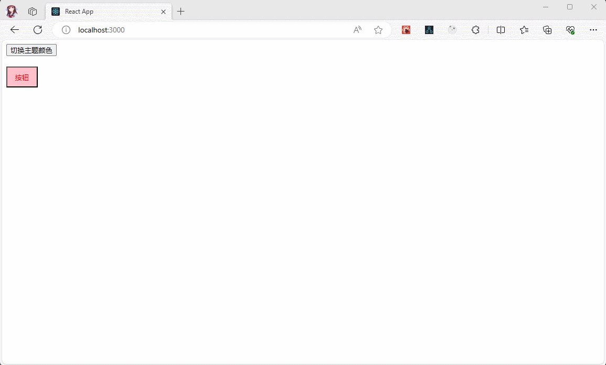

* 项目结构：

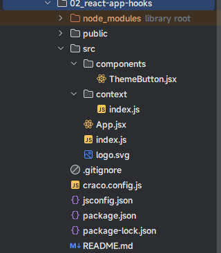

* 示例：
* 其中，context/index.js

```js {3,15}
import {createContext} from "react"

export const themes = { // 主题
  light: {
    foreground: "red",
    background: "pink"
  },
  dark: {
    foreground: "white",
    background: "skyblue"
  }
};

// 主题上下文
export const ThemeContext = createContext(themes.light)
```

* 其中，App.jsx

```jsx {15-17}
import {memo, useState} from "react"
import ThemeButton from "@/components/ThemeButton"
import {ThemeContext, themes} from "@/context";

function App() {
  const [theme, setTheme] = useState(themes.light)
  const changeTheme = () => {
    setTheme(theme === themes.light ? themes.dark : themes.light)
  }
  
  return (
    <div>
      <button onClick={changeTheme}>切换主题颜色</button>
      <div style={{marginTop: '20px'}}>
        <ThemeContext.Provider value={theme}>
          <ThemeButton/>
        </ThemeContext.Provider>
      </div>
    </div>
  )
}

export default memo(App)
```

* 其中，ThemeButton.jsx

```jsx {5,8}
import {memo, useContext} from "react"
import {ThemeContext} from "@/context"

function ThemeButton() {
  const theme = useContext(ThemeContext)
  return (
    <button style={{
      background: theme.background, color: theme.foreground,
      width: '60px', height: '40px'
    }}>按钮</button>
  )
}

export default memo(ThemeButton)
```

## 3.2 useReducer（了解）

### 3.2.1 概述

* useReducer 可以作为 useState 的替代方法，其语法规则如下：

```jsx
const [state, dispatch] = useReducer(reducer, initialArg, init);
```

* 它接收一个形如 `(state, action) => newState` 的 reducer，并返回当前的 state 以及与其配套的 `dispatch` 方法。
* 在某些场景下，`useReducer` 会比 `useState` 更适用，例如： state 逻辑较复杂且包含多个子值，或者下一个 state 依赖于之前的 state 等。并且，使用 `useReducer` 还能给那些会触发深更新的组件做性能优化，因为`我们可以子组件传递 dispatch 而不是回调函数`。

### 3.2.1 案例

* 需求：实现计数器功能。

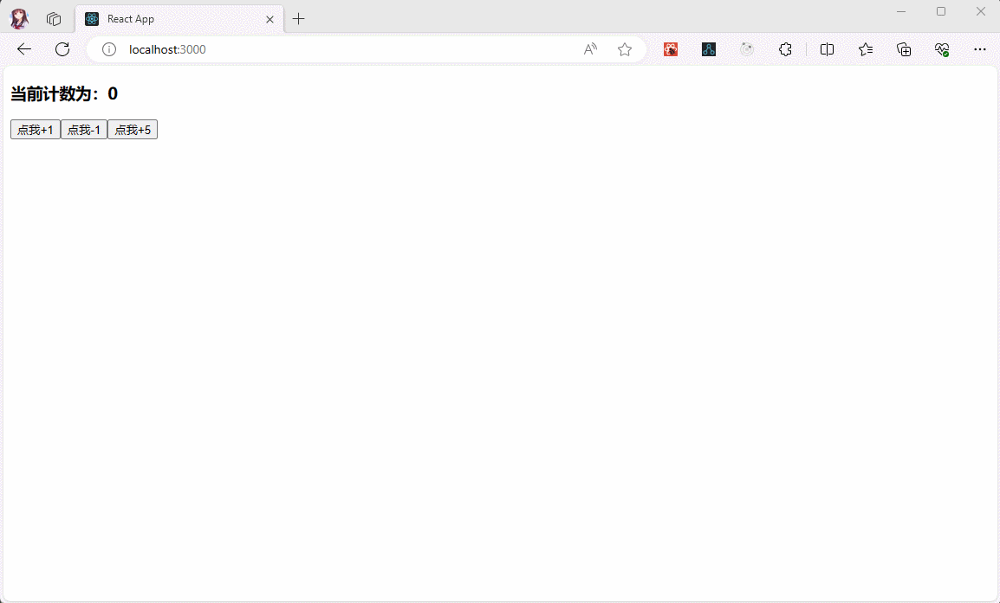

* 项目结构：

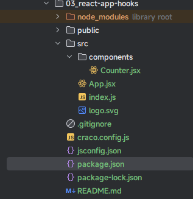

* 示例：
* 其中，Counter.jsx

```jsx {3,5,20,25}
import {memo, useReducer} from "react"

const initialState = {count: 0} // 初始化 state 

function reducer(state, action) { // reducer
  switch (action.type) {
    case "increment":
      return {count: state.count + 1}
    case "decrement":
      return {count: state.count - 1}
    case "incrementByAmount":
      return {count: state.count + action.payload}
    default:
      return state
  }
}

function Counter() {
  
  const [state, dispatch] = useReducer(reducer, initialState);
  
  return (
    <div>
      <h3>当前计数为：{state.count}</h3>
      <button onClick={() => dispatch({type: 'increment'})}>点我+1</button>
      <button onClick={() => dispatch({type: 'decrement'})}>点我-1</button>
      <button onClick={() => dispatch({type: 'incrementByAmount', payload: 5})}>点我+5</button>
    </div>
  )
}

export default memo(Counter)
```

* 其中，App.jsx

```jsx {8}
import {memo} from "react"
import Counter from "@/components/Counter"

function App() {
  
  return (
    <div>
      <Counter/>
    </div>
  )
}

export default memo(App)
```


# 第四章：useCallBack 和 useMemo

## 4.1 useCallBack

* 之前，我们的计数器案例是这样实现的：

```jsx {10}
import {memo, useState} from "react"

function App() {
  const [count, setCount] = useState(0)
  
  return (
    <div>
      <h3>当前计数为：{count}</h3>
      {/* () => setCount(count + 1) 不就是箭头函数吗？ */}
      <button onClick={() => setCount(count + 1)}>点我+1</button>
    </div>
  )
}

export default memo(App)
```

* 其实，也等价于下面的写法：

```jsx {6,11}
import {memo, useState} from "react"

function App() {
  const [count, setCount] = useState(0)
  
  const increment = () => setCount(count + 1)
  
  return (
    <div>
      <h3>当前计数为：{count}</h3>
      <button onClick={increment}>点我+1</button>
    </div>
  )
}

export default memo(App)
```

* 当然，和下面的写法更是一样了：

```jsx {6-8,13}
import {memo, useState} from "react"

function App() {
  const [count, setCount] = useState(0)
  
  const increment = () => {
    setCount(count + 1)
  }
  
  return (
    <div>
      <h3>当前计数为：{count}</h3>
      <button onClick={increment}>点我+1</button>
    </div>
  )
}

export default memo(App)
```

* 和字面量对象 `{}` 总是会创建新对象一样，在 JavaScript 中，`function(){}` 或者 `()=>{}` 总是会生成不同的函数，请看下图理解：

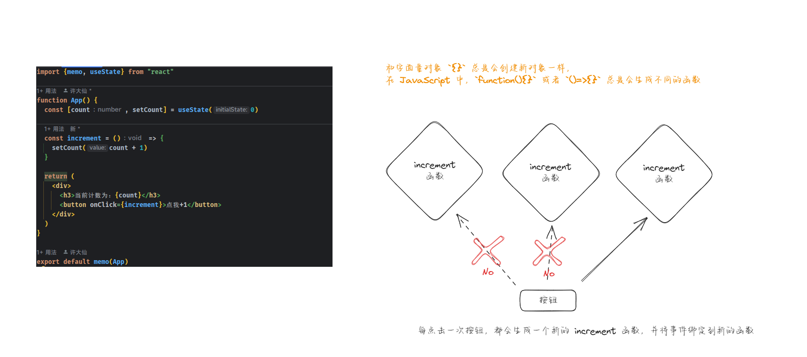

> 注意：
>
> * 根据 GC 的可达性算法而言，如果函数对象没有引用，最终还是会被 GC 回收的；
> * 但是，在频繁点击的过程中，难道不觉得创建的 increment 函数（对象）实在是太多了吗？

* 上面的代码在正常情况下，完全没有毛病；但是，如果我将该函数通过 props 传递给子组件呢？

```jsx {6,11,35}
import {memo, useState} from "react"


const IncrementButton = memo(function (props) {
  const [message] = useState("我是 IncrementButton 组件")
  const {increment} = props
  console.log('IncrementButton')
  return (
    <div>
      <h2>{message}</h2>
      <button onClick={increment}>点我+1</button>
    </div>
  )
})

function App() {
  const [count, setCount] = useState(0)
  const [message] = useState("我是 App 组件")
  
  const increment = () => {
    console.log('App increment')
    setCount(count + 1)
  }
  
  console.log('App')
  
  return (
    <div>
      <div style={{background: 'pink'}}>
        <h2>{message}</h2>
        <h3>当前计数为：{count}</h3>
        <button onClick={increment}>点我+1</button>
      </div>
      <div style={{background: 'skyblue'}}>
        <IncrementButton increment={increment}/>
      </div>
    </div>
  )
}

export default memo(App)
```

* 可以通过`浏览器`的`控制台`来查看：

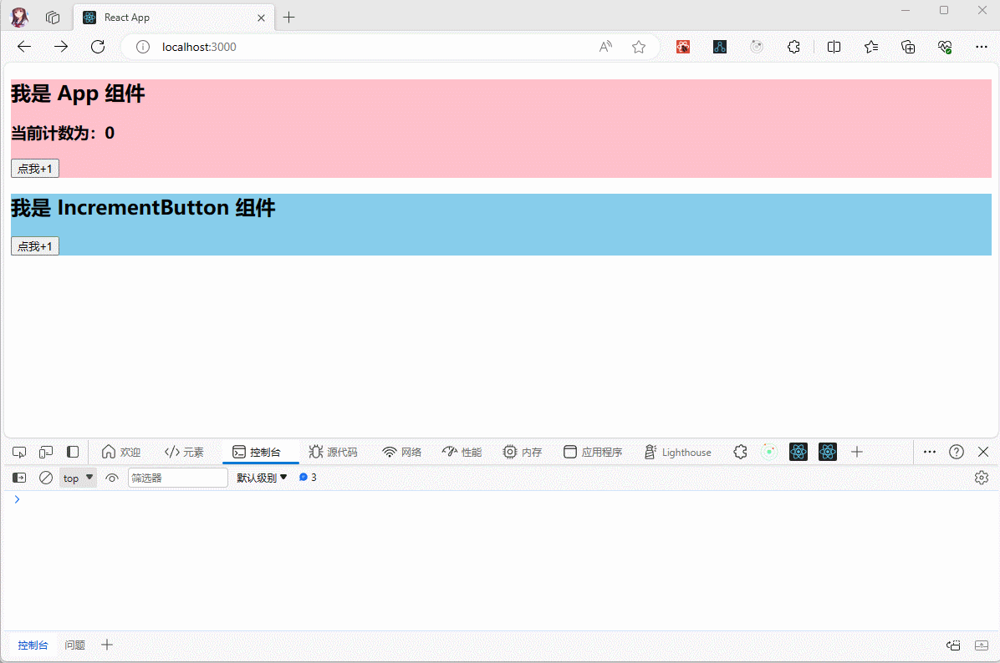

* 从上图看，也没有什么毛病，结果完全正确；但是，如果我更新的不是 count ，而是 message ？

```jsx {18,25-28,38}
import {memo, useState} from "react"


const IncrementButton = memo(function (props) {
  const [message] = useState("我是 IncrementButton 组件")
  const {increment} = props
  console.log('IncrementButton')
  return (
    <div>
      <h2>{message}</h2>
      <button onClick={increment}>点我+1</button>
    </div>
  )
})

function App() {
  const [count, setCount] = useState(0)
  const [message, setMessage] = useState("我是 App 组件")
  
  const increment = () => {
    console.log('App increment')
    setCount(count + 1)
  }
  
  const changeMessage = (event) => {
    console.log('App changeMessage')
    setMessage(Math.random().toString())
  }
  
  console.log('App')
  
  return (
    <div>
      <div style={{background: 'pink'}}>
        <h2>{message}</h2>
        <h3>当前计数为：{count}</h3>
        <button onClick={increment}>点我+1</button>
        <button onClick={changeMessage}>点我修改message</button>
      </div>
      <div style={{background: 'skyblue'}}>
        <IncrementButton increment={increment}/>
      </div>
    </div>
  )
}

export default memo(App)
```

* 可以通过`浏览器`的`控制台`来查看：

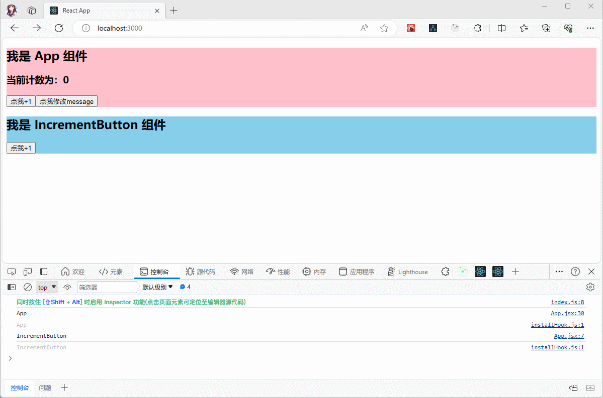

* 我们不难发现，我们改变的是 message ，不是 count ；但是，子组件还是重新渲染了；其实，我们想要的是，如果我们没有改变 count ，那么子组件就不应该重新渲染。
* 当然，这是 React 的`渲染机制`引起的，即：`在默认情况下，当一个组件重新渲染的时候，React 将会递归渲染它的所有子组件`。这对于不需要大量计算去重新渲染的组件来说影响很小；但是，如果子组件过大，甚至出现嵌套子组件，那么性能将会产生问题。
* 此时，就需要使用 useCallback 来解决了，其定义如下：

```jsx
const cachedFn = useCallback(fn, dependencies)
```

* 其中，`fn` 就是`想要缓存的函数`。此函数可以接受任何参数并且返回任何值。React 将会在初次渲染而非调用时返回该函数。当进行下一次渲染时，如果 `dependencies` 相比于上一次渲染时没有改变，那么 React 将会返回相同的函数。否则，React 将返回在最新一次渲染中传入的函数，并且将其缓存以便之后使用。React 不会调用此函数，而是返回此函数。你可以自己决定何时调用以及是否调用。
* 其中，`dependencies` 就是更新 `fn` 的所有响应式值的一个列表（数组）。响应式值包括 props、state，和所有在组件内部直接声明的变量和函数。React 使用 [`Object.is`](https://developer.mozilla.org/zh-CN/docs/Web/JavaScript/Reference/Global_Objects/Object/is) 比较每一个依赖和它的之前的值。
* 此时，就可以这么优化了：

```jsx {20-25}
import {memo, useCallback, useState} from "react"


const IncrementButton = memo(function (props) { // 注意，此处使用的是 memo 高阶组件
  const [message] = useState("我是 IncrementButton 组件")
  const {increment} = props
  console.log('IncrementButton')
  return (
    <div>
      <h2>{message}</h2>
      <button onClick={increment}>点我+1</button>
    </div>
  )
})

function App() {
  const [count, setCount] = useState(0)
  const [message, setMessage] = useState("我是 App 组件")
  
  const increment = useCallback(
    () => {
      setCount(count + 1)
    },
    [count],
  );
  
  const changeMessage = (event) => {
    console.log('App changeMessage')
    setMessage(Math.random().toString())
  }
  
  console.log('App')
  
  return (
    <div>
      <div style={{background: 'pink'}}>
        <h2>{message}</h2>
        <h3>当前计数为：{count}</h3>
        <button onClick={increment}>点我+1</button>
        <button onClick={changeMessage}>点我修改message</button>
      </div>
      <div style={{background: 'skyblue'}}>
        <IncrementButton increment={increment}/>
      </div>
    </div>
  )
}

export default memo(App)
```

* 可以通过`浏览器`的`控制台`来查看：

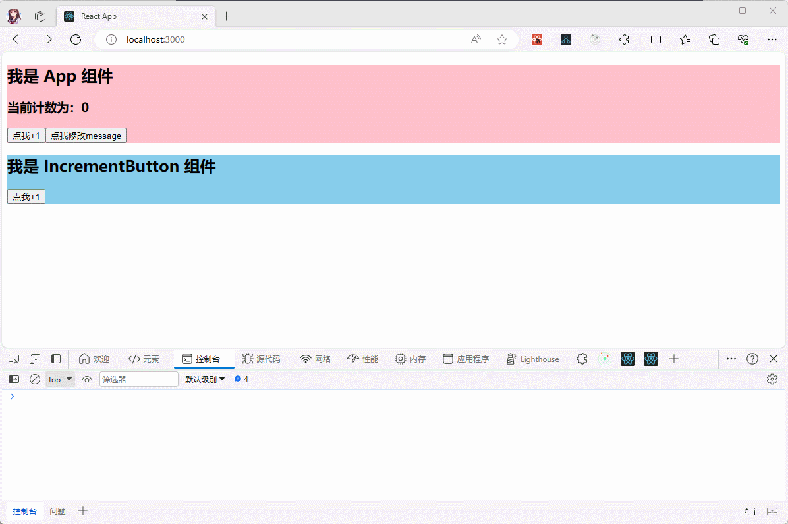

* 简而言之，`useCallback` 在多次渲染中缓存一个函数，直至这个函数的依赖发生改变。

## 4.2 useMemo

* 如果我们要在 React 中，通过工具函数计算一个结果，并展示到组件中，即：

```jsx {15,20}
import {memo, useState} from "react"

function calculateTotal(num) { // 计算和
  let total = 0;
  for (let i = 0; i < num; i++) {
    total += i;
  }
  console.log('calculateTotal')
  return total;
}

function App() {
  const [count, setCount] = useState(0)
  
  const result = calculateTotal(100)
  
  return (
    <div>
      <div style={{background: 'pink'}}>
        <h2>当前计数为：{count}</h2>
        <h3>计算结果：{result}</h3>
        <button onClick={() => setCount(count + 1)}>点我+1</button>
      </div>
    </div>
  )
}

export default memo(App)
```

* 可以通过`浏览器`的`控制台`来查看：

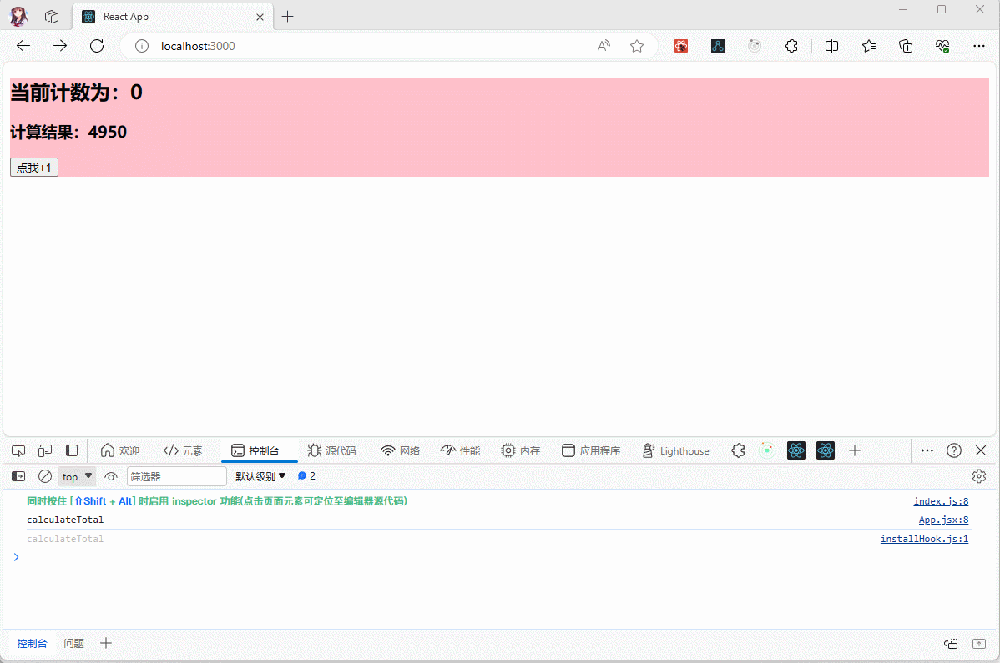

* 在 Vue 中，我们可以通过`计算属性`来解决；但是，在 React 中，我们只能通过 `useMemo` 来解决，会在每次重新渲染的时候能够缓存计算的结果，定义如下：

```jsx
const cachedValue = useMemo(()=> {
    return calculateValue
}, dependencies)
```

* 那么，就可以这么优化：

```jsx {15,17}
import {memo, useMemo, useState} from "react"

function calculateTotal(num) { // 计算和
  let total = 0;
  for (let i = 0; i < num; i++) {
    total += i;
  }
  console.log('calculateTotal')
  return total;
}

function App() {
  const [count, setCount] = useState(0)
  
  const result = useMemo(() => {
    return calculateTotal(100)
  }, [])
  
  return (
    <div>
      <div style={{background: 'pink'}}>
        <h2>当前计数为：{count}</h2>
        <h3>计算结果：{result}</h3>
        <button onClick={() => setCount(count + 1)}>点我+1</button>
      </div>
    </div>
  )
}

export default memo(App)
```

* 可以通过`浏览器`的`控制台`来查看：

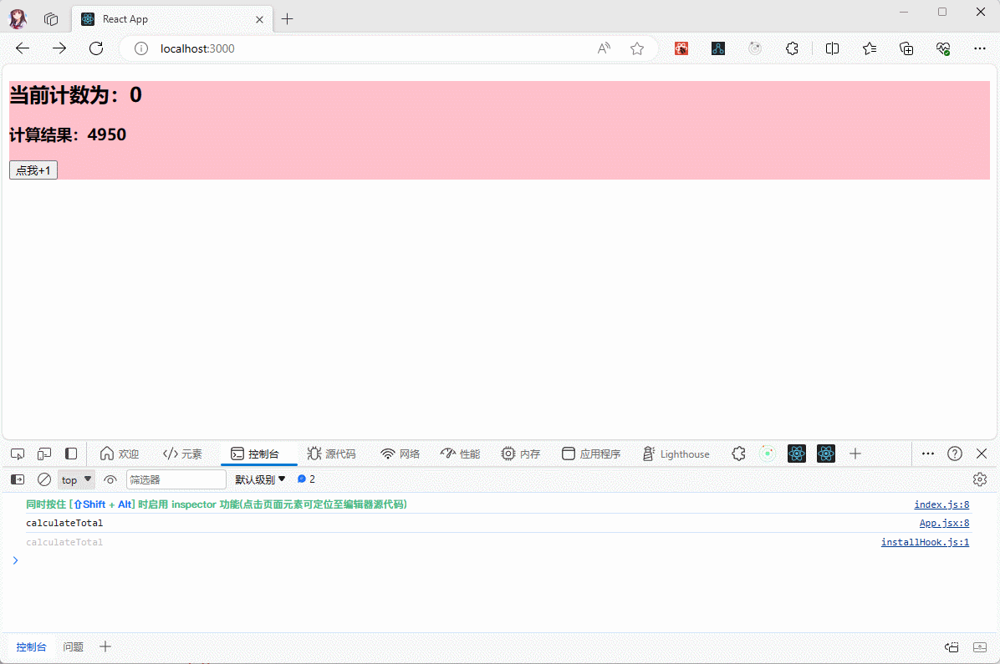

> 注意：
>
> * useMemo 返回值的是`缓存的值`（如果是普通的值，其实没什么意义；但是对于对象，函数等，就有意义了），而 useCallback 返回的是`缓存的函数`。
> * useMemo 的用法是这样的：`useMemo(() => fn|xxx , [])`。
> * useCallback 的用法是这样的：`useCallback(fn, [])`。


# 第五章：useRef

## 5.1 概述

* 在`类式组件`中，我们是通过 `React.createRef` 来操作 DOM 的，即：

```jsx {10,15,23}
import React from 'react'

class App extends React.Component {
  
  state = {
    message: 'Hello React'
  }
  
  // ① 通过 React.createRef() 方式创建 Ref 对象
  h2Ref = React.createRef()
  
  
  getH2Dom() {
    /* ③ 通过 Ref 对象 的 current 属性 */
    const h2 = this.h2Ref.current
    console.log('h2',h2)
  }
  
  render() {
    return (
      <div>
        {/* ② 通过 ref 传入一个Ref 对象 */}
        <h2 ref={this.h2Ref}>{this.state.message}</h2>
        <button onClick={() => this.getH2Dom()}>获取 h2 元素</button>
      </div>
    )
  }
}

export default App
```

* 在没有 Hook 的情况下，如果是函数式组件，我们必须使用 forwardRef 高阶组件，即：

```jsx {3,9,31}
import React, {forwardRef} from 'react'

const HelloWorld = forwardRef(function HelloWorld(props, ref) {
  
  const [message] = React.useState('我是 HelloWorld 组件')
  
  return (
    <div style={{backgroundColor: 'skyblue', padding: '5px'}}>
      <h2 ref={ref}>{message}</h2>
    </div>
  )
})

class App extends React.PureComponent {
  
  state = {
    message: '我是 App 组件'
  }
  
  helloWorldRef = React.createRef()
  
  render() {
    const {message} = this.state
    return (
      <div style={{backgroundColor: 'pink', padding: '5px', width: '500px'}}>
        <h2>{message}</h2>
        <button onClick={() => console.log(this.helloWorldRef.current)}
                style={{marginBottom: '5px'}}>
          访问 HelloWorld 组件的 h2 元素
        </button>
        <HelloWorld ref={this.helloWorldRef}/>
      </div>
    )
  }
}

export default App
```

* 但是，React 提供了 useRef 的 Hook，帮助引用一个不需要渲染的值，其定义如下：

```jsx
const ref = useRef(initialValue)
```

* 其实，就是 useRef 返回一个 ref 对象，并且该对象在组件的整个生命周期中保持不变。
* useRef  Hook 最常用的两种用法：
  * ① 操作 DOM（可以是 HTML 元素或 class 组件，如果是 function 组件，需要使用 forwardRef 高阶组件）。
  * ② 保存一个数据，这个对象在整个生命周期中保持不变。
* 其实，可以类比 Vue3 中的 ref 响应式数据，即：

```vue
<template>
	<div>
        <h2>当前计数为：{{count}}</h2>
        <button @click="count+1">点我+1</button>
    </div>
</template>

<script>
	import {ref} from "vue"
    
    const count = ref(0)
    
    console.log('count',count.value)
</script>
```

```vue
<script setup>
import { ref, onMounted } from 'vue'
import Child from './Child.vue'

const child = ref(null)

onMounted(() => {
  // child.value 是 <Child /> 组件的实例
})
</script>

<template>
  <Child ref="child" />
</template>
```

## 5.2 操作 DOM

* 需求：实现下面的功能。

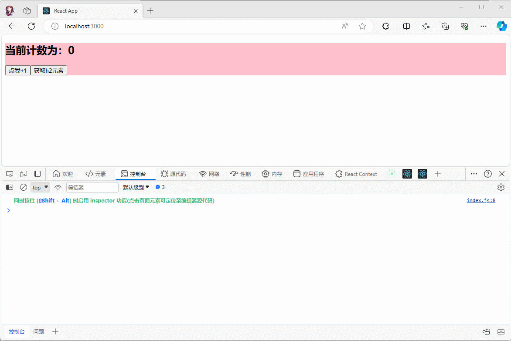

* 项目结构：

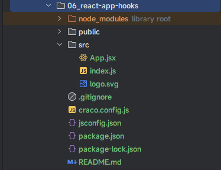

* 示例：

```jsx {6,9,15}
import {memo, useRef, useState} from "react"


function App() {
  const [count, setCount] = useState(0)
  const h2Ref = useRef()
  
  const handleClick = () => {
    console.log(h2Ref.current?.textContent);
  }
  
  return (
    <div>
      <div style={{background: 'pink'}}>
        <h2 ref={h2Ref}>当前计数为：{count}</h2>
        <button onClick={() => setCount(count + 1)}>点我+1</button>
        <button onClick={handleClick}>获取h2元素</button>
      </div>
    </div>
  )
}

export default memo(App)
```

## 5.3 向组件暴露 ref

* 需求：有的时候，想染父组件来操作子组件中的 DOM ，如果子组件是类式组件，就需要使用 forwardRef 高阶组件了。

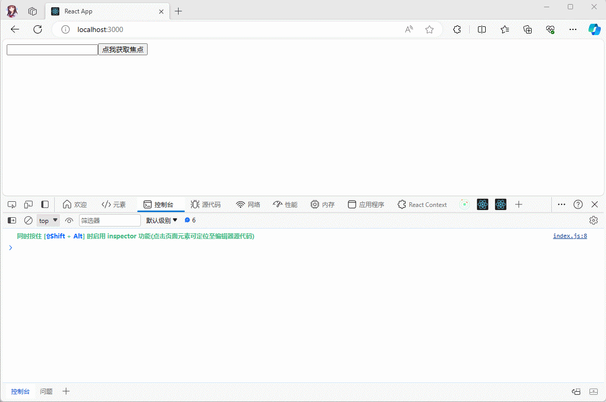

* 项目结构：

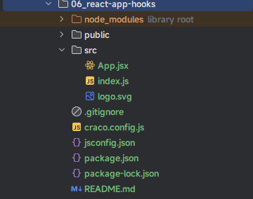

* 示例：

```jsx {3,6,11,15,16}
import {forwardRef, memo, useRef} from "react"

const HelloWorld = memo(forwardRef((props, ref) => {
  
  return (
      <input type="text" ref={ref}/>
  )
}))

function App() {
  const ref = useRef()
  
  return (
    <div>
        <HelloWorld ref={ref}/>
        <button onClick={() => ref.current?.focus()}>点我获取焦点</button>
    </div>
  )
}

export default memo(App)
```

## 5.4 证明

* 证明：useRef 返回一个 ref 对象，并且该对象在组件的整个生命周期中保持不变。


* 示例：

```jsx {9,10,27}
import {memo, useRef, useState} from "react"


function App() {
  const [count, setCount] = useState(0)
  const h2Ref = useRef()
  
  const handleClick = () => {
    App.set.add(h2Ref)
    console.log(App.set.size) // 1
    const {textContent} = h2Ref.current
    
    console.log(textContent);
  }
  
  return (
    <div>
      <div style={{background: 'pink'}}>
        <h2 ref={h2Ref}>当前计数为：{count}</h2>
        <button onClick={() => setCount(count + 1)}>点我+1</button>
        <button onClick={handleClick}>获取h2元素</button>
      </div>
    </div>
  )
}

App.set = new Set()

export default memo(App)
```

## 5.5 优化之前的案例

* 对于之前的 useCallBack 的案例，即：

```jsx {20-25}
import {memo, useCallback, useState} from "react"


const IncrementButton = memo(function (props) { // 注意，此处使用的是 memo 高阶组件
  const [message] = useState("我是 IncrementButton 组件")
  const {increment} = props
  console.log('IncrementButton')
  return (
    <div>
      <h2>{message}</h2>
      <button onClick={increment}>点我+1</button>
    </div>
  )
})

function App() {
  const [count, setCount] = useState(0)
  const [message, setMessage] = useState("我是 App 组件")
  
  const increment = useCallback(
    () => {
      setCount(count + 1)
    },
    [count],
  );
  
  const changeMessage = (event) => {
    console.log('App changeMessage')
    setMessage(Math.random().toString())
  }
  
  console.log('App')
  
  return (
    <div>
      <div style={{background: 'pink'}}>
        <h2>{message}</h2>
        <h3>当前计数为：{count}</h3>
        <button onClick={increment}>点我+1</button>
        <button onClick={changeMessage}>点我修改message</button>
      </div>
      <div style={{background: 'skyblue'}}>
        <IncrementButton increment={increment}/>
      </div>
    </div>
  )
}

export default memo(App)
```

* 我们通过传递依赖项 count ，来多次渲染中缓存一个函数的问题（当然，如果依赖项 count 发生改变，increment 就会产生新的函数）；
* 如果我们不设置依赖项 count，即：

```jsx {24}
import {memo, useCallback, useState} from "react"


const IncrementButton = memo(function (props) { // 注意，此处使用的是 memo 高阶组件
  const [message] = useState("我是 IncrementButton 组件")
  const {increment} = props
  console.log('IncrementButton')
  return (
    <div>
      <h2>{message}</h2>
      <button onClick={increment}>点我+1</button>
    </div>
  )
})

function App() {
  const [count, setCount] = useState(0)
  const [message, setMessage] = useState("我是 App 组件")
  
  const increment = useCallback(
    () => {
      setCount(count + 1)
    },
    [],
  );
  
  const changeMessage = (event) => {
    console.log('App changeMessage')
    setMessage(Math.random().toString())
  }
  
  console.log('App')
  
  return (
    <div>
      <div style={{background: 'pink'}}>
        <h2>{message}</h2>
        <h3>当前计数为：{count}</h3>
        <button onClick={increment}>点我+1</button>
        <button onClick={changeMessage}>点我修改message</button>
      </div>
      <div style={{background: 'skyblue'}}>
        <IncrementButton increment={increment}/>
      </div>
    </div>
  )
}

export default memo(App)
```

* 就会产生`闭包陷阱`，每次都是 1 ，很不好；此时，就可以通过 useRef 来进行优化，即：

```jsx {20-21,25,27}
import {memo, useCallback, useRef, useState} from "react"


const IncrementButton = memo(function (props) { // 注意，此处使用的是 memo 高阶组件
  const [message] = useState("我是 IncrementButton 组件")
  const {increment} = props
  console.log('IncrementButton')
  return (
    <div>
      <h2>{message}</h2>
      <button onClick={increment}>点我+1</button>
    </div>
  )
})

function App() {
  const [count, setCount] = useState(0)
  const [message, setMessage] = useState("我是 App 组件")
  
  const CountRef = useRef(count);
  CountRef.current = count
  
  const increment = useCallback(
    () => {
      setCount(CountRef.current + 1)
    },
    [],
  );
  
  const changeMessage = (event) => {
    console.log('App changeMessage')
    setMessage(Math.random().toString())
  }
  
  console.log('App')
  
  return (
    <div>
      <div style={{background: 'pink'}}>
        <h2>{message}</h2>
        <h3>当前计数为：{count}</h3>
        <button onClick={increment}>点我+1</button>
        <button onClick={changeMessage}>点我修改message</button>
      </div>
      <div style={{background: 'skyblue'}}>
        <IncrementButton increment={increment}/>
      </div>
    </div>
  )
}

export default memo(App)
```


# 第六章：useImperativeHandle

## 6.1 概述

* `useImperativeHandle` 是 React 中的一个 Hook，它能让你自定义由 `ref` 暴露出来的句柄，其定义如下：

```jsx
useImperativeHandle(ref, createHandle, dependencies?)
```

* 参数：
  * ref ：通常是从 `forwardRef` 高阶组件中获取的第二个参数。
  * createHandle：是一个函数，没有参数，可以返回任何想要暴露的句柄，可以是任何类型。但是，通常是一个包含想要暴露方法的对象。
  * `dependencies` 就是更新 `fn` 的所有响应式值的一个列表（数组）。响应式值包括 props、state，和所有在组件内部直接声明的变量和函数。React 使用 [`Object.is`](https://developer.mozilla.org/zh-CN/docs/Web/JavaScript/Reference/Global_Objects/Object/is) 比较每一个依赖和它的之前的值。

> 注意：
>
> * 在计算机领域中，句柄（handle）通常指的是一个标识符或引用，用于标识或引用某个资源或对象。句柄可以是一个整数、指针或其他数据结构，用于表示操作系统或应用程序中的各种资源，如：文件、内存块、窗口、进程、线程等。
> * 句柄的作用是充当对资源的引用，使得应用程序可以通过句柄来访问和操作相应的资源。通过句柄，应用程序可以请求操作系统分配或释放资源，或者对资源进行读取、写入、修改等操作。
> * 句柄的具体含义和用法可能因操作系统、编程语言或上下文而异。在不同的环境中，句柄可能有不同的命名，如句柄、指针、引用、描述符等。
> * 总之，句柄在计算机中是一种常见的概念，用于标识和引用各种资源，以便应用程序可以对其进行操作和管理。

> 注意：
>
> * 在 React 中，句柄（handler）通常指的是处理事件的函数。句柄函数用于响应用户的交互操作，例如：点击按钮、输入文本等。
>
> * 在 React 组件中，可以通过将句柄函数作为事件处理程序传递给相应的元素来定义和使用句柄。当事件触发时，句柄函数将被调用，并且可以执行相应的操作。

* 回顾一下之前的案例，如下所示：

```jsx
import {forwardRef, memo, useRef} from "react"

const HelloWorld = memo(forwardRef((props, ref) => {
  
  return (
      <input type="text" ref={ref}/>
  )
}))

function App() {
  const ref = useRef()
  
  return (
    <div>
        <HelloWorld ref={ref}/>
        <button onClick={() => ref.current?.focus()}>点我获取焦点</button>
    </div>
  )
}

export default memo(App)
```

* 我们是通过 forwardRef 将 ref 转发到子组件；此时，子组件就拿到父组件中创建的 ref ，绑定到自己的某一个元素中。但是这种方法带来的坏处是：我们将整个子组件的 DOM 直接暴露给父组件，不是很安全！！！那么，我们可以看看 Vue 是怎么解决的：

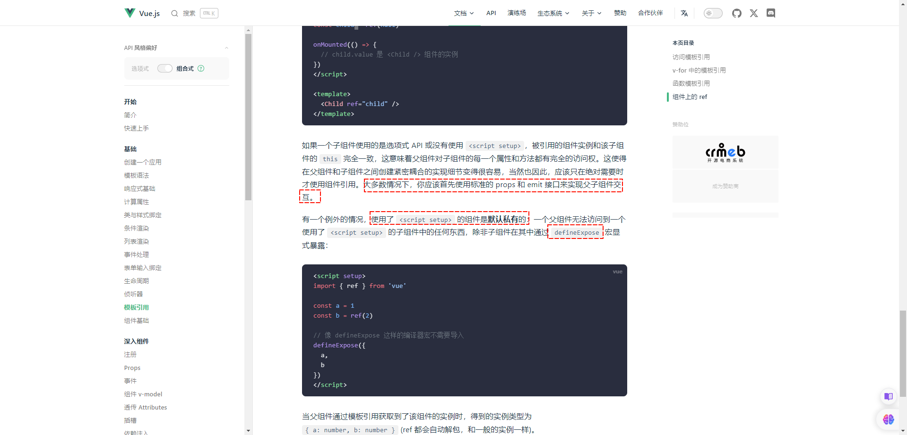

* 针对这种情况，我们就可以通过 useImperativeHandle 来解决这样的问题了。

> 注意：
>
> * **不要滥用 ref。** 你应当仅在你没法通过 prop 来表达 `命令式`行为的时候才使用 ref：例如，滚动到指定节点、聚焦某个节点、触发一次动画，以及选择文本等等。
> * **如果可以通过 prop 实现，那就不应该使用 ref**。例如，你不应该从一个 `Model` 组件暴露出 `{open, close}` 这样的命令式句柄，最好是像 `<Modal isOpen={isOpen} />` 这样，将 `isOpen` 作为一个 prop。`副作用` 可以帮你通过 prop 来暴露一些命令式的行为。

## 6.2 案例

* 需求：实现下面的功能。

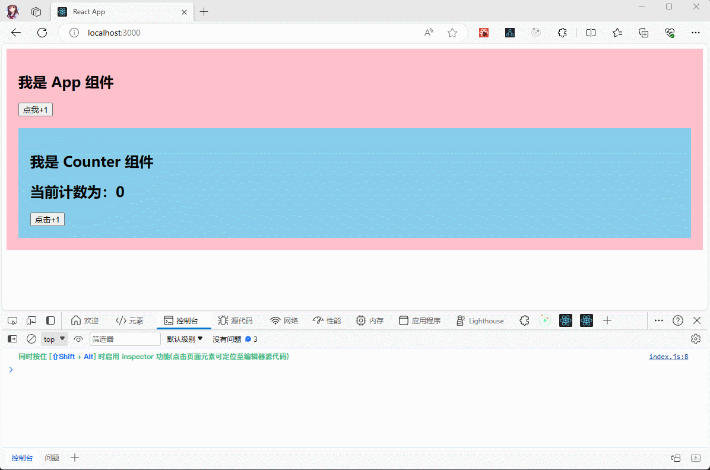

* 项目结构：

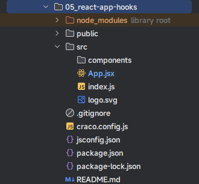

* 示例：

```jsx {12-16,19,29,33,42}
import {forwardRef, memo, useImperativeHandle, useRef, useState} from "react"


const Counter = memo(forwardRef((props, ref) => {
  const [message] = useState("我是 Counter 组件")
  const [count, setCount] = useState(0)
  
  const handleClick = () => {
    setCount(count + 1)
  }
  
  useImperativeHandle(ref, () => {
    return {
      handleClick: handleClick
    }
  }, [handleClick])
  
  return (
    <div ref={ref}>
      <h2>{message}</h2>
      <h2>当前计数为：{count}</h2>
      <button onClick={handleClick}>点击+1</button>
    </div>
  )
}))

function App() {
  const [message] = useState("我是 App 组件")
  const counterRef = useRef(null)
  
  
  const handleClick = () => {
    counterRef.current.handleClick()
  }
  
  return (
    <div>
      <div style={{background: 'pink', padding: '20px'}}>
        <h2>{message}</h2>
        <button onClick={handleClick}>点我+1</button>
        <div style={{background: 'skyblue', padding: '20px', marginTop: '20px'}}>
          <Counter ref={counterRef}/>
        </div>
      </div>
    </div>
  )
}

export default memo(App)
```

