# 第一章：自定义 Hook

## 1.1 概述

* 通过自定义 Hook，可以将组件逻辑提取到可重用的函数中。
* `自定义 Hook 是一个函数，其名称以 “use” 开头，函数内部可以调用其他的 Hook。`

> 注意：
>
> * 自定义 Hook 是一种自然遵循 Hook 设计的约定，而并不是 React 的特性。
> * 在两个组件中使用相同的 Hook 不会共享 state ，因为自定义 Hook 是一种重用`状态逻辑`的机制(例如：设置为订阅并存储当前值)，所以每次使用自定义 Hook 时，其中的所有 state 和副作用都是完全隔离的。
> * 自定义 Hook 在每次调用的时候，都会获取独立的 state 。

## 1.2 案例

* 需求：所有的组件在`创建`和`销毁`的时候都进行打印信息。

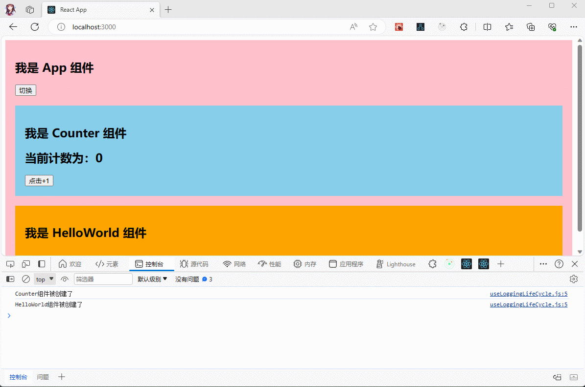

* 项目结构：

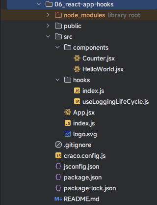

* 示例：
* 其中，hooks/useLoggingLifeCycle.js

```js
import {useEffect} from "react"

export function useLoggingLifeCycle(componentName) {
  useEffect(() => {
    console.log(`${componentName}组件被创建了`)
    return () => {
      console.log(`${componentName}组件被销毁了`)
    }
  }, [componentName])
}
```

* 其中，hooks/index.js

```js
export * from '@/hooks/useLoggingLifeCycle'
```

* 其中，components/Counter.jsx

```jsx {2,8}
import {useState} from "react"
import {useLoggingLifeCycle} from "@/hooks";

function Counter() {
  const [message] = useState("我是 Counter 组件")
  const [count, setCount] = useState(0)
  
  useLoggingLifeCycle("Counter")
  return (
    <div>
      <h2>{message}</h2>
      <h2>当前计数为：{count}</h2>
      <button onClick={() => setCount(count + 1)}>点击+1</button>
    </div>
  )
}

export default Counter
```

* 其中，components/HelloWorld.jsx

```jsx {2,7}
import {useState} from "react"
import {useLoggingLifeCycle} from "@/hooks";

function HelloWorld() {
  const [message] = useState("我是 HelloWorld 组件")
  
  useLoggingLifeCycle("HelloWorld")
  return (
    <div>
      <h2>{message}</h2>
    </div>
  )
}

export default HelloWorld
```

* 其中，App.jsx

```jsx {7,15,18}
import {memo, useState} from "react"
import Counter from "@/components/Counter"
import HelloWorld from "@/components/HelloWorld"

function App() {
  const [message] = useState("我是 App 组件")
  const [show, setShow] = useState(true)
  
  return (
    <div>
      <div style={{background: 'pink', padding: '20px'}}>
        <h2>{message}</h2>
        <button onClick={() => setShow(!show)}>切换</button>
        <div style={{background: 'skyblue', padding: '20px', marginTop: '20px'}}>
          {show && <Counter/>}
        </div>
        <div style={{background: 'orange', padding: '20px', marginTop: '20px'}}>
          {show && <HelloWorld/>}
        </div>
      </div>
    </div>
  )
}

export default memo(App)
```

* 其中，index.js

```jsx {7,9}
import React from 'react'
import ReactDOM from 'react-dom/client'
import App from '@/App'

const root = ReactDOM.createRoot(document.getElementById('root'))
root.render(
  // <React.StrictMode>
  <App/>
  // </React.StrictMode>
)
```

> 注意：之所以注释掉严格模式，是为了防止破坏演示；实际开发中，并不需要注释掉。

## 1.3 案例

* 需求：实现多个 context 共享。

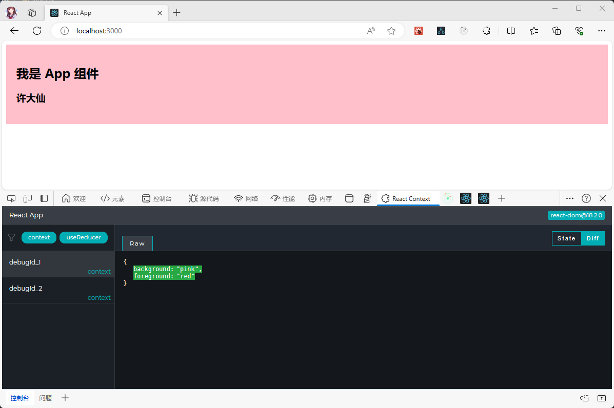

* 项目结构：

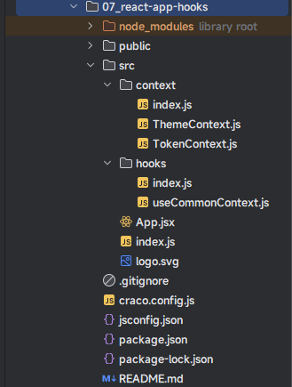

* 示例：
* 其中，context/ThemeContext.js

```js {3,13}
import {createContext} from "react";

export const themes = { // 主题
  light: {
    foreground: "red",
    background: "pink"
  },
  dark: {
    foreground: "white",
    background: "skyblue"
  }
};
export const ThemeContext = createContext(themes.light)
```

* 其中，context/TokenContext.js

```js {3}
import {createContext} from "react"

export const TokenContext = createContext({})
```

* 其中，context/index.js

```js
export * from '@/context/ThemeContext'
export * from '@/context/TokenContext'
```

* 其中，hooks/useCommonContext.js

```js {5-6,8}
import {ThemeContext, TokenContext} from "@/context";
import {useContext} from "react";

export function useCommonContext() {
  const theme = useContext(ThemeContext)
  const token = useContext(TokenContext)
  
  return [theme, token]
}
```

* 其中，hooks/index.js

```js
export * from '@/hooks/useCommonContext'
```

* 其中，index.js

```js {4,9-10,12-13}
import React from 'react'
import ReactDOM from 'react-dom/client'
import App from '@/App'
import {ThemeContext, themes, TokenContext} from "@/context"

const root = ReactDOM.createRoot(document.getElementById('root'))
root.render(
  <React.StrictMode>
    <ThemeContext.Provider value={themes.light}>
      <TokenContext.Provider value={{username: "许大仙"}}>
        <App/>
      </TokenContext.Provider>
    </ThemeContext.Provider>
  </React.StrictMode>
)
```

* 其中，App.jsx

```jsx {7,11,13}
import {memo, useState} from "react"

import {useCommonContext} from "@/hooks";

function App() {
  const [message] = useState("我是 App 组件")
  const [theme, token] = useCommonContext()
  
  return (
    <div>
      <div style={{background: theme?.background, padding: '20px'}}>
        <h2>{message}</h2>
        <h3>{token?.username}</h3>
      </div>
    </div>
  )
}

export default memo(App)
```

## 1.4 案例

* 需求：输出鼠标滚动的位置。

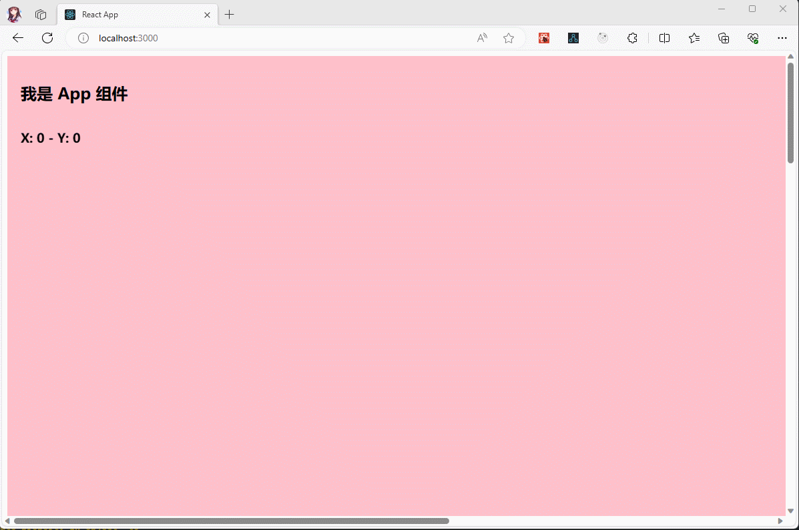

* 项目结构：

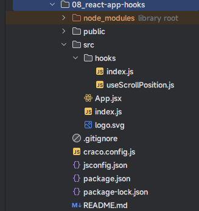

* 示例：
* 其中，hooks/useScrollPosition.js

```js
import {useEffect, useState} from "react";

export function useScrollPosition() {
  const [scrollX, setScrollX] = useState(0)
  const [scrollY, setScrollY] = useState(0)
  
  useEffect(() => {
    const handleScroll = () => {
      setScrollX(window.scrollX)
      setScrollY(window.scrollY)
    }
    window.addEventListener('scroll', handleScroll)
    return () => {
      window.removeEventListener('scroll', handleScroll)
    }
  }, []);
  
  return [scrollX, scrollY]
}
```

* 其中，hooks/index.js

```js
export * from '@/hooks/useScrollPosition'
```

* 其中，App.jsx

```jsx {7,15}
import {memo, useState} from "react"
import {useScrollPosition} from "@/hooks"

function App() {
  const [message] = useState("我是 App 组件")
  
  const [scrollX, scrollY] = useScrollPosition()
  
  return (
    <div>
      <div style={{background: 'pink', padding: '20px', height: '3000px', width: '2000px'}}>
        <h2>{message}</h2>
        <h3 style={{
          position: 'fixed'
        }}>X: {scrollX} - Y: {scrollY}</h3>
      </div>
    </div>
  )
}

export default memo(App)
```


# 第二章：useId

## 2.1 概述

* `useId` 是一个用于生成横跨服务端和客户端的稳定的唯一 ID 的同时避免 `hydration` 不匹配的 Hook。
* `useId` 的定义如下：

```jsx
const id = useId()
```

> 注意：
>
> * `useId` 不应该被用来生成列表中的 key，列表的 key 应该由我们的数据生成。
> * `hydration` 在英文中的翻译是 `水合`，其对应的原理将在后文讲解。
> * `useId` 主要用于 React 的同构应用开发的，在 SPA 页面中并不需要。
> * 使用服务端渲染时，**`useId` 需要在服务器和客户端上有相同的组件树**。如果你在服务器和客户端上渲染的树不完全匹配，生成的 ID 将不匹配。

## 2.2 案例

* 需求：生成唯一的 ID 。

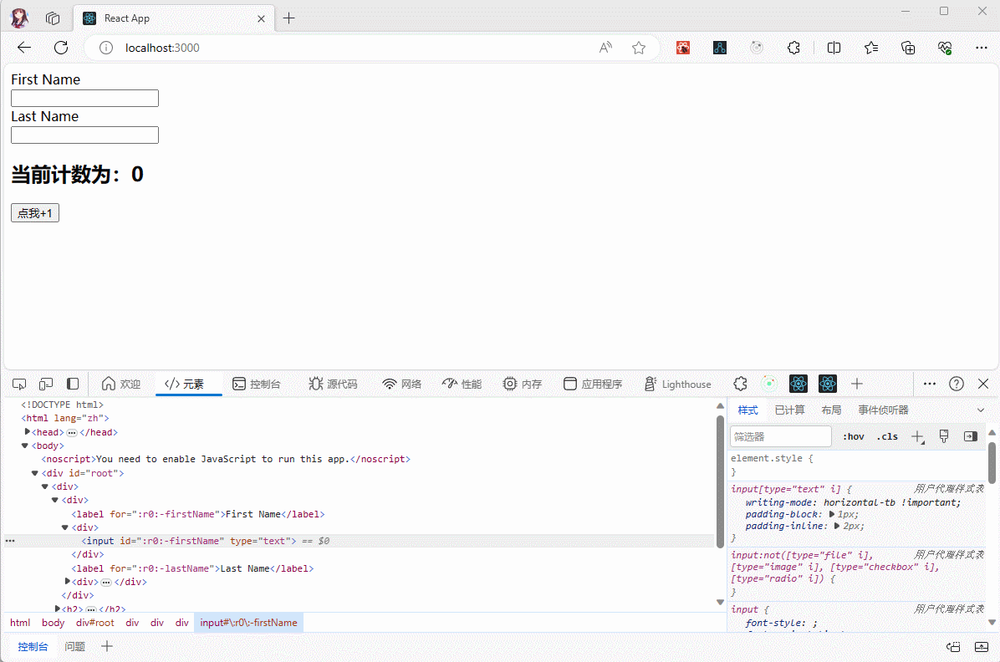

* 项目结构：

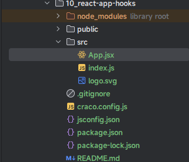

* 示例：
* 其中，App.jsx

```jsx {6,8,12,14,16,18}
import {memo, useId, useState} from "react"

function App() {
  const [count, setCount] = useState(0)
  
  const id = useId();
  
  console.log('App', id)
  return (
    <div>
      <div>
        <label htmlFor={id + '-firstName'}>First Name</label>
        <div>
          <input id={id + '-firstName'} type="text"/>
        </div>
        <label htmlFor={id + '-lastName'}>Last Name</label>
        <div>
          <input id={id + '-lastName'} type="text"/>
        </div>
      </div>
      <h2>当前计数为：{count}</h2>
      <button onClick={() => setCount(count + 1)}>点我+1</button>
    </div>
  )
}

export default memo(App)
```

* 其中，index.js

```js {7,9}
import React from 'react'
import ReactDOM from 'react-dom/client'
import App from '@/App'

const root = ReactDOM.createRoot(document.getElementById('root'))
root.render(
  // <React.StrictMode>
    <App/>
  // </React.StrictMode>
)
```

> 注意：之所以，注释掉严格模式；就是防止影响演示效果。


# 第三章：useTransition

## 3.1 概述

* `useTransition` 是一个帮助我们在不阻塞 UI 的情况下更新状态的 React Hook，其定义如下：

```jsx
const [isPending, startTransition] = useTransition()
```

> 注意： `useTransition` 其实在告诉 React 对于某部分任务的更新优先级较低，可以稍后进行更新。

* 本次需要伪造数据，可以使用如下的库：

```shell
npm install @faker-js/faker
```

## 3.2 案例

* 需求：完成下面的功能。

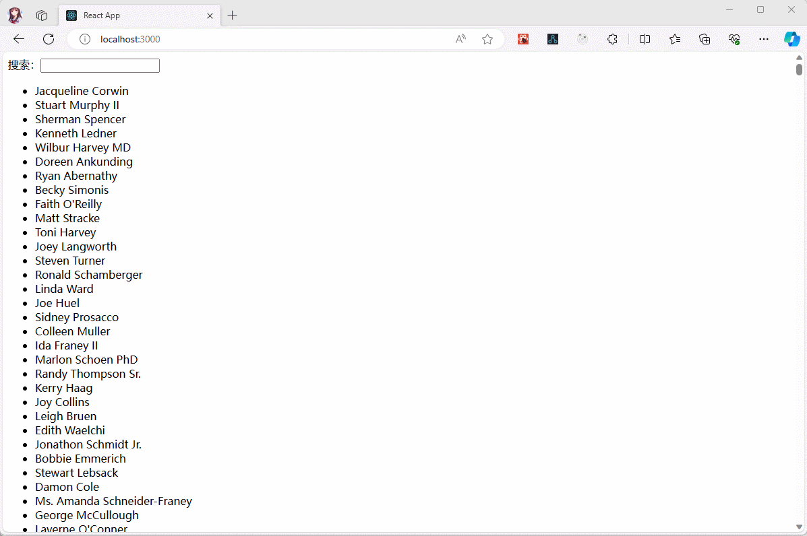

* 要求：
  * ① 不能因为过滤数据过大，而影响到搜索框的内容的即时出现。
  * ② 换言之，过滤数据不是很重要，搜索框中的内容的即时出现最为重要。
* 项目结构：

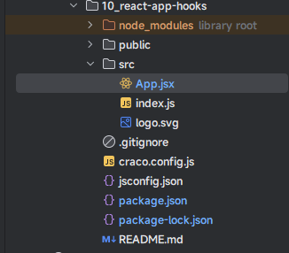

* 示例：

```jsx {18,21,34}
import {memo, useState, useTransition} from "react"
import {faker} from '@faker-js/faker'

const names = (count) => {
  const names = [];
  for (let i = 0; i < count; i++) {
    const name = faker.person.fullName();
    names.push(name);
  }
  return names;
};

const nameArray = names(10000);

function App() {
  const [keyword, setKeyword] = useState("")
  const [showNames, setShowNames] = useState(nameArray)
  const [isPending, startTransition] = useTransition()
  
  const handleKeyWord = (e) => {
    startTransition(() => {
      let value = e.target.value;
      const filterShowNames = nameArray.filter(item => item.includes(value))
      setKeyword(value)
      setShowNames(filterShowNames)
    })
  }
  
  return (
    <div>
      搜索：<input type="text" value={keyword} onChange={e => handleKeyWord(e)}/>
      <ul>
        {
          isPending ? "加载中" : showNames.map((name, index) => (
            <li key={index}>{name}</li>
          ))
        }
      </ul>
    </div>
  )
}

export default memo(App)
```


# 第四章：useDeferredValue

## 4.1 概述

* `useDeferredValue` 是一个 React Hook，可以让你延迟更新 UI 的某些部分，其定义如下：

```jsx
const deferredValue = useDeferredValue(value)
```

* 其实，和 useTransition 差不多；但是，useTransition 是没有返回值的。

> 注意：
>
> * 其实，就是在组件的顶层调用 `useDeferredValue` 来获取该值的延迟版本。
> * 推荐使用 `useTransition` ，因为其实现的交互效果更加简单。

## 4.2 案例

* 需求：完成下面的功能。

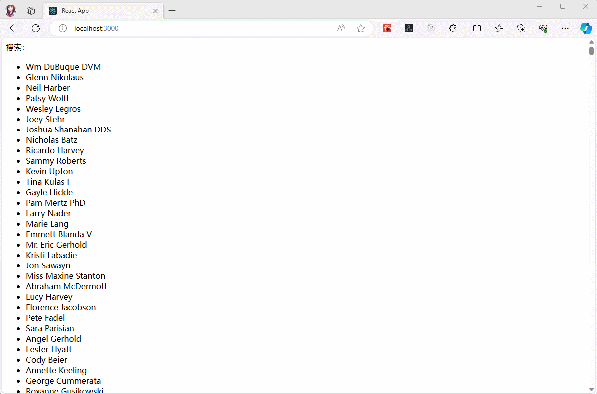

* 项目结构：

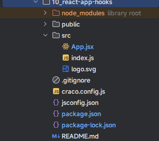

* 示例：

```jsx {18,31}
import {memo, useDeferredValue, useState} from "react"
import {faker} from '@faker-js/faker'

const names = (count) => {
  const names = [];
  for (let i = 0; i < count; i++) {
    const name = faker.person.fullName();
    names.push(name);
  }
  return names;
};

const nameArray = names(10000);

function App() {
  const [keyword, setKeyword] = useState("")
  const [showNames, setShowNames] = useState(nameArray)
  const deferredShowNames = useDeferredValue(showNames)
  const handleKeyWord = (e) => {
    let value = e.target.value;
    const filterShowNames = nameArray.filter(item => item.includes(value))
    setKeyword(value)
    setShowNames(filterShowNames)
  }
  
  return (
    <div>
      搜索：<input type="text" value={keyword} onChange={e => handleKeyWord(e)}/>
      <ul>
        {
          deferredShowNames.map((name, index) => (
            <li key={index}>{name}</li>
          ))
        }
      </ul>
    </div>
  )
}

export default memo(App)
```

