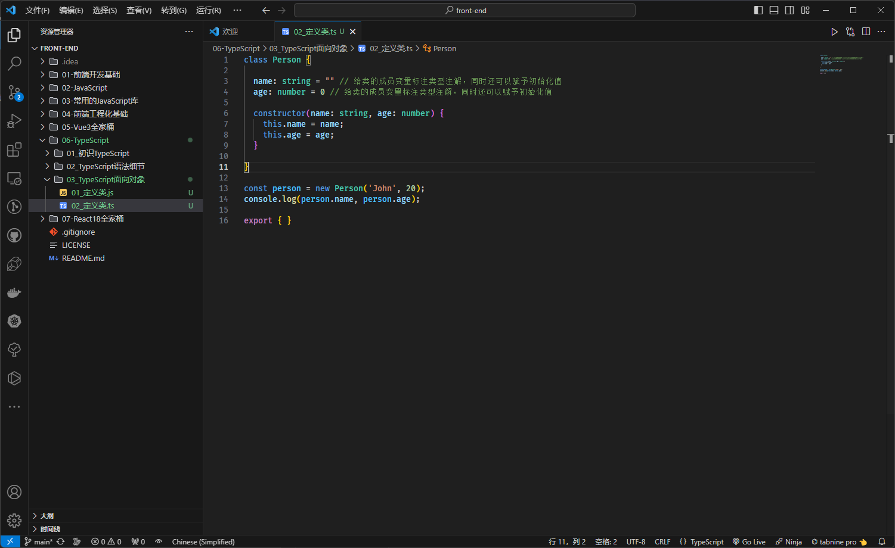
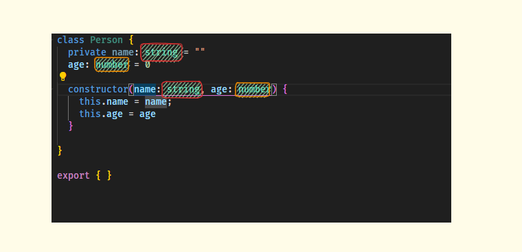
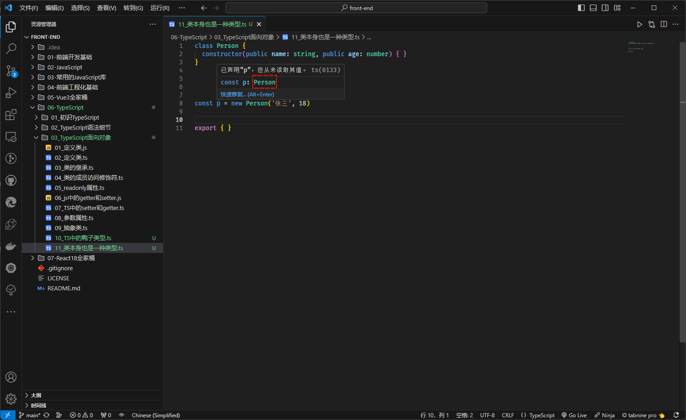
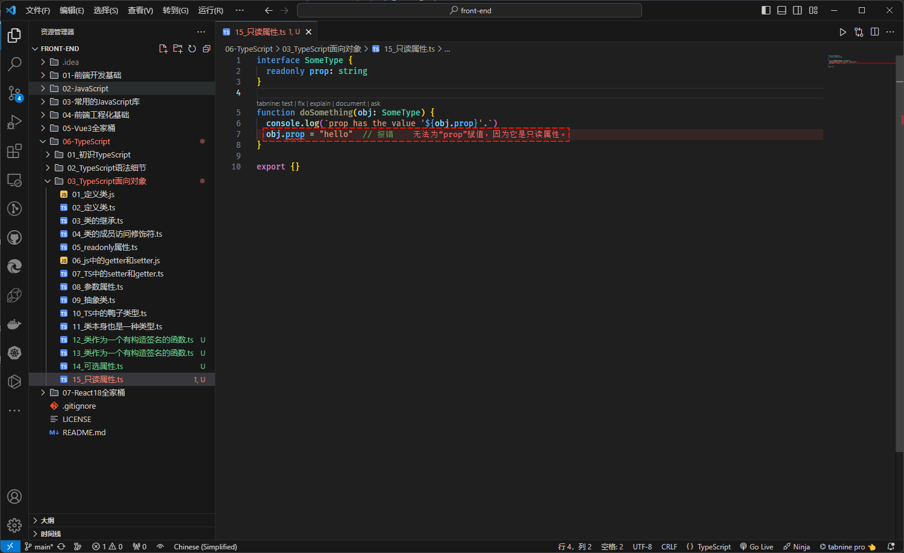
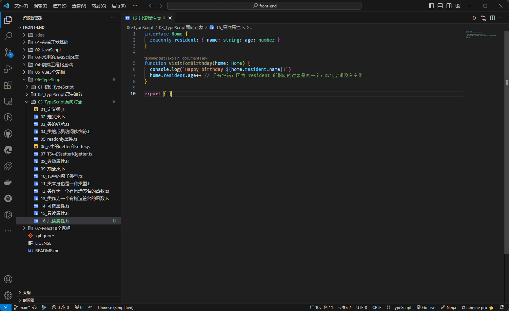
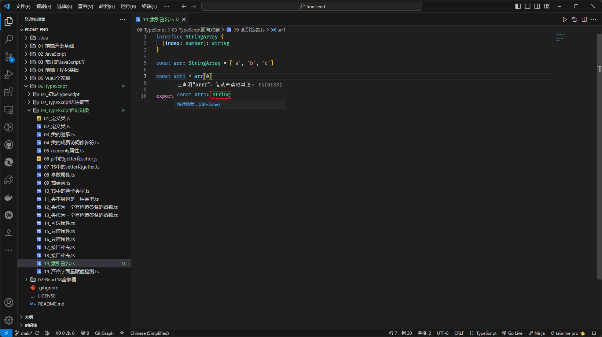
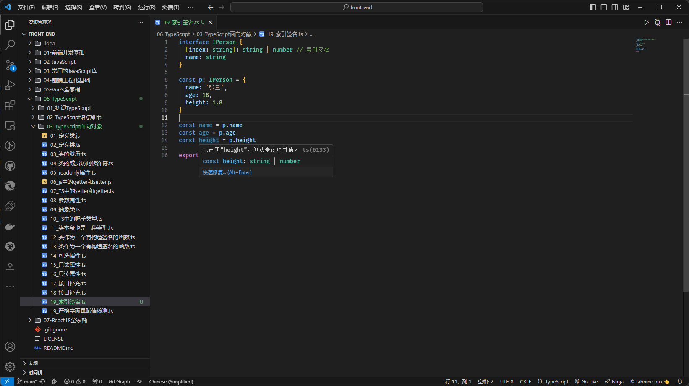
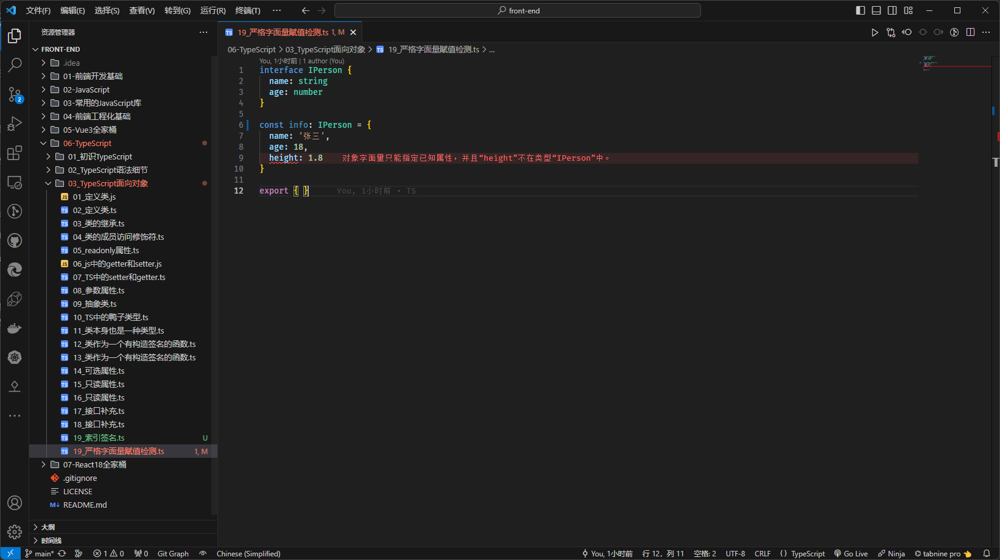
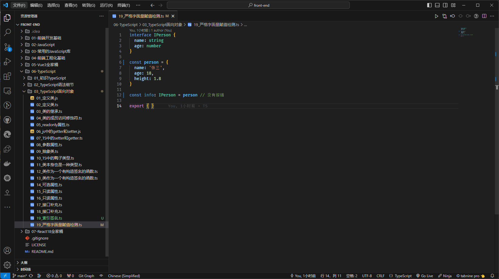

# 第一章：TS 中类的使用

## 1.1 概述

* 在早期的 JavaScript （ES5）开发中，我们需要通过`函数（构造函数）`和`原型链`来实现`类`以及`继承`；但是，从 ES6 开始之后，JavaScript 已经引入了 `class` 关键字和 `extends` 关键字，可以很方便的定义和使用类，以及类之间的关系 -- 继承。
* TypeScript 作为 JavaScript 的超集，也是支持 `class` 和 `extends` 关键字的，并且还可以对类的`属性`和`方法`等进行静态类型检测。

> 温馨提示ℹ️：
>
> * 目前，前端社区中流行的开发方式是`函数式编程`，面向对象编程已经不再流行了，如：Vue 3.x 中 Composition API 和 React 中 Hook 。
> * 但是，后面的发展，谁又能知道呢？或许，以后面向对象编程又再一次流行😝。

* 但是，在封装某些业务代码的时候，也许更推荐面向对象编程，毕竟`类`具有更强大的`封装性`。

## 1.2 类的定义

* 在 JS 中，我们可以这么定义一个类：

```js
class Person {

  constructor(name, age) { // 在 JS 中的构造器的名字必须是 constructor ，并且没有构造器重载的概念
    this.name = name;
    this.age = age;
  }

}

const person = new Person('John', 20);
console.log(person.name, person.age);
```

* 但是，如果我们在 TS 中，也这么定义，将会报错：

```ts {4,5}
class Person {

  constructor(name, age) {
    this.name = name; // 报错
    this.age = age; // 报错
  }

}

const person = new Person('John', 20);
console.log(person.name, person.age); // 报错

export {}
```


* 在 JS 中，类中是可以声明公有字段（公开字段）和私有字段，也称为成员变量或成员属性，即：

```js {3-4}
class Person {

  name = "" // 成员变量，公有字段
  #age // 成员变量，私有字段，只能在类的内部访问，即：读取和赋值

  constructor(name, age) {
    this.name = name;
    this.#age = age;
  }

  setAge(age) {
    this.#age = age;
  }

  getAge() {
    return this.#age;
  }

}

const person = new Person('John', 20);
console.log(person.name, person.getAge());
```

* 那么，在 TS 中，就可以给类的`成员变量`标注`类型注解`，即：

```ts {3-4,6}
class Person {
  
  name: string = "" // 给类的成员变量标注类型注解，同时还可以赋予初始化值
  age: number = 0  // 给类的成员变量标注类型注解，同时还可以赋予初始化值

  constructor(name: string, age: number) {
    this.name = name;
    this.age = age;
  }

}

const person = new Person('John', 20);
console.log(person.name, person.age);

export { }
```



* 当然，类中也是可以有自己的方法的，如：

```ts {11-13}
class Person {

  name: string = "" // 给类的成员变量标注类型注解，同时还可以赋予初始化值
  age: number = 0 // 给类的成员变量标注类型注解，同时还可以赋予初始化值

  constructor(name: string, age: number) {
    this.name = name;
    this.age = age;
  }

  eating() {
    console.log(this.name + " is eating");
  }

}

const person = new Person('John', 20);
console.log(person.name, person.age);
person.eating()

export { }
```


## 1.3 类的继承

* 面向对象的三大特性之一就是继承，并且继承是多态的前提；
* 通常而言，我们使用 `extends` 来实现继承，子类使用 `super` 关键字来访问父类的构造器、属性或方法等。

> `注意`⚠️：
>
> * ① 由于 JavaScript 中的类是一个简单的查找对象，不存在 `super field` 的概念；换言之，我们不可以在子类中，通过 `super.字段` 访问父类中的字段，只能通过 `this.字段` 访问父类中的字段（和 Java 不同）。
> * ② 子类可以重写父类的方法，TS 中也是支持的。


* 示例：

```ts {20,23-26}
class Person {
  name: string
  age: number

  constructor(name: string, age: number) {
    this.name = name;
    this.age = age;
  }

  eating() {
    console.log(this.name + " is eating");
  }

  running() {
    console.log(this.name + " is running");
  }
}


class Student extends Person {
  score: number = 0

  constructor(name: string, age: number, score: number) {
    super(name, age)
    this.score = score
  }

  study() {
    console.log(this.name + " is studying");
  }
}

const student = new Student('John', 20, 90)
console.log(student.name, student.age, student.score)
student.eating()
student.running()
student.study()

export { }
```

## 1.4 类的成员访问修饰符

* 在 TS 中，类的成员属性和成员方法都支持三种访问修饰符：
  * public：在任何地方可见、公有的属性或方法，默认。
  * private：仅在同一类中可见、私有的属性或方法。
  * protected：仅在类自身及子类中可见、受保护的属性或方法。

> `注意`⚠️：
>
> * ① JS 中是没有 `public`、`private` 和 `protected` 修饰符的，是 TS 独有的。
> * ② JS 中对于私有属性，通常使用 `_xx` 或 `#xx` 来表示，其中：`#xx` 是规范，而 `_xx` 是早期大家的约定，TS 也是支持的。


* 示例：

```ts {3}
class Person {
  name: string
  public age: number // public 可写可不写，默认的访问修饰符，

  constructor(name: string, age: number) {
    this.name = name;
    this.age = age;
  }

  eating() {
    console.log(this.name + " is eating");
  }

  running() {
    console.log(this.name + " is running");
  }
}


class Student extends Person {
  score: number = 0

  constructor(name: string, age: number, score: number) {
    super(name, age)
    this.score = score
  }

  study() {
    console.log(this.name + " is studying");
  }
}

const student = new Student('John', 20, 90)
console.log(student.name, student.age, student.score)
student.eating()
student.running()
student.study()

export { }
```


* 示例：

```ts {3,33}
class Person {
  name: string
  private age: number // private 在同一类中可见、私有的属性或方法
  constructor(name: string, age: number) {
    this.name = name;
    this.age = age;
  }

  eating() {
    console.log(this.name + " is eating");
  }

  running() {
    console.log(this.name + " is running");
  }
}


class Student extends Person {
  score: number = 0

  constructor(name: string, age: number, score: number) {
    super(name, age)
    this.score = score
  }

  study() {
    console.log(this.name + " is studying");
  }
}

const student = new Student('John', 20, 90)
console.log(student.name, student.age, student.score) // 报错
student.eating()
student.running()
student.study()

export { }
```


* 示例：

```ts {3,33}
class Person {
  name: string
  protected age: number // protected 在类自身及子类中可见、受保护的属性或方法
  constructor(name: string, age: number) {
    this.name = name;
    this.age = age;
  }

  eating() {
    console.log(this.name + " is eating");
  }

  running() {
    console.log(this.name + " is running");
  }
}


class Student extends Person {
  score: number = 0

  constructor(name: string, age: number, score: number) {
    super(name, age)
    this.score = score
  }

  study() {
    console.log(this.name + " is studying");
  }
}

const student = new Student('John', 20, 90)
console.log(student.name, student.age, student.score) // 报错
student.eating()
student.running()
student.study()

export { }
```

## 1.5 readonly 属性

* 如果一个字段被 readonly 修饰，即希望不被外界任意修饰，只希望在确定值后直接使用。

> `注意`⚠️：被 readonly 修饰的值，可以在构造器中对其赋值，其余地方都不行，包括类的其他方法等（类似于 Java 中的 final 关键字）。


* 示例：

```ts {2,6,11,15}
class Greeter {
  readonly name: string = "world"
 
  constructor(otherName?: string) {
    if (otherName !== undefined) {
      this.name = otherName;
    }
  }
 
  err() {
    this.name = "not ok" // 报错
  }
}
const g = new Greeter();
g.name = "also not ok" // 报错

export {}
```

## 1.6 私有属性的 setter 和 getter

* 在早期，class 类中没有出现 `#` 表示私有属性的时候，我们通常会约定使用 `_` 来修饰私有属性，并使用 getter 和 setter 来对私有属性提供访问，即：

```js {2,8,12,20}
class Person {
  _name = ""

  constructor(name) {
    this._name = name;
  }

  set name(name) {
    this._name = name
  }

  get name() {
    return this._name;
  }
}

const person = new Person('John')
console.log(person.name);
person.name = "Tom"
console.log(person.name, person._name);
```

> `注意`⚠️：上述只是使用 `_` 来修饰属性，表示私有属性，只是约定而已！！

* 随着，ES 版本的升级，规范中规定了对于 class 中的类，如果是私有属性，就需要使用 `#` 来修饰；当然，也可以提供对应的 setter 和 getter ，即：

```js {2,8,12,20}
class Person {
  #name = ""

  constructor(name) {
    this.#name = name;
  }

  set name(name) {
    this.#name = name
  }

  get name() {
    return this.#name;
  }
}

const person = new Person('John')
console.log(person.name);
person.name = "Tom"
console.log(person.name, person.#name); // 报错，不可以在外部访问私有属性
```

* 同理，TS 中也支持 setter 和 getter ，并使用早期我们约定的 `_` 来表示私有属性，即：

```ts {2,8,12,20}
class Person {
  _name: string = ""

  constructor(name: string) {
    this._name = name;
  }

  set name(name) {
    this._name = name
  }

  get name() {
    return this._name;
  }
}

const person = new Person("John");
console.log(person.name);
person._name = "Tom"
console.log(person.name, person._name)

export { }
```

* 当然，也可以在类中使用 `#` 来表示私有属性，即：

```ts {2,8,12,20}
class Person {
  #name: string = ""

  constructor(name: string) {
    this.#name = name;
  }

  set name(name) {
    this.#name = name
  }

  get name() {
    return this.#name;
  }
}

const person = new Person("John");
console.log(person.name);
person.name = "Tom"
console.log(person.name, person.#name) // 报错，不可以在外部访问私有属性

export { }
```

* 当然，我们也可以借助 TS 的关键字 private 来修饰私有属性，并提供对应的 setter 和 getter ，即：

```ts {2,8,12,20}
class Person {
  private _name: string = ""

  constructor(name: string) {
    this._name = name;
  }

  set name(name) {
    this._name = name
  }

  get name() {
    return this._name;
  }
}

const person = new Person("John");
console.log(person.name);
person.name = "Tom"
console.log(person.name, person._name) // 报错，不可以在外部访问私有属性

export { }
```

> `注意`⚠️：没有额外的逻辑（在 setter 或 getter 中处理逻辑问题）来支撑的情况下，不要写私有属性，直接将字段公开即可！！！

## 1.7 参数属性

* 之前，我们定义类是这样的，即：

```ts
class Person {
  private name: string = ""
  age: number = 0

  constructor(name: string, age: number) {
    this.name = name;
    this.age = age
  }
}

export { }
```

* 难道，不觉得`很多地方`在标注`类型注解`的时候，重复了吗？



* TS 提供了一种特殊的语法，用于将`构造函数参数`转换为具有`相同名称`和`值`的`类属性`，这些属性称为`参数属性`，即通过在`构造函数参数前面添加访问修饰符`，如： `public` 、 `private` 、 `protected` 或 `readonly` 中的一种，那么生成的字段将获取这些修饰符，即：

```ts {2,14}
class Person {
  constructor(private _name: string, public age: number) {}

  set name(name) {
    this._name = name
  }

  get name() {
    return this._name;
  }
}

const person = new Person("John", 18);
console.log(person.name, person.age); 

export { }
```


# 第二章：TS 中的抽象类

## 2.1 概述

* 继承是多态的前提，随着继承层次一个个新的子类的定义，类会变得越来越具体，而父类则更加一般且通用。
* 类的设计应该保证父类和子类能够共享特征。

- 这些公共特征应该抽取到一个公共的父类中，而这些方法在父类中又无法给出具体的实现，而是应该交给子类各自去实现。

- 在父类中声明这些方法的时候，就只有`方法签名`，没有方法体，我们将这些`没有方法体`的方法称为 `抽象方法` 。

## 2.2 语法格式

* 抽象类：

```ts {1}
abstract class Person { // 使用 abstract 关键字修改的类就是抽象类
    ...
}
```

* 抽象方法：

```ts {2}
abstract class Person {
    abstract eating(): void ; // 抽象方法
}
```

## 2.3 抽象类的特点

* ① 抽象类不能被实例化，换言之：不能通过 new 关键字来创建对象。
* ② 抽象类中的抽象方法必须被子类重写，否则该子类也是一个抽象类。
* ③ 抽象方法必须在抽象类或接口中；但是，抽象类中不仅仅有抽象方法，也可以有普通方法。

## 2.4 案例

*  需求：定义一个几何图形父类 Graphic 。所有几何图形都应该具备一个计算面积的方法。但是不同的几何图形计算面积的方式完全不同。 


* 示例：

```ts
/**
 * 定义一个抽象类：图形
 */
abstract class Graphic {

  /**
   * 计算面积
   */
  abstract getArea(): number
}

/**
 * 定义一个类：圆形，继承了抽象类 Graphic 
 */
class Circle extends Graphic {

  constructor(private radius: number) {
    super()
  }

  getArea(): number {
    return Math.PI * Math.pow(this.radius, 2)
  }

}

/**
 * 定义一个类：矩形，继承了抽象类 Graphic 
 */
class Rectangle extends Graphic {

  constructor(private width: number, private height: number) {
    super()
  }

  getArea(): number {
    return this.width * this.height;
  }
}

/**
 * 获取面积
 * @param graphic 
 * @returns 
 */
function calcArea(graphic: Graphic) {

  return graphic.getArea();
}


console.log(calcArea(new Circle(10)))
console.log(calcArea(new Rectangle(10, 20)))

export { }
```


# 第三章：TS 检测中的鸭子类型（duck typing）

## 3.1 概述

* `鸭子类型`是一种类型系统，它允许将`对象`分配给`变量`，而`无需显式检查对象的类型`。只要对象具有变量所需的属性和方法，就可以将对象分配给变量。
* 鸭子类型的名称来源于一个谚语：`“如果它像鸭子，走起来像鸭子，叫起来像鸭子，那么它就是鸭子”`。换言之，如果一个对象的行为像鸭子，那么它就是鸭子，无论它的类型是什么。

> 注意⚠️：这样的写法，在类似于 Java、C# 之类的静态语言中是错误的。

## 3.2 案例

* 示例：

```ts {10,14-17,19-21}
class Person {
  constructor(public name: string, public age: number) { }
}

class Dog {
  constructor(public name: string, public age: number) { }
}


function printPerson(person: Person) {

}

printPerson(new Person('张三', 18))
printPerson(new Dog('小灰灰', 19))
printPerson({ name: '李四', age: 20 })
printPerson({ name: '你是狗？', age: 21 })

const p: Person = new Person("李四", 18)
const p2: Person = new Dog("小灰灰2", 18)
const p3: Person = { name: '小灰灰3', age: 19 }

export { }
```


# 第四章：TS 中的对象类型

## 4.1 类也是一种类型

* 在 TS 中，类除了具有属性、方法等之外（用来创建实例对象），类本身也是一种类型。
* 其实，类还有一种作用就是可以作为一个有构造签名的函数。


* 示例：

```ts {5}
class Person {
  constructor(public name: string, public age: number) { }
}

const p = new Person('张三', 18)

export { }
```




* 示例：

```ts {5,9}
class Person {  
  constructor() { }
}

function factory(ctor: new() => Person) {
  return new ctor();
}

const p = factory(Person) // 作为一个有构造签名的函数

export {}
```


* 示例：

```ts {5,9}
class Person {
  constructor(public name: string, public age: number) { }
}

function factory(ctor: new (name: string, age: number) => Person) {
  return new ctor("张三", 18);
}

const p = factory(Person) // 作为一个有构造签名的函数

export { }
```

## 4.2 对象类型的属性修饰符

### 4.2.1 概述

* 对象类型中的每个属性都可以指定：`类型`、`属性是否可选`以及`属性是否可以写入`。

> 注意⚠️：对象类型通常使用 type 类型别名或 interface 接口来声明。

### 4.2.2 可选属性（Optional Properties ）

* 有的时候，如果某个对象的属性是可选的，就可以在属性名后面加上 `?`，来表明该属性是可选属性。

> 注意⚠️：
>
> * ① 如果在 `tsconfig.json`中开启`"strictNullChecks": true`选项，将会`对潜在的、忘记处理的 null 或 undefined 发出警告`；
> * ② 换言之，也会对可选属性发出警告，让我们对其进行处理。


* 示例：

```ts {3}
interface PaintOptions {
  xPos: number
  yPos?: number // 可选属性
}

function paintShape(opts: PaintOptions) {
  let xPos = opts.xPos 
  let yPos = opts.yPos || 0
  console.log(xPos, yPos) 
}

paintShape({ xPos: 100 }) 
paintShape({ xPos: 100, yPos: 100 })

export { }
```

### 4.2.3 只读属性（Readonly Properties）

* 在 TS 中，如果一个属性被标记为 `readonly` ，就表明该属性不能被写入。

> 注意⚠️：使用 `readonly` 修饰符并不一定意味着一个值是完全不可变的，只要属性本身不变就可以了（对于属性是对象而言）。


* 示例：

```ts {7}
interface SomeType {
  readonly prop: string 
}
 
function doSomething(obj: SomeType) {
  console.log(`prop has the value '${obj.prop}'.`) 
  obj.prop = "hello"  // 报错
}

export {}
```




* 示例：

```ts {7}
interface Home {
  readonly resident: { name: string; age: number }
}

function visitForBirthday(home: Home) {
  console.log(`Happy birthday ${home.resident.name}!`)
  home.resident.age++ // 没有报错，因为 resident 所指向的对象是同一个，即堆空间没有变化
}

export { }
```



### 4.2.4 索引签名（Index Signatures，了解）

* `索引签名`允许我们为`对象类型`定义`索引`，以便我们可以使用方括号（`[]`）运算符来访问对象的属性，其语法是：

```ts
interface xxx { 
    [index: type]: type;
}
```

> 注意⚠️：
>
> * ① 索引签名也可以定义在 type 类型别名里面，以为都是用来描述对象类型的。
> * ② type 只能是 string、number 或者 symbol 。


* 示例：

```ts {2,5,7}
interface StringArray {
  [index: number]: string
}

const arr: StringArray = ['a', 'b', 'c']

const arr1 = arr[0]

export { }
```




* 示例：

```ts {2}
interface IPerson {
  [index: string]: string | number // 索引签名
  name: string
}

const p: IPerson = {
  name: '张三',
  age: 18,
  height: 1.8
}

const name = p.name
const age = p.age
const height = p.height

export { }
```




# 第五章：TS 中的接口补充

## 5.1 接口继承

* `接口`和`接口`之间的关系是`继承`的关系，并且支持`多继承`，使用关键字 `extends` 来描述。

> 注意⚠️：
>
> * ① `类`和`类`之间的`关系`是`继承`，并且是`单继承`的关系，使用关键字 `extends` 来描述。
> * ② `类`和`抽象类`之间的`关系`是`继承`，并且是`单继承`的关系，使用关键字 `extends` 来描述。
> * ③ `接口`和`接口`之间的`关系`是`继承`的关系，并且是`多继承`的关系，使用关键字 `extends` 来描述。


* 示例：

```ts {10}
interface Colorful {
  color: string
}

interface Circle {
  radius: number
}

// 接口的多继承关系
interface ColorfulCircle extends Colorful, Circle { }

const cc: ColorfulCircle = {
  color: 'blue',
  radius: 10
}

export { }
```

## 5.2 实现接口

* `接口`和`接口`之间是`多继承`关系；但是，`类`和`接口`之间是`实现`的关系，使用关键字 `implements` 来描述。

> 注意⚠️：
>
> * ① 在`面向对象编程`中，`类`和`接口`之间的`实现`关系太常见了，并且被称为`面向接口编程`，如：Java、C# 等。
> * ② `类`和`接口`之间的`关系`是`实现`，并且是`多实现`的关系，使用关键字 `implements` 来描述。


* 示例：

```ts {10}
interface ISwim {
  swim(): void
}

interface IRun {
  run(): void
}

// 类实现接口
class Person implements ISwim, IRun {
  swim(): void {
    console.log('游泳...')
  }
  run(): void {
    console.log('跑步...')
  }
}

const p: Person = new Person()
p.swim()
p.run()


export { }
```


# 第六章：严格字面量赋值检测

* 在 TS 中，会出现这样的现象，即：

```ts {9}
interface IPerson {
  name: string
  age: number
}

const info: IPerson = {
  name: '张三',
  age: 18,
  height: 1.8 // 报错
}

export { }
```



* 但是，如果这样，就不报错，即：

```ts {12}
interface IPerson {
  name: string
  age: number
}

const person = {
  name: '张三',
  age: 18,
  height: 1.8
}

const info: IPerson = person // 没有报错

export { }
```



* 当然，这是和 TS 默认处理的机制有关的，即：

```ts
interface IPerson {
  name: string
  age: number
}

const info: IPerson = { // 每个对象字面量最初都是新鲜的(fresh)，就会进行严格的类型检测
  name: '张三', 
  age: 18,
  height: 1.8 // 报错：当一个新的对象字面量分配给一个变量或传递一个非空目标类型的参数时，对象字面量指定目标类型中不存在的属性是错误的。
}

export { }
```

```ts
interface IPerson {
  name: string
  age: number
}

const person = { 
  name: '张三',
  age: 18,
  height: 1.8
}

const info: IPerson = person // 没有报错，当类型断言或对象字面量的类型扩大时，新鲜度会消失。

export { }
```


# 第七章：TS 中的枚举类型

## 7.1 概述

* 维基百科对枚举的定义：
  * 在[数学](https://zh.wikipedia.org/wiki/数学)和[计算机科学](https://zh.wikipedia.org/wiki/计算机科学)理论中，一个[集合](https://zh.wikipedia.org/wiki/集合_(数学))的**枚举**是`列出`某些`有穷序列集合`的所有成员的程序，或者是一种特定类型对象的计数。这两种类型经常（但不总是）重叠。
  * 枚举是一个被命名的整型常数的集合，枚举在日常生活中很常见，例如：`“星期”`这个词就是一个`枚举`，星期一、星期二、 星期三、星期四、星期五、星期六、星期日就是这个枚举里面的成员。
  * 通俗来说，枚举就是对一个对象的所有可能取到的值的集合。

> 注意⚠️：
>
> * ① 原生 JavaScript 目前不支持枚举。
> * ② TS 中支持枚举。
> * ③ 很多其他语言已经内置了枚举功能，如：Java、C# 等。

* 在 TS 中，枚举是一种数据类型，它允许您定义一组命名常量，常量可以是数字、字符串类型。
* 枚举的语法如下：

```ts
enum ColorEnum {
  A,
  B,
  C,
}
```

* 枚举类型默认是有值的，即：

```ts
enum ColorEnum {
  A = 0, // 从 0 开始单调递增
  B = 1,
  C = 2,
}
```

* 但是，我们也可以赋值其他数值，即：

```ts
enum ColorEnum {
  A = 200, 
  B = 203,
  C = 2,
}
```

* 我们也可以赋值为字符串，即：

```ts
enum ColorEnum {
  A = ‘1’, 
  B = ‘2’,
  C = ‘3’,
}
```

## 7.2 案例

* 示例：

```ts {1,7,9,18}
enum Color { // 定义枚举
  Red,
  Green,
  Blue
}

function getColor(color: Color): string { // 参数是枚举类型
  switch (color) {
    case Color.Red: // 判断枚举
      return '红色'
    case Color.Green:
      return '绿色'
    case Color.Blue:
      return '蓝色'
  }
}

const color = getColor(Color.Green)

console.log(color)

export { }
```


* 示例：

```ts {1,9,11,29}
enum HTTPStatus {
  OK = 200,
  Created = 201,
  BadRequest = 400,
  NotFound = 404,
  InternalServerError = 500,
}

function handleResponse(status: HTTPStatus): void {
  switch (status) {
    case HTTPStatus.OK:
      console.log('请求成功');
      break;
    case HTTPStatus.Created:
      console.log('资源已创建');
      break;
    case HTTPStatus.BadRequest:
      console.log('请求无效');
      break;
    case HTTPStatus.NotFound:
      console.log('资源不存在');
      break;
    case HTTPStatus.InternalServerError:
      console.log('服务器内部错误');
      break;
  }
}

handleResponse(HTTPStatus.OK); // 请求成功
```


