# 第一章：React 是什么？

## 1.1 概述

* React 是用于构建 `Web` 和`原生交互界面`的`库`。


## 1.2 目前 React 在前端处于什么地位？

* 目前，前端最流行的三大框架是：Vue、React 和 Angular。


* Google 对于前端三大框架的搜索指数：

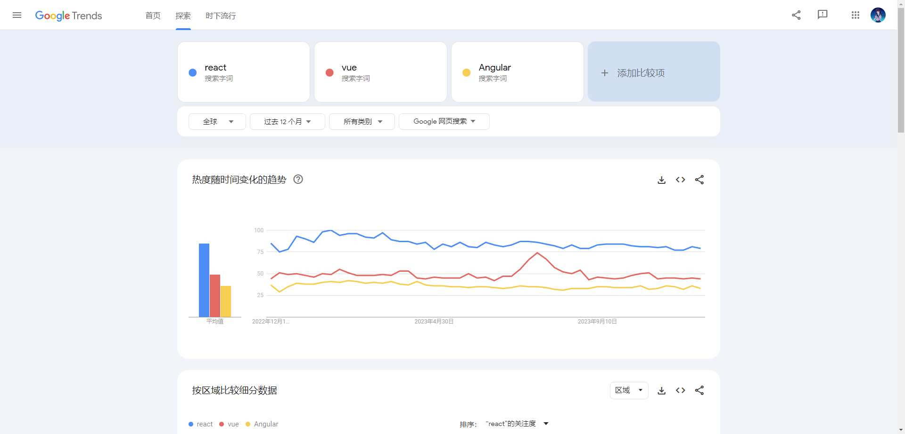

## 1.3 React 的技术特点

* ① React 是由前 Facebook（现 Meta）公司来更新和维护的，它是`大量优秀程序员`的`思想结晶`。
* ② React 的流行不仅仅局限于`普通开发工程师`对它的认可，大量的`其它框架`也`借鉴`了 React 的思想。
  * Vue.js 框架在设计之初，也借鉴和学习了 React，如：React 的 Hooks （Vue 3.x 的 Composition API）。
* ③ React 是`前端的先驱者`，它总是会`引领`整个前端的`潮流`。


# 第二章：React 入门

## 2.1 React 的介绍

### 2.1.1 概述

* React 是用于构建 `Web` 和`原生交互界面`的`库`

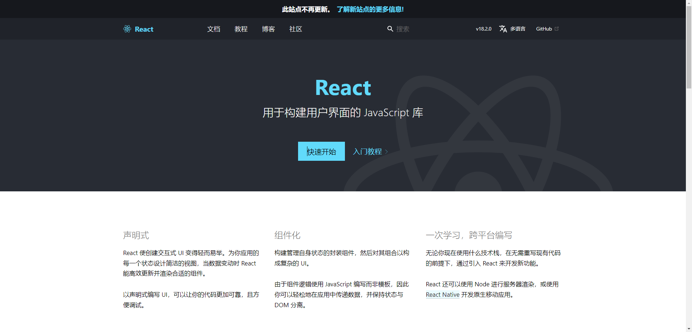

### 2.1.2 React 的特点

* ① 声明式编程：
  * 目前，整个大前端的`最流行开发模式`是`声明式编程`，如：Vue、React、Flutter 等。
  * 声明式编程允许`我们只维护自己的状态`，`当状态改变的时候`，`React 会根据最新的状态去重新渲染我们的 UI 界面`。


* ② 组件化开发：
  * `组件化开发`是目前前端的`流行趋势`，我们可以将复杂的界面拆分为一个个小的组件。

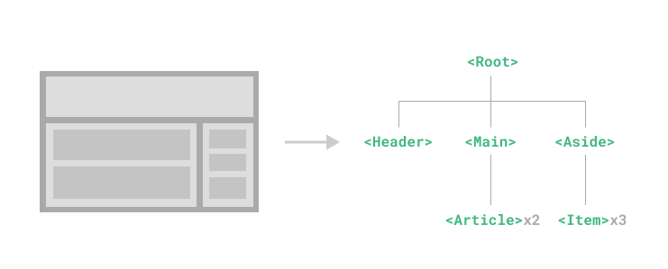

* ③ 多平台适配：
  * 2013 年，React 发布之初主要是`开发 WEB 页面`。
  * 2015 年，Facebook 推出了 `ReactNative`，用于`开发移动端跨平台`。
  * 2017 年，Facebook 推出了 `ReactVR`，用于`开发虚拟现实 WEB 应用程序`。
  * ……

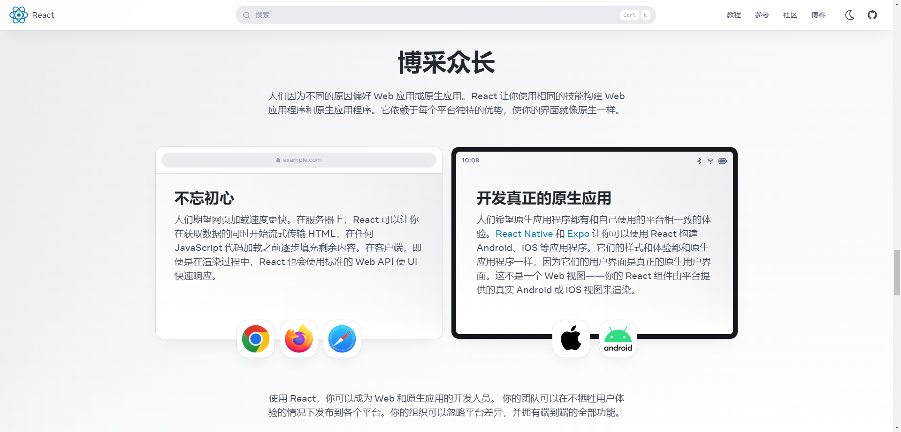

## 2.2 React 入门（⭐）

### 2.2.1 React 的开发依赖

* React 开发需要依赖三个库：
  * react：包含 React 所必须得核心代码。
  * react-dom：React 渲染到不同平台所需要的核心代码。
  * babel：将 jsx 转换为 React 代码的工具。

* 我们可以在 bootcdn 中搜索：

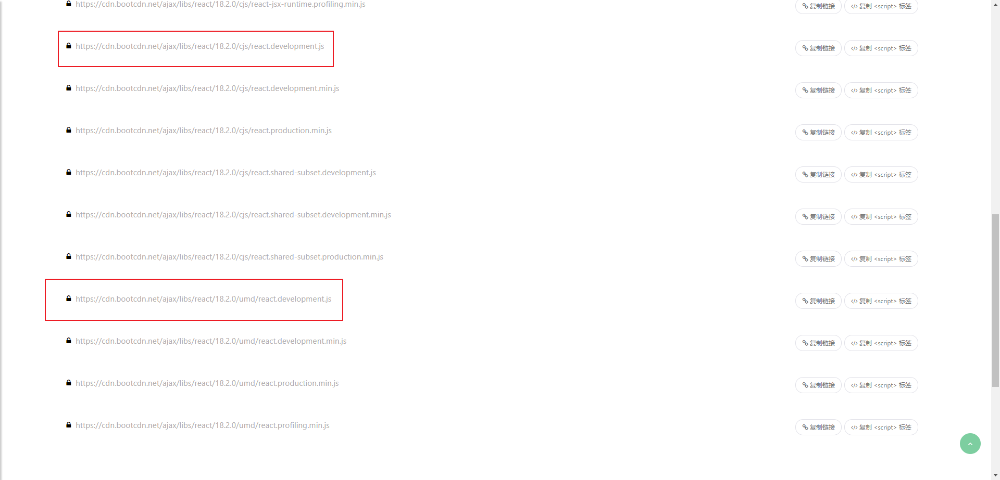

> 注意⚠️：
>
> * 我们会发现有 umd 和 cjs 的版本。
> * 其中，umd 全称是 Universal Module Definition，可以在前端和后端通用。
> * 其中，cjs 全称 CommonJS ，不能在浏览器中运行，通常会在 Node.js 中运行。
> * ~~其中，amd 的全称是 Asynchronous Module Definition，已经被淘汰~~。
> * 其中，esm 的全称是 ES Modules，可以在很多现代浏览器中使用；但是，一般配合打包工具，如：webpack、vite 等使用，以便在所有浏览器都能使用。


* 示例：

```html {9-14}
<!DOCTYPE html>
<html lang='en'>
<head>
  <meta charset='UTF-8'>
  <title>Title</title>
</head>
<body>

  <!-- react：React 的核心 -->
  <script crossorigin src="https://cdn.bootcdn.net/ajax/libs/react/18.2.0/umd/react.development.js"></script>
  <!-- React-DOM：React 渲染在不同平台上所需要的核心代码 -->
  <script crossorigin src="https://cdn.bootcdn.net/ajax/libs/react-dom/18.2.0/umd/react-dom.development.js"></script>
  <!-- babel：将 jsx 转换为 React 代码的工具 -->
  <script crossorigin src="https://cdn.bootcdn.net/ajax/libs/babel-standalone/7.22.17/babel.js"></script>

</body>
</html>
```

### 2.2.2 React 入门

* 需求：在页面中展示 `"Hello React"` 。


* 示例：

```html {6-11,16,18-26}
<!DOCTYPE html>
<html lang='en'>
<head>
  <meta charset='UTF-8'>
  <title>Title</title>
  <!-- react：React 的核心 -->
  <script crossorigin src="https://cdn.bootcdn.net/ajax/libs/react/18.2.0/umd/react.development.js"></script>
  <!-- React-DOM：React 渲染在不同平台上所需要的核心代码 -->
  <script crossorigin src="https://cdn.bootcdn.net/ajax/libs/react-dom/18.2.0/umd/react-dom.development.js"></script>
  <!-- babel：将 jsx 转换为 React 代码的工具 -->
  <script crossorigin src="https://cdn.bootcdn.net/ajax/libs/babel-standalone/7.22.17/babel.js"></script>
</head>
<body>

  <!-- 准备一个容器 -->
  <div class="root"></div>
 
  <script type="text/babel">
    // 创建一个虚拟 DOM
    const vDOM = (
        <h1>Hello React</h1>
    )
    // React 18之后，创建 React 根元素
    const root = ReactDOM.createRoot(document.querySelector('.root'))
    root.render(vDOM)
  </script>

</body>
</html>
```

### 2.2.3 注意点

* ① `script` 元素的 `type` 属性必须是 `text/babel`，即告诉浏览器此处让 babel 解析 jsx 的语法。
* ② `ReactDOM.createRoot(xxx)`的作用是创建一个 React 根元素，然后将虚拟 DOM 渲染到这个根元素之中。其中，参数 `xxx` 就是要挂在到哪一个 HTML 元素上。
* ③ `root.render(xxx)` 是用来渲染组件（虚拟 DOM ）的。
* ④ 在 React 18 之前的语法是：`ReactDOM.render(vDOM, document.querySelector('.root'))`；不过，现在该 API 已经过时。
* ⑤ 我们可以使用 `{}` 在 jsx 中引入外部的变量或表达式。

```html {24}
<!DOCTYPE html>
<html lang='en'>
<head>
  <meta charset='UTF-8'>
  <title>Title</title>
  <!-- react：React 的核心 -->
  <script crossorigin src="https://cdn.bootcdn.net/ajax/libs/react/18.2.0/umd/react.development.js"></script>
  <!-- React-DOM：React 渲染在不同平台上所需要的核心代码 -->
  <script crossorigin src="https://cdn.bootcdn.net/ajax/libs/react-dom/18.2.0/umd/react-dom.development.js"></script>
  <!-- babel：将 jsx 转换为 React 代码的工具 -->
  <script crossorigin src="https://cdn.bootcdn.net/ajax/libs/babel-standalone/7.22.17/babel.js"></script>
</head>
<body>

  <!-- 准备一个容器 -->
  <div class="root"></div>

  <script type="text/babel">
    // 创建一个虚拟 DOM
    let message = "你好，React"
    const vDOM = (
        <h1>
          {/* 可以使用 {} 来外部的变量或表达式 */ }
          {message}
        </h1>
    )
    // React 18之后，创建 React 根元素 
    const root = ReactDOM.createRoot(document.querySelector('.root'))
    root.render(vDOM)
  </script>

</body>
</html>
```

* ⑥ React 18 之后，为什么要 `ReactDOM.createRoot(document.querySelector('.root'))` 这样创建根元素？是因为，React 18 之后可以创建多个根元素：

```jsx {2,4}
const root = ReactDOM.createRoot(document.querySelector('.root'))
root.render(vDOM)
const app = ReactDOM.createRoot(document.querySelector('.app'))
app.render(vDOM)
```

## 2.3 组件化开发（⭐）

### 2.3.1 引入

* 需求：在页面中，通过点击按钮切换展示的文本。

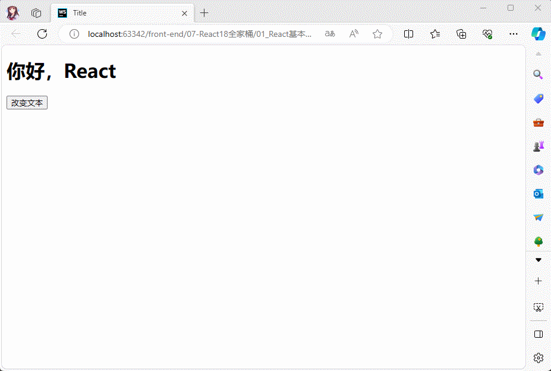


* 示例：

```html {22,24-29,32,34-48}
<!DOCTYPE html>
<html lang='en'>
<head>
  <meta charset='UTF-8'>
  <title>Title</title>
  <!-- react：React 的核心 -->
  <script src='./js/react18.development.js'></script>
  <!-- React-DOM：React 渲染在不同平台上所需要的核心代码 -->
  <script src='./js/react-dom18.development.js'></script>
  <!-- babel：将 jsx 转换为 React 代码的工具 -->
  <script src='./js/babel.js'></script>
</head>
<body>

  <!-- 准备一个容器 -->
  <div class='app'></div>

  <script type='text/babel'>
    // 创建根元素
    const app = ReactDOM.createRoot(document.querySelector('.app'))
    // 定义变量
    let message = '你好，React'
    // 定义方法
    const change = () => {
      // 修改数据
      message = '你好，React18'
      // 重新渲染页面
      appRender()
    }

    // 渲染页面
    appRender()

    function appRender() {
      // 创建一个虚拟 DOM
      const vDOM = (
          <div>
            <h1>{message}</h1>
            { /* 注意：
              ① 在 React 中，事件的名称是以 onXxx() 的形式，小驼峰的命名规则
              ② onClick 中传入的是函数的名称，如：change，而不是 change() ；否则，当点击的时候，就会没有效果，因为 change() 返回的是 undefined
            */ }
            <button onClick={change}>改变文本</button>
          </div>
      )
      // 将虚拟 DOM 渲染到页面上
      app.render(vDOM)
    }

  </script>

</body>
</html>
```

### 2.3.2 问题分析

* 上述的代码虽然能解决问题，但是却产生了如下的问题：
  * ① 我们需要手动封装渲染页面的函数，在初次渲染的时候就调用该函数；当我们更改完数据之后，还需要手动调用该函数；难道每次修改完数据，都需要手动调用该函数，React 也太不智能了吧（这是所谓的声明式编程？）。
  * ② 代码过于分散，如果开发过 Vue3.x 的都知道，Vue 会将代码封装到 `.vue` 文件中；那么，React 应该也提供类似的功能，而上述代码的实现却没能很好的体现程序设计的内聚性。
  * ③ 我们也知道`root.render(xxx)` 不仅可以用来渲染 DOM ，也可以用来渲染组件的；其中，`xxx` 既可以是`虚拟 DOM` ，也可以是`组件`。
  * ④ ……

* 那么，怎么解决？

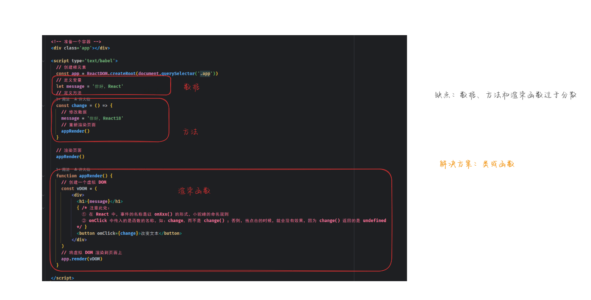

> 注意⚠️：React 中支持`类组件`和`函数式组件`，我们以`类组件`为`切入点`讲解，`函数式组件`后面再讲解。。

### 2.3.3 React 中的类组件

* 定义：
  * ① 定义一个类，继承自 React.Component 类，类名必须采用大驼峰的原则，
  * ② 自定义的类需要重写 render() 方法，该方法中返回虚拟 DOM（其实，就是 jsx）。
  * ③ 在 `root.render(xxx)` 方法中，传入 `<类/>`。


* 示例：

```html {16,20-33}
<!DOCTYPE html>
<html lang='en'>
<head>
  <meta charset='UTF-8'>
  <title>Title</title>
  <!-- react：React 的核心 -->
  <script src='./js/react18.development.js'></script>
  <!-- React-DOM：React 渲染在不同平台上所需要的核心代码 -->
  <script src='./js/react-dom18.development.js'></script>
  <!-- babel：将 jsx 转换为 React 代码的工具 -->
  <script src='./js/babel.js'></script>
</head>
<body>

  <!-- 准备一个容器 -->
  <div class='app'></div>

  <script type='text/babel'>
    // 创建一个组件
    class App extends React.Component {

      // 渲染内容 render 方法
      render() {
        return (
            <h2>Hello React</h2>
        )
      }
    }

    // 创建根元素
    const app = ReactDOM.createRoot(document.querySelector('.app'))
    // 渲染组件
    app.render(<App/>)
  </script>

</body>
</html>
```

### 2.3.4 React 中的数据依赖

* 我们知道，在 Vue 3.x 中的 Options API 中，我们是将数据封装到 `data(){}` 配置中的；那么，在 React 中写到哪里？
* 如何让一个类组件的实例获取到实例的数据，有很多实现方式；其中，最简单的就是在构造器中定义了。
* 同时，定义在组件中的数据，我们会分为两类：
  * ① `参与界面更新的数据`：当数据发生变化的时候，需要更新组件渲染的内容。
  * ② `不参与界面更新的数据`：当数据发生变化的时候，不需要更新组件渲染的内容。
* 所以，参与界面更新的数据，就需要定义在构造器中，并且定义在当前对象的 `state` 属性中；而且，当数据发生变化的时候，我们不是通过修改 `this.state` 属性的值，而是通过 `this.setState()` 方法来更新数据，以便通知 React 来重新渲染页面。


* 示例：

```html {25-27,35-37,45-46}
<!DOCTYPE html>
<html lang='en'>
<head>
  <meta charset='UTF-8'>
  <title>Title</title>
  <!-- react：React 的核心 -->
  <script src='./js/react18.development.js'></script>
  <!-- React-DOM：React 渲染在不同平台上所需要的核心代码 -->
  <script src='./js/react-dom18.development.js'></script>
  <!-- babel：将 jsx 转换为 React 代码的工具 -->
  <script src='./js/babel.js'></script>
</head>
<body>

  <!-- 准备一个容器 -->
  <div class='app'></div>

  <script type='text/babel'>
    // 创建一个组件
    class App extends React.Component {
      // 组件数据
      constructor() {
        super()
        // 参与界面更新的数据，需要写在 this.state 中
        this.state = {
          isHot: false
        }
      }

      // 组件方法
      change() {
        // 内部完成了两件事情
        // ① 将 state 中的 isHot 修改了
        // ② 自动重新执行 render 函数
        this.setState({
          isHot: !this.state.isHot
        })
      }

      // 渲染内容 render 方法
      render() {
        const {isHot} = this.state
        return (
            <div>
              <h2>{'今天天气很' + (isHot ? '炎热' : '凉爽')}</h2>
              <button onClick={this.change}>改变内容</button>
            </div>
        )
      }
    }

    // 创建根元素
    const app = ReactDOM.createRoot(document.querySelector('.app'))
    // 渲染组件
    app.render(<App/>)
  </script>

</body>
</html>
```

### 2.3.5 this 绑定问题的解决

* 当我们运行上述的程序，会发生 `this` 是 `undefined` 。

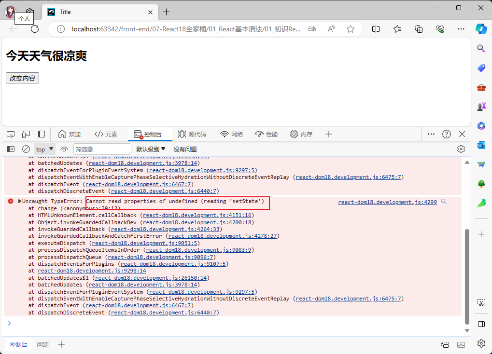

* 官方是如何解决的？

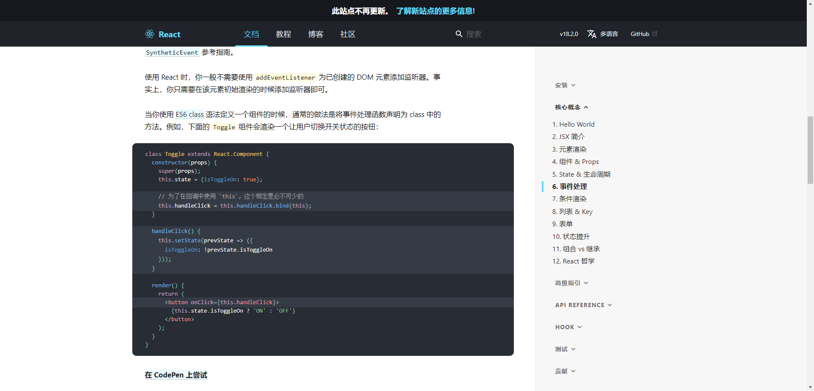

* 那么，我们可以修改下程序：

```html {28,42-44}
<!DOCTYPE html>
<html lang='en'>
<head>
  <meta charset='UTF-8'>
  <title>Title</title>
  <!-- react：React 的核心 -->
  <script src='./js/react18.development.js'></script>
  <!-- React-DOM：React 渲染在不同平台上所需要的核心代码 -->
  <script src='./js/react-dom18.development.js'></script>
  <!-- babel：将 jsx 转换为 React 代码的工具 -->
  <script src='./js/babel.js'></script>
</head>
<body>

  <!-- 准备一个容器 -->
  <div class='app'></div>

  <script type='text/babel'>
    // 创建一个组件
    class App extends React.Component {
      // 组件数据
      constructor() {
        super()
        this.state = {
          isHot: false
        }
        // 绑定 this
        this.change = this.change.bind(this)
      }

      change() {
        this.setState({
          isHot: !this.state.isHot
        })
      }

      render() {
        const {isHot} = this.state
        return (
            <div>
              <h2>{'今天天气很' + (isHot ? '炎热' : '凉爽')}</h2>
              { /* 注意：此处不能是 this.change() ,因为我们需要传递函数地址给 React，让其帮我们调用 */ }
              { /* 注意：如果写成 this.change() ,就是手动调用方法，然后方法返回 undefined，是错误写法！ */ }
              <button onClick={this.change}>改变内容</button>
            </div>
        )
      }
    }

    // 创建根元素
    const app = ReactDOM.createRoot(document.querySelector('.app'))
    // 渲染组件
    app.render(<App/>)
  </script>

</body>
</html>
```

* 再次查看浏览器：

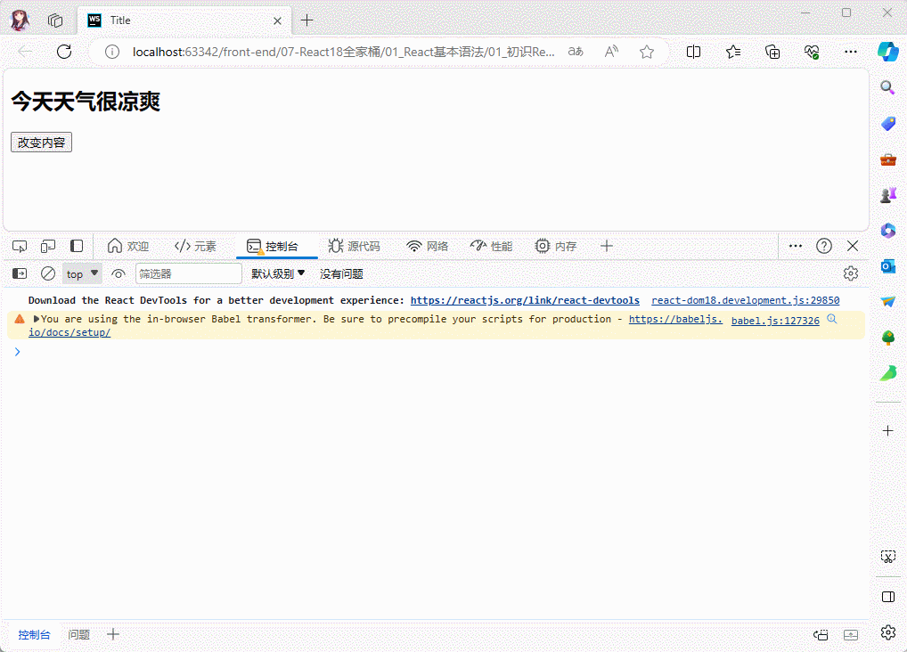

* 为什么要这么写？我们可以通过如下的代码，来模拟一下：

```html {25-26}
<!DOCTYPE html>
<html lang='en'>
<head>
  <meta charset='UTF-8'>
  <title>Title</title>
</head>
<body>

  <!-- 准备一个容器 -->
  <div class='app'></div>

  <script>
    // 创建一个组件
    class App  {
      constructor() {
        this.message = "Hello World"
      }

      change(){
        this.message = "Hello React"
        console.log(this,this.message)
      }
    }

    const app = new App()
    app.change()

  </script>

</body>
</html>
```

* 运行如下：

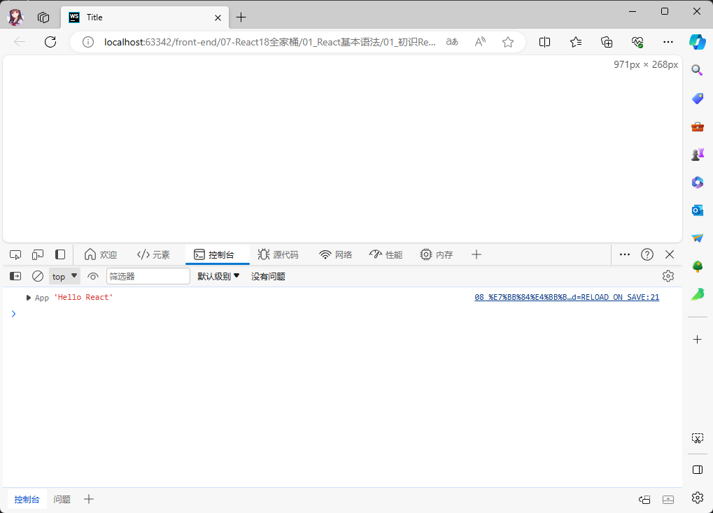

* 如果，我们将代码修改一下：

```html {25,27,29}
<!DOCTYPE html>
<html lang='en'>
<head>
  <meta charset='UTF-8'>
  <title>Title</title>
</head>
<body>

  <!-- 准备一个容器 -->
  <div class='app'></div>

  <script>
    // 创建一个组件
    class App  {
      constructor() {
        this.message = "Hello World"
      }

      change(){
        this.message = "Hello React"
        console.log(this,this.message)
      }
    }

    const app = new App()

    const abc = app.change

    abc()

  </script>

</body>
</html>
```

* 此时，结果如下所示：

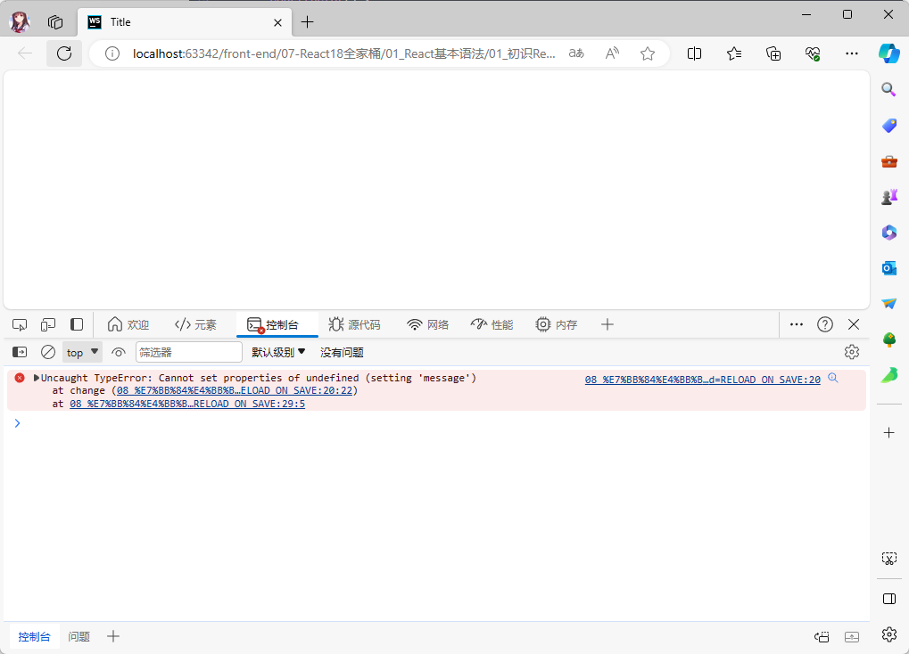

* 分析：代码之所以报错，是因为 this 的隐式绑定。当运行 `const app = new App()`的时候，`change()` 方法的 this 确实是 `app` 对象；但是，当运行`const abc = app.change; abc()` 这段代码的时候，`change()` 方法的 this 已经是 `window` 对象。又因为我们使用的是类，浏览器会开启严格模式，所以 `change()` 方法的 this 已经是 `undefined` 对象，此时 `undefined.message` 当然会报错了。

* 我们可以通过 bind 来显示改变 this 的指向，并且 bind 的定义是这样的：

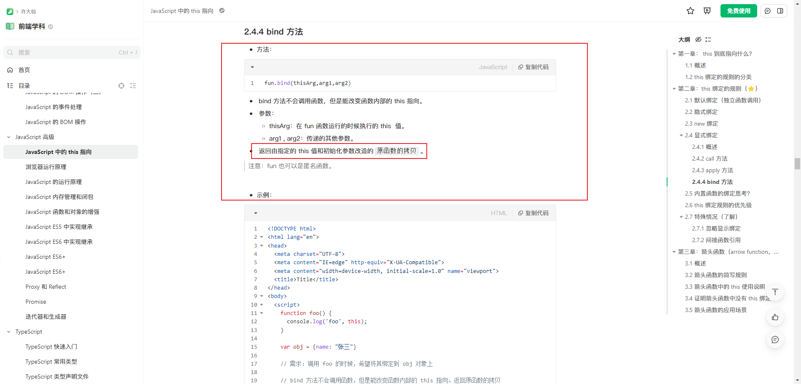

* 修改下代码：

```html {30}
<!DOCTYPE html>
<html lang='en'>
<head>
  <meta charset='UTF-8'>
  <title>Title</title>
</head>
<body>

  <!-- 准备一个容器 -->
  <div class='app'></div>

  <script>
    // 创建一个组件
    class App  {
      constructor() {
        this.message = "Hello World"
      }

      change(){
        this.message = "Hello React"
        console.log(this,this.message)
      }
    }

    const app = new App()

    let abc = app.change
    
    // 通过 bind 来显示改变 this 的指向
    abc = abc.bind(app)

    abc()

  </script>

</body>
</html>
```

* 运行一下，查看结果：

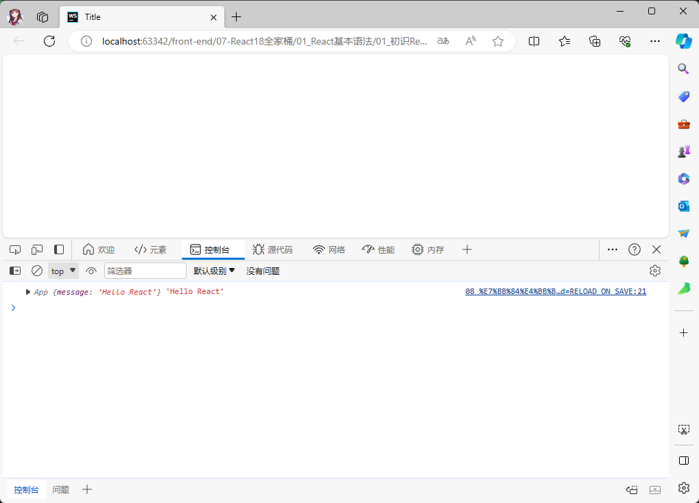

* 此时，我们再来分析一下 React 中的代码：

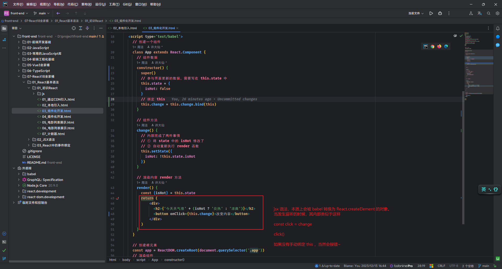

* 当然，你也可以这么写，原理是一样的：

```html {47}
<!DOCTYPE html>
<html lang='en'>
<head>
  <meta charset='UTF-8'>
  <title>Title</title>
  <!-- react：React 的核心 -->
  <script src='./js/react18.development.js'></script>
  <!-- React-DOM：React 渲染在不同平台上所需要的核心代码 -->
  <script src='./js/react-dom18.development.js'></script>
  <!-- babel：将 jsx 转换为 React 代码的工具 -->
  <script src='./js/babel.js'></script>
</head>
<body>

  <!-- 准备一个容器 -->
  <div class='app'></div>

  <script type='text/babel'>
    // 创建一个组件
    class App extends React.Component {
      // 组件数据
      constructor() {
        super()
        // 参与界面更新的数据，需要写在 this.state 中
        this.state = {
          isHot: false
        }
      }

      // 组件方法
      change() {
        // 内部完成了两件事情
        // ① 将 state 中的 isHot 修改了
        // ② 自动重新执行 render 函数
        this.setState({
          isHot: !this.state.isHot
        })
      }

      // 渲染内容 render 方法
      render() {
        const {isHot} = this.state
        return (
            <div>
              <h2>{'今天天气很' + (isHot ? '炎热' : '凉爽')}</h2>
              { /* 注意：此处需要手动绑定 this  */ }
              <button onClick={this.change.bind(this)}>改变内容</button>
            </div>
        )
      }
    }

    // 创建根元素
    const app = ReactDOM.createRoot(document.querySelector('.app'))
    // 渲染组件
    app.render(<App/>)
  </script>

</body>
</html>
```

## 2.4 React 案例（⭐）

### 2.4.1 数组列表案例

* 需求：需要将数组中的元素渲染到页面上。

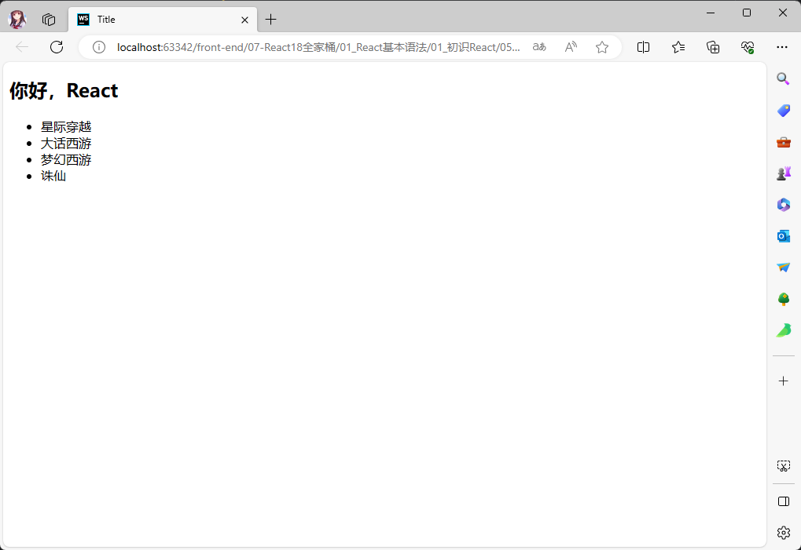

> 注意⚠️：
>
> * 在 React 中，没有 Vue 的差值语法；React 中的 jsx 语法很简单，都是 `{}` 。
> * React 中 `{}` 可以插入数组，会自动遍历数组中的元素并渲染到页面上；但是，不支持对象。


* 示例：实现方式一（通过数组的索引，不推荐）

```html {40-43}
<!DOCTYPE html>
<html lang='en'>
<head>
  <meta charset='UTF-8'>
  <title>Title</title>
  <!-- react：React 的核心 -->
  <script src='./js/react18.development.js'></script>
  <!-- React-DOM：React 渲染在不同平台上所需要的核心代码 -->
  <script src='./js/react-dom18.development.js'></script>
  <!-- babel：将 jsx 转换为 React 代码的工具 -->
  <script src='./js/babel.js'></script>
</head>
<body>

  <!-- 准备一个容器 -->
  <div class='app'></div>

  <script type='text/babel'>
    // 创建一个组件
    class App extends React.Component {

      constructor() {
        super();
        // 组件数据
        this.state = {
          message: '你好，React',
          movies: ['星际穿越', '大话西游', '梦幻西游', '诛仙']
        }
      }

      // 渲染内容 render 方法
      render() {
        const {message, movies} = this.state       

        return (
            <div>
              <h2>{message}</h2>
              <ul>
                {/* 通过数组的索引来实现，不推荐 */}
                <li>{this.state.movies[0]}</li>
                <li>{this.state.movies[1]}</li>
                <li>{this.state.movies[2]}</li>
                <li>{this.state.movies[3]}</li>
              </ul>
            </div>
        )
      }
    }

    // 创建根元素
    const app = ReactDOM.createRoot(document.querySelector('.app'))
    // 渲染组件
    app.render(<App/>)
  </script>

</body>
</html>
```


* 示例：实现方式二（通过手动拼接数组）

```html {36-39,46}
<!DOCTYPE html>
<html lang='en'>
<head>
  <meta charset='UTF-8'>
  <title>Title</title>
  <!-- react：React 的核心 -->
  <script src='./js/react18.development.js'></script>
  <!-- React-DOM：React 渲染在不同平台上所需要的核心代码 -->
  <script src='./js/react-dom18.development.js'></script>
  <!-- babel：将 jsx 转换为 React 代码的工具 -->
  <script src='./js/babel.js'></script>
</head>
<body>

  <!-- 准备一个容器 -->
  <div class='app'></div>

  <script type='text/babel'>
    // 创建一个组件
    class App extends React.Component {

      constructor() {
        super();
        // 组件数据
        this.state = {
          message: '你好，React',
          movies: ['星际穿越', '大话西游', '梦幻西游', '诛仙']
        }
      }

      // 渲染内容 render 方法
      render() {
        const {message, movies} = this.state

        // 通过手动拼接数组
        let liEls = [];
        movies.forEach((item, index) => {
          liEls.push(<li key={index}>{item}</li>)
        })

        return (
            <div>
              <h2>{message}</h2>
              <ul>
                {/* jsx 中的 {} 支持放入数组，jsx 会自动遍历数组，并将数组中的元素渲染到页面上；但是，不支持对象。 */}
                {liEls}
              </ul>
            </div>
        )
      }
    }

    // 创建根元素
    const app = ReactDOM.createRoot(document.querySelector('.app'))
    // 渲染组件
    app.render(<App/>)
  </script>

</body>
</html>
```


* 示例：实现方式三（通过数组的 map 方法，用于对数组中的每个元素进行操作，并返回一个新的数组）

```html {41-43}
<!DOCTYPE html>
<html lang='en'>
<head>
  <meta charset='UTF-8'>
  <title>Title</title>
  <!-- react：React 的核心 -->
  <script src='./js/react18.development.js'></script>
  <!-- React-DOM：React 渲染在不同平台上所需要的核心代码 -->
  <script src='./js/react-dom18.development.js'></script>
  <!-- babel：将 jsx 转换为 React 代码的工具 -->
  <script src='./js/babel.js'></script>
</head>
<body>

  <!-- 准备一个容器 -->
  <div class='app'></div>

  <script type='text/babel'>
    // 创建一个组件
    class App extends React.Component {

      constructor() {
        super();
        // 组件数据
        this.state = {
          message: '你好，React',
          movies: ['星际穿越', '大话西游', '梦幻西游', '诛仙']
        }
      }

      // 渲染内容 render 方法
      render() {
        const {message, movies} = this.state

        return (
            <div>
              <h2>{message}</h2>
              <ul>
                {/* jsx 中的 {} 支持放入数组，jsx 会自动遍历数组，并将数组中的元素渲染到页面上；但是，不支持对象。*/}
                {/* 可以通过数组的 map 方法实现。*/}
                {
                  movies.map((item,index) => <li key={index}>{item}</li>)
                }
              </ul>
            </div>
        )
      }
    }

    // 创建根元素
    const app = ReactDOM.createRoot(document.querySelector('.app'))
    // 渲染组件
    app.render(<App/>)
  </script>

</body>
</html>
```

### 2.4.2 计数器案例

* 需求：对计数进行 `+1` 或 `-1` 操作。

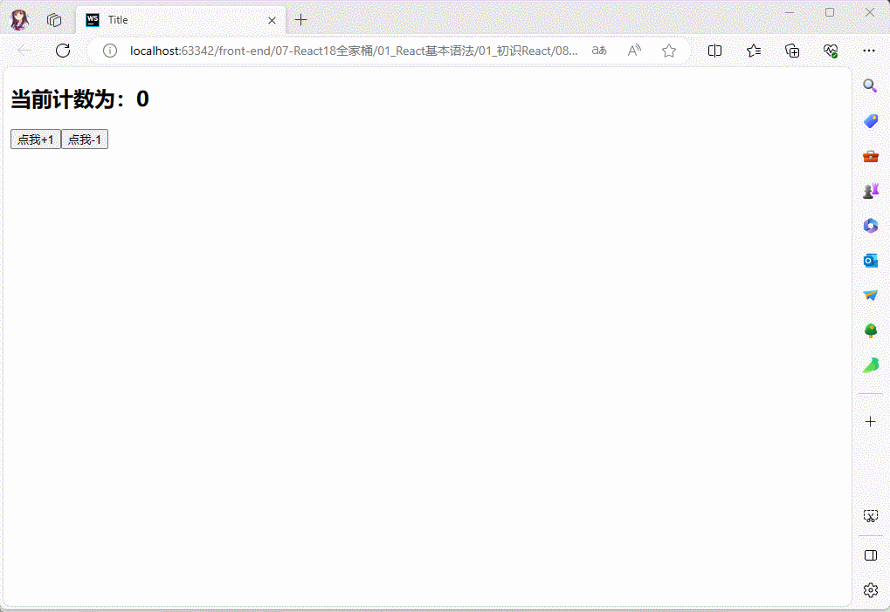


* 示例：

```html {25,27,32-34,39-41,51,52}
<!DOCTYPE html>
<html lang='en'>
<head>
  <meta charset='UTF-8'>
  <title>Title</title>
  <!-- react：React 的核心 -->
  <script src='./js/react18.development.js'></script>
  <!-- React-DOM：React 渲染在不同平台上所需要的核心代码 -->
  <script src='./js/react-dom18.development.js'></script>
  <!-- babel：将 jsx 转换为 React 代码的工具 -->
  <script src='./js/babel.js'></script>
</head>
<body>

  <!-- 准备一个容器 -->
  <div class='app'></div>

  <script type='text/babel'>
    // 创建一个组件
    class App extends React.Component {

      constructor() {
        super();
        // 组件数据
        this.state = {
          count: 0
        }
      }

      increment() {
        const {count} = this.state
        this.setState({
          count: count + 1
        })
      }

      decrement() {
        const {count} = this.state
        this.setState({
          count: count - 1
        })
      }

      // 渲染内容 render 方法
      render() {
        const {count} = this.state

        return (
            <div>
              <h2>当前计数为：{count}</h2>
              <button onClick={this.increment.bind(this)}>点我+1</button>
              <button onClick={this.decrement.bind(this)}>点我-1</button>
            </div>
        )
      }
    }

    // 创建根元素
    const app = ReactDOM.createRoot(document.querySelector('.app'))
    // 渲染组件
    app.render(<App/>)
  </script>

</body>
</html>
```


# 第三章：JSX 语法

## 3.1 初识 JSX 语法（⭐）

* 像下面的一段代码：

```jsx
const element = <h1>Hello, world!</h1>
```

* 这个有趣的标签语法既`不是字符串`也`不是 HTML` ；如果，我们将 `script` 元素的 `type='text/babel'` 属性去掉，就会报错，因为浏览器压根不认识。
* 其实，这就是 `JSX` （`J`ava`S`cript e`X`tension），是一种 `JavaScript` 的语法扩展；也有人称其是 `JavaScript XML`，因为看起来就像 `XML` 语法。
* 在 React 开发中，建议配合使用 JSX ，因为其可以很好地描述 UI 应该呈现出它应有交互的本质形式。
* JSX 不同于 Vue 中的模板语法；因此，我们不再需要专门学习模板语法中的各种指令，如：`v-if`、`v-else`、`v-for` 等。
* `JSX 拥有 JavaScript 的一切功能！！！`

## 3.2 为什么 React 选择了 JSX ？（⭐）

* React 认为`渲染逻辑`本质上与`其他 UI 逻辑`存在内在耦合，如：
  * 在 UI 中需要绑定处理事件。
  * 在某些时刻状态发生变化时需要通知到 UI。
  * 需要在 UI 中展示准备好的数据。
* React 并没有采用将`标记与逻辑分离到不同文件`这种人为的分离方式，而是通过将二者共同存放在称之为`组件`的松散耦合单元之中，来实现`关注点分离`。

> 维基百科的定义：
>
> * 在[计算机科学](https://zh.wikipedia.org/wiki/計算機科學)中，**关注点分离**（Separation of concerns，SoC），是将计算机程序分隔为不同部分的设计原则。每一部分会有各自的关注焦点。关注焦点是影响计算机程式程式码的一组资讯。关注焦点可以像是将程式码优化过的硬件细节一般，或者像实例化类别的名称一样具体。展现关注点分离设计的程序被称为[模组化](https://zh.wikipedia.org/wiki/模块化编程)程序[[1\]](https://zh.wikipedia.org/wiki/关注点分离#cite_note-laplante-1)。模组化程度，也就是区分关注焦点，通过将资讯[封装](https://zh.wikipedia.org/wiki/封裝_(物件導向程式設計))在具有明确界面的程序代码段落中。封装是一种[资讯隐藏](https://zh.wikipedia.org/wiki/資訊隱藏_(電腦科學))手段[[2\]](https://zh.wikipedia.org/wiki/关注点分离#cite_note-mitchell-2)。资讯系统中的分层设计是关注点分离的另一个实施例（例如，表示层，业务逻辑层，数据访问层，持久数据层）[[3\]](https://zh.wikipedia.org/wiki/关注点分离#cite_note-microsoft-3)。
> * 关注点分离，是对只与“特定概念、目标”（[关注点](https://zh.wikipedia.org/w/index.php?title=關注點&action=edit&redlink=1)）相关联的[软件](https://zh.wikipedia.org/wiki/软件)组成部分进行“标识、[封装](https://zh.wikipedia.org/wiki/封裝_(物件導向程式設計))和操纵”的能力，即标识、封装和操纵关注点的能力。是处理复杂性的一个原则。由于关注点混杂在一起会导致复杂性大大增加，所以能够把不同的关注点分离开来，分别处理就是处理复杂性的一个原则，一种方法。分离关注点使得解决特定领域问题的程式码从业务逻辑中独立出来，业务逻辑的程式码中不再含有针对特定领域问题程式码的调用（将针对特定领域问题程式码抽象化成较少的程式码，例如将程式码封装成function或是class），业务逻辑同特定领域问题的关系通过侧面来封装、维护，这样原本分散在整个[应用程序](https://zh.wikipedia.org/wiki/应用程序)中的变动就可以很好的管理起来。
> * 关注点分离的价值在于简化计算机程序的开发和维护。当关注点分开时，各部分可以重复使用，以及独立开发和更新。具有特殊价值的是能够稍后改进或修改一段代码，而无需知道其他部分的细节必须对这些部分进行相应的更改。

* React`不强制要求`使用 JSX，但是大多数人发现，在 JavaScript 代码中将 JSX 和 UI 放在一起时，会在视觉上有辅助作用。
* `JSX` 还可以使 React `显示`更多`有用`的错误和警告消息。

## 3.3 JSX 的基本使用（⭐）

### 3.3.1 JSX 的基本语法

* JSX 的基本语法：
  * ① JSX 中`只能`有`一个`根元素，除非使用 `Fragment` 标签包裹。
  * ② 为了方便阅读，我们通常会在 JSX 的外层包裹一个 `()`。
  * ③ 在 JSX 中，`标签`可以是`单标签`，也可以是`双标签`；但是，如果是单标签，必须以 `<标签 />` 结尾（这点，很像 XML 语法）。

> 注意⚠️：JSX 是在`类式组件`中 `render()` 方法的 `return`  后面书写，`函数式组件`且听后文讲解。


* 示例：

```html {36}
<!DOCTYPE html>
<html lang='en'>
<head>
  <meta charset='UTF-8'>
  <title>Title</title>
  <!-- react：React 的核心 -->
  <script src='./js/react18.development.js'></script>
  <!-- React-DOM：React 渲染在不同平台上所需要的核心代码 -->
  <script src='./js/react-dom18.development.js'></script>
  <!-- babel：将 jsx 转换为 React 代码的工具 -->
  <script src='./js/babel.js'></script>
</head>
<body>

  <!-- 准备一个容器 -->
  <div class='app'></div>

  <script type='text/babel'>
    // 创建根元素
    const app = ReactDOM.createRoot(document.querySelector('.app'))

    // 创建一个组件
    class App extends React.Component {
      // 组件数据
      state = {
        message : '你好，React'
      }

      // 渲染内容 render 方法
      /* ① jsx 中顶层只能有一个根元素，除非使用 Fragment 标签包裹 */
      /* ② 为了方便阅读，我们通常会在 jsx 的外层包裹一个 () */
      /* ③ jsx 中的标签可以单标签，也可以是双标签；但是，如果是单标签，必须以 <标签 /> 结尾 */
      render() {
        return (
          <div>
            {this.state.message}
          </div>
        )
      }
    }

    // 渲染组件
    app.render(<App />)
  </script>

</body>
</html>
```

### 3.3.2 JSX 语法中的注释

* JSX 语法中的注释只有一种，就是 `{ /* 我是注释内容 */ }`。


* 示例：

```html {33}
<!DOCTYPE html>
<html lang='en'>
<head>
  <meta charset='UTF-8'>
  <title>Title</title>
  <!-- react：React 的核心 -->
  <script src='./js/react18.development.js'></script>
  <!-- React-DOM：React 渲染在不同平台上所需要的核心代码 -->
  <script src='./js/react-dom18.development.js'></script>
  <!-- babel：将 jsx 转换为 React 代码的工具 -->
  <script src='./js/babel.js'></script>
</head>
<body>

  <!-- 准备一个容器 -->
  <div class='app'></div>

  <script type='text/babel'>
    // 创建根元素
    const app = ReactDOM.createRoot(document.querySelector('.app'))

    // 创建一个组件
    class App extends React.Component {
      // 组件数据
      state = {
        message : '你好，React'
      }

      // 渲染内容 render 方法
      render() {
        return (
          <div>
            { /* 我是注释内容 */ }
            {this.state.message}
          </div>
        )
      }
    }

    // 渲染组件
    app.render(<App />)
  </script>

</body>
</html>
```

### 3.3.3 JSX 中嵌入变量作为子元素

#### 3.3.3.1 概述

* 在 Vue 中，如果是`插入文本`，需要使用`插值语法 {{}}`；如果需要插入`大段子元素`（如：`ul` 中插入大量的 `li`），需要使用 `v-for` 等指令。
* 在 React 中，可以使用 `{}` 中嵌入`变量`的方式来作为`子元素`；换言之，结合了 Vue 中的上述两种写法。


* 示例：插入变量作为文本

```html {36}
<!DOCTYPE html>
<html lang='en'>
<head>
  <meta charset='UTF-8'>
  <title>Title</title>
  <!-- react：React 的核心 -->
  <script src='./js/react18.development.js'></script>
  <!-- React-DOM：React 渲染在不同平台上所需要的核心代码 -->
  <script src='./js/react-dom18.development.js'></script>
  <!-- babel：将 jsx 转换为 React 代码的工具 -->
  <script src='./js/babel.js'></script>
</head>
<body>

  <!-- 准备一个容器 -->
  <div class='app'></div>

  <script type='text/babel'>
    // 创建根元素
    const app = ReactDOM.createRoot(document.querySelector('.app'))

    // 创建一个组件
    class App extends React.Component {
      // 组件数据
      state = {
        message: '你好，React',
      }

      // 渲染内容 render 方法
      render() {
        const { message } = this.state
        return (
          <div>
            {/* jsx 中嵌入变量作为子元素 */}
            {/* 插入变量作为文本 */}
            <h2>{message}</h2>
          </div>
        )
      }
    }

    // 渲染组件
    app.render(<App />)
  </script>

</body>
</html>
```


* 示例：插入变量作为子元素

```html {36-38}
<!DOCTYPE html>
<html lang='en'>
<head>
  <meta charset='UTF-8'>
  <title>Title</title>
  <!-- react：React 的核心 -->
  <script src='./js/react18.development.js'></script>
  <!-- React-DOM：React 渲染在不同平台上所需要的核心代码 -->
  <script src='./js/react-dom18.development.js'></script>
  <!-- babel：将 jsx 转换为 React 代码的工具 -->
  <script src='./js/babel.js'></script>
</head>
<body>

  <!-- 准备一个容器 -->
  <div class='app'></div>

  <script type='text/babel'>
    // 创建根元素
    const app = ReactDOM.createRoot(document.querySelector('.app'))

    // 创建一个组件
    class App extends React.Component {
      // 组件数据
      state = {
        movies: ['星际穿越', '大话西游', '梦幻西游', '诛仙'],
      }

      // 渲染内容 render 方法
      render() {
        const { movies } = this.state
        return (
          <div>
            {/* jsx 中嵌入变量作为子元素 */}
            <ul>
              {
                movies.map((item,index) => <li key={index}>{item}</li>)
              }
            </ul>
          </div>
        )
      }
    }

    // 渲染组件
    app.render(<App />)
  </script>

</body>
</html>
```

#### 3.3.3.2 JSX 中嵌入变量的各种情况

* 情况①：当`变量`是 `Number`、`String`、`Array` 类型的时候，可以`直接显示`；当然，Array 类型会帮助我们遍历数组中的元素并显示到界面上。
* 情况②：当`变量`是 `null`、`undefined` 、`Boolean` 的时候，`显示的内容为空`。

> 注意⚠️：如果依然希望可以显示  `null`、`undefined` 、`Boolean` ，需要转换为 `String`（实际开发中，一般不需要）。

* 情况③：当`变量`是 `Object 对象类型`的时候，会`直接报错`（not valid as a React child）。


* 示例：情况①

```html {39-43,44}
<!DOCTYPE html>
<html lang='en'>
<head>
  <meta charset='UTF-8'>
  <title>Title</title>
  <!-- react：React 的核心 -->
  <script src='./js/react18.development.js'></script>
  <!-- React-DOM：React 渲染在不同平台上所需要的核心代码 -->
  <script src='./js/react-dom18.development.js'></script>
  <!-- babel：将 jsx 转换为 React 代码的工具 -->
  <script src='./js/babel.js'></script>
</head>
<body>

  <!-- 准备一个容器 -->
  <div class='app'></div>

  <script type='text/babel'>
    // 创建根元素
    const app = ReactDOM.createRoot(document.querySelector('.app'))

    // 创建一个组件
    class App extends React.Component {
      // 组件数据
      state = {
        message: '你好，React', // 字符串
        movies: ['星际穿越', '大话西游', '梦幻西游', '诛仙'], // 数组
        name: '张三', // 字符串
        age: 18 // 数值
      }

      // 渲染内容 render 方法
      render() {
        const { name,age, message,movies } = this.state
        return (
          <div>
            {/* jsx 中嵌入变量作为子元素 */}
            <h2>{message}</h2>
            <ul>
              {
                movies.map((item,index) => <li key={index}>{item}</li>)
              }
            </ul>
            <h2>我的名字是：{name}，我的年龄是：{age}</h2>
          </div>
        )
      }
    }

    // 渲染组件
    app.render(<App />)
  </script>

</body>
</html>
```


* 示例：情况②

```html {37-40,41}
<!DOCTYPE html>
<html lang='en'>
<head>
  <meta charset='UTF-8'>
  <title>Title</title>
  <!-- react：React 的核心 -->
  <script src='./js/react18.development.js'></script>
  <!-- React-DOM：React 渲染在不同平台上所需要的核心代码 -->
  <script src='./js/react-dom18.development.js'></script>
  <!-- babel：将 jsx 转换为 React 代码的工具 -->
  <script src='./js/babel.js'></script>
</head>
<body>

  <!-- 准备一个容器 -->
  <div class='app'></div>

  <script type='text/babel'>
    // 创建根元素
    const app = ReactDOM.createRoot(document.querySelector('.app'))

    // 创建一个组件
    class App extends React.Component {
      // 组件数据
      state = {
        aaa: undefined,
        bbb: null,
        ccc: true,
      }

      // 渲染内容 render 方法
      render() {
        const { aaa,bbb, ccc } = this.state
        return (
            <div>
              {/* jsx 中嵌入变量作为子元素 */}
              <div>{aaa}</div>
              <div>{bbb}</div>
              <div>{ccc}</div>
              {/*之所以会显示，是因为转换为 String 类型；实际开发中，没有必要*/}
              <div>{ccc.toString()}</div>
            </div>
        )
      }
    }

    // 渲染组件
    app.render(<App/>)
  </script>

</body>
</html>
```


* 示例：情况③

```html {36}
<!DOCTYPE html>
<html lang='en'>
<head>
  <meta charset='UTF-8'>
  <title>Title</title>
  <!-- react：React 的核心 -->
  <script src='./js/react18.development.js'></script>
  <!-- React-DOM：React 渲染在不同平台上所需要的核心代码 -->
  <script src='./js/react-dom18.development.js'></script>
  <!-- babel：将 jsx 转换为 React 代码的工具 -->
  <script src='./js/babel.js'></script>
</head>
<body>

  <!-- 准备一个容器 -->
  <div class='app'></div>

  <script type='text/babel'>
    // 创建根元素
    const app = ReactDOM.createRoot(document.querySelector('.app'))

    // 创建一个组件
    class App extends React.Component {
      // 组件数据
      state = {
        obj: { name: '张三', age: 18 }, // 对象类型
      }

      // 渲染内容 render 方法
      render() {
        const { obj } = this.state
        return (
            <div>
              {/* jsx 中嵌入变量作为子元素 */}
              {/* 如果是对象类型，会直接报错；那么，将对象中的每个属性获取就可以了！！！ */}
              <div>{obj.name} - {obj.age}</div>
            </div>
        )
      }
    }

    // 渲染组件
    app.render(<App/>)
  </script>

</body>
</html>
```

#### 3.3.3.3 JSX 中嵌入表达式

* Vue 中的插值语法中可以嵌入表达式；React 中的 JSX 中也可以。
* React 中的 JSX 中嵌入的表达式常见的有：`运算表达式`、`三元表达式`、`执行一个函数`。


* 示例：

```html {41-41,43,45}
<!DOCTYPE html>
<html lang='en'>
<head>
  <meta charset='UTF-8'>
  <title>Title</title>
  <!-- react：React 的核心 -->
  <script src='./js/react18.development.js'></script>
  <!-- React-DOM：React 渲染在不同平台上所需要的核心代码 -->
  <script src='./js/react-dom18.development.js'></script>
  <!-- babel：将 jsx 转换为 React 代码的工具 -->
  <script src='./js/babel.js'></script>
</head>
<body>

  <!-- 准备一个容器 -->
  <div class='app'></div>

  <script type='text/babel'>
    // 创建根元素
    const app = ReactDOM.createRoot(document.querySelector('.app'))

    // 创建一个组件
    class App extends React.Component {

      state = {
        isHot: false
      }

      show(){
        return this.state.isHot
      }

      // 渲染内容 render 方法
      render() {
        const {isHot} = this.state
        return (
            <div>
              {/* jsx 中嵌入变量作为子元素 */}
              {/* 插入表达式： 运算表达式 */}
              <div>{10 + 20}</div>
              <div>{"张" + "三"}</div>
              {/* 插入表达式： 三元运算符 */}
              <div>今天天气很{isHot ? '炎热' : '凉爽'}</div>
              {/* 插入表达式： 执行一个函数 */}
              <div>{this.show().toString()}</div>
            </div>
        )
      }
    }

    // 渲染组件
    app.render(<App/>)
  </script>

</body>
</html>
```

## 3.4 JSX 绑定属性（⭐）

### 3.4.1 JSX 绑定基本属性

* 在 Vue 中，对于元素身上的基本属性是通过 `v-bind` 指令或 `:` 语法糖来实现的：

```vue {2}
<template>
	<h2 :title="title">我是h2元素</h2>
</template>

<script setup>
    import {ref} from 'vue'
	const title = ref('哈哈')
</script>
```

```vue {2}
<template>
	
</template>

<script setup>
    import {ref} from 'vue'
	const imgUrl = ref('https://mei.png')
</script>
```

```vue {2}
<template>
	<a :href="href" target='_blank'>百度一下，你就知道</a>
</template>

<script setup>
    import {ref} from 'vue'
	const href = ref('https://www.baidu.com')
</script>
```

* 在 React 中，依然是使用 `{}` 来绑定基本属性。


* 示例：

```html {27-29,38-40}
<!DOCTYPE html>
<html lang='en'>
<head>
  <meta charset='UTF-8'>
  <title>Title</title>
</head>
<body>

  <!-- 准备一个容器 -->
  <div class='app'></div>

  <!-- react：React 的核心 -->
  <script src='./js/react18.development.js'></script>
  <!-- React-DOM：React 渲染在不同平台上所需要的核心代码 -->
  <script src='./js/react-dom18.development.js'></script>
  <!-- babel：将 jsx 转换为 React 代码的工具 -->
  <script src='./js/babel.js'></script>

  <script type='text/babel'>
    // 创建根元素
    const app = ReactDOM.createRoot(document.querySelector('.app'))

    // 创建一个组件
    class App extends React.Component {
      // 组件数据
      state = {
        title: '哈哈哈',
        imgUrl: 'https://t7.baidu.com/it/u=4071610061,2917123939&fm=193&f=GIF',
        href: 'https://www.baidu.com/',
      }

      // 渲染内容 render 方法
      render() {
      const { title, imgUrl, href } = this.state
        return (
          <div>
            { /* 基本属性绑定 */}
            <h2 title={title}>我是h2元素</h2>
             <br />
            <a href={href} target='_blank'>百度一下，你就知道</a>
          </div>
        )
      }
    }

    // 渲染组件
    app.render(<App />)
  </script>

</body>
</html>
```

### 3.4.2 JSX 绑定 style 属性

* 在 Vue 中，对于 style 属性，是通过绑定 JavaScript 的`对象值`来实现的：

```vue {2}
<template>
	<div :style="{ color: activeColor, fontSize: fontSize + 'px' }"></div>
</template>

<script setup>
    import {ref} from 'vue'
	const activeColor = ref('red')
    const fontSize = ref(30)
</script>
```

* 在 React 中，依然是使用 `{}` 来绑定基本属性；但是，`{}` 中是通过  JavaScript 的`对象值`来实现的。

> 注意⚠️：
>
> * 在原生 CSS 中，一些属性是通过 `-` 连接的，如：background-color 等；
> * 在 Vue 和 React 中，都需要使用小驼峰的命名规则，如：backgroundColor 。
> * 很好理解，因为这是 JavaScript 中规定的，在 JavaScript 中变量的命名是不能使用 `-` 连接的；即使在 对象中，如果属性名需要使用 `-` 连接，也需要加上 `''` 。


* 示例：

```html {27-30,35,40-41}
<!DOCTYPE html>
<html lang='en'>
<head>
  <meta charset='UTF-8'>
  <title>Title</title>
</head>
<body>

  <!-- 准备一个容器 -->
  <div class='app'></div>

  <!-- react：React 的核心 -->
  <script src='./js/react18.development.js'></script>
  <!-- React-DOM：React 渲染在不同平台上所需要的核心代码 -->
  <script src='./js/react-dom18.development.js'></script>
  <!-- babel：将 jsx 转换为 React 代码的工具 -->
  <script src='./js/babel.js'></script>

  <script type='text/babel'>
    // 创建根元素
    const app = ReactDOM.createRoot(document.querySelector('.app'))

    // 创建一个组件
    class App extends React.Component {
      // 组件数据
      state = {
        objStyle: {
          color: 'blue',
          fontSize: '18px'
        }
      }

      // 渲染内容 render 方法
      render() {
        const { objStyle } = this.state

        return (
          <div>
            { /* 绑定 style 属性 */}
            <h2 style={{ color: 'red', fontSize: 14 + 'px' }}>呵呵呵</h2>
            <h2 style={objStyle}>呵呵呵</h2>
          </div>
        )
      }
    }

    // 渲染组件
    app.render(<App />)
  </script>

</body>
</html>
```

### 3.4.3 JSX 绑定 class 类

* 在 Vue 中，对于 class  类，是通过传递一个`对象`来动态切换 `class`：

```vue
<template>
	<div class="static" :class="{ active: isActive, 'text-danger': hasError }"></div>
</template>

<script setup>
    import {ref} from 'vue'
	const isActive = ref(true)
    const hasError = ref(false)
</script>
```

* 在 Vue 中，对于 class 类，还可以传递一个`数组`来渲染多个 `class` ：

```vue {2}
<template>
	<div :class="[activeClass, errorClass]"></div>
</template>

<script setup>
    import {ref} from 'vue'
	const activeClass = ref('active')
    const errorClass = ref('text-danger')
</script>
```

* 在 React 中，和 Vue 有点不同，需要使用 `className` 来完成 class 的绑定。

> 注意⚠️：在 React 中，如果想要实现类似 Vue 中对象动态切换 class 的那种效果，需要使用第三方库 classnames 。


* 示例：class 属性的直接绑定

```html {31}
<!DOCTYPE html>
<html lang='en'>
<head>
  <meta charset='UTF-8'>
  <title>Title</title>
</head>
<body>

  <!-- 准备一个容器 -->
  <div class='app'></div>

  <!-- react：React 的核心 -->
  <script src='./js/react18.development.js'></script>
  <!-- React-DOM：React 渲染在不同平台上所需要的核心代码 -->
  <script src='./js/react-dom18.development.js'></script>
  <!-- babel：将 jsx 转换为 React 代码的工具 -->
  <script src='./js/babel.js'></script>

  <script type='text/babel'>
    // 创建根元素
    const app = ReactDOM.createRoot(document.querySelector('.app'))

    // 创建一个组件
    class App extends React.Component {

      // 渲染内容 render 方法
      render() {
        return (
          <div>
            { /* class属性的绑定 */}
            <h2 className='abc'>哈哈哈</h2>
          </div>
        )
      }
    }

    // 渲染组件
    app.render(<App />)
  </script>

</body>
</html>
```


* 示例：通过字符串的拼接

```html {44,49-50}
<!DOCTYPE html>
<html lang='en'>
<head>
  <meta charset='UTF-8'>
  <title>Title</title>
  <style>
    .abc {
      background-color: pink;
    }

    .active {
      font-size: 18px;
      font-weight: bold;
    }
  </style>
</head>
<body>

  <!-- 准备一个容器 -->
  <div class='app'></div>

  <!-- react：React 的核心 -->
  <script src='./js/react18.development.js'></script>
  <!-- React-DOM：React 渲染在不同平台上所需要的核心代码 -->
  <script src='./js/react-dom18.development.js'></script>
  <!-- babel：将 jsx 转换为 React 代码的工具 -->
  <script src='./js/babel.js'></script>

  <script type='text/babel'>
    // 创建根元素
    const app = ReactDOM.createRoot(document.querySelector('.app'))

    // 创建一个组件
    class App extends React.Component {
      // 组件数据
      state = {
       isActive: true,
      }

      // 渲染内容 render 方法
      render() {
        const { isActive } = this.state
        // class 绑定写法一：字符串的拼接
        const activeClassName = `abc cba ${isActive ? 'active' : ''}`

        return (
          <div>
            { /* class属性的绑定 */}     
            <h2 className={`abc cba ${isActive ? 'active' : ''}`}>哈哈哈</h2>
            <h2 className={activeClassName}>哈哈哈</h2>
          </div>
        )
      }
    }

    // 渲染组件
    app.render(<App />)
  </script>

</body>
</html>
```


* 示例：通过数组的拼接

```html {45-48,53}
<!DOCTYPE html>
<html lang='en'>
<head>
  <meta charset='UTF-8'>
  <title>Title</title>
  <style>
    .abc {
      background-color: pink;
    }

    .active {
      font-size: 18px;
      font-weight: bold;
    }
  </style>
</head>
<body>

  <!-- 准备一个容器 -->
  <div class='app'></div>

  <!-- react：React 的核心 -->
  <script src='./js/react18.development.js'></script>
  <!-- React-DOM：React 渲染在不同平台上所需要的核心代码 -->
  <script src='./js/react-dom18.development.js'></script>
  <!-- babel：将 jsx 转换为 React 代码的工具 -->
  <script src='./js/babel.js'></script>

  <script type='text/babel'>
    // 创建根元素
    const app = ReactDOM.createRoot(document.querySelector('.app'))

    // 创建一个组件
    class App extends React.Component {
      // 组件数据
      state = {
        isActive: true,
      }

      // 渲染内容 render 方法
      render() {
        const {isActive } = this.state

        // class 绑定写法二：数组的拼接
        const classList = ['abc', 'cba']
        if (isActive) {
          classList.push('active')
        }

        return (
          <div>
            { /* class属性的绑定 */}
            <h2 className={classList.join(' ')}>哈哈哈</h2>
          </div>
        )
      }
    }

    // 渲染组件
    app.render(<App />)
  </script>

</body>
</html>
```

## 3.5 JSX 的事件绑定（⭐）

### 3.5.1 概述

* 原生 JavaScript 中的事件监听有三种方式：
  * ① 直接在 HTML 中编写 JavaScript 代码（很少使用）。
  * ② 通过元素的 on 属性来监听事件。
  * ③ 通过 EventTarget 的 addEventListener 来监听事件（推荐）。


* 示例：

```html {11,17-18,21-23,26-28}
<!DOCTYPE html>
<html lang="en">
<head>
  <meta charset="UTF-8">
  <meta content="IE=edge" http-equiv="X-UA-Compatible">
  <meta content="width=device-width, initial-scale=1.0" name="viewport">
  <title>Title</title>
</head>
<body>
  <!-- 直接在 HTML 中编写 JavaScript 代码（了解） -->
  <button onclick="console.log(`按钮1发生了点击`)">按钮1</button>
  <button class="btn2">按钮2</button>
  <button class="btn3">按钮3</button>

  <script>
    // 获取元素
    var btn2El = document.querySelector(".btn2")
    var btn3El = document.querySelector(".btn3")

    // onclick 属性
    btn2El.onclick = function () {
      console.log(`按钮2发生了点击`)
    }

    // addEventListener（推荐）
    btn3El.addEventListener('click', function () {
      console.log(`按钮3发生了点击`)
    })
  </script>

</body>
</html>
```


* 在 React 中的事件监听和原生 JavaScript 的事件监听有稍许不同：
  * React 中的`事件命名`采用的是`小驼峰`的命名规则，如：`onClick`、`OnDbClick` 等。
  * 我们可以通过 `{}` 插入一个事件处理函数，该事件处理函数会在事件发生的时候被执行。


* 示例：

```html {43}
<!DOCTYPE html>
<html lang='en'>
<head>
  <meta charset='UTF-8'>
  <title>Title</title>
  <!-- react：React 的核心 -->
  <script src='./js/react18.development.js'></script>
  <!-- React-DOM：React 渲染在不同平台上所需要的核心代码 -->
  <script src='./js/react-dom18.development.js'></script>
  <!-- babel：将 jsx 转换为 React 代码的工具 -->
  <script src='./js/babel.js'></script>
</head>
<body>

  <!-- 准备一个容器 -->
  <div class='app'></div>

  <script type='text/babel'>
    // 创建一个组件
    class App extends React.Component {
      constructor() {
        super();
        this.state = {
          message: '你好，React'
        }
      }

      // 组件方法
      change = () => {
        this.setState({
          message: '你好，React18'
        })
      }

      // 渲染内容 render 方法
      render() {
        const {message} = this.state
        return (
          <div>
            <h2>{message}</h2>
            {/* React 中的`事件命名`采用的是`小驼峰`的命名规则，如：`onClick`、`OnDbClick` 等。 */}
            {/* 我们可以通过 `{}` 插入一个事件处理函数，该事件处理函数会在事件发生的时候被执行。 */}
            <button onClick={this.change.bind(this)}>改变内容</button>
          </div>
        )
      }
    }

    // 创建根元素
    const app = ReactDOM.createRoot(document.querySelector('.app'))
    // 渲染组件
    app.render(<App />)
  </script>

</body>
</html>
```

### 3.5.2 this 绑定的最佳实践

#### 3.5.2.1 this 绑定方式一

* 我们可以通过在`构造器`或`调用方法处`通过`手动通过 bind 绑定 this` 来解决在类中的方法中，this 丢失的问题。


* 示例：

```html {31,45}
<!DOCTYPE html>
<html lang='en'>
<head>
  <meta charset='UTF-8'>
  <title>Title</title>
  <!-- react：React 的核心 -->
  <script src='./js/react18.development.js'></script>
  <!-- React-DOM：React 渲染在不同平台上所需要的核心代码 -->
  <script src='./js/react-dom18.development.js'></script>
  <!-- babel：将 jsx 转换为 React 代码的工具 -->
  <script src='./js/babel.js'></script>
</head>
<body>

  <!-- 准备一个容器 -->
  <div class='app'></div>

  <script type='text/babel'>
    // 创建根元素
    const app = ReactDOM.createRoot(document.querySelector('.app'))

    // 创建一个组件
    class App extends React.Component {
      constructor() {
        super();
        this.state = {
          count: 0
        }
        
        // 在构造器中手动对函数中的 this 进行绑定
        this.btn1Click = this.btn1Click.bind(this)
      }

      btnClick() {
        this.setState({
          count: this.state.count + 1
        })
      }

      render() {
        const {count} = this.state
        return (
            <div>
              <h2>当前计数为：{count}</h2>
              <button onClick={this.btnClick}>点我</button>
            </div>
        )
      }
    }

    // 渲染组件
    app.render(<App/>)
  </script>

</body>
</html>
```


* 示例：

```html {44}
<!DOCTYPE html>
<html lang='en'>
<head>
  <meta charset='UTF-8'>
  <title>Title</title>
  <!-- react：React 的核心 -->
  <script src='./js/react18.development.js'></script>
  <!-- React-DOM：React 渲染在不同平台上所需要的核心代码 -->
  <script src='./js/react-dom18.development.js'></script>
  <!-- babel：将 jsx 转换为 React 代码的工具 -->
  <script src='./js/babel.js'></script>
</head>
<body>

  <!-- 准备一个容器 -->
  <div class='app'></div>

  <script type='text/babel'>
    // 创建根元素
    const app = ReactDOM.createRoot(document.querySelector('.app'))

    // 创建一个组件
    class App extends React.Component {
      constructor() {
        super();
        this.state = {
          count: 0
        }
      }

      btnClick() {
        this.setState({
          count: this.state.count + 1
        })
      }


      render() {
        const {count} = this.state
        return (
            <div>
              <h2>当前计数为：{count}</h2>
              {/* 之所以也可以成功，是因为 render 方法中是可以访问 this 的，而我们就可以手动的通过 bind 来对 btnClick 方法进行 this 绑定了*/}
              <button onClick={this.btnClick.bind(this)}>点我</button>
            </div>
        )
      }
    }

    // 渲染组件
    app.render(<App/>)
  </script>

</body>
</html>
```

#### 3.5.2.2 this 绑定方式二

* 在 ES6+ 中，类中可以写 `class fields` ，即`类属性`。

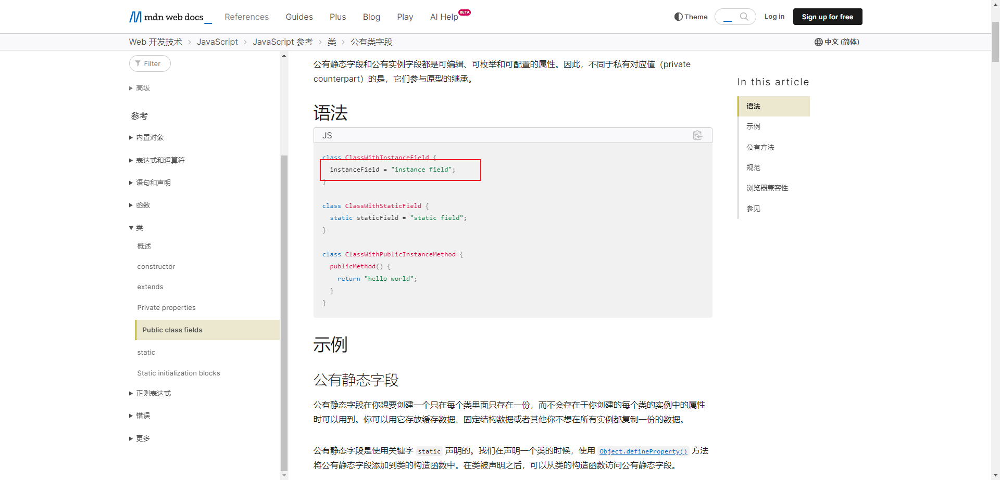

* 可能不是很明白，我们可以看下面的代码：

```js
'use strict';

class Animal {
    constructor(name, age) {
        this.name = name;
        this.age = age;
    }

    sayName = function(){console.log(this.name);};

    sayAge = () =>{ console.log(this.age);}
}

let tom = new Animal('tom',19);
let [sayName, sayAge] = [tom.sayName, tom.sayAge];
sayAge();   // 正常输出 19
sayName();  // this 为 undefined，会报错
```

* 箭头函数不会创建自己的 this，而是会继承外层作用域的 this 。当我们将 tom.sayName 和 tom.sayAge 赋值给 sayName 和sayAge 变量时，这 sayAge 仍然保留了对 tom 实例的引用。
* 当然，更加具体的解释在这里：

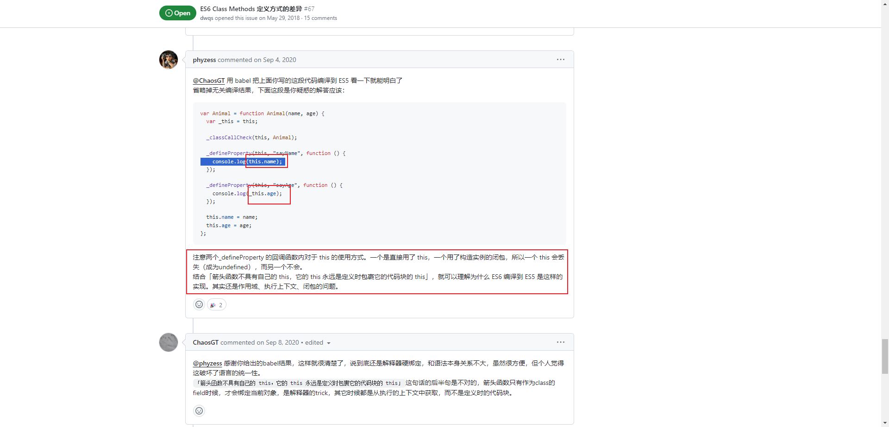


* 所以，我们可以在 React 中，通过 ES6 的 class fields 语法来解决 this 绑定问题。


* 示例：

```html {25-27,29-33,39,41}
<!DOCTYPE html>
<html lang='en'>
<head>
  <meta charset='UTF-8'>
  <title>Title</title>
  <!-- react：React 的核心 -->
  <script src='./js/react18.development.js'></script>
  <!-- React-DOM：React 渲染在不同平台上所需要的核心代码 -->
  <script src='./js/react-dom18.development.js'></script>
  <!-- babel：将 jsx 转换为 React 代码的工具 -->
  <script src='./js/babel.js'></script>
</head>
<body>

  <!-- 准备一个容器 -->
  <div class='app'></div>

  <script type='text/babel'>
    // 创建根元素
    const app = ReactDOM.createRoot(document.querySelector('.app'))

    // 创建一个组件
    class App extends React.Component {
      
      state = {
        count: 0
      }

      btnClick2 = () => {
        this.setState({
          count: this.state.count + 1
        })
      }

      render() {
        const {count} = this.state
        return (
            <div>
              <h2>当前计数为：{count}</h2>
              {/* ES6 的 class fields */}
              <button onClick={this.btnClick2}>点我</button>
            </div>
        )
      }
    }

    // 渲染组件
    app.render(<App/>)
  </script>

</body>
</html>
```

#### 3.5.2.3 this 绑定方式三

* 我们也可以通过在`事件监听`中传入`箭头函数`的方式来解决 this 绑定问题（`强烈推荐`）。

> 注意⚠️：`() => {}` 箭头函数也是表达式，所以 `{}` 中就可以插入`箭头函数`。 


* 示例：在事件监听中传入箭头函数

```html {25-27,41}
<!DOCTYPE html>
<html lang='en'>
<head>
  <meta charset='UTF-8'>
  <title>Title</title>
  <!-- react：React 的核心 -->
  <script src='./js/react18.development.js'></script>
  <!-- React-DOM：React 渲染在不同平台上所需要的核心代码 -->
  <script src='./js/react-dom18.development.js'></script>
  <!-- babel：将 jsx 转换为 React 代码的工具 -->
  <script src='./js/babel.js'></script>
</head>
<body>

  <!-- 准备一个容器 -->
  <div class='app'></div>

  <script type='text/babel'>
    // 创建根元素
    const app = ReactDOM.createRoot(document.querySelector('.app'))

    // 创建一个组件
    class App extends React.Component {

      state = {
        count: 0
      }

      render() {
        const {count} = this.state
        return (
            <div>
              <h2>当前计数为：{count}</h2>
              {/* 直接传入一个箭头函数 */}
              {/* 我们会发现当点击按钮的时候，就触发了 alert("abc") */}
              {/*
              	原理类似：
              	const click = () => alert("abc")
              	click() 
              */}
              <button onClick={() => alert("abc")}>点我</button>
            </div>
        )
      }
    }

    // 渲染组件
    app.render(<App/>)
  </script>

</body>
</html>
```


* 示例：在事件监听中传入箭头函数，并通过 this 调用类中的方法

```html {25-27,29-33,51}
<!DOCTYPE html>
<html lang='en'>
<head>
  <meta charset='UTF-8'>
  <title>Title</title>
  <!-- react：React 的核心 -->
  <script src='./js/react18.development.js'></script>
  <!-- React-DOM：React 渲染在不同平台上所需要的核心代码 -->
  <script src='./js/react-dom18.development.js'></script>
  <!-- babel：将 jsx 转换为 React 代码的工具 -->
  <script src='./js/babel.js'></script>
</head>
<body>

  <!-- 准备一个容器 -->
  <div class='app'></div>

  <script type='text/babel'>
    // 创建根元素
    const app = ReactDOM.createRoot(document.querySelector('.app'))

    // 创建一个组件
    class App extends React.Component {

      state = {
        count: 0
      }
      
      btnClick3() {
        this.setState({
          count: this.state.count + 1
        })
      }

      render() {
        const {count} = this.state
        return (
            <div>
              <h2>当前计数为：{count}</h2>
              {/* 直接传入一个箭头函数 */}
              {/* 
              	 原理类似
                 const click = () => this.btnClick3()
                 click() 
                 
                 当按钮被点击的时候，会触发 click() ，进而会执行 this.btnClick3()
                 又因为 () => this.btnClick3() 中的箭头函数中没有 this 的，那么 this 就是当前实例对象（因为 render 函数中是有 this 的）。
                 而当前实例对象身上是有 btnClick3() 方法的，而 btnClick3 是这样定义的 btnClick3() {}，
                 所以，this 没有丢失。
              */}
              <button onClick={() => this.btnClick3()}>点我</button>
            </div>
        )
      }
    }

    // 渲染组件
    app.render(<App />)
  </script>

</body>
</html>
```

### 3.5.3 事件参数传递

#### 3.5.3.1 event 参数的传递

* 对于原生 JavaScript  而言，我们是在回调函数中，通过参数 `event` 来得到`事件对象`的，如：

```js
boxEl.addEventListener('click',function(event){
     // event 就是事件对象                  
})
```

* 在 React 中，我们也可以通过在`类方法`中通过参数 `event` 来得到`事件对象`。

```html {30-32,38}
<!DOCTYPE html>
<html lang='en'>
<head>
  <meta charset='UTF-8'>
  <title>Title</title>
</head>
<body>

  <!-- 准备一个容器 -->
  <div class='app'></div>

  <!-- react：React 的核心 -->
  <script src='./js/react18.development.js'></script>
  <!-- React-DOM：React 渲染在不同平台上所需要的核心代码 -->
  <script src='./js/react-dom18.development.js'></script>
  <!-- babel：将 jsx 转换为 React 代码的工具 -->
  <script src='./js/babel.js'></script>

  <script type='text/babel'>
    // 创建根元素
    const app = ReactDOM.createRoot(document.querySelector('.app'))

    // 创建一个组件
    class App extends React.Component {
      // 组件数据
      state = {
        message: '你好，React'
      }

      btn1Click = (event) => {
        console.log('btn1Click', event, this)
      }

      render() {
        return (
          <div>
            {/* event 参数的传递 */}
            <button onClick={this.btn1Click}>按钮1</button>
          </div>
        )
      }
    }

    // 渲染组件
    app.render(<App />)
  </script>

</body>
</html>
```

* 但是，对于在`事件监听`中传入`箭头函数`的方式而言，需要手动传递 `event` 事件对象参数：

```html {30-32,38}
<!DOCTYPE html>
<html lang='en'>
<head>
  <meta charset='UTF-8'>
  <title>Title</title>
</head>
<body>

  <!-- 准备一个容器 -->
  <div class='app'></div>

  <!-- react：React 的核心 -->
  <script src='./js/react18.development.js'></script>
  <!-- React-DOM：React 渲染在不同平台上所需要的核心代码 -->
  <script src='./js/react-dom18.development.js'></script>
  <!-- babel：将 jsx 转换为 React 代码的工具 -->
  <script src='./js/babel.js'></script>

  <script type='text/babel'>
    // 创建根元素
    const app = ReactDOM.createRoot(document.querySelector('.app'))

    // 创建一个组件
    class App extends React.Component {
      // 组件数据
      state = {
        message: '你好，React'
      }

      btn2Click(event) {
        console.log('btn2Click', event, this)
      }

      render() {
        return (
          <div>
            {/* event 参数的传递 */}
            <button onClick={(event) => this.btn2Click(event)}>按钮2</button>
          </div>
        )
      }
    }

    // 渲染组件
    app.render(<App />)
  </script>

</body>
</html>
```

#### 3.5.3.2 额外参数的传递

* 有的时候，我们除了要在类方法中获取 event 事件对象参数之外，还需要传递额外的参数；此时，就推荐在`事件监听`中传入`箭头函数`的方式了。

> 注意⚠️：这种方式传递参数的`个数`和`位置`是很直观的的，而其他两种方式不是很直观（因为 event 参数最后一个，增加了记忆成本）。


* 示例：

```html {30-32,39}
<!DOCTYPE html>
<html lang='en'>
<head>
  <meta charset='UTF-8'>
  <title>Title</title>
</head>
<body>

  <!-- 准备一个容器 -->
  <div class='app'></div>

  <!-- react：React 的核心 -->
  <script src='./js/react18.development.js'></script>
  <!-- React-DOM：React 渲染在不同平台上所需要的核心代码 -->
  <script src='./js/react-dom18.development.js'></script>
  <!-- babel：将 jsx 转换为 React 代码的工具 -->
  <script src='./js/babel.js'></script>

  <script type='text/babel'>
    // 创建根元素
    const app = ReactDOM.createRoot(document.querySelector('.app'))

    // 创建一个组件
    class App extends React.Component {
      // 组件数据
      state = {
        message: '你好，React'
      }

      btn2Click(event, name, age) {
        console.log('btn2Click', event, this, name, age)
      }

      render() {
        return (
          <div>
            {/* 额外参数的传递 */}
            {/* 这种方式传递参数的`个数`和`位置`是很直观的的，指的是 this.btn2Click(event, '张三', 18) */}
            <button onClick={(event) => this.btn2Click(event, '张三', 18)}>按钮3</button>
          </div>
        )
      }
    }

    // 渲染组件
    app.render(<App />)
  </script>

</body>
</html>
```

### 3.5.4 案例

* 需求：电影选中，颜色高亮。

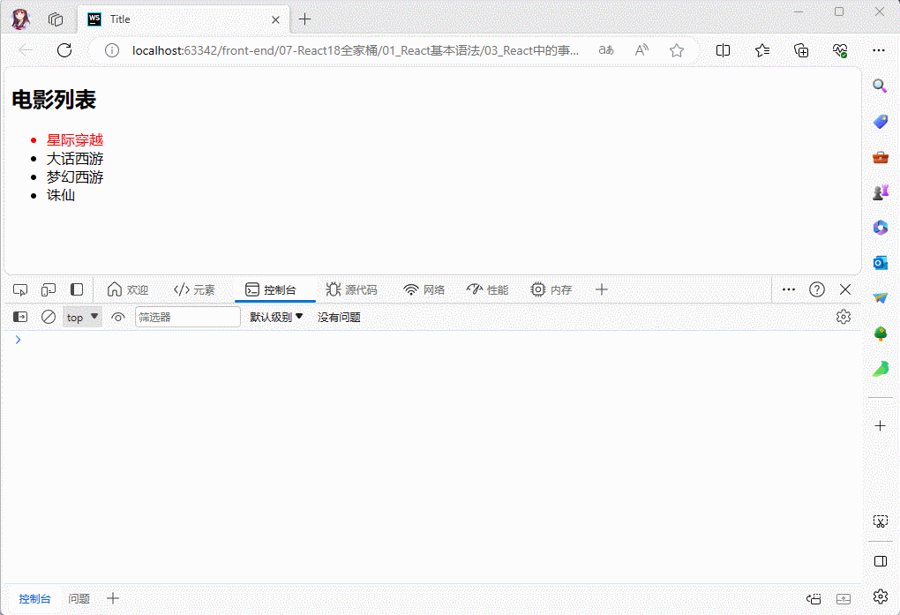

> 实现思路：
>
> * ① 在 `state` 中保存当前的选中数组的索引值，初始为 `0` ，即第一个数组元素。
> * ② 在 `li` 元素中通过 onClick 事件，获取当前选中的索引值，并将当前的索引值修改到 `state` 对应的变量中。
> * ③ 在 `li` 元素的 className 属性中根据 `当前的索引值 = 选中的索引值`，来`动态`添加或删除 `active` 类。


* 示例：

```html {31-32,36-40,48-56}
<!DOCTYPE html>
<html lang='en'>
<head>
  <meta charset='UTF-8'>
  <title>Title</title>
  <style>
    .active {
      color: red;
    }
  </style>
  <!-- react：React 的核心 -->
  <script src='./js/react18.development.js'></script>
  <!-- React-DOM：React 渲染在不同平台上所需要的核心代码 -->
  <script src='./js/react-dom18.development.js'></script>
  <!-- babel：将 jsx 转换为 React 代码的工具 -->
  <script src='./js/babel.js'></script>
</head>
<body>

  <!-- 准备一个容器 -->
  <div class='app'></div>

  <script type='text/babel'>
    // 创建根元素
    const app = ReactDOM.createRoot(document.querySelector('.app'))

    // 创建一个组件
    class App extends React.Component {
      // 组件数据
      state = {
        movies: ['星际穿越', '大话西游', '梦幻西游', '诛仙'], // 电影列表数据
        currentIndex: 0 // 当前的索引
      }

      // 改变当前选中的索引
      changeCurrentIndex(index) {
        this.setState({
          currentIndex: index
        })
      }

      render() {
        const {movies, currentIndex} = this.state
        return (
            <div>
              <h2>电影列表</h2>
              <ul>
                {
                  movies.map((movie, index) => {
                    return (
                        <li key={index} className={currentIndex === index ? 'active' : ''}
                            onClick={() => this.changeCurrentIndex(index)}>
                          {movie}
                        </li>)
                  })
                }
              </ul>
            </div>
        )
      }
    }

    // 渲染组件
    app.render(<App/>)
  </script>

</body>
</html>
```

## 3.6 JSX 的条件渲染（⭐）

### 3.6.1 概述

* 在 Vue 中，我们会使用 `v-if` 、`v-else` 或 `v-show` 等指令进行条件渲染；但是，React 倡导的是 `all in js` ；那么，在原生 JavaScript 怎么玩，在 React 中也怎么玩。

> 条件渲染：我们可以创建不同的组件来封装各种我们需要的行为。然后，依据应用的不同状态，只渲染对应状态下的部分内容。

### 3.6.2 if 条件判断

* if 条件判断语句，适合逻辑较多的情况；原理很简单，就是根据`判断`当前的`状态`，然后在 `render` 方法中`返回（return）`不同的 `jsx （虚拟 DOM）`或`组件`。


* 示例：

```html {32,33,38,39}
<!DOCTYPE html>
<html lang='en'>
<head>
  <meta charset='UTF-8'>
  <title>Title</title>
  <!-- react：React 的核心 -->
  <script src='./js/react18.development.js'></script>
  <!-- React-DOM：React 渲染在不同平台上所需要的核心代码 -->
  <script src='./js/react-dom18.development.js'></script>
  <!-- babel：将 jsx 转换为 React 代码的工具 -->
  <script src='./js/babel.js'></script>
</head>
<body>

  <!-- 准备一个容器 -->
  <div class='app'></div>

  <script type='text/babel'>
    // 创建根元素
    const app = ReactDOM.createRoot(document.querySelector('.app'))

    // 创建一个组件
    class App extends React.Component {
      // 组件数据
      state = {
        message: '你好，React',
        isReady: true
      }

      render() {
        const { isReady } = this.state
        if (isReady) {
          return (
            <div>
              <h2>已经准备好了</h2>
            </div>
          )
        } else {
          return (
            <h2>稍等，还没准备好</h2>
          )
        }

      }
    }

    // 渲染组件
    app.render(<App />)
  </script>

</body>
</html>
```

### 3.6.3 元素变量

* 我们可以通过变量来存储元素，这样可以帮助我们有条件的渲染组件的一部分，而其他的渲染部分并不会因此而改变。

> 注意⚠️：元素变量是 if 条件判断的一种变种而已。


* 示例：

```html {32,47}
<!DOCTYPE html>
<html lang='en'>
<head>
  <meta charset='UTF-8'>
  <title>Title</title>
  <!-- react：React 的核心 -->
  <script src='./js/react18.development.js'></script>
  <!-- React-DOM：React 渲染在不同平台上所需要的核心代码 -->
  <script src='./js/react-dom18.development.js'></script>
  <!-- babel：将 jsx 转换为 React 代码的工具 -->
  <script src='./js/babel.js'></script>
</head>
<body>

  <!-- 准备一个容器 -->
  <div class='app'></div>

  <script type='text/babel'>
    // 创建根元素
    const app = ReactDOM.createRoot(document.querySelector('.app'))

    // 创建一个组件
    class App extends React.Component {
      // 组件数据
      state = {
        message: '你好，React',
        isReady: true
      }

      render() {
        const { isReady } = this.state
        let showElement
        if (isReady) {
          showElement = (
            <div>
              <h2>已经准备好了</h2>
            </div>
          )
        } else {
          showElement = (
            <h2>稍等，还没准备好</h2>
          )
        }
        return (
          <div>
            { /* 条件判断语句：根据条件给变量赋值不同的内容，适合逻辑较多的情况~ */}
            {showElement}
          </div>
        )

      }
    }

    // 渲染组件
    app.render(<App />)
  </script>

</body>
</html>
```

### 3.6.4 三元运算符

* 三元运算符逻辑比较简单的情况；虽然也可以用于较为复杂的表达式，但是看起来不够直观。


* 示例：

```html {36-38}
<!DOCTYPE html>
<html lang='en'>
<head>
  <meta charset='UTF-8'>
  <title>Title</title>
  <!-- react：React 的核心 -->
  <script src='./js/react18.development.js'></script>
  <!-- React-DOM：React 渲染在不同平台上所需要的核心代码 -->
  <script src='./js/react-dom18.development.js'></script>
  <!-- babel：将 jsx 转换为 React 代码的工具 -->
  <script src='./js/babel.js'></script>
</head>
<body>

  <!-- 准备一个容器 -->
  <div class='app'></div>

  <script type='text/babel'>
    // 创建根元素
    const app = ReactDOM.createRoot(document.querySelector('.app'))

    // 创建一个组件
    class App extends React.Component {
      // 组件数据
      state = {
        message: '你好，React',
        isReady: true
      }


      render() {
        const { isReady } = this.state
        return (
          <div>
            {/* 三元运算符：适合逻辑比较简单的情况~ */}
            {
              isReady ? (<h2>已经准备好了</h2>) : (<h2>稍等，还没准备好</h2>)
            }
          </div>
        )

      }
    }

    // 渲染组件
    app.render(<App />)
  </script>

</body>
</html>
```

### 3.6.5 短路 && 

* 我们知道，在原生 JavaScript 中， `true && expression` 总是返回 `expression` ；而 `false && expression` 总是返回 `false` 。
* 同理，如果`条件`是 `true`，在 React 中，`&& 右侧的元素`就`会`被渲染；如果`条件`是 `false`，React 就`不会`渲染。


* 示例：

```html {38-40}
<!DOCTYPE html>
<html lang='en'>
<head>
  <meta charset='UTF-8'>
  <title>Title</title>
  <!-- react：React 的核心 -->
  <script src='./js/react18.development.js'></script>
  <!-- React-DOM：React 渲染在不同平台上所需要的核心代码 -->
  <script src='./js/react-dom18.development.js'></script>
  <!-- babel：将 jsx 转换为 React 代码的工具 -->
  <script src='./js/babel.js'></script>
</head>
<body>

  <!-- 准备一个容器 -->
  <div class='app'></div>

  <script type='text/babel'>
    // 创建根元素
    const app = ReactDOM.createRoot(document.querySelector('.app'))

    // 创建一个组件
    class App extends React.Component {
      // 组件数据
      state = {
        message: '你好，React',
        friend: {
          name: '张三',
          age: 23
        }
      }

      render() {
        const { friend } = this.state
        return (
          <div>
            {/* && 逻辑与运算，当某一个值有可能为 null 或 undefined */}
            {
              friend && (<div>姓名：{friend.name} ，年龄：{friend.age}</div>)
            }
          </div>
        )

      }
    }

    // 渲染组件
    app.render(<App />)
  </script>

</body>
</html>
```

### 3.6.6 可选链 ?.

* 可选链运算符（**`?.`**）允许读取位于连接对象链深处的属性的值，而不必明确验证链中的每个引用是否有效。`?.` 运算符的功能类似于 `.` 链式运算符，不同之处在于，在引用为空 ([nullish](https://developer.mozilla.org/zh-CN/docs/Glossary/Nullish) ) ([`null`](https://developer.mozilla.org/zh-CN/docs/Web/JavaScript/Reference/Operators/null) 或者 [`undefined`](https://developer.mozilla.org/zh-CN/docs/Web/JavaScript/Reference/Global_Objects/undefined)) 的情况下不会引起错误，该表达式短路返回值是 `undefined`。与函数调用一起使用时，如果给定的函数不存在，则返回 `undefined`。
* 当尝试访问可能不存在的对象属性时，可选链运算符将会使表达式更短、更简明。在探索一个对象的内容时，如果不能确定哪些属性必定存在，可选链运算符也是很有帮助的。

* 在 React 中，JSX 中的`变量`如果是 `undefined`，React 就`不会`渲染。


* 示例：

```html {35-37}
<!DOCTYPE html>
<html lang='en'>
<head>
  <meta charset='UTF-8'>
  <title>Title</title>
  <!-- react：React 的核心 -->
  <script src='./js/react18.development.js'></script>
  <!-- React-DOM：React 渲染在不同平台上所需要的核心代码 -->
  <script src='./js/react-dom18.development.js'></script>
  <!-- babel：将 jsx 转换为 React 代码的工具 -->
  <script src='./js/babel.js'></script>
</head>
<body>

  <!-- 准备一个容器 -->
  <div class='app'></div>

  <script type='text/babel'>
    // 创建根元素
    const app = ReactDOM.createRoot(document.querySelector('.app'))

    // 创建一个组件
    class App extends React.Component {
      // 组件数据
      state = {
        message: '你好，React',
        friend: null
      }

      render() {
        const { friend } = this.state
        return (
          <div>
            {/* 可选链 ?. ，当某一个值有可能为 null 或 undefined */}
            {
              (<div>姓名：{friend?.name} ，年龄：{friend?.age}</div>)
            }
          </div>
        )

      }
    }

    // 渲染组件
    app.render(<App />)
  </script>

</body>
</html>
```

### 3.6.7 案例

* 需求：通过点击按钮，模拟出 Vue 中的 `v-if` 效果。

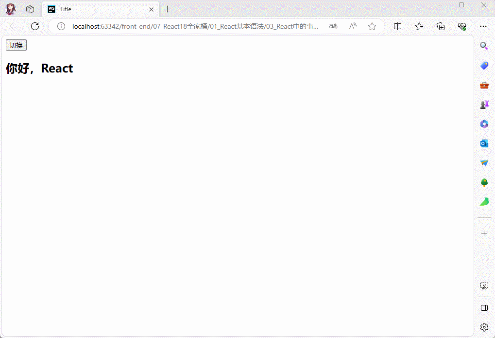


* 示例：

```html {27,30-35,41,43}
<!DOCTYPE html>
<html lang='en'>
<head>
  <meta charset='UTF-8'>
  <title>Title</title>
  <!-- react：React 的核心 -->
  <script src='./js/react18.development.js'></script>
  <!-- React-DOM：React 渲染在不同平台上所需要的核心代码 -->
  <script src='./js/react-dom18.development.js'></script>
  <!-- babel：将 jsx 转换为 React 代码的工具 -->
  <script src='./js/babel.js'></script>
</head>
<body>

  <!-- 准备一个容器 -->
  <div class='app'></div>

  <script type='text/babel'>
    // 创建根元素
    const app = ReactDOM.createRoot(document.querySelector('.app'))

    // 创建一个组件
    class App extends React.Component {
      // 组件数据
      state = {
        message: '你好，React',
        isShow: true
      }

      changeShow() {
        const {isShow} = this.state
        this.setState({
          isShow: !isShow
        })
      }

      render() {
        const {message, isShow} = this.state
        return (
            <div>
              <button onClick={() => this.changeShow()}>切换</button>
              {/* 逻辑&& */}
              {isShow && (<h2>{message}</h2>)}
            </div>
        )

      }
    }

    // 渲染组件
    app.render(<App/>)
  </script>

</body>
</html>
```

## 3.7 JSX 本质（⭐）

* 其实，JSX 仅仅只是 `createElement(type, config, children)` 函数的语法糖；换言之，所有的 JSX 都会被转换为 `createElement(type, config, children)` 函数调用。

> 注意⚠️：在 React 18 之前，是使用 `React.createElement(component, props, ...children)` ；但是，目前该 API 已经过时。

* 其中，`type` 参数表示的是当前 ReactElement 的`类型`：
  * 如果是`标签`元素，则使用字符串来表示，如：`"div"`。
  * 如果是`组件`元素，则直接使用组件的名称，如：`Demo`。

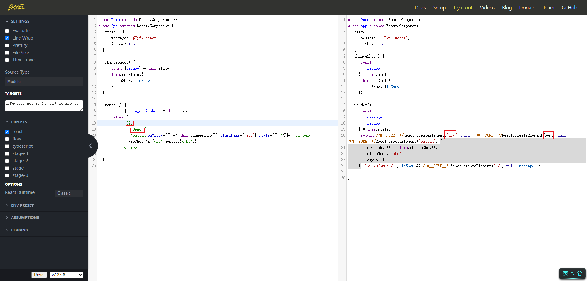

* 其中，`config` 参数是用来存储 JSX 中的`属性`：
  * 都是以对象的形式存储的。

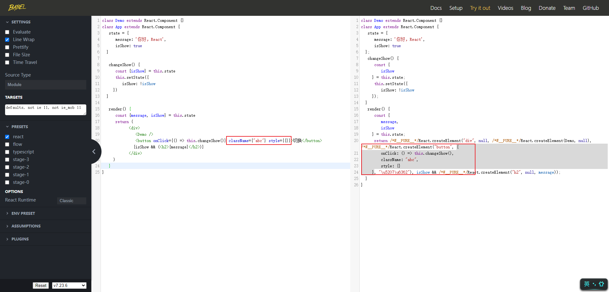

* 其中，`children` 参数是用来表示标签的`内容`，以 children `数组`的方式来存储的。

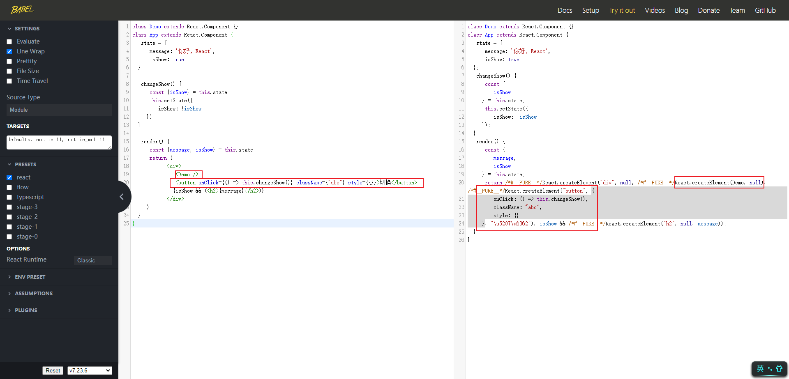

## 3.8 虚拟 DOM 的创建过程

* 我们知道，可以通过 `createElement(type, config, children)` 的方式手动创建 React 元素，它可以作为 JSX 的替代方案。

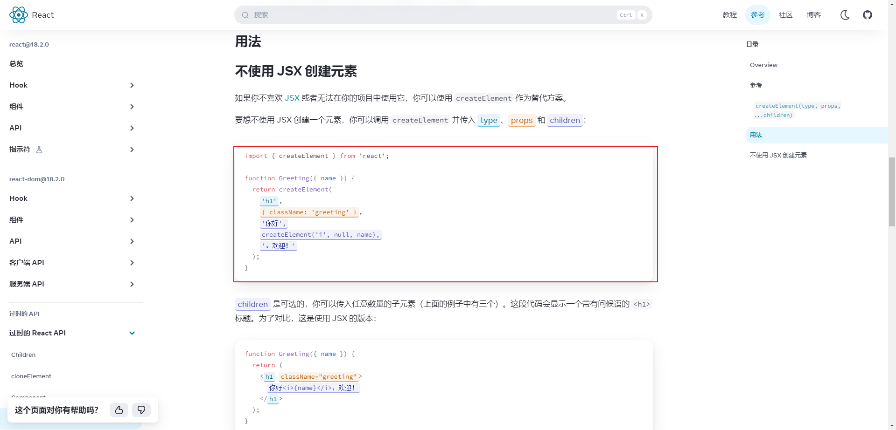

* 其实，React 就是通过 `createElement` 创建出来的对象，组成了一个 `JavaScript 对象树`，并且这个 `JavaScript 对象树`就是`虚拟 DOM`（Virtual DOM）。
* 以下面的代码为例：

```html {47}
<!DOCTYPE html>
<html lang='en'>
<head>
  <meta charset='UTF-8'>
  <title>Title</title>
  <!-- react：React 的核心 -->
  <script src='./js/react18.development.js'></script>
  <!-- React-DOM：React 渲染在不同平台上所需要的核心代码 -->
  <script src='./js/react-dom18.development.js'></script>
  <!-- babel：将 jsx 转换为 React 代码的工具 -->
  <script src='./js/babel.js'></script>
</head>
<body>

  <!-- 准备一个容器 -->
  <div class='app'></div>

  <script type='text/babel'>
    // 创建根元素
    const app = ReactDOM.createRoot(document.querySelector('.app'))

    // 创建一个组件
    class App extends React.Component {
      // 组件数据
      state = {
        message: '你好，React',
        isShow: true
      }

      changeShow() {
        const {isShow} = this.state
        this.setState({
          isShow: !isShow
        })
      }

      render() {
        const {message} = this.state

        const result = (
            <div>
              <button onClick={() => this.changeShow()}>切换</button>
              <h2>{message}</h2>)
            </div>
        )

        console.log('@@@',result)

        return result

      }
    }

    // 渲染组件
    app.render(<App/>)
  </script>

</body>
</html>
```

* 我们来看下，这个虚拟 DOM 到底怎么形成的：

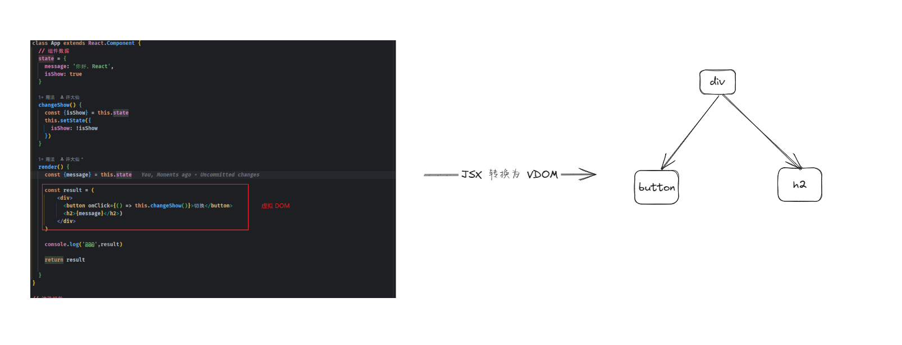

* 如何证明？我们可以将虚拟 DOM 打印出来：

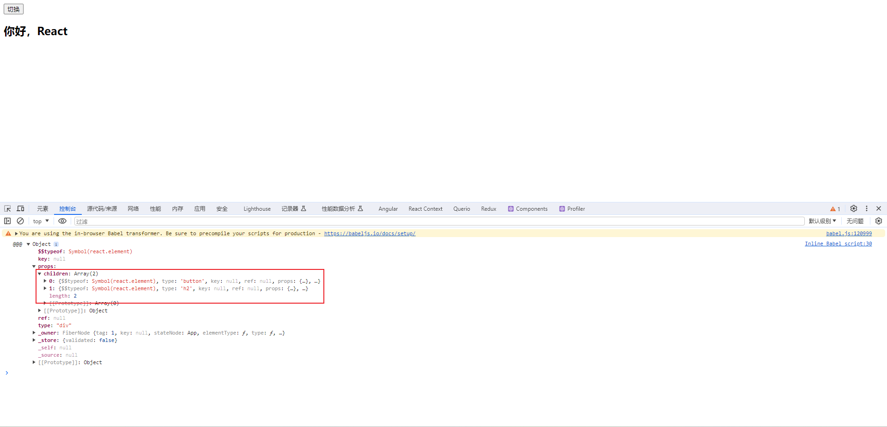

* 其实，查看 createElement 函数的源码， 我们也知道：createElement 函数返回的就是一个 JavaScript 对象。

```js
  var ReactElement = function (type, key, ref, self, source, owner, props) {
    var element = {
      $$typeof: REACT_ELEMENT_TYPE,
      type: type,
      key: key,
      ref: ref,
      props: props,
      _owner: owner
    };
    // 其余略
    return element;
  };

  function createElement(type, config, children) {
    // 其余略
    return ReactElement(type, key, ref, self, source, ReactCurrentOwner.current, props);
  }
```

* 所以，最终的开发模式就是这样：我们只需要写 JSX ，其余的就交给 React 了。

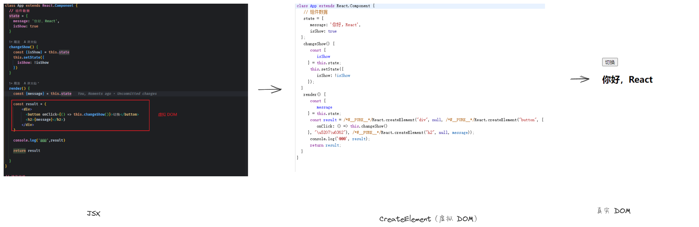

## 3.9 声明式编程（⭐）

* `虚拟 DOM 的出现`将开发者的`编程模式`从`命令式编程`转变到`声明式编程`。
* `虚拟 DOM` 是一种`编程概念`。在这个概念里， UI 以一种理想化的，或者说`“虚拟的”`表现形式被保存于内存中，并通过如 ReactDOM 等类库使之与`“真实的”` DOM 同步。这一过程叫做`协调`。
* 这种编程的方式`赋予`了 React 声明式的 API ：
  * 我们告诉 React 希望让 UI 是什么状态，React 就确保 DOM 匹配该状态。
  * 这使我们可以从`属性操作`、`事件处理`和`手动 DOM 更新`这些在构建应用程序时必要的操作中解放出来。

## 3.10 购物车案例（⭐）

* 需求：展示购物车。

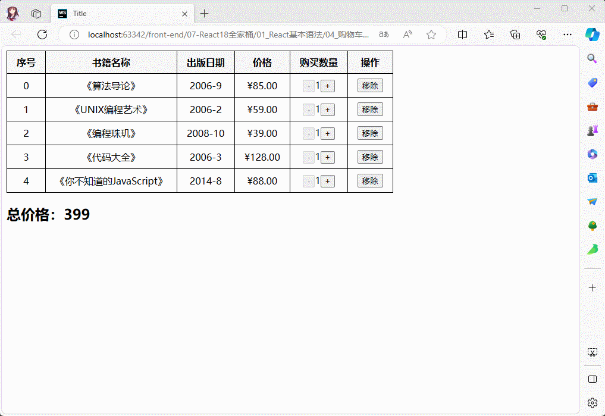

* 要求：
  * ① 在界面上以`表格`的形式展示书籍的数据。
  * ② 在底部显示书籍的`总价格`。
  * ③ 点击 `+` 或 `-` 就增加书籍的数量或减少书籍的数量；但是，如果书籍的数量为 `1` ，就不能继续减少。
  * ④ 点击`移除`按钮，就将当前书籍移除。
  * ⑤ 如果所有书籍`都`移除了，界面显示`暂无数据`。


* 示例：

```html
<!DOCTYPE html>
<html lang='en'>
<head>
  <meta charset='UTF-8'>
  <title>Title</title>
  <style>
    table {
      border-collapse: collapse;
      text-align: center;
    }

    table th, td {
      border: 1px solid black;
      padding: 8px 16px;
    }

    table thead {
      background-color: #f5f5f5;
    }

    .active {
      background-color: pink;
    }
  </style>
  <!-- react：React 的核心 -->
  <script src='./js/react18.development.js'></script>
  <!-- React-DOM：React 渲染在不同平台上所需要的核心代码 -->
  <script src='./js/react-dom18.development.js'></script>
  <!-- babel：将 jsx 转换为 React 代码的工具 -->
  <script src='./js/babel.js'></script>
</head>
<body>

  <!-- 准备一个容器 -->
  <div class='app'></div>

  <script type='text/babel'>
    // 创建根元素
    const app = ReactDOM.createRoot(document.querySelector('.app'))

    // 创建一个组件
    class App extends React.Component {

      state = {
        books: [
          {
            id: 1,
            name: '《算法导论》',
            date: '2006-9',
            price: 85.00,
            count: 1
          },
          {
            id: 2,
            name: '《UNIX编程艺术》',
            date: '2006-2',
            price: 59.00,
            count: 1
          },
          {
            id: 3,
            name: '《编程珠玑》',
            date: '2008-10',
            price: 39.00,
            count: 1
          },
          {
            id: 4,
            name: '《代码大全》',
            date: '2006-3',
            price: 128.00,
            count: 1
          },
          {
            id: 5,
            name: '《你不知道的JavaScript》',
            date: '2014-8',
            price: 88.00,
            count: 1
          },
        ]
      }

      // 改变购物车中书籍的数量，如果不传递 num ，就是新增；否则，传递 -1 就是减少
      changeCount(id, num = 1) {
        const {books} = this.state

        if (id) {
          const newBooks = books.map(book => {
            if (book.id === id) {
              book.count += num
            }
            return book
          })
          this.setState({
            books: newBooks
          })
        }
      }

      // 删除购物车中的书籍
      delete(id) {
        const {books} = this.state

        if (id) {
          const newBooks = books.filter(book => book.id !== id)
          this.setState({
            books: newBooks
          })
        }
      }

      // 当购物车中的书籍数据不为空的时候的渲染函数
      renderBookList() {
        const {books} = this.state
        const totalPrice = books.map(item => item.price * item.count).reduce((prev, next) => prev + next, 0)
        return (<div>
          <table>
            <thead>
              <tr>
                <th>序号</th>
                <th>书籍名称</th>
                <th>出版日期</th>
                <th>价格</th>
                <th>购买数量</th>
                <th>操作</th>
              </tr>
            </thead>
            <tbody>
              {
                  books && books.map((book, index) => {
                    return (
                        <tr key={index}>
                          <td>{index}</td>
                          <td>{book.name}</td>
                          <td>{book.date}</td>
                          <td>{"¥" + book.price.toFixed(2)}</td>
                          <td>
                            <button disabled={book.count <= 1} onClick={() => this.changeCount(book.id, -1)}>-</button>
                            {book.count}
                            <button onClick={() => this.changeCount(book.id)}>+</button>
                          </td>
                          <td>
                            <button onClick={() => this.delete(book.id)}>移除</button>
                          </td>
                        </tr>
                    )
                  })
              }
            </tbody>
            <tfoot>
              <tr>
                <td colSpan="6">总价格：{"¥" + totalPrice.toFixed(2)}</td>
              </tr>
            </tfoot>
          </table>
        </div>)
      }

      // 当购物车中的书籍数据为空的时候的渲染函数
      renderBookEmpty() {
        return (<div>暂无数据</div>)
      }

      render() {
        const {books} = this.state

        return books.length ? this.renderBookList() : this.renderBookEmpty()
      }
    }

    // 渲染组件
    app.render(
        <App/>
    )
  </script>

</body>
</html>
```

