# 第一章：React 中的高阶组件（HOC）

## 1.1 概述

* 维基百科对`高阶函数`的定义：高阶函数至少满足以下条件之一
  * ① 接收一个或多个函数作为输入。
  * ② 输出一个函数。

```js
function foo(callback) {  
    if(callback){
        callback()
    }
    console.log('foo 函数')
}

foo(() => {
    console.log('我是另一个函数')
})
```

> 注意⚠️：
>
> * 高阶函数可以将函数作为数据进行操作和传递，从而实现更灵活的编程。
> * 高阶函数可以用来实现`函数的组合`、`柯里化`、`延迟执行`等功能。
> * JavaScript 中数组的 `map()`、`forEach()`、`filter()` 、`reduce()` 等都是高阶函数。

## 1.2 高阶组件的定义和使用（⭐）

* 高阶组件（HOC）是 React 中用于复用组件逻辑的一种高级技巧。
* HOC 自身不是 React API 的一部分，它是一种基于 React 的组合特性而形成的设计模式。
* 具体而言，`高阶组件是参数为组件，返回值为新组件的函数。`

```jsx
const EnhancedComponent = higherOrderComponent(WrappedComponent);
```

> 注意⚠️：
>
> * 高阶组件不是组件，而是函数。
> * 高阶组件通常在一些 React 第三方库中非常常见！！！

* 项目结构：

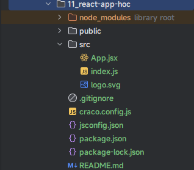

* 示例：

```jsx {3-18}
import React, {PureComponent} from 'react'

// 定义一个高阶组件
function hoc(WrappedComponent) { 
  // ① 定义组件：类组件
  class HocComponent extends PureComponent {
    render() {
      return <WrappedComponent {...this.props} />
    }
  }
  // ① 定义组件：函数组件，略。
  
  
  // ② 给组件添加 displayName
  HocComponent.displayName = `Hoc(${WrappedComponent.displayName || WrappedComponent.name})`
  // ③ 返回组件
  return HocComponent
} 

class App extends PureComponent{
  
  state = {
    message: 'Hello React'
  }
  
  render() {
    return (
      <div>
        <h2>{this.state.message}</h2>
      </div>
    )
  }
}

// 使用高阶组件
export default hoc(App)
```

## 1.3 高阶组件的应用场景（⭐）

### 1.3.1 场景一

* 应用场景一：给一些需要特殊数据的组件，注入 props 。


* 需求：给 `Home` 组件、`Profile` 组件注入自定义的 `props` ，但是 `About` 组件不需要。

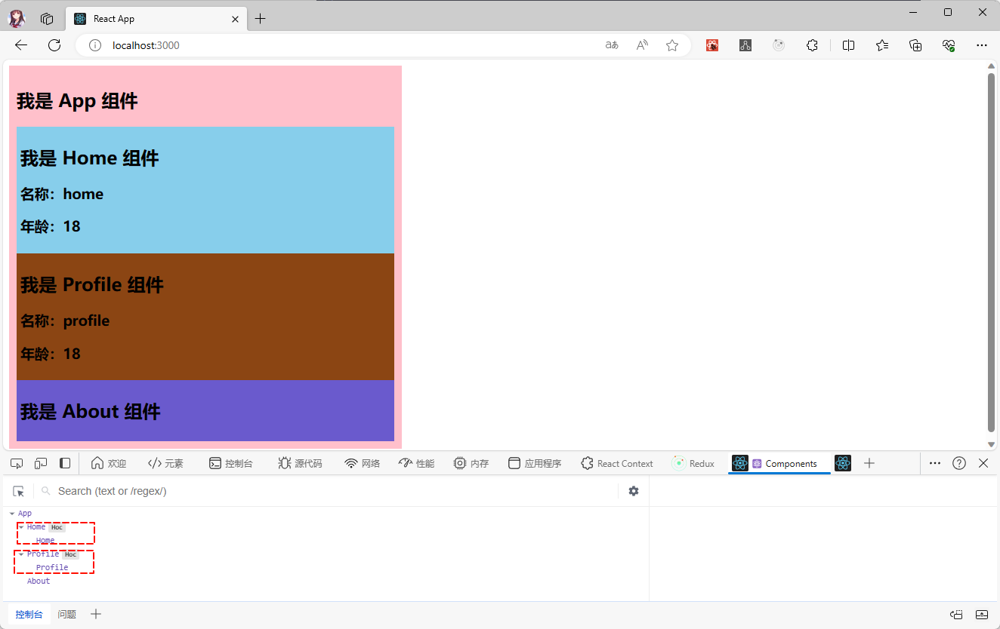

* 项目结构：

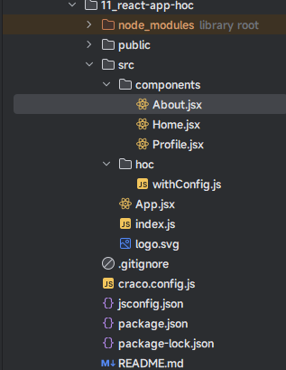

* 示例：
* 其中，App.jsx

```jsx {17-19}
import React, {PureComponent} from 'react'
import Profile from "@/components/Profile"
import Home from "@/components/Home"
import About from "@/components/About"

class App extends PureComponent {
  
  state = {
    message: '我是 App 组件'
  }
  
  render() {
    const {message} = this.state;
    return (
      <div style={{backgroundColor: 'pink',padding: '10px',width: '500px'}}>
        <h2>{message}</h2>
        <Home name={"home"}/>
        <Profile name={"profile"}/>
        <About/>
      </div>
    )
  }
}

// 使用高阶组件
export default App
```

* 其中，withConfig.js

```js {3-15}
import {PureComponent} from "react"

// 给一些需要特殊数据的组件，注入 props // [!code highlight]
export function withConfig(WrappedComponent, config) {
  class HocComponent extends PureComponent {
    render() {
      return <WrappedComponent {...this.props} {...config}/>
    }
  }
  
  HocComponent.displayName = `Hoc(${WrappedComponent.displayName || WrappedComponent.name})`
  
  return HocComponent
  
}
```

* 其中，Home.jsx

```jsx {18}
import {useState} from "react";
import {withConfig} from "@/hoc/withConfig";

function Home(props) {
  const [state] = useState("我是 Home 组件");
  return (
    <div style={{backgroundColor: 'skyblue', padding: '5px'}}>
      <h2>{state}</h2>
      <div>
        <h3>名称：{props.name}</h3>
        <h3>年龄：{props.age}</h3>
      </div>
    </div>
  )
}


export default withConfig(Home, {age: 18})
```

* 其中，Profile.jsx

```jsx {17}
import {useState} from "react";
import {withConfig} from "@/hoc/withConfig";

function Profile(props) {
  const [state] = useState("我是 Profile 组件");
  return (
    <div style={{backgroundColor: 'saddlebrown', padding: '5px'}}>
      <h2>{state}</h2>
      <div>
        <h3>名称：{props.name}</h3>
        <h3>年龄：{props.age}</h3>
      </div>
    </div>
  )
}

export default withConfig(Profile, { age: 18})
```

* 其中，About.jsx

```jsx {12}
import {useState} from "react";

function About() {
  const [state] = useState("我是 About 组件");
  return (
    <div style={{backgroundColor: 'slateblue', padding: '5px'}}>
      <h2>{state}</h2>
    </div>
  )
}

export default About
```

### 1.3.2 场景二

* 应用场景二：登录鉴权。


* 需求：如果登录成功，则显示`购物车`等组件；否则，则提示需要登录。

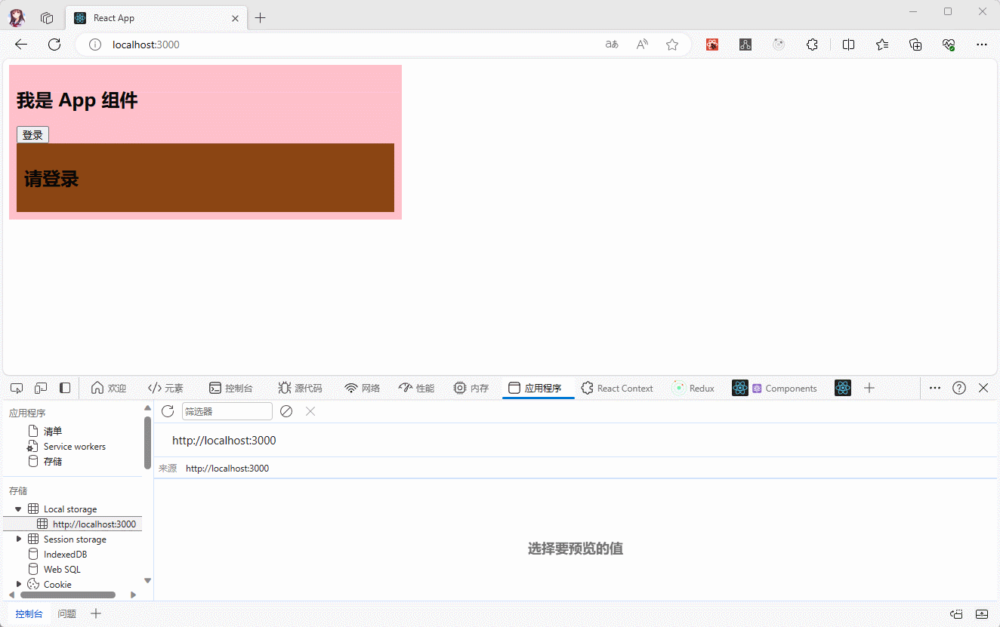

> 注意⚠️：实际开发中，一般需要配合 localStorage 实现`登录鉴权`功能。

* 项目结构：

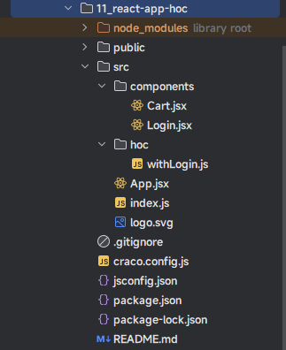

* 示例：
* 其中，App.jsx

```jsx {8,12,19,26,30-31}
import React, {PureComponent} from 'react'
import Cart from "@/components/Cart"

class App extends PureComponent {
  
  state = {
    message: '我是 App 组件',
    isLogin: false
  }
  
  btnLogin() {
    localStorage.setItem('token', 'token')
    this.setState({
      isLogin: true
    })
  }
  
  btnLogout() {
    localStorage.removeItem('token')
    this.setState({
      isLogin: false
    })
  }
  
  render() {
    const {isLogin} = this.state
    return (
      <div style={{backgroundColor: 'pink', padding: '10px', width: '500px'}}>
        <h2>{this.state.message}</h2>
        {!isLogin ? <button onClick={() => this.btnLogin()}>登录</button> :
          <button onClick={() => this.btnLogout()}>注销</button>}
        <Cart/>
      </div>
    )
  }
}

// 使用高阶组件
export default App
```

* 其中，withLogin.js

```js {5-8}
import Login from "@/components/Login"

export function withLogin(WrappedComponent){
  const HocComponent = (props) => {
    // 从 localStorage 中获取 token 
    const token = localStorage.getItem("token")
    if(token){
      return <WrappedComponent {...props}/>
    }else{
      return <Login/>
    }
  }
  
  HocComponent.displayName = `Hoc(${WrappedComponent.displayName || WrappedComponent.name})`
  
  return HocComponent
  
}
```

* 其中，Cart.jsx

```jsx {19}
import React, {Component} from 'react'
import {withLogin} from "@/hoc/withLogin"

class Cart extends Component {
  
  state = {
    message: '我是 Cart 组件',
  }
  
  render() {
    return (
      <div style={{backgroundColor: 'skyblue', padding: '10px'}}>
        <h2>购物车</h2>
      </div>
    )
  }
}

export default withLogin(Cart)
```

* 其中，Login.jsx

```jsx
import React, {Component} from 'react'

class Login extends Component {
  
  state = {
    message: '我是 Login 组件',
  }
  render() {
    return (
      <div style={{backgroundColor: 'saddlebrown', padding: '10px'}}>
        <h2>请登录</h2>
      </div>
    )
  }
}

export default Login
```

### 1.3.3 场景三

* 应用场景三：计算 React 组件挂载阶段的渲染时间。


* 需求：在控制台显示 React 组件挂载阶段的渲染时间。

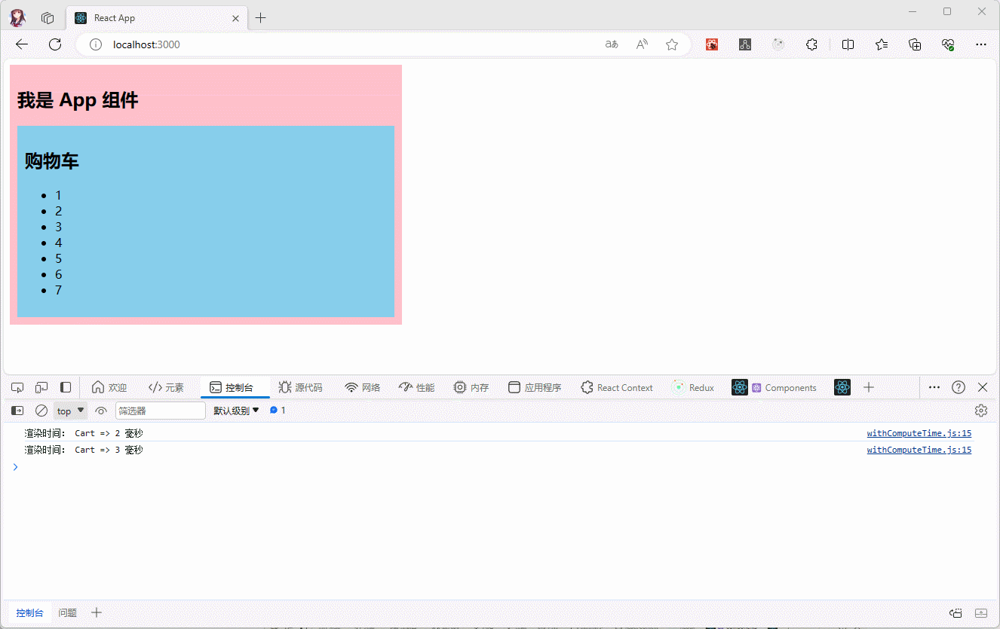

* 项目结构：

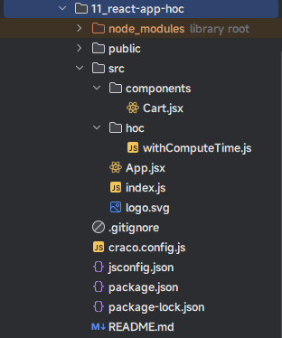

* 示例：
* 其中，App.jsx

```jsx
import React, {PureComponent} from 'react'
import Cart from "@/components/Cart"

class App extends PureComponent {
  
  state = {
    message: '我是 App 组件',
  }
  render() {
    return (
      <div style={{backgroundColor: 'pink', padding: '10px', width: '500px'}}>
        <h2>{this.state.message}</h2>
        <Cart/>
      </div>
    )
  }
}

// 使用高阶组件
export default App
```

* 其中，withComputeTime.js

```js
import {PureComponent} from "react"

export function withComputeTime(WrappedComponent) {
  
  class HocComponent extends PureComponent {
    
    constructor(props) {
      super(props)
      this.beingTime = new Date().getTime()
    }
    
    componentDidMount() {
      const componentName = WrappedComponent.displayName || WrappedComponent.name || 'Component';
      let renderTime = new Date().getTime() - this.beingTime
      console.log('渲染时间：', `${componentName} => ${renderTime} 毫秒`)
    }
    
    render() {
      return <WrappedComponent {...this.props} />
    }
  }
  
  HocComponent.displayName = `Hoc(${WrappedComponent.displayName || WrappedComponent.name})`
  
  return HocComponent
  
}
```

* 其中，Cart.jsx

```jsx {27}
import React, {PureComponent} from 'react'
import {withComputeTime} from "@/hoc/withComputeTime"

class Cart extends PureComponent {
  
  state = {
    message: '我是 Cart 组件',
    list: [1, 2, 3, 4, 5, 6, 7],
  }
  
  render() {
    return (
      <div style={{backgroundColor: 'skyblue', padding: '10px'}}>
        <h2>购物车</h2>
        <ul>
          {
            this.state.list.map((item, index) => {
              return <li key={index}>{item}</li>
            })
          }
        </ul>
      </div>
    )
  }
}

export default withComputeTime(Cart)
```

## 1.4 高阶组件的实际应用 -- 主题切换（⭐）

### 1.4.1 基本实现

* 需求：完成主题的切换。

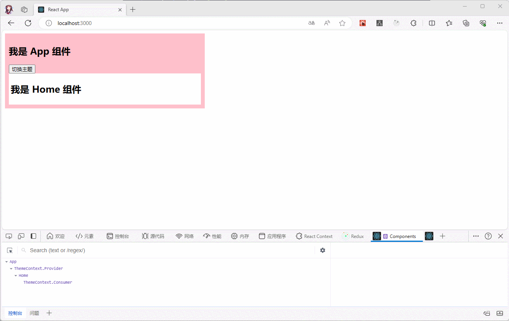

* 分析：

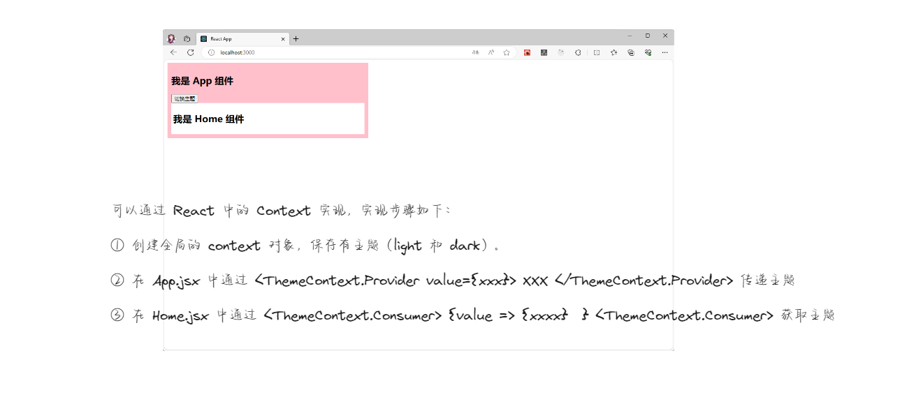

* 项目结构：

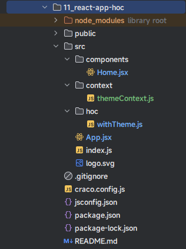

* 示例：
* 其中，ThemeContext.js

```js {2,4,7,11,14}
import {createContext} from "react"
// 主题
export const themes = {
  light: { // 明亮 
    background: 'white',
  },
  dark: { // 暗黑
    background: 'gray',
  },
};
// 创建主题 Context 
const ThemeContext = createContext(themes.light)
ThemeContext.displayName = "ThemeContext"
// 导出主题 Context 
export default ThemeContext
```

* 其中，App.jsx

```jsx {12-16,23-25}
import React, {PureComponent} from 'react'
import Home from "@/components/Home"
import ThemeContext, {themes} from "@/context/themeContext"

class App extends PureComponent {
  
  state = {
    message: '我是 App 组件',
    theme: themes.light
  }
  
  changeTheme() {
    this.setState(state => ({
      theme: state.theme === themes.dark ? themes.light : themes.dark,
    }));
  }
  
  render() {
    return (
      <div style={{backgroundColor: 'pink', padding: '10px', width: '500px'}}>
        <h2>{this.state.message}</h2>
        <button onClick={() => this.changeTheme()}>切换主题</button> 
        <ThemeContext.Provider value={this.state.theme}> 
          <Home/> 
        </ThemeContext.Provider> 
      </div>
    )
  }
}

// 使用高阶组件
export default App
```

* 其中，Home.jsx

```jsx {7-17}
import {useState} from "react"
import ThemeContext from "@/context/themeContext"

function Home() {
  const [state] = useState("我是 Home 组件");
  return (
    <ThemeContext.Consumer> 
      { 
        value => { 
          return ( 
            <div style={{backgroundColor: value.background, padding: '5px'}}> 
              <h2>{state}</h2> 
            </div> 
          ) 
        } 
      } 
    </ThemeContext.Consumer> 
  
  )
}


export default Home
```

### 1.4.2 优化

* 优化：上述的方案太繁琐了，难道每个子组件都需要这么写？可以使用 `hoc` 来进行优化：


* 示例：

* 其中，withTheme.js

```js {8-10}
import {PureComponent} from "react"
import ThemeContext from "@/context/themeContext"

export function withTheme(WrappedComponent) {
  class HocComponent extends PureComponent {
    render() {
      return (
        <ThemeContext.Consumer > 
          {value => <WrappedComponent {...this.props} {...value}/>} 
        </ThemeContext.Consumer> 
      )
    }
  }
  
  HocComponent.displayName = `Hoc(${WrappedComponent.displayName || WrappedComponent.name})`
  
  return HocComponent
  
}
```

* 其中，Home.jsx

```jsx {13}
import {useState} from "react"
import {withTheme} from "@/hoc/withTheme"

function Home(props) {
  const [state] = useState("我是 Home 组件");
  return (
    <div style={{backgroundColor: props.background, padding: '5px'}}>
      <h2>{state}</h2>
    </div>
  
  )
}
export default withTheme(Home)
```

### 1.4.3 优化

* 优化：不觉得 withTheme 的实现太繁琐了吗？为什么不使用函数组件来实现？


* 示例：withTheme.js

```js {4-10}
import ThemeContext from "@/context/themeContext"

export function withTheme(WrappedComponent) {
  function HocComponent (props){
    return (
      <ThemeContext.Consumer >
        {value => <WrappedComponent {...props} {...value}/>}
      </ThemeContext.Consumer>
    )
  }
  
  HocComponent.displayName = `Hoc(${WrappedComponent.displayName || WrappedComponent.name})`
  
  return HocComponent
  
}
```

### 1.4.4 优化

* 优化：既然都使用了函数组件，为什么不使用箭头函数来实现？


* 示例：withTheme.js

```js {4-10}
import ThemeContext from "@/context/themeContext"

export function withTheme(WrappedComponent) {
  const HocComponent = (props) => {
    return (
      <ThemeContext.Consumer >
        {value => <WrappedComponent {...props} {...value}/>}
      </ThemeContext.Consumer>
    )
  }
  
  HocComponent.displayName = `Hoc(${WrappedComponent.displayName || WrappedComponent.name})`
  
  return HocComponent
  
}
```

## 1.5 高阶组件的意义（⭐）

* 我们会发现利用高阶组件可以针对某些 React 代码进行更加优雅的处理；但是，HOC 也有自己的缺点：
  * ① HOC 需要在`原组件上进行包裹或者嵌套`，如果`大量的使用 HOC`，将会产生`非常多的嵌套`，会让调试变得非常困难。
  * ② HOC 可以`劫持 props` ，`在不遵守决定的情况下可能会造成冲突`。

> 注意⚠️：之前学习的 `React.memo()` 和 `React.forwardRef()` 就是高阶组件。

* `Hooks` 的出现，是开创性的，解决了很多 React 之前存在的问题，如：this 指向问题，hoc 的嵌套复杂度问题，后续讲解！！！


# 第二章：Portal（⭐）

## 2.1 概述

* Portal 在英文中的含义是 `传送门` 的意思。
* 在 React 中就是提供了一种将子节点渲染到存在于父组件以外的 DOM 节点的优秀方法：

```jsx
ReactDOM.createPortal(child, container)
```

> 注意⚠️：其实，和 Vue3.x 中的 `Teleport` 内置组件没什么区别。Teleport 的英文含义是`心灵传输`的意思。

* 简单理解：常规的组件渲染都是在 `public` 目录下 `index.html` 文件中的`<div id="root"></div>`节点下面；但是，通过 Portal 我们可以将组件渲染到任何节点，如：body 节点等。

## 2.2 案例

* 需求：动态显示`模态框`。

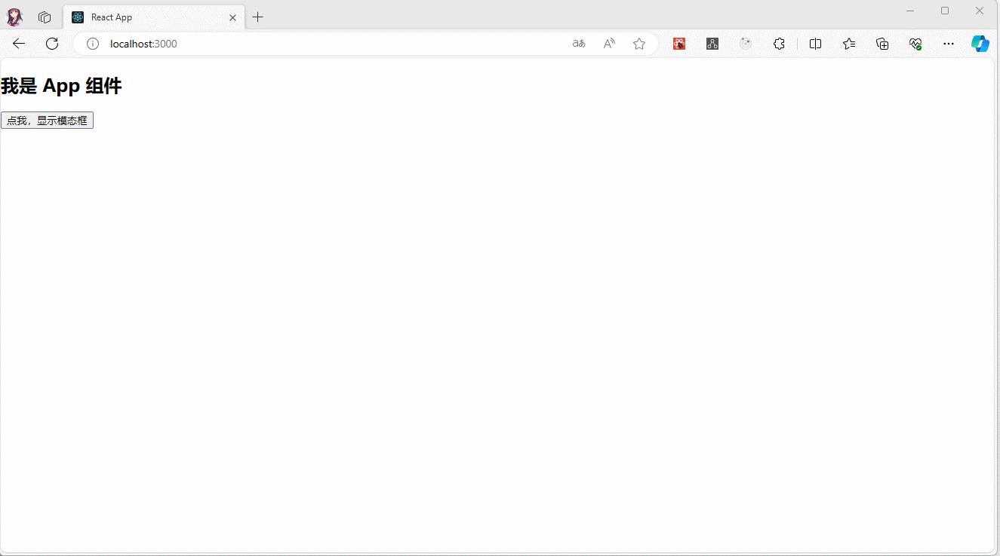

* 项目结构：

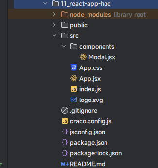

* 示例：
* 其中，App.jsx

```jsx {9,12-16,18-22,29-50}
import React, {PureComponent} from 'react'
import Modal from "@/components/Modal"
import '@/App.css'

class App extends PureComponent {
  
  state = {
    message: '我是 App 组件',
    isShowModal: false,
  }
  
  showModal() {
    this.setState({
      isShowModal: true,
    })
  }
  
  closeModal() {
    this.setState({
      isShowModal: false,
    })
  }
  
  render() {
    const {isShowModal} = this.state
    return (
      <div >
        <h2>{this.state.message}</h2>
        <button onClick={() => this.showModal()}>点我，显示模态框</button>
        <div className={`${isShowModal ? 'modal-open' : ''}`}>
          {
            isShowModal && (<Modal>
              <div>
                <div>
                  <label htmlFor="username">
                    用户名：<input type="text" id="username" defaultValue={""}/>
                  </label>
                </div>
                <div>
                  <label htmlFor="password">
                    密码：<input type="password" id="password" defaultValue={""}/>
                  </label>
                </div>
              </div>
              <div>
                <button onClick={() => this.closeModal()}>关闭模态框</button>
              </div>
            </Modal>)
          }
        </div>
      </div>
    
    )
  }
}

export default App
```

* 其中，App.css

```css
body {
    margin: 0;
    padding: 0;
}

.modal {
    position: fixed;
    top: 50%;
    left: 50%;
    width: 300px;
    height: 200px;
    transform: translate(-50%, -50%);
    background-color: white;
    padding: 20px;
    border-radius: 8px;
    box-shadow: 0 2px 4px rgba(0, 0, 0, 0.2);
    z-index: 9999;
}

.modal-open::before {
    content: "";
    position: fixed;
    top: 0;
    left: 0;
    width: 100%;
    height: 100%;
    background-color: rgba(0, 0, 0, 0.6);
    z-index: 9998;
}
```

* 其中，Modal.jsx

```jsx {7-11}
import {PureComponent} from "react"
import {createPortal} from "react-dom";

class Modal extends PureComponent {
  render() {
    return (
      createPortal(
        (<div className="modal">
          {this.props.children}
        </div>)
        , document.querySelector('body'))
    )
  }
}

export default Modal
```


# 第三章：Fragment（⭐）

## 3.1 概述

* 之前，我们是这样定义的：

```jsx
render() {
  return (
    <div> // [!code highlight]
      <ChildA />
      <ChildB />
      <ChildC />
    </div> // [!code highlight]
  );
}
```

* 但是，有的时候，我们不希望多定义这样无用的 div 元素，就可以使用 Fragment 了；因为，Fragment 允许我们将子列表分组，而无需将 DOM 中添加额外节点。

```jsx
render() {
  return (
    <React.Fragment> // [!code highlight]
      <ChildA />
      <ChildB />
      <ChildC />
    </React.Fragment> // [!code highlight]
  );
}
```

* React 还提供了 Fragment 的短语法：

```jsx
render() {
  return (
    <> // [!code highlight]
      <ChildA />
      <ChildB />
      <ChildC />
    </> // [!code highlight]
  );
}
```

> 但是，如果我们需要在 Fragment  中添加 key ，就不能使用短语法了。

## 3.2 案例

* 需求：遍历数组，渲染到页面上。

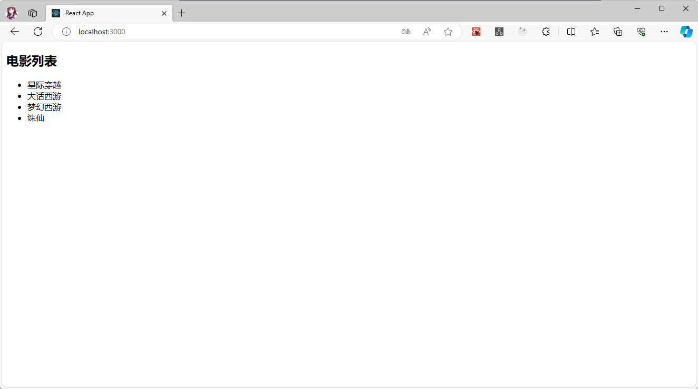

* 项目结构：

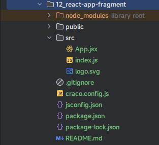

* 示例：

```jsx {12,21}
import React from 'react'

class App extends React.PureComponent {
  
  state = {
    message: 'Hello React',
    movies: ['星际穿越', '大话西游', '梦幻西游', '诛仙'],
  }
  
  render() {
    return (
      <> 
        <h2>电影列表</h2>
        <ul>
          {
            this.state.movies.map((movie,index) => (
              <li key={index}>{movie}</li>
            ))
          }
        </ul>
      </> 
    )
  }
}

export default App
```


# 第四章：StrictMode

## 4.1 概述

* 我们在使用 React 官方提供的脚手架的时候，会显示如下的代码：

```js {7,9}
import React from 'react'
import ReactDOM from 'react-dom/client'
import App from '@/App'

const root = ReactDOM.createRoot(document.getElementById('root'))
root.render(
  <React.StrictMode>
      <App/>
  </React.StrictMode>
)
```

* `StrictMode` 表示严格模式，并且 `StrictMode` 是一个用来突出显示应用程序中潜在问题的工具。
* `StrictMode` 与 `Fragment` 一样，`StrictMode` 不会渲染任何可见的 UI。它为其后代元素触发额外的检查和警告。

> 注意⚠️：严格模式检查仅在开发模式下运行；它们不会影响生产构建！！！

## 4.2 严格模式检查什么？

* 严格模式，有助于检测：
  * ① 识别不安全的生命周期。
  * ② 关于使用过时字符串 ref API 的警告。
  * ③ 关于使用废弃的 findDOMNode 方法的警告。
  * ④ 检测意外的副作用：
    * 组件的 constructor 会被调用两次；
    * 这是严格模式下故意进行的操作，让我们来查看在这里写的一些逻辑代码被调用多次时，是否会产生一些副作用；
    * 在生产环境中，是不会被调用两次的；
  * ⑤ 检测过时的context API 。
  * ⑥ 确保可复用的 state 。

* 当然，未来的 React 版本将添加更多额外功能。
