# 第一章：回顾纯函数

## 1.1 概述

* 纯函数（Pure Function）是函数式编程中的一个重要概念，它具有如下的两个主要特点：
  - ① `相同的输入总是产生相同的输出`：纯函数的输出完全由其输入决定，不会受到外部状态的影响。这意味着给定相同的输入，纯函数总是返回相同的输出，这种可预测性对于编程的可维护性和测试性非常重要。
  - ② `没有副作用`：纯函数不会对外部环境造成影响，不会改变全局变量、修改传入的参数或执行与函数计算无关的操作。这种特性使得纯函数在并发和并行编程中更容易使用，因为它们不会引入竞争条件和不确定性。

- 纯函数的应用场景非常广泛：
  - ① `测试和调试`： 纯函数易于测试，因为它们的输出只依赖于输入，不会受到外部环境的影响。这使得编写单元测试变得简单，可以通过提供不同的输入来覆盖不同的测试用例。
  - ② `函数组合和管道`： 纯函数可以无缝地组合在一起，形成函数管道。这使得编程变得更加模块化和可组合，可以通过连接不同的纯函数来构建复杂的操作。
  - ③ `缓存和优化`：因为纯函数对于相同的输入总是返回相同的输出，你可以使用缓存机制来避免重复计算，提高性能。这在涉及昂贵计算的情况下特别有用。
  - ④ `函数式编程`：纯函数是函数式编程范式的核心，函数式编程强调通过组合纯函数来处理数据，而不是通过修改状态。
  - ⑤ `并发和并行`：由于纯函数没有`副作用`，它们在并发和并行编程中更容易管理。在多线程或多进程环境中，纯函数不会引入竞争条件，从而减少了错误的可能性。

## 1.2 副作用

- 在生活中，药物除了治疗目标症状外，对人体其他部分可能会产生不良反应（副作用）：
  - ① 镇痛药（如：阿司匹林、布洛芬），可能引起胃部不适、消化问题、胃溃疡等。
  - ② 抗生素（如：青霉素、头孢菌素），可能导致过敏反应、肠道菌群失衡、耳鸣等。
  - ③ 抗抑郁药（如：SSRI 类药物），可能引起嗜睡、性功能障碍、失眠等。
  - ④ 利尿药（如：袢利尿药），可能导致电解质紊乱、脱水、低血压等。
  - ⑤ 镇静催眠药（如：苯二氮䓬类药物），可能引起依赖性、记忆力下降、肌肉松弛等。
  - ⑥ 抗高血压药（如：ACE 抑制剂、钙通道阻滞剂），可能导致低血压、头晕、咳嗽等。
  - ⑦ 抗过敏药（如：抗组胺药），可能引起嗜睡、口干、视力模糊等。
- 因为药物通常都是通过`有机化学`技术来合成的，我们都知道，有机化学反应受到很多因素影响会产生副产物，如：反应条件、反应物的性质、催化剂的选择等。
- 在计算机科学中，也引入了`副作用`的概念，表示在`执行一个函数`时，除了`返回函数值`之外，还`对调用函数产生了附加的影响` ，如：对变量的修改、对数据结构的更改、对文件系统的操作、对网络的请求等。
- 副作用会改变程序的状态，可能导致不可预测的行为，并增加代码的复杂性和难以调试；换言之，`副作用`往往是`产生 bug` 的 `“温床”` 。

## 1.3 纯函数的案例（⭐）

### 1.3.1 数组中的纯函数

* 数组中的 `slice` 方法就是纯函数，因为它不会对原数组产生任何操作，而是返回一个新的数组。
* 数组中的 `splice`方法不是纯函数，因为它对原数组进行修改，并返回一个新的数组。


* 示例：

```js
/*
* slice 是一个纯函数，无论你怎么调用，都不会对原函数产生任何影响
*/

var arr = [1, 2, 3]

var newArr = arr.slice(1, 2)
console.log(`arr：${arr}`) // arr：1,2,3
console.log(`newArr：${newArr}`) // newArr：2
```


* 示例：

```js
/*
* splice 不是一个纯函数，因为它会修改原函数。
*/

var arr = [1, 2, 3]

var newArr = arr.splice(1, 2)
console.log(`arr：${arr}`) // arr：1
console.log(`newArr：${newArr}`) // newArr：2,3
```

### 1.3.2 判断下面的函数是否是纯函数

* 下面的函数`是`纯函数，符合纯函数的定义：

```js
function add(num1,num2) {
    return num1 + num2 
}

const res = add(1,2)
console.log(res) // 3

const res2 = add(1,2)
console.log(res2) // 3
```

* 下面的函数`不是`纯函数，不符合纯函数的定义：

```js
let num = 5
function add5(n){
    return n + num
}

const res = add5(2)
console.log(res) // 7

num = 10
const res2 = add5(2)
console.log(res2) // 12
```

* 下面的函数不是纯函数，不符合纯函数的定义：

```js
function printInfo(info){
    console.log(info)
    info.name = "哈哈"
    return info
}

const info = {name: "张三"}
printInfo(info) 
```

### 1.3.3 回顾闭包

* JavaScript 中`闭包`的定义：
  * JavaScript 中的`闭包`是指函数可以访问并操作其词法作用域外部的变量的能力。
  * 简单来说，闭包是由函数以及在函数定义时创建的词法环境组成的。
  * 当一个函数内部定义了另一个函数，并且内部函数引用了外部函数的变量时，就创建了一个闭包。
  * 内部函数可以访问外部函数的变量，即使外部函数已经执行完毕，这些变量仍然可以被内部函数访问和使用。
  * 闭包的一个常见用途是创建私有变量和函数。通过使用闭包，可以将变量和函数封装在一个作用域内，防止它们被外部访问和修改。

> 注意⚠️：
>
> * 一个普通的函数 function ，如果它可以`访问外层作用域的自由变量`，那么这`个函数`和`周围环境`就是一个`闭包`。
> * 从广义的角度来说：JavaScript 中的函数都是[闭包](https://aexiar.github.io/web-design/notes/03_javascript_advanced/04_xdx/#%E7%AC%AC%E4%BA%8C%E7%AB%A0-javascript-%E4%B8%AD%E7%9A%84%E9%97%AD%E5%8C%85-%E2%AD%90)。
> * 从狭义的角度来说：JavaScript 中一个函数，如果访问了外层作用域的变量，那么它是一个闭包。
> * 其实，`纯函数`的提出，某种意义上就是为了限制`闭包`的滥用。

## 1.4 纯函数的优势（⭐）

* 为什么`纯函数`在`函数式编程`中非常重要？
  * 只要`写的时候`保证函数的`纯度`，只要`单纯的实现自己的业务逻辑`即可，不需要`关心传入的内容`如何获取或者`依赖其他的外部变量`是否发生修改。
  * 在`用的时候`，我们`确定`输入的内容`不会被任意篡改`，那么一定会有确定的`输出`。
* React 官方也提到了：

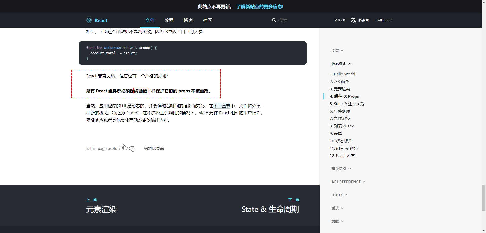


# 第二章：Redux 的基本概念（⭐）

## 2.1 Redux 是什么？

* Redux 是一个使用叫做 `“action”` 的事件来管理和更新应用状态的模式和工具库，它以集中式 Store（centralized store）的方式对整个应用中使用的状态进行集中管理，其规则确保状态只能以可预测的方式更新。

> 注意⚠️：Redux 和 Vue 中的 vuex 以及 Pinia 等没什么区别，都是用来管理状态的。

## 2.2 为什么需要使用 Redux ？

* JavaScript 开发的应用程序，已经变得越来越复杂了： 
  * ① JavaScript 需要管理的`状态`越来越多，越来越复杂。
  * ② 这些状态，包括：`服务器返回的数据`、`缓存数据`、`用户操作产生的数据`等，也`包括一些 UI 的状态`，比如：`某些元素是否被选中`，`是否显示加载动画`，`当前分页`等。
  * ③ ……

* 管理不断变化的 state 是非常困难的：

  * ① `状态之间相互会存在依赖`，一个状态的变化会引起另一个状态的变化，页面也有可能会引起状态的变化；
  * ② 当应用程序复杂时，`state 在什么时候`，`因为什么原因而发生了变化`，`发生了怎么样的变化`，`会变得非常难以控制和追踪`。

* React 是在`视图层`帮助我们解决了 DOM 的渲染过程，但是 `state` 依然是留给我们自己来管理:

  * 无论是`组件定义自己`的 `state`，还是`组件之间的通信`通过 `props` 进行传递，也包括通过 `Context` 进行数据之间的`共享`。
  *  React 主要负责帮助我们`管理视图`，state 如何维护最终还是我们自己来决定。


> 注意⚠️：上图中的 f 是函数的意思，对于 React 而言，就是 render() 函数了。

* `Redux` 就是一个帮助我们管理 `state` 的容器：Redux 是 JavaScript 的状态容器，提供了可预测的状态管理；
* `Redux` 除了和 React 一起使用之外，它也可以和其他界面库一起来使用，如：Vue、React 等，并且它非常小。

## 2.3 什么时候选择使用 Redux ？

* `Redux` 可帮助我们处理共享状态的管理，但与任何工具一样，它也需要权衡利弊。使用 `Redux` 有更多的概念需要学习，还有更多的代码需要编写，需要添加了一些额外代码，并要求你遵循某些限制。这是短期和长期生产力之间的权衡。
* 如果出现下面的情况，就可以考虑使用 Redux 了：
  * ① 应用中有很多 state 在多个组件中需要使用。
  * ② 应用 state 会随着时间的推移而频繁更新。
  * ③ 更新 state 的逻辑很复杂。
  * ④ 中型和大型代码量的应用，很多人协同开发。
  * ⑤ ……

> 注意⚠️：并非所有应用程序都需要 Redux。 可以花一些时间思正在构建的应用程序类型，并决定哪些工具最能帮助解决我们正在处理的问题。

##   2.4 Redux 概念

### 2.4.1 state 的管理

* 以计数器为例：

```jsx {4-6,8-14,16-24}
import {PureComponent} from "react";

export class Counter extends PureComponent {
  state = { // State：组件状态中的数字
    count: 1
  }
  
  increment = (num) => { // Action：当事件触发后，触发状态更新的代码
    this.setState((prevState) => {
      return {
        count: prevState.count + num
      }
    })
  }
  
  render() { // View：视图定义
    const {count} = this.state
    return (
      <div>
        <h2>当前计数为：{count}</h2>
        <button onClick={() => this.increment(1)}>点我+1</button>
      </div>
    )
  }
}
```

* 从上面的代码中，我们可以得到一个组件中包含如下的内容：
  * `State`：驱动应用的真实数据源头。
  * `View`：基于当前状态的视图声明性描述。
  * `Actions`：根据用户的输入在应用程序中发生的事件，触发状态的更新。
* 其实，这就是所谓的`单向数据流`（one-way data flow），即：
  * 用 `State` 来描述应用程序在特定时间点的状况。
  * 基于 `State` 来渲染出 `View`。
  * 当发生某些事情时，如：用户单击按钮，`State` 会根据发生的事情进行更新，生成新的 `State`。
  * 基于新的 `State` 重新渲染 `View`。


* 但是，当我们`有多个组件需要共享或使用相同的 State 的时候`，可能就会变得非常复杂，尤其是当这些组件位于应用程序的不同部分时，我们可以通过`提升 State 到父组件`中来解决，甚至可以使用 React 内置的解决方案 `Context` ；但是，都非常繁琐。
* 解决这个问题的一种方法是从`组件中提取共享 State`，并将其放入`组件树之外`的一个`集中位置`。这样，组件树就变成了一个大 `“View”`，任何组件都可以访问 State 或触发 Action，无论它们在树中的哪个位置！
* 通过定义和分离 State 管理中涉及的概念并强制执行维护 View 和 State 之间独立性的规则，代码变得更结构化和易于维护。

> 注意⚠️：这就是 Redux 背后的基本思想，即：应用中使用`集中式`的全局状态来管理，并明确更新状态的模式，以便让代码具有可预测性。

### 2.4.2 不可变（Immutability）数据的力量

* JavaScript 的对象（object）和数组（array）默认都是 可变的（mutable） 的。如果我创建一个对象，我可以更改其字段的内容。如果我创建一个数组，我也可以更改内容：

```js
const obj = { a: 1, b: 2 }
// 对外仍然还是那个对象，但它的内容已经变了
obj.b = 3

const arr = ['a', 'b']
// 同样的，数组的内容改变了
arr.push('c')
arr[1] = 'd'
```

* 这就是 `改变` 对象或数组的例子。内存中还是原来对象或数组的引用，但里面的内容变化了。
* 如果想要不可变的方式来更新，代码必需先`复制`原来的 `object/array`，然后更新它的复制体，并通过展开运算符来实现这个目的：

```js
const obj = {
  a: {
    // 为了安全的更新 obj.a.c，需要先复制一份
    c: 3
  },
  b: 2
}

const obj2 = {
  // obj 的备份
  ...obj,
  // 覆盖 a
  a: {
    // obj.a 的备份
    ...obj.a,
    // 覆盖 c
    c: 42
  }
}

const arr = ['a', 'b']
// 创建 arr 的备份，并把 c 拼接到最后。
const arr2 = arr.concat('c')

// 或者，可以对原来的数组创建复制体
const arr3 = arr.slice()
// 修改复制体
arr3.push('c')
```

* Redux 期望所有`状态更新`都是使用`不可变`的方式。为什么？答案在[这里](https://aexiar.github.io/web-design/notes/07_React18/05_xdx/#_1-5-%E4%B8%8D%E5%8F%AF%E5%8F%98%E6%95%B0%E6%8D%AE%E7%9A%84%E5%8A%9B%E9%87%8F)。

## 2.5 Redux 的术语

### 2.5.1 概述

* Redux 的工作流程如下所示：


* 通过上图，我们得知 Redux 中有 `Store`、`Action`、`ActionCreators` 、`Reducers` 、`Dispatch` 的概念。

### 2.5.2 Store

* Store 是用来集中保存 React 数据的地方，在 Redux 中，应用中的 state 都应该`集中`保存在名为 `store` 的对象中。

> 注意⚠️：
>
> * 前文提到了，Redux 背后的基本思想，即：应用中使用`集中式`的全局状态来管理，并明确更新状态的模式，以便让代码具有可预测性。
> * 所以，对于 Redux 而言，一个项目有且仅有一个 `store` 对象。

* 并且，store 对象是通过一个 reducer （后文讲解，reducer 是一个纯函数） 来创建的，store 对象中有一个 getState() 的方法，返回当前的状态值。

```js {16}
import {createStore} from "redux"

/**
 * 定义 reducer 纯函数，此处不对 reducer 有过多讲解，将其理解为 const add = (num1,num2) => num1 + num2 也可以
 */
const reducer = () => {
  return {}
}

// 创建一个 store 对象
const store = createStore(reducer)

// 将 store 对象暴露
export default store
```

### 2.5.3 Action

* Redux 要求我们通过 Action 来更新数据；其实，我们在界面（View）中是通过 `store.dispatch(action)` 来触发更新的。
* Action 其实就是一个具有 `type` 字段的`普通 JavaScript 对象`，类似于：

```js {2}
const addAction = {
    type: 'INCREMENT',
    payload: '1'
}
```

* 对于 type 字段而言，只要是字符串即可；但是，有的时候，为了规范而言，我们通常会写成 `"域/事件名称"` 的形式；其中，`域` 表示这个 Action 所属的特征或类别，`事件名称`就是发生的具体事情，如：

```js {2}
const addAction = {
    type: 'todos/INCREMENT', // 看个人喜好，不强求，只要在项目中保持唯一即可
    payload: '1'
}
```

### 2.5.4 Reducer

* reducer 是一个纯函数，接收当前的 state 和一个 action 对象，必要的时候决定如何更新，并返回新的状态。函数的签名是：`(state, action) => newState`，类似于：

```js {9}
import {createStore} from "redux"

/**
 * 定义 reducer 纯函数
 * @param state 当前的 state
 * @param action 本次需要更新的 action
 * @return store 中存储的 state
 */
const reducer = (state , action) => {
  return state
}

const store = createStore(reducer)

export default store
```

* 我们可以将 `reducer` 看做是一个事件监听器，它会根据接收到的 `action` 事件的`类型`处理事件，并返回对应的状态。

* 同时，reducer 需要符合以下的规则：
  * ① 仅仅使用 `state` 和 `action` 参数来计算新的状态值。
  * ② 禁止直接修改 `state`，必须通过复制现有的 `state` 并对复制的值进行更改的方式来做 `不可变更新`。
  * ③ 禁止任何异步逻辑、依赖随机值或导致其他`“副作用”`的代码。

> 注意⚠️：其实，上面就是要求 reducer 是一个纯函数而已。

* 并且，`reducer` 函数内部的逻辑通常遵循以下的步骤：
  * ① 检查 reducer 是否匹配到 action：
    * 如果是，则复制 state，使用新值更新 state 副本，然后返回新的 state 。
  * ② 否则，返回原来的 state 。

* 下面是一个简单的 reducer 案例：

```js {14-33}
import {createStore} from "redux"

// 初始化的 state
const initialState = {
  count: 0
}

/**
 * 定义 reducer 纯函数
 * @param state 当前的 state
 * @param action 本次需要更新的 action
 * @return store 中存储的 state
 */
const reducer = (state = initialState, action) => {
  console.log('reducer', state, action)
  switch (action.type) {
    case 'INCREMENT':
      const newRes = {
        ...state,
        count: state.count + action.payload
      }
      console.log('newRes', newRes)
      return newRes
    case 'DECREMENT':
      return {
        ...state,
        count: state.count - action.payload
      }
    default: {
      return state
    }
  }
}

const store = createStore(reducer)

export default store
```

> 注意⚠️： reduer() 函数内部可以使用任何类型的逻辑来决定新状态是什么，如：if-else、switch、循环等。

* `reduer()` 来源于 JavaScript 中的 `Array.reduce()` ，通常我们是这么使用的：

```js
const arr = [1, 2, 3, 4, 5, 6, 7, 8, 9]
const result = arr.reduce((pre, cur) => pre + cur, 0)
console.log(result) // 45
```

* 上述案例中数组的 `reduce()` 方法中传入了一个`回调函数`和一个`初始化值`。这个回调函数接收`之前的结果`和`当前的结果`，并`返回一个新的结果`。
* Redux 中的 `reducer()` 函数和数组中的 `reduce()` 方法的想法是完全一样的，它接收`上一个结果的 state` 和 `当前的 action` ，并`返回一个新的 state`。

```js {14,29-31}
import {createStore} from "redux"

// 初始化的 state
const initialState = {
  count: 0
}

/**
 * 定义 reducer 纯函数
 * @param state 当前的 state
 * @param action 本次需要更新的 action
 * @return store 中存储的 state
 */
const reducer = (state = initialState, action) => {
  console.log('reducer', state, action)
  switch (action.type) {
    case 'INCREMENT':
      const newRes = {
        ...state,
        count: state.count + action.payload
      }
      console.log('newRes', newRes)
      return newRes
    case 'DECREMENT':
      return {
        ...state,
        count: state.count - action.payload
      }
    default: {
      return state
    }
  }
}

const store = createStore(reducer)

export default store
```

* 这也就不难理解 `reducer` 函数内部的执行逻辑了。

### 2.5.5 Dispatch

* Redux 的 store 对象上有一个方法是 `dispatch`。更新 state 的唯一方式就是使用`store.dispatch()` 并传入一个 action 对象。
* store 对象将执行所有 reducer 函数并计算出更新后的 state，调用 `getState()` 可以获取新 state。

```jsx {11}
import React, {PureComponent} from 'react'
import store from "@/store"

class App extends PureComponent {
  
  state = {
    count: store.getState().count
  }
  
  add(num) {
    store.dispatch({type: 'INCREMENT', payload: num})
  }
    
  componentDidMount() {
    this.unSubscribe = store.subscribe(() => {
      console.log('订阅数据的变化', store.getState())
      const {count} = store.getState()
      this.setState({...this.state, count})
    })
  }
  
  componentWillUnmount() {
    this.unSubscribe()
  }
  
  render() {
    const {count} = this.state
    return (
      <div>
        <h2>当前计数为：{count}</h2>
        <button onClick={() => this.add(1)}>点我+1</button>
     
      </div>
    )
  }
}

export default App
```

## 2.6 Redux 的数据流

* 前文，我们提到了 `单向数据流`，它描述了更新应用程序的以下步骤：
  * ① 用 `State` 来描述应用程序在特定时间点的状况。
  * ② 基于 `State` 来渲染出 `View`。
  * ③ 当发生某些事情时，如：用户单击按钮，`State` 会根据发生的事情进行更新，生成新的 `State`。
  * ④ 基于新的 `State` 重新渲染 `View`。

* 具体来说，对于 Redux，我们可以将这些步骤分解为更详细的内容：
  * ① 初始启动：
    * 使用最顶层的 root reducer 函数创建 Redux store。
    * store 调用一次 root reducer，并将返回值保存为它的初始 `state`。
    * 当视图`首次渲染`时，视图组件访问 Redux store 的当前 state，并使用该数据来决定要呈现的内容。同时监听 store 的更新，以便他们可以知道 state 是否已更改。
  * ② 更新环节：
    * 应用程序中发生了某些事情，如：用户单击按钮。
    * dispatch 一个 action 到 Redux store，例如 `dispatch({type: 'counter/increment'})`。
    * store 用之前的 `state` 和当前的 `action` 再次运行 reducer 函数，并将返回值保存为新的 `state`。
    * store 通知所有订阅过的视图，通知它们 store 发生更新。
    * 每个订阅过 store 数据的视图 组件都会检查它们需要的 state 部分是否被更新。
    * 发现数据被更新的每个组件都强制使用新数据重新渲染，紧接着更新网页。
* 下面是 Redux 数据流更新的动画：


## 2.7 Redux 使用的三大原则

* ① `单一数据源`：
  * 整个应用程序的 `state` 被存储到一颗 `Object Tree` 中，并且`这个 Object Tree 只存储在一个 store 中`。
  * Redux `并没有强制我们不能创建多个 store` ，但是那样`不利于数据的维护`。
  * `单一数据源`可以`让`整个应用程序的 `state` 方便`维护`、`追踪`和`修改`。
* ② `state 是只读的`：
  * 唯一修改 State 的方法就是在组件中通过 store 对象 `触发（Dispatch）` Action，不要试图通过其他的任何方式来修改 State。
  * 这样确保了视图（View）或网络请求都`不能直接修改 State`，它们只能`通过 action 来描述自己想要如何去修改 State`。
  * 这样可以`保证所有的修改都被集中化处理`，并且`按照严格的顺序来执行`，所以`不需要担心race condition（竟态）的问题`。
* ③ `使用纯函数来执行修改`：
  * 通过 `reducer`将 `旧state`和 `actions` 联系在一起，并且返回一个`新`的 `State`：
  * 随着应用程序的复杂度增加，我们可以将 `reducer` 拆分成`多个`小的 `reducers`，分别操作不同 state tree 的一部分；
  * 但是所有的 `reducer` 都应该是`纯函数`，不能产生任何的副作用。


# 第三章：Redux 的快速入门（⭐）

## 3.1 Redux 的快速入门

* 案例：实现下面的效果。

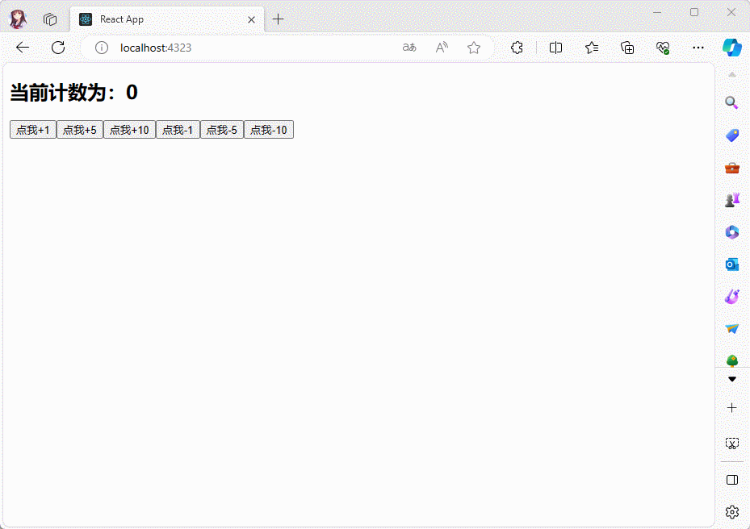

* 安装 redux ：

```shell
npm install redux
```

* 项目结构：

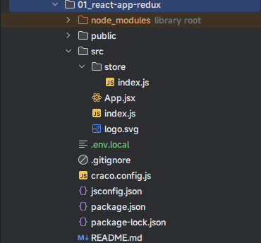

* 示例：
* 其中，App.jsx

```jsx {2,7,12,17,21,37-42}
import React, {PureComponent} from 'react'
import store from "@/store"

class App extends PureComponent {
  
  state = {
    count: store.getState().count
  }
  
  add(num) {
    // 通过 store 触发 Action
    store.dispatch({type: 'INCREMENT', payload: num})
  }
  
  sub(num) {
    // 通过 store 触发 Action
    store.dispatch({type: 'DECREMENT', payload: num})
  }
  
  componentDidMount() {
    this.unSubscribe = store.subscribe(() => {
      console.log('订阅数据的变化', store.getState())
      const {count} = store.getState()
      this.setState({...this.state, count})
    })
  }
  
  componentWillUnmount() {
    this.unSubscribe()
  }
  
  render() {
    const {count} = this.state
    return (
      <div>
        <h2>当前计数为：{count}</h2>
        <button onClick={() => this.add(1)}>点我+1</button>
        <button onClick={() => this.add(5)}>点我+5</button>
        <button onClick={() => this.add(10)}>点我+10</button>
        <button onClick={() => this.sub(1)}>点我-1</button>
        <button onClick={() => this.sub(5)}>点我-5</button>
        <button onClick={() => this.sub(10)}>点我-10</button>
      </div>
    )
  }
}

export default App
```

> 注意⚠️：
>
> * 目前，只能通过 `store.subscribe` 来监听 redux 中 state 的变化，后期会使用 [HOC](https://aexiar.github.io/web-design/notes/07_React18/06_xdx/) 来进行优化。
> * 目前，为了实现 redux 中 state 变化，页面跟着刷新，当前的临时解决方案是：将数据放到组件内部的 state 中；后期也会使用 [HOC](https://aexiar.github.io/web-design/notes/07_React18/06_xdx/) 来进行优化。

* 其中，store/index.js

```js {4,14,36}
import {createStore} from "redux"

// 初始化的 state
const initialState = {
  count: 0
}

/**
 * 定义 reducer 纯函数
 * @param state 当前的 state
 * @param action 本次需要更新的 action
 * @return store 中存储的 state
 */
const reducer = (state = initialState, action) => {
  console.log('reducer', state, action)
  switch (action.type) {
    case 'INCREMENT':
      const newRes = {
        ...state,
        count: state.count + action.payload
      }
      console.log('newRes', newRes)
      return newRes
    case 'DECREMENT':
      return {
        ...state,
        count: state.count - action.payload
      }
    default: {
      return state
    }
  }
}

// 创建 Store 对象
const store = createStore(reducer)

export default store
```

## 3.2 优化快速入门

* 在实际开发中，如果我们将所有的逻辑代码都写到一起，会让 redux 变得非常复杂且难以维护，通过我们会将代码拆分为如下的文件：
  * `store/index.js` ：用于创建 Store 对象的。
  * `store/reducer.js`：用于创建 reducer 函数的。
  * `store/actionCreateor.js`：用于创建 action 对象的。
  * `store/constants.js` ：用于保存 Action 中的 type 字符串的。

* 项目结构：


* 示例：
* 其中，store/constant.js

```js
/* 该文件主要维护 Action 中 type 的名称 */
export const ADD_COUNTER = 'INCREMENT'

export const SUB_COUNTER = 'DECREMENT'
```

* 其中，store/actionCreator.js

```js {8,18}
import * as ActionTypes from './constant'

/**
 * 添加计数器函数，用来生成 action 对象
 * @param payload
 * @returns {{payload, type: string}} 返回 Action
 */
export const addCountAction = (payload) => ({
  type: ActionTypes.ADD_COUNTER,
  payload
})

/**
 * 减少计数器函数，用来生成 action 对象
 * @param payload
 * @returns {{payload, type: string}} 返回 Action
 * */
export const subCountAction = (payload) => ({
  type: ActionTypes.SUB_COUNTER,
  payload
})
```

* 其中，store/reducers.js

```js
import * as ActionTypes from './constant'
// 初始化的 state
const initialState = {
  count: 0
}
/**
 * 定义 reducer 纯函数
 * @param state 当前的 state
 * @param action 本次需要更新的 action
 * @return store 中存储的 state
 */
export const reducer = (state = initialState, action) => {
  console.log('reducer', state, action)
  switch (action.type) {
    case ActionTypes.ADD_COUNTER:
      const newRes = {
        ...state,
        count: state.count + action.payload
      }
      console.log('newRes', newRes)
      return newRes
    case ActionTypes.SUB_COUNTER:
      return {
        ...state,
        count: state.count - action.payload
      }
    default: {
      return state
    }
  }
}
```

* 其中，store/index.js

```js
import {createStore} from "redux"
import {reducer} from "@/store/reducers"

// 创建 Store 对象
const store = createStore(reducer)

export default store
```

* 其中，App.jsx

```jsx {2-3,8,12,16}
import React, {PureComponent} from 'react'
import store from "@/store"
import {addCountAction, subCountAction} from "@/store/actionCreateor"

class App extends PureComponent {
  
  state = {
    count: store.getState().count
  }
  
  add(num) {
    store.dispatch(addCountAction(num))
  }
  
  sub(num) {
    store.dispatch(subCountAction(num))
  }
  
  componentDidMount() {
    this.unSubscribe = store.subscribe(() => {
      console.log('订阅数据的变化', store.getState())
      const {count} = store.getState()
      this.setState({...this.state, count})
    })
  }
  
  componentWillUnmount() {
    this.unSubscribe()
  }
  
  render() {
    const {count} = this.state
    return (
      <div>
        <h2>当前计数为：{count}</h2>
        <button onClick={() => this.add(1)}>点我+1</button>
        <button onClick={() => this.add(5)}>点我+5</button>
        <button onClick={() => this.add(10)}>点我+10</button>
        <button onClick={() => this.sub(1)}>点我-1</button>
        <button onClick={() => this.sub(5)}>点我-5</button>
        <button onClick={() => this.sub(10)}>点我-10</button>
      </div>
    )
  }
}

export default App
```

## 3.3 优化快速入门

* 为了方便后续的操作，我们需要将 `App.jsx` 中的代码抽取到一个名为 `Counter` 的组件中，并实现如下的效果。

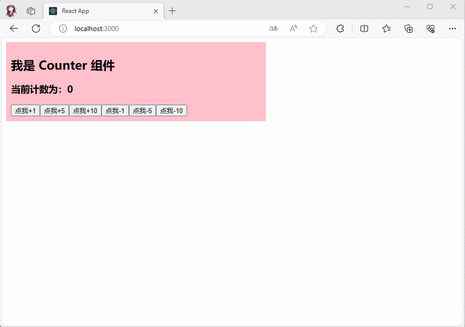

* 项目结构：

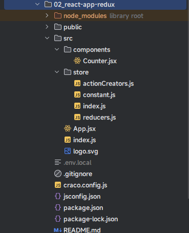

* 示例：
* 其中，components/Counter.jsx

```jsx
import React, {PureComponent} from 'react'
import store from "@/store"
import {addCountAction, subCountAction} from "@/store/actionCreators"

class Counter extends PureComponent {
  
  state = {
    message: '我是 Counter 组件',
    count: store.getState().count
  }
  
  add(num) {
    store.dispatch(addCountAction(num))
  }
  
  sub(num) {
    store.dispatch(subCountAction(num))
  }
  
  componentDidMount() {
    this.unSubscribe = store.subscribe(() => {
      console.log('订阅数据的变化', store.getState())
      const {count} = store.getState()
      this.setState({...this.state, count})
    })
  }
  
  componentWillUnmount() {
    this.unSubscribe()
  }
  
  render() {
    const {count, message} = this.state
    return (
      <div>
        <h2>{message}</h2>
        <h3>当前计数为：{count}</h3>
        <button onClick={() => this.add(1)}>点我+1</button>
        <button onClick={() => this.add(5)}>点我+5</button>
        <button onClick={() => this.add(10)}>点我+10</button>
        <button onClick={() => this.sub(1)}>点我-1</button>
        <button onClick={() => this.sub(5)}>点我-5</button>
        <button onClick={() => this.sub(10)}>点我-10</button>
      </div>
    )
  }
}

export default Counter
```

* 其中，store/constant.js

```js
/* 该文件主要维护 Action 中 type 的名称 */
export const ADD_COUNTER = 'INCREMENT'

export const SUB_COUNTER = 'DECREMENT'
```

* 其中，store/actionCreators.js

```js
import * as ActionTypes from './constant'

/**
 * 添加计数器
 * @param payload
 * @returns {{payload, type: string}} 返回 Action
 */
export const addCountAction = (payload) => ({
  type: ActionTypes.ADD_COUNTER,
  payload
})

/**
 * 减少计数器
 * @param payload
 * @returns {{payload, type: string}} 返回 Action
 * */
export const subCountAction = (payload) => ({
  type: ActionTypes.SUB_COUNTER,
  payload
})
```

* 其中，store/reducers.js

```js
import * as ActionTypes from './constant'
// 初始化的 state
const initialState = {
  count: 0
}
/**
 * 定义 reducer 纯函数
 * @param state 当前的 state
 * @param action 本次需要更新的 action
 * @return store 中存储的 state
 */
export const reducer = (state = initialState, action) => {
  console.log('reducer', state, action)
  switch (action.type) {
    case ActionTypes.ADD_COUNTER:
      const newRes = {
        ...state,
        count: state.count + action.payload
      }
      console.log('newRes', newRes)
      return newRes
    case ActionTypes.SUB_COUNTER:
      return {
        ...state,
        count: state.count - action.payload
      }
    default: {
      return state
    }
  }
}
```

* 其中，store/index.js

```js
import {createStore} from "redux"
import {reducer} from "@/store/reducers"

// 创建 Store 对象
const store = createStore(reducer)

export default store
```

* 其中，App.jsx

```jsx
import React, {PureComponent} from 'react'
import Counter from "@/components/Counter";

class App extends PureComponent {
  
  render() {
    return (
      <div>
        <div style={{background: "pink", padding: '10px', width: '500px'}}>
          <Counter/>
        </div>
      </div>
    )
  }
}

export default App
```


# 第四章：React-Redux 的使用（⭐）

## 4.1 概述

* 之前，我们在使用 Counter 组件的时候；会发现很多代码，如果在其他组件中，也这么使用，会显得很重复：

```jsx {9,20-26,28-30}
import React, {PureComponent} from 'react'
import store from "@/store"
import {addCountAction, subCountAction} from "@/store/actionCreators"

class Counter extends PureComponent {
  
  state = {
    message: '我是 Counter 组件',
    count: store.getState().count
  }
  
  add(num) {
    store.dispatch(addCountAction(num))
  }
  
  sub(num) {
    store.dispatch(subCountAction(num))
  }
  
  componentDidMount() {
    this.unSubscribe = store.subscribe(() => {
      console.log('订阅数据的变化', store.getState())
      const {count} = store.getState()
      this.setState({...this.state, count})
    })
  }
  
  componentWillUnmount() {
    this.unSubscribe()
  }
  
  render() {
    const {count, message} = this.state
    return (
      <div>
        <h2>{message}</h2>
        <h3>当前计数为：{count}</h3>
        <button onClick={() => this.add(1)}>点我+1</button>
        <button onClick={() => this.add(5)}>点我+5</button>
        <button onClick={() => this.add(10)}>点我+10</button>
        <button onClick={() => this.sub(1)}>点我-1</button>
        <button onClick={() => this.sub(5)}>点我-5</button>
        <button onClick={() => this.sub(10)}>点我-10</button>
      </div>
    )
  }
}

export default Counter
```

* 那么，我们可以使用 `HOC（高阶组件）`和 `React 内置的 Context` 来解决这个问题；但是，在实际开发中，我们会使用 redux 官方提供的 `react-redux` 库，其实现更为严谨和高效。

> 注意⚠️：react-redux 库的原理还是通过 `HOC（高阶组件）`和 `React 内置的 Context` 来解决上述的问题。

* 安装 react-redux ：

```shell
npm install react-redux
```

* 使用步骤如下：
  * ① 安装 react-redux：使用 npm 或 yarn 安装 react-redux 库。
  * ② 创建 Redux Store：可以使用 Redux 的 createStore 函数来创建一个全局的 store，并传入 rootReducer（根 reducer）和可选的中间件。
  * ③ 在应用入口传递 store：在应用入口（index.js）中通过 Provider 传递 store 对象。
  * ④ 创建 React 组件：创建需要连接到 Redux 的 React 组件。可以使用 React 的函数组件或类组件。
  * ⑤ 使用 connect 函数连接组件：使用 react-redux 提供的 connect 函数，将 React 组件与 Redux 的 store 进行连接。在组件中使用 connect 函数，传入 mapStateToProps 和 mapDispatchToProps 函数，将 Redux 的 state 和 action 与组件进行绑定。
  * ⑥ 定义 mapStateToProps 函数：在 mapStateToProps 函数中，指定需要从 Redux 的 state 中获取的数据，并将其映射到组件的 props 上。
  * ⑦ 定义 mapDispatchToProps 函数：在 mapDispatchToProps 函数中，指定需要将哪些 action 创建函数绑定到组件的 props 上，以便在组件中触发相应的 action。
  * ⑧ 在组件中使用 Redux 数据和触发 action：通过组件的 props，可以访问 Redux 的 state 数据和触发相应的 action。

## 4.2 基本使用

### 4.2.1 需求、项目结构、基础环境搭建

* 需求：实现 Home 组件中也共享 Counter 组件的状态和操作。

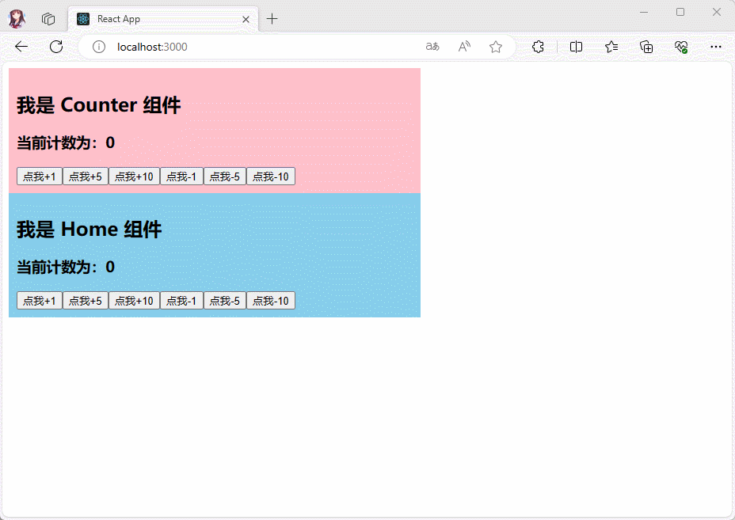

* 项目结构：


* 基础环境搭建：Counter 组件的搭建，[略](https://aexiar.github.io/web-design/notes/07_React18/08_xdx/#_3-3-%E4%BC%98%E5%8C%96%E5%BF%AB%E9%80%9F%E5%85%A5%E9%97%A8)。

### 4.2.2 功能实现

* `React-Redux` 最主要就是在全局传递 store 对象；所以，我们需要在 index.js 中，这样写：

```js {4-5,9,13}
import React from 'react'
import ReactDOM from 'react-dom/client'
import App from '@/App'
import store from "@/store"
import {Provider} from "react-redux"

const root = ReactDOM.createRoot(document.getElementById('root'))
root.render(
  <Provider store={store}>
    <React.StrictMode>
      <App/>
    </React.StrictMode>
  </Provider>
)
```

* 看到这样的代码，难道不觉得很熟悉吗？很像 React 中的内置 Context ，如下所示：

```jsx {1,3}
<CounterContext.Provider value={count}>
    <Counter/>
</CounterContext.Provider>
```

* 其实，`React-Redux` 提供了 connect() 函数供我们在组件中使用；需要`注意⚠️`的是，`connect() 函数的返回值才是高阶组件`，所以 Home 组件，就应该这么写：

```jsx {2,22-23}
import React, {PureComponent} from 'react'
import {connect} from 'react-redux'
import {addCountAction, subCountAction} from "@/store/actionCreators"

class Home extends PureComponent {
  
  state = {
    message: '我是 Home 组件',
  }
  
  
  render() {
    
    return (
      <div>
        <h2>{message}</h2>
        <h3>当前计数为：0</h3>
      </div>
    )
  }
}
// connect() 函数的返回值是高阶组件，不是 connect() 函数是高阶组件，所以只能 connect()(Home) 这么写
export default connect()(Home)
```

* connect() 函数有两个参数，并且都是函数，所以我们可以这么写：

```jsx {22-25}
import React, {PureComponent} from 'react'
import {connect} from 'react-redux'
import {addCountAction, subCountAction} from "@/store/actionCreators"

class Home extends PureComponent {
  
  state = {
    message: '我是 Home 组件',
  }
  
  
  render() {
    
    return (
      <div>
        <h2>{message}</h2>
        <h3>当前计数为：0</h3>
      </div>
    )
  }
}
// connect(fn1,fn2) 函数的返回值是高阶组件，不是 connect() 函数是高阶组件，所以只能 connect()(Home) 这么写
function fn1(){}
function fn2(){}
export default connect(fn1,fn2)(Home)
```

* 其中，第一个参数 fn1 函数是将 state 映射到 props 上，所以我们通常命名为 `mapStateToProps`，并且 `mapStateToProps` 函数的`参数`是 Redux 中的 `state`，而`返回值`就一个`对象`，即：

```jsx {22-28}
import React, {PureComponent} from 'react'
import {connect} from 'react-redux'
import {addCountAction, subCountAction} from "@/store/actionCreators"

class Home extends PureComponent {
  
  state = {
    message: '我是 Home 组件',
  }
  
  
  render() {
    
    return (
      <div>
        <h2>{message}</h2>
        <h3>当前计数为：0</h3>
      </div>
    )
  }
}
// connect(fn1,fn2) 函数的返回值是高阶组件，不是 connect() 函数是高阶组件，所以只能 connect()(Home) 这么写
// 其中，第一个参数 fn1，即函数 fn1 是将 state 映射到 props 上，所以我们通常命名为 `mapStateToProps`，并且 `mapStateToProps` 函数的`参数`是 Redux 中的 `state`，而`返回值`就一个`对象`
function mapStateToProps(state){
    return {
        count: state.count
    }
}
function fn2(){}
export default connect(mapStateToProps,fn2)(Home)
```

* 其实，看到这边，我们都应该能猜到其内部是怎么实现的，其伪代码类似：

```jsx {27-28}
function connect(mapStateToProps, fn2) {
  // 返回一个高阶组件
  return function(WrappedComponent) {
    // 返回一个新的组件
     class ConnectedComponent extends React.Component {
         
      state = {
         reduxState: store.getState();
      }
         
      componentDidMount() {
        // 订阅 Redux 的状态变化
        this.unsubscribe = store.subscribe(()=>{
            this.setState({
                reduxState:  store.getState()
            })
        });
      }
         
      componentWillUnmount() {
        // 取消订阅 Redux 的状态变化
        this.unsubscribe();
      }
      
      render() {
        
        // 执行 mapStateToProps 回调函数将 Redux 中的 state 传入，然后获取返回的对象，再通过 props 传递给被包裹的组件   
        const mappedState = mapStateToProps(this.state.reduxState);

        // 将映射后的 props 传递给被包裹的组件
        return <WrappedComponent {...mappedState} {...this.props} />;
      }
    };
      
    return ConnectedComponent;
  };
}
```

* 其中，第二个参数 fn2 函数是将 dispatch 映射到 props 上，所以我们通常命名为 `mapDispatchToProps`，并且 `mapDispatchToProps` 函数的`参数`是 Redux 中的 `dispatch`，而`返回值`就一个`对象`，即：

```jsx {34-39}
import React, {PureComponent} from 'react'
import {connect} from 'react-redux'
import {addCountAction, subCountAction} from "@/store/actionCreators"

class Home extends PureComponent {
  
  state = {
    message: '我是 Home 组件',
  }
  
  
  render() {
    const {message} = this.state
    console.log('Home props', this.props)
    return (
      <div>
        <h2>{message}</h2>
        <h3>当前计数为：0</h3>
      </div>
    )
  }
}

// connect(fn1,fn2) 函数的返回值是高阶组件
// 其中，fn1 是将 state 映射到 props 上，通常命名为 mapStateToProps
// 其中，fn2 是将 dispatch 映射到 props 上，通常命名为 mapDispatchToProps

function mapStateToProps(state) {
  return { // 该对象会通过 props 传递给子组件
    count: state.count
  }
}

function mapDispatchToProps(dispatch) {
  return { // 该对象会通过 props 传递给子组件
    add: (num) => dispatch(addCountAction(num)),
    sub: (num) => dispatch(subCountAction(num))
  }
}

export default connect(mapStateToProps, mapDispatchToProps)(Home)
```

* `Home` 组件是`类`组件，拥有封装性，而 `mapStateToProps` 回调函数和 `mapDispatchToProps` 回调函数，是 `connect()` 函数为了实现功能而提供的，和 Home 组件没有任何关系，可以使用`箭头函数`来简化，即：

```jsx {27-29,31-34}
import React, {PureComponent} from 'react'
import {connect} from 'react-redux'
import {addCountAction, subCountAction} from "@/store/actionCreators"

class Home extends PureComponent {
  
  state = {
    message: '我是 Home 组件',
  }
  
  render() {
    const {message} = this.state
    console.log('Home props', this.props)
    return (
      <div>
        <h2>{message}</h2>
        <h3>当前计数为：0</h3>
      </div>
    )
  }
}

// connect(fn1,fn2) 函数的返回值是高阶组件
// 其中， fn1 是将 state 映射到 props 上，通常命名为 mapStateToProps
// 其中，fn2 是将 dispatch 映射到 props 上，通常命名为 mapDispatchToProps

const mapStateToProps = (state) => ({
  count: state.count
})

const mapDispatchToProps = (dispatch) => ({
  add: (num) => dispatch(addCountAction(num)),
  sub: (num) => dispatch(subCountAction(num))
})

export default connect(mapStateToProps, mapDispatchToProps)(Home)
```

* 那么，我们就可以从 props 中获取我们所想要的 `state` 和 `action(通过 dispatch 分发)`，即：

```jsx {14}
import React, {PureComponent} from 'react'
import {connect} from 'react-redux'
import {addCountAction, subCountAction} from "@/store/actionCreators"

class Home extends PureComponent {
  
  state = {
    message: '我是 Home 组件',
  }
  
  render() {
    const {message} = this.state
    console.log('Home props', this.props)
    const {count, add, sub} = this.props
    return (
      <div>
        <h2>{message}</h2>
        <h3>当前计数为：{count}</h3>
        <button onClick={() => add(1)}>点我+1</button>
        <button onClick={() => add(5)}>点我+5</button>
        <button onClick={() => add(10)}>点我+10</button>
        <button onClick={() => sub(1)}>点我-1</button>
        <button onClick={() => sub(5)}>点我-5</button>
        <button onClick={() => sub(10)}>点我-10</button>
      </div>
    )
  }
}

// connect(fn1,fn2) 函数的返回值是高阶组件
// 其中， fn1 是将 state 映射到 props 上，通常命名为 mapStateToProps
// 其中，fn2 是将 dispatch 映射到 props 上，通常命名为 mapDispatchToProps

const mapStateToProps = (state) => ({
  count: state.count
})

const mapDispatchToProps = (dispatch) => ({
  add: (num) => dispatch(addCountAction(num)),
  sub: (num) => dispatch(subCountAction(num))
})

export default connect(mapStateToProps, mapDispatchToProps)(Home)
```

* 可能，很多人不是很理解，下面的代码：

```jsx
const mapDispatchToProps = (dispatch) => ({
  add: (num) => dispatch(addCountAction(num)),
  sub: (num) => dispatch(subCountAction(num))
})
```

* 其代码的`演化过程`，如下所示：

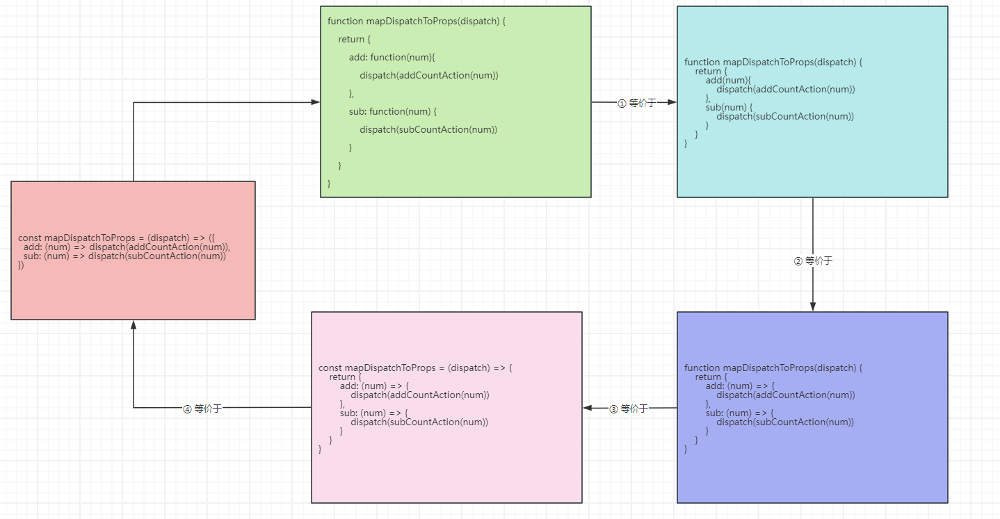

* 那么，App.jsx 的代码，如下所示：

```jsx
import React, {PureComponent} from 'react'
import Counter from "@/components/Counter"
import Home from "@/components/Home"

class App extends PureComponent {
  
  render() {
    return (
      <div>
        <div style={{background: "pink", padding: '10px', width: '500px'}}>
          <Counter/>
        </div>
        <div style={{background: "skyblue", padding: '10px', width: '500px'}}>
          <Home/>
        </div>
      </div>
    )
  }
}

export default App
```

### 4.2.3 功能优化

* 既然，功能已经实现完毕了，就可以将之前 Counter 组件删除了，因为其没有使用 react-redux ；之后，我们再将 Home 组件改名为 Counter 组件。
* 项目结构：

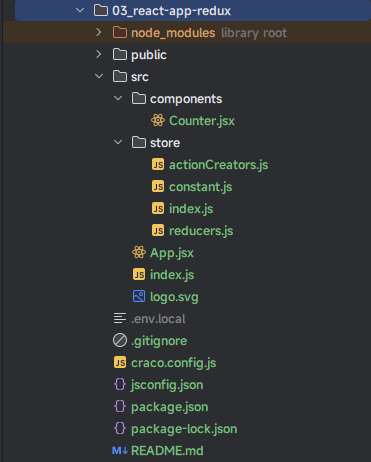

* 那么，此时的 Counter 组件的代码如下：

```jsx
import React, {PureComponent} from 'react'
import {connect} from 'react-redux'
import {addCountAction, subCountAction} from "@/store/actionCreators"

class Counter extends PureComponent {
  
  state = {
    message: '我是 Counter 组件',
  }
  
  render() {
    const {message} = this.state
    console.log('Counter props', this.props)
    const {count, add, sub} = this.props
    return (
      <div>
        <h2>{message}</h2>
        <h3>当前计数为：{count}</h3>
        <button onClick={() => add(1)}>点我+1</button>
        <button onClick={() => add(5)}>点我+5</button>
        <button onClick={() => add(10)}>点我+10</button>
        <button onClick={() => sub(1)}>点我-1</button>
        <button onClick={() => sub(5)}>点我-5</button>
        <button onClick={() => sub(10)}>点我-10</button>
      </div>
    )
  }
}

// connect(fn1,fn2) 函数的返回值是高阶组件
// 其中， fn1 是将 state 映射到 props 上，通常命名为 mapStateToProps
// 其中，fn2 是将 dispatch 映射到 props 上，通常命名为 mapDispatchToProps

const mapStateToProps = (state) => ({
  count: state.count
})

const mapDispatchToProps = (dispatch) => ({
  add: (num) => dispatch(addCountAction(num)),
  sub: (num) => dispatch(subCountAction(num))
})

export default connect(mapStateToProps, mapDispatchToProps)(Counter)
```

* App.jsx 的代码如下：

```jsx
import React, {PureComponent} from 'react'
import Counter from "@/components/Counter"

class App extends PureComponent {
  
  render() {
    return (
      <div>
        <div style={{background: "pink", padding: '10px', width: '500px'}}>
          <Counter/>
        </div>
      </div>
    )
  }
}

export default App
```

## 4.3 组件中的异步操作

### 4.3.1 概述

* 在上面的案例中，redux 中保存的数据是一个本地的数据；所以，我们可以通过 `dispatch` 分发一个 action，那么 redux 中 store 保存的 state 数据就会立即更新。

* 但是，在实际开发中，很多时候 `redux` 中`保存的数据`往往`来自服务器`，我们需要进行`异步的请求`，再`将数据保存到 redux` 中。
* 需要`注意⚠️`的是:`dispatch action 是一个同步操作`，即 redux 中的 reducer 默认是不能处理异步的请求的，那咋办？其实，对于 React 中的类式组件而言，我们可以通过 `componentDidMount` 发送异步请求，然后将数据保存到 redux 中不就可以了。
* 对应的流程图如下：

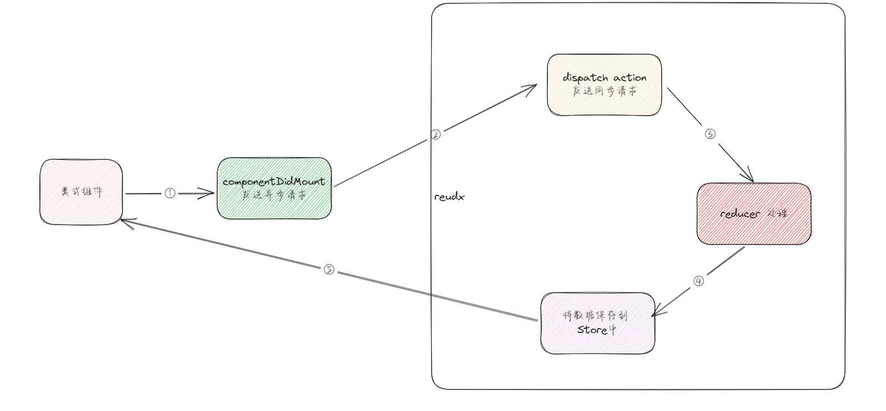

### 4.3.2 案例

* 需求：异步获取轮播图的数据。

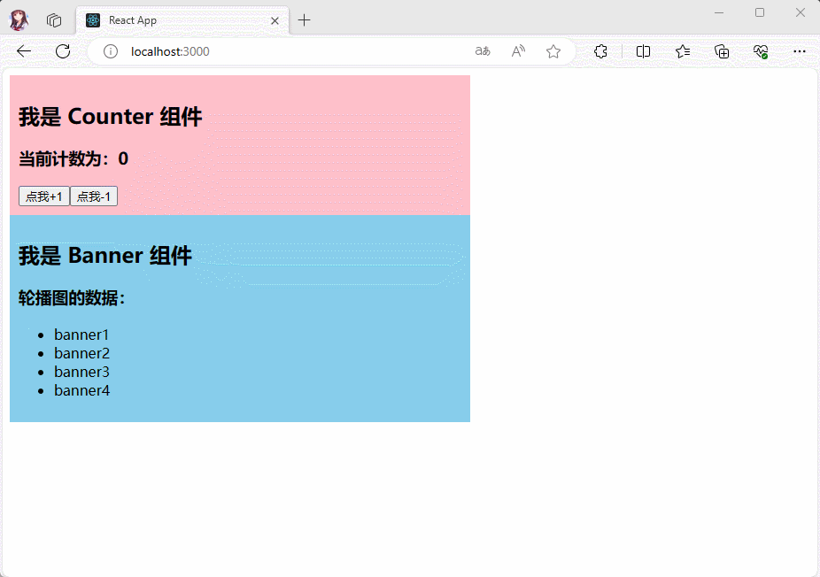

* 项目结构：

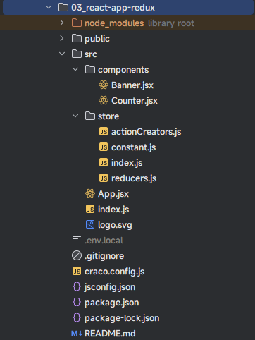

* 示例：
* 其中，store/constant.js

```js {6}
/* 该文件主要维护 Action 中 type 的名称 */
export const ADD_COUNTER = 'INCREMENT'

export const SUB_COUNTER = 'DECREMENT'

export const ADD_BANNER = 'ADD_BANNER'
```

* 其中，store/actionCreators.js

```js {28-31}
import * as ActionTypes from './constant'

/**
 * 添加计数器
 * @param payload
 * @returns {{payload, type: string}} 返回 Action
 */
export const addCountAction = (payload) => ({
  type: ActionTypes.ADD_COUNTER,
  payload
})

/**
 * 减少计数器
 * @param payload
 * @returns {{payload, type: string}} 返回 Action
 * */
export const subCountAction = (payload) => ({
  type: ActionTypes.SUB_COUNTER,
  payload
})

/**
 * 添加轮播图
 * @param payload
 * @returns {{payload, type: string}}
 */
export const addBannerAction = (payload) => ({
  type: ActionTypes.ADD_BANNER,
  payload
})
```

* 其中，store/reducers.js

```js {5,27-31}
import * as ActionTypes from './constant'
// 初始化的 state
const initialState = {
  count: 0,
  banners: []
}
/**
 * 定义 reducer 纯函数
 * @param state 当前的 state
 * @param action 本次需要更新的 action
 * @return store 中存储的 state
 */
export const reducer = (state = initialState, action) => {
  switch (action.type) {
    case ActionTypes.ADD_COUNTER:
      const newRes = {
        ...state,
        count: state.count + action.payload
      }
      console.log('newRes', newRes)
      return newRes
    case ActionTypes.SUB_COUNTER:
      return {
        ...state,
        count: state.count - action.payload
      }
    case ActionTypes.ADD_BANNER:
      return {
        ...state,
        banners: action.payload
      }
    default: {
      return state
    }
  }
}
```

* 其中，store/index.js

```js
import {createStore} from "redux"
import {reducer} from "@/store/reducers"

// 创建 Store 对象
const store = createStore(reducer)

export default store
```

* 其中，index.js

```js {4-5,9,13}
import React from 'react'
import ReactDOM from 'react-dom/client'
import App from '@/App'
import store from "@/store"
import {Provider} from "react-redux"

const root = ReactDOM.createRoot(document.getElementById('root'))
root.render(
  <Provider store={store}>
    <React.StrictMode>
      <App/>
    </React.StrictMode>
  </Provider>
)
```

> 注意⚠️：上述的代码很简单，就是用来定义 redux 中的 store、action、reducer 等。

* 其中，components/Counter.jsx

```jsx
import React, {PureComponent} from 'react'
import {connect} from 'react-redux'
import {addCountAction, subCountAction} from "@/store/actionCreators"

class Counter extends PureComponent {
  
  state = {
    message: '我是 Counter 组件',
  }
  
  render() {
    const {message} = this.state
    console.log('Counter props', this.props)
    const {count, add, sub} = this.props
    return (
      <div>
        <div className={"counter"}>
          <h2>{message}</h2>
          <h3>当前计数为：{count}</h3>
          <button onClick={() => add(1)}>点我+1</button>
          <button onClick={() => sub(1)}>点我-1</button>
        </div>
      </div>
    )
  }
}

// connect(fn1,fn2) 函数的返回值是高阶组件
// 其中， fn1 是将 state 映射到 props 上，通常命名为 mapStateToProps
// 其中，fn2 是将 dispatch 映射到 props 上，通常命名为 mapDispatchToProps

const mapStateToProps = (state) => ({
  count: state.count
})

const mapDispatchToProps = (dispatch) => ({
  add: (num) => dispatch(addCountAction(num)),
  sub: (num) => dispatch(subCountAction(num))
})

export default connect(mapStateToProps, mapDispatchToProps)(Counter)
```

* 其中，components/Banner.jsx

```jsx {2-3,14,32-37,44-46,48-50}
import React, {PureComponent} from 'react'
import {connect} from 'react-redux'
import {addBannerAction} from "@/store/actionCreators"

class Banner extends PureComponent {
  
  state = {
    message: '我是 Banner 组件',
  }
  
  render() {
    const {message} = this.state
    console.log('Banner props', this.props)
    const {banners} = this.props
    return (
      <div>
        <div className={"banner"}>
          <h2>{message}</h2>
          <h3>轮播图的数据：</h3>
          <ul>
            {
              banners.map((item, index) => {
                return (<li key={index}>{item}</li>)
              })
            }
          </ul>
        </div>
      </div>
    )
  }
  
  componentDidMount() {
    setTimeout(() => {
      const {add} = this.props
      add(["banner1", "banner2", "banner3", "banner4"])
    }, 2000)
  }
}

// connect(fn1,fn2) 函数的返回值是高阶组件
// 其中， fn1 是将 state 映射到 props 上，通常命名为 mapStateToProps
// 其中，fn2 是将 dispatch 映射到 props 上，通常命名为 mapDispatchToProps

const mapStateToProps = (state) => ({
  banners: state.banners
})

const mapDispatchToProps = (dispatch) => ({
  add: (banners) => dispatch(addBannerAction(banners)),
})

export default connect(mapStateToProps, mapDispatchToProps)(Banner)
```

> 注意⚠️：
>
> * 代码实现很简单，但是不觉得，发送请求获取数据等操作还是在组件内部做的？
> * 难道，不能让 redux 帮助我们完成；毕竟，Vue 中的 Pinia 是可以的。

* 其中，App.jsx

```jsx {3,14}
import React, {PureComponent} from 'react'
import Counter from "@/components/Counter"
import Banner from "@/components/Banner"

class App extends PureComponent {
  
  render() {
    return (
      <div>
        <div style={{background: "pink", padding: '10px', width: '500px'}}>
          <Counter/>
        </div>
        <div style={{background: "skyblue", padding: '10px', width: '500px'}}>
          <Banner/>
        </div>
      </div>
    )
  }
}

export default App
```

## 4.4 redux 中的异步操作

### 4.4.1 概述

* Redux store 本身无法处理异步逻辑。它只会同步地 dispatch action，并通过调用根 reducer 函数来更新 state，然后通知视图更新，任何异步都必须在 store 之外发生；所以，上述的案例中，我们是将`异步操作`放在组件内部的`生命周期函数 componentDidMount`中完成的。
* 之前提过 Redux reducer 绝对不能包含`“副作用”`。`“副作用”是指除函数返回值之外的任何变更，包括 state 的更改或者其他行为`。一些常见的副作用是：
  - 在控制台打印日志
  - 保存文件
  - 设置异步定时器
  - 发送 AJAX HTTP 请求
  - 修改存在于函数之外的某些 state，或改变函数的参数
  - 生成随机数或唯一随机 ID（例如 `Math.random()` 或 `Date.now()`）
* 但是事实上应用程序都需要在 `某处` 做这些事情。所以如果不能把副作用放在 reducer 中，那可以放在哪里呢？
* `Redux middleware` 就是用来放这些副作用逻辑代码的地方。
* 当 Redux middleware 执行 dispatch action 时，它可以做 `任何事情`：记录某些内容、修改 action、延迟 action，进行异步调用等。此外，由于 middleware 围绕真正的 `store.dispatch` 函数形成了一个管道，这也意味着我们实际上可以将一些 *不是* 普通 action 对象的东西传递给 `dispatch`，只要 middleware 截获该值并且不让它到达 reducer。
* Middleware 也可以访问 `dispatch` 和 `getState`。这意味着我们可以在 middleware 中编写一些异步逻辑，并且仍然能够通过 dispatch action 与 Redux store 进行交互。

> 总结：
>
> * 如果没有 Redux middleware 的话，dispatch(action) 的时候，action 一定是一个包含 type 属性的普通 JavaScript 对象。
> * 但是，当有了 Redux middleware 之后，dispatch(action) 的时候，action 可以是一个函数，并且该函数会被调用，并传递给这个函数一个 dispatch 函数和一个 getState 函数的参数，以便我们编写异步操作。

* 安装 Redux middleware ：

```shell
npm install redux-thunk
```

* 值得`注意⚠️`的是：`thunk` 在英文中的含义是 `一段做延迟工作的代码`。但是，在 redux-thunk 中，它是函数的另一种说法，即一种特殊的名称，用于由另外一个函数返回：

```js
function wrapper_function() {
  // this one is a "thunk" because it defers work for later:
  return function thunk() {   // it can be named, or anonymous
    console.log('do stuff now');
  };
}
```

* 之前，我们看到了 Redux 的`同步数据流程图`，如下所示：


* 但是，当我们向 Redux 应用程序添加异步逻辑的时候，额外添加了 middleware（中间件）步骤，可以在其中执行 Ajax 请求等逻辑，然后 dispath action，其对应的 `异步数据流程图`，如下所示：


### 4.4.2 使用步骤

* ① 安装 redux-thunk ：略。

* ② 在创建 store 对象的时候，通过 createStore() 的第二个参数传入 middleware ：
  * createStore() 函数的 TS 定义如下：
  
  ```js
  declare function createStore<S, A extends Action, Ext extends {} = {}, StateExt extends {} = {}>(reducer: Reducer<S, A>, enhancer?: StoreEnhancer<Ext, StateExt>): Store<S, A, UnknownIfNonSpecific<StateExt>> & Ext;
  ```
  
  > 注意⚠️：enhancer 就是通过 applyMiddleware 结合多个 Middleware 的返回值。
  
  * 应用 redux-thunk 的示例：
  
  ```js {1,2,6}
  import {applyMiddleware, createStore} from "redux"
  import {thunk} from "redux-thunk"
  import {reducer} from "@/store/reducers"
  
  // 创建 Store 对象
  const store = createStore(reducer, applyMiddleware(thunk))
  
  export default store
  ```

* ③ 我们就可以定义返回一个函数的 action 了。


### 4.4.3 案例

* 需求：异步获取轮播图的数据。


* 项目结构：

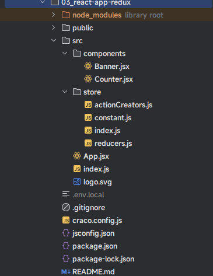

* 示例：
* 其中，index.js

```js {4-5,9,13}
import React from 'react'
import ReactDOM from 'react-dom/client'
import App from '@/App'
import store from "@/store"
import {Provider} from "react-redux"

const root = ReactDOM.createRoot(document.getElementById('root'))
root.render(
  <Provider store={store}>
    <React.StrictMode>
      <App/>
    </React.StrictMode>
  </Provider>
)
```

* 其中，store/constant.js

```js {6}
/* 该文件主要维护 Action 中 type 的名称 */
export const ADD_COUNTER = 'INCREMENT'

export const SUB_COUNTER = 'DECREMENT'

export const ADD_BANNER = 'ADD_BANNER'
```

* 其中，store/actionCreators.js

```js {28-31,36-44}
import * as ActionTypes from './constant'

/**
 * 添加计数器
 * @param payload
 * @returns {{payload, type: string}} 返回 Action
 */
export const addCountAction = (payload) => ({
  type: ActionTypes.ADD_COUNTER,
  payload
})

/**
 * 减少计数器
 * @param payload
 * @returns {{payload, type: string}} 返回 Action
 * */
export const subCountAction = (payload) => ({
  type: ActionTypes.SUB_COUNTER,
  payload
})

/**
 * 添加轮播图
 * @param payload
 * @returns {{payload, type: string}}
 */
export const addBannerAction = (payload) => ({
  type: ActionTypes.ADD_BANNER,
  payload
})

/**
 * 异步添加轮播图
 */
export const addAsyncBannerAction = () => {
  return (dispatch, getState) => {
    // 执行异步逻辑操作
    console.log('addAsyncBannerAction', getState())
    setTimeout(() => {
      dispatch(addBannerAction(["banner1", "banner2", "banner3", "banner4"]))
    }, 2000)
  }
}
```

* 其中，store/reducers.js

```js {27-31}
import * as ActionTypes from './constant'
// 初始化的 state
const initialState = {
  count: 0,
  banners: []
}
/**
 * 定义 reducer 纯函数
 * @param state 当前的 state
 * @param action 本次需要更新的 action
 * @return store 中存储的 state
 */
export const reducer = (state = initialState, action) => {
  switch (action.type) {
    case ActionTypes.ADD_COUNTER:
      const newRes = {
        ...state,
        count: state.count + action.payload
      }
      console.log('newRes', newRes)
      return newRes
    case ActionTypes.SUB_COUNTER:
      return {
        ...state,
        count: state.count - action.payload
      }
    case ActionTypes.ADD_BANNER:
      return {
        ...state,
        banners: action.payload
      }
    default: {
      return state
    }
  }
}
```

* 其中，store/index.js

```js {2,6}
import {applyMiddleware, createStore} from "redux"
import {thunk} from "redux-thunk"
import {reducer} from "@/store/reducers"

// 创建 Store 对象
const store = createStore(reducer, applyMiddleware(thunk))

export default store
```

* 其中，components/Counter.jsx

```jsx
import React, {PureComponent} from 'react'
import {connect} from 'react-redux'
import {addCountAction, subCountAction} from "@/store/actionCreators"

class Counter extends PureComponent {
  
  state = {
    message: '我是 Counter 组件',
  }
  
  render() {
    const {message} = this.state
    console.log('Counter props', this.props)
    const {count, add, sub} = this.props
    return (
      <div>
        <div className={"counter"}>
          <h2>{message}</h2>
          <h3>当前计数为：{count}</h3>
          <button onClick={() => add(1)}>点我+1</button>
          <button onClick={() => sub(1)}>点我-1</button>
        </div>
      </div>
    )
  }
}

// connect(fn1,fn2) 函数的返回值是高阶组件
// 其中， fn1 是将 state 映射到 props 上，通常命名为 mapStateToProps
// 其中，fn2 是将 dispatch 映射到 props 上，通常命名为 mapDispatchToProps

const mapStateToProps = (state) => ({
  count: state.count
})

const mapDispatchToProps = (dispatch) => ({
  add: (num) => dispatch(addCountAction(num)),
  sub: (num) => dispatch(subCountAction(num))
})

export default connect(mapStateToProps, mapDispatchToProps)(Counter)
```

* 其中，components/Banner.jsx

```jsx {32-35,46-48}
import React, {PureComponent} from 'react'
import {connect} from 'react-redux'
import {addAsyncBannerAction,} from "@/store/actionCreators"

class Banner extends PureComponent {
  
  state = {
    message: '我是 Banner 组件',
  }
  
  render() {
    const {message} = this.state
    console.log('Banner props', this.props)
    const {banners} = this.props
    return (
      <div>
        <div className={"banner"}>
          <h2>{message}</h2>
          <h3>轮播图的数据：</h3>
          <ul>
            {
              banners.map((item, index) => {
                return (<li key={index}>{item}</li>)
              })
            }
          </ul>
        </div>
      </div>
    )
  }
  
  componentDidMount() {
    const {addAsync} = this.props
    addAsync()
  }
}

// connect(fn1,fn2) 函数的返回值是高阶组件
// 其中， fn1 是将 state 映射到 props 上，通常命名为 mapStateToProps
// 其中，fn2 是将 dispatch 映射到 props 上，通常命名为 mapDispatchToProps

const mapStateToProps = (state) => ({
  banners: state.banners
})

const mapDispatchToProps = (dispatch) => ({
  addAsync: () => dispatch(addAsyncBannerAction())
})

export default connect(mapStateToProps, mapDispatchToProps)(Banner)
```

* 其中，App.jsx

```jsx {14}
import React, {PureComponent} from 'react'
import Counter from "@/components/Counter"
import Banner from "@/components/Banner"

class App extends PureComponent {
  
  render() {
    return (
      <div>
        <div style={{background: "pink", padding: '10px', width: '500px'}}>
          <Counter/>
        </div>
        <div style={{background: "skyblue", padding: '10px', width: '500px'}}>
          <Banner/>
        </div>
      </div>
    )
  }
}

export default App
```

### 4.4.4 调试 Redux

* 在实际开发中，我们可以使用 `Redux DevTools 拓展`来帮助我们调试 Redux ，`Redux DevTools 拓展`可以显示 Redux 存储中状态随时间变化的历史记录。
* 安装：

```shell
npm install @redux-devtools/extension
```

> 注意⚠️：需要配合浏览器插件，可以去 `Chrome 应用商店`安装 `redux-devtools` 、`React Developer Tools`、`React Context DevTool` 插件。

* 配置：

```js {3,6-8,11}
import {applyMiddleware, createStore} from "redux"
import {thunk} from "redux-thunk"
import {composeWithDevTools } from '@redux-devtools/extension'
import {reducer} from "@/store/reducers"

const composeEnhancers = composeWithDevTools({
    trace: true // 跟踪（堆栈）源码
});

// 创建 Store 对象
const store = createStore(reducer, composeEnhancers (applyMiddleware(thunk)))

export default store
```

* 演示：

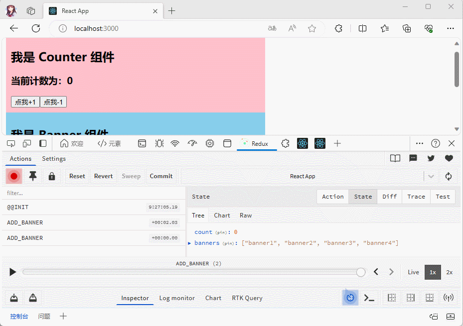

* 但是，在`生产环境`中是`禁止`使用这个工具的，只需要这么配置：

```js {3,6-8,11}
import {applyMiddleware, createStore} from "redux"
import {thunk} from "redux-thunk"
import {composeWithDevToolsDevelopmentOnly } from '@redux-devtools/extension'
import {reducer} from "@/store/reducers"

const composeEnhancers = composeWithDevToolsDevelopmentOnly({
    trace: true // 跟踪（堆栈）源码
});

// 创建 Store 对象
const store = createStore(reducer, composeEnhancers (applyMiddleware(thunk)))

export default store
```

## 4.5 redux 模块的拆分

### 4.5.1 概述

* 之前，我们将所有对于 redux 操作相关的代码都保存在 store 文件夹中：

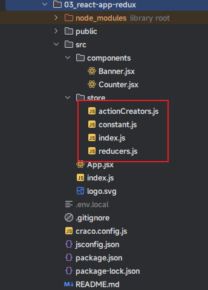

* 对于之前的案例而言，我们仅仅使用了两个组件，所有的对于 redux 的操作都保存在这些文件中没什么关系；但是，一旦项目中，组件越来越多，还是这么管理，就会显得非常臃肿，并且会难以维护，所以必须进行拆分。
* 那么，该怎么进行拆分呢？当然，是根据`组件`或`功能`等进行拆分。

> 注意⚠️：本人目前是按照`组件`进行拆分的。

* 其实，`redux` 给我们提供了 `combineReducers()` 函数可以很方便的让我们对 reducer 进行合并：
  * `combineReducers()` 需要我们插入一个对象，最终返回一个 `combination()` 函数；相当于之前我们的 reducer() 函数。
  * 但是，`combineReducers()` 提供的`键名称`决定了我们的`状态对象的键名`是什么！！！

* 解释下，原来在 store 中的值是：

```js
const initialState = {
  count : 0,  
  banners: []
}
```

* 对应的内存示意图是：


* 一旦，使用了 `combineReducers()` 函数合并，即：

```js
const combination = combineReducers({
  counter: counterReducer,
  banner: bannerReducer
})
```

* 对应的内存示意图是：

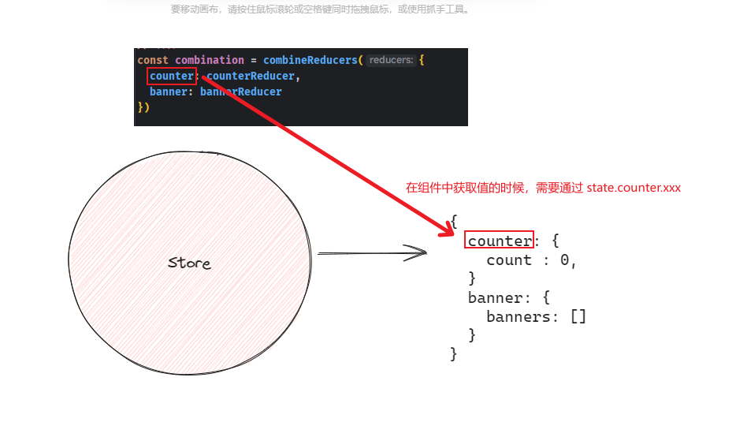

* 当然，`combineReducers` 函数的模拟实现，如下所示：

```js
function combineReducers(reducers) {
  // 返回一个新的 reducer 函数
  return function(state = {}, action) {
    // 创建一个新的状态对象
    const nextState = {};
    
    // 遍历传入的 reducers 对象
    for (let key in reducers) {
      // 获取当前 reducer
      const reducer = reducers[key];
      // 获取当前 key 对应的旧状态
      const prevStateForKey = state[key];
      // 调用当前 reducer，传入旧状态和 action，得到新的状态
      const nextStateForKey = reducer(prevStateForKey, action);
      // 将新的状态保存到新的状态对象中
      nextState[key] = nextStateForKey;
    }
    
    // 返回新的状态对象
    return nextState;
  };
}
```

### 4.5.2 案例

* 需求：进行 redux 模块拆分。


* 项目结构：

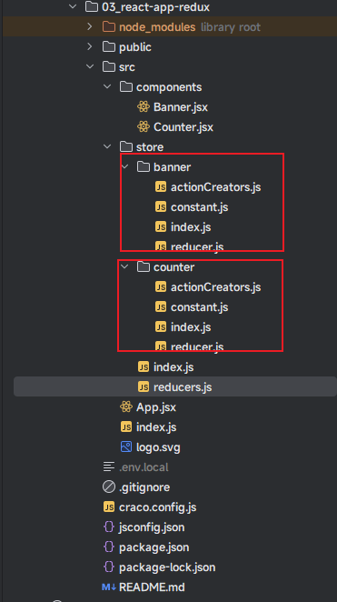

* 示例：
* 其中，index.js

```js {4-5,9-13}
import React from 'react'
import ReactDOM from 'react-dom/client'
import App from '@/App'
import store from "@/store"
import {Provider} from "react-redux"

const root = ReactDOM.createRoot(document.getElementById('root'))
root.render(
  <Provider store={store}>
    <React.StrictMode>
      <App/>
    </React.StrictMode>
  </Provider>
)
```

* 其中，App.jsx

```jsx {2-3,11,14}
import React, {PureComponent} from 'react'
import Counter from "@/components/Counter"
import Banner from "@/components/Banner"

class App extends PureComponent {
  
  render() {
    return (
      <div>
        <div style={{background: "pink", padding: '10px', width: '500px'}}>
          <Counter/>
        </div>
        <div style={{background: "skyblue", padding: '10px', width: '500px'}}>
          <Banner/>
        </div>
      </div>
    )
  }
}

export default App
```

* 其中，store/banner/constant.js

```js
/* 该文件主要维护 Action 中 type 的名称 */
export const ADD_BANNER = 'ADD_BANNER'
```

* 其中，store/banner/actionCreators.js

```js
import * as ActionTypes from './constant'

/**
 * 添加轮播图
 * @param payload
 * @returns {{payload, type: string}}
 */
export const addBannerAction = (payload) => ({
  type: ActionTypes.ADD_BANNER,
  payload
})

/**
 * 异步添加轮播图
 */
export const addAsyncBannerAction = () => {
  return (dispatch, getState) => {
    // 执行异步逻辑操作
    console.log('addAsyncBannerAction', getState())
    setTimeout(() => {
      dispatch(addBannerAction(["banner1", "banner2", "banner3", "banner4"]))
    }, 2000)
  }
}
```

* 其中，store/banner/reducer.js

```js {14}
import * as ActionTypes from './constant'

// 初始化的 state
const initialState = {
  banners: []
}

/**
 * 定义 reducer 纯函数
 * @param state 当前的 state.js
 * @param action 本次需要更新的 action
 * @return store 中存储的 state.js
 */
const reducer = (state = initialState, action) => {
  switch (action.type) {
    case ActionTypes.ADD_BANNER:
      return {
        ...state,
        banners: action.payload
      }
    default: {
      return state
    }
  }
}

export default reducer
```

* 其中，store/banner/index.js

```js {1,4}
import reducer from './reducer'

export * from './actionCreators'
export default reducer
```

* 其中，store/counter/constant.js

```js
/* 该文件主要维护 Action 中 type 的名称 */
export const ADD_COUNTER = 'INCREMENT'

export const SUB_COUNTER = 'DECREMENT'
```

* 其中，store/counter/actionCreators.js

```js
import * as ActionTypes from './constant'

/**
 * 添加计数器
 * @param payload
 * @returns {{payload, type: string}} 返回 Action
 */
export const addCountAction = (payload) => ({
  type: ActionTypes.ADD_COUNTER,
  payload
})

/**
 * 减少计数器
 * @param payload
 * @returns {{payload, type: string}} 返回 Action
 * */
export const subCountAction = (payload) => ({
  type: ActionTypes.SUB_COUNTER,
  payload
})
```

* 其中，store/counter/reducer.js

```js {12}
import * as ActionTypes from './constant'
// 初始化的 state
const initialState = {
  count: 0
}
/**
 * 定义 reducer 纯函数
 * @param state 当前的 state.js
 * @param action 本次需要更新的 action
 * @return store 中存储的 state.js
 */
const reducer = (state = initialState, action) => {
  switch (action.type) {
    case ActionTypes.ADD_COUNTER:
      const newRes = {
        ...state,
        count: state.count + action.payload
      }
      console.log('newRes', newRes)
      return newRes
    case ActionTypes.SUB_COUNTER:
      return {
        ...state,
        count: state.count - action.payload
      }
    default: {
      return state
    }
  }
}

export default reducer
```

* 其中，store/counter/index.js

```js {1,4}
import reducer from './reducer'

export * from './actionCreators'
export default reducer
```

* 其中，store/reducers.js

```js {6-9}
import bannerReducer from "@/store/banner"
import counterReducer from "@/store/counter"
import {combineReducers} from "redux";

// 合并 reducer
const combination = combineReducers({
  counter: counterReducer,
  banner: bannerReducer
})

export default combination
```

* 其中，store/index.js

```js {4,11}
import {applyMiddleware, createStore} from "redux"
import {thunk} from "redux-thunk"
import {composeWithDevToolsDevelopmentOnly} from '@redux-devtools/extension'
import combination from "@/store/reducers"

const composeEnhancers = composeWithDevToolsDevelopmentOnly({
    trace: true // 跟踪源码
});

// 创建 Store 对象
const store = createStore(combination, composeEnhancers(applyMiddleware(thunk)))

export default store
```

* 其中，components/Banner.jsx

```jsx {43}
import React, {PureComponent} from 'react'
import {connect} from 'react-redux'
import {addAsyncBannerAction} from "@/store/banner"

class Banner extends PureComponent {
  
  state = {
    message: '我是 Banner 组件',
  }
  
  render() {
    const {message} = this.state
    console.log('Banner props', this.props)
    const {banners} = this.props
    return (
      <div>
        <div className={"banner"}>
          <h2>{message}</h2>
          <h3>轮播图的数据：</h3>
          <ul>
            {
              banners.map((item, index) => {
                return (<li key={index}>{item}</li>)
              })
            }
          </ul>
        </div>
      </div>
    )
  }
  
  componentDidMount() {
    const {addAsync} = this.props
    addAsync()
  }
}

// connect(fn1,fn2) 函数的返回值是高阶组件
// 其中，fn1 是将 state 映射到 props 上，通常命名为 mapStateToProps
// 其中，fn2 是将 dispatch 映射到 props 上，通常命名为 mapDispatchToProps

const mapStateToProps = (state) => ({
  banners: state.banner.banners // 注意：此处是通过 state.banner.banners 获取数据了
})

const mapDispatchToProps = (dispatch) => ({
  addAsync: () => dispatch(addAsyncBannerAction())
})

export default connect(mapStateToProps, mapDispatchToProps)(Banner)
```

* 其中，components/Counter.jsx

```jsx {33}
import React, {PureComponent} from 'react'
import {connect} from 'react-redux'
import {addCountAction, subCountAction} from "@/store/counter"

class Counter extends PureComponent {
  
  state = {
    message: '我是 Counter 组件',
  }
  
  render() {
    const {message} = this.state
    console.log('Counter props', this.props)
    const {count, add, sub} = this.props
    return (
      <div>
        <div className={"counter"}>
          <h2>{message}</h2>
          <h3>当前计数为：{count}</h3>
          <button onClick={() => add(1)}>点我+1</button>
          <button onClick={() => sub(1)}>点我-1</button>
        </div>
      </div>
    )
  }
}

// connect(fn1,fn2) 函数的返回值是高阶组件
// 其中，fn1 是将 state 映射到 props 上，通常命名为 mapStateToProps
// 其中，fn2 是将 dispatch 映射到 props 上，通常命名为 mapDispatchToProps

const mapStateToProps = (state) => ({
  count: state.counter.count // 注意：此处是通过 state.counter.count 获取数据了
})

const mapDispatchToProps = (dispatch) => ({
  add: (num) => dispatch(addCountAction(num)),
  sub: (num) => dispatch(subCountAction(num))
})

export default connect(mapStateToProps, mapDispatchToProps)(Counter)
```

* 通过`Redux DevTools 拓展`进行验证：

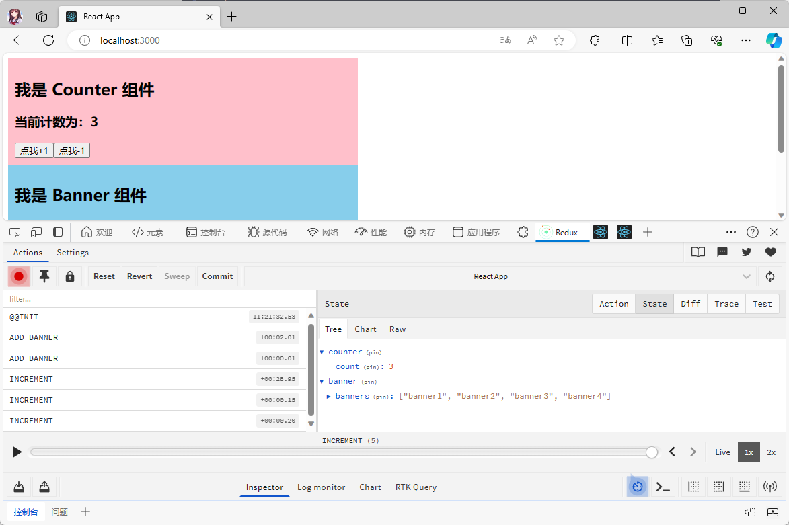
